.. _aethetic-quality:

.. |openfold| image:: ./shared_images/openfolder.png
              :alt: open
	      :align: middle 

.. |addbutt| image:: ./shared_images/addbutt.png
             :alt: add
	     :align: middle 
	     :height: 15px

.. |okbutt| image:: ./shared_images/okbutt.png
            :alt: OK
	    :align: middle 

.. |adddata| image:: ./shared_images/adddata.png
             :alt: add
	     :align: middle 

*****************
Aesthetic Quality
*****************

Summary
=======
 
The natural and scenic views of marine and coastal seascapes can contribute to the well-being of local communities in a number of ways. Scenic amenities play an important role in augmenting local economies by attracting visitors who support local businesses. The value of local property partially depends on attributes of its location and scenic views often increase local property values (Sanders and Polasky 2009, Bourassa et al. 2004, Benson et al. 2004). Local communities and their residents often become strongly attached to views and show fervent opposition to new development that has the potential to threaten the integrity of existing views and diminish the benefits drawn from those views (Ladenburg and Dubgaard 2009, Haggett 2011). The InVEST aesthetic views model allows users to determine the locations from which new nearshore or offshore features can be seen, and compute the costs associated with offshore visual impacts. It generates viewshed maps that reflect the economic impact of the visual footprint caused by new offshore development. Inputs to the viewshed model include: topography and bathymetry, locations of offshore facilities of interest, the locations of viewers (e.g. population centers or areas of interest such as parks or trails), and a few parameters used for economic valuation. The model can quantify economic impacts of altering the viewshed. A key limitation of the model is that it does not currently account for the ways in which vegetation or land-based infrastructure may constrain land areas that are visually affected by offshore development. This is a "Tier 0" model.

Introduction
============

Coastal ecosystems are increasingly dominated by human activities. This rise in human activities can compromise the unique scenic qualities associated with coastal and marine areas. The coastline and 'seascape' is an important economic asset that attracts visitors for tourism and recreation and contributes to the general quality of life for people living near the coast. Near and offshore development projects often raise considerable concern within the local communities that value the natural seascape for its inherent beauty. Visual impacts are external effects that unless measured and accounted for, do not factor into the calculus of weighing the costs and benefits of new coastal development. Applications using viewshed analysis range from the siting of aquaculture facilities to minimize spatial competition with tourism activities (Perez 2003) to seascape and shoreline visibility assessment of offshore wind projects (Environmental Design and Research 2006). Because scenic beauty is an attribute generally considered to be important to people living near the coast and for those who visit coastal areas to enjoy the ocean and the marine environment, coastal planners can incorporate measures of visual amenities and/or disamenities into broader policy deliberations and planning exercises. Because most applications of viewshed analysis involve examining the negative impacts of new facilities, language within the InVEST aesthetic quality model assumes the objects viewed have a negative impact on views. However, positive interpretation of viewing these objects can be included with interpretation of model results. 

The InVEST aesthetic quality model provides users with a simple way to provide information about potential tradeoffs between nearshore and offshore development proposals and the visual impacts of those projects. The viewshed maps produced by the model can be used to identify coastal areas that are most likely to be directly affected by additions to the seascape. They can serve as valuable input into broader analyses that consider a range of services provided by the marine environment.

Although this model does not compute the costs associated with offshore visual impacts, these costs are likely to decrease as the location of facilities moves further offshore, while the costs of installing and operating offshore facilities generally increase with distance from the shoreline. The few valuation studies that explore the economic magnitude of visual disamenities resulting from offshore development projects show a complex picture. One recent study found that individuals living along the coast have external costs ranging from $27 to $80 resulting from the visual disamenity of an offshore wind project (Krueger et al. 2010). In contrast, Firestone et al. (2009) found that public acceptance for offshore renewable energy projects is growing and may be less contentious than previously anticipated.

The model
=========

The aesthetic quality model provides information about the visibility of offshore objects from the surrounding landscape or seascape. Offshore and nearshore development projects, such as renewable wave energy facilities or aquaculture facilities, have the potential to impact the visual amenities that are an important feature of many coastal areas. The results of viewshed analysis will be useful for decision-makers who would like to identify areas where visual impacts may be an important factor to incorporate into planning. 

The model requires users to provide a DEM and a point shapefile that identifies the locations of sites that contribute to visual impacts. The viewshed analysis is then computed over a user-defined area of interest (AOI) using the ArcGIS viewshed tool. 

The model will create as many as four outputs that can be used to assess the visible impact of any type of facility added to the marine environment. The first output, "vshed", is a visual quality raster that records the number of sites (e.g. wave energy facilities or aquaculture farms) that are visible from a given raster cell on the land or seascape. These counts are then classify using quantiles to produce "vshed_qual" with the following class breaks:  1. Unaffected, 2. Low Visual Impact/High Visual Quality, 3. Moderate Visual Impact/Medium Visual Quality, 4. High Visual Impact/Low Visual Quality, 5. Very High Visual Impact/Poor Visual Quality.

The third output computes the resident population that falls within the viewshed of any facility. The model uses the Global Rural-Urban Mapping Project (GRUMP) gridded population of the world data (CIESIN 2004) to compute the number of residents who are unaffected by the facility (or facilities) and the number of residents who live in areas that fall within the viewshed of at least one facility. The population counts are tabulated in the "populationStats.html" file found in the output folder. Users should note that this globally available population data does not account for seasonal or daily users in an area. Alternatively, you can provide your own population raster data (note that it must have the WGS84 datum).

The final optional output allows for the examination of the visual impacts on areas of interest where the view is of particular concern (e.g. parks, trails, marine reserves). It utilizes a user-defined set of polygons and computes the percent area within each polygon from which at least one offshore site is visible. Each polygon is then classified by the percentage of that polygon’s area that is visually impacted by offshore developments. These results can be used to identify and rank areas according to visual impacts. 

How it works
------------
The InVEST aesthetic quality model is a set of wrap-around functions that employs ArcGIS’s viewshed tool. ArcGIS’s viewshed tool implements line of sight computations; the algorithm used by the tool is proprietary to ESRI and there is little documentation of the algorithm details. Users who are interested in further details should consult the ArcGIS online documentation. 

Limitations and simplifications
===============================

The global DEM included with the aesthetic quality model does not account for trees, buildings, or other structures that can obscure the view. If users have a raster layer that represents the locations of trees, buildings, or other obstructions (and their heights) this information can be incorporated into the DEM to create a more realistic surface to obscure or allow views. The model does account for the curvature of the earth in limiting the line of sight but it does not limit the distance at which objects of varying size and quality may be visible to the human eye in the default settings. As long as there is a straight-line vector that can be computed from a particular DEM grid cells to any offshore point, that grid cell will be counted as visible. This should be carefully considered when interpreting viewshed impact maps from facilities located far offshore when default settings are used. However, users can provide an outer radius that limits the search distance when identifying areas visible from each offshore development site. 

.. _ae-data-needs:

Data needs
==========

The model uses an interface to input all required and optional model data. Here we outline the options presented to the user via the interface and the maps and data tables used by the model. See the :ref:`FAQ` for detailed information on data sources and pre-processing.

Required inputs
---------------

First we describe required inputs. The required inputs are the minimum data needed to run this model. The minimum input data allows the model to run without conducting polygon overlap analysis.

1. **Workspace (required).**  Users are required to specify a workspace folder path. It is recommend that the user create a new folder for each run of the model. For example, by creating a folder called "runBC" within the "AestheticQuality" folder, the model will create "intermediate" and "output" folders within this "runBC" workspace. The "intermediate" folder will compartmentalize data from intermediate processes. The model’s final outputs will be stored in the "output" folder. ::

     Name: Path to a workspace folder. Avoid spaces. 
     Sample path: \InVEST\AestheticQuality\runBC

2. **Area of Interest (AOI) (required).**  An AOI instructs the model where to clip the input data and the extent of analysis. Users will create a polygon feature layer that defines their area of interest. The AOI must intersect the Digital Elevation Model (DEM). Additionally, the datum of this input must be WGS84.  At the start, the model will check the AOI's datum, that it is a polygon feature and if it overlaps with the DEM input. If not, it will stop and provide feedback. ::

     Names: File can be named anything, but no spaces in the name
     File type: polygon shapefile (.shp)
     Sample path: \InVEST\AestheticQuality\AOI_WCVI.shp

3. **Point Features Impacting Aesthetic Quality (required).**  The user must specify a point feature layer that indicates locations of objects that contribute to negative aesthetic quality, such as aquaculture netpens or wave energy facilities. Users wish to including polygons (e.g. clear-cuts) in their analysis must convert the polygons to a grid of evenly spaced points. In order for the viewshed analysis to run correctly, the projection of this input must be consistent with the project of the DEM (input #4).  At the start, the model will check that inputs #3 and #4 have consistent projections. If not, it will stop and provide feedback. For instructions on how to create a point shapefile, see the InVEST :ref:`FAQ`. ::

     Names: File can be named anything, but no spaces in the name
     File type: point shapefile (.shp)
     Sample path: \InVEST\AestheticQuality\AquaWEM_points.shp

4. **Digital Elevation Model (DEM) (required).**  A global raster layer is required to conduct viewshed analysis. Elevation data allows the model to determine areas within the AOI’s land-seascape where features from input #3 are visible. ::

     Name: File can be named anything, but no spaces in the name and less than 13  characters
     Format: standard GIS raster file (e.g., ESRI GRID or IMG), with elevation values
     Sample data set: \InVEST\AestheticQuality\Base_Data\Marine\DEMs\claybark_dem

5. **Refractivity Coefficient (required).**  The earth curvature correction option corrects for the curvature of the earth and refraction of visible light in air. Changes in air density curve the light downward causing an observer to see further and the earth to appear less curved. While the magnitude of this effect varies with atmospheric conditions, a standard rule of thumb is that refraction of visible light reduces the apparent curvature of the earth by one-seventh. By default, this model corrects for the curvature of the earth and sets the refractivity coefficient to 0.13. ::

     Names: A string of numeric text with a value between 0 and 1 
     File type: text string (direct input to the ArcGIS interface)
     Sample (default): 0.13

Optional inputs
---------------

The next series of inputs are optional, but may be required depending on other decision inputs.

6. **Cell Size (meters) (optional).**  This determines the spatial resolution at which the model runs and at which the results are summarized. For example, if you want to run the model and see results at a 100m x 100m grid cell scale then enter "100." You can only define a resolution that is equal to or coarser than the model’s native resolution as established by the current DEM (input # 4). If you want to run the model and produce output at the current DEM’s resolution (the model’s native resolution) you can leave this input field blank. The coarser the scale (and larger the number), the faster the model runs. ::

     Names: A numeric text string (positive integer)
     File type: text string (direct input to the ArcGIS interface)
     Sample (default): 500

7. **Global Population Raster (required).**  A global raster layer is required to determine population within the AOI’s land-seascape where features from input #3 are visible and not visible. ::

     Name: File can be named anything, but no spaces in the name and less than 13  characters
     Format: standard GIS raster file (ESRI GRID) with population values
     Sample data set (default): \InVEST\Base_Data\Marine\Population\global_pop

8. **Polygon Features for Overlap Analysis (optional).**  The user has the option of providing a polygon feature layer where they would like to determine the impact of points (input #3) on visual quality. This input must be a polygon and projected in meters. The model will use this layer to determine what percent of the total area of each feature can see at least one of the points from input #3. ::

     Names: File can be named anything, but no spaces in the name
     File type: polygon shapefile (.shp)
     Sample path: \InVEST\AestheticQuality\BC_parks.shp

Running the model
=================

.. note:: The word '*path*' means to navigate or drill down into a folder structure using the Open Folder dialog window that is used to select GIS layers or Excel worksheets for model input data or parameters. 

Exploring the workspace and input folders
-----------------------------------------

These folders will hold all input, intermediate and output data for the model. As with all folders for ArcGIS, these folder names must not contain any spaces or symbols. See the sample data for an example.

Exploring a project workspace and input data folder  
^^^^^^^^^^^^^^^^^^^^^^^^^^^^^^^^^^^^^^^^^^^^^^^^^^^
The *\\InVEST\\AestheticQuality* folder holds the main working folder for the model and all other associated folders. Within the *AestheticQuality* folder there will be a subfolder named '*Input*'. This folder holds most of the GIS and tabular data needed to setup and run the model. 

The following image shows the sample folder structure and accompanying GIS data. We recommend using this folder structure as a guide to organize your workspaces and data. Refer to the following screenshots below for examples of folder structure and data organization.

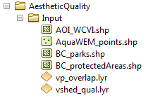

Creating a run of the model
---------------------------

The following example of setting up the Aesthetic Quality model uses the sample data and folder structure supplied with the InVEST installation package (see the :ref:`ae-data-needs` section for a more complete description of the data). These instructions only provide a guideline on how to specify to ArcGIS the various types of data needed and does not represent any site-specific model parameters. Users might choose different input parameters and/or have location-specific data to use in place of the sample data.

1. Click the plus symbol next to the InVEST toolbox.

.. figure:: ./shared_images/investtoolbox.png
   :align: center
   :figwidth: 300px

2. Expand the Marine toolset and click on the Aesthetic Quality script to open the model. 

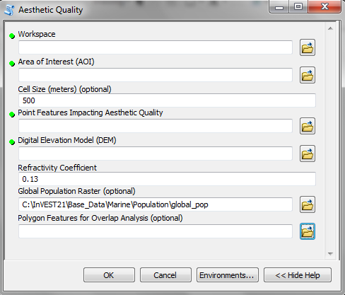

3. Specify the Workspace. Open |openfold| the *InVEST* workspace. If you created your own workspace folder (Step 1), then select it here.

   Select the *AestheticQuality* folder and click |addbutt| to set the main model workspace. This is the folder in which you will find the intermediate and final outputs when the model is run. 

4. Specify the Area of Interest (AOI). The AOI is the geographic area over which the model will be run. This example refers to the *AOI_WCVI.shp* shapefile supplied in the sample data. You can create an AOI shapefile by following the Creating an AOI instructions in the :ref:`FAQ`. 

   Open |openfold| the *\\InVEST\\AestheticQuality\\Input* data folder.
 
    If you created your own Input folder in step 1b, then select it here. Select the AOI shapefile and click |addbutt| to make the selection. 

5. Specify the Cell Size. This option determines the cell size for the output viewshed raster. The default is "500", meaning the model will run at the 500m resolution utilizing the input DEM. You can type directly into the text box to specify a different value.

6. Specify the Point Features Impacting Aesthetic Quality. This vector dataset represents points that have undesirable effects on aesthetic viewing quality. 

   Open |openfold| the *Input* data folder *\\InVEST\\AestheticQuality\\Input* and click |addbutt| the AquaWEM_points.shp shapefile.

7. Specify the Digital Elevation Model. The digital elevation model provides the base upon *InVEST\\Base_Data\\Marine\\DEMs* folder, select the *claybark_dem* raster and click |addbutt|.  

8. Specify the Refractivity Coefficient. The model requires a refractivity coefficient. The default value is value 0.13. You can type directly into the text box to specify a different value. 

9. Specify Global Population Raster. This dataset represents raster cells of population and is required for the viewshed analysis. Open |openfold| the *\\InVEST\\Base_Data\\Marine\\Population* folder and click |addbutt| the *global_pop* raster.

10. Specify Polygon Features for Overlap Analysis (Optional). This vector dataset represents polygon areas to be considered for the viewshed analysis. Open |openfold| the *\\InVEST\\AestheticQuality\\Input* data folder and add the *BC_parks.shp* shapefile.
 
11. At this point the model dialog box is completed for a complete run of the Aesthetic Quality model. 

    Click |okbutt| to start the model. The model will begin to run and a show a progress window with progress information about each step in the analysis. Once the model finishes, the progress window will show all the completed steps and the amount of time necessary for the model run. 

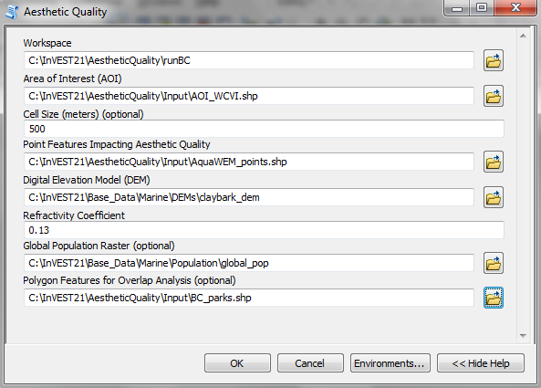

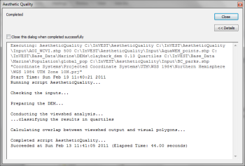

Multiple runs of the model
--------------------------

The model setup is the same as for a single run, but the user needs to specify a new workspace for each new run. Make sure each new workspace exists under the main model workspace folder (i.e. *AestheticQuality* folder in the example above). As long as all data are contained within the main Input data folder you can use the same Input folder for multiple runs. For example, using the sample data, if you wanted to create two runs of the Aesthetic Quality model based on two different visual polygon shapefiles (BC_parks.shp and BC_protectedAreas.shp), you could use the Input data folder under main *AestheticQuality* folder and create two new workspace folders, BC_parks and BC_protectedAreas. See below for an example of the folder setup. 

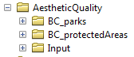

Viewing output from the model
-----------------------------

Upon successful completion of the model, you will see new folders in your Workspace called  "intermediate" and "Output". The Output folder, in particular, may contain several types of spatial data, which are described the :ref:`ae-interpreting-results` section.

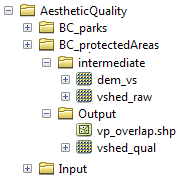

You can view the output spatial data in ArcMap using the Add Data button |adddata|.

You can change the symbology of a layer by right-clicking on the layer name in the table of contents, selecting "Properties", and then "Symbology". There are many options here to change the way the data appear in the map.

You can also view the attribute data of output files by right clicking on a layer and selecting "Open Attribute Table". 

.. _ae-interpreting-results:

Interpreting results
====================

Model outputs
-------------

The following is a short description of each of the outputs from the aesthetic views model. Each of these output files is saved in the "Output" folder that is saved within the user-specified workspace directory:

Output folder
^^^^^^^^^^^^^
+ Output\\vshed_qual

  + This raster layer contains a field that classifies based on quartiles the visual quality within the AOI. The visual quality classes include:  unaffected (no visual impact), high (low visual impact), medium (moderate visual impact), low (high visual impact), and very low (very high visual impact).

  + Additionally, the range of sites visible for each visual quality class is specified in this output's attribute table.

  + This layer can be symbolized by importing the symbology from the file "\\AestheticQuality\\Input\\vshed_qual.lyr"

+ Output\\vshed

  + This raster layer is the original output after the viewshed tool is run. It contains values ranging from 0 to the total number of points visible from each cell on the land or seascape. For example, all cells with a value of "4" would indicate that at that location four points are visible.

  + In order to compare scenario runs, use this layer rather than vshed_qual. By calculating the difference between "vshed" outputs from multiple runs, a user can assess changes in visual quality across scenarios.

+ Output\\vp_overlap.shp

  + This polygon feature layer contains a field called "AreaVShed" which expresses the percentage of area within each polygon where at least one point contributing to negative aesthetic quality is visible as compared to the total area of that polygon. 

  + This layer can easily be symbolized by importing the symbology from the file "\\AestheticQuality\\Input\\vp_overlap.lyr"

+ Output\\populationStats_[date and time].html

  + This html file includes a table and indicates the approximate number of people within the AOI that are 1) unaffected (no sites contributing to negative aesthetic quality are visible) and 2) affected (one or more sites visible).

+ Parameters_[yr-mon-day-min-sec].txt

  + Each time the model is run a text file will appear in the workspace folder. The file will list the parameter values for that run and be named according to the date and time.

Intermediate folder
^^^^^^^^^^^^^^^^^^^
+ intermediate\\dem_vs

  + This raster layer is the modified DEM within the user-specified extent. The portions of the DEM that are below sea-level are converted to a value of "0" since all viewing on the ocean will be at the surface.

Case example illustrating results
=================================

The following example illustrates the aesthetic views model. In this example, we examine the visual footprint resulting from potential wave energy facilities and aquaculture farms. The following figures and maps are for example only, and are not necessarily an accurate depiction of WCVI. In the first figure, we show the locations of the sites of potential wave energy facilities and aquaculture farms.

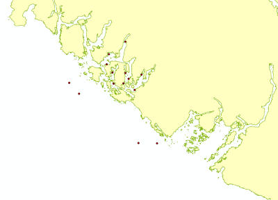

In this example, there are four offshore wave energy facilities and ten aquaculture facilities. We then run the aesthetic views model to determine the visual footprint of these potential facilities. To run the model, we first create an area of interest polygon that encompasses all of the site locations and the portion of the sea and landscape that we are interested in evaluating. We then apply an upper bound of 8 km on the search radius. This limits the search distance to 8 km when identifying areas that are visible from each observation point. This upper bound is applied by adding the field RADIUS2 to the shapefile specifying the point features contributing to negative aesthetic quality. To limit the search to 8 km, each point is assigned a value of -8000 as shown in the following figure. 

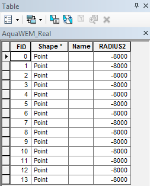

After completing the steps outlined in the "Running the model" section, we obtain the following map that classifies the visual impacts of these sites.

Classification of visual quality
--------------------------------

The resulting map shows the footprint of visual quality from offshore wave energy sites and the aquaculture facilities.  The cells highlighted in red are the areas with the highest visual impact; the cells highlighted in green have the lowest visual impact. The grey cells have no visual impact. It is clear from the visual quality map that most offshore areas experience low visual impacts from the wave energy facilities, whereas areas surrounding the clustered aquaculture facilities experience the highest visual impacts. Please be aware that the quality of the viewshed model results depends on the quality of the DEM used in the analysis. Fine resolution DEMs that account for trees, buildings, and other obstructions will give the most realistic results.

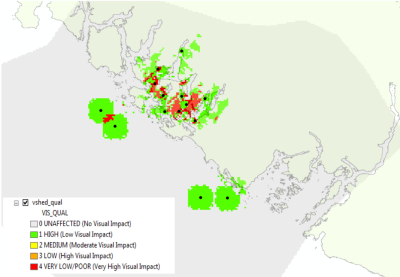

Resident population impacted by visual disamenities
---------------------------------------------------

In addition to producing a map of the visual footprint of objects located offshore, the aesthetic quality model also provides a count of the resident population that falls within this visual footprint. The viewshed model uses the Gridded Rural-Urban Population Model Project (GRUMP) dataset to extract the population counts within grid cells that are visible from any of the offshore sites. These counts are then tabulated and documented in the "PopulationStats.html" file found in the output folder. For this example, the number of residents unaffected by the offshore sites is 8554

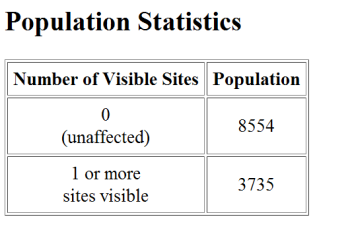

and the population count that falls within grid cells that can see at least one offshore site is 3735. Users again should be reminded that the GRUMP dataset is based on site-specific census data and may not accurately reflect the actual population that uses a particular area. This is particularly true for areas important for tourism and other seasonal activities that census data will not account for.

Viewshed overlap with protected areas
-------------------------------------

The final optional output of the aesthetic quality tool uses a set of user-specified polygons and computes the percent area within each polygon from which at least one offshore site is visible. To illustrate these results, we use a set of polygons that represent protected areas in the same study area explored above.

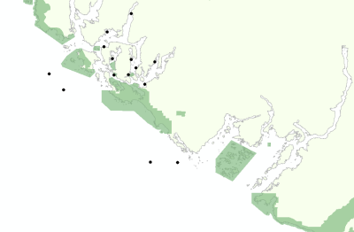

The protected areas are shown in the above figure as green polygons and the points represent the location of the offshore wave energy facilities and aquaculture sites. For each protected area in the user-specified area of interest, the model then computes the percentage of each protected area that falls within the viewshed of the wave energy and aquaculture sites. The figure below shows the results for a selection of the protected areas included in the example.

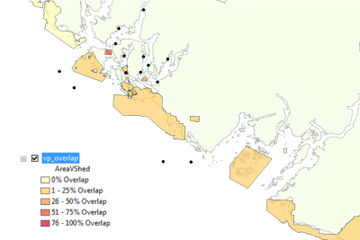

From this example, we see that for most of the protected areas, 1-25% of their total area falls within the viewshed footprint of the wave energy and aquaculture sites. For one of the smaller protected areas, 51-75% of its area falls within the viewshed footprint. These results are not spatially explicit at a fine scale because they do not indicate the exact locations from which one could see the facilities. However, these locations can be identified from the previous aesthetic quality results.

References
==========

Benson E., Hansen, J.,  Schwartz, A., and Smersh, G., 1998. Pricing residential amenities: the value of a view. Journal of Real Estate Research, 16: 55-73.

Bourassa, S., Hoesli, M. and Sun, J. 2004. What’s in a view? Environment and Planning A. 36(8): 1427-1450.

Center for International Earth Science Information Network (CIESIN), Columbia University; International Food Policy Research Institute (IFPRI); The World Bank; and Centro Internacional de Agricultura Tropical (CIAT). 2004. Global Rural-Urban Mapping Project (GRUMP), Alpha Version: Population Grids. Palisades, NY: Socioeconomic Data and Applications Center (SEDAC), Columbia University. Available at http://sedac.ciesin.columbia.edu/gpw. (downloaded on 1/6/2011).

Environmental Design and Research, P.C. 2006. Seascape and shoreline visibility assessment. Cape Wind Energy Project. Cape Cod, Martha’s Vineyard, and Nantucket, Massachusetts. Prepared for Cape Wind Associates, L.L.C. Boston, Mass. Syracuse, N.Y. July 2006.

Firestone, J., Kempton, W. & Krueger, A., 2009. Public acceptance of offshore wind power projects in the USA. Wind Energy, 12(2):183-202. 

Haggett, C. 2011. Understanding public responses to offshore wind power. Energy Policy. 39: 503-510.

Krueger, A., Parson, G., and Firestone, J., 2010. Valuing the visual disamenity of offshore wind power at varying distances from the shore: An application of on the Delaware shoreline. Working paper. Available at: http://works.bepress.com/george_parsons/doctype.html.

Ladenburg, J. & Dubgaard, A., 2009. Preferences of coastal zone user groups regarding the siting of offshore wind farms. Ocean & Coastal Management, 52(5): 233-242. 

Perez, O.M., Telfer, T.C. & Ross, L.G., 2005. Geographical information systems-based models for offshore floating marine fish cage aquaculture site selection in Tenerife, Canary Islands. Aquaculture Research, 36(10):946-961. 

Sander, H.A. & Polasky, S., 2009. The value of views and open space: Estimates from a hedonic pricing model for Ramsey County, Minnesota, USA. Land Use Policy, 26(3):837-845. 

