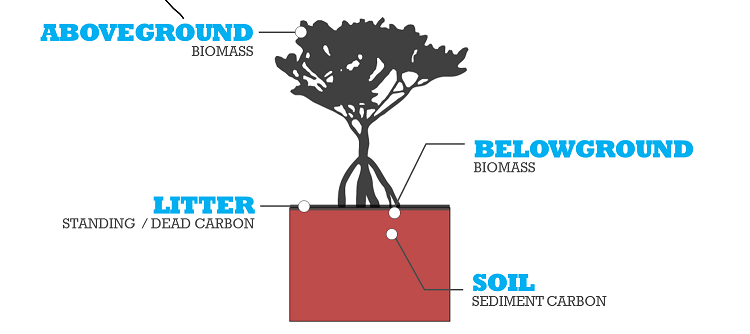

.. _blue-carbon:

***********
Blue Carbon
***********

Summary
=======
 
Marine and terrestrial ecosystems help regulate Earth's climate by adding and removing greenhouse gases (GHGs) such as carbon dioxide (CO\ :sub:`2`) from the atmosphere.  Coastal marine plants, mangroves and seagrasses in particular, store large amounts of carbon in their sediments, leaves and other biomass. By storing carbon, marine ecosystems keep CO\ :sub:`2` out of the atmosphere, where it would otherwise contribute to climate change.  In addition to storing carbon, marine ecosystems continually accumulate carbon in their sediments, creating large reservoirs of long-term sequestered carbon. Management activities that change the cover of coastal vegetation, such as seagrass restoration or mangrove clearing, can change carbon storage and the potential for carbon sequestration on a seascape.  With estimates of the social value, or where available, market value of carbon, the InVEST blue carbon model quantifies the marginal value of storage and sequestration services by comparing change in stock and accumulation of carbon between current and future scenarios.  In addition to comparisons between scenarios, the InVEST blue carbon model can be used to identify locations within the landscape where degradation of coastal ecosystems should be avoided in order to maintain carbon storage and sequestration services and values.  This is a "Tier 1" model.

Introduction
============

This model combines estimates of the social value of carbon with information about 1) the distribution and abundance of coastal vegetation, 2) habitat-specific carbon stock data and 3) accumulation rates to estimate carbon storage, sequestration and value across a landscape. To quantify the value of carbon storage and sequestration, the model focuses on changes in atmospheric carbon dioxide and other greenhouse gases as a result of changes caused by human activities that can affect marine ecosystems which store and sequester carbon.  Carbon-induced changes in the atmosphere have wide-ranging effects on natural systems and can thus result in changes in agricultural productivity, air quality, sea level, and more. The InVEST blue carbon model incorporates information about changes in the storage and sequestration capacity of the marine vegetation with economic factors into a single model which can estimate the value of incremental changes.

The model
=========
Modeling considerations
-----------------------
Mapping and modeling changes in carbon storage and sequestration for coastal and marine habitats can present challenges.  The types of spatial inputs and information about the carbon cycle often vary by site.  Some locations may have data readily available for detailed analysis while other locations may not have the information necessary to model changes in the position and function of coastal habitats.  Salt marsh, for example, is often studied in the context of migration from rising seas.  The combination of natural (e.g. rising seas) and anthropogenic (e.g. saltmarsh migration blocked by roads) factors should be included in scenario maps and subsequent carbon modeling when possible.  When exploring future land cover scenarios, land cover map outputs from the SLAMM model (Sea Level Affecting Marshes Model) developed by Warren Pinnacle can be useful inputs to the InVEST blue carbon model (Clougheet et al. 2010).  However, because not all sites have the detailed elevation and habitat information required to run SLAMM, we have built a flexible approach that allows users to provide either detailed land use/land cover maps or qualitative risk maps of coastal and marine vegetation.

.. Clougheet et al. (2010) is not cited in the references

How it works
------------
The InVEST blue carbon model combines information about the distribution and abundance of coastal vegetation with habitat specific carbon stock data and accumulation rates to estimate carbon storage, sequestration and value across a landscape.  The model simplifies the carbon storage and sequestration process to account for storage in four main pools (aboveground biomass, belowground biomass, standing dead carbon and sediment carbon, see Figure 1).  Accumulation of carbon in coastal habitats occurs primarily in sediments (Pendleton et et al., 2012).  The model requires users to provide maps of coastal ecosystems that store carbon, such as mangroves and seagrasses.  Users must also provide data on the amount of carbon stored in the four carbon pools and the rate of annual carbon accumulation in the sediments. If local information is not available, users can draw on the global database of values for carbon stocks and accumulation rates sourced from the peer-reviewed literature that is included in the model.  If data from field studies or other local sources are available, these values should be used instead of those in the global database.  The model uses vegetation maps from alternative scenarios, which represent changes in human use patterns in coastal areas or changes in sea level, to estimate the amount of carbon lost or gained over a specified period of time.  The model quantifies carbon storage across the landscape by summing the carbon stored in the biomass and sediment pools and multiplying by the area of habitat under any given human use scenario. 

Figure 1. Conceptual model of carbon sequestration and storage in marine ecosystems (Adapted from Bouillon et al. 2008)

A.  Carbon storage
^^^^^^^^^^^^^^^^^^
The carbon stored in a grid cell :math:`x` at time :math:`t`, given by :math:`C_xt` and measured in tons of CO\ :sub:`2` equivalent, is equal to the sum of the carbon stored in each pool in the grid cell at any time (:math:`t`),

.. math:: C_{xt} = {\sum^{J}_{j=1}}A_{xjt}(C_{aj} + C_{bj} + (C_{sj} * d{j}) + C_{lj})

where :math:`A_{xjt}` is the area of vegetation :math:`j` in grid cell :math:`x` at time :math:`t`. :math:`j= 1, 2, ...J` indexes all the habitat types in a coastal area. :math:`d` is the depth of the sediment for habitat :math:`j`. :math:`C_{aj}`, :math:`C_{bj}`, :math:`C_{sj}`, :math:`C_{lj}` indicate the metric tons of CO\ :sub:`2` equivalent stored per hectare in the aboveground, belowground, soil and litter pools of habitat :math:`j` respectively. If the user does not have sediment depth information, the model uses a default value of 1 meter depth, a widely used value for estimating carbon stocks. Vegetation type can simply indicate the dominant vegetation type (e.g., eelgrass, mangrove etc), or it can include details that affect pool storage values such as plant species, vegetation density, temperature regime, or vegetation age (e.g., time since restoration or last major disturbance).
 
For the sake of the carbon storage estimation, each vegetation type is assumed to be in storage equilibrium at any point in time (accumulation of carbon will be accounted for in the sequestration component of the model). 
 
If data is lacking, the model can be used with any subset of the four carbon pools. To determine the tonnes of CO\ :sub:`2` equivalent stored across the whole seascape at time t, we sum all grid cell carbon storage values.

.. math:: S_{xt} = H_{xt} + M_{xt}

.. math:: H_{xt} = A_{x}*ds_{x}*Cs_{x}

.. math:: M_{xt} = A_{x}*(Ca_{x} + Cb_{x} + Cl_{x})

where
 * :math:`S_{xt}` is total carbon storage
 * :math:`H_{xt}` is the carbon storage in the soil
 * :math:`M_{xt}` is the carbon storage in the biomass
 * :math:`A_{x}` is the area in cell :math:`x`
 * :math:`Ca_{x}` is the above ground carbon pool in cell :math:`x`
 * :math:`Cb_{x}` is the below ground carbon pool in cell :math:`x`
 * :math:`ds_{x}` is the depth of :math:`Cs_{x}` in cell :math:`x`
 * :math:`Cs_{x}` is the soil carbon pool in cell :math:`x`
 * :math:`Cl_{x}` is the litter carbon pool in cell :math:`x`

B.  Carbon accumulation
^^^^^^^^^^^^^^^^^^^^^^^^

We model accumulation as the rate of carbon retained in the soil in organic form after the first year of decomposition. In relation to the annual ecosystem budget, this pool has not been remineralized, so it represents net accumulation. This carbon is usually derived from belowground production, and residence time can range from decades to millennia (Romero et al. 1994, Mateo et al. 1997). This accumulation contributes to the development of carbon "reservoirs" which are considered virtually permanent unless disturbed. Thus, even in the absence of a land-use or land-cover change, carbon continues to be sequestered naturally. 

We estimate accumulation by multiplying habitat specific rates of carbon accumulation by the total area of habitat. The carbon accumulated in a grid cell :math:`x` at time :math:`t`, given by :math:`ACC_{xt}` and measured in tons of CO\ :sub:`2` equivalent per year, is equal to the rate of carbon accumulation in the sediments at time :math:`t`, where :math:`A_{xjt}` is the area of vegetation :math:`j` in grid cell :math:`x` at time :math:`t`. 

.. math:: ACC_{xt} = {\sum^{J}_{j=1}}A_{xjt}(ACC_{xjt})

Loss of carbon from the sediment or soil upon disturbance is more nuanced than sequestration because different types of human uses and/or stasis may cause varied disruption of the soils and the carbon stored below.  For example, clearing mangroves for a shrimp pond may result in a high impact, while fishing or oil development may have little impact.  The impact of coastal development on carbon storage varies since some types of development may involve paving over the soil and the sediment, which would still keep the storage in those pools intact.  Alternatively, dredging could remove seagrasses and disturb the sediments below, releasing carbon into the atmosphere.  See the next section for further treatment of this issue.

C.  Carbon loss and emissions after habitat disturbance
^^^^^^^^^^^^^^^^^^^^^^^^^^^^^^^^^^^^^^^^^^^^^^^^^^^^^^^
When coastal ecosystems are degraded by human activities, the carbon stored in the living plant material (above and belowground) and the soil may be emitted to the atmosphere. The magnitude of post-conversion CO\ :sub:`2` release depends on the type of habitat disturbed and the type of disturbance. The type of disturbance will determine the amount of aboveground biomass loss and depth to which the soil profile will be altered. The deeper the effects of the disturbance, the more soil carbon that will be exposed to oxygen, oxidized and consequently emitted in the form of CO\ :sub:`2`. Many types of disturbances will disturb only the top soil layers while the deeper layers remain inundated and their carbon intact, while other disturbances may affect several meters of the soil profile. To estimate the extent of impact of various disturbances, we classify disturbances into three categories of impact: high, medium and low. Examples of high impact disturbances include mangrove conversion to shrimp farms of draining and diking salt marshes for conversion to agriculture. On the other hand, examples of low impact disturbances include recreational boating or float home marinas.

Magnitude of loss
"""""""""""""""""
We model the release of carbon from the biomass and soil pools in two steps. First, we estimate the carbon lost from biomass. The fraction of carbon lost from the biomass pools depends on the type of impact, level of disturbance and the type of habitat. Second, we estimate the carbon lost from the soil pool, which depends on the level of impact of disturbance and thus the depth of soil disturbance (see Table 1).

The carbon emitted post-disturbance,

.. math:: E_x = {\sum^{J}_{j=1}}A_{xjt}(b(Ca_{j} + Cb_{j}) + (Cs_{j} * d{j}) + Cl_{j})

where :math:`b` is the percentage of carbon biomass emitted and :math:`d` is the depth of soil disturbance.

The model permits users to provide details on human uses and how they vary across scenarios and habitats.  In particular, it allows for polygons indicating where a particular stressor disturbs the carbon in the sediments of marine vegetation.  This information will allow the model to determine loss of soil carbon due to human use activities over time.

.. math:: L_x = A_{x}*(Ca_{x} + Cb_{x} +Cl_{x}+p_{x}*d_{x}*Cs_{x})

where

* :math:`L_x` is carbon that is disturbed by the transition and will be released in cell :math:`x`

Timing of loss
""""""""""""""
Carbon will be lost from the pools at different rates: most of the biomass carbon will be emitted within the first year, whereas the release of soil carbon may take much longer. We assign exponential decay functions and associated half-lives for biomass and soil carbon to each habitat type (Table 1; Murray et al. 2011).

.. math:: E_x = A_{x}[0.5^{(t_n-t_{n-1})/\alpha_{bx}} (C_{ax} + C_{bx} + C_{lx})+0.5^{(t_n-t_{n-1})/\alpha_{sx}}b_{sx} d_{sx} C_{sx}]

where

 * :math:`E_x` is the emission of carbon from time :math:`t_{n-1}` to :math:`t_n` in cell :math:`x`
 * :math:`\alpha_{bx}` is the half-life decay for biomass carbon in cell :math:`x`
 * :math:`\alpha_{sx}` is the half-life decay for soil carbon in cell :math:`x`

 
+------------------------------------+----------------------------------------------------------------------------------------------------+----------------------------------------------------------------------------------------------------------------------------------------------------+----------------------------------------------------------------------------------------------------------------------------------------+--------------------------------------+
| Rank                               | Salt marshes                                                                                       | Mangroves                                                                                                                                          | Seagrasses                                                                                                                             | Other vegetation                     |
+====================================+====================================================================================================+====================================================================================================================================================+========================================================================================================================================+======================================+
| **Emissions from biomass**         | LI / MI: 50% biomass loss (1) HI: 100% biomass loss (1)                                            | LI / MI: 50% biomass loss (1) HI: 100% biomass loss (1)                                                                                            | LI / MI: 50% biomass loss (1) HI: 100% biomass loss (1)                                                                                | Use literature / field data          |
+------------------------------------+----------------------------------------------------------------------------------------------------+----------------------------------------------------------------------------------------------------------------------------------------------------+----------------------------------------------------------------------------------------------------------------------------------------+--------------------------------------+
| **Depth of soil carbon loss**      | If no data on depth of disturbance, assume 1m depth (2) LI: top 30cm (1) MI: 1m depth HI: 1.5m (3) | If no data on depth of disturbance, assume 1m depth (2) LI: top 30cm (1) MI: top 50cm (1) HI: 100% loss from top 30cm, 35% loss from 30cm-1.5m (1) | LI / MI: top 10cm washed away, bottom 90cm would decompose in place HI: top 50cm washed away, second 50cm would decompose in place (2) | Use literature / field data          |
+------------------------------------+----------------------------------------------------------------------------------------------------+----------------------------------------------------------------------------------------------------------------------------------------------------+----------------------------------------------------------------------------------------------------------------------------------------+--------------------------------------+
| **Rate of decay (over 25 years)**  | Soil half-life: 7.5 yrs (2) Biomass half-life: 6 months (2)                                        | Soil half-life: 7.5 yrs (2) Biomass half-life:  15 yrs, but assume 75% is released immediately from burning (2)                                    | Soil half-life: 1 yr (2) Biomass half-life: 100 days (2)                                                                               | Use literature / field data          |
+------------------------------------+----------------------------------------------------------------------------------------------------+----------------------------------------------------------------------------------------------------------------------------------------------------+----------------------------------------------------------------------------------------------------------------------------------------+--------------------------------------+
| **Accumulation in biomass**        | S:  M:  F:                                                                                         | S:  M:  F:                                                                                                                                         | S:  M:  F:                                                                                                                             | Use literature / field data          |
+------------------------------------+----------------------------------------------------------------------------------------------------+----------------------------------------------------------------------------------------------------------------------------------------------------+----------------------------------------------------------------------------------------------------------------------------------------+--------------------------------------+
| **Accumulation in sediments**      | S:  M:  F:                                                                                         | S:  M:  F:                                                                                                                                         | S:  M:  F:                                                                                                                             | Use literature / field data          |
+------------------------------------+----------------------------------------------------------------------------------------------------+----------------------------------------------------------------------------------------------------------------------------------------------------+----------------------------------------------------------------------------------------------------------------------------------------+--------------------------------------+
| **Methane emissions**              | 1.85 T CO\ :sub:`2`e/ha/yr (4)                                                                     | 0.4 t CO\ :sub:`2`/ha/yr                                                                                                                           | negligible                                                                                                                             | Use literature / field data          |
+------------------------------------+----------------------------------------------------------------------------------------------------+----------------------------------------------------------------------------------------------------------------------------------------------------+----------------------------------------------------------------------------------------------------------------------------------------+--------------------------------------+

Table 1: Default decay rates as a result of low (LI), medium (MI) and high (HI) impact activities to salt marshes, mangroves and seagrasses along with accumulation rates slow (S), moderate (M) and fast (F).

References:

1. Donato, D. C., Kauffman, J. B., Murdiyarso, D., Kurnianto, S., Stidham, M., & Kanninen, M. (2011). Mangroves among the most carbon-rich forests in the tropics. Nature Geoscience, 4(5), 293 - 297. doi:10.1038/ngeo1123
2. Murray, B., Pendleton, L., Jenkins, A., & Sifleet, S. (2011). Green Payments for Blue Carbon, 1-50.
3. Crooks, S., D. Herr, J. Tamelander, D. Laffoley, and J. Vandever. 2011. "Mitigating Climate Change through Restoration and Management of Coastal Wetlands and Near-shore Marine Ecosystems: Challenges and Opportunities." Environment Department Paper 121, World Bank, Washington, DC.
4. Krithika, K., R. Purvaja, and R. Ramesh. 2008. Fluxes of methane and nitrous oxide from an Indian mangrove. Current Science 94(2): 218-224.
5. [JOEY TO LOCATE ADDITIONAL REFERENCES FOR ACCUMULATION IN BIOMASS AND SEDIMENTS]

Transition Storage
""""""""""""""""""

Different land use / land cover maps (LULC) are the inputs that drive change in carbon from one time period to the next.  The user will need a land change model (e.g., SLAMM), a scenario assessment tool, or some other method for creating future maps of coastal and marine habitats.  The user will specify which LULC classes store carbon.   To assess change in carbon due to accumulation and loss, the user must provide land cover maps at various snapshots over the analysis time period (:math:`t_{0}`, :math:`t_{1}`, ..., :math:`t_{t}`).  By drawing from user-provided transition information, the model can identify when development and other stressors (dredging, sea-level rise, etc.) disturb carbon stored by coastal vegetation.  The model will count carbon stocks in the vegetation and sediments at each time period and then identify and adjust for accumulation and loss of carbon over time.

The model requires a pre-processing step in order to create a transition matrix for all the potential LULC conversions occuring during each time period.  For each pixel in the study area, the pre-processing tool will compare the LULC class present at :math:`t_{0}` and then :math:`t_{1}` in order to identify the entire domain of transitions.  If a transition from one LULC class to another does not occur during any of the time steps, the tool will populate the cell with "None".  For cells in the matrix where transitions occur, the tool will provide "+" or "-" as default based on general rules of thumb.  For example, if a salt marsh pixel in :math:`t_{0}` is converted to development in :math:`t_{1}` then the cell will contain a "-" (vegetation to development will most likely result in a loss of carbon).  On the other hand, if a mangrove remains a mangrove over this same time period then this cell will contain "+".  It is likely that a mangrove that remains a mangrove will accumulate carbon in its soils and biomass.  These assumptions of directionality by the tool can be edited by the user before running the blue carbon model.  

The pre-processor can also assist the user in providing more detailed transitions that result in varying degrees of accumulation or emissions.   For example, a user may only provide one development class in a LULC map.  However, some development may disturb soil carbon more than others.  By separating out these two development types, the model will be able to more accurately quantify and map changes in carbon as a result of natural and anthropogenic factors.  Similarly, different species of mangroves may accumulate soil carbon at different rates.  If this information is known, it is important to provide this species distinction in the LULC maps and then the accumulation rate in the transition matrix.

[Note for GV: The math from all the biophysical sections needs to be combined into a sensible format that displays the total sequestration (per cell) as a function of both accumulation and land use change for the entire time horizon t = {0, ..., T}. Given that there are more moving parts for this model than the terrestrial model, it would be nice to have a diagram of the model and how inputs turn into outputs.]

.. math:: S_{xt} = H_{xt} + M_{xt}

.. math:: H_{xt} = A_{x}*d_{sx}*C_{sx} + R_{xt}

.. math:: R_{xt}) = (1-p_x)*H_{xt}

where
 * :math:`S_{xt}` is the carbon storage at time :math:`t` in cell :math:`x`
 * :math:`H_{xt}` is the carbon storage at the soil in time :math:`t` in cell :math:`x`
 * :math:`R_{xt}` is the residual carbon left in the soil after a transition in cell :math:`x`
 * :math:`A_{x}` is the area in cell :math:`x`
 * :math:`ds_{x}` is the depth of :math:`C_{s}` in cell :math:`x`
 * :math:`Cs_{x}` is the soil carbon pool in cell :math:`x`
 * :math:`p_{x}` is the portion of soil carbon not disturbed by the transition in cell :math:`x`

D.  Valuation
^^^^^^^^^^^^^

The valuation option for the blue carbon model estimates the economic value of sequestration (not storage) as a function of the amount of carbon sequestered, the monetary value of each unit of carbon, a discount rate, and the change in the value of carbon sequestration over time. The value of sequestered carbon is dependent on who is making the decision to change carbon emissions, and falls into two categories: social and private. If changes in carbon emissions are due to public policy, such as zoning coastal areas for development, then decisionmakers should weigh the benefits of development against the social losses from carbon emissions. Because local carbon emissions affect the atmosphere at a global scale, the social cost of carbon (SCC) is commonly calculated at a global scale (USIWGSCC, 2010). Efforts to calculate the social cost of carbon have relied on multiple integrated assessment models such as FUND (http://www.fund-model.org/), PAGE (Hope, 2011), DICE and RICE (http://www.econ.yale.edu/~nordhaus/homepage/dicemodels.htm). The US Interagency Working Group on the Social Cost of Carbon has synthesized the results of some of these models and gives guidance for the appropriate SCC through time for three different discount rates (USIWGSCC, 2010; 2013). If your research questions lead you to a social cost of carbon approach, it is strongly recommended to consult this guidance. The most relevant considerations for applying SCC valuation based on the USIWGSCC approach in InVEST are the following:

- The discount rate that you choose for your application must be one of the three options in the report (2.5%, 3%, or 5%). In the context of policy 
  analysis, discount rates reflect society's time preferences. For a primer on social discount rates, see Baumol (1968).
- Since the damages incurred from carbon emissions occur beyond the date of their initial release into the atmosphere, the damages from emissions in
  any one period are the sum of future damages, discounted back to that point. I.e. to calculate the SCC for emissions in 2030, the present value (in 2030) of the sum of future damages (2030 onward) is needed. This means that the SCC in any future period is a function of the discount rate, and therefore there are different SCC schedules (price list) for different discount rates. Your choice of an appropriate discount rate for your context will therefore determine the appropriate SCC schedule choice. 
- The InVEST model does not currently allow you to import a price schedule, but rather asks for a current SCC and a rate of inflation. Since the 
  USIWGSCC report lists prices at different time points in the future, you could perform a simple linear interpolation of prices to establish the inflation rate.    

An alternative to SCC is the market value of carbon credits approach. If the decisionmaker is a private entity, such as an individual or a corporation, they may be able to monitize their landuse decisions via carbon credits. Markets for carbon are currently operating across several geographies and new markets are taking hold in Australia, California, and Quebec (World Bank, 2012). These markets set a cap of total emissions of carbon and require that emitters purchase carbon credits to offset any emissions. Conservations efforts that increase sequestration can be leveraged as a means to offset carbon emissions and therefore sequestered carbon can potentially be monitized at the price established in a carbon credit market. The means for monetizing carbon offsets depends critically on the specific rules of each market, and therefore it is important to determine whether or not your research context allows for the sale of sequestration credits into a carbon market. It is also important to note that the idiosyncracies of market design drive carbon credit prices observed in the market and therefore prices do not necessarily reflect the social damages from carbon. 

  
Valuation Function 
""""""""""""""""""

.. math:: V_{x} = \sum_{t=0}^{T} \frac{p_t (C_{t,x} - C_{t-1,x}}{(1+d)^t}

where 

 * :math:`T` is the number of years between the current date and the end of the habitat change
 * :math:`p_t` is the price of carbon at time :math:`t`
 * :math:`C_{t,x}` is the carbon stock on pixel :math:`x` at time :math:`t`
 * and :math:`d` is the discount rate

 
Limitations and simplifications
===============================
In the absence of detailed knowledge on the carbon dynamics in coastal and marine systems, we take the simplest accounting approach and draw on published carbon stock datasets from neighboring coastlines.  We use carbon estimates from the most extensive and up-to-date published global datasets of carbon storage and accumulation rates (e.g., Fourqurean et al. 2012 & Silfeet et al. 2011).

 * We assume all storage and accumulation occurrs in the aboveground biomass and sediments.
 * We ignore increases in stock and accumulation with growth and aging of habitats.
 * We assume that carbon is stored and accumulated linearly through time between the current and future scenarios.
 * We assume that some human activities that may degrade coastal ecosystems do not disturb carbon in the sediments.
 * While the social cost of carbon estimates represent the state of the art in linking climatic factors to the global economy they are subject to an array of limitations and simplifications.

Data Needs
==========

Biophysical Inputs
------------------

The following are the data needs for the InVEST blue carbon model.  The model is distributed with default arguments which are defaulted in the following parameters on the tool's first run.

 * **Workspace**: The directory to hold output and intermediate results of the particular model run. After the model run is completed the output will be located in this directory.

 * **Maps of coastal and marine vegetation**: for current (:math:`t_{0}`) and future (:math:`t_{1}`) (e.g., mangroves, salt marshes, seagrasses).  These maps must be raster format (ESRI grid or geoTIF).

 * **Carbon pools and storage table by land use/ land cover type**: containing information on carbon storage in biomass (tons of CO\ :sub:`2` e/ha), sediments (tons of CO\ :sub:`2` e/ha) and depth (in meters) of sediments for each type of coastal and marine vegetation.  

 * **Year of current land cover map**: (:math:`t_{0}`)
 
 * **Year of future land cover map**: (:math:`t_{1}`) Model requires this and the previous input in order to determine length of time (number of years; (:math:`t_{1}` - :math:`t_{0}`) of the analysis and multiplies this value by the user-specified accumulation rates indicated by input #6.  If the user is interested in only standing stock of carbon at :math:`t_{1}`, then this input is optional.  Valuation, however, is not possible without estimates for :math:`t_{1}` (future scenario).
 
 * **Transition matrix**: indicating the accumulation and loss of carbon in aboveground biomass and sediments based on transitions in land use/land cover (LULC) from :math:`t_{0}` to :math:`t_{1}`.

[INSERT SCREENSHOT OF FINAL INTERFACE]

Economic Inputs
---------------

Data on the market or social value of sequestered carbon and its annual rate of change and a discount rate can be used in an optional model that estimates the value of this ecosystem service. 

The value of carbon sequestration over time is given by:

 * **Value of a sequestered ton of carbon**: (:math:`V` in the equation above), in dollars per metric ton of elemental carbon (not CO\ :sub:`2`, which is heavier, so be careful to get units right! If the social value of CO\ :sub:`2` e is $Y per metric ton, then the SCC is $(3.67*Y) per metric ton.

 * **Discount rate**: (:math:`r` in the equation above), which reflects time preferences for immediate benefits over future benefits. If the rate is set equal to 0% then monetary values are not discounted.

 * **Annual rate of change in the price of carbon**: (:math:`c` in the equation below), which adjusts the value of sequestered carbon as the impact of emissions on expected climate change-related damages changes over time.

[INSERT SCREENSHOT OF FINAL INTERFACE]

Running the Model
=================

To run the InVEST blue carbon model double click *invest_blue_carbon.exe* located in the folder entitled *invest-3* in the InVEST installation directory.  The main interface indicates the required and optional input arguments as described in the **Data Needs** section above.  Click the *Run* button to start the model.  A successful run will be indicated in the window and a file explorer will open containing the results.

If you encounter any errors please email the output log to richsharp@stanford.edu.

 * **Workspace**: The directory to hold output and intermediate results of the particular model run. After the model run is completed the output will be located in this directory. To run multiple scenarios, create a new workspace for each scenario.
 
 * **LULC Time 0**: The land use land cover raster for time 0.
 
 * **Year**: The year of LULC Time 0
 
 * **LULC Time 1**: The land use land cover raster for time 1 ``(optional -- required for valuation)``.
 
 * **Year**: The year of LULC Time 1 ``(optional -- required for private market valuation)``
 
 * **Carbon pools:** A table of LULC classes, containing data on carbon in metric tons per hectacre \( t ha\ :sup:`-1`\) stored in each of the four fundamental pools for each LULC class. Carbon storage data can be collected from field estimates from local plot studies, extracted from meta-analyses on specific habitat types or regions, or found in general published tables (e.g., IPCC, see Appendix). If information on some carbon pools is not available, pools can be estimated from other pools, or omitted by leaving all values for the pool equal to 0.  Additionally, there must be columns for soil depth.
 
 * **Transition matrix**: The transition matrix contains transition coefficients for the rate change in carbon from time 0 to time 1.
 
 * **Price in term of metric tons of** ``(optional -- required for valuation)``: This is whether the price per metric ton is in terms of elemental carbon or CO\ :sub:`2` which is heavier.
 
 * **Value of Carbon** ``(optional -- required for valuation)``: The social cost of carbon or private market value for carbon in United States dollars.
 
 * **Discount Rate** ``(optional -- required for valuation)``: The discount rate reflects time preferences for immediate benefits over future benefits. If the rate is set equal to 0% then monetary values are not discounted.
 
 * **Annual rate of change in price of Carbon** ``(optional -- required for valuation)``: This adjusts the value of sequestered carbon as the impact of emissions on expected climate change-related damages changes over time. 

.. I removed the SCC price schedule material and reformatted the rest of the doc to use the terrestrial carbon valuation framework
 
Interpreting Results
====================

Model Ouputs
------------

Output folder
^^^^^^^^^^^^^

 * ``carbon1_above.tif``: The output raster indicating the carbon from above ground in metric tons.
 * ``carbon1_below.tif``: The output raster indicating the carbon from below ground in metric tons.
 * ``carbon1_litter.tif``: The output raster indicating the carbon from litter in metric tons.
 * ``carbon1_soil.tif``: The output raster indicating the carbon from soil in metric tons.
 * ``carbon1_total.tif``: The output raster indicating the total carbon from all sources in metric tons.
 * ``carbon2_above.tif``: The output raster indicating the carbon from above ground in metric tons.
 * ``carbon2_below.tif``: The output raster indicating the carbon from below ground in metric tons.
 * ``carbon2_litter.tif``: The output raster indicating the carbon from litter in metric tons.
 * ``carbon2_soil.tif``: The output raster indicating the carbon from soil in metric tons.
 * ``carbon2_total.tif``: The output raster indicating the total carbon from all sources in metric tons.
 * ``depth.tif``: The output raster indicating the depth of soil in meters.
 * ``magnitude.tif``: The output raster indicating the emission of carbon in metric tons.
 * ``valuation.tif``: The output raster indicating the value in United States dollars.
 * ``sequestration.tif``: The output raster indicating the net carbon storage in metric tons.
 * ``timing.tif``: The output raster indicating the metric tons of carbon emitted over the course of the transition.
 * ``transition.tif``: The output raster indicating the transition coefficent betweeen LULC from time 1 to time 2.

intermediate folder
^^^^^^^^^^^^^^^^^^^ 
 

Case example illustrating results
=================================

Freeport, Texas
---------------

Summary
^^^^^^^

Over the next 100 years, the US Gulf coast has been identified as susceptible to rising sea levels.  The use of the InVEST blue carbon model serves to identify potential changes in the standing stock of carbon in coastal vegetation that sequester carbon.  This approach in Freeport, TX was made possible with rich and resolute elevation and LULC data sets.  We used a 10-meter DEM with sub-meter vertical accuracy to model marsh migration and loss over time as a result of sea level rise using Warren Pinnacle's SLAMM (Sea Level Affected Marsh Model).  Outputs from SLAMM serve as inputs to the InVEST blue carbon model which permits the tool to map, measure and value carbon sequestration and emissions resulting from coastal land cover change over a 94-year period.
 
The Sea Level Affecting Marshes Model (SLAMM: http://www.warrenpinnacle.com/prof/SLAMM/) models changes in the distribution of 27 different coastal wetland habitat types in response to sea-level rise.  The model relies on the relationship between tidal elevation and coastal wetland habitat type, coupled with information on slope, land use, erosion and accretion to predict changes or loss of habitat.  SLAMM outputs future habitat maps for user-defined time steps and sea-level rise scenarios. These future habitat maps can be utilized with InVEST service models to evaluate resultant changes in ecosystem services under various sea-level rise scenarios (e.g. 1 m SLR by 2100).
 
For example, SLAMM was used to quantify differences in carbon sequestration over a range of sea-level rise projections in Galveston Bay, Texas, USA.  First, SLAMM was used to map changes in the distribution of coastal wetland habitat over time under different sea-level rise projections.  Then, the InVEST blue carbon model was used to evaluate changes in carbon sequestration associated with predicted changes in habitat type.  The 27 land-cover classes modeled by SLAMM were condensed into a subset relevant to carbon sequestration and converted from ASCII to raster format for use with InVEST.  SLAMM results produced LULC maps of future alternative scenarios over 25-year time slices beginning in 2006 and ending in 2100.  The following figure depicts 2006 LULC and a table of disaggregated land class types.

[INSERT FIGURE 1 FROM FREEPORT CASE STUDY]

Figure CS1. Current (2006) LULC map for Freeport, Texas

Carbon stored in the sediment ('soil' pool) was the focus of the biophysical analysis.  The vast majority of carbon is sequestered in this pool by coastal and marine vegetation.  See the case study limitations for additional information.  To produce maps of carbon storage at the different 25-year time steps, we used the model to perform a simple "look-up" to determine the amount of carbon per 10-by-10 meter pixel based on known storage rates from sampling in the Freeport area (Chmura et al. 2003).
 
Next, we provide the InVEST model with a transition matrix in order to identify the amount of carbon gained or lost over each 25-year tiume step.  Annual accumulation rates in salt marsh were also obtained from Chmura et al. (2003).  When analyzing the time period from 2025 to 2050, we assume :math:`t_{1}` = 2025 and :math:`t_{2}` = 2050.  We identify all the possible transitions that will result in either accumulation or loss of carbon.  The model compares the two LULC maps (:math:`t_{1}` and :math:`t_{2}`) to identify which pixels transitioned.  We apply these transformations to the standing stock of carbon which is the running carbon tally at :math:`t_{1}` (2025).  Once these adjustments are complete, we have a new map of standing carbon for :math:`t_{2}` (2050).  We repeat this step for the next time period where :math:`t_{2}` = 2050 and :math:`t_{3}` = 2075.  This process was repeated until 2100.  The model produces spatially explicit depictions of net sequestration over time as well as summaries of net gain/emission of carbon for the two scenarios at each 25-year time step.  This information was used to determine during which time period for each scenario the rising seas and resulting marsh migration led to net emissions for the study site and the entire Freeport area.

+------------------------------------------+----------------------------+-------------------------+
| Time Period                              | Scenario #1: No Management | Scenario #2: High Green |
+==========================================+============================+=========================+
|  2006-2025 (:math:`t_{0}`-:math:`t_{1}`) | +4,031,180                 | +4,172,370              |
+------------------------------------------+----------------------------+-------------------------+
|  2025-2050 (:math:`t_{1}`-:math:`t_{2}`) | -1,170,580                 | +684,276                |
+------------------------------------------+----------------------------+-------------------------+
|  2050-2075 (:math:`t_{2}`-:math:`t_{3}`) | -7,403,690                 | -5,525,100              |
+------------------------------------------+----------------------------+-------------------------+
|  2075-2100 (:math:`t_{3}`-:math:`t_{4}`) | -7,609,020                 | -8,663,600              |
+------------------------------------------+----------------------------+-------------------------+
|  100-Year Total:                         | -12,152,100                | -9,332,050              |
+------------------------------------------+----------------------------+-------------------------+

Table CS1. Net carbon sequestration and emissions for each 25-year time period for the two scenarios of the entire Freeport study area.

[INSERT FIGURE 2 FROM FREEPORT CASE STUDY]

Figure CS2. Carbon emissions (red) and sequestration (blue) from 2006 to 2100 for the two scenarios of the entire Freeport study area.

The following is table summarizing how the main inputs, where they were obtained and how they were used in the model:

+--------------------------------------------+--------------------------------------------------+-----------------------------------------------------------------------------------------------------------------------------------------------------------------------------------------------------------------------------------------------------------------------------------------------------------------------------------------------------------------------------------------------------------------------------------------------------------------------------------------------------------------------------------------------------------------------------------------------------------------------------------+
| Input                                      | Source                                           | Use in the InVEST blue carbon model                                                                                                                                                                                                                                                                                                                                                                                                                                                                                                                                                                                               |
+============================================+==================================================+===================================================================================================================================================================================================================================================================================================================================================================================================================================================================================================================================================================================================================================+
| DEM                                        | USGS                                             | DEM was needed to produce the future LULC maps using the SLAMM tool.                                                                                                                                                                                                                                                                                                                                                                                                                                                                                                                                                              |
+--------------------------------------------+--------------------------------------------------+-----------------------------------------------------------------------------------------------------------------------------------------------------------------------------------------------------------------------------------------------------------------------------------------------------------------------------------------------------------------------------------------------------------------------------------------------------------------------------------------------------------------------------------------------------------------------------------------------------------------------------------+
| Land use / land cover (LULC)               | USGS/NOAA                                        | Salt marshes store carbon in biomass and soils.  We utilized maps showing the current distribution of salt marshes to establish a baseline coverage of marshes from which we estimate aboveground biomass and soil carbon.                                                                                                                                                                                                                                                                                                                                                                                                        |
+--------------------------------------------+--------------------------------------------------+-----------------------------------------------------------------------------------------------------------------------------------------------------------------------------------------------------------------------------------------------------------------------------------------------------------------------------------------------------------------------------------------------------------------------------------------------------------------------------------------------------------------------------------------------------------------------------------------------------------------------------------+
| Carbon stock in salt marsh systems         | Natural Capital Project literature review        | Carbon storage was calculated by summing the carbon stored in biomass and sediments.  Carbon stocks were calculated for all of the areas of functional salt marsh in the study region (Chmura et al. 2003).                                                                                                                                                                                                                                                                                                                                                                                                                       |
+--------------------------------------------+--------------------------------------------------+-----------------------------------------------------------------------------------------------------------------------------------------------------------------------------------------------------------------------------------------------------------------------------------------------------------------------------------------------------------------------------------------------------------------------------------------------------------------------------------------------------------------------------------------------------------------------------------------------------------------------------------+
| Social value of carbon in 2006 US $        | USIWGSCC 2010                                    | The "social cost of carbon" (SCC) is an estimate of the monetized damages associated with an incremental increase in carbon emissions in a given year.  It is intended to include (but is not limited to) changes in net agricultural productivity, human health, property damages from increased flood risk, and the value of ecosystem services.  The social cost of carbon is useful for allowing institutions to incorporate the social benefits of reducing carbon dioxide (CO\ :sub:`2`) emissions into cost benefit analyses of management actions that have small, or "marginal," impacts on cumulative global emissions. |
+--------------------------------------------+--------------------------------------------------+-----------------------------------------------------------------------------------------------------------------------------------------------------------------------------------------------------------------------------------------------------------------------------------------------------------------------------------------------------------------------------------------------------------------------------------------------------------------------------------------------------------------------------------------------------------------------------------------------------------------------------------+
| Discount rate                              | USIWGSCC 2010                                    | This discount rate reflects society's preferences for short run versus long term consumption.  Since carbon dioxide emissions are long-lived, subsequent damages occur over many years.  We use the discount rate to adjust the stream of future damages to its present value in the year when the emissions were changed (e.g., the climate adaptation scenarios were implemented).                                                                                                                                                                                                                                              |
+--------------------------------------------+--------------------------------------------------+-----------------------------------------------------------------------------------------------------------------------------------------------------------------------------------------------------------------------------------------------------------------------------------------------------------------------------------------------------------------------------------------------------------------------------------------------------------------------------------------------------------------------------------------------------------------------------------------------------------------------------------+

Table CS2. Input summary table for using InVEST blue carbon model in Freeport, Texas

Limitations
^^^^^^^^^^^
 * This analysis did not model change in carbon resulting from growth or loss of aboveground biomass of coastal and marine vegetation.
 * While the spatial resolution of the LULC maps produced by SLAMM was very high (10 meters), the temporal resolution provided by SLAMM was quite coarse (25-year time steps).  The carbon cycle is a dynamic process.  By analyzing change over 25-year time periods, we ignore any changes that are not present at the start and end of each time step.

 
References
==========

Baumol, W. (1968). "On the social rate of discount." American Economic Review, 58(4): 788-802.  

Bouillon, S. et al. (2008). "Mangrove production and carbon sinks: a revision of global budget estimates." Global Biogeochemical Cycles, 22(2), GB2013.

Chmura, G. L., S. C. Anisfeld, et al. (2003). "Global carbon sequestration in tidal, saline wetland soils." Global Biogeochemical Cycles 17(4): 1-12. 

Clough, J. S., Park, R., and Fuller, R. (2010). "SLAMM 6 beta Technical Documentation."  Available
at http://warrenpinnacle.com/prof/SLAMM. 

Fourqurean, James W., et al. (2012) "Seagrass ecosystems as a globally significant carbon stock." Nature Geoscience 5.7: 505-509.

Hope, Chris. (2011) “The PAGE09 Integrated Assessment Model: A Technical Description.” Cambridge Judge Business School Working Paper No. 4/2011 (April). Available at: http://www.jbs.cam.ac.uk/research/working_papers/2011/wp1104.pdf

Pendleton, L., Donato, D., Murray, B., Crooks, S., Jenkins, W., et al. (2012) Estimating Global “Blue Carbon” Emissions from Conversion and Degradation of Vegetated Coastal Ecosystems. PLoS ONE 7(9).

Sifleet, S., Pendleton, L., and B. Murray. (2011). "State of the Science on Coastal Blue Carbon." Nicolas Institute Report, 1 - 43.

United States, Interagency Working Group on Social Costs of Carbon. (2010). "Technical Support Document: Social Cost of Carbon for Regulatory Impact Analysis Under Executive Order 12866." Available at: http://www.epa.gov/otaq/climate/regulations/scc-tsd.pdf

United States, Interagency Working Group on Social Costs of Carbon. (2013). "Technical Update of the Social Cost of Carbon for Regulatory Impact Analysis Under Executive Order 12866." Available at: http://www.whitehouse.gov/sites/default/files/omb/inforeg/social_cost_of_carbon_for_ria_2013_update.pdf

World Bank. (2012). State and Trends of the Carbon Market 2012. Washington DC: The World Bank. 133 pp.

[Add link to WWF/NatCap Climate Adaptation report for IDB]
