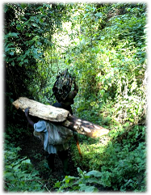
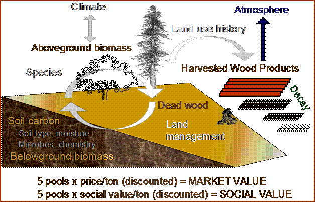
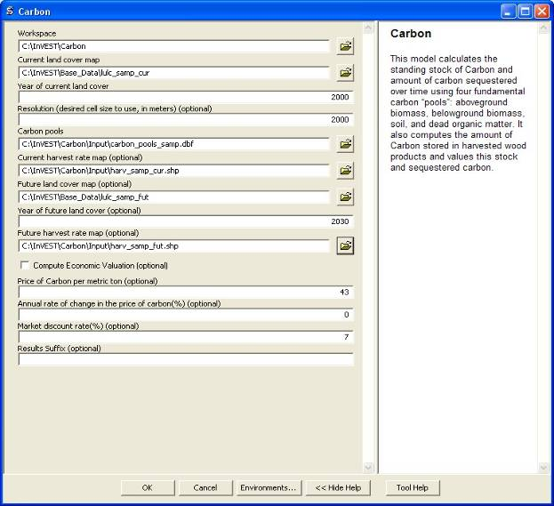

.. _carbonstorage:

.. |addbutt| image:: ./shared_images/addbutt.png
             :alt: add
	     :align: middle 
	     :height: 15px

********************************
Carbon Storage and Sequestration
********************************

Summary
=======

   
Terrestrial ecosystems, which store more carbon than the atmosphere, are vital to influencing carbon dioxide-driven climate change. The InVEST model uses maps of land use and land cover types and data on wood harvest rates, harvested product degradation rates, and stocks in four carbon pools (aboveground biomass, belowground biomass, soil, dead organic matter) to estimate the amount of carbon currently stored in a landscape or the amount of carbon sequestered over time. Additional data on the market or social value of sequestered carbon and its annual rate of change, and a discount rate can be used in an optional model that estimates the value of this environmental service to society. Limitations of the model include an oversimplified carbon cycle, an assumed linear change in carbon sequestration over time, and potentially inaccurate discounting rates.

Introduction
============

Ecosystems regulate Earth's climate by adding and removing greenhouse gases (GHG) such as CO\ :sub:`2` from the atmosphere. In fact, forests, grasslands, peat swamps, and other terrestrial ecosystems collectively store much more carbon than does the atmosphere (Lal 2002). By storing this carbon in wood, other biomass, and soil, ecosystems keep CO\ :sub:`2` out of the atmosphere, where it would contribute to climate change. Beyond just storing carbon, many systems also continue to accumulate it in plants and soil over time, thereby "sequestering" additional carbon each year.  Disturbing these systems with fire, disease, or vegetation conversion (e.g., land use / land cover (LULC) conversion) can release large amounts of CO\ :sub:`2`. Other management changes, like forest restoration or alternative agricultural practices, can lead to the storage of large amounts of CO\ :sub:`2`.  Therefore, the ways in which we manage terrestrial ecosystems are critical to regulating our climate.

As with all other models for which InVEST provides estimates of value, we are focused on the social value of carbon sequestration and storage. Terrestrial-based carbon sequestration and storage is perhaps the most widely recognized of all environmental services (Stern 2007, IPCC 2006, Canadell and Raupach 2008, Capoor and Ambrosi 2008, Hamilton et al. 2008, Pagiola 2008). The social value of a sequestered ton of carbon is equal to the social damage avoided by not releasing the ton of carbon into the atmosphere (Tol 2005, Stern 2007). Calculations of social cost are complicated and controversial (see Weitzman 2007 and Nordhaus 2007b), but have resulted in value estimates that range from USD $9.55 to $84.55 per metric ton of CO\ :sub:`2` released into the atmosphere (Nordhaus 2007a and Stern 2007, respectively).

In addition to the social value of carbon sequestration and storage, there are several emerging markets for carbon based on both regulation and voluntary demand. The Kyoto Protocol -- the current treaty addressing international climate change -- includes a mechanism for establishing projects that sequester carbon to earn credits, which they then can sell to others needing to offset their own CO\ :sub:`2` emissions. As a result of the Kyoto Protocol, the European Union Emissions Trading Scheme (EU ETS) emerged to allow the regulated firms of the EU to trade their emissions allowances.  The Chicago Climate Exchange (CCX) emerged in the United States, which is not a signatory party of the Kyoto Protocol. The CCX allows interested parties to trade emissions offsets that have been certified on a voluntary basis. The EU ETS and the CCX hadprices of around 25 Euros and $USD 6 per metric ton of CO\ :sub:`2`, respectively as of April 2008. In addition to these centralized markets, there is a substantial over-the-counter market for voluntary carbon offsets.  For details about the price of these offsets, see Conte and Kotchen (2010).

Currently these markets only apply to carbon sequestration (i.e., the additional storage of carbon over time), but there is increased interest in financial incentives to avoid release of carbon from ecosystems in the first place, so-called "reduced emissions from deforestation and degradation" or "REDD" (Gibbs et al. 2007, Mollicone et al. 2007, Mackey et al. 2008). This option was accepted during the last meeting of the parties to the UN Framework Convention on Climate Change and is likely to be written in to the follow up agreement to the Kyoto Protocol. Payments for REDD would financially reward forest owners for reversing their planned deforesting and thinning actions (Sedjo and Sohngen 2007, Sohngen et al. 2008). Issues of accounting and verification have slowed the emergence of REDD markets, but many are anticipating them with private transactions.

While market prices are one way to estimate the value of CO\ :sub:`2` sequestration, these prices will reflect policies, subsidies, and other factors, and therefore will only indicate the true value of this service to society by chance (Murray et al. 2007).  For this reason, we recommend that users rely on the avoided damages associated with the emission of CO\ :sub:`2` into the atmosphere rather than prices in existing carbon markets to estimate the social value of carbon sequestration and storage.

Managing landscapes for carbon storage and sequestration requires information about how much and where carbon is stored, how much carbon is sequestered or lost over time, and how shifts in land use affect the amount of carbon stored and sequestered over time. Since land managers must choose among sites for protection, harvest, or development, maps of carbon storage and sequestration are ideal for supporting decisions influencing these environmental services.

Such maps can support a range of decisions by governments, NGOs, and businesses. For example, governments can use them to identify opportunities to earn credits for reduced (carbon) emissions from deforestation and degradation (REDD). Knowing which parts of a landscape store the most carbon would help governments efficiently target incentives to landowners in exchange for forest conservation. Additionally, a conservation NGO may wish to invest in areas where high levels of biodiversity and carbon sequestration overlap (Nelson et al. 2008). A timber company may also want to maximize its returns from both timber production and REDD carbon credits (Plantinga and Birdsey 1994), in which case they could use the InVEST timber production model in tandem with the carbon model to assess management options.

Figure 1. Conceptual model of carbon storage and sequestration. Parameters depicted in color are included in the InVEST model, while those in gray are not.

The Model
=========

Carbon storage on a land parcel largely depends on the sizes of four carbon "pools:" aboveground biomass, belowground biomass, soil, and dead organic matter (Fig. 1). The InVEST Carbon Storage and Sequestration model aggregates the amount of carbon stored in these pools according to the land use maps and classifications produced by the user. Aboveground biomass comprises all living plant material above the soil (e.g., bark, trunks, branches, leaves). Belowground biomass encompasses the living root systems of aboveground biomass.Soil organic matter is the organic component of soil, and represents the largest terrestrial carbon pool. Dead organic matter includes litter as well as lying and standing dead wood. A fifth optional pool included in the model applies to parcels that produce harvested wood products (HWPs) such as firewood or charcoal or more long-lived products such as house timbers or furniture. Tracking carbon in this pool is useful because it represents the amount of carbon kept from the atmosphere by a given product.

Using maps of land use and land cover types and the amount of carbon stored in carbon pools, this model estimates: the net amount of carbon stored in a land parcel over time; the total biomass removed from a harvested area of the parcel, and the market and social values of the carbon sequestered in remaining stock. Limitations of the model include an oversimplified carbon cycle, an assumed linear change in carbon sequestration over time, and potentially inaccurate discounting rates. Biophysical conditions important for carbon sequestration such as photosynthesis rates and the presence of active soil organisms are also not included in the model (Fig. 1).

How it works
------------

The model runs on a gridded map of cells called raster format in GIS. If the HWP pool is included in the analysis, a polygon map of harvest parcels is also modeled. Each cell in the raster is assigned a land use and land use and land cover (LULC) type such as forest, pasture, or agricultural land. Each harvest polygon is assigned harvest type referring to the harvested product, harvest frequency, and product decay rates. After running the model in raster format, results can be summarized to practical land units such as individual properties, political units, or watersheds.

For each LULC type, the model requires an estimate of the amount of carbon in at least one of the four fundamental pools described above. If the user has data for more than one pool, the modeled results will be more complete. The model simply applies these estimates to the LULC map to produce a map of carbon storage in the carbon pools included.

For the fifth carbon pool, HWP, model values are defined for each parcel (polygon) and not for each LULC. For each parcel the user indicates the amount of biomass, in terms of carbon, removed per harvest, the frequency of harvests, and the rate at which the products that contain carbon degrade. With these data, the model calculates the amount of stored carbon that originated in a parcel but now resides in finished products such as houses or furniture. The model converts parcel level HWP carbon values into a grid cell layer that spatially matches the grid system used for the other four carbon storage pools.

The model aggregates the carbon in each of the five pools, providing an estimate of total carbon storage in each grid cell and across the whole landscape. If carbon storage data for a given pool are not mapped, then total carbon storage will be underestimated. The model also outputs the total biomass and volume of wood removed from each harvested parcel up to the year associated with the modeled landscape.

If the user provides both a current and future LULC map, then the net change in carbon storage over time (sequestration and loss) and its social value can be calculated. To estimate this change in carbon sequestration over time, the model is simply applied to the current landscape and a projected future landscape, and the difference in storage is calculated, map unit by map unit. If multiple future scenarios are available, the differences between the current and each alternate future landscape can be compared.

Outputs of the model are expressed as Mg of carbon per grid cell, or if desired, the value of sequestration in dollars per grid cell. We strongly recommend using the social value of carbon sequestration if the user is interested in expressing sequestration in monetary units. The social value of a sequestered ton of carbon is the social damage avoided by not releasing the ton of carbon into the atmosphere. The market value may be applicable if the user is interested in identifying the value of the landscape for trading under current market conditions. The market value of terrestrial-based carbon sequestration is the price per metric ton of carbon traded in marketplaces such as the Chicago Climate Exchange (ECX).

The valuation model estimates the economic value of sequestration (not storage) as a function of the amount of carbon sequestered, the monetary value of each unit of carbon, a monetary discount rate, and the change in the value of carbon sequestration over time (Fig. 1). **Thus, valuation can only be done in the carbon model if you have a future scenario.** Valuation is applied to sequestration, not storage, because current market prices relate only to carbon sequestration. Discount rates are multipliers that typically reduce the value of carbon sequestration over time. The first type of discounting, the standard economic procedure of financial discounting, reflects the fact that people typically value immediate benefits more than future benefits due to impatience and uncertain economic growth. The second discount rate adjusts the social value of carbon sequestration over time. This value will change as the impact of carbon emissions on expected climate change-related damages changes. If we expect carbon sequestered today to have a greater impact on climate change mitigation than carbon sequestered in the future this second discount rate should be positive. On the other hand, if we expect carbon sequestered today to have less of an impact on climate change mitigation than carbon sequestered in the future this second discount rate should be negative.

Uncertainty analysis
^^^^^^^^^^^^^^^^^^^^

In many cases, limited data can make it difficult to determine precisely the amount of carbon in different pools. To accomodate such data limitations, the model optionally performs uncertainty analysis. If users choose to run the model with uncertainty analysis, then inputs and outputs are both affected.

Input data when using uncertainty analysis must specify probability distributions for amount of carbon in different pools. For each carbon pool type, input data must specify both the mean estimate, which represents the expected carbon amount, and the standard deviation, which represents the uncertainty for the estimate.

When running uncertainty analysis, model outputs include all of the original outputs of the non-uncertainty model, including total carbon per grid cell and, as in the non-uncertainty model, sequestration per grid cell if the user provides both current and future LULC maps. To calculate these total carbon and sequestration outputs, the model uses the user-provided mean estimates for the carbon pools.

In addition to these outputs, which use only the mean estimate data, the uncertainty model also produces a 'confidence' output raster, which uses both the mean and the standard deviation data and highlights areas where it is highly likely that storage will either increase or decrease. The model uses a user-provided confidence threshold as the minimum probability for which grid cells should be highlighted.

To compute the probability that storage increases or decreases in a particular grid cell, we use the LULC data and the HWP data (if present) to construct probability distributions for the current carbon storage in the grid cell and the future carbon storage in the cell. The current carbon storage is distributed with mean :math:`\mu_{curr}` and standard deviation :math:`\sigma_{curr}`. The future carbon storage is distributed with mean :math:`\mu_{fut}` and standard deviation :math:`\sigma_{fut}`. Since we assume that both are normally distributed, we can compute the probability :math:`p` that future carbon storage is greater than current carbon storage as follows:

 .. math:: p = \Phi(\frac{\mu_{fut} - \mu_{cur}}{\sqrt{\sigma_{curr}^2 + \sigma_{fut}^2}})

where :math:`\Phi` is the cumulative distribution function of the normal distribution.

This value of :math:`p` for a particular grid cell is then used to determine how confident we are that storage will either increase or decrease in that cell.

REDD scenario analysis
^^^^^^^^^^^^^^^^^^^^^^

The carbon model can optionally perform scenario analysis according to a framework of Reducing Emissions from Forest Degradation and Deforestation (REDD) or REDD+. REDD is a scheme for emissions reductions under which countries that reduce emissions from deforestation can be financially compensated. REDD+ builds on the original REDD framework by also incorporating conservation, sustainable forest management, and enhancement of existing carbon stocks.

To perform REDD scenario analysis, the InVEST carbon **biophysical model** requires three LULC maps: one for the current scenario, one for a future baseline scenario, and one for a future scenario under a REDD policy. The future baseline scenario is used to compute a reference level of emissions against which the REDD scenario can be compared. Depending on the specifics on the desired REDD framework, the baseline scenario can be generated in a number of different ways; for instance, it can be based on historical rates of deforestation or on projections. The REDD policy scenario map reflects future LULC under a REDD policy to prevent deforestation and enhance carbon sequestration.

Based on these three LULC maps for current, baseline, and REDD policy scenarios, the carbon biophysical model produces a number of outputs. First, it produce rasters for total carbon storage for each of the three LULC maps. Second, it produces two sequestration rasters. One sequestration raster indicates sequestration from the current scenario to the baseline scenario. The other sequestration raster indicates sequestration from the current scenario to the REDD policy scenario.

If uncertainty analysis is enabled, the carbon biophysical model will also produce two additional confidence rasters. One raster represents regions where the model is confident (beyond the user-provided confidence threshold) that carbon storage will either increase or decrease in the transition from the current scenario to the future baseline scenario. The second raster represents regions where the model is confident that carbon storage will either increase or decrease in the transition from the current scenario to the REDD policy scenario.

The biophysical model currently does not support REDD scenario analysis together with harvested wood product analysis. Therefore, if REDD scenario analysis is enabled, HWP analysis will be disabled.

The carbon **valuation model** accepts two sequestration rasters to perform REDD scenario analysis. The first represents sequestration under a future baseline scenario. The second represents sequestration under a REDD policy scenario. If uncertainty analysis is desired, each sequestration raster can optionally be supplemented with a confidence raster produced by the carbon biophysical model. The model will compute the total amount and the value of sequestered carbon both for the baseline future scenario and for the REDD policy scenario, as well as the difference between the baseline and REDD scenarios.

Limitations and simplifications
^^^^^^^^^^^^^^^^^^^^^^^^^^^^^^^

The model greatly oversimplifies the carbon cycle which allows it to run with relatively little information, but also leads to important limitations. For example, the model assumes that none of the LULC types in the landscape are gaining or losing carbon over time. Instead it is assumed that all LULC types are at some fixed storage level equal to the average of measured storage levels within that LULC type. Under this assumption, the only changes in carbon storage over time are due to changes from one LULC type to another or from the harvest of wood products. Therefore, any grid cell that does not change its LULC type and is at a wood harvest steady-state will have a sequestration value of 0 over time. In reality, many areas are recovering from past land use or are undergoing natural succession. The problem can be addressed by dividing LULC types into age classes (essentially adding more LULC types), such as three ages of forest. Then, parcels can move from one age class to the other in scenarios and change their carbon storage values as a result.

A second limitation is that because the model relies on carbon storage estimates for each LULC type, the results are only as detailed and reliable as the LULC classification used.  Carbon storage clearly differs among LULC types (e.g., tropical forest vs. open woodland), but often there can also be significant variation within a LULC type. For example, carbon storage within a "tropical moist forest" is affected by temperature, elevation, rainfall, and the number of years since a major disturbance (e.g., clear-cut or forest fire). The variety of carbon storage values within coarsely defined LULC types can be partly recovered by using a LULC classification system and related carbon pool table which stratifies coarsely defined LULC types with relevant environmental and management variables.  For example, forest LULC types can be stratified by elevation, climate bands or time intervals since a major disturbance. Of course, this more detailed approach requires data describing the amount of carbon stored in each of the carbon pools for each of the finer LULC classes.

Another limitation of the model is that it does not capture carbon that moves from one pool to another. For example, if trees in a forest die due to disease, much of the carbon stored in aboveground biomass becomes carbon stored in other (dead) organic material. Also, when trees are harvested from a forest, branches, stems, bark, etc. are left as slash on the ground. The model assumes that the carbon in wood slash "instantly" enters the atmosphere.

With respect to its estimates of carbon in HWPs, the model is constrained by the fact that users may assign only one harvest rate (e.g., 50 Mg of wood per harvest where a harvest occurs every 2 years) and only one decay rate (e.g., the wood harvested from the parcel over the years is always used to make the same product that decays at the same rate) to each parcel. In reality, harvested parcels will exhibit variation in harvest and decay rates over time. The model also does not account for the greenhouse gasses (GHGs) emitted from the transportation of harvested wood from its initial harvest site to its final destination, the conversion of raw wood into finished products, or agriculture-related activities such as from tractors and livestock. Annual GHG emissions from agricultural land use can be calculated with the InVEST Agriculture Production Model, due to be released soon.

The uncertainty model assumes that the probability distribution for amount of carbon in different pools is normally distributed. This may not be the case; for instance, predictions for carbon amounts may be asymmetric distributions. If this is the case, users should choose a normal distribution that best approximates the desired distribution. In addition, uncertainty in input data is currently limited to carbon pools. The model does not yet handle uncertainty in LULC maps or HWP data.

Finally, while most sequestration follows a nonlinear path such that carbon is sequestered at a higher rate in the first few years and a lower rate in subsequent years, the model's economic valuation of carbon sequestration assumes a linear change in carbon storage over time. The assumption of a constant rate of change will tend to undervalue the carbon sequestered, as a nonlinear path of carbon sequestration is more socially valuable due to discounting than a linear path (Fig.2).

.. figure:: ./carbonstorage_images/carbon_envelope.jpg
   :align: center
   :figwidth: 500px

*Figure 2: The model assumes a linear change in carbon storage (the solid line), while the actual path to the year T's carbon storage level may be non-linear (like the dotted line). In this case t can indicate the year of the current landscape and T the year of the future landscape. With positive discounting, the value of the modeled path (the solid line) is less valuable than the actual path. Therefore, if sequestration paths tend to follow the dotted line, the modeled valuation of carbon sequestration will underestimate the actual value of the carbon sequestered.*

Data needs
==========

This section outlines the map and data tables required by the model, including the economic data that the tool interface will prompt the user to enter. See Appendix for detailed information on data sources and pre-processing.

1.	**Current land use/land cover (LULC) map (required):** A GIS raster dataset, with a LULC code for each cell. The dataset should be projected in meters and the projection used should be defined.

 *Name:* file can be named anything, but avoid spaces

 *Format:* standard GIS raster file (e.g., ESRI GRID or IMG), with LULC class code for each cell (e.g., 1 for forest, 3 for grassland, etc.)  These codes must match LULC codes in the tables below.  LULC class codes should be in the 'LULC' column of the dataset.

 *Sample data set:* \\Invest\\Base_Data\\Terrestrial\\lulc_samp_cur

 The model requires the following two pieces of information about the LULC map which are prompted for in the interface.

 * The **year** depicted by the LULC map, for use in calculating sequestration and economic values (labeled "Year of current land cover" in the interface).

 * The **spatial resolution** (desired cell size in meters) at which you would like the model to run (labeled "Resolution (optional)"). You can only define a new resolution that is coarser than the resolution of the LULC map (this is the default resolution).

2. **Carbon pools (required):** A table of LULC classes, containing data on carbon stored in each of the four fundamental pools for each LULC class. Carbon storage data can be collected from field estimates from local plot studies, extracted from meta-analyses on specific habitat types or regions, or found in general published tables (e.g., IPCC, see Appendix). If information on some carbon pools is not available, pools can be estimated from other pools, or omitted by leaving all values for the pool equal to 0.

 If a forest is regularly harvested for woody biomass, the estimates of carbon biomass in the aboveground, belowground, and dead organic matter pools should reflect this fact. For example, suppose one of the LULC types is a plantation forest that tends to have one-tenth of its area clear-cut every year. The aboveground and belowground estimates of carbon biomass for this LULC type should reflect the fact that only 9/10ths of the area occupied by plantation forests will be covered by trees at any point in time.

 For notes on calculating standard deviation for the uncertainty model, see the Appendix for data sources for carbon stocks.

 *Name:* file can be named anything

 *File type:*  ``*``.csv or ``*``.dbf

 *Rows:* each row is a LULC class

 *Columns:* each column contains a different attribute of each LULC class, and must be named as follows:

 *	LULC: code of land use/land cover class (e.g., 1 for forest, 3 for grassland, etc.). The LULC code should match the LULC codes from the current LULC map (dataset #1 above)

 *	LULC_name: descriptive name of LULC class (optional)

 To run the model **without uncertainty analysis**, the following columns are required:

 *	C_above: amount of carbon stored in aboveground biomass (in Mg ha\ :sup:`-1`\ )

 *	C_below: amount of carbon stored in belowground biomass (in Mg ha\ :sup:`-1`\ )

 *	C_soil: amount of carbon stored in soil (in Mg ha\ :sup:`-1`\ )

 *	C_dead: amount of carbon stored in dead organic matter (in Mg ha\ :sup:`-1`\ )

 To run the model **with uncertainty analysis**, the following columns are required:

 *	C_above_mean: estimated amount of carbon stored in aboveground biomass (in Mg ha\ :sup:`-1`\ )

 *	C_above_sd: standard deviation to measure uncertainty in the amount of carbon in aboveground biomass (in Mg ha\ :sup:`-1`\ )

 *	C_below_mean: estimated amount of carbon stored in belowground biomass (in Mg ha\ :sup:`-1`\ )

 *	C_below_sd: standard deviation to measure uncertainty in the amount of carbon in belowground biomass (in Mg ha\ :sup:`-1`\ )

 *	C_soil_mean: estimated amount of carbon stored in soil (in Mg ha\ :sup:`-1`\ )

 *	C_soil_sd: standard deviation to measure uncertainty in the amount of carbon in soil (in Mg ha\ :sup:`-1`\ )

 *	C_dead_mean: estimated amount of carbon stored in dead organic matter (in Mg ha\ :sup:`-1`\ )

 *	C_dead_sd: standard deviation to measure uncertainty in the amount of carbon in dead organic matter (in Mg ha\ :sup:`-1`\ )

 **Note:** The unit for all carbon pools is Mg of elemental carbon ha\ :sup:`-1`\ . This means that if your data source has information on Mg of CO\ :sub:`2` stored ha\ :sup:`-1`\ , you need to convert those numbers to elemental carbon by multiplying Mg of CO\ :sub:`2` stored ha\ :sup:`-1`\ by 0.2727.

 *Sample data set (without uncertainty):* \\Invest\\Carbon\\Input\\carbon_pools_samp.csv

 *Sample data set (with uncertainty):* \\Invest\\Carbon\\Input\\carbon_pools_samp_uncertain.csv

 *Example (without uncertainty):* Hypothetical study with five LULC classes. Class 1 (Forest) contains the most carbon in all pools. In this example, carbon stored in above- and below-ground biomass differs strongly among land use classes, but carbon stored in soil varies less dramatically.

  ==== ================== ======= ======= ====== ====== 
  LULC LULC_name          C_above C_below C_soil C_dead 
  ==== ================== ======= ======= ====== ====== 
  1    Forest              140     70      35     12 
  2    Coffee              65      40      25     6 
  3    Pasture/grass       15      35      30     4 
  4    Shrub/undergrowth   30      30      30     13 
  5    Open/urban          5       5       15     2 
  ==== ================== ======= ======= ====== ======

 *Example (with uncertainty):* As above, but with standard deviations to measure uncertainty in carbon pool estimates.

==== ================== ============ ========== ============ ========== =========== ========= =========== =========
LULC LULC_name          C_above_mean C_above_sd C_below_mean C_below_sd C_soil_mean C_soil_sd C_dead_mean C_dead_sd
==== ================== ============ ========== ============ ========== =========== ========= =========== =========
1    Forest              140         20         70           10         35          5         12          2
2    Coffee              65          5          40           10         25          5         6           2
3    Pasture/grass       15          3          35           5          30          5         4           1
4    Shrub/undergrowth   30          5          30           7          30          8         13          3
5    Open/urban          5           1          5            1          15          2         2           0.5
==== ================== ============ ========== ============ ========== =========== ========= =========== =========

  *Confidence threshold (for uncertainty):* The uncertainty model also requires an additional *confidence threshold* parameter which is input directly through the tool interface rather than through a file. This is used as the minimum probability of storage increase or decrease for which we highlight cells in the 'conf' output file.

3.	**Current harvest rates map (optional)**. A GIS shape file of polygons (parcels in our vernacular), contains data on:

 a.	Parcel ID

 b.	Amount of carbon, in the form of woody biomass, typically removed from the parcel over the course of a harvest period

 c.	Date that the modeler wants to begin accounting for wood harvests in the parcel

 d.	Frequency of harvest periods in the parcel in the past

 e.	Average decay rate of products made from the wood harvested from a parcel

 f.	Average carbon density of the wood removed form the parcel in the past

 g.	Average tree volume per ton of wood removed form the parcel in the past.

 The GIS polygon map should only delineate parcels that have been harvested; all other portions of the landscape should be ignored. Note that unlike the current LULC map,this file contains multiple data for each individual harvest parcel on the landscape.

 The amount of carbon that is removed, on average, during each harvest period can be estimated from plot surveys, market demand analyses, community surveys, or based on expert opinion. Decay rates can be estimated from literature reports (see sources in Appendix) or also based on expert opinion if necessary. If multiple types of wood products are harvested from a polygon, the user should average the rates of decay or focus on the product with the slowest decay rate (since that will affect storage the most). Because only woody biomass is included in the harvest portion of the model, it is not necessary to include harvest or decay rates for herbaceous products. If you are unable or uninterested in estimating carbon stored in harvested wood products, you do not need to supply this table and the model will ignore this pool.

 *Name:* file can be named anything

 *File type:* GIS polygon shapefile

 *Rows:* each row is a specific polygon on the landscape.

 *Columns:* columns contain attributes related to harvested wood products and must be named as follows:

 a.	FID: unique identifying code for each polygon (parcels in our vernacular).

 b.	*Cut_cur*: The amount of carbon typically removed from a parcel during a harvest period (measured in Mg ha\ :sup:`-1`\ ; the model will sum across the area of each parcel). This amount should only include the portion of the wood's carbon that is removed from the parcel (e.g., the carbon in the wood delivered to a saw mill). In other words, the slash and other waste from a wood harvest should be ignored because the model assumes that its carbon content is lost to the atmosphere instantly (the "cur" at the end of this attribute is used to relate it to the "current" LULC map).

 c.	*Start_date*: The first year the carbon removed from a forest will be accounted for in the HWP pool. The first year should coincide with a year in which wood was actually harvested from the parcel. If wood was harvested from a parcel in 1995, 2000, and 2005 and the LULC map being evaluated is from 2005 then St_date can equal 1995, 2000, or 2005; it is your choice.

 d.	*Freq_cur*: The frequency, in years, with which the Cut_cur amount is harvested.  If the value is 1 then the Cut_cur amount is removed annually from the parcel, if 5 then every 5 years, etc.

 e.	*Decay_cur*: The half-life of wood products harvested, measured in years.

 f.	*C_den_cur*: The carbon density in the harvested wood (MgC Mg\ :sup:`-1`\ of dry wood). Typically, the statistic ranges between 0.43 and 0.55 (see table 4.3 of IPCC (2006)). If C_den_cur is not known for a parcel set it equal to 0.5.

 g.	*BCEF_cur*: An expansion factor that translates the mass of harvested wood into volume of harvested wood (Biomass Conversion Expansion Factor). The expansion factor is measured in Mgof dry wood per m3 of wood and is a function of stand type and stand age. If you do not have data on this expansion factor you can use the BCEFR row in table 4.5 of IPCC (2006). Otherwise, set this expansion factor equal to 1 for each parcel.

 *Sample data set:* \\Invest\\Carbon\\Input\\harv_samp_cur.shp

 *Example:* A hypothetical study of carbon storage in HWP for four forest parcels that have experienced harvests in the past. Assume the current LULC map we are using corresponds to the year 2005. Parcels 1, 2, and 3 are forests that are managed for timber production. Each managed forest experiences a cut every 5th year where Cut_cur gives the amount of carbon (Mg ha\ :sup:`-1`\ ) in the portion of the wood that is removed every fifth year. The fourth parcel is a source of firewood and wood is cut from the parcel continuously. Thus, for this parcel we estimate the annual rate of carbon removed from the forest for firewood. For the first three parcels, we began to account for carbon removal in 1995. For the final parcel we began accounting for HWP in 2000. (Recall that the calculation of HWP_cur, Bio_HWP_cur, and Vol_HWP_cur does not include the 2005 harvest; that carbon is still on the land.)

 === ======= ========== ======== ========= ========= ======== 
 FID Cut_cur Start_date Freq_cur Decay_cur C_den_cur BCEF_cur 
 === ======= ========== ======== ========= ========= ======== 
 1   75      1995       5        30        0.5       1 
 2   50      1995       5        35        0.5       1 
 3   50      1995       5        50        0.5       1 
 4   45      2000       1        1         0.5       1 
 === ======= ========== ======== ========= ========= ========

 We measure the carbon stored in HWP that originated from parcel :math:`x` on the current landscape with the following equation:

 .. math:: HWP\_cur_x = Cut\_cur_x\times \sum^{ru\left(\frac{yr\_cur-start\_date}{Freq\_cur_x}\right)-1}_{t=0}f(Decay\_cur_x; yr\_cur-start\_date_x-(t\times Freq\_cur_x))
  :label: eq1

 where :math:`HWP\_curx` is measured in Mg ha\ :sup:`-1`\ , :math:`yr\_cur` is short for "Year of current land cover", :math:`t` indexes the number of harvest periods, and :math:`ru` indicates that any fraction should be rounded up to the next integer value.  The function

 .. math:: f(\bullet) = \left\lfloor \frac{1-e^{-\omega_x}}{\omega_x\times e^{[yr\_cur-start\_date_x-(t\times Freq\_cur_x)]\times\omega_x}}\right\rfloor
  :label: eq2

 where :math:`\omega_x=(\log_e 2/Decay\_cur_x)`, measures how much of the carbon was typically removed from a parcel (Cut_curx) during a harvest period, that occurred some number of years ago (\ :math:`yr\_cur-start\_date_x-(t\times Freq\_cur_x)`\ ), still remains trapped in HWP as of the current year (\ :math:`yr\_cur`\ ) and given the current decay rate (\ :math:`Decay\_curx`\ ).

 The following are several examples to show how equation (1) works. In the first instance, assume \ :math:`start\_datex = 1983`, \ :math:`yr\_cur = 2000`, and \ :math:`Freq\_curx = 4`. In this case, \ :math:`ru\left(\frac{yr\_cur-start\_date}{Freq\_cur_x}\right)= ru\left(\frac{17}{4}\right) = ru(4.25) = 5`. According to the summation term in equation (1), this means we sum over 5 harvest periods (t = 0,1,2,3,4). Given this series of \ :math:`t`, we evaluate \ :math:`f` at 17, 13, 9, 5, and 1 years since a harvest (we use   to convert the series of \ :math:`t`'s into years since harvest).

 Alternatively, if \ :math:`start\_datex = 1980`, \ :math:`yr\_cur = 2000`, and \ :math:`Freq\_curx = 2` then \ :math:`ru\left(\frac{yr\_cur-start\_date}{Freq\_cur_x}\right)=ru(10) = 10`. Therefore, according to equation (1), harvests that contained Cut_curx of carbon ha\ :sup:`-1`\  occurred on the parcel 20, 18, 16, 14, 12, 10, 8, 6, 4, and 2 years before the year 2000 (note that we do not include a harvest that is scheduled to occur in the current year in the HWP carbon pool; this carbon is still in situ in the current year).

 We use \ :math:`C\_den\_cur` and \ :math:`BCEF\_cur` to measure the mass (\ :math:`Bio\_HWP\_cur`) and volume \ :math:`(Vol\_HWP\_cur)` of wood that has been removed from a parcel from the \ :math:`start\_date` to the current year. \ :math:`Bio\_HWP\_curfor` parcel \ :math:`x` is measured in Mg (dry matter) ha\ :sup:`-1`\  and is given by:

 .. math:: Bio\_HWP\_cur_x = Cut\_cur_x \times ru\left(\frac{yr\_cur-start\_date}{Freq\_cur_x}\right)\times\frac{1}{C\_den\_cur_x}
  :label: eq3

and \ :math:`Vol\_HWP\_cur` for parcel \ :math:`x` is measured in m\ :sup:`3` of wood ha\ :sup:`-1`\  and is given by,

 .. math:: Vol\_HWP\_cur_x = Bio\_HWP\_cur_x\times\frac{1}{Vol\_exp\_cur_x}
  :label: eq4

 As mentioned before, the model places all parcel-level values into a grid cell map that comports with the four pool storage map.

4. **Future Scenarios (optional -- required for valuation)**: If you have a LULC map (data input #1) for a future landscape scenario, then expected sequestration rates in the four major carbon pools on the landscape can be measured. Similarly, sequestration rates in the HWP carbon pool can be measured with a harvest rate map (data input #3) for this future landscape.

 If REDD scenario analysis is enabled, then this should represent the landscape for the future baseline scenario, against which the REDD scenario will be compared.

 A future land cover map (a raster dataset) should be formatted according to the same specifications as the current land cover map (input #1).

 If you provide a future harvest rate map then the \ :math:`HWP` carbon pool can be tracked over time. The future harvest rate map should be formatted according to the same specifications as the current harvest rate map: a polygon map where values for *FID*, *Cut_fut*, *Freq_fut*, *Decay_fut*, *C_den_fut*, and *BCEF_fut* are attributed to each parcel that is expected be harvested at some point between the year given by :math:`\frac{yr\_cur+yr\_fut}{2}` and *yr_fut* where *yr_fut* indicates the year associated with the future land cover map (e.g., if *yr_cur* is 2000 and *fut_yr* is 2050 then :math:`\frac{yr\_cur+yr\_fut}{2}` = 2025).  This means that current harvest rate map conditions hold on the landscape until the year halfway between the current and future years. The harvest variables for the future will be applied in the year :math:`\frac{yr\_cur+yr\_fut}{2}` . Note that any fraction is round down (e.g., if *yr_cur* is 2000 and *fut_yr* is 2053 then :math:`\frac{yr\_cur+yr\_fut}{2}` = 2026). The future harvest rate map does not have to retain any spatial semblance to the current harvest rate map. Nor do parcels that are harvested on the current and future maps have to have a common FID.

 *Sample data files for future scenarios are future land cover:* (\\InVEST\\Base_Data\\Terrestrial\\lulc_samp_fut) and future harvest rate map (\\InVEST\\Carbon\\Input\\harv_samp_fut.shp).

 *Example:* A hypothetical study of future carbon storage in HWP for four forest parcels. Continuing with current harvest rate map (2005) described above, assume the future LULC map corresponds to the year 2035. Three of the four forest parcels that have wood removed on the current landscape keep their boundaries in the future and continue to have wood removed into the future (parcels with FID 1, 3, and 4 on the current harvest rate map). However the first parcel changes its management with *newCut* and *Freq* values (:math:`Cut\_cur_x \neq Cut\_fut_x` and :math:`Freq\_cur_x \neq Freq\_fut_x`). We assume these new management conditions begin in the year 2020 (given by :math:`\frac{yr\_cur+yr\_fut}{2}`). Parcel 2 is not expected to be harvested at any point between :math:`\frac{yr\_cur+yr\_fut}{2}` and *yr_fut*. Therefore, the model assumes that the harvest activity given in current harvest rate map for parcel 2 ends in 2020. In addition, the future harvest rate map includes a new harvested parcel (given by FID = 5). We assume that harvest begins there in 2020 as well. In parcels 3 and 4 harvest management does not change across the current and future landscapes. (Note that we retained the FID values across the two maps here; this is not necessary, as the ArcGIS program will perform the necessary spatial matches).

 === ======= ======== ========= ========= ======== 
 FID Cut_fut Freq_fut Decay_fut C_den_fut BCEF_fut 
 === ======= ======== ========= ========= ======== 
 1   50      10       30        0.5       1 
 3   50      5        50        0.5       1 
 4   45      1        1         0.5       1 
 5   25      2        15        0.5       1 
 === ======= ======== ========= ========= ========

 Below we describe exactly how the futur    e harvest values are calculated. If a parcel was harvested on the current landscape and is expected to be harvested on the future landscape (i.e., at some point between :math:`\frac{yr\_cur+yr\_fut}{2}` and \ :math:`yr_fut`) then the remaining HWP carbon due to harvest from parcel x in the future year is given by:

 .. math:: \begin{array}{rl} HWP\_fut_x =& Cut\_cur_x \sum^{ru\left(\frac{\frac{yr\_fut+yr\_cur}{2}-start\_date_x}{Freq\_cur_x}\right)^{-1}}_{t=0}f(Decay\_cur_x, yr\_fut-start\_date_x-(t\times Freq\_cur_x))+\\ & Cut\_fut_x \sum^{ru\left(\frac{yr\_fut-\frac{yr\_fut+yr\_cur}{2}}{Freq\_fut_x}\right)^{-1}}_{t=0}f\left(Decay\_fut_x,yr\_fut-\frac{yr\_fut+yr\_cur}{2}-(t\times Freq\_fut_x)\right) \end{array}
  :label: eq5

 where the function f is as before. Recall that if (yr_cur + yr_fut) / 2 results in a fraction it is rounded down. Also note that equation (5) does not include a harvest that is scheduled to occur in the future year; this harvest's carbon isin situ in this accounting. Parcels that were harvested on the current landscape but are not expected to be harvested on the future landscape may still have HWP carbon in the future year. The remaining HWP carbon in yr_fut on such parcels is given by the first term of equation (5):

 .. math:: HWP\_fut_x = Cut\_cur_x \times \sum^{ru\left(\frac{\frac{yr\_fut+yr\_cur}{2}-start\_date_x}{Freq\_cur_x}\right)^{-1}}_{t=0}f(Decay\_cur_x, yr\_fut-start\_date_x-(t\times Freq\_cur_x))
  :label: eq6

In contrast, parcels that were not harvested on the current landscape, but are expected to be harvested on the future landscape, will have the following amount of carbon in the form of HWP in yr_fut:

 .. math:: HWP\_fut_x = Cut\_fut_x \sum^{ru\left(\frac{yr\_fut-\frac{yr\_fut+yr\_cur}{2}}{Freq\_fut_x}\right)^{-1}}_{t=0}f\left(Decay\_fut_x,yr\_fut-\frac{yr\_fut+yr\_cur}{2}-(t\times Freq\_fut_x)\right)
  :label: eq7

Note that this is the second term of equation (5).

If a parcel was harvested on the current landscape and is expected to be harvested on the future landscape, the mass of harvested wood that has been removed from a parcel from Start_date to yr_fut is given by:

 .. math:: \begin{array}{rl}Bio\_HWP\_fut_x=&\left( Cut\_cur_x\times ru\left(\frac{\frac{yr\_fut+yr_cur}{2}-start\_date_x}{Freq\_cur_x}\right)\times \frac{1}{C\_den\_cur_x}\right)+\\ &\left(Cut\_fut_x\times ru\left(\frac{yr\_fut-\frac{yr\_fut+yr\_cur}{2}}{Freq\_fut_x}\right)\times\frac{1}{C\_den\_fut}\right)\\ \end{array}
  :label: eq8

 However, for parcels that were harvested on the current landscape, but are not expected to be harvested on the future landscape, the mass of wood removed from a parcel from *Start_date* to *yr_fut* is given by the first term of equation (8):

 .. math:: Bio\_HWP\_fut_x=\left( Cut\_cur_x\times ru\left(\frac{\frac{yr\_fut+yr_cur}{2}-start\_date_x}{Freq\_cur_x}\right)\times \frac{1}{C\_den\_cur_x}\right)
  :label: eq9

 For parcels that were not harvested on the current landscape but are expected to be harvested on the future landscape, the mass of wood removed from a parcel from Start_date toyr_futis given by second term of equation (8):

 .. math:: Bio\_HWP\_fut_x=\left(Cut\_fut_x\times ru\left(\frac{yr\_fut-\frac{yr\_fut+yr\_cur}{2}}{Freq\_fut_x}\right)\times\frac{1}{C\_den\_fut}\right)
  :label: eq10

 Finally, the volume of the of wood that has been removed from a parcel from *Start_date* to *yr_fut* is given by:

 .. math:: \begin{array}{rl}Vol\_HWP\_fut_x=&\left(Cut\_cur_x\times ru\left(\frac{\frac{yr\_fut+yr\_cur}{2}-start\_date_x}{Freq\_cur_x}\right)\times\frac{1}{C\_den\_cur_x}\times \frac{1}{BCEF\_cur_x}\right)+\\ &\left(Cut\_fut_x\times ru\left(\frac{yr\_fut-\frac{yr\_fut+yr\_cur}{2}}{Freq\_fut_x}\right)\times\frac{1}{C\_den\_fut_x}\times \frac{1}{BCEF\_fut_x}\right)\end{array}
  :label: eq11

 .. math:: Vol\_HWP\_fut_x=\left(Cut\_cur_x\times ru\left(\frac{\frac{yr\_fut+yr\_cur}{2}-start\_date_x}{Freq\_cur_x}\right)\times\frac{1}{C\_den\_cur_x}\times \frac{1}{BCEF\_cur_x}\right)
  :label: eq12

 or

 .. math:: Vol\_HWP\_fut_x=\left(Cut\_fut_x\times ru\left(\frac{yr\_fut-\frac{yr\_fut+yr\_cur}{2}}{Freq\_fut_x}\right)\times\frac{1}{C\_den\_fut_x}\times \frac{1}{BCEF\_fut_x}\right)
  :label: eq13

 depending on the combination of current and future harvests (see above).

 We recommend that the modeler use *Bio_HWP_cur* and *Bio_HWP_fut* to refine the current and future LULC maps. Specifically, if *Bio_HWP_cur* or *Bio_HWP_fut* on a portion of the landscape are significant, then the modeler should assess whether the LULC types associated with that portion of the current or future landscape accurately reflect the biomass remaining on the landscape. For example, if the current LULC type on a portion of the landscape that has been heavily harvested in the immediate past is "closed conifer" it may be more appropriate to reclassify it as "thinned conifer" or "open conifer" on the LULC map.

 5. **REDD scenario LULC map (optional)**. REDD scenario analysis requires a LULC map for a landscape scenario under a REDD policy. This should be formatted according to the same specifications as the current and the baseline future land cover map. The REDD scenario LULC map must be for the same year as the baseline future scenario LULC map.

 6. **Economic data (optional -- required for valuation)**. Three numbers are not supplied in a table, but instead are input directly through the tool interface.

	a. The **value of a sequestered ton of carbon** (*V* in the equation below), in dollars per metric ton of elemental carbon (not CO\ :sub:`2`, which is heavier, so be careful to get units right! If the social value of CO\ :sub:`2`\ e is $Y per metric ton, then the social value of C is $(3.67*Y) per metric ton (Labeled "Price of carbon per metric ton (optional)" in the tool interface.) For applications interested in estimating the total value of carbon sequestration, we recommend value estimates based of damage costs associated with the release of an additional ton of carbon (the social cost of carbon (SCC).  Stern (2007), Tol (2009), and Nordhaus (2007a) present estimates of SCC.  For example, two SCC estimates we have used from Tol (2009) are $66 and $130 (in 2010 US dollars) (Polasky et al. 2010). For applications interested in estimating the value that could be gained by trading carbon credits in the current markets, the value can be taken from the current market prices on the Chicago or European Climate Exchanges.

	b. The **market discount rate** (*r* in the equation below), which reflects society's preference for immediate benefits over future benefits (labeled "Market discount rate (%) (optional)" in the tool interface). The default value in the interface is 7% per year, which is one of the market discount rates recommended by the U.S. government for cost-benefit evaluation of environmental projects. However, this rate will depend on the country and landscape being evaluated. Philosophical arguments have been made for using a lower discount rate when modeling climate change related dynamics, which users may consider using. If the rate is set equal to 0% then monetary values are not discounted.

	c. The **annual rate of change in the price of carbon** (*c* in the equation below), which adjusts the value of sequestered carbon as the impact of emissions on expected climate change-related damages changes over time. The default value in the interface is 0% (labeled "The annual rate of change in the price of carbon (%) (optional)" in the tool interface). However, settingthis rate greater than 0% suggests that the societal value of carbon sequestered in the future is less than the value of carbon sequestered now. It has been widely argued that GHG emissions need to be curtailed immediately to avoid crossing a GHG atmospheric concentration threshold that would lead to a 3 degree Celsius or greater change in global average temperature by 2105.Some argue that such a temperature change would lead to major disruptions in economies across the world (Stern et al. 2006). Therefore, any mitigation in GHG emissions that occurs many years from now may have no effect on whether or not this crucial concentration threshold is passed. If this is the case, C sequestration in the far future would be relatively worthless and a carbon discount rate greater than zero is warranted. Alternatively, setting the annual rate of change less than 0% (e.g., -2%) suggests that the societal value of carbon sequestered in the future is greater than the value of carbon sequestered now (this is a separate issue than the value of money in the future, a dynamic accounted for with the market discount rate). This may be the case if the damages associated with climate change in the future accelerate as the concentration of GHGs in the atmosphere increases.

 The value of carbon sequestration over time is given by:

 .. math:: value\_seq_x=V\frac{sequest_x}{yr\_fut-yr\_cur}\sum^{yr\_fut-yr\_cur-1}_{t=0}\frac{1}{\left(1+\frac{r}{100}\right)^t\left(1+\frac{c}{100}\right)^t}
  :label: eq14

Running the Model
=================

Before running the Carbon Storage and Sequestration model, make sure that the INVEST toolbox has been added to your ARCMAP document, as described in the Getting Started chapter. Second, make sure that you have prepared the required input data files according to the specifications in Data Needs. Specifically, you will need (1) a land cover raster file showing the location of different land cover and land use types in the landscape; and (2) a carbon pools file which denotes the amount of aboveground, belowground, and soil carbon, and carbon from dead biomass, by land cover type. Optionally, you may also include (1) a map of harvest rates; (2) economic data on the value of carbon; and (3) future land use/land cover and harvest rate data to project future carbon scenarios.

* Identify workspace

 If you are using your own data, you need to first create a workspace, or folder for the analysis data, on your computer hard-drive. The entire pathname to the workspace should not have any spaces. All your output files will be dumped here. For simplicity, you may wish to call the folder for your workspace "carbon" and create a folder in your workspace called "input" and place all your input files here. It's not necessary to place input files in the workspace, but advisable so you can easily see the data you use to run your model.

 Or, if this is your first time using the tool and you wish to use sample data, you can use the data provided in InVEST-Setup.exe. If you unzipped the InVEST files to your C-drive (as described in the Getting Started chapter), you should see a folder called /Invest/carbon. This folder will be your workspace. The input files are in a folder called /Invest/carbon/input and in /Invest/base_data.

* Open anARCMAP document to run your model.

* Find theINVEST toolbox in ARCTOOLBOX. ARCTOOLBOX is normally open in ARCMAP, but if it is not, click on the ARCTOOLBOX symbol. See the Getting Started chapter if you don't see the InVEST toolbox and need instructions on how to add it.

* You can run this analysis without adding data to your map view, but usually it is recommended to view your data first and familiarize yourself. Add the data for this analysis to your map using the ADD DATA button and look at each file to make sure it is formatted correctly. Save your ARCMAP file as needed. *	Click once on the + sign on the left side of the INVEST toolbox to expand the list of tools. Double-click on Carbon.

*Carbon tool dialog*

*	An interface will pop up like the one above. The tool shows default file names, but you can use the file buttons to browse instead to your own data. When you place your cursor in each space, you can read a description of the data requirements in the right side of the interface. In addition, refer to the Data Needs section above for information on data formats.

*	Fill in data file names and values for all required prompts. Unless the space is indicated as optional, it requires you to enter some data. If you choose to run the optional economic valuation, all optional inputs below the checkbox become required.

*	After you've entered all values as required, click on OK.  The script will run, and its progress will be indicated by a "Progress dialogue".

*	Upon successful completion of the model, you will see new folders in your workspace called "intermediate" and "output." These folders contain several raster grids. These grids are described in the Interpreting Results section.

*	Load the output grids into ARCMAP using the ADD DATA button. 

*	You can change the symbology of a layer by right-clicking on the layer name in the table of contents, selecting PROPERTIES, and then SYMBOLOGY. There are many options here to change the way the file appears in the map.

*	You can also view the attribute data of output files by right clicking on a layer and selecting OPEN ATTRIBUTE TABLE.

Interpreting Results
====================

Final results
-------------

Final results are found in the *Output* folder within the *Workspace* specified for this module.

**If REDD scenario analysis is enabled,** then files with the suffix *_base* represent results for the baseline future scenario, and files with the suffix *_redd* represent results for the REDD policy scenario.

**Model results:**

* **Parameter log**: Each time the model is run, a text (.txt) file will appear in the *Output* folder. The file will list the parameter values for that run and will be named according to the service, the date and time, and the suffix. 

**Biophysical model results:**

*	**tot_C_cur:** This file shows the amount of carbon currently stored in Mg in each grid cell at the chosen resolution. This is a sum of all of the carbon pools you have included data for (above ground, below ground, soil, dead material, and harvested wood product). The lowest value can be 0 (for example, paved areas if you don't include the soil beneath the pavement). Examine this map to see where high and low values fall. Is this what you would expect given the current land use and land cover? If not, check your input files.

*	**tot_C_fut:** This file shows the total amount of carbon that will be stored in each parcel under your future landscape scenario. It is a sum of all the carbon pools for which you have included data. The values are in Mg per grid cell. Again, the lowest value can be 0.

*	**sequest:** This file maps the difference in carbon stored between the future landscape and the current landscape -- or the carbon that is sequestered during the entire given time period (i.e. this is a rate per the total time period elapsed, yr_fut -- yr_cur, not per year). The values are in Mg per grid cell. In this map some values may be negative and some positive. Positive values indicate sequestered carbon, whereas negative values indicate carbon that was lost. Areas with large negative or positive values should have the biggest changes in LULC or harvest rates. Remember that carbon emissions due to management activities (tractors burning fuel, fertilizer additions, etc.) on a parcel are NOT included in this assessment.

*	**conf** *(for uncertainty model only)*: This file maps areas where we are confident that emissions either increase or decrease. Grid cells where we are confident that storage will increase from the current LULC map to the future LULC map have a value of 1. Grid cells where we are confident storage will decrease have a value of -1. Grid cells where we are not confident either way have a value of 0. The confidence threshold specified by the user in the initial parameters is used as the minimum probability threshold for which we highlight a region with a 1 or -1. For example, if the user specifies a confidence threshold of 95, a grid cell will receive a value of 1 only if it is at least 95% likely that storage will increase in that particular cell.

**Valuation model results:**

*	**summary.html:** This file presents a summary of data, including the total amount of carbon sequestered and the value of that carbon sequestration. This file will also contain data for uncertainty analysis and for REDD scenario analysis if those are enabled. Because this is an HTML file, it can be opened with any web browser.

*	**value_seq:** This file maps the economic value of carbon sequestered (between the current and the future landscape dates, yr_cur and yr_fut). The relative differences between parcels should be similar (but not identical) to sequest, but the values are in dollars per grid cell instead of Mg per grid cell. As with sequest, values may be negative, indicating the cost of carbon emissions from LULC changes to that parcel.

*	***_mask files** *(for uncertainty model only)*: When provided with confidence rasters, the valuation model will produce files such as **seq_mask** and **val_mask**. These files contain the raster created by 'masking' the **sequest** and **value_seq** rasters, respectively, with the **conf** confidence raster. In other words, **seq_mask** is identical to **sequest**, except that areas where the **conf** raster indicates low confidence are ignored (and set to 'no data' values). Similarly, **val_mask** is identical to **value_seq**, except that areas where the **conf** raster indicates low confidence are ignored. Therefore, the ***mask** files contain values only in those cells where we have high confidence that carbon storage will increase or decrease.

Intermediate results
--------------------

These files independently map each of the five carbon pools that contribute to the final results for both current and future landscapes. Examining these results can help you determine which of the carbon pools are changing the most between your current and future landscapes and can help you identify areas where your data may need correcting. The unit for each of these pool outputs is Mg per grid cell. *Biomass_HWP_cur* and *Biomass_HWP_fut* are both measured in Mg dry matter per grid cell and *Vol_HWP_cur* and *Vol_HWP_fut* are both measured in m\ :sup:`3` of wood per grid cell. *lc_res_cur* and *lc_res_fut* give the current and future LULC maps at the resolution chosen with the model interface. Finally, Carbon_dateandtime_suffix.txt is a text file that summarizes the parameter data you chose when running the Carbon Storage and Sequestration Model. The text file's name includes "dateandtime" which means that the data and time is stamped into the text's file name. The text file's name also includes a "suffix" term that you choose.

* *C_above_cur*  -- the current carbon stock for the aboveground pool
* *C_above_fut* --  the carbon stock for the aboveground pool for the  future scenario
* *C_below_cur* -- the current carbon stock for the belowground pool
* *C_below_fut* -- the carbon stock for the belowground pool for the future scenario
* *C_soil_cur* -- the current carbon stock in soil
* *C_soil_fut* -- the carbon stock in soil for the future scenario
* *C_dead_cur* -- the current carbon stock in dead organic matter
* *C_dead_fut* -- the carbon stock in dead organic matter for the future scenario
* *C_HWP_cur* -- carbon stored in harvested wood products for current land cover
* *C_HWP_fut* -- carbon stored in harvested wood products for future scenario.
* *Bio_HWP_cur* -- biomass of wood removed since "start_date" for current land cover
* *Bio_HWP_fut* -- biomass of wood removed since "start_date" for future land cover
* *Vol_HWP_cur* -- volume of wood removed since "start_date" for current land cover
* *Vol_HWP_fut* -- volume of wood removed since "start_date" for future land cover
* *lc_res_cur* -- the current LULC map at the resolution chosen by the user.
* *lc_res_fut* -- the future LULC map at the resolution chosen by the user.
* *Carbon_dateandtime_suffix.txt* -- a text file that summarizes the parameter data used to run the Carbon Storage and Sequestration Model.

Appendix: data sources
======================

This is a rough compilation of data sources and suggestions for finding, compiling, and formatting data. This section should be used for ideas and suggestions only. This section is updated as new data sources and methods become available.

1.	Land use/land cover map
-------------------------------

 The simplest categorization of LULCs on the landscape involves delineation by land cover only (e.g., cropland, temperate conifer forest, prairie). Several global and regional land cover classifications are available (e.g., Anderson et al. 1976), and often detailed land cover classification has been done for the landscape of interest.

 A slightly more sophisticated LULC classification could involve breaking relevant LULC types into broad age categories (e.g., forest of age 0-10 years, 11-20, 21-40, etc.). This would allow separate estimates of carbon storage for different ages. In scenarios, parcels can move from one age class to the next, crudely capturing changes in carbon storage over time. This approach requires more information, however, including carbon storage estimates for each age class for all modeled pools of carbon.

 A still more detailed classification could stratify LULC types by variables known to affect carbon storage within a given LULC type (e.g., montane forest 800-1000m, montane forest 1001-1200m, etc.). Rainfall, temperature, and elevation all typically influence carbon storage and sequestration (e.g., Jenny 1980, Coomes et al. 2002, Raich et al. 2006). If data are available to estimate carbon storage at different elevations, or at different levels of rainfall, temperature or other climate variables, model results will be substantially more accurate. This will typically take a large sample of plot estimates of carbon storage.

2.	Carbon stocks
---------------------

 Carbon storage data should be set equal to the average carbon storage values for each LULC class. The ideal data source for all carbon stocks is a set of local field estimates, where carbon storage for all relevant stocks has been directly measured. These can be summarized to the LULC map, including any stratification by age or other variable. If these data are not available, however, there are several general data sources that can be used.

 Note that several sources, including IPCC (2006), report in units of biomass, while InVEST uses mass of elemental carbon. To convert metric tons of biomass to metric tons of C, multiply by a conversion factor, which varies typically from 0.43 to 0.51. Conversion factors for different major tree types and climatic regions are listed in Table 4.3 on page 4.48 of IPCC (2006).

 **Notes on calculating standard deviation for the uncertainty model**: The standard deviation values in the carbon pool table signify uncertainties in the true value for amount of carbon in different pools. There are a variety of methods to calculate standard deviation. For instance, the standard deviation can be calculated from a confidence interval; a 95 percent confidence interval, for example, is 3.92 standard deviations wide. Therefore, we can divide the width of the 95 percent confidence interval by 3.92 to calculate standard deviation. For more information on uncertainty analysis, see Volume 1 Chapter 3, "Uncertainties", in IPCC (2006).

2.1. Carbon stored in aboveground biomass
-----------------------------------------

A good but very general source of data for carbon storage is the Intergovernmental Panel on Climate Change's (IPCC) 2006 methodology for determining greenhouse gas inventories in the Agriculture, Forestry and Other Land Use (AFOLU) sector (http://www.ipcc-nggip.iges.or.jp/public/2006gl/pdf/4_Volume4/V4_02_Ch2_Generic.pdf, IPCC 2006). To use this set of information from the IPCC, you must know your site's climate domain and region; use data from Table 4.1 on page 4.46 and a digital copy of the Food and Agriculture Organization of the United Nations' (FAO) eco-region map (http://www.fao.org/geonetwork/srv/en/main.home) to figure that out. Tables 5.1 through 5.3 (p. 5.9) of IPCC (2006) give estimates for aboveground biomass in agriculture land with perennial woody biomass (e.g., fruit orchards, agroforestry, etc.). Tables 4.7, 4.8, and 4.12 give aboveground biomass estimates for natural and plantation forest types. Recently, Ruesch and Gibbs (2008) mapped the IPCC (2006) aboveground biomass carbon storage data given year 2000 land cover data.

Other general sources of carbon storage estimates can be found. For example, Grace et al. (2006) estimate the average aboveground carbon storage (leaf + wood) for major savanna ecosystems around the world (Table 1). Houghton (2005) gives aboveground carbon storage for natural and plantation forest types, by continent (Tables 1 and 3). Brown et al. (1989) give aboveground biomass estimatesfor tropical broadleaf forests as a function of land-use: undisturbed, logged, nonproductive (Table 7). Region-specific sources of carbon storage data are also available. Those we've found include:

*	Latin America: Malhi et al. (2006) report aboveground biomass volumes for 227 lowland forest plots in Bolivia, Brazil, Colombia, Ecuador, French Guinea, Guyana, Panama, Peru, and Venezuela. Nascimento and Laurance (2002) estimate aboveground carbon stocks in twenty 1-ha plots of Amazonian rainforest. Tiessen et al. (1998) find aboveground carbon stocks for the Brazilian savanna types Caatingas and Cerrados.

*	Africa: Zhang and Justice (2001) report aboveground carbon stocks for major forest and shrub LULC types for central African countries. Tiessen et al. (1998) estimates total aboveground biomass of degraded savanna in Senegal. Makundi (2001) reports mean annual incremental growth for three forest plantation types in Tanzania. Malimbwi et al. (1994) estimates aboveground carbon stocks in the miombo woodlands of Kitungalo Forest Reserve Tanzania. Munishi and Shear (2004) report aboveground carbon stocks in the Afromontane rain forests of the Eastern Arc Mountains of Tanzania. Glenday (2006) estimates aboveground carbon stocks for 3 forest types in the Kakamega National Forest of western Kenya.

*	North America: Smith et al. (2006) estimate aboveground carbon stocks for all major forest types in the US.

*	The Carbon On Line Estimator (http://www.ncasi2.org/COLE/) is a tool for calculating carbon characteristics in U.S. forests based on USDA Forest Service Forest Inventory & Analysis and Resource Planning Assessment data. With this tool, carbon characteristics can be examined at the scale of counties. Using the variables tab, aboveground, belowground, soil, or dead wood carbon pools can be selected.

*	Other: Coomes et al. (2002) estimate aboveground carbon stocks for native shrubland and forest types in New Zealand.

One can also calculate aboveground biomass (and therefore carbon stocks) from timber inventories, which are often done by forestry ministries on a set of plots. Use the following formula to estimate the aboveground carbon stock in a forest stand that has been inventoried for its merchantable volume, where VOB is the per-hectare volume of trees in cubic meters measured from tree stump to crown point (the merchantable portion of the tree), WD is the wood density of trees (dry biomass per unit of tree volume), BEF is the ratio of total aboveground dry biomass to dry biomass of inventoried volume, and CF is the ratio of elemental carbon to dry biomass, by mass (Brown 1997). The biomass expansion factor (BEF) accounts for C stored in all other portions of the tree aboveground (e.g., branches, bark, stems, foliage, etc; the non-merchantable portions of the tree). In most cases WD for a plot is approximated with values for dominant species. Brown (1997) provides a table of WD values for many tree species in Appendix 1 of section 3 and a method for calculating BEF (Equation 3.1.4). See ECCM (2007) for an application of this FAO method to forest inventory data from eastern Tanzania. IPCC (2006) also presents estimates of ( ) where BEF values for hardwood, pine, conifer, and natural forest stands by eco-region are given in Table 4.5 and WD values for many species are given in Tables 4.13 and 4.14. (Use the BCEF values in Table 4.5 that are subscripted by S.) Finally, Brown et al. (1989) give BEF for tropical broadleaf forests under three land uses: undisturbed, logged, and nonproductive.

Brown (1997) attaches several caveats to the use of the above equation. First, the equation  is designed for inventoried stands that are closed as opposed to open (forests with sparser canopy coverage such as oak savanna). Second, VOB estimates should be a function of all tree species found in the stand, not just the economically most valuable wood. Third, trees with diameters as low as 10 centimeters at breast height (DBH = 10) need to be included in the inventory if this aboveground biomass carbon equation is to be as accurate as possible. Brown (2002) also notes that the use of a single BEF value is a simplification of the actual biomass growth process.

These caveats lead Brown (2002) to recommend the use of allometric biomass equations to estimate woody aboveground biomass if available. These equations give the estimated relationship between a stand's distribution of different-sized trees and the stand's aboveground biomass. Brown (1997) and Brown and Schroeder (1999) provide general aboveground biomass allometric equations for all global eco-regions and the eastern US, respectively. Cairns et al. (2000) provide aboveground biomass allometric equations for LULC types in southern Mexico. Nascimento and Laurance (2002) estimate Amazonian rainforest aboveground biomass using allometric curves. The use of these equations requires knowledge of the distribution of tree size in a given stand.

Some researchers have made use of these equations a bit easier by first relating a stand's distribution of different-sized trees to its age and then mapping the relationship between age and aboveground biomass (i.e., ). For example, Silver et al. (2000) have estimated aboveground biomass as a function of stand age (i.e., years since afforestation/ reforestation) or previous LULC for native forest types in tropical ecosystems. Smith et al. (2006) take the transformation of allometric equations one step further by relating age to total biomass carbon (belowground plus aboveground) directly for various US forests.

When using IPCC data or other similar broad data sources, one final issue to consider is how the level of anthropogenic disturbance affects carbon stocks. The aboveground C stock of highly disturbed areas will likely be lower than the stocks of undisturbed areas. It is not clear what type of disturbance levels IPCC or other such sources assume when reporting aboveground biomass estimates. If forest disturbance is an issue in the demonstration site, LULC types should be stratified by levels of disturbance. For an example of such stratification see Table 2.5, page 14 of ECCM (2007). The effect of this disturbance on C storage in harvested wood products (HWPs) is discussed below.

Finally, we generally do nottreat aboveground herbaceous material as a carbon pool (e.g., grass, flowers, non-woody crops). Our working assumption is that this material does not represent a potential source of long-term storage like woody biomass, belowground biomass, and soil.  Herbaceous material in general recycles its carbon too quickly.

2.2. Carbon stored in belowground biomass
-----------------------------------------

For LULC categories dominated by woody biomass, belowground biomass can be estimated roughly with the "root to shoot" ratio of belowground to aboveground biomass. Default estimates of the root to shoot ratio are given in Table 4.4 on p. 4.49 of IPCC (2006) by eco-region. Broad estimates of this ratio are also given in Section 3.5 of Brown (1997).

Some LULC types contain little to no woody biomass but substantial belowground carbon stocks (e.g., natural grasslands, managed grasslands, steppes, and scrub/ shrub areas). In these cases the root to shoot ratio described above does not apply. Belowground estimates for these LULC types are best estimated locally, but if local data are not available some global estimates can be used. The IPCC (2006) lists total biomass (aboveground plus belowground) and aboveground biomass for each climate zone in table 6.4 (p. 6.27). The difference between these numbers is a crude estimate of belowground biomass. . Recently, Ruesch and Gibbs (2008) mapped the IPCC (2006) aboveground biomass carbon storage data given year 2000 land cover data.

Several studies have compiled estimates of belowground biomass or root-to-shoot ratios for different habitat types. Among those we found:

*	Grace et al. (2006) estimate the total average woody and herbaceous root biomass for major savanna ecosystems around the world (Table 1). Baer et al. (2002) and Tilman et al. (2006) estimate the C stored in the roots of plots restored to native C4 grasses in Nebraska and Minnesota, U.S. respectively, as a function of years since restoration (see Table 2 in Baer et al. (2002) and Figure 1D in Tilman et al. (2006)).

*	Cairns et al. (1997) survey root-to-shoot ratios for LULC types across the world. Munishi and Shear (2004) use a ratio of  0.22 for Afromontane forests in the Eastern Arc forests of Tanzania. Malimbwi et al. (1994) use 0.20 for miombo woodlands in the same area of Tanzania. Coomes et al. (2002) use 0.25 for shrublands in New Zealand. Gaston et al. (1998) report a root-to-shoot ratio of 1 for African grass / shrub savannas.

2.3. Carbon stored in soil
--------------------------

If local or regional soil C estimates are not available, default estimates can be looked up from IPCC (2006) for agricultural, pasture, and managed grasslands. Table 2.3 of IPCC (2006) contains estimates of soil carbon stocks by soil type, assuming these stocks are at equilibrium and have no active land management. For cropland and grasslandLULC types, this default estimate can be multiplied by management factors, listed in Tables 5.5 and 6.2 of IPCC (2006). For all other LULC types and their related management schemes, the IPCC (2006) assumes no management factors.

There are alternative global-level sources of soil carbon data. Post et al. (1982) report carbon stocks in the first meter of soil by Holdridge Life Zone Classification System (GIS map of these Zones available at http://www.ngdc.noaa.gov/seg/cdroms/ged_iia/datasets/a06/lh.htm). Silver etal. (2000) have estimated soil carbonas a function of years since afforestation / reforestation for native forest types in tropical ecosystems. Grace et al. (2006) estimate the soil carbon for major savanna types around the world (Table 1). Detwiler (1986) lists soil carbon for tropical forest soils in Table 2.

Several region-specific studies also report soil carbon stocks. Those we've found include:

*	North America: Smith et al. (2006) estimate soil C for every 5-year increment up to 125 years since afforestation/ reforestation for all major forest types and forest management practices in each region of the U.S. Others include McLauchlan et al. (2006); Tilman et al. (2006); Fargione et al (2008); Schuman et al. (2002); and Lal (2002).

*	Africa: Houghton and Hackler (2006) give soil C for 5 LULC forest types (Rain Forest; Moist Forest Dry; Forest; Shrubland; and Montane Forest) in sub-Saharan Africa that have retained their natural cover and for forest areas that have been converted to croplands, shifting cultivation, and pasture. Vagen et al. (2005) provides soil C estimates for various LULC types in sub-Saharan Africa.

*	South America: Bernoux et al. (2002) estimated soil C stocks to a depth of 30 cm for different soil type-vegetation associations in Brazil. For example, the soil C stock in HAC soils under 14 different land cover categories, including Amazon forest and Brazilian Cerrado, range from 2 to 116 kg C m-2.

Important Note: In most research that estimates carbon storage and sequestration rates on a landscape, soil pool measures only include soil organic carbon (SOC) in mineral soils (Post and Kwon 2000). However, if the ecosystem being modeled has a lot of organic soils (e.g. wetlands or paramo), it is critical to add this component to the mineral soil content. In landscapes where the conversion of wetlands into other land uses is common, carbon releases from organic soils should also be tracked closely (IPCC 2006).

2.4. Carbon stored in dead organic matter
-----------------------------------------

If local or regional estimates of carbon stored in dead organic matter aren't available, default values from the IPCC (2006) can be assigned. Table 2.2 (p. 2.27) gives default carbon stocks for leaf litter in forested LULC types. For non-forested types, litter is close to 0. Grace et al. (2006) estimate the average carbon stored in litter for major savanna ecosystems around the world (Table 1). It is not clear if their total "above-ground biomass" estimates include deadwood or not. Deadwood stocks are more difficult to estimate in general, and we have located no default data sources.

Regional estimates:

*	United States: Smith et al. (2006) estimate carbon storage in litter (referred to as "Forest Floor" C in the document) and dead wood (the aggregate of C pools referred to as "Standing Dead Trees" and "Down Dead Wood" in the document) for all major forest types and forest management practices in each region of the U.S. as a function of stand age.

*	South America: Delaney et al. (1998) estimate carbon stored in standing and down dead wood in 6 tropical forests of Venezuela. According to the authors, deadwood is typically 1/10 the amount of biomass as aboveground vegetation.

3.	Decay rates for harvested wood products
-----------------------------------------------

 For more information on the decay of carbon in HWP and methods for estimating it, see Skog et 	al. (2004), Green et al. (2006), Miner (2006), Smith et al. (2006), chapter 12, "Harvested Wood 	Products," of IPCC (2006), and Dias et al. (2007).

4.	Harvest rates and dates harvest began
---------------------------------------------

 For an example of estimating carbon content in harvested wood products, we can use data from Makundi (2001). Assume that a softwood plantation in Tanzania has been producing timber for 50 years on a 5-hectare plot. Further, the rotation period for this type of plantation is 25 years (Makundi 2001). Assume an even age forestry operation. Therefore, every year, 2 hectares with 25-year old trees are clear-cut. The mean annual increment of the softwood's aboveground biomass is 17.82 Mg ha\ :sup:`-1`\  yr\ :sup:`-1`\  (Makundi 2001). Thus 2 hectares x 25 years x 17.82 Mg ha\ :sup:`-1`\  yr\ :sup:`-1`\ = 891 Mg of timber has been removedfrom the plantation annually for 50 years. If we assume the carbon content of the plantation's trees are 0.48 (Makundi 2001) then 891 x 0.48 = 427.68 metric tons of C are in the aboveground biomass of forest stand removed each year from the plantation or 8.6 ha\ :sup:`-1`\ yr\ :sup:`-1`\ .

 Ascertaining dates in which harvesting began in each parcel may be difficult. If it is, you could assign an early date of initial harvest to all parcels, which essentially assumes that the carbon in the pool of harvested wood products has reached steady state (i.e., does not change year to year). Assume a date such that the time since first harvest is more than twice the half-life of carbon in the harvested wood products (e.g., if the half life of carbon in wood products is 20 years, choose a date of initial harvest that is 40 years before the current landscape map used.

5.	Economic inputs: carbon price and discount rates
--------------------------------------------------------

 Recent estimates suggest that the social cost of carbon (SCC), or the marginal damage associated with the release of an additional Mg of C into the atmosphere, ranges from $32 per metric ton of C (Nordhaus 2007a) to $326 per metric ton of C (Stern 2007) in 2010 US dollars. The value of this damage can also be considered the monetary benefit of an avoided release. Tol (2009) provides a comprehensive survey of SCC estimates, reporting median values of $66 and $130 per metric ton in 2010 US dollars (values differ because of different assumptions regarding discounting of time). Other recent estimates can be found in Murphy et al. (2004), Stainforth et al. (2005), and Hope (2006).

 An alternative method for measuring the cost of an emission of a metric ton of C is to set the cost equal to the least cost alternative for sequestering that ton. The next best alternative currently is to capture and store the C emitted from utility plants. According to Socolow (2005) and Socolow and Pacala (2007), the cost of this technology per metric ton captured and stored is approximately $100.

 Finally, while we do not recommend this approach, market prices can be used to set the price of sequestered carbon. The Chicago Climate Exchange (CCX) and the European Climate Exchange (ECX) provide values ($24 and $153 per metric ton of C on May 14, 2008, respectively). The difference in these prices illustrates the problem with using markets to set values. The CCX and ECX are different in structure, scope, and the public policy that grounds each institution. This leads to different market fundamentals, and different prices for reasons unrelated to the social value of carbon sequestration.  We do not recommend the use of market prices because they usually only apply to "additional" carbon sequestration; sequestration above and beyond some baseline sequestration rate.  Further, carbon credit values from carbon markets such as the Chicago or European Climate Exchanges are largely a function of various carbon credit market rules and regulations and do not necessarily reflect the benefit to society of a sequestered ton of carbon. Therefore, correct use of market prices would require estimating a baseline rate for the landscape of interest, mapping additional sequestration, and then determining which additional sequestration is eligible for credits according to market rules and regulations.  If the user is specifically interested in such an analysis please contact the InVEST team on the message boards at http://invest.ecoinformatics.org

 We discount the value of future payments for carbon sequestration to reflect society's preference for payments that occur earlier rather than later. The US Office of Management and Budget recommends a 7% per annum market discount rate for US-based projects (OMB 1992).  Discount rates vary for other parts of the world. The Asian Development Bank uses a rate of 10% to 12% when evaluating projects (http://www2.adb.org/water/topics/dams/pdf/eco081.pdf). Canada and New Zealand recommend 10% for their projects (Abusah and de Bruyn 2007).

 Some economists believe that a market or consumption discount rate of 7% to 12% is too high when dealing with the climate change analysis. Because climate change has the potential to severely disrupt economies in the future, the preference of society to consume today at the expense of both climate stability in the future and future generations' economic opportunities is seen as unethical by some (Cline 1992, Stern 2007). According to this argument, analyses of the effects of climate change on society and policies designed to reduce climate change should use low discount rates to encourage greater GHG emission mitigation and therefore compensate for the potentially severe damages incurred by future generations (e.g., r = 0.014 in Stern (2007)). Recent government policies in several countries have supported the use of a very low discount rate for certain long-term projects (Abusah and de Bruyn 2007).

 The carbon discount rate, which reflects the greater climatic impact of carbon sequestered immediately over carbon sequestered in the future, is discussed in Adams et al. (1999), Plantinga et al. (1999), Feng 2005, and Nelson et al. (2008).

Carbon 3.0 Beta
===============

Currently we are working on the next generation platform of InVEST and deploying parts of it as prototype InVEST models. Carbon has a 3.0 prototype which can be found in the InVEST 3.0 Beta toolbox inside the InVEST +VERSION+ toolbox. Currently it is only supported in ArcGIS 10.  New features to the 3.0 version include:

+ Paramters from previous runs are automatically loaded into the user interface.
+ Model is broken up into a biophysical and valuation section for users who only want to calculate stored/sequestered carbon or value a precomputed storage map.
+ Runtime of the model has been improved.
+ The resolution option has been removed.  The carbon storage and valuation map is generated at the finest resolution of the inputs to the model.

Please send feedback or bug reports to richsharp@stanford.edu.

References
==========

Abusah, Sam and Bruyn, Clinton de. 2007. Getting Auckland on Track: Public Transport and New Zealand's Economic. Ministry of Economic Development Working Paper. Accessed at <http://s3.amazonaws.com/zanran_storage/www.med.govt.nz/ContentPages/4013253.pdf>.

Adams, DM, RJ Alig, BA McCarl, et al. 1999. Minimum cost strategies for sequestering carbon 	in forests. Land Econ75: 360-374.

Anderson, JR, EE Hardy, JT Roach, RE Witmer. A Land Use and Land Cover Classification 	System for Use with Remote Sensor Data. Washington, DC: United States Government 	Printing Office; 1976. Geological Survey Professional Paper 964.

Antle, JM, and B. Diagana. 2003. Creating Incentives for the Adoption of Sustainable	Agricultural Practices in Developing Countries: The Role of Soil Carbon Sequestration.	American Journal of Agricultural Economics85:1178-1184.

Baer, SG, DJ Kitchen, JM Blair, and CW Rice. 2002. Changes in Ecosystem Structure and	Function along a Chronosequence of Restored Grasslands. Ecological Applications	12:1688-1701.

Bernoux, M., MDS Carvalho, B. Volkoff, and CC Cerri. 2002. Brazil's soil carbon stocks. 	Soil Science Society of America Journal66:888-896.

Brown, SL, PE Schroeder and JS Kern. Spatial distribution of biomass in forests of the eastern	USA.Forest Ecology and Management 123 (1999: 81-90.

Brown, S. 2002. Measuring carbon in forests: current status and future challenges. Environmental Pollution116:363-372.

Brown, S. Estimating Biomass and Biomass Change of Tropical Forests: a Primer. FAO Forestry Department; 1997. Report for FAO Forestry Paper 134.

Brown, S. and PE Schroeder. 1999. Spatial patterns of aboveground production and mortality of woody biomass for eastern US forests. Ecological Applications9:968-980.

Cairns, MA, PK Haggerty, R. Alvarez, BHJ De Jong, and I. Olmsted. 2000. Tropical Mexico's recent land-use change: A region's contribution to the global carbon cycle. Ecological Applications 10:1426-1441.

Cairns, MA, S. Brown, EH Helmer, and GA Baumgardner. 1997. Root biomass allocation in the world's upland forests. Oecologia111:1-11.

Canadell, JG and MR Raupach. 2008. Managing Forests for Climate Change Mitigation. Science320:1456-1457.

Cline, WR. 1992. The economics of global warming. Instuitute for International Economics, Washington, D.C.

Coomes, DA, RB Allen, NA Scott, C. Goulding, and P. Beets. 2002. Designing systems to monitor carbon stocks in forests and shrublands. Forest Ecology and Management164:89-108.

Conte, MN and MJ Kotchen. 2010.  Explaining the price of voluntary carbon offsets.  Climate Change Economics 1 (2):93-111.

Capoor, K., and P. Ambrosi. State and Trends of the Carbon Market 2008. Washington, D.C.: World Bank Institute, 2008 May.

Delaney, M., S. Brown, AE Lugo, A. Torres-Lezama, and NB Quintero. 1998. The quantity and turnover of dead wood in permanent forest plots in six life zones of Venezuela. Biotropica30:2-11.

Detwiler, RP. 1986. Land Use Change and the Global Carbon Cycle: The Role of Tropical Soils. Biogeochemistry2:67-93.

Dias, AC, M. Louro, L. Arroja, and I. Capela. 2007. Carbon estimation in harvested wood products using a country-specific method: Portugal as a case study. Environmental Science & Policy 10 (3):250-259.

Edinburgh Centre for Carbon Management. The Establishing Mechanisms for Payments for Carbon Environmental Services in the Eastern Arc Mountains, Tanzania; 2007 May 2007.

Fargione, J., J. Hill, D. Tilman, S. Polasky, and P. Hawthorne. 2008. Land Clearing and the Biofuel Carbon Debt. Science319:1235-1238.

Feng, H. 2005. The dynamics of carbon sequestration and alternative carbon accounting, with an application to the upper Mississippi River Basin. Ecological Economics54:23-35.

Gaston, G., S. Brown, M. Lorenzini, and KD Singh. 1998. State and change in carbon pools in the forests of tropical Africa. Global Change Biology4:97-114.

Glenday, J. 2006. Carbon storage and emissions offset potential in an East African tropical rainforest. Forest Ecology and Management235:72-83.

Grace, J., J. San Jose, P. Meir, HS Miranda, and RA Montes. 2006. Productivity and carbon fluxes of tropical savannas. Journal of Biogeography33:387-400.

Green, C, V. Avitabile, EP Farrell, and KA Byrne. 2006. Reporting harvested wood products in national greenhouse gas inventories: Implications for Ireland. Biomass and Bioenergy 30(2): 105-114.

Gibbs, HK, S Brown, JO Niles, and JA Foley. 2007. Monitoring and estimating tropical forest carbon stocks: making REDD a reality. Environmental Research Letters2:045023.

Hamilton, K., M Sjardin, T Marcello, and G Xu. Forging a Frontier: State of the Voluntary Carbon Markets 2008. Washington, D.C.: Ecosystem Marketplace and New Carbon Finance; 2008.

Hope, CW. 2006. The social cost of carbon: what does it actually depend on? Climate Policy 6: 565--572

Houghton, RA. 2005. Tropical deforestation as a source of greenhouse gas emissions. In: Tropical Deforestation and Climate Change, Moutinho and Schwartzman [eds.]. Instituto de Pesquisa Ambiental da Amazonia and Environmental Defense, Belem,Brazil.

Houghton, RA, and JL Hackler. 2006. Emissions of carbon from land use change in sub-Saharan Africa. Journal of Geophysical Research111.

The Intergovernmental Panel on Climate Change (IPCC). 2006. 2006 IPCC Guidelines for National Greenhouse Gas Inventories, Volume 4: Agriculture, Forestry and Other Land Use. Prepared by the National Greenhouse Gas Inventories Programme, Eggleston, HS, L. Buendia, K. Miwa, T. Ngara, and K. Tanabe (eds). Institute for Global Environmental Strategies (IGES), Hayama, Japan. <http://www.ipcc-nggip.iges.or.jp/public/2006gl/ vol4.html>.

Jenny, H. 1980. The Soil Resource. Springer, New York.

Lal, R. 2004. Soil Carbon Sequestration Impacts on Global Climate Change and Food Security. Science304:1623-1627.

Mackey, B, Keith H, Berry S.L, Lindenmayer DB. Green carbon: the role of natural forests in carbon storage. Part 1, A green carbon account of Australia's Southeastern Eucalypt forest, and policy implications. Canberra, Australia: ANU E Press, 2008.

Makundi, WR. 2001. Carbon mitigation potential and costs in the forest sector in Tanzania. Mitigation and Adaptation Strategies for Global Change 6:335-353.

Malhi, Y., D. Wood, TR Baker, et al. 2006. The regional variation of aboveground live biomass in old-growth Amazonian forests. Global Change Biology12:1107-1138.

Malimbwi, RE, B. Solberg, and E. Luoga. 1994. Estimation of biomass and volume in miombo woodland at Kitungalo Forest Reserve Tanzania. Journal of Tropical Forest Science7:230-242.

McLauchlan, KK., SE Hobbie, and WM Post. 2006. Conversion From Agriculture To Grassland Builds Soil Organic Matter On Decadal Timescales. Ecological Applications16:143-153.

Miner R. 2006. The 100-Year Method for Forecasting Carbon Sequestration in Forest Products in Use. Mitigation and Adaptation Strategies for Global Change (On-line only: http://www.springerlink.com/content/2l672741l7366751/fulltext.pdf)

Mollicone D., F. Achard, S. Federici, H. Eva, G. Grassi, A. Belward, F. Raes, G. Seufert, H. Stibig, G. Matteucci, and E. Schulze. 2007. An incentive mechanism for reducing emissions from conversion of intact and non-intact forests. Climatic Change83:477-493.

Munishi, PKT and TH Shear. 2004. Carbon Storage in Afromontane Rain Forests of the Eastern Arc Mountains of Tanzania: their Net Contribution to Atmospheric Carbon. Journal of Tropical Forest Science16:78-93.

Murphy, JMet al. 2004. Quantification of modelling uncertainties in a large ensemble of climate change simulations. Nature 430, 768--772.

Murray, B., B. Sohngen, and M. Ross. 2007. Economic consequences of consideration of permanence, leakage and additionality for soil carbon sequestration projects. Climatic Change80:127-143.

Nascimento, HEM, and WF Laurance. 2002. Total aboveground biomass in central Amazonian rainforests: a landscape-scale study. Forest Ecology and Management168:311-321.

Nelson, E., G. Mendoza, J. Regetz, S. Polasky, H. Tallis, D. Cameron, K. Chan, G. Daily, J. Goldstein, P. Kareiva, E. Lonsdorf, R. Naidoo, TH Ricketts, and R. Shaw. 2008. Modeling Multiple Ecosystem Services and Tradeoffs at Landscape Scales. Frontiers in Ecology and the EnvironmentForthcoming.

Nordhaus, W. 2007a. Critical Assumptions in the Stern Review on Climate Change. Science 317 (5835): 201--202.

Nordhaus, W. 2007b. A Review of the Stern Review on the Economics of Global Warming. Journal of Economic Literature 45: 686-702.

Pagiola, S. 2008. Payments for environmental services in Costa Rica. Ecological Economics 65	(4): 712-724.

Plantinga, AJ, and RA Birdsey. 1994. Optimal Forest Stand Management When Benefits are Derived from Carbon. Natural Resource Modeling 8(4): 373-387.

Polasky, S, E Nelson, D Pennington, and K Johnson. 2010. The Impact of Land-Use Change on Ecosystem Services, Biodiversity and Returns to Landowners: A Case Study in the State of Minnesota. Environmental and Resource Economics, in press.

Post, WM, WR Emanuel, PJ Zinke, and AG Stangenberger. 1982. Soil carbon pools and world life zones. Nature298:156-159.

Post, WM, KC Kwon. 2000. Soil carbon sequestration and land-use change: processes and potential. Global Change Biology6:317-327.

Raich, JW, AE Russell, K. Kitayama, WJ Parton, and PM Vitousek. 2006. Temperature influences carbon accumulation in moist tropical forests. Ecology87:76-87.

Ruesch A, and HK Gibbs.  2008. New IPCC tier-1 global biomass carbon map for the year 2000. Available:http://cdiac.ornl.gov/epubs/ndp/global_carbon/carbon_documentation.html. Accessed 2008 Jul 7.

Schuman, GE, HH Janzen, and JE Herrick. 2002. Soil carbon dynamics and potential carbon sequestration by rangelands. Environmental Pollution, 116:391-396.

Sedjo, RA and B. Sohngen. Carbon Credits for Avoided Deforestation. Washington, DC: Resources for the Future; 2007 October 2007. Report for RFF DP 07-47.

Silver, WL, R. Ostertag, and AE Lugo. 2000. The potential for carbon sequestration through reforestation of abandoned tropical agricultural and pasture lands. Restoration Ecology8:394-407.

Skog, KE, K. Pingoud, and JE Smith. 2004. Method Countries Can Use to Estimate Changes in Carbon Stored in Harvested Wood Products and the Uncertainty of Such Estimates. Environmental Management 33, Supplement 1: S65--S73.

Smith, JE, LS Heath, KE Skog, RA Birdsey. Methods for Calculating Forest Ecosystem and Harvested Carbon with Standard Estimates for Forest Types of the United States. Newtown Square, PA: US Department of Agriculture, Forest Service, Northeastern Research Station; 2006. Report for NE-343.

Socolow, RH. 2005. Can We Bury Global Warming? Scientific American 293: 49-55.

Socolow, RH and SW Pacala. 2006. A Plan to Keep Carbon in Check. Scientific American 295: 50-57.

Sohngen, Brent, RH Beach, and Kenneth Andrasko. 2008. Avoided Deforestation as a Greenhouse Gas Mitigation Tool: Economic Issues. Journal of Environmental Quality 37: 1368-1375.

Stainforth, DA et al., 2005. Uncertainty in predictions of the climate response to rising levels of greenhouse gases. Nature 433, 403--406.

Stern, N. 2007. The Economics of Climate Change: The Stern Review. Cambridge and New York: Cambridge University Press.

Tiessen, H., C. Feller, EVSB Sampaio, and P. Garin. 1998. Carbon Sequestration and Turnover in Semiarid Savannas and Dry Forest. Climatic Change40:105-117.

Tilman, D., J. Hill, and C. Lehman. 2006. Carbon-Negative Biofuels from Low-Input High-Diversity Grassland Biomass. Science314:1598-1600.

Tol, RSJ. 2005. The marginal damage costs of carbon dioxide emissions: an assessment of the uncertainties. Energy Policy33:2064-2074.

Tol, RSJ. 2009. The Economic Effects of Climate Change.Journal of Economic Perspectives23: 29--51.

USOMB (US Office of Management and Budget). 1992. Guidelines and Discount Rates for Benefit-Cost Analysis of Federal Programs Circular No. A-94 (Revised). Transmittal Memo No. 64. Washington DC: US Office of Management and Budget.

Vagen, TG, R Lal, and BR Singh. 2005. Soil carbon sequestration in sub-Saharan Africa: A review. Land Degradation & Development16:53-71.

Weitzman, ML. 2007. A review of the Stern Review on the Economics of Climate Change. Journal of Economic Literature45:703-724.

Zhang, Q, and CO Justice. 2001. Carbon Emissions and Sequestration Potential of Central African Ecosystems. AMBIO30:351-355.

