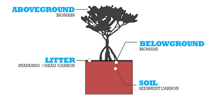
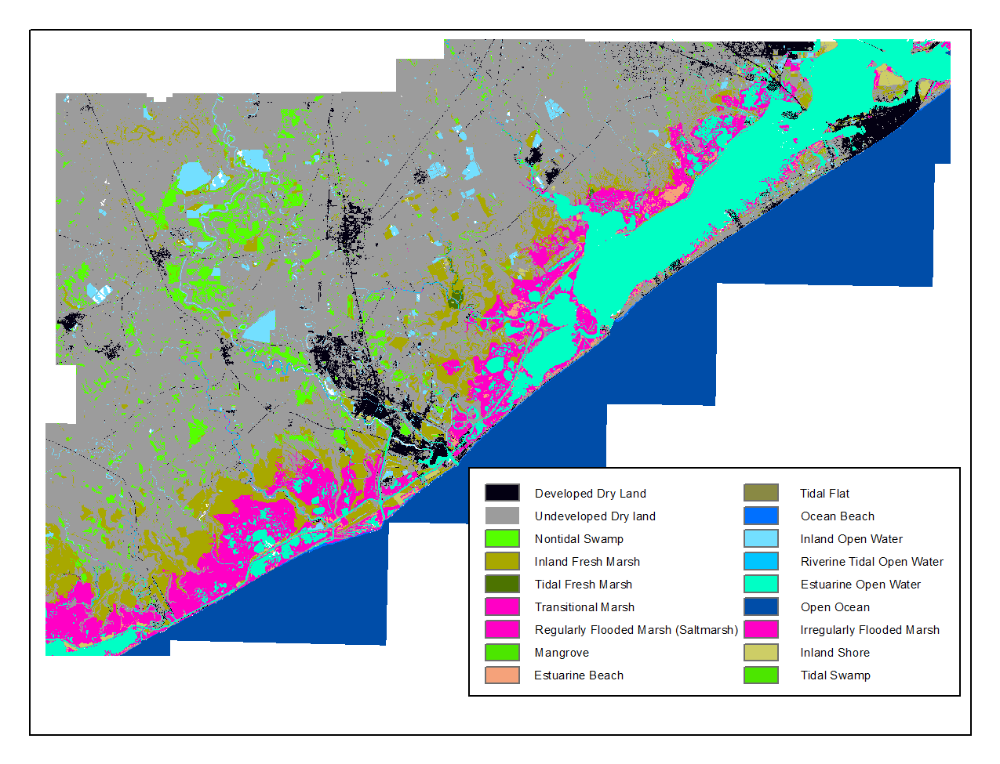
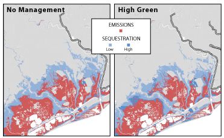

.. _coastal-blue-carbon:

*******************
Coastal Blue Carbon
*******************

Summary
=======

Marine and terrestrial ecosystems help regulate Earth's climate by adding and removing greenhouse gases (GHGs) such as carbon dioxide (CO\ :sub:`2`) from the atmosphere.  Coastal marine plants, mangroves and seagrasses in particular, store large amounts of carbon in their sediments, leaves and other biomass. By storing carbon, marine ecosystems keep CO\ :sub:`2` out of the atmosphere, where it would otherwise contribute to climate change.  In addition to storing carbon, marine ecosystems continually accumulate carbon in their sediments, creating large reservoirs of long-term sequestered carbon. Management activities that change the cover of coastal vegetation, such as seagrass restoration or mangrove clearing, can change carbon storage and the potential for carbon sequestration in coastal and marine areas.  With estimates of the social value, or where available, market value of carbon, the InVEST Coastal Blue Carbon model quantifies the marginal value of storage and sequestration services by comparing change in stock and accumulation of carbon between current and future scenarios.  In addition to comparisons between scenarios, the InVEST blue carbon model can be used to identify locations within the landscape where degradation of coastal ecosystems should be avoided in order to maintain carbon storage and sequestration services and values.

Introduction
============

This model combines estimates of the social value of carbon with information about 1) the distribution and abundance of coastal vegetation, 2) habitat-specific carbon stock data, 3) disturbance of biomass and soil carbon, and 4) accumulation rates to estimate carbon storage, sequestration and value across a land or seascape. To quantify the value of carbon storage and sequestration, the model focuses on changes in atmospheric carbon dioxide and other greenhouse gases as a result of changes caused by human activities that can affect marine ecosystems which store and sequester carbon.  Carbon-induced changes in the atmosphere have wide-ranging effects on natural systems and can thus result in changes in agricultural productivity, air quality, sea levels, and more. The InVEST Blue Carbon model incorporates information about changes in the storage and sequestration capacity of the marine vegetation with economic factors into a single model which can estimate the value of carbon sequestration/emissions from land/seascape change.

The Model
=========

Modeling Considerations
-----------------------

Mapping and modeling changes in carbon storage and sequestration for coastal and marine habitats can present challenges.  The types of spatial inputs and available information about the carbon cycle vary by location.  Some study areas may have high-quality data available for a detailed analysis while other locations may not have the information necessary to model changes in the position and function of coastal vegetation.  Salt marsh, for example, is often studied in the context of migration from rising seas.  The combination of natural (e.g. rising seas) and anthropogenic (e.g. saltmarsh migration blocked by roads) factors should be included in scenario maps and subsequent carbon modeling when possible.  When exploring future land cover scenarios, land cover map outputs produced by the SLAMM model (Sea Level Affecting Marshes Model, developed by Warren Pinnacle) can be useful inputs to the InVEST Coastal Blue Carbon model (Clougheet et al. 2010).  However, because not all sites have the detailed elevation and habitat information required to run SLAMM, we have built a flexible approach that allows users to provide either detailed land use/land cover maps or maps indicating the presence of coastal and marine vegetation that can sequester carbon.

How it Works
------------

InVEST Coastal Blue Carbon models the carbon cycle through a bookkeeping-type approach (Houghton, 2003). This approach simplifies the carbon cycle by accounting for storage in three main pools (biomass, sediment carbon (i.e. soil), and standing dead carbon (i.e. litter) see Figure 1).  Accumulation of carbon in coastal habitats occurs primarily in sediments (Pendleton et al., 2012).  The model requires users to provide maps of coastal ecosystems that store carbon, such as mangroves and seagrasses.  Users must also provide data on the amount of carbon stored in the three carbon pools and the rate of annual carbon accumulation in the biomass and sediments. If local information is not available, users can draw upon the global database of values for carbon stocks and accumulation rates sourced from the peer-reviewed literature that is included in the model.  If data from field studies or other local sources are available, these values should be used instead of those in the global database.  The model requires land cover maps, which represent changes in human use patterns in coastal areas or changes to sea level, to estimate the amount of carbon lost or gained over a specified period of time.  The model quantifies carbon storage across the land or seascape by summing the carbon stored in these three carbon pools.

Figure 1. Three carbon pools for marine ecosystems included in the InVEST blue carbon model (mangrove example).

.. figure:: ./coastal_blue_carbon_images/conceptual_diagram.png

Figure 2.  [UPDATE NEEDED HERE] Conceptual diagram of the InVEST blue carbon model

A.  Carbon Storage
^^^^^^^^^^^^^^^^^^
The carbon stored in a grid cell :math:`x` at time :math:`t`, given by :math:`C_xt` and measured in tons of CO\ :sub:`2` equivalent, is equal to the sum of the carbon stored in each pool in the grid cell at any time (:math:`t`),

.. math:: C_{xt} = {\sum^{J}_{j=1}}A_{xjt}(C_{bj} + C_{sj} + C_{lj})

where :math:`A_{xjt}` is the area of coastal blue carbon habitat :math:`j` in grid cell :math:`x` at time :math:`t`. :math:`j= 1, 2, ...J` indexes all the habitat types in a coastal area. :math:`C_{aj}`, :math:`C_{bj}`, :math:`C_{sj}`, :math:`C_{lj}` indicate the metric tons of CO\ :sub:`2` equivalent stored per hectare in the biomass, soil and litter pools of habitat :math:`j` respectively. Coastal blue carbon habitats can simply indicate the dominant vegetation type (e.g., eelgrass, mangrove etc), or they can be based on details that affect pool storage values such as plant species, vegetation density, temperature regime, or vegetation age (e.g., time since restoration or last major disturbance).

For the sake of the carbon storage estimation, each coastal blue carbon habitat is assumed to be in storage equilibrium at any point in time (accumulation of carbon will be accounted for in the sequestration component of the model).

B.  Carbon Accumulation
^^^^^^^^^^^^^^^^^^^^^^^^

We model accumulation as the rate of carbon retained in the soil in organic form after the first year of decomposition. In relation to the annual ecosystem budget, this pool has not been remineralized, so it represents net accumulation. This carbon is usually derived from belowground production, and residence time can range from decades to millennia (Romero et al. 1994, Mateo et al. 1997). This accumulation contributes to the development of carbon "reservoirs" which are considered virtually permanent unless disturbed. Thus, even in the absence of a land-use or land-cover change, carbon continues to be sequestered naturally.

We estimate accumulation by multiplying habitat specific rates of carbon accumulation by the total area of vegetation. The carbon accumulated in a grid cell :math:`x` at time :math:`t`, given by :math:`Accum_{xt}` and measured in tons of CO\ :sub:`2` equivalent per year, is equal to the rate of carbon accumulation in the sediments at time :math:`t`, where :math:`A_{xjt}` is the area of vegetation :math:`j` in grid cell :math:`x` at time :math:`t`.

.. math:: Accum_{xt} = {\sum^{J}_{j=1}}A_{xjt}(Accum_{xjt})

Loss of carbon from the soil pool (sediments) upon disturbance is more nuanced than sequestration because different types of human uses and/or stasis may cause varied disruption of the soils and the carbon stored below.  For example, high impact activities such as clearing mangroves for a shrimp pond or sediment dredging may result in a larger soil carbon disturbance, than commercial fishing or oil exploration.  The impacts from coastal development on carbon storage varies since some types of development may involve paving over the soil, which often keeps a large percentage of the carbon stored intact.  Alternatively, dredging could remove seagrasses and disturb the sediments below, releasing carbon into the atmosphere.

C.  Carbon Loss and Emissions After Habitat Disturbance
^^^^^^^^^^^^^^^^^^^^^^^^^^^^^^^^^^^^^^^^^^^^^^^^^^^^^^^
When coastal ecosystems are degraded by human activities, the carbon stored in the living plant material (above and belowground) and the soil may be emitted to the atmosphere. The magnitude of post-conversion CO\ :sub:`2` release depends on the type of vegetation disturbed and the level of disturbance. The type of disturbance will determine the amount of aboveground biomass loss and depth to which the soil profile will be altered. The deeper the effects of the disturbance, the more soil carbon that will be exposed to oxygen, oxidized and consequently emitted in the form of CO\ :sub:`2`. Some disturbances will only disturb the top soil layers while the deeper layers remain inundated and their carbon intact.  Other disturbances may affect several meters of the soil profile. To estimate the extent of impact of various disturbances, we classify disturbances into three categories of impact: high, medium and low.  Examples of high impact disturbances include mangrove conversion to shrimp farms and draining or diking salt marshes for conversion to agriculture.  Low impact disturbance examples include recreational boating or float home marinas.

Magnitude of Loss
"""""""""""""""""
We model the release of carbon from the biomass and soil pools by estimating the fraction of carbon lost from each pool.  The fraction of carbon lost is determined by the coastal blue carbon habitat and the level of impact from the disturbance (see Table 1).

The carbon emitted post-disturbance,

.. math:: E_x = {\sum^{J}_{j=1}}A_{xjt}((b*Cb_{j}) + (s*Cs_{j}) + Cl_{j})

where :math:`b` and :math:`s` are respectively the percentages of carbon biomass and soil emitted due to the disturbance.

The InVEST Coastal Blue Carbon model allows users to provide details on the level of disturbance that occurs during a transition from a coastal blue carbon habitat to a non-coastal blue carbon habitat.  This information can be provided to the model through a pre-processor tool (See "Transition Storage" section) and further clarified with an input transition table.

.. math:: L_x = A_{x}*(Cb_{x} + Cl_{x} + Cs_{x})

where

* :math:`L_x` is carbon that is disturbed by the transition and will be released in cell :math:`x`

Timing of Loss
""""""""""""""
Carbon will be lost from the pools at different rates: most of the biomass carbon will be emitted within the first year, whereas the release of soil carbon may take much longer. We assign exponential decay functions and associated half-lives for biomass and soil carbon to each habitat type (Table 1; Murray et al. 2011).

.. math:: E_x = A_{x}[1 - (0.5^{(t_n-t_{n-1})/\alpha_{bx}} * b * C_{bx} + 0.5^{(t_n-t_{n-1})/\alpha_{sx}} * s * C_{sx})]

where

 * :math:`E_x` is the emission of carbon from time :math:`t_{n-1}` to :math:`t_n` in cell :math:`x`
 * :math:`\alpha_{bx}` is the half-life decay for biomass carbon in cell :math:`x`
 * :math:`\alpha_{sx}` is the half-life decay for soil carbon in cell :math:`x`

+------------------------------------+----------------------------------------------------------------------------------------------------+-------------------------------------------------------------------------------------------------------------------+----------------------------------------------------------------------------------------------------------------------------------------+--------------------------------------+
| Rank                               | Salt marshes                                                                                       | Mangroves                                                                                                         | Seagrasses                                                                                                                             | Other vegetation                     |
+====================================+====================================================================================================+===================================================================================================================+========================================================================================================================================+======================================+
| **% carbon loss from biomass**     | | LI / MI: 50% biomass loss (1)                                                                    | | LI / MI: 50% biomass loss (1)                                                                                   | | LI / MI: 50% biomass loss (1)                                                                                                        | Use literature / field data          |
|                                    | | HI: 100% biomass loss (1)                                                                        | | HI: 100% biomass loss (1)                                                                                       | | HI: 100% biomass loss (1)                                                                                                            |                                      |
+------------------------------------+----------------------------------------------------------------------------------------------------+-------------------------------------------------------------------------------------------------------------------+----------------------------------------------------------------------------------------------------------------------------------------+--------------------------------------+
| **% carbon loss from soil^**       | | LI: 30% loss (1)                                                                                 | | LI: 30% loss (1)                                                                                                | | LI / MI: top 10% washes away, bottom 90% decomposes in place (2)                                                                     | Use literature / field data          |
|                                    | | MI / HI: 100% loss (3)                                                                           | | MI: 50% loss (1)                                                                                                | | HI: top 50% washes away, bottom 50% decomposes in place (2)                                                                          |                                      |
|                                    |                                                                                                    | | HI: 66% loss (up to 1.5 m depth) (1)                                                                            |                                                                                                                                        |                                      |
+------------------------------------+----------------------------------------------------------------------------------------------------+-------------------------------------------------------------------------------------------------------------------+----------------------------------------------------------------------------------------------------------------------------------------+--------------------------------------+
| **Rate of decay (over 25 years)**  | | Biomass half-life: 6 months (2)                                                                  | | Biomass half-life: 15 years, but assume 75% is released immediately from burning (2)                            | | Biomass half-life: 100 days (2)                                                                                                      | Use literature / field data          |
|                                    | | Soil half-life: 7.5 yrs (2)                                                                      | | Soil half-life: 7.5 years (2)                                                                                   | | Soil half-life: 1 year (2)                                                                                                           |                                      |
+------------------------------------+----------------------------------------------------------------------------------------------------+-------------------------------------------------------------------------------------------------------------------+----------------------------------------------------------------------------------------------------------------------------------------+--------------------------------------+
| **Methane emissions**              | 1.85 T  CO\ :sub:`2`/ha/yr (4)                                                                     | 0.4 T CO\ :sub:`2`/ha/yr                                                                                          | Negligible                                                                                                                             | Use literature / field data          |
+------------------------------------+----------------------------------------------------------------------------------------------------+-------------------------------------------------------------------------------------------------------------------+----------------------------------------------------------------------------------------------------------------------------------------+--------------------------------------+

Table 1: Percent carbon loss and habitat-specific decay rates as a result of low (LI), medium (MI) and high (HI) impact activities disturbing salt marsh, mangrove and seagrass ecosystems.  These default values can be adjusted by modifying the input CSV tables.

References (numbers in parentheses above):

1. Donato, D. C., Kauffman, J. B., Murdiyarso, D., Kurnianto, S., Stidham, M., & Kanninen, M. (2011). Mangroves among the most carbon-rich forests in the tropics. Nature Geoscience, 4(5), 293-297.
2. Murray, B. C., Pendleton, L., Jenkins, W. A., & Sifleet, S. (2011). Green payments for blue carbon: Economic incentives for protecting threatened coastal habitats. Nicholas Institute for Environmental Policy Solutions, Report NI, 11, 04.
3. Crooks, S., Herr, D., Tamelander, J., Laffoley, D., & Vandever, J. (2011). Mitigating climate change through restoration and management of coastal wetlands and near-shore marine ecosystems: challenges and opportunities. Environment Department Paper, 121, 2011-009.
4. Krithika, K., Purvaja, R., & Ramesh, R. (2008). Fluxes of methane and nitrous oxide from an Indian mangrove. Current Science (00113891), 94(2).

Transition Storage (Preprocessor Tool)
"""""""""""""""""""""""""""""""""""""""

The land use / land cover (LULC) maps provide snapshots of a changing landscape and are the inputs that drive carbon accumulation and loss in the model.  The user must first produce a set of coastal and marine habitat maps via a land change model (e.g., SLAMM), a scenario assessment tool, or through manual GIS processing.  The user must then input the LULC maps into the model in chronological order (:math:`t_{0}`, :math:`t_{1}`, ..., :math:`t_{t}`).

For each pixel in the study area, the preprocessor tool will compare the LULC class present at :math:`t_{n}` and then :math:`t_{n+1}` in order to identify the entire domain of transitions.  The preprocessor tool then generates a transition matrix that indicates whether a transition occurs between two habitats (e.g. salt marsh to developed dry land) and whether carbon accumulates or is disturbed once that transition occurs.

This transition matrix produced by the coastal blue carbon preprocessor, and subsequently edited by the user, allows the model to identify where human activities and natural events disturb carbon stored by vegetation.   If a transition from one LULC class to another does not occur during any of the time steps, the cell will be left blank.  For cells in the matrix where transitions occur, the tool will populate a cell with "accumulation" in the cases where a non-coastal blue carbon habitat transitions to a coastal blue carbon habitat or a coastal blue carbon habitat transitions to another coastal blue carbon habitat, "disturbance" in the case where a coastal blue carbon habitat transitions to a non-coastal blue carbon habitat, or "no-carbon-change" in the case where a non-coastal blue carbon habitat transitions to another non-coastal blue carbon habitat.  For example, if a salt marsh pixel in :math:`t_{0}` is converted to developed dry land in :math:`t_{1}` then the cell will be populated with "disturbance".  On the other hand, if a mangrove remains a mangrove over this same time period then this cell in the matrix will be populated with "accumulation".  It is likely that a mangrove that remains a mangrove will accumulate carbon in its soil and biomass.

The user will then need to modify the "disturbance" cells with either "low-impact-disturbance", "med-impact-disturbance" or "high-impact-disturbance" depending on the level of disturbance that occurs as the transition occurs between lulc types. This gives the user more fine-grained control over emissions due to disturbance.   For example, rather than provide only one development type in an LULC map, a user can separate out the type into two development types and update the transition matrix accordingly so that the model can more accurately quantify and map changes in carbon as a result of natural and anthropogenic factors.  Similarly, different species of mangroves may accumulate soil carbon at different rates.  If this information is known, it can improve the accuracy of the model to provide this species distinction (two different classes in the LULC input maps) and then the associated accumulation rates in the Carbon Pool Transient Values CSV table.

Limitations and Simplifications
===============================

In the absence of detailed knowledge on the carbon dynamics in coastal and marine systems, we take the simplest accounting approach and draw on published carbon stock datasets from neighboring coastlines.  We use carbon estimates from the most extensive and up-to-date published global datasets of carbon storage and accumulation rates (e.g., Fourqurean et al. 2012 & Silfeet et al. 2011).

 * We assume all storage and accumulation occurs in the biomass and soil pools.
 * We ignore increases in stock and accumulation with growth and aging of habitats.
 * We assume that carbon is stored and accumulated linearly through time between the current and future scenarios.
 * We assume that some human activities that may degrade coastal ecosystems do not disturb carbon in the sediments.

Data Needs
==========

Biophysical Inputs
------------------

The following are the data needs for the biophysical portion of the InVEST Coastal Blue Carbon model:

 * **Land Use/Land Cover (LULC) maps**: Maps of initial (:math:`t_{1}`) and future (:math:`t_{t}`) LULC (e.g., developed dry land, shrimp aquaculture, mangrove forest, salt marsh, etc).

 * **Years of provided LULC maps**: (:math:`t_{1}`, :math:`t_{t}`, ...), the model uses these years to determine length of time (number of years; (:math:`t_{2}` - :math:`t_{1}`) of the analysis and multiplies this value by the user-specified accumulation rates (tons of CO\ :sub:`2`/ha/yr).  If the user is only interested in the standing stock of carbon at :math:`t_{1}`, then this input is optional.

* **Carbon pool initial values by LULC class**: A collection of values of carbon storage in biomass (tonnes of CO\ :sub:`2`/ha), soil (tonnes of CO\ :sub:`2`/ha), and litter (tonnes of CO\ :sub:`2`/ha) for each lulc class.

 * **Transition matrix**: A table produced by the preprocessor tool that indicates either disturbance or accumulation of carbon based on preprogrammed logic for LULC transitions from :math:`t_{n}}` to :math:`t_{n+1}`.  Disturbance values must be modified by user.

 * **Carbon pool transient values by LULC class**: A collection of values on the accumulation rate (tonnes of CO\ :sub:`2`/ha-yr), percent disturbance and half-lives of carbon emitted over time within the biomass and soil pools of each lulc class.

Running the Model
=================

Coastal Blue Carbon Preprocessor
--------------------------------

Overview
~~~~~~~~

The preprocessor is used to detect which lulc classes transition to other lulc classes between snapshots and the direction in which carbon transfer occurs.  The output of the preprocessor is a land-cover transition matrix with pre-populated values indicting whether carbon is being sequestered or emitted into the atmosphere.

Land Cover Transition Types:

* Carbon Accumulation
  - Other LULC-Class --> CBC-Habitat
  - CBC-Habitat --> CBC-Habitat
* Carbon Disturbance
  - CBC-Habitat --> Other LULC-Class
* Unchanged
  - Other LULC-Class --> Other LULC-Class

Inputs
~~~~~~

1. **Workspace Folder**:  The selected folder is used as the workspace where all intermediate and final output files will be written.  If the selected folder does not exist, it will be created.  If datasets already exist in the selected folder, they will be overwritten.

2. **Results Suffix (Optional)**:  This text will be appended to the end of the yield function output folders to help seperate outputs from multiple runs.  Please see the `Interpreting Results`_ section for an example folder structure for outputs.

3. **LULC Lookup Table (CSV)**:  A CSV table used to map lulc classes to their values in a raster, as well as to indicate whether or not the lulc-class is a coastal blue carbon habitat.

 ==========  =====  ==============================
 lulc-class  code   is_coastal_blue_carbon_habitat
 ==========  =====  ==============================
 <str>       <int>  <bool>
 ...         ...    ...
 ==========  =====  ==============================

4. **Land-Use/Land-Cover Snapshots (Rasters)**:  A set of GDAL-supported rasters representing the land/seascape at particular points in time.  Provided in chronological order.

  +---+---+
  |int|int|
  +---+---+
  |int|int|
  +---+---+

Outputs
~~~~~~~

**Output Folder Structure**

.. code::

  .
  |-- outputs
      |-- transitions.csv
      |-- carbon_pool_initial_template.csv
      |-- carbon_pool_transient_template.csv

**Outputs**

1. **LULC Transition Effect on Carbon Emissions (CSV)**: This transition matrix describes the direct and rate at which carbon-dioxide moves. The top row represents the source lulc-class, and the left-most column represents the destination lulc-class. Depending on the transition type, a cell will be prepopulated with one of the following: (empty), 'no-carbon-change', 'accumulation', 'disturbance'. It is up to the user to edit the 'disturbance' cells with the degree to which distance occurs due to the change.  This is done by changing 'disturbance' to either 'low-impact-disturbance', 'med-impact-disturbance', or 'high-impact-disturbance'.

 ==========  =======  =======  ===
 lulc-class  <lulc1>  <lulc2>  ...
 ==========  =======  =======  ===
 <lulc1>     <str>    <str>    ...
 <lulc2>     <str>    <str>    ...
 ...         ...      ...      ...
 ==========  =======  =======  ===

Coastal Blue Carbon Model
-------------------------

**Workspace Folder**:  The selected folder is used as the workspace where all intermediate and final output files will be written.  If the selected folder does not exist, it will be created.  If datasets already exist in the selected folder, they will be overwritten.

**Results Suffix (Optional)**:  This text will be appended to the end of the yield function output folders to help separate outputs from multiple runs.  Please see the `Interpreting Results`_ section for an example folder structure for outputs.

**LULC Lookup Table (CSV)**:  A CSV table used to map lulc classes to their values in a raster, as well as to indicate whether or not the lulc-class is a coastal blue carbon habitat.

 ==========  =====  ==============================
 lulc-class  code   is_coastal_blue_carbon_habitat
 ==========  =====  ==============================
 <str>       <int>  <bool>
 ...         ...    ...
 ==========  =====  ==============================

**LULC Snapshots (Rasters)**:  A set of GDAL-supported rasters representing the land/seascape at particular points in time.  Provided in chronological order.

**LULC Snapshot Years**: A set of years that respectively correspond to the provided lulc snapshot rasters. Provided in chronological order.

**Analysis Year** (Optional): A date after the provided snapshot years at which to estimate trends in accumulation and disturbance that occur after the last provided lulc snapshot raster.

**LULC Transition Effect on Carbon Emissions (CSV)**: Generated by the preprocessor.  This file must be edited before it can be used by the main model.  The left-most column represents the source lulc-class, and the top row represents the destination lulc-class.

 ==========  =======  =======  ===
 lulc-class  <lulc1>  <lulc2>  ...
 ==========  =======  =======  ===
 <lulc1>     <str>    <str>    ...
 <lulc2>     <str>    <str>    ...
 ...         ...      ...      ...
 ==========  =======  =======  ===

**Carbon Pool Initial Variables Table (CSV)**: The provided CSV table contains information related to the initial conditions of the carbon stock within each of the three pools of a habitat. Biomass includes carbon stored above and below ground.  All non-coastal blue carbon habitat lulc classes are assumed to contain no carbon.

 ==========  =======  =======  =======
 lulc-class  biomass  soil     litter
 ==========  =======  =======  =======
 <str>       <float>  <float>  <float>
 ...         ...      ...      ...
 ==========  =======  =======  =======

**Table of Transient Variables for Carbon Accumulation/Disturbance (CSV)**: The provided CSV table contains information related to the transition of carbon into and out of coastal blue carbon pools.  All non-coastal blue carbon habitat lulc classes are assumed to neither sequester nor emit carbon as a result of change.

 ==========  =======  =========  ===================  ======================  ======================  =======================
 lulc-class  pool     half-life  yearly_accumulation  low-impact-disturbance  med-impact-disturbance  high-impact-disturbance
 ==========  =======  =========  ===================  ======================  ======================  =======================
 <lulc1>     biomass  <float>     <float>             <float>                 <float>                 <float>
 <lulc1>     soil     <float>     <float>             <float>                 <float>                 <float>
 <lulc2>     biomass  <float>     <float>             <float>                 <float>                 <float>
 <lulc2>     soil     <float>     <float>             <float>                 <float>                 <float>
 ...         ...      ...         ...                          ...                     ...                        ...
 ==========  =======  =========  ===================  ======================  ======================  =======================

Interpreting Results
====================

Coastal Blue Carbon Model
-------------------------

**Output Folder Structure**

.. code::

  .
  |-- outputs
      |-- stock_at_[year].tif (at snapshots + analysis year)
      |-- sequestration_from_[year]_to_[year].tif (between snapshots) (non-positive values are nodata)
      |-- emissions_from_[year]_to_[year].tif (between snapshots) (non-positive values are nodata)
      |-- net_sequestion_from_[year]_to_[year].tif (between snapshots)

**Outputs**

1. **Stock Rasters**:

2. **Sequestration Rasters**:

3. **Emissions Rasters**:

4. **Net Sequestration Rasters**:

Example Use-Case
================

reeport, Texas
---------------

Summary
^^^^^^^

Over the next 100 years, the US Gulf coast has been identified as susceptible to rising sea levels.  The use of the InVEST blue carbon model serves to identify potential changes in the standing stock of carbon in coastal vegetation that sequester carbon.  This approach in Freeport, TX was made possible with rich and resolute elevation and LULC data sets.  We used a 10-meter DEM with sub-meter vertical accuracy to model marsh migration and loss over time as a result of sea level rise using Warren Pinnacle's SLAMM (Sea Level Affected Marsh Model).  Outputs from SLAMM serve as inputs to the InVEST blue carbon model which permits the tool to map, measure and value carbon sequestration and emissions resulting from coastal land cover change over a 94-year period.

The Sea Level Affecting Marshes Model (SLAMM: http://www.warrenpinnacle.com/prof/SLAMM/) models changes in the distribution of 27 different coastal wetland habitat types in response to sea-level rise.  The model relies on the relationship between tidal elevation and coastal wetland habitat type, coupled with information on slope, land use, erosion and accretion to predict changes or loss of habitat.  SLAMM outputs future habitat maps for user-defined time steps and sea-level rise scenarios. These future habitat maps can be utilized with InVEST service models to evaluate resultant changes in ecosystem services under various sea-level rise scenarios (e.g. 1 meter SLR by 2100).

For example, SLAMM was used to quantify differences in carbon sequestration over a range of sea-level rise projections in Galveston Bay, Texas, USA.  First, SLAMM was used to map changes in the distribution of coastal wetland habitat over time under different sea-level rise projections.  Then, the InVEST blue carbon model was used to evaluate changes in carbon sequestration associated with predicted changes in habitat type.  The 27 land-cover classes modeled by SLAMM were condensed into a subset relevant to carbon sequestration and converted from ASCII to raster format for use with InVEST.  SLAMM results produced LULC maps of future alternative scenarios over 25-year time slices beginning in 2006 and ending in 2100.  The following figure depicts 2006 LULC and a table of disaggregated land class types.

Figure CS1. Current (2006) LULC map of Freeport, Texas

Carbon stored in the sediment ('soil' pool) was the focus of this analysis.  The vast majority of carbon is sequestered in this pool by coastal and marine vegetation.  See the case study limitations for additional information.  To produce maps of carbon storage at the different 25-year time steps, we used the model to perform a simple "look-up" to determine the amount of carbon per 10-by-10 meter pixel based on known storage rates from sampling in the Freeport area (Chmura et al. 2003).

Next, we provide the InVEST model with a transition matrix in order to identify the amount of carbon gained or lost over each 25-year tiume step.  Annual accumulation rates in salt marsh were also obtained from Chmura et al. (2003).  When analyzing the time period from 2025 to 2050, we assume :math:`t_{2}` = 2025 and :math:`t_{3}` = 2050.  We identify all the possible transitions that will result in either accumulation or loss of carbon.  The model compares the two LULC maps (:math:`t_{2}` and :math:`t_{3}`) to identify any pixel transitions from one land cover type to another.  We apply these transformations to the standing stock of carbon which is the running carbon tally at :math:`t_{2}` (2025).  Once these adjustments are complete, we have a new map of standing carbon for :math:`t_{3}` (2050).  We repeat this step for the next time period where :math:`t_{3}` = 2050 and :math:`t_{4}` = 2075.  This process was repeated until 2100.  The model produces spatially explicit depictions of net sequestration over time as well as summaries of net gain/emission of carbon for the two scenarios at each 25-year time step.  This information was used to determine during which time period for each scenario the rising seas and resulting marsh migration led to net emissions for the study site and the entire Freeport area.

+------------------------------------------+----------------------------+-------------------------+
| Time Period                              | Scenario #1: No Management | Scenario #2: High Green |
+==========================================+============================+=========================+
|  2006-2025 (:math:`t_{1}`-:math:`t_{2}`) | +4,031,180                 | +4,172,370              |
+------------------------------------------+----------------------------+-------------------------+
|  2025-2050 (:math:`t_{2}`-:math:`t_{3}`) | -1,170,580                 | +684,276                |
+------------------------------------------+----------------------------+-------------------------+
|  2050-2075 (:math:`t_{3}`-:math:`t_{4}`) | -7,403,690                 | -5,525,100              |
+------------------------------------------+----------------------------+-------------------------+
|  2075-2100 (:math:`t_{4}`-:math:`t_{5}`) | -7,609,020                 | -8,663,600              |
+------------------------------------------+----------------------------+-------------------------+
|  100-Year Total:                         | -12,152,100                | -9,332,050              |
+------------------------------------------+----------------------------+-------------------------+

Table CS1. Carbon sequestration and emissions for each 25-year time period for the two scenarios of the entire Freeport study area.

Figure CS2. Carbon emissions (red) and sequestration (blue) from 2006 to 2100 for the two scenarios and a subset of the Freeport study area.

The following is table summarizing how the main inputs, where they were obtained and how they were used in the model:

+--------------------------------------------+--------------------------------------------------+-----------------------------------------------------------------------------------------------------------------------------------------------------------------------------------------------------------------------------------------------------------------------------------------------------------------------------------------------------------------------------------------------------------------------------------------------------------------------------------------------------------------------------------------------------------------------------------------------------------------------------------+
| Input                                      | Source                                           | Use in the InVEST blue carbon model                                                                                                                                                                                                                                                                                                                                                                                                                                                                                                                                                                                               |
+============================================+==================================================+===================================================================================================================================================================================================================================================================================================================================================================================================================================================================================================================================================================================================================================+
| DEM                                        | USGS                                             | DEM was needed to produce the future LULC maps using the SLAMM tool.                                                                                                                                                                                                                                                                                                                                                                                                                                                                                                                                                              |
+--------------------------------------------+--------------------------------------------------+-----------------------------------------------------------------------------------------------------------------------------------------------------------------------------------------------------------------------------------------------------------------------------------------------------------------------------------------------------------------------------------------------------------------------------------------------------------------------------------------------------------------------------------------------------------------------------------------------------------------------------------+
| Land use / land cover (LULC)               | USGS/NOAA                                        | Salt marshes store carbon in biomass and soils.  We utilized maps showing the current distribution of salt marshes to establish a baseline coverage of marshes from which we estimate aboveground biomass and soil carbon.                                                                                                                                                                                                                                                                                                                                                                                                        |
+--------------------------------------------+--------------------------------------------------+-----------------------------------------------------------------------------------------------------------------------------------------------------------------------------------------------------------------------------------------------------------------------------------------------------------------------------------------------------------------------------------------------------------------------------------------------------------------------------------------------------------------------------------------------------------------------------------------------------------------------------------+
| Carbon stock in salt marsh systems         | Natural Capital Project literature review        | Carbon storage was calculated by summing the carbon stored in biomass and sediments.  Carbon stocks were calculated for all of the areas of functional salt marsh in the study region (Chmura et al. 2003).                                                                                                                                                                                                                                                                                                                                                                                                                       |
+--------------------------------------------+--------------------------------------------------+-----------------------------------------------------------------------------------------------------------------------------------------------------------------------------------------------------------------------------------------------------------------------------------------------------------------------------------------------------------------------------------------------------------------------------------------------------------------------------------------------------------------------------------------------------------------------------------------------------------------------------------+
| Social value of carbon in 2006 US $        | USIWGSCC 2010                                    | The "social cost of carbon" (SCC) is an estimate of the monetized damages associated with an incremental increase in carbon emissions in a given year.  It is intended to include (but is not limited to) changes in net agricultural productivity, human health, property damages from increased flood risk, and the value of ecosystem services.  The social cost of carbon is useful for allowing institutions to incorporate the social benefits of reducing carbon dioxide (CO\ :sub:`2`) emissions into cost benefit analyses of management actions that have small, or "marginal," impacts on cumulative global emissions. |
+--------------------------------------------+--------------------------------------------------+-----------------------------------------------------------------------------------------------------------------------------------------------------------------------------------------------------------------------------------------------------------------------------------------------------------------------------------------------------------------------------------------------------------------------------------------------------------------------------------------------------------------------------------------------------------------------------------------------------------------------------------+
| Discount rate                              | USIWGSCC 2010                                    | This discount rate reflects society's preferences for short run versus long term consumption.  Since carbon dioxide emissions are long-lived, subsequent damages occur over many years.  We use the discount rate to adjust the stream of future damages to its present value in the year when the emissions were changed.                                                                                                                                                                                                                                                                                                        |
+--------------------------------------------+--------------------------------------------------+-----------------------------------------------------------------------------------------------------------------------------------------------------------------------------------------------------------------------------------------------------------------------------------------------------------------------------------------------------------------------------------------------------------------------------------------------------------------------------------------------------------------------------------------------------------------------------------------------------------------------------------+

Table CS2. Input summary table for using InVEST blue carbon model in Freeport, Texas

Limitations
^^^^^^^^^^^
 * This analysis did not model change in carbon resulting from growth or loss of aboveground biomass of coastal and marine vegetation.
 * While the spatial resolution of the LULC maps produced by SLAMM was very high (10 meters), the temporal resolution provided by SLAMM was quite coarse (25-year time steps).  The carbon cycle is a dynamic process.  By analyzing change over 25-year time periods, we ignore any changes that are not present at the start and end of each time step.

References
==========

Baumol, W. J. (1968). On the social rate of discount. The American Economic Review, 788-802.

Bouillon, S., Borges, A. V., Castañeda-Moya, E., Diele, K., Dittmar, T., Duke, N. C., ... & Twilley, R. R. (2008). Mangrove production and carbon sinks: a revision of global budget estimates. Global Biogeochemical Cycles, 22(2).

Chmura, G. L., Anisfeld, S. C., Cahoon, D. R., & Lynch, J. C. (2003). Global carbon sequestration in tidal, saline wetland soils. Global biogeochemical cycles, 17(4).

Clough, J. S., Park, R., and Fuller, R. (2010). "SLAMM 6 beta Technical Documentation."  Available
at http://warrenpinnacle.com/prof/SLAMM.

Fourqurean, J. W., Duarte, C. M., Kennedy, H., Marbà, N., Holmer, M., Mateo, M. A., ... & Serrano, O. (2012). Seagrass ecosystems as a globally significant carbon stock. Nature Geoscience, 5(7), 505-509.

Hope, Chris. (2011) "The PAGE09 Integrated Assessment Model: A Technical Description." Cambridge Judge Business School Working Paper No. 4/2011 (April). Available at http://www.jbs.cam.ac.uk/research/working_papers/2011/wp1104.pdf.

Houghton, R. A. (2003). Revised estimates of the annual net flux of carbon to the atmosphere from changes in land use and land management 1850–2000. Tellus B, 55(2), 378-390.

Pendleton, L., Donato, D. C., Murray, B. C., Crooks, S., Jenkins, W. A., Sifleet, S., ... & Baldera, A. (2012). Estimating global “blue carbon” emissions from conversion and degradation of vegetated coastal ecosystems. PLoS One, 7(9), e43542.

Rosenthal, A., Arkema, K., Verutes, G., Bood, N., Cantor, D., Fish, M., Griffin, R., and Panuncio, M. (In press). Identification and valuation of adaptation options in coastal-marine ecosystems: Test case from Placencia, Belize. Washington, DC: InterAmerican Development Bank. Technical Report.

Sifleet, S., Pendleton, L., and B. Murray. (2011). State of the Science on Coastal Blue Carbon. Nicholas Institute Report, 1-43.

United States, Interagency Working Group on Social Costs of Carbon. (2010) "Technical Support Document: Social Cost of Carbon for Regulatory Impact Analysis Under Executive Order 12866." Available at http://www.epa.gov/otaq/climate/regulations/scc-tsd.pdf.

United States, Interagency Working Group on Social Costs of Carbon. (2013) "Technical Update of the Social Cost of Carbon for Regulatory Impact Analysis Under Executive Order 12866." Available at http://www.whitehouse.gov/sites/default/files/omb/inforeg/social_cost_of_carbon_for_ria_2013_update.pdf.

World Bank. (2012). State and Trends of the Carbon Market 2012. Washington DC: The World Bank, 133.
