.. _coastal-protection:

         

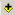

************************
Coastal Protection Model
************************

Summary
=======

Understanding the role that nearshore habitats play in the protection of coastal communities is increasingly important in the face of a changing climate and growing development pressure.  The InVEST Coastal Protection model quantifies the protective benefits that natural habitats provide against erosion and inundation (flooding) in nearshore environments.  It is composed of two sub-models: a Profile Generator and a Nearshore Wave and Erosion model.  In the absence of local data detailing the profile of the nearshore elevations, the Profile Generator model helps users combine information about the local bathymetry and backshore to generate a 1-Dimensional (1D) cross-shore (perpendicular to the shoreline) beach profile.  The Nearshore Waves and Erosion model uses the cross-shore profile (either uploaded or created using the Profile Generator) to compute summaries of nearshore wave information and outputs the total water level and the amount of shoreline erosion in the presence and absence of nearshore marine habitats (e.g., coral or oyster reefs, vegetation, sand dunes).  Outputs can be used to better understand the relative contributions of different natural habitats in reducing nearshore wave energy levels and coastal erosion and to highlight the protective services offered by natural habitats to coastal populations.  This information can help coastal managers, planners, landowners and other stakeholders understand the coastal protection services provided by nearshore habitats, which can in turn inform coastal development strategies and permitting. The model can also be used to approximate a monetary value of habitat in terms of prevented erosion. The model, of course, has some limitations (see :ref:`cp-Limitations`), however, all the science that went into this model has been successfully tested at many sites and is expected to be useful for a wide range of management decisions.  Together with the "Tier 0" Coastal Vulnerability model, this "Tier 1" model, makes up InVEST's coastal protection toolbox.  Please see the introduction (below) for further information about the ways in which these two models can be used complementarily.

Introduction
============

The Coastal Protection model works by way of a 1D bathymetry transect (or a series of transects) perpendicular to the shoreline, from offshore to the beach.  Along each transect, the model computes a profile of wave height and the way in which it changes as it moves onshore.  It takes into account the influence of submerged natural habitats as well as the influence of sand dunes.  These habitats dissipate wave energy and/or act as barriers against high waves and high water levels and eventually protect coastal properties and communities.  The service provided by these habitats can be measured by the amount of avoided erosion or inundation, by the number of people protected or by the value of avoided property damages and shoreline erosion.

The Coastal Protection model is composed of two models: a Profile Generator and a Nearshore Waves and Erosion model.  The purpose of the Profile Generator is to assist in the preparation of a 1D bathymetry transect for use in the Nearshore Waves and Erosion model.  If local, good quality, topography/bathymetry (topo/bathy) data along perpendicular transects are available, running the Profile Generator is not required.  The inputs of the Profile Generator include the site's location, the overall shape of the shoreline, and nearshore topo/bathy.  Furthermore, the model requires information, which does not have to be precise, about sediment size, tidal range and backshore characteristics.  This information is to be provided in the Profile Characteristics Spreadsheet (see :ref:`cp-excel`).  If this information is not available, guidance is provided on how to approximate these inputs.  Outputs of the Profile Generator model include a 1D bathymetry profile at the user specified location, information about the site’s backshore and the location of natural habitats along the cross-shore transect from offshore to the uplands.  In addition, the model provides over-water fetch distances (the distances over which wind blows over water to generate waves) as well as estimates of wave height and wind speeds that can occur at the site of interest during a storm.  Overall, this model generates the inputs users need to run the Nearshore Waves and Erosion model.  

The Nearshore Waves and Erosion model uses information about the type and location of natural habitat at the site to produce a profile of wave height (how it changes along the transect from offshore to onshore), wave-induced changes in water level and the amount of shoreline erosion or scour that occurs.  The model inputs are a 1D bathymetry profile (obtained from the Profile Generator model or a site survey), a value for offshore wave height and period (or a value of wind speed and the direction and distance over which the wind blows to generate waves [fetch] and the average water depth).  Both, values of wave and wind speed should be representative of storm conditions in the area of interest.  In addition, the model requires information about the backshore as well as the type and physical characteristics of the natural habitats that are at the site of interest.  Finally, users will need to specify how their management action will affect the natural habitats at their site: users are required to specify the footprint pre- and post-management action along the modeling transect (profile) as well as the change in habitat density. This information can come from outputs of InVEST's Habitat Risk Assessment (HRA) model or from direct estimates of the effects of particular management actions.  Model outputs are profiles of wave height before and after the management action, as well as the percent change in wave attenuation caused by that management action.  The model also estimates the shoreline retreat of a sandy beach as well as the volume of sediment eroded from consolidated beds (e.g., scour of mud bed) and shows the difference in expected retreat and erosion before and after management actions. If the valuation option is selected, the monetary value of the habitat that has been lost can also be approximated. 

Running these Tier 1 models after the Coastal Vulnerability model, which is also part of the “Coastal Protection” tool box, is recommended.  The Tier 0 Coastal Vulnerability model maps regions that are more or less vulnerable to erosion and inundation during storms and also highlights important characteristics of the region of interest.  In addition, it maps regions of the shoreline that are exposed to or sheltered from the open ocean and estimates wind-generated wave characteristics.  Coastal Vulnerability model outputs that explore the effects of various management actions (e.g., the presence vs absence of natural habitats) will help identify regions where natural habitats or a certain management action may have significant impacts on the stability of the coastline.  However, the Coastal Vulnerability (Tier 0) and Coastal Protection (Tier 1) models are independent.  Users do not need to run the Coastal Vulnerability model in order to to run the Coastal Protection model.

.. _cp-Model:

The model
=========

The InVEST Coastal Protection model is a 1D process-based tool that produces an estimate of wave attenuation and erosion reduction owing to the presence of natural habitats.  A single model run operates along a single transect perpendicular to the shoreline; multiple runs can be distributed along broader swaths of coastline to explore the protective services of natural habitats and the effects of various management actions on the hazards of erosion and flooding within larger regions.  At this point, however, the model does not batch process multiple runs so each transect is run on a individual basis.

How it works
------------

As waves travel from the deep ocean to coastal regions with shallower waters, they start to interact with the seabed.  They first increase in height before breaking and dissipate most of their energy in the surf zone and on the beach face.  Natural habitats play an important role in protecting shorelines against wave action because they increase the amount of wave dissipation, or, in the case of sand dunes, serve as a physical barrier.

To estimate the profile of wave height that one would expect at a certain region as the wave propagates shoreward three types of information are required:

1. Offshore wave characteristics: wave height and wave period at the deepest point in the bathymetry profile.

2. Nearshore bathymetry and backshore characteristics: elevation **relative to Mean Lower Low Water (MLLW)** of both the submerged (underwater) and emerged (above water) portions of the cross-shore profile.

3. Location and physical characteristics of natural habitats: distance from the shoreline of the natural habitats that will become submerged during a storm, as well as representative density, height and diameter of the habitat elements.

The InVEST Coastal Protection model is composed of two sub-models.  The first model, the Profile Generator, helps users obtain cross-shore nearshore bathymetry and topography information at their site.  The Profile Generator can also place the footprints of the natural habitats along the transect.  Using this cross-shore profile (or one that users upload), the Nearshore Waves and Erosion model computes profiles of wave height and wave-induced mean water level in the presence and absence of seagrass, marshes, mangroves or coastal forests, coral reefs and oyster reefs.  When the site is a sandy beach, the model computes the amount of shoreline retreat in the presence and absence of sub-tidal (always submerged), inter-tidal (between high and low tides) and supra-tidal (above the high-water mark) habitats.  When the site is composed of consolidated sediments (e.g., mud), the model estimates the volume of sediment erosion expected in inter- and supra-tidal areas.  The remainder of this section will describe how both the Profile Generator and the Nearshore Waves and Erosion models work.

.. _cp-PG:

Profile Generator Model
^^^^^^^^^^^^^^^^^^^^^^^

In order to run the Nearshore Wave and Erosion model, it is necessary to have nearshore bathymetry and topography information, as well as the location and characteristics of natural habitats at the site of interest.  Also, it is imperative that information about offshore wave heights and associated periods is available. The purpose of the Profile Generator model is to help users glean this information from their site data and help them prepare to run the Wave and Erosion model.  Additionally, the Profile Generator helps users estimate those data (nearshore elevations and slopes) if they do not have them but know the general characteristics of the site.

First, the Profile Generator helps users obtain bathymetry information by three different options. The model interface asks: “Do you want us to cut a cross-shore transect in GIS?”. If the best source of data is a seamless topo/bathy Digital Elevation Model (DEM) or a bathymetric DEM, users answer should answer *“Yes”*. This option requires the user to upload a Digital Elevation Model (DEM). If the uploaded DEM is a seamless DEM with both bathymetry and topography represented, the Profile Generator will capture both topographic as well as bathymetric information.  Otherwise, if the DEM only captures bathymetric elevations and excludes land elevations above the water level, the cut profile will apply erroneous values of 100.0 (meters) for the missing terrestrial portions.  If this is the case, the Profile Generator will filter these erroneous values and will apply the appropriate backshore characteristics provided in the Profile Characteristics Spreadsheet.  The Profile Generator works by drawing a transect perpendicular to the shoreline where the site of interest is located, and reads the bathymetry and, if the DEM provided is seamless, topographic information along that transect. If the site is surrounded by land (sheltered), or is fronted by an island, the offshore portion of the profile might include the adjacent land feature.  To avoid this situation, the model removes any portions of the profile offshore of the deepest point that is shallower than the average depth along the profile.  Additionally, the model interface asks users to specify the length of the profile.  This length should be such that a sufficiently deep point is reached and that any adjacent land features are excluded. Another option is to answer *“No, but I will upload a cross-shore profile”*, and then to upload a profile obtained from another source for further processing.  At the very least, two (X-cross-shore distance from shoreline,Z-elevation relative to Mean Lower Low Water (MLLW)) coordinate points in the uploaded file (which would define a linear profile) is required.  Lastly,  if users do not have bathymetric information at the site of interest, they can choose the third option *“No, please create a theoretical profile for me”*, and the model will generate, **for sandy systems only**, a theoretical bathymetric profile, based on the average sand size at the site.  The depth profile follows the equation (Dean and Dalrymple, 2002, Chap. 7):

.. math:: Z=-AX^{2/3} 
  :label: EqProf

where :math:`(X,Z)` represent the cross-shore distance and depth, with :math:`X=0` at the shoreline.  The coefficient :math:`A` is a profile scale factor and is a function of sediment size (Dean and Dalrymple, p.162 and CEM).  This shape of the bed profile is called an equilibrium beach profile, and corresponds to the average profile that one would obtain after averaging years of regular bathymetric surveys at a sandy beach.  It can also be viewed as a profile that develops when destructive and constructive forces are in equilibrium.  Usually, this profile extends to what’s called the “closure depth”, which is the depth where waves no longer affect sediment movement on the bottom.  However, for simplicity, this profile is extended from the water line down to -20 meters.  Please remember that this option is only valid for sandy systems, for which sediment size varies between 0.1 to 1.09 mm. Further it is most applicable to oceanic or exposed shorelines (recall, **T0: Coastal Vulnerability** helps designate exposed versus sheltered coastlines). 

Once the method that will be used to create an initial bathymetry profile is selected, the Profile Generator will help to modify or add to the information contained in that transect in order to represent the site as accurately as possible.  This is especially useful if users want to estimate the amount of erosion at the site and important backshore details are not captured in the elevation (DEM) or habitat (Polygon Shapefiles) inputs.  It is also useful to the Profile Generator tool if users would like to modify or remove portions of the profile to represent the effects of a management action under consideration or because the user's data need to be post-processed (e.g., remove offshore portions that are too deep to affect wave heights or remove certain bathymetric features before conducting the analysis).

Figure 1 shows profiles of a typical beach and a coastal mangrove forest.  After waves have propogated from deep water and broken in the nearshore, they reach the foreshore and/or backshore portion of the beach, or, if the water level is high enough, propagate through a marsh or a mangrove forest.  Under normal conditions, for sandy beaches there is a relatively flat region between the Mean Lower Low and Mean Higher High (MHHW) water marks called the foreshore.  The backshore (the region above MHHW) consists of a berm and, in temperate regions mostly, a sand dune.  Berms can range in width from 10's of meters to having a very small or no width.  In general, foreshore and backshore information cannot be obtained during standard hydrographic surveys.  Also, we have found that although most DEM files have relatively good bathymetric information, intertidal and backshore elevations are often incorrect, unless they were measured during a detailed topographic survey effort.  Mangrove forests are usually fronted by a tidal flat with an average slope of 1:1000 to 1:2000, and usually have a relatively monotonic profile whose slope varies between 1:200 to 1:600 (de Vos, 2004; Burger, 2005).  In case you would like to measure foreshore and backshore profiles at your site, you can either use standard surveying methods, or follow the simple method in :ref:`cp-Appendix-A`.  However, if you cannot conduct such a survey, you can use recommendation provided in this guide and the Profile Characteristics Spreadsheet for guidance.

.. figure 1

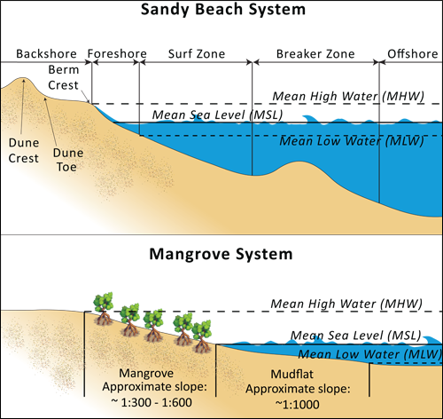

   Typical profiles of a sandy beach (top subplot) and a mangrove forest (bottom subplot).  Please note the locations of the foreshore in the sandy beach as well as the slope of the mangrove forest.

In the Profile Characteristics Spreadsheet, which summarizes the pertinent characteristics of the profile, users must indicate whether the profile of interest is a sandy beach or a muddy backshore.  This option determines what modifications may be made to the cut or user defined topo/bathy profile. 

.. _cp-ProfOptions:

**Option 1. Add backshore to a sandy beach**: assuming that this information is not contained in the cross-shore profile that was cut by the model or in the uploaded profile provided by the user, the Profile Characteristics Spreadsheet (see :ref:`cp-excel`) helps users guess what the foreshore slope, berm height and dune height might be for the site of interest, based on simple rules of thumb.  Please bear in mind that conditions at the site of interest can differ quite substantially from these rules.  Therefore, the suggestions provided should be used as a starting point but a site survey (even as basic as field notes from visual observations) is strongly encouraged if users are interested in obtaining more accurate results.

The average sediment size is required to help approximate foreshore slopes.  The precise sediment size may not be available to the user but values can be selected based on a qualitative description of the sand (very fine, fine, medium, course, or very course).  As mentioned earlier, the foreshore is the intertidal region of the beach profile and is assumed to be linear in the Tier 1 model.  To provide guidance on what that slope might be, five different values of slope, based on the sediment size, are provided.  The first three are derived from observations presented in Wiegel (1964) at beaches that are protected, moderately exposed or fully exposed to the open ocean, in the U.S.  The fourth value is derived from observations by McLachlan and Dorvlo (2005) at various beaches around the world.  The fifth value is the average of the four previous values.  

Berm height and foreshore slope often change as a function of seasonal wave climate. After a storm, the profile is flatter and the berm is lower than during fair weather conditions.  However, in case users do not have any information about berm height at the site, it is recommend that they place the berm at least at the same elevation as the MHW mark.  Finally, a dune height value is needed. Dunes are fairly common in temperate climates and height etimates can be derived from site surveys. However, if survey information is not available but the site is accessible, it is strongly encouraged that users visit the site and verify these inputs based on simple survey methods or even visual observations.    

**Option 2. Add a backshore to a mangrove or marsh.**  Mangrove and marsh beds are different from sandy beaches because they consist, in general, of consolidated materials, do not have dunes, and their profile is, in general, fairly linear.  As mentioned earlier and shown in Figure 1, mangrove forests are usually fronted by a tidal flat with an average slope of 1:1000 to 1:2000, and usually have a relatively monotonic profile whose slope varies between 1:200 to 1:600 (de Vos, 2004; Burger, 2005). If this option is selected, users can enter a maximum of three linear slopes that can be added to the bathymetry profile that was cut/created or that was uploaded by the user.  

Third, the Profile Generator locates the presence of natural habitats along the cross-shore profile.  If Option 1 *“Yes”* to the question *“Do you want us to cut a cross-shore transect in GIS?”* is selected, users can also indicate the types of natural habitats that are present in the region of interst, and the model will locate and plot where those habitats fall onto the cross-shore transect.  This is done by providing the path to the directory containing seperate polygon shapefiles representing the footprints of each habitats. Please note that the results for the habitat placement are accurate only if the natural habitat and bathymetry layers are properly geo-referenced.  Users should scrutinize results to make sure that the natural habitats are properly placed along the profile (e.g., make sure that seagrass beds are in subtidal areas, or mangroves are in inter- or supra-tidal areas).

Finally, if users do not have any storm wave or wind information at the site to run the Nearshore Waves and Erosion model, the Profile Generator will help users obtain those data by reading and providing users with some pre-processed statistics from the closest WAVEWATCH III (WW3, Tolman (2009)) grid point.  Because wave data can be scarce in most regions of the world, 7 years of WW3 model hindcast reanalysis results have been analyzed to estimate, for model grid points that are in waters deeper than 50m, the maximum as well as the average of the top 10% and 25% wave height.  The same statistics for wind data, for 16 equiangular direction sectors (0deg, 22.5deg, 45deg, etc.) have also been calculated.  

Wind information can be used in the Nearshore Waves and Erosion model by combining it with fetch distance (the distance over which waves are generated by wind) as well as the average depth offshore of the site to compute an offshore wave height and period. The model can compute these fetch distances if users choose *Yes* to the question *Do you want the model to compute fetch distances?*.  In that case, from the site location, the model draws 16 equiangular sectors, and in each sector, the model draws nine equiangular radials.  Each radial is initially 50km long, but is cutoff when it intersects with a land mass.  To capture the effects of those land masses that limit fetch distance, the average fetch distance :math:`F_k` for each 22.5deg sectors :math:`k` is weighted by each radial distance and angle (Keddy, 1982):

.. math:: F_k=\frac{\sum_{n=1}^9f_n\cos \theta }{\sum_{n=1}^9\cos \theta }
  :label: AvgFetch

where :math:`f_n` is the :math:`n^{th}` radial distance in the :math:`k^{th}` equiangular sector, and :math:`\theta=2.5deg` (22.5deg divided by 9).   

From wind speed, and fetch distance, wave height and period of the locally generated wind-waves are computed for each of the 16 equiangular sectors as:

.. math::
   \left\{\begin{matrix}
   H=\widetilde{H}_\infty \left[\tanh \left(0.343\widetilde{d}^{1.14} \right )  \tanh \left( \frac{2.14.10^{-4}\widetilde{F}^{0.79}}{\tanh (0.343 \widetilde{d}^{1.14})} \right )\right ]^{0.572}\\ 
    \displaystyle \\
   T=\widetilde{T}_\infty \left[\tanh \left(0.1\widetilde{d}^{2.01} \right )  \tanh \left( \frac{2.77.10^{-7}\widetilde{F}^{1.45}}{\tanh (0.1  \widetilde{d}^{2.01})} \right )\right ]^{0.187}
   \end{matrix}\right.  
   :label: WaveFetch

where the non-dimensional wave height and period :math:`\widetilde{H}_\infty` and :math:`\widetilde{T}_\infty` are a function of the average wind speed values :math:`U` that were observed in a particular sector: :math:`\widetilde{H}_\infty=0.24U^2/g`, and :math:`\widetilde{T}_\infty=7.69U^2/g`, and where the non-dimensional fetch and depth :math:`\widetilde{F}_\infty` and :math:`\widetilde{d}_\infty` are a function of the fetch distance in that sector :math:`F_k` and the average water depth in the region of interest :math:`d [m]`: :math:`\widetilde{F}_\infty=gF/U^2`, and :math:`\widetilde{T}_\infty = gd/U^2`.  :math:`g  [m/s^2]` is the acceleration of gravity.  This expression of wave height and period assumes fetch-limited conditions (USACE, 2002; Part II Chap 2).  Hence, model results may over-estimate wind-generated wave characteristics at a site if the duration of wind steadily blowing in a fetch direction is less than the time required to realize fetch-limited conditions.  Also, wind-waves are not appropriate representations of wave climate on exposed, oceanic coasts.  For oceanic coasts, estimates of representative oceanic wave forcing should be used (from WW3 data or another source) rather than wind-wave estimates. 

Once a satisfcatory bathymetry and topography profile and realistic wave parameters are obtained, users can run the wave Nearshore Waves and Erosion model.

.. _cp-NEW:

Nearshore Waves and Erosion
^^^^^^^^^^^^^^^^^^^^^^^^^^^

The amount of shoreline retreat at sandy beaches is a function of the total water level at the site and storm duration.  The total water level at the shoreline is composed of the sum of storm surge, wave runup, tide, amount of sea-level rise and any water surface elevation anomaly (e.g., super-elevation during an El Niño).  To quantify the protective services provided by natural habitats, the Coastal Protection model computes the amount of attenuation of waves and the reduction in wave-induced mean water level increases (runup) at the shoreline caused by submerged vegetation and reefs.  The erosion of muddy shorelines is a function of wave forcing on the bed and storm duration.  Similarly, the Coastal Protection model can show the reduction in mud erosion due to the reduction in wave forcing (from wave attenuation and runup reduction) attributable to the presence of natural habitats.    

Wave Evolution Model
""""""""""""""""""""

The first step in this model is to estimate the waves that will "attack" the shoreline.  Assuming that waves have a deep water height of :math:`H_o` and a period :math:`T`, it is possible to compute the evolution of wave height from offshore to the shoreline along the x-axis of the user defined cross-shore transect with the following wave energy equation:

.. math:: \frac{1}{8}\rho g \frac{\partial C_g H^2}{\partial x}=-D
    :label: EvolEq

where :math:`\rho` is the density of seawater, taken as :math:`1,024 kg/m^{3}`, :math:`g=9.81 m/s^2` is the gravitational acceleration, :math:`H` is the wave height representative of the random wave field, :math:`C_g` is the speed at which wave energy travels, and :math:`D` represents the dissipation of wave energy.  The role of dissipation is to decrease the amount of wave energy as it propagates through or over different media.  It is the sum of the dissipation caused by wave breaking :math:`D_{Break}`, bottom friction :math:`D_{Bot}`, and submerged vegetation :math:`D_{Veg}` : 

.. math:: D=D_{Break}+D_{Veg}+D_{Bot}
   :label: TotalDiss

Dissipation due to breaking is modeled using the formulation and default parameters presented by Alsina and Baldock (2007), which performed well when compared to various field measurements, even without calibration (Apostos et al., 2008):

.. math:: D_{Break}=A\frac{H^3}{h}\left [ \left ( \left (\frac{H_b}{H}  \right )^3+\frac{3H_b}{2H} \right )) \exp \left ( -\left (\frac{H_b}{H}  \right )^2 \right )+\frac{3\sqrt\pi}{4}\left ( 1-erf\left ( \frac{H_b}{H} \right ) \right ) \right ]
   :label: BreakDiss

where :math:`erf` is the Gauss error function, :math:`h` is the local water depth, :math:`A` is the sediment scale factor (see :ref:`cp-PG`), and :math:`H_b` is the maximum wave height prior to breaking:

.. math:: H_b=\frac{0.88}{k}tanh\left ( \gamma \frac{kh}{0.88} \right )
   :label: Hb

where :math:`k` is the wavenumber, the ratio of length between two wave crests (called wavelength) :math:`L` to :math:`2\pi`, and :math:`\gamma` is a calibration parameter called the breaking index.  The breaking index value, :math:`\gamma`, used in the model is the value proposed by Battjes and Stive (1985):

.. math:: \gamma=0.5+0.4 \tanh\left ( 33\frac{H_o}{L_o} \right )
   :label: gamma

where :math:`H_o` and :math:`L_o` are the deepwater wave height and wavelength, respectively.

The other dissipation terms in Equation :eq:`TotalDiss` are expressed as a function of the characteristics of the natural habitats that are present along the profile of interest.  In the model, as waves move into portions of the profile with natural habitat, this dissipation term is included.  Any non-linear processes that might occur as waves move from one medium or habitat to another as ignored in the model. 

Dissipation due to the presence of vegetation is expressed by (Mendez and Losada, 2004):

.. math:: D_{Veg}=\frac{1}{2\sqrt\pi} \rho N d C_d \left(\frac{kg}{2 \sigma} \right ) ^3 \frac{\sinh ^3 k \alpha h +3 \sinh k \alpha h}{3k \cosh ^3 kh} H^3
   :label: VegDiss

where :math:`N` is the density of vegetation (stems per unit area), :math:`d` is the frontal width or diameter of vegetation stems, and :math:`\alpha` represents the fraction of the water depth :math:`h` occupied by vegetation elements of average stem height :math:`h_c`: :math:`\alpha=\frac{h_c}{h}`.  In the case of emergent vegetation (:math:`h_c>h`), a maximum of :math:`\alpha=1` is applied.  

Finally, :math:`C_d` is a taxa-specific (e.g., eelgrass, marsh, mangroves) drag coefficient.  Default values of drag coefficient (see e.g., Kobayashi et al., 1983; Bradley and Houser, 2009; Burger, 2005 ) a applied in the model:

- For seagrass beds and marshes, :math:`C_d=0.01`
- For trees, including mangroves, :math:`C_d=1`

For trees, and mangroves in particular, we assumed that roots, trunk and canopy contribute independently to the total dissipation caused by vegetation, and :math:`D_{Veg}` becomes: :math:`D_{Veg}=D_{Roots}+D_{Trunk}+D_{Canopy}`.  

In addition to dissipation caused by vegetative elements, waves can also lose energy because they propagate over a rough bottom such as a coral reef top.  Dissipation due to bottom friction is generally initiated when waves are in shallow enough water to “feel” the bottom, and is higher for coarser bed material than smoother ones.  In the model, it is triggered when waves travel over sandy bottoms, as well as coral reefs, which are rougher than sand beds.  Following Thornton and Guza (1983), the dissipation due to bottom friction is modeled as:

.. math:: D_{Bot}=\rho C_f \frac{1}{16\sqrt\pi} \left[ \frac{\sigma H}{\sinh kh} \right]^3
   :label: BottomDiss

where :math:`C_f` is the bed friction coefficient, which is a function of the roughness (or dimensions) of the bed, and :math:`\sigma` is the wave frequency, the ratio of wave period :math:`T` to :math:`2 \pi`.  In the model, the following default friction coefficients have been assumed:

- For live corals, :math:`C_f=0.2`,
- For dead (smooth) corals that are still structurally stable : :math:`C_f=0.1`
- For corals that are structurally compromised and sandy beds: :math:`C_f=0.001`, 

The wave-evolution equation (Equation :eq:`EvolEq`) is valid when the bottom slope is not too steep.  When waves encounter a steep barrier such as a coral reef, the model does not compute the amount of breaking dissipation and the profile of wave height during breaking.  However, the value of the broken wave height at the edge of the reef top :math:`H_r` is estimated assuming that wave height is controlled by water depth :math:`h_{top}` (Gourlay, 1996a, b) : :math:`H_r=0.46h_{top}`, where :math:`h_{top}=h_r+\overline{\eta}_r+h_+` is the total water depth on top of the reef.  

The total water depth is the sum of the depth on the reef top referenced to Mean Sea Level :math:`h_r`, the wave setup on the reef caused by breaking waves :math:`\overline{\eta}_r`, and any additional super-elevation of the water level :math:`\overline{\eta}_+`, which can be caused by tides, pressure anomalies, etc.  The wave setup on the reef top is caused by the release of wave energy during breaking and it is computed using the empirical equation proposed by Gourlay (1996a,b; 1997):

.. math:: \overline{\eta}_r=\frac{3}{64\pi}K_p \frac{\sqrt g H_i^2T}{\left(\overline{\eta}_r+h_r \right )^{3/2}}
   :label: EtaCorals

where :math:`H_i` is the incident wave height, or the wave height at the offshore edge of the coral reef.  The coefficient :math:`K_p` is the reef profile shape factor, and is a function of the reef face slope :math:`\alpha_f` or the reef rim slope :math:`\alpha_r`, depending on whether waves break on the reef face or rim.  Once the broken wave height is established following the equation presented above, the profile of wave height over the reef top is determined following Equation :eq:`EvolEq`, with :math:`D_{Bot}` as defined in Equation :eq:`BottomDiss`.

Similar to coral reefs, when waves encounter a steep barrier such as an oyster reef, the amount of breaking dissipation is not computed.  Instead, the model estimates the wave height :math:`H_t` immediately shoreward of the reef with the following equations based on the incident wave height :math:`H_i` immediately offshore of the reef:

.. math:: H_t=K_tH_i
   :label: HtOyster

where :math:`K_t` is a transmission coefficient.  In the case of trapezoidal-shaped reefs, the transmission coefficient is computed with an empirical formula developed for low-crested breakwaters (van der Meer et al., 2005):

.. math:: K_t=\begin{cases}
          -0.4\frac{R_c}{H_i}+0.64\left(\frac{B}{H_i} \right )^{-0.31} \left(1-e^{-0.5\xi} \right) & \text{ if } B/H_i<8 \\ 
          -0.35\frac{R_c}{H_i}+0.51\left(\frac{B}{H_i} \right )^{-0.65} \left(1-e^{-0.41\xi} \right)& \text{ if } B/H_i>12 
          \end{cases}
   :label: KtOyster

where :math:`B` is the crest width of the reef, and :math:`R_c=h_c-h` is the crest freeboard, the difference between the reef height :math:`h_c` and the water depth :math:`h`.  The breaker parameter :math:`\xi` is computed as :math:`\xi=\tan \alpha/\left(S_i \right)^{0.5}` where the seaward slope of the reef :math:`\tan \alpha` is computed as a function of the structure crest and base width, :math:`B` and :math:`W`, respectively: 

.. math:: \tan \alpha=\frac{2 h_c}{W-B}
   :label: Eq1

Finally, :math:`S_i` is the incident wave steepness: 

.. math:: S_i=\frac{2}{pi} \frac{H_i}{g T_p}
   :label: Eq2

In the above equation, when :math:`8<B/H_i<12`, :math:`K_t` is estimated by a linear approximation.  

If the oyster reef is a ball resembling the Reef Ball(TM), the model applies empirical equation proposed by Armono and Hall (2003):

.. math:: K_t=1.616-4.292\frac{H_i}{T^2}-1.099\frac{h_c}{h}+0.265\frac{h}{W}
   :label: KtReefBall

Once waves have travelled past the coral and oyster reefs, the evolution in the remaining portion of the bathymetry is modeled using the wave evolution equation (Equation :eq:`EvolEq`).  It is assumed that the peak period :math:`T` does not change.

Nearshore Bed Erosion
"""""""""""""""""""""

The next step is to model the response of the shoreline to wave attack. The model estimates two types of shoreline response. In sandy beach systems, the amount of shoreline retreat that takes place after a storm is approximated based on the user-input value of storm surge and the value of wave runup computed by the wave evolution model. When the shoreline is composed of consolidated sediments (mangroves, marshes), the model estimates an hourly amount of bed scour and computes the volumetric sediment loss based on scour rate and storm duration.  In both cases, empirical equations are used that ignore the dynamic feedback that takes place between wave and bed as the erosion occurs.

Wave runup (:math:`R_2`; see USACE (2002, Chap. 4)) is an estimate of the maximum shoreward distance that waves can reach on inundated lands.  Once the profile of wave height has been computed, the amount of wave runup at the shoreline is estimated based on the empirical equation proposed by Stockdon et al. (2006):

.. math:: R_2=1.1 \left(0.35 m \sqrt {H_o L_o} +0.5\sqrt{0.563m^2H_o L_o+0.004H_o L_o } \right )
   :label: R2Stockdon

where :math:`m` is the foreshore slope, or the average cross-shore slope at the shoreline.  In the above equation, the first term in the parenthesis represents the wave setup, and it can be influenced by the presence of the vegetation.  The second term represents the wave swash, and it is composed of two terms.  The first term, which is a factor of the foreshore slope :math:`m` is called incident wave swash, and it can also be influenced by the presence of the vegetation.  The second term is the called the infragravity swash.  It is assumed that this term is not affected by the presence of vegetation elements because vegetation does not affect long-period waves as much as it does short period waves (Bradley and Houser, 2009).  In the absence of biogenic features, the CP model only requires information on the characteristics of offshore waves and foreshore slope to compute wave runup with Equation :eq:`R2Stockdon`.  If intertidal or subtidal biogenic features are present, wave runup is estimated via a series of steps described below.

First, the wave height profile is estimated, in the absence and in the presence of vegetation, following the procedure outlined above.  From these wave height profiles, the wave setup :math:`\overline{\eta}` at the shoreline is estimated by solving the following force balance equation:

.. math:: \frac{\partial S_{xx}}{\partial x}+\rho g \left(h+\overline{\eta} \right )\frac{\partial \overline{\eta}}{\partial x}-f_x=0
   :label: MWLEq

where :math:`S_{xx}` is the force per unit length generated by the waves on the water column, and :math:`f_x` is the force per unit area due to the presence of vegetation elements:

.. math:: f_x=-\alpha F_x
   :label: fx 

where the force :math:`F_x` is computed following Dean and Bender (2006):

.. math:: F_x=\rho g \frac{1}{12 \pi}NdC_d \frac{k}{\tanh kh}H^3
   :label: Fx

Neglecting non-linear processes associated with wave propagation, this equation is only valid for emergent vegetation.  Consequently, the coefficient :math:`\alpha` is added to approximate the effects of vegetation on the wave setup when it is submerged.  This approximation over-estimates the reduction in wave setup caused by submerged vegetation compared to what would be obtained if a non-linear wave theory to estimate :math:`F_x` were adopted.  However, this approximation is much faster and simpler to adopt. 

Once a value of wave setup in the absence of vegetation has been obtained, a proportionality coefficient :math:`\beta` between the empirical estimate of wave setup and the value of the modeled wave setup at the shoreline :math:`\overline{\eta}_{Shore}` is computed:

.. math:: \beta=\frac{\overline{\eta}_{shore}}{0.35m\sqrt{H_oL_o}}
   :label: CorrFactor

Based on the modeled value of the wave setup at the shoreline in the presence of vegetation, :math:`\overline{\eta}_{Shore}^{v}`, the hypothetical offshore wave height :math:`H_p` that would have achieved the same modeled setup is computed, assuming that the value of the coefficient :math:`\beta` is the same:

.. math:: H_p=\frac{1}{L_o}\left (\frac{\overline{\eta}_{Shore}^{v}}{0.35m}  \right )^2
   :label: HpVeg

In cases when the effects of vegetation are so pronounced that :math:`\overline{\eta}_{Shore}^{v}` is negative, it is assumed that :math:`H_p=0`.

Finally, to estimate the amount of runup at the shoreline in the presence of natural habitats, :math:`H_o` is replaced in Equation :eq:`R2Stockdon` by the value of the hypothetical offshore wave height :math:`H_p` in the wave setup and wave-induced swash terms:

.. math:: R_2=1.1 \left(0.35 m \sqrt {H_p L_o} +0.5\sqrt{0.563m^2H_p L_o+0.004H_o L_o } \right )
   :label: RnpCorr

where the last term is left untouched because, as mentioned earlier, it has been assumed that long waves are not affected by the presence of natural habitats.  Similarly, the value of the offshore wavelength :math:`L_o` is not changed because it has been assumed that peak wave period is not affected by the presence of natural habitats.

From the value of runup at the shoreline, the amount of beach retreat (sandy berm) or volumetric sediment loss (mud) can be computed.  Sandy beaches are eroded during storms and generally build back during periods of fair weather.  The amount of shoreline erosion is a function of the elevations of sand berm and dunes in the backshore, the wave height and period during the storm, the length of the storm and the total water level elevation during the storm.  

As mentioned earlier, the total water level during the storm is a function of the storm surge elevation, wave runup elevation, the tide stage during the storm and any super-elevation of the water surface caused by large-scale oceanic processes (e.g. El Nino).  In the model, a storm surge elevation value is required as input and as well as offshore (starting) wave height and period.  From these forcing inputs, the model computes the amount of runup for the different management actions that users wish to evaluate from Equation :eq:`R2Stockdon`.  Consequently, it is important that users adjust the bathymetry profile to any other water surface elevation difference that they wish to evaluate in the model.  For example, if the user is interested in investigating wave inundation and erosion at high tide, the elevation of high tide should be added to the value of the surge for a given storm.    

The distance of sandy beach retreat during a storm :math:`E_s` is estimated following the model proposed by Kriebel and Dean (1993):  

.. math:: E_s=-\frac{1}{2} (1-\cos \alpha) E_{\infty}
   :label: Rfinal

where the beach potential erosion response if the storm lasted an infinite amount of time :math:`E_{\infty}` is scaled by the duration of the storm under consideration by a time-correction factor :math:`\alpha`.  The potential erosion response :math:`E_{\infty}` is computed as a function of the wave breaking characteristics and the backshore dimensions:

.. math:: E_{\infty} = \frac{S(x_b - h_b /m)-W (B+h_b-0.5S)}{B+D+h_b - 0.5 S}
   :label: Rinf

where :math:`S` is the total water level during the storm, referenced to MSL (please note that the model adjusts the bathymetry to MSL based on the tide information provided by the user in the Profile Characteristics Spreadsheet, so **the initial bathymetry profile should be referenced to MLLW**).  :math:`h_b` and :math:`xb` represent the water depth and distance from the shoreline where the offshore wave breaks with a height :math:`H_b`.  Breaking wave characteristics are computed by applying the wave evolution equation, Equation :eq:`EvolEq`, to an equilibrium profile built from the sediment scale factor corresponding to the sediment size at the site (see Equation :ref:`EqProf` in :ref:`cp-PG`).  :math:`E_{\infty}` is also a function of the foreshore slope :math:`m`, as well as the height and width of the sand berm :math:`B` and :math:`W`, and dune height :math:`D` in the backshore, as well as, the specified berm height, :math:`B`, and breaking depth, :math:`h_b`. Equation :eq:`Rinf` is only valid up to a certain maximum surge elevation.  :math:`E_{\infty}` becomes erroneously negetative or undefined if:

.. math:: B+h_b \leq \frac{S}{2}
  :label: erodeError

If this condition arises, the model incrementally adds 0.5 meters to the berm height :math:`B` until :eq:`erodeError` is untrue.  The beach retreat :math:`E_{\infty}` associated with this adjusted berm height is computed rather than using the height provided by the user. The output report produced by the model will notify the user that the berm height has been adjusted and by how much if this is the case.  

The scale coefficient :math:`\alpha` (:math:`\pi \leq \alpha \leq 2 \pi`) is computed by solving the following equation:

.. math:: \exp ( - \alpha/\beta ) = \cos \alpha – (1/\beta) \sin \alpha
   :label: alphaR

where :math:`\beta` is a function of the finite storm duration :math:`T_d` and breaking wave characteristics:

.. math:: \beta= 320 \frac{2 \pi }{T_d} \frac{H_b^{3/2}}{\sqrt{g}A^3} \left( 1+\frac{h_b}{B+D}+\frac{mx_b}{h_b} \right) ^{-1}
   :label: betaR

Practically, the model estimates the amount of beach retreat that would occur under various management scenarios by first solving Equation :eq:`Rfinal` in the absence of vegetation.  Breaking location is computed as explained above, using the sediment scale factor :math:`A` derived from the sediment size that the user inputs.  In the presence of vegetation, it is often difficult to estimate the exact location of breaking, and there is not any guidance or observation of avoided beach retreat in the presence of natural habitats.  Consequently, the amount of beach retreat in the presence of natural habitats is estimated by scaling the amount of retreat obtained in the absence of natural habitats by the ratio of reduction in runup values as well as the ratio of the cube of wave height over the submerged vegetated bed.  This is because empirical models of beach retreat are directly proportional to water level (e.g., see Equation :eq:`Rinf`).  Also, process-based models of beach erosion (e.g., Kriebel and Dean, 1985) scale erosion by wave dissipation, which is proportional to the cube of wave height.  The model's final output value of erosion in the presence of natural habitat is the average of both values.

**Note**: You may notice that for certain values of :math:`m`, Equation :eq:`Rinf` can yield negative results.  Instead of generating a message error, the profile foreshore slope is decreased so that :math:`E_{\infty}` is positive.  This correction is made because of the uncertainty associated with the model and model inputs.  In future versions of this model, a more sophisticated erosion model, which will require more precise input parameters, will be used and will avoid this situation.  To estimate a correct foreshore slope that won’t yield negative values in Equation :eq:`Rinf`, the model approximates the breaking wave height by using Equation :eq:`BreakingWaveH` (see :ref:`cp-PG`).  Then the model computes the breaking position and depth :math:`x_b` and :math:`h_b` by assuming that :math:`H_b=0.78 h_b` and:

.. math:: h_b=Ax_b^{2/3}  
   :label: Eq4

If the model does adjust the profile slope, be cautious of comparing retreat values to values obtained at neighboring locations or at the same site for other forcing conditions. An increase in slope causes an increase in retreat not associated with increased forcing or the lack of protective habitats.

In addition to sandy beaches, the model can also estimate the volumetric erosion a consolidated bed might experience.  Muddy substrates, such as those found in marshes or mangrove forests, do not erode in the same manner as sandy beaches.  They are composed of cohesive sediments that are bound by electro-magnetic forces, and their resistance to wave- and storm-induced bed velocity is a function of their composition and level of consolidation.  In the erosion model, the hourly rate of scour of a consolidated bed :math:`E_m [cm.h^{-1}]` is estimated by following the method proposed by Whitehouse et al. (2000, Ch. 4):

.. math:: E_m=\begin{cases}
  36 ( \tau_o-\tau_e ) m_e / C_M & \text{ if } \tau_o-\tau_e>0 \\ 
  0& \text{ if } \tau_o-\tau_e \leq 0 
  \end{cases}

where :math:`m_e` is an erosion constant and :math:`C_M` is the dry density of the bed.  Both constants can be obtained from site-specific measurements.  However, the Profile Characteristics Spreadsheet offers sample default values of :math:`m_e=0.001 m.s^{-1}` and :math:`C_M=70 kg.m^{-3}`.  The variable :math:`\tau_e` is the erosion shear stress constant (the maximum shear stress the consolidated bed can withstand before sediment begins to scour) and is computed as: 

.. math:: \tau_e = E_1 C_M ^ {E_2}
   :label: Taue

where :math:`E_1` and :math:`E_2` are site specific coefficients.  The erosion threshold value within the model has be prescribed using average values of those coefficients (Whitehouse et al., 2000): :math:`E_1=5.42 \cdot 10^{-6}` and :math:`E_2=2.28`.  Finally, the wave-induced shear stress :math:`\tau_o` is computed as:

.. math:: \tau_o = \frac{1}{2} \rho f_w U_{bed}^2
   :label: Tauo

where :math:`U_{bed}` is the wave-induced bottom velocity at water depth :math:`h`:

.. math:: U_{bed}=0.5H\sqrt{g/h}
   :label: Eq5

and :math:`f_w` is the wave-induced friction coefficient, computed assuming the flow is turbulent:

.. math:: f_w=0.0521 \left( \frac{\sigma U_{bed}^2}{\nu} \right ) ^{-0.187}
   :label: fw

where :math:`\nu \approx 1.17 \cdot 10^{-6} m^2.s^{-1}` is the kinematic viscosity of seawater, and :math:`\sigma=2\pi/T` is the wave frequency.

The model estimates the rate of bed erosion for regions that are above MLLW, assuming that there is no mixture of sand and mud in the inter- and supra-tidal areas.  Since the wave height :math:`H` and, therefore velocity at the bed :math:`U_{bed}` decays from the shoreline moving inland, the model is able to compute the spatial variation of the scour rate with respect to distance from the shoreline.  By integrating under the spatially varying scour rate curve and multiplying by the duration of the storm, the model also yields an approximate of the volumetric sediment loss at along the modeled profile. The model also returns the distance inland where erosion is expected based on the inland limit of where the bed shear stress exceeds the threshold value. Further, since the reduction in habitat footprint and/or density will increase wave heights and, therefore, scour rates, the model computes the spatially varying scour rates and volumetric sediment loss for the present and modified habitat footprints.  In other words, the model estimates the increase in erosion due to the removal or modication of natural habitats.  

Valuation
"""""""""

.. _cp-Limitations:

Limitations and Simplifications
===============================

Although the Tier 1 Coastal Protection model will help users inform management decisions by demonstrating the protective capabilities of natural habitats, it has limitations (theoretical and otherwise). A primary limitation is the lack of high quality GIS data that are readily available. In the event that users do not have a nearshore profile for the region of interest, simple rules of thumb based on observations are provided to help users generate one.  Though grounded in the literature, these rules of thumb will not generate profiles that perfectly match all sites of interest. Again, a site visit to obtain missing data will improve the generated profile, and thus the model results.

The theoretical limitations of the Nearshore Waves and Erosion model are more substantial.  As mentioned earlier, wave evolution is modeled with a 1D model.  This assumes that the bathymetry is longshore-uniform (i.e. the profile in front of the site is similar along the entirety of the stretch of shoreline).  Because this is unlikely true, the model ignores any complex wave transformations that occur offshore of the site of interest.  Also, although the wave model used compares well against observation with default calibration parameters (see :ref:`cp-NEW`) users are not currently offered the option to calibrate it.  Thus, values of wave height and wave-induced water level along the modeled transect might differ from observations.

Another limitation of the wave model is that it has been assumed that the vegetation characteristics that users provide in the Profile Characteristics Spreadsheet remain valid during the storm forcing that is being modeled. The model also ignores any non-linear processes that occur when waves travel over submerged vegetation.  For example, the model does not take into account wave reflection that occurs at the edge of the vegetation field, motion of vegetative elements caused by wave forces, or reductions in habitat density that might occur during a storm.  Furthermore, default values of friction and drag coefficient are used to compute the forces exerted by the habitats on the water column.  This implies that those forces are independent of the flow turbulence regime.  Finally, simple empirical models are used to compute the wave profile over coral and oyster reefs.  Although these models have been validated with observations, they ignore many processes that might change the wave profile that the model computes. Users should also be aware that, while under some small levels of storm surge oyster reefs provide some wave protection, the primary role of oyster reefs is to prevent wave erosion of saltmarshes during typical or day to day wave conditions and water levels.

To model beach erosion, the model proposed by Kriebel and Dean (1993) is used.  Although this empirical model has been widely used (USACE, 2002), it ignores key erosion processes that occur during a storm.  For example, the dynamic response and feedback between waves and the bed profile during the storm is not taken into account.  The model also does not evaluate when dune breaching and the amount of overwash that might occur during the simulated storm.

To model scour of consolidated beds, the model proposed in Whitehouse et al. (2000) is used, and, in the Profile Characteristics Spreadsheet, default sediment characteristics are provided but are not appropriate for all sites.  Further, the assumption that the whole bed has the same characteristics, both horizontally and vertically, is made.  Finally, any dynamic response between increase levels of suspended sediments and wave-induced bottom velocity, as well as any sediment settlementation, are ignored.  Site-specific input parameters might help improve the accuracy of model results relative to using the provided default parameters, but will not compensate for the phyisical simplifications made.

In summary, the interactions between waves and the shoreline represent extremely complex processes.  The simple model presented here is designed to capture the essence of these and to guide the user's understanding of the roles that nearshore habitats might play in mitigating the coastal hazards of erosion and inundation.

.. _cp-data-needs:

Data Needs
==========

As mentioned earlier, the Coastal Protection model is composed of two primary sub-models: the Profile Generator and the Nearshore Waves and Erosion models.  It is recommend that users first utilize the Profile Generator tool to obtain a cross-shore profile that contains bathymetry and backshore information.  This tool will also help users obtain several pieces of useful information including: the bathymetry and nearshore topography along the profile of interest; the type of natural habitats present at the site, as well as their location along the profile; values for offshore wave height, and wind speed and fetch direction for the site. Once this profile information has been obtained and forcing parameters have been selected, users can run the Nearshore Waves and Erosion model. Also, to investigate the impacts of management actions on waves and erosion, users can select the type of management action or change the footprint and density of each habitat. Running the Nearshore Waves and Erosion model requires, at a minimum, a bathymetry profile as well as wave and storm information.  Furthermore, information on the type of backshore present at the site, as well as on the characteristics of the natural habitats that are present at the site will be needed.  

.. _cp-PGData:

Profile Generator
-----------------

#. **Workspace (required).** You need to specify a workspace folder path where the model outputs can be stored.  It is recommended that you create a new folder that will contain all CP Tier 1 outputs (Profile Generator as well as Nearshore Waves and Erosion outputs).  For example, by creating a folder called “WCVI” inside the “CoastalProtection” folder, the model will create “_Profile_Generator_Outputs” and/or a “_NearshoreWaveErosion” folders containing outputs from your various runs, as well as an intermediate folder named “scratch”.  ::

     Name: Path to a workspace folder.  Avoid spaces. 
     Sample path: \InVEST\CoastalProtection\WCVI

#. **Label for Profile Generator Run (10 characters max) (required).** Provide a short name that reflects the location or reason of your run.  This name will be used to create a subfolder inside the “_Profile_Generator_Outputs” folder that will contain outputs for your model runs.  For example, if you chose the label “Dune_2m” because you wanted to see what a cross-shore profile with a 2m dune looked like, a folder called “Dune_2m” inside the “_Profile_Generator_Outputs” folder will be created.  That folder will contain two subfolders called “html_txt” and “maps”.  The “html_txt” folder contains an html file that summarize information about the site of interest with figures of the created profile and showing the location of natural habitats along the profile.  The “maps” folder contains shapefiles that can be viewed in GIS.  These shapefiles include polylines that show fetch vectors and fetch distances, points along the transect where topo/bathy was extracted as well as points showing the locations of natural habitats. ::

     Name: A concise label describing the model run
     File type: text string (direct input to the ArcGIS interface)
     Sample: Dune_2m

#. **Land Point (required).**. You need to provide a point shapefile of the location where you want to run the Profile Generator.  It is highly recommend that you use snapping to ensure that the point is on the edge of the land polygon (shoreline).  From this location the Profile Generator will extract a profile orthogonal to the land (if you are cutting a transect in GIS), gather wind and wave data from the closest deep-water WW3 grid point, and/or compute fetch distances, averaged over 16 directions.  **If you are cutting a cross-shore transect in GIS, make sure to inspect the coastline around this input and adjust the Land Point Buffer Distance (input 8) accordingly.**   ::

     Name: File can be named anything, but no spaces in the name
     File type: point shapefile (.shp)

#. **Land Polygon (required).**  This input provides the model with a geographic shape of the coastal area of interest, and instructs it as to the boundaries of the land and seascape.  ::

     Name: File can be named anything, but no spaces in the name
     File type: polygon shapefile (.shp)
     Sample path (default): \InVEST\Base_Data\Marine\Land\LandPolygon_WCVI.shp

#. **Do you want us to cut a cross-shore transect in GIS? (required).**  This drop down box allows you to select whether you 1) wish to have the GIS create a cross-shore transect, 2) will upload a cross-shore profile of your own or 3) prefer to have the model create a theoretical profile.  The answer provided to this question will determine whether subsequent inputs are required or optional. ::

      File type: drop down options
      Sample: (1) Yes	 
	 
#. **Bathymetric Grid (DEM) (optional).**  If you have answered “(1) Yes” to the question: “Do you want us to cut a cross-shore transect in GIS?”, the model requires a DEM in order to cut a cross-shore profile.  This bathymetric grid layer should have a vertical elevation referenced to Mean Lower Low water.  ::

    Name: File can be named anything, but no spaces in the name
    File type: raster dataset
    Sample path: \InVEST\Base_Data\Marine\DEMs\claybark_dem

#. **Habitat Data Directory (optional).**  If you have answered “(1) Yes” to the question: “Do you want us to cut a cross-shore transect in GIS?”, the model will optionally allow for the location of natural habitats that intersect on the cross-shore transect.  To do so, you must store all Natural Habitat input layers that you want to consider in a unique directory.  Each natural habitat layer should consist of the location of those habitats, and all data in this folder must be polygon shapefiles and projected in meters.  Further, each of these layers should end with an underscore followed by a unique number, for example “_1” or “_2”.  The model allows for a maximum of six layers in this directory.  Do not store any additional files that are not part of the analysis in this folder directory.  If you need to add or remove natural habitat layers at one site for various analyses, you will have to create one "Natural Habitat" folder per analysis (omitting the habitat you wish to remove).  If you wish to exclude natural habitat from your analysis, simply leave this input blank.  ::

     Name: Folder can be named anything, but no spaces in the name
     File type: None, but must contain polygon shapefiles (.shp)
     Sample path: \InVEST\CoastalProtection\Input\NaturalHabitat

#. **Land Point Buffer Distance.**  If you have answered “(1) Yes” to the question: “Do you want us to cut a cross-shore transect in GIS?”, the model requires this distance value in order to create a perpendicular transect based upon the slope of the coastline near the Land Point (input 3).  The Land Point shapefile must be within this buffer distance from the shoreline as defined by the Land Polygon (input 4).  Also, the terrestrial area located behind or in front of that point must be wider than the buffer distance.  In general, a distance of 250m is sufficient.  However, if the site is along a narrow island or a spit that distance should be smaller than the width of the island or the spit.  **It is recommended that if your Land Point is placed near a sinuous coastline (e.g. surrounded by narrow inlets), users should determine the maximum distance from the Land Point in both directions along the coast without crossing an abrupt change in angle of the coastline.  This distance measure should be entered as the Land Point Buffer Distance and will allow the model to determine the true angle for a transect perpendicular to this Land Point site.**  ::

     Name: A numeric text string (positive integer)
     File type: text string (direct input to the ArcGIS interface)
     Sample (default): 250
     
#. **Length of your profile.**  If you have answered “(1) Yes” to the question: “Do you want us to cut a cross-shore transect in GIS?”, the model requires the length of the profile you wish to create from the Land Point (input 3) to a suitable offshore limit (in km). If the provided DEM is seamless, the Profile Generator extracts topography for the same length inland of the point. This length should be the distance from the Land Point to the deepest adjacent point (in a sheltered region or in an estuary) such that an adjacent land masses are not intersected, or to a sufficiently deep point along an open or exposed coastline.::

     Name: A numeric text string (positive integer)
     File type: text string (direct input to the ArcGIS interface)
     Sample (default): 25

#. **Cross-Shore Profile (optional).**  If you have answered “(2) No, but I will upload a cross-shore profile” to the question: “Do you want us to cut a cross-shore transect in GIS?”, the model will not cut a cross-shore profile for you from a GIS layer, but will create a smooth backshore profile, or manipulate a cross-shore profile of your choice.  This file must contain a minimum of 2 (X,Z) coordinates.  It must be tab delimited with two columns.  The first column must be the cross-shore distance X-axis, where X=0 is at the shoreline (positive X pointing seaward, negative X pointing landward).  The spatial resolution of the X-axis (spacing between two X-coordinates) must be equal to 1 (dx=1).  The second column must indicate the cross-shore elevations along the X-axis.  Depths values must be negative (referenced to Mean Lower Low Water) and terrestrial elevations must be positive.::

     Name: File can be named anything, but no spaces in the name
     File type: Tab delimited text file with two columns (X,Z) (.txt)
     Sample path: \InVEST\CoastalProtection\Input\Depths.txt

#. **Smoothing Percentage (required).**  Enter a percentage value for how much you wish to smooth the profile created or fed through the model.  A value of "0" means no smoothing. ::

     Name: A numeric text string (positive integer)
     File type: text string (direct input to the ArcGIS interface)
     Sample (default): 5
	 
#. **Profile Characteristics Spreadsheet (required).**  This file contains information about your site that will allow the model to build a full cross-shore profile, including tidal elevations, and profile slope modifications. Also, the locations of natural habitats will be populated here by the Profile Generator Model if you include the Habitat Data Directory as input. This table has 4 section: General Site Information, Foreshore/Backshore Profile Modifications, Habitats, and Habitat Management Action. Three of the sections, General Site Information, Foreshore/Backshore Profile Modifications, and Habitats are applicable to the Profile Generator tool. In the Foreshore/Backshore Profile Modifications section, you have the option of modifying the topo/bathy profile by inserting linear slopes along the profile. You are required to populate the Habitats section if you include a Habitat Directory in the Profile Generator Model.  For more information on how to complete this Profile Characteristics Spreadsheet, please see :ref:`cp-excel`. ::

     Name: File can be named anything, but no spaces in the name
     File type: *.xls or .xlsx (if user has MS Excel 2007 or newer)
     Sample path: \InVEST\CoastalProtection\Input\ProfileGenerator_Inputs_WCVI.xls

#. **Wave Watch III Model Data (optional).**  If you would like the model to gather wind and wave statistics that might represent oceanic conditions at your site, upload the WW3 file that has been provide in the InVEST download package.  The model will use this dataset to read the maximum, top 10% and top 25% wind speed as well as wave height and associated wave period values from the model grid closest to your site. ::

     Name: File can be named anything, but no spaces in the name
     File type: polygon shapefile (.shp)
     Sample path: \InVEST\CoastalProtection\Input\WaveWatchIII.shp

#. **Wave Watch III Search Distance (kilometers).**  The model requires this search distance in order to find the closest WW3 point. The default distance is 50 km, but may need to be increased depending on the distance of your Land Point to the nearest WW3 point.  To determine the appropriate distance for your site, use ArcGIS to measure the distance (over water) of the Land Point to the nearest WW3 Model Data point. ::

     Name: A numeric text string (positive integer)
     File type: text string (direct input to the ArcGIS interface)
     Sample (default): 50

#. **Do you wish to calculate fetch for Land Point? (optional).**  This drop down box allows users to specify whether they want the model to compute fetch distances.  If "(1) Yes" is selected, fetch radials will be extended from the Land Point (input 3) and cut based on the Land Polygon (input 4).  The results will be averaged over 16 directions. ::

     File type: drop down options
     Sample: (1) Yes

Nearshore Waves and Erosion
---------------------------

The Nearshore Waves and Erosion model estimates the profile of wave height over your bathymetry from an offshore value to the shoreline.  It is used to estimate the amount of erosion of a beach or a muddy substrate.  This section explains how to obtain and/or interpret all the data the model requires to run properly.  

#. **Workspace (required).** You need to specify a workspace folder path where model outputs will be stored.  It is recommend that you input the same workspace folder that you input in the Profile Generator, which will contain all CP Tier 1 outputs (Profile Generator as well as Nearshore Waves and Erosion outputs, see :ref:`cp-PGData`).  In this workspace, we will create a folder name “_WaveModel_Outputs” that will contain all Nearshore Waves and Erosion outputs. ::

     Name: Path to a workspace folder.  Avoid spaces. 
     Sample path: \InVEST\CoastalProtection\WCVI

#. **Label for Waves and Erosion Run (10 characters max) (required).** Provide a short name that reflects the reason for your run. This label will be used as a suffix to all outputs created inside the “_WaveModel_Outputs” folder.  For example, if you chose the label “Dune_2m” to evaluate the protective services provided by a 2m sand dune, the model will create an html output file named “OutputWaveModel_Dune2m” as well as a text file indicating wave height as a function of cross-shore distance named “WaveHeight_Dune2m” ::

     Name: A concise label describing the model run
     File type: text string (direct input to the ArcGIS interface)
     Sample: Dune_2m

#. **Profile Characteristics Spreadsheet (required).**  You are to required to fill out and upload the Profile Characteristics Spreadsheet.  This spreadsheet contains information about tide levels, the type of substrate at your site, the type and physical characteristics of natural habitats, and how the management action affects the natural habitats.  For more information on how to complete this Profile Characteristics Spreadsheet, please see :ref:`cp-excel`. ::

     Table Names: File can be named anything, but no spaces in the name
     File type: *.xls or .xlsx (if user has MS Excel 2007 or newer)
     Sample: InVEST\CoastalProtection\Input\WavesErosionModel_Inputs_WCVI.xls

#. **Cross-Shore Profile (required).**  A cross-shore profile is required (which can be obtained from the Profile Generator's outputs) in order to model wave height evolution in your area. The output text file can be found in the "html_txt" folder of a successful PG run and will be called "CreatedProfile_[suffix].txt". This file must contain a minimum of 2 (X, Z) coordinates, and must be tab delimited with two columns.  The first column must be the cross-shore distance X-axis, with X=0 at the shoreline (positive X pointing seaward, negative X pointing landward).  The spatial resolution of the X-axis (spacing between two X-coordinates) must be equal to 1 (dx=1).  The second column must indicate the cross-shore elevations along the X-axis.  Depth values must be negative (referenced to Mean Lower Low Water) and terrestrial elevations must be positive. ::

     Name: File can be named anything, but no spaces in the name
     File type: Tab delimited text file with two columns (X,Z) (.txt)
     Sample path: InVEST\CoastalProtection\WCVI\_ProfileGenerator_Outputs\Dune_2m\html_txt\CreatedProfile_Dune_2m.txt

#. **Do you have wave height and wave period values? (required)**  The model requires the wave height and period at the offshore edge of your profile as starting conditions.  This drop down box allows you to select whether you 1) will provide wave height and wave period values or 2) will instead provide wind speed, fetch distance, and water depth.  If you choose answer 1: “Yes, I have these values”, enter them below the prompts starting with “IF 1:”.  If you choose answer 2: “No, please compute these values from wind speed and fetch distance”, enter a wind speed, fetch distance as well as average water depth at your site below the prompts starting with “IF 2:”.  If you have run the Profile Generator and input WW3 data and had the model compute fetch distances for you, you can use that model run’s html outputs for default values of wave height and period, wind speed and fetch distances.  Figures 12 and 13 can also be used as a guidance for typical wave height and wind speed observed during certain classes of storms. ::

     File type: drop down options
     Sample: (1) Yes

#. **Wave Height (meters) (optional).**:  Wave height is the distance between the wave crest and wave trough, as shown in the figure under Fetch Distance (below).  For typical values of wave period during storms, see the following figure. ::

     Name: A numeric text string (positive integer)
     File type: text string (direct input to the ArcGIS interface)

   .. figure 2

   .. figure:: ./coastal_protection_images/WaveHeight.png
      :align: center
      :figwidth: 400px
      
      Typical values of wave height and associated wave period for various types and classes of storms.  Use this information to make the best possible guess of wave characterisitics offshore of your site.

#. **Wave Period (seconds) (optional).**:  Wave period is the amount of time, in seconds, necessary for two consecutive wave crest to pass a fixed point (see the figure under Fetch Distance below).  Wave period should be less than 20s.  For typical values of wave period during storms, see the preceding figure.  ::

     Name: A numeric text string smaller than 20 seconds (positive integer)
     File type: text string (direct input to the ArcGIS interface) 

#. **Wind Speed (meters per second) (optional).**:  Strong winds blowing steadily over the water can generate high waves if the fetch distance is long enough.  Please enter a wind speed value that is representative of the conditions that you want to represent at your site.  Please remember that wind patterns at your site might have a seasonal signature and vary depending on the direction they blow towards.  If you have uploaded WW3 data in the Profile Generator, we provide you in the html output a wind rose representing typical storm wind speeds at your site, coming from 16 equiangular directions.  Also, the following figure can also be used as a guidance for typical wind speed observed during certain classes of storms.::

     Name: A numeric text string (positive integer)
     File type: text string (direct input to the ArcGIS interface) 	 

   .. figure 3

   .. figure:: ./coastal_protection_images/SimpsonSaffir.png
      :align: center
      :figwidth: 500px
      
      Typical values of central pressure, wind speed and surge level for various classes of hurricanes.  Use this information to make the best possible guess of wind speed offshore of your site, if you want the model to estimate values of wind-generated wave height and period during your storm.  Also, use this information to make the best possible guess of surge elevation during your storm.

#. **Fetch Distance (meters) (optional).**:  Fetch is defined here as the distance travelled by winds over water with no obstructions, for a certain compass direction.  Winds blowing over a longer fetch generate higher waves than winds blowing over a smaller fetch distance.  You can get fetch directions for the 16 equiangular directions that form a compass by choosing the fetch option in the Profile Generator tool (see the following figure). ::

     Name: A numeric text string (positive integer)
     File type: text string (direct input to the ArcGIS interface) 

   .. figure 4

   .. figure:: ./coastal_protection_images/WindFetch.png
      :align: center
      :figwidth: 500px
      
      Definition of various coastal engineering terms used in the model.

#. **Water Depth (meters) (optional).**:  For a given fetch distance, wind blowing over a shallow area generate smaller waves than wind blowing over the deep ocean.  Here, enter the average depth value along the fetch angle that you have chosen (see the preceding figure).  This value will be used to generate realistic values of wave height and associated period at your site. ::

     Name: A numeric text string (positive integer)
     File type: text string (direct input to the ArcGIS interface) 	 
	 
#.  **Storm Duration (hours) (required).**:  In order to estimate the amount of beach erosion or bed scour in inter- and/or supra-tidal areas, enter the maximum water level reached during your input storm, as well as its duration.  Please indicate the duration of the storm you wish to model. ::

     Name: A numeric text string (positive integer)
     File type: text string (direct input to the ArcGIS interface)
     Sample (default): 5

#.  **Surge Elevation (meters) (required).**:  In order to estimate the amount of beach erosion or bed scour in inter- and/or supra-tidal areas, enter the maximum water level reached during your input storm.  Please make sure that the storm surge level you input is consistent with the wind speed or wave height that you entered.  For guidance, please consult the Wind Speed figure for storm surge levels typically observed during hurricanes. This surge elevation is applied to the MSL. If you want to investigate, for example, a storm hitting your area at high tide you must add the high tide elevation to this surge value and enter the sum for this input. ::

     Name: A numeric text string (positive integer)
     File type: text string (direct input to the ArcGIS interface)
     Sample (default): 1 
	 
#.  **Model Spatial Resolution (dx) (required)**:  A coarse spatial resolution can sometimes lead to model instability and inaccuracy in model ouptuts.  Please choose a proper resolution at which you want to run the model.  This value can be greater or smaller than one.  However, keep in mind that a smaller resolution yields longer computing time. ::

     Name: A numeric text string (positive integer)
     File type: text string (direct input to the ArcGIS interface)
     Sample (default): 1
     
#.  **Compute Econonomic Valuation (required)**:   This is a check box that ought to be selected if users would like to approximate a monentary value of their habitat and the loss in this value owing to habitat modification (reduction). ::
     
     Box: Checked or Unchecked
     
#.  **Longshore Extent (meters) (required)**: To obtain an approximate area of land loss associated with retreat/erosion, the retreat/erosion distance must ne multiplied by a longshore length. Essentially, this is the length along the shore where one would expect the same amount of retreat. In other words, this is the along shore length where the natural habitat types, coverage, and management actions, as well as, topo/bathy and forcing conditions are approximately uniform. ::

     Name: A numeric text string (positive integer)
     File type: text string (direct input to the ArcGIS interface)
     Sample (default): 250
     
#.  **Property Value (Local Currency) (required)**: This is the monetary value of the land, per square meter, that you wish to use in the valuation computation. ::

     Name: A numeric text string (positive integer)
     File type: text string (direct input to the ArcGIS interface)
     Sample (default): [Empty]
     
#.  **Return Period of Storm (Years) (required)**: This is the number of years between occurances of the storm forcings (surge and waves) applied in the model run that is experienced at your site. More extreme storms are more infrequent than less extreme storms. Typical return period used in risk assessment are 10, 50, 100, and 500 years, with 10 years being the most common and mild conditions and 500 years being very extreme and infrequent/less likely storm conditions. ::

     Name: A numeric text string (positive integer)
     File type: text string (direct input to the ArcGIS interface)
     Sample (default): 10
     
#.  **Discount Rate (required)**: A discount rate to adjust the monetary benefits of the natural habitats in future years to the present time is required. A typical value for the discount rate is 5%, which is provided as a default, however users are free to change this value. ::

     Name: A numeric text string (positive integer)
     File type: text string (direct input to the ArcGIS interface)
     Sample (default): 0.05

#.  **Time Horizon of Valuation (Years) (required)**: This is the years over which you intend to value the coastal protection services provided by your habitat. ::

     Name: A numeric text string (positive integer)
     File type: text string (direct input to the ArcGIS interface)
     Sample (default): 15
     

.. _cp-excel:

Profile Characteristics Spreadsheet
^^^^^^^^^^^^^^^^^^^^^^^^^^^^^^^^^^^

The Profile Character Spreadsheet contains four sections: General Site Inforamtion; Profile Modification; Habitats; and Habitat Management Action.  

**General Site Information**

1. Tidal Elevations: Users are to enter the elevation of Mean Sea Level (MSL) and Mean High Water (MHW) relative to Mean Lower Low Water (MLLW).  Since most bathymetric/nearshore surveys are conducted at the lowest tides, it has been assumed that the vertical datum of the source of bathymetry data (DEM, text file correponding to an actual cross-section survey, etc.) is MLLW. If it is known that the vertical datum of the bathymetry data is something other than MLLW, enter the elevation of MSL and MHW relative to the known datum.  For example, if the vertical datum is actually MSL and the elevation of MHW above MSL is 0.5 m, a value of 0 and 0.5 should be entered in MSL and MHW columns, respectively. In the example shown in the screenshot below, the topo/bathy elevations are presumed to be relative to MLLW, and MSL and MHW are 0.3 m and 0.6 m above MLLW, respectively.

.. figure 5

   
   Screenshot of the Tide Information fields within the "General Site Information" section of the Profile Characteristics Spreadsheet.

This information is used by the Wave and Erosion Model to shift the profile depths to be relative to MSL. Also, a link is provided in the Spreadsheet to a figure showing tidal ranges (the difference between MHHW and MLLW elevations) from around the world. If users are uncertain of the tidal elevation values they have entered, they can check this figure to ensure if the tidal range agrees with the values that they have entered.  Otherwise, users can approximate MSL as half the value of the tidal range and MHW as the value of the tidal range shown in this figure. As with all inputs, if accurate local measurements of tides are available, these data should be used.

.. figure 6

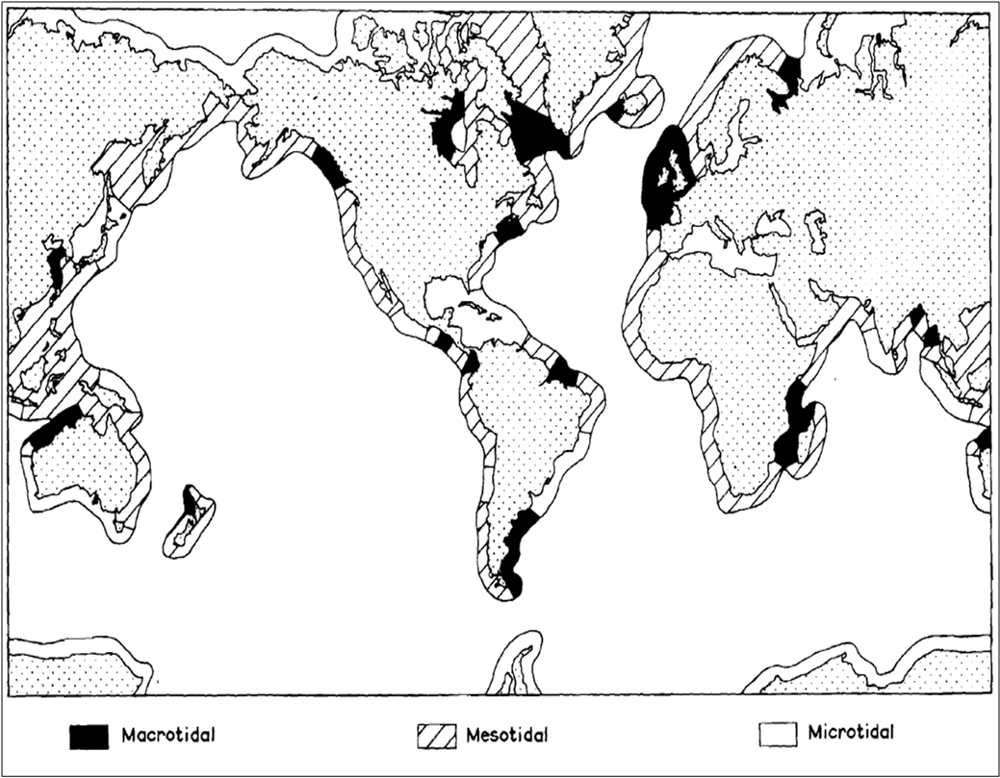
   
   Worlwide variation of tidal range.  This information can be used to make the best possible guess of tide elevation at the site of interest.

2. Type of backshore, Sediment and Beach Characteristics: Here, the user defines what type of sediments make up their backshore. Please refer back to :ref:`cp-ProfOptions` for a more complete description of the two options. Option number 1 corresponds to a sandy backshore and option 2 corresponds to a muddy backshore; this tells the Wave and Erosion Model which erosion computation to run. The user must also enter the median diameter or size of the sediment at their site. If users have qualitative description of the sediment at their site (coarse sand, very fine sand, silty, etc.), a representative sediment size can be obtained the Unified Soil Classification (from Dean and Dalrymple, 2002, Ch. 2) is shown below; a link to this figure is contained in the Spreadsheet.

.. figure 7

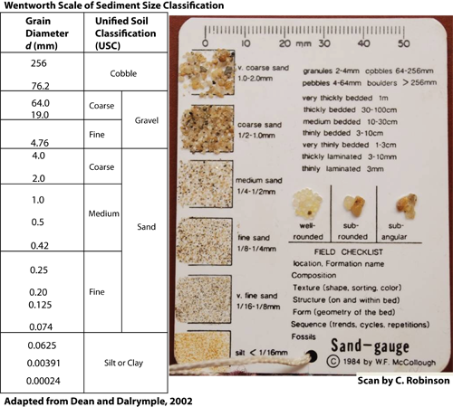
   
   Sediment size classification.  Use the table and Geotechnical Gage to make the best possible guess of sediment size at the site.

If the sediment size does not correspond to the backshore option (if a Option 1, sandy beach is selected and the sediment size corresponds to clay/mud, for example), an error message lets the user know that they must change the sediment size to agree with the backshore option. 

If the option is a sandy beach and a valid sediment size is entered, the user is required to enter the following characteristics of their sandy beach: dune height, berm width, berm elevation, and foreshore run. The dune height is the elevation of the dune crest relative to the berm. If users are unsure whether or not dunes exist at their site, a map showing the worldwide distribution of dunes is provided and is shown below.  

.. figure 9

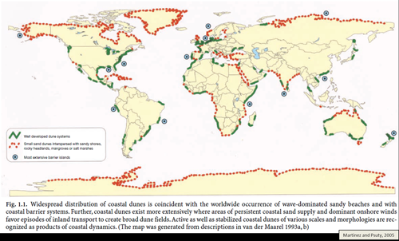
   
   Map showing the approximate distribution of sand dunes in the world.  This information can be used to make a guess about whether or not there's a sand dune at the site. 
   
The berm width is the width of the sandy beach from the shoreline to the toe of the dune or other backshore feature (coastal development, estuary, etc.). The berm elevation is the elevation of the sandy beach relative to MSL.  It is recommended that the berm elevation be *at least* as high as the elevation of MHW. Lastly, the foreshore run is the inverse of the foreshore slope. The spreadsheet populates suggested foreshore runs for the user to choose from based on sediment size.  The figure below shows a pictural definition of these characteristics of a sandy backshore.

.. figure 10

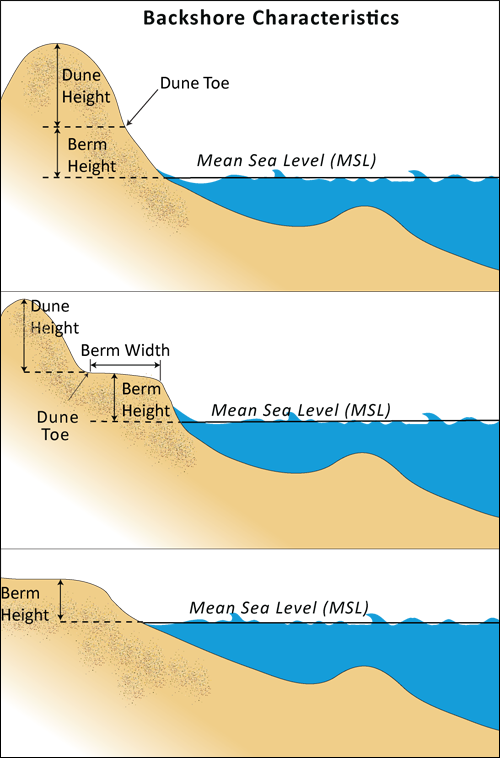
   
   Definition of Berm Height, Berm Width and Dune Height at a typical sandy beach.
   
Since berm height and width, as well as dune elevation is easily obtained from visual estimates, it is encouraged that users visit their site to obtain the most accurate values for these parameters. Also, the foreshore slope can be obtained from a simple survey method, see :ref:`cp-Appendix-A`.

If the option is a muddy system and a valid sediment size is entered, the model requires a dry density value and an erosion constant for the sediment at the site. These parameters cannot be approximated by visual observations or simple methods but require laboratory testing of site samples. Therefore, default values are provided in the Spreadsheet. If users have these values specifically for their site or region, they can overwrite these defaults.

In addition to informing the Wave and Erosion Model which erosion models to run as well as the important physical characteristics for those models, this information also informs the Profile Generator. For example, if a sandy beach is selected, the Profile Generator will incorporate the beach geometry (foreshore slope, berm height and width, and dune height) into the generated profile. Also, if you opt for the Profile Generator to create an Equilibrium Beach Profile (for sandy beaches only), the Profile Generator uses the sediment size provided here to compute the sediment scale factor (see Equation :ref:`EqProf`).

The figure below is a screen capture of where these backshore and sediment characteristics are entered by the user. In the example below, the site is a sandy beach with medium sized sand. Since the option and sediment corresponds to a sandy beach, the dry density and erosion constant fields are greyed out. If this example corresponded to a muddy system, the sandy beach fields would be greyed out and the dry density and erosion constant fields would appear.

.. figure 11

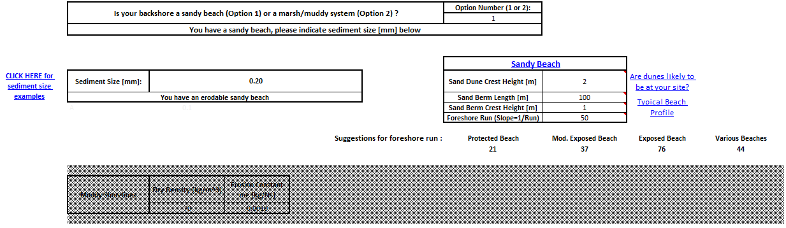
   
   Screenshot of the backshore and sediment characteristic fields within the "General Site Information" section of the Profile Characteristics Spreadsheet.

**Profile Modification**

In this section, users can superimpose three linear (monotonic) segments onto there topo/bathy profile. To add a monotonic profile, the run value “R” (slope=1/R) as well as the cross-shore locations between which this monotonic slope will apply are required. For a flat profile, you can either enter 0 or a very large number. The convention used is that the beginning point of the transect is seaward of the end point.  Also, the origin of the X-axis is at the shoreline, with positive X pointing offshore, and negative X pointing landward of the shoreline. In the screenshot shown below, the user wishes to place a slope of 1/600 from the shoreline to 5 km (5000 m) onshore.

.. figure 12

.. figure:: ./coastal_protection_images/PCS_ProfMod.png
   :align: center
   :figwidth: 500px
   
   Screenshot of the "Profile Modification" section of the Profile Characteristics Spreadsheet.

This example likely corresponds to a case where the elevation was not seamless, or there was no topography measurements, and the user is applying a typical slope associated with mangroves as the backshore profile.

**Habitats**

In this table, users indicate the types of natural habitats that are present in the Natural Habitats folder that was specified in the Profile Generator prompt. If users intend to have the Profile Generator place habitats on the cross-shore profile rather than record the locations manually, this table must be filled out. To let the Profile Generator know which layer in the folder corresponds to which habitat type, users will need to enter in the Habitat ID cell the number that corresponds to the suffix in the shapefile name corresponding to that habitat (e.g., “1”, or “5”, etc.).  If a particular habitat is not present, those cells should be blank.  In the example below, mangroves, seagrass beds, and coral reefs are present in the study region and the suffix corresponding to these habitats are 1, 2, and 3, respectively

.. figure 13

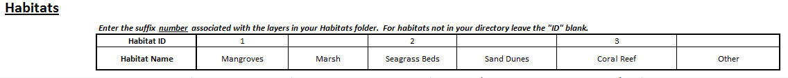
   
   Screenshot of the "Habitat" section of the Profile Characteristics Spreadsheet.

**Habitat Management Action**

1. **Sand Dune**:  If your management action includes reducing the height of your sand dune (or if you would like to investigate the increase in erosion if your sand dune was lowered or removed), you should enter the percent height reduction in this field.  A value of 0 corresponds to no change while 100 corresponds to full removal.  In the example shown below, the management action is to reduce the height of the dune by 75%.

.. figure 14

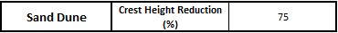
   
   This is where users can define the percent reduction in their dune height associated with a management action.

2. **Vegetation**:  You can specify the physical characteristics of three types of nearshore vegetation: mangroves, seagrass and marshes.  You can treat coastal forests as mangroves.  For each vegetation type, you need to indicate a representative height, stem diameter and stem density.  See the following figure for a definition of those terms, and see the next figure for sample values of these characteristics for seagrass, marshes, and mangroves.  

.. figure 15

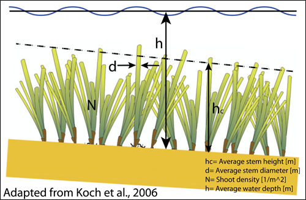
   
   Definition of vegetation characteristic terms used in the model.

.. figure 16

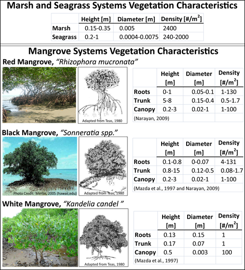
   
   Typical example of vegetation characteristics values for the various habitats used in the model.
   
You also need to indicate the distance of their landward and seaward edges from the shoreline (X=0).  In our convention, positive X point offshore, and negative X point landward.  All vegetation in inter- and supra-tidal regions should have negative X positions and if positive x-locations are assigned for mangroves or marshes, the model assumes that the user intended those values to be negetative.  If you properly included natural habitat in a Profile Generator run, the Pre-Management Action positions will be populated for you but users should double check these values; the Profile Generator may place marsh or mangrove habitats slightly offshore because of differences in projections, precisions, and accuracy of the input layers. Finally, you will have to indicate how they are affected by your management action:

   + You can change the footprint or location of the vegetation.  If the vegetation is completely removed, you should have 0's for the X locations post-management action.  If the footprint is unaffected, the pre- and post-management action footprints should match.   

   + You can also change the density of each vegetation type independently. The model will reduce the density of the habitat for the post-management action by the percentage provided.
  
The following is a screenshot showing the section of the spreadsheet where the physical characteristics, pre- and post-management locations, and percent density reduction for vegetative habitats are populated.  In the example shown, marshes are present for the shoreline (X=0) to 600 meters inland.  The marsh footprint is unaffected by the management action but the density is reduced by 20%.  There is also a seagrass bed present from 50 to 500m offshore. The post-managment location is reduced to between 50m and 400m offshore but the density is unchanged.

   .. figure 17

   .. figure:: ./coastal_protection_images/PCS_VegMGMT.png
      :align: center
      :figwidth: 500px
   
      A screenshot of the habitat management action section of the spreadsheet for the vegetation type habitats.

3. **Coral Reef**:  If you have a coral reef at your site, we will evaluate the wave height at its shoreward edge based on its dimensions.  First, you need to specify its location along the profile that you uploaded as well as the type of the reef that is present:

   + If the reef type is a barrier, enter “-1” for both the offshore and shoreward edge locations and "Barrier" for the reef type.

   + If the reef is located at the shoreward edge of your profile, such as in the case of a fringing reef without a lagoon, the reef location should have the closest distance to shore as 0.  The reef type should be defined as "Fringe".

   + If the reef is located somewhere along your profile, with a lagoon on its shoreward edge, please enter its location as accurately as possible.  The reef type should be defined as "Fringe Lagoon".  

   Second, you need to specify the physical characteristics of the reef, as defined in the following figure: reef face slope, reef rim slope, depth at reef edge, depth on reef top and width of reef top.  Most of these data are obtained through site-specific surveys.  However, in case you do not have those data, you can still use our model by entering “0” for the reef face slope, the reef rim slope and the depth at reef edge.  You can measure reef width from aerial pictures of your site or from global databases of coral reef (see the Tier 0 Coastal Vulnerability model).  Finally, you can enter a best guess for reef top depth knowing that reef top depth values vary between 1 and 2 meters, on average.  In this case, we will estimate the wave height on the reef top by assuming that waves break on the reef face, and take an average value for the coefficient :math:`K_p` in Equation :eq:`EtaCorals`.

   .. figure 18

   .. figure:: ./coastal_protection_images/CoralReefGeometry750.png
      :align: center
      :figwidth: 750px
      
      Profiles of coral reefs in the presence or absence of a lagoon, along with definition of the terms used in the Excel input sheet.

   Finally, you need to specify how coral reefs are affected by your management action:

   + If coral reefs are dead but their skeleton is still in place, enter “Dead”.  In that case, we will reduce the bottom friction coefficient experienced by waves by half (see :ref:`cp-NEW`).

   + If coral reefs are dead and their skeleton failed, enter “Gone”.  In this case, we will assume that the reef is now a sandy bottom and adjust the bottom friction coefficient accordingly.

   + If the reef is not affected by your management action, enter "None".
   
   In the screenshot shown below, there is a Fringe Lagoon reef type located from 200m to 500m offshore that will be included in the model.  The slopes are unknown but the edge depth, top depth, and top width are 10m, 2m, and 230m, respectively.  The management action assigned is "Gone".
   
   .. figure 19

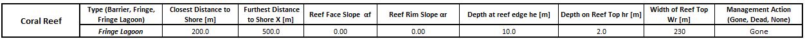
   
   An example of inputs for management actions on a Fringe Lagoon reef.
   

4. **Oyster Reef**:  If you have oyster reefs at your site, you need to enter its distance from the shoreline, as well as its dimensions (see the following figure).  If you have a Reef Ball :sup:`(TM)`, enter “0” for the crest width. :

.. figure 20

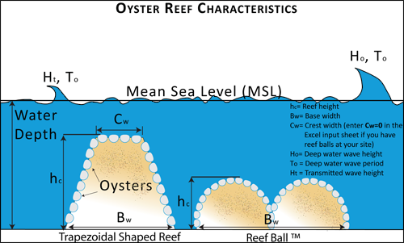
   
   Depiction of typical shapes of oyster reefs, along with definition of terms used in the input Excel sheet.

.. _cp-Runmodel:

Running the model
=================

Setting up workspace and input folders
--------------------------------------

These folders will hold all input and output data for the model.  As with all folders for ArcGIS, these folder names must not contain any spaces or symbols.  See the sample data for an example.

.. note:: The word *'path'* means to navigate or drill down into a folder structure using the Open Folder dialog window that is used to select GIS layers or Excel worksheets for model input data or parameters. 

Exploring a project workspace and input data folder  
^^^^^^^^^^^^^^^^^^^^^^^^^^^^^^^^^^^^^^^^^^^^^^^^^^^

The */InVEST/CoastalProtection* folder holds the main working folder for the model and all other associated folders.  Within the *CoastalProtection* folder there will be a subfolder named *'Input'*. This folder holds most of the GIS and tabular data needed to setup and run the model. 

Creating a run of the model
---------------------------

The following example of setting up the Coastal Protection (Tier 1) model uses the sample data provided with the InVEST download. The instructions and screenshots refer to the sample data and folder structure supplied within the InVEST installation package. It is expected that you will have location-specific data to use in place of the sample data. These instructions provide only a guideline on how to specify to ArcGIS the various types of data needed and does not represent any site-specific model parameters. See the :ref:`cp-data-needs` section for a more complete description of the data specified below.

1. Click the plus symbol next to the InVEST toolbox.

.. figure 21

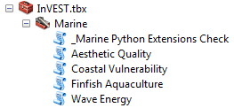

2. Expand the Marine, Coastal Protection, and Tier 1 toolsets.  There are two scripts that you may want to run in succession: Profile Generator and Nearshore Waves and Erosion.  Click on the Profile Generator script to open that model.

.. figure 22

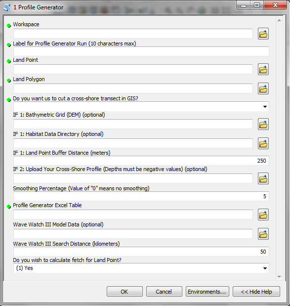
   
3. Specify the Workspace. Click on the Open Folder button |openfold| and path to the *InVEST/CoastalProtection/WCVI* folder. If you created your own workspace folder, then select it here.

   Click on the *WCVI* folder and click on |addbutt| set the main model workspace.  This is the folder in which you will find the "scratch" (intermediate) and "_ProfileGenerator_Outputs" (final outputs) folders after the model is run.

4. Specify the Label for Profile Generator Run. This string of text will be stripped of spaces and shortened to 10 characters.  It will serve as the suffix to many of outputs.  Type "Dune_2m" into the window.  

5. Specify the Land Point. The model requires a land point shapefile to define the location for the analysis.

   Open |openfold| the *InVEST/CoastalProtection/Input* data folder. Select the LandPoint_BarkSound.shp shapefile and click |addbutt| to make the selection.

6. Specify the Land Polygon.  The model requires a land polygon shapefile to define the land and seascape for the analysis.

   Open |openfold| the *InVEST/CoastalProtection/Input* data folder. Select the LandPolygon_WCVI.shp shapefile and click |addbutt| to make the selection.
	
7. Select '(1) Yes' that you wish to cut a cross-shore transect in GIS.

8. Specify the Bathymetric Digital Elevation Model (DEM) raster.  The model requires a DEM raster file in order to cut a cross-shore transect in GIS.  Click |openfold| and path to the *InVEST/Base_Data/Marine/DEMs* data folder. Select the *claybark_dem* raster and click |addbutt| to make the selection.

9. Specify the Habitat Data Directory (optional). The model can use optional polygon shapefile that represent the location of various habitats. Click |openfold| and path to the *InVEST/CoastalProtection/Input* data folder. Select the *NaturalHabitat* folder and click |addbutt| to make the selection.

10. Specify the Land Point Buffer Distance. The model requires this distance order to cut a perpendicular transect in GIS. The default distance is 250 meters, but may need to be modified depending on the site. You may change this value by entering a new value directly into the text box.

11. Specify the Smoothing Percentage. The model requires this value in order to smooth the bathymetry profile.  The default percentage is 5, but may need to be modified depending on the DEM. You may change this value by entering a new value directly into the text box.

12. Specify the Profile Generator Excel table.  The model requires the user to specify information about their site for sediment size, tide elevation and habitats.  A sample Excel table will be supplied for you.

    Click |openfold| and path to the *InVEST/CoastalProtection/Input* data folder. Double left-click on the file *ProfileGenerator_Inputs_WCVI.xls*.

    Click |addbutt| to make the selection.

13. Specify the WaveWatchIII Model Data shapefile (optional).  The model can use optional wind and wave statistics to represent oceanic conditions at a particular site.  Click |openfold| and path to the *InVEST/CoastalProtection/Input* data folder. Select the *WaveWatchIII.shp* shapefile and click |addbutt| to make the selection.

14. Specify the WaveWatchIII Search Distance. The model requires this search distance in order to find the closest WW3 point. The default distance is 50 km, but may need to be modified depending on the distance of your Land Point to the nearest WW3 point. You may change this value by entering a new value directly into the text box.

15. Select '(1) Yes' that you wish to calculate fetch for Land Point.

16. At this point the Profile Generator model dialog box is complete and ready to run.

    Click |okbutt| to start the model run. The Profile Generator will begin to run and a show a progress window with progress information about each step in the analysis. Once the model finishes, the progress window will show all the completed steps and the amount of time that has elapsed during the model run.

.. figure 23

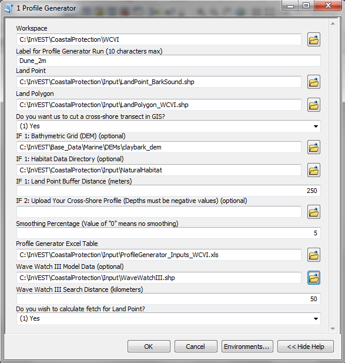

.. figure 24

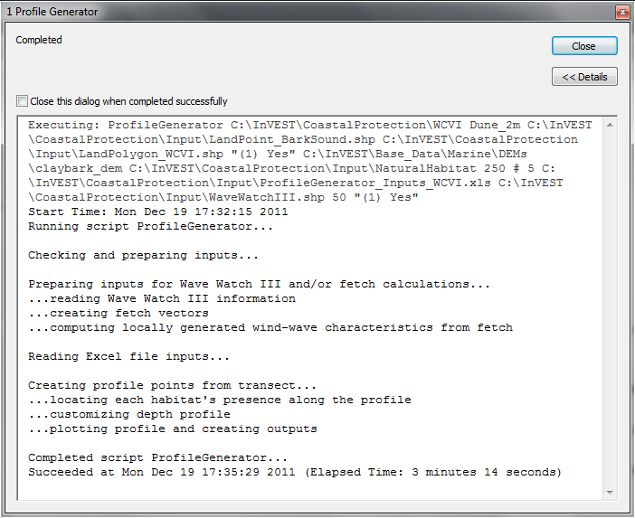

17. Now that your cross-shore profile has been created, you can click on the Nearshore Waves and Erosion script to open that model.

.. figure 25

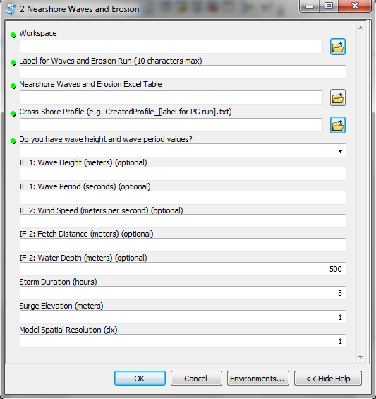

18. Specify the Workspace. Click on the Open Folder button |openfold| and path to the *InVEST/CoastalProtection/WCVI* folder. If you created your own workspace folder, then select it here.

    Click on the *WCVI* folder and click on |addbutt| set the main model workspace.  This is the folder in which you will find the "_WaveModel_Outputs" (final outputs) folders after the model is run.

19. Specify the Label for Nearshore Waves and Erosion run. This string of text will be stripped of spaces and shortened to 10 characters.  It will serve as the suffix to many of outputs.  Type "Dune_2m" into the window.

20. Specify the Nearshore Waves and Erosion Excel table.  The model requires the user to specify information about site information and management action.  A sample Excel table will be supplied for you.

    Click |openfold| and path to the *InVEST/CoastalProtection/Input* data folder. Double left-click on the file *WavesErosionModel_Inputs_WCVI.xls*.

    Click |addbutt| to make the selection.

21. Specify a Cross-Shore Profile.  The model requires a text file of a smoothed bathymetric and topographic transect.  This can either be an output from the Profile Generator or a profile of your own.

    Click |openfold| and path to the *InVEST/CoastalProtection/Input* data folder. Double left-click on the file *InVEST\CoastalProtection\WCVI\_ProfileGenerator_Outputs\Dune_2m\html_txt\CreatedProfile_Dune_2m.txt*.

    Click |addbutt| to make the selection.

22. Select '(1) Yes, I have these values' in answer to the question about whether you have wave height and period values.

23. Specify a Wave Height.  Enter a value of "10" for this input. 

24. Specify a Wave Period.  Enter a value of "5" for this input.

25. At this point the model dialog box is completed for a full run of the Nearshore Waves and Erosion portion of the Coastal Protection model.

    Click |okbutt| to start the model run. The model will begin to run and a show a progress window with progress information about each step in the analysis. Once the model finishes, the progress window will show all the completed steps and the amount of time that has elapsed during the model run.

.. figure 26

.. figure:: ./coastal_protection_images/WE_FilledInterface.png
   :align: center
   :figwidth: 662px

.. figure 27

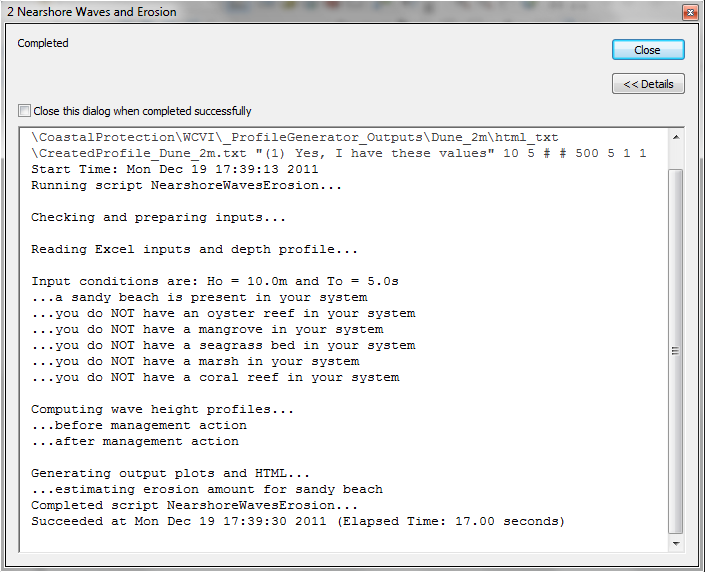

Viewing output from the model
-----------------------------

Upon successful completion of the model, two new folders called "_ProfileGenerator_Outputs" and "_WaveModel_Outputs" will be created in each of the sub-models (Profile Generator and Nearshore Waves and Erosion) workspaces.  They both contain a link to an html page that shows results of your run as well as various files that supplement the information on that html page.  Output files are described in more detail in the :ref:`cp-interpreting-results` section.

.. figure 28

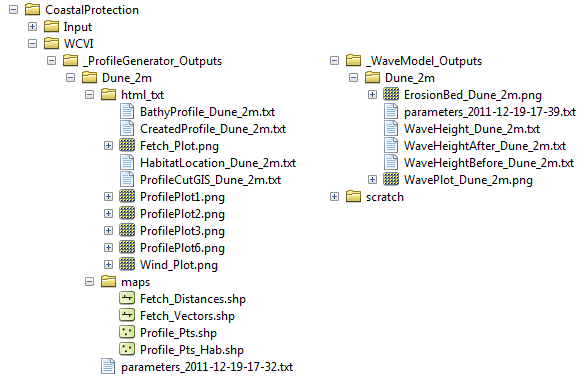

.. _cp-interpreting-results:

Interpreting results
====================

Model outputs
-------------

The following is a short description of each of the outputs from the Coastal Protection model.  Each of these output files is saved in the output workspace directory you specified:

_ProfileGenerator_Outputs
^^^^^^^^^^^^^^^^^^^^^^^^^

This folder contains a sub-folder whose name is the “suffix label” you specified in this model’s interface.  It contains two sub-folders: html_txt and maps.

html_txt
""""""""

This folder contains two webpage links, figures used in the webpages, and three text files.
+ profile.html:  This html file contains information summarizing the location of your site, as well as the information you entered in the model’s interface and Excel input file.  This output also contains figures showing the bathymetry profile that we created and/or smoothed for you, with close ups of the backshore area, when applicable.  Also, if you have uploaded a folder of natural habitats *and** had us cut a cross-shore transect for you from a DEM file, we indicate the X-coordinates of the beginning and end of where we found natural habitats.

+ fetchwindwave.html:  This html file contains figures showing wind and fetch roses.  It also contains information on fetch distances computed by the model, if you chose this option.  There are also tables showing the average values of the maximum, as well as the top 10% and 25% wind speed and wave height extracted from the WW3 gage point closest to your site, if you uploaded that file.  Finally, if you had the model compute fetch distances for you and uploaded WW3 data, this page also contains estimates of wind-generated wave height for each of the 16 equidistant sectors that make a full compass circle.

+ FetchDistances_[suffix].txt:  This text file contains information on fetch distances computed by the model.  It has two columns.  The first column shows that 16 directional sectors angles, and the second column has fetch distances associated with these sectors.

+ BathyProfile_[suffix].txt:  This text file is the smoothed bathymetric profile that we output from the model.  It only contains values of water depths *below* MLLW.  The first column consists of X-values with X=0 at the shoreline, and the second column corresponds to depths values at the various cross-shore X distances.

+ CreateProfile_[suffix].txt:  This text file is the smoothed bathymetric and topographic transect that we output from the model.  It differs from “BathyProfile_label.txt” because it has the backshore information that you may had us help you create.  **We recommend that you use this profile as input in the Nearshore Waves model.**

+ ProfileCutGIS_[suffix].txt:  This text file is the un-smoothed and un-process raw profile that we cut in GIS for you, if you chose that option, before we processed it for you (smoothing and addition of a backshore).  This information is useful if you want to see the quality of the GIS DEM data that you uploaded.  If you have a good quality DEM layer that contains a high resolution representation of your area, this text file can also be useful and input in the wave model, as long as it is smoothed.

maps
""""

+ Fetch_Vectors.shp:  This polyline shapefile depicts the remaining fetch radials found in the seascape after being intersected with the user-provided Land Polygon input (landscape).  The GIS starts with 144 in total, at 2.5 degree increments, and erases all radials that overlap with the landscape.

+ Fetch_Distances.shp:  This polyline shapefile summarizes fetch distances for the user-specified Land Point input over 16 directions.

+ Profile_Pts.shp:  This point shapefile represents the cross-shore transect that was cut by the GIS.  It's attribute table contains depth information from both the raw and smoothed profiles.

+ Profile_Pts_Hab.shp:  This point shapefile represents the cross-shore transect that was cut by the GIS and then intersected with the user-provided habitat layers.  In the attribute table, columns for each of the six possible habitats are included.  A value of "1" means a particular habitat is present at a point along the transect, while a "0" means it is not found.

_WaveModel_Outputs
^^^^^^^^^^^^^^^^^^
This folder contains two useful outputs from the Nearshore Waves and Erosion model: 

+ OutputWaveModel_[suffix].html:  This html file summarizes the information you entered as input in the model, and describes the outputs.  It contains a figure depicting a profile of wave height, as well as percent of wave attenuation and the location of your natural habitats along your bathymetry.  We also summarize and show a profile of erosion or hourly rate of bed scour in your backshore area.

+ WaveHeight_[suffix].txt:  This text file contains three columns showing distance from the shoreline and profiles of wave height over your bathymetry profile, before (second column) and after (third column) your management action.  

+ WaveHeightAfter_[suffix].txt:  This text file contains two columns showing distance from the shoreline and profiles of wave height over your bathymetry profile, before after your management action.

+ WaveHeightBefore_[suffix].txt:  This text file contains two columns showing distance from the shoreline and profiles of wave height over your bathymetry profile, before your management action.

Parameter log
-------------

Each time the module is run a text file will appear in the workspace folder.  The file will list the parameter values for that run and be named according to the service and the date and time.

References
==========
Armono, and Hall, K. (2003). Laboratory study of wave transmission on artificial reefs. Proc. Canadian Coastal Eng. Conf., Kingston, Canada

Apotsos, A., Raubenheimer, B., Elgar, S. and Guza, R.T. (2008). Testing and calibrating parametric wave transformation models on natural beaches, Coast. Eng., 55.

Alsina, J. M. and T. E. Baldock (2007). "Improved representation of breaking wave energy dissipation in parametric wave transformation models." Coastal Eng. 54(10).

Battjes, J.A. and M.J.F. Stive (1985). Calibration and verification of a dissipation model for random breaking waves, J. Geophys. Res., 90(C5).

Bradley, K., and C. Houser (2009), Relative velocity of seagrass blades: Implications for wave attenuation in low-energy environments, J. Geophys. Res., 114.

Burger B. (2005). Wave Attenuation in Mangrove Forests, A Master’s thesis publication, Delft U. of Technology, Civil Engineering and Geosciences. 

Dean, R. G. and C. J. Bender (2006) "Static Wave Setup With Emphasis on Damping Effects by Vegetation and Bottom Friction", Coastal Eng. 13.

Dean, R.G. and Dalrymple, R.A. (2002) Coastal Processes with Engineering Applications. Cambridge University Press. 475pp.

de Vos, J.W. (2004). Wave attenuation in mangrove wetlands: Red River Delta, Vietnam. MSc thesis. Delft University of Technology

Gourlay MR. (1996a).Wave set-up on coral reefs. 1. Set-up and wave-generated flow on an idealised two dimensional reef. J. Coastal Eng. 27.

Gourlay MR. (1996b).Wave set-up on coral reefs. 2.Wave set-up on reefs with various profiles. J. Coastal Eng. 28.

Gourlay, M.R. (1997). Wave set-up on coral reefs: some practical applications. Proc. Pacific Coasts and Ports, Christchurch, 2, 959–964.

Keddy, P. A. (1982). Quantifying within-lake gradients of wave energy: Interrelationships of wave energy, substrate particle size, and shoreline plants in Axe Lake, Ontario. Aquatic Botany 14, 41-58. 

Kobayashi, N., A. W. Raichle, and T. Asano (1993), Wave attenuation by vegetation, J. Waterw. Port, Coastal Ocean Eng., 119

Koch, E.W., L.P. Sanford, S.N. Chen, D.J. Shafer and J.M. Smith (2006). Waves in seagrass systems: review and technical recommendations. US Army Corps of Engineers Technical Report. Engineer Research and Development Center, ERDC TR-06-15, 82 p. 

Komar, P.D. (1998) Beach Processes and Sedimentation, Prentice Hall, Upper Saddle River, N.J., 543pp.

Kriebel, D. L., and Dean, R. G. (1993). Convolution method for time dependent beach-profile response. J. Waterw., Port, Coastal, Ocean
Eng., 119(2)

Mazda, Y, E Wolanski, B King A., Sase, D. Ohtsuka and M. Magi (1997). Drag force due to vegetation in mangrove swamps. Mangroves and Salt Marshes 1:193–99. 

McLachlan, A. and Dorvlo, A. (2005). Global patterns in sandy beach macrobenthic communities. Journal of Coastal Research 21, 674-687.

Mendez, F. J., and I. J. Losada (2004), An empirical model to estimate the propagation of random breaking and nonbreaking waves over vegetation fields, Coastal Eng., 51

Narayan S. (2009). The Effectiveness of Mangroves in Attenuating Cyclone – induced Waves, Master’s thesis, Delft U. of Tech., Civil Eng. and Geosciences

Short AD, Hesp PA (1982).  Wave, beach and dune interactions in south eastern Australia. Mar Geol 48:259-284

Stockdon H.F., Holman R.A., Howd P.A., Sallenger, A.H. (2006). Empirical parameterization of setup, swash, and runup. Coastal Engineering, 53 

Thornton, E. and Guza, R.T. (1983). Transformation of Wave Height Distribution. Journal of Geophysical Research 88(C10)

Tolman, H.L. (2009). User manual and system documentation of WAVEWATCH III version 3.14, Technical Note, U. S. Department of Commerce Nat. Oceanic and Atmosph. Admin., Nat. Weather Service, Nat. Centers for Environmental Pred., Camp Springs, MD.

U.S. Army Corps of Engineers (USACE) (2002). U.S. Army Corps of Engineers Coastal Engineering Manual (CEM) EM 1110-2-1100 Vicksburg, Mississippi.

Van der Meer, J.W., Briganti, R., Zanuttigh, B. and Wang, B. (2005). Wave transmission and reflection at low crested structures: design formulae, oblique wave attack and spectral change, Coast. Eng., 52.

Whitehouse, R., Soulsby, R.R., Roberts, W., Mitchener, H. (2000). Dynamics of Estuarine Muds. H. R. Wallingford, UK 
Wiegel, R.L. 1964 Oceaographical Engineering, Prentice-Hall, Englewood Cliffs, NJ.

.. _cp-Appendix-A:

Appendix A
==========

Beach Survey with "Emery Boards"
--------------------------------

(Adapted from *Beach Profiling with "Emery Boards" and Measuring Sand Grain Size*, 2005, Florida Center for Instructional Technology, University of South Florida)  

The simplest technique to measuring a beach profile is known as the **"Emery board"** method, developed by a famous coastal scientist named K.O. Emery.  As depicted in Figure 1 the apparatus consists of two stakes connected by a rope of known length (5m or 10m).  This length sets the measurement interval for individual data points along the profile.  Each stake has a measurement scale which runs from 0 at the top, down to the bottom of the stake.  It is recommended to use Metric units.  This approach may seem simple, but it provides reasonably accurate measurements of beach profiles. It also has the advantages of light, inexpensive, equipment, which can be easily carried to distant survey sites, for very rapid surveys. 

The technique of measuring sand size will be conducted in the field with the use of sand gauge charts.  These are small, credit-card sized, plastic charts with calibrated samples of sieved sand mounted on the face.  By using a hand-lens and sand gauge chart, it is possible to compare samples from the beach with calibrated samples on the chart for an estimate of size range.  Sand gauge charts are available from a number of vendors. One such distributor is `ASC Scientific <http://www.ascscientific.com/books.html>`_. 

.. figure 29

.. figure:: ./coastal_protection_images/EmeryBoard_Figure1.png
   :align: center
   :figwidth: 413px

   Illustration of the Emery Board technique

Materials
---------

To build a set of "Emery boards", all that is needed are two pieces of wood of equal length and a rope of known length.  (Boards slightly smaller than observers will work well (~1.6m).)  Tie a loop in each end of the rope, which can easily slide up and down the two boards.  Measuring down from the top of each board, use a marker and a ruler to draw and label the "graduations" (marks of equal length).  An appropriate graduation interval is every two centimeters.  Additionally, one can attach a small level to the rope to help ensure it is horizontal (`for example <http://www.johnsonlevel.com/ProductDetail.asp?cat=Levels&ID=5&pID=104>`_).

Method
------

At the very minimum, two people are necessary to conduct a survey, but three are preferable.  Team members should separate themselves into a **"seaward surveyor"**, a **"landward surveyor"**, a **"geotechnical engineer"** and a **"data recorder"**.  The "seaward surveyor" is responsible for holding the seaward board and ensuring that the rope is level between the two boards (by sliding the loop up or down) when fully extended.  The "landward surveyor" is responsible for holding the landward board, sighting over the seaward board to the horizon, and shouting out the measurement (cm down from the top of the landward board) to the "data recorder".  The "geotechnical engineer" is responsible for moving with the "seaward surveyor" to collect a sand sample, and identify it using the hand lens on the basis of its size comparison to the sand gage chart.  The "data recorder" should keep organized notes of each measurement including **horizontal distance (x), measurement of change in elevation (a), cumulative change in elevation of all measurements, and sand size at each location**.  

Starting at the landward extent of the survey region (baseline), cross-shore data points of elevation and sand size are collected at the sampling interval determined by the length of the rope (distance between the two boards at full extension).  Collect at least 5 cross shore data points.  Collect more than 5 cross shore data points if the beach is wide.  If the beach is sloping downward toward the sea, the observer sights across the top of the seaward board to the level of the horizon, and determines the distance **(A1)** from the top of the landward board to the sightline in the following figure (or distance **(a)** in Figure 1).  

.. figure 30

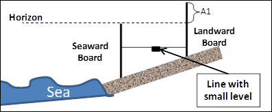

   Same as previous figure.  Find distance A1 from top of board to eye such that eye, top of board 2 and horizon are aligned.  Line must be horizontal.

If the beach is locally sloping upward in the offshore direction, then **(A2)** is measured on the seaward board and the sighting is with the horizon over the top of the landward board (next figure).  If horizon cannot be found on landward side, then observer on landward aligns his/her eye with pointer (pen or other thin sharp object) adjusted and held by observer on seaward side and horizon to form a horizontal line.  Observer on seaward side then reads distance A2, which should be recorded as negative to indicate upward slope.  

.. figure 31

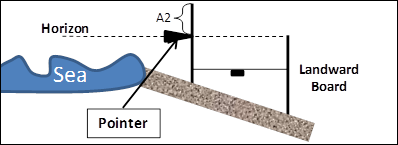

   Same as two previous figures.  Find distance A2 from top of board to pointer such that eye at top of board 1, pointer and horizon are aligned.  Line must be horizontal. 

In addition, the “data recorder” should make notes of the time of observations and such things such as presence/absence and type of beach debris (kelp, wood etc.).  Also, the “data recorder” should take note of the maximum landward extent of these debris if they were freshly deposited, as an indication of position of high tide.  High tide location can also be guessed by looking for position of wet/dry sand barrier.  If the team has a portable GPS unit, the “data recorder” should note the coordinate of this high water mark, or if there are repeated measurements at the same site, the “data recorder” should evaluate its distance from known landmark.  Finally, the “data recorder” should make note of position (GPS or meters) of position of landward board during first measurement, of seaward board after last measurement, and position of water level.  

Recording and Processing Data
-----------------------------

Assuming that the rope is 10m long, an example log looks as follow, where positive values are A1 measurements (sloping down), and negative values are A2 measurements (sloping up):

.. figure 32

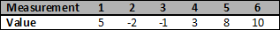

Based on these values, a beach profile can be constructed by performing the following operations:

.. figure 33

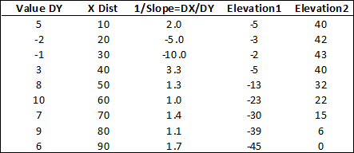

Measured values are in column 1, and cumulative distance between measurements is in Column 2 (assuming rope is 10m long).  In Column 3 we estimate 1/Slope, using DX=length of rope=10m.  For example, slope of 1st measurement is 1/2.  In Column 4, we estimate beach profile, assuming that zero is located at point where first measurement is taken.  In Column 5 we estimate beach profile again, assuming that zero is last point measured.  This last column is used to plot profile of beach as function of X, as shown in the following figure.

.. figure 34

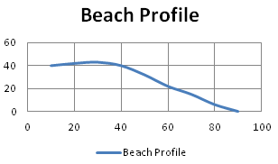

   Example beach profile measured with Emery Board.  Zero is last point measured.

Finally, if repeated measurements are made at the same time, it is recommended to continuously log time of measurement, and positions of board at beginning and end of measurement, as well as high water mark.  These should be indicated on beach profile, if possible.  Also, by looking at tide chart, it is possible to estimate high water level during period of measurement, and use this info to convert beach profile values accordingly.
