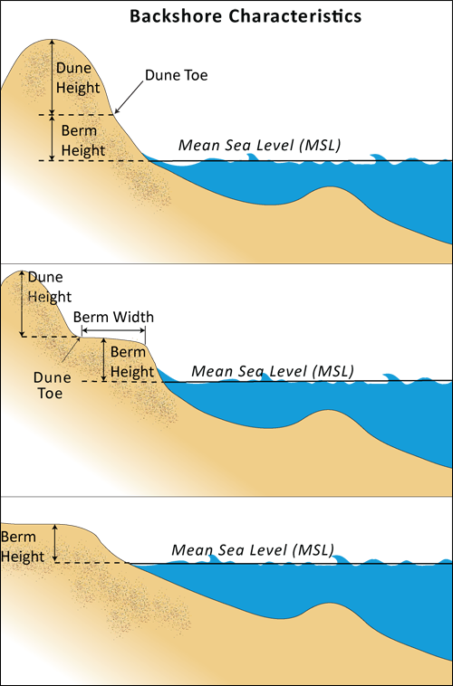
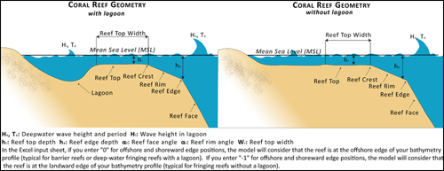

.. _coastal-protection:

.. |openfold| image:: ./shared_images/openfolder.png
              :alt: open
	   alignmiddle 

.. |addbutt| image:: ./shared_images/addbutt.png
             :alt: add
	  alignmiddle 
	     :height: 15px

.. |okbutt| image:: ./shared_images/okbutt.png
            :alt: OK
	 alignmiddle 

.. |adddata| image:: ./shared_images/adddata.png
             :alt: add
	  alignmiddle 

************************
Coastal Protection Model
************************

Summary
=======

The Coastal Protection model quantifies the protection benefits of natural habitats against erosion and inundation in nearshore environments.  It is composed of two sub-models: a Profile Generator and a Nearshore Wave and Erosion model.  The Profile Generator model helps users generate a 1-Dimensional (1D) cross-shore (perpendicular to the shoreline) beach profile that contains bathymetry and backshore information.  It is not required to run before using the Nearshore Waves and Erosion model, which computes profiles of nearshore wave as well as the amount of shoreline erosion and total water level in the presence and absence of nearshore marine habitats (e.g., coral or oyster reefs, vegetation, sand dunes).  Outputs can be used to better understand the relative contributions of different natural habitats in reducing nearshore wave energy levels and coastal erosion, and to highlight the protective services offered by natural habitats to coastal populations.  This information can help coastal managers, planners, landowners, and other stakeholders understand the coastal protection services provided by those habitats, which can in turn inform coastal development strategies and permitting.  This is a "Tier 1" model.

Introduction
============
The Coastal Protection model computes along a 1D bathymetry transect a profile of wave height, from offshore to the beach.  It takes into account the influence of submerged natural habitats, as well as the influence of sand dunes.  These habitats dissipate wave energy and/or act as barriers against high waves and high water levels, and eventually protect coastal properties as well as populations.  The service provided by these habitats is measured by the amount of avoided erosion or inundation, or by the amount of people protected, or by the value of avoided property damages.

The Coastal Protection model is composed of two models: a Profile Generator, and a Nearshore Waves and Erosion models.  You are not required to run the Profile Generator model before the Nearshore Waves and Erosion model.  The purpose of the Profile Generator is to help you prepare a 1D bathymetry transect, which will be used in the Nearshore Waves and Erosion model.  The inputs of the Profile Generator are information the site location and overall shape of the shoreline at your site.  Furthermore, we require information, which does not have to be precise, about sediment size, tidal range as well as backshore characteristics.  In case you do not have this information, we provide you with plenty of guidance on how to approximate these inputs.  Outputs of the Profile Generator model are a 1-D bathymetry profile at your site as well as information on the site’s backshore and the location of natural habitats along this transect.  In addition, we provide you with over-water fetch distances, as well as estimates of wave height and wind speeds that can occur at your site during storm.  It is our goal that this model will generate some of the inputs you need to run the Nearshore Waves and Erosion model.  We also hope that this model will help you become familiar with some of the characteristics of your site as well as the types of inputs to collect when running a nearshore wave model.  

The Nearshore Waves and Erosion model models profiles of wave height and wave-induced changes in water level, as well as the amount of nearshore bed erosion that occurs, based on the types of natural habitats that are present near your site.  The model inputs are a 1-D bathymetry profile, which you can obtain from the Profile Generator model or a site survey, a value for offshore wave height and period, or a value of wind speed, fetch direction over which that wind blows, and the average water depth at your site.  Both values of wave and wind speed should be representative of storm conditions in your area of interest.  In addition, the model requires information about the backshore, as well as the type and physical characteristics of the natural habitats that are at your site.  Finally, the model requires information about the management action that will be implemented: removal or all or half the density of natural habitats.  Model outputs are profiles of wave height before and after the management action, as well as the percent wave attenuation caused by that management action.  The model also estimates the amount of erosion of sandy beach as well as the amount of scour in consolidated beds (e.g., scour of mud bed).  These outputs can be transformed in dollar value if the property value of the area affected is known, or in number of people affected if the amount of people whose property is directly or indirectly affected by nearshore bed erosion.
  
.. _cp-Model:

The model
=========

The InVEST Coastal Protection model is a 1-Dimensional (1D) process-based tool that produces an estimate of wave and bed erosion attenuation caused by the presence of natural habitats.  Results of this model can be used as a first step to value the protective role provided by natural habitats.

How it works
------------

As waves travel from the deep ocean to coastal regions with shallower waters, they start to interact with the bed.  They first increase in height before breaking and dissipating most of their energy in the surf zone and the beach face.  Natural habitats play an important role in protecting shorelines against wave action because they increase the amount of wave dissipation, or, in the case of sand dunes, serve as a physical barrier. 

To estimate the profile of wave height that one would expect at a certain region it is imperative to have three types of information: 
1.	Offshore wave characteristics: wave height and wave period far away from the shoreline, where waves do not interact with the bottom yet.
2.	Nearshore bathymetry and backshore characteristics: elevation of the submerged and emerged portions of the cross-shore profile relative to Mean Lower Low Water.
3.	Location and physical characteristics of natural habitats: Distance from the shoreline of the natural habitats that will become submerged during a storm, as well as representative density, height and/or diameter of the habitats elements.

The model is composed of two sub-models.  The first model, which is called Profile Generator, helps you obtain cross-shore nearshore bathymetry and topography information at your site.  Using this cross-shore profile, the second model, which is called Nearshore Waves and Erosion, computes profiles of wave height and wave-induced mean water level in the presence and absence of seagrass, marshes, mangroves or coastal forests, coral reefs, and oyster reefs.  When your site is a sandy beach, the model computes the amount of erosion in the presence and absence of subtidal, intertidal and supratidal (e.g., sand-dunes) habitats.  When your site is composed of consolidated sediments (e.g., mud), the model estimates in a very simple way the amount of scour that you could expect.  In the remainder of this section, we will describe how each of these two models works.

.. _cp-PG:
Profile Generator Model
^^^^^^^^^^^^^^^^^^^^^^^

In order to run the Nearshore Wave and Erosion model, it is necessary to have nearshore bathymetry and topography information, as well as the location and characteristics of natural habitats, at your site of interest.  Also, it is imperative that you have the value of the offshore wave height and associated period that will evolve to the beach and cause erosion. The purpose of the Profile Generator model is to help you read this information from your data, and prepare to run the Wave and Erosion model.  Additionally, the Profile Generator helps you *create those data if you do not have them, but know the general characteristics of your site.

First, the Profile Generator helps you obtain bathymetry information in three different ways.  In the model interface, we ask you the question *Do you have nearshore bathymetry GIS layer?*.  If you answer *Yes*, the Profile Generator draws a transect perpendicular to the shoreline where your site is located, and read the (X, Z) bathymetry and topographic information below that transect.  If your site is surrounded by land, or is fronted by an island, the offshore portion of your profile might be the beach on the other side of your site.  In this case, your offshore water depth is extremely shallow, and your deep water wave height will not be able to propagate to your site since it will break in such waters.  To avoid this situation, removes any portions of the profile offshore of the deepest point that is shallower than the average depth.  

Another option is to answer *No, but I will upload a cross-shore profile*, and from that uploaded profile with a minimum of two (X,Z) coordinate points, you can specify regions where you want to add linear depth profiles.  Lastly, if you do not have any bathymetric information at your site of interest, you can choose the third option *No, please create a theoretical profile for me*, and the model will generate, **for sandy systems only**, a theoretical bathymetric profile, based on the average sand size at your site.  The depth profile follows the following equation (Dean and Dalrymple, 2003):

.. math:: Z=-AX^{2/3} 
  :label: EqProf

where :math:`(X,Z)` represent the cross-shore distance and depth, with :math:`X=0` at the shoreline.  The coefficient : math:`A` is a profile scale factor and is a function of sediment size (Dean and Dalrymple, p.162 and CEM).  For simplicity sake, the profile extends from the water line down to -20 meters.  Please remember that this option is only valid for sandy systems, for which sediment size varies between 0.1 to 1.09 mm.

Second, once you have decided on the method that will be used to create an initial bathymetry, the Profile Generator help you modify or add to the information contained in your bathymetry profile in order to create a representation of your site as accurate as possible.  This is especially useful if you want to estimate the amount of erosion at your beach, and do not have reliable backshore information.  It is also useful to use our tool if you would like to modify or remove portions of your profile because of the management action that you are considering, or because your data needs to be post-processed.  

Figure xx shows profiles of a typical beach and a nearshore mangrove forest.  After waves have progressed from deep water and broke in the nearshore, they reach the foreshore and/or backshore portion of the beach.  For sandy beaches, the foreshore is usually between the Mean Lower Low and Mean Higher High water marks, and the backshore (the region above Mean High Water) consists of a berm and, in temperate regions mostly, a sand dune.  Berms can sometimes have a very small or no width.  In general, foreshore and backshore information cannot be obtained during standard hydrographic surveys.  We have found that although most DEM files have relatively good bathymetric information, intertidal and backshore elevations are often incorrect, unless they were measured during a detailed topographic survey effort.  Add text for mangroves.

.. figure:: ./coastal_protection_images/BeachProfile_Finalv2.png
   :align: center
   :figwidth: 500px

We offer you three different options for adding a foreshore and/or backshore profile to your bathymetry transect:

1.	*Add backshore to a sandy beach*: assuming that this information is not contained in the cross-shore profile that we cut for you or you uploaded, we help you guess what foreshore slope, berm height and dune height might be for your site, based on simple rules of thumb.  Please bear in mind that we use rules of thumb developed from site-specific information, and conditions at your site quite differ quite drastically from these rules.

  As mentioned earlier, the foreshore is the intertidal region of the beach profile, and we assume that it is linear in our model.  To provide you with guidance on what that slope might be, we provide you with five different values of slope, based on the sediment size value that you input.  The first three are derived from observations by Weggel xx at beaches that are protected, moderately exposed or fully exposed to the open ocean, in the U.S.  The fourth value is derived from observations by REFF at various beaches around the world.  The fifth value is the average of the four previous values.

  Berm height, and foreshore slope, often changes as a function of seasonal wave climate.  After a storm, the profile is flatter and the berm is lower than during fair weathers conditions.  However, in case you do not have any information about berm height at your site, we recommend that you place the berm at least at the same elevation as the Mean High Water mark.  Finally, if your site has sand dunes, which are fairly common in temperate climates (see Fig xx), we provide height estimates based on observations made by Short and Hesp (1982)xx.  

.. figure:: ./coastal_protection_images/CoralReefGeometry_Finalv2.png
   :align: center
   :figwidth: 500px

  Short and Hesp (1982) classified sand dune height at various beaches in Australia based on tidal range, modal wave height and period, :math:`H_m` and :math:`T_m`, and average sand size:math:`d_{50} [mm]`. (The modal wave is the wave that occurs the most often, and is computed from a relatively long (years) time series of regular wave height observations.)  From their observations, they found that sand dunes can be created when a beach is wave dominated, or when the Relative Tidal Range, defined as the ratio of the tidal range to the breaking wave height :math:`H_b` is lower than 3.  Under those conditions, they found that dune height can be grouped into 3 categories: 1 for reflective beaches, 1 for intermediate beaches and 1 for dissipative beaches.  Beach type was computed as:

.. math:: Type= \frac{H_b}{w_s T_m}
  :label: BeachType

where :math:`H_b` is the modal wave breaking height, approximated as (xx):

.. math:: H_b=0.39g^{0.2} \left(H_m T_m \right )^{0.4}
  :label: BreakingWaveH

:math:`w_s` is the sediment fall velocity, or the average velocity at which the sediment falls through the water column:

.. math:: w_s=1.26\cdot 10^{-6} \sqrt{ 13.0321+1.18 \left( 1.56\cdot10^{-6} \frac{g d_{50}^3}{1.5876\cdot 10^{-12}}\right )^{0.65}} -3.61
  :label: FallVelo

  In the model, if you do not know if your site has a sand dune or not, and/or do not know its height, we assign it a dune height based on whether it is wave dominated or not, and the value of its beach type (see Equation :ref:`BeachType`).  If the beach type value determines that it is a reflective beach (:math:`Type<3`), we assign it an average dune height of 5m.  Reflective beaches tend to be protected from the open ocean and have relatively steep foreshore slopes.  Short and Hesp (1982) observed a variation in dune height between 4 and 8m at those beach.  On the other hand of the spectrum, dissipative beaches (:math:`Type \geq 5`) are in general exposed to the open ocean, where there are very energetic waves.  These beaches tend to experience strong winds, which can create fairly high dunes.  Short and Hesp (1982) observed a variation in height between 15 and 30m at those beaches.  In our model, we assign them a dune height of 20m.  In between are intermediate beaches, where Short and Hesp (1982) observed a variation in height between 8 and 15m.  In our model, we assign them a dune height of 12m.

2.	*Add a backshore to a mangrove or mash.*  Mangrove and marsh beds are different from sandy beaches because they consist, in general, of consolidated materials, do not have dunes, and their profile is in general fairly linear.  In general, mangrove bed slopes vary between 1V:400H and 1V:600H xxxx.  We did not find any specific guidelines for marsh profiles.

  If you choose this option, you will have to enter a maximum of three linear profiles that can be added to the bathymetry profile that was cut/created for you or that you uploaded.  

3.	*Modify a profile uploaded in the GIS interface.*:  As mentioned earlier, if you upload a profile with a minimum of two (X, Z) points, you can modify it or add to it by creating linear xx between fixed distances.  This option is especially useful in cases when you are not fully satisfied with the profile that was cut in GIS and want to modify it, when you want to create a depth profile from scratch, or when you want to add intertidal and backshore regions to depth profiles.
  
Third, the Profile Generator locates the presence of natural habitats along your cross-section.  When you choose Option 1 *Yes* to the question *Do you have nearshore bathymetry GIS layer*, you can also indicate the types of natural habitats that are present in your region, and the model will locate and plot where those habitats fall onto the cross-shore bathymetry.  Please note that the results from this last step are accurate only if the natural habitat and bathymetry layers are properly geo-referenced.  If these layers were prepared during two different efforts, you might have to make sure that the natural habitats are properly placed along your profile (e.g., make sure that seagrass beds are in subtidal, or mangroves are in inter- or supratidal areas).

Finally, if you do not have any storm wave or wind information at your site to run the Nearshore Waves and Erosion model, the model will help you obtain those data by reading and providing you with some pre-processed statistics from the closest WaveWatch III grid point.  Because wave data can be scarce in most regions of the world, we analyzed 7 years of WAVEWATCH III (WW3, Tolman (2009)) model hindcast reanalysis results to estimate, for model grid points that are in waters deeper than 50m, the maximum as well as the average of the top 10% and 25% wave height.  We also computed the same statistics for wind data, for 16 equiangular direction sectors (0deg, 22.5deg, 45deg, etc.).  

Wind information can be used in the Nearshore Waves and Erosion model by combining it with fetch distance as well as the average depth offshore of your site to compute an offshore wave height and period inputs (see :ref:`cp-NEW`).  However, if you do not know fetch distances to your site, you can have the model computes them by choosing “Yes” to the question “Do you want the model to compute fetch distances?”.  In that case, from your site location, the model draws 16 equiangular sectors, and in each sector, the model draws nine equiangular radials.  Each radial is initially 50km long, but is cutoff when it intersects with a land mass.  To capture the effects of those land masses that limit fetch distance, the average fetch distance :math:`F_k` for each 22.5deg sectors :math:`k` is weighted by each radial distance and angle (Keddy, 1982):

.. math:: F_k=\frac{\sum_{n=1}^9f_n\cos \theta }{\sum_{n=1}^9\cos \theta }
  :label: AvgFetch

where :math:`f_n` is the :math:`n^{th}` radial distance in the :math:`k^{th}` equiangular sector, and :math:` \theta=2.5deg` (22.5deg divided by 9).   

From wind speed, and fetch distance, wave height and period of the locally generated wind-waves are computed for each of the 16 equiangular sectors as:

.. math::
   \left\{\begin{matrix}
   H=\widetilde{H}_\infty \left[\tanh \left(0.343\widetilde{d}^{1.14} \right )  \tanh \left( \frac{2.14.10^{-4}\widetilde{F}^{0.79}}{\tanh (0.343 \widetilde{d}^{1.14})} \right )\right ]^{0.572}\\ 
    \displaystyle \\
   T=\widetilde{T}_\infty \left[\tanh \left(0.1\widetilde{d}^{2.01} \right )  \tanh \left( \frac{2.77.10^{-7}\widetilde{F}^{1.45}}{\tanh (0.1  \widetilde{d}^{2.01})} \right )\right ]^{0.187}
   \end{matrix}\right.  
   :label: WaveFetch

where the non-dimensional wave height and period :math:`\widetilde{H}_\infty` and :math:`\widetilde{T}_\infty` are a function of the average wind speed values :math:`U` that was observed in in a particular sector: :math:`\widetilde{H}_\infty=0.24U^2/g`, and :math:`\widetilde{T}_\infty=7.69U^2/g`, and where the non-dimensional fetch and depth :math:`\widetilde{F}_\infty` and :math:`\widetilde{d}_\infty` are a function of the fetch distance in that sector :math:`F_k` and the average water depth in the region of interest :math:`d [m]`: :math:`\widetilde{F}_\infty=gF/U^2`, and :math:`\widetilde{T}_\infty = gd/U^2`.  :math:`g  [m/s^2]` is the acceleration of gravity.  This expression of wave height and period does not differentiate between duration and fetch-limited conditions (USACE, 2002; Part II Chap 2).  Hence, model results might under- or over-estimate wind-generated waves characteristics at a site.  

Once you are satisfied with your nearshore bathymetry and topography profile, you can run the wave Nearshore Waves and Erosion model.

.. _cp-NEW:
Wave Evolution Model
^^^^^^^^^^^^^^^^^^^^
The amount of shoreline or bed erosion at the shoreline is a function of the total water level at your site and storm duration.  The total water level at the shoreline is composed of the sum of tide, amount of sea-level rise, any water surface elevation anomaly (e.g., super-elevation during an El Niño), storm surge, and wave runup.  To quantify the protective services provided by natural habitats, the CP model computes the amount of attenuation of waves and wave-induced mean water level (runup) at the shoreline caused by submerged vegetation and reefs.  

Assuming that waves have a deep water height of :math:`H_o` and a period :math:`T`, it is possible to compute the evolution of wave height from offshore to the shoreline along the x-axis of the user defined cross-shore transect with the following wave energy equation:

.. math:: \frac{1}{8}\rho g \frac{\partial C_g H^2}{\partial x}=-D
    :label: EvolEq

where :math:`\rho` is the density of seawater, taken as :math:`1,024 kg/m^{3}`, :math:`g=9.81 m/s^2` is the gravitational acceleration, :math:`H` is the wave height representative of the random wave field, :math:`C_g` is the speed at which wave energy travels, and :math:` \textitD` is the dissipation of wave energy.  The role of dissipation is to decrease the amount of wave energy as it propagates through or over different media.  It is the sum of dissipation caused by wave breaking :math: `\textit{D_{Break}}`, bottom friction :math: `\textit{D_{Bot}}`, and submerged vegetation :math: `\textit{D_{Veg}}`: 

.. math:: D=D_{Break}+D_{Bot}+D_{Veg}
   :label: TotalDiss

Dissipation due breaking is modeled using the formulation and default parameters presented by Alsina and Baldock (2007):

.. math:: D_{Break}=A\frac{H^3}{h}\left [ \left ( \left (\frac{H_b}{H}  \right )^3+\frac{3H_b}{2H} \right )) \exp \left ( -\left (\frac{H_b}{H}  \right )^2 \right )+\frac{3\sqrt\pi}{4}\left ( 1-erf\left ( \frac{H_b}{H} \right ) \right ) \right ]
   :label: BreakDiss

where :math:`erf` is the Gauss error function, :math:`h` is the local water depth, :math:`A` is the sediment scale factor (see Section Xx), and :math:`H_b` is the maximum wave height prior to breaking:

.. math:: H_b=\frac{0.88}{k}tanh\left ( \gamma \frac{kh}{0.88} \right )
   :label: Hb

where :math:`k` is the wavenumber, the ratio of length between two wave crests (called wavelength) :math:`L` to :math:`2\pi`, and :math:`\gamma` is a calibration parameter called the breaking index.  In our model, we take the default :math:`\gamma` value proposed by Battjes and Stive (1985):

.. math:: \gamma=0.5+0.4 \tanh\left ( 33\frac{H_o}{L_o} \right )
   :label: gamma
where :math:`H_o` and :math:`L_o` are the deepwater wave height and wavelength, respectively.

Dissipation due to bottom friction is initiated when waves are in shallow enough water to “feel” the bottom, and is higher for coarser bed material than smoother ones.  In our model, it is triggered when waves travel over sandy bottoms, but also coral reefs, which are rougher than sand beds.  Following Thornton and Guza (1983), we modeled dissipation due to bottom friction by:

.. math:: D_{Bot}=\rho C_f \frac{1}{16\sqrt\pi} \left[ \frac{\sigma H}{\sinh kh} \right]^3
  :label: BottomDiss

where :math:`C_f` is the bed friction coefficient, which is a function of the roughness (or dimensions) of the bed (the bed can be plain sand, or a coral reef, or a bed of oysters, etc.), and :math:`\sigma` is the wave frequency, the ratio of wave period :math:`T` to :math:`2 \pi`.  In our model, we assumed the following default friction coefficients:

- For bare beds, :math:`C_f=0.001`, 
- For live corals, :math:`Cf=0.2`,
- For dead (smooth) corals, :`Cf=0.1`

Finally, dissipation due to the presence of vegetation is expressed by (Mendez and Losada, 2004):

.. math:: D_{Veg}=\frac{1}{2\sqrt\pi} \rho N d C_d \left(\frac{kg}{2 \sigma} \right ) ^3 \frac{\sinh ^3 k \alpha h +3 \sinh k \alpha h}{3k \cosh ^3 kh} H^3
   :label: VegDiss

where :math:`N` is the density of vegetation stems per unit area, :math:`d` is the frontal width or diameter of vegetation stems, and :math:`\alpha` represents the fraction of the water depth :math:`h` occupied by vegetation elements of average stem height :math:`h_c`: :math: `\alpha=h_c\h`.  In the case of submerged vegetation, :math:`\alpha<1`, and in the case of emergent vegetation (:math:`h_c>h`), :math:`\alpha=1`.  Finally, :math:`C_d` is a taxa-specific (e.g., eelgrass, marsh, mangroves) drag coefficient.  In our model, we assumed default values of drag coefficient based on observations:

- For seagrass beds and marshes, :math:`C_d=0.01`
- For trees, including mangroves, :math:`C_d=1`

For trees, and mangroves in particular, we assumed that roots, trunk and canopy contribute independently to the total dissipation caused by vegetation, and :math:`D_{Veg}` becomes: :math:`D_{Veg}=D_{Roots}+D_{Trunk}+D_{Canopy}`.  More information on how we treat mangroves is presented in Appendix XX.

The wave-evolution equation (Equation :ref:`EvolEq`) is valid when the bottom slope is not too steep.  When waves encounter steep barriers such as coral and oyster reefs, we do not estimate directly the profile of wave height during breaking, but we estimate the broken wave height following two different methods.  For coral reefs with a steep face, or when we do not have a precise measured profile, we estimate the broken wave height on the reef top :math:`H_r` assuming that wave height is controlled by water depth :math:`h_{top}` (Gourlay, 1996a, b) : :math:`H_r=0.46h_{top}`, where :math:`h_{top}=h_r+\overline{\eta}_r+h_+` is the total water depth on top of the reef.  

The total water depth is the sum of the depth on the reef top referenced to Mean Sea Level :math:`h_r`, the wave setup on the reef caused by breaking waves :math:` \overline{\eta}_r`, and any additional super-elevation of the water level, which can be caused by tides, pressure anomalies, etc.  The wave setup on the reef top is caused by the release of wave energy during breaking, and it is computed using the empirical equation proposed by Goulay (1996a,b; 1997):

.. math:: \overline{\eta}_r=\frac{3}{64\pi}K_p \frac{\sqrt g H_i^2T}{\left(\overline{\eta}_r+h_r \right )^{3/2}}
   :label: EtaCorals

where :math:`H_i` is the incident wave height, or the wave height at the offshore edge of the coral reef.  The coefficient :math:`K_p` is the reef profile shape factor, and is a function of the reef face slope :math:`\alpha_f` or the reef rim slope :math:`\alpha_r`, depending on whether waves break on the reef face or rim.  Once the broken wave height is established following the equation presented above, we determine the profile of wave height over the reef top following Equation :ref:`EvolEq`, with :math:`D_{Break}=D_{Veg}=0`, and :math: D_{Bot}` is computed with a friction coefficient representing live or dead coral.

In the case of oyster reefs, we estimate the wave height :math:`H_t` shoreward of the reef with the following equations based on the incident wave height :math:`H_i`:

.. math::H_t=K_tH_i
   :label: HtOyster

where :math:`K_t` is a transmission coefficient.  In the case of trapezoidal-shaped reefs, the transmission coefficient is computed with an empirical formula developed for low-crested breakwaters (van der Meer et al., 2005):

.. math:: K_t=\begin{cases}
          -0.4\frac{R_c}{H_i}+0.64\left(\frac{B}{H_i} \right )^{-0.31} \left(1-e^{-0.5\xi} \right) & \text{ if } B/H_i<8 \\ 
          -0.35\frac{R_c}{H_i}+0.51\left(\frac{B}{H_i} \right )^{-0.65} \left(1-e^{-0.41\xi} \right)& \text{ if } B/H_i>12 
          \end{cases}
   :label: KtOyster

where :math:`B` is the crest width of the reef, and :math:`R_c=h_c-h` is the crest freeboard, the difference between the structure height :math:`h_c` and the water depth :math:`h`.  The breaker parameter :math:`\xi` is computed as :math:`\xi=\tan \alpha/\left(S_i \right)^{0.5}` where the seaward slope of the structure :math:` \tan \alpha` is computed as a function of the structure crest and base width, :math:`B` and :math:`W`, respectively: :math:`\tan \alpha=2h_c/\left(W-B \right)`.  Finally, :math:`S_i` is the incident wave steepness: :math:`S_i=2\pi H_i/\left(g T_p \right).  In the above equation, when :math:`8<B/H_i<12`, we estimate :math:`K_t` by linearly approximation.  

If the oyster reef is a ball resembling the Reef Ball:sup:`TM`, we follow the empirical equation proposed by Refxx:

.. math:: K_t=1.616-4.292\frac{H_i}{T^2}-1.099\frac{h_c}{h}+0.265\frac{h}{W}
   :label: KtReefBall

Once waves have travelled past the coral and oyster reefs, we model their evolution in the remaining portion of the bathymetry using the wave evolution equation (Equation :ref:`EvolEq`), assuming that their peak period :math:`T` hasn’t changed.

Once the profile of wave height has been computed, we estimate the amount of wave runup at the shoreline.  Indeed, in addition to storm-generated surges, wind-generated waves contribute to the super-elevation of the water level observed during storms.  At the shoreline, this super-elevation is called wave runup (:math:`R_2`; see CEM, Chap. xx), and we compute it based on the empirical equation proposed by Stockdon et al. (2006):

.. math:: R_2=1.1 \left(0.35 m \sqrt {H_o L_o} +0.5\sqrt{0.563m^2H_o L_o+0.004H_o L_o } \right )
   :label: R2Stockdon

where :math:`m` is the foreshore slope, or the average cross-shore slope at the shoreline.  In the above equation, the first term in the parenthesis represents the wave setup, and it can be influenced by the presence of the vegetation.  The second term represents the wave swash, and it is composed of two terms.  The first term, which is a factor of the foreshore slope :math:`m` is called incident wave swash, and it can also be influenced by the presence of the vegetation.  The second term is the called the infragravity swash, and we assumed that it is not affected by the presence of vegetation elements because vegetation does not affect long-period waves as much as it does short period waves.  In the absence of biogenic features, the CP model only requires information on the characteristics of offshore waves and foreshore slope to compute wave runup.  If intertidal or subtidal biogenic features are present, we estimate wave runup by using the following procedure.

First, we estimate, in the absence and in the presence of vegetation, the profile of wave height following the procedure outlined above, and the wave setup :math:`\overline{\eta}` at the shoreline by solving the following force balance equation:

.. math:: \frac{\partial S_{xx}}{\partial x}+\rho g \left(h+\overline{\eta} \right )\frac{\partial \overline{\eta}}{\partial x}-f_x=0
   :label: MWLEq

where :math:`S_{xx}` is the force per unit length generated by the waves on the water column, and :math:`f_x` is the force per unit area due to the presence of vegetation elements:

.. math:: f_x=-\alpha F_x
   :label: fx 

where the force :math:`F_x` is computed following Dean and Bender (2006):

.. math:: F_x=\rho g \frac{1}{12 \pi}NdC_d \frac{k}{\tanh kh}H^3
   :label: Fx

Neglecting non-linear processes associated with wave propagation, this equation is only valid for emergent vegetation.  Consequently, we added the coefficient :math:`\alpha` to the approximate the effects of vegetation on the wave setup when it is submerged.  This approximation over-estimates the reduction in wave setup caused by submerged vegetation compared to what we would obtained if we had adopted a non-linear wave theory to estimate :math:`F_x`.  However, for our intent and purposes, this approximation is much faster and simpler to adopt. 
Once we have obtained values of wave setup in the absence of vegetation, we estimate a proportionality coefficient :math:`\beta` between the empirical estimate of wave setup and the value of the modeled wave setup at the shoreline :math:`\overline{\eta}_{Shore}` :

.. math:: \beta=\frac{\overline{\eta}_{shore}}{0.35m\sqrt{H_oL_o}}
   :label: CorrFactor

Based on the modeled value of the wave setup at the shoreline in the presence of vegetation, :math:`\overline{\eta}_{Shore}^{v}`, we estimate the hypothetical offshore wave height :math:`H_p` that would have achieved the same modeled setup, assuming that the value of the coefficient :math:`\beta` is the same:

.. math:: H_p=\frac{1}{L_o}\left (\frac{\overline{\eta}_{Shore}^{v}}{0.35m}  \right )^2
   :label: HpVeg

In cases when the effects of vegetation are so pronounced that :math:`\overline{\eta}_{Shore}^{v}` is negative, we assume that :math:`H_p=0`.

Finally, to estimate the amount of runup at the shoreline in the presence of natural habitats, we replace :math:`H_o` in Equation :ref:`R2Stockdon` by the value of the hypothetical offshore wave height :math:`H_p` in the wave setup and wave-induced swash terms:

.. math:: R_2=1.1 \left(0.35 m \sqrt {H_p L_o} +0.5\sqrt{0.563m^2H_p L_o+0.004H_o L_o } \right )
   :label: RnpCorr

where the last term is left untouched because, as mentioned earlier, we assumed that long waves are not affected by the presence of natural habitats.  Similarly, we did not change the value of the offshore wavelength :math:`L_o` because we assumed that peak wave period is not affected by the presence of natural habitats.

.. _cp-Erosion:
Shoreline Response
^^^^^^^^^^^^^^^^^^

The model estimates two types of shoreline response to wave attack.  In case of sandy beach systems, we compute the amount of shoreline erosion that takes place after a storm based on the value of storm surge and wave runup computed by the wave evolution model.  In cases when the shoreline is composed of consolidated sediments (mangroves, marshes), we compute the amount of bed scour that one could expect.  In both cases, we use empirical equations that ignore the dynamic response of the system.

**Sandy Systems**
Sandy beaches are eroded during storms, and generally build back during periods of fair weather.  The amount of shoreline erosion is a function of the elevations of sand berm and dunes in the backshore, the wave height and period during the storm, the length of the storm, and the total water level elevation during the storm.  The total water level during the storm is a function of the storm surge elevation, wave runup elevation, the tide stage during the storm, and any super-elevation of the water surface caused by oceanic processes (e.g., El Nino, La Nina, etc.).  In the model, we only require storm surge elevation values as input, and we compute the amount of runup for the different management actions that you want to evaluate.  Consequently, it is important that you adjust your bathymetry profile to any other water surface elevation difference that you want to evaluate in our model.

We estimate the amount of sandy beach erosion during a storm :math:`E_s` following the model proposed by Kriebel and Dean (1993):  

.. math:: E_s=-frac{1}{2} (1-\cos \alpha) E_{\infty}
   :label: Rfinal

where the beach potential erosion response in case the storm lasted an infinite amount of time :math:`E_{\infty}` is scaled by the duration of the storm under consideration by a time-correction factor :math:`\alpha`.  The potential erosion response :math:`E_{\infty}` is computed as a function of the wave breaking characteristics and the backshore dimensions:

.. math:: E_{\infty} = \frac{S(x_b - h_b /m)-W (B+h_b-0.5S)}{B+D+h_b - 0.5 S}
   :label:Rinf

where :math:`h_b` and :math:`xb` represent the water depth and distance from the shoreline where the offshore wave breaks with a height :math:`H_b`.  Please note that the breaking wave characteristics are computed assuming that the nearshore beach profile follows an equilibrium profile (Equation :ref:`EqProf`) so that :math:`h_b=Ax_b^{2/3}`.  :math:`E_{\infty}` is also a function of the foreshore slope :math:`m`, as well as the height and width of the sand berm :math:`B` and :math:`W` and dune height :math:`D` in the backshore.  The sediment scale factor :math:`A` is a function of sediment size (Dean and Dalrymple, 2002, Chap. 7) and is used to estimate the beach profile when it is in equilibrium between destructive and constructive forces (see :ref:`_cp-PG`).  

The scale coefficient :math:`\alpha` (:math:`\pi \leq \alpha \leq 2 \pi`) is computed by solving the following equation:

.. math:: \exp ( -\frac{\alpha}{\beta} ) = \cos \alpha - \frac{1}{\beta} \sin \alpha
   :label:alphaR

where :math:`\beta` is a function of the storm finite duration :math:`T_d` and breaking wave characteristics:

.. math:: \beta= 320 \frac{2 \pi }{T_d} \frac{H_b^{3/2}}{\sqrt{g}A^3} \left( 1+\frac{h_b}{B+D}+\frac{mx_b}{h_b} \right) ^{-1}
   :label:betaR

Practically, in the model, we estimate the amount of beach erosion in the absence of vegetation by using Equation :ref:`Rfinal` following two methods.  First, we estimate the coefficient :math:`A` by fitting the depth profile to Equation :ref:`EqProf`, and estimate breaking wave characteristics by solving Equation :ref:`EvolEq` over the fitted equilibrium profile.  We estimate the location of wave breaking by the position of minimum wave-induced water level in the surf zone. 

Sometimes this method yields negative values of erosion because the fit was not very good, or because our scheme couldn’t effectively identify location of breaking.  Also, since bathymetry measurements are often missing or somewhat inaccurate in nearshore regions, our method can lead to results that are quite different from erosion values obtained using a more accurate value of the sediment scale factor :math:`A`.  Alternatively, from the sediment size that you input, we estimate the coefficient :math:`A` from Table 7.2 in Dean and Dalrymple (2002).  We also estimate breaking wave height :math:`H_b` using Equation :ref:`BreakingWaveH`, and compute breaking position and location :math:`x_b` and :math:`h_b` by assuming that :math:`h_b=Ax_b^{2/3}` and :math:`H_b=\gamma h_b`, where we defined the breaking coefficient :math:`gamma` in Equation :ref:`gamma`.  Final value of erosion is taken as the average of both values.  If you input the correct value of sediment size and an accurate bathymetry profile, both values should be equal.

In the presence of vegetation, it is often difficult to estimate the exact location of breaking, and there are not guidance or observation of avoided coastal erosion in the presence of natural habitats.  Consequently, we estimate the amount of beach erosion in the presence of natural habitats by scaling the amount of erosion obtained in the absence of natural habitats by the ratio of reduction in runup values as well as the ratio of wave energy attenuation in the presence of vegetation.  Final value of erosion in the presence of natural habitat is taken as the average of both values.

**Muddy Environment**
Muddy substrates, as found in marshes or mangrove forests, do not erode as sandy beaches.  They are composed of cohesive sediments that are bound by electro-magnetic forces, and their resistance to wave- and storm-induced bed velocity is a function of their composition and level of consolidation.  In our model, we estimate the hourly rate of scour of a consolidated bed :math:`E_m [cm.h^{-1}]` by following the method proposed by Whitehouse et al. (2000, Ch. 4):  

.. math:: E_m=\begin{cases}
  36 ( \tau_o-\tau_e ) m_e / C_M & \text{ if } \tau_o-\tau_e>0 \\ 
  0& \text{ if } \tau_o-\tau_e \leq 0 
  \end{cases}
   :label:ErMud

where :math:`m_e` is an erosion constant and :math:`C_M` is the dry density of the bed.  Both constants are obtained from site-specific measurement.  However, we offer sample default values of :math:`m_e=0.001 m.s^{-1}` and :math:`C_M=70 kg.m^{-3}` in our input files.  The variable :math:`\tau_e` is the erosion shear stress constant and is computed as: 

.. math:: \tau_e = E_1 C_M ^ {E_2}
   :label:Taue

where :math:`E_1` and :math:`E_2` are site specific coefficients.  In our model, we compute the erosion threshold using average values of those coefficients (Whitehouse et al., 2000): :math:`E_1=5.42 \cdot 10^{-6}` and :math:`E_2=2.28`.  Finally, the wave-induced shear stress :math:`\tau_o` is computed as:

.. math:: \tau_o = \frac{1}{2} \rho f_w U_{bed}^2
   :label:Tauo

where :math:`U_{bed}` is the wave-induced bottom velocity at water depth :math:`h`: :math:`U_{bed}=0.5H\sqrt{g/h}`, and :math:`f_w` is the wave-induced friction coefficient, computed assuming the flow is turbulent:

.. math:: f_w=0.0521 \left( \frac{\sigma U_{bed}^2}{\nu} \right ) ^{-0.187}
   :label:fw

where :math:` \nu \approx 1.17 \cdot 10^{-6} m^2.s^{-1}` is the kinematic viscosity of seawater, and :math:`\sigma=2\pi/T` is the wave frequency.

In the model, we only estimated the rate of bed erosion for regions that are above MLLW, assuming that there is no mixture of sand and mud in the intertidal area.

Data Needs
==========

To run the Nearshore Waves and Erosion model, you will need to have, at a minimum, a bathymetry profile as well as wave and storm information.  Furthermore, you will need to provide information on the type of backshore that you have at your site, as well as on the characteristics of the natural habitats that are present at your site.  We recommend that you first use the Profile Generator tool to obtain a cross-shore profile that contains bathymetry and backshore information.  This tool will also help you gather information about offshore wave height as well as wind speed and fetch direction for your site.  Then, once you’ve decided on your input parameters as well as the management action that you want to use the model for, you can run the Nearshore Waves and Erosion model.  

.. _cp-PGData:

Profile Generator
-----------------

#. **Workspace.** You need to specify a workspace folder path where we can store model outputs.  We recommended you create a new folder that will contain all CP Tier1 outputs (Profile Generator as well as Nearshore Waves and Erosion outputs).  For example, by creating a folder called “Tier1_Outputs” inside the “CoastalProtection “ folder, we will be able to create a “_Profile_Generator_Outputs” and/or a “_NearshoreWaveErosion” folders that will contain outputs for your various runs, as well as temporary folders named “scratch” and “info”.  ::

     Name: Path to a workspace folder.  Avoid spaces. 
     Sample path: \InVEST\CoastalProtection\Tier1_Outputs 

#. **Label for Profile Generator Run (10 characters max, required).** Provide us with a short name that is reflective of the location or reason of your run.  We will use this name to create a subfolder inside the “_Profile_Generator_Outputs” folder that will contain outputs for your model runs.  For example, if you chose the label “Dune_2m” because you wanted to see what a cross-shore profile with a 2m dune looked like, we will create a folder called “Dune_2m” inside the ““_Profile_Generator_Outputs” folder.  That folder will contain two subfolders.  One called “html_txt”, and another one called “maps”.  The “html_txt” folder contains an html file with that shows you figures of the profile you created, as well as information about your site.  The “maps” folder contains files that can be open in GIS that shows you fetch vectors and the location where the profile was cut, if you chose those options, as well as processed bathymetry profiles and the location of the natural habitats on your profile.  ::

     Name: A compact (no spaces) 10 letters maximum text string. 
     File type: text string (direct input to the ArcGIS interface)
     Sample: Dune_2m

#. **Land Point (required).**. You need to provide us with a point shapefile of the location where you want to run the profile generator.  We highly recommend that you place this point as close to the shoreline as possible (less than 250 meters).  This information is used to cut a bathymetry profile for you, gather wind and wave data from the closest deep-water WW3 grid point, and/or compute fetch distances, averaged over 16 directions.  ::

     Name: File can be named anything, but no spaces in the name
     File type: point shapefile (.shp)

#. **Land Polygon (required).**  This input provides the model with a geographic shape of the coastal area of interest, and instructs it as to the boundaries of the land and seascape.  A global land mass polygon file is provided as default (Wessel and Smith, 1996), but other layers can be substituted. ::

     Name: File can be named anything, but no spaces in the name
     File type: polygon shapefile (.shp)
     Sample path (default): \InVEST\Base_Data\Marine\Land\global_polygon.shp

#. **Bathymtric Grid (DEM) (optional).**  If you have answered “Yes” to the questions “Do you have a nearshore bathymetry GIS layer?”, the model need that bathymetry layer in order to cut a cross-shore profile for you.  This bathymetric grid layer should have a vertical elevation referenced to Mean Lower Low water.  ::

    Name: File can be named anything, but no spaces in the name
    File type: raster dataset
    Sample path: \InVEST\Base_Data\Marine\DEMs\claybark_dem

#. **Habitat Data Directory (optional).**  If you have answered “Yes” to the questions “Do you have a nearshore bathymetry GIS layer?”, the model will locate the spatial extent of natural habitats that are present on top of the cross-section that we cut for you.  To do so, you must store all Natural Habitats input layers that you want to consider in the analysis in a folder.  Each natural habitat layer should consist of the location of those habitats, and all data in this folder must be polygon shapefiles and projected in meters.  Further, each of these layers should end with an underscore followed by a unique number, for example “_1” or “_2”.  The model allows for a maximum of six layers in this directory.  Do not store any additional files that are not part of the analysis in this folder directory.  If you need to add or remove natural habitat layers at one site for various analyses, you will have to create one Natural Habitat folder per analysis.  ::

     Name: Folder can be named anything, but no spaces in the name
     File type: None, but must contain polygon shapefiles (.shp)
     Sample path: \InVEST\CoastalProtection\Input\NaturalHabitat

#. **Land Point Buffer Distance (optional).**  If you have answered “Yes” to the questions “Do you have a nearshore bathymetry GIS layer?”, the model needs this distance to separate land and water areas.  Your Land Point shapefile must be within this buffer distance from the shoreline as defined by the land polygon.  Also, the terrestrial area located behind or in front of that point must be wider than the buffer distance.  In general, a distance of 250 m is sufficient.  However, if you are on a narrow island, or a spit, that distance should be smaller than the width of the island or the spit. ::

     Name: A numeric text string (positive integer)
     File type: text string (direct input to the ArcGIS interface)
     Sample (default): 250

#. **Cross-Shore Profile.**  If you have answered “No, but I will upload a cross-shore profile” to the questions “Do you have a nearshore bathymetry GIS layer?”, the model will not cut a cross-shore profile for you from a GIS layer, but will create a backshore profile, smooth, or manipulate a cross-shore profile of your choice.  This file must a contain a minimum of 2 (X,Z) coordinates.  It must be tab delimited file with two columns.  The first column must be the cross-shore distance X-axis, with X=0 is at the shoreline, positive X pointing seaward, negative X pointing landward.  The spatial resolution of the X-axis (spacing between two X-coordinates) must be equal to 1 (dx=1).  The second column must indicate the cross-shore elevations along the X-axis.  Depths values must be negative, referenced to Mean Lower Low Water,, and terrestrial elevations positive.  ::

     Name: File can be named anything, but no spaces in the name
     File type: Tab delimited text file with two columns (X,Z) (.txt)
     Sample path: \InVEST\CoastalProtection\Input\Depths.txt

#. **WaveWatch3 Model Data (optional).**  If you would like the model to gather wind and wave statistics that might represent oceanic conditions at your site, upload the WW3 file that we prepared for you.  The model will use this data to read the maximum, top 10% and top 25% wind speed as well as wave height and associated period values from the model grid closest to your site.

#. **Profile Generator Table (required).**  This file contains information about your site that will help us help you build a full cross-shore profile and read the Natural Habitat layers that you previously uploaded.  It has two main sections: General Information, and Additions/Modifications.  You have to fill out both sections in order to run the model.

figure./coastal_protection_images/PG_Excel.png
aligncenter
figwidth500px

  **General Information**:  This portion of the Excel sheet asks you to provide three types of information: 

figure./coastal_protection_images/PG_GeneralInfo.png
aligncenter
figwidth500px

    a) Sediment size [mm]:  This information is needed to know if you have a sandy system or not.  If you do, then we can help you estimate the possible height of a dune in your backshore if you don’t know it.  We can also create a hypothetical beach profile for you if you don’t have any bathymetric information for your site.  Finally, this is an opportunity for you to get more familiar with the characteristics of your site.  For you convenience, in case you do not have that information, or cannot visit your site, we provide you with a copy of the Unified Soil Classification (from Dean and Dalrymple, 2001, p. Xxx), as well as a sediment identification card (W.F. McCollough, 1984) showing what the different sediment classes look like.  

.. figure:: ./coastal_protection_images/SoilClassification_Final.png
   :align: center
   :figwidth: 500px

    b) Tide Elevation [m]:  If at all possible, we would like you to provide Mean Sea Level (MSL) and Mean High Water (MHW) elevations, referenced to Mean Lower Low Water (MLLW).  Please remember that it is also the reference elevation for your bathymetry profile.  This information will help us estimate possible height of a dune in your backshore if you don’t know it.  It will also help us create a backshore for you if you have a dune or a berm.  Finally, it is an opportunity for you to get more familiar with the characteristics of your site and know which portion of is intertidal or supratidal.   For you convenience, in case you do not have that information, we provide you with a general map tidal ranges (difference between Mean Higher High and Mean Lower Low water elevations) around the world.  You can then, as an approximation take MSL as half the value of the tidal range.

.. figure:: ./coastal_protection_images/Tidalrange_Final.png
   :align: center
   :figwidth: 500px

    c) Habitats:  In this table, you indicate the types of natural habitats that are present in the Natural Habitats folder that you specified if you chose to have the model cut a bathymetric cross-section for you.  To let us know which layer in the folder corresponds to which habitat type, you will need to enter in the Habitat ID cell the number that you put as a suffix in the shapefile name corresponding to that habitat (e.g., “1”, or “5”, etc.).  If you do not have a particular type of habitat, leave the input cell blank. 

figure./coastal_protection_images/PG_GeneralInfo.png
aligncenter
figwidth500px

  **Additions/Modifications**:  In the GIS interface, you either asked us to cut or create a bathymetry profile, or you uploaded one.  In this section, we ask you what you would like us to do with this profile.  We made four options available to you: add a backshore to a sandy beach, add a backshore to a mangrove or marsh, modify a profile that you uploaded in the GIS interface, or nothing.

figure./coastal_protection_images/ AdditionsModifications.png
aligncenter
figwidth500px

    a) **Add a backshore to a sandy beach:**  If you choose this option, we’ll guide you on how to choose values for foreshore slope as well as a berm and/or dune height, which are necessary to run the Nearshore Waves and Erosion model.  Also, we will add it to your bathymetry profile so you can check if it looks reasonable.

      First, we ask you to enter the value “R” of the foreshore slope :math:`m`, which is calculated as :math:`m=1/R`.  If you do not know the value of “X”, we provide you with five possible values, based on the sediment size values you provided us with earlier and empirical curves that were obtained by Weggel and xx (see :ref:`cp-Model`).  

      Second, we ask you to enter berm height, length, and sand dune height, if applicable.  For a definition of those terms, see :ref:`cp-Model`.  If you do not know the value of the berm height at your site, we recommend that you enter, as a minimum elevation, the Mean High Water elevation.  If you know you have sand dune, you can enter its height.  If you think there’s a sand dune at your site, and know the value of model wave height and associated wave period, you can enter those values and we will estimate a possible dune height for you, as explained in :ref:`cp-Model`.  If you think you have a dune height, but don’t know the value of modal wave height and associated period, we will still provide you with an estimate of dune height at your site, based on the WW3 statistics we computed (provided that you include this layer in the input interface).

    b) **Add backshore to a mangrove or marsh:**  If you know that you have a marsh or mangrove at your site, it is important to have its elevation in your cross-shore profile, so that those intertidal or supratidal habitats are incorporated in the analysis.  If you do not have this information and cannot conduct any field experiment to obtain it, we can reproduce the shape of the mudflat for you by adding up to three monotonic elevation profiles to your bathymetry.  

figure./coastal_protection_images/ PG_MarshMang.png
aligncenter
figwidth500px

      For each monotonic profile, you will need to indicate a run value “R”, from which we will estimate a slope by assuming 1m rise (slope=1/R).  For a flat profile, you can either enter 0 or a very large number.  Next we will need a cross-shore distance value for the beginning and end of this profile.  Our convention here is that the beginning point of the transect is seaward of the end point.  Also, since the origin of the X-axis is at the shoreline, with positive X pointing offshore, negative values are interpreted to be landward of the shoreline.  Finally, remember that input profiles must have a spatial resolution of 1m (dx=1).  If there is a gap between the last point of your bathymetry transect and the beginning point of the monotonic profile that we’re adding to that bathymetry, we will take that last known point of the bathymetry as a start point. 

    c) Modify a profile:  If you choose this option, you will be able to add a monotonic profile or remove portions of a cross-shore transect.  You can make up to four modifications.  If you would like to add a monotonic profile, you will need to indicate a run value “R”, from which we will estimate a slope by assuming 1m rise (slope=1/R).  For a flat profile, you can either enter 0 or a very large number.  If you would like to remove a profile, you enter “-1” in the “slope” column.  Next you enter a cross-shore distance value for the beginning and end of this profile.  Our convention here is that the beginning point of the transect is seaward of the end point.  Also, since the origin of the X-axis is at the shoreline, with positive X pointing offshore, negative values are interpreted to be landward of the shoreline.  Finally, remember that input profiles must have a spatial resolution of 1m (dx=1).  If there is a gap between the last point of your bathymetry transect and the beginning point of the monotonic profile that we’re adding to that bathymetry, we will take that last known point of the bathymetry as a start point.

figure./coastal_protection_images/ PG_ModifiyProf.png
aligncenter
figwidth500px

    d) Do nothing:  If you choose this option, we will not add any information to the bathymetric profile you entered. This option is useful when you just want to have us cut a cross-section for you, smooth a profile, have us compute fetch distances at your site, and/or obtain wind and wave information from WW3.
:: 

     Table Names: File can be named anything, but no spaces in the name
     File type: *.xls or .xlsx (if user has MS Excel 2007 or newer)
     Sample: InVEST\CoastalProtection\Input\ProfileGenerator_Input.xls

Nearshore Waves and Erosion
---------------------------

The Nearshore Waves and Erosion model estimates the profile of wave height over your bathymetry from an offshore value to the shoreline.  It is used to estimate the amount of erosion of a beach or a muddy substrate.  In this section, we explain how to obtain and/or interpret all the data that we require from you to run the model.  

#. **Workspace.** You need to specify a workspace folder path where we can store model outputs.  We recommend you input the same workspace folder that you input in the Profile Generator, which will contain all CP Tier1 outputs (Profile Generator as well as Nearshore Waves and Erosion outputs, see :ref:`_cp-PGData`).  In this workspace, we will create a folder name “_WaveModel_Outputs” that will contains all Nearshore Waves and Erosion outputs. ::

     Name: Path to a workspace folder.  Avoid spaces. 
     Sample path: \InVEST\CoastalProtection\Tier1_Outputs 

#. **Label for Waves and Erosion Run (10 characters max, required).** Provide us with a short name that is reflective of the reason of your run.  We will use this label as a suffix to all outputs we create inside the “_WaveModel_Outputs” folder.  For example, if you chose the label “Dune_2m” because you wanted to evaluate the protective services provided by a 2m sand dune, we will create an html output file named “OutputWaveModel_Dune2m” as well as a text file indicating wave height as a function of cross-shore distance named “WaveHeight_Dune2m” ::

     Name: A compact (no spaces) 10 letters maximum text string. 
     File type: text string (direct input to the ArcGIS interface)
     Sample: Dune_2m

#. **Cross-Shore Profile (required).**  We need to have a bathymetric profile (that you can obtain from the Profile Generator model) in order to model wave height evolution in your area.  This file must a contain a minimum of 2 (X,Z) coordinates, and must be tab delimited with two columns.  The first column must be the cross-shore distance X-axis, with X=0 is at the shoreline, positive X pointing seaward, negative X pointing landward.  The spatial resolution of the X-axis (spacing between two X-coordinates) must be equal to 1 (dx=1).  The second column must indicate the cross-shore elevations along the X-axis.  Depths values must be negative, referenced to Mean Lower Low Water, and terrestrial elevations positive.  ::

     Name: File can be named anything, but no spaces in the name
     File type: Tab delimited text file with two columns (X,Z) (.txt)
     Sample path: \InVEST\CoastalProtection\Input\Depths.txt

#. **Nearshore Waves and Erosion Excel Table (required).**  We require you to fill out and upload the Excel file named “WavesErosionModel_Inputs” into the model.  This file contains information about tide levels, type of substrate at your site, as well as the type of habitats present in your site and how the management action that you have in mind affects them.  In this section, we give you some guidance on how to fill this file.

  **General Site Information:**  Because we do not require that you run Profile Generator model prior to the Nearshore Waves and Erosion model, it is necessary that you provide us with general data about your site.  Below we explain their meaning and how we will use them. 

    a) **Tide Information**: please indicate Mean Sea Level as well as Mean High Water at your site.  We will use tide elevation information to adjust the bathymetry depending on the management action that you have in mind (remember that we require that your input bathy be referenced to MLLW). 

    b) **”Is your backshore a sandy beach (Option 1) or a marsh/mangrove (Option 2) ?”**:  Here you indicate which Option number best represents your site.  If it is a sandy beach, you will be required to provide a sediment size value.  Based on your input, we provide you with possible values of foreshore run distances that can be used to estimate slope (slope=1/Run).  If you have a muddy substrate (valid for marshes and mangroves), you will be required to provide information about sediment dry density as well as erosion constant.  Because this information is quite difficult to obtain without site-specific data, we provide you with default data for those two variables.

  **Management Action:**  Here you have to specify the types of natural habitats present at your site, their location and physical characteristics.  Also, you have to indicate how they will be affected by your management action.  

    a) **Vegetation**:  you can specify the physical characteristics of three types of nearshore vegetation: mangroves, seagrass and marshes.  You can treat coastal forests as mangroves.  For each vegetation type, you need to indicate a representative height, stem diameter and stem density.  You also need to indicate the distance of their landward and seaward edges from the shoreline (X=0).  In our convention, positive X point offshore, and negative X point landward.  So all vegetation in inter- and supra-tidal regions will have negative X positions.  Finally, you will have to indicate how they are affected by your management action:
      * If vegetation is removed, enter “Rmv”, and we will consider gone after your management action occurs.
      * If density is cut by half, enter “Half”, and we will cut all stem density by half after your management action occurs.  In the case of mangrove, we will cut by half roots as well as trunk density.    
      * If a particular type of vegetation is not affected by your manamgement action, enter “None”.  

    b) **Sandy Beaches**: If you answered earlier that your backshore is a sandy beach, you need to tell us about its foreshore run value and backshore characteristics so we can compute the amount of erosion that it will experience during a storm.  See :ref:`_cp-PGExcel2` for more information on the meaning of the backshore characteristics for sandy beaches.  Finally, for a management action, you have to indicate the percent reduction of the dune at your site.  A reduction amount of 100 would mean that the dune is removed.

    c) **Coral Reef**:  If you have a coral reef at your site, we will evaluate wave height its shoreward edge based on its dimensions.  First, you need to specify its location along the profile that you uploaded:
      * If the reef is placed at the offshore edge of your profile or if it’s is a barrier reef were offshore water depths exceed 100m, enter “0” for both the offshore and shoreward edge locations. 
      * If the reef is located at the shoreward edge of your profile, such as in the case of fringing reef without a lagoon, enter “-1” for both the offshore and shoreward edge locations.
      * If the reef is located somewhere along your profile, with a lagoon on its shoreward edge and depth values that are not in the 100m range on its offshore edge, please enter as accurately as possible its location.

      Second, you need to specify its physical charateristics: reef face slope, reef rim slope, depth at reef edge, depth on reef top and width of reef top.  Most of these data are obtained through site-specific surveys.  Finally, you need to specify how coral reefs are affected by your management action:
        * If coral reefs are dead but their skeleton is still in place, enter “Dead”.  In that case, we will reduce the bottom friction coefficient experienced by waves by half (see :ref:`_cp-NEW`).  
        * If coral reefs are dead and their skeleton failed, enter “Rmv”.  In this case, we will assume that the reef is now a sandy bottom and adjust the bottom friction coefficient accordingly.
        * If the reef is not affected by your management action, enter “None”.

      In case you do not have those data, you can still use our model by entering “0” for the reef face slope, the reef rim slope and the depth at reef edge.  You can also measure reef width from aerial pictures of your site or the default coral dataset that we provide with the Tier 0 Coastal Vulnerability model.  Finally, you can enter a best guess for reef top depth knowing that reef top depth values vary between 1 and 2 meters, on average.  In this case, we will estimate the wave height on the reef top by assuming that waves break on the reef face if it’s a barrier reef, and the reef rim if it’s a fringing reef, and take an average value for the coefficient :math:`K_p` in Equation :ref:`EtaCorals`.  

   
    d) **Oyster Reef**:  If you have oyster reefs at your site, you need to enter its distance from the shoreline, as well as its dimensions.  If you have a Reef Ball(TM), enter “0” for the crest width
 ::

     Table Names: File can be named anything, but no spaces in the name
     File type: *.xls or .xlsx (if user has MS Excel 2007 or newer)
     Sample: InVEST\CoastalProtection\Input\WavesErosion_Input.xls
     
.. figure:: ./coastal_protection_images/OysterReefCharacteristics_Finalv2.png
   :align: center
   :figwidth: 500px

#. **Wave Height and Period (required).**:  We require wave height and period at the offshore edge of your profile.  Two possible answers are available to the question: “Do you have wave height and wave period values?”.  If you choose answer 1: “Yes, I have these values”, enter them below the prompts starting by “IF 1:”.  If you choose answer 2: “No, please compute these values from wind speed and fetch distance”, enter a wind speed, fetch distance as well as average water depth at your site below the prompts starting by “IF 2:”.  If you have run the Profile Generator and input WaveWatch III data and had us compute fetch distances, you can use that model run’s html outputs for default values of wave height and period, wind speed and fetch distances.  Figure Xx can also be used as a guidance for typical wave height observed during certain classes of storms, in tropical as well as in extra-tropical regions.
::

     Name: A numeric text string (positive integer)
     File type: text string (direct input to the ArcGIS interface)

#.  **Storm Duration and Surge Elevation.**:  In order to estimate the amount of beach erosion or bed scour in inter- and/or supratidal areas, enter the maximum water level reached during your input storm, as well as its duration.  Please make sure that the storm surge level you input is consistent with the wind speed or wave height that you entered.  For guidance, please consult Figure xx for wind speed and storm surge levels typically observed during hurricanes.
::

     Name: A numeric text string (positive integer)
     File type: text string (direct input to the ArcGIS interface)
     Sample (default): 1

#.  **Model Spatial Resolution (dx)**:  A coarse spatial resolution can sometimes lead to model instability and inaccuracy in model ouptuts.  Please choose a proper resolution at which you want us to run the model.  This value can be greater or smaller than one.  However, keep in mind that a smaller resolution yields longer computing time.  
::

     Name: A numeric text string (positive integer)
     File type: text string (direct input to the ArcGIS interface)
     Sample (default): 1

