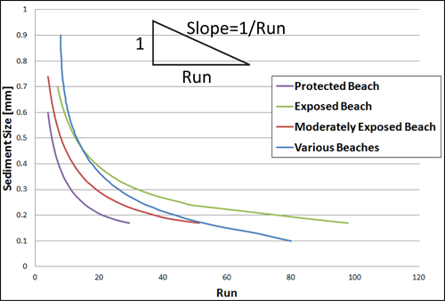
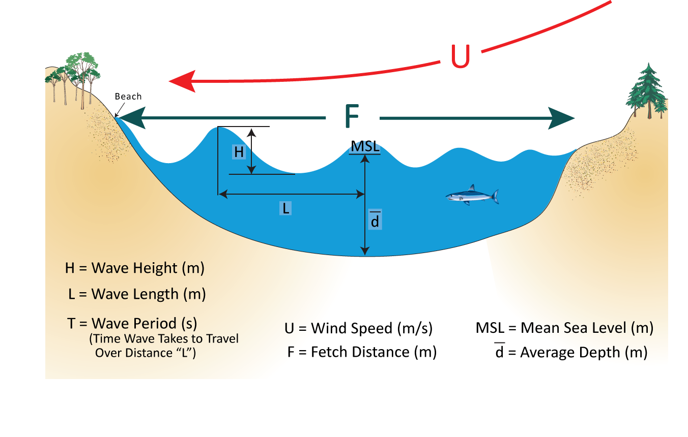
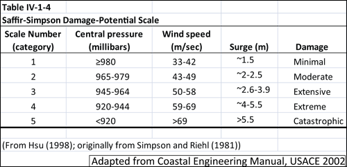

.. _coastal-protection:

.. |openfold| image:: ./shared_images/openfolder.png
              :alt: open
	      :align: middle 

.. |addbutt| image:: ./shared_images/addbutt.png
             :alt: add
	     :align: middle 
	     :height: 15px

.. |okbutt| image:: ./shared_images/okbutt.png
            :alt: OK
	    :align: middle 

.. |adddata| image:: ./shared_images/adddata.png
             :alt: add
	     :align: middle 

************************
Coastal Protection Model
************************

Summary
=======

Understanding the role that nearshore habitats play in the protection of coastal communities is increasingly important in the face of a changing climate and growing development pressure.  The InVEST Coastal Protection model quantifies the protective benefits that natural habitats provide against erosion and inundation in nearshore environments.  It is composed of two sub-models: a Profile Generator and a Nearshore Wave and Erosion model.  In the absence of local data detailing the profile of the shoreline, the Profile Generator model helps users combine information about the local bathymetry and backshore to generate a 1-Dimensional (1D) cross-shore (perpendicular to the shoreline) beach profile.  The Nearshore Waves and Erosion model uses the shoreline profile to compute summaries of nearshore wave information and outputs the total water level and the amount of shoreline erosion in the presence and absence of nearshore marine habitats (e.g., coral or oyster reefs, vegetation, sand dunes).  

Outputs can be used to better understand the relative contributions of different natural habitats in reducing nearshore wave energy levels and coastal erosion, and to highlight the protective services offered by natural habitats to coastal populations.  This information can help coastal managers, planners, landowners and other stakeholders understand the coastal protection services provided by nearshore habitats, which can in turn inform coastal development strategies and permitting.  This is a "Tier 1" model.

We recommend running this model after the Coastal Vulnerability model, which is also part of the “Coastal Protection” tool box.  The Tier0Coastal Vulnerability models maps regions that are more or less vulnerable to erosion and inundation during storms, and also helps you understand the general characteristics of your region of interest.  In addition, it also maps regions of the shoreline that are exposed or sheltered to the open ocean, and estimates wind-generated wave characteristics.  Outputs of Coastal Vulnerability model runs in the presence or absence of natural habitats or other management action will help you identify regions where natural habitats or a certain management action may have significant impacts on the stability of the coastline.  However, the Coastal Protection Tier0 and Tier1 models are independent, and you do not have to run the Coastal Vulnerability model to be able to run the Tier1 model.

Although we hope that the Nearshore Waves and Erosion model will help you answer the questions that you have at your site, it also has its limitations.  First, it does not do any valuation analysis of the role of habitats in increasing the protection of your site from the effects of storms.  It is a 1-Dimensional model, which assumes that we ignore all the complex processes that occur when waves travel over a complex bathymetry.  Also, we use simple models for erosion that ignore any dynamic response of the bed to storm forces.  However, all the science that went into this model has been successfully tested at many sites, and we hope that it will guide you towards a satisfactory management decision.

Introduction
============

The Coastal Protection model works by way of a 1D bathymetry transect (or a series of transects) perpendicular to the shoreline, from offshore to the beach.  Along each transect, the model computes a profile of wave height and the way in which it changes as it moves onshore.  It takes into account the influence of submerged natural habitats, as well as the influence of sand dunes.  These habitats dissipate wave energy and/or act as barriers against high waves and high water levels, and eventually protect coastal properties and communities.  The service provided by these habitats is measured by the amount of avoided erosion or inundation, or by the amount of people protected, or by the value of avoided property damages.

The Coastal Protection model is composed of two models: a Profile Generator, and a Nearshore Waves and Erosion model.  The purpose of the Profile Generator is to help you prepare a 1D bathymetry transect for use in the Nearshore Waves and Erosion model.  If you have local data about the profile of the shoreline, you need not run the Profile Generator model.  The inputs of the Profile Generator include information about the site's location and the overall shape of the shoreline.  Furthermore, the model requires information, which does not have to be precise, about sediment size, tidal range and backshore characteristics.  If you do not have this information, we provide guidance on how to approximate these inputs.  Outputs of the Profile Generator model include a 1-D bathymetry profile at your site, information about the site’s backshore and the location of natural habitats along the cross-shore transect from offshore to the uplands.  In addition, the model provides over-water fetch distances as well as estimates of wave height and wind speeds that can occur at your site during a storm.  It is our goal that this model will generate the inputs you need to run the Nearshore Waves and Erosion model.  We also hope that this model will help you become familiar with some of the characteristics of your site as well as the types of inputs to collect when running a nearshore wave model.  

The Nearshore Waves and Erosion model uses information about the type and location of natural habitat at the site to produce a profile of wave height (how it changes along the transect from offshore to onshore), wave-induced changes in water level, and the amount of shoreline erosion or scour that occurs.  The model inputs are a 1-D bathymetry profile (obtained from our Profile Generator model, above, or a site survey), a value for offshore wave height and period (or a value of wind speed and the fetch direction over which the wind blows) and the average water depth at your site.  Both values of wave and wind speed should be representative of storm conditions in your area of interest.  In addition, the model requires information about the backshore, as well as the type and physical characteristics of the natural habitats that are at your site.  Finally, you will need to specify how your management action will affect your natural habitats: no change, or removal of all or half the density of natural habitats.  This information can come from outputs of InVEST's Habitat Risk Assessment (HRA) model or from direct estimates of the effects of particular management actions.  Model outputs are profiles of wave height before and after the management action, as well as the percent change in wave attenuation caused by that management action.  The model also estimates the amount of erosion of sandy beach as well as the amount of scour in consolidated beds (e.g., scour of mud bed).

.. _cp-Model:

The model
=========

The InVEST Coastal Protection model is a 1-Dimensional (1D) process-based tool that produces an estimate of wave and bed erosion attenuation caused by the presence of natural habitats.  Results of this model can be used as a first step to value the protective role provided by natural habitats.

How it works
------------

As waves travel from the deep ocean to coastal regions with shallower waters, they start to interact with the bed.  They first increase in height before breaking and dissipating most of their energy in the surf zone and the beach face.  Natural habitats play an important role in protecting shorelines against wave action because they increase the amount of wave dissipation, or, in the case of sand dunes, serve as a physical barrier.

To estimate the profile of wave height that one would expect at a certain region it is imperative to have three types of information:

1. Offshore wave characteristics: wave height and wave period at the deepest point in your bathymetry profile.

2. Nearshore bathymetry and backshore characteristics: elevation of the submerged and emerged portions of the cross-shore profile **relative to Mean Lower Low Water (MLLW)**.

3. Location and physical characteristics of natural habitats: distance from the shoreline of the natural habitats that will become submerged during a storm, as well as representative density, height and/or diameter of the habitats elements.

The InVEST Coastal Protection model is composed of two sub-models.  The first model, the Profile Generator, helps you obtain cross-shore nearshore bathymetry and topography information at your site.  Using this cross-shore profile, the Nearshore Waves and Erosion model, computes profiles of wave height and wave-induced mean water level in the presence and absence of seagrass, marshes, mangroves or coastal forests, coral reefs and oyster reefs.  When your site is a sandy beach, the model computes the amount of erosion in the presence and absence of sub-tidal, inter-tidal and supra-tidal (e.g., sand-dunes) habitats.  When your site is composed of consolidated sediments (e.g., mud), the model estimates in a very simple way the amount of scour expected in inter- and supra-tidal areas.  In the remainder of this section, we will describe how both the Profile Generator and the Nearshore Waves and Erosion models work.

.. _cp-PG:

Profile Generator Model
^^^^^^^^^^^^^^^^^^^^^^^

In order to run the Nearshore Wave and Erosion model, it is necessary to have nearshore bathymetry and topography information, as well as the location and characteristics of natural habitats at your site of interest.  Also, it is imperative that you have information about offshore wave heights and associated periods. The purpose of the Profile Generator model is to help you glean this information from your data and help you prepare to run the Wave and Erosion model.  Additionally, the Profile Generator helps you create those data if you do not have them but know the general characteristics of your site.

First, the Profile Generator helps you obtain bathymetry information in three different ways.  In the model interface, we ask you the question *Do you have nearshore bathymetry GIS layer?*.  If you answer *Yes*, the Profile Generator draws a transect perpendicular to the shoreline where your site is located, and reads the (X, Z) bathymetry and topographic information below that transect.  If your site is surrounded by land, or is fronted by an island, the offshore portion of your profile might be the beach on the other side of your site.  In this case, your offshore water depth is extremely shallow, and your deep water wave height will not be able to propagate to your site since it will break in such waters.  To avoid this situation, we remove any portions of the profile offshore of the deepest point that is shallower than the average depth.  

Another option is to answer *No, but I will upload a cross-shore profile*, and upload a profile that you already have for further processing.  Please note you need to have a minimum of two (X,Z) coordinate points in the uploaded file.  Lastly, if you do not have any bathymetric information at your site of interest, you can choose the third option *No, please create a theoretical profile for me*, and the model will generate, **for sandy systems only**, a theoretical bathymetric profile, based on the average sand size at your site.  The depth profile follows the equation (Dean and Dalrymple, 2002, Chap. 7):

.. math:: Z=-AX^{2/3} 
  :label: EqProf

where :math:`(X,Z)` represent the cross-shore distance and depth, with :math:`X=0` at the shoreline.  The coefficient : math:`A` is a profile scale factor and is a function of sediment size (Dean and Dalrymple, p.162 and CEM).  This shape of bed profile is called an equilibrium beach profile, and corresponds to the average profile that one would obtain after averaging years of regular bathymetric surveys at a sandy beach.  It can also be viewed as a profile that develops when destructive and constructive forces are in equilibrium.  Usually, this profile extends to what’s called the “closure depth”, which is the depth where wind-generated waves no longer have an effect on the bed.  However, for simplicity, we extend this profile from the water line down to -20 meters.  Please remember that this option is only valid for sandy systems, for which sediment size varies between 0.1 to 1.09 mm.

Once you have decided on the method that will be used to create an initial bathymetry profile, the Profile Generator will help you modify or add to the information contained in that transect in order to come up with a representation of your site that is as accurate as possible.  This is especially useful if you want to estimate the amount of erosion at your beach and do not have reliable backshore information.  It is also useful to use our tool if you would like to modify or remove portions of your profile to represent the effects of a management action under consideration or because your data need to be post-processed (e.g., remove offshore portions that are too deep to affect wave heights or remove certain bathymetric features before conducting the analysis).

Figure :ref:`BeachProfile` shows profiles of a typical beach and a coastal mangrove forest.  After waves have progressed from deep water and broke in the nearshore, they reach the foreshore and/or backshore portion of the beach, or, if the water level is high enough, propagate through a marsh or a mangrove forest.  Under normal conditions, for sandy beaches there is a relatively flat region between the Mean Lower Low and Mean Higher High (MHHW) water marks called foreshore.  The backshore (the region above MHHW) consists of a berm and, in temperate regions mostly, a sand dune.  Berms can sometimes have a very small or no width.  In general, foreshore and backshore information cannot be obtained during standard hydrographic surveys.  Also, we have found that although most DEM files have relatively good bathymetric information, intertidal and backshore elevations are often incorrect, unless they were measured during a detailed topographic survey effort.  Mangrove forests are usually fronted by a tidal flat with an average slope of 1:1000 to 1:2000, and usually have a relatively monotonic substrate whose slope varies between 1:200 to 1:600 (de Vos, 2004; Burger, 2005).

.. _BeachProfile:
.. figure:: ./coastal_protection_images/BeachProfile.png
   :align: center
   :figwidth: 500px

We offer you three different options for adding a foreshore and/or backshore profile to your bathymetry transect:

**Option 1. Add backshore to a sandy beach**: assuming that this information is not contained in the cross-shore profile that we cut for you or you uploaded, we help you guess what foreshore slope, berm height and dune height might be for your site, based on simple rules of thumb.  Please bear in mind that we use rules of thumb developed from site-specific information, and conditions at your site can differ quite drastically from these rules.

As mentioned earlier, the foreshore is the intertidal region of the beach profile, and we assume that it is linear in our model.  To provide you with guidance on what that slope might be, we provide you with five different values of slope, based on the sediment size value that you input.  The first three are derived from observations presented in Wiegel (1964) at beaches that are protected, moderately exposed or fully exposed to the open ocean, in the U.S.  The fourth value is derived from observations by McLachlan and Dorvlo (2005) at various beaches around the world.  The fifth value is the average of the four previous values.  

Berm height and foreshore slope often change as a function of seasonal wave climate.  After a storm, the profile is flatter and the berm is lower than during fair weathers conditions.  However, in case you do not have any information about berm height at your site, we recommend that you place the berm at least at the same elevation as the MHW mark.  Finally, you need to provide a dune height value.  Dunes are fairly common in temperate climates, and you can estimate their height based on site surveys.  However, if you do not have this information, we can provide you with a height estimate based on the relationship between sand size, offshore wave climate information and tidal range developed by Short and Hesp (1982).  

Short and Hesp (1982) classified sand dune height at various beaches in Australia based on tidal range, modal wave height and period, :math:`H_m` and :math:`T_m`, and average sand size :math:`d_{50} [mm]`. (The modal wave is the wave that occurs the most often, and is computed from a relatively long (e.g., years of observation) time series of regular wave height observations.)  From their observations, they found that sand dunes can be created when a beach is wave dominated, or when the relative tidal range, defined as the ratio of the tidal range to the breaking wave height :math:`H_b` is lower than 3.  Under those conditions, they found that dune height can be grouped into six types.  Beach type is computed as:

.. math:: Type= \frac{H_b}{w_s T_m}
  :label: BeachType

where :math:`H_b` is the modal wave breaking height, approximated as (Komar, 1998):

.. math:: H_b=0.39g^{0.2} \left(H_m T_m \right )^{0.4}
  :label: BreakingWaveH

:math:`w_s` is the sediment fall velocity, or the average velocity at which the sediment falls through the water column:

.. math:: w_s=1.26\cdot 10^{-6} \sqrt{ 13.0321+1.18 \left( 1.56\cdot10^{-6} \frac{g d_{50}^3}{1.5876\cdot 10^{-12}}\right )^{0.65}} -3.61
  :label: FallVelo

If the beach type value is lower than 3, then it is likely that you beach is reflective.  Reflective beaches tend to be protected from the open ocean and have relatively steep foreshore slopes, and Short and Hesp (1982) observed a variation in dune height between 4 and 8m at those beaches.  In the model, we assign them an average dune height of 5m.  On the other hand of the spectrum, dissipative beaches (:math:`Type \geq 5`) are in general exposed to very energetic waves coming from the open ocean.  These beaches tend to experience strong winds, which can create fairly high dunes.  Short and Hesp (1982) observed a variation in height between 15 and 30m at those beaches, and we assign them a dune height of 20m.  In between are intermediate beaches, where Short and Hesp (1982) observed a variation in height between 8 and 15m.  In our model, we assign them a dune height of 12m.

Please bear in mind that the relationship developed by Short and Hesp (1982) was developed from observations of beaches in a particular place, and no process-based model was developed to predict beach dune height in this region.  The dune height at your site might be quite different from the one that we might propose to you.  Use the estimate of dune height as a general indication of what a dune height might be, and change it based on your knowledge of your site.

**Option 2. Add a backshore to a mangrove or mash.**  Mangrove and marsh beds are different from sandy beaches because they consist, in general, of consolidated materials, do not have dunes, and their profile is in general fairly linear.  As mentioned earlier and shown in Figure :ref:`BeachProfile`, mangrove forests are usually fronted by a tidal flat with an average slope of 1:1000 to 1:2000, and usually have a relatively monotonic substrate whose slope varies between 1:200 to 1:600 (de Vos, 2004; Burger, 2005).  We did not find any specific guidelines for marsh profiles.

If you choose this option, you will have to enter a maximum of three linear profiles that can be added to the bathymetry profile that was cut/created for you or that you uploaded.  

**Option 3. Modify a profile uploaded in the GIS interface.**:  As mentioned earlier, if you upload a profile with a minimum of two (X, Z) points, you can modify it or add to it with monotonic profiles between fixed distances.  This option is especially useful in cases when you are not fully satisfied with the profile that was cut in GIS and want to modify it, or when you want to rapidly create a depth profile from scratch without looking or uploading a bathymetry profile.
  
Third, the Profile Generator locates the presence of natural habitats along your cross-section.  When you choose Option 1 *Yes* to the question *Do you have nearshore bathymetry GIS layer*, you can also indicate the types of natural habitats that are present in your region, and the model will locate and plot where those habitats fall onto the cross-shore transect.  Please note that the results from this last step are accurate only if the natural habitat and bathymetry layers are properly geo-referenced.  If these layers were prepared during two different efforts, you might have to make sure that the natural habitats are properly placed along your profile (e.g., make sure that seagrass beds are in subtidal areas, or mangroves are in inter- or supratidal areas).

Finally, if you do not have any storm wave or wind information at your site to run the Nearshore Waves and Erosion model, the model will help you obtain those data by reading and providing you with some pre-processed statistics from the closest WaveWatch III grid point.  Because wave data can be scarce in most regions of the world, we analyzed 7 years of WAVEWATCH III (WW3, Tolman (2009)) model hindcast reanalysis results to estimate, for model grid points that are in waters deeper than 50m, the maximum as well as the average of the top 10% and 25% wave height.  We also computed the same statistics for wind data, for 16 equiangular direction sectors (0deg, 22.5deg, 45deg, etc.).  

Wind information can be used in the Nearshore Waves and Erosion model by combining it with fetch distance as well as the average depth offshore of your site to compute an offshore wave height and period inputs.  However, if you do not know fetch distances to your site, you can have the model computes them by choosing *Yes* to the question *Do you want the model to compute fetch distances?*.  In that case, from your site location, the model draws 16 equiangular sectors, and in each sector, the model draws nine equiangular radials.  Each radial is initially 50km long, but is cutoff when it intersects with a land mass.  To capture the effects of those land masses that limit fetch distance, the average fetch distance :math:`F_k` for each 22.5deg sectors :math:`k` is weighted by each radial distance and angle (Keddy, 1982):

.. math:: F_k=\frac{\sum_{n=1}^9f_n\cos \theta }{\sum_{n=1}^9\cos \theta }
  :label: AvgFetch

where :math:`f_n` is the :math:`n^{th}` radial distance in the :math:`k^{th}` equiangular sector, and :math:`\theta=2.5deg` (22.5deg divided by 9).   

From wind speed, and fetch distance, wave height and period of the locally generated wind-waves are computed for each of the 16 equiangular sectors as:

.. math::
   \left\{\begin{matrix}
   H=\widetilde{H}_\infty \left[\tanh \left(0.343\widetilde{d}^{1.14} \right )  \tanh \left( \frac{2.14.10^{-4}\widetilde{F}^{0.79}}{\tanh (0.343 \widetilde{d}^{1.14})} \right )\right ]^{0.572}\\ 
    \displaystyle \\
   T=\widetilde{T}_\infty \left[\tanh \left(0.1\widetilde{d}^{2.01} \right )  \tanh \left( \frac{2.77.10^{-7}\widetilde{F}^{1.45}}{\tanh (0.1  \widetilde{d}^{2.01})} \right )\right ]^{0.187}
   \end{matrix}\right.  
   :label: WaveFetch

where the non-dimensional wave height and period :math:`\widetilde{H}_\infty` and :math:`\widetilde{T}_\infty` are a function of the average wind speed values :math:`U` that was observed in in a particular sector: :math:`\widetilde{H}_\infty=0.24U^2/g`, and :math:`\widetilde{T}_\infty=7.69U^2/g`, and where the non-dimensional fetch and depth :math:`\widetilde{F}_\infty` and :math:`\widetilde{d}_\infty` are a function of the fetch distance in that sector :math:`F_k` and the average water depth in the region of interest :math:`d [m]`: :math:`\widetilde{F}_\infty=gF/U^2`, and :math:`\widetilde{T}_\infty = gd/U^2`.  :math:`g  [m/s^2]` is the acceleration of gravity.  This expression of wave height and period does not differentiate between duration and fetch-limited conditions (USACE, 2002; Part II Chap 2).  Hence, model results might under- or over-estimate wind-generated wave characteristics at a site.  

Once you are satisfied with your nearshore bathymetry and topography profile, you can run the wave Nearshore Waves and Erosion model.

.. _cp-NEW:

Nearshore Waves and Erosion
^^^^^^^^^^^^^^^^^^^^^^^^^^^

The amount of shoreline or bed erosion at the shoreline is a function of the total water level at your site and storm duration.  The total water level at the shoreline is composed of the sum of storm surge, wave runup, tide, amount of sea-level rise, and any water surface elevation anomaly (e.g., super-elevation during an El Niño).  To quantify the protective services provided by natural habitats, the CP model computes the amount of attenuation of waves and wave-induced mean water level (runup) at the shoreline caused by submerged vegetation and reefs.  

Wave Evolution Model
""""""""""""""""""""

Assuming that waves have a deep water height of :math:`H_o` and a period :math:`T`, it is possible to compute the evolution of wave height from offshore to the shoreline along the x-axis of the user defined cross-shore transect with the following wave energy equation:

.. math:: \frac{1}{8}\rho g \frac{\partial C_g H^2}{\partial x}=-D
    :label: EvolEq

where :math:`\rho` is the density of seawater, taken as :math:`1,024 kg/m^{3}`, :math:`g=9.81 m/s^2` is the gravitational acceleration, :math:`H` is the wave height representative of the random wave field, :math:`C_g` is the speed at which wave energy travels, and :math:` ` represents the dissipation of wave energy.  The role of dissipation is to decrease the amount of wave energy as it propagates through or over different media.  It is the sum of the dissipation caused by wave breaking :math:`D_{Break}`, bottom friction :math:`D_{Bot}`, and submerged vegetation :math:`D_{Veg}` : 

.. math:: D=D_{Break}+D_{Veg}+D_{Bot}
   :label: TotalDiss

Dissipation due breaking is modeled using the formulation and default parameters presented by Alsina and Baldock (2007), which performed well when compared to various field measurements, even without calibration (Apostos et al., 2008):

.. math:: D_{Break}=A\frac{H^3}{h}\left [ \left ( \left (\frac{H_b}{H}  \right )^3+\frac{3H_b}{2H} \right )) \exp \left ( -\left (\frac{H_b}{H}  \right )^2 \right )+\frac{3\sqrt\pi}{4}\left ( 1-erf\left ( \frac{H_b}{H} \right ) \right ) \right ]
   :label: BreakDiss

where :math:`erf` is the Gauss error function, :math:`h` is the local water depth, :math:`A` is the sediment scale factor (see Section :ref:`cp-PG`), and :math:`H_b` is the maximum wave height prior to breaking:

.. math:: H_b=\frac{0.88}{k}tanh\left ( \gamma \frac{kh}{0.88} \right )
   :label: Hb

where :math:`k` is the wavenumber, the ratio of length between two wave crests (called wavelength) :math:`L` to :math:`2\pi`, and :math:`\gamma` is a calibration parameter called the breaking index.  In our model, we take the default :math:`\gamma` value proposed by Battjes and Stive (1985):

.. math:: \gamma=0.5+0.4 \tanh\left ( 33\frac{H_o}{L_o} \right )
   :label: gamma

where :math:`H_o` and :math:`L_o` are the deepwater wave height and wavelength, respectively.

The other dissipation terms in Equation :ref:`TotalDiss` are expressed as a function of the characteristics of the natural habitats that are present in your region of interest.  In the model, we trigger them as the habitats that you have specified appear along your transect as the offshore wave progresses toward the shoreline.  We ignore any non-linear processes that might occur as waves move from one medium or habitat to another. 

Dissipation due to the presence of vegetation is expressed by (Mendez and Losada, 2004):

.. math:: D_{Veg}=\frac{1}{2\sqrt\pi} \rho N d C_d \left(\frac{kg}{2 \sigma} \right ) ^3 \frac{\sinh ^3 k \alpha h +3 \sinh k \alpha h}{3k \cosh ^3 kh} H^3
   :label: VegDiss

where :math:`N` is the density of vegetation stems per unit area, :math:`d` is the frontal width or diameter of vegetation stems, and :math:`\alpha` represents the fraction of the water depth :math:`h` occupied by vegetation elements of average stem height :math:`h_c`: :math:`\alpha=h_c \ h`.  In the case of submerged vegetation, :math:`\alpha<1`, and in the case of emergent vegetation (:math:`h_c>h`), we take :math:`\alpha=1`.  

Finally, :math:`C_d` is a taxa-specific (e.g., eelgrass, marsh, mangroves) drag coefficient.  In our model, we assumed default values of drag coefficient (see e.g., Kobayashi et al., 1983; Bradley and Houser, 2009; Burger, 2005 ).:

- For seagrass beds and marshes, :math:`C_d=0.01`
- For trees, including mangroves, :math:`C_d=1`

For trees, and mangroves in particular, we assumed that roots, trunk and canopy contribute independently to the total dissipation caused by vegetation, and :math:`D_{Veg}` becomes: :math:`D_{Veg}=D_{Roots}+D_{Trunk}+D_{Canopy}`.  

In addition to dissipation caused by vegetative elements, waves can also lose energy because they propagate over a rough bottom such as a coral reef top.  Dissipation due to bottom friction is generally initiated when waves are in shallow enough water to “feel” the bottom, and is higher for coarser bed material than smoother ones.  In our model, it is triggered when waves travel over sandy bottoms, but also coral reefs, which are rougher than sand beds.  Following Thornton and Guza (1983), we modeled dissipation due to bottom friction by:

.. math:: D_{Bot}=\rho C_f \frac{1}{16\sqrt\pi} \left[ \frac{\sigma H}{\sinh kh} \right]^3
   :label: BottomDiss

where :math:`C_f` is the bed friction coefficient, which is a function of the roughness (or dimensions) of the bed, and :math:`\sigma` is the wave frequency, the ratio of wave period :math:`T` to :math:`2 \pi`.  In our model, we assumed the following default friction coefficients:

- For live corals, :math:`Cf=0.2`,
- For dead (smooth) corals that are still structurally stable :`Cf=0.1`
- For corals that are broken to pieces and sandy bed: :math:`C_f=0.001`, 

The wave-evolution equation (Equation :ref:`EvolEq`) is valid when the bottom slope is not too steep.  When waves encounter a steep barrier such as a coral reef, we do not compute the amount of breaking dissipation and the profile of wave height during breaking.  However, we estimate the value of the broken wave height at the edge of the reef top :math:`H_r` assuming that wave height is controlled by water depth :math:`h_{top}` (Gourlay, 1996a, b) : :math:`H_r=0.46h_{top}`, where :math:`h_{top}=h_r+\overline{\eta}_r+h_+` is the total water depth on top of the reef.  

The total water depth is the sum of the depth on the reef top referenced to Mean Sea Level :math:`h_r`, the wave setup on the reef caused by breaking waves :math:`\overline{\eta}_r`, and any additional super-elevation of the water level :math:`\overline{\eta}_+`, which can be caused by tides, pressure anomalies, etc.  The wave setup on the reef top is caused by the release of wave energy during breaking, and it is computed using the empirical equation proposed by Goulay (1996a,b; 1997):

.. math:: \overline{\eta}_r=\frac{3}{64\pi}K_p \frac{\sqrt g H_i^2T}{\left(\overline{\eta}_r+h_r \right )^{3/2}}
   :label: EtaCorals

where :math:`H_i` is the incident wave height, or the wave height at the offshore edge of the coral reef.  The coefficient :math:`K_p` is the reef profile shape factor, and is a function of the reef face slope :math:`\alpha_f` or the reef rim slope :math:`\alpha_r`, depending on whether waves break on the reef face or rim.  Once the broken wave height is established following the equation presented above, we determine the profile of wave height over the reef top following Equation :ref:`EvolEq`, with :math:`D_{Bot}` as defined in Equation :ref:`BottomDiss`.

Similarly to coral reefs, when waves encounter a steep barrier such as an oyster reef, we do not compute the amount of breaking dissipation and the profile of wave height during breaking.  We estimate the wave height :math:`H_t` immediately shoreward of the reef with the following equations based on the incident wave height :math:`H_i` immediately offshore of the reef:

.. math:: H_t=K_tH_i
   :label: HtOyster

where :math:`K_t` is a transmission coefficient.  In the case of trapezoidal-shaped reefs, the transmission coefficient is computed with an empirical formula developed for low-crested breakwaters (van der Meer et al., 2005):

.. math:: K_t=\begin{cases}
          -0.4\frac{R_c}{H_i}+0.64\left(\frac{B}{H_i} \right )^{-0.31} \left(1-e^{-0.5\xi} \right) & \text{ if } B/H_i<8 \\ 
          -0.35\frac{R_c}{H_i}+0.51\left(\frac{B}{H_i} \right )^{-0.65} \left(1-e^{-0.41\xi} \right)& \text{ if } B/H_i>12 
          \end{cases}
   :label: KtOyster

where :math:`B` is the crest width of the reef, and :math:`R_c=h_c-h` is the crest freeboard, the difference between the reef height :math:`h_c` and the water depth :math:`h`.  The breaker parameter :math:`\xi` is computed as :math:`\xi=\tan \alpha/\left(S_i \right)^{0.5}` where the seaward slope of the reef :math:`\tan \alpha` is computed as a function of the structure crest and base width, :math:`B` and :math:`W`, respectively: 

.. math:: \tan \alpha=\frac{2 h_c}{W-B}
   :label: Eq1

Finally, :math:`S_i` is the incident wave steepness: 

.. math:: S_i=\frac{2}{pi} \frac{H_i}{g T_p}
   :label: Eq2

In the above equation, when :math:`8<B/H_i<12`, we estimate :math:`K_t` by linearly approximation.  

If the oyster reef is a ball resembling the Reef Ball:sup:`TM`, we follow the empirical equation proposed by Armono and Hall (2003):

.. math:: K_t=1.616-4.292\frac{H_i}{T^2}-1.099\frac{h_c}{h}+0.265\frac{h}{W}
   :label: KtReefBall

Once waves have travelled past the coral and oyster reefs, we model their evolution in the remaining portion of the bathymetry using the wave evolution equation (Equation :ref:`EvolEq`).  We assume that their peak period :math:`T` hasn’t changed.

Nearshore Bed Erosion
"""""""""""""""""""""

The model estimates two types of shoreline response to wave attack.  In the case of sandy beach systems, we compute the amount of shoreline erosion that takes place after a storm based on the user-input value of storm surge and the value of wave runup computed by the wave evolution model.  In cases when the shoreline is composed of consolidated sediments (mangroves, marshes), we estimate an hourly amount of bed scour.  In both cases, we use empirical equations that ignore the dynamic feedback that takes place between wave and bed as the erosion occurs.

Wave runup (:math:`R_2`; see USACE (2002, Chap. 4)) is an estimate of the maximum shoreward distance that waves can reach on the shoreline.  Once the profile of wave height has been computed, we estimate the amount of wave runup at the shoreline based on the empirical equation proposed by Stockdon et al. (2006):

.. math:: R_2=1.1 \left(0.35 m \sqrt {H_o L_o} +0.5\sqrt{0.563m^2H_o L_o+0.004H_o L_o } \right )
   :label: R2Stockdon

where :math:`m` is the foreshore slope, or the average cross-shore slope at the shoreline.  In the above equation, the first term in the parenthesis represents the wave setup, and it can be influenced by the presence of the vegetation.  The second term represents the wave swash, and it is composed of two terms.  The first term, which is a factor of the foreshore slope :math:`m` is called incident wave swash, and it can also be influenced by the presence of the vegetation.  The second term is the called the infragravity swash.  We assumed that this term is not affected by the presence of vegetation elements because vegetation does not affect long-period waves as much as it does short period waves (Bradley and Houser, 2009).  In the absence of biogenic features, the CP model only requires information on the characteristics of offshore waves and foreshore slope to compute wave runup with Equation :ref:`R2Stockdon`.  If intertidal or subtidal biogenic features are present, we estimate wave runup via a series of steps described below.

First, we estimate, in the absence and in the presence of vegetation, the profile of wave height following the procedure outlined above, and the wave setup :math:`\overline{\eta}` at the shoreline by solving the following force balance equation:

.. math:: \frac{\partial S_{xx}}{\partial x}+\rho g \left(h+\overline{\eta} \right )\frac{\partial \overline{\eta}}{\partial x}-f_x=0
   :label: MWLEq

where :math:`S_{xx}` is the force per unit length generated by the waves on the water column, and :math:`f_x` is the force per unit area due to the presence of vegetation elements:

.. math:: f_x=-\alpha F_x
   :label: fx 

where the force :math:`F_x` is computed following Dean and Bender (2006):

.. math:: F_x=\rho g \frac{1}{12 \pi}NdC_d \frac{k}{\tanh kh}H^3
   :label: Fx

Neglecting non-linear processes associated with wave propagation, this equation is only valid for emergent vegetation.  Consequently, we added the coefficient :math:`\alpha` to approximate the effects of vegetation on the wave setup when it is submerged.  This approximation over-estimates the reduction in wave setup caused by submerged vegetation compared to what we would obtained if we had adopted a non-linear wave theory to estimate :math:`F_x`.  However, for our intents and purposes, this approximation is much faster and simpler to adopt. 

Once we have obtained values of wave setup in the absence of vegetation, we estimate a proportionality coefficient :math:`\beta` between the empirical estimate of wave setup and the value of the modeled wave setup at the shoreline :math:`\overline{\eta}_{Shore}`:

.. math:: \beta=\frac{\overline{\eta}_{shore}}{0.35m\sqrt{H_oL_o}}
   :label: CorrFactor

Based on the modeled value of the wave setup at the shoreline in the presence of vegetation, :math:`\overline{\eta}_{Shore}^{v}`, we estimate the hypothetical offshore wave height :math:`H_p` that would have achieved the same modeled setup, assuming that the value of the coefficient :math:`\beta` is the same:

.. math:: H_p=\frac{1}{L_o}\left (\frac{\overline{\eta}_{Shore}^{v}}{0.35m}  \right )^2
   :label: HpVeg

In cases when the effects of vegetation are so pronounced that :math:`\overline{\eta}_{Shore}^{v}` is negative, we assume that :math:`H_p=0`.

Finally, to estimate the amount of runup at the shoreline in the presence of natural habitats, we replace :math:`H_o` in Equation :ref:`R2Stockdon` by the value of the hypothetical offshore wave height :math:`H_p` in the wave setup and wave-induced swash terms:

.. math:: R_2=1.1 \left(0.35 m \sqrt {H_p L_o} +0.5\sqrt{0.563m^2H_p L_o+0.004H_o L_o } \right )
   :label: RnpCorr

where the last term is left untouched because, as mentioned earlier, we assumed that long waves are not affected by the presence of natural habitats.  Similarly, we did not change the value of the offshore wavelength :math:`L_o` because we assumed that peak wave period is not affected by the presence of natural habitats.

From the value of runup at the shoreline, we estimate the amount of beach erosion based on the management action that you have specified.  Sandy beaches are eroded during storms, and generally build back during periods of fair weather.  The amount of shoreline erosion is a function of the elevations of sand berm and dunes in the backshore, the wave height and period during the storm, the length of the storm, and the total water level elevation during the storm.  

As mentioned earlier, the total water level during the storm is a function of the storm surge elevation, wave runup elevation, the tide stage during the storm, and any super-elevation of the water surface caused by oceanic processes.  In the model, we only require storm surge elevation values as input, and we compute the amount of runup for the different management actions that you want to evaluate from Equation :ref:`R2Stockdon`.  Consequently, it is important that you adjust your bathymetry profile to any other water surface elevation difference that you want to evaluate in our model.  

We estimate the amount of sandy beach erosion during a storm :math:`E_s` following the model proposed by Kriebel and Dean (1993):  

.. math:: E_s=-\frac{1}{2} (1-\cos \alpha) E_{\infty}
   :label: Rfinal

where the beach potential erosion response in case the storm lasted an infinite amount of time :math:`E_{\infty}` is scaled by the duration of the storm under consideration by a time-correction factor :math:`\alpha`.  The potential erosion response :math:`E_{\infty}` is computed as a function of the wave breaking characteristics and the backshore dimensions:

.. math:: E_{\infty} = \frac{S(x_b - h_b /m)-W (B+h_b-0.5S)}{B+D+h_b - 0.5 S}
   :label: Rinf

where :math:`S` is the total water level during the storm, referenced to MSL (please note that we adjust the bathymetry to MSL based on the tide information that you provide us, so **your initial bathymetry profile should be referenced to MLLW**).  :math:`h_b` and :math:`xb` represent the water depth and distance from the shoreline where the offshore wave breaks with a height :math:`H_b`.  Breaking wave characteristics are computed by applying the wave evolution equation, Equation :ref:`EvolEq`, to an equilibrium profile built from the sediment scale factor we computed from the sediment size at your site (see Section :ref:`cp-PG): :math:`h_b=Ax_b^{2/3}`.  :math:`E_{\infty}` is also a function of the foreshore slope :math:`m`, as well as the height and width of the sand berm :math:`B` and :math:`W`, and dune height :math:`D` in the backshore.  

The scale coefficient :math:`\alpha` (:math:`\pi \leq \alpha \leq 2 \pi`) is computed by solving the following equation:

.. math:: \exp ( - \alpha/\beta ) = \cos \alpha – (1/\beta) \sin \alpha
   :label: alphaR

where :math:`\beta` is a function of the storm finite duration :math:`T_d` and breaking wave characteristics:

.. math:: \beta= 320 \frac{2 \pi }{T_d} \frac{H_b^{3/2}}{\sqrt{g}A^3} \left( 1+\frac{h_b}{B+D}+\frac{mx_b}{h_b} \right) ^{-1}
   :label: betaR

Practically, in the model, we estimate the amount of beach erosion that would occur under various management scenarios by first solving Equation :ref:`Rfinal` in the absence of vegetation.  Breaking location is computed as explained above, using the sediment scale factor :math:`A` derived from the sediment size that you input.  In the presence of vegetation, it is often difficult to estimate the exact location of breaking, and there is not any guidance or observation of avoided coastal erosion in the presence of natural habitats.  Consequently, we estimate the amount of beach erosion in the presence of natural habitats by scaling the amount of erosion obtained in the absence of natural habitats by the ratio of reduction in runup values as well as the ratio of the cube of wave height over the submerged vegetated bed.  This is because empirical models of beach erosion are directly proportional to water level (e.g., see Equation :ref:`Rinf`).  Also, process-based models of beach erosion (e.g., Kriebel and Dean, 1985) scale erosion by wave dissipation, which is proportional to the cube of wave height.  Final value of erosion in the presence of natural habitat is taken as the average of both values.

**Note**: You can notice that for certain values of :math:`m`, Equation :ref:`Rinf` can yield negative results.  Instead of generating a message error, we decrease the profile foreshore slope so that :math:`E_{\infty}` is positive.  The reason we decided to make this correction is because of the uncertainty associated with the model and model inputs.  In future version of this model, we will use a more sophisticated erosion model, which will require more precise input parameters, and will avoid this situation.  To estimate a correct foreshore slope that won’t yield negative in Equation :ref:`Rinf`, we approximate the breaking wave height by using Equation :ref:`BreakingWaveH` (see Section :ref:`cp-PG`).  We then compute breaking position and location :math:`x_b` and :math:`h_b` by assuming that :math:`H_b=0.78 h_b` and:

.. math:: h_b=Ax_b^{2/3}  
   :label: Eq4
Additionally, in order to help you conduct a sensitivity analysis, we output a sediment scale value :math:`A_{fit}` obtained from fitting the profile you input to the equilibrium equation, Equation :ref:`EqProf`.  We also indicate whether the sediment size that you input would yield a larger or smaller value of :math:`A` than :math:`A_{fit}`.  Please use this information with caution as bathymetry measurements are often missing or somewhat inaccurate in nearshore regions.  The best value of sediment size that you could enter is based on site-specific field measurements.

In addition to sandy beaches, the model can also estimate an hourly rate of scour that consolidated bed might experience.  Muddy substrates, as found in marshes or mangrove forests, do not erode as sandy beaches.  They are composed of cohesive sediments that are bound by electro-magnetic forces, and their resistance to wave- and storm-induced bed velocity is a function of their composition and level of consolidation.  In our model, we estimate the hourly rate of scour of a consolidated bed :math:`E_m [cm.h^{-1}]` by following the method proposed by Whitehouse et al. (2000, Ch. 4):  

.. math:: E_m=\begin{cases}
  36 ( \tau_o-\tau_e ) m_e / C_M & \text{ if } \tau_o-\tau_e>0 \\ 
  0& \text{ if } \tau_o-\tau_e \leq 0 
  \end{cases}

   :label: ErMud

where :math:`m_e` is an erosion constant and :math:`C_M` is the dry density of the bed.  Both constants are obtained from site-specific measurement.  However, we offer sample default values of :math:`m_e=0.001 m.s^{-1}` and :math:`C_M=70 kg.m^{-3}` in our input files.  The variable :math:`\tau_e` is the erosion shear stress constant and is computed as: 

.. math:: \tau_e = E_1 C_M ^ {E_2}
   :label: Taue

where :math:`E_1` and :math:`E_2` are site specific coefficients.  In our model, we compute the erosion threshold using average values of those coefficients (Whitehouse et al., 2000): :math:`E_1=5.42 \cdot 10^{-6}` and :math:`E_2=2.28`.  Finally, the wave-induced shear stress :math:`\tau_o` is computed as:

.. math:: \tau_o = \frac{1}{2} \rho f_w U_{bed}^2
   :label: Tauo

where :math:`U_{bed}` is the wave-induced bottom velocity at water depth :math:`h`: 

.. math:: U_{bed}=0.5H\sqrt{g/h}
   :label: Eq5
and :math:`f_w` is the wave-induced friction coefficient, computed assuming the flow is turbulent:

.. math:: f_w=0.0521 \left( \frac{\sigma U_{bed}^2}{\nu} \right ) ^{-0.187}
   :label: fw

where :math:`\nu \approx 1.17 \cdot 10^{-6} m^2.s^{-1}` is the kinematic viscosity of seawater, and :math:`\sigma=2\pi/T` is the wave frequency.

In the model, we only estimated the rate of bed erosion for regions that are above MLLW, assuming that there is no mixture of sand and mud in the inter- and supra-tidal areas.  

.. _cp-Limitations:

Limitations and Simplifications
===============================

Although we hope that the Tier1 Coastal Protection model will help you come up with a good decision on how to manage your site, it has its limitations and many theoretical limitations.  First, in the Profile Generator we can only cut bathymetry profiles that have a 1m resolution.  Any features that are below that resolution will be lost.  Also, we use simple rule of thumbs based on observations to help you generate a profile in case you do not have data.  They are the most “accurate” methods that we could find in the literature.  So we encourage you to obtain all the data that you are missing by conducting a site visit.

The theoretical limitations of the Nearshore Waves and Erosion model are more substantial.  As mentioned earlier, wave evolution is modeled using a 1D model.  This assumes that the bathymetry is longshore-uniform, that is the profile in front of your site is similar along the entirety of your stretch of shoreline.  This assumption ignores any complex wave transformations that occur offshore of your site because your bathymetry is most-likely not uniform in the alongshore direction.  Also, although the wave model that we are using compares well against observation with default calibration parameters (see Section :ref:`cp-NEW`) we do not offer you at this point to calibrate it.  So values of wave height and wave-induced water level along your transect might differ from observations.  

Another limitation of the wave model is that we assume that the vegetation characteristics that you input in the model remain valid during the storm that you specified.  We also ignore any non-linear processes that occur when waves travel over submerged vegetation.  For example, we do not take into account wave reflection that occurs at the edge of the vegetation field, or we ignore motion of vegetative elements caused by wave forces.  We also ignore any reduction in habitat density during a storm.  Furthermore, we use default values of friction and drag coefficient to compute the forces exerted by the habitats on the water column.  This implies that those forces are independent of the flow turbulence regime.  Finally, we use simple empirical models to compute the wave profile over coral and oyster reefs.  Although these models have been validated with observations, they ignore many processes that might change the wave profile that we compute.

To model beach erosion, we use the model proposed by Kriebel and Dean (1993).  Although this empirical model has been widely used (USACE, 2002), it ignores key erosion processes that occur during a storm.  For example, we do not take into account the dynamic response and feedback between wave and bed profile during the storm.  We also do not evaluate when dune breaching and the amount of overwash that might occur during your storm.  

To model scour of consolidated beds, we use the model proposed in Whitehouse et al. (2000).  Also, we provide you in the Excel interface with default data that might not be appropriate to your site.  This assumes that your whole bed has the same characteristics, both horizontally and vertically.  Also, we ignore any dynamic response between increase levels of suspended sediments and wave-induced bottom velocity, as well as any sediment settlements.  

Data Needs
==========

As mentioned earlier, the Coastal Protection model is composed of two sub-models: the Profile Generator and the Nearshore Waves and Erosion models.  We recommend that you first use the Profile Generator tool to obtain a cross-shore profile that contains bathymetry and backshore information.  This tool will also help you gather information about the type of natural habitats presents at your site, as well as values for offshore wave height, and wind speed and fetch direction for your site.  Then, once you’ve decided on your input parameters as well as the management action that you want to use the model for, you can run the Nearshore Waves and Erosion model.  To run the Nearshore Waves and Erosion model, you will need to have, at a minimum, a bathymetry profile as well as wave and storm information.  Furthermore, you will need to provide information on the type of backshore that you have at your site, as well as on the characteristics of the natural habitats that are present at your site.  

.. _cp-PGData:

Profile Generator
-----------------

#. **Workspace (required).** You need to specify a workspace folder path where we can store model outputs.  We recommended you create a new folder that will contain all CP Tier 1 outputs (Profile Generator as well as Nearshore Waves and Erosion outputs).  For example, by creating a folder called “WCVI” inside the “CoastalProtection” folder, the model will create “_Profile_Generator_Outputs” and/or a “_NearshoreWaveErosion” folders containing outputs from your various runs, as well as an intermediate folder named “scratch”.  ::

     Name: Path to a workspace folder.  Avoid spaces. 
     Sample path: \InVEST\CoastalProtection\WCVI

#. **Label for Profile Generator Run (10 characters max) (required).** Provide us with a short name that reflects the location or reason of your run.  We will use this name to create a subfolder inside the “_Profile_Generator_Outputs” folder that will contain outputs for your model runs.  For example, if you chose the label “Dune_2m” because you wanted to see what a cross-shore profile with a 2m dune looked like, we will create a folder called “Dune_2m” inside the “_Profile_Generator_Outputs” folder.  That folder will contain two subfolders.  One called “html_txt”, and another one called “maps”.  The “html_txt” folder contains an html file and figures of the profile you created, as well as information about your site.  The “maps” folder contains files that can be open in GIS and show fetch vectors and the location where the profile was cut (if you chose these options) as well as processed bathymetry profiles and the location of the natural habitats on your profile.  ::

     Name: A concise label describing the model run
     File type: text string (direct input to the ArcGIS interface)
     Sample: Dune_2m

#. **Land Point (required).**. You need to provide us with a point shapefile of the location where you want to run the Profile Generator.  We highly recommend that you place this point as close to the shoreline as possible (less than 250 meters).  This information is used to cut a bathymetry profile for you, gather wind and wave data from the closest deep-water WW3 grid point, and/or compute fetch distances, averaged over 16 directions.  ::

     Name: File can be named anything, but no spaces in the name
     File type: point shapefile (.shp)

#. **Land Polygon (required).**  This input provides the model with a geographic shape of the coastal area of interest, and instructs it as to the boundaries of the land and seascape.  ::

     Name: File can be named anything, but no spaces in the name
     File type: polygon shapefile (.shp)
     Sample path (default): \InVEST\Base_Data\Marine\Land\LandPolygon_WCVI.shp

#. **Do you want us to cut a cross-shore transect in GIS? (required).**  This drop down box allows users to select whether they 1) wish to have the GIS create a cross-shore transect, 2) will upload a cross-shore profile of their own, or 3) prefer to have the model create a theoretical profile.  The answer provided to this question will determine whether subsequent inputs are required or optional. ::

      File type: drop down options
      Sample: (1) Yes	 
	 
#. **Bathymetric Grid (DEM) (optional).**  If you have answered “(1) Yes” to the question: “Do you want us to cut a cross-shore transect in GIS?”, the model requires a DEM in order to cut a cross-shore profile.  This bathymetric grid layer should have a vertical elevation referenced to Mean Lower Low water.  ::

    Name: File can be named anything, but no spaces in the name
    File type: raster dataset
    Sample path: \InVEST\Base_Data\Marine\DEMs\claybark_dem

#. **Habitat Data Directory (optional).**  If you have answered “(1) Yes” to the question: “Do you want us to cut a cross-shore transect in GIS?”, the model will optionally allow for the location of natural habitats that intersect on the cross-shore transect.  To do so, you must store all Natural Habitats input layers that you want to consider in a directory.  Each natural habitat layer should consist of the location of those habitats, and all data in this folder must be polygon shapefiles and projected in meters.  Further, each of these layers should end with an underscore followed by a unique number, for example “_1” or “_2”.  The model allows for a maximum of six layers in this directory.  Do not store any additional files that are not part of the analysis in this folder directory.  If you need to add or remove natural habitat layers at one site for various analyses, you will have to create one "NaturalHabitat" folder per analysis.  ::

     Name: Folder can be named anything, but no spaces in the name
     File type: None, but must contain polygon shapefiles (.shp)
     Sample path: \InVEST\CoastalProtection\Input\NaturalHabitat

#. **Land Point Buffer Distance.**  If you have answered “(1) Yes” to the question: “Do you want us to cut a cross-shore transect in GIS?”, the model needs this distance in order to create a perpendicular transect based upon the slope of the coastline near the Land Point (input 3).  The Land Point shapefile must be within this buffer distance from the shoreline as defined by the Land Polygon (input 4).  Also, the terrestrial area located behind or in front of that point must be wider than the buffer distance.  In general, a distance of 250m is sufficient.  However, if you are on a narrow island or a spit that distance should be smaller than the width of the island or the spit. ::

     Name: A numeric text string (positive integer)
     File type: text string (direct input to the ArcGIS interface)
     Sample (default): 250

#. **Cross-Shore Profile (optional).**  If you have answered “(2) No, but I will upload a cross-shore profile” to the question: “Do you want us to cut a cross-shore transect in GIS?”, the model will not cut a cross-shore profile for you from a GIS layer, but will create a backshore profile, smooth, or manipulate a cross-shore profile of your choice.  This file must a contain a minimum of 2 (X,Z) coordinates.  It must be tab delimited with two columns.  The first column must be the cross-shore distance X-axis, where X=0 is at the shoreline (positive X pointing seaward, negative X pointing landward).  The spatial resolution of the X-axis (spacing between two X-coordinates) must be equal to 1 (dx=1).  The second column must indicate the cross-shore elevations along the X-axis.  Depths values must be negative (referenced to Mean Lower Low Water) and terrestrial elevations positive.  ::

     Name: File can be named anything, but no spaces in the name
     File type: Tab delimited text file with two columns (X,Z) (.txt)
     Sample path: \InVEST\CoastalProtection\Input\Depths.txt

#. **Smoothing Percentage (required).**  Enter a percentage value for how much you wish to smooth the profile created or fed through the model.  A value of "0" means no smoothing. ::

     Name: A numeric text string (positive integer)
     File type: text string (direct input to the ArcGIS interface)
     Sample (default): 5
	 
#. **Profile Generator Excel Table (required).**  This file contains information about your site that will allow the model to build a full cross-shore profile and read the Natural Habitat layers that you previously uploaded.  It has two main sections: General Information and Additions/Modifications.  You must fill out both sections in order to run the model.	For more information on how to complete this Excel table, please see :ref:`cp-pg-excel`.  :: 

	 Name: File can be named anything, but no spaces in the name
     File type: *.xls or .xlsx (if user has MS Excel 2007 or newer)
     Sample path: \InVEST\CoastalProtection\Input\ProfileGenerator_Inputs_WCVI.xls
	  
#. **Wave Watch III Model Data (optional).**  If you would like the model to gather wind and wave statistics that might represent oceanic conditions at your site, upload the WW3 file that we prepared for you.  The model will use this data to read the maximum, top 10% and top 25% wind speed as well as wave height and associated wave period values from the model grid closest to your site. ::

     Name: File can be named anything, but no spaces in the name
     File type: polygon shapefile (.shp)
     Sample path: \InVEST\CoastalProtection\Input\WaveWatchIII.shp

#. **Wave Watch III Search Distance (kilometers).**  The model requires this search distance in order to find the closest Wave Watch III (WW3) point. The default distance is 50 km, but may need to be modified depending on the distance of your Land Point to the nearest WWW3 point.  To determine the appropriate distance for your site, measure the distance (over water) of the Land Point to the nearest Wave Watch III Model Data point. ::

     Name: A numeric text string (positive integer)
     File type: text string (direct input to the ArcGIS interface)
     Sample (default): 50
	
#. **Do you wish to calculate fetch for Land Point? (optional).**  This drop down box allows users to specify whether they want the model to compute fetch distances.  If "(1) Yes" is selected, fetch radials will be extended from the Land Point (input 3) and cut based on the Land Polygon (input 4).  The results will be averaged over 16 directions. ::

     File type: drop down options
	 Sample: (1) Yes

.. _cp-pg-excel:

Filling out the Profile Generator Excel Input
^^^^^^^^^^^^^^^^^^^^^^^^^^^^^^^^^^^^^^^^^^^^^

This portion of the Excel sheet asks you to provide three types of information: 

figure./coastal_protection_images/PG_GeneralInfo.png
aligncenter
figwidth500px

a) Sediment size [mm]:  This information is needed to know if you have a sandy system or not.  If you do, then we can help you estimate the possible height of a dune in your backshore if you don’t know it.  We can also create a hypothetical beach profile for you if you don’t have any bathymetric information for your site.  Finally, this is an opportunity for you to get more familiar with the characteristics of your site.  For you convenience, in case you do not have that information, or cannot visit your site, we provide you with a copy of the Unified Soil Classification (from Dean and Dalrymple, 2002, Ch. 2), as well as a sediment identification card showing what the different sediment classes look like.  

.. figure:: ./coastal_protection_images/SoilClassification.png
   :align: center
   :figwidth: 500px

b) Tide Elevation [m]:  If at all possible, we would like you to provide MSL and MHW elevations, referenced to MLW.  Please remember that it is also the reference elevation for your bathymetry profile.  (We did not ask for MLLW and MHHW information as tidal range values can be difficult to obtain in certain regions of the world.)  This information will help us estimate possible height of a dune in your backshore if you don’t know it.  It will also help us create a backshore for you if you have a dune or a berm.  Finally, it is an opportunity for you to get more familiar with the characteristics of your site and know which portion of is inter- or supra-tidal.   For you convenience, in case you do not have that information, we provide you with a general map tidal ranges (difference between MHHW and MLLW elevations) around the world.  You can approximate MSL as half the value of the tidal range.

.. figure:: ./coastal_protection_images/TidalRange.png
   :align: center
   :figwidth: 500px

c) Habitats:  In this table, you indicate the types of natural habitats that are present in the Natural Habitats folder that you specified if you chose to have the model cut a bathymetric cross-section for you.  To let us know which layer in the folder corresponds to which habitat type, you will need to enter in the Habitat ID cell the number that you put as a suffix in the shapefile name corresponding to that habitat (e.g., “1”, or “5”, etc.).  If you do not have a particular type of habitat, leave the input cell blank. 

figure./coastal_protection_images/PG_GeneralInfo.png
aligncenter
figwidth500px

Additions/Modifications
^^^^^^^^^^^^^^^^^^^^^^^

When filling out the GIS interface, you will be asked whether the model should cut a bathymetry profile or if you will uploaded one.  In this section, we ask you what you would like us to do with this profile.  We make four options available to you: 1) add a backshore to a sandy beach, 2) add a backshore to a mangrove or marsh, 3) modify a profile that you uploaded in the GIS interface, or 4) no modifications.

figure./coastal_protection_images/PG_AdditionsModifications.png
aligncenter
figwidth500px

**1. Add a backshore to a sandy beach.**  If you choose this option, we’ll guide you on how to choose values for foreshore slope as well as a berm and/or dune height, which are necessary to run the Nearshore Waves and Erosion model.  Also, we will add it to your bathymetry profile so you can check if it looks reasonable.

First, we ask you to enter the run value “R” to calculate the foreshore slope :math:`m` as :math:`m=1/R`.  If you do not know the value of “R”, we provide you with five possible values, based on the sediment size values you provided us with earlier and empirical curves that were presented in Wiegel (1964, Chap. 14) and McLachlan and Dorvlo (2005) (see :ref:`cp-Model`).  Figure :ref:`ForeshoreSlope` shows how foreshore slope varies as a function of sediment size for the first four values that we provide.

.. _ForeshoreSlope

Second, we ask you to enter berm height, length, and sand dune height, if applicable.  For a definition of those terms, see :ref:`cp-Model` and Figure :ref:`BackshoreCharacteristics`.  We recommend that you enter, as a minimum elevation for berm height the Mean High Water elevation.  Next, if you know you have a sand dune, you can enter its height.  If you don’t know if there’s a dune at your site, you can use Figure :ref:`DuneDistr` to start informing your decision.  If you think there’s a sand dune at your site, and know the value of modal wave height and associated wave period, you can enter those values and we will estimate a possible dune height for you following the relationship presented in Short and Hesp (1982), as explained in :ref:`cp-Model`.  If you think you have a dune height, but don’t know the value of modal wave height and associated period, we will still provide you with an estimate of dune height at your site, based on the WW3 statistics we computed (provided that you include this layer in the input interface).

.. _BackshoreCharacteristics:
.. figure:: ./coastal_protection_images/BackshoreCharacteristics.png
   :align: center
   :figwidth: 500px

.. _ DuneDistr:
.. figure:: ./coastal_protection_images/SandDunesDistributionWorld.png
   :align: center
   :figwidth: 500px

**2. Add backshore to a mangrove or marsh.**  If you know that you have a marsh or mangrove at your site, it is important to have its elevation in your cross-shore profile, so that those inter- or supra-tidal habitats are incorporated in the analysis.  If you do not have this information and cannot conduct any field experiment to obtain it, we can reproduce the shape of the mudflat for you by adding up to three monotonic elevation profiles to your bathymetry.  

figure./coastal_protection_images/ PG_MarshMang.png
aligncenter
figwidth500px

For each monotonic profile, you will need to indicate a run value “R”, from which we will estimate a slope by assuming 1m rise (slope=1/R).  For a flat profile, you can either enter 0 or a very large number.  Next we will need a cross-shore distance value for the beginning and end of this profile.  Our convention here is that the beginning point of the transect is seaward of the end point.  Also, since the origin of the X-axis is at the shoreline, with positive X pointing offshore, negative values are interpreted to be landward of the shoreline.  Finally, remember that input profiles must have a spatial resolution of 1m (dx=1).  If there is a gap between the last point of your bathymetry transect and the beginning point of the monotonic profile that we’re adding to that bathymetry, we will take that last known point of the bathymetry as a start point.  Please use figure :ref:`BeachProfile` as a guidance on how to build mangrove profiles.

**3. Modify a profile.**  If you choose this option, you will be able to add a monotonic profile or remove portions of a cross-shore transect.  You can make up to four modifications.  If you would like to add a monotonic profile, you will need to indicate a run value “R”, from which we will estimate a slope by assuming 1m rise (slope=1/R).  For a flat profile, you can either enter 0 or a very large number.  If you would like to remove a portion of the profile, you enter “-1” in the “slope” column.  

figure./coastal_protection_images/ PG_ModifiyProf.png
aligncenter
figwidth500px

**4. Do nothing.**  If you choose this option, we will not add any information to the bathymetric profile you entered. This option is useful when you just want to have us cut a cross-section for you, smooth a profile, have us compute fetch distances at your site, and/or obtain wind and wave information from WW3. ::

Nearshore Waves and Erosion
---------------------------

The Nearshore Waves and Erosion model estimates the profile of wave height over your bathymetry from an offshore value to the shoreline.  It is used to estimate the amount of erosion of a beach or a muddy substrate.  In this section, we explain how to obtain and/or interpret all the data the model requires to run properly.  

#. **Workspace (required).** You need to specify a workspace folder path where model outputs will be stored.  We recommend you input the same workspace folder that you input in the Profile Generator, which will contain all CP Tier 1 outputs (Profile Generator as well as Nearshore Waves and Erosion outputs, see :ref:`cp-PGData`).  In this workspace, we will create a folder name “_WaveModel_Outputs” that will contains all Nearshore Waves and Erosion outputs. ::

     Name: Path to a workspace folder.  Avoid spaces. 
     Sample path: \InVEST\CoastalProtection\WCVI

#. **Label for Waves and Erosion Run (10 characters max) (required).** Provide a short name that reflects the reason for your run.  We will use this label as a suffix to all outputs created inside the “_WaveModel_Outputs” folder.  For example, if you chose the label “Dune_2m” to evaluate the protective services provided by a 2m sand dune, the model will create an html output file named “OutputWaveModel_Dune2m” as well as a text file indicating wave height as a function of cross-shore distance named “WaveHeight_Dune2m” ::

     Name: A concise label describing the model run
     File type: text string (direct input to the ArcGIS interface)
     Sample: Dune_2m

#. **Nearshore Waves and Erosion Excel Table (required).**  We require you to fill out and upload the Excel file named “WavesErosionModel_Inputs.xls” into the model.  This file contains information about tide levels, type of substrate at your site, as well as the type of habitats present in your site and how the management action that you have in mind affects them.  For more information on how to complete this Excel table, please see :ref:`cp-we-excel`. ::

     Table Names: File can be named anything, but no spaces in the name
     File type: *.xls or .xlsx (if user has MS Excel 2007 or newer)
     Sample: InVEST\CoastalProtection\Input\WavesErosionModel_Inputs_WCVI.xls

#. **Cross-Shore Profile (required).**  A cross-shore profile is required (which can be obtained from the Profile Generator's outputs) in order to model wave height evolution in your area.  This file must a contain a minimum of 2 (X,Z) coordinates, and must be tab delimited with two columns.  The first column must be the cross-shore distance X-axis, with X=0 is at the shoreline (positive X pointing seaward, negative X pointing landward).  The spatial resolution of the X-axis (spacing between two X-coordinates) must be equal to 1 (dx=1).  The second column must indicate the cross-shore elevations along the X-axis.  Depths values must be negative (referenced to Mean Lower Low Water) and terrestrial elevations positive. ::

     Name: File can be named anything, but no spaces in the name
     File type: Tab delimited text file with two columns (X,Z) (.txt)
     Sample path: InVEST\CoastalProtection\WCVI\_ProfileGenerator_Outputs\Dune_2m\html_txt\CreatedProfile_Dune_2m.txt

#. **Do you have wave height and wave period values? (required)**  We require wave height and period at the offshore edge of your profile.  This drop down box allows you to select whether you 1) will provide wave height and wave period values or 2) will instead provide wind speed, fetch distance, and water depth.  If you choose answer 1: “Yes, I have these values”, enter them below the prompts starting by “IF 1:”.  If you choose answer 2: “No, please compute these values from wind speed and fetch distance”, enter a wind speed, fetch distance as well as average water depth at your site below the prompts starting by “IF 2:”.  If you have run the Profile Generator and input WW3 data and had us compute fetch distances, you can use that model run’s html outputs for default values of wave height and period, wind speed and fetch distances.  Figures :ref:`WaveH` and :ref:`WindS` can also be used as a guidance for typical wave height and wind speed observed during certain classes of storms.::

     File type: drop down options
     Sample: (1) Yes	 
	  
#. **Wave Height (meters) (optional).**:  Wave height is the distance between wave crest and trough, as shown in Figure :ref:`WaveChar`.  For typical values of wave period during storms, see Figure :ref:`WaveH`.  ::

.. _WaveChar:

     Name: A numeric text string (positive integer)
     File type: text string (direct input to the ArcGIS interface)

#. **Wave Period (seconds) (optional).**:  Wave period is the amount of time, in seconds, necessary for two consecutive wave crest to pass a fixed point (see Figure :ref:`WaveChar`).  Wave period is less than 20s.  For typical values of wave period during storms, see Figure :ref:`WaveH`.  ::

     Name: A numeric text string smaller than 20 seconds (positive integer)
     File type: text string (direct input to the ArcGIS interface) 

#. **Wind Speed (meters per second) (optional).**:  Strong winds blowing steadily over the water can generate high waves if the fetch distance is long enough.  Please center a wind speed value that is representative of the conditions that you want to represent at your site.  Please remember that wind patterns at your site might have a seasonal signature and vary depending on the direction they blow towards.  If you have uploaded WWIII data in the Profile Generator, we provide you in the html output a wind rose representing typical storm wind speeds at your site, coming from 16 equiangular directions.  Also, Figure :ref:`WindS` can also be used as a guidance for typical wind speed observed during certain classes of storms.::

     Name: A numeric text string (positive integer)
     File type: text string (direct input to the ArcGIS interface) 	 

#. **Fetch Distance (meters) (optional).**:  Fetch is defined here as the distance travelled by winds over water with no obstructions, for a certain compass direction.  Winds blowing over a longer fetch generate higher waves than winds blowing over a smaller fetch distance.  You can get fetch directions for the 16 equiangular directions that form a compass by choosing the fetch option in the Profile Generator tool (see Figure :ref:`WaveChar`).  ::

     Name: A numeric text string (positive integer)
     File type: text string (direct input to the ArcGIS interface) 

#. **Water Depth (meters) (optional).**:  For a given fetch distance, wind blowing over a shallow area generate smaller waves than wind blowing over the deep ocean.  Here, enter the average depth value along the fetch angle that you have chosen (see Figure :ref:`WaveChar`).  This value will be used to generate realistic values of wave height and associated period at your site. ::

     Name: A numeric text string (positive integer)
     File type: text string (direct input to the ArcGIS interface) 	 
	 
#.  **Storm Duration (hours) (required).**:  In order to estimate the amount of beach erosion or bed scour in inter- and/or supra-tidal areas, enter the maximum water level reached during your input storm, as well as its duration.  Please make sure that the storm surge level you input is consistent with the wind speed or wave height that you entered.  For guidance, please consult Figure :ref:`WindS` for storm surge levels typically observed during hurricanes.  **Please note that for oyster reefs, you have to enter a value of "0".** ::

     Name: A numeric text string (positive integer)
     File type: text string (direct input to the ArcGIS interface)
     Sample (default): 5

#.  **Surge Elevation (meters) (required).**:  In order to estimate the amount of beach erosion or bed scour in inter- and/or supra-tidal areas, enter the maximum water level reached during your input storm, as well as its duration.  Please make sure that the storm surge level you input is consistent with the wind speed or wave height that you entered.  For guidance, please consult Figure :ref:`WindS` for storm surge levels typically observed during hurricanes.  **Please note that for oyster reefs, you have to enter a value of S=0.** ::

     Name: A numeric text string (positive integer)
     File type: text string (direct input to the ArcGIS interface)
     Sample (default): 1 
	 
#.  **Model Spatial Resolution (dx) (required)**:  A coarse spatial resolution can sometimes lead to model instability and inaccuracy in model ouptuts.  Please choose a proper resolution at which you want us to run the model.  This value can be greater or smaller than one.  However, keep in mind that a smaller resolution yields longer computing time. ::

     Name: A numeric text string (positive integer)
     File type: text string (direct input to the ArcGIS interface)
     Sample (default): 1

.. _WindS:

.. _cp-we-excel:

Filling out the Nearshore Waves and Erosion Excel Table
^^^^^^^^^^^^^^^^^^^^^^^^^^^^^^^^^^^^^^^^^^^^^^^^^^^^^^^

**General Site Information:**  Because we do not require that you run Profile Generator model prior to the Nearshore Waves and Erosion model, it is necessary that you provide us with general data about your site.  Below we explain their meaning and how we will use them. 

a. **Tide Information**: please indicate Mean Sea Level as well as Mean High Water at your site.  We will use tide elevation information to adjust the bathymetry depending on the management action that you have in mind (remember that we require that your input bathy be referenced to MLLW).  See the previous section on how to fill these cells if you do not have reliable data at your site.

b. **”Is your backshore a sandy beach (Option 1) or a marsh/mangrove (Option 2) ?”**:  Here you indicate which option number best represents your site.  If it is a sandy beach, you will be required to provide a sediment size value.  Based on your input, we provide you with possible values of foreshore run distances that can be used to estimate slope (slope=1/Run).  (See previous section for more information on how to choose a foreshore run value.)  

If you have a muddy substrate (valid for marshes and mangroves), you have to provide sediment dry density as well as erosion constant values.  However, because this information is quite difficult to obtain without site-specific data, we provide you with default data for those two variables.  Please bear in mind that although using default data helps you get a sense of the difference in bed scour that your site might experience, it is important to enter accurate data if you want accurate results.

**Management Action:**  Here you have to specify the types of natural habitats present at your site, their location and physical characteristics.  Also, you have to indicate how they will be affected by your management action.  

a) **Vegetation**:  you can specify the physical characteristics of three types of nearshore vegetation: mangroves, seagrass and marshes.  You can treat coastal forests as mangroves.  For each vegetation type, you need to indicate a representative height, stem diameter and stem density.  See Figure :ref:`NatHabChar` for a definition of those terms,and see Figure :ref:`SampleValues` for sample values of these characteristics for seagrass, marshes, and mangroves.  You also need to indicate the distance of their landward and seaward edges from the shoreline (X=0).  In our convention, positive X point offshore, and negative X point landward.  So all vegetation in inter- and supra-tidal regions will have negative X positions.  Finally, you will have to indicate how they are affected by your management action:

  * If vegetation is removed, enter “Rmv”, and we will consider gone after your management action occurs.

  * If density is cut by half, enter “Half”, and we will cut all stem density by half after your management action occurs.  In the case of mangrove, we will cut by half roots as well as trunk density.

  * If a particular type of vegetation is not affected by your manamgement action, enter “None”.

.. _NatHabChar:
.. figure:: ./coastal_protection_images/NaturalHabitatCharacteristics.png
   :align: center
   :figwidth: 500px

.. _SampleValues:
.. figure:: ./coastal_protection_images/VegetationCharacteristics.png
   :align: center
   :figwidth: 500px

b) **Sandy Beaches**: If you answered earlier that your backshore is a sandy beach, you need to tell us about its foreshore run value and backshore characteristics so we can compute the amount of erosion that it will experience during a storm.  See the previous section for more information on the meaning of the backshore characteristics for sandy beaches.  Finally, for a management action, you have to indicate the percent reduction of the dune at your site.  A reduction amount of 100 would mean that the dune is removed.

c) **Coral Reef**:  If you have a coral reef at your site, we will evaluate wave height its shoreward edge based on its dimensions.  First, you need to specify its location along the profile that you uploaded:

  * If the reef is placed at the offshore edge of your profile or if it’s is a barrier reef were offshore water depths exceed 100m, enter “0” for both the offshore and shoreward edge locations.

  * If the reef is located at the shoreward edge of your profile, such as in the case of fringing reef without a lagoon, enter “1” for both the offshore and shoreward edge locations.

  * If the reef is located somewhere along your profile, with a lagoon on its shoreward edge and depth values that are not in the 100m range on its offshore edge, please enter its location as accurately as possible.

Second, you need to specify the physical characteristics of the reef, as defined in Figure :ref:`CoralCharact`: reef face slope, reef rim slope, depth at reef edge, depth on reef top and width of reef top.  Most of these data are obtained through site-specific surveys.  However, in case you do not have those data, you can still use our model by entering “0” for the reef face slope, the reef rim slope and the depth at reef edge.  You can measure reef width from aerial pictures of your site or from global databases of coral reef (see the Tier 0 Coastal Vulnerability model).  Finally, you can enter a best guess for reef top depth knowing that reef top depth values vary between 1 and 2 meters, on average.  In this case, we will estimate the wave height on the reef top by assuming that waves break on the reef face, and take an average value for the coefficient :math:`K_p` in Equation :ref:`EtaCorals`.

.. _CoralCharact:
.. figure:: ./coastal_protection_images/CoralReefGeometry750.png
   :align: center
   :figwidth: 750px

Finally, you need to specify how coral reefs are affected by your management action:

  * If coral reefs are dead but their skeleton is still in place, enter “Dead”.  In that case, we will reduce the bottom friction coefficient experienced by waves by half (see :ref:`cp-NEW`).

  * If coral reefs are dead and their skeleton failed, enter “Rmv”.  In this case, we will assume that the reef is now a sandy bottom and adjust the bottom friction coefficient accordingly.

  * If the reef is not affected by your management action, enter “None”.

d) **Oyster Reef**:  If you have oyster reefs at your site, you need to enter its distance from the shoreline, as well as its dimensions (see Figure :ref:`Oysters`.  If you have a Reef Ball :sup:(TM), enter “0” for the crest width. **Please note that, in the current version of this model, effects of oyster reefs are estimated only when they are the only natural habitats in your systems.**  We do not evaluate the profile of wave height as they move over oyster reefs then marshes, for example.::

.. _Oysters:
.. figure:: ./coastal_protection_images/OysterReefCharacteristics.png
   :align: center
   :figwidth: 500px
	 
	 
.. _cv-Runmodel:

Running the model
=================

Setting up workspace and input folders
--------------------------------------

These folders will hold all input and output data for the model.  As with all folders for ArcGIS, these folder names must not contain any spaces or symbols.  See the sample data for an example.

.. note:: The word *'path'* means to navigate or drill down into a folder structure using the Open Folder dialog window that is used to select GIS layers or Excel worksheets for model input data or parameters. 

Exploring a project workspace and input data folder  
^^^^^^^^^^^^^^^^^^^^^^^^^^^^^^^^^^^^^^^^^^^^^^^^^^^

The */InVEST/CoastalProtection* folder holds the main working folder for the model and all other associated folders.  Within the *CoastalProtection* folder there will be a subfolder named *'Input'*. This folder holds most of the GIS and tabular data needed to setup and run the model. 

Creating a run of the model
---------------------------

The following example of setting up the Coastal Protection (Tier 1) model uses the sample data provided with the InVEST download. The instructions and screenshots refer to the sample data and folder structure supplied within the InVEST installation package. It is expected that you will have location-specific data to use in place of the sample data. These instructions provide only a guideline on how to specify to ArcGIS the various types of data needed and does not represent any site-specific model parameters. See the :ref:`cv-data-needs` section for a more complete description of the data specified below.

1. Click the plus symbol next to the InVEST toolbox.

.. figure:: ./shared_images/investtoolbox.png
   :align: center
   :figwidth: 500px

2. Expand the Marine, Coastal Protection, and Tier 1 toolsets.  There are two scripts that you may want to run in succession: Profile Generator and Nearshore Waves and Erosion.  Click on the Profile Generator script to open that model.

.. figure:: ./coastal_protection_images/PG_BlankInterface.png
   :align: center
   :figwidth: 587px
   
3. Specify the Workspace. Click on the Open Folder button |openfold| and path to the *InVEST/CoastalProtection/WCVI* folder. If you created your own workspace folder, then select it here.

   Click on the *WCVI* folder and click on |addbutt| set the main model workspace.  This is the folder in which you will find the "scratch" (intermediate) and "_ProfileGenerator_Outputs" (final outputs) folders after the model is run.

4. Specify the Label for Profile Generator Run. This string of text will be stripped of spaces and shortened to 10 characters.  It will serve as the suffix to many of outputs.  Type "Dune_2m" into the window.  

5. Specify the Land Point. The model requires a land point shapefile to define the location for the analysis.

   Open |openfold| the *InVEST/CoastalProtection/Input* data folder. Select the LandPoint_BarkSound.shp shapefile and click |addbutt| to make the selection.

6. Specify the Land Polygon.  The model requires a land polygon shapefile to define the land and seascape for the analysis.

   Open |openfold| the *InVEST/CoastalProtection/Input* data folder. Select the LandPolygon_WCVI.shp shapefile and click |addbutt| to make the selection.
	
7. Select '(1) Yes' that you wish to cut a cross-shore transect in GIS.

8. Specify the Bathymetric Digital Elevation Model (DEM) raster.  The model requires a DEM raster file in order to cut a cross-shore transect in GIS.  Click |openfold| and path to the *InVEST/Base_Data/Marine/DEMs* data folder. Select the *claybark_dem* raster and click |addbutt| to make the selection.

9. Specify the Habitat Data Directory (optional). The model can use optional polygon shapefile that represent the location of various habitats. Click |openfold| and path to the *InVEST/CoastalProtection/Input* data folder. Select the *NaturalHabitat* folder and click |addbutt| to make the selection.

10. Specify the Land Point Buffer Distance. The model requires this distance order to cut a perpendicular transect in GIS. The default distance is 250 meters, but may need to be modified depending on the site. You may change this value by entering a new value directly into the text box.

11. Specify the Smoothing Percentage. The model requires this value in order to smooth the bathymetry profile.  The default percentage is 5, but may need to be modified depending on the DEM. You may change this value by entering a new value directly into the text box.

12. Specify the Profile Generator Excel table.  The model requires the user to specify information about their site for sediment size, tide elevation and habitats.  A sample Excel table will be supplied for you.

    Click |openfold| and path to the *InVEST/CoastalProtection/Input* data folder. Double left-click on the file *ProfileGenerator_Inputs_WCVI.xls*.

    Click |addbutt| to make the selection.

13. Specify the Wave Watch III Model Data shapefile (optional).  The model can use optional wind and wave statistics to represent oceanic conditions at a particular site.  Click |openfold| and path to the *InVEST/CoastalProtection/Input* data folder. Select the *WaveWatchIII.shp* shapefile and click |addbutt| to make the selection.

14. Specify the Wave Watch III Search Distance. The model requires this search distance in order to find the closest Wave Watch III (WW3) point. The default distance is 50 km, but may need to be modified depending on the distance of your Land Point to the nearest WWW3 point. You may change this value by entering a new value directly into the text box.

15. Select '(1) Yes' that you wish to calculate fetch for Land Point.

16. At this point the Profile Generator model dialog box is complete and ready to run.

    Click |okbutt| to start the model run. The Profile Generator will begin to run and a show a progress window with progress information about each step in the analysis. Once the model finishes, the progress window will show all the completed steps and the amount of time that has elapsed during the model run.

.. figure:: ./coastal_protection_images/PG_FilledInterface.png
   :align: center
   :figwidth: 587px

.. figure:: ./coastal_protection_images/PG_FinishedRun.png
   :align: center
   :figwidth: 702px

17. Now that your cross-shore profile has been created, you can click on the Nearshore Waves and Erosion script to open that model.

.. figure:: ./coastal_protection_images/WE_BlankInterface.png
   :align: center
   :figwidth: 533px

18. Specify the Workspace. Click on the Open Folder button |openfold| and path to the *InVEST/CoastalProtection/WCVI* folder. If you created your own workspace folder, then select it here.

    Click on the *WCVI* folder and click on |addbutt| set the main model workspace.  This is the folder in which you will find the "_WaveModel_Outputs" (final outputs) folders after the model is run.

19. Specify the Label for Nearshore Waves and Erosion run. This string of text will be stripped of spaces and shortened to 10 characters.  It will serve as the suffix to many of outputs.  Type "Dune_2m" into the window.

20. Specify the Nearshore Waves and Erosion Excel table.  The model requires the user to specify information about site information and management action.  A sample Excel table will be supplied for you.

    Click |openfold| and path to the *InVEST/CoastalProtection/Input* data folder. Double left-click on the file *WavesErosionModel_Inputs_WCVI.xls*.

    Click |addbutt| to make the selection.

21. Specify a Cross-Shore Profile.  The model requires a text file of a smoothed bathymetric and topographic transect.  This can either be an output from the Profile Generator or a profile of your own.

    Click |openfold| and path to the *InVEST/CoastalProtection/Input* data folder. Double left-click on the file *InVEST\CoastalProtection\WCVI\_ProfileGenerator_Outputs\Dune_2m\html_txt\CreatedProfile_Dune_2m.txt*.

    Click |addbutt| to make the selection.

22. Select '(1) Yes, I have these values' in answer to the question about whether you have wave height and period values.

23. Specify a Wave Height.  Enter a value of "10" for this input. 

24. Specify a Wave Period.  Enter a value of "5" for this input.

25. At this point the model dialog box is completed for a full run of the Nearshore Waves and Erosion portion of the Coastal Protection model.

    Click |okbutt| to start the model run. The model will begin to run and a show a progress window with progress information about each step in the analysis. Once the model finishes, the progress window will show all the completed steps and the amount of time that has elapsed during the model run.

.. figure:: ./coastal_protection_images/WE_FilledInterface.png
   :align: center
   :figwidth: 662px

.. figure:: ./coastal_protection_images/WE_FinishedRun.png
   :align: center
   :figwidth: 705px

Viewing output from the model
-----------------------------

Upon successful completion of the model, two new folders called "_ProfileGenerator_Outputs" and "_WaveModel_Outputs" will be created in each of the sub-models (Profile Generator and Nearshore Waves and Erosion) workspaces.  They both contain a link to an html page that shows results of your run as well as various files that supplement the information on that html page.  Output files are described in more detail in the :ref:`cp-interpreting-results` section.

.. figure:: ./coastal_protection_images/PG_WE_OutputDirs.png
   :align: center
   :figwidth: 585px

.. _cp-interpreting-results:

Interpreting results
====================

Model outputs
-------------

The following is a short description of each of the outputs from the Coastal Protection model.  Each of these output files is saved in the output workspace directory you specified:

_ProfileGenerator_Outputs
^^^^^^^^^^^^^^^^^^^^^^^^^

This folder contains a sub-folder whose name is the “suffix label” you specified in this model’s interface.  It contains two sub-folders: html_txt and maps.

html_txt
""""""""

This folder contains two webpage links, figures used in the webpages, and three text files.
+ profile.html:  This html file contains information summarizing the location of your site, as well as the information you entered in the model’s interface and Excel input file.  It also contains an estimate of the sediment scale factor :math:`A_{fit}` (see “Nearshore Bed Erosion” in Section :ref:`cp-NEW`).  This output also contains figures showing the bathymetry profile that we created and/or smoothed for you, with close ups of the backshore area, when applicable.  Also, if you have uploaded a folder of natural habitats *and** had us cut a cross-shore transect for you from a DEM file, we indicate the X-coordinates of the beginning and end of where we found natural habitats.

+ fetchwindwave.html:  This html file contains figures showing wind and fetch roses.  It also contains information on fetch distances computed by the model, if you chose this option.  There are also tables showing the average values of the maximum, as well as the top 10% and 25% wind speed and wave height extracted from the WW3 gage point closest to your site, if you uploaded that file.  Finally, if you had the model compute fetch distances for you and uploaded WW3 data, this page also contains estimates of wind-generated wave height for each of the 16 equidistant sectors that make a full compass circle.

+ BathyProfile_[suffix].txt:  This text file is the smoothed bathymetric profile that we output from the model.  It only contains values of water depths *below* MLLW.  The first column consists of X-values with X=0 at the shoreline, and the second column corresponds to depths values at the various cross-shore X distances.

+ CreateProfile_[suffix].txt:  This text file is the smoothed bathymetric and topographic transect that we output from the model.  It differs from “BathyProfile_label.txt” because it has the backshore information that you may had us help you create.  **We recommend that you use this profile as input in the Nearshore Waves model.**

+ ProfileCutGIS_[suffix].txt:  This text file is the un-smoothed and un-process raw profile that we cut in GIS for you, if you chose that option, before we processed it for you (smoothing and addition of a backshore).  This information is useful if you want to see the quality of the GIS DEM data that you uploaded.  If you have a good quality DEM layer that contains a high resolution representation of your area, this text file can also be useful and input in the wave model, as long as it is smoothed.

maps
""""

+ Fetch_Vectors.shp:  This polyline shapefile depicts the remaining fetch radials found in the seascape after being intersected with the user-provided Land Polygon input (landscape).  The GIS starts with 144 in total, at 2.5 degree increments, and erases all radials that overlap with the landscape.

+ Fetch_Distances.shp:  This polyline shapefile summarizes fetch distances for the user-specified Land Point input over 16 directions.

+ Profile_Pts.shp:  This point shapefile represents the cross-shore transect that was cut by the GIS.  It's attribute table contains depth information from both the raw and smoothed profiles.

+ Profile_Pts_Hab.shp:  This point shapefile represents the cross-shore transect that was cut by the GIS and then intersected with the user-provided habitat layers.  In the attribute table, columns for each of the six possible habitats are included.  A value of "1" means a particular habitat is present at a point along the transect, while a "0" means it is not found.

_WaveModel_Outputs
^^^^^^^^^^^^^^^^^^
This folder contains two useful outputs from the Nearshore Waves and Erosion model: 

+ OutputWaveModel_[suffix].html:  This html file summarizes the information you entered as input in the model, and describes the outputs.  It contains a figure depicting a profile of wave height, as well as percent of wave attenuation and the location of your natural habitats along your bathymetry.  We also summarize and show a profile of erosion or hourly rate of bed scour in your backshore area.

+ WaveHeight_[suffix].txt:  This text file contains three columns showing distance from the shoreline and profiles of wave height over your bathymetry profile, before (second column) and after (third column) your management action.  

+ WaveHeightAfter_[suffix].txt:  This text file contains two columns showing distance from the shoreline and profiles of wave height over your bathymetry profile, before after your management action.

+ WaveHeightBefore_[suffix].txt:  This text file contains two columns showing distance from the shoreline and profiles of wave height over your bathymetry profile, before your management action.

Parameter log
-------------

Each time the module is run a text file will appear in the workspace folder.  The file will list the parameter values for that run and be named according to the service and the date and time.

References
==========
Armono, and Hall, K. (2003). Laboratory study of wave transmission on artificial reefs. Proc. Canadian Coastal Eng. Conf., Kingston, Canada

Apotsos, A., Raubenheimer, B., Elgar, S. and Guza, R.T. (2008). Testing and calibrating parametric wave transformation models on natural beaches, Coast. Eng., 55.

Alsina, J. M. and T. E. Baldock (2007). "Improved representation of breaking wave energy dissipation in parametric wave transformation models." Coastal Eng. 54(10).

Battjes, J.A. and M.J.F. Stive (1985). Calibration and verification of a dissipation model for random breaking waves.J. Geophys. Res., 90(C5).

Bradley, K., and C. Houser (2009), Relative velocity of seagrass blades: Implications for wave attenuation in low‐energy environments, J. Geophys. Res., 114

Burger B. (2005). Wave Attenuation in Mangrove Forests, A Master’s thesis publication, Delft U. of Technology, Civil Engineering and Geosciences. 

Dean, R.G. and Dalrymple, R.A. (2002) Coastal Processes with Engineering Applications. Cambridge University Press.475pp

Gourlay MR. (1996a).Wave set-up on coral reefs. 1. Set-up and wave-generated flow on an idealised two dimensional reef. J. Coastal Eng. 27.

Gourlay MR. (1996b).Wave set-up on coral reefs. 2.Wave set-up on reefs with various profiles. J. Coastal Eng. 28.

Gourlay, M.R. (1997). Wave set-up on coral reefs: some practical applications. Proc. Pacific Coasts and Ports, Christchurch, 2, 959–964.

Keddy, P. A. (1982). Quantifying within-lake gradients of wave energy: Interrelationships of wave energy, substrate particle size, and shoreline plants in Axe Lake, Ontario. Aquatic Botany 14, 41-58. 

Kobayashi, N., A. W. Raichle, and T. Asano (1993), Wave attenuation by vegetation, J. Waterw. Port, Coastal Ocean Eng., 119

Koch, E.W., L.P. Sanford, S.N. Chen, D.J. Shafer and J.M. Smith. 2006. Waves in seagrass systems: review and technical recommendations. US Army Corps of Engineers Technical Report. Engineer Research and Development Center, ERDC TR-06-15, 82 p. 

Komar, P.D. (1998) Beach Processes and Sedimentation, Prentice Hall, Upper Saddle River, N.J., 543pp.

Mazda, Y, E Wolanski, B King A., Sase, D. Ohtsuka and M. Magi (1997). Drag force due to vegetation in mangrove swamps. Mangroves and Salt Marshes 1:193–99. 

McLachlan, A. and Dorvlo, A. (2005). Global patterns in sandy beach macrobenthic communities. Journal of Coastal Research 21, 674-687.

Mendez, F. J., and I. J. Losada (2004), An empirical model to estimate the propagation of random breaking and nonbreaking waves over vegetation fields, Coastal Eng., 51

Narayan S. (2009). The Effectiveness of Mangroves in Attenuating Cyclone – induced Waves, Master’s thesis, Delft U. of Tech., Civil Eng. and Geosciences

Short AD, Hesp PA (1982).  Wave, beach and dune interactions in south eastern Australia. Mar Geol 48:259-284

Stockdon H.F., Holman R.A., Howd P.A., Sallenger, A.H. (2006). Empirical parameterization of setup, swash, and runup. Coastal Engineering, 53 

Thornton, E. and Guza, R.T. (1983). Transformation of Wave Height Distribution. Journal of Geophysical Research 88(C10)

Tolman, H.L. (2009). User manual and system documentation of WAVEWATCH III version 3.14, Technical Note, U. S. Department of Commerce Nat. Oceanic and Atmosph. Admin., Nat. Weather Service, Nat. Centers for Environmental Pred., Camp Springs, MD.

U.S. Army Corps of Engineers (USACE) (2002). U.S. Army Corps of Engineers Coastal Engineering Manual (CEM) EM 1110-2-1100 Vicksburg, Mississippi.

Van der Meer, J.W., Briganti, R., Zanuttigh, B. and Wang, B. (2005). Wave transmission and reflection at low crested structures: design formulae, oblique wave attack and spectral change, Coast. Eng., 52.

Whitehouse, R., Soulsby, R.R., Roberts, W., Mitchener, H. (2000). Dynamics of Estuarine Muds. H. R. Wallingford, UK 
Wiegel, R.L. 1964 Oceaographical Engineering, Prentice-Hall, Englewood Cliffs, NJ.

.. _cp-Appendix-A:

Appendix A
==========

Beach Survey with "Emery Boards"
--------------------------------

(Adapted from *Beach Profiling with "Emery Boards" and Measuring Sand Grain Size*, 2005, Florida Center for Instructional Technology, University of South Florida)  

The simplest technique to measuring a beach profile is known as the **"Emery board"** method, developed by a famous coastal scientist named K.O. Emery.  As depicted in Figure 1 the apparatus consists of two stakes connected by a rope of known length (5m or 10m).  This length sets the measurement interval for individual data points along the profile.  Each stake has a measurement scale which runs from 0 at the top, down to the bottom of the stake.  It is recommended to use Metric units.  This approach may seem simple, but it provides reasonably accurate measurements of beach profiles. It also has the advantages of light, inexpensive, equipment, which can be easily carried to distant survey sites, for very rapid surveys. 

The technique of measuring sand size will be conducted in the field with the use of sand gauge charts.  These are small, credit-card sized, plastic charts with calibrated samples of sieved sand mounted on the face.  By using a hand-lens and sand gauge chart, it is possible to compare samples from the beach with calibrated samples on the chart for an estimate of size range.  Sand gauge charts are available from a number of vendors. One such distributor is `ASC Scientific <www.ascscientific.com/books.html>`_. 

.. figure:: ./coastal_protection_images/EmeryBoard_Figure1.png
   :align: center
   :figwidth: 413px

**Figure 1.** Illustration of the Emery Board technique

Materials
---------

To build a set of "Emery boards", all that is needed are two pieces of wood of equal length and a rope of known length.  (Boards slightly smaller than observers will work well (~1.6m).)  Tie a loop in each end of the rope, which can easily slide up and down the two boards.  Measuring down from the top of each board, use a marker and a ruler to draw and label the "graduations" (marks of equal length).  An appropriate graduation interval is every two centimeters.  Additionally, one can attach a small level to the rope to help ensure it is horizontal (`for example <www.johnsonlevel.com/ProductDetail.asp?cat=Levels&ID=5&pID=104>`_).  

Method
------

At the very minimum, two people are necessary to conduct a survey, but three are preferable.  Team members should separate themselves into a **"seaward surveyor"**, a **"landward surveyor"**, a **"geotechnical engineer"** and a **"data recorder"**.  The "seaward surveyor" is responsible for holding the seaward board and ensuring that the rope is level between the two boards (by sliding the loop up or down) when fully extended.  The "landward surveyor" is responsible for holding the landward board, sighting over the seaward board to the horizon, and shouting out the measurement (cm down from the top of the landward board) to the "data recorder".  The "geotechnical engineer" is responsible for moving with the "seaward surveyor" to collect a sand sample, and identify it using the hand lens on the basis of its size comparison to the sand gage chart.  The "data recorder" should keep organized notes of each measurement including **horizontal distance (x), measurement of change in elevation (a), cumulative change in elevation of all measurements, and sand size at each location**.  

Starting at the landward extent of the survey region (baseline), cross-shore data points of elevation and sand size are collected at the sampling interval determined by the length of the rope (distance between the two boards at full extension).  Collect at least 5 cross shore data points.  Collect more than 5 cross shore data points if the beach is wide.  If the beach is sloping downward toward the sea, the observer sights across the top of the seaward board to the level of the horizon, and determines the distance **(A1)** from the top of the landward board to the sightline in Figure 2 (or distance **(a)** in Figure 1).  

.. figure:: ./coastal_protection_images/EmeryBoard_Figure2.png
   :align: center
   :figwidth: 396px

**Figure 2:** Same as Figure 1.  Find distance A1 from top of board to eye such that eye, top of board 2 and horizon are aligned.  Line has to be horizontal. 

If the beach is locally sloping upward in the offshore direction, then **(A2)** is measured on the seaward board and the sighting is with the horizon over the top of the landward board (Figure 3).  If horizon cannot be found on landward side, then observer on landward aligns his/her eye with pointer (pen or other thin sharp object) adjusted and held by observer on seaward side and horizon to form a horizontal line.  Observer on seaward side then reads distance A2, which should be recorded as negative to indicate upward slope.  

.. figure:: ./coastal_protection_images/EmeryBoard_Figure3.png
   :align: center
   :figwidth: 398px

**Figure 3:** Same as Figure 1 and 2.  Find distance A2 from top of board to pointer such that eye at top of board 1, pointer and horizon are aligned.  Line has to be horizontal. 

In addition, the “data recorder” should make notes of the time of observations and such things such as presence/absence and type of beach debris (kelp, wood etc.).  Also, the “data recorder” should take note of the maximum landward extent of these debris if they were freshly deposited, as an indication of position of high tide.  High tide location can also be guessed by looking for position of wet/dry sand barrier.  If the team has a portable GPS unit, the “data recorder” should note the coordinate of this high water mark, or if there are repeated measurements at the same site, the “data recorder” should evaluate its distance from known landmark.  Finally, the “data recorder” should make note of position (GPS or meters) of position of landward board during first measurement, of seaward board after last measurement, and position of water level.  

Recording and Processing Data
-----------------------------

Assuming that the rope is 10m long, an example log looks as follow, where positive values are A1 measurements (sloping down), and negative values are A2 measurements (sloping up):

.. figure:: ./coastal_protection_images/EmeryBoard_Table1.png
   :align: center
   :figwidth: 317px

Based on these values, a beach profile can be constructed by performing the following operations:

.. figure:: ./coastal_protection_images/EmeryBoard_Table2.png
   :align: center
   :figwidth: 443px

Measured values are in column 1, and cumulative distance between measurements is in Column 2 (assuming rope is 10m long).  In Column 3 we estimate 1/Slope, using DX=length of rope=10m.  For example, slope of 1st measurement is 1/2.  In Column 4, we estimate beach profile, assuming that zero is located at point where first measurement is taken.  In Column 5 we estimate beach profile again, assuming that zero is last point measured.  This last column is used to plot profile of beach as function of X, as shown in Figure 4.

.. figure:: ./coastal_protection_images/EmeryBoard_Figure4.png
   :align: center
   :figwidth: 308px

**Figure 4:**  Example beach profile measured with Emery Board.  Zero is last point measured.

Finally, if repeated measurements are made at the same time, it is recommended to continuously log time of measurement, and positions of board at beginning and end of measurement, as well as high water mark.  These should be indicated on beach profile, if possible.  Also, by looking at tide chart, it is possible to estimate high water level during period of measurement, and use this info to convert beach profile values accordingly.

