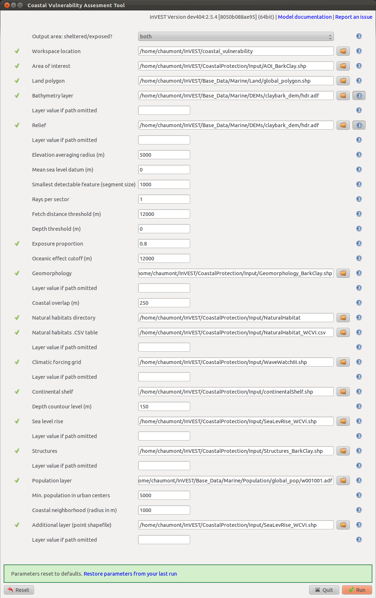

.. _coastal-vulnerability:

.. |openfold| image:: ./shared_images/openfolder.png
              :alt: open
	      :align: middle 

.. |addbutt| image:: ./shared_images/addbutt.png
             :alt: add
	     :align: middle 
	     :height: 15px

.. |okbutt| image:: ./shared_images/okbutt.png
            :alt: OK
	    :align: middle 

.. |adddata| image:: ./shared_images/adddata.png
             :alt: add
	     :align: middle 

***************************
Coastal Vulnerability Model
***************************

Summary
=======

Faced with an intensification of human activities and a changing climate, coastal communities need to better understand how modifications of the biological and physical environment (i.e. direct and indirect removal of natural habitats for coastal development) can affect their exposure to storm-induced erosion and flooding (inundation). The InVEST Coastal Vulnerability model produces a qualitative estimate of such exposure in terms of a Vulnerability Index, which differentiates areas with relatively high or low exposure to erosion and inundation during storms. By coupling these results with global population information, the model can show areas along a given coastline where humans are most vulnerable to storm waves and surge. The model does not take into account coastal processes that are unique to a region, nor does it predict long- or short-term changes in shoreline position or configuration.

Model inputs, which serve as proxies for various complex shoreline processes that influence exposure to erosion and inundation, include: a polyline with attributes about local coastal geomorphology along the shoreline, polygons representing the location of natural habitats (e.g., seagrass, kelp, wetlands, etc.), rates of (observed) net sea-level change, a depth contour that can be used as an indicator for surge level (the default contour is the edge of the continental shelf), a digital elevation model (DEM) representing the topography and (optionally) the bathymetry of the coastal area, a point shapefile containing values of observed storm wind speed and wave power, and a raster representing population distribution. 

Outputs can be used to better understand the relative contributions of these different model variables to coastal exposure and highlight the protective services offered by natural habitats to coastal populations. This information can help coastal managers, planners, landowners and other stakeholders identify regions of greater risk to coastal hazards, which can in turn better inform development strategies and permitting. As the results provide a qualitative representation of erosion and inundation risks rather than quantifying shoreline retreat or inundation limits.

Introduction
============

Coastal regions, which constantly subject to the action of ocean waves and storms, naturally experience erosion and inundation over various temporal and spatial scales. However, coastal erosion and inundation pose a threat to human populations, activities and infrastructure, especially within the context of a changing climate and increasing coastal populations. Moreover, these increases in anthropogenic pressure can lead to the loss and degradation of coastal ecosystems and their ability to provide protection for humans during storms. Thus, it is important to understand the role of various biological and geophysical factors in increasing or decreasing the threat of coastal erosion and inundation in order to better plan for future development. In particular, it is important to know how natural habitats can mitigate the forces responsible for coastal erosion and inundation so that management actions might best preserve the protective services provided by coastal ecosystems.

A number of models estimate the vulnerability of coastal regions to long-term sea level rise, erosion and inundation based on geophysical characteristics (Gornitz et al. 1991, Hammar-Klose and Thieler 2001, Cooper and McLaughlin 1998). There are also methods to qualitatively estimate the relative role natural habitats play in reducing the risk of erosion and inundation of particular areas (WRI 2009, Bush et al. 2001). However, few models map the relative vulnerability of coastal areas to erosion and inundation based on both the geophysical and natural habitat characteristics of a region. It is our aim to fill that gap with the Coastal Vulnerability model.

The Coastal Vulnerability model produces a qualitative index of coastal exposure to erosion and inundation as well as a map of the location and size of human settlements. The model does not value directly any environmental service, but ranks sites as having a relatively low, moderate or high risk of erosion and inundation. It is relatively simple to use and quick to run, and it can be applied in most regions of the world with data that are, for the most part, relatively easy to obtain.

Model outputs are easy to understand and the spatial coverage of the results allows these outputs to be overlaid with other spatial information for users to perform further analysis as they see fit. By highlighting the relative role of natural habitat at reducing exposure and showing the areas where coastal populations are threatened, the model can be used, in a simple way, to investigate how some management action or land use change can affect the exposure of human populations to erosion and inundation.

.. _cv-Model:

The model
=========

The InVEST Coastal Vulnerability model produces an exposure index raster and a coastal population raster. The exposure index raster contains ranks of the relative exposure of different coastlines segments to erosion and inundation caused by storms within the same coastal region of interest. The coastal population raster shows the distribution of human population density within the coastal region of interest. These maps are constructed using seven bio-geophysical variables and a population raster.  The seven bio-geophysical variables represent the natural biological and geomorphic characteristics of a region, the amount of expected net sea-level rise and the relative wind and wave forcing associated with storms. As the model assesses the relative exposure of different areas within the domain of interest, model outputs are relevant when computed for a relatively large and/or non-uniform coastal region. Coupled together, the exposure index and coastal population rasters can be used to create maps that show the relative vulnerability of human populations to coastal storms.

How it works
------------

The model creates the exposure index and coastal population maps using a spatial representation (raster) of population and spatial representations (shapefiles and rasters) of seven bio-geophysical variables:

1.	Geomorphology
2.	Relief
3.	Natural habitats (biotic and abiotic)
4.	Net sea level change
5.	Wind Exposure
6.	Wave Exposure
7.	Surge potential depth contour

The outputs of the model are rasters that overlay the shoreline in the coastal region of interest, with a spatial resolution defined by the user (:math:`\geq` 250 meters). These rasters contain a number of indices and rankings of input variables (described below) and can be used to the create maps that fit the user’s needs. Below are details describing the model variables and how the output rasters are created. 

Exposure Index
^^^^^^^^^^^^^^^^^^^

The model computes the physical exposure index by combining the ranks of the seven biological and physical variables at each shoreline segment. Ranks vary from very low exposure (rank=1) to very high exposure (rank=5), based on a mixture of user- and model-defined criteria (see :ref:`table-41`). This ranking system is based on methods proposed by Gornitz et al. (1990) and Hammar-Klose and Thieler (2001). 

.. _table-41:

Table 4.1
"""""""""

+------------------+--------------------------------------------+------------------------------------------------------------+---------------------------------------------------------------------+--------------------------------------+--------------------------------------------+
| Rank             | Very Low                                   | Low                                                        | Moderate                                                            | High                                 | Very High                                  |
+------------------+--------------------------------------------+------------------------------------------------------------+---------------------------------------------------------------------+--------------------------------------+--------------------------------------------+
| Variable         | 1                                          | 2                                                          | 3                                                                   | 4                                    | 5                                          |
+==================+============================================+============================================================+=====================================================================+======================================+============================================+
| Geomorphology    | Rocky; high cliffs; fjord; fiard, seawalls | Medium cliff; indented coast, bulkheads and small seawalls | Low cliff; glacial drift; alluvial plain, revetments, rip-rap walls | Cobble beach; estuary; lagoon; bluff | Barrier beach; sand beach; mud flat; delta |
+------------------+--------------------------------------------+------------------------------------------------------------+---------------------------------------------------------------------+--------------------------------------+--------------------------------------------+
| Relief           | 0 to 20 Percentile                         | 21 to 40 Percentile                                        | 41 to 60 Percentile                                                 | 61 to 80 Percentile                  | 81 to 100 Percentile                       |
+------------------+--------------------------------------------+------------------------------------------------------------+---------------------------------------------------------------------+--------------------------------------+--------------------------------------------+
| Natural Habitats | Coral reef; mangrove; coastal forest       | High dune; marsh                                           | Low dune                                                            | Seagrass; kelp                       | No habitat                                 |
+------------------+--------------------------------------------+------------------------------------------------------------+---------------------------------------------------------------------+--------------------------------------+--------------------------------------------+
| Sea Level Change | 0 to 20 Percentile                         | 21 to 40 Percentile                                        | 41 to 60 Percentile                                                 | 61 to 80 Percentile                  | 81 to 100 Percentile                       |
+------------------+--------------------------------------------+------------------------------------------------------------+---------------------------------------------------------------------+--------------------------------------+--------------------------------------------+
| Wave Exposure    | 0 to 20 Percentile                         | 21 to 40 Percentile                                        | 41 to 60 Percentile                                                 | 61 to 80 Percentile                  | 81 to 100 Percentile                       |
+------------------+--------------------------------------------+------------------------------------------------------------+---------------------------------------------------------------------+--------------------------------------+--------------------------------------------+
| Surge Potential  | 0 to 20 Percentile                         | 21 to 40 Percentile                                        | 41 to 60 Percentile                                                 | 61 to 80 Percentile                  | 81 to 100 Percentile                       |
+------------------+--------------------------------------------+------------------------------------------------------------+---------------------------------------------------------------------+--------------------------------------+--------------------------------------------+

Table 4.1: List of Bio-Geophysical Variables and Ranking System for Coastal Exposure.

The model calculates the exposure index :math:`EI` for each shoreline segment as the geometric mean of all the variable ranks:

.. math:: EI = \left ({R_{Geomorphology} R_{Relief} R_{Habitats} R_{SLR} R_{WindExposure} R_{WaveExposure} R_{Surge}} \right )^{1/7}
   :label: VulInd

or more generally:

.. math:: EI = \left (\prod_{i=1}^{n}R_i \right )^{1/n}
   :label: VulInd_i

where :math:`R_i` represents the ranking of the :math:`i^{th}` bio-geophysical variable that is provided by the user to calculate :math:`EI`.  

In addition to mapping the exposure index, the model computes an erosion index :math:`ErI` as:

.. math:: ErI = \left ({R_{Geomorphology} R_{Habitats} R_{WaveExposure}} \right )^{1/3}
   :label: EroInd

We designed this additional output to invite users to explore the different ways in which model results vary with different combinations of variables. Here, we have assumed that the most important factors affecting erosion are geomorphology, natural habitats and wave height/period. The erosion index provides an example for how users can similarly create their own index by defining a unique combination of these rankings. In the remainder of this section, we will provide a more detailed description of the variables presented in :ref:`table-41`.

Additionally, we provide all intermediate and raw results computed by the model so users can generate outputs using different ranking or computation methods.

.. _cv-Geomorph:

Geomorphology
^^^^^^^^^^^^^

Rocky cliffs are less prone to erosion and inundation than bluffs, beaches or deltas. Consequently, a relative ranking of exposure scheme based on geomorphology similar to the one proposed by Hammar-Klose and Thieler (2001) has been adopted. Supplied in :ref:`cv-appendix-a` is a definition of the terms used in this classification, which applies mostly to the North American continent. This classification will be expanded to cover more regions of the world in later versions of this model. 

Note that we included structures in this list of features because they are present along most developed coasts.

If the user's geomorphology source has more categories than the ones presented in :ref:`table-41`, it is left to the users discretion to reclassify their data to match the provided ranking system, as explained in the :ref:`cv-data-needs` section, and in :ref:`cv-appendix-b`. It is recommend however, that the user include shore parallel hard structures (seawalls, bulkheads, etc) in this classification and that they apply a low to moderate rank (1-3), depending on their characteristics. For example, a large, concrete seawall should be assigned a rank 1 as they are typically designed to prevent inundation during storm events and are designed to withstand damage or failure during the most powerful storms. It is recommended that low revetments or riprap walls be assigned a rank of 3 as they do not prevent inundation and may fail during extreme events.

The ranking presented in the above table is but a suggestion.  Users can change the ranking of different shoreline types as they see fit by following directions presented in the :ref:`cv-data-needs` section.

The model requires a polyline shapefile that runs along the coastline of interest. This shapefile must be discretized into different segments where the geomorphology rank changes. The attribute table of this shapefile requires a field called RANK of type 'Short Integer', which contains the numeric rank (1-5) of the geomorphology type along each particular segment.  As mentioned above and explained later in this document, the value of the RANK associated with a particular shoreline type is left to the discretion of the user.

.. _cv-Relief:

Relief
^^^^^^

Sites that are, on average, at greater elevations above Mean Seal Level (MSL) are at a lower risk of being inundated than areas at lower elevations. Relief is defined in the model as the average elevation of the coastal land area that is within a user-defined radius (default = 5 km) from each shore segment of the discretized shoreline. This resolution was chosen because of the relative coarseness of most freely available terrestrial digital elevation models (DEMs).

For this variable, the model requires a DEM that covers the area of interest. As a part of the InVEST download package, a global elevation DEM is provided. The accuracy and quality of this dataset varies. If users have access to a more local, accurate data source, we encourage them to use it rather than the provided DEM.

.. _cv-NatHab:

Natural Habitats
^^^^^^^^^^^^^^^^

Natural habitats (marshes, seagrass beds, mangroves, coastal dunes) play a vital role in decreasing the impacts of coastal hazards that can erode shorelines and harm coastal communities. For example, large waves break on coral reefs before reaching the shoreline, mangroves and coastal forests dramatically reduce wave heights in shallow waters, and decrease the strength of wave- and wind-generated currents, seagrass beds and marshes stabilize sediments and encourage the accretion of nearshore beds as well as dissipate wave energy. On the other hand, beaches with little to no biological habitats or sand dunes offer little protection to erosion and inundation. 

The ranking proposed in :ref:`table-41` is based on the fact that fixed and stiff habitats that penetrate the water column (e.g., coral reefs, mangroves) and sand dunes are the most effective in protecting coastal communities. Flexible and seasonal habitats, such as seagrass, reduce flows when they can withstand their force, and encourage accretion of sediments. Therefore, these habitats receive a lower ranking than fixed habitats. It is left to the user's discretion to separate sand dunes into high and low categories. It is suggested, however, that since category 4 hurricanes can create a 5m surge height, 5m is an appropriate cut-off value to separate high (>5m) and low (<5m) dunes. If the user has local knowledge about which habitats and dune elevations provide the better protection in their area of interest, they are free to deviate from these recommendations for their application.

It is important to note that this ranking is based on the result of extensive literature review and the author’s best judgment.  Users are free to modify it as they see fit.

To compute a Natural Habitat exposure rank for a given shoreline segment, the model determines whether a certain class of natural habitat  (:ref:`table-41`) is within a user-defined search radius from the segment. (See Section 2 and :ref:`cv-appendix-b` for a description of how the model processes natural habitat input layers.)  When all :math:`N` habitats fronting that segment have been identified, the model creates a vector *R* that contains all the ranks :math:`R_{k}, 1 \le k \le N`, associated with these habitats, as defined in :ref:`table-41`. Using those rank values, the model computes a final *Natural Habitat* exposure rank for that segment with the following formulation:

.. math:: R_{Hab} = 4.8-0.5 \sqrt{ ( 1.5 \max_{k=1}^N (5-R_k)  )^2 + ( \sum_{k=1}^N (5-R_k)^2 - \max_{k=1}^N (5-R_k) )^2 )}
   :label: r_hab

where the habitat that has the lowest rank is weighed 1.5 times higher than all other habitats that are present near a segment. The final ranking values vary between a maximum of 4 when a segment is solely fronted by kelp or seagrass, to a minimum of 1.025 when it is fronted by a mangrove and coastal forests, a seagrass bed and a coral reef. This formulation allows us to maximize the accounting of the protection services provided by all natural habitats that front a shoreline segment. In other words, it ensures that segments that are fronted or have only one type of habitat (e.g., high sand dune) are more exposed than segments with more than one habitat (e.g., coral reefs and high sand dune). See :ref:`cv-appendix-b` for a detailed account of all possible final rank values that can be obtained with equation :eq:`r_hab`.

To include this variable in the exposure index calculation, the model requires separate polygon shapefiles representing each natural habitat type within the area of interest, along with a csv file that contains the name, rank and search radius of each of the shapefile. As mentioned above, we left it to the users’ discretion to modify the ranks of the natural habitat layers as they see fit. We present a complete description of the requirements for this variable and instructions on how to prepare this variable for the model in :ref:`cv-appendix-b`.

.. _cv-SLR:

Net Sea-Level Change
^^^^^^^^^^^^^^^^^^^^

The relative net sea level change along the coastline of a given region is the sum of global sea level rise (SLR), local SLR (eustatic rise) and local land motion (isostatic rise). This results in net sea level change values that can be positive (sea level is rising) or negative (sea level is decreasing) at a particular site. 
To include this variable in the exposure index calculation, the model takes either a polygon shapefile where polygons delineate the extents of a uniform sea level change, or a point shapefile where the points carry the recorded sea level change. In either case, the model will look for a field named 'Trend', which is the yearly rate of sea level change (usually given in mm/yr). Please consult :ref:`cv-appendix-b` for suggestions of how to create this input.

.. _cv-Wave:

Wave Exposure
^^^^^^^^^^^^^

The relative exposure of a reach of coastline to storm waves is a qualitative indicator of the potential for shoreline erosion. A given stretch of shoreline is generally exposed to either oceanic or locally-generated wind-waves. Also, for a given wave height, waves that have a longer period have more power than shorter waves. Coasts that are exposed to the open ocean generally experience a higher exposure to waves than sheltered regions because winds blowing over a very large distance, or fetch, generate larger waves. Additionally, exposed regions experience the effects of long period waves, or swells, that were generated by distant storms.

The model estimates the relative exposure of a shoreline segment to waves :math:`E_w` by assigning it the maximum of the weighted average power of oceanic waves, :math:`E_w^o`and locally wind-generated waves, :math:`E_w^l`:

.. math:: E_w=\max(E_w^o,E_w^l)
   :label: Ew

For oceanic waves, the weighted average power is computed as:

.. math:: E_w^o=\sum_{k=1}^{16}H[F_k]P_k^o O_k^o
   :label: Ewo

where :math:`H[F_k]` is a heaviside step function for all of the 16 wind equiangular sectors *k*. It is zero if the fetch in that direction is less than 60 km, and 1 if the fetch is equal to 60 km (for computational reason, we compute fetch distances up to 60 km):

.. math:: H[F_k]=\begin{cases}
   0 & \text{ if } F_k < 60 km \\ 
   1 & \text{ if } F_k = 60 km 
   \end{cases}
   :label: HF

In other words, this function only considers angular sectors where oceanic waves (assuming sheltered water bodies have fetch lengths less than 50km) have the potential to reach the shoreline in the evaluation of oceanic wave exposure. Further, :math:`P_k^o O_k^o` is the average of the highest 10% wave power values (:math:`P_k^o`) that were observed in the direction of the angular sector *k*, weighted by the percentage of time (:math:`O_k^o`) when those waves were observed in that sector. For all waves in each angular sector, wave power is computed as:

.. math:: P = \frac{1}{2} H^2 T
   :label: WavPow

where :math:`P [kW/m]` is the wave power of an observed wave with a height :math:`H [m]` and a period :math:`T [s]`.

For locally wind-generated waves, :math:`E_w^l` is computed as:

.. math:: E_w^l=\sum_{k=1}^{16} P_k^l O_k^l
   :label: Ewl

which is the sum over the 16 wind sectors of the wave power generated by the average of the highest 10% wind speed values :math:`P_k^l` that propagate in the direction *k*, weighted by the percent occurrence :math:`O_k^l` of these strong wind in that sector.

The power of locally wind-generated waves is estimated with Equation :eq:`WavPow`. The wave height and period of the locally generated wind-waves are computed for each of the 16 equiangular sectors as:

.. math::
   \left\{\begin{matrix}
   H=\widetilde{H}_\infty \left[\tanh \left(0.343\widetilde{d}^{1.14} \right )  \tanh \left( \frac{2.14 \cdot 10^{-4}\widetilde{F}^{0.79}}{\tanh (0.343 \widetilde{d}^{1.14})} \right )\right ]^{0.572}\\ 
    \displaystyle \\
   T=\widetilde{T}_\infty \left[\tanh \left(0.1\widetilde{d}^{2.01} \right )  \tanh \left( \frac{2.77 \cdot 10^{-7}\widetilde{F}^{1.45}}{\tanh (0.1  \widetilde{d}^{2.01})} \right )\right ]^{0.187}
   \end{matrix}\right. 
   :label: WaveFetch

where the non-dimensional wave height and period :math:`\widetilde{H}_\infty` and :math:`\widetilde{T}_\infty` are a function of the average of the highest 10% wind speed values :math:`U [m/s]` that were observed in in a particular sector: :math:`\widetilde{H}_\infty=0.24U^2/g`, and :math:`\widetilde{T}_\infty=7.69U^2/g`, and where the non-dimensional fetch and depth, :math:`\widetilde{F}_\infty` and :math:`\widetilde{d}_\infty`, are a function of the fetch distance in that sector :math:`F  [m]` and the average water depth in the region of interest :math:`d [m]`: :math:`\widetilde{F}_\infty=gF/U^2`, and :math:`\widetilde{T}_\infty = gd/U^2`. :math:`g  [m/s^2]` is the acceleration of gravity.

This expression of wave height and period assumes fetch-limited conditions, as the duration over which the wind speed,:math:`U`, blows steadily in the direction of the fetch, :math:`F` (USACE, 2002; Part II Chap 2). Hence, model results might over-estimate wind-generated waves characteristics at a site.

Since sheltered areas of the coast (areas that are within embayments or sheltered from oceanic waves by geomorphic features) are not exposed to oceanic waves (:math:`E_w^o = 0`) the relative exposure to waves is simply :math:`E_w=E_w^l`. In order to differentiate between exposed and sheltered areas , the model uses a fetch filter; segments for which two or more of the 16 fetches do not exceed a user-defined threshold distance are assumed to be sheltered.

As a part of the InVEST download package, a shapefile with default wind and wave data compiled from 8 years of WAVEWATCH III (WW3, Tolman (2009)) model hindcast reanalysis results is provided. As discussed in the previous section, for each of the 16 equiangular wind sector, the average of the highest 10% wind speed, wave height and wave power have been computed. If users wish to use another data source, we recommend that they use the same statistics of wind and wave (average of the highest 10% for wind speed, wave height and wave power), but they can use other statistics as well.  However, these data must be contained in a point shapefile with the same attribute table as the WW3 data provided.

The model differentiates from exposed and sheltered areas by using a combination of user-defined fetch distance threshold and depth threshold.  If the number of fetch vectors or average depth over fetch vectors is greater than the user-input exposure proportion value, the coastal segment associated with those fetch and depth values will be deemed sheltered (see :ref:`cv-data-needs` section). We provide an example of how to estimate the fetch threshold distance in :ref:`cv-appendix-b`.  The depth threshold distance can be estimated using the “information” tool in GIS and scanning average depths in shallow, sheltered estuaries.  Note that the distinction between sheltered and exposed thus obtained is qualitative.

.. _cv-Surge:

Surge Potential
^^^^^^^^^^^^^^^

Storm surge elevation is a function of wind speed and direction, but also of the amount of time wind blows over relatively shallow areas. In general, the longer the distance between the coastline and the edge of the continental shelf at a given area during a given storm, the higher the storm surge. Unless a user decides to specify a certain depth contour appropriate to their region of interest, the model estimates the relative exposure to storm surges by computing the length of the continental shelf fronting an area of interest (otherwise, it computes the distance between the shoreline and the user-specified contour). For hurricanes in the Gulf of Mexico, a better approximation might be made by considering the distance between the coastline and the 30 meters depth contour (Irish and Resio 2010).

The model assigns a distance to all segments within the area of interest, even to segments that seem sheltered because they are too far inland, protected by a significant land mass, or on a side of an island that is not exposed to the open ocean. 

Wind Exposure
^^^^^^^^^^^^^

Strong winds can generate high surges and/or powerful waves if they blow over an area for a sufficiently long period of time. The wind exposure variable is an optional output that ranks shoreline segments based on their relative exposure to strong winds.          Wind exposure results are located in the *Intermediate* output folder. We compute this ranking by computing and mapping the Relative Exposure Index (REI; Keddy, 1982). This index is computed by taking the time series of the highest 10% wind speeds from a long record of measured wind speeds, dividing the compass rose (or the 360 degrees compass) into 16 equiangular sectors and combining the wind and fetch (distance over which wind blows over water) characteristics in these sectors as:

.. math:: REI = { {\sum^{16}_{n=1}} {U_n P_n F_n} }
   :label: REi

where:

+ :math:`U_n` is the average wind speed, in meters per second, of the 10% wind speeds in the :math:`n^{th}` equiangular sector
+ :math:`P_n` is the percent of all wind speeds in the record of interest that blow in the direction of the :math:`n^{th}` sector
+ :math:`F_n` is the fetch distance, in meters, in the :math:`n^{th}` sector

For a given coastline segment, the model estimates fetch :math:`F` distances over each of the 16 equiangular sectors by taking the average of :math:`k` fetch segments within a section following (Keddy, 1982):

.. math:: F=\frac{\sum_{n=1}^kf_n\cos \theta }{\sum_{n=1}^k\cos \theta }
  :label: AvgFetch

where :math:`f_n` is the :math:`n^{th}` radial distance in an equiangular sector, and :math:`\theta=22.5deg/k` (we recommend that :math:`k \le 9`).   

Note that, in this model, wind direction is the direction winds are blowing FROM, and not TOWARDS. If users provide their own data, they must ensure that the data matches this convention before applying those data to this model. Also, note that, for computational reason, we compute fetch distances up to 60 km.

Social Exposure
^^^^^^^^^^^^^^^

When estimating the exposure of coastlines to erosion and inundation due to storms, it is important to consider the population of humans that will be subject to those coastal hazards. The Coastal Vulnerability model extracts population values along the shoreline at discrete segments with the user-specified spatial resolution. To obtain this raster showing the estimated number of people residing on a coastal area, the model overlays a raster containing population values pulled from a user-defined radius (see coastal neighborhood) at each grid cell with the rasterized shoreline. The model then assigns each discrete shoreline segment a population value by extracting the population value from the grid cell that overlaps the shoreline segment. As a part of the InVEST download package, a global population raster is provided with population values obtained from country level census data. As is the case with all input data, the user may provide their own population raster (e.g., `LandScan data <http://web.ornl.gov/sci/landscan/landscan_data_avail.shtml>`) if they have more accurate, local information. 

.. _cv-Limitations:

 Limitations and Simplifications
===============================

Beyond technical limitations, the exposure index also has theoretical limitations. One of the main limitations is that the dynamic interactions of complex coastal processes occurring in a region are overly simplified into the geometric mean of seven variables and exposure categories. We do not model storm surge or wave field in nearshore regions.  More importantly, the model does not take into account the amount and quality of habitats, and it does not quantify the role of habitats are reducing coastal hazards. Also, the model does not consider any hydrodynamic or sediment transport processes: it has been assumed that regions that belong to the same broad geomorphic exposure class behave in a similar way.  Additionally, the scoring of exposure is the same everywhere in the region of interest; the model does not take into account any interactions between the different variables in :ref:`table-41`. For example, the relative exposure to waves and wind will have the same weight whether the site under consideration is a sand beach or a rocky cliff. Also, when the final exposure index is computed, the effect of biogenic habitats fronting regions that have a low geomorphic ranking are still taken into account. In other words, we assume that natural habitats provide protection to regions that are protected against erosion independent of their geomorphology classification (i.e. rocky cliffs). This limitation artificially deflates the relative vulnerability of these regions, and inflates the relative vulnerability of regions that have a high geomorphic index.

The other type of model limitations is associated with the computation of the wind and wave exposure. Because our intent is to provide default data for users in most regions of the world, we had to simplify the type of input required to compute wind and wave exposure. For example, we computed storm wind speeds in the WW3 wind database that we provide by taking the average of winds speeds above the 90th percentile value, instead of using the full time series of wind speeds.  Thus we do not represent fully the impacts of extreme events.  Also, we estimate the exposure to oceanic waves by assigning to a coastal segment the waves statistics of the closest WW3 grid point.  This approach neglects any 2D processes that might take place in nearshore regions and that might change the exposure of a region.  Similarly, we compute exposure in sheltered region by combining the average depth near a particular segment to the wind speed and direction in a sector, instead of modeling the growth and evolution of wind waves near that segment.

Consequently, model outputs cannot be used to quantify the exposure to erosion and inundation of a specific coastal location; the model produces qualitative outputs and is designed to be used at a relatively large scale. More importantly, the model does not predict the response of a region to specific storms or wave field and does not take into account any large-scale sediment transport pathways that may exist in a region of interest.

.. _cv-data-needs: 

Data needs
==========

The model uses an interface to input all required and optional data, as outlined in this section. It outputs a HTML file with a map of the area over which the model has been run, and three histograms showing the vulnerability of the population living near the coast, the exposure of coastal segments near urban centers, and the exposure of the whole coast. To compute the exposure index the user has the option of uploading any or all of the variables in :ref:`table-41`, with the exception of the wind-wave input layer and the bathymetry: *the model will not run unless a wind-wave input layer and DEM have been uploaded*. 

Below, we outline the options that we offer to users in the interface, and the content and format of the required and optional input data that the model uses. we provide more information on how to fill the input interface, or on how to obtain data in :ref:`cv-appendix-b`.

#. **Output area.** Specify whether all or only the sheltered shoreline segments appear in the output. This option has no effect on the computation performed by the model, and only affects the shore segments that appear in the output files.

#. **Workspace Location (required).** The user is required to specify a workspace directory path. It is recommended to create a new directory for each run of the model. The model will create an "intermediate" and an "output" directory within this workspace. The "intermediate" directory will compartmentalize data from intermediate processes. The model's final outputs will be stored in the "output" directory. ::

     Name: Path to a workspace directory. Avoid spaces. 
     Sample path: \InVEST\coastal_vulnerability

#. **Area of Interest (AOI, required).**  Users must create a polygon feature layer that defines the Area of Interest (AOI). An AOI instructs the model where to clip the Land Polygon input data (inputs #2-3) in order to define the spatial extent of the analysis. The model uses the AOI's projection to set the projection for the sequential intermediate and output data layers.  We also recommend that they have a WGS84 datum. In order to allocate wind and wave information from the Wave Watch 3 data (WW3), this AOI must also overlap one or more of the provided WW3 points. If users are including the Surge Potential variable in the computation of the exposure index, the depth contour specified in the Coastal Vulnerability model must be specified, and the AOI must intersect that contour. If the AOI does not intersect that contour, the model will stop and provide feedback. ::

     Name: File can be named anything, but no spaces in the name
     File type: polygon shapefile (.shp)
     Sample path: \InVEST\CoastalProtection\Input\AOI_BarkClay.shp

#. **Land Polygon (required).**  This input provides the model with a geographic shape of the coastal area of interest, and instructs it as to the boundaries of the land and seascape. A global land mass polygon shapefile is provided as default (Wessel and Smith, 1996), but other layers can be substituted. If users have a more accurate, local polygon shapefile representing land masses, they are encouraged to use this data rather than the provided shapefile. ::

     Name: File can be named anything, but no spaces in the name
     File type: polygon shapefile (.shp)
     Sample path (default): \InVEST\Base_Data\Marine\Land\global_polygon.shp

#. **Bathymetry layer. (required)**  This input is used to compute the average depth along the fetch rays to determine the exposure of each shoreline segment (:ref:`table-41`), and in the computation of surge potential. It should consist of depth information of bodies of water within the AOI as marked by the land polygon shapefile. ::

    Name: File can be named anything, but no spaces in the name
    File type: raster dataset
    Sample path: \InVEST\Base_Data\Marine\DEMs\claybark_dem
	
#. **Layer value if path omitted (optional).**  Integer value between 1 and 5. If bathymetry is omitted, replace all shore points for this layer with a constant rank value in the computation of the coastal vulnerability index. If both the file and value for the layer are omitted, the layer is skipped altogether. ::

     Name: A positive integer between 1 and 5.
     File type: text string (direct input to the interface)
     Sample (default): empty

#. **Relief (required).** Digital Elevation Model (DEM). This input is used to compute the Relief ranking of each shoreline segment (:ref:`table-41`). It should consist of elevation information covering the entire land polygon within the AOI. Focal statistics are computed on the input DEM within a range defined by the user (see Elevation averaging radius). The average of elevation values within this range is ranked relative to all other coastline segments within the AOI. Although the default raster for this layer is the same as for Bathymetry, each entry can refer to a separate raster, where one computes elevations above water, and the other below water. ::

    Name: File can be named anything, but no spaces in the name
    File type: raster dataset
    Sample path: \InVEST\Base_Data\Marine\DEMs\claybark_dem\hdr.adf
	
#. **Layer value if path omitted (optional).**  Integer value between 1 and 5. If relief is omitted, replace all shore points for this layer with a constant rank value in the computation of the coastal vulnerability index. If both the file and value for the layer are omitted, the layer is skipped altogether. ::

     Name: A positive integer between 1 and 5.
     File type: text string (direct input to the interface)
     Sample (default): empty

#. **Elevation averaging radius (meters, required).**  This input determines the radius around within which to compute the average elevation for relief. ::

     Name: A numeric text string (positive integer)
     File type: text string (direct input to the interface)
     Sample (default): 5000

#. **Mean sea level datum (meters, required).** This input is the elevation of Mean Sea Level (MSL) datum relative to the datum of the bathymetry layer that they provide. The model transforms all depths to MSL datum by subtracting the value provided by the user to the bathymetry. This input can be used to run the model for a future sea-level rise scenario.::

     Name: A numeric text string (positive integer)
     File type: text string (direct input to the interface)
     Sample (default): 0

#. **Model resolution (segment size in meters, required).**  This input determines the spatial resolution at which the model runs and the resolution of the output rasters. To run the model at 250 x 250 meters grid cell scale, users should enter "250". A larger grid cell will yield a lower resolution, but a faster computation time (computation is in the order of :math:'O(n^3)' with n being the number of rows or columns in the raster). ::

     Name: A numeric text string (positive integer)
     File type: text string (direct input to the interface)
     Sample (default): 250

#. **Rays per sector (required).** Number of rays used to sample the ocean depth and land proximity within each of the 16 equiangular fetch sectors. ::

     Name: A numeric text string (positive integer)
     File type: text string (direct input to the interface)
     Sample (default): 1 (maximum = 9)

#. **Fetch Distance Threshold (meters, required).**  Used to determine if the current segment is enclosed by land. This input is used in conjunction with the average ocean depth and exposure proportion to differentiate sheltered and exposed shoreline segments.::

     Name: A numeric text string (positive integer)
     File type: text string (direct input to the interface)
     Sample (default): 60000

#. **Depth Threshold (meters, required).**  Used to determine if the current segment is surrounded by deep water. This input is used in conjunction with the fetch distance threshold and exposed segment to differentiate between sheltered and exposed shoreline segments. ::

     Name: A numeric text string (positive integer)
     File type: text string (direct input to the interface)
     Sample (default): 0

#. **Exposure proportion (meters, required).** The model uses this input (between 0.0 and 1.0) to determine if shore segments are exposed or sheltered.  This is done in four steps: 
    
        1. Compute the number of fetch rays (N) that correspond to the proportion N: :math:'segments over water * exposure proportion'
        2. Determine if the current segment is in deep water (at least N sectors project over water that is at least "depth threshold" meters)
        3. Determine if the current segment is enclosed by land (at least N fetch rays have to be blocked by land, i.e. fetch distance is less than "ocean effect cutoff" meters).
        4. Determine segment exposure: a shore segment is exposed if it is both in deep waters, and not enclosed by land (facing open water), otherwise, it is sheltered. ::
In other words, if the fetch threshold is 12 km and the depth threshold is 5 m, and the exposure proportion is 0.8, the model will classify a segment as sheltered if less than 80% of the segments have a fetch distance lower than 12 km *or* the average depth along each fetch segment is less than 5 m.

     Name: A numeric text string (number between 0 and 1)
     File type: text string (direct input to the interface)
     Sample (default): 0.8

#. **Oceanic effect cutoff (meters, required).** Used as a threshold to determine if a shore segment is enclosed by land. See Exposure proportion, step 3. ::

     Name: A numeric text string (positive integer)
     File type: text string (direct input to the interface)
     Sample (default): 60000

#. **Geomorphology: Shoreline Type (optional).**  This input is used to compute the Geomorphology ranking of each shoreline segment (:ref:`table-41`). It does not have to match the land polyline input, but must resemble it as closely as possible. If it doesn't, the model will try to match the coastlines using the coastal overlap parameter. Additionally, the polyline shapefile must have a field called "RANK" that identifies the various shoreline type ranks with a number from 1-5. More information on how to fill in this table is provided in :ref:`cv-appendix-b`. ::

     Names: File can be named anything, but no spaces in the name
     File type: polyline shapefile (.shp)
     Sample path: \InVEST\CoastalProtection\Input\Geomorphology_BarkClay.shp

#. **Layer value if path omitted (optional).**  Integer value between 1 and 5. If geomorphology is omitted, replace all shore points for this layer with a constant rank value in the computation of the coastal vulnerability index. If both the file and value for the layer are omitted, the layer is skipped altogether. ::

     Name: A positive integer between 1 and 5.
     File type: text string (direct input to the interface)
     Sample (default): empty

#. **Coastal overlap (meters, required).** Tolerance threshold in meters (that should be a multiple of cell size), to make 2 non-overlapping shorelines match. If the tolerance is twice the cell size, the model will be able to match shorelines that are 2 pixels off. If it is 4 times the cell size, the model will be able to match shorelines that are 4 pixels off, and so on.  It's used when the shoreline from geomorphology doesn't overlap exactly with the shoreline from the land polygon shapefile. ::

     Name: A numeric text string (positive integer)
     File type: text string (direct input to the interface)
     Sample (default): 250

#. **Natural Habitat (optional).** Directory that contains habitat layers. Users must store all Natural Habitats input layers that they have in a unique directory. The model uses these input layers to compute a Natural Habitat ranking for each shoreline segment. All data in this directory must be polyline or polygon shapefiles that depict the location of the habitats, and must be projected in meters. Additionally, each layer must end with an underscore followed by a unique alpha-numeric number.  The model uses that number to match the habitat layer to the information that users provide in the CSV table (see next input). The model allows for a maximum of eight layers in this directory. Do not store any additional files that are not part of the analysis in this directory. The distance at which this layer will have a protective influence on coastline can be modified in the natural habitat CSV table (input 8). ::

     Name: Folder can be named anything, but no spaces in the name.  Habitat layers in the folder must be of the form \93HabitatName_Number\94 (e.g., Coral_1), where the number is uniquely associated to that habitat layer.
     File type:a polygon shapefile (.shp)
     Sample path: \InVEST\CoastalProtection\Input\NaturalHabitat

#. **Natural Habitat Layers CSV (Table optional).**. Users must provide a summary table to instruct the model on the protective influence (rank) and distance of natural habitat. Use the sample table provided as a template since the model expects values to be in these specific cells. More information on how to fill this table is provided in :ref:`cv-appendix-b`. ::

     Table Names: File can be named anything, but no spaces in the name
     File type: *.csv
     Sample: InVEST\CoastalProtection\Input\NaturalHabitat_WCVI.csv

.. figure:: ./coastal_vulnerability_images/nathab_specs.png
   :align: center
   :figwidth: 475px

22. **Layer value if path omitted (optional).**  Integer value between 1 and 5. If natural habitats is omitted, replace all shore points for this layer with a constant rank value in the computation of the coastal vulnerability index. If both the file and value for the layer are omitted, the layer is skipped altogether. ::

     Name: A positive integer between 1 and 5.
     File type: text string (direct input to the interface)
     Sample (default): empty

#. **Climatic forcing grid (optional).** This input is used to compute the Wind and Wave Exposure ranking of each shoreline segment (:ref:`table-41`). It consists of a point shapefile that contains the location of the grid points as well as wave and wind values that represent storm conditions at that location. If users would like to create such a file from their own data, instructions are provided in :ref:`cv-appendix-b`. ::

     Name: File can be named anything
     Format: point shapefile where each point has information about wind and wave measurements.
     Sample data set (default): \InVEST\CoastalProtection\Input\WaveWatchIII.shp

#. **Layer value if path omitted (optional).**  Integer value between 1 and 5. If climatic forcing grid is omitted, replace all shore points for this layer with a constant rank value in the computation of the coastal vulnerability index. If both the file and value for the layer are omitted, the layer is skipped altogether. ::

     Name: A positive integer between 1 and 5.
     File type: text string (direct input to the interface)
     Sample (default): empty

     Sample (default): 500

#. **Continental Shelf (optional).**  This input is a global polygon dataset that depicts the location of the continental margin. It must intersect with the AOI polygon (input #2). ::

     Names: File can be named anything, but no spaces in the name
     File type: polygon shapefile (.shp)
     Sample path:  \InVEST\CoastalProtection\Input\continentalShelf.shp

#. **Depth contour level (meters, optional).** If no continental shelf is specified, the model will use the bathymetry data to trace a user-defined depth contour level ans use it instead of the edge of the continental shelf. :: 

     Name: A numeric text string (positive integer)
     File type: text string (direct input to the interface)
     Sample (default): 150

#. **Sea Level Rise (optional).** Polygon Indicating Net Rise or Decrease. This input must be a polygon delineating regions within the AOI that experience various levels of net sea level change. It must have a field called "Trend", which represents the rate of increase (mm/yr) of the sea level in a particular region according to :ref:`table-41`. More information on how to create this polygon is provided in the Marine InVEST :ref:`FAQ`, and in :ref:`cv-appendix-b`. ::

     Name: File can be named anything, but no spaces in the name
     File type: polygon shapefile (.shp) or point shapefile (.shp)
     Sample path: \InVEST\CoastalProtection\Input\SeaLevRise_WCVI.shp

#. **Layer value if path omitted (optional).**  Integer value between 1 and 5. If sea level rise is omitted, replace all shore points for this layer with a constant rank value in the computation of the coastal vulnerability index. If both the file and value for the layer are omitted, the layer is skipped altogether. ::

     Name: A positive integer between 1 and 5.
     File type: text string (direct input to the interface)
     Sample (default): empty

#. **Structures (optional).** Polygon shapefile that contains the location of rigid structures along the coast. ::

     Name: File can be named anything, but no spaces in the name
     File type: polygon shapefile (.shp)
     Sample path: \InVEST\CoastalProtection\Input\Structures_BarkClay.shp

#. **Layer value if path omitted (optional).**  Integer value between 1 and 5. If structures layer is omitted, replace all shore points for this layer with a constant rank value in the computation of the coastal vulnerability index. If both the file and value for the layer are omitted, the layer is skipped altogether. ::

     Name: A positive integer between 1 and 5.
     File type: text string (direct input to the interface)
     Sample (default): empty

#. **Population Raster (optional).**  If provided, a raster grid of population is used to map the population size along the coastline of the AOI specified (input #4). A global population raster file is provided as default, but other population raster layers can be substituted. ::

     Name: File can be named anything, but no spaces in the name and less than 13 characters
     Format: standard GIS raster file (ESRI GRID), with population values
     Sample data set (default): \InVEST\Base_Data\Marine\Population\global_pop\hdr.adf

#. **Min. population in urban centers (required).** Minimum population that has to live in the vincinity of a shore segment to be considered a urban center. The vincinity is defined in the next input, "coastal neighborhood". ::

     Name: A numeric text string (positive integer)
     File type: text string (direct input to the interface)
     Sample (default): 5000

#. **Coastal neighborhood (radius in m, required).** Radius defining the vincinity of a shore segment that is used to count the population living on or near the coast. :: 

     Name: A numeric text string (positive integer)
     File type: text string (direct input to the interface)
     Sample (default): 150

#. **Additional layer (optional).**  This additional layer can be any additional variable that users desire to add to the exposure index.  It can be values of long-term shoreline change, for example.  This layer must be a polygon shapefile with a trend column that separates different shoreline regions characteristics in its attribute table.  Once all segments have a value, we rank them according to quartile distribution. ::

     Name: File can be named anything, but no spaces in the name and less than 13 characters
     Format: standard GIS raster file (ESRI GRID), with population values
     Sample data set (default): \InVEST\Base_Data\Marine\Population\global_pop

#. **Layer value if path omitted (optional).**  Integer value between 1 and 5. If additional layer is omitted, replace all shore points for this layer with a constant rank value in the computation of the coastal vulnerability index. If both the file and value for the layer are omitted, the layer is skipped altogether. ::

     Name: A positive integer between 1 and 5.
     File type: text string (direct input to the interface)
     Sample (default): empty

.. _cv-Runmodel:

Running the model
=================

Setting up workspace and input directories
--------------------------------------

These directories will hold all input, intermediate and output data for the model.

.. note:: The word *'path'* means to navigate or drill down into a directory structure using the Open Folder dialog window that is used to select GIS layers or Excel worksheets for model input data or parameters. 

Exploring a project workspace and input data directory
^^^^^^^^^^^^^^^^^^^^^^^^^^^^^^^^^^^^^^^^^^^^^^^^^^^

The */InVEST/CoastalProtection* directory holds the main working directory for the model and all other associated directories. Within the *CoastalProtection* directory there will be a sub-directory named *'Input'*. This directory holds most of the GIS and tabular data needed to setup and run the model.

The following image shows the sample input (on the left) and base data (on the right) directory structures and accompanying GIS data. It is recommended that this directory structure be used as a guide to organize workspaces and data. Refer to the screen-shots below for examples of directory structure and data organization.

+----------------------------------------------------------+----------------------------------------------------------+-+
| .. image:: ./coastal_vulnerability_images/cpdataorgA.png | .. image:: ./coastal_vulnerability_images/cpdataorgB.png | |
+----------------------------------------------------------+----------------------------------------------------------+-+

Creating a run of the model
---------------------------

The following example of setting up the Coastal Vulnerability model uses the sample data provided with the InVEST download. The instructions and screen-shots refer to the sample data and directory structure supplied within the InVEST installation package. We expect that users will have location-specific data to use in place of the sample data. These instructions provide only a guideline on how to specify to the standalone 3.0 version of the model the various types of data needed and does not represent any site-specific model parameters. See the :ref:`cv-data-needs` section for a more complete description of the data specified below.

1. On Windows 7, click on the "start" button to expand the start menu, then click on "All Programs" at the bottom.

2. Expand the folder which name starts with "InVEST", and launch the model by clicking on "Coastal Vulnerability". The model will show a user interface as shown in the next page.

3. Specify the area to appear in the output: sheltered shoreline segments, or both sheltered and exposed.

4. Specify the Workspace. Either enter the path to the workspace manually (the model will create it if it doesn't already exist), or click on it from the navigation window (click on the Open Folder button on the right, default is *InVEST/CoastalProtection*). This is the directory in which the intermediate and final outputs will be stored when the model is run.

5. Specify the Area of Interest (AOI). The model requires an AOI, which is the geographic area over which the model will be run. This example refers to the sample shapefile *AOI_BarkClay.shp* supplied in *InVEST/CoastalProtection/Input*. Users can create an AOI shapefile by following the Creating an AOI instructions in the :ref:`FAQ` section.

6. Specify the Land Polygon. The model requires a land polygon shapefile to define the shoreline for the analysis. A default path to the global sample data is supplied in the model window for users.

7. Specify the bathymetry (DEM raster) of the water in the AOI to be incorporated into Wave Exposure calculations. It will be used to estimate wave height and associated period, for each of the 16 fetch angular sectors.

8. Specify the Relief Digital Elevation Model (DEM) raster. The model requires a DEM raster file to estimate average elevation landward of the coastal segment. The path of the default DEM file for the west coast of Vancouver Island is in *InVEST/Base_Data/Marine/DEMs/claybark_dem*.

8. Specify the elevation averaging radius (default is 5000, i.e. 5km). The model will average all the land elevations within this radius to compute relief.

9. Specify the mean sea level datum. The model can adjust the mean sea level relative to the datum of the bathymetry. Default is zero, and positive values indicate that the mean sea level datum is above the bathymetry's datum.

10. Specify the size of the smallest detectable feature (Cell Size). The model requires a cell size for the raster analysis (default is 250 m). The model will not be able to distinguish details on rasters or shapefiles that are smaller than the size specified.

11. Specify the number of rays per sector: This is the number of rays the model uses to sample water depth and the presence of landmasses within each sector. Users may change this value by entering a new value directly into the text box.

12. Specify the maximum fetch distance. The model computes the fetch over a maximum distance to separate sheltered and exposed areas. The default value is 12,000 meters. The longer the distance, the longer the rays, and the slower the computation.

13. Specify a depth threshold (positive integer, or 0). The model uses the depth threshold to determine areas of shallow water. It is used to segregate exposed from sheltered shore segments. A value of zero (0) cancels the effect of this parameter.
 
14. Specify exposure proportion (real number between 0 and 1). The model requires a percentage of sectors to span either shallow or enclosed water bodies to classify the shore as sheltered. uses the depth threshold to determine areas of shallow water. It is used to segregate exposed from sheltered shore segments. A value of zero (0) cancels the effect of this parameter, as all water bodies will be considered deep.

15. The Oceanic effect cutoff is the maximum distance allowed to consider coastal segments enclosed. Set this value so that it is at least as long as the distance across areas that should be enclosed.
 
16. Specify the Geomorphology layer (optional). The model can use an optional polygon shapefile that represents shoreline geomorphology.

17. Coastal overlap should be a multiple of cell size. This multiple is the maximum number of pixels between two non-overlapping shorelines the model can cope with when processing geomorphology. If the geomorphology comes from local data and the shoreline is from a global dataset, the coastlines might not overlap completely. To resolve the discrepancy, increase coastal overlap to several multiples of cell size, otherwise, leave it at zero.

18. Specify the Natural Habitat directory (optional). The model can use optional polygon shapefiles that represent the location of various habitats. 

19. Specify the Natural Habitat CSV table (optional). If the above input for natural habitat directory is specified, the model requires this table of habitat ranks and protective distance stored in a CSV. See the :ref:`cv-data-needs` section for more information on creating and formatting this table. A sample CSV will is supplied.

20. Specify the climatic forcing grid (Wind-Wave data point shapefile). The model requires wind and wave statistics to create the wind and wave exposure variables. See the :ref:`cv-data-needs` section for details on preparing a shapefile from another data source.

21. Specify the continental shelf layer (optional). To represent surge potential, the model uses a continental shelf polygon shapefile.

22. Specify the Sea Level Rise layer (optional). The model can use an optional polygon shapefile that represents sea level rise potential.

23. Specify the structures layer. Polygon shapefile that contains the location of rigid structures along or near the coast.

24. Specify the population layer. This file should be a raster population assigned to each cell value. The default data for this layer is a global raster located in *InVEST/Base_Data/Marine/Population/global_pop*. If users have a superior raster, they are instructed to select the location of this data on their local computer.

25. Set the minimum population threshold in urban centers (default is 5000 people). The model will sum the population within a user-defined radius (see coastal neighborhood below) and will report segments that exceed the threshold.
 
26. Set the coastal neighborhood (default is 2000 meters). The model will sum the population within the specified radius. It is important to keep in mind that the surface over which the population is aggregated increases as the square of the radius.
 
27. At this point the model dialog box is completed for a complete run (with all optional data for full exposure analysis) of the Coastal Vulnerability model.

    Click the "run" button at the lower right corner of the window to run the model. A new window will appear and show the progress about each step in the analysis. It will also show the most salient warnings when preprocessing the input, as well as warnings during the computation of the various indices. Once the model finishes, the progress window will show all the completed steps and the amount of time that has elapsed during the model run.

Upon successful completion of the model, two new directories called "intermediate" and "outputs" will be created in the workspace. The main outputs that are useful for further analysis are in the "coastal_vulnerability" and "population" sub-directories in "outputs". The remainder of this guide will concentrate on these outputs. The types of spatial data that is generated are described in the :ref:`cv-interpreting-results` section.

.. _cv-interpreting-results:

Interpreting results
====================

Model outputs
-------------

The following is a short description of each of the outputs from the Coastal Vulnerability model. Files are grouped in sub-directories within the "intermediate/" and "outputs/" directories, except for "run_summary.html" that is directly located in "outputs/". The "outputs/" and "intermediate/" directories are saved in the workspace directory that was specified by the user. Every sub-directory has a comma separated file (CSV) that is a text version of the compiled data of all raster files present in the subdirectory for each shoreline segment. Depending on the first option in the model's user interface, these shore segments either cover the sheltered areas only, or both the sheltered and exposed ones.

Output directory
^^^^^^^^^^^^^
+ outputs\\run_summary.html

  + This file summarizes the run by showing four main pieces of information:

    + A map of the area of interest, along with the AOI's latitude and longitude.
    + A histogram of the vulnerability index (between 1 and 5) of the coastal segment
    + A histogram of the vulnerability of the population living along the coast 
    + A histogram of the vulnerability of the urban centers along the coast.

  + outputs\\coastal_vulnerability: contains all the layers used to compute the coastal vulnerability index.

    + 1_a_shore_exposure.tif - a raster where the cells corresponding to the shoreline segments 
      are either 0 if sheltered or 1 if exposed.
    + 1_b_geomorphology.tif - a raster where shore segments are valued from 1 to 5 depending on the
      geomorphology in the geomorphology layer. 
      Lower coastal values indicate geomorphologic types are less susceptible to erosion, and vice-versa.
    + 1_c_relief.tif - a raster where shore segments are valued from 1 to 5 depending on 
      the average elevation around that cell. Lower values indicate lower elevations.
    + 1_d_natural_habitats.tif - a raster where shore segments are valued according to 
      the natural habitats that are present there. The model uses equation :eq:`r_hab` 
      that uses natural habitat ranks specified in :ref:`table-41`.
      according to their exposure to winds.
    + 1_f_wave_exposure.tif - a raster where shore segments are ranked in a similar way to wind exposure, 
      but according to their exposure to wave.
    + 1_g_surge_potential.tif - a raster where segments are ranked according to their exposure to potential
      surge. First, the exposed segments are assigned a rank in equal proportion between 1 and 5, 
      depending on their distance to the edge of the continental shelf. Then, these values are propagated 
      along the sheltered coast. Isolated coastline segments (such as islands) are assigned the rank 
      of the closest (already ranked) segment.
    + 1_h_sea_level_rise.tif - a raster with segments ranked in equal proportion between 1 and 5 based 
      on the sea level rise value from the input shapefile.
    + 1_i_coastal_vulnerability.tif - a raster with he coastal vulnerability index computed as 
      in :eq:`VulInd`.
    + 1_j_coastal_vulnerability_no_habitats.tif - raster containing values computed from the same equation 
      as the coastal vulnerability raster except the natural habitats layer has been replaced 
      by the constant 5.
    + 1_k_habitat_role.tif - raster difference between coastal_vulnerability_no_habitats and
      coastal_vulnerability.
    + 3_2_erodible_shoreline.tif - raster where the shoreline segment values are computed with
      equation :eq:`EroInd`.
    + coastal_vulnerability.csv - comma-separated file that aggregates the data in each file in the directory
      for each coastal segment

  + outputs\\population: contains all the layers used to compute the coastal vulnerability index.

    + 0_structures_edges.tif - a raster with only the shore segments that border the coastal structures.

    + 1_a_shore_exposure.tif - same as in the "coastal_vulnerability/" sub-directory.

    + 1_i_coastal_vulnerability.tif - same as in the "coastal_vulnerability/" sub-directory.

    + 1_j_coastal_vulnerability_no_habitats.tif - same as in the "coastal_vulnerability/" subdirectory.

    + 1_m_coastal_population.tif - raster where every coastal segment having the population living on the coast.

Intermediate directory
^^^^^^^^^^^^^^^^^^^

The model currently generates several hundreds of files classified in sub-directories in the intermediate directory. There is one intermediate subdirectory per computational step required to produce a file in the "outpus/" directory. Each of these sub-directory is prefixed so that the alphabetical order reflects the order of the model's computational steps. Within a sub-directory, each file is the result of a computational step and is usually numbered so that it is possible to follow the order the computation that is carried out. If there is a problem with an output file, the user can go back to the corresponding sub-directory and look at the intermediate files individually to infer what happened during the computation. 

Intermediate folders also contain raw outputs for each of the variable in separate .csv files. Users can also use the .csv files in each of the intermediate folders to post-process data and generate new outputs, using, e.g., a different formulation for the exposure index or a different ranking system for each variable.

Parameter log
-------------

Each time the module is run a text file will appear in the workspace directory. The file will list the parameter values for that run and be named according to the service and the date and time.

.. _cv-appendix-a:

Appendix A
==========

In this appendix, definitions for the terms presented in the geomorphic classification in :ref:`table-41` are presented. Some of these are from Gornitz et al. (1997) and USACE (2002). Photos of some of the geomorphic classes that are presented can be found at the National Oceanic and Atmospheric Administration's `Ocean Service Office of Response and Restoration website <http://response.restoration.noaa.gov/gallery_gallery.php?RECORD_KEY%28gallery_index%29=joinphotogal_id,gallery_id,photo_id&joinphotogal_id%28gallery_index%29=86&gallery_id%28gallery_index%29=4&photo_id%28gallery_index%29=35>`_.

Alluvial Plain
  A plain bordering a river, formed by the deposition of material eroded from areas of higher elevation.

Barrier Beach
  Narrow strip of beach with a single ridge and often foredunes. In its most general sense, a barrier refers to accumulations of sand or gravel lying above high tide along a coast. It may be partially or fully detached from the mainland.

Beach
  A beach is generally made up of sand, cobbles, or boulders and is defined as the portion of the coastal area that is directly affected by wave action and that is terminated inland by a sea cliff, a dune field, or the presence of permanent vegetation.

Bluff
  A high, steep backshore or cliff

Cliffed Coasts
  Coasts with cliffs and other abrupt changes in slope at the ocean-land interface. Cliffs indicate marine erosion and imply that the sediment supply of the given coastal segment is low. The cliff's height depends upon the topography of the hinterland, lithology of the area, and climate.

Delta
  Accumulations of fine-grained sedimentary deposits at the mouth of a river. The sediment is accumulating faster than wave erosion and subsidence can remove it. These are associated with mud flats and salt marshes.

Estuary Coast
  The tidal mouth of a river or submerged river valley. Often defined to include any semi-enclosed coastal body of water diluted by freshwater, thus includes most bays. The estuaries are subjected to tidal influences with sedimentation rates and tidal ranges such that deltaic accumulations are absent. Also, estuaries are associated with relatively low-lying hinterlands, mud flats, and salt marshes.

Fiard
  Glacially eroded inlet located on low-lying rocky coasts (other terms used include sea inlets, fjard, and firth).

Fjord
  A narrow, deep, steep-walled inlet of the sea, usually formed by the entrance of the sea into a deep glacial trough.

Glacial Drift
  A collective term which includes a wide range of sediments deposited during the ice age by glaciers, melt-water streams and wind action.

Indented Coast
  Rocky coast with headland and bays that is the result of differential erosion of rocks of different erodibility.

Lagoon
  A shallow water body separated from the open sea by sand islands (e.g., barrier islands) or coral reefs.

Mud Flat
  A level area of fine silt and clay along a shore alternately covered or uncovered by the tide or covered by shallow water.

.. _cv-appendix-b:

Appendix B
==========

The model requires large-scale geophysical, biological, atmospheric, and population data. Most of this information can be gathered from past surveys, meteorological and oceanographic devices, and default databases provided with the model. In this section, various sources for the different data layers that are required by the model are proposed, and methods to fill out the input interface discussed in the :ref:`cv-data-needs` section are described. It is recommend that users import all the required and optional data layers before attempting to run the model. Familiarity with data layers will facilitate the preparation of data inputs.

Population data
---------------

To assess the population residing near any segment of coastline, population data from the Global Rural-Urban Mapping Project (`GRUMP <http://sedac.ciesin.columbia.edu/gpw>`_) is used. This dataset contains global estimates of human populations in the year 2000 in 30 arc-second (1km) grid cells. User are encouraged to use their own, more detailed and/or recent census data, and it is encouraged that recent fine-scale population maps are used, even in paper form, to aid in the interpretation of the Exposure Index map.

Geo-physical data layer
-----------------------

To estimate the Exposure Index of the AOI, the model requires an outline of the coastal region. As mentioned in the :ref:`cv-data-needs` Section, we provide a default global land mass polygon file. This default dataset, provided by the U.S. National Oceanic and Atmospheric Administration (NOAA) is named GSHHS, or a Global Self-consistent, Hierarchical, High-resolution Shoreline (for more information, visit http://www.ngdc.noaa.gov/mgg/shorelines/gshhs.html). It should be sufficient to represent the outline of most coastal regions of the world. However, if this outline is not sufficient, we encourage that users substitute it with another layer.

To compute the Geomorphology ranking, users must provide a geomorphology layer (:ref:`cv-data-needs` Section, input 15) and an associated geomorphic classification map. This map should provide the location and type of geomorphic features that are located in the coastal area of interest. In some parts of the west-coast of the United States and Canada, such a map can be built from a database called `Shorezone <http://www.geobc.gov.bc.ca>`_. For other parts of the United States, users can consult the `Environmental Sensitivity Index website <http://www.researchplanning.com/services/envir/esi.html>`_. If such a database is not available, it is recommend that a database from site surveys information, aerial photos, geologic maps, or satellites images (using Google or Bing Maps, for example) is built. State, county, or other local GIS departments may have these data, freely available, as well.

In addition to the geomorphology layer, users must have a field in its attribute table called "RANK". This is used by the model to assign a geomorphology exposure ranking based on the different geomorphic classes identified. Assign the exposure ranks based on the classification presented in :ref:`table-41`. All ranks should be numeric from 1 to 5.

Habitat data layer
------------------

The natural habitat maps (inputs 7 and 8 in the :ref:`cv-data-needs` Section) should provide information about the location and types of coastal habitats described in :ref:`table-41`. The subtidal layers in that directory have been built from a database called `Shorezone <http://www.geobc.gov.bc.ca>`_. Dune data from unpublished an dataset provided by Raincoast Applied Ecology was obtained. If such a database is not available, it is recommend building it from site surveys information, aerial photos, or even satellites images (using Google or Bing Maps, for example).

The Natural Habitat CSV table input asks users to provide information about the type of habitats layers that users have in the "NaturalHabitat" directory. The different columns in that table are:

#.	HABITAT: The name of the natural habitat for which users have a layer (e.g., kelp or eelgrass)

#.	ID: The ID number associated with the name of these habitats: the underscored integer number X listed at the end of the name of the different layers that have been created, as in "eelgrass_2". Note that this ID number is what the model uses to associate a rank and protection distance to the name users input in the first column. In other words, the name in column 1 can be different from the name of your file, but the ID number should match. For example, in the default natural habitat layers directory that has been provided, the eelgrass layer has the ID = 2 (e.g. eelgrass_2). Since the ID in the second column is 2, then the model recognizes that the rank and protection distance values that are defined for "eelgrass" apply to the eelgrass_2.shp layer.

#.	RANK: The vulnerability rank associated with the natural habitat that is listed in column 1. It is recommend that the ranking system provided in :ref:`table-41` is used. However, if users would like to evaluate how the vulnerability index values changes in the absence of the habitats listed in the table, users should change the RANK to a 5. For example, to evaluate how the vulnerability of an area changes if high sand dunes are removed, users can change the RANK value for high sand dunes from a 2 to a 5.

#.	PROTECTIVE DISTANCE (m): The model determines the presence or absence of various natural habitats that users specified in the AOI by estimating the fetch distance over the 16 equiangular segments between the location of the natural habitats and the shoreline. If there is a non-zero fetch distance between a patch of natural habitat and a shoreline segment, the model recognizes that the patch fronts that segment. To assign a natural habitat ranking to that segment which takes into account the beneficial effect of the presence of this habitat, it is asked that users input a maximum distance of influence into the Natural Habitat CSV table (input 8). It is assumed that natural habitats that are fronting a segment but are further away from the segment than the distance that is defined by the user will not have a beneficial effect on the stability of that segment, and will not be counted in the natural habitat ranking for that segment.

To estimate this distance, it is recommend that users load the various habitat layers located in their "Natural Habitats" directory as well as the polygon layer representing the area of interest. Then, using the ArcGIS "distance" tool, measure the distance between the shoreline and natural habitats that you judge to be close enough to have an effect on nearshore coastal processes. It is best to take multiple measurements and develop a sense of an average acceptable distance that can serve as input. Please keep in mind that this distance is reflective of the local bathymetry conditions (a seagrass bed can extend for kilometers seaward in shallow nearshore regions), but also of the quality of the spatial referencing of the input layer. The example below gives an example of such measurement when seagrass beds are considered (green patches).

.. figure:: ./coastal_vulnerability_images/cpmeasure350.png
   :align: center
   :figwidth: 500px

As mentioned in :ref:`cv-NatHab`, the model computes the natural habitat exposure ranking for a shoreline segment using the following equation:

.. math:: R_{Hab}=4.8-0.5 \sqrt{ (1.5 \max_{k=1}^N (5-R_k ) )^2 + (\sum_{k=1}^N (5-R_k)^2 - \max_{k=1}^N (5-R_k)) ^2 )}

This equation is applied to various possible combinations of natural habitats, and the results of this exercise are presented in the table and figure below:

.. figure:: ./coastal_vulnerability_images/NatHabRankTable.png
   :align: center
   :figwidth: 500px

.. figure:: ./coastal_vulnerability_images/ NatHabRankFig.png
   :align: center
   :figwidth: 500px

Wind data
---------

To estimate the importance of wind exposure and wind-generated waves, wind statistics measured in the vicinity of the AOI are required. From at least 5 years of data, the model requires the average in each of the 16 equiangular sectors (0deg, 22.5deg, etc.) of the wind speeds in the 90th percentile or greater observed near the segment of interest to compute the REI. In other words, for computation of the REI, sort wind speed time series in descending order, and take the highest 10% values, and associated direction. Sort this sub-series by direction: all wind speeds that have a direction centered around each of the 16 equiangular sectors are assigned to that sector. Then take the average of the wind speeds in each sector. If there is no record of time series in a particular sector because only weak winds blow from that direction, then average wind speed in that sector is assigned a value of zero (0). Please note that, in the model, wind direction is the direction winds are blowing FROM, and not TOWARDS.

For the computation of wave power from wind and fetch characteristics, the model requires the average of the wind speeds greater than or equal to the 90th percentile observed in each of the 16 equiangular sectors (0deg, 22.5deg, etc.). In other words, for computation of wave power from fetch and wind, sort the time series of observed wind speed by direction: all wind speeds that have a direction centered on each of the 16 equiangular sectors are assigned to that sector. Then, for each sector, take the average of the highest 10% observed values. Again, please note that, in our model, wind direction is the direction winds are blowing FROM, and not TOWARDS.

If users would like to provide their own wind and wave statistics, instead of relying on WW3 data, the must enter the data in the following order:

#.	Column 1-2: Placeholder. No information required.

#.	Columns 3-4: LAT, LONG values. These values indicate the latitude and longitude of the grid points that will be used to assign wind and wave information to the different shoreline segments.

#.	Columns 5-20: REI_VX, where X=[0,22,45,67,90,112,135,157,180,202,225,247,270,292,315,337] (e.g., REI_V0). These wind speed values are computed to estimate the REI of each shoreline segment. These values are the average of the highest 10% wind speeds that were allocated to the 16 equiangular sectors centered on the angles listed above.

#.	Columns 21 to 36: REI_PCTX, where X has the same values as listed above. These 16 percent values (which sum to 1 when added together) correspond to the proportion of the highest 10% wind speeds which are centered on the main sector direction X listed above.

#.	Column 37 to 52:  WavP_X, where X has the same values as listed above. These variables are used to estimate wave exposure for sites that are directly exposed to the open ocean. They were computed from WW3 data by first estimating the wave power for all waves in the record, then splitting these wave power values into the 16 fetch sectors defined earlier. For each sector, we then computed WavP by taking the average of the top 10% values (see Section :ref:`cv-Model`).

#.	Column 53 to 68:  WavPPCTX, where X has the same values as listed above. These variables are used in combination with WavP_X to estimate wave exposure for sites that are directly exposed to the open ocean. They correspond to the proportion of the highest 10% wave power values which are centered on the main sector direction X (see Section :ref:`cv-Model`).

#.	Columns 69 to 84: V10PCT_X, where X has the same values as listed above. These variables are used to estimate wave power from fetch. They correspond to the average of the highest 10% wind speeds that are centered on the main sector direction X.

If users decide to create a similar layer, it is recommend that they create it in Microsoft Excel, and add the sheet in the "Layer" menu. To plot the data, right-click on the sheet name, and choose "Display XY Data". Choose to display the X and Y fields as "LONG" and "LAT", respectively. If users are satisfied with the result, right-click on the layer, choose "Export Data" and convert this temporary "Events Layer" into a point shapefile that can now be called when running the Coastal Vulnerability model. Finally, we recommend to use a WGS84 datum.

As described in :ref:`cv-Model` section :ref:`cv-winds`, the model provides an optional map of areas that are exposed or sheltered. This is purely based on fetch distances, and does not take into account measurements of wind speeds. To prepare this map, the model uses an estimate of a fetch distance cutoff to use that the user has defined, based on the AOI under consideration. To provide that distance, it is recommend that the "distance tool" on the global polygon layer, zoomed into the AOI, is used to determine that distance.

Sea level change
----------------

As mentioned earlier, a map of net rates of sea level rise or decrease in the AOI can be added. Such information can be found in reports or publications on Sea Level Change or Sea Level Rise in the region of interest. Otherwise, it is suggested that users generate such information from tide gage measurements, or based on values obtained for nearby regions that are assumed to behave in a similar way. A good global source of data for tide gauge measurements to be used in the context of sea level rise is the `Permanent Service for Sea Level <http://www.psmsl.org/>`_. This site has corrected, and sometimes uncorrected, data on sea-level variation for many locations around the world. From the tide gage measurements provided by this website, it is suggested that users estimate the rate of sea level variation by fitting these observations to a linear regression, as shown in the figure below. This figure was extracted from Bornhold (2008).

.. figure:: ./coastal_vulnerability_images/cpgmslr350.png
   :align: center
   :figwidth: 500px

Create a sea level change GIS layer
^^^^^^^^^^^^^^^^^^^^^^^^^^^^^^^^^^^

Users can create their own polygon or points to represent the sea level change input to the model. If a polygon feature class is created, the model will apply the sea level change ranking assigned to that polygon for the segments of the shoreline that the polygon overlaps. If a point feature class is used, the model will assign sea level change rankings to shoreline segments based on whichever point is closest to that segment. To create a feature class in ArcMap, the map window must be in "data view" mode. Select the "Drawing" drop-down option and begin creating a polygon similar to the black feature below. Double click to complete the polygon. Similarly, you can select to create a \93marker\94 rather than a \93polygon\94 in the drawing tool bar. Select this option and click in locations throughout your area of interest where you would like to assign sea level change values or rankings. Next, click "Drawing >> Convert Graphics to Features..." Specify the path of the output shapefile or feature class and a name that will clearly designate the extent. Finally, check the box: "Automatically delete graphics after conversion" and click "OK". Once all polygons or points for specific regions are created, you must create an attribute field called "Trend" and populate it with values indicating net sea level change in mm/year according to :ref:`table-41`. For more information on how to create a Sea Level Change layer, see the :ref:`FAQ`.

Surge potential
---------------

Surge potential is estimated as the distance between a shoreline segment and the edge of the continental shelf, or any other depth contour of interest. This output is computed using a method that does not take into account the presence of land barriers between a shoreline segment and the depth contour.

When creating an AOI, loading the global polygon layer and the continental shelf (or other preferred depth contour, input 11) as guides is recommend. Draw the AOI so that it overlaps the portion of coastline you want to include in your analysis. Additionally, if you want to include the surge potential variable make sure the AOI overlaps at least a portion of the shelf's closest edge to the coastline.  This is necessary so that the model can properly calculate the distance to shelf.

References
==========
Bornhold, B.D., 2008, Projected sea level changes for British Columbia in the 21st century, report for the BC Ministry of Environment.

Bush, D.M.; Neal, W.J.; Young, R.S., and Pilkey, O.H. (1999). Utilization of geoindicators for rapid assessment of coastal-hazard risk and mitigation. Oc. and Coast. Manag., 42.

Center for International Earth Science Information Network (CIESIN), Columbia University; and Centro Internacional de Agricultura Tropical (CIAT) (2005). Gridded Population of the World Version 3 (GPWv3). Palisades, NY: Socioeconomic Data and Applications Center (SEDAC), Columbia University.

Cooper J., and McLaughlin S. (1998). Contemporary multidisciplinary approaches to coastal classification and environmental risk analysis. J. Coastal Res. 14(2):512-524

Gornitz, V. (1990). Vulnerability of the east coast, U.S.A. to future sea level rise. JCR, 9.

Gornitz, V. M., Beaty, T.W., and R.C. Daniels (1997). A coastal hazards database for the U.S. West Coast. ORNL/CDIAC-81, NDP-043C: Oak Ridge National Laboratory, Oak Ridge, Tennessee.

Hammar-Klose and Thieler, E.R. (2001). Coastal Vulnerability to Sea-Level Rise: A Preliminary Database for the U.S. Atlantic, Pacific, and Gulf of Mexico Coasts. U.S. Geological Survey, Digital Data Series DDS-68, 1 CD-ROM

Irish, J.L., and Resio, D.T., "A hydrodynamics-based surge scale for hurricanes," Ocean Eng., Vol. 37(1), 69-81, 2010.

Keddy, P. A. (1982). Quantifying within-lake gradients of wave energy: Interrelationships of wave energy, substrate particle size, and shoreline plants in Axe Lake, Ontario. Aquatic Botany 14, 41-58.

Short AD, Hesp PA (1982). Wave, beach and dune interactions in south eastern Australia. Mar Geol 48:259-284

Tolman, H.L. (2009). User manual and system documentation of WAVEWATCH III version 3.14, Technical Note, U. S. Department of Commerce Nat. Oceanic and Atmosph. Admin., Nat. Weather Service, Nat. Centers for Environmental Pred., Camp Springs, MD.

U.S. Army Corps of Engineers (USACE). 2002. U.S. Army Corps of Engineers Coastal Engineering Manual (CEM) EM 1110-2-1100 Vicksburg, Mississippi.

Wessel, P., and W. H. F. Smith (1996). A Global Self-consistent, Hierarchical, High-resolution Shoreline Database, J. Geophys. Res., 101, #B4, pp. 8741-8743.

World Resources Institute (WRI) (2009). "Value of Coral Reefs & Mangroves in the Caribbean, Economic Valuation Methodology V3.0".

