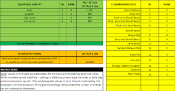
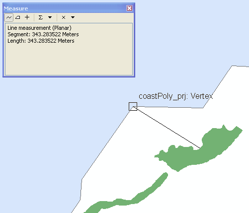
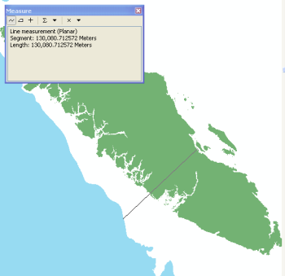

.. _coastal-vulnerability:

.. |openfold| image:: ./shared_images/openfolder.png
              :alt: open
	      :align: middle 

.. |addbutt| image:: ./shared_images/addbutt.png
             :alt: add
	     :align: middle 
	     :height: 15px

.. |okbutt| image:: ./shared_images/okbutt.png
            :alt: OK
	    :align: middle 

.. |adddata| image:: ./shared_images/adddata.png
             :alt: add
	     :align: middle 

***************************
Coastal Vulnerability Model
***************************

Summary
=======

Faced with a changing climate and a growing intensity of human activities, it is imperative for coastal communities to understand how development and changes in the biological and physical environment can affect their exposure to storm-induced erosion and inundation.  The InVEST Coastal Vulnerability model produces a qualitative estimate of such exposure, as well as a map of the location and size of human settlements. The Coastal Vulnerability Model maps the location of populations living near coastlines and their exposure to erosion and inundation during storms.  The model computes a Vulnerability Index, which differentiates areas with relatively high or low exposure to erosion and inundation.  The model does not take into account coastal processes that are unique to a region, nor does it predict long- or short-term changes in the shoreline position or configuration.  

Model inputs, which serve as proxies for various complex shoreline processes that influence exposure to erosion and inundation, include: a map of global population distribution, maps of local coastal geomorphology, location of natural habitats (e.g., seagrass, kelps, wetlands, etc.), rates of net sea-level change, a depth contour that can be used as an indicator for surge level (default contour is the edge of the continental shelf), and values of highest observed wind speed and wave power.  The model outputs maps of coastal human populations and of coastal exposure to erosion and inundation.  Outputs can be used to understand the relative contributions of different variables to coastal exposure and to highlight the protective services offered by natural habitats to coastal population.  This information can help coastal managers, planners, landowners, and other stakeholders identify regions of greater risk to coastal hazards, which can in turn inform development strategies and permitting.  This is a "Tier 0" model.

Introduction
============

Coastal regions are constantly subject to the action of ocean waves and storms and naturally experience erosion and inundation over various temporal and spatial scales.  However, coastal erosion and inundation can also threaten human populations, activities, and infrastructure, especially within the context of a changing climate and increases in the number of people living in these areas.  Moreover, these increases in human pressure can lead to loss and degradation of coastal ecosystems and their ability to provide protection for humans during storms.  Thus, it is important to understand the role of various bio-geophysical factors in increasing or decreasing coastal erosion and inundation in order to better plan for future development.  It is also important to know how natural habitats can mitigate the forces responsible for coastal erosion and inundation so that any management action preserves the protection services provided by coastal ecosystems. 

A number of models estimate the vulnerability of coastal regions to long-term sea level rise, erosion, and inundation based on geophysical characteristics (Gornitz et al. 1991, Hammar-Klose and Thieler 2001, Cooper and McLaughlin 1998).  There are also methods to qualitatively estimate the relative role natural habitats play in reducing the risk of erosion and inundation of particular areas (WRI 2009, Bush et al. 2001).  However, few models map the relative vulnerability of coastal areas to erosion and inundation based on the geophysical and natural habitat characteristics of a region.  It is our aim to fill that gap with the Coastal Vulnerability model.

The Coastal Vulnerability model produces a map of the location and size of human settlements as well as a qualitative index of coastal exposure to erosion and inundation.  The model does not value directly any ecosystem service, but ranks sites as having a relatively low, moderate or high risk of erosion and inundation.  It is relatively simple to use and quick to run, and it can be applied in most regions of the world with data that are, for the most part, relatively easy to obtain.  

Model outputs are easy to understand, and they are formatted in a way that enables you to manipulate them as they see fit.  They can be used to identify and distinguish segments of the coastline that are both populated by humans and vulnerable to natural hazard events.  They can also help you become familiar with the characteristics of their coastal region, and help highlight the relative role of natural habitats at reducing exposure.  Finally, outputs can be used to evaluate, in a simple way, how some management actions can increase or reduce exposure of human populations to the coastal hazards of erosion and inundation.
  

The model
=========

The InVEST Coastal Vulnerability model produces a Population map and an Vulnerability Index map.  The population map shows human population density near the coastal region of interest.  The Vulnerability Index map ranks the relative exposure of coastal regions and communities to erosion and inundation caused by large storms.  These maps are constructed using a global population density map and seven bio-geophysical variables that represent the natural biological and geomorphic characteristics of a region, the amount of expected net sea-level rise, and the relative effects of storms.  Model outputs are relevant when computed for a relatively large coastal region.  They can be used to locate populated areas that are more (or less) exposed to erosion and inundation than others.  

How it works
------------

The model creates the population and exposure index maps using a mixture of raster GIS and user input datasets of population and seven bio-geophysical variables:

1.	Geomorphology
2.	Relief
3.	Natural habitats (biotic and abiotic)
4.	Net sea level change
5.	Wind Exposure
6.	Wave Exposure
7.	Edge of continental shelf depth contour (or other depth contour that be used to estimate surge potential)

The outputs are mapped on the shoreline of the coastal region of interest with a user-defined spatial resolution (that can be as small as 250 meters).  We provide a default global, high resolution shoreline database (Wessel and Smith 1996) to represent coastlines of most regions of the world.  Below are details on how the output maps are created.

Social Exposure
^^^^^^^^^^^^^^^

When estimating the exposure of coastlines to erosion and inundation due to storms, it is important to consider the population of humans that will be subject to those hazard events.  Our Coastal Vulnerability model includes globally available population estimates for the coastal zone, which are derived from country-level census data.  To obtain a raster dataset that shows the estimated number of people residing in each coastal grid cell, we overlay this input dataset with the shoreline data.  We then assign each shoreline segment a population count by extracting the population count from the grid cell with the most overlap with the shoreline segment.

Exposure Index
^^^^^^^^^^^^^^

We compute the physical exposure index by combining the ranks of the five biological and physical variables at each shoreline segment.  Ranks vary from very low exposure (rank=1) to very high exposure (rank=5), based on a mixture of user- and model-defined criteria (see :ref:`table-41`).  A rank of 3 represents average exposure.  We built this ranking system based on methods proposed by Gornitz et al. (1990) and Hammar-Klose and Thieler (2001).  

.. _table-41:

Table 4.1
"""""""""
+--------------------------------------+--------------------------------------+------------------------------+------------------------------------------+--------------------------------------+--------------------------------------------+
| Rank                                 | Very Low                             | Low                          | Moderate                                 | High                                 | Very High                                  |
+--------------------------------------+--------------------------------------+------------------------------+------------------------------------------+--------------------------------------+--------------------------------------------+
| Variable                             | 1                                    | 2                            | 3                                        | 4                                    | 5                                          |
+======================================+======================================+==============================+==========================================+======================================+============================================+
| Geomorphology                        | Rocky; high cliffs; fiord; fiard     | Medium cliff; indented coast | Low cliff; glacial drift; alluvial plain | Cobble beach; estuary; lagoon; bluff | Barrier beach; sand beach; mud flat; delta |
+--------------------------------------+--------------------------------------+------------------------------+------------------------------------------+--------------------------------------+--------------------------------------------+
| Relief                               | <20th Percentile                     | <40th Percentile             | <60th Percentile                         | <80th Percentile                     | >80th Percentile                           |
+--------------------------------------+--------------------------------------+------------------------------+------------------------------------------+--------------------------------------+--------------------------------------------+
| Natural Habitats                     | Coral reef; mangrove; coastal forest | High dune; marsh             | Low dune                                 | Seagrass; kelp                       | No habitat                                 |
+--------------------------------------+--------------------------------------+------------------------------+------------------------------------------+--------------------------------------+--------------------------------------------+
| Sea Level Change                     | Net decrease                         |                              | ±1                                       |                                      | Net rise                                   |
+--------------------------------------+--------------------------------------+------------------------------+------------------------------------------+--------------------------------------+--------------------------------------------+
| Wind Exposure                        | <20th Percentile                     | <40th Percentile             | <60th Percentile                         | <80th Percentile                     | >80th Percentile                           |
+--------------------------------------+--------------------------------------+------------------------------+------------------------------------------+--------------------------------------+--------------------------------------------+
| Wave Exposure                        | <20th Percentile                     | <40th Percentile             | <60th Percentile                         | <80th Percentile                     | >80th Percentile                           |
+--------------------------------------+--------------------------------------+------------------------------+------------------------------------------+--------------------------------------+--------------------------------------------+
| Surge Potential                      | No exposure                          | <25th Percentile             | Average value                            | >75th Percentile                     | >90th Percentile                           |
+--------------------------------------+--------------------------------------+------------------------------+------------------------------------------+--------------------------------------+--------------------------------------------+

Table 4.1: List of Bio-Geophysical Variables and Ranking System for Coastal Exposure.

The model calculates the Vulnerability Index :math:`VI` for each shoreline segment as (see, e.g., Gornitz et al., 1990):

.. math:: VI = \sqrt{{R_{Geomorphology} R_{Relief} R_{Habitats} R_{SLR} R_{WindExposure} R_{WaveExposure} R_{Surge}}\over {Count(R_{Geomorphology},R_{Relief},R_{Habitats},R_{SLR},R_{WindExposure},R_{WaveExposure},R_{Surge})}}
   :label: VulInd

where :math:` Count(R_{Geomorphology},R_{Relief},R_{Habitats},R_{SLR},R_{=WindExposure},R_{Wave=Exposure},R_{Surge})` represents the sum of the seven variables that are taken into account to compute :math:`VI`.  The model will only run if you input a wind speed data layer.  However, if you do not input any of the other six variables data layer (Sea-Level Rise (SLR) for example), then it is removed from the count and the calculation of the index (:math: `R_{SLR}=0` and :math:`Count=6`, assuming that all other inputs are taken into account).  Lastly, if you upload a variable data layer and the model has difficulty assigning a rank for that variable to a particular segment of shoreline, because the layer is incomplete or because of the limitations of our approach, then this segment of shoreline receives a rank of 3 (moderate exposure).  

In addition to mapping the characteristics of all variables presented in :ref:`table-41`, the model computes an Erosion Index :math:`EI` and an Inundation Index :math:`II` as:

.. math:: EI = \sqrt{R_{Geomorphology} R_{Habitats} R_{WaveExposure}\over 3}
   :label: EroInd

and

.. math:: II = \sqrt{{ R_{Relief} R_{Habitats} R_{SLR} R_{WindExposure} R_{Surge}}\over 4}
   :label: InInd

These additional outputs were generated in order to give you the opportunity to evaluate how model results vary if you decide to combine variables in different ways.  Here, we assumed that the most important factors affecting erosion are geomorphology, natural habitats and wave height/period.  We also assumed that the most important factors affecting inundation are relief, natural habitats, sea-level rise, wind exposure and surge potential.  You can create your own index by defining a unique combination of the output values in the Attribute Table of the output layer named :math:`exp_ind`.  Below, we present a more detailed description of the variables presented in :ref:`table-41`.

.. _cp-Geomorph:

Geomorphology
^^^^^^^^^^^^^

Rocky cliffs are less prone to erosion and inundation than bluffs, beaches, or deltas.  Consequently, we adopted and hard-coded a relative ranking of exposure scheme based on geomorphology similar to the one proposed by Hammar-Klose and Thieler (2001).  We provide in :ref:`cp-appendix-a` a definition of the terms used in this classification, which applies mostly to the North American continent.  We will expand this classification to more regions of the world in later versions of this model.  

If the your geomorphology raster file has more categories than the ones presented in :ref:`table-41`, we leave it to your discretion to reclassify your data to match our ranking system, as explained in the :ref:`cp-data-needs` section, and in :ref:`cp-appendix-b`.  We suggest however, to include shore parallel hard structures (seawalls, bulkheads, etc) in your classification, and to give them a low to moderate rank (2 or 3), depending on their characteristics.

.. _cp-Relief:

Relief
^^^^^^

Sites that are, on average, above Mean Sea Level (MSL) are at lower risk or inundation than sites that are low-lying or at MSL.  We define relief in our model as the average elevation of the coastal land area that is within an approximate 1km radius from each segment of shoreline that you have defined.  This resolution was chosen because of the relative coarseness of most freely available terrestrial DEM. Before ranking them, relief values are normalized by dividing the average relief at a particular site by the mean of all average relief values.  

.. _cp-NatHab:

Natural Habitats
^^^^^^^^^^^^^^^^

Natural habitats (marshes, seagrass beds, mangroves, coastal dunes) play a vital role in mitigating the effects of coastal hazards and decreasing the exposure of a coastal area and community.  For example, large waves break on coral reefs before reaching the shoreline, mangroves and coastal forests dramatically reduce wave height in shallow waters, and decrease the strength of wave- and wind-generated currents, seagrass beds and marshes stabilize sediments and encourage the accretion of nearshore beds.  On the other hand, beaches with little to no biological habitats or sand dunes offer little protection to erosion and inundation.  We developed the ranking proposed in :ref:`table-41` based on the fact that fixed and stiff structures that penetrate the water column (e.g., coral reefs, mangroves) and sand dunes are the most able to protect coastal communities.  Flexible and seasonal structures, such as seagrass, reduce flows when they can withstand their force, and encourage accretion of sediments.  Once again, we leave it to your discretion to separate sand dunes into high and low categories.  We suggest however, based on Short and Hesp (1982), that 10m is an appropriate cut-off value to separate high (>10m) and low (<10m) dunes.

To compute a Natural Habitat exposure rank for a given shoreline segment, the model estimates whether a certain class of natural habitat (:ref:`table-41`) is within a user-defined search radius from the segment.  If more than one class of natural habitat are present and within the search radius from the segment, their ranks are allocated back to that segment.  The final exposure rank of the segment is equal to the highest rank value of the various classes fronting the segment.  Currently, the model only detects the presence of seagrass and kelp (see Section 2 and :ref:`cp-appendix-b` for a description of how the model does this).  We will include all the other habitat classes in a future model release.

.. _cp-SLR:

Net Sea-Level Change 
^^^^^^^^^^^^^^^^^^^^

The relative net sea level rise/decrease along the coastline of a given region is the sum of global sea-level rise, local sea level rise (eustatic rise) and local land motion (isostatic rise).  As indicated by Gornitz (1990), relative rise values between ±1 do not change current erosion or inundation trends, as they can be considered to be within modeling and measurement error range.  In contrast, values smaller than -1 decrease the exposure, while values above +1 increase the exposure.  Please consult :ref:`cp-appendix-b` for suggestions of how to create this input.

.. _cp-winds:

Wind Exposure
^^^^^^^^^^^^^

Strong winds can generate high surges and/or high waves if they blow over an area for a long period of time.  The wind exposure variable ranks shoreline segments based on their relative exposure to strong winds.  We compute this ranking by computing and mapping the Relative Exposure Index (REI; Keddy, 1982).  This index is computed by taking the time series of the highest 10% wind speeds from a long record of measured wind speeds, dividing the compass rose (or the 360 degrees compass) into 16 equiangular sectors, and combining the wind and fetch characteristics in these sectors as:

.. math:: REI = { {\sum^{16}_{n=1}} {U_n P_n F_n} }
   :label: REi

where:

+ :math:`U_n` is the average wind speed, in meters per second, in the :math:`n^{th}` equiangular sector
+ :math:`P_n` is the percent of all wind speeds in the record of interest that blow in the direction of the :math:`n^{th}` sector
+ :math:`F_n` is the fetch distance, in meters, in the :math:`n^{th}` sector

For a given coastline segment, we estimate fetch distances over each of the 16 equiangular sectors, with an accuracy of 1km, by using the model developed by Dr. Finlayson (Finlayson, 2005).  Raw REI values are then normalized by dividing the REI for a particular segment by the average of all REI values.  Please note that, in our model, wind direction is the direction winds are blowing FROM, and not TOWARDS.

.. _cp-Wave:

Wave Exposure  
^^^^^^^^^^^^^^^^^^

The relative exposure of a reach of coastline to storm waves is a qualitative indicator of the potential for shoreline erosion.  A given stretch of shoreline is generally exposed to locally-generated wind-waves, and, for a given wave height, waves that have a longer period have more power than shorter waves.  Coasts that are exposed to the open ocean generally experience a higher exposure to waves than sheltered regions because winds blowing over a very large distance, or fetch, generate larger waves.  Additionally, exposed regions experience the effects of long period waves, or swells, that were generated by distant storms.  

In the Tier0 Coastal Exposure model, we estimate the relative exposure of a region to waves by assigning to each shoreline segment the average of the highest wave power values offshore of that segment.  For segments that are exposed to the open ocean, we recommend using records of observed wave height and period near the sites of interest.  Wave power is then computed as:

.. math:: P = \frac{1}{2} H_n^2 T_n
   :label: WavPow

where:

+ :math:`P [kW/m]` is the wave power of waves that are offshore enough of the shoreline to be considered in deep water
+ :math:`H_n [m]` is the :math:`n^{th}` observed wave height value
+ :math:`T_n [s]` is the is the :math:`n^{th}` associated wave period

The wave power value that is retained for input in the model is the average of the top 10% of wave power computed from the time series of observations.  We recommend using as long a time series as possible.  

For regions that are sheltered from the open ocean, wave power is estimated with the same formula as above.  However, wave height and period of the locally generated wind-waves are computed for each of the 16 equiangular sectors as:

.. math::
  \left\{
   \begin{array}{l}
    \displaystyle H = { {{0.24 U^2}\over g} {\left[{ tanh \left( {4.14 \cdot 10^{-4}} { \left( {{gF}\over U^2} \right) }^{0.79} \right) }\right]}^{0.572} } \\
    \displaystyle \\
    \displaystyle T = { {{7.69 U}\over g} {\left[{ tanh \left( {2.77 \cdot 10^{-7}} { \left( {{gF}\over U^2} \right) }^{1.45} \right) }\right]}^{0.187} } \\
  \end{array} \right.
  :label: WaveFetch

where

+ :math:`F  [m]` is the average fetch distance in a particular sector 
+ :math:`U  [m/s]` is the average of the highest 10% wind speed values that were observed in that sector.  Please note that, in our model, wind direction is the direction winds are blowing FROM, and not TOWARDS.
+ :math:`g  [m/s^2]` is the acceleration of gravity 

We assign a wave power value to sheltered shoreline segments by taking the average of the three highest wave power values computed for the 16 equiangular sectors.  A more rigorous approach would have us compute wave power from all wind speed and direction quantities observed at the site, and take the average of the highest 10% wave power values.  However, we would not have been able to provide you with default data for winds.  

To differentiate between sheltered and exposed areas are computed, we use a fetch filter: segments for which two or more of the 16 fetches do not exceed a user-defined distance are assumed to be sheltered.  The expression of wave height and period for sheltered areas does not differentiate between duration and fetch-limited conditions (USACE, 2002; Part II Chap 2), and might under- or over-estimate wind-generated waves characteristics at a site.  However, we believe that this simplification will not misrepresent the overall relative exposure of shoreline segments.

For exposed regions, we provide, as a default database, wave power values obtained from processing WAVEWATCH III (WW3, Tolman (2009)) model hindcast reanalysis results.  For sheltered regions, the model will estimate wave height and period from wind speed and direction time series.  If you do not have enough observations of wind speed and direction for you site, you can use the wind speed and direction statistics that we computed from WW3.  For each of the 16 equiangular sector, we provide values of the average of the highest 10% wind speeds that blew over that sector.  Final results are normalized by dividing each computed power value by the average of all wave power computed.  Thus, a wave exposure value greater than one indicates a wave exposure greater than average (and a wave exposure <1 indicates less-than-average wave exposure).

Most coastal regions have varying amount of sheltered and exposed shorelines.  The ratio between sheltered and exposed shoreline segments for your region is a factor of fetch distance, as explained above, but also of the threshold distance that you input in the model.  To estimate wave exposure, we assign the average of the highest deep water wave power values observed offshore of the shoreline segments.  These data are more readily available for exposed regions, where you can use buoy data, or the WW3 default data that we provide.  For sheltered regions, observed values of wave height and associated period are not readily available, in general.  Consequently, we estimate wave power from the combination of average highest wind speed per equiangular sector and fetch distances.  Undoubtedly, sheltered regions are exposed to weaker waves than exposed regions, and thus receive a lower ranking.  However, we found that if the region of interest has a high ratio of sheltered regions, most exposed regions tend to receive the same high rank values, skewing the overall output map in favor of sheltered regions.  In order to correct this bias, we adopted the following approach:

+ If more than 60% of shoreline segments are classified as exposed, exposed segments receive a rank of 2 to 5 based on the wave power value that we computed using WW3, or from your computation based on buoy data.  Sheltered segments which have a wave power value that falls within the observed values of exposed segments are considered in this ranking scheme, otherwise, they receive a rank of 1.  In other words, sheltered segments receive a rank of 1 unless they are exposed to waves that have a similar power as what is observed on exposed coastlines.

+ If less than 60% of shoreline segments are classified as exposed, wave power are computed from wind speed and direction, and fetch distances, for all shoreline segments.  We do not take observed wave power values into account.  However, you can still access the observed wave power values computed from WW3 that would have been assigned to shoreline segments in the Attribute Table.  You can use this information to create a different index or classification than the one we proposed.

.. _cp-Surge:

Surge Potential
^^^^^^^^^^^^^^^

Storm surge elevation is a function of wind speed and direction, but also of the amount of time wind blows over relatively shallow areas.  In general, the longer the distance between the coastline and the edge of the continental shelf at a given area during a given storm, the higher the storm surge.  Unless a user decides to specify a certain depth contour appropriate to the region of interest, we estimate the relative exposure to storm surges by computing the length of the continental shelf fronting an area of interest.  (For hurricanes, a better approximation might be made by considering the distance between the coastline and the 30 meters depth contour (Irish and Resio 2010)).  

The tool that we use to perform this computation assigns a distance to all segments within the area of interest, even to segments that seem sheltered because they are too far inland, protected by a significant land mass, or on a side of an island that is not exposed to the open ocean.  Consequently, we offer you the opportunity to define a maximum distance threshold over which shoreline segment within the area of interest will be deemed at low-risk of exposure to storm surge (see :ref:`cp-data-needs` section).  We provide an example of how to estimate this distance in :ref:`cp-appendix-b`.

Limitations and simplifications 
===============================

Beyond technical limitations, the Exposure Index also has theoretical limitations.  One of the main limitations is that we simplified the numerous natural characteristics and extremely complex coastal processes happening in a region into five variables and five exposure categories.  For example, the model does not distinguish between sand and mixed sand beaches; nor does it take into account the slope of bluffs.  More importantly, the model does not consider any hydrodynamic or sediment transport processes.  Consequently, we assume that regions that belong to the same geomorphic exposure class behave in a similar way.  Also, the scoring of exposure is the same everywhere in the region of interest; the model does not take into account any interactions between the different variables in :ref:`table-41`.  For example, the relative exposure to waves and wind will have the same weight whether the site under consideration is a sand beaches or a rocky cliff.  Finally, when we compute the final exposure index, we still take into account the effect of biogenic habitats fronting regions that have a low geomorphic ranking.  In other words, we assume that natural habitats provide protection to regions that are naturally protected again erosion.  This limitation artificially deflates the relative exposure of these regions, and inflates the relative exposure of regions that have a high geomorphic index.

The other type of limitations in this model is associated with the computation of the wind and wave exposure.  Because we wanted to provide you with default data to use in most regions of the world, we had to simplify the type of input required to compute wind and wave exposure.  In the WW3 wind database that we prepared to compute the REI, we do not provide time series of the highest 10% observed wind speed to compute REI as in :eq:`REi`, but instead provide the average speed in each of the 16 equiangular sector computed for that top 10% time series.  If you would like to upload your own data, you will need to follow the same procedure.  Similarly, for sheltered regions where we compute wave power from wind and fetch characteristics, we do not provide time series of wind speed from which wave power is computed, then take the highest 10% wave power values.  This approach would force us to create files that are too big to store.  Instead, for each time series of wind speed observed at a grid point, we provide you with the average of highest 10% wind speed observed in each equiangular sector.

Consequently, model outputs cannot be used to quantify the exposure to erosion and inundation of a specific coastal location; the model produces qualitative outputs and is designed to be used at a relatively large scale.  More importantly, the model does not predict the response of a region to specific storms or wave field and does not take into account any large-scale sediment transport pathways that may exist in a region of interest.  

.. _cp-data-needs:

Data needs
==========

The model uses an interface to input all required and optional data, and as is outlined in this section.  It outputs a population and an vulnerability index map.  The population map is always produced, but you have the option of uploading any or all of the variables in :ref:`table-41` to compute the Vulnerability Index map, with the exception of the wind input layer: the model will not run unless a wind input layer has been uploaded.  To run the model, two steps are required: 

1.	Run the Fetch Calculator tool
2.	Run the Vulnerability Index tool

The Fetch Calculator tool usually takes the longest amount of time to run.  The Vulnerability Index only takes a few minutes to run.  It is the results of that tool that are important to your analysis; outputs of the Fetch Calculator are only inputs in the Vulnerability Index tool and are not as informative.  

Here we outline the options presented to you via the two interfaces, and the content and format of the required and optional input data used by the model.  More information on how to fill the input interface or how to obtain data is provided in :ref:`cp-appendix-b`.

.. _cp-Fetch:

Fetch Calculator
----------------

1. **Workspace Location (required).** You are required to specify a workspace folder path.  We recommended creating a new folder for each run of the model.  For example, by creating a folder called "RunWholeCoast_Fetch" within the "CoastalVulnerability" folder, the model will create "intermediate" and "output" folders within this "RunWholeCoast_Fetch" workspace.  The "intermediate" folder will compartmentalize data from intermediate processes.  The model’s final outputs will be stored in the "output" folder.  You will have to refer to this folder "RunWholeCoast_Fetch" in the Vulnerability Index interface.  Please note that you DO NOT have to run this model every time you run the Vulnerability Index model. ::

     Name: Path to a workspace folder.  Avoid spaces. 
     Sample path: \InVEST\CoastalVulnerability\RunWholeCoast_Fetch 

2. **Land Polygon (required).**  This input provides the model with a geographic shape of the coastal area of interest, and instructs it as to the boundaries of the land and seascape.  A global land mass polygon file is provided as default (Wessel and Smith, 1996), but other layers can be substituted. ::

     Name: File can be named anything, but no spaces in the name
     File type: polygon shapefile (.shp)
     Sample path (default): \InVEST\Base_Data\Marine\Land\global_polygon.shp

3. **Land Polyline (required).**  This input should have the same shape as the Land Polygon (input 2), and must have a feature geometry of polyline instead of polygon. ::

     Name: File can be named anything, but no spaces in the name
     File type: polyline shapefile (.shp)
     Sample path: \InVEST\Base_Data\Marine\Land\global_polyline.shp

4. **Land Area Filter (kilometers squared, optional).**  All landmasses within the AOI are included in fetch calculation, but this input instructs the model to filter out from the output calculation land masses (islands) with an area less than the value specified (in km\ :sup:`2`).  For example, if you enter "5", the model will only produce outputs for landmasses that have an area greater or equal to 5km\ :sup:`2`.  More information on how to fill this input cell is provided in :ref:`cp-appendix-b`.

   This input should be left blank if (1) you do not wish to filter out any land masses or (2) you select a land polygon and polyline (inputs #2-3) that is different from the default layers provided in the directory "\\InVEST\\Base_Data\\Land\\". ::

     Name: A numeric text string (positive integer)
     File type: text string (direct input to the ArcGIS interface)
     Sample (default):  5

5. **Area of Interest (AOI) (required).**  You must create a polygon feature layer that defines the Area of Interest (AOI).  An AOI instructs the model where to clip the Land Polygon and Land Polyline input data (inputs #2-3) in order to define the spatial extent of the analysis.  

   If you are including the Surge Potential variable in the computation of the exposure index, the depth contour specified in input #13 must be specified, and the AOI must intersect that contour.  If the AOI does not intersect that contour, the model will stop and provide feedback. ::

     Name: File can be named anything, but no spaces in the name
     File type: polygon shapefile (.shp)
     Sample path: \InVEST\CoastalVulnerability\Input\AOI_BarkClay.shp

6. **Cell Size (meters, required).**  This input determines the spatial resolution at which the model runs and the resolution of the output maps.  To run the model at the minimum 250 x 250 meters grid cell scale, you should enter "250".  A larger grid cell will yield a lower resolution, but a faster computation time. ::

     Name: A numeric text string (positive integer)
     File type: text string (direct input to the ArcGIS interface)
     Sample (default): 250

7. **Fetch Distance Threshold (meters).**  This input determines the fetch distance threshold that will be used to differentiate sheltered and exposed shoreline segments.  If, for a given segment, at least two fetch distances are greater than the threshold that you input, then this segment is classified as exposed, and vice-versa. ::

     Name: A numeric text string (positive integer)
     File type: text string (direct input to the ArcGIS interface)
     Sample (default): 12500

.. _cp-vulnerabilityindex:

Vulnerability Index
-------------------

1. **Workspace Location (required).** You are required to specify a workspace folder path.  We recommended creating a new folder for each run of the model.  For example, by creating a folder called "RunWholeCoast_Vuln" within the "CoastalVulnerability" folder, the model will create "intermediate" and "output" folders within this "RunWholeCoast_Vuln" workspace.  The "intermediate" folder will compartmentalize data from intermediate processes.  The model’s final outputs will be stored in the "output" folder. ::

     Name: Path to a workspace folder.  Avoid spaces. 
     Sample path: \InVEST\CoastalVulnerability\RunWholeCoast_Vuln 

2. **Fetch Calculator Model Run’s Workspace (required).**  You are required to enter the path to the folder where the Fetch Calculator stored its intermediate and outputs folders.  Based on the example given above, it is the path to the "RunWholeCoast_Fetch" workspace.

     Name: Path to a workspace folder.  Avoid spaces. 
     Sample path: \InVEST\CoastalVulnerability\RunWholeCoast_Fetch 

3. **Population Raster (required).**  A raster layer is required to map the population size along the coastline of the AOI specified (input #4).  A global population raster file is provided as default, but other raster data layers can be substituted. ::

     Name: File can be named anything, but no spaces in the name and less than 13 characters
     Format: standard GIS raster file (ESRI GRID), with population values
     Sample data set (default): \InVEST\Base_Data\Marine\Population\global_pop

4. **Indices Table (required).**  You must provide a summary table to instruct the model on various parameters necessary to calculate the exposure index.  While numbers can be modified -- adding to, deleting, or rearranging the order of cells may produce erroneous results.  The model expects values to be in these specific cells with the exception of the geomorphology listing (yellow) where the number of entries can be increased or decreased.  More information on how to fill this table is provided in :ref:`cp-appendix-b`. ::

     Table Names: File can be named anything, but no spaces in the name
     File type: *.xls or .xlsx (if user has MS Excel 2007 or newer)
     Sample: InVEST\CoastalVulnerability\Input\ExposureIndexParameters_WCVI.xls\Indices$

5. **Wind-Wave Exposure: WaveWatch3 Model Data (required).**  This input is used to compute the Wind and Wave Exposure ranking of each shoreline segment (:ref:`table-41`).  It consists of …If you would like to create such a file from your own data, please consult :ref:`cp-appendix-b`. 

6. **Relief: Digital Elevation Model (required).**  This input is used to compute the Relief ranking of each shoreline segment (:ref:`table-41`).  It consists of …

7. **Natural Habitat: Directory with Layers (optional).**  You must store all Natural Habitats input layer that you have in a folder named “Natural Habitat”, which is located in the “Input” folder of this model.  In this folder, you can store as many Natural Habitat layers as you want according to the list provided in :ref:`table-41`.  This input layer is used to compute a Natural Habitat ranking for each shoreline segment.  Each natural habitat layer should consist of the location of those habitats (which will be clipped by the model within the AOI, input 4).  The distance at which this layer will have a protective influence on coastline can be modified in the indices tables (input 7). ::

     Name: File can be named anything, but no spaces in the name
     File type: polygon shapefile (.shp)
     Sample path: \InVEST\CoastalVulnerability\Input\Natural Habitat

8. **Geomorphology: Shoreline Type (required).**  This input, of geometry type "polyline", is used to compute the Geomorphology ranking of each shoreline segment (:ref:`table-41`).  It does not have to match the land polyline input (input #3), but must resemble it as closely as possible.  Additionally, the polyline shapefile must have a field called "ID" that identifies the various shoreline types with a number.  You must assign a corresponding rank value to each ID in the indices table (input #7).  More information on how to fill in this table is provided in :ref:`cp-appendix-b`. ::

     Names: File can be named anything, but no spaces in the name
     File type: polyline shapefile (.shp)
     Sample path: \InVEST\CoastalVulnerability\Input\Shorezone_VI.shp

9. **Surge Potential: Continental Shelf (optional).**  This input is a global polygon dataset that depicts the location of the continental margin.  It must intersect with the AOI polygon (input #4). ::

     Names: File can be named anything, but no spaces in the name
     File type: polygon shapefile (.shp)
     Sample path:  \InVEST\CoastalVulnerability\Input\continentalShelf.shp

10. **Sea Level Rise: Polygon Indicating Net Rise or Decrease (optional).**  This input must be a polygon delineating regions within the AOI that experience various levels of net sea level change.  It must have a field called "RANK" that orders the net change values according to :ref:`table-41`.  More information on how to create this polygon is provided in the Marine InVEST :ref:`FAQ`, and in :ref:`cp-appendix-b`. ::

     Name: File can be named anything, but no spaces in the name
     File type: polygon shapefile (.shp)
     Sample path: \InVEST\CoastalVulnerability\Input\SeaLevRise_WCVI.shp

Running the model
=================

Setting up workspace and input folders
--------------------------------------

These folders will hold all input, intermediate and output data for the model.  As with all folders for ArcGIS, these folder names must not contain any spaces or symbols.  See the sample data for an example.

.. note:: The word *‘path’* means to navigate or drill down into a folder structure using the Open Folder dialog window that is used to select GIS layers or Excel worksheets for model input data or parameters. 

Exploring a project workspace and input data folder  
^^^^^^^^^^^^^^^^^^^^^^^^^^^^^^^^^^^^^^^^^^^^^^^^^^^

The */InVEST/CoastalVulnerability* folder holds the main working folder for the model and all other associated folders. Within the *CoastalVulnerability* folder there will be a subfolder named *‘Input’*. This folder holds most of the GIS and tabular data needed to setup and run the model. 

The following image shows the sample input (on the left) and base data (on the right) folder structures and accompanying GIS data.  We recommend using this folder structure as a guide to organize your workspaces and data. Refer to the screenshots below for examples of folder structure and data organization.

+----------------------------------------------------------+----------------------------------------------------------+
| .. image:: ./coastal_vulnerability_images/cpdataorgA.png | .. image:: ./coastal_vulnerability_images/cpdataorgB.png |  
+----------------------------------------------------------+----------------------------------------------------------+

Creating a run of the model
---------------------------

The following example of setting up the Coastal Protection model uses the sample data provided with the InVEST download. The instructions and screenshots refer to the sample data and folder structure supplied with the InVEST installation package. It is expected that you will have location-specific data to use in place of the sample data. These instructions provide only a guideline on how to specify to ArcGIS the various types of data needed and does not represent any site-specific model parameters. See the :ref:`cp-data-needs` section for a more complete description of the data specified below. 

1. Click the plus symbol next to the InVEST toolbox.

.. figure:: ./shared_images/investtoolbox.png
   :align: center
   :figwidth: 500px

2. Expand the Marine toolset, then the Coastal Protection toolset.  There are two scripts that you will have run in succession: Fetch Calculator and Vulnerability Index.  Click on the Fetch Calculator script to open that model.  For a refresher on the meaning of the different variables that we are asking you load in this interface, please see :ref:`cp-Fetch`.

.. figure:: ./coastal_vulnerability_images/cpFetchtool350.png
   :align: center
   :figwidth: 500px

3. Specify the Workspace. Click on the Open Folder button |openfold| and path to the *InVEST/CoastalVulnerability* folder. If you created your own workspace folder (Step 2 in :ref:`cp-Fetch`), then select it here.

   Click on the *CoastalVulnerability* folder and click on |addbutt| set the main model workspace.  This is the folder in which you will find the intermediate and final outputs when the model is run.  

4. Specify the Land Polygon. The model requires a land polygon shapefile to define the shoreline for the analysis. This shapefile will be supplied in the model window for you.

5. Specify the Land Polyline. The model requires a land polyline shapefile to define the shoreline for the analysis. This shapefile will be supplied in the model window for you.

6. Specify the Land Area Filter (Optional).  If you select this option, the model requires a land area filter parameter. The default value is given as 5 square kilometers. You can change this value by directly typing into the text box and entering another value.  

7. Specify the Area of Interest (AOI). The model requires an AOI, which is the geographic area over which the model will be run. This example refers to the *AOI_BarkClay.shp* shapefile supplied in the sample data. You can create an AOI shapefile by following the Creating an AOI instructions in the :ref:`getting-started` section.

   Open |openfold| the *InVEST/CoastalVulnerability/Input* data folder. Select the AOI_BarkClay.shp shapefile and click |addbutt| to make the selection.  

8. Specify the Cell Size. The model requires a cell size for the raster analysis. The default cell size is 250 meters. You may change this value by entering a new value directly into the text box.  

9. Specify the Fetch Distance Threshold.  The model requires a fetch distance threshold to separate sheltered and exposed areas.  The default value is 12,500 meters.  You may change this value by entering a new value directly into the text box.

10. At this point the Fetch Calculator model dialog box is complete and ready to run. 

    Click |okbutt| to start the model run. The model will begin to run and a show a progress window with progress information about each step in the analysis. Once the model finishes, the progress window will show all the completed steps and the amount of time that has elapsed during the model run. 

.. figure:: ./coastal_vulnerability_images/cptoolfilled350.png
   :align: center
   :figwidth: 500px

.. figure:: ./coastal_vulnerability_images/cpcompleted350.png
   :align: center
   :figwidth: 500px

11. Now that your area of interest has been segmented, all fetch distances have been computed and separated between exposed and sheltered regions, you can click on the Coastal Vulnerability script to open that model.  

.. figure:: ./coastal_vulnerability_images/cptool350.png
   :align: center
   :figwidth: 500px

12. Specify the Workspace. Click on the Open Folder button |openfold| and path to the *InVEST/CoastalVulnerability* folder. If you created your own workspace folder, then select it here.

   Click on the *CoastalVulnerability* folder and click on |addbutt| set the main model workspace.  This is the folder in which you will find the intermediate and final outputs when the model is run.  

13. Specify the Fetch Calculator Model Run’s Workspace. Navigate to the Workspace that you specified in Step 3 above.  This folder contains various outputs folders and files generated by the fetch calculator.

14. Specify the Global Population Raster. This is a global population raster with population assigned to each cell value. This raster will be supplied in the model window for you. Click |openfold| and path to the *InVEST/Base_Data/Marine/Population* folder. Select the *global_pop* raster and click |addbutt| to make the selection.
 
15. Specify the Indices Table. The model requires a table of exposure indices stored in a Worksheet in an Excel workbook file (.xls). See the :ref:`cp-data-needs` section for more information on creating and formatting these data.  This worksheet will be supplied for you.  

    Click |openfold| and path to the *InVEST/CoastalVulnerability/Input* data folder. Double left-click on the Excel file *ExposureIndexParameters_WCVI.xls* and select the worksheet *Indices$*. 

    Click |addbutt| to make the selection.

.. note:: ArcMap and the model will not recognize the Excel sheet as valid data if it is added to the Data View. It is best to specify Excel data directly in the model dialog window using the Open folder and Add buttons and navigating to the data. 

16: Specify the Wind-Wave Exposure shapefile.  The model requires wind and wave statistics to create the wind and wave exposure variables.  To include the default wind and wave input values, click |openfold| and path to the *InVEST/CoastalVulnerability/Input* data folder. Select the * WW3_WCVI.shp* shapefile and click |addbutt| to make the selection.  See the :ref:`cp-data-needs` section for details on preparing your own shapefile.

17: Specify the Relief Digital Elevation Model (DEM) raster.  The model requires a DEM raster file to estimate average elevation landward of the coastal segment.  Click |openfold| and path to the *InVEST/CoastalVulnerability/Input* data folder. Select the * claybark_dem* raster and click |addbutt| to make the selection.

18. Specify the Natural Habitat directory. The model can use optional polygon shapefile that represent the location of various habitats. Click |openfold| and path to the *InVEST/CoastalVulnerability/Input* data folder. Select the *Natural Habitats* folder and click |addbutt| to make the selection.

19. Specify the Geomorphology (Required). The model requires a polyline shapefile that represents shoreline geomorphology. Click |openfold| and path to the *InVEST/CoastalVulnerability/Input* data folder. Select the *Shorezone_VI.shp* shapefile and click |addbutt| to make the selection. 

20. Specify the Surge Potential data (Optional). To represent surge potential, the model uses a continental shelf polygon shapefile. Click |openfold| and path to the *InVEST/CoastalVulnerability/Input* data folder. Select the *continentalShelf.shp* shapefile and click |addbutt| to make the selection.  

21. Specify the Sea Level Rise polygon (Optional). The model can use an optional polygon shapefile that represents sea level rise potential. Click |openfold| and path to the *InVEST/CoastalVulnerability/Input* data folder. Select the *SeaLevRise_WCVI.shp* shapefile and click |addbutt| to make the selection.  

22. At this point the model dialog box is completed for a complete run (with all optional data for full exposure analysis) of the Coastal Vulnerability model. 

    Click |okbutt| to start the model run. The model will begin to run and a show a progress window with progress information about each step in the analysis. Once the model finishes, the progress window will show all the completed steps and the amount of time that has elapsed during the model run. 

.. figure:: ./coastal_vulnerability_images/cptoolfilled350.png
   :align: center
   :figwidth: 500px

.. figure:: ./coastal_vulnerability_images/cpcompleted350.png
   :align: center
   :figwidth: 500px

 
Viewing output from the model
-----------------------------

Upon successful completion of the model, two new folders called "intermediate" and "Output" will be created in each of the sub-models (Fetch Calculator and Vulnerability Index) workspaces.  The main outputs that are useful for your analysis are the Vulnerability Index outputs, and we will concentrate on these outputs in the remainder of this document.  The Vulnerability Index Output folder contains several types of spatial data, each of which are described the :ref:`cp-interpreting-results` section.

.. figure:: ./coastal_vulnerability_images/cpoutputdirs.png
   :align: center
   :figwidth: 500px

To view the output spatial data in ArcMap (from either the Intermediate or Output folders) click the Add Data button |adddata| and select the four files highlighted in the figure below. 

.. figure:: ./coastal_vulnerability_images/cpoutputdir350.png
   :align: center
   :figwidth: 500px

To navigate between the different fields contained in the "exp_index" outputs, or to change the symbology of a layer, double-click, or right-click on the layer name in the table of contents, select "Properties", and then "Symbology".  There you will find various options to change the way the data appear in the map.  In the example below, we chose to plot the ranking of the wind variable, and flipped the color legend so that red segments have the highest rank. To accentuate segments color and increase their thickness, click the “Display” tab in “Layer Properties”, and choose “Resample during display using” “Majority (for discrete data)”. To navigate quickly between maps of output fields in the "exp_index" layer, we recommend you copy and paste the "exp_index" layer in the workspace and plot the output layer that you are interested in.

+---------------------------------------------------------------+--------------------------------------------------------------------+
| .. image:: ./coastal_vulnerability_images/cplayersmenu200.png | .. image:: ./coastal_vulnerability_images/cplayerproperties300.png |  
+---------------------------------------------------------------+--------------------------------------------------------------------+

.. figure:: ./coastal_vulnerability_images/cpoutmap350.png
   :align: center
   :figwidth: 500px

Finally, to generate a different map of outputs based on any other preferred relationship than the one presented in Equation :eq:` VulInd ` (see Gornitz (1990) for examples of other ways of computing the exposure index), we recommend creating a new field in the Attribute Table:

+-------------------------------------------------------------------+---------------------------------------------------------------+
| .. image:: ./coastal_vulnerability_images/cplayersmenuopen200.png | .. image:: ./coastal_vulnerability_images/cpattributes350.png |  
+-------------------------------------------------------------------+---------------------------------------------------------------+

Once the new field is created, it can be named "New_Index" (for example).  After it is created, you can manipulate the various fields in any possible way using the field calculator:

.. figure:: ./coastal_vulnerability_images/cpcalculatorB350.png
   :align: center
   :figwidth: 500px

We encourage you to view as many fields in the outputs as necessary to develop an understanding of how the values of the different variables we used to compute the exposure index change along the Area of Interest, and to view the optional outputs described in the :ref:`cp-interpreting-results` section.  

.. _cp-interpreting-results:

Interpreting results
====================

Model outputs
-------------

The following is a short description of each of the outputs from the Coastal Vulnerability model.  Each of these output files is saved in the "Output" folder that is located within the workspace directory you specified:

Output folder
^^^^^^^^^^^^^

+ Output\\exp_index

  + This raster layer contains important statistics used to determine coastal exposure.
  + The raster contains a variety of fields, including:

    + FFILT – coastline segments with low (0) and high (1) exposure based on number of fetch directions exceeding a distance threshold
    + WAVE_PWR – Wave Power value associated with shoreline segments
    + WIND_RANK –  ranking (1-5) for wind exposure component of the index
    + WAVE_RANK – ranking (1-5) for wave exposure component of the index
    + HAB_RANK – combine impact of all vegetation inputs
    + SURGE_RANK – ranking (0-5) for surge potential component of the index
    + SLR_RANK – expected sea level rise rankings
    + RELF_RANK – ranking (0-5) for relief component of the index
    + GEOMORPH_RANK – ranking (0-5) for geomorphology component of the index
    + EI – the erosion index (see “The Model” section)
    + II – the inundation index (see “The Model” section)
    + VI – the vulnerability index (see “The Model” section)

+ Output\\vuln_index

  + This raster layer contains only values from the VI field of output #1 and is automatically symbolized when added to ArcMap.

+ Output\\eros_index

  + This raster layer contains only values from the EI field of output #1 and is automatically symbolized when added to ArcMap.

+ Output\\inund_index

  + This raster layer contains only values from the II field of output #1 and is automatically symbolized when added to ArcMap.

+ Output\\wind_exp

  + This raster layer contains only values of normalized REI (see “The Model” section) and is automatically symbolized when added to ArcMap.

+ Output\\coast_pop

  + This raster layer depicts population extracted from the global population input layer, but only for areas along the coast and within the area of interest you specified.
  + The values this dataset represents are the number of people within each grid cell.  You determine the size of the grid cells.

+ Output\\coast_pop_pts.shp

  + The point feature layer contains points along the coastline only where people live.
  + This layer can easily be symbolized by importing the symbology from the file \\InVEST\\CoastalVulnerability\\Input\\coast_pop_pts.lyr

+ Output\\coastPoly_prj.shp

  + This polygon feature layer displays the clipped landmass within the AOI and is projected based on the projection you specified.
  + This layer is most useful when added to ArcMap and moved below all other output layers in the ordering hierarchy.

Intermediate folder
^^^^^^^^^^^^^^^^^^^

+ intermediate\\fetch

  + This is a folder containing all 16 directional fetch calculations in raster format.  Each direction has also been reclassed and expanded in order for the model to extract a fetch value for each coastline pixel.

+ intermediate\\veg

  + This is a folder containing calculations for determining biogenic habitat’s reach in terms of coastal protection.  The reach distance of the two types of vegetation is set in the indices table (input #7).  There will either be 1 or 2 files within this folder, depending on whether you specify both kelp and seagrass as inputs.

+ intermediate\\veg_rc

  + This raster layer compiles the combine impact of all vegetation inputs.  A value of 4 indicates areas where vegetation may impact coastal protection and a value = 5 means no impact.

+ intermediate\\landsea_rst

  + This raster layer indicates areas of land (value = 1) and sea (value = 0) within the AOI and is used by the model to calculate fetch and distance to shelf.

+ intermediate\\slr_rc

  + This raster layer indicates the expected sea level rise rankings within the AOI and is used as part of the exposure index.

+ intermediate\\sz_rc

  + This raster layer depicts how shoreline types were allocated to various sectors of coastline based on the polyline input #15 (geomorphology).  

Parameter log
-------------

Each time the module is run a text file will appear in the workspace folder.  The file will list the parameter values for that run and be named according to the service and the date and time.

.. _cp-appendix-a:

Appendix A
==========

Here we provide definitions for the terms presented in the geomorphic classification in :ref:`table-41`.  Some of these are from Gornitz et al. (1997) and USACE (2002). Photos of some of the geomorphic classes that we presented can be found at the National Oceanic and Atmospheric Administration’s `Ocean Service Office of Response and Restoration website <http://response.restoration.noaa.gov/gallery_gallery.php?RECORD_KEY%28gallery_index%29=joinphotogal_id,gallery_id,photo_id&joinphotogal_id%28gallery_index%29=86&gallery_id%28gallery_index%29=4&photo_id%28gallery_index%29=35>`_.

Alluvial Plain
  A plain bordering a river, formed by the deposition of material eroded from areas of higher elevation.

Barrier Beach
  Narrow strip of beach with a single ridge and often foredunes.  In its most general sense, a barrier refers to accumulations of sand or gravel lying above high tide along a coast.  It may be partially or fully detached from the mainland. 

Beach
  A beach is generally made up of sand, cobbles, or boulders and is defined as the portion of the coastal area that is directly affected by wave action and that is terminated inland by a sea cliff, a dune field, or the presence of permanent vegetation.

Bluff
  A high, steep back or cliff

Cliffed Coasts
  Coasts with cliffs and other abrupt changes in slope at the ocean land interface. Cliffs indicate marine erosion and imply that the sediment supply of the given coastal segment is low. The cliff’s height depends upon the topography of the hinterland, lithology of the area, and climate.

Delta
  Accumulations of fine-grained sedimentary deposits at the mouth of a river.  The sediment is accumulating faster than wave erosion and subsidence can remove it.  These are associated with mud flats and salt marshes.

Estuary Coast
  Tidal mouth of a river or submerged river valley.  Often defined to include any semi-enclosed coastal body of water diluted by freshwater, thus includes most bays.  The estuaries are subjected to tidal influences with sedimentation rates and tidal ranges such that deltaic accumulations are absent. Also, estuaries are associated with relatively low-lying hinterlands, mud flats, and salt marshes.

Fiard
  Glacially eroded inlet located on low-lying rocky coasts (other terms used include sea inlets, fjardur, and firth). 

Fjord
  A narrow, deep, steep-walled inlet of the sea, usually formed by entrance of the sea into a deep glacial trough.

Glacial Drift
  A collective term which includes a wide range of sediments deposited during the ice age by glaciers, melt-water streams and wind action.

Indented Coast
  Rocky coast with headland and bays that is the result of differential erosion of rocks of different strength.

Lagoon
  A shallow water body separated from the open sea by sand islands (e.g., barrier islands) or coral reefs.

Mud Flat
  A level area of fine silt and clay along a shore alternately covered or uncovered by the tide or covered by shallow water.

.. _cp-appendix-b:

Appendix B
==========

The model requires large-scale geo-physical, biological, atmospheric, and population data.  Most of this information can be gathered from past surveys, meteorological and oceanographic devices, and default databases provided with the model.  In this section, we propose various sources for the different data layers that are required by the model, and we suggest methods to fill out the input interface discussed in the :ref:`cp-data-needs` section.  We recommend that you import all the required and optional data layers before attempting to run the model.  Familiarity with data layers will facilitate the preparation of data inputs.  

Population data
---------------

To assess the population residing near any segment of coastline, we use population data from the Global Rural-Urban Mapping Project (`GRUMP <http://sedac.ciesin.columbia.edu/gpw>`_).  This dataset contains global estimates of human populations in the year 2000 in 30 arc-second (1km) grid cells.  You can use your own, more detailed and/or recent census data, and we encourage you to use recent fine-scale population maps, even in paper form, to aid in the interpretation of the Exposure Index map.

Geo-physical data layer
-----------------------

To estimate the Exposure Index of the AOI, the model requires an outline of the coastal region.  As mentioned in the :ref:`cp-data-needs` Section, we provide a default global land mass polygon file.  This default dataset, provided by the U.S. National Oceanic and Atmospheric Administration (NOAA) is named GSHHS, or a Global Self-consistent, Hierarchical, High-resolution Shoreline (for more information, visit http://www.ngdc.noaa.gov/mgg/shorelines/gshhs.html).  It should be sufficient to represent the outline of most coastal regions of the world.  However, if this outline is not sufficient, we encourage you to substitute it with another layer.  

To compute the Geomorphology ranking, you must provide a geomorphology layer (:ref:`cp-data-needs` Section, input 15) and an associated geomorphic classification map.  This map should provide the location and type of geomorphic features that are located in the coastal area of interest.  In some parts of the west-coast of the United States and Canada, such a map can be built from a database called `Shorezone <http://www.geobc.gov.bc.ca>`_.  If such a database is not available, we recommend building such a database from site surveys information, aerial photos, geologic maps, or satellites images (using Google or Bing Maps, for example).

In addition to the geomorphology layer, you must fill a Geomorphology table in the Indices Tables Excel file (ExposureIndexParameters.xls, see input 7 in the :ref:`cp-data-needs` Section).  The table is used by the model to assign a geomorphology exposure ranking based on the different geomorphic classes identified.  To fill out the Geomorphology table, we recommend pasting into the first two columns all the geomorphic classes that are in your AOI and their corresponding ID’s in the geomorphology GIS layer.  Then you need to assign a rank to those ID’s, based on the classification we presented in :ref:`table-41`.  There is no limit to the number of unique geomorphology layer types, but the table must start with ID=1 and follow with consecutive integers.   A placeholder may be used to preserve the sequence.

Habitat data layer
------------------

The natural habitat maps (inputs 10 and 11 in the :ref:`cp-data-needs` Section) should provide information about the location and types of coastal habitats described in :ref:`table-41`.  In some parts of the west coast of the United States and Canada, such a map can be built from a database called `Shorezone <http://www.geobc.gov.bc.ca>`_.  If such a database is not available, we recommend building it from site surveys information, aerial photos, or even satellites images (using Google or Bing Maps, for example).

The Natural Habitat table in the Indices Tables asks you to provide information about the type of habitats layers that you have in the “Natural Habitat” folder.  The different columns in that table are:

1.	Natural Habitat: The name of the natural habitat for which you have a layer (e.g., kelp or eelgrass)
2.	ID: The ID number associated with the name of these habitats: number X listed at the end of the name of the different layers that you have created as in “seagrass_2”.  Note that this ID number is what the model uses to associate a rank and protection distance to the name you input in the first column.  In other words, the name you input in column 1 can be different from the name of your file, but the ID number should match.  For example, in the default Natural Habitat directory that we provided, we have a seagrass layer, which has the ID 2 (e.g. seagrass_2).  But we entered “eelgrass” in column 1 of the table.  However, because ID in the second column is 2, then the model knows that the rank and Protection Distance values that you input for “eelgrass” apply to the seagrass layer that you created.
3.	RANK: The vulnerability rank associated with the natural habitat that you listed in column 1.  We recommend to use the ranking system provided in :ref:`table-41`.  However, if you would like to evaluate how the vulnerability index values changes in the absence of the habitats listed in the table, you can change the RANK to a 5.  For example, to evaluate how the vulnerability of an area changes if you remove a high sand dune, you can change the RANK value from a 2 to a 5.
4.	Protection Distance: The model determines the presence or absence of various user-specified natural habitats in the AOI by estimating the fetch distance over 16 equiangular segments between the location of the natural habitats and the shoreline.  If there is a non-zero fetch distance between a patch of natural habitat and a shoreline segment, the model knows that the patch fronts that segment.  To assign a natural habitat ranking to that segment that takes into account the beneficial effect of the presence of this habitat, we ask that you input a maximum distance of influence into the Natural Habitat table in the Indices Tables Excel file (“ExposureIndexParameters”, see input 7 in the :ref:`cp-data-needs` Section).  We assume that natural habitats that are fronting a segment but are further away from the segment that the distance you defined will not have a beneficial effect on the stability of that segment, and will not be counted in the Natural Habitat ranking for that segment.

	To estimate this distance, we recommend loading the various habitat layers (inputs 10 and 11) as well as the global polygon layer (input 1) and then zooming into the area of interest (AOI, input 4).  Then, we recommend using the "distance tool" to measure the distance between the shoreline and natural habitats that you judge to be close enough to have an effect on nearshore coastal processes.  It is best to take multiple measurements and develop a sense of an average acceptable distance that can serve as input.  Please keep in mind that this distance is reflective of the local bathymetry conditions (a seagrass bed can extend for kilometers seaward in shallow nearshore regions) but also of the quality of the geospatial referencing of the input layer.  The example below gives an example of such measurement when seagrass beds are considered (green patches).  

Wind data
---------

To estimate the importance of wind exposure and wind-generated waves, we require wind statistics measured in the vicinity of the AOI.  From at least 5 years of data, we require for REI calculation the average in each of the 16 equiangular sectors (0deg, 22.5deg, etc.) of the highest 10% wind speeds observed near the segment of interest.  In other words, for computation of the REI, sort wind speed time series in descending order, and take the highest 10% values, and associated direction.  Sort this sub-series by direction: all wind speeds that have a direction centered around each of the 16 equiangular sectors are assigned to that sector.  Then take the average of the wind speeds in each sector.  If there is no record of time series in a particular sector because only weak winds blow from that direction, then average wind speed in that sector is assigned a value of zero (0).  Please note that, in our model, wind direction is the direction winds are blowing FROM, and not TOWARDS.

For the computation of wave power from wind and fetch characteristics, we require the average of the 10% wind speed observed in each of the 16 equiangular sectors (0deg, 22.5deg, etc.).  In other words, for computation of wave power from fetch and wind, sort the time series of observed wind speed by direction: all wind speeds that have a direction centered around each of the 16 equiangular sectors are assigned to that sector.  Then, for each sector, take the average of the highest 10% observed values.  Again, please note that, in our model, wind direction is the direction winds are blowing FROM, and not TOWARDS.

If you would like to provide your own wind and wave statistics, instead of relying on WW3 data, please enter the data in the following order:

#.	Columns 1-2: I,J values.  These values are…

#.	Columns 3-4: LAT, LONG values.  These values indicate the latitude and longitude of the grid points that will be used to assign wind and wave information to the different shoreline segments.

#.	Columns 5-20: REI_VX, where X=[0,22,67,90,112,135,157,180,202,225,247,270,292,315,337].  These wind speed values are computed to estimate the REI of each shoreline segment.  These values are the average of the highest 10% wind speeds that were allocated to the 16 equiangular sectors centered on the angles listed above.  

#.	Columns 21 to 36: PCT_VX, where X has the same values as listed above.  These 16 percent values (which sum to 1 when added together) correspond to the proportion of the highest 10% wind speeds which are centered on the main sector direction X listed above.

#.	Columns 37 to 52: V_10PCT_X, where X has the same values as listed above.  These variables are used to estimate wave power from fetch.  They correspond to the average of the highest 10% wind speeds that are centered on the main sector direction X.

#.	Columns 53 to 68:  V_25PCT_X, where X has the same values as listed above.  These variables will be used in a future release of the model.  They correspond to the average of the highest 25% wind speeds that are centered on the main sector direction X.

#.	Columns 69 to 84:  V_MAX_X, where X has the same values as listed above.  These variables will be used in a future release of the model.  They correspond to the maximum wind speed that is centered on the main sector direction X.

#.	Column 85:  W_POWER.  This variable correspond to the average of the highest 10% wave power computed from observed values of wave height and associated period (see Section “The Model”).

If you decide to create a similar layer, we recommend that you create it in Microsoft Excel, and import the sheet in the “Layer” menu, in the same way you imported the Indices sheet in the Coastal Vulnerability model.  To plot the data, right-click on the sheet name, and choose “Display XY Data”.  Choose to display the X and Y fields as Longitude and Latitude, respectively. If you’re satisfied with the result, right-click on the layer, choose “Export Data” and transform this layer into a point shapefile that you can now call when you run the model. 

As described in "The Model" section :ref:`cp-winds`, the model provides an optional map of areas that are exposed or sheltered.  This is purely based on fetch distances, and does not take into account measurements of wind speeds.  To prepare this map, the model uses a user-input estimate of a fetch distance cutoff to use, based on the AOI under consideration.  To provide that distance, we recommend using the "distance tool" on the global polygon layer (input 1), zoomed into the AOI, to determine that distance.

Sea level change
----------------

As mentioned earlier, the model requires a map of net rates of sea level rise or decrease in the AOI.  Such information can be found in reports or publications on Sea Level Change or Sea Level Rise in the region of interest.  Otherwise, we suggest that you generate such information from tide gage measurements, or based on values obtained for nearby regions that are assumed to behave in a similar way.  A good global source of data for tide gage measurements to be used in the context of sea level rise is the `Permanent Service for Sea Level <http://www.psmsl.org/>`_.  This site has corrected, and sometimes uncorrected, data on sea-level variation for many locations around the world.  From the tide gage measurements provided by this website, we suggest that you estimate the rate of sea level variation by fitting these observations to a linear regression, as shown in the figure below.  This figure was extracted from *"Projected sea level changes for British Columbia in the 21st century"* by B. Bornhold (2008).

.. figure:: ./coastal_vulnerability_images/cpgmslr350.png
   :align: center
   :figwidth: 500px

Create a sea level change GIS layer
^^^^^^^^^^^^^^^^^^^^^^^^^^^^^^^^^^^

You can create their own polygon used as the sea level change input to the model.  To create the feature class, the map window must be in "data view" mode.  Select the "Drawing" drop-down option and begin creating a polygon similar to the black feature below.  Double click to complete the polygon.  Next, click "Drawing >> Convert Graphics to Features…"  Specify the path of the output shapefile or feature class and a name that will clearly designate the extent.  Finally, check the box: "Automatically delete graphics after conversion" and click "OK".  Once all polygons for specific regions are created, you must create an attribute field called "RANK" and populate it with either a value of 1, 3, or 5 indicating the net change values according to :ref:`table-41`.  For more information on how to create a Sea Level Change layer, see the :ref:`FAQ`.

Surge potential
---------------

Surge potential is estimated as the distance between a shoreline segment and the edge of the continental shelf, or any other depth contour of interest.  This output is computed using a method that does not take into account the presence of land barriers between a shoreline segment and the depth contour.  If you feel that segments that are within the AOI are too far from the open ocean to be affected by surges, in the *ExposureIndexParameters* table we offer the possibility of limiting the search distance to areas that are closer than the maximum distance.  

To fill the Surge Potential table in the *ExposureIndexParameters*, we recommend loading the global polygon layer (input 1) and the continental shelf (or other preferred depth contour, input 13), zoomed in to the AOI, and using the "distance tool" (see previous section).  An example of such measurement is given below in the case of Vancouver Island, for which we believed that storm surges on the west coast would not affect the east coast of the island.

References
==========

Bush, D.M.; Neal, W.J.; Young, R.S., and Pilkey, O.H. (1999). Utilization of geoindicators for rapid assessment of coastal-hazard risk and mitigation. Oc. and Coast. Manag., 42.

Center for International Earth Science Information Network (CIESIN), Columbia University; and Centro Internacional de Agricultura Tropical (CIAT) (2005). Gridded Population of the World Version 3 (GPWv3). Palisades, NY: Socioeconomic Data and Applications Center (SEDAC), Columbia University. 

Cooper J., and McLaughlin S. (1998). Contemporary multidisciplinary approaches to coastal classification and environmental risk analysis. J. Coastal Res. 14(2):512–524  

Finlayson, D. 2005, fetch program, USGS. Accessed February 2010, from http://sites.google.com/site/davidpfinlayson/Home/programming/fetch

Gornitz, V. (1990). Vulnerability of the east coast, U.S.A. to future sea level rise. JCR, 9.

Gornitz, V. M., Beaty, T.W., and R.C. Daniels (1997).  A coastal hazards database for the U.S. West Coast. ORNL/CDIAC-81, NDP-043C: Oak Ridge National Laboratory, Oak Ridge, Tennessee.

Hammar-Klose and Thieler, E.R. (2001). Coastal Vulnerability to Sea-Level Rise: A Preliminary Database for the U.S. Atlantic, Pacific, and Gulf of Mexico Coasts. U.S. Geological Survey, Digital Data Series DDS-68, 1 CD-ROM

Irish, J.L., and Resio, D.T., "A hydrodynamics-based surge scale for hurricanes," Ocean Eng., Vol. 37(1), 69-81, 2010.

Keddy, P. A. (1982). Quantifying within-lake gradients of wave energy: Interrelationships of wave energy, substrate particle size, and shoreline plants in Axe Lake, Ontario. Aquatic Botany 14, 41-58. 

Short AD, Hesp PA (1982).  Wave, beach and dune interactions in south eastern Australia. Mar Geol 48:259–284

Tolman, H.L. (2009). User manual and system documentation of WAVEWATCH III version 3.14, Technical Note, U. S. Department of Commerce Nat. Oceanic and Atmosph. Admin., Nat. Weather Service, Nat. Centers for Environmental Pred., Camp Springs, MD.

U.S. Army Corps of Engineers (USACE). 2002. U.S. Army Corps of Engineers Coastal Engineering Manual (CEM) EM 1110-2-1100 Vicksburg, Mississippi.

Wessel, P., and W. H. F. Smith (1996).  A Global Self-consistent, Hierarchical, High-resolution Shoreline Database, J. Geophys. Res., 101, #B4, pp. 8741-8743. 

World Resources Institute (WRI) (2009). "Value of Coral Reefs & Mangroves in the Caribbean, Economic Valuation Methodology V3.0".  

