.. _coastal-vulnerability:

.. |openfold| image:: ./shared_images/openfolder.png
              :alt: open
	      :align: middle 

.. |addbutt| image:: ./shared_images/addbutt.png
             :alt: add
	     :align: middle 
	     :height: 15px

.. |okbutt| image:: ./shared_images/okbutt.png
            :alt: OK
	    :align: middle 

.. |adddata| image:: ./shared_images/adddata.png
             :alt: add
	     :align: middle 

***************************
Coastal Vulnerability Model
***************************

Summary
=======

Faced with a changing climate and a growing intensity of human activities, coastal communities must better understand how modifications of the biological and physical environment (i.e. direct and indirect removal of natural habitats for coastal development) can affect their exposure to storm-induced erosion and flooding (inundation).  The InVEST Coastal Vulnerability model produces a qualitative estimate of such exposure in terms of a Vulnerability Index, which differentiates areas with relatively high or low exposure to erosion and inundation during storms. By coupling these results with global population information, the model can show areas along a given coastline where humans are most vulnerable to storm waves and surge. The model does not take into account coastal processes that are unique to a region, nor does it predict long- or short-term changes in shoreline position or configuration.

Model inputs, which serve as proxies for various complex shoreline processes that influence exposure to erosion and inundation, include: a raster representing population distribution, a polyline with attributes about local coastal geomorphology along the shoreline, polygons representing the location of natural habitats (e.g., seagrass, kelps, wetlands, etc.), rates of net sea-level change, a depth contour that can be used as an indicator for surge level (the default contour is the edge of the continental shelf), a digital elevation model (DEM) representing the topography of the coastal area, and values of highest observed wind speed and wave power.  Outputs can be used to better understand the relative contributions of these different model variables to coastal exposure and to highlight the protective services offered by natural habitats to coastal populations.  This information can help coastal managers, planners, landowners and other stakeholders identify regions of greater risk to coastal hazards, which can in turn can better inform development strategies and permitting.  As the results provide a qualitative representation of erosion and inundation risks rather than quanitifying shoreline retreat or inundation limits, this is a "Tier 0" model within the InVEST framework.

Introduction
============

Coastal regions are constantly subject to the action of ocean waves and storms and naturally experience erosion and inundation over various temporal and spatial scales.  Further, coastal erosion and inundation pose a threat to human populations, activities and infrastructure, especially within the context of a changing climate and increasing coastal populations.  Moreover, these increases in anthropogenic pressure can lead to the loss and degradation of coastal ecosystems and their ability to provide protection for humans during storms.  Thus, it is important to understand the role of various biological and geophysical factors in increasing or decreasing the threat of coastal erosion and inundation in order to better plan for future development.  In particular, it is important to know how natural habitats can mitigate the forces responsible for coastal erosion and inundation so that management actions might best preserve the protective services provided by coastal ecosystems.

A number of models estimate the vulnerability of coastal regions to long-term sea level rise, erosion and inundation based on geophysical characteristics (Gornitz et al. 1991, Hammar-Klose and Thieler 2001, Cooper and McLaughlin 1998).  There are also methods to qualitatively estimate the relative role natural habitats play in reducing the risk of erosion and inundation of particular areas (WRI 2009, Bush et al. 2001).  However, few models map the relative vulnerability of coastal areas to erosion and inundation based on both the geophysical and natural habitat characteristics of a region.  It is our aim to fill that gap with the Coastal Vulnerability model.

The Coastal Vulnerability model produces a map of the location and size of human settlements as well as a qualitative index of coastal exposure to erosion and inundation.  The model does not value directly any environmental service, but ranks sites as having a relatively low, moderate or high risk of erosion and inundation.  It is relatively simple to use and quick to run, and it can be applied in most regions of the world with data that are, for the most part, relatively easy to obtain.

Model outputs are easy to understand and the spatial coverage of the results allows these outputs to be overlaid with other spatial information for users to perform further analyses as they see fit. By showing the areas where coastal populations are threatened and highlighting the relative role of natural habitat at reducing exposure, the model can be used, in a simple way, to investigate how some management action or land use change can affect the exposure of human populations to erosion and inundation.

.. _cv-Model:

The model
=========

The InVEST Coastal Vulnerability model produces a coastal population raster and a Vulnerability Index raster.  The coastal population raster shows the distribution of human population density within the coastal region of interest.  The Vulnerability Index raster contains ranks of the relative exposure of coastlines and communities to erosion and inundation caused by large storms within the same coastal region of interest.  These maps are constructed using a population raster and seven bio-geophysical variables that represent the natural biological and geomorphic characteristics of a region, the amount of expected net sea-level rise and the relative wind and wave forcings associated with storms.  As the model assesses the relative vulnerability within the domain of interest, model outputs are relevant when computed for a relatively large and/or non-uniform coastal region. Coupled together, the population and Vulnerability Index rasters can be used to create maps that show the relative vulnerability of human populations to coastal storms.

How it works
------------

The model creates the population and exposure index maps using a spatial representation (raster) of population and spatial representations (shapefiles and rasters) of seven bio-geophysical variables:

1.	Geomorphology
2.	Relief
3.	Natural habitats (biotic and abiotic)
4.	Net sea level change
5.	Wind Exposure
6.	Wave Exposure
7.	Edge of continental shelf depth contour (or other depth contour that be used to estimate surge potential)

The outputs of the model are rasters along the shoreline in the coastal region of interest, which have a spatial resultion defined by the user (:math:`\geq` 250 meters).  These rasters contain a number of indices and rankings of input variables (described below) and can be used to the create maps that fit the users needs. Below are details describing the model variables and how the output rasters are created. To run the Vulnerability Tool, the user must run first run the Fetch Calculator tool, which is described later.  The Fetch Calculator tool is required to assess the wave forcing and discretizes the shoreline as previously described. 

Social Exposure
^^^^^^^^^^^^^^^

When estimating the exposure of coastlines to erosion and inundation due to storms, it is important to consider the population of humans that will be subject to those coastal hazards.  The Coastal Vulnerability extracts population values along the shoreline at discrete segments with the user-specified spatial resolution.  To obtain this raster showing the estimated number of people residing in each coastal grid cell, the model overlays a raster conatining population values at each grid cell with the rasterized shoreline.  The model then assigns each discrete shoreline segment a population value by extracting the population value from the grid cell that overlaps the shoreline segment.  In the case that the shoreline segment is overlapped by more than one population grid cell, the population value is assigned from the grid cell which overlaps with the longest portion of the given segment. As a part of the InVEST download package, a global population raster is provided with population values obtained from country level census data. As is the case with all input data, the user may provide their own population raster if they have more accurate, local information. 

Vulnerability Index
^^^^^^^^^^^^^^^^^^^

The model computes the physical exposure index by combining the ranks of the seven biological and physical variables at each shoreline segment.  Ranks vary from very low exposure (rank=1) to very high exposure (rank=5), based on a mixture of user- and model-defined criteria (see :ref:`table-41`). This ranking system is based on methods proposed by Gornitz et al. (1990) and Hammar-Klose and Thieler (2001).

.. _table-41:

Table 4.1
"""""""""

+------------------+--------------------------------------------+------------------------------------------------------------+---------------------------------------------------------------------+--------------------------------------+--------------------------------------------+
| Rank             | Very Low                                   | Low                                                        | Moderate                                                            | High                                 | Very High                                  |
+------------------+--------------------------------------------+------------------------------------------------------------+---------------------------------------------------------------------+--------------------------------------+--------------------------------------------+
| Variable         | 1                                          | 2                                                          | 3                                                                   | 4                                    | 5                                          |
+==================+============================================+============================================================+=====================================================================+======================================+============================================+
| Geomorphology    | Rocky; high cliffs; fjord; fiard, seawalls | Medium cliff; indented coast, bulkheads and small seawalls | Low cliff; glacial drift; alluvial plain, revetments, rip-rap walls | Cobble beach; estuary; lagoon; bluff | Barrier beach; sand beach; mud flat; delta |
+------------------+--------------------------------------------+------------------------------------------------------------+---------------------------------------------------------------------+--------------------------------------+--------------------------------------------+
| Relief           | <=20th Percentile                          | <=40th Percentile                                          | <=60th Percentile                                                   | <=80th Percentile                    | >80th Percentile                           |
+------------------+--------------------------------------------+------------------------------------------------------------+---------------------------------------------------------------------+--------------------------------------+--------------------------------------------+
| Natural Habitats | Coral reef; mangrove; coastal forest       | High dune; marsh                                           | Low dune                                                            | Seagrass; kelp                       | No habitat                                 |
+------------------+--------------------------------------------+------------------------------------------------------------+---------------------------------------------------------------------+--------------------------------------+--------------------------------------------+
| Sea Level Change | Net decrease                               |                                                            | -1 to +1                                                            |                                      | Net rise                                   |
+------------------+--------------------------------------------+------------------------------------------------------------+---------------------------------------------------------------------+--------------------------------------+--------------------------------------------+
| Wind Exposure    | <=20th Percentile                          | <=40th Percentile                                          | <=60th Percentile                                                   | <=80th Percentile                    | >80th Percentile                           |
+------------------+--------------------------------------------+------------------------------------------------------------+---------------------------------------------------------------------+--------------------------------------+--------------------------------------------+
| Wave Exposure    | <=20th Percentile                          | <=40th Percentile                                          | <=60th Percentile                                                   | <=80th Percentile                    | >80th Percentile                           |
+------------------+--------------------------------------------+------------------------------------------------------------+---------------------------------------------------------------------+--------------------------------------+--------------------------------------------+
| Surge Potential  | <=20th Percentile                          | <=40th Percentile                                          | <=60th Percentile                                                   | <=80th Percentile                    | >80th Percentile                           |
+------------------+--------------------------------------------+------------------------------------------------------------+---------------------------------------------------------------------+--------------------------------------+--------------------------------------------+

Table 4.1: List of Bio-Geophysical Variables and Ranking System for Coastal Exposure.

Among the seven variables, the model only requires relief, wind exposure, and wave exposure. The model calculates the Vulnerability Index :math:`VI` for each shoreline segment as (see, e.g., Gornitz et al., 1990):

.. math:: VI = \sqrt{{R_{Geomorphology} R_{Relief} R_{Habitats} R_{SLR} R_{WindExposure} R_{WaveExposure} R_{Surge}}\over {Count_{Var}}}
   :label: VulInd

where :math:`Count_{Var}` represents the number of variables (3 :math:`\leq Count_{Var} \leq` 7) that are provided by the user to calculate :math:`VI` and the values in the numerator represent the ranking of the seven bio-geophysical variables according to :ref:`table-41`.

Again only 3 of the 7 variables are required.  For example, if the user lacks information about Sea-Level Rise in their location of interest and has all 3 of the other optional variables (in addition to the 3 that are required), then :math:`Count_{Var}`=6 and :math:`R_{SLR}` is excluded from the calculation of the Vulnerability Index. Lastly, if the user uploads a variable data layer and the model has difficulty assigning a rank for that variable to a particular segment of shoreline, because the layer is incomplete (i.e. lacks values at particular shoreline segements) or because of the limitations of our approach, then this segment of shoreline receives a rank of 3 (moderate exposure) for that variable.

In addition to mapping the Vulnerability Index, the model computes an Erosion Index :math:`EI` as:

.. math:: EI = \sqrt{R_{Geomorphology} R_{Habitats} R_{WaveExposure}\over 3}
   :label: EroInd

This additional output is designed to allow for the exploration of the ways in which model results vary with different combinations of variables.  Here, it has been assumed that the most important factors affecting erosion are geomorphology, natural habitats and wave height/period. The ranking for each of the included variables at each of the shoreline segments is included in the attribute table of the output raster named exp_ind. The Erosion Index provides an example for how the user can similarly create their own index by defining a unique combination of these rankings.  Below, more detailed descriptions of the variables presented in :ref:`table-41` is provided.

.. _cv-Geomorph:

Geomorphology
^^^^^^^^^^^^^

Rocky cliffs are less prone to erosion and inundation than bluffs, beaches or deltas.  Consequently, a relative ranking of exposure scheme based on geomorphology similar to the one proposed by Hammar-Klose and Thieler (2001) has been adopted. Supplied in :ref:`cv-appendix-a` is a definition of the terms used in this classification, which applies mostly to the North American continent.  This classification will be expanded to cover more regions of the world in later versions of this model.  In addition, we included structures in this list of features because they are present along most developed coasts.

If the user's geomorphology source has more categories than the ones presented in :ref:`table-41`, it is left to the users discretion to reclassify their data to match the provided ranking system, as explained in the :ref:`cv-data-needs` section, and in :ref:`cv-appendix-b`.  It is recommend however, that the user include shore parallel hard structures (seawalls, bulkheads, etc) in this classification and that thay apply a low to moderate rank (1-3), depending on their characteristics.  For example, a large, concrete seawall should be assigned a rank 1 as they are typically designed to prevent inundation during storm events and are designed to withstand damage or failure during the most powerful storms. It is recommended that low revetments or riprap walls be assigned a rank of 3 as they do not prevent inundation and may fail during extreme events.

The model requires a polyline shapefile that runs along the coastline of interest.  This shapefile must be discretized into different segments where the geomorphology rank changes.  The attribute table of this shapefile requires and field called RANK of type 'Short Integer', which contains the numeric rank (1-5) of the geomorphology type along each particular segment.

.. _cv-Relief:

Relief
^^^^^^

Sites that are, on average, at greater elevations above Mean Seal Level (MSL) are at a lower risk of being inundated than areas at lower elevations.  Relief is defined in the model as the average elevation of the coastal land area that is within an approximate 1.5km radius from each segment of shoreline of the discretized shoreline. This resolution was chosen because of the relative coarseness of most freely available terrestrial digital elevation models (DEMs). Before ranking them, relief values are normalized by dividing the average relief at a particular site by the mean of all average relief values.

For this variable, the model requires an ESRI GRID DEM that covers the area of interest. As a part of the InVEST download package, a global elevation DEM is provided.  The accuracy and quality of this dataset varies.  If the user has access to a more local, accurate data source, it is encourages that this source is used rather than the provided DEM.

.. _cv-NatHab:

Natural Habitats
^^^^^^^^^^^^^^^^

Natural habitats (marshes, seagrass beds, mangroves, coastal dunes) play a vital role in decreasing coastal hazards that harm shorelines and coastal community. For example, large waves break on coral reefs before reaching the shoreline, mangroves and coastal forests dramatically reduce wave height in shallow waters, and decrease the strength of wave- and wind-generated currents, seagrass beds and marshes stabilize sediments and encourage the accretion of nearshore beds as well as dissipate wave energy. On the other hand, beaches with little to no biological habitats or sand dunes offer little protection to erosion and inundation. The ranking proposed in :ref:`table-41` is based on the fact that fixed and stiff habitiats that penetrate the water column (e.g., coral reefs, mangroves) and sand dunes are the most effective in protecting coastal communities. Flexible and seasonal habitats, such as seagrass, reduce flows when they can withstand their force, and encourage accretion of sediments. Therefore, these habitats recieve a lower ranking than fixed habitats. Once again, it is left to the user's discretion to separate sand dunes into high and low categories. It is suggested, however, that since category 4 hurricanes can create a 5m surge height, 5m is an appropriate cut-off value to separate high (>5m) and low (<5m) dunes. If the user has local knowledge about which habitats and dune elevations provide the better protection in their area of interest, they are free to deviate from these recommendations for their application.

To compute a Natural Habitat exposure rank for a given shoreline segment, the model determines whether a certain class of natural habitat  (:ref:`table-41`) is within a user-defined search radius from the segment.  (See Section 2 and :ref:`cv-appendix-b` for a description of how the model processes natural habitat input layers.)  When all :math:`N` habitats fronting that segment have been identified, the model creates a vector *R* that contains all the ranks :math:`R_{k}, 1 \le k \le N`, associated with these habitats, as defined in :ref:`table-41`.  Using those rank values, the model computes a final *Natural Habitat* exposure rank for that segment with the following formulation:

.. math:: R_{Hab} = 4.8-0.5 \sqrt{ ( 1.5 \max_{k=1}^N (5-R_k)  )^2 + ( \sum_{k=1}^N (5-R_k)^2 - \max_{k=1}^N (5-R_k) )^2 )}
   :label: r_hab

This formulation allows us to maximize the accounting of the beneficial services provided by all natural habitats that front a shoreline segment. In other words, it ensures segments with only a low rank habitat (i.e. high sand dune) and no others does not have a higher rank than those with both low and high ranking habitats. In equation :eq:`r_hab`, the habitat that has the lowest rank is weighed 1.5 times higher than all other habitats.  The final ranking values vary between a maximum of 4 when a segment is solely fronted by kelp or seagrass, to a minimum of 1.025 when it is fronted by a mangrove and coastal forests, a seagrass bed and a coral reef.  A detailed account of all possible final rank values that can be obtained with this formula is presented in :ref:`cv-appendix-b`.

For this variable, the model requires seperate polygon shapefiles representing each natural habitat type within the area of interest.  A complete descriptions of the requirements for this variable and instructions on how to prepare this variable for the model is presented in :ref:`cv-appendix-b`.

.. _cv-SLR:

Net Sea-Level Change
^^^^^^^^^^^^^^^^^^^^

The relative net sea level rise/decrease along the coastline of a given region is the sum of global SLR, local SLR (eustatic rise) and local land motion (isostatic rise).  As indicated by Gornitz (1990), relative rise values between -1 and +1 do not change current erosion or inundation trends, as they can be considered to be within modeling and measurement error range.  In contrast, values smaller than -1 decrease the exposure, while values above +1 increase the exposure.  Please consult :ref:`cv-appendix-b` for suggestions of how to create this input.

.. _cv-winds:

Wind Exposure
^^^^^^^^^^^^^

Strong winds can generate high surges and/or powerful waves if they blow over an area for a sufficiently long period of time.  The wind exposure variable ranks shoreline segments based on their relative exposure to strong winds.  We compute this ranking by computing and mapping the Relative Exposure Index (REI; Keddy, 1982).  This index is computed by taking the time series of the highest 10% wind speeds from a long record of measured wind speeds, dividing the compass rose (or the 360 degrees compass) into 16 equiangular sectors and combining the wind and fetch (distance over which wind blows over water) characteristics in these sectors as:

.. math:: REI = { {\sum^{16}_{n=1}} {U_n P_n F_n} }
   :label: REi

where:

+ :math:`U_n` is the average wind speed, in meters per second, of the 10% wind speeds in the :math:`n^{th}` equiangular sector
+ :math:`P_n` is the percent of all wind speeds in the record of interest that blow in the direction of the :math:`n^{th}` sector
+ :math:`F_n` is the fetch distance, in meters, in the :math:`n^{th}` sector

For a given coastline segment, the model estimates fetch distances over each of the 16 equiangular sectors, with an accuracy of 1km, by using the model developed by Finlayson (2005).  Please note that, in this model, wind direction is the direction winds are blowing FROM, and not TOWARDS.  If the user provides thier own data, the user must ensure that the data matches this convention before applying those data to this model.

.. _cv-Wave:

Wave Exposure
^^^^^^^^^^^^^

The relative exposure of a reach of coastline to storm waves is a qualitative indicator of the potential for shoreline erosion.  A given stretch of shoreline is generally exposed to either oceanic or locally-generated wind-waves. Also, for a given wave height, waves that have a longer period have more power than shorter waves.  Coasts that are exposed to the open ocean generally experience a higher exposure to waves than sheltered regions because winds blowing over a very large distance, or fetch, generate larger waves.  Additionally, exposed regions experience the effects of long period waves, or swells, that were generated by distant storms.

The model estimates the relative exposure of a shoreline segment to waves :math:`E_w` by assigning it the maximum of the weighted average power of oceanic waves, :math:`E_w^o`and locally wind-generated waves, :math:`E_w^l`:

.. math:: E_w=\max(E_w^o,E_w^l)
   :label: Ew

For oceanic waves, the weighted average power is computed as:

.. math:: E_w^o=\sum_{k=1}^{16}H[F_k]P_k^o O_k^o
   :label: Ewo

where :math:`H[F_k]` is a heavyside step function for all of the 16 wind equiangular sectors *k*.  It is zero if the fetch in that direction is less than 50km, and 1 if the fetch is greater than or equal to 50km:

.. math:: H[F_k]=\begin{cases}
   0 & \text{ if } F_k < 50km \\ 
   1 & \text{ if } F_k \ge 50km 
   \end{cases}
   :label: HF

In other words, this function only considers angular sectors where oceanic waves (assuming sheltered water bodies have fetch lengths less than 50km) have the potential to reach the shoreline in the evaluation of oceanic wave exposure.  Further, :math:`P_k^o O_k^o` is the average of the highest 10% wave power values (:math:`P_k^o`) that were observed in the direction of the angular sector *k*, weighted by the percentage of time (:math:`O_k^o`) when those waves were observed in that sector.  For all waves in each angular sector, wave power is computed as:

.. math:: P = \frac{1}{2} H^2 T
   :label: WavPow

where :math:`P [kW/m]` is the wave power of an observed wave with a height :math:`H [m]` and a period :math:`T [s]`.

For locally wind-generated waves, :math:`E_w^l` is computed as:

.. math:: E_w^l=\sum_{k=1}^{16} P_k^l O_k^l
   :label: Ewl

which is the sum over the 16 wind sectors of the wave power generated by the average of the highest 10% wind speed values :math:`P_i^l` that propagate in the direction *k*, weighted by the percent occurrence :math:`O_i^l` of these strong wind in that sector.

The power of locally wind-generated waves is estimated with Equation :eq:`WavPow`. The wave height and period of the locally generated wind-waves are computed for each of the 16 equiangular sectors as:

.. math::
   \left\{\begin{matrix}
   H=\widetilde{H}_\infty \left[\tanh \left(0.343\widetilde{d}^{1.14} \right )  \tanh \left( \frac{2.14.10^{-4}\widetilde{F}^{0.79}}{\tanh (0.343 \widetilde{d}^{1.14})} \right )\right ]^{0.572}\\ 
    \displaystyle \\
   T=\widetilde{T}_\infty \left[\tanh \left(0.1\widetilde{d}^{2.01} \right )  \tanh \left( \frac{2.77.10^{-7}\widetilde{F}^{1.45}}{\tanh (0.1  \widetilde{d}^{2.01})} \right )\right ]^{0.187}
   \end{matrix}\right.  
   :label: WaveFetch

where the non-dimensional wave height and period :math:`\widetilde{H}_\infty` and :math:`\widetilde{T}_\infty` are a function of the average of the highest 10% wind speed values :math:`U [m/s]` that were observed in in a particular sector: :math:`\widetilde{H}_\infty=0.24U^2/g`, and :math:`\widetilde{T}_\infty=7.69U^2/g`, and where the non-dimensional fetch and depth, :math:`\widetilde{F}_\infty` and :math:`\widetilde{d}_\infty`, are a function of the fetch distance in that sector :math:`F  [m]` and the average water depth in the region of interest :math:`d [m]`: :math:`\widetilde{F}_\infty=gF/U^2`, and :math:`\widetilde{T}_\infty = gd/U^2`. :math:`g  [m/s^2]` is the acceleration of gravity.

This expression of wave height and period assumes fetch-limited conditions, as the duration over which the wind speed,:math:`U`, blows steadily in the direction of the fetch, :math:`F` (USACE, 2002; Part II Chap 2).  Hence, model results might over-estimate wind-generated waves characteristics at a site.

Since sheltered areas of the coast (areas that are within embayments or sheltered from oceanic waves by geomorphic features) are not exposed to oceanic waves (:math:`E_w^o = 0`) the relative exposure to waves is simply :math:`E_w=E_w^l`. In order to differentiate between exposed and sheltered areas , the model uses a fetch filter; segments for which two or more of the 16 fetches do not exceed a user-defined threshold distance are assumed to be sheltered.

As a part of the InVEST download package, a shapefile with default wind and wave data compiled from 6 years of WAVEWATCH III (WW3, Tolman (2009)) model hindcast reanalysis results is provided. As discussed in the previous section, for each of the 16 equiangular wind sector, the average of the highest 10% wind speed, wave height and wave power have been computed.  If the user wishes to use another data source, they must use the same statistics of wind and wave (average of the highest 10% for wind speed, wave height and wave power) in order to produce meaningful results. Further, these data must be contained in a point shapefile with the same attribute table as the WW3 data provided.

.. _cv-Surge:

Surge Potential
^^^^^^^^^^^^^^^

Storm surge elevation is a function of wind speed and direction, but also of the amount of time wind blows over relatively shallow areas.  In general, the longer the distance between the coastline and the edge of the continental shelf at a given area during a given storm, the higher the storm surge.  Unless a user decides to specify a certain depth contour appropriate to their region of interest, the model estimates the relative exposure to storm surges by computing the length of the continental shelf fronting an area of interest (otherwise, it computes the distance between the shoreline and the user-specified contour). For hurricanes, a better approximation might be made by considering the distance between the coastline and the 30 meters depth contour (Irish and Resio 2010).

The model assigns a distance to all segments within the area of interest, even to segments that seem sheltered because they are too far inland, protected by a significant land mass, or on a side of an island that is not exposed to the open ocean.  Consequently, the user can provide a maximum distance threshold over which shoreline segments within the area of interest will be deemed at low-risk of exposure to storm surge (see :ref:`cv-data-needs` section).  We provide an example of how to estimate this distance in :ref:`cv-appendix-b`.

.. _cv-Limitations:

Limitations and Simplifications
===============================

Beyond technical limitations, the Vulnerability Index also has theoretical limitations.  One of the main limitations is that the numerous natural characteristics and the extremely complex coastal processes occurring in a region are overly simplified into seven variables and exposure categories.  For example, the model does not distinguish between sand and mixed sand beaches; nor does it take into account the slope of bluffs.  More importantly, the model does not consider any hydrodynamic or sediment transport processes.  Consequently, it has been assumed that regions that belong to the same geomorphic exposure class behave in a similar way.

Additionally, the scoring of exposure is the same everywhere in the region of interest; the model does not take into account any interactions between the different variables in :ref:`table-41`.  For example, the relative exposure to waves and wind will have the same weight whether the site under consideration is a sand beaches or a rocky cliff.  Also, when the final Vulnerability Index is computed, the effect of biogenic habitats fronting regions that have a low geomorphic ranking are still taken into account.  In other words, we assume that natural habitats provide protection to regions that are protected against erosion independent of habitats owing to there geomorphology classifaction (i.e. rocky cliffs). This limitation artificially deflates the relative vulnerability of these regions, and inflates the relative vulnerability of regions that have a high geomorphic index.

The other type of limitations in this model is associated with the computation of the wind and wave exposure.  Because the intent is to provide default data for users in most regions of the world, it was neccessary to simplify the type of input required to compute wind and wave exposure.  In the WW3 wind database that has been provided to compute the REI, the time series of the wind speeds in the 90th percentile and greater, which are used to compute REI as in :eq:`REi`, is not provided. Rather than the full time series, the average of these speeds (90th percentile and greater) in each of the 16 equiangular sector is provided. If users would like to use their own data, they will need to follow the same procedure of computing averages for each of the 16 equiangular sectors. Similarly, for sheltered regions where wave power from wind and fetch characteristics are computed, a time series of wind speed, from which wave power, is computed is not provided. Provding the full time series, rather than single, average values, would lead to temporary files that are too large to be stored.

Consequently, model outputs cannot be used to quantify the exposure to erosion and inundation of a specific coastal location; the model produces qualitative outputs and is designed to be used at a relatively large scale. More importantly, the model does not predict the response of a region to specific storms or wave field and does not take into account any large-scale sediment transport pathways that may exist in a region of interest.

.. _cv-data-needs: 

Data needs
==========

The model uses an interface to input all required and optional data, as outlined in this section.  It outputs a coastal population and a Vulnerability Index raster.  The coastal population raster is always produced when users provide a population raster (global or local). To compute the Vulnerability Index the user has the option of uploading any or all of the variables in :ref:`table-41`, with the exception of the wind-wave input layer and the relief: the model will not run unless a wind-wave input layer and DEM have been uploaded.

To run the model, two steps are required:

1.	Run the Fetch Calculator tool 2.	Run the Vulnerability Index tool

The Fetch Calculator tool usually takes the longest amount of time to run (more than five minutes on a "standard" laptop).  The most informative output of this tool is the classification of the shoreline into sheltered and exposed regions.  Users should review it before running the second model to ensure they are satisfied with that classification.  The tool should be re-run with a different fetch filter value if the user is not satisfied (see :ref:`cv-Runmodel` section).  The Vulnerability Index only takes a few minutes to run (less than five minutes on a "standard" laptop). The outputs of this tool are more useful in most analyses; outputs of the Fetch Calculator serve mostly as inputs to the Vulnerability Index tool.

The following outlines the options presented to the users via the two interfaces, and the content and format of the required and optional input data used by the model. More information on how to fill the input interface, or on how to obtain data is provided in :ref:`cv-appendix-b`.

.. _cv-Fetch:

Fetch Calculator
----------------

#. **Workspace Location (required).** The user is required to specify a workspace folder path.  It is recommended creating a new folder for each run of the model.  For example, by creating a folder called "FetchCalc" within the "CoastalProtection" folder, the model will create "intermediate" and "Output" folders within this "FetchCalc" workspace.  The "intermediate" folder will compartmentalize data from intermediate processes.  The model's final outputs will be stored in the "Output" folder.  Users will have to refer to this folderm "FetchCalc", in the Vulnerability Index interface.  Please note that users DO NOT have to run this model every time they run the Vulnerability Index model.::

     Name: Path to a workspace folder.  Avoid spaces. 
     Sample path: \InVEST\CoastalProtection\FetchCalc 

#. **Land Polygon (required).**  This input provides the model with a geographic shape of the coastal area of interest, and instructs it as to the boundaries of the land and seascape.  A global land mass polygon shapefile is provided as default (Wessel and Smith, 1996), but other layers can be substituted. If users have a more accurate, local polygon shapefile representing land masses, they are encouraged to use this data rather than the provided shapefile.::

     Name: File can be named anything, but no spaces in the name
     File type: polygon shapefile (.shp)
     Sample path (default): \InVEST\Base_Data\Marine\Land\global_polygon.shp

#. **Land Polyline (required).**  This input should have the same shape as the Land Polygon (input 2), and must have a feature geometry of polyline instead of polygon.::

     Name: File can be named anything, but no spaces in the name
     File type: polyline shapefile (.shp)
     Sample path: \InVEST\Base_Data\Marine\Land\global_polyline.shp

#. **Land Area Filter (kilometers squared, optional).**  All landmasses within the AOI are included in fetch calculation, but this input instructs the model to filter out from the output calculation land masses (islands) with an area less than the value specified (in km\ :sup:`2`).  For example, if a user enters "5", the model will only produce outputs for landmasses that have an area greater or equal to 5km\ :sup:`2`.  More information on how to fill this input cell is provided in :ref:`cv-appendix-b`.

   This input should be left blank if (1) the user does not wish to filter out any land masses or (2) the user selects a land polygon and polyline (inputs #2-3) that is different from the default layers provided in the directory "\InVEST\Base_Data\Land\...".::

     Name: A numeric text string (positive integer)
     File type: text string (direct input to the ArcGIS interface)
     Sample (default):  5

#. **Area of Interest (AOI) (required).**  Users must create a polygon feature layer that defines the Area of Interest (AOI).  An AOI instructs the model where to clip the Land Polygon and Land Polyline input data (inputs #2-3) in order to define the spatial extent of the analysis.

   The model uses the AOI's projection to set the projection for the sequential intermediate and output data layers and must have a WGS84 datum. In order to allocate wind and wave information from the Wave Watch 3 data (WW3), this AOI must also overlap one or more of the provided WW3 points. If users are including the Surge Potential variable in the computation of the exposure index, the depth contour specified in the Coastal Vulnerability model must be specified, and the AOI must intersect that contour.  If the AOI does not intersect that contour, the model will stop and provide feedback.::

     Name: File can be named anything, but no spaces in the name
     File type: polygon shapefile (.shp)
     Sample path: \InVEST\CoastalProtection\Input\AOI_BarkClay.shp

#. **Cell Size (meters, required).**  This input determines the spatial resolution at which the model runs and the resolution of the output ratsers. To run the model at the minimum 250 x 250 meters grid cell scale, users should enter "250".  A larger grid cell will yield a lower resolution, but a faster computation time.::

     Name: A numeric text string (positive integer)
     File type: text string (direct input to the ArcGIS interface)
     Sample (default): 250

#. **Fetch Distance Threshold (meters).**  This input determines the fetch distance threshold that will be used to differentiate sheltered and exposed shoreline segments.  If, for a given segment, at least two fetch distances are greater than the threshold that is assigned, then this segment is classified as exposed, and vice-versa.::

     Name: A numeric text string (positive integer)
     File type: text string (direct input to the ArcGIS interface)
     Sample (default): 12500

.. _cv-vulnerabilityindex:

Vulnerability Index
-------------------

1. **Workspace Location (required).** Users are required to specify a workspace folder path.  It is recommended that a new folder is created for each run of the model. For example, by creating a folder called "CV" within the "Coastal Protection" folder, the model will create "intermediate" and "Output" folders within this "CV" workspace.  The "intermediate" folder will compartmentalize data from intermediate processes.  The model's final outputs will be stored in the "Output" folder. If a new folder is not created for each model run, the intermediate and final outputs from the previous run will be overwritten.::

     Name: Path to a workspace folder.  Avoid spaces. 
     Sample path: \InVEST\CoastalProtection\CV 

2. **Fetch Calculator Tool Run Workspace (required).**  Users are required to enter the path to the folder where the Fetch Calculator stored its intermediate and outputs folders.  Based on the example given above, it is the path to the "FetchCalc" workspace.::

     Name: Path to a workspace folder.  Avoid spaces. 
     Sample path: \InVEST\CoastalProtection\FetchCalc

3. **Population Raster (optional).**  If provided, a raster grid of population is used to map the population size along the coastline of the AOI specified (input #4).  A global population raster file is provided as default, but other population raster layers can be substituted.::

     Name: File can be named anything, but no spaces in the name and less than 13 characters
     Format: standard GIS raster file (ESRI GRID), with population values
     Sample data set (default): \InVEST\Base_Data\Marine\Population\global_pop

4. **Wind-Wave Exposure: Wave Watch III Model Data (required).**  This input is used to compute the Wind and Wave Exposure ranking of each shoreline segment (:ref:`table-41`).  It consists of a point shapefile that contains the location of the grid points as well as wave and wind values that represent storm conditions at that location.  If users would like to create such a file from their own own data, instructions are provided in :ref:`cv-appendix-b`.

5. **Wave Exposure: Average Depth (meters) within AOI (required).** This is the average depth in the AOI used to estimate wind-generated wave characteristics.  If this depth is less than 500 meters, it means that the AOI is probably a shallow area such as a bay, estuary or lake.  Note: Depth should be less than 500 meters if the water body is 'shallow'.::

     Name: A numeric text string (positive integer)
     File type: text string (direct input to the ArcGIS interface)
     Sample (default): 500

6. **Relief: Digital Elevation Model (DEM) (required).**  This input is used to compute the Relief ranking of each shoreline segment (:ref:`table-41`).  It should consist of elevation information covering the entire AOI.  Focal statistics are computed on the input DEM within a 1,500m range for each pixel of coastline.  The average of elevation values within this range is ranked relative to all other coastline segments within the AOI.::

    Name: File can be named anything, but no spaces in the name
    File type: raster dataset
    Sample path: \InVEST\Base_Data\Marine\DEMs\claybark_dem
	
7. **Natural Habitat: Directory with Layers (optional).**  Users must store all Natural Habitats input layers that they have in a folder named "NaturalHabitat", which is located in the "Input" folder of this model.  In this folder, users should store only Natural Habitat layers according to the list provided in :ref:`table-41`.  This input layer is used to compute a Natural Habitat ranking for each shoreline segment.  Each natural habitat layer should consist of the location of those habitats (which will be clipped by the model within the AOI, input 4).  All data in this folder must be polyline or polygon shapefiles and projected in meters.  The model allows for a maximum of eight layers in this directory.  Do not store any additional files that are not part of the analysis in this folder directory. The distance at which this layer will have a protective influence on coastline can be modified in the natural habitat CSV table (input 8).::

     Name: Folder can be named anything, but no spaces in the name
     File type:a polyline or polygon shapefile (.shp)
     Sample path: \InVEST\CoastalProtection\Input\NaturalHabitat

8. **Natural Habitat: Layers CSV Table (optional).**  Users must provide a summary table to instruct the model on the protective influence (rank) and distance of natural habitat.  Use the sample table provided as a template since the model expects values to be in these specific cells.  More information on how to fill this table is provided in :ref:`cv-appendix-b`.::

     Table Names: File can be named anything, but no spaces in the name
     File type: *.csv
     Sample: InVEST\CoastalProtection\Input\NaturalHabitat_WCVI.csv

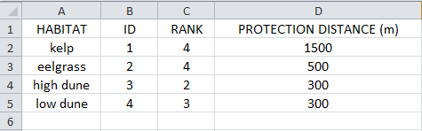

9. **Geomorphology: Shoreline Type (optional).**  This input is used to compute the Geomorphology ranking of each shoreline segment (:ref:`table-41`).  It does not have to match the land polyline input used in the Fetch Calculator tool, but must resemble it as closely as possible. Additionally, the polyline shapefile must have a field called "RANK" that identifies the various shoreline type ranks with a number from 1-5.  More information on how to fill in this table is provided in :ref:`cv-appendix-b`.::

     Names: File can be named anything, but no spaces in the name
     File type: polyline shapefile (.shp)
     Sample path: \InVEST\CoastalProtection\Input\Geomorphology_BarkClay.shp

	 
10. **Surge Potential: Continental Shelf (optional).**  This input is a global polygon dataset that depicts the location of the continental margin.  It must intersect with the AOI polygon (input #4).::

     Names: File can be named anything, but no spaces in the name
     File type: polygon shapefile (.shp)
     Sample path:  \InVEST\CoastalProtection\Input\continentalShelf.shp

11. **Sea Level Rise: Polygon Indicating Net Rise or Decrease (optional).** This input must be a polygon delineating regions within the AOI that experience various levels of net sea level change.  It must have a field called "RANK" that orders the net change values according to :ref:`table-41`.  More information on how to create this polygon is provided in the Marine InVEST :ref:`FAQ`, and in :ref:`cv-appendix-b`.::

     Name: File can be named anything, but no spaces in the name
     File type: polygon shapefile (.shp)
     Sample path: \InVEST\CoastalProtection\Input\SeaLevRise_WCVI.shp

.. _cv-Runmodel:

Running the model
=================

Setting up workspace and input folders
--------------------------------------

These folders will hold all input, intermediate and output data for the model. As with all folders for ArcGIS, these folder names must not contain any spaces or symbols.  See the sample data for an example.

.. note:: The word *'path'* means to navigate or drill down into a folder structure using the Open Folder dialog window that is used to select GIS layers or Excel worksheets for model input data or parameters. 

Exploring a project workspace and input data folder
^^^^^^^^^^^^^^^^^^^^^^^^^^^^^^^^^^^^^^^^^^^^^^^^^^^

The */InVEST/CoastalProtection* folder holds the main working folder for the model and all other associated folders. Within the *CoastalProtection* folder there will be a subfolder named *'Input'*. This folder holds most of the GIS and tabular data needed to setup and run the model.

The following image shows the sample input (on the left) and base data (on the right) folder structures and accompanying GIS data.  It is recommend that this folder structure is used as a guide to organize workspaces and data. Refer to the screenshots below for examples of folder structure and data organization.

+----------------------------------------------------------+----------------------------------------------------------+-+
| .. image:: ./coastal_vulnerability_images/cpdataorgA.png | .. image:: ./coastal_vulnerability_images/cpdataorgB.png | |
+----------------------------------------------------------+----------------------------------------------------------+-+

Creating a run of the model
---------------------------

The following example of setting up the Coastal Vulnerability (Tier 0) model uses the sample data provided with the InVEST download. The instructions and screenshots refer to the sample data and folder structure supplied within the InVEST installation package. It is expected that users will have location-specific data to use in place of the sample data. These instructions provide only a guideline on how to specify to ArcGIS the various types of data needed and does not represent any site-specific model parameters. See the :ref:`cv-data-needs` section for a more complete description of the data specified below.

1. Click the plus symbol next to the InVEST toolbox.

.. figure:: ./shared_images/investtoolbox.png
   :align: center
   :figwidth: 500px

2. Expand the Marine, Coastal Protection, and Tier 0 toolsets.  There are two scripts that you will have to run in succession: Fetch Calculator and Vulnerability Index.  Click on the Fetch Calculator script to open that model. For a refresher on the meaning of the different variables, please see :ref:`cv-Fetch`.

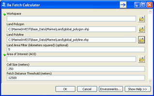

3. Specify the Workspace. Click on the Open Folder button |openfold| and path to the *InVEST/CoastalProtection* folder. If a workspace folder has already been created (Step 2 in :ref:`cv-Fetch`), then select it here.

   Click on the *CoastalProtection* folder and click on |addbutt| to set the main model workspace.  This is the folder in which the intermediate and final outputs will be stored when the model is run.

4. Specify the Land Polygon. The model requires a land polygon shapefile to define the shoreline for the analysis. A default path to the global sample data is supplied in the model window for users.

5. Specify the Land Polyline. The model requires a land polyline shapefile to define the shoreline for the analysis. A default path to the global sample data is supplied in the model window for users.

6. Specify the Land Area Filter (Optional).  If users select this option, the model requires a land area filter parameter. The default value is given as 5 square kilometers. Users can change this value by directly typing another value into the text box.

7. Specify the Area of Interest (AOI). The model requires an AOI, which is the geographic area over which the model will be run. This example refers to the *AOI_BarkClay.shp* shapefile supplied in the sample data. Users can create an AOI shapefile by following the Creating an AOI instructions in the :ref:`FAQ` section.

   Open |openfold| the *InVEST/CoastalProtection/Input* data folder. Select the AOI_BarkClay.shp shapefile and click |addbutt| to make the selection.

8. Specify the Cell Size. The model requires a cell size for the raster analysis. The default cell size is 250 meters. Users may change this value by entering a new value (250 meters is the minimum) directly into the text box.

9. Specify the Fetch Distance Threshold.  The model requires a fetch distance threshold to separate sheltered and exposed areas.  The default value is 12,500 meters.  Users may change this value by entering a new value directly into the text box.

10. At this point the Fetch Calculator model dialog box is complete and ready to run.  As one final check, make sure that the Extent in the Environment settings (bottom right button on the interface) is set to "Default".  The Fetch Calculator may not run properly if the extent is set to an area outside the AOI input.

    Click |okbutt| to start the model run. The model will begin to run and a show a progress window with progress information about each step in the analysis. Once the model finishes, the progress window will show all the completed steps and the amount of time that has elapsed during the model run.

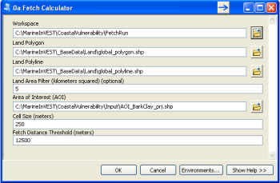

.. figure:: ./coastal_vulnerability_images/cpFetchcompleted350.png
   :align: center
   :figwidth: 678px

11. Now that the area of interest has been segmented, all fetch distances have been computed and the shoreline segments have been separated between exposed and sheltered regions, users can run the Coastal Vulnerability model. Click on the Coastal Vulnerability script to open this model.

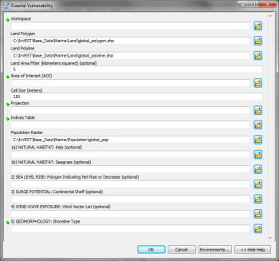

12. Specify the Workspace. Click on the Open Folder button |openfold| and path to the *InVEST/CoastalProtection* folder.  Inside this folder, create a separate folder directory such as "CV" (for Coastal Vulnerability), then select it here.  Click on |addbutt| to set the Vulnerability Index model workspace. This is the folder in which the intermediate and final outputs for the model run will be stored.

13. Specify the Fetch Calculator Model Run's Workspace. Navigate to the Workspace that was specified in Step 3 above.  This folder contains various output folders and files generated by the fetch calculator.

14. Specify the Global Population Raster (Optional). This is a global population raster with population assigned to each cell value. This default raster will automatically be applied in the model window. Otherwise, click |openfold| and path to the *InVEST/Base_Data/Marine/Population* folder. Select the *global_pop* raster and click |addbutt| to make the selection. If users have a superior raster, they are instructed to select the location of this data on their local computer.

15. Specify the Wind-Wave Exposure shapefile.  The model requires wind and wave statistics to create the wind and wave exposure variables.  To include the default wind and wave input values, click |openfold| and path to the *InVEST/CoastalProtection/Input* data folder. Select the *WaveWatchIII.shp* shapefile and click |addbutt| to make the selection.  See the :ref:`cv-data-needs` section for details on preparing a shapefile from another data source.

16. Specify the Average Depth of the water body in the AOI to be incorporated into Wave Exposure calculations.  It is assumed that this average depth is representative of the water depth for the **whole** Area of Interest (AOI), and will be used to estimate wave height and associated period, for each of the 16 fetch angular sectors.  By default the model assumes an average depth of 500 meters.  However, if the water body in the AOI is a bay, lake or other estuary, enter its average depth value.

17. Specify the Relief Digital Elevation Model (DEM) raster.  The model requires a DEM raster file to estimate average elevation landward of the coastal segment.  Click |openfold| and path to the *InVEST/Base_Data/Marine/DEMs* data folder. Select the *claybark_dem* raster and click |addbutt| to make the selection.

18. Specify the Natural Habitat directory (optional). The model can use optional polygon shapefiles that represent the location of various habitats. Click |openfold| and path to the *InVEST/CoastalProtection/Input* data folder. Select the *NaturalHabitat* folder and click |addbutt| to make the selection.

19. Specify the Natural Habitat CSV table (optional).  If the above input for natural habitat directory is specified, the model requires this table of habitat ranks and protective distance stored in a CSV. See the :ref:`cv-data-needs` section for more information on creating and formatting this table.  A sample CSV will is supplied.

    Click |openfold| and path to the *InVEST/CoastalProtection/Input* data folder. Double left-click on the file *NaturalHabitat_WCVI.csv*.

    Click |addbutt| to make the selection.

20. Specify the Geomorphology layer (optional). The model can use an optional polyline shapefile that represents shoreline geomorphology. Click |openfold| and path to the *InVEST/CoastalProtection/Input* data folder. Select the *Geomorphology_BarkClay.shp* shapefile and click |addbutt| to make the selection.

21. Specify the Surge Potential layer (optional). To represent surge potential, the model uses a continental shelf polygon shapefile. Click |openfold| and path to the *InVEST/CoastalProtection/Input* data folder. Select the *continentalShelf.shp* shapefile and click |addbutt| to make the selection.

22. Specify the Sea Level Rise layer (optional). The model can use an optional polygon shapefile that represents sea level rise potential. Click |openfold| and path to the *InVEST/CoastalProtection/Input* data folder. Select the *SeaLevRise_WCVI.shp* shapefile and click |addbutt| to make the selection.

23. At this point the model dialog box is completed for a complete run (with all optional data for full exposure analysis) of the Coastal Vulnerability model.

    Click |okbutt| to start the model run. The model will begin to run and a show a progress window with progress information about each step in the analysis. Once the model finishes, the progress window will show all the completed steps and the amount of time that has elapsed during the model run.

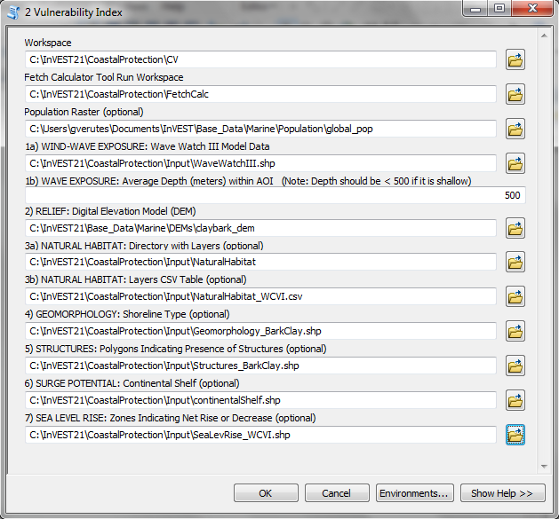

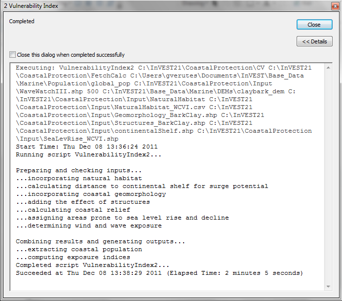

 
Viewing output from the model
-----------------------------

Upon successful completion of the model, two new folders called "intermediate" and "Output" will be created in each of the sub-models (Fetch Calculator and Vulnerability Index) workspaces.  The main outputs that are useful for further analysis are the Vulnerability Index output. The remainder of this guide will concentrate on these outputs. The Coastal Vulnerability Output folder contains several types of spatial data, each of which are described in the :ref:`cv-interpreting-results` section.

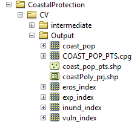

To view the output spatial data in ArcMap (from either the Intermediate or Output folders) click the Add Data button |adddata| and select the four files highlighted in the figure below.

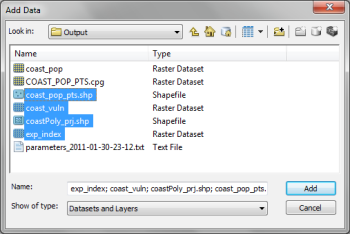

To navigate between the different fields contained in the "exp_index" output, or to change the symbology of a layer, double-click, or right-click on the layer name in the table of contents, select "Properties", and then "Symbology".

+---------------------------------------------------------------+--------------------------------------------------------------------+-+
| .. image:: ./coastal_vulnerability_images/cplayersmenu200.png | .. image:: ./coastal_vulnerability_images/cplayerproperties300.png | |
+---------------------------------------------------------------+--------------------------------------------------------------------+-+

There users will find various options to change the way the data appear in the map.  In the example below, we chose to plot the vulnerability index, and flipped the color legend so that red segments have the highest rank. If users decide to use one of ArcGIS classification schemes to represent their output, it is recommend that they use the *quantile* classification to plot output by quantiles. To accentuate segment colors and increase their thickness, click the "Display" tab in "Layer Properties", and choose "Resample during display using" "Majority (for discrete data)". To navigate quickly between maps of output fields in the "exp_index" raster, it is recommend that users copy and paste the "exp_index" layer in the workspace and plot the output layer that they are interested in.

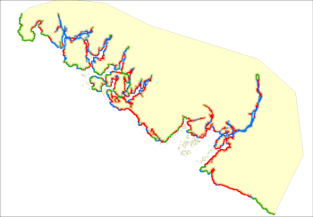

Finally, to generate a different map of outputs based on any other preferred relationship than the one presented in Equation :eq:`VulInd` (see Gornitz (1990) for examples of other ways of computing the exposure index),  creating a new field in the Attribute Table is recommended:

+-------------------------------------------------------------------+---------------------------------------------------------------+-+
| .. image:: ./coastal_vulnerability_images/cplayersmenuopen200.png | .. image:: ./coastal_vulnerability_images/cpattributes350.png | |
+-------------------------------------------------------------------+---------------------------------------------------------------+-+

Once the new field is created, it can be named "New_Index" (for example).  After it is created, users can manipulate the various fields in any way they wish using the field calculator:

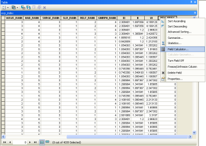

It is encouraged that users view as many fields in the outputs as necessary to develop an understanding of how the values of the different variables used to compute the exposure index change along the Area of Interest, and to view the optional outputs described in the :ref:`cv-interpreting-results` section.

.. _cv-interpreting-results:

Interpreting results
====================

Model outputs
-------------

The following is a short description of each of the outputs from the Coastal Vulnerability model.  Each of these output files is saved in the "Output" folder that is located within the workspace directory that was specified:

Output folder
^^^^^^^^^^^^^

+ Output\\exp_index

  + This raster layer contains important statistics used to determine coastal exposure.
  + The raster contains a variety of fields, including:

    + FFILT - coastline segments with low (0) and high (1) exposure based on the number of fetch directions exceeding the distance threshold.  This output is also present in the Fetch Filter output folder.
    + WIND_RANK -  ranking (1-5) for the wind exposure component of the index
    + WAVE_RANK - ranking (1-5) for the wave exposure component of the index
+  Various habitat abbreviations (e.g. KELP1SH_RC) - rankings for individual habitats before combining into a single habitat rank (HAB_RANK)
    + SURGE_RANK - ranking (0-5) for the surge potential component of the index
    + SLR_RANK - expected sea level rise rankings
    + RELF_RANK - ranking (0-5) for the relief component of the index
    + GEOMORPH_RANK - ranking (0-5) for the geomorphology component of the index
+  HAB_RANK - combined impact of all vegetation inputs
    + EI - the erosion index (see :ref:`cv-Model` section)
    + VI - the vulnerability index (see :ref:`cv-Model` section)

+ Output\\vuln_index

  + This raster layer contains only values from the VI field of output #1 described above and is automatically symbolized when added to ArcMap.

+ Output\\eros_index

  + This raster layer contains only values from the EI field of output #1 above and is automatically symbolized when added to ArcMap.

+ Output\\coast_pop

  + This raster layer depicts population extracted from the global population input layer, but only for areas along the coast, which are within the AOI.
  + The values this dataset represents are the number of people within each grid cell.  Users determine the size of the grid cells.

+ Output\\coast_pop_pts.shp

  + The point feature layer contains points along the coastline only where people live.
  + This layer can easily be symbolized by importing the symbology from the file \\InVEST\\CoastalProtection\\Input\\coast_pop_pts.lyr

+ Output\\coastPoly_prj.shp

  + This polygon feature layer displays the clipped landmass within the AOI and is projected based on the projection specified by the user.
  + This layer is most useful when added to ArcMap and moved below all other output layers in the ordering hierarchy.

Intermediate folder
^^^^^^^^^^^^^^^^^^^

+ intermediate\\nat_hab

  + This is a folder containing various intermediate rasters for determining natural habitat's reach in terms of coastal protection.  The reach distance of the vegetation and other natural habitat is set in the indices table (input #4).

+ intermediate\\fetch_cmb2

  + This intermediate raster layer is a copy of the output from the Fetch Calculator tool and contains the various calculations performed by the model to eventually rank the various bio-geophysical variables.  It also includes the fetch distance calculations in the 16 equiangular direction for each coastline segment.

+ intermediate\\ [various variable ranks] (e.g. "wind_rank")

  + These intermediate raster layers represent values of the various variable ranks of which the two indices (VI and EI) incorporate.

Parameter log
-------------

Each time the module is run a text file will appear in the workspace folder. The file will list the parameter values for that run and be named according to the service and the date and time.

.. _cv-appendix-a:

Appendix A
==========

In this appendix, definitions for the terms presented in the geomorphic classification in :ref:`table-41` are presented.  Some of these are from Gornitz et al. (1997) and USACE (2002). Photos of some of the geomorphic classes that are presented can be found at the National Oceanic and Atmospheric Administration's `Ocean Service Office of Response and Restoration website <http://response.restoration.noaa.gov/gallery_gallery.php?RECORD_KEY%28gallery_index%29=joinphotogal_id,gallery_id,photo_id&joinphotogal_id%28gallery_index%29=86&gallery_id%28gallery_index%29=4&photo_id%28gallery_index%29=35>`_.

Alluvial Plain
  A plain bordering a river, formed by the deposition of material eroded from areas of higher elevation.

Barrier Beach
  Narrow strip of beach with a single ridge and often foredunes.  In its most general sense, a barrier refers to accumulations of sand or gravel lying above high tide along a coast.  It may be partially or fully detached from the mainland.

Beach
  A beach is generally made up of sand, cobbles, or boulders and is defined as the portion of the coastal area that is directly affected by wave action and that is terminated inland by a sea cliff, a dune field, or the presence of permanent vegetation.

Bluff
  A high, steep backshore or cliff

Cliffed Coasts
  Coasts with cliffs and other abrupt changes in slope at the ocean-land interface. Cliffs indicate marine erosion and imply that the sediment supply of the given coastal segment is low. The cliff's height depends upon the topography of the hinterland, lithology of the area, and climate.

Delta
  Accumulations of fine-grained sedimentary deposits at the mouth of a river. The sediment is accumulating faster than wave erosion and subsidence can remove it.  These are associated with mud flats and salt marshes.

Estuary Coast
  The tidal mouth of a river or submerged river valley.  Often defined to include any semi-enclosed coastal body of water diluted by freshwater, thus includes most bays.  The estuaries are subjected to tidal influences with sedimentation rates and tidal ranges such that deltaic accumulations are absent. Also, estuaries are associated with relatively low-lying hinterlands, mud flats, and salt marshes.

Fiard
  Glacially eroded inlet located on low-lying rocky coasts (other terms used include sea inlets, fjardur, and firth).

Fjord
  A narrow, deep, steep-walled inlet of the sea, usually formed by the entrance of the sea into a deep glacial trough.

Glacial Drift
  A collective term which includes a wide range of sediments deposited during the ice age by glaciers, melt-water streams and wind action.

Indented Coast
  Rocky coast with headland and bays that is the result of differential erosion of rocks of different erodability.

Lagoon
  A shallow water body separated from the open sea by sand islands (e.g., barrier islands) or coral reefs.

Mud Flat
  A level area of fine silt and clay along a shore alternately covered or uncovered by the tide or covered by shallow water.

.. _cv-appendix-b:

Appendix B
==========

The model requires large-scale geo-physical, biological, atmospheric, and population data.  Most of this information can be gathered from past surveys, meteorological and oceanographic devices, and default databases provided with the model.  In this section, various sources for the different data layers that are required by the model are proposed, and methods to fill out the input interface discussed in the :ref:`cv-data-needs` section are described. It is recommend that users import all the required and optional data layers before attempting to run the model.  Familiarity with data layers will facilitate the preparation of data inputs.

Population data
---------------

To assess the population residing near any segment of coastline, population data from the Global Rural-Urban Mapping Project (`GRUMP <http://sedac.ciesin.columbia.edu/gpw>`_) is used.  This dataset contains global estimates of human populations in the year 2000 in 30 arc-second (1km) grid cells.  User are encouraged to use their own, more detailed and/or recent census data, and it is encouraged that recent fine-scale population maps are used, even in paper form, to aid in the interpretation of the Exposure Index map.

Geo-physical data layer
-----------------------

To estimate the Exposure Index of the AOI, the model requires an outline of the coastal region.  As mentioned in the :ref:`cv-data-needs` Section, we provide a default global land mass polygon file.  This default dataset, provided by the U.S. National Oceanic and Atmospheric Administration (NOAA) is named GSHHS, or a Global Self-consistent, Hierarchical, High-resolution Shoreline (for more information, visit http://www.ngdc.noaa.gov/mgg/shorelines/gshhs.html).  It should be sufficient to represent the outline of most coastal regions of the world.  However, if this outline is not sufficient, we encourage that users substitute it with another layer.

To compute the Geomorphology ranking, users must provide a geomorphology layer (:ref:`cv-data-needs` Section, input 15) and an associated geomorphic classification map.  This map should provide the location and type of geomorphic features that are located in the coastal area of interest.  In some parts of the west-coast of the United States and Canada, such a map can be built from a database called `Shorezone <http://www.geobc.gov.bc.ca>`_.  For other parts of the United States, users can consult the `Environmental Sensitivity Index website <http://www.researchplanning.com/services/envir/esi.html>`_. If such a database is not available, it is recommend that a database from site surveys information, aerial photos, geologic maps, or satellites images (using Google or Bing Maps, for example) is built. State, county, or other local GIS departments may have these data, freely available, as well.

In addition to the geomorphology layer, users must have a field in it's attribute table called "RANK".  This is used by the model to assign a geomorphology exposure ranking based on the different geomorphic classes identified.  Assign the exposure ranks based on the classification presented in :ref:`table-41`. All ranks should be numeric from 1 to 5.

Habitat data layer
------------------

The natural habitat maps (inputs 7 and 8 in the :ref:`cv-data-needs` Section) should provide information about the location and types of coastal habitats described in :ref:`table-41`.  The subtidal layers in that directory have been built from a database called `Shorezone <http://www.geobc.gov.bc.ca>`_.  Dune data from unpublished an dataset provided by Raincoast Applied Ecology was obtained.  If such a database is not available, it is recommend building it from site surveys information, aerial photos, or even satellites images (using Google or Bing Maps, for example).

The Natural Habitat CSV table input asks users to provide information about the type of habitats layers that users have in the "NaturalHabitat" folder.  The different columns in that table are:

#.	HABITAT: The name of the natural habitat for which users have a layer (e.g., kelp or eelgrass)

#.	ID: The ID number associated with the name of these habitats: the underscored integer number X listed at the end of the name of the different layers that have been created, as in "eelgrass_2".  Note that this ID number is what the model uses to associate a rank and protection distance to the name users input in the first column.  In other words, the name in column 1 can be different from the name of your file, but the ID number should match.  For example, in the default natural habitat layers directory that has been provided, the eelgrass layer has the ID = 2 (e.g. eelgrass_2).  Since the ID in the second column is 2, then the model recognizes that the rank and protection distance values that are defined for "eelgrass" apply to the eelgrass_2.shp layer.

#.	RANK: The vulnerability rank associated with the natural habitat that is listed in column 1. It is recommend that the ranking system provided in :ref:`table-41` is used.  However, if users would like to evaluate how the vulnerability index values changes in the absence of the habitats listed in the table, users should change the RANK to a 5.  For example, to evaluate how the vulnerability of an area changes if high sand dunes are removed, users can change the RANK value for high sand dunes from a 2 to a 5.

#.	PROTECTIVE DISTANCE (m): The model determines the presence or absence of various natural habitats that users specified in the AOI by estimating the fetch distance over the 16 equiangular segments between the location of the natural habitats and the shoreline.  If there is a non-zero fetch distance between a patch of natural habitat and a shoreline segment, the model recognizes that the patch fronts that segment.  To assign a natural habitat ranking to that segmentm which takes into account the beneficial effect of the presence of this habitat, it is askes that users input a maximum distance of influence into the Natural Habitat CSV table (input 8).  It is assumed that natural habitats that are fronting a segment but are further away from the segment than the distance that is defined by the user will not have a beneficial effect on the stability of that segment, and will not be counted in the natural habitat ranking for that segment.

To estimate this distance, it is recommend that users load the various habitat layers located in their "Natural Habitats" folder as well as the polygon layer representing the area of interest.  Then, using the ArcGIS "distance" tool, measure the distance between the shoreline and natural habitats that you judge to be close enough to have an effect on nearshore coastal processes.  It is best to take multiple measurements and develop a sense of an average acceptable distance that can serve as input.  Please keep in mind that this distance is reflective of the local bathymetry conditions (a seagrass bed can extend for kilometers seaward in shallow nearshore regions), but also of the quality of the spatial referencing of the input layer.  The example below gives an example of such measurement when seagrass beds are considered (green patches).

As mentioned in :ref:`cv-NatHab`, the model computes the natural habitat exposure ranking for a shoreline segment using the following equation:

.. math:: R_{Hab}=4.8-0.5 \sqrt{ (1.5 \max_{k=1}^N (5-R_k ) )^2 + (\sum_{k=1}^N (5-R_k)^2 - \max_{k=1}^N (5-R_k)) ^2 )}

This equation is applied to various possible combinations of natural habitats, and the results of this exercise are presented in the table and figure below:

.. figure:: ./coastal_vulnerability_images/NatHabRankTable.png
   :align: center
   :figwidth: 500px

.. figure:: ./coastal_vulnerability_images/ NatHabRankFig.png
   :align: center
   :figwidth: 500px

Wind data
---------

To estimate the importance of wind exposure and wind-generated waves, wind statistics measured in the vicinity of the AOI are required.  From at least 5 years of data, the model requires the average in each of the 16 equiangular sectors (0deg, 22.5deg, etc.) of the wind speeds in the 90th percentile or greater observed near the segment of interest to compute the REI.  In other words, for computation of the REI, sort wind speed time series in descending order, and take the highest 10% values, and associated direction.  Sort this sub-series by direction: all wind speeds that have a direction centered around each of the 16 equiangular sectors are assigned to that sector.  Then take the average of the wind speeds in each sector.  If there is no record of time series in a particular sector because only weak winds blow from that direction, then average wind speed in that sector is assigned a value of zero (0).  Please note that, in the model, wind direction is the direction winds are blowing FROM, and not TOWARDS.

For the computation of wave power from wind and fetch characteristics, the model requires the average of the wind speeds greater than or equal to the 90th percentile observed in each of the 16 equiangular sectors (0deg, 22.5deg, etc.).  In other words, for computation of wave power from fetch and wind, sort the time series of observed wind speed by direction: all wind speeds that have a direction centered on each of the 16 equiangular sectors are assigned to that sector.  Then, for each sector, take the average of the highest 10% observed values.  Again, please note that, in our model, wind direction is the direction winds are blowing FROM, and not TOWARDS.

If users would like to provide their own wind and wave statistics, instead of relying on WW3 data, the must enter the data in the following order:

#.	Column 1-2: Placeholder. No information required.

#.	Columns 3-4: LAT, LONG values.  These values indicate the latitude and longitude of the grid points that will be used to assign wind and wave information to the different shoreline segments.

#.	Columns 5-20: REI_VX, where X=[0,22,45,67,90,112,135,157,180,202,225,247,270,292,315,337] (e.g., REI_V0). These wind speed values are computed to estimate the REI of each shoreline segment.  These values are the average of the highest 10% wind speeds that were allocated to the 16 equiangular sectors centered on the angles listed above.

#.	Columns 21 to 36: REI_PCTVX, where X has the same values as listed above. These 16 percent values (which sum to 1 when added together) correspond to the proportion of the highest 10% wind speeds which are centered on the main sector direction X listed above.

#.	Columns 37 to 52: V10PCT_X, where X has the same values as listed above. These variables are used to estimate wave power from fetch.  They correspond to the average of the highest 10% wind speeds that are centered on the main sector direction X.

#.	Column 53 to 68:  WavP_X, where X has the same values as listed above. These variables are used to estimate wave exposure for sites that are directly exposed to the open ocean.  They were computed from WW3 data by first estimating the wave power for all waves in the record, then splitting these wave power values into the 16 fetch sectors defined earlier.  For each sector, we then computed WavP by taking the average of the top 10% values (see Section :ref:`cv-Model`).

#.	Column 69 to 84:  WavPPCTX, where X has the same values as listed above.  These variables are used in combination with WavP_X to estimate wave exposure for sites that are directly exposed to the open ocean.  They correspond to the proportion of the highest 10% wave power values which are centered on the main sector direction X (see Section :ref:`cv-Model`).

If users decide to create a similar layer, it is recommend that they create it in Microsoft Excel, and add the sheet in the "Layer" menu.  To plot the data, right-click on the sheet name, and choose "Display XY Data".  Choose to display the X and Y fields as "LONG" and "LAT", respectively.  If users are satisfied with the result, right-click on the layer, choose "Export Data" and convert this temporary "Events Layer" into a point shapefile that can now be called when running the Coastal Vulnerability model.  Finally, make sure it has a WGS84 datum.

As described in :ref:`cv-Model` section :ref:`cv-winds`, the model provides an optional map of areas that are exposed or sheltered.  This is purely based on fetch distances, and does not take into account measurements of wind speeds. To prepare this map, the model uses an estimate of a fetch distance cutoff to use that the user has defined, based on the AOI under consideration.  To provide that distance, it is recommend that the "distance tool" on the global polygon layer, zoomed into the AOI, is used to determine that distance.

Sea level change
----------------

As mentioned earlier, a map of net rates of sea level rise or decrease in the AOI can be added. Such information can be found in reports or publications on Sea Level Change or Sea Level Rise in the region of interest.  Otherwise, it is suggested that users generate such information from tide gage measurements, or based on values obtained for nearby regions that are assumed to behave in a similar way.  A good global source of data for tide gage measurements to be used in the context of sea level rise is the `Permanent Service for Sea Level <http://www.psmsl.org/>`_.  This site has corrected, and sometimes uncorrected, data on sea-level variation for many locations around the world.  From the tide gage measurements provided by this website, it is suggested that users estimate the rate of sea level variation by fitting these observations to a linear regression, as shown in the figure below.  This figure was extracted from Bornhold (2008).

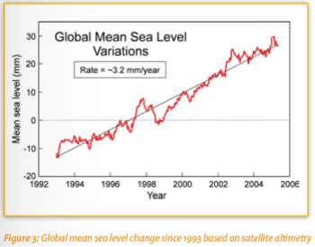

Create a sea level change GIS layer
^^^^^^^^^^^^^^^^^^^^^^^^^^^^^^^^^^^

Users can create their own polygon to represent the sea level change input to the model.  To create the feature class, the map window must be in "data view" mode.  Select the "Drawing" drop-down option and begin creating a polygon similar to the black feature below.  Double click to complete the polygon. Next, click "Drawing >> Convert Graphics to Features..."  Specify the path of the output shapefile or feature class and a name that will clearly designate the extent.  Finally, check the box: "Automatically delete graphics after conversion" and click "OK".  Once all polygons for specific regions are created, you must create an attribute field called "RANK" and populate it with either a value of 1, 3, or 5 indicating the net change values according to :ref:`table-41`.  For more information on how to create a Sea Level Change layer, see the :ref:`FAQ`.

Surge potential
---------------

Surge potential is estimated as the distance between a shoreline segment and the edge of the continental shelf, or any other depth contour of interest.  This output is computed using a method that does not take into account the presence of land barriers between a shoreline segment and the depth contour.

When creating an AOI, loading the global polygon layer and the continental shelf (or other preferred depth contour, input 11) as guides is recommend.  Draw the AOI so that it overlaps the portion of coastline you want to include in your analysis.  Additionally, if you want to include the surge potential variable make sure the AOI overlaps at least a portion of the shelf's closest edge to the coastline.   This is necessary so that the model can properly calculate the distance to shelf.

References
==========
Bornhold, B.D., 2008, Projected sea level changes for British Columbia in the 21st century, report for the BC Ministry of Environment.

Bush, D.M.; Neal, W.J.; Young, R.S., and Pilkey, O.H. (1999). Utilization of geoindicators for rapid assessment of coastal-hazard risk and mitigation. Oc. and Coast. Manag., 42.

Center for International Earth Science Information Network (CIESIN), Columbia University; and Centro Internacional de Agricultura Tropical (CIAT) (2005). Gridded Population of the World Version 3 (GPWv3). Palisades, NY: Socioeconomic Data and Applications Center (SEDAC), Columbia University.

Cooper J., and McLaughlin S. (1998). Contemporary multidisciplinary approaches to coastal classification and environmental risk analysis. J. Coastal Res. 14(2):512-524

Finlayson, D. 2005, fetch program, USGS. Accessed February 2010, from http://sites.google.com/site/davidpfinlayson/Home/programming/fetch

Gornitz, V. (1990). Vulnerability of the east coast, U.S.A. to future sea level rise. JCR, 9.

Gornitz, V. M., Beaty, T.W., and R.C. Daniels (1997).  A coastal hazards database for the U.S. West Coast. ORNL/CDIAC-81, NDP-043C: Oak Ridge National Laboratory, Oak Ridge, Tennessee.

Hammar-Klose and Thieler, E.R. (2001). Coastal Vulnerability to Sea-Level Rise: A Preliminary Database for the U.S. Atlantic, Pacific, and Gulf of Mexico Coasts. U.S. Geological Survey, Digital Data Series DDS-68, 1 CD-ROM

Irish, J.L., and Resio, D.T., "A hydrodynamics-based surge scale for hurricanes," Ocean Eng., Vol. 37(1), 69-81, 2010.

Keddy, P. A. (1982). Quantifying within-lake gradients of wave energy: Interrelationships of wave energy, substrate particle size, and shoreline plants in Axe Lake, Ontario. Aquatic Botany 14, 41-58.

Short AD, Hesp PA (1982).  Wave, beach and dune interactions in south eastern Australia. Mar Geol 48:259-284

Tolman, H.L. (2009). User manual and system documentation of WAVEWATCH III version 3.14, Technical Note, U. S. Department of Commerce Nat. Oceanic and Atmosph. Admin., Nat. Weather Service, Nat. Centers for Environmental Pred., Camp Springs, MD.

U.S. Army Corps of Engineers (USACE). 2002. U.S. Army Corps of Engineers Coastal Engineering Manual (CEM) EM 1110-2-1100 Vicksburg, Mississippi.

Wessel, P., and W. H. F. Smith (1996).  A Global Self-consistent, Hierarchical, High-resolution Shoreline Database, J. Geophys. Res., 101, #B4, pp. 8741-8743.

World Resources Institute (WRI) (2009). "Value of Coral Reefs & Mangroves in the Caribbean, Economic Valuation Methodology V3.0".
