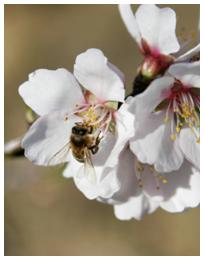
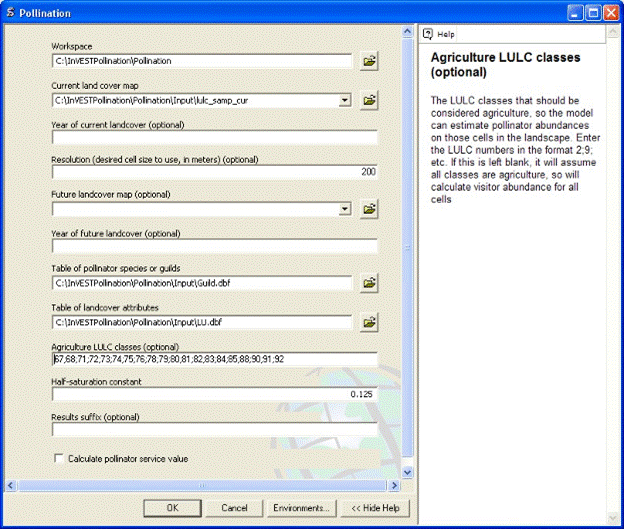

.. _croppollination:

.. |addbutt| image:: ./shared_images/adddata.png
             :alt: add
	     :align: middle 
	     :height: 15px

.. |toolbox| image:: ./shared_images/toolbox.jpg
             :alt: toolbox
	     :align: middle 
	     :height: 15px

****************
Crop Pollination
****************

Summary
=======

Seventy-five percent of globally important crops rely either in part or completely on animal pollination. The InVEST pollination model focuses on wild bees as a key animal pollinator. It uses estimates of the availability of nest sites and floral resources and bee flight ranges to derive an index of bee abundance nesting on each cell on a landscape (i.e., pollinator supply). It then uses flight range information to estimate an index of bee abundance visiting each agricultural cell.  If desired, the model then calculates a simple index of the value of these bees to agricultural production, and attributes this value back to source cells. The results can be used to optimize agriculture and conservation investments. Required inputs include a current land use and land cover map, land cover attributes, species of pollinators present, and their flight ranges. The model's limitations include exclusion of non-farm habitats that may determine pollinator abundance and of the effects of land parcel size. The model also does not account for managed pollinators and pollinator persistence over time.

Introduction
============

Crop pollination by bees and other animals is a potentially valuable ecosystem service in many landscapes of mixed agricultural and natural habitats (Allen-Wardell et al. 1998, Free 1993).  Pollination can increase the yield, quality, and stability of fruit and seed crops as diverse as tomato, canola, watermelon, coffee, sunflower, almond, and cacao. Indeed, Klein et al. (2007) found that 87 of 115 globally important crops benefit from animal pollination, a service valued variously in the billions to tens of billions per year globally (Costanza et al. 1997, Losey and Vaughan 2006, Nabhan and Buchmann 1997, Southwick and Southwick 1992).

Despite these numbers, it is important to realize that not all crops need animal pollination. Some crop plants are wind (e.g., staple grains such as rice, corn, wheat) or self pollinated (e.g., lentils and other beans), needing no animal pollinators to successfully produce fruits or seeds. Klein et al. (2007) provides a list of crops and their pollination requirements that can help identify whether crops in a region of interest may benefit from wild animal pollinators.

Decision-makers can use information on crop pollinators, their abundance across a landscape, and the pollination services they provide to crops in several ways. First, with maps of pollinator abundance and crops that need them, land use planners could predict consequences of different policies on pollination services and income to farmers (for an example, see Priess et al. 2007). Second, farmers could use these maps to locate crops intelligently, given their pollination requirements and predictions of pollinator availability. Third, conservation organizations or land trusts could use the tool to optimize conservation investments that benefit both biodiversity and farmers. Finally, governments or others proposing payment schemes for environmental services could use the results to estimate who should pay whom, and how much.

The Model
=========

A wide range of animals can be important pollinators (e.g., birds, bats, moths and flies), but bees are the most important group for most crops (Free 1993). As a result, the InVEST Pollination model focuses on the resource needs and flight behaviors of wild bees. Many people think of honeybees, managed in artificial hives, when they think of pollinators, but wild bees also contribute to crop pollination. In fact, for several important crops (e.g., blueberries), native species are more efficient and effective pollinators than honeybees (Cane 1997). These native bees, in addition to feral honeybees living in the wild, can benefit crops without active management of captive hives. This is the pollination service associated with habitat conservation.

For bees to persist on a landscape, they need two things: suitable places to nest, and sufficient food (provided by flowers) near their nesting sites. If provided these resources, pollinators are available to fly to nearby crops and pollinate them as they collect nectar and pollen. The model therefore uses information on the availability of nesting sites and flower resources, as well as flight ranges of bees, to map an index of bee abundance across the landscape. In a second step, the model uses this map and bee flight ranges again to predict an index of the number of pollinators likely visiting crops in each agricultural cell on the landscape.  If you opt to also estimate value indices, the model then takes a third and fourth step.  In the third step, it uses a simplified yield function to translate bee abundance into crop value on each agricultural cell.  And in the fourth step, it attributes these cell values back to cells "supplying" these bees.  These steps are laid out in more detail below, and the full model description can be found in Lonsdorf et al. (in press).

How it works
------------

The model is based on a land use and land cover (LULC) map, showing both natural and managed land types. This map is divided into a regular grid of square cells, each of which is assigned a single LULC type. For each type, the model requires estimates of both nesting site availability and flower availability (e.g., for bee food: nectar and pollen). These data can be supplied from quantitative field estimates or from expert opinion, and are expressed in the form of relative indices (between 0 and 1). Flower availability can be supplied separately for different seasons if important, and the availability of nesting substrates can be estimated separately for multiple nesting guilds (e.g., ground nesters, cavity nesters).

Because bees are proficient flyers, they integrate over several elements of a landscape, moving between nesting habitats and foraging habitats (Ricketts et al. 2006). The distances they typically fly affect both their persistence and the level of service they deliver to farms. The model therefore requires a typical foraging distance for each pollinator species. These data can be supplied from quantitative field estimates (e.g., Roubik and Aluja 1983), proxies such as body size (Greenleaf et al. 2007), or from expert opinion.

Using these data, the model first estimates the abundance index of each pollinator species in every cell in the landscape, based on the available nesting sites in that cell and the flowers (i.e., food) in surrounding cells. Flowers in nearby cells are given more weight than distant cells, according to the species' average foraging range. Since pollinator abundance is limited by both nesting and floral resources, the pollinator abundance for species :math:`\beta` index on cell x, :math:`P_{x\beta}`, is the product of foraging and nesting such that:

.. math:: P_{x\beta} = N_j \frac{\sum^M_{m=1}F_{jm} e^\frac{-D_{mx}}{\alpha_\beta}}{\sum^M_{m=1} e^\frac{-D_{mx}}{\alpha_\beta}}

where :math:`N_j` is the suitability of nesting of LULC type *j*, :math:`F_j` is the relative amount floral resources produced by LULC type j, Dmx is the Euclidean distance between cells m and x and :math:`\alpha_\beta` is the expected foraging distance for the pollinator :math:`\beta` (Greenleaf et al. 2007).

The result is a map of the abundance index (0-1) for each species, which represents a map of "pollinator supply" (i.e., bees available to pollinate crops).  In this sense, this map represents the potential sources of pollination services, but it has not yet incorporated demand. In other words, the landscape may be rich in pollinator abundance, but if there are no bee-pollinated crops on that landscape, those bees will not be providing the service of crop pollination.

To make this connection between areas of "supply" and "demand," the model calculates an abundance index of visiting bees at each agricultural cell, by again using flight ranges of pollinator species to simulate their foraging in nearby cells.  Specifically, it sums pollinator supply values in cells surrounding each agricultural cell, again giving more weight to nearby cells. This sum, created separately for each pollinator species at each agricultural site, is an index of the abundance of bees visiting each farm site (i.e., "farm abundance"). We use the foraging framework described in the previous equation to determine the relative abundance of bees that travel from a single source cell x to forage on a crop in agricultural cell o:

.. math:: P_{ox\beta} = \frac{P_{x\beta}e^\frac{-D_{ox}}{\alpha_\beta}}{\sum^M_{x=1}e^{\frac{-D_{ox}}{\alpha_\beta}}}

where :math:`P_{x\beta}` is the supply of pollinators of species :math:`\beta` on cell x, :math:`D_{ox\beta}` is distance between source cell x and agricultural cell o for that species, and :math:`\alpha_\beta` is species' :math:`\beta` average foraging distance.  The numerator of this equation represents the distance-weighted proportion of the pollinators supplied by cell m that forage within cell o and the numerator is a scalar that normalizes this contribution by the total area within foraging distance (Winfree et al. 2005). The total pollinator abundance on agricultural cell o, Po, is simply the sum over all M cells.  This second map represents the relative degree of pollination service at the demand points, or points at which this service is "delivered": agricultural cells.

The actual economic benefit received from pollination depends on how crops grown in each cell respond to pollinators. The model therefore takes two additional (optional) steps to translate farm abundances of pollinators into indices of expected economic value. In lieu of a more detailed agricultural production function, we use a simple saturating crop yield function, which assumes that yield increases as pollinator visitation increases, but with diminishing returns (Greenleaf and Kremen 2006). Crops vary in their dependence on pollinators; some crop species are self-compatible and yield is less dependent on pollination while other species obligately require pollination to generate any yield (Klein et al. 2007). We account for both observations, and thus calculate the expected yield of a crop c on farm o, :math:`Y_{o\beta}`, as:

.. math:: Y_{o\beta}=1-\nu_c+\nu_c\frac{P_{o\beta}}{P_{o\beta}+\kappa_c}

Where :math:`\kappa_c` represents the proportion of total crop c's yield attributed only to wild pollination (e.g. :math:`\nu_c` would be equal to 1 if a crop is an obligately outcrossing species and equal to 0 if the crop species were wind-pollinated). In the denominator of the third term, :math:`\kappa_c` is a half-saturation constant and represents the abundance of pollinators required to reach 50% of pollinator-dependent yield.

Once the model has calculated value for each agricultural cell, it redistributes this value back to cells that supplied the relevant pollinators, creating a map of value at the source.  First, the model assigns fractions of the cell's value to each of the bee species, according to their partial contribution to total farm abundance.  Then each species' value is redistributed back to the source cells from which they came using the same distance-weighted relationship described above.  Thus source habitats close by provide greater service value than those farther away.  Formally, we calculate pollinator service provided to O farms from each *m* cell, :math:`PS_m`, as:

.. math:: PS_{x\beta} = \nu_o P_{x\beta} \frac{\sum^M_{m=1} \frac{Y_{o\beta m}}{P_{o\beta m}}e^\frac{-D_{mx}}{\alpha_\beta}}{\sum^M_{m=1} e^\frac{-D_{mx}}{\alpha_\beta}}

where :math:`V_o` represents the crop value in farm cell *o*. The result is a map of "pollinator service value" that estimates the relative index of economic value of pollinators for agricultural areas.

If the simple saturating yield function is deemed too simplistic, one may link this pollination model to InVEST's agricultural production model that includes other factors such as fertilizer, irrigation, labor, etc. The integration of these two models will give a more appropriate representation of the multiple inputs to agricultural production.  It will also be possible to more specifically derive the amount of crop yield provided by wild pollinators (yield contribution) and the net present value of that additional yield. See Lonsdorf et al. (2009) and Lonsdorf et al. (in press) for equations that determine the pollinator supply, farm abundance, and pollinator service value maps.

Limitations and simplifications
-------------------------------

The model predicts an abundance index of wild pollinators on agricultural fields (cells) within a landscape, based on the pattern of land cover types and the resources they are estimated to contain for bees.  It also converts this abundance into indices of production value and attributes this value to the source cells for pollinators.  Like other InVEST models, the Pollination model is extremely simple, but it makes reasonably accurate predictions when compared to field observations of pollinators (Lonsdorf et al. 2009). Nevertheless, with this simplicity come several limitations that must be kept in mind.

First, the model predicts only relative patterns of pollinator abundance and pollination value (using indices of 0-1). This is because absolute estimates of nest density, resource availability, and pollinator abundance are rarely available, and yield functions (including pollinator abundance) for many crops are poorly defined.  However, relying on relative indices limits our ability to estimate absolute economic values to better inform land-use planning decision-making, often based on cost-benefit analyses.

This simplicity is perhaps most limiting in calculating indices of value, both on farms and at the source cells of pollinator supply. With field samples of absolute pollinator abundance, one could calibrate InVEST's relative indices to predict actual pollinator abundances. And with specific yield functions, one could use these actual abundances to estimate absolute estimates of economic value. This would require, beyond these additional data, custom modeling steps that InVEST does not offer. InVEST does produce, however, the intermediate results necessary to insert these modeling steps. Furthermore, the logic that increasing pollinator abundance and diversity lead to increased yield is supported by previous research (Greenleaf and Kremen 2006).

One option for overcoming this limitation is to link this model with an agricultural production model (InVEST or another), which will take pollinator abundance as one input to predict and map agricultural yields. In formal terms, it will use pollination as a factor in a "production function" that relates yields of a given crop to the quantity and quality of various inputs (e.g., water, soil fertility, labor, chemicals, pollination). Using these production functions, it is possible to estimate the proportion of crop productivity that is due to pollination, and thus the economic value of those pollinators.

Second, the model does not include the dynamics of bee populations over time, and therefore cannot evaluate whether these populations are sustainable given the current landscape.  Instead, the model simply provides a static snapshot of the number of pollinators on each cell in the landscape, given simple estimates of nesting sites and food resources. Some of the factors that influence bee populations, like habitat disturbances and typical population fluctuations, are not captured.

Third, the model does not account for the sizes of habitat patches in estimating abundance.  For many species, there is a minimum patch size, under which a patch cannot support that species over the long term. There is some evidence that small patches support fewer species of bees (Kremen et al. 2004), but bees can also survive in surprisingly small areas of suitable habitat (Ricketts 2004).

Fourth, pollinators are likely to be influenced by fine-scale features in the landscape, which are difficult to capture in typical land-cover data with typical resolutions of 1km or even 30m. For example, small patches of flower resources in an otherwise hostile habitat for bees can provide important food resources, but will not be detected by typical land cover maps. Some bees are also able to nest in small but suitable areas (a single suitable roadside or tree hollow). Using average values of nesting site or flower availability for each land cover type, along with 30m pixels or larger, will therefore not capture these fine scale but important areas of resources.

Finally, the model does not include managed pollinators, such as honey bees, that are managed in boxed hives and can be moved among fields to pollinate crops. InVEST focuses on the environmental service of pollination by bees living wild in the landscape. Managed pollinators are a technological substitute for this environmental service, much as a water filtration plant is a substitute for purification services by wetlands and other natural systems. Clearly, any natural resource assessment needs to consider the costs and benefits of investments in technology (filtration plants, managed bees) alongside those of investments into natural capital (wetlands, wild bee pollination).

Data needs
==========

The model uses five forms of input data (three are required, and two are optional):

1.	**Current land cover map (required)**. A GIS raster dataset, with a land use and land cover (LULC) code for each cell. The dataset should be projected in meters and the projection should be defined. This coverage must be of fine enough resolution (i.e., sufficiently small cell-size) to capture the movements of bees on a landscape. If bees fly 800 meters on average and cells are 1000 meters across, the model will not fully capture the movement of bees from their nesting sites to neighboring farms.

 *Name:* file can be named anything, but avoid spaces (e.g. use lulc_samp_cur)

 *Format:* standard GIS raster file (e.g., ESRI GRID or IMG), with a column labeled 'value' that designates the LULC class code for each cell (e.g., 1 for forest, 3 for grassland, etc.) The LULC 'value' codes must match LULC class codes used in the Land Attributes table described below.  The table can have additional fields, but the only field used in this analysis is one for LULC class code.

 The model also requests three pieces of information about this LULC map, which are optional but will be prompted for in the interface.

 a. The year depicted by the LULC map (optional). You can indicate the year of the LULC map, if known, to designate model runs performed at different time periods (i.e., future scenarios).

 b. The resolution at which the model should run (optional). You can indicate a coarser resolution than that of the native LULC map to prompt the model to resample at this new resolution and to speed up run time. For example, you could run the model at a 200m resolution with a 30m resolution LULC map. If you leave this line blank, the model will perform the analysis at the same resolution of the native LULC map (i.e., the default). (Note: a resolution that is finer than the native resolution of the raster dataset cannot be defined).

 c. Agricultural land cover and land use classes (optional).  You can specify LULC classes that represent agricultural parcels dependent upon or that benefit from pollination by bees. Doing so will restrict the calculation of pollinator abundance to only the designated farms. Enter the LULC values in the format 2;9;13;etc. If you do not specify agricultural classes then a farm abundance map will be calculated for the entire landscape (the default). Refer to Klein et al. 2007 for a list of crops and their level of pollinator-dependency.

 *Sample data set:*  \\Invest\\Base_Data\\Terrestrial\\lulc_samp_cur

2.	**Table of pollinator species or guilds (required)**. A table containing information on each species or guild of pollinator to be modeled. Guild refers to a group of bee species that show the same nesting behavior, whether preferring to build nests in the ground, in tree cavities, or other habitat features. If multiple species are known to be important pollinators, and if they differ in terms of flight season, nesting requirements, or flight distance, provide data on each separately. If little or no data are available, create a single 'proto-pollinator,' with data taken from average values or expert opinion about the whole pollinator community.

 *Name:* file can be named anything

 *File Type:* ``*``.dbf, Excel worksheets (``*``.xls, .xlsx), or Ms Access tables (``*``.mdb, .accdb).  If using ArcGIS 9.2x then you will need to use .xls or .mdb files.  Excel 2007 (.xlsx) and Ms Access 2007 (.accdb) files will only work with ArcGIS 9.3x.

 *Rows:* each row is a unique species or guild of pollinator.

 *Columns:* columns contain data on each species or guild. Column order doesn't matter, but columns must be named as follows (italicized portions of names can be customized for meaning, but must be consistent with names in other tables):

 a.	*Species*: Name of species or guild (Note: species names can be numerical codes or names. The model will produce outputs coded by the first 4 characters of each species name (e.g., Andr for Andrena nivalis), thus, each species or guild should be uniquely identifiable at 4 characters. If species or guild are not uniqueluely identifiable at 4 characters then the model will truncate the names at 3 and at a digit).

 b.	*NS_nest1*, *NS_nest2*, etc.: Nesting guilds of each pollinator. Values should be entered either as 0 or 1, with 1 indicating a nesting type that is utilized and 0 indicating a non-utilized nest type.  If a pollinator falls within multiple nesting guilds, then indicate 1s for all compatible nest types. Nesting types might be ground nests, tree cavities, etc.

 c.	*FS_season1*, *FS_season2*, etc.: Pollinator activity by floral season (i.e., flight season). Values should be entered on a scale of 0 to 1, with 1 indicating the time of highest activity for the guild or species, and 0 indicating no activity. Intermediate proportions indicate the relative seasonal activity. Activity level by a given species over all seasons should sum to 1. Create a different column for each season. Seasons might be spring, summer, fall; wet, dry, etc.

 d.	*Alpha*: average (or typical) distance each species or guild travels to forage on flowers, specified in meters. InVEST uses this estimated distance to define the neighborhood of available flowers around a given cell, and to weight the sums of floral resources and pollinator abundances on farms. You can determine typical foraging distance of a bee species based on a simple allometric relationship with body size (see Greenleaf et al. 2007).

 *Sample data set:*  \\InVEST\\Pollination\\input\\Guild.dbf

 *Example:* A hypothetical study with four species. There are two main nesting types, "cavity" and "ground." Species A is exclusively a cavity nester, species B and D are exclusively ground nesters, and species C uses both nest types. There is only a single flowering season, "Allyear," in which all species are active. Typical flight distances, specified in meters (Alpha), vary widely among species.

======= ========= ========= ========== =====
Species NS_cavity NS_ground FS_allyear Alpha
======= ========= ========= ========== =====
A       1         0         1          1490
B       0         1         1          38
C       1         1         1          890
D       0         1         1          84
======= ========= ========= ========== =====

3.	**Table of land cover attributes (required)**. A table containing data on each class in the LULC map (as described above in #1). Data needed are relative indices (0-1), not absolute numbers. Data can be summarized from field surveys, or obtained by expert assessment if field data is unavailable. Name: file can be named anything

 *File type:*  ``*``.dbf, Excel worksheets (``*``.xls, .xlsx), or Ms Access tables (``*``.mdb, .accdb).  If using ArcGIS 9.2x then you will need to use .xls or .mdb files.  Excel 2007 (.xlsx) and Ms Access 2007 (.accdb) files will only work with ArcGIS 9.3x.

 *Rows:* each row is a different LULC class.

 *Columns:* each column contains a different attribute of each LULC class, and must be named as follows:

 a.	*LULC*: Land use and land cover class code. LULC codes match the 'values' column in the LULC raster and must be numeric, in consecutive order, and unique.

 b.	*LULCname*: Descriptive name of LULC class (optional).

 c.	*N_nest1*, *N_nest2*, etc.: Relative index of the availability of nesting type 1, 2, etc. within each LULC type, on a scale of 0-1 (values do not need to sum to 1 across nesting types). Set the LULC type with the greatest availability of nesting habitat at 1, and give all other land classes a value in proportion to this maximum value. The italicized parts of names must match those in NS_nest1, etc. in the Table of pollinator species or guilds (described in input #2 above).

 d.	*F_season1*, *F_season2*, etc.: Relative abundance (0-1) of flowers in each LULC class for season 1, season 2, etc. There are two aspects to consider when estimate relative floral abundance of each LULC class: % floral abundance or % floral coverage as well as the duration of flowering during each season. For example, a land cover type that comprises 100% of a mass flowering crop that flowers the entire season with an abundance cover of 80% would be given a suitability value of 0.80. A land cover type that flowers only half of the season at 80% floral coverage would be given a floral suitability value of 0.40.  Italicized parts of names must match those in FS_nest1, etc. in the Table of pollinator species or guild file (described in input #2 above).

 *Sample data set*:  \\InVEST\\Pollination\\input\\LU.dbf

 *Example*: The same hypothetical study with five LULC classes. Class 1 (Forest) contains the maximum availability of sites for both nesting types ("cavity" and "ground"). The five habitat types vary strongly in flower resources in the single (simplified, year-round) flowering season. Note matching column heads between this table and the Table of pollinator species or guilds.

======== ================= ======== ======== =========
LULC     LULCname          N_cavity N_ground F_allyear
======== ================= ======== ======== =========
1        Forest            1.0      1.0      1.0      
2        Coffee            0.2      0.1      0.5      
3        Pasture/grass     0.2      0.1      0.3      
4        Shrub/undergrowth 0.2      0.1      0.2      
5        Open/urban        0.2      0.1      0.3      
======== ================= ======== ======== =========

In this case the agricultural land-use, coffee, is perennial and has some cavity and ground nesting resources. In a more frequently disturbed annual cropping system, nesting resources may be 0. For large monoculture cropping systems, floral resources are only available during a single crop's blooming period, which may be as brief a period as a few weeks, and therefore not provide a very reliable resource for pollinators. It is important to consider carefully what the cropping system of interest realistically provides in the way of floral and nesting resources, because overestimating the value of cropland as a resource to pollinators will underestimate the value of natural habitat to pollinators. If different crop fields have different cropping systems and therefore different relative magnitudes of pollinator resources, it would be best to reclassify the land-use map to create a different land-use class for each cropping system.

4.	**Half-saturation constant (optional)**.  The model will also prompt you to enter a half-saturation constant, which will be used when calculating the pollinator service value map.  This constant converts the pollinator supply into yield and represents the abundance of pollinators required to reach 50% of pollinator-dependent yield. We suggest that the user apply the default value derived from previous work (i.e., 0.125, Lonsdorf et al 2009) unless there are data to justify changing it. The value must be greater than 0 and it is unlikely that the value would be greater than 0.2.

5.	**Future Scenarios (optional)**. To evaluate change in pollination services under a future scenario, a Future Land Cover Map needs to be provided for that future time point (along with the year depicted). The raster dataset needs to be formatted exactly like the current Land Cover Map (data input #1). This LULC map could reflect changes in land management policy, trends in land use change (e.g., agricultural expansion, urbanization, increased habitat protection).

 *Sample data set*:  \\InVEST\\Base_Data\\Terrestrial\\lulc_samp_fut

Running the Model
=================

Before running the Pollination model, make sure that the InVEST toolbox has been added to your ARCMAP document, as described in the Getting Started chapter of this guide. You will also need two additional python libraries to run the pollination model: GDAL and Numpy. The versions that you install will depend on the Python version on your computer.  Installation of these libraries may require you to have admin privileges on the computer.  Below are the installation instructions.  These instructions are for Windows XP and may differ for other versions of Windows or other operating systems:

1. Install Numpy.  If you are running ArcGIS 9.3 with Python 2.5 then it is likely that Numpy is already installed.  To confirm this, open Python command line from the Start menu and type 'import numpy' and press enter.  If no error appears then Numpy is already installed. If you need to install Numpy, get the appropriate version from this location: http://sourceforge.net/projects/numpy/files/ and run the install. Ensure the version you install matches your python version.

2.	Download and install GDAL from: http://download.osgeo.org/gdal/win32/1.6/gdalwin32exe160.zip.

3.	Unzip the GDAL archive into a permanent location (e.g., C:\\gdalwin32-1.6).

4.	Add your new GDAL bin directory (C:\\gdalwin32-1.6\\bin, if you installed as above) to your system Path environment variable. To do this, right click on 'My Computer,' 'Properties,' Advanced > Environment Variables. Under system variables, select 'Path' system variable, edit, add a semicolon to separate the existing values then add your GDAL bin directory.  For example if the existing Path variable was "C:\\Program Files\\soft," after editing it should read "C:\\Program Files\\soft; C:\\gdalwin32-1.6\\bin" Do not delete any paths that were there before.

5.	In the same Environment Variables dialog, create a new User Variable named GDAL_DATA with a value of C:\\gdalwin32-1.6\\data (change this to suit your GDAL install location).

6.	 Install the GDAL python bindings.  Download the appropriate package from this location: http://pypi.python.org/pypi/GDAL/1.6.1. Browse to the bottom of that page and select a version that matches your python version.

*	Make sure that you have prepared the required input data files according to the specifications in Data Needs. Specifically, you will need a land cover raster file depicting the different land cover and land use types in the landscape, a Table of Land Cover Attributes, describing the suitability of the land cover types to nesting and floral resources, and a Table of Pollinator Species or Guilds, describing the nesting and seasonal behavior and crop visitation of different pollinators.

*	Create a workspace on your computer hard-drive if you are using your data. The pathname to the workspace should not have spaces. All your output files will be dumped here. For simplicity, you could create a folder in your workspace called "input" and place all your input files here.  It is not necessary to place input files in the workspace, but this will make it easier to view the data you use to run your model.  If this is your first time using InVEST and you wish to use sample data, you can use the data provided in InVEST-Setup.exe.  If you unzipped the InVEST files to your C-drive (as described in the Getting Started chapter), you should see a folder called /Invest/pollination.  This folder should be your workspace. The input files are in a folder called /Invest/pollination/input and in /invest/base_data.

*	Open an ARCMAP document to run your model.  *	Locate the INVEST toolbox in ARCTOOLBOX. ARCTOOLBOX should be open in ARCMAP, but if it is not, click on the ARCTOOLBOX symbol. See the Getting Started chapter if you do not see the InVEST toolbox.

*	Click once on the plus sign on the left side of the InVEST toolbox to see the list of tools expand. Double-click on Pollination.

.. figure:: croppollination_images/map.jpg    

*	An interface will appear like the one below that indicates default file names but you can use the file buttons to browse to your data.  When you place your cursor in each space, you can read a description of the data requirements in the right side of the interface.  Refer to the Data Needs section for information on data formats.

*	Fill in data file names and values for all required prompts.  Unless the space is indicated as optional, inputs are required.

*	After entering all required data, click OK.  The script will run, and its progress will be indicated by a "Progress dialogue."

*	The successful running of the model and the time it takes depends on a combination of the following factors:

  -	Size of landscape: If your landscape is very large (e.g., >3 million cells) then you may experience problems. Consider either entering a larger resolution than the original resolution of the image or cropping your image to a smaller extent. -	Resolution: The cell size chosen for the model run determines the effective number of cells that the model has to handle. Select this carefully depending on the pollinator flight distances. -	Foraging distances (Alpha): If the Alphas of the pollinators are large (>1000m) then the distance matrix becomes large, which results in a long run time or potential crashing. -	Number of pollinator species: Since the model processes each pollinator in turn, the more species you have the longer it takes to complete the run. -	Your computer: The memory and speed of your computer will determine the success and speed of your run. It is preferable to have at least 2GB memory and enough free disk space. -	On a 3GB memory computer with a 3.5 million cells and 56m resolution, 4 pollinators with alphas between 100m and 2000m the model takes up to 3 hours to run.

*	Upon successful completion of the model, you will see two new folders in your workspace called "output" for final maps and "intermediate" for intermediate results.  The folders should contain several raster grids, described in the next section.

*	Load these grids into ARCMAP using the ADD DATA button. The next section further describes what these files mean. |addbutt|

*	To change the symbology of a layer, right-click on the layer name in the table of contents, select PROPERTIES and then SYMBOLOGY. There are many options to change the  file's appearance in the map.

*	To view the attribute data of output files, right click a layer and select OPEN ATTRIBUTE TABLE.

Interpreting results
====================

Final results
-------------

Final results are found in the *Output* folder within the *Workspace* specified for this module.

* **Parameter log**: Each time the model is run, a text (.txt) file will appear in the *Output* folder. The file will list the parameter values for that run and will be named according to the service, the date and time, and the suffix. 

*	**sup_tot_cur**: This is a map of pollinator abundance index, summing over all bee species or guilds.  It represents an index of the likely abundance of pollinator species nesting on each cell in the landscape, given the availability of nesting sites and of flower (food) resources nearby.

*	**sup_tot_fut**: The same as above, but for the future scenario land cover map, if provided.

*	**frm_avg_cur**: This is a map of pollinator abundance on each agricultural cell in the landscape, based on the average of all bee species or guilds. It represents the likely average abundance of pollinators visiting each farm site.

*	**frm_avg_fut**: The same as above, but for the future scenario land cover map, if provided.

*	**sup_val_cur**: This is a map of "pollinator service value": the relative value of the pollinator "supply" in each agricultural cell to crop production in the surrounding neighborhood. It is an index derived by distributing the values in *frm_val_cur* (an intermediate result) back to surrounding pollinator sources, using information on flight ranges of contributing pollinators. This is a map of where pollination services are coming from, and their (relative) values.  Units are not dollars per se, but the index is a relative measure of economic value.

*	**sup_val_fut**: The same as above, but for future scenario land cover map, if provided.

Intermediate results
^^^^^^^^^^^^^^^^^^^^

You may also want to examine the intermediate results. These files can help determine the reasons for the patterns in the final results.  They are found in the *Intermediate* folder within the *Workspace* specified for this module.

*	**hn_<beename>_cur**: This is a map of the availability of nesting sites for each pollinator. The map depends on the values you provide for the availability of each nesting type in each LULC class, and for the nesting habits of each bee species. In fact, values in this map are simply the product of those two provided numbers (e.g., in the example tables given above, species A is entirely a cavity nester, and coffee has a 0.2 value for cavity nest availability, so the value for species A in a coffee cell will be 1 x 0.2 = 0.2). (Note: the "<beename>" portion of each file name will be the first 4 characters of the 'Species' column in dataset #2, so make sure these 4 characters identify each species or guild uniquely).

*	**hn_<beename>_fut**: The same as above, but for the future scenario land cover map, if provided.

*	**hf_<beename>_cur**: This is a map of availability of flower resources for each species in the neighborhood around each cell. The value for each cell is a sum of surrounding flower values, with values from nearer cells given more weight than those from cells further away. The sum is taken over a neighborhood with the radius equal to the typical flight range of the bee (i.e., 'Alpha' in dataset #2).

*	**hf_<beename>_fut**: The same as above, but for the future scenario land cover map, if provided.

*	**sup_<beename>_cur**: This is a map of the pollinator abundance index for each bee species or guild modeled. There will be a different map for each species or guild included in your analysis. This map represents the relative likely abundance of a pollinator species nesting on each cell in the landscape, given the availability of nesting sites there and of flower (food) resources nearby.

*	**sup_<beename>_fut**: The same as above, but for the future scenario land cover map, if provided.

*	**frm_<beename>_cur**: This is a map of the abundance index for each bee species or guild on each agricultural cell in the landscape. There will be a different map for each species or guild included in your analysis. If you did not specify agricultural classes, then every cell (and land cover classes) in the LULC map will contain values.

*	**frm_<beename>_fut**: The same as above, but for the future scenario land cover map, if provided.

*	**frm_val_cur**: This is a map of "farm value": the relative value of crop production on each agricultural cell due to wild pollinators. It is based on a transformation of *frm_ave_cur*, using a simple saturating yield function to translate abundance units into value units. It represents, in terms of crop production, the contribution of wild pollinators. Units are not dollars per se, but the index is a relative measure of economic value.

*	**frm_val_fut**: The same as above, but for future scenario land cover map, if provided.

Appendix: Data sources
======================

List of globally important crops and their dependence on animal pollinators: (Klein et al. 2007).

References
==========

Allen-Wardell, G., P. Bernhardt, R. Bitner, A. Burquez, S. Buchmann, J. Cane, PA Cox, V. Dalton, P. Feinsinger, M. Ingram, D. Inouye, CE Jones, K. Kennedy, P. Kevan, and H. Koopowitz. 1998. The potential consequences of pollinator declines on the conservation of biodiversity and stability of food crop yields. Conservation Biology 12: 8-17.

Cane, JH. 1997. Lifetime monetary value of individual pollinators: the bee habropoda laboriosa at rabbiteye blueberry (vaccinium ashei reade). Acta Horticulturae 446: 67-70.

Costanza, R., R. d'Arge, R. de Groot, S. Farber, M. Grasso, B. Hannon, K. Limburg, S. Naeem, RV O'Neill, J. Paruelo, RG Raskin, P. Sutton, and M. van den Belt. 1997. The value of the world's ecosystem services and natural capital. Nature 387: 253-260.

Free, JB. 1993. Insect pollination of crops. Academic Press, London.

Greenleaf, SS, NM Williams, R. Winfree, and C. Kremen. 2007. Bee foraging ranges and their relationship to body size. Oecologia 153: 589-596.

Greenleaf, SS, and C. Kremen. 2006. Wild bee species increase tomato production and respond differently to surrounding land use in Northern California. Biological Conservation 133:81-87.

Klein, AM, BE Vaissiere, JH Cane, I. Steffan-Dewenter, SA Cunningham, C. Kremen, and T. Tscharntke. 2007. Importance of pollinators in changing landscapes for world crops. Proceedings of the Royal Society B-Biological Sciences 274: 303-313.

Kremen, C., NM Williams, RL Bugg, JP Fay, and RW Thorp. 2004. The area requirements of an ecosystem service: crop pollination by native bee communities in California. Ecology Letters 7: 1109-1119.

Lonsdorf, E., C. Kremen, T. Ricketts, R. Winfree, N. Williams, and SS Greenleaf. 2009. Modelling pollination services across agricultural landscapes.  Annals of Botany 1: 12 online [http://aob.oxfordjournals.org/cgi/content/abstract/103/9/1589].

Lonsdorf, E., TH Ricketts, CM Kremen, NM Williams, and S. Greenleaf. in press. Pollination services in P. Kareiva, TH Ricketts, GC Daily, H. Tallis, and S. Polasky, eds. The theory and practice of ecosystem service valuation.

Losey, JE, and M. Vaughan. 2006. The economic value of ecological services provided by insects. Bioscience 56: 311-323.

Nabhan, GP, and SL Buchmann. 1997. Services provided by pollinators. Pages 133-150 in GC Daily, ed. Nature's services. Island Press, Washington, D.C.

Priess, JA, M. Mimler, AM Klein, S. Schwarze, T. Tscharntke, and I. Steffan-Dewenter. 2007. Linking deforestation scenarios to pollination services and economic returns in coffee agroforestry systems. Ecological Applications 17: 407-417.

Ricketts, TH. 2004. Tropical forest fragments enhance pollinator activity in nearby coffee crops. Conservation Biology 18: 1262-1271.

Ricketts, TH, NM Williams, and MM Mayfield. 2006. Connectivity and ecosystem services: crop pollination in agricultural landscapes. Pages 255-289 in M. Sanjayan and K. Crooks, eds. Connectivity for Conservation. Cambridge University Press, Cambridge, UK.

Roubik, DW, and M. Aluja. 1983. Flight ranges of Melipona and Trigona in tropical forest. Journal of the Kansas Entomological Society 56: 217-222.

Southwick, EE, and L. Southwick. 1992. Estimating the economic value of honey-bees (Hymenoptera; Apidae) as agricultural pollinators in the United States. Journal of Economic Entomology 85: 621-633.

Winfree, R., J. Dushoff, EE Crone, CB Schultz, RV Budny, NM Williams, and C. Kremen. 2005. Testing simple indices of habitat proximity. American Naturalist 165(6): 707-717.

