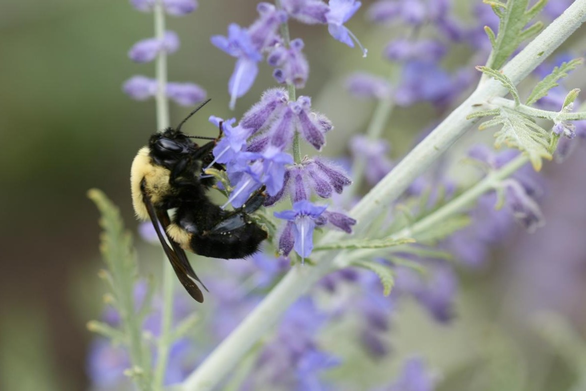

.. primer
.. _croppollination:

**************************************
Pollinator Abundance: Crop Pollination
**************************************

Summary
=======

The InVEST pollination model focuses on wild bees as a key animal pollinator. It uses estimates of the availability of nest sites and floral resources within bee flight ranges to derive an index of the abundance of bees nesting on each cell on a landscape (i.e., pollinator supply). It then uses floral resources, and be foraging activity and flight range information to estimate an index of the abundance of bees visiting each cell.  If desired, the model then calculates a simple index of the contribution of these bees to agricultural production, based on bee abundance and crop dependence on pollination The results can be used to understand changes in crop pollination and crop yield with changes in land use and agricultural management practices. Required inputs include a land use and land cover map, land cover attributes, guilds or species of pollinators present, and their flight ranges. To estimate wild pollinator contributions to crop production requires information on farms of interest, the crops grown there, and the abundance of managed pollinators. The model's limitations include not accounting for pollinator persistence over time or the effects of land parcel size.

Introduction
============

Crop pollination by bees and other animals is a potentially valuable ecosystem service in many landscapes of mixed agricultural and natural habitats (Allen-Wardell et al. 1998, Free 1993).  Pollination can increase the yield, quality, and stability of fruit and seed crops as diverse as tomato, canola, watermelon, coffee, sunflower, almond, and cacao. Indeed, Klein et al. (2007) found that 87 of 115 globally important crops benefit from animal pollination, a service valued variously in the billions to tens of billions per year globally (Costanza et al. 1997, Losey and Vaughan 2006, Nabhan and Buchmann 1997, Southwick and Southwick 1992).

Despite these numbers, it is important to realize that not all crops need animal pollination. Some crop plants are wind (e.g., staple grains such as rice, corn, wheat) or self pollinated (e.g., lentils and other beans), needing no animal pollinators to successfully produce fruits or seeds. Klein et al. (2007) provides a list of crops and their pollination requirements that can help identify whether crops in a region of interest may benefit from wild animal pollinators.

Decision-makers can use information on crop pollinators, their abundance across a landscape, and the pollination services they provide to crops in several ways. First, with maps of pollinator abundance and crops that need them, land use planners could predict consequences of different policies on pollination services and income to farmers (for an example, see Priess et al. 2007). Second, farmers could use these maps to locate crops intelligently, given their pollination requirements and predictions of pollinator availability. Third, conservation organizations or land trusts could use the tool to optimize conservation investments that benefit both biodiversity and farmers. Finally, governments or others proposing payment schemes for ecosystem services could use the results to estimate who should pay whom, and how much.

.. primerend

The Model
=========

A wide range of animals can be important pollinators (e.g., birds, bats, moths and flies), but bees are the most important group for most crops (Free 1993). As a result, the InVEST Pollination model focuses on the resource needs and flight behaviors of wild bees. Many people think of honeybees, managed in artificial hives, when they think of pollinators, but wild bees also contribute to crop pollination. In fact, for several important crops (e.g., blueberries), native species are more efficient and effective pollinators than honeybees (Cane 1997). These native bees, in addition to feral honeybees living in the wild, can benefit crops without active management of captive hives. This is the pollination service associated with habitat conservation.

For bees to persist on a landscape, they need two things: suitable places to nest, and sufficient food (provided by flowers) near their nesting sites. If provided these resources, pollinators are available to fly to nearby crops and pollinate them as they collect nectar and pollen. The model therefore uses information on the availability of nesting sites and flower resources, as well as flight ranges of bees, to map an index of bee abundance across the landscape. With information on the location of crops and their dependence on pollinators, the model uses a simlified yield function to project how pollinator abundance in agricultural areas contributes to crop yields.  And in the fourth step, it attributes these cell values back to cells "supplying" these bees. These steps are laid out in more detail below. This model is adapted from Lonsdorf et al. (2009).

How it Works
------------

The model is an index-based model, and requires the following biophysical data:

* land use and land cover (LULC) map;
* a biophysical table paired with the LULC raster to map LULC types to nesting suitability and floral resources across seasons;
* a pollinator guild table with properties about active seasons, nesting preferences, mean flight distances, and relative abundances for each species or group of wild pollinators;
* a farm shapefile indicating the geospatial location of farms, crop type, dependence on pollinators, abundance of managed pollinators, as well as on-farm nesting sites and floral resources.

Because bees are proficient fliers, they integrate over several elements of a landscape, moving between nesting habitats and foraging habitats (Ricketts et al. 2006). The distances they typically fly affect both their persistence and the level of service they deliver to farms. The model therefore requires a typical foraging distance for each pollinator species. These data can be supplied from quantitative field estimates (e.g., Roubik and Aluja 1983), proxies such as body size (Greenleaf et al. 2007), or from expert opinion.

Pollinator Supply and Abundance
^^^^^^^^^^^^^^^^^^^^^^^^^^^^^^^

Using these data, the model first estimates pollinator supply for every cell in the landscape, based on the available nesting sites in that cell, the floral resources (i.e., food) in surrounding cells, and the relative abundance of that pollinator species. Floral resources in cells near nesting sites are given more weight than distant cells, according to the species' average foraging range.

:math:`PS(x,s)` is the pollinator supply index at pixel :math:`x`: for species :math:`s` defined as:

.. math:: PS(x,s)=FR(x,s) HN(x,s) SA(s)

where :math:`FR(x,s)`: is the floral resources index at pixel :math:`x`: for species :math:`s` defined as:

.. math:: FR(x,s)=\frac{\sum_{x'\in X}\sum_{j\in J}RA(l(x),j) FA'(s,j) \exp(-D(x,x')/\alpha_s)}{\sum_{x'\in X}\exp(-D(x,x')/s)}

:math:`HN(x,s)` is the habitat nesting suitability at pixel :math:`x` for species :math:`s`

.. math:: HN(x,s)=\max_{n\in N}\left[N(l(x),n) ns(s,n)\right]

and where

* :math:`SA(s)` is the relative species abundance for species :math:`s` in the range :math:`[0.0, 1.0]`, :math:`\sum_{s\in S} SA(s) = 1`, and :math:`S` is the set of all species,
* :math:`N(l,n)` is the nesting substrate index for landcover type :math:`l` for substrate type :math:`n` in the range :math:`[0.0, 1.0]`,
* :math:`l(x)` is the landcover type at pixel :math:`x`,
* :math:`j` is the season,
* :math:`RA(l, j)` are the relative abundance of flowers on landcover :math:`l` during season :math:`j`,
* :math:`FA'(s,j)` is the relative foraging activity for pollinator species :math:`s` during season :math:`j`.
* :math:`D(x,x')` is the Euclidean distance between cells :math:`x` and :math:`x'`,
* :math:`ns(s,n)` is the nesting suitability preference for species :math:`s` in nesting type :math:`n` (and :math:`N` is the set of all nesting types),
* and :math:`\alpha_s` is the expected foraging distance for the pollinator :math:`s` (Greenleaf et al. 2007).

Pollinator supply is an indicator of where pollinators originate from on the landscape. Pollinator abundance indicates where pollinators are active on the lanscape. Pollinator abundance depends on the floral resources that attract pollinators to a cell, and the supply of pollinators that can access that cell. The pollinator abundance for species :math:`s` index on cell x, during season j :math:`PA(x,s,j)`, is the product of available floral resources on a cell during a given season, weighted by a pollinator's relative activity during that season and the pollinator supply in surrounding cells such that:

.. math:: PA(x,s,j)=RA(l(x),j) FA'(s,j)\frac{\sum_{x'\in X}PS(x',s) \exp(-D(x,x')/\alpha_s)}{\exp(-D(x,x')/\alpha_s)}

See the Table of Variables Appendix for all variable definitions and properties.

On-Farm Abundance and Yield
^^^^^^^^^^^^^^^^^^^^^^^^^^^

Next, using the indices of pollinator abundance across the landscape, the location of farms, and information about each farm (availability of managed pollinators, crop dependence on pollination), the model can calculate an index of total yield attained and the contribution of wild pollinators to that yield.

First, the model calculates an index of total pollinator abundance by season in agricultural areas that might benefit from pollination services. On-farm pollinator abundance is given as:

.. math:: PAT(x,j)=\sum_{s\in S}PA(x,s,j)

The potential contribution of on-farm pollinator abundance to pollinator-dependent crop yield is calculated using a tunable half-sigmoid function as:

.. math:: FP(x,p(x))=\frac{p(x)(1-h(f(x)))}{h(f(x))(1-2p(x)+p(x))}

where :math:`h(f(x))` is the half saturation constant for farm :math:`f` at pixel :math:`x` indicating what abundance of wild pollinators is needed to reach half of the total potential pollinator-dependent yield and :math:`p(x,)` is the pollinator index on pixel :math:`x`.

The actual contribution of wild pollinators to pollinator-dependent yield depends on the degree to which pollination needs are already being met by managed pollinators. The total pollinator-dependent yield, from both wild and managed pollinators, is given as:

.. math:: PYT(x)=FP(x, \min(mp(f(x))+PAT(x, fj(x)), 1))

assuming a value of 0 indicates 0% of pollinator-dependent yield is achieved, and 1.0 indicates 100% of pollinator-dependent yield is achieved. Note the max/min notation clamps :math:`PYT` to 0..1 where :math:`mp(f(x))` is the proportion of pollination needs met by managed pollinators available at pixel :math:`x` within farm polygon :math:`f`.

The proportion of pollinator-dependent yield attributable to wild pollinators is given as

.. math:: PYW(x)=PYT(x) - FP(x, mp(f(x)))

Thus, in cases where managed pollinators are sufficiently abundant, i.e, :math:`mp(f(x))=1`, there is no additional yield attributable to wild pollinators.

Total crop yield attained is a function of the crop's dependence on pollination and the degree to which its pollination needs are met. Some crop species are self-compatible or wind-pollinated and yield is less dependent on animal pollinators while other species obligately require pollinators to generate any yield (Klein et al. 2007). Total crop yield is calculated per farm as

.. math:: YT(f)=1-\nu(f)\left(1-\sum_{x\in X(f)}PYT(x)/|X(f)|\right)

where :math:`f` is a particular farm, :math:`X(f)` are the set of pixels covering farm :math:`f`, and :math:`|X(f)|` is the count of pixels covered by farm :math:`f`.  The function :math:`\nu(f)` is a scalar :math:`\in [0,1]` representing what proportion of yield for the crop grown on farm :math:`f` is dependent on pollinators.

The proportion of total crop yield attributable to wild pollinators is given as

.. math:: YW(f)=\nu(f)\left(\sum_{x\in X(f)}PYW(x)/|X(f)|\right)

Limitations and Simplifications
-------------------------------

This model is an index-bassed model and only estimates relative patterns of pollinator abundance and pollination contribution to crop yields. This is because absolute estimates of nest density, resource availability, and pollinator abundance are rarely available, and yield functions (including pollinator abundance) for many crops are poorly defined. Relying on relative indices limits our ability to estimate absolute economic values to better inform land-use planning decision-making, often based on cost-benefit analyses.

As an index-based model, it is best suited for making comparisons among scenarios representing marginal changes in land use/land cover, farm management practices or crop types. On-farm pollinator abundance :math:`PAF(x,j)` may increase with the number of pollinator guilds being modeled, and so cannot be used to compare very different pollinator communities in different locations. Similarly, because realtive species abundance :math:`SA(s)` is specified as an input, the model will not yield accurate results for scenarios in which relative abundances are likely to differ greatly (e.g., a rare species becomes common or vice versa) due to changes in nesting habitat or floral resources.

The model does not include the dynamics of bee populations over time, and therefore cannot evaluate whether these populations are sustainable given the current landscape. Instead, the model simply provides a static snapshot of the number of pollinators on each cell in the landscape, given simple estimates of nesting sites and food resources. Some of the factors that influence bee populations, like habitat disturbances and typical population fluctuations, are not captured. In addition, the model calculates pollinator supply based on the average of available floral resources weighted by pollinator activity across seasons during which the pollinator. It does not account for the order of seasons or the dependence of pollinator abundance in one season on the resources available in the season directly prior. The model does not account for variation in the effectiveness of different pollinator species or guilds at pollinating different crop types. All species are assumed to contribute equally based on their relative abundance and the half-saturation constant specified for each farm/crop.

The model does not account for the sizes of habitat patches in estimating abundance. For many species, there is a minimum patch size, under which a patch cannot support that species over the long term. There is some evidence that small patches support fewer species of bees (Kremen et al. 2004), but bees can also survive in surprisingly small areas of suitable habitat (Ricketts 2004).

Pollinators are likely to be influenced by fine-scale features in the landscape, which are difficult to capture in typical land-cover data with typical resolutions of 30m. For example, small patches of flower resources in an otherwise hostile habitat for bees can provide important food resources, but will not be detected by typical land cover maps. Some bees are also able to nest in small but suitable areas (a single suitable roadside or tree hollow). Using average values of nesting site or flower availability for each land cover type, along with 30m pixels or larger, will therefore not capture these fine scale but important areas of resources.

Data Needs
==========

1.	**Land cover map (required)**. A GIS raster, with a land use and land cover (LULC) code for each cell. The raster should be projected in meters and the projection should be defined. This coverage must be of fine enough resolution (i.e., sufficiently small cell-size) to capture the movements of bees on a landscape. If bees fly 800 meters on average and cells are 1000 meters across, the model will not fully capture the movement of bees from their nesting sites to neighboring farms.

2.	**Table of pollinator species or guilds (required)**. A table containing information on each species or guild of pollinator to be modeled. Guild refers to a group of bee species that show the same nesting behavior, whether preferring to build nests in the ground, in tree cavities, or other habitat features. If multiple species are known to be important pollinators, and if they differ in terms of flight season, nesting requirements, or flight distance, provide data on each separately. If little or no data are available, create a single 'proto-pollinator,' with data taken from average values or expert opinion about the whole pollinator community.

 *File Type:* Comma separated CSV.

 *Rows:* each row is a unique species or guild of pollinator.

 *Columns:* columns contain data on each species or guild. Column order doesn't matter, but columns must be named as follows (italicized portions of names can be customized for meaning, but must be consistent with names in other tables):

 a.	*species*: Name of species or guild (Note: species names can be numerical codes or names.

 b.	Any number of *nesting_suitability_[SUBSTRATE]_index* for each substrate modeled: Values should be entered as a number between 0 or 1, with 1 indicating a nesting substrate that is fully utilized and 0 indicating a non-utilized nest substrate. Substrates can be user defined, but might include ground nests, tree cavities, etc.

 c.	*foraging_activity_[SEASON]_index*: Pollinator activity by floral season (i.e., flight season). Values should be entered as a number between 0 to 1, with 1 indicating the time of highest activity for the guild or species, and 0 indicating no activity. Seasons are user defined but might include spring, summer, fall; wet, dry, etc.

 d.	*alpha*: average distance each species or guild travels to forage on flowers, specified in meters. The model uses this estimated distance to define the neighborhood of available flowers around a given cell, and to weight the sums of floral resources and pollinator abundances on farms. Value can be determined by typical foraging distance of a bee species based on an allometric relationship (see Greenleaf et al. 2007).

 *Example:* A hypothetical study with four species. There are two main nesting types, "cavity" and "ground." Species A is exclusively a cavity nester, species B and D are exclusively ground nesters, and species C uses both nest types. There is only a single flowering season, "Allyear," in which all species are active. Typical flight distances, specified in meters (alpha), vary widely among species.

.. csv-table:: **Example Guilds Table**
       :file: ./croppollination_images/guild_table_sample.csv
       :header-rows: 1

3.	**Table of biophysical land cover attributes (required)**. A table containing data on each class in the LULC map (as described above in #1). Data needed are relative indices (0-1). Data can be summarized from field surveys, or obtained by expert assessment if field data is unavailable.

 *File type:*  comma separated CSV.

 *Rows:* each row is a different LULC class.

 *Columns:* each column contains a different attribute of each LULC class, and must be named as follows:

 a.	*LULC*: Land use and land cover class code. LULC codes match the 'values' column in the LULC raster and must be numeric, in consecutive order, and unique.

 c.	*nesting_[SUBSTRATE]_availability_index*: Relative index of the availability of the given nesting type within each LULC type, on a scale of 0-1.  The substrate must match one-for-one the substrates given in the guild table.

 d.	*floral_resources_[SEASON]_index*: Relative abundance (0-1) of flowers in each LULC class for the given season. There are two aspects to consider when estimate relative floral abundance of each LULC class: % floral abundance or % floral coverage as well as the duration of flowering during each season. For example, a land cover type that comprises 100% of a mass flowering crop that flowers the entire season with an abundance cover of 80% would be given a suitability value of 0.80. A land cover type that flowers only half of the season at 80% floral coverage would be given a floral suitability value of 0.40.  The season must match one-for-one the seasons given in the guild table.

 *Example*:

.. csv-table:: **Example Biophysical Table**
       :file: ./croppollination_images/landcover_biophysical_table_sample.csv
       :header-rows: 1

4.	**Farm Polygon**: In order to calculate information related to crop yields, the model uses a polygon vector layer to indicate farm areas, and the attribute table of that vector to provide farm-specific information.  Specifically, the vector's attribute table must include the following fields:

 a. *crop_type* (string): Name of the crop grown on that polygon, ex. "blueberries", "almonds", etc. For farms growing multiple overlapping crops, or crops in multiple seasons, a separate overlapping polygon must be included for each crop.

 b. *half_sat* (float): The half saturation coefficient for the crop grown on that farm. This is the value of the wild pollinator abundance index that results in 50% of pollinator-dependent crop yield being attained. This is a tunable paramter that may be most useful to adjust following an initial run of the model and an examination of the results.

 c. *season* (string): the season in which the crop is pollinated.  This season must match the seasons provided in the guilds table.

 d. *fr_[SEASON]* (float in the range [0.0, 1.0]): the floral resources available at this farm for the given season.  Seasons must match one-for-one the seasons provided in the guild table.

 e. *n_[SUBSTRATE]* (float in the range [0.0, 1.0]): the nesting substrate suitability for the farm for the given substrate.  Substrates must match one-for-one the substrates provided in the guild table.

 f. *p_dep* (float in the range [0.0, 1.0]): the proportion of crop dependant on pollinators. See the "pollinator_dependence" csv file distributed with the model for estimates for common crops based on Klein et al. (2007).

 g. *p_managed* (float in the range [0.0, 1.0]): the proportion of pollination required on the farm provided by managed pollinators. This can be estamated as the proportion of the recommended hive density or stocking rate. See Delaplane & Mayer (2000) for recommended stocking rates in the United States. Agricultural extension offices are also a good source of this information.

.. primer
.. _interpreting-results:

Interpreting Results
====================

Final Results
-------------

Final results are found in the *workspace* directory specified when the model is run.

* **Parameter log**: Each time the model is run, a text (.txt) file will appear in the *Output* folder. The file will list the parameter values for that run and will be named according to the service, the date and time, and the suffix.

* **wild_pollinator_yield.tif**: per-pixel pollinator yield index for pixels that overlap farms, for wild-pollinators only.

* **total_pollinator_yield.tif**: per-pixel total pollinator yield index for pixels that overlap farms, including wild and managed pollinators.

* **pollinator_abundance_[SPECIES]_[SEASON].tif**: Pollinator abundance per species per season.

* **farm_yields.shp**: A copy of the input farm polygon vector file with the additional fields:

 a. *p_av_yield*: average yield index on farm due to wild pollinator activity.
 b. *t_av_yield*: average yield index on farm, including pollination-idependent yield, as well as wild and managed pollinators.

Intermediate Results
^^^^^^^^^^^^^^^^^^^^

You may also want to examine the intermediate results. These files can help determine the reasons for the patterns in the final results.  They are found in the *intermediate_outputs* folder within the workspace directory defined on the model run.

.. primerend

Appendix: Table of Variables
============================

* :math:`x` - a pixel coordinate.
* :math:`X` - set of all pixels in the landcover map.
* :math:`f(x)` - farm at pixel x.
* :math:`F` - set of all pixels that are located in farms.
* :math:`s` - bee species.
* :math:`n` - nesting type (ground, cavity).
* :math:`N` - set of all nesting types.
* :math:`j` - season (fall, spring, etc).
* :math:`J` - set of all seasons (ex: {fall, spring}).
* :math:`fj(f, x)` - active pollination season for farm :math:`f` at pixel :math:`x`.
* :math:`\alpha_s` - mean foraging distance for species s.
* :math:`ns(s,n)` - nesting suitability preference for species :math:`s` in nesting type :math:`n`.
* :math:`HN(x,s)`  - habitat nesting suitability at pixel :math:`x` for species :math:`s` [0.0, 1.0].
* :math:`N(l,n)` - the nesting substrate index for landcover type :math:`l` for substrate type :math:`n` in the range :math:`[0.0, 1.0]`.
* :math:`RA(l,j)` - relative abundance of flowers on landcover type :math:`l` during season :math:`j`. :math:`[0.0, 1.0]`
* :math:`FA(s,j)` - foraging activity for pollinator species :math:`s` during season :math:`j`
* :math:`FA’(s,j)` - relative foraging activity for species :math:`s` during season :math:`j` calculated by dividing :math:`FA(s,j)` by the maximum across seasons.
* :math:`FR(x,s)` - floral resources accessible at pixel :math:`x` for species :math:`s`.
* :math:`D(x,x')` - euclidian distance between the centroid of pixel :math:`x` and :math:`x'`.
* :math:`PS(x,s)` - pollinator supply index at pixel :math:`x` for species :math:`s`.
* :math:`PA(x,s)` - pollinator abundance at pixel :math:`s` for species :math:`s`.
* :math:`PAT(x,j)` - total on-farm pollinator abundance at pixel :math:`x` in season :math:`j`, accounting for all species
* :math:`FP(x)` - the potential contribution of on-farm pollinator abundance to pollinator-dependent crop yield at a farm pixel during the season in which pollination is needed for that farm.
* :math:`mp(f)` - abundance of managed pollinators on farm :math:`f` relative to the recommended stocking rate.
* :math:`h(f)` - half saturation coefficient for farm :math:`f`.
* :math:`PYT(x)` - total pollinator-attributable yield at pixel x for season :math:`j`, accounting for wild and managed pollinators.
* :math:`PYW(x)` - wild-pollinator-attributable yield at pixel x for season :math:`j`.
* :math:`SA(s)` - relative species abundance for species :math:`s`.
* :math:`YT(f)` - average farm yield for farm parcel :math:`f` accounting for pollinator dependency of crop.
* :math:`YW(f)` - proportion of average farm yield for farm parcel :math:`f` attributable to wild pollinators, accounting for pollinator dependency of crop.
* :math:`\nu(f)` - proportion of crop yield dependent on pollination.

Appendix: Data Sources
======================

List of globally important crops and their dependence on animal pollinators: (Klein et al. 2007).

References
==========

Allen-Wardell, G., P. Bernhardt, R. Bitner, A. Burquez, S. Buchmann, J. Cane, PA Cox, V. Dalton, P. Feinsinger, M. Ingram, D. Inouye, CE Jones, K. Kennedy, P. Kevan, and H. Koopowitz. 1998. The potential consequences of pollinator declines on the conservation of biodiversity and stability of food crop yields. Conservation Biology 12: 8-17.

Cane, JH. 1997. Lifetime monetary value of individual pollinators: the bee habropoda laboriosa at rabbiteye blueberry (vaccinium ashei reade). Acta Horticulturae 446: 67-70.

Costanza, R., R. d'Arge, R. de Groot, S. Farber, M. Grasso, B. Hannon, K. Limburg, S. Naeem, RV O'Neill, J. Paruelo, RG Raskin, P. Sutton, and M. van den Belt. 1997. The value of the world's ecosystem services and natural capital. Nature 387: 253-260.

Delaplane, KS, and DF Mayer. 2000. Crop pollination by bees. CABI Publishing, New York.

Free, JB. 1993. Insect pollination of crops. Academic Press, London.

Greenleaf, SS, NM Williams, R. Winfree, and C. Kremen. 2007. Bee foraging ranges and their relationship to body size. Oecologia 153: 589-596.

Greenleaf, SS, and C. Kremen. 2006. Wild bee species increase tomato production and respond differently to surrounding land use in Northern California. Biological Conservation 133:81-87.

Klein, AM, BE Vaissiere, JH Cane, I. Steffan-Dewenter, SA Cunningham, C. Kremen, and T. Tscharntke. 2007. Importance of pollinators in changing landscapes for world crops. Proceedings of the Royal Society B-Biological Sciences 274: 303-313.

Kremen, C., NM Williams, RL Bugg, JP Fay, and RW Thorp. 2004. The area requirements of an ecosystem service: crop pollination by native bee communities in California. Ecology Letters 7: 1109-1119.

Lonsdorf, E., C. Kremen, T. Ricketts, R. Winfree, N. Williams, and SS Greenleaf. 2009. Modelling pollination services across agricultural landscapes.  Annals of Botany 1: 12. online [http://aob.oxfordjournals.org/content/103/9/1589.abstract?sid=b0f6fc9e-bd52-4bec-8248-50e56b78344d]

Lonsdorf, E., TH Ricketts, CM Kremen, NM Williams, and S. Greenleaf. in press. Pollination services in P. Kareiva, TH Ricketts, GC Daily, H. Tallis, and S. Polasky, eds. The theory and practice of ecosystem service valuation.

Losey, JE, and M. Vaughan. 2006. The economic value of ecological services provided by insects. Bioscience 56: 311-323.

Nabhan, GP, and SL Buchmann. 1997. Services provided by pollinators. Pages 133-150 in GC Daily, ed. Nature's services. Island Press, Washington, D.C.

Priess, JA, M. Mimler, AM Klein, S. Schwarze, T. Tscharntke, and I. Steffan-Dewenter. 2007. Linking deforestation scenarios to pollination services and economic returns in coffee agroforestry systems. Ecological Applications 17: 407-417.

Ricketts, TH. 2004. Tropical forest fragments enhance pollinator activity in nearby coffee crops. Conservation Biology 18: 1262-1271.

Ricketts, TH, NM Williams, and MM Mayfield. 2006. Connectivity and ecosystem services: crop pollination in agricultural landscapes. Pages 255-289 in M. Sanjayan and K. Crooks, eds. Connectivity for Conservation. Cambridge University Press, Cambridge, UK.

Roubik, DW, and M. Aluja. 1983. Flight ranges of Melipona and Trigona in tropical forest. Journal of the Kansas Entomological Society 56: 217-222.

Southwick, EE, and L. Southwick. 1992. Estimating the economic value of honey-bees (Hymenoptera; Apidae) as agricultural pollinators in the United States. Journal of Economic Entomology 85: 621-633.

Winfree, R., J. Dushoff, EE Crone, CB Schultz, RV Budny, NM Williams, and C. Kremen. 2005. Testing simple indices of habitat proximity. American Naturalist 165(6): 707-717.

