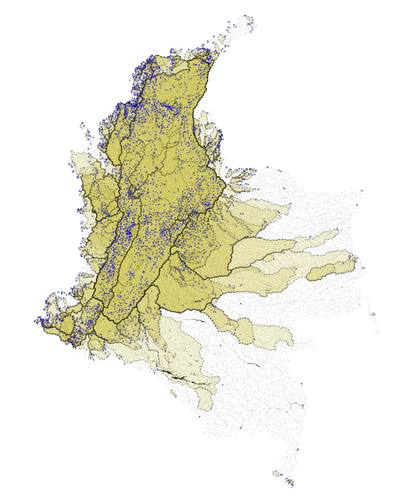

.. _delineateit:

***********
DelineateIt
***********

Summary
=======

Introduction
============

Many of the freshwater models in InVEST require watershed polygons to aggregate the ecosystem service provides to beneficiaries. However, we've found the creation of watersheds with existing tools to be difficult and often requiring specific expertise and/or proprietary toolsets. To address this need, we have developed our own watershed delineation algorithm released in the PyGeoprocessing GIS package, and wrapped into a UI inside of InVEST. All DEM routing is handled by PyGeoprocessing which resolves hydrological sinks and plateaus and uses D8 to route flow directions.

Model Steps
===========

Fill Pits
^^^^^^^^^
First, the model fills any pits (hydrologic sinks) in the DEM. This step helps ensure that all pixels drain off the defined area of the raster.

Calculate Flow Direction
^^^^^^^^^^^^^^^^^^^^^^^^
The model applies the D8 routing algorithm to the filled DEM to calculate the direction that water flows off of each pixel.

Detect Pour Points
^^^^^^^^^^^^^^^^^^
A pour point is a point where water flows off the defined area of the flow direction map, either off the edge of the raster or into a nodata pixel.
If the Detect Pour Points option is selected, the model will place a pour point in the center of each

Snap Points to Nearest Stream
^^^^^^^^^^^^^^^^^^^^^^^^^^^^^
If an outlet feature does not lie directly on a stream, a very small watershed will be generated which is usually not correct. DelineateIt can snap point outlet features to the nearest stream to make more robust watersheds. To do this, the tool constructs a stream map, and then relocates watershed outlet points to the nearest stream.

Calculate Flow Accumulation
---------------------------
The model calculates flow accumulation from the flow direction raster using the D8 algorithm. This represents the relative amount of water draining onto a pixel from its uphill area.

Threshold Flow Accumulation
---------------------------
The model identifies streams by thresholding the flow accumulation raster by the TFA value. Areas with a flow accumulation greater than or equal to the TFA value are considered streams.

Relocate Points
---------------
The model snaps all watershed outlet points to the center of the nearest stream pixel within the Snap Distance. If no streams are within the Snap Distance, the point remains where it is.

Delineate Watersheds
^^^^^^^^^^^^^^^^^^^^
The model uses a D8 delineation algorithm to produce a polygon vector of watersheds from the flow direction raster and the watershed outlets geometries (if provided) or detected pour points (if Detect Pour Points is selected).

Tool Inputs
===========

- :investspec:`delineateit.delineateit workspace_dir`

- :investspec:`delineateit.delineateit results_suffix`

- :investspec:`delineateit.delineateit dem_path` Hydrological sinks and flat plateau regions will be automatically resolved by PyGeoprocessing.

- :investspec:`delineateit.delineateit detect_pour_points` There is a pour point located at the center of each pixel that flows off the edge of the raster or into a nodata pixel. Flow direction is calculated from the DEM using the D8 algorithm.

- :investspec:`delineateit.delineateit outlet_vector_path` These geometries may represent stream intake points, population centers, roads, municipality boundaries or other features of interest and may be of any geometry type including points, lines, or polygons. Any fields associated with this vector will be copied to the output watershed vector.

- :investspec:`delineateit.delineateit skip_invalid_geometry` The log file will contain warning messages if any geometries are skipped. DelineateIt can only delineate watersheds from valid geometries, so it is up to the user to ensure that all geometries are valid. These may be resolved using the ArcGIS tool "Check Geometry" or QGIS tool "Fix geometries".

- :investspec:`delineateit.delineateit snap_points` Only ``POINT`` geometries, or ``MULTIPOINT`` geometries with a single component point, will be snapped. All other geometry types will be unaltered.

- :investspec:`delineateit.delineateit flow_threshold` Smaller values of this threshold produce streams with more tributaries, larger values produce streams with fewer tributaries.

- :investspec:`delineateit.delineateit snap_distance` Note that this is a distance in pixels, not meters, so scale this according to your pixel size.

Tool Outputs
============

All outputs can be found in the **Workspace** directory given previously. They include:

 * **watersheds.gpkg** A GeoPackage vector defining the areas that are upstream from the snapped outlet points, where upstream area is defined by the D8 flow algorithm implementation in PyGeoprocessing.

 * **snapped_outlets.gpkg** A vector that indicates where outlet points (point geometries only) were snapped to based on the values of Threshold Flow Accumulation and Pixel Distance to Snap Outlet Points. Any non-point geometries will also have been copied over to this vector, but will not have been altered.

 * **preprocessed_geometries.gpkg** A vector containing only those geometries that the model can verify are valid. The geometries appearing in this vector will be the ones passed to watershed delineation.

 * **streams.tif** The raster stream layer used to snap outlet points, produced from the DEM and Threshold Flow Accumulation value.

 * **filled_dem.tif** The DEM, but with hydrological sinks filled.

 * **flow_direction.tif** The D8 flow direction raster, created from the filled DEM.

 * **flow_accumulation.tif** The D8 flow accumulation raster, created from ``flow_direction.tif``.

References
==========

PyGeoprocessing https://github.com/natcap/pygeoprocessing
