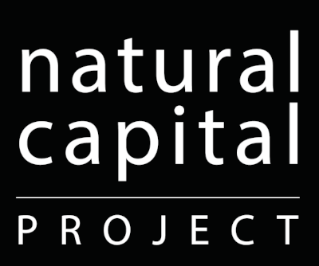

.. test documentation master file, created by
   sphinx-quickstart on Fri Jan 28 23:39:07 2011.
   You can adapt this file completely to your liking, but it should at least
   contain the root `toctree` directive.

InVEST® User Guide
==================

.. toctree::
   :maxdepth: 3

.. figure:: index/main_image.png

.. hlist::
   :columns: 3

   * .. image:: index/SU-Woods-Horiz-Stacked-Hex-Red_300w.png
        :alt: Stanford Woods Institute for the Environment

   * .. image:: index/SRC_logo_300w.png
        :alt: Stockholm Resilience Centre, Stockholm University

   * .. image:: index/TNC_logo_300w.png
        :alt: The Nature Conservancy

   * .. image:: index/CAS_logo_300w.png
        :alt: Chinese Academy of Sciences

   * .. image:: index/IonE_logo_300w.png
        :alt: University of Minnesota Institute on the Environment

   * .. image:: index/WWF_logo_300w.png
        :alt: World Wildlife Fund

   * .. image:: index/SU_dept_bio_logo_300w.png
        :alt: Stanford University Department of Biology

   * .. image:: index/RSA_Beijer_logo_300w.png
        :alt: Beijer Institute of Ecological Economics, Royal Swedish Academy of Sciences

**Suggested citation**: Natural Capital Project, |commit_year|. InVEST |version|.
Stanford University, University of Minnesota, Chinese Academy
of Sciences, The Nature Conservancy, World Wildlife Fund, Stockholm
Resilience Centre and the Royal Swedish Academy of Sciences.
https://naturalcapitalproject.stanford.edu/software/invest

**Contributors**\*:

.. hlist::
   :columns: 3

   * Angarita, Héctor
   * Arkema, Katie
   * Bailey, Allison
   * Bernhardt, Joanna
   * Bhagabati, Nirmal
   * Bierbower, Will
   * Brauman, Kate
   * Bryant, Benjamin
   * Cameron, David
   * Chan, Kai
   * Chaplin-Kramer, Rebecca
   * Chaumont, Nicolas
   * Conte, Marc
   * Daily, Gretchen
   * Davies, Jeremy
   * Davis, Emily
   * Delevaux, Jade
   * Denu, Douglas
   * Douglass, James
   * Eichelberger, Bradley
   * Ennaanay, Driss
   * Faries, Joe
   * Fisher, David
   * Glowinski, Kathryn
   * Goldstein, Jesse
   * Goldstein, Joshua
   * Griffin, Robert
   * Guannel, Gregory
   * Guerry, Anne
   * Guswa, Andrew
   * Janke, Ben
   * Johnson, Justin
   * Hamel, Perrine
   * Han, Baolong
   * Kareiva, Peter
   * Kennedy, Christina
   * Kim, Choong-Ki
   * Lacayo-Emery, Martin
   * Leon, Jorge
   * Li, Yingjie
   * Lin, Chia-Yi (Joanna)
   * Liu, Hongxiao
   * Lonsdorf, Eric
   * Lozano, Juan Sebastian
   * Mandle, Lisa
   * Mendoza, Guillermo
   * Moritsch, Monica
   * Mueller, Nathan
   * Nelson, Erik
   * Nissel, Megan
   * Nootenboom, Chris
   * Olwero, Nasser
   * Ouyang, Zhiyun
   * Papenfus, Michael
   * Pennington, Derric
   * Perelman, Adam
   * Polasky, Stephen
   * Reguero, Borja
   * Remme, Roy
   * Ricketts, Taylor
   * Rogers, Lauren
   * Ruckelshaus, Mary
   * Schmitt, Rafael
   * Sharp, Richard
   * Shaw, Rebecca
   * Silver, Jessica
   * Simpson, Claire
   * Soth, Emily
   * Tallis, Heather
   * Tam, Christine
   * Toft, Jodie
   * Underwood, Emma
   * Verutes, Gregory
   * Vogl, Adrian
   * Wolny, Stacie
   * Wood, Spencer
   * Wright, Michael
   * Wyatt, Katherine
   * Qi, Yi
   * Zheng, Hua
   * Ziv, Guy

In addition, we acknowledge the help of hundreds of collaborators co-creating
solutions in engagements around the world.

\*We do our best to keep this list comprehensive and up to date but recognize
we may have inadvertently missed someone. If you do not see your name listed
above and think it should be, please contact
naturalcapitalproject@stanford.edu.

Attribution Guidelines
----------------------
When referring to analyses or data products that
were produced with InVEST, please cite the use of InVEST and include a
hyperlink (e.g., This analysis used InVEST :sup:`®` :
https://naturalcapitalproject.stanford.edu/software/invest). The trademark
symbol (:sup:`®`) should be used at the first mention of InVEST. The full citation for
papers, reports, etc. is available above. You are also welcome to use the
`InVEST logo <https://drive.google.com/drive/folders/1LrOIY2LOAwAIqG0uAJEReA6ndFEAGpc_>`_
in line with our
`Trademark and Logo Use Policy <https://naturalcapitalproject.stanford.edu/invest-trademark-and-logo-use-policy>`_ .

Introduction and Getting Started
--------------------------------

.. toctree::
   :maxdepth: 2

   the_need_for
   getting_started
   input_types

.. toctree::
   :maxdepth: 1

   using_invest
   data_sources

InVEST Models
-------------

Supporting & Final Ecosystem Services
^^^^^^^^^^^^^^^^^^^^^^^^^^^^^^^^^^^^^
.. toctree::
   :maxdepth: 2

   annual_water_yield
   carbonstorage
   coastal_blue_carbon
   coastal_vulnerability
   crop_production
   carbon_edge
   habitat_quality
   habitat_risk_assessment
   ndr
   wind_energy
   croppollination
   sdr
   seasonal_water_yield
   scenic_quality
   urban_cooling_model
   urban_flood_mitigation
   urban_nature_access
   stormwater
   recreation
   wave_energy

Additional Tools
^^^^^^^^^^^^^^^^

.. toctree::
   :maxdepth: 2

   delineateit
   routedem
   scenario_gen_proximity

Python API
^^^^^^^^^^

.. toctree::
   :maxdepth: 2

   invest_api

