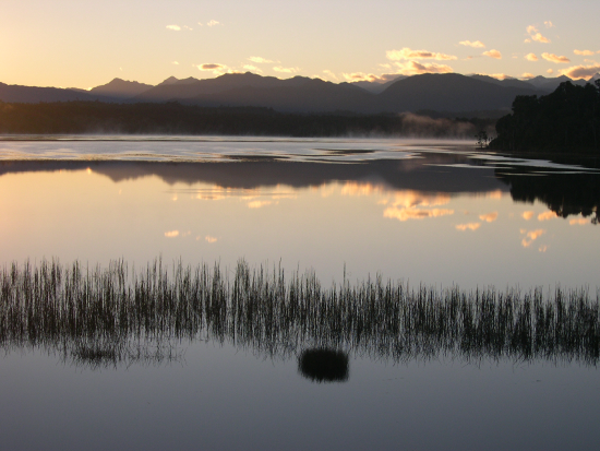

.. test documentation master file, created by
   sphinx-quickstart on Fri Jan 28 23:39:07 2011.
   You can adapt this file completely to your liking, but it should at least
   contain the root `toctree` directive.

InVEST® User Guide
==================

.. toctree::
   :maxdepth: 3

.. image:: index/NatCap_Alliance_Logo_Full_Color_rgb_900px_w_72ppi.png
   :align: center
   :scale: 50 %

The Natural Capital Alliance advances science and creates actionable tools to
bring the values of nature into decisions. Our work is inspired by,
created with, and implemented through our broader global network of more
than 150 research organizations and more than 350 practitioner organizations
in the public and private sectors. For a complete list of NatCap Alliance
members visit https://naturalcapitalalliance.stanford.edu/about/global-network.

**Suggested citation**: Natural Capital Alliance, |commit_year|.
InVEST |version| User’s Guide. |invest_doi|

**Contributors**\*:

.. hlist::
   :columns: 3

   * Angarita, Héctor
   * Arkema, Katie
   * Bailey, Allison
   * Bernhardt, Joanna
   * Bhagabati, Nirmal
   * Bierbower, Will
   * Brauman, Kate
   * Bryant, Benjamin
   * Cameron, David
   * Chan, Kai
   * Chaplin-Kramer, Rebecca
   * Chaumont, Nicolas
   * Conte, Marc
   * Daily, Gretchen
   * Davies, Jeremy
   * Davis, Emily
   * Delevaux, Jade
   * Denu, Douglas
   * Douglass, James
   * Eichelberger, Bradley
   * Ennaanay, Driss
   * Faries, Joe
   * Fisher, David
   * Glowinski, Kathryn
   * Goldstein, Jesse
   * Goldstein, Joshua
   * Griffin, Robert
   * Guannel, Gregory
   * Guerry, Anne
   * Guswa, Andrew
   * Janke, Ben
   * Johnson, Justin
   * Hamel, Perrine
   * Han, Baolong
   * Kareiva, Peter
   * Kennedy, Christina
   * Kim, Choong-Ki
   * Lacayo-Emery, Martin
   * Leon, Jorge
   * Li, Yingjie
   * Lin, Chia-Yi (Joanna)
   * Liu, Hongxiao
   * Lonsdorf, Eric
   * Lozano, Juan Sebastian
   * Mandle, Lisa
   * Mendoza, Guillermo
   * Moritsch, Monica
   * Mueller, Nathan
   * Nelson, Erik
   * Nissel, Megan
   * Nootenboom, Chris
   * Olwero, Nasser
   * Ouyang, Zhiyun
   * Papenfus, Michael
   * Pennington, Derric
   * Perelman, Adam
   * Polasky, Stephen
   * Reguero, Borja
   * Remme, Roy
   * Ricketts, Taylor
   * Rogers, Lauren
   * Ruckelshaus, Mary
   * Schmitt, Rafael
   * Sharp, Richard
   * Shaw, Rebecca
   * Silver, Jessica
   * Simpson, Claire
   * Soth, Emily
   * Tallis, Heather
   * Tam, Christine
   * Toft, Jodie
   * Underwood, Emma
   * Verutes, Gregory
   * Vogl, Adrian
   * Wolny, Stacie
   * Wood, Spencer
   * Wright, Michael
   * Wyatt, Katherine
   * Qi, Yi
   * Zheng, Hua
   * Ziv, Guy

In addition, we acknowledge the help of hundreds of collaborators co-creating
solutions in engagements around the world.

\*We do our best to keep this list comprehensive and up to date but recognize
we may have inadvertently missed someone. If you do not see your name listed
above and think it should be, please contact
naturalcapitalalliance@stanford.edu.

Attribution Guidelines
----------------------
When referring to analyses or data products that
were produced with InVEST, please cite the use of InVEST and include a
hyperlink (e.g., This analysis used InVEST :sup:`®` :
https://naturalcapitalalliance.stanford.edu/software/invest). The trademark
symbol (:sup:`®`) should be used at the first mention of InVEST. The full citation for
papers, reports, etc. is available above. You are also welcome to use the
`InVEST logo <https://drive.google.com/drive/folders/1LrOIY2LOAwAIqG0uAJEReA6ndFEAGpc_>`_
in line with our
`Trademark and Logo Use Policy <https://naturalcapitalalliance.stanford.edu/invest-trademark-and-logo-use-policy>`_ .

Introduction and Getting Started
--------------------------------

.. toctree::
   :maxdepth: 2

   the_need_for
   getting_started
   input_types

.. toctree::
   :maxdepth: 1

   using_invest
   data_sources
   calibration_freshwater

InVEST Models
-------------

Supporting & Final Ecosystem Services
^^^^^^^^^^^^^^^^^^^^^^^^^^^^^^^^^^^^^
.. toctree::
   :maxdepth: 2

   annual_water_yield
   carbonstorage
   coastal_blue_carbon
   coastal_vulnerability
   crop_production
   carbon_edge
   habitat_quality
   habitat_risk_assessment
   ndr
   wind_energy
   croppollination
   sdr
   seasonal_water_yield
   scenic_quality
   urban_cooling_model
   urban_flood_mitigation
   urban_nature_access
   stormwater
   recreation
   wave_energy

Additional Tools
^^^^^^^^^^^^^^^^

.. toctree::
   :maxdepth: 2

   delineateit
   routedem
   scenario_gen_proximity

Python API
^^^^^^^^^^

.. toctree::
   :maxdepth: 2

   invest_api

