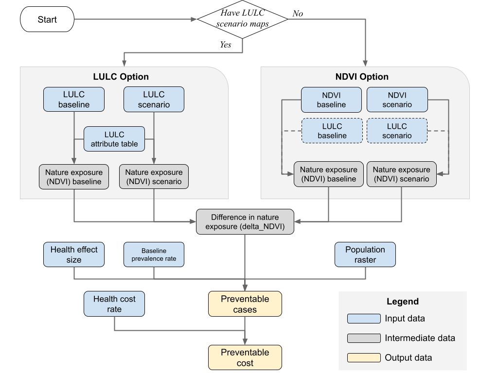

.. _urban_mental_health:

*******************
Urban Mental Health
*******************

Summary
=======

Nature in urban areas provides important opportunities for recreation and delivers a wide range of physical, social, and psychological health benefits (Bratman et al. 2019; Li et al. 2025). The Urban Mental Health Model was developed to address a critical gap in assessing how changes in urban greening may influence population-level mental health outcomes and reduce the societal costs associated with mental disorders. Alongside other Urban InVEST models, such as Urban Cooling, Urban Flood Risk, Urban Nature Access, and Urban Stormwater, this model expands the Urban InVEST suite by providing spatially explicit estimates of mental health-related benefits, thereby supporting more targeted, equitable, and cost-effective urban greening strategies.

Introduction
============

Urban nature can support psychological restoration and short-term physiological regulation by providing opportunities for brief, everyday contact with natural environments. These benefits may arise through multiple pathways, including stress reduction, attention restoration, mood regulation, and physiological effects mediated by light exposure, air quality, perceived comfort, and microbial interactions. The effects of nature exposure may be observed in improved mental health states, such as reduced stress, anxiety, and depression, as well as in physiological markers such as heart rate variability, blood pressure, and cortisol levels.

Because the mechanisms linking urban nature to human health are complex and not yet fully understood, this model focuses specifically on preventable mental health outcomes, such as depression and anxiety, for which impacts can be quantified and expressed in terms of preventable cases or preventable societal costs. In particular, the model uses residential greenness—one of the most commonly studied indicators of nature exposure—to represent the mental health benefits of urban nature. The model also recognizes that nature exposure is only one of many factors influencing health outcomes, which are also shaped by broader social, economic, and environmental conditions. Although simplified, the model is designed with sufficient flexibility to support a range of applications and modeling needs.

The Model
=========

The Urban Mental Health Model estimates the number of preventable mental disorder cases at the pixel level under alternative urban greening scenarios. Based on current data availability and model feasibility, the model focuses on residential nature exposure and uses land use scenarios to characterize changes in greenness exposure and their potential effects on mental health outcomes.

Residential nature exposure is defined here as the average surrounding greenness near a residence that may contribute to mental health benefits. This exposure is commonly measured using either average normalized difference vegetation index (NDVI, see definition `here <https://www.earthdata.nasa.gov/topics/land-surface/normalized-difference-vegetation-index-ndvi>`__) or the percentage of green space within a specified distance. In this model, average NDVI is used as the primary exposure proxy. This choice is important because health impact assessment should use an exposure metric that is as consistent as possible with the metric used to derive the underlying exposure-response relationship (Giannico et al. 2024). Most of the studies included in the meta-analyses (Rojas-Rueda et al. 2019; Liu et al. 2023) used NDVI as a proxy for nature exposure, typically based on annual average NDVI values.

To maintain consistency with those effect sizes, we recommend that users provide annual NDVI inputs whenever possible. However, if users have access to effect sizes derived from seasonal NDVI, they may instead use season-specific NDVI inputs. Users should keep in mind that some mental health outcomes, especially mental disorders, reflect longer-term exposures and may not respond strongly to short-term or highly variable changes in greenness. For this reason, the model is best suited for comparing conditions across years, even when season-specific NDVI inputs are used.

.. figure:: ./urban_mental_health/residential_nature_exposure.png
   :align: center

Figure 1. Residential nature exposure is estimated as the average NDVI within a defined buffer distance (or search radius) from each residence (illustration on the left was adapted from Labib et al. 2021).

Model Options
-------------

Land use scenarios are key to understanding how alternative land use change and associated greenery change might impact mental health benefits. To ensure best use of existing science knowledge and better communication with policy makers, we included two options for land use scenario (Figure 2).

LULC
~~~~
The first option for land use scenarios is based on land use and land cover (LULC) maps, which are commonly used by other InVEST models as well as in real-world urban planning practices. Users need to provide the baseline LULC and a LULC under a future or counterfactual scenario in order to get an estimate of the nature exposure difference, which will be measured by NDVI values, based on statistical mapping between land cover types and NDVI values (e.g., forest cover usually has a higher NDVI value than bare land and built-up land). Users therefore need to provide an LULC attribute table, which specifies the average or median NDVI values for each LULC type.

NDVI
~~~~
The second option is similar to the LULC option, with the key difference being that users provide NDVI rasters for both the baseline and scenario conditions. The model directly uses these NDVI rasters to compute neighborhood exposure without requiring LULC-to-NDVI translation.

The following section elaborates the model structure and necessary data inputs as well as the model outputs for interpretation.

Figure 2. Flowchart illustrates the main computational steps of the Urban Mental Health model, from input data processing to estimation of preventable (or additional) cases and the corresponding changes in health costs. Note: NDVI is used as a proxy of nature exposure. The dashed box indicates optional input data.

Nature Exposure (NE) Estimation
-------------------------------

To estimate changes in health risk or benefits resulting from landscape modifications—such as those driven by land use planning or land cover change—nature exposure must be assessed under both baseline and scenario conditions.

The baseline nature exposure is the actual level of greenness as measured by the average NDVI within a user-defined search radius (or buffer distance) around each residence (here, we use population pixel as the proxy in this model). Given the potential mental health benefits of blue spaces, it would be ideal to include them in exposure assessments to more fully capture the diverse contributions of natural environments to human well-being. However, water bodies typically exhibit negative NDVI values, and there is currently insufficient empirical scientific evidence to derive a reliable effect size for blue space exposure using NDVI as a proxy. Consequently, the current version of the model provides an option to exclude (mask out) pixels classified as water bodies from the greenness exposure assessment. However, if users have access to robust, peer-reviewed effect sizes linking NDVI-based blue space exposure to health outcomes, they may choose to retain water bodies for a seperate model run and analysis.

Nature exposure under a scenario condition can be estimated using one of the two options elaborated as follows, designed to leverage the best available scientific knowledge while enhancing communication with policymakers. Each option is detailed in the following subsections.

NE estimation [option 1] - Translating LULC to NDVI with attribute mapping
~~~~~~~~~~~~~~~~~~~~~~~~~~~~~~~~~~~~~~~~~~~~~~~~~~~~~~~~~~~~~~~~~~~~~~~~~~~~~~

The first approach estimates scenario-based nature exposure using land use and land cover (LULC) maps, which are widely used in other InVEST models and real-world urban planning applications. To apply this method, users must provide both a baseline LULC map and a scenario LULC map (e.g., reflecting future or counterfactual conditions). The change in nature exposure (ΔNE) is then derived by translating LULC categories into corresponding NDVI values, based on statistical relationships between land cover types and NDVI. This relationship can either be derived by the user before running the model, or can be automatically calculated by the model if the user provide an NDVI map. For example, forested areas typically exhibit higher NDVI values than bare or built-up land.

To enable this translation, users are required to supply a LULC attribute table that assigns an average or median NDVI value to each LULC type (see Table 1 for an example). Using this attribute table, the model computes :math:`NE_{baseline}` and :math:`NE_{scenario}` from the respective LULC maps, allowing for an estimation of ΔNE that reflects the projected landscape changes.

The LULC-based scenarios usually include not only the greening conversion but also the conversion of natural or vacant land into built-up areas. In such cases, the model allows for negative values in ΔNE, capturing potential declines in nature exposure. This enables policymakers to assess not only the potential health benefits of urban greening but also the health risks associated with land use changes that reduce access to greenspace.

Table 1. Sample Land use and land cover (LULC) attribute table.

====== ============================ ======= =======
lucode lu_desc                      exclude ndvi
====== ============================ ======= =======
11     Open water                   1       -0.1437
21     Developed, open space        0       0.5873
22     Developed, low intensity     0       0.3773
23     Developed, medium intensity  0       0.2305
24     Developed high intensity     0       0.1040
31     Barren land (rock/sand/clay) 0       0.1700
41     Deciduous forest             0       0.7493
42     Evergreen forest             0       0.6956
43     Mixed forest                 0       0.6931
52     Shrub/scrub                  0       0.6074
71     Grassland/herbaceous         0       0.5289
81     Pasture/hay                  0       0.5167
82     Cultivated crops             0       0.4255
90     Woody wetlands               1       0.5779
95     Emergent herbaceous wetlands 1       0.2792
====== ============================ ======= =======

Note: The \`exclude\` field identifies LULC classes that should be excluded (masked out, indicated by a value of 1) from the greenness exposure assessment. We recommend excluding water bodies, as they typically exhibit negative NDVI values and there is currently insufficient empirical evidence to establish a reliable effect size for blue space exposure using NDVI as a proxy. \`ndvi\` field specifies the average or median NDVI value associated with each LULC class. Users can derive these values by overlaying a LULC raster and an NDVI raster from the same time period (e.g., the same year or growing season) to ensure temporal consistency.

NE estimation [option 2] - Using NDVI at two time points directly
~~~~~~~~~~~~~~~~~~~~~~~~~~~~~~~~~~~~~~~~~~~~~~~~~~~~~~~~~~~~~~~~~

The second approach is similar to the LULC option, but with a key difference: users directly provide NDVI rasters for both baseline and scenario conditions. This option is particularly useful when users wish to use historical or observed data to assess the potential health benefits or risks associated with past or projected landscape changes.

NDVI-based :math:`NE_{baseline}` and :math:`NE_{scenario}` are calculated as the average NDVI within a user-defined search radius around each population pixel. The model then computes the change in nature exposure (:math:`\Delta NE`) to be used to estimate the health impacts of landscape transformation.

Water and other land cover classes can be masked out in the same manner as Option 1, i.e., based on a LULC attribute table and baseline (and optionally, alternate) LULC map provided by users. If LULC inputs are not provided, NDVI pixels that are less than 0 will be masked out to exclude water bodies from the analysis (given that NDVI values for water typically fall below 0).

Health Impact Assessment
------------------------

The model conducts a quantitative health impact assessment at the pixel level to estimate the number of preventable mental health cases resulting from changes in nature exposure. Specifically, it compares exposure under a baseline scenario with that of a counterfactual or target greening scenario.

When estimating preventable cases (:math:`PC`), the model first calculates baseline cases (:math:`BC`) for each spatial unit (e.g., region, district, or census tract), using either observed case counts or prevalence rates. If only baseline prevalence rates are available, users must provide spatialized population raster data to derive baseline case estimates.

For each pixel, the model computes the change in nature exposure (:math:`\Delta NE`) by subtracting baseline exposure (:math:`NE_{baseline}`) from the counterfactual or scenario value (:math:`NE_{scenario}`). The model then applies a dose–response function, expressed as a relative risk (:math:`RR`) per unit change in exposure (e.g., :math:`RR_{0.1NE}`), to quantify the health impact.

Using this, the preventable fraction (:math:`PF`) and associated number of preventable cases (:math:`PC`) are calculated. Confidence intervals around :math:`RR` can be incorporated to capture uncertainty. The following equations detail the full mathematical formulation of this process.

.. math:: PC = PF \times BC = PF \times (BIR \times POP)
	:label: (umh. 1)

.. math:: PF = 1 - RR
	:label: (umh. 2)

.. math:: RR = \exp \left(\ln(RR_{0.1NE}) \times 10 \times \Delta NE \right)
	:label: (umh. 3)

.. math:: NE = NE_{scenario} - NE_{baseline}
	:label: (umh. 4)

where

- :math:`PC`: preventable cases
- :math:`PF`: preventable fraction
- :math:`BC`: baseline cases. By default, baseline cases are calculated using the baseline prevalence rate and population data provided by the user.
- :math:`BIR`: baseline prevalence rate. Input data provided by users, typically sourced from national or local health agencies such as the U.S. Centers for Disease Control and Prevention (CDC). These rates are often derived from survey-based statistics and are available at various spatial levels (e.g., region, district, or census tract). If the data is provided in tabular format rather than as shapefiles, users must join it to the corresponding spatial units before using it as model input.
- :math:`POP`: population. A raster dataset provided by the user, representing the number of inhabitants per pixel across the study area. Pixels with no population should be assigned a value of 0.
- :math:`RR`: relative risk or risk ratio. A value less than 1 (:math:`RR` < 1) indicates that nature exposure is associated with a reduced risk of mental illness (protective effect), whereas a value greater than 1 (:math:`RR` > 1) indicates an increased risk (adverse association).
- :math:`NE`: nature exposure. Here, the model uses NDVI as a proxy. :math:`NE_{baseline}` is provided by the user as input, representing baseline nature exposure levels. :math:`NE_{scenario}` is typically calculated within the model based on the land use/land cover (LULC) scenario map provided by users, allowing for assessment of changes in exposure under alternative greening strategies (see Nature Exposure Estimation section for details).
- :math:`RR_{0.1NE}`: Relative risk per 0.1 :math:`NE` increase. By default, the model uses the relative risk associated with a 0.1 increase in NDVI-based nature exposure. This value must be provided by users, based on empirical studies or meta-analyses relevant to the selected health outcome. In the sample data, we derived effect sizes for depression and anxiety from a meta-analysis by Liu et al. 2023.

If the risk ratio is not available, while other effect size metrics, such as the odds ratio (:math:`OR`) is available, a commonly used method to approximate the :math:`RR` from an :math:`OR` is based on a formula proposed by Zhang and Yu (1998). This formula requires you to know or estimate the baseline risk (the prevalence of the outcome in the reference or non-exposed group).

.. math:: RR = \frac{OR}{1 - p_0 + (p_0 \cdot OR)}
	:label: (umh. 5)

Where :math:`p_0` is the baseline risk. In this context, this should be the probability of mental disorder for a population without nature exposure or with very limited nature exposure.

Health Cost Estimation
----------------------

To quantify the economic value of improved mental health outcomes, the model estimates the avoided health costs associated with the number of preventable cases identified in the health impact assessment.

For each spatial unit or pixel, the model multiplies the estimated number of preventable cases (:math:`PC`) by the corresponding cost per case (e.g., in USD Purchasing Power Parity (PPP) or local currency units per user-defined), as shown in the equation below. This cost can be based on any cost estimates that are available to the user. For societal cost used in the sample data, it represents the average economic burden of a single case of a given mental health outcome (e.g., depression or anxiety), including direct healthcare costs, productivity losses, and other social costs. If users cannot access societal cost, they can specify any format of estimate for this calculation.

.. math:: Avoided Cost = Preventable Cases \times Health Cost Rate
	:label: (umh. 6)

.. note:: A negative value for "Avoided Cost" indicates an "Additional Cost" compared to the baseline condition.

Users are required to provide a health cost rate value, which indicates illness-specific and, where available, country- or region-specific estimates of cost per case. A global meta-analysis (Christensen et al. 2020) reports societal costs of mental disorders across more than 30 countries. For instance, the societal cost per patient in the USA was estimated to be 11,000 USD PPP in the year of 2018. Where more detailed or local data are available, users are encouraged to collect such data values for increased accuracy. In the absence of granular data, national or regional averages may serve as reasonable substitutes. Given the model's focus on urban studies and the limited availability of health cost data at the sub-urban level, the current version supports uniform cost inputs at the city level. However, users may supply varying cost data across different cities to enable comparisons across diverse geographic and economic contexts. This step allows users to assess not only the health implications of urban greening scenarios, but also their potential economic co-benefits, supporting cost–benefit analyses for policy and planning decisions.

Limitations and Simplifications
===============================

Nature exposure can be characterized in several ways, including availability, accessibility or proximity (for example, as estimated by the `Urban Nature Access <https://naturalcapitalalliance.stanford.edu/invest/urban-nature-access>`__ model), and intensity of nature contact. This model focuses primarily on residential greenness, which reflects the availability dimension of nature exposure and is one of the most commonly studied indicators in the literature on urban nature and mental health. As a result, the current model does not account for: (1) blue space exposures, such as water bodies and their potential effects on mental health; and (2) other dimensions of nature exposure, including accessibility and intensity of contact, because the available evidence linking these metrics to mental health outcomes remains more limited.

In addition, the search radius used to calculate residential greenness is based on Euclidean (straight-line) distance. The model does not account for roads, barriers, or other real-world walking and transportation constraints that may influence how people actually access nearby nature.

More broadly, nature exposure represents only one component of the many factors that shape mental health outcomes. Mental health is also influenced by a wide range of social, economic, and environmental determinants. This model therefore provides a simplified representation of one pathway through which urban nature may support mental health. Despite this simplification, the model is designed with flexibility to support a range of use cases and modeling needs.

Data Needs
==========

- :investspec:`urban_mental_health workspace_dir`

- :investspec:`urban_mental_health results_suffix`

- :investspec:`urban_mental_health aoi_path`

- :investspec:`urban_mental_health population_raster`

- :investspec:`urban_mental_health search_radius`

- :investspec:`urban_mental_health effect_size`

- :investspec:`urban_mental_health baseline_prevalence_vector`

- :investspec:`urban_mental_health health_cost_rate`

- :investspec:`urban_mental_health model_option`

- :investspec:`urban_mental_health ndvi_base`

- :investspec:`urban_mental_health ndvi_alt`

- :investspec:`urban_mental_health lulc_base`

- :investspec:`urban_mental_health lulc_alt`

- :investspec:`urban_mental_health lulc_attr_csv`

  Columns:

  - :investspec:`urban_mental_health lulc_attr_csv.columns.lucode`

  - :investspec:`urban_mental_health lulc_attr_csv.columns.exclude`

  - :investspec:`urban_mental_health lulc_attr_csv.columns.ndvi`

Model Outputs
=============

.. note:: If the model option 'NDVI' is used, outputs will be aligned to the Baseline NDVI raster grid and the target pixel size will be derived from that raster. If LULC is used as the model option, the Baseline LULC raster will serve as the alignment raster and will define the target pixel size. The AOI provides the target projection and extent.

Output Folder
-------------

* **InVEST-urban-mental-health-log-....txt:** This is the logfile produced during every run of InVEST. It details the input parameters that were used for the run, and it logs all errors that may have occurred. If posting a question about a model run to community.naturalcapitalalliance.org, be sure to attach this logfile to your post!

* **urban_mental_health_report.html:** A summary of a model run, including visualizations of key outputs, tables of calculated results, and information about model inputs. The report can be accessed in the Workbench or opened with any web browser. For an example, see the `Sample Urban Mental Health Report <https://storage.googleapis.com/data.naturalcapitalproject.org/invest-reports/urban_mental_health_report.html>`_, generated by running the Urban Mental Health model with the Urban Mental Health sample data.

* **preventable_cases.tif** (Raster, count): Pixel-level estimates of preventable cases.

* **preventable_cost.tif** (Raster, currency unit): Pixel-level estimates of preventable costs. The sample data use societal cost per case, expressed in 2018 USD PPP. Users may customize the currency unit and reference year in the health cost rate table to better align with local policy priorities and economic conditions.

* **preventable_cases_cost_sum.gpkg** (Shapefile): Aggregated total preventable cases and total preventable costs by subregion (for example, census tract or ZIP code) within the area of interest. The area of interest input is used for this aggregation. The units for cases and cost are the same as \`preventable_cases.tif\` and \`preventable_cost.tif\`.

* **preventable_cases_cost_sum.csv** (CSV): Aggregated total preventable cases and total preventable costs by subregion (for example, census tract or ZIP code) within the area of interest, with an additional row reporting totals for the entire area of interest (for example, a city). The units for cases and cost are the same as \`preventable_cases.tif\` and \`preventable_cost.tif\`.

Intermediate Folder
-------------------

The intermediate folder contains temporary and processed datasets generated during model execution. These files are used to align inputs, calculate neighborhood greenness exposure, estimate baseline health conditions, and derive scenario-based changes. They are primarily intended for troubleshooting, quality control, and understanding intermediate model steps.

* **baseline_cases.tif** (Raster, count): Pixel-level baseline number of cases before applying the alternative greenness scenario.

* **baseline_prevalence.tif** (Raster, %): Pixel-level baseline prevalence rate used to estimate the baseline number of cases.

* **kernel.tif** (Raster): Distance-decay or neighborhood kernel used to calculate greenness exposure within the specified search radius.

* **lulc_base_aligned.tif** (Raster): Baseline LULC raster aligned to the model's working grid.

* **lulc_alt_aligned.tif** (Raster): Alternative-scenario LULC raster aligned to the model's working grid.

* **lulc_to_ndvi_map.csv** (CSV): Lookup table linking each LULC class to its assigned NDVI value and exclusion setting.

* **ndvi_base_aligned.tif** (Raster): Baseline NDVI raster aligned to the model's working grid.

* **ndvi_alt_aligned_masked.tif** (Raster): Alternative-scenario NDVI raster after excluded LULC classes have been masked out.

* **ndvi_base_aligned_masked.tif** (Raster): Baseline NDVI raster after excluded LULC classes have been masked out.

* **ndvi_base_buffer_mean.tif** (Raster): Baseline neighborhood greenness surface, calculated as the mean NDVI within the specified search radius. This represents baseline nature exposure.

* **ndvi_alt_buffer_mean.tif** (Raster): Alternative-scenario neighborhood greenness surface, calculated as the mean NDVI within the specified search radius. This represents scenario nature exposure.

* **ndvi_base_buffer_mean_clipped.tif** (Raster): Baseline neighborhood greenness surface, i.e., nature exposure, clipped to the analysis extent.

* **ndvi_alt_buffer_mean_clipped.tif** (Raster): Alternative-scenario neighborhood greenness surface, i.e., nature exposure, clipped to the analysis extent.

* **delta_ndvi.tif** (Raster): Pixel-level change in NDVI, as a proxy for nature exposure, between the alternative and baseline scenarios. This is calculated as ndvi_alt_buffer_mean_clipped.tif minus ndvi_base_buffer_mean_clipped.tif.

* **population_aligned.tif** (Raster, count): Population raster aligned to the model's working grid.

* **population_aligned_clipped.tif** (Raster, count): Population raster clipped to the analysis extent

Appendix: Data Sources
======================

:ref:`Land Use/Land Cover <lulc>`
---------------------------------

NDVI
----

NDVI at a resolution of 30 m can be derived from the Landsat image collections via Google Earth Engine. Users can also use Sentinel-2 or MODIS (or Moderate Resolution Imaging Spectroradiometer) imagery to derive NDVI rasters.

Population raster
-----------------

Multiple regional and global datasets exist that estimate population size and density at high resolution, such as:

- WorldPop global population data: https://www.worldpop.org/methods/populations/. For population count rasters, users are recommended to use the 100 meter resolution one: https://hub.worldpop.org/project/categories?id=3
- Meta/CIESIN global population density data: https://dataforgood.facebook.com/dfg/tools/high-resolution-population-density-maps

Search Radius
-------------

A common approach to assessing nature or greenspace exposure is to estimate vegetation availability (e.g., greenness) within buffers (search radius) around locations where people live or spend time. Users should define this radius based on human mobility patterns in their study area or draw on parameters used in empirical studies. For example, Zare Sakhvidi et al. (2025) provides methodological guidance for selecting appropriate buffer sizes (see https://doi.org/10.1016/j.lanplh.2025.101370).

Health Effect Size
------------------

The health effect size is indicator-specific and represents the relationship between nature exposure and the mental health outcome. It is given as relative risk associated with a 0.1 increase in NDVI. In the sample data, we derived effect size for depression from a meta-analysis by Liu et al. 2023. If the user has an effect size value as an odds ratio (OR), a commonly used method to approximate the relative risk from an OR is based on a formula proposed by Zhang and Yu (1998). This formula requires you to know or estimate the baseline risk (the prevalence of the outcome in the reference or non-exposed group). See Health Impact Assessment section for details.

Baseline Prevalence
-------------------

Baseline prevalence represents the rate of a specific mental health outcome (e.g., depression or anxiety) across administrative units within the study area. This data allows the model to estimate preventable cases by comparing current rates with those projected under improved nature exposure scenarios

Health cost rate
----------------

The health cost rate represents the illness-specific and, where available, country- or region-specific estimates of cost per case. A global meta-analysis (Christensen et al. 2020) reports societal costs of mental disorders across more than 30 countries. For instance, the societal cost per patient in the USA was estimated to be 11,000 USD PPP in the year of 2018.

References
==========

Bratman GN, Anderson CB, Berman MG, et al (2019) Nature and mental health: An ecosystem service perspective. Science Advances 5:eaax0903. https://doi.org/10.1126/sciadv.aax0903

Christensen MK, Lim CCW, Saha S, et al (2020) The cost of mental disorders: a systematic review. Epidemiology and Psychiatric Sciences 29:e161. https://doi.org/10.1017/S204579602000075X

Giannico OV, Sardone R, Bisceglia L, et al (2024) The mortality impacts of greening Italy. Nat Commun 15:10452. https://doi.org/10.1038/s41467-024-54388-7

Labib SM, Huck JJ, Lindley S (2021) Modelling and mapping eye-level greenness visibility exposure using multi-source data at high spatial resolutions. Science of The Total Environment 755:143050. https://doi.org/10.1016/j.scitotenv.2020.143050

Li Y, Mao Y, Mandle L, et al (2025) Acute mental health benefits of urban nature. Nat Cities 2:720-731. https://doi.org/10.1038/s44284-025-00286-y

Liu Z, Chen X, Cui H, et al (2023) Green space exposure on depression and anxiety outcomes: A meta-analysis. Environmental Research 231:116303. https://doi.org/10.1016/j.envres.2023.116303

Rojas-Rueda D, Nieuwenhuijsen MJ, Gascon M, et al (2019) Green spaces and mortality: a systematic review and meta-analysis of cohort studies. The Lancet Planetary Health 3:e469-e477. https://doi.org/10.1016/S2542-5196(19)30215-3

Zhang J, Yu KF (1998) What's the Relative Risk?A Method of Correcting the Odds Ratio in Cohort Studies of Common Outcomes. JAMA 280:1690-1691. https://doi.org/10.1001/jama.280.19.1690
