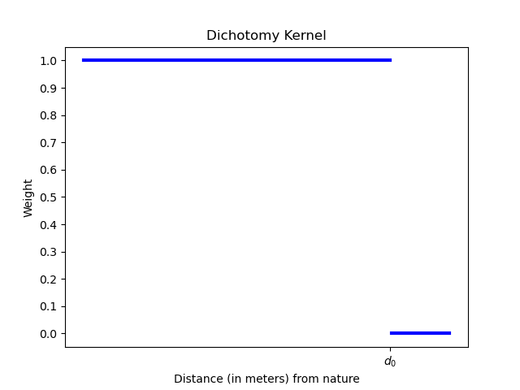
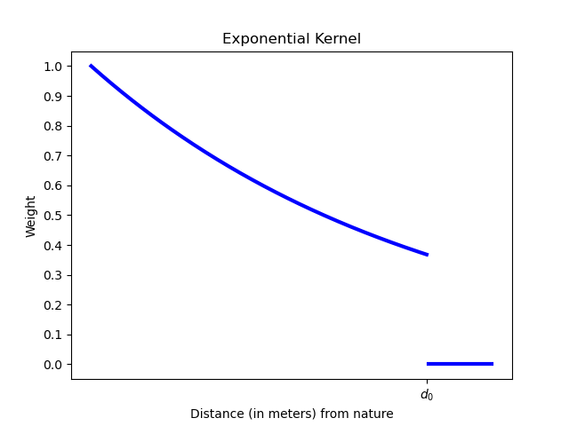
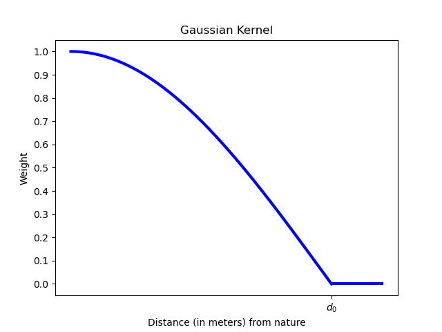
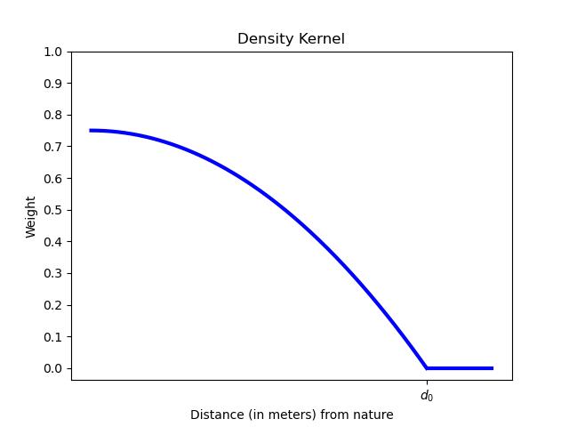
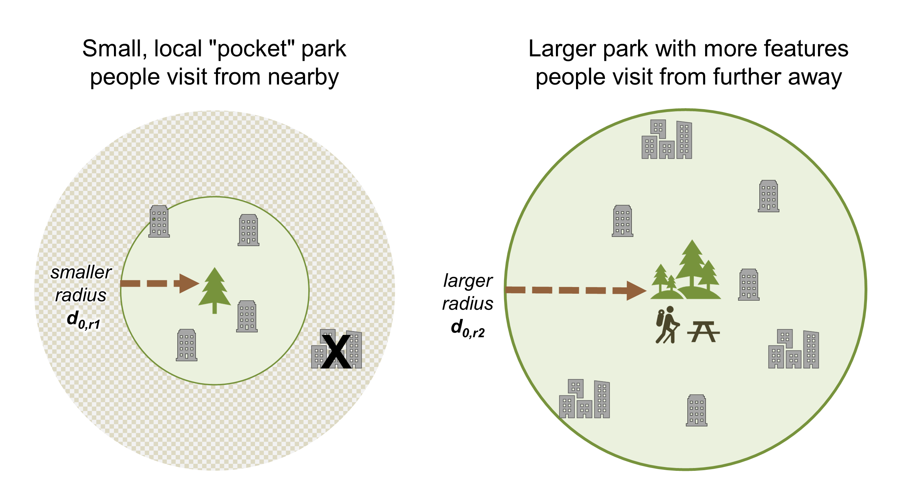
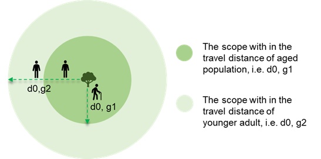
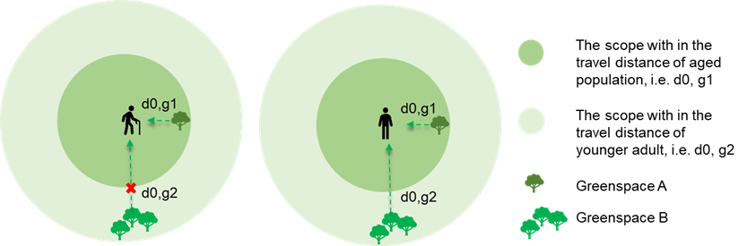

===================
Urban Nature Access
===================

Summary
=======

Nature in urban areas provides important opportunities for recreation.
The model for urban nature access provides a measure of both the supply
of urban nature and the demand for nature by the urban population,
ultimately calculating the balance between supply and demand. Both urban
nature and population can optionally be divided into different groups.
Supply is determined by the type, size, proximity, and quality of urban nature
that is accessible per capita for recreational purposes. Demand is
determined as natural space per capita, as typically required by policy
or standards. The balance quantifies the extent to which supply meets
demand, at the individual, administrative, and city level.

Introduction
============

Nature in urban areas provides important opportunities for recreation,
along with social, psychological, and physical health benefits (Bratman
et al. 2019, Keeler et al. 2019, Remme et al. 2021). As reviewed by Liu
et al. (2022), assessing nature-based recreation requires an
understanding of i) urban nature “supply", which itself depends on
availability and quality, and ii) urban nature “demand”, which depends
on people’s preferences or policy requirements.

This InVEST model follows the structure described in Liu et al. (2022),
by assessing the supply and demand for urban nature and the local
supply-demand balance, which identifies areas with a surplus or deficit
(positive or negative balance, respectively) of urban nature, with
respect to a policy standard (Liu et al., 2022). In doing so, the model
focuses on nature access in urban areas. Because the model is capable of
modeling supply, demand, and balance of many types of urban nature, such
as parks, greenspaces, wetlands, and shorelines, we refer to the model
here as the urban nature access model. It is up to the user to choose
which components of urban nature to include in their analysis.

The default model assesses overall urban nature supply, demand, and
balance for the total urban population. In addition, three optional
extensions of the core model can be used to provide more detailed
results:

-  Urban nature supply, demand, and balance can be summarized to
      different groups within the population (e.g., by different age
      groups, levels of income, race or ethnicity, etc.), which may be
      important for equity considerations. See
      :ref:`una-summarize-by-population-groups`

-  For a more detailed understanding of the supply of urban nature, the
      user may optionally provide more detailed information on how far
      people are likely to travel to make use of different kinds of
      urban nature. For example, people may travel farther to visit
      large parks as compared to local pocket parks. See
      :ref:`una-radii-per-urban-nature-class`

-  For a more detailed understanding of the supply of urban nature to
      different population groups, the user may optionally provide
      information on how far different groups are likely to travel to
      reach urban nature. For example, people who own cars may travel
      further to recreate than people who rely on public transit.
      See :ref:`una-radii-per-population-group`

The Model
=========

The model calculates urban nature access based on the location and
amount of urban nature, the location and number of people, and the
per-capita need or demand for urban nature. The area of urban nature in pixel
:math:`j` is represented as :math:`S_j`. Values of :math:`S_j` are in square
meters, where the proportion of the area of a pixel that is covered by urban
nature is defined in the land use/land cover (LULC) Attribute Table. The population in pixel
:math:`i` is represented by :math:`P_i`. Per capita requirements for urban
nature are specified as :math:`g_{cap}`, and are often based on policy targets.
Together, these components are used to calculate the following three main
metrics, described in greater detail in :ref:`una-running-the-default-model`:

-  **Urban nature supply:** the amount of urban nature supplied to the
      population residing in a pixel

-  **Urban nature demand:** the amount of urban nature required/demanded
      by the population in a pixel

-  **Urban nature balance:** the difference between the urban nature supplied
      to a pixel and what is demanded by the population in that pixel 

Decay Function
--------------

People use nature areas more frequently if they are closer to their
homes (Andkjaer & Arvidsen, 2015). This frequency diminishes as distance
increases. This is referred to as 'distance decay'. The model describes
this distance decay between urban nature and the population by the decay
function :math:`f\left( d_{ij} \right)` where :math:`d_{ij}` is the
distance between nature and a population pixel, and :math:`d_{0}` is a user-defined
search distance within which to search for nature pixels. Search distance is
always Euclidean distance (straight-line distance between the
center points of pixels A and B) and assumes square pixels.

  .. figure:: ./urban_nature_access/decay_function_intro.png
          :align: center
          :figwidth: 400px

This model provides various distance-decay functions for the user to
choose among, which are defined and illustrated in greater detail below.
The **dichotomy** option treats all pixels within a set search distance
from a pixel as equally accessible. This option is recommended when a
policy for urban nature or greenspace targets a certain amount of nature
within a particular distance from people’s residences. For example, the
Netherlands set a target of at least :math:`60m^2` urban nature per person
within 500m of households (Roo et al. 2011).

For studies taking into account the decay of the service of urban nature, more
realistically representing the probability to visit urban nature, the
decay function should match available visitation data. Therefore, three
additional distance-decay functions are available – **exponential,
Gaussian,** and **density**. All assign more weight to urban nature
located closer to people, reflecting people's increased likelihood of
visiting nature closer to them.

Dichotomy
---------

The dichotomous kernel considers all pixels within the search distance
:math:`d_{0}` from a pixel with nature to be equally accessible. 

.. math::

        \begin{align*}
        f(d_{ij}, d_0) &= \left\{\begin{array}{lr}
                1 & \text{if} d_{ij} \leq d_0 \\
                0 & \text{if} d_{ij} > d_0 \\
        \end{array}\right\} \\
        \end{align*}

Exponential
-----------

A distance-weighted exponential decay function, where people are more likely to visit the nature closest to them, with likelihood falling off exponentially out to the maximum radius :math:`d_{0}`.

.. math::

        \begin{align*}
        f(d_{ij}, d_0) &= \left\{\begin{array}{lr}
                e^{(-d_{ij}/d_0)} & \text{if} d_{ij} \leq d_0 \\
                0 & \text{if} d_{ij} \gt d_0 \\
        \end{array}\right\} \\
        \end{align*}

..
  Power
  *****

  The power kernel requires the user to define their own rate of decay, defined
  by the user's selection of the parameter :math:`\beta`.

  .. math::

          \begin{align*}
          f(d_{ij}, d_0) &= \left\{\begin{array}{lr}
                  d_{ij}^{(-\beta)} & \text{if} d_{ij} \leq d_0 \\
                  0 & \text{if} d_{ij} \gt d_0 \\
          \end{array}\right\} \\
          \end{align*}

  .. figure:: ./urban_nature_access/kernel-power.png
          :align: center
          :figwidth: 500px

Gaussian
--------

A distance-weighted decay function, where people are more likely to visit the nature closest to them, with
likelihood decreasing according to a normal ("gaussian") distribution with a sigma of 3, out to the maximum radius
:math:`d_{0}`.

.. math::

        \begin{align*}
        f(d_{ij}, d_0) &= \left\{\begin{array}{lr}
                \frac{e^{-\frac{1}{2}\left ( \frac{d_{ij}}{d_0} \right )^2}-e^{-\frac{1}{2}}}{1-e^{-\frac{1}{2}}} & \text{if} d_{ij} \leq d_0 \\
                0 & \text{if} d_{ij} \gt d_0 \\
        \end{array}\right\} \\
        \end{align*}

Density
-------

A distance-weighted decay function, where people are more likely to visit the nature closest to them, with
likelihood decreasing faster as distances appoach the search radius :math:`d_{0}`.

.. math::

        \begin{align*}
        f(d_{ij}, d_0) &= \left\{\begin{array}{lr}
                \frac{3}{4}\left(1-\left(\frac{d_{ij}}{d_{0}}\right)^{2}\right) & \text{if} d_{ij} \leq d_0 \\
                0 & \text{if} d_{ij} \gt d_0 \\
        \end{array}\right\} \\
        \end{align*}

.. _una-running-the-default-model:

Running the Default Model
-------------------------

The default model assumes a uniform radius of travel ("search radius")
that is defined by the user, i.e. only nature within an X meter distance
of someone’s home contributes to a person’s recreational benefit.

Calculating Urban Nature Supply
~~~~~~~~~~~~~~~~~~~~~~~~~~~~~~~

The calculation of urban nature supply to each population pixel uses the
Two-Step Floating Catchment Area (2SFCA) method (Mao and Nekorchuk,
2013; Xing et al., 2018). Given an urban nature pixel :math:`j`, all
population pixels with the search radius :math:`d_{0}` are searched. The
urban nature/population ratio :math:`R_{j}` for this pixel is calculated
using the nature pixel's area :math:`S_{j}` divided by the total
population within the search radius, weighted according to the selected
search kernel's distance-based weighting. Then, centered on each pixel
in the population raster, all the natural pixels within its
distance-weighted catchment are searched. All of the :math:`R_{j}` of
these natural pixels are summed to calculate the urban nature supply per
capita :math:`A_{i}` to every population pixel. We take this approach for supply, rather than simply the amount of nature within a radius of a home, because using a gravity-based approach takes into account the weighted availability of nature. In other words, 2SFCA considers the context that a lot of people use greenspace which is common in a city area.

This can be graphically understood as:

.. figure:: ./urban_nature_access/2SFCA_step1_v2.png
        :align: center
        :figwidth: 400px

        Step 1: Locating populations within the search radius of urban nature.

.. figure:: ./urban_nature_access/2SFCA_step2_v2.png
        :align: center
        :figwidth: 400px

        Step 2: Locating urban nature within the search radius of populations.

More formally, the urban nature/population ratio :math:`R_{j}` is
defined as:

.. math::
        \begin{align*}
        R_j &= \left\{\begin{array}{lr}
                \frac{S_j}{\sum_{k \in \left\{d_{jk} \leq d_0  \right\}} P_k \cdot f(d_{jk})} & \text{if} P_k \cdot f(d_{jk}) >= 1 \\
                S_j & \text{otherwise} \\
        \end{array}\right\} \\
        \end{align*}

Where:

-  :math:`R_{j}` is the urban nature/population ratio of nature pixel :math:`j`.
-  :math:`S_{j}` is the area of nature in pixel :math:`j`
-  :math:`d_{0}` is the search radius
-  :math:`k` is the population pixel within search radius of natural pixel :math:`j`
-  :math:`d_{jk}` is the distance between natural pixel :math:`j` and population pixel :math:`k`.
-  :math:`P_{k}` is the population of pixel :math:`k`.
-  :math:`f(d)` is the selected decay function.

Then, the urban nature/population ratio is weighted by the selected
decay function and summed within the search radius to give greenspace
supply, :math:`A_{i}`:

.. math::

        A_i = \sum_{j \in \left\{d_{ij} \leq d_0  \right\}} R_j \cdot f(d_{ij})

Where:

-  :math:`i` is any pixel in the population raster
-  :math:`A_{i}` is the urban nature per capita supplied to pixel :math:`i` (square meters per person)
-  :math:`d_{ij}` is the distance between pixel :math:`i` and natural pixel :math:`j`.
-  :math:`d_{0}` is the search radius

Calculate Urban Nature Demand
~~~~~~~~~~~~~~~~~~~~~~~~~~~~~

Derived from the population layer and the user-defined urban nature
demand, this measures the amount of accessible urban nature required to
adequately supply all people in each pixel.

.. math::
        demand_{i} = P_{i} \cdot g_{cap}

Where:

-  :math:`i` is a pixel
-  :math:`demand_{i}` is the required area of urban nature (in square meters) needed by the population residing at pixel :math:`i` in order to fully satisfy their urban nature needs.
-  :math:`P_{i}` is the population (people per pixel) at pixel :math:`i`
-  :math:`g_{cap}` is the user-defined per-capita urban nature requirement (square meters per person)

Calculate Urban Nature Balance
~~~~~~~~~~~~~~~~~~~~~~~~~~~~~~

Local planning documents or urban planning goals often state that every
resident in a region should be allocated a certain amount of nature,
:math:`g_{cap}`. The per-capita urban nature supply/demand budget
:math:`SUP\_ DEM_{i,cap}` at pixel :math:`i`, is defined by assessing
the balance between the supplied urban nature and the planning goal for
nature (often greenspace) per capita per pixel:

.. math::
        SUP\_DEM_{i,cap} = A_i - g_{cap}

To determine the balance for all people in each pixel,
:math:`SUP\_ DEM_{i,cap}` is multiplied by the population :math:`P_{i}`
at pixel :math:`i`:

.. math::

        SUP\_DEM_{i} = SUP\_DEM_{i,cap} \cdot P_i

Calculate Accessible Urban Nature
~~~~~~~~~~~~~~~~~~~~~~~~~~~~~~~~~

It is often useful to find the total area within the given search radius, given by:

.. math::
        accessible_{i} = \sum_{j \in \left\{d_{ij} \leq d_{0} \right\}}{S_j \cdot f(d_{ij})}

Where :math:`accessible_{i}` is the total area of urban nature accessible to
pixel :math:`i` within the search radius :math:`d_0`, weighted by the decay
function.

Summarizing Outputs to Administrative Units
~~~~~~~~~~~~~~~~~~~~~~~~~~~~~~~~~~~~~~~~~~~

The user must provide a vector with administrative unit boundaries that
may represent any district level that the user is interested in. These
boundaries are needed to obtain administrative-level measurements.

The administrative level supply/demand balance is the sum of the balance
of each pixel :math:`i` within the administrative boundary :math:`adm`:

.. math::

        SUP\_DEM_{adm} = \sum_{i \in \left\{adm \right\}} SUP\_DEM_i

:math:`SUP\_ DEM_{adm}` indicates how much urban nature, in square
meters, is under- or over-supplied in an administrative unit.

The average per-capita urban nature supply/demand balance is also
calculated at the administrative level:

.. math::

        SUP\_DEM_{adm,cap} = \frac{SUP\_DEM_{adm}}{P_{adm}}

Where :math:`P_{adm}` is the total population within the administrative
boundary.

When :math:`SUP\_ DEM_{i,cap} < 0` on any given pixel :math:`i`, it
indicates that people in this pixel are under-supplied with urban
nature. Summing up these populations across all pixels within an
administrative unit provides the number of people in an administrative
unit with an urban nature deficit, :math:`Pund_{adm}`, relative to the
recommended urban nature :math:`g_{cap}`:

.. math::
        Pund_{adm} = \sum_{i \in \{adm\}}
                \left\{
                        \begin{array}{lr}
                        P_{i} & \text{if} SUP\_DEM_{i,cap} < 0 \\
                        0 & \text{otherwise} \\
                        \end{array}
                \right\}

Similarly, the same rationale is applied to find the number of people
with an urban nature surplus in an administrative unit,
:math:`Povr_{adm}`, relative to the recommended urban nature
:math:`g_{cap}`:

.. math::
        Povr_{adm} = \sum_{i \in \{adm\}}
                \left\{
                        \begin{array}{lr}
                        P_{i} & \text{if} SUP\_DEM_{i,cap} > 0 \\
                        0 & \text{otherwise} \\
                        \end{array}
                \right\}

.. _una-radii-per-urban-nature-class:

Running the Model with Radii Defined Per Urban Nature Class
-----------------------------------------------------------

Urban nature has different types. Pocket parks provide convenient
recreation experience nearby, while municipal parks attract people from
more distant places. If the user has data to split the types of urban
nature and to adjust the travel distance for each type of urban nature,
the accessibility of each type of urban nature to pixel :math:`i` can be
calculated using the class-specific radius. These urban nature types and
their associated search radii are provided to the model by user input in
the Land Use Land Cover (LULC) attribute table. Each type of LULC
classification marked as urban nature will be calculated separately in
order to give more detailed results concerning the accessible urban
nature of each type. It is up to the user to decide how to split the
urban nature.

If :math:`r` is the type of urban nature, :math:`j` is an urban nature
pixel of :math:`r` type, :math:`d_{0,r}` is the search radius for
:math:`r` type of urban nature , then the urban nature/population ratio
for this urban nature type is calculated by the area of this urban
nature divided by the population within the radius weighted by the
user's selection of distance-weighted decay function:

.. math::
        R_{j,r} = \frac{S_{j,r}}{
                        \sum_{k \in \{d_{kj} \leq d_{0,r}\}}{P_k \cdot f(d_{jk})}
                }

The accessibility of urban nature type :math:`r`, :math:`A_{i,r}` to
pixel :math:`i` is calculated by summing up the distance-weighted
:math:`R_{j,r}` within the search radius:

.. math::
        A_{i,r} = \sum_{j \in d_{ij} \leq d_{0,r}}{R_{j,r} \cdot f(d_{ij})}

The total urban nature supplied to pixel :math:`i`, :math:`A_{i}` is
calculated by adding up the :math:`A_{i,r}` across all types of urban
nature:

.. math::
        A_i = \sum_{r=1}^{r}{A_{i,r}}

Accessible urban nature in this mode is calculated by:

.. math::
        accessible_{i,r} = \sum_{j \in \left\{d_{ij} \leq d_{0,r} \right\}}{S_{j,r} \cdot f(d_{ij})}

Where :math:`accessible_{i,r}` is the total area of urban nature of class
:math:`r` accessible within the search radius, weighted by the decay function.
:math:`S_{j,r}` is the area of urban nature on pixel :math:`j` of urban nature
class :math:`r`.

Other steps and outputs are the same as in the core model.

.. _una-summarize-by-population-groups:

Running the Model with Results Summarized by Population Groups
--------------------------------------------------------------

The user has the option to provide population characteristics indicating
the proportion of the total population that belong to a given
population group within each administrative unit. Examples of population
groups might be age or income brackets. The user will decide how to
split the population according to data availability and the study
objective.

To analyze the supply-demand balance for certain groups within the
general population, an additional calculation is done for each group
:math:`gn`, given the proportion of the group in the total population of
an administrative unit, :math:`Rp,gn`.

For the undersupplied population within group :math:`gn` and
administrative unit :math:`adm`, this is defined as:

.. math::
        Pund_{adm,gn} = Pund_{adm} \cdot Rp,gn

And for the oversupplied population within group :math:`gn` and
administrative unit :math:`adm`:

.. math::
        Povr_{adm,gn} = Povr_{adm} \cdot Rp,gn

The user may wish to conduct further correlation analysis between
population characteristics and the above outputs to see if certain
groups of people are associated with deficit or surplus urban nature
supply at different levels.

.. _una-radii-per-population-group:

Running the Model with Radii Defined per Population Group
---------------------------------------------------------

The search radius has an important impact on urban nature supply and
different populations have different radii. For example, people with a
car can travel further for recreation, or elderly people may travel
shorter distances (Liu et al., 2022). This group-specific search radius
:math:`d_{0,gn}`, is defined by the user for each group :math:`gn` along
with the proportion of the total population within an administrative
unit belonging to this group. Given these two group-specific pieces of
information, the urban nature supplied to each group in a pixel,
:math:`A_{i,gn}` can be obtained.

First, the urban nature area will be divided among the population within
its search radius, :math:`R_{j}`. Since different groups have different
radii (see Figure below), the total served population is the sum of each
group within their respective search radius. Population at pixel
:math:`i` consists of different groups. The size of the group :math:`gn`
in pixel :math:`i` is calculated by:

.. math::
        P_{i,gn} = P_i \cdot Rp,gn

where :math:`P_{i}` is the population at pixel :math:`i`, and
:math:`Rp,gn` is the proportion of this group in the total population
within each individual administrative unit.

.. math::
        R_j  = \frac{S_j}{
                        \sum_{gn=1}^{gn} \left( \sum_{k \in \{d_{kj} \leq d_{0,gn} \}}{ P_{k,gn} \cdot f(d_{jk})} \right)
                }

   Urban nature provides service to older adults within d0, g1
   (the radius for this population group), and provides service to younger
   adults within d0, g2 (the radius for that population group).

Urban nature supply to group :math:`gn` by pixel :math:`i` is calculated
by (and conceptually exemplified in the Figure below):

.. math::
        A_{i,gn} = \sum_{j \in \{d_{ij} \leq d_{0,gn}\}} R_j \cdot f(d_{ij})

   Aged population only receive service from greenspace within d0,
   g1, i.e., greenspace A; Younger adults receive service from greenspaces
   within d0, g2, i.e., greenspace A and greenspace B.

The average urban nature supply per capita to pixel :math:`i` is
calculated by a weighted sum of :math:`A_{i,gn}`:

.. math::
        A_i = \sum_{n=1}^{n}{A_{i,gn} \cdot Rp,gn}

The per-capita urban nature balance at pixel :math:`i`,
:math:`SUP\_ DEM_{i,cap}` is defined by assessing the difference between
the supplied urban nature to pixel :math:`i` and the user-defined
planning goal for urban nature per capita, :math:`g_{cap}`:

.. math::
        SUP\_DEM_{i,cap} = A_i - g_{cap}

The per-capita urban nature balance of group :math:`gn` at pixel
:math:`i` (:math:`SUP\_ DEM_{i,cap,gn}`) is defined by assessing the
difference between the supplied urban nature to group :math:`gn` at
pixel :math:`i` and the planning goal for urban nature per capita,
:math:`g_{cap}`:

.. math::
        SUP\_DEM_{i,cap,gn} = A_{i,gn} - g_{cap}

:math:`P_{i,gn}` is the population of group :math:`gn` at pixel
:math:`i`. The population of the group :math:`gn` in pixel :math:`i`
multiplied by the per capita urban nature balance of the same group,
(:math:`SUP\_ DEM_{i,cap,gn}`), will give the urban nature area
supply-demand balance of that group at pixel :math:`i`. Summing the
supply-demand balance of all groups at pixel *i* will generate the
supply-demand balance for all people at pixel *i*
(:math:`SUP\_ DEM_{i}`).

.. math::
        SUP\_DEM_i = \sum_{gn=1}^{gn}{SUP\_DEM_{i,cap,gn} \cdot P_{i,gn}}

Summing the supply-demand balance at each pixel within administrative
units will result in the administrative level supply-demand balance.

.. math::
        SUP\_DEM_{adm} = \sum_{i=1}^{i}{SUP\_DEM_i}

To give an administrative level per capita urban nature supply-demand
balance, administrative level urban nature supply and demand balance
:math:`SUP\_ DEM_{adm}` is divided by the total population of the
administrative unit :math:`P_{adm}`:

.. math::
        SUP\_DEM_{adm,cap} = \frac{SUP\_DEM_{adm}}{P_{adm}}

To calculate the average per-capita supply-demand balance of group
:math:`gn` with an administrative unit :math:`adm`, the model multiplies
the greenspace balance :math:`SUP\_ DEM_{i,cap,gn}` by the population of
group :math:`gn` at pixel :math:`i`, and then summed up for all pixels
in :math:`adm` and divided by the population of group :math:`gn` within
:math:`adm`.

.. math::
        SUP\_DEM_{adm,cap,gn} = \frac{
                        \sum_{i \in \{adm\}}{SUP\_DEM_{i,cap,gn} \cdot P_{i,gn}}
                }{
                        P_{adm,gn}
                }

To analyze the supply-demand balance for certain groups within the
general population, an additional calculation is done.

The population of group :math:`gn` who has a urban nature deficit within
administrative unit :math:`adm` is given by:

.. math::
        Pund_{adm,gn} = \sum_{i \in \{adm\}}
                \left\{
                        \begin{array}{lr}
                        P_{i,gn} & \text{if} SUP\_DEM_{i,cap,gn} < 0 \\
                        0 & \text{otherwise} \\
                        \end{array}
                \right\}

The total under-supplied population within administrative unit
:math:`adm` is given by:

.. math::
        Pund_{adm} = \sum_{gn=1}^{gn}{Pund_{adm,gn}}

The population of group :math:`gn` who has a urban nature surplus within
administrative unit :math:`adm` is given by:

.. math::
        Povr_{adm,gn} = \sum_{i \in \{adm\}}
                \left\{
                        \begin{array}{lr}
                        P_{i,gn} & \text{if} SUP\_DEM_{i,cap,gn} > 0 \\
                        0 & \text{otherwise} \\
                        \end{array}
                \right\}

The total over-supplied population within administrative unit
:math:`adm` is given by:

.. math::
        Povr_{adm} = \sum_{gn=1}^{gn}{Povr_{adm,gn}}

Accessible urban nature in this mode is calculated by:

.. math::
        accessible_{i,gn} = \sum_{j \in \left\{d_{ij} \leq d_0 \right\}} S_{j,gn} \cdot f(d_{ij})

Where :math:`accessible_{i,gn}` is the total area of urban nature  accessible
to population group :math:`gn` within the search radius, weighted by the decay
function. :math:`S_{j,gn}` is the area of urban nature on pixel :math:`j`
accessible to group :math:`gn`.

Limitations and Simplifications
===============================

Search distances (radii) are Euclidian (straight-line), the model does not consider roads or other real-world walking/transportation constraints.

The model does not take into account the total size of greenspace patches, it only evaluates the different greenspace classes and their attributes per pixel. A workaround for this is to define different land use classes based on size, such as "small parks" and "large parks". Then you can define a different visitation radius for each size class.

Demand uses a generic calculation (m2 per capita), while citites often take different approaches to quantifying demand. Additionally, there are no official international metrics for demand that can be easily applied, so local knowledge is needed.

Model output can be used as a proxy for recreation and health benefits, but it is not an ideal indicator for the complexity of human-nature relationships.

Data Needs
==========

.. note::
    Sample data are supplied to provide examples of requirements and
    formatting.

.. note::
    All spatial inputs must be in the same projected coordinate system and
    in linear meter units. Outputs will be resampled to match the
    squared-off resolution and spatial projection of the LULC.

-  :investspec:`urban_nature_access workspace_dir`

-  :investspec:`urban_nature_access results_suffix`

-  :investspec:`urban_nature_access lulc_raster_path`

-  :investspec:`urban_nature_access lulc_attribute_table`

   Columns:

   -  :investspec:`urban_nature_access lulc_attribute_table.columns.lucode`
   -  :investspec:`urban_nature_access lulc_attribute_table.columns.urban_nature`
   -  :investspec:`urban_nature_access lulc_attribute_table.columns.search_radius_m`

-  :investspec:`urban_nature_access population_raster_path`

-  :investspec:`urban_nature_access admin_boundaries_vector_path`

      Fields:

      -  :investspec:`urban_nature_access admin_boundaries_vector_path.fields.pop_[POP_GROUP]`

      Example attribute table for an administrative boundaries vector
      with 3 geometries:

      +--------------+----------------+
      | **pop_male** | **pop_female** |
      +==============+================+
      | 0.56         | 0.44           |
      +--------------+----------------+
      | 0.42         | 0.58           |
      +--------------+----------------+
      | 0.38         | 0.62           |
      +--------------+----------------+

-  :investspec:`urban_nature_access urban_nature_demand`

-  :investspec:`urban_nature_access decay_function`

-  :investspec:`urban_nature_access search_radius_mode`

-  :investspec:`urban_nature_access aggregate_by_pop_group`

-  :investspec:`urban_nature_access search_radius`

-  :investspec:`urban_nature_access population_group_radii_table`

    Columns:

    -  :investspec:`urban_nature_access population_group_radii_table.columns.pop_group`

    -  :investspec:`urban_nature_access population_group_radii_table.columns.search_radius_m`

    Example of a table matching the groups in the administrative
    boundaries vector above:

    +---------------+---------------------+
    | **pop_group** | **search_radius_m** |
    +===============+=====================+
    | pop_male      | 900                 |
    +---------------+---------------------+
    | pop_female    | 1200                |
    +---------------+---------------------+

..
    -  :investspec:`urban_nature_access decay_function_power_beta`

Interpreting Results
====================

Output Folder
-------------

-  **output/urban_nature_supply_percapita.tif** The calculated supply of urban
      nature. Units: urban nature per capita supplied to pixel i (square
      meters per person).

-  **outputs/urban_nature_demand.tif** The required area of urban nature
      needed by the population residing each pixel in order to fully
      satisfy their urban nature needs. Higher values indicate a greater
      demand for accessible urban nature from the surrounding area.
      Units: square meters urban nature per pixel.

-  **output/urban_nature_balance_percapita.tif** The pixel-level value
      of urban nature balance per capita. Positive pixel values indicate
      an oversupply of urban nature relative to the stated urban nature
      demand. Negative values indicate an undersupply of urban nature
      relative to the stated urban naturedemand. This output is of
      particular interest to interpret where individuals are most nature
      deprived. Units: Square meters of urban nature deficit or
      oversupply per person.

-  **outputs/urban_nature_balance_totalpop.tif** The urban nature balance
      for the total population in a pixel. Positive pixel values
      indicate an oversupply of urban nature relative to the stated
      urban nature demand. Negative values indicate an undersupply of
      urban nature relative to the stated urban nature demand. This
      output is of particular relevance to understand the total amount
      of nature deficit for the population in a particular pixel. Units:
      square meters of urban nature deficit or oversupply per pixel.

-  **output/admin_boundaries.gpkg** A copy of the user's administrative
      boundaries vector with a single layer.

   -  SUP_DEMadm_cap - the average urban nature supply/demand balance
         available per person within this administrative unit.

   -  Pund_adm - the total population within the administrative unit
         that is undersupplied with urban nature.

   -  Povr_adm - the total population within the administrative unit
         that is oversupplied with urban nature.

   If the user has selected to aggregate results by population group or
      has elected to run the model with search radii defined per
      population group, these additional fields will be created:

   -  SUP_DEMadm_cap_[POP_GROUP] - the average urban nature supply/demand
         balance available per person in population group POP_GROUP
         within this administrative unit.

   -  Pund_adm_[POP_GROUP] - the total population belonging to the
         population group POP_GROUP within this administrative unit that
         are undersupplied with urban nature.

   -  Povr_adm_[POP_GROUP] - the total population belonging to the
         population group POP_GROUP within this administrative unit that
         is oversupplied with urban nature.

Other files in the output directory vary depending on the selected search
radius mode:

Uniform Search Radius
~~~~~~~~~~~~~~~~~~~~~

- **output/accessible_urban_nature.tif** - the area of urban nature accessible
      within the provided search radius, weighted by the decay function.
      Units: square meters.

Search Radii Defined per Urban Nature Class
~~~~~~~~~~~~~~~~~~~~~~~~~~~~~~~~~~~~~~~~~~~

- **output/accessible_urban_nature_lucode_[LUCODE].tif** - the area of urban
      nature of class LUCODE within the provided search radius for this lucode,
      weighted by the decay function.  Units: square meters.

Search Radii Defined per Population Group
~~~~~~~~~~~~~~~~~~~~~~~~~~~~~~~~~~~~~~~~~

- **output/accessible_urban_nature_to_[POP_GROUP].tif** - the area of urban
      nature accessible to the population group POP_GROUP given the search
      radius for the population group, weighted by the decay function.  Units:
      square meters.

Intermediate Folder
-------------------

These files will be produced in every search radius mode:

-  **intermediate/aligned_lulc.tif** A copy of the user’s land use land
      cover raster. If the user-supplied LULC has non-square pixels,
      they will be resampled to square pixels.

-  **intermediate/aligned_population.tif** The user's population raster,
      aligned to the same resolution and dimensions as the aligned LULC.
      Units: people per pixel.

-  **intermediate/undersupplied_population.tif** Each pixel represents
      the population in the total population that are experiencing an
      urban nature deficit. Units: people per pixel.

-  **intermediate/oversupplied_population.tif** Each pixel represents
      the population in the total population that are experiencing an
      urban nature surplus. Units: people per pixel.

Other files found in the intermediate directory vary depending on the
selected search radius mode:

Uniform Search Radius
~~~~~~~~~~~~~~~~~~~~~

-  **intermediate/distance_weighted_population_within_[SEARCH_RADIUS].tif**
      A sum of the population within the given search radius SEARCH_RADIUS,
      weighted by the user's decay function. Units: people per pixel.

-  **intermediate/urban_nature_area.tif** Pixels values represent the
      area of urban nature(in square meters) represented in each pixel.
      Units: square meters.

-  **intermediate/urban_nature_population_ratio.tif** The calculated
      urban nature/population ratio.

Search Radii Defined per Urban Nature Class
~~~~~~~~~~~~~~~~~~~~~~~~~~~~~~~~~~~~~~~~~~~

-  **intermediate/distance_weighted_population_within_[SEARCH_RADIUS].tif**
      A sum of the population within the given search radius SEARCH_RADIUS,
      weighted by the user's decay function. Units: people per pixel.

-  **intermediate/urban_nature_area_[LUCODE].tif** Pixel values
      represent the area of urban nature(in square meters) represented
      in each pixel for the urban nature class represented by the land
      use land cover code LUCODE. Units: square meters.

-  **intermediate/urban_nature_population_ratio_lucode_[LUCODE].tif**
      The calculated urban nature/population ratio calculated for the
      urban nature class represented by the land use land cover code
      LUCODE.  Units: square meters per person

-  **intermediate/urban_nature_supply_percapita_lucode_[LUCODE].tif** The urban
      nature supplied to populations due to the land use land cover class
      LUCODE. Units: square meters per person

Search Radii Defined per Population Group
~~~~~~~~~~~~~~~~~~~~~~~~~~~~~~~~~~~~~~~~~

-  **output/urban_nature_balance_[POP_GROUP].tif** Positive pixel values
      indicate an oversupply of urban nature relative to the stated
      urban nature demand to the population group POP_GROUP. Negative
      values indicate an undersupply of urban nature relative to the
      stated urban nature demand to the population group POP_GROUP.
      Units: Square meters of urban nature per person.

-  **intermediate/urban_nature_area.tif** Pixels values represent the
      area of greenspace (in square meters) represented in each pixel.
      Units: square meters.

-  **intermediate/population_in_[POP_GROUP].tif** Each pixel represents
      the population of a pixel belonging to the population in the
      population group POP_GROUP. Units: people per pixel.

-  **intermediate/proportion_of_population_in_[POP_GROUP].tif** Each
      pixel represents the proportion of the total population that
      belongs to the population group POP_GROUP. Units: proportion
      between 0 and 1.

-  **intermediate/distance_weighted_population_in_[POP_GROUP].tif** Each pixel
      represents the total number of people within the search radius for
      this population group POP_GROUP, weighted by the user's selection
      of decay function. Units: people per pixel.

-  **intermediate/distance_weighted_population_all_groups.tif** The total
      population, weighted by the appropriate decay function. Units:
      people per pixel.

-  **intermediate/urban_nature_supply_percapita_to_[POP_GROUP].tif** The urban
      nature supply to the population group POP_GROUP. Units: square meters per
      person.

-  **intermediate/undersupplied_population_[POP_GROUP].tif** Each pixel
      represents the population in population group POP_GROUP that are
      experiencing an urban nature deficit. Units: people per pixel.

-  **intermediate/oversupplied_population_[POP_GROUP].tif** Each pixel
      represents the population in population group POP_GROUP that are
      experiencing an urban nature surplus. Units: people per pixel.

Appendix: Data Sources
======================

:ref:`Land Use/Land Cover <lulc>`
---------------------------------

Population raster
-----------------

Multiple regional and global datasets exist that estimate population
size and density at high resolution, such as:

   - WorldPop global population data:
     https://www.worldpop.org/methods/populations/

   - Meta/CIESIN global population density data:
     https://dataforgood.facebook.com/dfg/tools/high-resolution-population-density-maps

   - European 100-m population data:
     https://www.eea.europa.eu/data-and-maps/data/population-density-disaggregated-with-corine-land-cover-2000-2

Urban greenspace data
---------------------

Multiple regional and global datasets exist that (help) define urban
nature, including the following:

   - Latin American cities:
     https://www.nature.com/articles/s41597-022-01701-y

   - European cities: https://land.copernicus.eu/local/urban-atlas

   - Global data:

       -  http://data.ess.tsinghua.edu.cn/
       - https://www.openstreetmap.org/

   (For comparison, see: https://www.sciencedirect.com/science/article/abs/pii/S1618866722001819)

Urban nature demand
-------------------

There is no set global standard for urban nature demand. A commonly
suggested value is 9m2, that is often credited incorrectly to the WHO
(see
https://www.researchgate.net/post/I-see-many-studies-citing-WHO-for-their-international-minimum-standard-for-green-space-9m2-per-capita-But-where-is-the-actual-study/4
for discussion on this value). Papers providing overviews of demand
values and discussion around these values include Liu et al. (2022), Liu
et al. (2021), and Badiu et al. (2016).

References
==========

Andkjaer S., Arvidsen J. 2015. Places for active outdoor recreation - a
scoping review. Journal of Outdoor Recreation and Tourism, *12*, 25-46.
https://doi.org/10.1016/j.jort.2015.10.001

Badiu, D.L., Ioja, C.I., Patroescu, M., Breuste, J., Artmann, M., Nita,
M.R., Gradinaru, S.R., Hossu, C.A., Onose, D.A. 2016. Is urban green
space per capita a valuable target to achieve cities’ sustainability
goals? Romania as a case study. Ecological Indicators *70*, 53-66.
https://doi.org/10.1016/j.ecolind.2016.05.044

Bratman, G. N., Anderson, C. B., Berman, M. G., Cochran, B., De Vries,
S., Flanders, J., ... & Daily, G. C. 2019. Nature and mental health: An
ecosystem service perspective. Science advances, *5*\ (7), eaax0903.
https://doi.org/10.1126/sciadv.aax0903

Keeler, B. L., Hamel, P., McPhearson, T., Hamann, M. H., Donahue, M. L.,
Meza Prado, K. A., ... & Wood, S. A. 2019. Social-ecological and
technological factors moderate the value of urban nature. Nature
Sustainability, *2*\ (1), 29-38.
https://doi.org/10.1038/s41893-018-0202-1

Liu, H., Remme, R.P., Hamel, P., Nong, H., Ren, H., 2020. Supply and
demand assessment of urban recreation service and its implication for
greenspace planning-A case study on Guangzhou. Landsc. Urban Plan. 203,
103898. https://doi.org/10.1016/j.landurbplan.2020.103898

Liu H., Hamel P., Tardieu L., Remme R.P., Han B., Ren H., 2022. A
geospatial model of nature-based recreation for urban planning: Case
study of Paris, France. Land Use Policy,
https://doi.org/10.1016/j.landusepol.2022.106107.

Mao L. and Nekorchuk D., 2013. Measuring spatial accessibility to health
care for populations with multiple transportation modes. Health & Place
24, 115–122. https://doi.org/10.1016/j.healthplace.2013.08.008

Remme, R. P., Frumkin, H., Guerry, A. D., King, A. C., Mandle, L.,
Sarabu, C., ... & Daily, G. C. 2021. An ecosystem service perspective on
urban nature, physical activity, and health. Proceedings of the National
Academy of Sciences, *118*\ (22), e2018472118.
https://doi.org/10.1073/pnas.2018472118

Roo, M. D., Kuypers, V. H. M., & Lenzholzer, S. 2011. *The green city
guidelines: techniques for a healthy liveable city*. The Green City.
http://library.wur.nl/WebQuery/wurpubs/fulltext/178666

Xing L.J, Liu Y.F, Liu X.J., 2018. Measuring spatial disparity in
accessibility with a multi-mode method based on park green spaces
classification in Wuhan, China. Applied Geography 94, 251–261.
https://doi.org/10.1016/j.apgeog.2018.03.014
