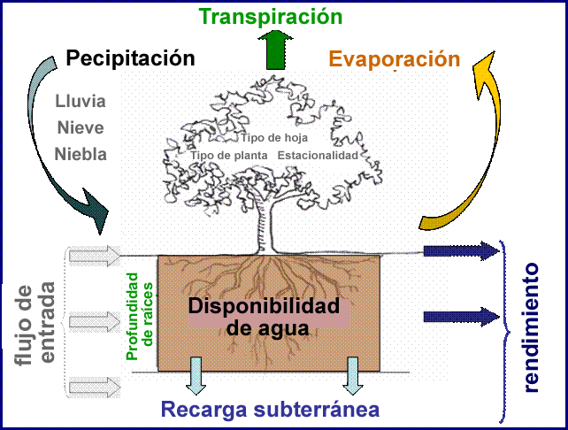

.. _annual_water_yield:

*************************
Rendimiento anual de agua
*************************

Resumen
=======

La energía hidroeléctrica representa el veinte por ciento de la producción mundial de energía, la mayor parte de la cual es generada por sistemas de embalses, represas o reservorios. InVEST estima la cantidad y el valor promedio anual de la energía hidroeléctrica producida por los embalses, e identifica cuánto rendimiento o valor del agua contribuye anualmente cada parte del paisaje a la producción de energía hidroeléctrica. El modelo tiene tres componentes: rendimiento de agua, consumo de agua y valoración de la energía hidroeléctrica. Los modelos biofísicos no tienen en cuenta las interacciones de las aguas superficiales y subterráneas ni la dimensión temporal del suministro de agua. El modelo de valoración asume que el precio de la energía es estático a lo largo del tiempo.

Introducción
============

El suministro de agua dulce es un servicio ecosistémico que contribuye al bienestar de la sociedad de muchas maneras, incluso a través de la producción de energía hidroeléctrica, la forma de energía renovable más utilizada en el mundo. La mayor parte de la producción de energía hidroeléctrica proviene de sistemas de embalses alimentados por cuencas hidrográficas que generalmente entregan energía de manera constante y predecible. Los sistemas están diseñados para dar cuenta de la variabilidad anual en el volumen de agua, dados los niveles probables para una cuenca dada, pero son vulnerables a variaciones extremas causadas por cambios en el uso y cobertura de la tierra (LULC, por sus siglas en inglés). Los cambios de LULC pueden alterar los ciclos hidrológicos, afectando los patrones de evapotranspiración, infiltración y retención de agua, y cambiando el tiempo y el volumen de agua disponible para la producción de energía hidroeléctrica (World Commission on Dams 2000; Ennaanay 2006).

Los cambios en el paisaje que afectan el rendimiento promedio anual de agua aguas arriba de las instalaciones hidroeléctricas pueden aumentar o disminuir la capacidad de producción de energía hidroeléctrica. Los mapas de dónde se produce el rendimiento del agua utilizada para la energía hidroeléctrica pueden ayudar a evitar impactos no deseados en la producción de energía hidroeléctrica o ayudar a dirigir las decisiones de uso de la tierra que desean mantener la producción de energía, mientras se equilibran otros usos, como la conservación o la agricultura. Dichos mapas también se pueden utilizar para informar las inversiones en restauración o gestión que las partes interesadas río abajo, como las empresas hidroeléctricas, realizan con la esperanza de mejorar o mantener el rendimiento del agua para este importante servicio ecosistémico. En cuencas hidrográficas grandes con múltiples embalses para la producción de energía hidroeléctrica, las áreas aguas arriba de las centrales eléctricas que venden a un mercado de mayor valor tendrán un mayor valor por este servicio. Los mapas de cuánto valor aporta cada parcela a la producción de energía hidroeléctrica pueden ayudar a los administradores a evitar desarrollos en las áreas de mayor valor hidroeléctrico, comprender cuánto valor se perderá o ganará como consecuencia de las diferentes opciones de gestión, o identificar qué agentes productores de energía hidroeléctrica tienen la mayor participación en mantener el rendimiento del agua en un paisaje.

El modelo
=========

El modelo estima las contribuciones relativas de agua de diferentes partes de un paisaje, ofreciendo información sobre cómo los cambios en los patrones de uso de la tierra afectan el rendimiento anual de agua superficial y la producción de energía hidroeléctrica.

Modelizar las conexiones entre los cambios del paisaje y los procesos hidrológicos no es simple. Los modelos sofisticados de estas conexiones y los procesos asociados (como el modelo WEAP) consumen muchos recursos y datos y requieren una gran experiencia. Para adaptarse a más contextos, para los cuales los datos están fácilmente disponibles, InVEST mapea y modeliza el rendimiento promedio anual de agua de un paisaje utilizado para la producción de energía hidroeléctrica, en lugar de abordar directamente el efecto de los cambios de LULC en la energía hidroeléctrica, ya que este proceso está estrechamente relacionado con la variación en la entrada de agua en una escala de tiempo diaria a mensual. En cambio, InVEST calcula la contribución relativa de cada parcela de tierra a la producción hidroeléctrica promedio anual y el valor de esta contribución en términos de producción de energía. El valor presente neto de la producción de energía hidroeléctrica durante la vida útil del embalse también se puede calcular sumando los ingresos anuales descontados.

Cómo funciona
-------------

El modelo se ejecuta en un mapa cuadriculado. Estima la cantidad y el valor del agua utilizada para la producción de energía hidroeléctrica de cada subcuenca en el área de interés. Tiene tres componentes, que se ejecutan secuencialmente. Primero, determina la cantidad de agua que se escurre de cada píxel como la precipitación menos la fracción del agua que sufre evapotranspiración. El modelo no diferencia entre la superficie, el subsuelo y el flujo base, sino que asume que toda la producción de agua de un píxel llega al punto de interés a través de una de estas vías. Este modelo luego suma y promedia el rendimiento de agua al nivel de la subcuenca. Los cálculos a escala de píxeles nos permiten representar la heterogeneidad de los factores determinantes clave en la producción de agua, como el tipo de suelo, la precipitación, el tipo de vegetación, etc. Sin embargo, la teoría que usamos como base de este conjunto de modelos se desarrolló en la escala de subcuenca a cuenca. Solo confiamos en la interpretación de estos modelos a la escala de la subcuenca, por lo que todos los resultados se suman y/o promedian a la escala de la subcuenca. Continuamos brindando representaciones a escala de píxeles de algunos resultados solo con fines de calibración y verificación de modelos. **Estos mapas a escala de píxeles no deben interpretarse para comprender los procesos hidrológicos ni para informar la toma de decisiones de ningún tipo.**

En segundo lugar, más allá de la escorrentía media anual, calcula la proporción de agua superficial que está disponible para la producción de energía hidroeléctrica restando el agua superficial que se consume para otros usos. En tercer lugar, estima la energía producida por el agua que llega al embalse hidroeléctrico y el valor de esta energía durante la vida útil del embalse.
|

Figura 1. Diagrama conceptual del método de balance hídrico simplificado utilizado en el modelo de rendimiento hídrico anual. Los aspectos del balance hídrico que están en color están incluidos en el modelo, los que están en gris no.

Modelo de rendimiento de agua
^^^^^^^^^^^^^^^^^^^^^^^^^^^^^

El modelo de rendimiento de agua se basa en la curva de Budyko y la precipitación media anual. Determinamos el rendimiento anual de agua :math:`Y(x)` para cada píxel en el paisaje :math:`x` así:

.. math:: Y(x) = \left(1-\frac{AET(x)}{P(x)}\right)\cdot P(x)

donde :math:`AET(x)` es la evapotranspiración real anual por píxel :math:`x` y :math:`P(x)` es la precipitación anual en píxel :math:`x`.

Para los tipos de uso/cobertura  (LULC) terrestre con vegetación, la porción de evapotranspiración del balance hídrico, :math:`\frac{AET(x)}{P(x)}` , se basa en una expresión de la curva de Budyko propuesta por Fu (1981) y Zhang et al. (2004):

.. math:: \frac{AET(x)}{P(x)} = 1+\frac{PET(x)}{P(x)} - \left[1+\left(\frac{PET(x)}{P(x)}\right)^\omega\right]^{1/\omega}
	:label: aet_vegetated

donde :math:`PET(x)` es la evapotranspiración potencial y :math:`\omega(x)` es un parámetro no físico que caracteriza las propiedades naturales clima-suelo, ambas detalladas a continuación.

La evapotranspiración potencial :math:`PET(x)` se define como:

.. math:: PET(x) = K_c(\ell_x)\cdot ET_0(x)

donde, :math:`ET_0(x)` es la evapotranspiración de referencia del píxel :math:`x` y :math:`K_c(\ell_x)` es el coeficiente de evapotranspiración de las plantas (vegetación) asociado con el LULC :math:`\ell_x` en el píxel :math:`x`. :math:`ET_0(x)` refleja las condiciones climáticas locales, con base en la evapotranspiración de una vegetación de referencia como el pasto o la alfalfa cultivado en ese lugar. :math:`K_c(\ell_x)` está determinado en gran medida por las características vegetativas del uso de la tierra/cobertura de la tierra que se encuentra en ese píxel (Allen et al. 1998). :math:`K_c` ajusta los valores de :math:`ET_0` al tipo de cultivo o vegetación en cada píxel del mapa de uso/cobertura del suelo.

:math:`\omega(x)` es un parámetro empírico que se puede expresar como una función lineal de :math:`\frac{AWC*N}{P}`, donde N es el número de eventos de lluvia por año, y AWC es el contenido volumétrico de agua disponible en la planta (consulte el Apéndice 1 para obtener detalles adicionales). Mientras se realizan más investigaciones para determinar la función que mejor describe los datos globales, utilizamos la expresión propuesta por Donohue et al. (2012) en el modelo InVEST, y así definimos:

.. math:: \omega(x) = Z\frac{AWC(x)}{P(x)} + 1.25
   :label: omega

donde:

+ :math:`AWC(x)` es el contenido volumétrico (mm) de agua disponible para la planta. La textura del suelo y la profundidad efectiva de enraizamiento definen :math:`AWC(x)`, que establece la cantidad de agua que puede ser retenida y liberada en el suelo para su uso por una planta. Se estima como el producto de la capacidad de agua disponible de la planta y el mínimo de la profundidad de la capa de restricción de las raíces y la profundidad de enraizamiento de la vegetación:

	.. math:: AWC(x)= Min(Rest.layer.depth, root.depth)\cdot PAWC

  La profundidad de la capa de restricción de las raíces es la profundidad del suelo a la que se inhibe la penetración de las raíces debido a sus características físicas o químicas. La profundidad de enraizamiento de la vegetación suele indicarse como la profundidad a la que se encuentra el 95% de la biomasa radicular de un tipo de vegetación. El PAWC es la capacidad de agua disponible de la planta, es decir, la diferencia entre la capacidad de campo y el punto de marchitamiento.

+ :math:`Z` es una constante empírica, a veces denominada "factor de estacionalidad", que capta el patrón de precipitación local y las características hidrogeológicas adicionales. Está correlacionada positivamente con N, el número de eventos de lluvia por año. El término 1,25 es el valor mínimo de :math:`\omega(x)`, que puede considerarse un valor para el suelo desnudo (cuando la profundidad de las raíces es 0), como explican Donohue et al. (2012). Siguiendo la literatura (Yang et al., 2008; Donohue et al. 2012), los valores de :math:`\omega(x)` se limitan a un valor de 5.

Para otros tipos de LULC (aguas abiertas, urbano, humedal), la evapotranspiración real se calcula directamente a partir de la evapotranspiración de referencia :math:`ET_0(x)` y tiene un límite superior definido por la precipitación:

.. math:: AET(x) = Min(K_c(\ell_x)\cdot ET_0(x),P(x))
	:label: aet_non_vegetated

donde :math:`ET_0(x)` es la evapotranspiración de referencia, y :math:`K_c(\ell_x)` es el factor de evaporación para cada LULC.

El modelo de rendimiento hídrico genera y da salida al rendimiento hídrico total y medio a nivel de subcuenca.

Suministro realizado
^^^^^^^^^^^^^^^^^^^^

La opción de Suministro Realizado del modelo (denominada Escasez de Agua en la interfaz de la herramienta) calcula la afluencia de agua a un embalse basándose en el rendimiento hídrico calculado y el uso consuntivo del agua en la(s) cuenca(s) de interés. Se introduce la cantidad de agua consumida por cada tipo de uso o cobertura del suelo en forma de tabla. Entre los ejemplos de uso consuntivo se incluyen las extracciones municipales o industriales que no se devuelven a la corriente aguas arriba de la salida. Esta opción también puede utilizarse para representar las transferencias entre cuencas fuera de la cuenca de estudio.

Por ejemplo, en una zona urbana, el uso consuntivo puede calcularse como el producto de la densidad de población y el uso consuntivo per cápita. Estos valores basados en el uso de la tierra solo se refieren a la parte consuntiva de la demanda; parte del uso del agua no es consuntiva, como el agua utilizada para procesos industriales o las aguas residuales que se devuelven a la corriente después de su uso, aguas arriba de la salida. Por lo tanto, las estimaciones del uso consuntivo deben tener en cuenta cualquier flujo de retorno a la corriente por encima de la salida de la cuenca:

.. math:: C = \frac{W-R}{n}

donde, :math:`C` = el uso consuntivo (:math:`m^3/yr/pixel`), :math:`W` = extracciones (:math:`m^3/yr`), :math:`R` = flujos de retorno (:math:`m^3/yr`), y :math:`n` = número de píxeles en una cobertura de tierra dada.

Para simplificar, cada píxel de la cuenca es un píxel "contribuyente", que contribuye a la producción de energía hidroeléctrica, o un píxel "de uso", que utiliza el agua para otros usos consuntivos. Esta suposición implica que el uso de la tierra asociado a los usos consuntivos no aportará ningún rendimiento para el uso aguas abajo. La cantidad de agua que realmente llega al embalse para la presa :math:`d` (denominada suministro realizado) se define como la diferencia entre el rendimiento total de agua de la cuenca y el uso consuntivo total en la cuenca:

.. math:: V_{in} = Y-u_d

donde :math:`V_{in}` es la oferta realizada (volumen de entrada a un embalse), :math:`u_d` es el volumen total de agua consumida en la cuenca aguas arriba de la presa :math:`d` y :math:`Y` es el rendimiento total del agua de la cuenca aguas arriba de la presa :math:`d`.

Tenga en cuenta que aquí solo se consideran los usos antropogénicos, ya que la evapotranspiración (incluido el uso consuntivo del agua por parte de las tierras de cultivo) se tiene en cuenta mediante el parámetro :math:`K_c` del modelo de rendimiento hídrico. Se debe estarr consciente de que el modelo supone que toda el agua disponible para la evapotranspiración procede de la cuenca hidrográfica (en forma de precipitaciones). Esta suposición es válida en los casos en los que la agricultura se alimenta de la lluvia, o la fuente de agua de riego está dentro de la cuenca de estudio (no proviene de la transferencia entre cuencas o de un acuífero más profundo desconectado). Para más información sobre la aplicación del modelo en cuencas con agricultura de regadío, véase la sección de Limitaciones.

Si se dispone de datos observados de los caudales anuales reales de entrada al embalse para la presa :math:`d`, se pueden comparar con :math:`V_{in}`.

Producción y valoración de la energía hidroeléctrica
^^^^^^^^^^^^^^^^^^^^^^^^^^^^^^^^^^^^^^^^^^^^^^^^^^^^

La opción de Valoración del modelo estima tanto la cantidad de energía producida dado el suministro estimado de agua para la producción hidroeléctrica, como el valor de esa energía. Se ofrece una estimación monetaria del valor actual para toda la vida útil restante del embalse. El valor actual neto puede calcularse si se dispone de datos sobre los costos de producción de energía hidroeléctrica. La energía producida y los ingresos se redistribuyen entonces en el paisaje en función de la contribución proporcional de cada subcuenca a la producción de energía. Los mapas de resultados finales muestran la cantidad de producción de energía y el valor hidroeléctrico que puede atribuirse al rendimiento del agua de cada subcuenca durante la vida útil del embalse.

Una nota importante sobre la asignación de un valor monetario a cualquier servicio es que la valoración solo debe hacerse sobre los resultados del modelo que han sido calibrados y validados. De lo contrario, no se sabe bien cuánto representa el modelo el área de interés, lo que puede llevar a una representación errónea del valor exacto. Si el modelo no ha sido calibrado, solo deben utilizarse resultados relativos (como un aumento del 10%) y no valores absolutos (como 1.523 metros cúbicos o 42.900 dólares).

En el embalse :math:`d`, la potencia se calcula mediante la siguiente ecuación:

.. math:: p_d = \rho\cdot q_d \cdot g \cdot h_d

donde :math:`p_d` es la potencia en vatios, :math:`\rho` es la densidad del agua (1000 Kg/m\ :sup:`3`\ ), :math:`q_d` es el caudal (m\ :sup:`3`\ /s), :math:`g` es la constante de gravedad (9,81 m/s :sup:`2`\ ), y :math:`h_d` es la altura del agua detrás del embalse en la turbina (m). En este modelo, suponemos que el volumen total de agua de entrada anual se libera por igual y de forma continua a lo largo de cada año.

La ecuación de producción de energía se conecta con el modelo de rendimiento del agua convirtiendo el volumen de entrada anual ajustado al consumo (:math:`V_{in}`) en una tasa por segundo. Como la energía eléctrica se mide normalmente en kilovatios-hora, la potencia :math:`p_d` se multiplica por el número de horas de un año. Todos los embalses hidroeléctricos se construyen para producir una cantidad máxima de electricidad. Esto se denomina índice de producción de energía, y representa la cantidad de energía que podría producirse si las turbinas fueran 100% eficientes y toda el agua que entra en el embalse se utilizara para la producción de energía. En el mundo real, las turbinas tienen ineficiencias y el agua del embalse puede ser extraída para otros usos como el riego, retenida en el embalse para otros usos como el recreo, o liberada del embalse para usos no relacionados con la producción de energía como el mantenimiento de los flujos ambientales aguas abajo. Para tener en cuenta estas ineficiencias y los ajustes de caudales y unidades de potencia, la producción media anual de energía :math:`\varepsilon_d` en el embalse :math:`d` se calcula como sigue:

.. math:: \varepsilon_d= 0.00272\cdot \beta \cdot \gamma_d \cdot h_d \cdot V_{in}

donde :math:`\varepsilon_d` es la producción de energía hidroeléctrica (KWH), :math:`\beta` es el coeficiente de eficiencia de la turbina (%), :math:`\gamma_d` es el porcentaje del volumen de agua de entrada al embalse en la presa :math:`d` que se utilizará para generar energía.

Para convertir :math:`\varepsilon_d`, la energía anual generada por la presa :math:`d`, en un valor actual neto (VAN) de la energía producida (valor del punto de uso) utilizamos lo siguiente,

.. math:: NPVH_d=(p_e\varepsilon_d-TC_d)\times \sum^{T-1}_{t=0}\frac{1}{(1+r)^t}
   :label: net_present_value

donde :math:`TC_d` es el total de los costos anuales de explotación del embalse :math:`d`, :math:`p_e` es el valor de mercado de la electricidad (por kilovatio hora) suministrada por la central hidroeléctrica en el embalse :math:`d`, :math: `T_d` indica el número de años que se espera que persistan las condiciones actuales del paisaje o la vida útil restante esperada de la central en el embalse :math:`d` (ponga :math:`T` en el valor más pequeño si los dos valores temporales difieren), y :math:`r` es la tasa de descuento del mercado. La forma de la ecuación anterior supone que :math:`TC_d`, :math:`p_e`, y :math:`\varepsilon_d`, son constantes en el tiempo. Se puede utilizar cualquier moneda, siempre que sea consistente en los diferentes inputs.

El modelo no realiza los siguientes cálculos, pero la producción de energía durante la vida útil de la presa :math:`d` puede atribuirse a cada subcuenca de la siguiente manera:

.. math:: \varepsilon_x = (T_d\varepsilon_d)\times(c_x / c_{tot})

donde el primer término entre paréntesis representa la producción de electricidad durante la vida útil del embalse :math:`d`. El segundo término representa la proporción del volumen de agua utilizado para la producción hidroeléctrica que procede de la subcuenca :math:`x` en relación con el volumen total de agua de toda la cuenca. El valor de cada subcuenca para la producción de energía hidroeléctrica durante la vida útil del embalse :math:`d` puede calcularse de forma similar:

.. math:: NPVH_x=NPVH_d\times (c_x/c_{tot})

Limitaciones y simplificaciones
^^^^^^^^^^^^^^^^^^^^^^^^^^^^^^^

El modelo tiene una serie de limitaciones. En primer lugar, no está pensado para elaborar planes hidrológicos detallados, sino para evaluar cómo y dónde los cambios en una cuenca pueden afectar a la producción hidroeléctrica de los sistemas de embalses. Se basa en promedios anuales, los que no tienen en cuenta los extremos y no consideran las dimensiones temporales del suministro de agua y la producción hidroeléctrica.

En segundo lugar, el modelo no tiene en cuenta la distribución espacial del uso y la cobertura del suelo. El modelo empírico utilizado para el balance hídrico (basado en la teoría de Budyko) se ha probado a escalas mayores que las dimensiones de los píxeles utilizados en InVEST (Hamel y Guswa, en revisión). Es posible que el modelo no capte bien los complejos patrones de uso del suelo o la geología subyacente, que pueden inducir balances hídricos complejos.

En tercer lugar, el modelo no tiene en cuenta los patrones sub-anuales del calendario de entrega de agua. El rendimiento del agua es una función de aprovisionamiento, pero los beneficios hidroeléctricos también se ven afectados por la regulación del caudal. El calendario de los caudales máximos y de la entrega de los caudales mínimos operativos a lo largo del año determina la tasa de producción hidroeléctrica y los ingresos anuales. Es probable que los cambios en los escenarios del paisaje afecten al calendario de los caudales tanto como al rendimiento hídrico anual, y son especialmente preocupantes cuando se tienen en cuenta factores como el cambio climático. La modelización de los patrones temporales de los caudales requiere datos detallados que no son apropiados para nuestro enfoque. Aun así, este modelo proporciona una evaluación inicial útil de cómo los escenarios paisajísticos pueden afectar al suministro anual de agua para la producción hidroeléctrica.

En cuarto lugar, el modelo simplifica en gran medida la demanda de consumo. Para cada LULC, se utiliza una única variable (:math:`\gamma_d`) para representar múltiples aspectos de la asignación de recursos hídricos, lo que puede representar erróneamente la compleja distribución del agua entre los usos y a lo largo del tiempo. En realidad, la demanda de agua puede diferir mucho entre las parcelas de la misma clase de LULC. Gran parte de la demanda de agua también puede proceder de grandes tomas puntuales, que no están representadas en absoluto por una clase LULC. El modelo simplifica la demanda de agua distribuyéndola por el paisaje. Por ejemplo, la demanda de agua puede ser grande para un área urbana, y el modelo representa esta demanda distribuyéndola sobre la clase LULC urbana. Sin embargo, es probable que la toma de agua real se encuentre más arriba, en una zona rural. La disparidad espacial entre los puntos de demanda reales y los modelizados puede provocar una representación incorrecta en la red de salida del suministro realizado. La distribución del consumo también se simplifica en la reasignación de la producción de energía y del valor hidroeléctrico, ya que se supone que el agua consumida a lo largo de las rutas de flujo se extrae por igual de cada píxel aguas arriba. Como resultado, la escasez de agua, los patrones de producción de energía y los valores hidroeléctricos pueden ser estimados incorrectamente.

En quinto lugar, las transferencias de agua para el riego, ya sea entre subcuencas o entre estaciones, no están bien recogidas por el modelo. Al aplicar el enfoque empírico a las tierras de cultivo,deben tenerse en cuenta los patrones de riego, que suelen caer en uno de los siguientes casos:

1) Si no hay más riego que la lluvia directa, se puede suponer que las tierras de cultivo responden al forzamiento climático de forma similar a la vegetación natural (es decir, se aplica la teoría en la que se basa el modelo ecohidrológico utilizado en el modelo InVEST, que vincula el agua disponible para las plantas y el forzamiento climático, cf. Donohue et al. 2012).

2) Si los pequeños embalses almacenan agua durante la estación húmeda para regar los cultivos durante la estación seca, la ETR debería ser igual a la ETP durante la estación de riego. Sin embargo, el modelo predice una ETR<ETP debido a la limitada retención de agua en las cuencas de captación no perturbadas (donde no hay ningún otro depósito excepto el almacenamiento en el suelo). El resultado es probablemente la subestimación de la evapotranspiración y, por tanto, la sobreestimación de los rendimientos. Para evitar este problema, se puede utilizar la ecuación alternativa para la ETR (ecuación 2), que establece la ETR directamente en función de la ETo (en ese caso, recuerde que la ETR está limitada por P para evitar la predicción de rendimientos hídricos negativos, lo que puede dar lugar a una sobreestimación de los rendimientos).

3) Si la zona de estudio contiene tierras de cultivo que se riegan con agua procedente de fuera de la cuenca (ya sea mediante transferencia entre cuencas o bombeo desde una fuente de agua subterránea desconectada), entonces la ETR también es igual a la ETP durante la temporada de riego. Dado que el modelo supone que la evapotranspiración procede de las precipitaciones, es probable que se sobreestime el rendimiento hídrico. Esta situación también puede representarse utilizando la ecuación alternativa para la ETR (ecuación 2). Suponiendo que los cultivos se riegan de forma eficiente (es decir, que el volumen total de agua importada es igual al déficit hídrico, o ETP - P, para los píxeles del cultivo), entonces el volumen conocido de agua regada puede añadirse al rendimiento hídrico modelizado para obtener una mejor imagen del rendimiento real.

4) Dado que la estacionalidad puede desempeñar un papel importante en el uso del agua de riego, tenga cuidado al aplicar el modelo anual en cuencas con grandes campos de riego. En el caso de las opciones no contempladas anteriormente o cuando las transferencias de agua complejas puedan afectar sustancialmente al balance hídrico, se recomienda que utilicen modelos alternativos que representen mejor las transferencias de agua espaciales y temporales. En particular, debe tenerse mucha precaución al calibrar el modelo sin disponer de buenos datos sobre los diferentes componentes del balance hídrico dentro de su zona de estudio (es decir, precipitaciones, caudales, tasas de riego y calendario).

Por último, el modelo supone que la producción y el precio de la energía hidroeléctrica permanecen constantes a lo largo del tiempo. No tiene en cuenta la variación estacional de la producción de energía ni las fluctuaciones del precio de la energía, que pueden afectar al valor de la energía hidroeléctrica. Sin embargo, incluso si la producción sub-anual o los precios de la energía cambian, el valor relativo entre las parcelas de la misma área de drenaje debería ser preciso.

Necesidades de datos
====================

.. note:: *Todos los inputs espaciales deben tener exactamente el mismo sistema de coordenadas proyectadas* (con unidades lineales de metros), *no* un sistema de coordenadas geográficas (con unidades de grados).

... note:: Los inputs de ráster pueden tener diferentes tamaños de celda, y serán remuestreadas para que coincidan con el tamaño de celda del ráster de uso/cobertura del suelo. Por lo tanto, todos los resultados del modelo tendrán el mismo tamaño de celda que el ráster de uso/cobertura del suelo.

- :investspec:`annual_water_yield workspace_dir`

- :investspec:`annual_water_yield results_suffix`

- :investspec:`annual_water_yield precipitation_path`

- :investspec:`annual_water_yield eto_path`

- :investspec:`annual_water_yield depth_to_root_rest_layer_path`

- :investspec:`annual_water_yield pawc_path`

- :investspec:`annual_water_yield lulc_path`

- :investspec:`annual_water_yield watersheds_path`

  Campo:

  - :investspec:`annual_water_yield watersheds_path.fields.ws_id`

- :investspec:`annual_water_yield sub_watersheds_path`

  Campos:

  - :investspec:`annual_water_yield sub_watersheds_path.fields.subws_id`

- :investspec:`annual_water_yield biophysical_table_path`

  Columnas:

  - :investspec:`annual_water_yield biophysical_table_path.columns.lucode`

  - :investspec:`annual_water_yield biophysical_table_path.columns.lulc_veg` Las clases con un valor de 1 tendrán la AET calculada según la ecuación :eq:`aet_vegetated`. Las clases con un valor de 0 tendrán la AET calculada según la ecuación eq. :eq:`aet_non_vegetated`.

  - :investspec:`annual_water_yield biophysical_table_path.columns.root_depth` Suele indicarse como la profundidad a la que se encuentra el 95% de la biomasa radicular de un tipo de vegetación. Para los usos de la tierra en los que no se utiliza la curva genérica de Budyko (es decir, cuando la evapotranspiración se calcula a partir de eq.:eq:`aet_non_vegetated`), no se necesita la profundidad de las raíces. En estos casos, el campo de profundidad de enraizamiento se ignora, y puede establecerse como un valor como -1 para indicar que el campo no se utiliza.

  - :investspec:`annual_water_yield biophysical_table_path.columns.kc` Se utiliza para calcular la evapotranspiración potencial para modificar la evapotranspiración de referencia.

- :investspec:`annual_water_yield seasonality_constant` Esto es :math:`Z` en eq. :eq:`omega`. Consulte el Apéndice para obtener más información.

- :investspec:`annual_water_yield demand_table_path` El uso consuntivo del agua es la parte del agua utilizada que se incorpora a los productos o a los cultivos, que es consumida por los seres humanos o el ganado, o que se retira de otro modo del balance hídrico de la cuenca.

	Columnas:

	- :investspec:`annual_water_yield demand_table_path.columns.lucode`
	- :investspec:`annual_water_yield demand_table_path.columns.demand` Tenga en cuenta que es importante considerar el área de los píxeles, ya que los píxeles más grandes consumirán más agua para el mismo tipo de cobertura del suelo.

- :investspec:`annual_water_yield valuation_table_path`

 	Columnas:

 	- :investspec:`annual_water_yield valuation_table_path.columns.ws_id`
 	- :investspec:`annual_water_yield valuation_table_path.columns.efficiency` Puede obtenerse de la entidad gestora de la central hidroeléctrica. Los valores suelen oscilar entre 0,7 y 0,9.
 	- :investspec:`annual_water_yield valuation_table_path.columns.fraction` Puede obtenerse del gestor de la central hidroeléctrica. Los administradores pueden liberar agua sin generar electricidad para satisfacer las demandas de riego, agua potable o medioambientales.
 	- :investspec:`annual_water_yield valuation_table_path.columns.height`
 	- :investspec:`annual_water_yield valuation_table_path.columns.kw_price`
 	- :investspec:`annual_water_yield valuation_table_path.columns.cost`
 	- :investspec:`annual_water_yield valuation_table_path.columns.time_span` Esto es :math:`T` en la ecuación :eq:`net_present_value`.
 	- :investspec:`annual_water_yield valuation_table_path.columns.discount` Esto es :math:`r` en la ecuación :eq:`net_present_value`.

Interpretación de los resultados
================================

La resolución de los rásters resultantes será la misma que la del ráster de uso y cobertura del suelo proporcionado como input.

* **Registro de parámetros**: Cada vez que se ejecute el modelo se creará un archivo de texto (.txt) en el Espacio de Trabajo. El archivo enumerará los valores de los parámetros y los mensajes resultantes para esa ejecución y se nombrará según el servicio, la fecha y la hora. Cuando se ponga en contacto con NatCap sobre los errores de una ejecución del modelo, incluya el registro de parámetros.

* Los resultados de la carpeta *per_pixel* pueden ser útiles para cálculos intermedios pero no deben ser interpretados a nivel de píxel, ya que las suposiciones del modelo se basan en procesos entendidos a escala de subcuenca.

	* **output\\per_pixel\\fractp_[Suffix].tif** (fracción): Fracción estimada de evapotranspiración real de la precipitación por píxel (Evapotranspiración real / Precipitación). Es la fracción media de precipitación que realmente evapotranspira a nivel de píxel.

	* **output\\per_pixel\\aet_[Suffix].tif** (mm): Estimación de la evapotranspiración real por píxel.

	* **output\\per_pixel\\wyield_[Suffix].tif** (mm): Estimación del rendimiento hídrico por píxel.

* **output\\subwatershed_results_wyield_[Suffix].shp** y **output\\subwatershed_results_wyield_[Suffix].csv**: Shapefile y tabla con los valores biofísicos resultantes por subcuenca, con los siguientes atributos:

	* *precip_mn* (mm): Precipitación media por píxel en la subcuenca.

	* *PET_mn* (mm): Evapotranspiración potencial media por píxel en la subcuenca.

	* *AET_mn* (mm): Evapotranspiración real media por píxel en la subcuenca.

	* *wyield_mn* (mm): Rendimiento medio del agua por píxel en la subcuenca.

	* *wyield_vol* (m\ :sup:`3`\): Volumen total de rendimiento de agua en la subcuenca.

* **output\\watershed_results_wyield_[Suffix].shp** y **output\\watershed_results_wyield_[Suffix].csv**: Shapefile y tabla que contienen los valores por cuenca hidrográfica resultantes, con los siguientes atributos:

	* *precip_mn* (mm): Precipitación media por píxel en la cuenca.

	* *PET_mn* (mm): Evapotranspiración potencial media por píxel en la cuenca.

	* *AET_mn* (mm): Evapotranspiración real media por píxel en la cuenca.

	* *wyield_mn* (mm): Rendimiento medio del agua por píxel en la cuenca.

	* *wyield_vol* (m\ :sup:`3`\): Volumen total de rendimiento de agua en la cuenca.

	Si se ejecuta la opción de Escasez de agua, también se incluirán los siguientes atributos para las cuencas y subcuencas:

	* **consum_vol** (m\ :sup:`3`\): Consumo total de agua para cada cuenca.

	* **consum_mn** (m\ :sup:`3`\ /ha): Volumen medio de consumo de agua por píxel y por cuenca.

	* **rsupply_vl** (m\ :sup:`3`\): Volumen total de suministro de agua realizado (rendimiento del agua -- consumo) para cada cuenca.

	* **rsupply_mn** (m\ :sup:`3`\ /ha): Volumen medio de suministro de agua realizado (rendimiento del agua -- consumo) por píxel y por cuenca hidrográfica.

	Si se ejecuta la opción Valoración, también se incluirán los siguientes atributos para las cuencas hidrográficas, pero no para las subcuencas:

	* **hp_energy** (kWh): La cantidad de servicio ecosistémico en términos de producción de energía. Se trata de la cantidad de energía producida anualmente por la central hidroeléctrica que puede atribuirse a cada cuenca hidrográfica en función de la contribución de su rendimiento hídrico.

	* **hp_val** (moneda/periodo): La cantidad de servicio ecosistémico en términos económicos. Muestra el valor del paisaje por cuenca hidrográfica en función de su capacidad de producir agua para la producción de energía hidroeléctrica durante el período de tiempo especificado, y con respecto a la tasa de descuento.

* **intermediate**: Este directorio contiene datos que representan pasos intermedios en los cálculos de los datos finales en la carpeta de resultados. También contiene subdirectorios que almacenan metadatos utilizados internamente para poder evitar el recálculo.

La aplicación de estos resultados depende enteramente del objetivo del esfuerzo de modelización. Quienes estén interesados en todos estos resultados o en uno o dos seleccionados. Si la información de valoración no está disponible o no es de interés, pueden optar por ejecutar simplemente el modelo de rendimiento hídrico y comparar los resultados biofísicos.

Los primeros resultados del modelo permiten comprender cómo se distribuye el agua en el paisaje. El modelo *aet_mn* describe la profundidad de evapotranspiración real del ciclo hidrológico, mostrando cuánta agua (precipitación) se pierde anualmente por evapotranspiración en la cuenca o subcuenca.

El campo *wyield_vol* contiene el volumen de agua medio anual estimado que se "rinde" desde cada subcuenca dentro de la cuenca de interés. Este valor puede utilizarse para determinar qué subcuencas son las más importantes para el rendimiento total anual del agua, aunque en este paso todavía no se sabrá qué parte de esa agua beneficia a personas usuarias de cualquier tipo aguas abajo. El campo de uso consuntivo (*consum_vol*) muestra entonces cuánta agua se utiliza para actividades de consumo (como beber, embotellar, etc.) cada año en todo el paisaje por cuenca. El campo de suministro realizado (*rsupply_vl*) contiene la diferencia entre el rendimiento hídrico acumulado y el uso consuntivo acumulado. Este valor demuestra dónde es abundante y dónde es más escaso el suministro de agua para la producción hidroeléctrica. Recuerde que el valor de uso consuntivo puede no representar realmente dónde se toma el agua, solo dónde se demanda. Esto puede causar alguna representación errónea de la escasez en ciertos lugares, pero este valor ofrece una idea general del balance hídrico y de si falta o abunda agua en la cuenca de interés.

Los valores *hp_energy* y *hp_val* son los resultados más relevantes del modelo para priorizar el paisaje para las inversiones que desean mantener el rendimiento del agua para la producción de energía hidroeléctrica. El campo *hp_val* es el que contiene más información para este propósito, ya que representa los ingresos atribuibles a cada cuenca hidrográfica a lo largo de la vida útil esperada de la central hidroeléctrica, o el número de años que se haya elegido modelizar. Este valor tiene en cuenta el hecho de que diferentes centrales hidroeléctricas dentro de una gran cuenca hidrográfica pueden tener diferentes clientes que pagan diferentes tarifas por la producción de energía. Si este es el caso, este resultado mostrará qué cuencas hidrográficas aportan el agua de mayor valor para la producción de energía. Si los valores energéticos no varían mucho a lo largo del paisaje, los resultados de *hp_energy* pueden ser igualmente útiles en la planificación y priorización. La comparación de cualquiera de estos valores entre escenarios de uso de la tierra permite comprender cómo puede cambiar el papel del paisaje bajo diferentes planes de gestión.

Apéndice 1: Fuentes de datos
============================

:ref:`Precipitation <precipitation>`
------------------------------------

:ref:`Reference Evapotranspiration <et0>`
-----------------------------------------

:ref:`Kc <kc>`
--------------

:ref:`Land Use/Land Cover <lulc>`
---------------------------------

:ref:`Watersheds/Subwatersheds <watersheds>`
--------------------------------------------

Profundidad de la capa de restricción radicular
-----------------------------------------------

La profundidad de la capa de restricción de las raíces es la profundidad del suelo en la que la penetración de las raíces está fuertemente inhibida debido a las características físicas o químicas. La profundidad de la capa de restricción radicular puede obtenerse de algunos mapas de suelos. Si no se dispone de la profundidad de la capa de restricción de las raíces o de la profundidad de enraizamiento por tipo de suelo, se puede utilizar la profundidad del suelo como aproximación. Si se detallan varios horizontes del suelo, la profundidad de la capa que restringe las raíces es la suma de las profundidades de los horizontes del suelo no restrictivos.

Los datos globales sobre el suelo están disponibles en el Programa de la Base de Datos del Suelo y el Terreno (SOTER) (https://data.isric.org:443/geonetwork/srv/eng/catalog.search). Proporciona algunas bases de datos de suelos específicas para cada zona, así como SoilGrids a nivel global. Escriba "depth" en su motor de búsqueda para ver una lista de capas. Para ISRIC SoilGrids 250m (versión 2017) se puede utilizar la profundidad a la roca madre (horizonte R). Tenga en cuenta que los valores de Profundidad a la roca madre se dan en centímetros, que tendrán que ser convertidos a milímetros para ser utilizados en el modelo. La versión 2.0 de SoilGrids no incluye actualmente una capa de profundidad del suelo.

La FAO también proporciona datos globales sobre el suelo en su Base de Datos Mundial Armonizada sobre el Suelo: https://webarchive.iiasa.ac.at/Research/LUC/External-World-soil-database/HTML/, pero es más bien gruesa.

En los Estados Unidos se pueden obtener datos gratuitos sobre el suelo en las bases de datos gSSURGO, SSURGO y gNATSGO del Departamento de Agricultura de los Estados Unidos: https://www.nrcs.usda.gov/wps/portal/nrcs/main/soils/survey/geo/. También proporcionan herramientas de ArcGIS (Soil Data Viewer para SSURGO y Soil Data Development Toolbox para gNATSGO) que ayudan a procesar estas bases de datos en datos espaciales que pueden ser utilizados por el modelo. La caja de herramientas de desarrollo de datos de suelos es la más fácil de usar, y se recomienda encarecidamente si se utiliza ArcGIS y se necesita procesar los datos de suelos de Estados Unidos.

Contenido de agua disponible en las plantas (PAWC)
--------------------------------------------------

El contenido de agua disponible para las plantas es una fracción obtenida a partir de algunos mapas de suelo estándar. Se define como la diferencia entre la fracción de la capacidad volumétrica de campo y el punto de marchitamiento permanente. A menudo, el contenido de agua disponible para las plantas está disponible como valor volumétrico (mm). Para obtener la fracción se divide por la profundidad del suelo. Si el PAWC no está disponible, se necesitarán cuadrículas ráster obtenidas a partir de archivos de formas poligonales de la textura media del suelo (% de arcilla, % de arena, % de limo) y de la porosidad del suelo. https://www.ars.usda.gov/research/software/download/?softwareid=492 tiene un software que le ayudará a estimar el PAWC cuando tenga datos de la textura del suelo.

En los Estados Unidos hay datos gratuitos sobre el suelo disponibles en las bases de datos gSSURGO, SSURGO y gNATSGO del Departamento de Agricultura de los Estados Unidos: https://www.nrcs.usda.gov/wps/portal/nrcs/main/soils/survey/geo/. También proporcionan herramientas de ArcGIS (Soil Data Viewer para SSURGO y Soil Data Development Toolbox para gNATSGO) que ayudan a procesar estas bases de datos en datos espaciales que pueden ser utilizados por el modelo. La caja de herramientas para el desarrollo de datos de suelos es la más fácil de usar, y se recomienda encarecidamente si se utiliza ArcGIS y se necesita procesar datos de suelos de los Estados Unidos.

ISRIC proporciona un ráster global de AWC, como parte de su producto SoilGrids 2017, llamado SoilGrids250m 2017-03 - "Derived available soil water capacity (volumetric fraction) until wilting point" (https://data.isric.org/geonetwork/srv/eng/catalog.search#/metadata/e33e75c0-d9ab-46b5-a915-cb344345099c). Tenga en cuenta que la versión 2.0 de SoilGrids no proporciona actualmente la AWC, por lo que si prefiere trabajar con la versión 2.0, tendrá que encontrar un método diferente que haga uso de las capas que proporciona esa versión. También puede buscar más conjuntos de datos ISRIC específicos de una región escribiendo "available water" en su motor de búsqueda (https://data.isric.org:443/geonetwork/srv/eng/catalog.search).

Si se utilizan los datos globales de SoilGrids 2017 AWC, a continuación se presenta una forma de procesarlos en el input requerido para InVEST, utilizando programas de SIG.

SoilGrids 2017 proporciona capas AWC para 7 intervalos de profundidad del suelo. Es necesario descargar los 7 intervalos de profundidad y combinarlos en una sola capa para su uso en el modelo.

Cuando se descargan del ISRIC, los rásteres AWC en bruto se denominan así:

| Depth 0cm: WWP_M_sl1_250m_ll.tif
| Depth 5cm: WWP_M_sl2_250m_ll.tif
| Depth 15cm: WWP_M_sl3_250m_ll.tif
| Depth 30cm: WWP_M_sl4_250m_ll.tif
| Depth 60cm: WWP_M_sl5_250m_ll.tif
| Depth 100cm: WWP_M_sl6_250m_ll.tif
| Depth 200cm: WWP_M_sl7_250m_ll.tif

 Los valores ráster se dan como porcentajes de números enteros (como 25, que significa un valor AWC del 25%).

El método que se describe aquí se proporciona en el documento científico de SoilGrids (Hengl 2017):

"Los promedios a lo largo de intervalos de profundidad (estándar), por ejemplo, de 0 a 5 cm o de 0 a 30 cm, pueden derivarse tomando una media ponderada de las predicciones dentro del intervalo de profundidad utilizando la integración numérica, como la regla trapezoidal:"

.. math:: (\frac{1}{(b-a)})(\frac{1}{2})\sum_{k=1}^{N-1}{(x_{k+1} - x_{k})(f(x_{k}) + f(x_{k+1}))}

"donde :math:`N` es el número de profundidades, :math:`x_{k}` es la profundidad k-ésima y :math:`f(x_{k})` es el valor de la variable objetivo (es decir, la propiedad del suelo) en la profundidad :math:`x_{k}`."

**Pasos**

1. Descargue todos los intervalos de profundidad disponibles en el sitio web del ISRIC. Los intervalos de profundidad son de 0 cm a 200 cm. Tenga en cuenta que cada ráster tiene un tamaño de 1,5 GB.
2. Utilice la herramienta *Buffer* del SIG para crear un amortiguamiento alrededor de la cuenca/área de interés que está modelizando. Dado que los datos de SoilGrids tienen una resolución de 250m, haga el amortiguamiento de 250 o 500m de ancho. Esto se hace para asegurarse de que los datos del suelo cubren completamente la cuenca que está modelizando, sin agujeros alrededor del borde.
3. Utilice la cuenca hidrográfica amortiguada para recortar todos los rásters ISRIC AWC sin procesar en su área de interés. En ArcGIS esto puede hacerse con la herramienta de Spatial Analyst *Extract by Mask*. En QGIS la herramienta se llama *Clip Raster by Mask Layer*. Para este ejemplo, llamaremos a las capas recortadas AWC_sl1_clip.tif, AWC_sl2_clip.tif ... AWC_sl7_clip.tif.
4. Utilice la herramienta *Calculadora de rásters* del SIG para calcular la capa combinada de AWC. Sustituyendo en la ecuación de Hengl anterior nos da

(1/(200-0)) * (1/2) * ( ((5-0) * (AWC_sl1_clip.tif + AWC_sl2_clip.tif)) + ((15-5) * (AWC_sl2_clip.tif + AWC_sl3_clip.tif)) + ((30-15) * (AWC_sl3_clip.tif + AWC_sl4_clip.tif)) + ((60-30) * (AWC_sl4_clip.tif + AWC_sl5_clip.tif)) + ((100-60) * (AWC_sl5_clip.tif + AWC_sl6_clip.tif)) + ((200-100) * ( AWC_sl6_clip.tif + AWC_sl67_clip.tif)) )

Introduzca esta ecuación en la *Calculadora de rásters*, ajustando los nombres de los archivos según sea necesario.

5. El ráster resultante debe contener valores en el rango de 0-100, que representan porcentajes de números enteros. El modelo requiere que el AWC se dé en forma de fracción, por lo que hay que dividir el ráster calculado en el paso 4 por 100.
6. Reproyecte la capa de la fracción del AWC para que tenga el mismo sistema de coordenadas proyectado que sus otros inputs del modelo. Este ráster se puede utilizar ahora como el input del contenido de agua disponible en el modelo.

Otras fuentes de datos
^^^^^^^^^^^^^^^^^^^^^^

En Estados Unidos se pueden obtener datos gratuitos sobre el suelo en las bases de datos NRCS gSSURGO, SSURGO y gNATSGO del Departamento de Agricultura: https://www.nrcs.usda.gov/wps/portal/nrcs/main/soils/survey/geo/. También proporcionan herramientas ArcGIS (Soil Data Viewer para SSURGO y Soil Data Development Toolbox para gNATSGO) que ayudan a procesar estas bases de datos en datos espaciales que pueden ser utilizados por el modelo. La Soil Data Development Toolbox es la más fácil de usar y la más recomendada si utiliza ArcGIS y necesita procesar datos de suelos de Estados Unidos.

Otra herramienta destacable es SPAW Soil Water Characteristics https://www.ars.usda.gov/research/software/download/?softwareid=492, que ayuda a estimar el PAWC cuando se dispone de datos sobre la textura del suelo. Sin embargo, no acepta datos espaciales directamente. Como mínimo, usted proporciona valores únicos para % de arena y % de arcilla y se calcula un valor único para el agua disponible. Si dispone de datos adicionales sobre materia orgánica, grava, etc., también puede introducirlos para afinar el resultado. El valor de agua disponible calculado por la herramienta deberá aplicarse a la capa espacial del suelo. Si sus datos de suelo son complejos, con muchas texturas diferentes o combinaciones de %arena y %arcilla, entonces este método será muy tedioso y consumirá mucho tiempo. Pero se puede aplicar con bastante facilidad si solo se dispone de unos pocos valores de textura.

Profundidad de las raíces
-------------------------

Schenk y Jackson (2002) realizaron una valiosa revisión de las profundidades de enraizamiento de las plantas. Los valores de profundidad de enraizamiento deben basarse en la profundidad a la que se produce el 90% de la biomasa de las raíces, y no en la profundidad máxima de la raíz pivotante más larga. Otros valores de profundidad de enraizamiento para cultivos y algunas plantaciones de árboles pueden encontrarse en las directrices de la FAO 56 de Allen et al. (1998).

El modelo determina la profundidad mínima de la capa de restricción de raíces y la profundidad de enraizamiento para un perfil de suelo accesible para el almacenamiento de agua. Los valores deben ser enteros, convertidos a mm. En el caso de los LULC sin vegetación (por ejemplo, urbanos), para los que se utiliza la ecuación 2 anterior, el modelo no utilizará el valor de la profundidad de las raíces, por lo que se puede insertar cualquier valor en la tabla.

Uso consuntivo del agua
-----------------------

El uso consuntivo del agua para cada clase de uso/cobertura del suelo es el agua que se retira del balance hídrico. Debe estimarse basándose en el conocimiento de las transferencias locales de agua (por ejemplo, la extracción de aguas subterráneas o de aguas superficiales para el suministro de agua urbana) en consulta con profesionales locales de estos campos. El valor utilizado en la tabla es una media para cada tipo de uso del suelo. En el caso de las zonas agrícolas, debe tenerse en cuenta el agua utilizada por el ganado o el procesamiento agrícola que no se devuelve a la cuenca. En las zonas urbanas, el uso del agua puede calcularse sobre la base de una estimación del uso del agua por persona y multiplicarse por la superficie aproximada de población por celda de ráster. El uso de agua industrial o las exportaciones de agua a otras cuencas hidrográficas también deben tenerse en cuenta, si procede. Para todos estos cálculos, se supone que la demanda de agua para la agricultura, la población, etc. se reparte uniformemente entre cada clase de uso del suelo.

Información sobre centrales hidroeléctricas
-------------------------------------------

Es posible que la información detallada sobre cada central hidroeléctrica solo esté disponible a través del propietario o la entidad gestora de las centrales. Parte de la información puede estar disponible a través de fuentes públicas, y puede ser accesible en línea. En particular, si la central hidroeléctrica está situada en Estados Unidos, puede encontrarse alguna información en Internet.

La ubicación exacta de estructuras específicas, como los embalses, debe obtenerse de la entidad gestora o puede obtenerse en la web:

 * The U.S. National Inventory of Dams: https://nid.sec.usace.army.mil/

 * Global Reservoir and Dam (GRanD) Database: http://globaldamwatch.org/grand/

 * World Water Development Report II dam database: https://wwdrii.sr.unh.edu/download.html

* *Calibración*: Para la calibración, se necesitan datos sobre la cantidad de agua que realmente llega a las salidas de la (sub)cuenca, que puede ser una central hidroeléctrica, sobre una base media anual. Los datos deben estar disponibles en la entidad gestora de la central hidroeléctrica. Si no se dispone de información directamente de los operadores de la central hidroeléctrica, se puede disponer de los datos de un medidor de corriente justo aguas arriba de la estación hidroeléctrica. Los medidores en los Estados Unidos pueden ser gestionados por el USGS, la agencia estatal de pesca y vida silvestre, el departamento estatal de ecología o por una universidad local.

* *Período_de_tiempo*: La vida útil de diseño de cada central hidroeléctrica puede obtenerse del propietario u operador de la central. Puede haber fuentes alternativas disponibles en línea, como se ha descrito anteriormente. Este valor puede representar, en cambio, el período de tiempo de un escenario de interés, que debe ser igual o menor que la vida útil de la central.

* *Tasa_de_descuento*: Esta tasa se define como la cantidad de valor que pierde la moneda por año, lo que refleja la preferencia de la sociedad por los beneficios inmediatos sobre los futuros.

Parámetro Z
-----------

Z es una constante empírica que captura el patrón de precipitación local y las características hidrogeológicas, con valores típicos que van de 1 a 30. Varios estudios han determinado :math:`\omega` empíricamente (por ejemplo, Xu et al. 2013, Fig. 3; Liang y Liu 2014; Donohue et al. 2012) y pueden utilizarse para estimar Z. La relación entre :math:`\omega` y Z es:

.. math:: Z = \frac{(\omega-1.25) P}{AWC}

donde P y AWC deben ser los valores medios de Precipitación y Capacidad de Agua Disponible, respectivamente, en la zona de estudio. :math:`AWC` es el contenido volumétrico (mm) de agua disponible para las plantas. La textura del suelo y la profundidad efectiva de enraizamiento definen la :math:`AWC`, que establece la cantidad de agua que puede ser retenida y liberada en el suelo para su uso por una planta. Se estima como el producto de la capacidad de agua disponible de la planta (PAWC) y el mínimo de la profundidad de la capa de restricción de las raíces y la profundidad de enraizamiento de la vegetación:

.. math:: AWC = Min(Rest.layer.depth, root.depth)\times PAWC

La profundidad de la capa de restricción de las raíces es la profundidad del suelo a la que se inhibe la penetración de las raíces debido a sus características físicas o químicas. La profundidad de enraizamiento de la vegetación suele indicarse como la profundidad a la que se encuentra el 95% de la biomasa radicular de un tipo de vegetación. El PAWC es la capacidad de agua disponible de la planta, es decir, la diferencia entre la capacidad de campo y el punto de marchitamiento.

Alternativamente, siguiendo un estudio de Donohue et al. (2012) que abarca una serie de condiciones climáticas en Australia, Z podría estimarse como 0,2*N, donde N es el número de eventos de lluvia por año. La definición de evento de lluvia es la utilizada por los autores del estudio, caracterizada por un periodo mínimo de 6 horas entre dos tormentas.

La calibración del coeficiente Z también puede utilizarse comparando los datos modelizados y los observados. Nótese que la teoría de la curva de Budyko sugiere que la sensibilidad del modelo a Z es menor cuando los valores de Z son altos, o en zonas con un índice de aridez muy bajo o muy alto (:math:`\frac{ET_0}{P}`; véase la Fig. 5 en Zhang et al. 2004).

Apéndice 2: Calibración del modelo de rendimiento hídrico
==========================================================

El modelo de rendimiento hídrico se basa en un simple balance hídrico en el que se supone que toda el agua que supera la pérdida por evaporación llega a la salida de la cuenca. El modelo es una herramienta de simulación en un paso de tiempo medio anual que se aplica a nivel de píxel, pero que se reporta a nivel de subcuenca. Si es posible, la calibración del modelo debe realizarse utilizando el caudal medio a largo plazo. Como regla general, debería utilizarse un período de 10 años para captar cierta variabilidad climática, y este período de 10 años debería coincidir con la fecha del mapa LULC. Los datos de los manómetros suelen proporcionarse en unidades de caudal (como m\ :sup:`3`\\s). Dado que el modelo calcula el volumen de agua, los datos de caudal observados deben convertirse en unidades de m\ :sup:`3` /año.
Los datos climáticos (precipitación total y evapotranspiración potencial) también deben coincidir con la fecha del mapa de uso del suelo. Los otros inputs, la profundidad de la capa de restricción de las raíces y el contenido de agua disponible de las plantas, son menos susceptibles a la variabilidad temporal, por lo que puede utilizarse cualquier dato disponible para estos parámetros.

Como ocurre con todos los modelos, la incertidumbre del modelo es inherente y debe tenerse en cuenta al analizar los resultados para la toma de decisiones. Antes de iniciar el proceso de calibración, recomendamos mucho realizar un análisis de sensibilidad. El análisis de sensibilidad definirá los parámetros que más influyen en los resultados del modelo. Véanse, por ejemplo, Hamel y Guswa 2015; Sánchez-Canales et al., 2012, y en particular Hamel y Bryant 2017, que ofrecen una orientación más general para evaluar la incertidumbre en los análisis de los servicios ecosistémicos. La calibración puede entonces centrarse en los parámetros altamente sensibles.

Referencias
===========

Allen, R.G., Pereira, L.S., Raes, D. y Smith, M., 1998. "Crop evapotranspiration. Guidelines for computing crop water requirements." FAO Irrigation and Drainage Paper 56. Food and Agriculture Organization of the United Nations, Rome, Italy. Paper available at http://www.fao.org/3/x0490e/x0490e00.htm. Annex 2 available at: http://www.fao.org/3/X0490E/x0490e0j.htm.

Allen, R., Pruitt, W., Raes, D., Smith, M. y Pereira, L., 2005. "Estimating Evaporation from Bare Soil and the Crop Coefficient for the Initial Period Using Common Soils Information." Journal of Irrigation and Drainage Engineering, 131(1): 14-23.

Donohue, R. J., M. L. Roderick y T. R. McVicar (2012), Roots, storms and soil pores: Incorporating key ecohydrological processes into Budyko’s hydrological model, Journal of Hydrology, 436-437, 35-50

Droogers, P. y Allen, R.G. 2002. "Estimating reference evapotranspiration under inaccurate data conditions." Irrigation and Drainage Systems, vol. 16, Issue 1, February 2002, pp. 33–45

Ennaanay, Driss. 2006. Impacts of Land Use Changes on the Hydrologic Regime in the Minnesota 	River Basin. Ph.D. thesis, graduate School, University of Minnesota.

Fu, B. P. (1981), On the calculation of the evaporation from land surface (in Chinese), Sci. Atmos. Sin., 5, 23– 31.

Hamel, P. y Guswa, A. (2015). Uncertainty analysis of a spatially-explicit annual water-balance model: case study of the Cape Fear catchment, NC. Hydrology and Earth System Sciences. doi:10.5194/hess-19-839-2015

Hamel, P. y Bryant, B. (2017). Uncertainty assessment in ecosystem services analyses: Seven challenges and practical responses. Ecosystem Services, Volume 24. https://doi.org/10.1016/j.ecoser.2016.12.008.

Hengl T, Mendes de Jesus J, Heuvelink GBM, Ruiperez Gonzalez M, Kilibarda M, Blagotić A et al. (2017) SoilGrids250m: Global gridded soil information based on machine learning. PLoS ONE 12(2): e0169748. https://doi.org/10.1371/journal.pone.0169748

Liang, L. y Liu, Q. (2014). Streamflow sensitivity analysis to climate change for a large water-limited basin. Hydrological Processes, 28(4), 1767–1774. doi:10.1002/hyp.9720

Sánchez-Canales, M., López Benito, A., Passuello, A., Terrado, M., Ziv, G., Acuña, V., Elorza, F. J. (2012). Sensitivity analysis of ecosystem service valuation in a Mediterranean watershed. Science of the Total Environment, 440, 140–53. doi:10.1016/j.scitotenv.2012.07.071

Schenk, H. J. y Jackson, R. B. (2002). Rooting depths, lateral root spreads and below-ground/above-ground allometries of plants in water-limited ecosystems. Journal of Ecology, 90(3), 480–494. doi:10.1046/j.1365-2745.2002.00682.x

World Commission on Dams (2000). Dams and development: A new framework for decision-making. The Report of the World Commission on Dams. Earthscan Publications LTD, Londres.

Xu, X., Liu, W., Scanlon, B. R., Zhang, L. y Pan, M. (2013). Local and global factors controlling water-energy balances within the Budyko framework. Geophysical Research Letters, 40(23), 6123–6129. doi:10.1002/2013GL058324

Yang, H., Yang, D., Lei, Z. y Sun, F. (2008). New analytical derivation of the mean annual water-energy balance equation. Water Resources Research, 44(3), n/a–n/a. doi:10.1029/2007WR006135

Zhang, L., Hickel, K., Dawes, W. R., Chiew, F. H. S., Western, A. W., Briggs, P. R. (2004) A rational function approach for estimating mean annual evapotranspiration. Water Resources Research. Vol. 40 (2)
