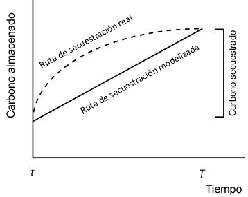

.. _carbonstorage:

*****************************************
Almacenamiento y secuestración de carbono
*****************************************

Resumen
=======

Los ecosistemas terrestres, que almacenan más carbono que la atmósfera, son fundamentales para influir en el cambio climático provocado por el dióxido de carbono. El modelo InVEST de almacenamiento y secuestración de carbono utiliza mapas de uso de la tierra junto con las existencias de cuatro reservas de carbono (biomasa aérea, biomasa subterránea, suelo y materia orgánica muerta) para estimar la cantidad de carbono actualmente almacenada en un paisaje o la cantidad de carbono secuestrado a lo largo del tiempo. Opcionalmente, se puede utilizar el valor social o de mercado del carbono secuestrado, su tasa de cambio anual y una tasa de descuento para estimar el valor de este servicio ecosistémico para la sociedad. Las limitaciones del modelo incluyen un ciclo del carbono demasiado simplificado, un cambio lineal supuesto en la secuestración de carbono a lo largo del tiempo y tasas de descuento potencialmente inexactas.

Introducción
============

Los ecosistemas regulan el clima de la Tierra añadiendo y eliminando de la atmósfera gases de efecto invernadero (GEI) como el CO\ :sub:`2`. Los bosques, las praderas, las turberas y otros ecosistemas terrestres *almacenan* colectivamente mucho más carbono que la atmósfera (Lal 2002). Al almacenar este carbono en la madera, en otra biomasa y en el suelo, los ecosistemas evitan que el CO\ :sub:`2` llegue a la atmósfera, donde contribuiría al cambio climático. Además de almacenar carbono, muchos sistemas siguen acumulándolo en las plantas y el suelo a lo largo del tiempo, con lo que "secuestran" carbono adicional cada año. Perturbar estos sistemas con incendios, enfermedades o la conversión de la vegetación (por ejemplo, la conversión del uso del suelo/cobertura del suelo (LULC)) puede liberar grandes cantidades de CO\ :sub:`2`. Otros cambios de gestión, como la restauración de los bosques o las prácticas agrícolas alternativas, pueden conducir al almacenamiento de grandes cantidades de CO\ :sub:`2`. Por lo tanto, la forma en que gestionamos los ecosistemas terrestres es fundamental para regular nuestro clima.

La secuestración y el almacenamiento de carbono terrestre es quizá el más reconocido de todos los servicios ecosistémicos (Stern 2007, IPCC 2006, Canadell y Raupach 2008, Capoor y Ambrosi 2008, Hamilton et al. 2008, Pagiola 2008). El valor social de una tonelada de carbono secuestrada es igual al daño social que se evita al no liberar la tonelada de carbono a la atmósfera (Tol 2005, Stern 2007). Los cálculos del costo social son complicados y controvertidos ( véanse Weitzman 2007 y Nordhaus 2007b), pero han dado lugar a estimaciones de valor que oscilan entre 9,55 y 84,55 dólares por tonelada métrica de CO\ :sub:`2` liberada a la atmósfera (Nordhaus 2007a y Stern 2007, respectivamente).

La gestión de los paisajes para el almacenamiento y la secuestración de carbono requiere información sobre la cantidad y el lugar donde se almacena el carbono, la cantidad de carbono que se secuestra o se pierde a lo largo del tiempo, y cómo los cambios en el uso de la tierra afectan a la cantidad de carbono almacenado y secuestrado a lo largo del tiempo. Dado que quienes gestionan la tierra deben elegir entre lugares para proteger, cosechar o desarrollar, los mapas de almacenamiento y secuestración de carbono son ideales para apoyar las decisiones que influyen en estos servicios ecosistémicos.

Estos mapas pueden servir de apoyo a una serie de decisiones de los gobiernos, las ONG y las empresas. Por ejemplo, los gobiernos pueden utilizarlos para identificar oportunidades de obtener créditos por la reducción de las emisiones (de carbono) derivadas de la deforestación y la degradación (REDD). Saber qué partes de un paisaje almacenan la mayor cantidad de carbono ayudaría a los gobiernos a dirigir eficazmente los incentivos a los propietarios de tierras a cambio de la conservación de los bosques. Además, es posible que una ONG de conservación desee invertir en zonas en las que coincidan altos niveles de biodiversidad y secuestración de carbono (Nelson et al. 2008). También es posible que una empresa maderera quiera maximizar sus beneficios tanto de la producción de madera como de los créditos de carbono REDD (Plantinga y Birdsey 1994).

El modelo
=========

El almacenamiento de carbono en una parcela depende en gran medida del tamaño de cuatro reservas de carbono: biomasa aérea, biomasa subterránea, suelo y materia orgánica muerta. El modelo de almacenamiento y retención de carbono de InVEST agrega la cantidad de carbono almacenado en estas reservas según los mapas de uso del suelo y las clasificaciones proporcionadas por quien usa. La biomasa aérea comprende todo el material vegetal vivo por encima del suelo (por ejemplo, corteza, troncos, ramas, hojas). La biomasa subterránea comprende los sistemas de raíces vivas de la biomasa aérea. La materia orgánica del suelo es el componente orgánico del suelo y representa la mayor reserva de carbono terrestre. La materia orgánica muerta incluye la hojarasca, así como la madera muerta caída y en pie.

A partir de los mapas de las clases de LULC y de la cantidad de carbono almacenado en las reservas de carbono, este modelo estima la cantidad neta de carbono almacenado en una parcela a lo largo del tiempo y el valor de mercado del carbono secuestrado en las reservas restantes. Las limitaciones del modelo incluyen un ciclo del carbono excesivamente simplificado, un cambio lineal supuesto en la secuestración de carbono a lo largo del tiempo y tasas de descuento potencialmente inexactas. Tampoco se incluyen en el modelo condiciones biofísicas importantes para la secuestración de carbono, como las tasas de fotosíntesis y la presencia de organismos activos en el suelo.

Cómo funciona
-------------

El modelo mapea las densidades de almacenamiento de carbono en rásteres LULC que pueden incluir clases como bosques, pastos o tierras agrícolas. El modelo resume los resultados rasterizados de almacenamiento, secuestración y valor, así como en totales agregados.

Para cada tipo de LULC, el modelo requiere una estimación de la cantidad de carbono en al menos uno de los cuatro reservas fundamentales descritas anteriormente, dado en toneladas métricas por hectárea (t/ha). Si se dispone de datos para más de una reserva, los resultados del modelo serán más completos. El modelo simplemente aplica estas estimaciones al mapa LULC para producir un mapa de almacenamiento de carbono en las reservas de carbono incluidas.

Si se proporciona un mapa LULC actual y otro futuro, se puede calcular el cambio neto en el almacenamiento de carbono a lo largo del tiempo (secuestración y pérdida) y su valor social. Para estimar este cambio en la secuestración de carbono a lo largo del tiempo, simplemente se aplica el modelo al paisaje actual y a un paisaje futuro proyectado, y se calcula la diferencia en el almacenamiento, píxel por píxel. Si se dispone de varios escenarios futuros, se pueden comparar las diferencias entre el paisaje actual y cada uno de los futuros alternativos.

Además, si usted proporciona un mapa de cobertura del suelo del escenario REDD, el modelo tratará ese ráster como un escenario futuro adicional, calculará el almacenamiento y la secuestración, y resumirá los resultados.

Los resultados del modelo se expresan en toneladas métricas (que es lo mismo que megagramos) de carbono por píxel y, si se desea, el valor de la secuestración en unidades monetarias por píxel. Recomendamos encarecidamente utilizar el valor social de la secuestración de carbono si hay interés en expresar la secuestración en unidades monetarias. El valor social de una tonelada de carbono secuestrada es el daño social que se evita al no liberar esa tonelada de carbono a la atmósfera.

El modelo de valoración estima el valor económico de la secuestración (no del almacenamiento) en función de la cantidad de carbono secuestrado, el valor monetario de cada unidad de carbono, una tasa de descuento monetaria y el cambio en el valor de la secuestración de carbono a lo largo del tiempo. Por tanto, la valoración solo puede hacerse en el modelo de carbono si se tiene un escenario futuro. La valoración se aplica al secuestración, no al almacenamiento, porque los precios de mercado se refieren solo al secuestración de carbono. Los tipos de descuento son multiplicadores que suelen reducir el valor de la secuestración de carbono en el tiempo. El primer tipo de descuento, el procedimiento económico estándar de descuento financiero, refleja el hecho de que la gente suele valorar más los beneficios inmediatos que los futuros debido a la incertidumbre y a la supuesta inflación económica a lo largo del tiempo. El segundo tipo de descuento ajusta el valor social de la secuestración de carbono a lo largo del tiempo. Este valor cambiará a medida que cambie el impacto de las emisiones de carbono en los daños previstos relacionados con el cambio climático. Si esperamos que el carbono secuestrado hoy tenga un mayor impacto en la mitigación del cambio climático que el carbono secuestrado en el futuro, esta segunda tasa de descuento debería ser positiva. Por otro lado, si esperamos que el carbono secuestrado hoy tenga un impacto menor en la mitigación del cambio climático que el carbono secuestrado en el futuro, esta segunda tasa de descuento debería ser negativa.

El valor de la secuestración de carbono a lo largo del tiempo para una parcela determinada *x* es:

.. math:: value\_seq_x=V\frac{s_x}{q-p}\sum^{q-p-1}_{t=0}\frac{1}{\left(1+\frac{r}{100}\right)^t\left(1+\frac{c}{100}\right)^t}
   :label: carbon_value

donde

* :math:`V` es el precio por tonelada métrica de carbono

* :math:`s_x` es la cantidad de carbono, en toneladas métricas, secuestrado en la parcela :math:`x`

* :math:`q` es el año futuro

* :math:`p` es el año actual

* :math:`r` es la tasa de descuento anual del mercado para el precio del carbono

* :math:`c` es la tasa de variación anual del precio del carbono

Análisis de escenarios REDD
---------------------------

El modelo de carbono puede realizar opcionalmente un análisis de escenarios según un marco de Reducción de Emisiones por Degradación Forestal y Deforestación (REDD) o REDD+. REDD es un esquema de reducción de emisiones bajo el cual los países que reducen las emisiones de la deforestación pueden ser compensados financieramente. REDD+ se basa en el marco original de REDD al incorporar también la conservación, la gestión sostenible de los bosques y la mejora de las reservas de carbono existentes.

Para realizar el análisis del escenario REDD, el modelo requiere tres mapas LULC: uno para el escenario actual, otro para un escenario de referencia futuro y otro para un escenario futuro bajo una política REDD. El escenario de referencia futuro se utiliza para calcular un nivel de referencia de emisiones con el que se puede comparar el escenario REDD. Dependiendo de los detalles del marco REDD deseado, el escenario de referencia puede generarse de diferentes maneras; por ejemplo, puede basarse en tasas históricas de deforestación o en proyecciones. El mapa del escenario de la política REDD refleja el LULC futuro bajo una política REDD para prevenir la deforestación y mejorar la secuestración de carbono.

Sobre la base de estos tres mapas LULC para los escenarios actuales, de referencia y de política REDD, el modelo biofísico del carbono produce rásters para el almacenamiento total de carbono para cada uno de los tres mapas LULC, y dos rásters de secuestración para los escenarios futuros y REDD.

Limitaciones y simplificaciones
-------------------------------

El modelo simplifica el ciclo del carbono, lo que le permite funcionar con relativamente poca información, pero también conlleva importantes limitaciones. Por ejemplo, el modelo supone que ninguno de los tipos de LULC del paisaje gana o pierde carbono con el tiempo. En cambio, se supone que todos los tipos de LULC se encuentran en un nivel de almacenamiento fijo igual a la media de los niveles de almacenamiento medidos dentro de ese tipo de LULC. Bajo este supuesto, los únicos cambios en el almacenamiento de carbono a lo largo del tiempo se deben a los cambios de un tipo LULC a otro. Por lo tanto, cualquier píxel que no cambie su tipo de LULC tendrá un valor de secuestración de 0 a lo largo del tiempo. En realidad, muchas zonas se están recuperando del uso de la tierra en el pasado o están experimentando una sucesión natural. El problema puede abordarse dividiendo los tipos de LULC en clases de edad (esencialmente añadiendo más tipos de LULC), como tres edades de bosque. Entonces, las parcelas pueden pasar de una clase de edad a otra en los escenarios y cambiar sus valores de almacenamiento de carbono como resultado.

Una segunda limitación es que, dado que el modelo se basa en estimaciones de almacenamiento de carbono para cada tipo de LULC, los resultados son solo tan detallados y fiables como la clasificación de LULC utilizada y los valores de reserva de carbono suministrados. El almacenamiento de carbono difiere claramente entre los tipos de LULC (por ejemplo, bosque tropical frente a bosque abierto), pero a menudo también puede haber una variación significativa dentro de un tipo de LULC. Por ejemplo, el almacenamiento de carbono dentro de un "bosque tropical húmedo" se ve afectado por la temperatura, la altitud, las precipitaciones y el número de años transcurridos desde una perturbación importante (por ejemplo, una tala o un incendio forestal). La variedad de valores de almacenamiento de carbono dentro de los tipos de LULC definidos a grandes rasgos puede recuperarse en parte utilizando un sistema de clasificación de LULC y una tabla de reservas de carbono relacionada que estratifique los tipos de LULC definidos a grandes rasgos con variables ambientales y de gestión relevantes. Por ejemplo, los tipos de LULC forestales pueden estratificarse por elevación, bandas climáticas o intervalos de tiempo desde una perturbación importante. Por supuesto, este enfoque más detallado requiere datos que describan la cantidad de carbono almacenado en cada uno de los depósitos de carbono para cada una de las clases de LULC más finas.

Otra limitación del modelo es que no capta el carbono que se mueve de una reserva a otra. Por ejemplo, si los árboles de un bosque mueren debido a una enfermedad, gran parte del carbono almacenado en la biomasa aérea se convierte en carbono almacenado en otra materia orgánica (muerta). Además, cuando se talan los árboles de un bosque, las ramas, los tallos, la corteza, etc., se dejan en el suelo en forma de residuos. El modelo asume que el carbono de la madera entra "instantáneamente" en la atmósfera.

Por último, aunque la mayor parte de la secuestración sigue una trayectoria no lineal, de manera que el carbono se secuestra a un ritmo mayor en los primeros años y a un ritmo menor en los años siguientes, la valoración del modelo de la secuestración de carbono supone un cambio lineal en el almacenamiento de carbono a lo largo del tiempo. Debido al descuento, la suposición de una tasa de cambio constante tenderá a infravalorar el carbono secuestrado, ya que una trayectoria no lineal de secuestración es más valiosa socialmente que una trayectoria lineal (Figura 1).

*Figura 1: El modelo supone un cambio lineal en el almacenamiento de carbono (la línea continua), mientras que la trayectoria real hacia el nivel de almacenamiento de carbono del año "T" puede ser no lineal (como la línea de puntos). En este caso, "t" indica el año del paisaje actual y "T" el año del paisaje futuro. Con un descuento positivo, el valor de la trayectoria modelizada (la línea sólida) es menor que el de la trayectoria real. Por lo tanto, si las trayectorias de secuestración tienden a seguir la línea punteada, el modelo infravalorará el carbono secuestrado.*

Necesidades de datos
====================

.. nota:: Todos los inputs espaciales deben estar en el mismo sistema de coordenadas proyectadas y en unidades de metros lineales.

.. nota:: Todos los datos de carbono deben ser para el carbono elemental, no CO\ :sub:`2`.

- :investspec:`carbon lulc_cur_path`

- :investspec:`carbon lulc_cur_year`

- :investspec:`carbon calc_sequestration`

- :investspec:`carbon lulc_fut_path`

- :investspec:`carbon lulc_fut_year`

- :investspec:`carbon do_redd`

- :investspec:`carbon lulc_redd_path`

- :investspec:`carbon carbon_pools_path` Deben proporcionarse valores para todas las reservas de carbono, y para todas las clases de LULC, ninguno puede dejarse en blanco. Si no se dispone de información sobre algunas reservas de carbono, las reservas pueden estimarse a partir de otras reservas, u omitirse dejando todos los valores de la reserva iguales a 0.

   Columnas:

   - :investspec:`carbon carbon_pools_path.columns.lucode`
   - :investspec:`carbon carbon_pools_path.columns.c_above`
   - :investspec:`carbon carbon_pools_path.columns.c_below`
   - :investspec:`carbon carbon_pools_path.columns.c_soil`
   - :investspec:`carbon carbon_pools_path.columns.c_dead`

   *Ejemplo:* Estudio hipotético con cinco clases de LULC. La clase 1 (bosque) contiene la mayor cantidad de carbono en todas las reservas. En este ejemplo, el carbono almacenado en la biomasa por encima y por debajo del suelo difiere mucho entre las clases de uso de la tierra, pero el carbono almacenado en el suelo varía menos. Los valores se expresan en toneladas métricas/hectárea (t/ha).  

   ====== =================== ======= ======= ====== ======
   lucode LULC_name           C_above C_below C_soil C_dead
   ====== =================== ======= ======= ====== ======
   1      Bosque               140     70      35     12
   2      Café                 65      40      25     6
   3      Pastizal/pasto       15      35      30     4
   4      Matorral/sotobosque  30      30      30     13
   5      Abierto/urbano       5       5       15     2
   ====== =================== ======= ======= ====== ======

- :investspec:`carbon do_valuation`

- :investspec:`carbon price_per_metric_ton_of_c` Es :math:`V` en la ecuación :eq:`carbon_value`. Precio dado en moneda (cualquier moneda) por tonelada métrica de carbono elemental (no CO\:`2`). Para las aplicaciones interesadas en estimar el valor total de secuestración de carbono, recomendamos las estimaciones de valor basadas en los costos de los daños asociados a la liberación de una tonelada adicional de carbono - el costo social del carbono (CSC). Stern (2007), Tol (2009) y Nordhaus (2007a) presentan estimaciones del CSC. Por ejemplo, dos estimaciones del CSC que hemos utilizado de Tol (2009) son de $66 y $130 (en dólares estadounidenses de 2010) (Polasky et al. 2010).

- :investspec:`carbon discount_rate` Es :math:`r` en la ecuación :eq:`carbon_value`. Un valor por defecto es el 7% anual, que es una de las tasas de descuento de mercado recomendadas por el gobierno de EE.UU. para la evaluación costo-beneficio de los proyectos medioambientales. Sin embargo, esta tasa dependerá del país y del paisaje que se evalúe, y deberá seleccionarse en función de los requisitos locales. Se han esgrimido argumentos filosóficos para utilizar una tasa de descuento más baja al modelizar la dinámica relacionada con el cambio climático, cuyo uso se puede considerar . Si la tasa se fija en el 0%, los valores monetarios no se descuentan.

- :investspec:`carbon rate_change` Esto es :math:`c` en la ecuación :eq:`carbon_value`. Esto ajusta el valor del carbono secuestrado a medida que cambia con el tiempo el impacto de las emisiones sobre los daños previstos relacionados con el cambio climático.

  Fijar esta tasa por encima del 0% sugiere que el valor social del carbono secuestrado en el futuro es menor que el valor del carbono secuestrado ahora. Se ha argumentado mucho que es necesario reducir las emisiones de GEI de inmediato para evitar que se supere un umbral de concentración atmosférica de GEI que provocaría un cambio de 3 grados centígrados o más en la temperatura media mundial en 2105. Se ha argumantado que ese cambio de temperatura provocaría grandes trastornos en las economías de todo el mundo (Stern et al. 2006). Por lo tanto, cualquier mitigación de las emisiones de GEI que se produzca dentro de muchos años puede no tener ningún efecto sobre la superación o no de este umbral de concentración crucial. Si este es el caso, la secuestración de C en un futuro lejano sería relativamente inútil y se justifica una tasa de descuento del carbono superior a cero.

  Por otra parte, fijar la tasa de cambio anual en menos del 0% (por ejemplo, -2%) sugiere que el valor social del carbono secuestrado en el futuro es mayor que el valor del carbono secuestrado ahora (se trata de una cuestión distinta del valor del dinero en el futuro, una dinámica que se tiene en cuenta con la tasa de descuento del mercado). Este puede ser el caso si los daños asociados al cambio climático en el futuro se aceleran a medida que aumenta la concentración de GEI en la atmósfera.

Interpretación de los resultados
--------------------------------
*Carpeta **[Workspace]**:

	* **Registro de parámetros**: cada vez que se ejecute el modelo, se creará un archivo de texto (.txt) en el Espacio de trabajo. El archivo enumerará los valores de los parámetros y los mensajes resultantes para esa ejecución y se nombrará según el servicio, la fecha y la hora. Cuando se ponga en contacto con NatCap por errores en una ejecución del modelo, incluya el registro de parámetros.

	* **report_[Suffix].html:** Este archivo presenta un resumen de todos los datos calculados por el modelo. También incluye descripciones de todos los demás archivos resultantes producidos por el modelo, por lo que es un buen lugar para empezar a explorar y comprender los resultados del modelo. Como se trata de un archivo HTML, puede abrirse con cualquier navegador web.

	* **tot_c_cur_[Suffix].tif/tot_c_fut_[Suffix].tif/tot_c_redd_[Suffix].tif**: rásters que muestran la cantidad de carbono almacenado en cada píxel para los escenarios actual, futuro y REDD. Se trata de una suma de todas las reservas de carbono proporcionadas por la tabla biofísica. Las unidades son toneladas métricas por píxel.

	* **delta_cur_fut_[Suffix].tif**/**delta_cur_redd_[Suffix].tif**: rásters que muestran la diferencia de carbono almacenado entre el paisaje futuro/REDD y el paisaje actual. Los valores se expresan en toneladas métricas por píxel. En este mapa algunos valores pueden ser negativos y otros positivos. Los valores positivos indican el carbono secuestrado, los negativos indican el carbono que se ha perdido.

	* **npv_fut_[Suffix].tif**/**npv_redd_[Suffix].tif**:** rásters que muestran el valor económico del carbono secuestrado entre las fechas del paisaje actual y el futuro/REDD. Las unidades son en moneda por píxel.

* **[Workspace]\\intermediate_outputs** carpeta:

	* **c_above_[Suffix].tif**: ráster de valores de carbono sobre el suelo, mapeado desde la tabla de reservas de carbono a la LULC. Las unidades son toneladas métricas por píxel.
	* **c_below_[Suffix].tif**: ráster de valores de carbono subterráneo, mapeado desde la tabla de reservas de carbono a la LULC. Las unidades son toneladas métricas por píxel.
	* **c_dead_[Suffix].tif**: ráster de valores de carbono muerto, mapeado desde la tabla de reservas de carbono a la LULC. Las unidades son toneladas métricas por píxel.
	* **c_soil_[Suffix].tif**: ráster de los valores de carbono del suelo, mapeado desde la tabla de reservas de carbono a la LULC. Las unidades son toneladas métricas por píxel.
	* **_tmp_work_tokens**: Este directorio almacena los metadatos utilizados internamente para poder evitar el recálculo. Aquí no se almacena ningún resultado del modelo.

Apéndice: Fuentes de datos
==========================

:ref:`Land Use/Land Cover <lulc>`
---------------------------------

:ref:`Carbon Pools <carbon_pools>`
----------------------------------

Precio del carbono y tasas de descuento
---------------------------------------

Estimaciones recientes sugieren que el costo social del carbono (CSC), o el daño marginal asociado a la liberación de una tonelada métrica adicional de C a la atmósfera, oscila entre 32 dólares por tonelada métrica de C (Nordhaus 2007a) y 326 dólares por tonelada métrica de C (Stern 2007) en dólares estadounidenses de 2010. El valor de este daño también puede considerarse el beneficio monetario de una liberación evitada. Tol (2009) ofrece un estudio exhaustivo de las estimaciones del CSC, e informa de valores medios de 66 y 130 dólares por tonelada métrica en dólares estadounidenses de 2010 (los valores difieren debido a los diferentes supuestos relativos al descuento del tiempo). Se pueden encontrar otras estimaciones en Murphy et al. (2004), Stainforth et al. (2005) y Hope (2006).

Un método alternativo para medir el costo de una emisión de una tonelada métrica de C es establecer el costo igual a la alternativa menos costosa para secuestrar esa tonelada. Actualmente, la siguiente mejor alternativa es capturar y almacenar el C emitido por las centrales eléctricas. Según Socolow (2005) y Socolow y Pacala (2007), el costo de esta tecnología por tonelada métrica capturada y almacenada es de aproximadamente 100 dólares.

Por último, aunque no recomendamos este enfoque, los precios de mercado pueden utilizarse para fijar el precio del carbono secuestrado. No recomendamos el uso de los precios de mercado porque normalmente solo se aplican a la secuestración de carbono "adicional"; aquella por encima de una tasa de referencia. Además, los valores de los créditos de carbono de los mercados de carbono dependen en gran medida de las distintas normas y reglamentos del mercado de créditos de carbono y no reflejan necesariamente el beneficio para la sociedad de una tonelada de carbono secuestrada. Por lo tanto, el uso correcto de los precios del mercado requeriría la estimación de una tasa de referencia para el paisaje de interés, el mapeo de la secuestración adicional, y luego la determinación de qué secuestración  adicional es elegible para los créditos de acuerdo con las normas y reglamentos del mercado.

Descontamos el valor de los pagos futuros por la secuestración de carbono para reflejar la preferencia de la sociedad por los pagos que se producen más pronto que tarde. La Oficina de Gestión y Presupuesto de los Estados Unidos recomienda una tasa de descuento de mercado del 7% anual para los proyectos con sede en los Estados Unidos (OMB 1992). Los tipos de descuento varían en otras partes del mundo. Canadá y Nueva Zelanda recomiendan un 10% para sus proyectos (Abusah y de Bruyn 2007). Lo mejor es buscar la tasa de descuento recomendada para su país.

Algunos economistas creen que una tasa de descuento de mercado o de consumo del 7% al 12% es demasiado alta cuando se trata del análisis del cambio climático. Dado que el cambio climático tiene el potencial de perturbar gravemente las economías en el futuro, la preferencia de la sociedad por consumir hoy a expensas tanto de la estabilidad climática en el futuro como de las oportunidades económicas de las generaciones futuras es considerada por algunos como poco ética (Cline 1992, Stern 2007). Según este argumento, los análisis de los efectos del cambio climático en la sociedad y las políticas diseñadas para reducirlo deberían utilizar tasas de descuento bajas para fomentar una mayor mitigación de las emisiones de GEI y, por tanto, compensar los daños potencialmente graves que sufrirán las generaciones futuras (por ejemplo, r = 0,014 en Stern (2007)). Las políticas gubernamentales recientes de varios países han apoyado el uso de una tasa de descuento muy baja para determinados proyectos a largo plazo (Abusah y de Bruyn 2007).

La tasa de descuento del carbono, que refleja el mayor impacto climático del carbono secuestrado inmediatamente sobre el carbono secuestrado en el futuro, se analiza en Adams et al. (1999), Plantinga et al. (1999), Feng 2005 y Nelson et al. (2008).

Referencias
===========

Abusah, Sam y Bruyn, Clinton de. 2007. Getting Auckland on Track: Public Transport and New Zealand's Economic. Ministry of Economic Development Working Paper. Accessed at <http://s3.amazonaws.com/zanran_storage/www.med.govt.nz/ContentPages/4013253.pdf>.

Adams, DM, RJ Alig, BA McCarl et al. 1999. Minimum cost strategies for sequestering carbon in forests. Land Econ 75: 360-374.

Anderson, JR, EE Hardy, JT Roach, RE Witmer. A Land Use and Land Cover Classification System for Use with Remote Sensor Data. Washington, DC: United States Government Printing Office; 1976. Geological Survey Professional Paper 964.

Antle, JM y B. Diagana. 2003. Creating Incentives for the Adoption of Sustainable Agricultural Practices in Developing Countries: The Role of Soil Carbon Sequestration. American Journal of Agricultural Economics 85:1178-1184.

Baer, SG, DJ Kitchen, JM Blair y CW Rice. 2002. Changes in Ecosystem Structure and Function along a Chronosequence of Restored Grasslands. Ecological Applications 12:1688-1701.

Bernoux, M., MDS Carvalho, B. Volkoff y CC Cerri. 2002. Brazil's soil carbon stocks. Soil Science Society of America Journal 66:888-896.

Brown, SL, PE Schroeder y JS Kern. Spatial distribution of biomass in forests of the eastern	USA. Forest Ecology and Management 123 (1999) 81-90.

Brown, S. 2002. Measuring carbon in forests: current status and future challenges. Environmental Pollution 116:363-372.

Brown, S. Estimating Biomass and Biomass Change of Tropical Forests: a Primer. FAO Forestry Department; 1997. Report for FAO Forestry Paper 134.

Brown, S. y PE Schroeder. 1999. Spatial patterns of aboveground production and mortality of woody biomass for eastern US forests. Ecological Applications 9:968-980.

Cairns, MA, PK Haggerty, R. Alvarez, BHJ De Jong y I. Olmsted. 2000. Tropical Mexico's recent land-use change: A region's contribution to the global carbon cycle. Ecological Applications 10:1426-1441.

Cairns, MA, S. Brown, EH Helmer y GA Baumgardner. 1997. Root biomass allocation in the world's upland forests. Oecologia 111:1-11.

Canadell, JG y MR Raupach. 2008. Managing Forests for Climate Change Mitigation. Science 320:1456-1457.

Cline, WR. 1992. The economics of global warming. Institute for International Economics, Washington, D.C.

Coomes, DA, RB Allen, NA Scott, C. Goulding y P. Beets. 2002. Designing systems to monitor carbon stocks in forests and shrublands. Forest Ecology and Management 164:89-108.

Conte, MN y MJ Kotchen. 2010. Explaining the price of voluntary carbon offsets. Climate Change Economics 1 (2):93-111.

Capoor, K. y P. Ambrosi. State and Trends of the Carbon Market 2008. Washington, D.C.: World Bank Institute, 2008 May.

Delaney, M., S. Brown, AE Lugo, A. Torres-Lezama y NB Quintero. 1998. The quantity and turnover of dead wood in permanent forest plots in six life zones of Venezuela. Biotropica 30:2-11.

Detwiler, RP. 1986. Land Use Change and the Global Carbon Cycle: The Role of Tropical Soils. Biogeochemistry 2:67-93.

Edinburgh Centre for Carbon Management. The Establishing Mechanisms for Payments for Carbon Environmental Services in the Eastern Arc Mountains, Tanzania; 2007 May 2007.

Fargione, J., J. Hill, D. Tilman, S. Polasky y P. Hawthorne. 2008. Land Clearing and the Biofuel Carbon Debt. Science 319:1235-1238.

Feng, H. 2005. The dynamics of carbon sequestration and alternative carbon accounting, with an application to the upper Mississippi River Basin. Ecological Economics 54:23-35.

Gaston, G., S. Brown, M. Lorenzini y KD Singh. 1998. State and change in carbon pools in the forests of tropical Africa. Global Change Biology 4:97-114.

Glenday, J. 2006. Carbon storage and emissions offset potential in an East African tropical rainforest. Forest Ecology and Management 235:72-83.

Grace, J., J. San Jose, P. Meir, HS Miranda y RA Montes. 2006. Productivity and carbon fluxes of tropical savannas. Journal of Biogeography 33:387-400.

Gibbs, HK, S Brown, JO Niles y JA Foley. 2007. Monitoring and estimating tropical forest carbon stocks: making REDD a reality. Environmental Research Letters 2:045023.

Hamilton, K., M Sjardin, T Marcello y G Xu. Forging a Frontier: State of the Voluntary Carbon Markets 2008. Washington, D.C.: Ecosystem Marketplace and New Carbon Finance; 2008.

Hope, CW. 2006. The social cost of carbon: what does it actually depend on? Climate Policy 6: 565--572

Houghton, RA. 2005. Tropical deforestation as a source of greenhouse gas emissions. In: Tropical Deforestation and Climate Change, Moutinho and Schwartzman [eds.]. Instituto de Pesquisa Ambiental da Amazonia and Environmental Defense, Belem, Brasil.

Houghton, RA y JL Hackler. 2006. Emissions of carbon from land use change in sub-Saharan Africa. Journal of Geophysical Research 111.

The Intergovernmental Panel on Climate Change (IPCC). 2006. 2006 IPCC Guidelines for National Greenhouse Gas Inventories, Volume 4: Agriculture, Forestry and Other Land Use. Prepared by the National Greenhouse Gas Inventories Programme, Eggleston, HS, L. Buendia, K. Miwa, T. Ngara y K. Tanabe (eds). Institute for Global Environmental Strategies (IGES), Hayama, Japón. <https://www.ipcc-nggip.iges.or.jp/public/2006gl/vol4.html>.

Jenny, H. 1980. The Soil Resource. Springer, Nueva York.

Lal, R. 2004. Soil Carbon Sequestration Impacts on Global Climate Change and Food Security. Science 304:1623-1627.

Mackey, B, Keith H, Berry S.L, Lindenmayer DB. Green carbon: the role of natural forests in carbon storage. Part 1, A green carbon account of Australia's Southeastern Eucalypt forest, and policy implications. Canberra, Australia: ANU E Press, 2008.

Makundi, WR. 2001. Carbon mitigation potential and costs in the forest sector in Tanzania. Mitigation and Adaptation Strategies for Global Change 6:335-353.

Malhi, Y., D. Wood, TR Baker et al. 2006. The regional variation of aboveground live biomass in old-growth Amazonian forests. Global Change Biology 12:1107-1138.

Malimbwi, RE, B. Solberg y E. Luoga. 1994. Estimation of biomass and volume in miombo woodland at Kitungalo Forest Reserve Tanzania. Journal of Tropical Forest Science 7:230-242.

McLauchlan, KK., SE Hobbie y WM Post. 2006. Conversion From Agriculture To Grassland Builds Soil Organic Matter On Decadal Timescales. Ecological Applications 16:143-153.

Mollicone D., F. Achard, S. Federici, H. Eva, G. Grassi, A. Belward, F. Raes, G. Seufert, H. Stibig, G. Matteucci y E. Schulze. 2007. An incentive mechanism for reducing emissions from conversion of intact and non-intact forests. Climatic Change 83:477-493.

Munishi, PKT y TH Shear. 2004. Carbon Storage in Afromontane Rain Forests of the Eastern Arc Mountains of Tanzania: their Net Contribution to Atmospheric Carbon. Journal of Tropical Forest Science 16:78-93.

Murphy, JM et al. 2004. Quantification of modelling uncertainties in a large ensemble of climate change simulations. Nature 430, 768-772.

Murray, B., B. Sohngen y M. Ross. 2007. Economic consequences of consideration of permanence, leakage and additionality for soil carbon sequestration projects. Climatic Change 80:127-143.

Nascimento, HEM y WF Laurance. 2002. Total aboveground biomass in central Amazonian rainforests: a landscape-scale study. Forest Ecology and Management 168:311-321.

Nelson, E., G. Mendoza, J. Regetz, S. Polasky, H. Tallis, D. Cameron, K. Chan, G. Daily, J. Goldstein, P. Kareiva, E. Lonsdorf, R. Naidoo, TH Ricketts y R. Shaw. 2009. Modeling multiple ecosystem services, biodiversity conservation, commodity production, and tradeoffs at landscape scales. Frontiers in Ecology and the Environment.

Nordhaus, W. 2007a. Critical Assumptions in the Stern Review on Climate Change. Science 317 (5835): 201--202.

Nordhaus, W. 2007b. A Review of the Stern Review on the Economics of Global Warming. Journal of Economic Literature 45: 686-702.

Pagiola, S. 2008. Payments for environmental services in Costa Rica. Ecological Economics 65 (4): 712-724.

Plantinga, AJ y RA Birdsey. 1994. Optimal Forest Stand Management When Benefits are Derived from Carbon. Natural Resource Modeling 8(4): 373-387.

Polasky, S, E Nelson, D Pennington y K Johnson. 2010. The Impact of Land-Use Change on Ecosystem Services, Biodiversity and Returns to Landowners: A Case Study in the State of Minnesota. Environmental and Resource Economics 48:219-242

Post, WM, WR Emanuel, PJ Zinke y AG Stangenberger. 1982. Soil carbon pools and world life zones. Nature 298:156-159.

Post, WM, KC Kwon. 2000. Soil carbon sequestration and land-use change: processes and potential. Global Change Biology 6:317-327.

Raich, JW, AE Russell, K. Kitayama, WJ Parton y PM Vitousek. 2006. Temperature influences carbon accumulation in moist tropical forests. Ecology 87:76-87.

Ruesch A y HK Gibbs. 2008. New IPCC tier-1 global biomass carbon map for the year 2000. Available:https://cdiac.ess-dive.lbl.gov/epubs/ndp/global_carbon/carbon_documentation.html.

Schuman, GE, HH Janzen y JE Herrick. 2002. Soil carbon dynamics and potential carbon sequestration by rangelands. Environmental Pollution, 116:391-396.

Sedjo, RA y B. Sohngen. Carbon Credits for Avoided Deforestation. Washington, DC: Resources for the Future; 2007 October 2007. Report for RFF DP 07-47.

Silver, WL, R. Ostertag y AE Lugo. 2000. The potential for carbon sequestration through reforestation of abandoned tropical agricultural and pasture lands. Restoration Ecology 8:394-407.

Socolow, RH. 2005. Can We Bury Global Warming? Scientific American 293: 49-55.

Socolow, RH y SW Pacala. 2006. A Plan to Keep Carbon in Check. Scientific American 295: 50-57.

Sohngen, Brent, RH Beach y Kenneth Andrasko. 2008. Avoided Deforestation as a Greenhouse Gas Mitigation Tool: Economic Issues. Journal of Environmental Quality 37: 1368-1375.

Stainforth, DA et al., 2005. Uncertainty in predictions of the climate response to rising levels of greenhouse gases. Nature 433, 403--406.

Stern, N. 2007. The Economics of Climate Change: The Stern Review. Cambridge and New York: Cambridge University Press.

Tiessen, H., C. Feller, EVSB Sampaio y P. Garin. 1998. Carbon Sequestration and Turnover in Semiarid Savannas and Dry Forest. Climatic Change 40:105-117.

Tilman, D., J. Hill y C. Lehman. 2006. Carbon-Negative Biofuels from Low-Input High-Diversity Grassland Biomass. Science 314:1598-1600.

Tol, RSJ. 2005. The marginal damage costs of carbon dioxide emissions: an assessment of the uncertainties. Energy Policy 33:2064-2074.

Tol, RSJ. 2009. The Economic Effects of Climate Change.Journal of Economic Perspectives 23:29-51.

USOMB (US Office of Management and Budget). 1992. Guidelines and Discount Rates for Benefit-Cost Analysis of Federal Programs Circular No. A-94 (Revised). Transmittal Memo No. 64. Washington DC: US Office of Management and Budget.

Vagen, TG, R Lal y BR Singh. 2005. Soil carbon sequestration in sub-Saharan Africa: A review. Land Degradation & Development 16:53-71.

Weitzman, ML. 2007. A review of the Stern Review on the Economics of Climate Change. Journal of Economic Literature 45:703-724.

Zhang, Q y CO Justice. 2001. Carbon Emissions and Sequestration Potential of Central African Ecosystems. AMBIO 30:351-355.
