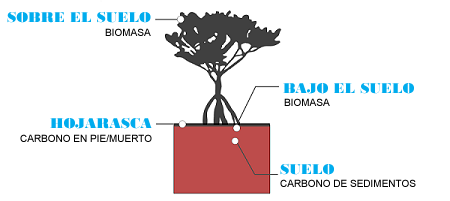
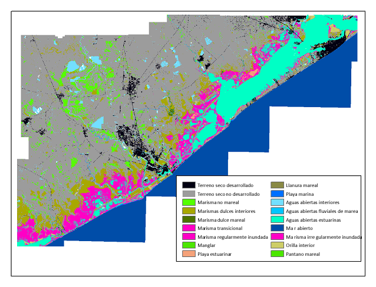
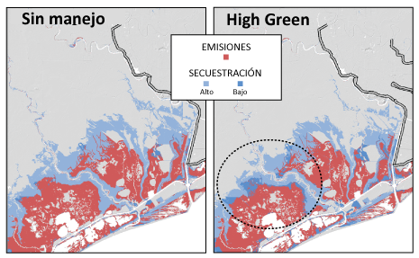

.. _coastal-blue-carbon:

********************
Carbono azul costero
********************

Resumen
=======

Los ecosistemas marinos y terrestres ayudan a regular el clima de la Tierra añadiendo y quitando gases de efecto invernadero (GEI), como el dióxido de carbono (CO\:`2`), a la atmósfera y de la atmósfera. Las marismas costeras, los manglares y los prados marinos, en particular, almacenan grandes cantidades de carbono en sus sedimentos, hojas y otras formas de biomasa. Además de almacenar carbono, los ecosistemas marinos acumulan continuamente carbono en sus sedimentos, creando grandes reservas de carbono a largo plazo. Al almacenar y secuestrar el carbono, los ecosistemas marinos mantienen CO\N2` fuera de la atmósfera, donde de otro modo contribuiría al al cambio climático.

Las actividades de gestión que modifican la cubierta vegetal costera, como la restauración de los prados marinos y la tala de los manglares, modifican la capacidad de las zonas costeras y marinas para almacenar y secuestrar carbono.

El modelo InVEST de carbono azul costero intenta predecir la cantidad de carbono almacenado y secuestrado en una zona costera en determinados momentos debido a cambios en la cubierta vegetal. Utilizando una estimación del valor social monetario, o, si está disponible, un precio de mercado para el carbono almacenado y secuestrado, el modelo también cuantifica el valor marginal del almacenamiento y la secuestración.

Los resultados del modelo pueden utilizarse para comparar los escenarios actuales y futuros de reservas de carbono y secuestracion neta, así como para identificar lugares del paisaje en los que debería evitarse la degradación de los ecosistemas costeros y priorizar su restauración para preservar y mejorar estos servicios de almacenamiento y secuestración de carbono.

Introducción
============

Este modelo hace uso de una variedad de información, incluyendo:

- La distribución y abundancia de la vegetación costera
- Datos sobre las reservas de carbono específicas del hábitat
- Características del impacto de diversas perturbaciones de la cubierta terrestre sobre la biomasa y reservas de carbono en el suelo para predecir las tasas de emisión de carbono
- Tasas de acumulación de carbono para estimar las existencias de carbono, la secuestración neta neto y valor en un paisaje terrestre o marino
- Estimaciones del valor social monetario o del precio de mercado del carbono

Para cuantificar el valor del almacenamiento y secuestración de carbono, el modelo se centra en los cambios en el dióxido de carbono atmosférico y otros gases de efecto invernadero como resultado de cambios causados por las actividades humanas que pueden afectar a los ecosistemas marinos que almacenan y secuestran carbono.  Los cambios en la composición de la atmósfera tienen efectos de gran alcance en los sistemas naturales que pueden dar lugar a cambios en la productividad agrícola, la calidad del aire, el nivel del mar, etc.

El modelo
=========

Consideraciones de la modelización
----------------------------------

La cartografía y la modelización de los cambios en el almacenamiento y la secuestración de carbono para los hábitats costeros y marinos pueden suponer un reto. Los tipos de inputs espaciales y la información disponible sobre el ciclo del carbono varían según el lugar. Algunas zonas de estudio disponen de datos de alta calidad para un análisis detallado, mientras que otros lugares no disponen de la información necesaria para modelizar los cambios en la  posición y función de la vegetación costera. Las marismas, por ejemplo, suelen ser estudiadas en el contexto de la migración debida a la subida del nivel del mar. La combinación de factores naturales (por ejemplo, la subida del nivel del mar) y antropogénicos (por ejemplo, la migración de las marismas bloqueada por las carreteras) debería incluirse en los mapas de escenarios y en la posterior modelización del carbono, siempre que sea posible. Al explorar los futuros escenarios de la cubierta del suelo los resultados de los mapas de la cubierta terrestre producidos por el modelo SLAMM (Sea Level Affecting Marshes desarrollado por Warren Pinnacle) pueden ser útiles para el modelo (Clougheet et al. 2010).  Sin embargo, dado que no todos los sitios tienen la información detallada sobre elevación y hábitat necesaria para ejecutar el SLAMM, este modelo InVEST ofrece un enfoque flexible que le permite proporcionar mapas detallados de uso y cobertura del suelo o mapas que indiquen la presencia de vegetación costera y marina que puede secuestrar carbono.

Cómo funciona
-------------

InVEST Coastal Blue Carbon modeliza el ciclo del carbono mediante un enfoque de tipo contable (Houghton, 2003). Este enfoque simplifica el ciclo del carbono al tener en cuenta el almacenamiento en tres grupos principales (biomasa, carbono sedimentario (es decir, suelo) y carbono muerto en pie (es decir, hojarasca). véase la figura 1).  La acumulación de carbono en los hábitats costeros se produce principalmente en los sedimentos (Pendleton et al., 2012).  El modelo requiere que se proporcionen mapas de los ecosistemas costeros que almacenan carbono, como los manglares y los prados marinos. También debe deben proporcionar datos sobre la cantidad de carbono almacenado en las tres reservas de carbono y la tasa de de carbono en la biomasa y los sedimentos. Si no se dispone de información local, se puede recurrir a la base de datos mundial de valores de reservas de carbono y las tasas de acumulación procedentes de la literatura revisada por pares que se que se incluye en el modelo. Si se dispone de datos de estudios de campo o de otras fuentes locales, deben utilizarse estos valores en lugar de los de la base de datos global. El modelo requiere mapas de la cubierta terrestre que representen los cambios en los patrones de uso humano en las zonas costeras o los cambios en el mar para estimar la cantidad de carbono perdido o ganado durante un periodo de tiempo determinado. El modelo cuantifica el almacenamiento de carbono en el paisaje terrestre o marino sumando el carbono almacenado enestas tres reservas de carbono.

Figura 1. Tres reservorios de carbono para los ecosistemas marinos incluidos en el modelo de carbono azul de InVEST (ejemplo de los manglares).

.. note::
        Varios parámetros se comparten en la mayoría de las ecuaciones del modelo:

        * :math:`t` es el paso de tiempo.  Este modelo opera en una escala de tiempo anual, por lo que
          :math:`t` representa el año representado por el paso de tiempo.

          * :math:`t_{baseline}` representa el año de la cobertura del suelo de la línea de base.

        * :math:`s` es el año de la instantánea.  Representa el año de cualquiera de las
          las instantáneas de transición posteriores al año de la línea de base.
        * :math:`p` representa la reserva de carbono, generalmente biomasa o suelo.  La hojarasca
          se considera solo en los cálculos de acumulación de carbono y no se ve
          afectada por las emisiones.

        El modelo considera cada celda de la cuadrícula :math:`x` de forma independiente, por lo que se han
        eliminado de las ecuaciones descritas a continuación.

.. note::
        Aunque este capítulo de la guía de uso se refiere a unidades en Megatoneladas de
        CO2 equivalente por hectárea, el modelo no realiza ninguna conversión de unidades, 
        por lo que se puede usar cualquier unidad que represente la tasa de acumulación o las emisiones 
        específicas del hábitat, con tal de que sean coherentes en todos los inputs del modelo.

Almacenamiento de carbono
^^^^^^^^^^^^^^^^^^^^^^^^^

Los hábitats costeros de carbono azul pueden indicar simplemente el tipo de vegetación dominante (por ejemplo, pasto marino, manglar, etc.) o pueden basarse en detalles que afectan a los valores de almacenamiento de la reserva, como las especies vegetales, la densidad de la temperatura o la edad de la vegetación (por ejemplo, el tiempo transcurrido desde la restauración o la última gran perturbación). 

Para la estimación del almacenamiento de carbono, se supone que cada hábitat costero de carbono azul está en equilibrio de almacenamiento en cualquier momento (la acumulación de de carbono se tendrá en cuenta en el componente de secuestración del modelo).

Las reservas de carbono :math:`S` para un año :math:`t` y una reserva :math:`p` se calculan sumando la captura neta de carbono del año :math:`t` a las disponibles en el año anterior :math:`t-1`.  O, alternativamente, utilizando los valores iniciales de las existencias de la tabla biofísica, :math:`S_{p,t_{baseline}}`.

.. math::
        S_{p,t} = \begin{Bmatrix}
                S_{p,t-1} + N_{p,t} & if & t > t_{baseline} \\
                S_{p,t_{baseline}} & if & t = t_{baseline}
        \end{Bmatrix}
        :label: cbc_stocks_pool

Las reservas de carbono del año :math:`t` representan las reservas de carbono al principio del año :math:`t`.

La secuestración neta :math:`N_{p,t}` se refiere a la cantidad de carbono ganada o perdida dentro del año :math:`t`, y el estado de la transición más reciente determina si el carbono se está acumulando (secuestración neta positiva) o emitiendo (secuestración neta negativa).  Una sola celda puede *ya sea* acumular *o* emitir carbono; no es posible hacer ambas cosas en un mismo paso de tiempo.  De este modo, el modelo asume que una celda de la cuadrícula pasa completamente de un tipo de hábitat a otro durante un evento de transición.  La naturaleza de la secuestración (acumulación o emisión) también será consistente entre años de transición en un píxel determinado.

Así, :math:`N_{p,t}` será igual a una de esas ecuaciones, dependiendo del estado de la transición más reciente:

.. math::
        N_{p,t} = \begin{Bmatrix}
                -1 \cdot E_{p,t} & if & carbon\ is\ emitting \\
                A_{p,t} & if & carbon\ is\ accumulating
        \end{Bmatrix}
        :label: cbc_net_sequestration

La tasa de acumulación :math:`A_{p,t}` es definida por usted en la tabla biofísica para cada clasificación de cobertura del suelo. Cuando una clase de cobertura del suelo pasa a un estado de acumulación, la tasa de acumulación reflejará la clase de cobertura del suelo de destino.

Note que las emisiones :math:`E_{p,t}` se calculan como un valor positivo, y :math:`-1` es neecsario para reflejar una pérdida de carbono desde le reserva.

Tenga en cuenta que lo anterior solo se aplica a las reservas de biomasa y de suelo. Las existencias de hojarasca no están sujetas a emisiones, por lo que solo pueden acumularse linealmente según la tasa definida por usted en la tabla biofísica:

.. math::
        S_{p_{litter},t} = S_{p_{litter},t_{baseline}} + (A_{p_{litter}} \cdot (t - t_{baseline}))
        :label: cbc_stocks_litter

Por lo tanto, la secuestración neta de la reserva de hojarasca, :math:`N_{p_{litter},t}` es equivalente a :math:`A_{p_{litter}}`, definido por usted en la tabla biofísica.  La tasa de acumulación puede cambiar solo cuando la clase de cobertura del suelo transiciona hacia otra clase.

El modelo también calcula las reservas totales para cada año de la etapa temporal :math:`t`, que es simplemente la suma de todas las reservas de carbono en las 3 reservas:

.. math:: S_{t,total} = S_{t,p_{soil}} + S_{t,p_{biomass}} + S_{t,p_{litter}}
        :label: cbc_stocks_total

Acumulación de carbono
^^^^^^^^^^^^^^^^^^^^^^

modelizamos la acumulación como la tasa de carbono retenido en el suelo en forma orgánica después del primer año de descomposición. En relación con el presupuesto anual del ecosistema, esta reserva no ha sido remineralizada, por lo que representa acumulacion neta. Este carbono suele proceder de la producción subterránea, y el tiempo de residencia puede variar desde décadas hasta milenios (Romero et al. 1994, Mateo et al. 1997). Esta acumulación contribuye al desarrollo de "reservorios" de carbono que se consideran prácticamente permanentes a menos que se alteren. Así pues, incluso en ausencia de un cambio de uso o cobertura del suelo, el carbono sigue siendo secuestrado de forma natural.

La pérdida de carbono de la reserva de suelo (sedimentos) tras la perturbación es más matizada que la secuestración porque los diferentes tipos de usos humanos y/o el estancamiento pueden causar una alteración variada de los suelos y del carbono almacenado debajo. Por ejemplo, las actividades de alto impacto, como la tala de manglares para un estanque de camarones o el dragado de sedimentos, pueden dar lugar a una mayor alteración del carbono del suelo que otras actividades como la pesca comercial o la prospección petrolífera.  El impacto del desarrollo costero en el almacenamiento de carbono varía, ya que algunos tipos de desarrollo pueden implicar la pavimentación del suelo, lo que a menudo mantiene intacto un gran porcentaje del carbono almacenado. Por otro lado, el dragado podría eliminar el pasto marino y alterar los sedimentos que se encuentran debajo, liberando carbono a la atmósfera.

Emisiones de carbono
^^^^^^^^^^^^^^^^^^^^

Cuando los ecosistemas costeros se degradan por las actividades humanas, el carbono almacenado en el material vegetal vivo (por encima y por debajo del suelo) y el suelo puede ser emitido a la atmósfera. La magnitud de la liberación de CO\N :sub:`2` posterior a la conversión depende del tipo de vegetación alterada y del nivel de perturbación. El tipo de perturbación determinará la cantidad de pérdida de biomasa y la profundidad a la que se alterará el perfil del suelo. Cuanto más profundos sean los efectos de la perturbación, más carbono del suelo se expondrá al oxígeno, se oxidará y, en consecuencia, se emitirá en forma de CO\ :sub:`2`. Algunas perturbaciones solo alterarán las capas superiores del suelo, mientras que las capas más profundas permanecen inundadas y su carbono intacto. Otras perturbaciones pueden afectar varios metros del perfil del suelo. Para estimar el alcance del impacto de las diferentes perturbaciones, las clasificamos en tres categorías de impacto: alto, medio y bajo. Ejemplos de alteraciones de alto impacto son la conversión de los manglares a camaroneras y el drenaje o dique de las marismas para su conversión para la agricultura. Los ejemplos de perturbaciones de bajo impacto incluyen la navegación recreativa o los puertos deportivos flotantes.

Las emisiones de carbono comienzan en un año de instantánea en el que la clasificación de la cobertura del suelo subyacente a la celda de la cuadrícula :math:`x` pasa a un estado de perturbación de impacto bajo, medio o alto. En los años siguientes, las emisiones continúan hasta que la celda :math:`x` experimente otra transición, o bien se alcance el año de análisis.

El modelo utiliza una función de decaimiento exponencial basada en la vida media definida por usted :math:`H_{p}` de la reserva de carbono en cuestión, así como el volumen de carbono perturbado. En este caso, :math:`s` representa el año de la transición, y :math:`E_{p,t}` es el volumen de carbono emitido desde la reserva :math:`p` en el año :math:`t`.

.. math:: E_{p,t} = D_{p,s} \cdot ({ 0.5 }^{ \frac { t-(s+1) }{ H_{p,s} } } - { 0.5 }^{ \frac { t-s }{ H_{p,s} } })
        :label: cbc_emissions

El volumen de carbono perturbado :math:`D_{p,s}` representa el volumen total de carbono que se liberará con el tiempo a partir de la transición que tiene lugar en la celda de la cuadrícula :math:`x` en el año de transición :math:`s` a medida que transcurre el tiempo :math:`t \infty`.  Esta cantidad viene determinada por la magnitud de la perturbación :math:`M_{p,s}` (de bajo impacto o de alto impacto), las existencias :math:`S` presentes al principio del año :math:`s`, y la transición de la cobertura del suelo que se ha producido en el año :math:`s`:

.. math:: D_{p,s} = S_{p,s} \cdot M_{p,s}
        :label: cbc_disturbance_volume

La magnitud de la perturbación viene determinada por la matriz de transición (impacto bajo, medio o alto), y se especifica como porcentaje de carbono perturbado en la Tabla Biofísica.  Cuando una clasificación de la cobertura del suelo experimenta una transición hacia un estado de emisión, la magnitud de la perturbación se tomará de la clase de cobertura del suelo de origen.

Magnitud y momento de la pérdida
""""""""""""""""""""""""""""""""

modelizamos la liberación de carbono de las reservas de biomasa y suelo estimando la fracción de carbono que se pierde de las existencias totales de cada reserva en el momento de la perturbación. La fracción de carbono que se pierde viene determinada por el hábitat costero original de carbono azul y el nivel de impacto resultante de la perturbación (véase la Tabla 1).

El modelo de carbono azul costero de InVEST le permite proporcionar detalles sobre el nivel de perturbación que se produce durante la transición de un hábitat de carbono azul costero a un hábitat de carbono azul no costero. Esta información puede proporcionarse al modelo a través de una herramienta de preprocesamiento y aclararse aún más con una tabla de transición de inputs.

En general, los reservorios de carbono emiten carbono a diferentes ritmos: la mayoría de las emisiones de la reserva de biomasa tienen lugar durante el primer año, mientras que las emisiones de la reserva de suelo pueden tardar mucho más. El modelo asigna funciones de decaimiento exponencial y valores de vida media a las reservas de carbono de la biomasa y del suelo de cada tipo de hábitat (Tabla 1; Murray et al. 2011).

..
  This table is so annoying to edit by hand.  If you really need to edit by hand, find the widest monitor you can and make the text super small
  Also, FYI, the | | syntax allows for line breaks within a table cell.

+----------------------------------------------+-----------------------------------------+-----------------------------------------------------------------------------------------------------+------------------------------------------------------------------------------------+----------------------------------------+
| **Rango**                                    | Marismas salinas                        | Manglares                                                                                           | Pasos marinos                                                                      | Otra vegetación                        |
+==============================================+=========================================+=====================================================================================================+====================================================================================+========================================+
| **% de pérdida de carbono de la biomasa**    | | LI/MI: 50% de pérdida de biomasa (1)  | | LI/MI: 50% pérdida de biomasa (1)                                                                 | | LI/MI: 50% de pérdida de biomasa (1)                                             | Utilizar datos bibliográficos/de campo |
|                                              | | HI: 100% pérdida de biomasa           | | HI: 100% pérdida de biomasa           | | HI: 100% de pérdida de biomasa                          |                                                                                    |                                        |
+----------------------------------------------+-----------------------------------------+-----------------------------------------------------------------------------------------------------+------------------------------------------------------------------------------------+----------------------------------------+
| **% pérdida de carbono del suelo**           | | LI: 30% de pérdida (1)                | | LI: 30% de pérdida (1)                                                                            | | LI/MI: el 10% superior se desagua, el 90% inferior se descompone en el lugar (2) | Utilizar datos bibliográficos/de campo |
|                                              | | MI/HI: 100% de pérdida (3)            | | MI: 50% de pérdida (1)                                                                            | | HI: el 50% superior se lava, el 50% inferior se descompone en el lugar (2)       |                                        |
|                                              |                                         | | HI: 66% de pérdida (hasta 1,5 m de profundidad) (1)                                               |                                                                                    |                                        |
+----------------------------------------------+-----------------------------------------+-----------------------------------------------------------------------------------------------------+------------------------------------------------------------------------------------+----------------------------------------+
| **Tasa de deterioro (en 25 años)**           | | Vida media de la biomasa: 6 meses (2) | | Vida media de la biomasa: 15 años, pero se supone que el 75% se libera inmediatamente al quemarse | | Vida media de la biomasa: 100 días (2)                                           | Utilizar datos bibliográficos/de campo |
|                                              | | Vida media en el suelo: 7,5 años (2)  | | Vida media en el suelo 7,5 años (2)                                                               | | Vida media en el suelo: 1 año (2)                                                |                                        |
+----------------------------------------------+-----------------------------------------+-----------------------------------------------------------------------------------------------------+------------------------------------------------------------------------------------+----------------------------------------+
| **Emisiones de metano**                      | 1,85 T CO2/ha/año (4)                   | 0,4 T CO2/ha/año                                                                                    | Insignificante                                                                     | Utilizar datos bibliográficos/de campo |
+----------------------------------------------+-----------------------------------------+-----------------------------------------------------------------------------------------------------+------------------------------------------------------------------------------------+----------------------------------------+

Tabla 1: Porcentaje de pérdida de carbono y tasas de descomposición específicas del hábitat como resultado de actividades de **impacto bajo (LI), medio (MI) y alto (HI)** que perturban los ecosistemas de marismas, manglares y pastos marinos.  Estos valores por defecto pueden ajustarse modificando las tablas CSV de input.

Referencias (números entre paréntesis):

1. Donato, D. C., Kauffman, J. B., Murdiyarso, D., Kurnianto, S., Stidham, M. y Kanninen, M. (2011). Mangroves among the most carbon-rich forests in the tropics. Nature Geoscience, 4(5), 293-297.
2. Murray, B. C., Pendleton, L., Jenkins, W. A. y Sifleet, S. (2011). Green payments for blue carbon: Economic incentives for protecting threatened coastal habitats. Nicholas Institute for Environmental Policy Solutions, Report NI, 11, 04.
3. Crooks, S., Herr, D., Tamelander, J., Laffoley, D. y Vandever, J. (2011). Mitigating climate change through restoration and management of coastal wetlands and near-shore marine ecosystems: challenges and opportunities. Environment Department Paper, 121, 2011-009.
4. Krithika, K., Purvaja, R. y Ramesh, R. (2008). Fluxes of methane and nitrous oxide from an Indian mangrove. Current Science (00113891), 94(2).

Valoración del carbono neto secuestrado
^^^^^^^^^^^^^^^^^^^^^^^^^^^^^^^^^^^^^^^

La opción de valoración del modelo de carbono azul estima el valor económico de la secuestración (no del almacenamiento) en función de la cantidad de carbono secuestrado, el valor monetario de cada tonelada de carbono secuestrado, una tasa de descuento y el cambio en el valor de la secuestración  de carbono a lo largo del tiempo. El valor del carbono secuestrado depende de quién tome la decisión de cambiar las emisiones de carbono y se divide en dos categorías: social y privada. Si los cambios en las emisiones de carbono se deben a una política pública, como la zonificación de las zonas costeras para el desarrollo, los responsables de la toma de decisiones deben sopesar los beneficios del desarrollo frente a las pérdidas sociales de las emisiones de carbono. Dado que las emisiones locales de carbono afectan la atmósfera a escala global, el coste social del carbono (CSC) suele calcularse a escala global (USIWGSCC, 2010). Los esfuerzos por calcular el costo social del carbono se han basado en múltiples modelos de evaluación integrados, como FUND (http://www.fund-model.org/), PAGE (Hope, 2011), DICE y RICE (https://sites.google.com/site/williamdnordhaus/dice-rice). El Grupo de Trabajo Interinstitucional sobre el Costo Social del Carbono de EE.UU. ha sintetizado los resultados de algunos de estos modelos y ofrece orientación sobre el CSC adecuado a lo largo del tiempo para tres tipos de descuento diferentes (USIWGSCC, 2010; 2013). Si sus preguntas de investigación le llevan a un enfoque de costo social del carbono, se recomienda encarecidamente consultar esta orientación. Las consideraciones más relevantes para aplicar la valoración del CSC basada en el enfoque del USIWGSCC en InVEST son las siguientes:

 * El tipo de descuento que elija para su aplicación debe ser una de las
   tres opciones del informe (2,5%, 3% o 5%). En el contexto del análisis de políticas,
   los tipos de descuento reflejan las preferencias temporales de la sociedad. Para una introducción a las
   tasas sociales de descuento, véase Baumol (1968).
 * Dado que los daños ocasionados por las emisiones de carbono se producen más allá de la fecha de
   de su liberación inicial a la atmósfera, los daños de las emisiones en un periodo determinado 
   son la suma de los daños futuros, descontados hasta ese momento.   
   Por ejemplo, para calcular el CSC de las emisiones en 2030, el valor actual (en
   2030) de la suma de los daños futuros (a partir de 2030) se necesita. Esto significa que
   el CSC en cualquier período futuro es una función de la tasa de descuento, y
   por tanto, debe utilizarse una tasa de descuento coherente a lo largo de todo el
   análisis. Existen diferentes tablas de CSC (lista de precios) para diferentes
   tipos de descuento. La elección de un tipo de descuento adecuado a su contexto
   determinará, por tanto, la elección del esquema de CSC apropiado.

Una alternativa al CSC es el enfoque del valor de mercado de los créditos de carbono. Si el responsable de la toma de decisiones es una entidad privada, como un individuo o una corporación, puede ser capaz de monetizar sus decisiones de uso de la tierra a través de créditos de carbono. En la actualidad, los mercados de carbono funcionan en varias zonas geográficas y se están consolidando nuevos mercados en Australia, California y Quebec (Banco Mundial, 2012). Estos mercados fijan un límite a las emisiones totales de carbono y exigen que los emisores compren créditos de carbono para compensar cualquier emisión. Los esfuerzos de conservación que aumentan la secuestración pueden aprovecharse como medio para compensar las emisiones de carbono y, por tanto, el carbono secuestrado puede monetizarse potencialmente al precio establecido en un mercado de créditos de carbono. Los medios para monetizar las compensaciones de carbono dependen fundamentalmente de las normas específicas de cada mercado y, por lo tanto, es importante determinar si su contexto de investigación permite o no la venta de créditos de secuestración en un mercado de carbono. También es importante tener en cuenta que la idiosincrasia del diseño del mercado impulsa los precios de los créditos de carbono observados en el mercado y, por tanto, los precios no reflejan necesariamente los daños sociales del carbono.

Para más detalles y debates sobre el Costo Social del Carbono, consulte https://www.carbonbrief.org/qa-social-cost-carbon.

El valor actual neto :math:`V` se calcula para cada año de instantánea :math:`s` después del año de referencia, extendiéndose hasta el año de análisis final.

.. math:: V = \sum_{t=0}^{T} \frac{p_t (S_t - S_{t-1})}{(1+d)^t}
        :label: cbc_net_present_value

donde

 * :math:`V` es el valor presente neto de la secuestración de carbono
 * :math:`T` es el número de años entre :math:`t_{baseline}` y el
   año de instantánea :math:`s`. Si se proporciona un año de análisis más allá del
   año de instantánea, esto será usado además de los años de instantáneas.
 * :math:`p_t` es el pecio por tonelada del carbono en el paso del tiempo :math:`t`
 * :math:`S_t` representa el total del carbono en existencia en el paso del tiempo :math:`t`, sumado
   a lo largo de las reservas de suelo y biomasa.
 * :math:`d` es la tasa de descuento

.. note::
        La tabla de precios del carbono más reciente utilizada para la elaboración de políticas federales en
        Estados Unidos se puede encontrar en https://www.epa.gov/sites/production/files/2016-12/documents/sc_co2_tsd_august_2016.pdf.
        Para un debate sobre por qué se utilizan actualmente estos métodos en los Estados Unidos
        y lo que ha sucedido desde 2016, véase el debate en
        https://www.gao.gov/assets/710/707776.pdf.

        Las tablas de precios de muestra que vienen con la última versión de InVEST
        se basan en las estimaciones del precio del carbono de 2016 de la Agencia de
        Protección Ambiental en la publicación de 2016 vinculada anteriormente. Estas tablas
        están en USD del año 2007, lo que es coherente con las estimaciones del USIWGSCC.

	Se puede utilizar cualquier moneda.

Identificación de las transiciones LULC con el preprocesador
^^^^^^^^^^^^^^^^^^^^^^^^^^^^^^^^^^^^^^^^^^^^^^^^^^^^^^^^^^^^

Los mapas de uso/cobertura del suelo (LULC) proporcionan instantáneas de un paisaje cambiante y son los inputs que impulsan la acumulación y las emisiones de carbono en el modelo. usted debe producir primero un conjunto de mapas de hábitats costeros y marinos a través de un modelo de cambio del suelo (por ejemplo, SLAMM), una herramienta de evaluación de escenarios o un procesamiento manual del SIG.  A continuación, debe introducir los mapas LULC en el modelo con un año asociado para poder determinar las transiciones de origen y destino adecuadas.

La herramienta de preprocesamiento compara las clases de LULC en los mapas para identificar el conjunto de todas las transiciones de LULC que se producen. A continuación, la herramienta genera una matriz de transición que indica si se produce una transición entre dos hábitats (por ejemplo, de marismas a tierras secas desarrolladas) y si el carbono se acumula, se perturba o permanece inalterado una vez que se produce la transición. La naturaleza de la acumulación o la alteración del carbono se determina en función de si la cobertura del suelo está en transición hacia y/o desde un hábitat costero de carbono azul:

- Otra clase de LULC :math:`\Rightarrow` Coastal Blue Carbon Habitat (*acumulación de carbono* en los años siguientes al evento de transición hasta el siguiente año límite)

- Hábitat costero de carbono azul :math:`\Rightarrow` Coastal Blue Carbon Habitat (*Acumulación de carbono* en los años siguientes al evento de transición hasta el siguiente año límite)

- Hábitat costero de carbono azul :math:`\Rightarrow` Other LULC Class (*perturbación de carbono* en los años siguientes al evento de transición hasta el final de la previsión de la serie temporal)

- Otra clase de LULC :math:`\Rightarrow` Other LULC Class (*Sin cambio de carbono* en los años siguientes al evento de transición hasta el siguiente año límite)

Esta matriz de transición producida por el preprocesador de carbono azul costero, y **editada posteriormente por el usuario**, permite al modelo identificar dónde las actividades humanas y los eventos naturales perturban el carbono almacenado por la vegetación. Si una transición de una clase LULC a otra no se produce durante ninguno de los pasos temporales, la celda se dejará en blanco. Para las celdas de la matriz en las que se produzcan transiciones, la herramienta rellenará una celda con 'acumulación' en los casos en los que un hábitat de carbono azul no costero transite a un hábitat de carbono azul costero o un hábitat de carbono azul costero transite a otro hábitat de carbono azul costero, 'perturbación' en el caso de que un hábitat de carbono azul costero transite a un hábitat de carbono azul no costero, o 'NCC' (para "ningún cambio de carbono") en el caso de que un hábitat de carbono azul no costero transicione hacia otro hábitat de carbono azul no costero. Por ejemplo, si un píxel de marisma salada en :math:`s_{0}` se convierte en tierra seca desarrollada en :math:`s_{1}`, la celda se poblará con 'perturbación'.  Por otro lado, si un manglar sigue siendo un manglar durante este mismo periodo de tiempo, esta celda de la matriz se rellenará con 'acumulación'.  Es probable que un manglar que permanece como tal acumule carbono en su suelo y biomasa.

Se deberán entonces modificar las celdas de 'perturbación' con 'perturbación de bajo impacto', 'perturbación de impacto medio' o 'perturbación de alto impacto', dependiendo del nivel de perturbación que se produzca al pasar de un tipo de LULC a otro. Esto permite un control más preciso de las emisiones debidas a las perturbaciones. Por ejemplo, en lugar de proporcionar solo un tipo de desarrollo en un mapa LULC, se puede separar el tipo en dos tipos de desarrollo y actualizar la matriz de transición en consecuencia para que el modelo pueda cuantificar y mapear con mayor precisión los cambios en el carbono como resultado de factores naturales y antropogénicos. Del mismo modo, las diferentes especies de manglares pueden acumular el carbono del suelo a diferentes ritmos. Conocer esta información puede mejorar la precisión del modelo al proporcionar esta distinción de especies (dos clases diferentes en los mapas de input LULC) y luego las tasas de acumulación asociadas en la Tabla Biofísica.

Limitaciones y simplificaciones
===============================

A falta de conocimientos detallados sobre la dinámica del ciclo del carbono en los sistemas costeros y marinos, adoptamos el enfoque contable más sencillo y nos basamos en conjuntos de datos publicados sobre las reservas de carbono de las costas vecinas.  Utilizamos las estimaciones de carbono de los conjuntos de datos globales publicados más amplios y actualizados sobre las tasas de almacenamiento y acumulación de carbono (por ejemplo, Fourqurean et al. 2012 y Silfeet et al. 2011).

 * Asumimos que todo el almacenamiento, la acumulación y la emisión significativos en caso de
   impacto se produce en las reservas de suelo y biomasa.
 * Ignoramos los incrementos en la existencia y acumulación por crecimiento y aumento de edad
   de los hábitats.
 * Asumimos que el carbono está almacenado de modo lineal a lo largo del tiempo
   entre las transiciones.
 * Asumimos que, tras un evento de disturbio, el carbono disturbado es
   emitido con el paso del tiempo a una tasa de decaimiento exponencial.
 * Asumimos que algunas actividades humanas que podrían degradar los ecosistemas costeros no
   alteran el carbono en los sedimentos.
 * Asumimos que las transiciones en la cobertura del suelo suceden de manera instantánea y completa
   en el primer momento del año en que sucede la transición.

Necesidades de datos y ejecución del modelo
===========================================

Dado que el modelo Coastal Blue Carbon se basa en las transiciones específicas de una cubierta terrestre a otra, se ha proporcionado un preprocesador opcional para facilitar la identificación de las transiciones de la cubierta terrestre que tienen lugar en el paisaje terrestre y la naturaleza de dichas transiciones. Los resultados de este preprocesador, si se utilizan, deben ser editados por quien usa para indicar la magnitud de las perturbaciones antes de ser utilizados como input del modelo principal. A continuación se describen laos inputs del preprocesador y del modelo principal.

Paso 1. Preprocesamiento - Preprocesador Coastal Blue Carbon
------------------------------------------------------------

La herramienta de preprocesamiento compara las clases de LULC a lo largo de los años de  instantáneas en orden cronológico para identificar el conjunto de todas las transiciones de LULC que se producen. A partir de este conjunto, el preprocesador genera una matriz de transición que indica si se produce una transición entre dos hábitats (por ejemplo, de marismas a tierras secas desarrolladas) y si el carbono se acumula, se altera o permanece sin cambios una vez que se produce esa transición. También produce una plantilla de tabla biofísica para que sea llenada con información que cuantifique el cambio de carbono debido a las transiciones de LULC. Esta tabla debe ser editada por quien usa, y la tabla editada es un input necesario para el modelo principal de Carbono Azul Costero. Para más información, véase la sección *Identificación de las transiciones LULC con el preprocesador*.

Inputs
^^^^^^

- :investspec:`coastal_blue_carbon.preprocessor workspace_dir`

- :investspec:`coastal_blue_carbon.preprocessor results_suffix`

- :investspec:`coastal_blue_carbon.preprocessor landcover_snapshot_csv`

  Columnas:

  - :investspec:`coastal_blue_carbon.preprocessor landcover_snapshot_csv.columns.snapshot_year`
  - :investspec:`coastal_blue_carbon.preprocessor landcover_snapshot_csv.columns.raster_path` la ruta puede ser absoluta o relativa con respecto a la ubicación de la tabla de instantáneas misma.

- :investspec:`coastal_blue_carbon.preprocessor lulc_lookup_table_path`

  Columnas:

  - :investspec:`coastal_blue_carbon.preprocessor lulc_lookup_table_path.columns.code`
  - :investspec:`coastal_blue_carbon.preprocessor lulc_lookup_table_path.columns.lulc-class`
  - :investspec:`coastal_blue_carbon.preprocessor lulc_lookup_table_path.columns.is_coastal_blue_carbon_habitat`

Resultados
^^^^^^^^^^

Los archivos resultantes para el preprocesamiento están en la carpeta **Workspace/outputs_preprocessor**. "Sufijo" es los nombre siguientes se refiere al sufijo opcionalmente definido por quien usa de inputs al modelo.

- **Registro de parámetros**: Cada vez que se ejecute el modelo, un archivo de texto (.txt)
  será creado en la carpeta principal del Espacio de Trabajo. El archivo enumerará los valores de los parámetros
  y los mensajes resultantes para esa ejecución y se nombrará de acuerdo con el servicio,
  la fecha y la hora. Cuando se ponga en contacto con NatCap por errores en una ejecución del modelo, por favor
  incluya este registro de parámetros.

- **transitions_[Suffix].csv**: CSV (.csv, valores separados por comas) tabla de formato,
  que es una matriz de transición que indica si la perturbación o la acumulación
  se produce en una transición de una clase LULC a otra.  Si la celda se deja
  en blanco, entonces no se produce ninguna transición de ese tipo entre los rásters de uso/cobertura del suelo de input. La columna más a la izquierda (*clase LULC*) representa la clase LULC
  origen, y la fila superior (<lulc1>, <lulc2>...) representa las clases LULC de destino.
  Dependiendo del tipo de transición, una celda se rellenará previamente
  con uno de los siguientes datos: vacía si no se produce ninguna transición, 'NCC' (para no
  cambio de carbono), 'acumulación' o 'perturbación'.
  Debe editar las celdas de "perturbación" con el grado de perturbación que se produce
  debido al cambio de LULC.  Para ello, cambie 'perturbación' por
  'perturbación de bajo impacto', 'perturbación de impacto medio' o 'perturbación de alto impacto'.

 La tabla editada se utiliza como input al modelo principal de carbono azul costero como
 **Tabla de efecto de transición del carbono**.

  ==========  ========  ========  ===
  lulc-class  <lulc1>   <lulc2>   ...
  ==========  ========  ========  ===
  <lulc1>     <string>  <string>  ...
  <lulc2>     <string>  <string>  ...
  ...         ...       ...       ...
  ==========  ========  ========  ===

- **carbon_pool_transient_template_[Suffix].csv**: CSV (.csv, valor separado por comas) tabla de formato, mapea cada tipo de LULC por información de impacto y acumulación.
  Debe llenar todas las columnas de esta tabla excepto las
  'lulc-class' y 'code', que serán llenadas por el modelo.
  Véase *paso 2. El modelo principal* con más información. Las unidades de acumulación son
  (megatoneladas de CO\ :sub:`2` e/ha-año), la vida media es un entero en años, y
  la perturbación es un entero en porcentaje.

 la tabla editada es utilizada como input al modelo principal de carbono azul costero como la **Tabla Biofísica**.

  ==========  ==========  ===============  ============  ==============  =================  ==========================  ==========================  ===========================  ===========================  ==============  =======================  =======================  ========================  ========================  ==========================
  code        lulc-class  biomass-initial  soil-initial  litter-initial  biomass-half-life  biomass-low-impact-disturb  biomass-med-impact-disturb  biomass-high-impact-disturb  biomass-yearly-accumulation  soil-half-life  soil-low-impact-disturb  soil-med-impact-disturb  soil-high-impact-disturb  soil-yearly-accumulation  litter-yearly-accumulation
  ==========  ==========  ===============  ============  ==============  =================  ==========================  ==========================  ===========================  ===========================  ==============  =======================  =======================  ========================  ========================  ==========================
  <int>       <lulc1>
  <int>       <lulc2>
  ...         ...
  ==========  ==========  ===============  ============  ==============  =================  ==========================  ==========================  ===========================  ===========================  ==============  =======================  =======================  ========================  ========================  ==========================

- **aligned_lulc_[year]_[Suffix].tif**: Rásters que resultan de alinear
  todos los rásters de input de LULC entre ellos. Todos los rásters se remuestrean
  a la resolución mínima de los rásters de input y se recortan a la intersección
  de sus cajas limítrofes. Todo remuestreo necesario se hace usando
  la interpolación de vecino más cercano. Generalmente no se necesita hacer nada con
  estos archivos.

Paso 2. El modelo principal - Carbono azul costero
--------------------------------------------------

El modelo principal de Carbono Azul Costero calcula las reservas y la secuestración de carbono a lo largo del tiempo, basándose en la información sobre la transición y la reserva de carbono generada por el preprocesador y editada por quien usa. También puede calcular el valor de la secuestración si se proporcionan datos económicos.

Inputs
^^^^^^

- :investspec:`coastal_blue_carbon.coastal_blue_carbon workspace_dir`

- :investspec:`coastal_blue_carbon.coastal_blue_carbon results_suffix`

- :investspec:`coastal_blue_carbon.coastal_blue_carbon biophysical_table_path` Una plantilla de esta tabla es producida por
  el preprocesador (descrito antes), y  también se incluye con los datos de muestra del modelo.

  Columnas:

  - :investspec:`coastal_blue_carbon.coastal_blue_carbon biophysical_table_path.columns.code`
  - :investspec:`coastal_blue_carbon.coastal_blue_carbon biophysical_table_path.columns.lulc-class`
  - :investspec:`coastal_blue_carbon.coastal_blue_carbon biophysical_table_path.columns.biomass-initial`
  - :investspec:`coastal_blue_carbon.coastal_blue_carbon biophysical_table_path.columns.soil-initial`
  - :investspec:`coastal_blue_carbon.coastal_blue_carbon biophysical_table_path.columns.litter-initial`
  - :investspec:`coastal_blue_carbon.coastal_blue_carbon biophysical_table_path.columns.biomass-half-life`
  - :investspec:`coastal_blue_carbon.coastal_blue_carbon biophysical_table_path.columns.biomass-low-impact-disturb`
  - :investspec:`coastal_blue_carbon.coastal_blue_carbon biophysical_table_path.columns.biomass-med-impact-disturb`
  - :investspec:`coastal_blue_carbon.coastal_blue_carbon biophysical_table_path.columns.biomass-high-impact-disturb`
  - :investspec:`coastal_blue_carbon.coastal_blue_carbon biophysical_table_path.columns.biomass-yearly-accumulation`
  - :investspec:`coastal_blue_carbon.coastal_blue_carbon biophysical_table_path.columns.soil-half-life`
  - :investspec:`coastal_blue_carbon.coastal_blue_carbon biophysical_table_path.columns.soil-low-impact-disturb`
  - :investspec:`coastal_blue_carbon.coastal_blue_carbon biophysical_table_path.columns.soil-med-impact-disturb`
  - :investspec:`coastal_blue_carbon.coastal_blue_carbon biophysical_table_path.columns.soil-high-impact-disturb`
  - :investspec:`coastal_blue_carbon.coastal_blue_carbon biophysical_table_path.columns.soil-yearly-accumulation`
  - :investspec:`coastal_blue_carbon.coastal_blue_carbon biophysical_table_path.columns.litter-yearly-accumulation` Generalmente será``0``, pero puede ajustarse si hay necesidad.

- :investspec:`coastal_blue_carbon.coastal_blue_carbon landcover_transitions_table` El preprocesador Coastal Blue Carbon existe para ayudarle a crear esta tabla. Debe editar el resultado del preprocesador ``transitions_[suffix].csv`` como se describe en *Paso 1 Rasultados de preprocesamiento* antes de que pueda ser utilizada por el modelo principal.

  Columnas:

  - :investspec:`coastal_blue_carbon.coastal_blue_carbon landcover_transitions_table.columns.lulc-class`
  - :investspec:`coastal_blue_carbon.coastal_blue_carbon landcover_transitions_table.columns.[LULC CODE]`

- :investspec:`coastal_blue_carbon.coastal_blue_carbon landcover_snapshot_csv` El ráster con el año cronológico más antiguo se utilizará como ráster de referencia. Si los rásters proporcionados en esta tabla tienen extensiones o resoluciones diferentes, serán remuestreados a la resolución mínima del conjunto de rásters, y recortados a la intersección de todos los cuadros delimitadores. Si solo está interesado en las existencias de carbono en un solo año, proporcione una sola fila en esta tabla. Todos los rásters proporcionados en esta tabla deben estar en un sistema de coordenadas proyectadas con unidades en metros.

  Columnas:

  - :investspec:`coastal_blue_carbon.coastal_blue_carbon landcover_snapshot_csv.columns.snapshot_year`
  - :investspec:`coastal_blue_carbon.coastal_blue_carbon landcover_snapshot_csv.columns.raster_path`

- :investspec:`coastal_blue_carbon.coastal_blue_carbon analysis_year`

- :investspec:`coastal_blue_carbon.coastal_blue_carbon do_economic_analysis`

 El valor de la secuestración de carbono a lo largo del tiempo está dado por:

 * **Valor de la tonelada de carbono secuestrado**: esta guía asume que el carbono es 
   medido en toneladas de CO\ :sub:`2`. Si tiene precios en términos de toneladas de 
   carbono elemental, estos deben ser convertidos a precios por tonelada de CO\
   :sub:`2`. Esto requiere la división del precio por un factor de 3,67 para reflejar 
   la diferencia en la masa atómica entre CO\ :sub:`2` y carbono elemental.
   Otra vez, este valor puede ingresarse usando un horario de precios a lo largo del
   horizonte temporal adecuado, o proveyendo un año base de precio del carbono y una tasa anual de 
   inflación. Se puede usar cualquier moneda, pero debe haber consistencia al respecto en los inputs de valoración.

 * **Tasa de descuento**: (:math:`d` en la ecuación de valor presente neto), que
   refleja las preferencias de tiempo para los beneficios inmediatos sobre aquellos futuros. Si
   la tasa es establecida como igual a 0%, entonces no se descuentan los valores monetarios.

 Si la casilla **Calcular el valor actual neto del carbono secuestrado** está marcada, también debe proporcionar la siguiente información de valoración.

 - :investspec:`coastal_blue_carbon.coastal_blue_carbon use_price_table`

 - :investspec:`coastal_blue_carbon.coastal_blue_carbon price` Se puede usar cualquier moneda, pero debe haber consistencia al respecto en los inputs de valoración.

 - :investspec:`coastal_blue_carbon.coastal_blue_carbon inflation_rate`

 - :investspec:`coastal_blue_carbon.coastal_blue_carbon price_table_path` esta tabla puede usarse en lugar de los inputs de precios e intereses.

  Columnas:

  - :investspec:`coastal_blue_carbon.coastal_blue_carbon price_table_path.columns.year`
  - :investspec:`coastal_blue_carbon.coastal_blue_carbon price_table_path.columns.price`

 - :investspec:`coastal_blue_carbon.coastal_blue_carbon discount_rate`

Resultados
^^^^^^^^^^
- **Registro de parámetros**: Cada vez que se ejecute el modelo, un archivo de texto (.txt)
  será creado en la carpeta principal del Espacio de Trabajo. El archivo enumerará los valores de los parámetros
  y los mensajes resultantes para esa ejecución y se nombrará de acuerdo con el servicio,
  la fecha y la hora. Cuando se ponga en contacto con NatCap por errores en una ejecución del modelo, por favor
  incluya este registro de parámetros.

**Espacio de trabajo/resultados**

- **carbon-accumulation-between-[year]-and-[year][Suffix].tif**. Cantidad de 
  carbono acumulado entre los dos años especificados. Unidades: Megatoneladas CO\
  :sub:`2` e por hectárea

- **carbon-emissions-between-[year]-and-[year][Suffix].tif**. Cantidad de carbono
  perdido por la perturbación entre los dos años especificados. Unidades: Megatoneladas CO\
  :sub:`2` e por hectárea

- **carbon-stock-at-[year][Suffix].tif**. Suma de las 3 reservas de carbono para cada 
  LULC para el años especificado. Unidades: Megatoneladas CO\ :sub:`2` e por hectárea

- **total-net-carbon-sequestion-between-[year]-and-[year][Suffix].tif**. Secuestración
  total de carbono entre los dos años especificados, con base en la acumulación menos
  las emisiones durante ese periodo. Unidades: Megatoneladas CO\ :sub:`2` e por
  hectárea

- **total-net-carbon-sequestration[Suffix].tif**. Secuestración total de carbono
  sobre el periodo total entre la línea de base y ya sea el último año de
  instantánea o el año de análisis, con base en la acumulación menos las emisiones.
  Unidades: Megatoneladas CO\ :sub:`2` e por hectárea

- **net-present-value[Suffix].tif**. Valor monetario de la secuestración de carbono.
  Unidades: (Moneda de los precios presentados) por hectárea

**Espacio de trabajo/intermedio**

Esta carpeta contiene rásters de input que han sido remuestreados y alineados a la misma caja delimitadora, como pasos intermedios en el proceso de modelizado. Por lo general, no es necesario hacer nada con estos archivos.

- **stocks-[reserva]-[año][sufijo].tif** - las reservas de carbono disponibles al
  Inicio del año indicado en el nombre del archivo.  Unidades: Megatoneladas CO2E por hectárea.

- **acumulation-[reserva]-[año][sufijo].tif** - la distribución espacial de
  tasas de acumulación de carbono en la reserva dada en el año dado. Los años
  representan los años de la instantánea en los que la trama de acumulación tiene efecto.
  Unidades: Megatoneladas de CO2E por hectárea.

- **halflife-[reserva]-[año][sufijo].tif** - un ráster de la distribución espacial
  de la vida media del carbono en la reserva mencionada en el año de la instantánea.
  Unidades: años.

- disturbance-magnitude-[reserva]-[año][sufijo].tif** - la magnitud de la
  perturbación en la reserva dada en el año de la instantánea dada.
  Unidades: 0-1, el porcentaje de carbono perturbado.

- distrubance-volume-[reserva]-[año][sufijo].tif** - el volumen de carbono
  perturbado en el año de la instantánea.  Es una función de las reservas de carbono en
  el año anterior y la magnitud de la perturbación en el año de la instantánea.  Véase
  :eq:`cbc_disturbance_volume` Unidades: Megatoneladas de CO2E por hectárea.

- **year-of-latest-disturbance-[reserva]-[año][sufijo].tif** - cada celda
  indica el año más reciente en el que la celda sufrió una transición de la cubierta terrestre.

- aligned-lulc-[tipo de instantánea]-[año][sufijo].tif** - el ráster de cobertura terrestre de la instantánea
  de la cobertura del suelo del año en cuestión, alineado con la intersección de los cuadros
  de todos los rásters de instantáneas, y con tamaños de celda consistentes.  El tamaño de las celdas de
  los rásters de la cubierta terrestre alineados es el mínimo de los tamaños de celda entrantes.

- net-sequestration-[reserva]-[año][sufijo].tif** - la secuestración neta en
  la reserva dada en el año dado.  Véase :eq:`cbc_net_sequestration`.
  Unidades: Megatoneladas de CO2E por hectárea.

- **total-carbon-stocks-[año][sufijo].tif** - la suma de las existencias presentes
  en las tres reservas de carbono en un año determinado. Unidades: Megatoneladas CO2E por
  hectárea.

Uso avanzado: parámetros biofísicos espacialmente explícitos
------------------------------------------------------------

Si bien el preprocesador y las interfaces principales del modelo Coastal Blue Carbon son útiles para la mayoría de los casos que pueden clasificarse en varios tipos de cubierta vegetal, una persona usuaria avanzada puede desear proporcionar mapas espacialmente explícitos de vidas medias de carbono, tasas de acumulación y otros parámetros biofísicos al modelo.  Esto no es posible a través de la interfaz, pero está disponible como una función de Python que proporciona un acceso de bajo nivel al análisis de series temporales del modelo. El uso de esta funcionalidad avanzada requiere una cantidad sustancial de preprocesamiento de datos y tiene requisitos de datos mucho más complejos. Por favor, consulte el código fuente del modelo en github para más detalles.

Ejemplo de caso
===============

Freeport, Texas
---------------

Ejemplo
^^^^^^^

En los próximos 100 años, la costa del Golfo en Estados Unidos ha sido identificada como susceptible de sufrir la subida del nivel del mar.  El uso del modelo de carbono azul InVEST sirve para identificar los posibles cambios en las existencias de carbono en la vegetación costera que secuestra carbono.  Este enfoque en Freeport, TX, fue posible gracias a unos conjuntos de datos de elevación y LULC ricos y resolutivos.  Utilizamos un MDE de 10 metros con una precisión vertical submétrica para modelizar la migración y la pérdida de marismas a lo largo del tiempo como resultado de la elevación del nivel del mar (ENM) utilizando el modelo SLAMM (Sea Level Affected Marsh Model) de Warren Pinnacle.  Los resultados del SLAMM sirven como inputs para el modelo InVEST , lo que permite a la herramienta mapear, medir y valorar la secuestración de carbono y las emisiones resultantes de los cambios en la cubierta terrestre costera durante un período de 94 años.

El Modelo de Marismas Afectadas por el Nivel del Mar (SLAMM: http://www.warrenpinnacle.com/prof/SLAMM/) modeliza los cambios en la distribución de 27 tipos diferentes de hábitats de humedales costeros en respuesta a la elevación del nivel del mar.  El modelo se basa en la relación entre la elevación de la marea y el tipo de hábitat de los humedales costeros, junto con información sobre la pendiente, el uso del suelo, la erosión y la acreción para predecir los cambios o la pérdida de hábitat. El SLAMM elabora mapas de hábitats futuros para pasos de tiempo definidos por quien usa y escenarios de aumento del nivel del mar. Estos mapas de hábitats futuros pueden utilizarse con los modelos de servicios de InVEST para evaluar los cambios resultantes en los servicios ecosistémicos bajo varios escenarios de aumento del nivel del mar (por ejemplo, 1 metro de ENM en 2100).

Por ejemplo, el SLAMM se utilizó para cuantificar las diferencias en la secuestración de carbono a lo largo de una serie de proyecciones de aumento del nivel del mar en la Bahía de Galveston (Texas, Estados Unidos).  En primer lugar, se utilizó el SLAMM para cartografiar los cambios en la distribución de los hábitats de los humedales costeros a lo largo del tiempo con diferentes proyecciones de aumento del nivel del mar.  A continuación, se utilizó el modelo InVEST Coastal Blue Carbon para evaluar los cambios en la secuestración de carbono asociados a los cambios previstos en el tipo de hábitat.  Las 27 clases de cobertura del suelo modelizadas por SLAMM se condensaron en un subconjunto relevante para la secuestración de carbono y se convirtieron de ASCII a formato ráster para su uso con InVEST.  Los resultados del SLAMM produjeron mapas de LULC de futuros escenarios alternativos en intervalos de tiempo de 25 años que comienzan en 2006 y terminan en 2100.  La siguiente figura muestra el LULC de 2006 y una tabla con los tipos de clases de tierra desglosados.

Figura CS1. Mapa actual de LULC (2006) para Freeport, Texas

El carbono almacenado en el sedimento (reserva de 'suelo') fue el centro de este análisis.  La gran mayoría del carbono es secuestrado en este depósito por la vegetación costera y marina.  Para más información, véanse las limitaciones de los estudios de caso.  Para producir mapas de almacenamiento de carbono en los diferentes pasos temporales de 25 años, utilizamos el modelo para realizar una simple "búsqueda" para determinar la cantidad de carbono por píxel de 10 por 10 metros, basándonos en las tasas de almacenamiento conocidas a partir del muestreo en la zona de Freeport (Chmura et al. 2003).

A continuación, proporcionamos al modelo InVEST una matriz de transición para identificar la cantidad de carbono ganada o perdida en cada paso temporal de 25 años.  Las tasas de acumulación anual en la marisma salina también se obtuvieron de Chmura et al. (2003).  Al analizar el periodo de tiempo de 2025 a 2050, asumimos que :math:`t_{2}` = 2025 y :math:`t_{3}` = 2050.  Identificamos todas las transiciones posibles que darán lugar a la acumulación o a la pérdida de carbono.  El modelo compara los dos mapas LULC (:math:`t_{2}` y :math:`t_{3}`) para identificar cualquier transición de píxeles de un tipo de cobertura del suelo a otro.  Aplicamos estas transformaciones a las existencias de carbono, que es el recuento de carbono en curso en :math:`t_{2}` (2025).  Una vez completados estos ajustes, tenemos un nuevo mapa de carbono en pie para :math:`t_{3}` (2050).  Repetimos este paso para el siguiente periodo de tiempo donde :math:`t_{3}` = 2050 y :math:`t_{4}` = 2075.  Este proceso se repite hasta el año 2100.  El modelo produce representaciones espacialmente explícitas de la secuestración neta a lo largo del tiempo, así como resúmenes de la ganancia/emisión neta de carbono para los dos escenarios en cada paso temporal de 25 años.  Esta información se utilizó para determinar durante qué periodo de tiempo de cada escenario la elevación del mar y la consiguiente migración de las marismas provocaron emisiones netas en el lugar de estudio y en toda la zona de Freeport.

+------------------------------------------+----------------------------+-------------------------+
| Periodo de tiempo                        | Escenario 1: Sin gestión   | Escenario 2: Verde alto |
+==========================================+============================+=========================+
|  2006-2025 (:math:`t_{1}`-:math:`t_{2}`) | +4,031,180                 | +4,172,370              |
+------------------------------------------+----------------------------+-------------------------+
|  2025-2050 (:math:`t_{2}`-:math:`t_{3}`) | -1,170,580                 | +684,276                |
+------------------------------------------+----------------------------+-------------------------+
|  2050-2075 (:math:`t_{3}`-:math:`t_{4}`) | -7,403,690                 | -5,525,100              |
+------------------------------------------+----------------------------+-------------------------+
|  2075-2100 (:math:`t_{4}`-:math:`t_{5}`) | -7,609,020                 | -8,663,600              |
+------------------------------------------+----------------------------+-------------------------+
|  100 años total:                         | -12,152,100                | -9,332,050              |
+------------------------------------------+----------------------------+-------------------------+

Tabla CS1. Captura de carbono y emisiones para cada período de 25 años para los dos escenarios de toda la zona de estudio de Freeport.

Figura CS2. Emisiones de carbono (rojo) y secuestración (azul) de 2006 a 2100 para los dos escenarios y un subconjunto del área de estudio de Freeport.

A continuación se presenta una tabla en la que se resumen los principales insumos, dónde se han obtenido y cómo se han utilizado en el modelo:

+-------------------------------------------------------------+----------------------------------------------------+-----------------------------------------------------------------------------------------------------------------------------------------------------------------------------------------------------------------------------------------------------------------------------------------------------------------------------------------------------------------------------------------------------------------------------------------------------------------------------------------------------------------------------------------------------------------------------------------------------------------------------------------------------------------------------------+
| Input                                                       | Fuente                                             | Uso en el modelo InVEST de carbono azul                                                                                                                                                                                                                                                                                                                                                                                                                                                                                                                                                                                                                                           |
+=============================================================+====================================================+===================================================================================================================================================================================================================================================================================================================================================================================================================================================================================================================================================================================================================================================================================+
| MDE                                                         | USGS                                               | El MDE fue necesario para producir los futuros mapas LULC utilizando la herramienta SLAMM.                                                                                                                                                                                                                                                                                                                                                                                                                                                                                                                                                                                        |
+-------------------------------------------------------------+----------------------------------------------------+-----------------------------------------------------------------------------------------------------------------------------------------------------------------------------------------------------------------------------------------------------------------------------------------------------------------------------------------------------------------------------------------------------------------------------------------------------------------------------------------------------------------------------------------------------------------------------------------------------------------------------------------------------------------------------------+
| Uso del suelo / cobertura del suelo (LULC)                  | USGS/NOAA                                          | Las marismas almacenan carbono en la biomasa y los suelos.  Utilizamos mapas que muestran la distribución actual de las marismas para establecer una cobertura de referencia de las marismas a partir de la cual estimamos la biomasa sobre el suelo y el carbono del suelo.                                                                                                                                                                                                                                                                                                                                                                                                      |
+-------------------------------------------------------------+----------------------------------------------------+-----------------------------------------------------------------------------------------------------------------------------------------------------------------------------------------------------------------------------------------------------------------------------------------------------------------------------------------------------------------------------------------------------------------------------------------------------------------------------------------------------------------------------------------------------------------------------------------------------------------------------------------------------------------------------------+
| Reservas de carbono en sistemas de marismas saladas         | Revisión bibliográfica del Natural Capital Project | El almacenamiento de carbono se calculó sumando el carbono almacenado en la biomasa y los sedimentos.  Las reservas de carbono se calcularon para todas las zonas de marismas funcionales de la región estudiada (Chmura et al. 2003).                                                                                                                                                                                                                                                                                                                                                                                                                                            |
+-------------------------------------------------------------+----------------------------------------------------+-----------------------------------------------------------------------------------------------------------------------------------------------------------------------------------------------------------------------------------------------------------------------------------------------------------------------------------------------------------------------------------------------------------------------------------------------------------------------------------------------------------------------------------------------------------------------------------------------------------------------------------------------------------------------------------+
| Valor social del carbono en dólares estadounidenses de 2006 | USIWGSCC 2010                                      | El "costo social del carbono" (CSC) es una estimación de los daños monetizados asociados a un incremento de las emisiones de carbono en un año determinado.  Se pretende incluir (pero no se limita a) los cambios en productividad agrícola neta, salud humana, daños a la propiedad por el aumento del riesgo de inundaciones y valor de los servicios ecosistémicos.  El CSC es útil para permitir que las instituciones incorporen los beneficios sociales de la reducción de las emisiones de dióxido de carbono (CO\:`2`) en los análisis de costo-beneficio de las acciones de gestión que tienen impactos pequeños, o "marginales", en las emisiones globales acumuladas. |
+-------------------------------------------------------------+----------------------------------------------------+-----------------------------------------------------------------------------------------------------------------------------------------------------------------------------------------------------------------------------------------------------------------------------------------------------------------------------------------------------------------------------------------------------------------------------------------------------------------------------------------------------------------------------------------------------------------------------------------------------------------------------------------------------------------------------------+
| Tasa de descuento                                           | USIWGSCC 2010                                      | Esta tasa de descuento refleja las preferencias de la sociedad por el consumo a corto plazo y a largo plazo.  Dado que las emisiones de dióxido de carbono son de larga duración, los daños posteriores se producen a lo largo de muchos años.  Utilizamos la tasa de descuento para ajustar el flujo de daños futuros a su valor actual en el año en que se modificaron las emisiones.                                                                                                                                                                                                                                                                                           |
+-------------------------------------------------------------+----------------------------------------------------+-----------------------------------------------------------------------------------------------------------------------------------------------------------------------------------------------------------------------------------------------------------------------------------------------------------------------------------------------------------------------------------------------------------------------------------------------------------------------------------------------------------------------------------------------------------------------------------------------------------------------------------------------------------------------------------+

Tabla CS2. Tabla de resumen de inputs para usar el modelo de carbono azul de InVEST en Freeport, Texas

Limitaciones
^^^^^^^^^^^^

* Este análisis no modelizó el cambio en el carbono resultante del crecimiento o la pérdida de biomasa sobre el suelo de la vegetación costera y marina.

* Si bien la resolución espacial de los mapas LULC producidos por SLAMM era muy alta (10 metros), la resolución temporal proporcionada por SLAMM era bastante gruesa (pasos de tiempo de 25 años). El ciclo del carbono es un proceso dinámico. Al analizar los cambios en periodos de 25 años, ignoramos cualquier cambio que no esté presente al principio y al final de cada paso temporal.

.. _cbc-global-database:

Apéndice: Base de datos mundial de valores del carbono
======================================================

Si no se dispone de información local sobre las reservas de carbono y las tasas de acumulación, usted puede recurrir a la base de datos global de valores de las reservas de carbono y las tasas de acumulación que se incluye con los datos de muestra del modelo InVEST CBC, y que se puede descargar aquí: https://bitbucket.org/natcap/invest-sample-data/src/master/CoastalBlueCarbon/inputs/BlueCarbon_GlobalDB.xls
Obsérvese que si se dispone de datos de estudios de campo u otras fuentes locales, deben utilizarse estos valores en lugar de los de esta base de datos global.

Esta hoja de cálculo de Excel incluye hojas para las reservas de carbono y las tasas de acumulación de las marismas, las praderas marinas y los manglares en los depósitos de biomasa y de suelo, así como las tasas de acumulación de carbono.  Las reservas de biomasa de carbono se proporcionan en unidades de Toneladas de CO2e/ha, y las tasas de acumulación de carbono se proporcionan en unidades de Toneladas de CO2e/ha por año.

Nótese que en la hoja ``SaltMarshSoil``, la columna ``T_CO2e_ha`` se calcula a partir de la columna ``gC_cm3`` (que representa gramos de carbono/centímetro cúbico) utilizando la ecuación:

.. math::

   T\_CO2e\_ha = \frac{(gC\_cm^3) \cdot 10^6 \cdot 10^4 \cdot 44}{12*10^6}

Esto convierte de gramos de carbono elemental por centímetro cúbico a toneladas de CO2 por hectárea.

Referencias
============

Baumol, W. J. (1968). On the social rate of discount. The American Economic Review, 788-802.

Bouillon, S., Borges, A. V., Castañeda-Moya, E., Diele, K., Dittmar, T., Duke, N. C., ... y Twilley, R. R. (2008). Mangrove production and carbon sinks: a revision of global budget estimates. Global Biogeochemical Cycles, 22(2).

Chmura, G. L., Anisfeld, S. C., Cahoon, D. R. y Lynch, J. C. (2003). Global carbon sequestration in tidal, saline wetland soils. Global biogeochemical cycles, 17(4).

Clough, J. S., Park, R. y Fuller, R. (2010). "SLAMM 6 beta Technical Documentation."  Available
at http://warrenpinnacle.com/prof/SLAMM.

Fourqurean, J. W., Duarte, C. M., Kennedy, H., Marbà, N., Holmer, M., Mateo, M. A., ... y Serrano, O. (2012). Seagrass ecosystems as a globally significant carbon stock. Nature Geoscience, 5(7), 505-509.

Hope, Chris. (2011) "The PAGE09 Integrated Assessment Model: A Technical Description." Cambridge Judge Business School Working Paper No. 4/2011 (April). Disponible en https://www.jbs.cam.ac.uk/wp-content/uploads/2020/08/wp1104.pdf.

Houghton, R. A. (2003). Revised estimates of the annual net flux of carbon to the atmosphere from changes in land use and land management 1850–2000. Tellus B, 55(2), 378-390.

Pendleton, L., Donato, D. C., Murray, B. C., Crooks, S., Jenkins, W. A., Sifleet, S., ... y Baldera, A. (2012). Estimating global “blue carbon” emissions from conversion and degradation of vegetated coastal ecosystems. PLoS One, 7(9), e43542.

Rosenthal, A., Arkema, K., Verutes, G., Bood, N., Cantor, D., Fish, M., Griffin, R. y Panuncio, M. (En prensa). Identification and valuation of adaptation options in coastal-marine ecosystems: Test case from Placencia, Belize. Washington, DC: InterAmerican Development Bank. Technical Report.

Sifleet, S., Pendleton, L. y B. Murray. (2011). State of the Science on Coastal Blue Carbon. Nicholas Institute Report, 1-43.

United States, Interagency Working Group on Social Costs of Carbon. (2010) "Technical Support Document: Social Cost of Carbon for Regulatory Impact Analysis Under Executive Order 12866." Disponible en https://www.epa.gov/sites/production/files/2016-12/documents/scc_tsd_2010.pdf.

United States, Interagency Working Group on Social Costs of Carbon. (2013) "Technical Update of the Social Cost of Carbon for Regulatory Impact Analysis Under Executive Order 12866." Disponible en https://environblog.jenner.com/files/technical-update-of-the-social-cost-of-carbon-for-regulatory-impact-analysis-under-executive-order-12866.pdf.

World Bank. (2012). State and Trends of the Carbon Market 2012. Washington DC: The World Bank, 133.
