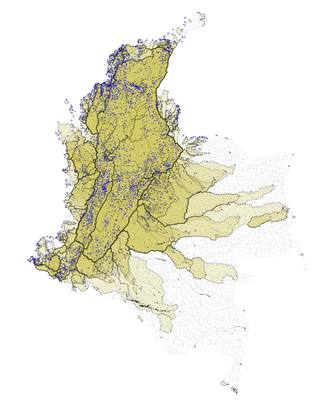

.. _delineateit:

***********
DelineateIt
***********

Resumen
=======

Introducción
============

Muchos de los modelos de agua dulce de InVEST requieren polígonos de cuencas hidrográficas para agregar el servicio ecosistémico que se proporciona a quienes recibirán los beneficios. Sin embargo, hemos comprobado que la creación de cuencas hidrográficas con las herramientas existentes es difícil y a menudo requiere conocimientos específicos y/o conjuntos de herramientas propias. Para responder a esta necesidad, hemos desarrollado nuestro propio algoritmo de delineación de cuencas hidrográficas publicado en el paquete SIG PyGeoprocessing, y envuelto en una interfaz de uso dentro de InVEST. Todo el enrutamiento del MDE es manejado por PyGeoprocessing que resuelve los sumideros y mesetas hidrológicas y utiliza D8 para enrutar las direcciones del flujo.

Consulte también la sección **Trabajar con el MDE** de esta guía de uso para obtener más información sobre la preparación de un MDE para su uso en InVEST, y su utilización para crear corrientes y cuencas hidrográficas. 

Pasos del modelo
================

Llenado de fosas
^^^^^^^^^^^^^^^^
En primer lugar, el modelo rellena las fosas (sumideros hidrológicos) en el MDE. Este paso ayuda a garantizar que todos los píxeles drenen fuera del área definida del ráster.

Calculo de la dirección de flujo
^^^^^^^^^^^^^^^^^^^^^^^^^^^^^^^^
El modelo aplica el algoritmo de enrutamiento D8 al MDE llenado para calcular la dirección en la que fluye el agua de cada píxel.

Detectación de puntos de vertido
^^^^^^^^^^^^^^^^^^^^^^^^^^^^^^^^
Un punto de vertido es un punto en el que el agua fluye fuera del área definida del mapa de dirección del flujo, ya sea fuera del borde del ráster o dentro de un píxel de nodata.
Si se selecciona la opción de Detectar Puntos de Vertido, el modelo colocará un punto de vertido en el centro de cada píxel que fluya fuera del borde de la trama o dentro de un píxel nodata. Alternativamente, puede proporcionar su propia capa de puntos de vertido a través del input  *Salidas de la cuenca*. 

Ajuste de puntos a la corriente más cercana
^^^^^^^^^^^^^^^^^^^^^^^^^^^^^^^^^^^^^^^^^^^
Si un elemento de salida no se encuentra directamente en una corriente, se generará una cuenca muy pequeña que no suele ser correcta. DelineateIt puede ajustar los puntos de salida a la corriente más cercana para crear cuencas hidrográficas más sólidas. Para ello, la herramienta construye un mapa de corrientes y, a continuación, reubica los puntos de salida de las cuencas hidrográficas en la corriente más cercana que se encuentre dentro de la *distancia de ajuste* dada como input al modelo.  

Cñalculo de la acumulación de flujo
-----------------------------------
El modelo calcula la acumulación de flujo a partir del ráster de dirección del flujo utilizando el algoritmo D8. Esto representa la cantidad relativa de agua que drena en un píxel desde su zona pendiente arriba.

Acumulación de flujo en el umbral (UAF)
---------------------------------------
El modelo identifica las corrientes mediante la determinación del umbral del ráster de acumulación de flujo por el valor UAF. Las áreas con una acumulación de flujo mayor o igual al valor UAF se consideran corrientes.

Delineación de cuencas
^^^^^^^^^^^^^^^^^^^^^^
El modelo utiliza un algoritmo de delineación D8 para producir un vector de polígonos de las cuencas hidrográficas a partir del ráster de la dirección del flujo y de las geometrías de las salidas de las cuencas (si se proporcionan) o de los puntos de vertido detectados (si se selecciona Detectar puntos de vertido).

Inputs de la herramienta
========================

- :investspec:`delineateit.delineateit workspace_dir`

- :investspec:`delineateit.delineateit results_suffix`

- :investspec:`delineateit.delineateit dem_path` Los sumideros hidrológicos y las regiones de meseta plana serán resueltos automáticamente por PyGeoprocessing.

- :investspec:`delineateit.delineateit detect_pour_points` Hay un punto de vertido situado en el centro de cada píxel que fluye fuera del borde del ráster o hacia un píxel nodado. La dirección del flujo se calcula a partir del MDE utilizando el algoritmo D8.

- :investspec:`delineateit.delineateit outlet_vector_path` Estas geometrías pueden representar puntos de toma de corriente, centros de población, carreteras, límites de municipios u otras características de interés y pueden ser de cualquier tipo de geometría incluyendo puntos, líneas o polígonos. Todos los campos asociados a este vector se copiarán en el vector de la cuenca hidrográfica resultante.

- :investspec:`delineateit.delineateit skip_invalid_geometry` El archivo de registro contendrá mensajes de advertencia si se omite alguna geometría. DelineateIt solo puede delinear cuencas hidrográficas a partir de geometrías válidas, por lo que depende de quien usa asegurarse de que todas las geometrías son válidas. Estas pueden resolverse utilizando la herramienta de ArcGIS "Comprobar geometría" o la herramienta de QGIS "Fijar geometrías".

- :investspec:`delineateit.delineateit snap_points` Solo se reubicarán las geometrías ``POINT`` o las geometrías ``MULTIPOINT`` con un solo punto componente. Todos los demás tipos de geometría no se modificarán. Este input no tendrá efecto si se selecciona **Detectar puntos de vertido**.

- :investspec:`delineateit.delineateit flow_threshold` Los valores más pequeños de este umbral producen corrientes con más afluentes, los valores más grandes producen corrientes con menos afluentes.

- :investspec:`delineateit.delineateit snap_distance` Tenga en cuenta que se trata de una distancia en píxeles, no en metros, así que escale esto según el tamaño de sus píxeles.

Resultados de la herramienta
============================

Todos los resultados se pueden encontrar en el directorio **Workspace** (Espacio de trabajo) indicado anteriormente. Incluyen:

 * **watersheds.gpkg** Un vector de GeoPackage que define las áreas que se encuentran aguas arriba de los puntos de salida de la instantánea, donde el área aguas arriba es definida por la implementación del algoritmo de flujo D8 en PyGeoprocessing.

 * **snapped_outlets.gpkg** Un vector que indica dónde se han ajustado los puntos de salida (solo geometrías de puntos) basándose en los valores de Acumulación de flujo de umbral y Distancia de píxeles para ajustar los puntos de salida. Cualquier geometría que no sea de puntos también se habrá copiado en este vector, pero no se habrá alterado.

 * **preprocessed_geometries.gpkg** Un vector que contiene solo las geometrías que el modelo puede verificar que son válidas. Las geometrías que aparecen en este vector serán las que se pasen a la delineación de la cuenca.

 * **streams.tif** Un vector que contiene solo las geometrías que el modelo puede verificar que son válidas. Las geometrías que aparecen en este vector serán las que se pasen a la delineación de la cuenca.

 * **filled_dem.tif** El DEM, pero con los sumideros hidrológicos llenados.

 * **flow_direction.tif** El ráster de dirección del flujo D8, creado a partir del MDE rellenado.

 * **flow_accumulation.tif** El ráster de acumulación de flujo D8, creado a partir de ``flow_direction.tif``.

Referencias
===========

PyGeoprocessing https://github.com/natcap/pygeoprocessing
