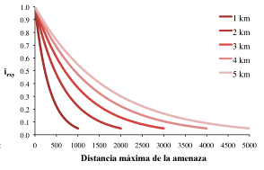



.. _habitat_quality:

******************
Calidad de hábitat
******************

Resumen
=======

La biodiversidad está íntimamente ligada a la producción de servicios ecosistémicos. Los patrones de la biodiversidad son inherentemente espaciales y, como tales, se pueden estimar mediante el análisis de mapas de uso y cobertura de la tierra (LULC) junto con las amenazas al hábitat de las especies. InVEST modeliza la calidad y la rareza del hábitat como indicadores de la biodiversidad y, en última instancia, estima la extensión de los tipos de hábitat y vegetación en un paisaje y su estado de degradación. La calidad y la rareza del hábitat dependen de cuatro factores: el impacto relativo de cada amenaza, la sensibilidad relativa de cada tipo de hábitat a cada amenaza, la distancia entre los hábitats y las fuentes de amenazas, y el grado en que la tierra está legalmente protegida. El modelo asume que la protección legal de la tierra es efectiva y que todas las amenazas a un paisaje son aditivas.

Introducción
============

Uno de los principales objetivos de la conservación es la protección de la biodiversidad, que incluye la variedad de genes, especies, poblaciones, hábitats y ecosistemas en un área de interés. Aunque algunos consideran que la biodiversidad es un servicio ecosistémico, aquí la tratamos como un atributo independiente de los sistemas naturales, con su propio valor intrínseco (en este modelo no monetizamos la biodiversidad). Los gestores de recursos naturales, las empresas y las organizaciones conservacionistas están cada vez más interesados en comprender cómo y dónde se alinean la biodiversidad y los servicios ecosistémicos en el espacio y cómo las acciones de gestión afectan a ambos.

La evidencia de muchas fuentes ofrece una imagen abrumadora del declive generalizado de la biodiversidad en todo el mundo (por ejemplo, Vitousek et al. 1997; Wilcove et al. 1998; Czech et al. 2000). Estas pruebas han suscitado una amplia respuesta tanto de los gobiernos como de la sociedad civil. A través del Convenio de Río sobre la Biodiversidad, 189 naciones se han comprometido a preservar la biodiversidad dentro de sus fronteras. Sin embargo, apenas se ha investigado el solapamiento entre las oportunidades de proteger la biodiversidad y mantener los servicios ecosistémicos tan críticos para el bienestar económico de estos países. Este es precisamente el tipo de desafío que InVEST ha sido diseñado para abordar.

Para que las personas encargadas del manejo comprendan los patrones de distribución y riqueza en un paisaje, individualmente y en conjunto, es necesario cartografiar la gama o las apariciones de elementos (por ejemplo, especies, comunidades, hábitats). También hay que evaluar el grado en que el uso y la gestión actuales de la tierra afectan a la persistencia de estos elementos para diseñar estrategias de conservación adecuadas y fomentar una gestión de los recursos que maximice la biodiversidad en esas zonas.

Hay una variedad de enfoques para identificar las prioridades de conservación con diversas compensaciones entre ellas. Cada uno de estos enfoques se centra en distintas facetas de los atributos y la dinámica de la biodiversidad, como la representación basada en el hábitat o la vegetación (es decir, un filtro grueso), la maximización del número de especies "cubiertas" por una red de lugares conservados para un presupuesto de conservación determinado (Ando et al. 1998), la identificación de patrones de riqueza y endemismo (hotspots de Conservation International) y la conservación de los procesos ecológicos. También existe un enfoque híbrido de filtro grueso y fino que incluye de forma selectiva elementos de "filtro fino", como especies con requisitos de hábitat únicos que podrían no estar adecuadamente protegidas utilizando únicamente un enfoque de filtro grueso (planificación ecorregional de The Nature Conservancy y World Wildlife Fund). El modelo de calidad del hábitat de InVEST es más relevante para los enfoques de "filtro grueso", o basados en el hábitat.

Las razones para modelizar la biodiversidad junto con los servicios ecosistémicos son simples y poderosas. Esto nos permite comparar los patrones espaciales de la biodiversidad y los servicios ecosistémicos, e identificar las áreas en las que todos ganan (es decir, las áreas en las que la conservación puede beneficiar tanto a los sistemas naturales como a las economías humanas), así como las áreas en las que estos objetivos no están alineados. Además, nos permite analizar las compensaciones entre la biodiversidad y los servicios ecosistémicos en diferentes escenarios de cambio de uso del suelo en el futuro. Los patrones de uso y cobertura del suelo (LULC) que generan una mayor producción de servicios ecosistémicos no siempre conducen a una mayor conservación de la biodiversidad (Nelson et al. 2008), y modelizar las opciones futuras hoy puede ayudar a identificar y evitar las compensaciones.

El modelo
=========

El modelo de calidad del hábitat de InVEST combina información sobre el LULC y las amenazas a la biodiversidad para producir mapas de calidad del hábitat. Este enfoque genera dos conjuntos de información clave que son útiles para realizar una evaluación inicial de las necesidades de conservación: la extensión relativa y la degradación de los diferentes tipos de hábitat en una región, y los cambios a través del tiempo. Este enfoque permite, además, evaluar rápidamente el estado y los cambios del hábitat como un indicador de medidas más detalladas del estado de la biodiversidad. Si los cambios en el hábitat se toman como representativos de los cambios genéticos, de las especies o de los ecosistemas, estamos asumiendo que las áreas con un hábitat de alta calidad soportarán mejor todos los niveles de biodiversidad y que la disminución de la extensión y la calidad del hábitat a lo largo del tiempo significa una disminución de la persistencia, la resistencia, la amplitud y la profundidad de la biodiversidad en el área de disminución.

La parte del modelo dedicada a la rareza del hábitat indica la extensión y el patrón de los tipos de cobertura natural del suelo en el paisaje actual o en un futuro potencial, en comparación con la extensión de los mismos tipos de cobertura natural del suelo en algún período de referencia. Los mapas de rareza permiten a quienes usan creen un mapa de los hábitats más raros en el paisaje en relación con la línea de base elegida por ellos para representar la mezcla de hábitats en el paisaje que es más apropiada para la biodiversidad nativa del área de estudio.

El modelo requiere datos disponibles prácticamente en todo el mundo, por lo que resulta útil en zonas en las que los datos de distribución de las especies son escasos o no existen en absoluto. En muchos lugares se puede disponer de amplios datos de presencia/ausencia para las condiciones actuales. Sin embargo, modelizar el cambio en la presencia, la persistencia o la vulnerabilidad de múltiples especies en condiciones futuras es a menudo imposible o inviable. Aunque un enfoque basado en el hábitat deja de lado los datos detallados sobre la presencia de especies disponibles para las condiciones actuales, varios de sus componentes representan avances en la funcionalidad con respecto a muchas herramientas existentes de planificación de la conservación de la biodiversidad. El más significativo es la capacidad de caracterizar la sensibilidad de los tipos de hábitat a las distintas amenazas. No todos los hábitats se ven afectados por todas las amenazas de la misma manera, y el modelo InVEST tiene en cuenta esta variabilidad. Además, el modelo permite estimar el impacto relativo de una amenaza sobre otra, de modo que las amenazas más perjudiciales para la persistencia de la biodiversidad en el paisaje pueden representarse como tales. Por ejemplo, los pastizales podrían ser especialmente sensibles a las amenazas generadas por las zonas urbanas, pero moderadamente sensibles a las generadas por las carreteras. Además, se incorpora al modelo la distancia a la que una amenaza degradará los sistemas naturales.

La evaluación del modelo del paisaje actual puede utilizarse como un input para una evaluación de filtro grueso de las necesidades y oportunidades de conservación actuales. La evaluación mediante modelos de futuros LULC puede utilizarse para medir los posibles cambios en la extensión, la calidad y la rareza del hábitat en un paisaje y las necesidades y oportunidades de conservación en el futuro.

Cómo funciona
-------------

Calidad del hábitat
^^^^^^^^^^^^^^^^^^^

Definimos el hábitat como "los recursos y las condiciones presentes en un área que producen la ocupación --incluyendo la supervivencia y la reproducción-- de un organismo determinado" (Hall et al. 1997:175). La calidad del hábitat se refiere a la capacidad del ecosistema para proporcionar las condiciones adecuadas para la persistencia individual y poblacional, y se considera una variable continua en el modelo, que va de baja a media y alta, en función de los recursos disponibles para la supervivencia, la reproducción y la persistencia poblacional, respectivamente (Hall et al. 1997). El hábitat de alta calidad está relativamente intacto y tiene la estructura y la función dentro del rango de la variabilidad histórica. La calidad del hábitat depende de la proximidad de un hábitat a los usos humanos del suelo y de la intensidad de estos usos. Por lo general, la calidad del hábitat se degrada a medida que aumenta la intensidad de los usos del suelo cercanos (Nelleman 2001, McKinney 2002, Forman et al. 2003).

El modelo se ejecuta utilizando datos ráster en los que se asigna a cada celda del ráster una clase LULC, que puede ser una clase natural (no manejada) o una clase manejada. Los tipos de LULC pueden tener cualquier nivel de detalle de clasificación. Por ejemplo, los pastizales son una definición amplia de LULC que puede subdividirse en tipos de pastos, praderas restauradas y céspedes residenciales para proporcionar una clasificación de hábitat mucho más detallada. Aunque usted puede presentar hasta 3 mapas ráster de LULC, uno para un período de referencia, otro para el actual y otro para el futuro, como mínimo debe proporcionarse el mapa ráster de LULC actual.

Usted define qué tipos de LULC pueden proporcionar hábitat para el objetivo de conservación (por ejemplo, si el objetivo de conservación son las aves que se reproducen en el bosque, los bosques son hábitat y las cubiertas no forestales no son hábitat). Deje que :math:`H_j` indique la idoneidad del hábitat del tipo LULC :math:`j`.

¿Qué tipos de LULC deben considerarse hábitat? Si se considera la biodiversidad en general o si se carece de datos sobre relaciones específicas entre biodiversidad y hábitat, se puede adoptar un enfoque binario simple para asignar el hábitat a los tipos LULC. Un ejemplo clásico sería seguir un modelo isla-océano y suponer que la matriz de tierra gestionada que rodea los parches remanentes de tierra no manejada es inutilizable desde el punto de vista de las especies (por ejemplo, MacArthur y Wilson 1967). En este caso se asignaría un 0 a los tipos de LULC manejados en la matriz (es decir, no hábitat) y un 1 a los tipos no manejados (es decir, hábitat). Bajo este esquema de modelización, las calificaciones de calidad del hábitat no son una función de la importancia, rareza o idoneidad del hábitat; todos los tipos de hábitat son tratados por igual. Se supone que los inputs del modelo no son específicas de ninguna especie o gremio de especies en particular, sino que se aplican a la biodiversidad en general.

Algunas investigaciones más recientes sugieren que la matriz de tierras manejadas que rodea los parches de tierras no manejadas puede influir significativamente en el "aislamiento efectivo" de los parches de hábitat, haciéndolos más o menos aislados de lo que indicarían la simple distancia o los modelos clásicos (Ricketts 2001, Prugh et al. 2008). La modificación de la matriz puede ofrecer oportunidades para reducir el aislamiento de los parches y, por tanto, el riesgo de extinción de las poblaciones en paisajes fragmentados (Franklin y Lindenmayer 2009). Para modelizar esto, se puede asignar una calificación relativa de idoneidad del hábitat a un tipo de LULC que va de 0 a 1, donde 1 indica la mayor idoneidad del hábitat. Una calificación inferior a 1 indica un hábitat en el que una especie o grupo funcional puede tener una menor capacidad de supervivencia. La aplicación de este segundo enfoque amplía enormemente la definición de hábitat desde el simple y a menudo artificial enfoque binario (por ejemplo, "natural" frente a "no natural") para incluir un amplio espectro de tipos de LULC manejados y no manejados. Al utilizar un continuo de idoneidad del hábitat a través de los tipos de LULC, usted puede evaluar la importancia del manejo del uso del suelo en la calidad del hábitat de forma holística o considerar la importancia potencial de los paisajes "en funcionamiento" (o manejados).

Si un continuo de idoneidad del hábitat es relevante, las ponderaciones con una lista de LULC en un paisaje deben aplicarse en referencia a un gremio o grupo de especies en particular. Por ejemplo, las aves canoras de los pastizales pueden preferir un hábitat de pradera nativa por encima de todos los demás tipos de hábitat (la calificación del hábitat para la LULC pradera (:math:`H_{prarie}` es igual a 1), pero también harán uso de un campo de heno o un pasto manejado si la pradera no está disponible (la calificación del hábitat para la LULC campo de heno (:math:`H_{hayfield}`) y el pasto (:math:`H_{pasture}`) es igual a 0,5). Sin embargo, ciertos mamíferos como los puercoespines encontrarán la pradera inadecuada para reproducirse y alimentarse. Por lo tanto, si se utilizan datos específicos sobre las relaciones entre los grupos de especies y el hábitat, el resultado del modelo se refiere a la extensión y la calidad del hábitat solo para la especie o el grupo en el conjunto modelizado.

Además de un mapa de LULC y de datos que relacionen LULC con la idoneidad del hábitat, el modelo también requiere datos sobre la densidad de las amenazas al hábitat y sus efectos sobre su calidad. En general, consideramos que las amenazas son tipos de LULC modificados por el ser humano que causan la fragmentación del hábitat, el borde y la degradación del hábitat vecino. Por ejemplo, la conversión de un LULC de hábitat en un LULC de no hábitat reduce el tamaño y la continuidad de los parches de hábitat vecinos. Los efectos de borde se refieren a los cambios en las condiciones biológicas y físicas que se producen en el límite de un parche y en los parches adyacentes. Por ejemplo, las parcelas adyacentes degradadas de LULC no relacionadas con el hábitat imponen "efectos de borde" en las parcelas de hábitat y pueden tener impactos negativos dentro de las parcelas de hábitat al facilitar, por ejemplo, la entrada de depredadores, competidores, especies invasoras o productos químicos tóxicos y otros contaminantes. Otro ejemplo: en muchos países en vías de desarrollo, las carreteras son una amenaza para la calidad del hábitat forestal en el paisaje debido al acceso que proporcionan a los recolectores de madera y a los no madereros.

Cada fuente de amenaza debe ser mapeada en una cuadrícula ráster. El valor de una celda de la cuadrícula en el mapa de una amenaza puede indicar la intensidad de la amenaza dentro de la celda (por ejemplo, la longitud de la carretera en una celda de la cuadrícula o la superficie cultivada en una celda de la cuadrícula) o simplemente un 1 si la celda de la cuadrícula contiene la amenaza en una carretera o en la cobertura de un campo de cultivo y un 0 en caso contrario. Dejemos que :math:`o_{ry}` indique la "calificación" de la amenaza :math:`r` en la celda de la cuadrícula :math:`y` donde :math:`r` = 1, 2, ..., :math:`R` indexa todas las fuentes de degradación modelizadas.

Todas las amenazas mapeadas deben medirse en la misma escala y métrica. Por ejemplo, si una amenaza se mide en densidad por celda de cuadrícula, entonces todas las fuentes de degradación deberían medirse en densidad por celda de cuadrícula donde la densidad se mide con la misma unidad métrica (por ejemplo, km and km\ :sup:`2`\). O si una amenaza se mide con presencia/ausencia (1/0) en su mapa, entonces todas las amenazas deben ser mapeadas con la escala de presencia/ausencia.

El impacto de las amenazas sobre el hábitat en una celda de la cuadrícula está mediado por cuatro factores.

1. El primer factor es **el impacto relativo de cada amenaza**. Algunas amenazas pueden ser más perjudiciales para el hábitat, en igualdad de condiciones, y una calificación de impacto relativo lo tiene en cuenta (véase la Tabla 1 para una lista de posibles amenazas). Por ejemplo, las zonas urbanas pueden considerarse dos veces más degradantes para cualquier hábitat cercano que las zonas agrícolas. El peso de una fuente de degradación, :math:`w_r`, indica la destructividad relativa de una fuente de degradación para todos los hábitats. El peso :math:`w_r` puede tomar cualquier valor entre 0 y 1. Por ejemplo, si la zona urbana tiene un peso de amenaza de 1 y el peso de amenaza de las carreteras se fija en 0,5, entonces la zona urbana causa el doble de perturbación, en igualdad de condiciones, a todos los tipos de hábitat. Para reiterar, si hemos asignado calificaciones de idoneidad de hábitat específicas para cada grupo de especies a cada LULC, entonces las amenazas y sus pesos deben ser específicos para el grupo de especies modelizado.

2. El segundo factor de mitigación es **la distancia entre el hábitat y la fuente de la amenaza y el impacto de la amenaza en el espacio**. En general, el impacto de una amenaza sobre el hábitat disminuye a medida que aumenta la distancia de la fuente de degradación, de modo que las celdas de la cuadrícula que están más próximas a las amenazas experimentarán mayores impactos. Por ejemplo, supongamos que una cuadrícula está a 2 km del borde de una zona urbana y a 0,5 km de una autopista. El impacto de estas dos fuentes de amenaza en el hábitat de la celda de la cuadrícula dependerá en parte de la rapidez con la que disminuyan, o decaigan, en el espacio. Usted puede elegir una función lineal o exponencial de disminución de la distancia para describir cómo decae una amenaza en el espacio. El impacto de la amenaza :math:`r` que se origina en la celda de la cuadrícula :math:`y`, :math:`r_y`, sobre el hábitat en la celda de la cuadrícula :math:`x` viene dado por :math:`i_{rxy}` y está representado por las siguientes ecuaciones:

.. math:: i_{rxy}=1-\left( \frac{d_{xy}}{d_{r\ \mathrm{max}}}\right)\ \mathrm{if\ linear}
	:label: (hq. 1)
	
.. math:: i_{rxy}=exp\left(-\left(\frac{2.99}{d_{r\ \mathrm{max}}}\right)d_{xy}\right)\mathrm{if\ exponential}
	:label: (hq. 2)

	
donde :math:`d_{xy}` es la distancia lineal entre las celdas de la cuadrícula :math:`x` y :math:`y` y :math:`d_{r}` es la distancia efectiva máxima del alcance de la amenaza :math:`r` en el espacio. La Figura 1 ilustra la relación entre la tasa de decaimiento de la distancia de una amenaza en función de la distancia efectiva máxima de la misma (lineal y exponencial). Por ejemplo, si se selecciona una disminución exponencial y la distancia máxima de impacto de una amenaza se establece en 1 km, el impacto de la amenaza en el hábitat de una celda de la cuadrícula disminuirá en un ~ 50% cuando la celda de la cuadrícula esté a 200 m del origen de :math:`r`. Si :math:`i_{rxy} > 0` entonces la celda de la cuadrícula :math:`x` está en la zona de perturbación de la fuente de degradación :math:`ry` (si se utiliza la función exponencial para describir el impacto de la fuente de degradación :math:`r` en el paisaje, entonces el modelo ignora los valores de :math:`i_{rxy}` que están muy cerca de 0 para agilizar el proceso de modelización). Para reiterar, si hemos asignado calificaciones de idoneidad de hábitat específicas para cada grupo de especies a cada LULC, entonces el impacto de la amenaza en el espacio debería ser específico para el grupo de especies modelizado.

|

Figura 1. Un ejemplo de la relación entre la tasa de decaimiento de la distancia de una amenaza y la distancia efectiva máxima de una amenaza.

|

3. El tercer factor paisajístico que puede mitigar el impacto de las amenazas sobre el hábitat es **el nivel de protección legal/institucional/social/física contra las perturbaciones en cada celda**. ¿Está la celda de la cuadrícula en una zona protegida formalmente? ¿O es inaccesible para las personas debido a las grandes altitudes? ¿O está la cuadrícula abierta a la cosecha y a otras formas de perturbación? El modelo parte de la base de que cuanta más protección legal/institucional/social/física tenga una celda contra la degradación, menos se verá afectada por las amenazas cercanas, independientemente del tipo de amenaza. Dejemos que :math:`beta_x \Nen [0,1]` indique el nivel de accesibilidad en la celda de la cuadrícula :math:`x` donde 1 indica accesibilidad completa. A medida que la accesibilidad disminuye, el impacto que todas las amenazas tendrán en la celda de la cuadrícula :math:`x` disminuye linealmente. Es importante tener en cuenta que aunque las protecciones legales/institucionales/sociales/físicas suelen disminuir el impacto de las actividades extractivas en el hábitat, como la caza o la pesca, es poco probable que protejan contra otras fuentes de degradación como la contaminación del aire o del agua, la fragmentación del hábitat o los efectos de borde. Si las amenazas consideradas no están mitigadas por propiedades legales/institucionales/sociales/físicas, entonces debe ignorar este input o establecer :math:`\beta_x = 1` para todas las celdas de la cuadrícula :math:`x`. Para reiterar, si hemos asignado calificaciones de idoneidad de hábitat específicas para cada grupo de especies a cada LULC, entonces los pesos de mitigación de las amenazas deben ser específicos para el grupo de especies modelizado.

4. La **sensibilidad relativa de cada tipo de hábitat a cada amenaza en el paisaje** es el factor final utilizado al generar la degradación total en una celda con hábitat. (En Kareiva et al. (2010), la sensibilidad del hábitat se denomina por su inversa, "resistencia"). Dejemos que :math:`S_{jr} \en [0,1]` indica la sensibilidad del LULC (tipo de hábitat) :math:`j` a la amenaza :math:`r` donde los valores más cercanos a 1 indican una mayor sensibilidad. El modelo asume que cuanto más sensible sea un tipo de hábitat a una amenaza, más degradado estará el tipo de hábitat por esa amenaza. La sensibilidad de un hábitat a las amenazas debería basarse en los principios generales de la ecología del paisaje para la conservación de la biodiversidad (por ejemplo, Forman 1995; Noss 1997; Lindenmayer et al. 2008). Para reiterar, si hemos asignado calificaciones de idoneidad de hábitat específicas para cada grupo de especies a cada LULC, entonces la sensibilidad del hábitat a las amenazas debería ser específica para el grupo de especies modelizado.

Por lo tanto, el nivel de amenaza total en la celda de la cuadrícula :math:`x` con LULC o tipo de hábitat :math:`j` viene dado por :math:`D_{xj}`,

.. math:: D_{xj}=\sum^R_{r=1}\sum^{Y_r}_{y=1}\left(\frac{w_r}{\sum^R_{r=1}w_r}\right)r_y i_{rxy} \beta_x S_{jr}
   :label: (hq. 3)

donde :math:`y` indexa todas las celdas de la cuadrícula del mapa ráter de :math:`r` y :math:`Y_r` indica el conjunto de celdas de la cuadrícula del mapa ráster de :math:`r`. Tenga en cuenta que cada mapa de amenaza puede tener un número único de celdas de cuadrícula debido a la variación en la resolución de la trama. Si :math:`S_{jr} = 0` entonces :math:`D_{xj}` no es una función de amenaza :math:`r`. También hay que tener en cuenta que los pesos de las amenazas se normalizan de manera que la suma de todos los pesos de las amenazas es igual a 1.

Al normalizar los pesos de manera que sumen 1 podemos pensar en :math:`D_{xj}` como la media ponderada de todos los niveles de amenaza en la celda de la cuadrícula :math:`x`. El mapa de :math:`D_{xj}` cambiará según el conjunto de pesos que utilicemos. Tenga en cuenta que dos conjuntos de pesos solo diferirán si las diferencias relativas entre los pesos de cada conjunto son diferentes. Por ejemplo, un conjunto de pesos de 0,1, 0,1 y 0,4 es lo mismo que el conjunto de pesos de 0,2, 0,2 y 0,8.

La calificación de degradación de una celda de la cuadrícula se traduce en un valor de calidad del hábitat utilizando una función de media saturación en la que usted debe determinar el valor de media saturación. A medida que la calificación de degradación de una cuadrícula aumenta, la calidad de su hábitat disminuye. Dejemos que sea la calidad del hábitat en la parcela :math:`x` que está en LULC :math:`j` dada por :math:`Q_{xj}` donde,

:math:: Q_{xj} = H_j\left(1-\left(\frac{D^z_{xj}}{D^z_{xj}+k^z}\right)\right)
   :label: (hq. 4)

y :math:`z` (codificamos :math:`z = 2.5`) y :math:`k` son parámetros de escala (o constantes). :math:`Q_{xj}` es igual a 0 si :math:`H_{j}` = 0. :math:`Q_{xj}` aumenta en :math:`H_{j}` y disminuye en :math:`D_{xj}`. :math:`Q_{xj}` nunca puede ser mayor que 1. La constante :math:`k` es la constante de semisaturación y la establece usted. El parámetro :math:`k` es igual al valor de :math:`D`, donde :math:`1-\left(\frac{D^z_{xj}}{D^z_{xj}+k^z} = 0,5\right)`. Por ejemplo, si :math:`k = 5` entonces :math:`1-\left(\frac{D^z_{xj}}{D^z_{xj}+k^z}\right) = 0.5` cuando :math:`D_{xj} = 5`. Por defecto, se puede establecer :math:`k = 0.05` (véase la nota en la sección de necesidades de datos). Si está realizando análisis de escenarios, cualquiera que sea el valor que haya elegido para :math:`k` para el primer paisaje en el que ejecutó el modelo, ese mismo :math:`k` debe utilizarse para todos los escenarios alternativos en el mismo paisaje. Del mismo modo, sea cual sea la resolución espacial que eligió la primera vez que ejecutó el modelo en un paisaje, utilice el mismo valor para todas las ejecuciones adicionales del modelo en el mismo paisaje. Si quiere cambiar su elección de :math:`k` o la resolución espacial para cualquier ejecución del modelo, entonces tiene que cambiar los parámetros para todas las ejecuciones del modelo, si está comparando múltiples escenarios en el mismo paisaje.

|

.. csv-table::
   :file: ./habitat_quality/possible_threats.csv
   :header-rows: 1
   :widths: auto

Tabla 1. Posibles fuentes de degradación basadas en las causas de peligro para las especies en EE.UU. clasificadas como amenazadas o en peligro por el Servicio de Pesca y Vida Silvestre de EE.UU. Adaptado de Czech et al. (2000). 

|

Rareza de hábitats
^^^^^^^^^^^^^^^^^^

Si bien el mapeo de la calidad del hábitat puede ayudar a identificar las zonas en las que la biodiversidad puede estar más intacta o en peligro, también es fundamental evaluar la rareza relativa de los hábitats en el paisaje, independientemente de su calidad. En muchos planes de conservación se da mayor prioridad a los hábitats más raros, sencillamente porque las opciones y oportunidades para conservarlos son limitadas y, si se pierden todos esos hábitats, también lo harán las especies y los procesos asociados a ellos.

La rareza relativa de un tipo de LULC en un paisaje actual o proyectado se evalúa en relación con un patrón de LULC de referencia. Un tipo de LULC raro en un mapa actual o proyectado que también es raro en algún estado ideal o de referencia en el paisaje (la línea de base) no es probable que esté en peligro crítico de desaparición, mientras que un tipo de LULC raro en un mapa actual o proyectado que era abundante en el pasado (línea de base) está en riesgo.

En el primer paso del cálculo de la rareza se toma la relación entre las extensiones actuales o proyectadas y las pasadas (línea de base) de cada tipo de LULC :math:`j`. Restando esta proporción de uno, el modelo obtiene un índice que representa la rareza de esa clase de LULC en el paisaje de interés.

.. math:: R_j=1-\frac{N_j}{N_{j_\mathrm{baseline}}+N_j}
   :label: (hq. 5)

donde :math:`N_j` es el área de las cuadrículas de LULC :math:`j` en el mapa actual o proyectado y :math:`N_{j_mathrm{baseline}} da el área de las cuadrículas de LULC :math:`j` en el paisaje de referencia.  En este sistema de calificación, los valores de la calificación :math:`R` de un LULC se definen entre un rango de 0 y 1, donde 0,5 indica que no hay cambios de abundancia entre la línea de base y el mapa actual o proyectado. Los valores entre 0 y 0,5 indican que un LULC es más abundante y cuanto más cerca esté el valor de 0, menor será la probabilidad de que la preservación de ese tipo de LULC en el paisaje actual o futuro sea importante para la conservación de la biodiversidad. Los valores entre 0,5 y 1 indican que un LULC es menos abundante y cuanto más se acerque el valor a 1, mayor será la probabilidad de que la preservación de ese tipo de LULC en el paisaje actual o futuro sea importante para la conservación de la biodiversidad. Si el LULC :math:`j` no aparece en el paisaje de referencia, entonces establecemos :math:`R_j = 0`.

Una vez que tenemos una medida :math:`R_j` para cada tipo de LULC, podemos cuantificar la rareza general del tipo de hábitat en la celda de la cuadrícula :math:`x` con:

.. math:: R_x=\sum^X_{x=1}\sigma_{xj}R_j
   :label: (hq. 6)

donde :math:`\sigma_{xj}= 1` si la celda de la cuadrícula x está en LULC :math:`j` en un paisaje actual o proyectado y es igual a 0 en caso contrario.

Limitaciones y simplificaciones
-------------------------------

En este modelo, todas las amenazas del paisaje son aditivas, aunque hay pruebas de que, en algunos casos, el impacto colectivo de las múltiples amenazas es mucho mayor de lo que sugeriría la suma de los niveles de amenaza individuales.

Dado que el paisaje de interés elegido suele estar anidado dentro de un paisaje más amplio, es importante reconocer que un paisaje tiene un límite artificial en el que se han recortado e ignorado las amenazas al hábitat que se encuentran inmediatamente fuera del límite del estudio. En consecuencia, la intensidad de las amenazas siempre será menor en los bordes de un paisaje determinado. Hay dos maneras de evitar este problema. Una, puede elegir un paisaje para fines de modelización cuya extensión espacial esté significativamente más allá de los límites de su paisaje de interés. Entonces, una vez generados los resultados, puede extraer los resultados solo para el paisaje interior de interés. O puede limitar su análisis a los paisajes en los que las fuentes de degradación se concentran en el centro del paisaje.

Necesidades de datos
====================

.. note:: *Todos los inputs espaciales deben tener exactamente el mismo sistema de coordenadas proyectadas* (con unidades lineales de metros), *no* un sistema de coordenadas geográficas (con unidades de grados).

- :investspec:`habitat_quality workspace_dir`
- :investspec:`habitat_quality results_suffix`
- :investspec:`habitat_quality lulc_cur_path` Se utiliza para definir las extensiones geoespaciales de los rásters de amenazas correspondientes.

- :investspec:`habitat_quality lulc_fut_path` Si se proporciona, el modelo generará resultados de degradación, calidad del hábitat y rareza del hábitat (si se proporciona el mapa de referencia).

- :investspec:`habitat_quality lulc_bas_path` El LULC de referencia es necesario para calcular la rareza del hábitat. Cuando se utiliza para calcular la rareza del hábitat, los rásters de amenaza correspondientes son opcionales para calcular también la calidad del hábitat para el escenario de referencia.

  Si es posible, el mapa de referencia debería referirse a una época en la que el manejo intensivo de la tierra era relativamente escaso. Por ejemplo, un mapa de LULC en 1851 en el valle de Willamette (Oregón, EE.UU.) capta el patrón de LULC en el paisaje antes de que fuera modificado gravemente por la producción agrícola masiva. Es cierto que este paisaje también había sido modificado por las prácticas indígenas de desmonte, como los incendios controlados.

- :investspec:`habitat_quality threats_table_path`
  
  Columnas:

  - :investspec:`habitat_quality threats_table_path.columns.threat`
  - :investspec:`habitat_quality threats_table_path.columns.max_dist`
  - :investspec:`habitat_quality threats_table_path.columns.weight`
  - :investspec:`habitat_quality threats_table_path.columns.decay`
  - :investspec:`habitat_quality threats_table_path.columns.cur_path`
  - :investspec:`habitat_quality threats_table_path.columns.base_path`
  - :investspec:`habitat_quality threats_table_path.columns.fut_path`

  **Estudio de ejemplo**
  
  Estudio hipotético con tres amenazas para los escenarios actuales y futuros. La agricultura (*Agric* en la tabla) degrada el hábitat a mayor distancia que las carreteras y tiene una mayor magnitud de impacto global. Además, las carreteras pavimentadas (*Paved_rd*) atraen más tráfico que los caminos de tierra (*Dirt_rd*) y, por tanto, son más destructivas para el hábitat cercano que los caminos de tierra. Las rutas de archivos son relativas a la tabla de datos de amenazas, por lo que en este caso las amenazas actuales se encuentran en el mismo directorio que la tabla y las amenazas futuras se encuentran en un subdirectorio adyacente a la tabla de datos de amenazas llamado *future*. Las rutas de los archivos de las amenazas de la línea de base se dejan en blanco porque no tenemos rasters de amenazas para ese escenario O no hemos incluido la línea de base LULC en nuestra ejecución del modelo.

  ========   ========  ===========  =========== ============ =================  =======================
  AMENAZA    DIST_MAX  PONDERACION  DeCAIMIENTO RUTA_BASE    RUTA_ACTUAL        RUTA_FUTURA
  ========   ========  ===========  =========== ============ =================  =======================
  Dirt_rd    2         0.1          linear                   dirt_rd.tif        future/dirt_rd_fut.tif
  Paved_rd   4         0.4          exponential              paved_rd.tif       future/paved_rd_fut.tif
  Agric      8         1            linear                   agric_rd.tif       future/agric_rd_fut.tif
  ========   ========  ===========  =========== ============ =================  =======================

**Información de los rásters de amenazas**
  
  Archivos ráster SIG de la distribución e intensidad de cada amenaza individual, con valores entre 0 y 1. Tendrá tantos de estos mapas como amenazas tenga y la ruta de los archivos ráster debe definirse en la tabla **Datos de amenazas**. La extensión y resolución de estos conjuntos de datos ráster no tiene por qué ser idéntica a la de los mapas LULC de input. En los casos en que las resoluciones de los mapas de amenazas y LULC varíen, el modelo utilizará la resolución y la extensión del mapa LULC. Cada celda del ráster contiene un valor que indica la densidad o la presencia de una amenaza en su interior (por ejemplo, la superficie agrícola, la longitud de las carreteras, o simplemente un 1 si la celda de la cuadrícula es una carretera o un campo de cultivo y un 0 en caso contrario). Todas las amenazas deben medirse en la misma escala y unidades (es decir, todas se miden en términos de densidad o todas se miden en términos de presencia/ausencia) y no una combinación de métricas. No deje ninguna zona en los mapas de amenazas como "Sin datos". Si los píxeles no contienen esa amenaza, establezca el nivel de amenaza de los píxeles como 0.
	
  InVEST no le pedirá estos rásters en la interfaz de la herramienta, sino que buscará sus rutas de archivo en la tabla de **Datos de amenazas** bajo las columnas de los escenarios correspondientes. Las rutas deben ser **relativas** a la ruta de la tabla de **Amenazas**.
  
  Por último, tenga en cuenta que asumimos que las ponderaciones relativas de las amenazas y la sensibilidad del hábitat a las amenazas no cambian con el tiempo, por lo que solo presentamos una tabla de datos de amenazas y una tabla de datos de sensibilidad del hábitat. Si quiere cambiarlos a lo largo del tiempo, tendrá que ejecutar el modelo varias veces.
	
  En los conjuntos de datos de muestra, los rásters de amenazas se almacenan en el mismo directorio que la tabla de datos de Amenazas y se definen en la tabla de datos de Amenazas bajo el nombre de la columna correspondiente de la siguiente manera: **RUTA_ACTUAL**: crops_c.tif; railroad_c.tif; urban_c.tif; timber_c.tif; roads1_c.tif; roads2_c.tif; roads3_c.tif; **RUTA_FUTURA**: crops_f.tif; railroad_f.tif; urban_f.tif; timber_f.tif; roads1_f.tif; roads2_f.tif; roads3_f.tif. Al introducir los archivos LULC de referencia y de escenario futuro que se encuentran en el conjunto de datos de muestra, estamos ejecutando un análisis de la calidad del hábitat para los mapas de escenario LULC actuales y futuros. No se generará un mapa de calidad del hábitat para el mapa de referencia porque no hemos proporcionado ninguna capa de amenazas para el mapa de referencia y hemos dejado esas columnas en blanco en la tabla de datos de amenazas. La denominación "cultivos" se refiere a las tierras de cultivo, "ferrocarril" a las vías férreas, "urbano" a lo urbano, "madera" a la silvicultura de rotación, "carreteras1" a las carreteras primarias, "carreteras2" a las secundarias y "carreteras3" a las terciarias.

- :investspec:`habitat_quality sensitivity_table_path`

  Columnas:

  - :investspec:`habitat_quality sensitivity_table_path.columns.lulc`
  - :investspec:`habitat_quality sensitivity_table_path.columns.habitat` Esto es :math:`H_j` en las ecuaciones anteriores. Si desea simplemente clasificar cada LULC como hábitat o no sin referencia a ningún grupo de especies en particular, utilice 0 y 1 donde un 1 indica hábitat. De lo contrario, si se dispone de suficiente información sobre las preferencias de hábitat de un grupo de especies, asigne al LULC una calificación relativa de idoneidad de hábitat entre 0 y 1, donde 1 indica la mayor idoneidad de hábitat. Por ejemplo, un pájaro cantor de pradera puede preferir un hábitat de pradera nativa por encima de todos los demás tipos de hábitat (a la pradera se le asigna una calificación de "HABITAT" de 1 para las aves de pradera), pero también utilizará un campo de heno gestionado o un pasto si la pradera no está disponible (al campo de heno manejado y al pasto se les asigna una calificación de "HABITAT" de 0,5 para las aves de pradera).

  - :investspec:`habitat_quality sensitivity_table_path.columns.[THREAT]` Aunque el LULC no se considere hábitat, no deje su sensibilidad a cada amenaza como Nula o en blanco, en su lugar introduzca un 0.

  *Ejemplo:* Un estudio hipotético con cuatro tipos de LULC y tres amenazas. En este ejemplo tratamos el bosque cerrado y el mosaico forestal como hábitat (absoluto) y el suelo desnudo y el cultivo como no-hábitat (absoluto). El mosaico forestal es el tipo de hábitat más sensible (menos resistente), y es más sensible a los caminos de tierra (DIRT_RD, valor 0,9) que a los caminos pavimentados (PAVED_RD, valor 0,5) o a la agricultura (AGRIC valor 0,8). Introducimos 0s en todas las amenazas para las dos cubiertas de tierra desarrolladas, Suelo desnudo y Cultivo, ya que no son hábitat.

  ====    ================ ======= ======= ==========  =========
  LULC    NOMBRE           HABITAT AGRIC   PAVED_RD    DIRT_RD
  ====    ================ ======= ======= ==========  =========
  1       Suelo denudo     0       0       0           0
  2       Bosque cerrado   1       0.5     0.2         0.4
  3       Cultivo          0       0       0           0
  4       Mosaico forestal 1       0.8     0.8         0.5
  ====    ================ ======= ======= ==========  =========

- :investspec:`habitat_quality access_vector_path` A los polígonos con accesibilidad mínima (por ejemplo, reservas naturales estrictas, tierras privadas bien protegidas) se les asigna algún número inferior a 1, mientras que a los polígonos con accesibilidad máxima (por ejemplo, reservas extractivas) se les asigna el valor 1. Estos polígonos pueden ser unidades de manejo de la tierra o un conjunto regular de hexágonos o cuadrículas.
  
  Campo:

  - :investspec:`habitat_quality access_vector_path.fields.access`

- :investspec:`habitat_quality half_saturation_constant` Es :math:`k` en la ecuación :eq:`(hq. 4)`. El valor por defecto es 0,05. En general, se desea establecer :math:`k` a la mitad del valor más alto de degradación de la celda de la cuadrícula en el paisaje. Para realizar esta calibración del modelo tendrá que ejecutar el modelo una vez para encontrar el valor de degradación más alto y establecer :math:`k` para su paisaje. Por ejemplo, si una ejecución preliminar del modelo genera un mapa de degradación en el que el nivel más alto de degradación de las celdas de la cuadrícula es 1, entonces establecer :math:`k` en 0,5 producirá mapas de calidad del hábitat con la mayor variación en la escala de 0 a 1 (esto ayuda a la representación visual de la heterogeneidad en la calidad a través del paisaje). Es importante señalar que el orden de clasificación de las celdas de la cuadrícula en la métrica de calidad del hábitat es invariable a su elección de :math:`k`. La elección de :math:`k` solo determina la dispersión y la tendencia central de las calificaciones de calidad del hábitat. Es importante utilizar el mismo valor de :math:`k` para todas las ejecuciones que incluyan el mismo paisaje. Si quiere cambiar su elección de :math:`k` para cualquier ejecución del modelo, entonces deberá cambiar los parámetros para todas las ejecuciones del modelo. 

.. _hq-interpreting-results:

Interpretación de los resultados
--------------------------------

**Efectos de borde en la degradación y la calidad del hábitat**
  Los valores de calidad de hábitat y degradación cerca de los bordes de los rásters resultantes pueden estar inflados porque no tienen en cuenta las amenazas que pueden existir más allá de la extensión de los rásters de cobertura del suelo. Todos los datos de amenazas de input se recortan a la extensión del ráster LULC, por lo que quienes usan deberían restringir la interpretación de los resultados ignorando los valores que se encuentran dentro de la distancia máxima de amenaza del borde de los rásters resultantes.

* Carpeta **[Espacio de trabajo]**:

  * **Registro de parámetros**: Cada vez que se ejecute el modelo, se creará un archivo de texto (.txt) en el Espacio de Trabajo. El archivo enumerará los valores de los parámetros y los mensajes de salida para esa ejecución y se nombrará según el servicio, la fecha y la hora. Cuando se ponga en contacto con NatCap por errores en una ejecución del modelo, incluya el registro de parámetros.

* Carpeta **[Espacio de trabajo]\\resultados**:

  * **deg_sum_out_c_[Sufijo].tif** -- Nivel relativo de degradación del hábitat en el paisaje actual. Una calificación alta en una celda de la cuadrícula significa que la degradación del hábitat en la celda es alta en relación con otras celdas. Las celdas de la cuadrícula con cobertura de tierra sin hábitat (LULC con :math:`H_j` = 0) obtienen una calificación de degradación de 0. Este es un mapeo de las calificaciones de degradación calculadas con la ecuación (3).
	
  * **deg_sum_out_f_[Sufijo].tif** -- Nivel relativo de degradación del hábitat en el paisaje futuro. Una calificación alta en una celda de la cuadrícula significa que la degradación del hábitat en la celda es alta en relación con otras celdas. Este resultado solo se crea si se da un mapa LULC futuro como input. Las celdas de la cuadrícula con cobertura de tierra sin hábitat (LULC con :math:`H_j` = 0) obtienen una calificación de degradación de 0. Este es un mapeo de las calificaciones de degradación calculadas con la ecuación (3).

  * **quality_out_c_[Sufijo].tif** -- Nivel relativo de la calidad del hábitat en el paisaje actual. Los números más altos indican una mejor calidad del hábitat con respecto a la distribución de la calidad del hábitat en el resto del paisaje. Las zonas del paisaje que no son hábitat reciben una calificación de calidad de 0. Esta calificación de calidad no tiene unidad y no se refiere a ninguna medida de biodiversidad en particular. Se trata de un mapeo de las calificaciones de calidad del hábitat calculadas con la ecuación (4).
	
  * **quality_out_f_[Sufijo.tif** -- Nivel relativo de calidad del hábitat en el paisaje futuro. Los números más altos indican una mejor calidad del hábitat con respecto a la distribución de la calidad del hábitat en el resto del paisaje. Este resultado solo se crea si se da un mapa LULC futuro como input. Las zonas del paisaje que no son hábitat reciben una calificación de calidad de 0. Esta calificación de calidad no tiene unidad y no se refiere a ninguna medida de biodiversidad en particular. Se trata de un mapero de las calificaciones de calidad del hábitat calculadas con la ecuación (4).

  * **rarity_c_[Sufijo].tif** -- Rareza relativa del hábitat en el paisaje actual con respecto al mapa de referencia. Este resultado solo se crea si se da un mapa LULC de referencia como input. Este mapa proporciona el valor de :math:`R_x` de cada cuadrícula (véase la ecuación (6)).  Los valores de las celdas de la cuadrícula se definen entre un rango de 0 y 1, donde 0,5 indica que no hay cambios en la abundancia entre el mapa de referencia y el actual o el proyectado. Los valores entre 0 y 0,5 indican que un hábitat es más abundante y cuanto más cerca esté el valor de 0, menor será la probabilidad de que la conservación de ese tipo de hábitat en el paisaje actual o futuro sea importante para la conservación de la biodiversidad. Los valores entre 0,5 y 1 indican que un hábitat es menos abundante y cuanto más se acerque el valor a 1, mayor será la probabilidad de que la preservación de ese tipo de hábitat en el paisaje actual o futuro sea importante para la conservación de la biodiversidad. Si el tipo de hábitat LULC no aparece en el paisaje de referencia, el valor de la casilla será 0.
	
  * **rarity_f_[Sufijo].tif** -- Rareza relativa del hábitat en el paisaje futuro con respecto al mapa de referencia. Este resultado solo se crea si se dan como input los mapas de LULC de la línea base y futuros. Este mapa proporciona el valor de :math:`R_x` de cada cuadrícula (véase la ecuación (6)).  Los valores de las celdas de la cuadrícula se definen entre un rango de 0 y 1, donde 0,5 indica que no hay cambios en la abundancia entre el mapa de referencia y el actual o el proyectado. Los valores entre 0 y 0,5 indican que un hábitat es más abundante y cuanto más cerca esté el valor de 0, menor será la probabilidad de que la preservación de ese tipo de hábitat en el paisaje actual o futuro sea importante para la conservación de la biodiversidad. Los valores entre 0,5 y 1 indican que un hábitat es menos abundante y cuanto más se acerque el valor a 1, mayor será la probabilidad de que la preservación de ese tipo de hábitat en el paisaje actual o futuro sea importante para la conservación de la biodiversidad. Si el tipo de hábitat LULC no aparece en el paisaje de referencia, el valor de la casilla será 0.

* carpeta **[Espacio_de_trabajo]\\intermedio** :

	Esta carpeta contiene algunos de los archivos intermedios creados durante la ejecución del modelo. Normalmente no es necesario trabajar con estos archivos, a menos que se trate de entender mejor cómo funciona el modelo, o de depurar una ejecución. Incluye mapas de hábitats (**habitat__[b,c,f].tif**), capas de amenazas procesadas con los atributos de la tabla de datos de amenazas (**[threat]_filtered_[b,c,f].tif**), sensibilidad aplicada a diferentes amenazas (**sens_[threat]_[b,c,f].tif**), y una versión rasterizada del input de Access (**access_layer.tif**).

Modificación de los resultados y creación de una calificación de biodiversidad del paisaje
^^^^^^^^^^^^^^^^^^^^^^^^^^^^^^^^^^^^^^^^^^^^^^^^^^^^^^^^^^^^^^^^^^^^^^^^^^^^^^^^^^^^^^^^^^

El resultado del modelo no proporciona calificaciones de calidad y rareza a nivel de paisaje para comparar los escenarios LULC de referencia, actuales y futuros. En su lugar, usted debe resumir la extensión del hábitat y las calificaciones de calidad y rareza para cada paisaje. En el nivel más sencillo, una calificación de calidad de hábitat a nivel de paisaje para un escenario LULC es simplemente la suma de todas las calificaciones a nivel de celda de la cuadrícula bajo el escenario. En otras palabras, podemos sumar todas las calificaciones de calidad a nivel de cuadrícula de los mapas *quality_out_c.tif*, *quality_out_b.tif* (si están disponibles) y *quality_out_f.tif* (si están disponibles) y luego comparar las calificaciones. Un mapa puede tener una calificación de calidad agregada más alta por varias razones. Por un lado, puede tener simplemente más superficie de hábitat. Sin embargo, si la cantidad de hábitat en cualquiera de los dos escenarios es aproximadamente la misma, una calificación de calidad del paisaje más alta es indicativa de un hábitat de mejor calidad general.

También se pueden comparar las calificaciones de determinadas zonas de un paisaje. Por ejemplo, podríamos comparar las calificaciones agregadas de calidad del hábitat en áreas del paisaje que se sabe que están en las áreas de distribución geográfica de las especies de interés. Por ejemplo, supongamos que tenemos mapas del área de distribución geográfica de 9 especies y que hemos proporcionado mapas de escenarios LULC actuales y futuros al modelo de calidad del hábitat. En este caso, determinaríamos 18 calificaciones agregadas de calidad del hábitat, una para cada especie modelizada bajo cada escenario (actual y futuro). Dejemos que :math:`G_{s_{mathrm{cur}} indique el conjunto de celdas de la cuadrícula en el paisaje actual que están en el rango de :math:`s`. Entonces, la calificación media de la calidad del hábitat en el rango de especies :math:`s`' en el paisaje actual viene dada por,

.. math:: Q_{s_{\mathrm{cur}}}=\frac{\sum^{G^{s_{\mathrm{cur}}}}_{x=1}Q_{xj_{\mathrm{cur}}}}{G^{s_{\mathrm{cur}}}}
  :label: (hq. 9)

donde :math:`Q_{xj_{cur}` indica la calificación de la calidad del hábitat en el píxel :math:`x` en LULC :math:`j` en el paisaje actual y :math:`Q_{xj_{cur}} = 0` si quality_out.tif para el píxel :math:`x` es "Sin datos". La calificación media de la calidad del hábitat normalizada para las 9 especies en el paisaje actual vendría dada por,

.. math:: R_x = \sum^X_{x=1}{sigma_{xj}R_j
  (hq. 10)

A continuación, repetiríamos para el paisaje futuro con las celdas de la cuadrícula en el conjunto :math:`G_{s_mathrm{fut}}` para cada especie :math:`s` y el conjunto de :math:`Q_{xj_{fut}}`.

Referencias
===========

Ando, A, J. Camm, S. Polasky y  A. Solow. 1998. Species distributions, land values, and efficient conservation. Science 279:2126-2128.

Czech, B., P. R. Krausman y  P. K. Devers. 2000. Economic Associations among Causes of Species Endangerment in the United States. Bioscience 50:593-601.

Forman, R. 1995. Land Mosaics: The Ecology of landscapes and regions. Cambridge Univ Press. Nueva York.

Forman, R. 2003. Road ecology: science and solutions. Island Press. Nueva York, Nueva York.

Franklin, J.F. and D. B. Lindenmayer. 2009. Importance of matrix habitats in maintaining biological diversity. Proceedings of the National Academy of Sciences 106:349-350.

Hall, L.S., Krausman, P.R. and Morrison, M.L. 1997. The habitat concept and a plea for standard terminology. Wildlife Society Bulletin 25(1):173-182.

Lindenmayer, D., Hobbs, R., Montague-Drake, R., Alexandra, J., Bennett, A., Burgman, M., Cae, P., Calhoun, A., Cramer, V., Cullen, P. 2008. A checklist for ecological management of landscapes for conservation. Ecology Letters 11:78-91.

MacArthur, R., E. 0. Wilson. 1967. The theory of island biogeography. Princeton University Press, Princeton, NJ.

Mckinney, M.L. 2002. Urbanization, biodiversity, and conservation. BioScience 52:883-890.

Nelleman C, Kullered L, Vistnes I, Forbes B, Foresman T, Husby E, Kofinas G, Kaltenborn B, Rouaud J, Magomedova M, Bobiwash R, Lambrechts C, Schei P, Tveitdal S, Gron O, Larsen T. 2001. GLOBIO. Global methodology for mapping human impacts on the biosphere. UNEP/DEWA/TR.01-3.

Nelson, E., S. Polasky, D. J. Lewis, A. J. Plantinga, E. Lonsdorf, D. White, D. Bael y J. J. Lawler. 2008. Efficiency of incentives to jointly increase carbon sequestration and species conservation on a landscape. Proc. Nat. Acad. Sci. 105: 9471-9476.

Noss, R. F., M. A. Connell y  D. D. Murphy. 1997. The science of conservation planning: habitat conservation under the endangered species act. Island Press. Prugh, L., K. Hodges, A. Sinclair y  J. Brashares. 2008. Effect of habitat area and isolation on fragmented animal populations. Proceedings of the National Academy of Sciences 105:20770.

Ricketts, T. H. 2001. The Matrix Matters: Effective Isolation in Fragmented Landscapes. American Naturalist 158:87-99.

Vitousek, P. M., H. A. Mooney, J. Lubchenco y  J. M. Melillo. 1997. Human Domination of Earth's Ecosystems. Science 277:494.

Wilcove, D. S., D. Rothstein, J. Dubow, A. Phillips y  E. Losos. 1998. Quantifying Threats to Imperiled Species in the United States. Bioscience 48:607-615.
