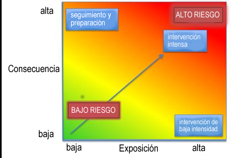
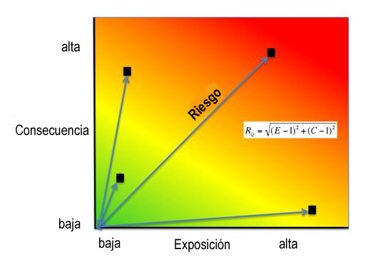

.. _habitat_risk_assessment:

*********************************
Evaluación del riesgo del hábitat
*********************************

Resumen
=======

El modelo de Evaluación de Riesgos para Hábitats y Especies (ERH/ERE) de InVEST les permite evaluar el riesgo acumulativo que suponen las actividades humanas para los hábitats y las especies y explorar las consecuencias para la prestación de servicios ecosistémicos y la biodiversidad. El estado de un hábitat es un determinante clave de los servicios ecosistémicos que puede proporcionar; por ejemplo, los manglares costeros degradados son menos capaces de atenuar las olas y reducir la exposición costera. El riesgo para las especies puede indicar una menor sostenibilidad a lo largo del tiempo. A medida que los factores de estrés antropogénicos siguen diversificándose e intensificándose, también aumenta la necesidad de contar con formas rápidas, claras y repetibles de evaluar los riesgos para los hábitats y las especies, ahora y en futuros escenarios de manejo. El EHR/ERE utiliza un marco de exposición-consecuencia bien fundamentado para evaluar la variación espacial del riesgo acumulado de múltiples actividades humanas en un paisaje terrestre o marino.

Los resultados del modelo incluyen un mapa de riesgo del ecosistema, mapas de riesgo para cada hábitat o especie individual, gráficos de riesgo que muestran la contribución de la exposición y la consecuencia al riesgo global, y tablas de resumen del riesgo por subregión y hábitat o especie. Estos resultados pueden utilizarse para identificar las zonas con mayor riesgo relativo de degradación, así como las principales causas de riesgo dentro de una región de estudio y entre escenarios futuros alternativos. Los resultados del modelo pueden ayudar a identificar las áreas en las que las actividades humanas pueden crear compensaciones entre los servicios ecosistémicos al plantear un riesgo lo suficientemente alto como para comprometer la estructura y la función del hábitat o la persistencia o recuperación de las especies. El modelo puede ayudar a priorizar las áreas de conservación, evaluar las estrategias de manejo e informar sobre el diseño y la configuración de los planes espaciales para los sistemas marinos y terrestres.

Introducción
============

Los hábitats y las especies proporcionan beneficios esenciales para las personas, incluyendo servicios de regulación, materiales y no materiales (Pascual et al. 2017, Díaz et al. 2018). Por ejemplo, los hábitats cercanos a la costa, como los bosques de algas y las praderas de hierba marina, protegen las costas de las tormentas, proporcionan un hábitat de cría para la pesca y almacenan y secuestran carbono. Los hábitats terrestres, como los bosques ribereños, absorben el exceso de nutrientes y sedimentos, proporcionan un hábitat para las especies de peces ribereños y mitigan las inundaciones interiores después de las lluvias. A medida que estos hábitats (o especies) se degradan por las actividades humanas, los servicios ecosistémicos que proporcionan se ven amenazados. Recientes análisis globales han revelado que casi ninguna zona de los océanos del mundo está libre de los impactos humanos (Halpern et al. 2008). Por lo tanto, comprender la ubicación y la intensidad de los impactos humanos en los ecosistemas cercanos a la costa es un componente esencial para una gestión terrestre, costera y oceánica informada y exitosa. El modelo InVEST ERH les permite evaluar la amenaza de las actividades humanas para la salud de estos ecosistemas y especies. El modelo se ha aplicado con éxito en numerosos lugares del mundo (por ejemplo, Arkema et al. 2014, Cabral et al. 2015, Chung et al. 2015, Duggan et al. 2015, Ma et al. 2016, Elliff et al. 2017, Wyatt et al. 2017).

El modelo ERH es un enfoque cuantitativo para evaluar la influencia acumulativa de los factores de estrés asociados a las actividades humanas en los hábitats y las especies (Arkema et al. 2014, Arkema et al. 2015). El ERH utiliza un enfoque bien establecido de la literatura de riesgo que se origina en las evaluaciones de vulnerabilidad de la pesca (Astles et al. 2006, Patrick et al. 2010, Hobday et al. 2011, Samhouri y Levin 2012).

El modelo incorpora dos dimensiones de información para calcular el riesgo o el impacto en los componentes del ecosistema (figura 1; Halpern et al. 2008, Patrick et al. 2010, Samhouri y Levin 2012, Arkema et al. 2014). Estas dimensiones son la *exposición* y la *consecuencia*.

**Exposición** es el grado en que un hábitat o una especie experimenta un factor de estrés, dada la eficacia de las prácticas de manejo.

**Consecuencia** es la respuesta específica del hábitat (o de la especie) a esa exposición. La consecuencia incorpora la *sensibilidad* de cada hábitat o especie a los efectos de un factor de estrés, y la *resiliencia* del hábitat, o la capacidad del hábitat o la especie para resistir o recuperarse de un factor de estrés al que está expuesto.

   Los hábitats con una alta exposición a las actividades humanas y una alta consecuencia de esa exposición están en alto riesgo. El trazado de la exposición y las consecuencias de este modo permite evaluar qué componentes del riesgo son más significativos y revela las estrategias de reducción del riesgo. Los riesgos provocados por factores humanos exógenos (región superior derecha del espacio de riesgo) podrían mitigarse mediante intervenciones de manejo, mientras que el riesgo provocado por factores endógenos específicos del hábitat (región superior izquierda del espacio de riesgo) podría abordarse mejor mediante la supervisión y la preparación. (Adaptado de Dawson et al. 2011).

Información para los procesos de toma de decisiones
---------------------------------------------------
Los resultados del modelo les permiten identificar áreas de alto riesgo para los ecosistemas, investigar qué hábitats o especies corren mayor riesgo y dónde, determinar las causas principales de ese riesgo y comprender cómo puede cambiar el riesgo en escenarios futuros. Los resultados pueden utilizarse en una serie de contextos de decisión:

* Las áreas de alto riesgo pueden utilizarse para priorizar los esfuerzos de manejo o restauración, como ha hecho la Oficina de Manejo Costera de la NOAA en la Gran Bahía de Nuevo Hampshire (NOAA OCM 2016).
* Las áreas de alto riesgo pueden utilizarse para restringir el espacio de decisión al ubicar usos adicionales (por ejemplo, dónde ubicar la energía eólica, como se muestra en Wyatt et al. 2017).
* Las parcelas de riesgo pueden proporcionar información sobre qué actividades son las más impactantes y qué tipos de estrategias de manejo serán más eficaces (por ejemplo, Duggan et al. 2015).
* Cuando se utiliza junto con modelos que estiman los cambios inducidos por el hábitat en los servicios ecosistémicos, como la protección contra las tormentas o los ingresos del turismo, puede ayudar a evaluar las compensaciones entre las actividades humanas y los beneficios que los ecosistemas proporcionan a las personas (véase :ref:` Conectar los resultados de la evaluación de riesgos del hábitat con los modelos de servicios ecosistémicos de InVEST`; Guerry et al. 2012, Clarke et al. 2016, Arkema et al. 2015).
* Las aplicaciones repetidas del modelo pueden utilizarse conjuntamente para evaluar y comparar escenarios alternativos (Arkema et al. 2014).

El modelo
=========

Cómo funciona
-------------

Para evaluar la exposición de los ecosistemas y los hábitats o las especies a las actividades humanas, así como las consecuencias de dicha exposición, el modelo sintetiza la información sobre las interacciones entre múltiples actividades humanas (o "factores de estrés") y múltiples hábitats o especies utilizando datos espaciales y no espaciales procedentes de la literatura revisada por pares, la literatura gris y la opinión de personas expertas.

El modelo es espacialmente explícito y calcula las puntuaciones de exposición, consecuencia y riesgo en una superficie rasterizada continua en toda el área de estudio, a una resolución espacial elegida por usted. Todos los inputs de datos geoespaciales se rasterizan a esta resolución, y las operaciones que se describen a continuación se realizan a escala de píxel.

Las personas que usan el modelo proporcionan datos geoespaciales que incluyen la distribución de hábitats o especies, la extensión espacial de las actividades humanas o los factores de estrés, y datos tabulares sobre la naturaleza de la interacción entre los hábitats o las especies y estos factores de estrés. La información sobre estas interacciones se incluye en forma de puntuaciones de criterios de exposición y consecuencias múltiples (normalmente de 1 a 3, con 0 = sin puntuación). Los criterios específicos pueden ser definidos por usted o sugeridos por el modelo. Las puntuaciones son específicas para cada interacción entre hábitat (o especie) y factor de estrés. Por ejemplo, se asignarían puntuaciones de 1 a 3 a cada uno de estos criterios en cursiva, para cada par hábitat-factor:

Los criterios de **exposición** pueden incluir la extensión del solapamiento geográfico entre un par hábitat-factor, la duración del solapamiento entre el factor y el hábitat, la intensidad del factor y el grado en que las estrategias de manejo mitigan el impacto.

Los criterios de **consecuencia** pueden incluir el grado de pérdida de hábitat como resultado de la exposición a un factor de estrés, el cambio en la estructura del hábitat y la capacidad de los hábitats para recuperarse de estos efectos (por ejemplo, a través de los rasgos del ciclo vital, como las tasas de reclutamiento y regeneración).

Para cada criterio, usted califica la interacción de menor a mayor. El modelo es flexible y puede adaptarse a situaciones de escasez y abundancia de datos. Los datos pueden provenir de una combinación de fuentes, de datos revisados por pares a escala global y datos a escala fina disponibles localmente. Los inputs y los resultados del modelo se pueden actualizar a medida que se disponga de mejor información.

.. _hra-equations:

Riesgo acumulativo para hábitats o especies de múltiples factores de estrés
^^^^^^^^^^^^^^^^^^^^^^^^^^^^^^^^^^^^^^^^^^^^^^^^^^^^^^^^^^^^^^^^^^^^^^^^^^^

El riesgo de las actividades humanas para los hábitats o las especies se modeliza en cinco pasos.

1. Calcule los puntajes de exposición y consecuencia para cada par de hábitat-factor estresante.
2. Combine los valores de exposición y consecuencia en una puntuación de riesgo, para cada par de hábitat-factor estresante.
3. Acumule el riesgo de todos los factores de estrés para cada hábitat/especie, en cada ubicación de píxel.
4. Categorice el riesgo para cada hábitat o especie como bajo, medio o alto.
5. Resuma los resultados a escala de píxeles en subregiones de interés más grandes.

**Paso 1.** El primer paso consiste en determinar el grado de exposición del hábitat o la especie al factor estresante y la consecuencia de esta exposición. Tanto la exposición (E) como la consecuencia (C) se determinan mediante la asignación de una calificación (generalmente 1-3, con 0 = sin puntaje) a un conjunto de criterios, como los descritos anteriormente, que se usan con frecuencia en la literatura científica. Sin embargo, se puede agregar o eliminar cualquier criterio. Las pautas para calificar el criterio predeterminado se resumen a continuación (:ref:`exposure-criteria-details` y :ref:`consequence-criteria-details`). Tenga en cuenta que la "superposición espacial" es un criterio de exposición especial que siempre se incluye y no necesita ser definido o puntuado por usted como otros criterios. Para cada celda de la cuadrícula en el área de estudio, si están presentes un factor de estrés y un hábitat o especie, entonces la superposición espacial = 1 y el modelo calcula E y C usando la información sobre los otros criterios y las ecuaciones a continuación. Si un factor y un hábitat o especie no se superponen en una celda de cuadrícula en particular, la exposición, la consecuencia y el riesgo son 0 en esa celda. Las puntuaciones de todos los demás criterios son inputs al modelo proporcionados por usted. Para cada puntaje asignado, también puede indicar la calidad de los datos utilizados para determinar el puntaje y la importancia ponderada de los criterios en relación con otros criterios. Esto le permite asignar mayor peso a los criterios en los que la confianza de la puntuación fue mayor, o a los criterios que contribuyen más al riesgo en el sistema. Por lo tanto, las puntuaciones generales de exposición :math:`E` y consecuencia :math:`C` se calculan como promedios ponderados de los valores de exposición :math:`e_i` y los valores de consecuencia :math:`c_i` para cada criterio *i* , del hábitat *j* y el estresor *k*

.. math:: E_{jkl} = \frac{\sum^N_{i=1}\frac{e_{ijkl}}{d_{ijkl}\cdot w_{ijkl}}} {\sum^N_{i=1}\frac{1}{d_{ijkl} \cdot w_{ijkl}}}
   :label: exposure

.. math:: C_{jkl} = \frac{\sum^N_{i=1}\frac{c_{ijkl}}{d_{ijkl}\cdot w_{ijkl}}}{\sum^N_{i=1}\frac{1}{d_{ijkl} \cdot w_{ijkl}}}
   :label: consequence

donde :math:`E_{jkl}` es el puntaje de exposición específico al hábitat *j*, del factor estresante *k* en la ubicación *l*; :math:`C_{jkl}` es la puntuación de consecuencia, :math:`e_{ijkl}` es el criterio de calificación de exposición *i*, específico del hábitat *j* y el factor de estrés *k* y la ubicación *l*; :math:`c_{ijkl}` es la calificación de la consecuencia. :math:`d_{ijkl}` representa la calificación de calidad de los datos, :math:`w_{ijkl}` representa la importancia del peso para el criterio. *N* es el número de criterios evaluados para cada hábitat.

**Paso 2.** El segundo paso combina los valores de exposición y respuesta para producir un valor de riesgo ponderado por la distancia para cada combinación de factor de estrés y hábitat en cada celda de la cuadrícula. Hay dos opciones para el cálculo del riesgo y tres opciones para la ponderación basada en la distancia.

Para el cálculo del riesgo euclidiano, el riesgo para el hábitat *j* causado por el factor estresante *k* en cada ubicación (es decir, celda) *l* se calcula como la distancia euclidiana desde el origen en el espacio de exposición-consecuencia, donde la exposición promedio (:eq: `exposure`) está en un eje y la puntuación de consecuencia promedio (:eq:`consequence`) está en el otro.

.. math:: R_{jkl} = \sqrt{(E_{jkl}-1)^2+(C_{jkl}-1)^2} \cdot D_{jkl}
   :label: euclidean_risk

El modelo mapea este puntaje de riesgo específico del factor estresante del hábitat donde el hábitat y el factor estresante se superponen en el espacio

Para el cálculo del riesgo multiplicativo, el riesgo para el hábitat *j* causado por el factor estresante *k* en la celda *l* se calcula como el producto de la exposición (:eq:`exposure`) y las puntuaciones de las consecuencias (:eq:`consequence`).

.. math:: R_{jkl} = E_{jkl} \cdot C_{jkl} \cdot D_{jkl}
   :label: multiplicative_risk

Tanto en los cálculos de riesgo euclidiano como multiplicativo, el decaimiento ponderado por la distancia :math:`D_{jkl}` representa su selección de la función de decaimiento entre las siguientes:

Sin decaimiento ("None" en el UI):

.. math:: D_{jkl} = \begin{Bmatrix}
        1 & if &distance_{jkl} > bufferdist_k \\
        0 & & otherwise
        \end{Bmatrix}
   :label: hra-decay-none

Decaimiento lineal ("Linear" en el UI):

.. math:: D_{jkl} = \begin{Bmatrix}
        1 - \frac{distance_{jkl}}{bufferdist} & if & distance_{jkl} > bufferdist_k \\
        0 & & otherwise
        \end{Bmatrix}
   :label: hra-decay-linear

Decaimiento exponential ("Exponential" en el UI):

.. math:: D_{jkl} = \begin{Bmatrix}
        1-e^{\frac{log_{10}(1e-6)}{distance_{jkl}}} & if & distance_{jkl} > bufferdist_k \\
        0 & & otherwise
        \end{Bmatrix}
   :label: hra-decay-exponential

donde:

* :math:`D_{jkl}` representa la influencia ponderada por la distancia del factor de estrés
   :math:`k` en el hábitat :math:`j` en la ubicación :math:`l`. este es un valor
   entre 0 y 1, donde 0 indica que no hay influencia (cuando :math:`l` está fuera de
   la distancia de amortiguamiento) y 1 (donde :math:`l` está en un píxel estresante).
* :math:`distance_{jkl}` es la distancia en metros entre el hábitat :math:`j`
   y factor estresante :math:`k`.
* :math:`bufferdist_k` es la distancia de zona de influencia definida por usted en metros de
   factor estresante :math:`k`.

.. note::

   Usted tiene la opción de elegir qué función de riesgo usar. Diferentes estudios han combinado exposición y consecuencia de diferentes maneras: los estudios de mapeo de impacto acumulativo tienden a usar un enfoque multiplicativo para estimar el riesgo (Halpern et al. 2008, Selkoe et al. 2009, Ban et al. 2010), mientras que los estudios de evaluación de riesgos del ecosistema tienden a estimar el riesgo como la distancia euclidiana para una combinación específica de hábitat (o especie)-actividad en parcelas de riesgo (Patrick et al. 2010, Hobday et al. 2011, Samhouri y Levin 2012, Arkema et al. 2014).

  Las pruebas iniciales de sensibilidad sugieren que, en general, los dos enfoques coinciden en los hábitats o regiones de mayor y menor riesgo, aunque los resultados del riesgo intermedio pueden diferir (Stock et al. 2015). Las pruebas empíricas de un extenso análisis de ERH en Belice utilizando un enfoque euclidiano encontraron una buena concordancia entre el riesgo calculado y las medidas de fragmentación y salud del hábitat (suplemento de Arkema et al. 2014). En general, el enfoque euclidiano puede proporcionar estimaciones globales más conservadoras y elevadas que el enfoque multiplicativo. Si los valores de E y C son muy diferentes, el enfoque euclidiano producirá resultados de riesgo relativamente más altos. Por el contrario, el enfoque multiplicativo tenderá a producir valores relativamente más bajos y menos conservadores para el riesgo y asociará la similitud en E y C con un riesgo más alto. Si su sistema contiene hábitats para los que hay una consecuencia de riesgo muy alta pero una exposición baja (por ejemplo, zonas de pesca de arrastre de coral y camarones que actualmente evitan los arrecifes de coral) y quiere adoptar el principio de precaución, entonces se aconseja elegir el enfoque euclidiano.

**Paso 3.** En este paso, el modelo cuantifica el riesgo acumulado para cada hábitat o especie de todos los factores de estrés, en cada celda de la cuadrícula. El riesgo acumulado para el hábitat o la especie *j* en la celda *l* es la suma de todas las puntuaciones de riesgo para cada hábitat o especie,

.. math:: R_{jl} = \sum^K_{k=1} R_{jkl}

**Paso 4.** Cada cuadrícula de cada hábitat o especie se clasifica como riesgo BAJO (1), MEDIO (2) o ALTO (3) en función del riesgo que suponen los efectos acumulativos de múltiples factores de estrés. La clasificación de ALTO se asigna a las cuadrículas que cumplen uno de los dos criterios:

   1) El riesgo acumulado en la celda de la cuadrícula es superior al 66% de la puntuación de riesgo máxima para cualquier combinación individual de hábitat (o especie) y factor de estrés. Por ejemplo, si la exposición y las consecuencias se clasifican en una escala de 1 a 3, entonces la puntuación máxima de riesgo para una combinación individual de hábitat (o especie) y factor de estrés es de 2,83 (utilizando el enfoque euclidiano); todas las celdas con una puntuación de riesgo superior a 1,87 (66% de 2,83) se clasificarían como de riesgo ALTO. Este criterio aborda la cuestión de que en los casos en que un factor de estrés es particularmente destructivo (por ejemplo, la tala de árboles que elimina todos los árboles o el dragado que elimina todos los corales), los factores de estrés adicionales (por ejemplo, las rutas de senderismo o la pesca recreativa) no aumentarán aún más el riesgo de degradación del hábitat.  Esto se describe con :eq:`hra-pairwise-risk-classification` .

   2) El riesgo acumulado en la celda de la cuadrícula es >66% del riesgo acumulado total posible. El riesgo acumulado total posible se basa tanto en la puntuación de riesgo máxima para una combinación individual de hábitat (o especie) y factor de estrés como en el número máximo de factores de estrés que pueden ocupar una celda de cuadrícula concreta en la zona de estudio (véase el párrafo siguiente). Número máximo de factores de estrés superpuestos = 3 si, en toda la región de estudio, no es probable que se den más de 3 factores (por ejemplo, escorrentía agrícola, acuicultura marina y transporte marítimo) en una sola celda de la cuadrícula. El riesgo acumulado total posible en este caso sería de 8,49 (basado en el enfoque euclidiano; la puntuación de riesgo máxima para una sola combinación de hábitat (o especie) y factor de estrés X el número máximo de factores de estrés superpuestos = 2,83 x 3 = 8,49). Este criterio aborda la cuestión de que, incluso cuando un único factor de estrés no es especialmente perjudicial, el efecto acumulativo de múltiples causas de estrés es elevado.  Esto se describe con :eq:`hra-classified-risk-max` y :eq:`hra-cumulative-risk-classification` .

Las celdas se clasifican como MEDIO si tienen puntuaciones de riesgo individual o acumulado entre el 33%-66% de la puntuación total de riesgo acumulado posible. Las celdas se clasifican como de riesgo BAJO si tienen puntuaciones de riesgo individuales o acumulativas de entre el 0 y el 33% de la puntuación de riesgo total posible para un único factor de estrés o para múltiples factores de estrés, respectivamente.

**Paso 4a.**

Para cada par de hábitat/factor de estrés, esta clasificación ALTO/MEDIO/BAJO es 
expresada más formalmente como:

.. math:: L_{jkl} = \begin{Bmatrix}
        0 & if & R_{jkl} = 0 \\
        1 & if & 0 < R_{jkl} < (\frac{1}{3}m_{jkl}) \\
        2 & if & (\frac{1}{3}m_{jkl}) <= R_{jkl} < (\frac{2}{3}m_{jkl}) \\
        3 & if & R_{jkl} >= (\frac{2}{3}m_{jkl})
        \end{Bmatrix}
   :label: hra-pairwise-risk-classification

Donde:

* :math:`L_{jkl}` es el cálculo de riesgo alto/medio/bajo para el hábitat :math:`j`
  debido al factor de estrés :math:`k` en la ubicación :math:`l`.
* :math:`R_{jkl}` es el riesgo calculado del factor de estrés :math:`k` para el hábitat
  :math:`j` en la ubicación :math:`l`. debido al factor de estrés :math:`k` en la ubicación :math:`l`.
* :math:`m_{jkl}` es la puntuación máxima de cada par hábitat/factor de estrés, que es
  consistente en todos los pares hábitat/factor de estrés. Se define como

   * :math:`m_{jkl} = (r_{max})^2` si se utiliza el riesgo multiplicativo.
   * :math:`m_{jkl} = \sqrt{2(r_{max}-1)^2}` si se utiliza el riesgo euclidiano.

* :math:`r_{max}` es la puntuación máxima definida por usted.

**Paso 4b.**

La clasificación :math:`L` de los efectos acumulativos de múltiples factores de estrés en cada
hábitat o especie se expresa más formalmente como

.. math:: L = \begin {Bmatrix}
        L_{jkl} & if & L_{jkl} > L_{jl}\\
        L_{jl} && otherwise\\
        \end{Bmatrix}
   :label: hra-classified-risk-max

Donde :math:`L_{jl}` es lo de arriba se calcula como

.. math:: L_{jl} = \begin{Bmatrix}
        0 & if & R_{jl} = 0 \\
        1 & if & 0 < R_{jl} < (\frac{1}{3}m_{jl}) \\
        2 & if & (\frac{1}{3}m_{jl}) <= R_{jl} < (\frac{2}{3}m_{jl}) \\
        3 & if & R_{jl} >= (\frac{2}{3}m_{jl})
        \end{Bmatrix}
   :label: hra-cumulative-risk-classification

Dado:

* :math:`L_{jl}` es el cálculo de riesgo alto/medio/bajo para el hábitat :math:`j`
  en la ubicación :math:`l`.
* :math:`R_{jl}` es el riesgo acumulado para un solo hábitat o especie
  :math:`j` en la ubicación :math:`l`.
* :math:`m_{jl}` es la puntuación de riesgo máxima para la suma de todos los pares hábitat/factor de estrés
  calculada como :math:`m_{jl} = m_{jkl} \cdot n_{overlap}`, donde
  :math:`n_{overlap}` es el número de factores de estrés superpuestos definido por usted.

**Paso 5.** En el último paso, el riesgo se resume en cualquier número de subregiones dentro del área de estudio. En un proceso de planificación espacial, las subregiones suelen ser unidades de gobierno (es decir, regiones de planificación costera, estados o provincias) dentro de los límites del área de planificación. A escala subregional, la puntuación para el solapamiento espacial (un criterio de exposición por defecto) se basa en la fracción del área de hábitat de una subregión que se solapa con una actividad humana (véanse abajo más detalles). La puntuación subregional para todos los demás criterios E y C es el promedio de la puntuación E y C en todas las cuadrículas de la subregión. El riesgo se estima utilizando la distancia euclidiana o el enfoque multiplicativo (véase más arriba).

Riesgo acumulado para el ecosistema por múltiples factores de estrés
^^^^^^^^^^^^^^^^^^^^^^^^^^^^^^^^^^^^^^^^^^^^^^^^^^^^^^^^^^^^^^^^^^^^
Para proporcionar un índice integrador de riesgo en todos los hábitats o especies de una cuadrícula, el modelo también calcula el riesgo del ecosistema. El riesgo del ecosistema para cada celda de la cuadrícula *l* es la suma de las puntuaciones de riesgo de hábitats o especies en esa celda.

.. math:: R_{l}= \sum^J_{j=1} R_{jl}

El riesgo para el ecosistema aumentará con un número creciente de hábitats o especies coexistentes.

Criterios de exposición y consecuencias más detallados
^^^^^^^^^^^^^^^^^^^^^^^^^^^^^^^^^^^^^^^^^^^^^^^^^^^^^^

El modelo permite utilizar cualquier número de criterios a la hora de evaluar el riesgo para las zonas de hábitat. Por defecto, el modelo proporciona un conjunto de consideraciones típicas para evaluar el riesgo de los factores de estrés para los hábitats. Con la excepción del solapamiento espacial a escala de cuadrícula, estos criterios se califican en una escala de 1 a 3, con 0 = sin puntuación. Sin embargo, la persona que usa el modelo no está limitada a la escala 1-3. Siempre que haya coherencia en las puntuaciones de calificación dentro de una misma ejecución del modelo, pueden utilizarse otras escalas (por ejemplo, 1-5, 1-10). En todos los casos, los números más altos representan una mayor exposición o consecuencia y dan lugar a puntuaciones de riesgo más altas. **Utilizar una puntuación de 0 siempre indicará que el criterio en cuestión debe excluirse de las ecuaciones de exposición y consecuencia.**

Para obtener orientación técnica sobre cómo preparar estos datos de input, consulte :ref:`hra-criteria-csv`. Para

.. _exposure-criteria-details:

Criterios de exposición por defecto
"""""""""""""""""""""""""""""""""""

1. **Solapamiento espacial.** Para evaluar el solapamiento espacial en la zona de estudio, el modelo utiliza mapas de distribución de hábitats o especies y factores de estrés.

   Los **mapas de hábitat** pueden representar tipos de hábitat bióticos (por ejemplo, pasto marino o algas) o abióticos (por ejemplo, fondo duro o blando), o especies. Usted define el detalle de la clasificación del hábitat. Por ejemplo, los hábitats pueden definirse como bióticos o abióticos, por taxones (por ejemplo, coral, pastos marinos, manglares), por especies (por ejemplo, manglares rojos, negros) o en cualquier esquema que desee. En una evaluación de riesgo por especies, recomendamos especificar una sola especie, pero usted también podría indicar un taxón. Para que los detalles adicionales o la especificidad sean útiles y cambien el resultado del modelo, estas clasificaciones de hábitats deben corresponder a las diferencias entre la forma en que los hábitats o las especies responden a los factores de estrés.

   Los **mapas de factores de estrés** representan la huella, o extensión espacial, de la actividad del factor de estrés. Además, se puede asignar a cada factor una "zona de influencia" o "buffer", que representa la distancia a la que se extienden los efectos del factor de estrés más allá de su huella real en el mapa de input. Para algunos factores de estrés, como los senderos que atraviesan un bosque, esta distancia será pequeña. Para otros factores de estrés, como los corrales de acuicultura de peces de aleta, en los que los nutrientes se extienden entre 300 y 500 m, o la tala de bosques, en la que los efectos de los bordes pueden extenderse hasta 1 km, esta distancia puede ser grande. Se puede especificar si los impactos del factor decaen lineal o exponencialmente desde la huella del factor hasta la extensión exterior de la zona de influencia. El modelo utiliza la distancia de la zona de influencia de un factor de estrés para crear un resultado intermedio que es un mapa de la huella del factor amortiguada por la zona de influencia (redondeando hacia abajo a la unidad de píxel más cercana; por ejemplo, una distancia de amortiguamiento de 600 m se redondeará hacia abajo a 500 m si la resolución del análisis es de 250 m).

   **Para cada celda de la cuadrícula**, si el hábitat o la especie se solapa con un factor de estrés, entonces el solapamiento espacial = 1 y el modelo calcula la exposición, la consecuencia y el riesgo utilizando las puntuaciones de los demás criterios (más abajo). Si un hábitat o una especie no se solapa con un factor de estrés en una celda concreta de la cuadrícula, el modelo establece la exposición, la consecuencia y el riesgo = 0 en esa celda concreta de la cuadrícula.

   **A escala subregional**, el modelo calcula las puntuaciones de solapamiento espacial de la siguiente manera. Para cada subregión, la fracción de área de cada hábitat que se solapa con cada factor de estrés es el *porcentaje_de_solapamiento*. Entonces, la puntuación de solapamiento espacial sigue esta ecuación:

    maximum_criteria_score * percentage_overlap + minimum_criteria_score * (1 - percentage_overlap)

   Por ejemplo, si el 50% de la superficie de un hábitat está cubierta por un factor de estrés, y nuestra escala de criterios es de 1 a 3, entonces
   3 * 0,5 + 1 * (1 - 0,5) = 2. Por último, el modelo promedia la puntuación de solapamiento espacial con la puntuación de exposición media de la subregión. Si no hay solapamiento espacial entre el hábitat y el factor de estrés a escala subregional, entonces la exposición = 0, la consecuencia = 0 y el riesgo = 0. Si no hay puntuaciones de exposición para esa combinación de hábitat y factor de estrés, pero sí existe solapamiento espacial, la puntuación será totalmente el solapamiento espacial.

2. El **solapamiento temporal** es la duración del tiempo en que el hábitat o la especie y el factor de estrés se solapan espacialmente. Algunos factores de estrés, como las estructuras permanentes, están presentes todo el año. Otros factores de estrés son estacionales, como ciertas prácticas de pesca o actividades recreativas. Del mismo modo, algunos hábitats (por ejemplo, los manglares) o especies están presentes todo el año, mientras que otros son más efímeros (por ejemplo, algunos 
pastos marinos o la vegetación perenne del sotobosque).

   *Si los criterios se puntúan en una escala de 1 a 3, la siguiente es una sugerencia para puntuar el solapamiento temporal:*

   ====================== ============================================================== ==================================================================== ========================================================================= ==============
   Puntos:                1 (bajo)                                                       2 (medio)                                                            3 (alto)                                                                  0 (sin puntos)
   ====================== ============================================================== ==================================================================== ========================================================================= ==============
   Superposición temporal hábitat y factor de estrés coinciden durante 0-4 meses del año El hábitat y el factor de estrés coinciden durante 4-8 meses del año El hábitat y el factor de estrés coinciden durante 8-12 meses del año     N/A
   ====================== ============================================================== ==================================================================== ========================================================================= ==============

   *Elija "0" para excluir este criterio de su evaluación.*

3. **Clasificación de la intensidad**. La exposición no solo depende de si el hábitat y el factor de estrés coinciden en el espacio y el tiempo, sino también de la intensidad del factor. Algunos ejemplos: la intensidad del estrés por carga de nutrientes asociado a la acuicultura del salmón en red está relacionada con el número de salmones de la granja y con la cantidad de residuos que se liberan en el entorno. La intensidad de la recolección destructiva de mariscos está relacionada con el número de recolectores y las prácticas de recolección. Se pueden utilizar estos criterios de intensidad para explorar cómo los cambios en la intensidad de un factor de estrés pueden afectar al riesgo de los hábitats. Por ejemplo, se podría cambiar la puntuación de intensidad para representar los cambios en la densidad de población de una piscifactoría de salmón en un escenario futuro. También se puede utilizar esta clasificación para incorporar las diferencias relativas en la intensidad de los diferentes factores de estrés dentro de la región de estudio. Por ejemplo, los diferentes tipos de transporte marítimo pueden tener diferentes niveles de intensidad. Por ejemplo, los cruceros pueden ser un factor de estrés más intenso que los taxis acuáticos porque liberan más contaminantes.

   *Si los criterios se puntúan en una escala de 1 a 3, la siguiente es una sugerencia para puntuar la intensidad:*

   ========== =============== ================ =============== ============
   Puntos           1               2               3             0
   ========== =============== ================ =============== ============
   Intensidad Baja intensidad Media intensidad Alta intensidad N/D
   ========== =============== ================ =============== ============

   *Elija "0" para excluir este criterio de su evaluación.*

4. **Clasificación de la efectividad de la estrategia de manejo.** El manejo puede limitar los impactos negativos de las actividades humanas en los hábitats. Por ejemplo, los reglamentos que exigen una altura mínima para las estructuras sobre el agua reducen los impactos de las estructuras sobre el agua en la vegetación acuática sumergida. Así, las estrategias de manejo eficaces reducirán la exposición de los factores de estrés a los hábitats o las especies. La eficacia de la gestión de cada factor de estrés se puntúa en relación con otros factores de estrés de la región. Así, si hay un factor que está muy bien manejado, de manera que ejerce mucho menos estrés sobre el sistema que otros factores, clasifique la eficacia del manejo como "muy eficaz". En general, sin embargo, es probable que el manejo de la mayoría de los factores de estrés sea "no eficaz". Al fin y al cabo, los está incluyendo como factores de estrés porque tienen algún impacto en los hábitats. A continuación, puede utilizar este criterio para explorar los cambios en la gestión entre escenarios, como el efecto de cambiar el desarrollo de alto impacto (que podría recibir una puntuación de "no eficaz") a bajo impacto (que podría recibir una puntuación de "muy eficaz)". Como ocurre con todos los criterios, los números más altos representan una mayor exposición y dan lugar a puntuaciones de riesgo más altas.

   *Si los criterios se puntúan en una escala de 1 a 3, la siguiente es una sugerencia para puntuar la eficacia de la gestión*

   =============================== ============== ================== ============================= ============
   Puntos                          1              2                  3                             0
   =============================== ============== ================== ============================= ============
   Eficacia de manejo muy efectiva Algo efectiva  No efectiva        pobremente manejado           N/D
   =============================== ============== ================== ============================= ============

   *Elija "0" para excluir este criterio de su evaluación.*

5. **Otros** criterios de exposición pueden utilizarse además de, o en lugar de, los criterios enumerados anteriormente.

.. _consequence-criteria-details:

Criterios de consecuencia por defecto
"""""""""""""""""""""""""""""""""""""

El riesgo de que un hábitat o una especie se degraden por un factor de estrés depende de la consecuencia de la exposición. La consecuencia viene determinada tanto por la *sensibilidad* de un hábitat a un factor específico, como por la *resiliencia* de un hábitat para resistir y recuperarse de las perturbaciones en general. Por defecto, el modelo incluye tres medidas específicas de sensibilidad (cambio de superficie, cambio de estructura y frecuencia de perturbaciones naturales similares) y cuatro medidas de resiliencia (tasa de mortalidad natural, tasa de reclutamiento, edad de madurez y conectividad). Cada una de ellas se describe a continuación.

1. La **calificación de cambio en el área** se mide como el porcentaje de cambio en la extensión de un hábitat o especie cuando se expone a un factor de estrés determinado y es una medida de la sensibilidad del hábitat o la especie al factor de estrés. Los hábitats o especies que pierden un alto porcentaje de su extensión cuando se exponen a un determinado factor de estrés son muy sensibles, mientras que los hábitats que pierden poca superficie son menos sensibles.

   *Si los criterios se puntúan en una escala de 1 a 3, la siguiente es una sugerencia para puntuar el cambio de área:*

   ============== =========================== ============================== ============================== ============
   Puntos         1                           2                              3                              0
   ============== =========================== ============================== ============================== ============
   Cambio en área Cambio bajo en área (0-20%) Pérdida media en área (20-50%) Pérdida alta en área (50-100%) N/D
   ============== =========================== ============================== ============================== ============

   *Elija "0" para excluir este criterio de su evaluación.*

2. **Calificación del cambio de estructura.** Para los hábitats bióticos, el cambio en la estructura es el porcentaje de cambio en la densidad estructural del hábitat cuando se expone a un determinado factor de estrés. Por ejemplo, el cambio en la estructura sería el cambio en la densidad de árboles (o la complejidad vertical u horizontal) para los sistemas forestales o el cambio en la densidad de pólipos para los corales. Los hábitats que pierden un alto porcentaje de su estructura cuando se exponen a un determinado factor de estrés son muy sensibles, mientras que los hábitats que pierden poca estructura son menos sensibles. En el caso de los hábitats abióticos, el cambio de estructura es la cantidad de daño estructural que sufre el hábitat. Los hábitats abióticos sensibles sufrirán un daño total o parcial, mientras que los que sufren poco o ningún daño son más resistentes. Por ejemplo, los fondos de grava o fango sufrirán daños parciales o totales por el arrastre de fondo, mientras que los fondos duros de roca apenas sufrirán daños. En el caso de las especies, el cambio en la estructura puede utilizarse para captar los cambios en la estructura de la población, por ejemplo, en la distribución por edades o por sexos.

   *Si los criterios se puntúan en una escala de 1 a 3, la siguiente es una sugerencia para puntuar el cambio de estructura:*

   ==================== ========================================================================================================================================== ========================================================================================================================================== ==================================================================================================================================== ============
   Puntos               1                                                                                                                                          2                                                                                                                                          3                                                                                                                                    0
   ==================== ========================================================================================================================================== ========================================================================================================================================== ==================================================================================================================================== ============
   Cambio en estructura Pérdida baja en estructura (para hábitats bióticos, 0-20% de pérdida en densidad, para hábitats abióticos, poco o ningún daño estructural) Pérdida media en estructura(para hábitats bióticos, 20-50% de pérdida de densidad, para hábitats abióticos, daños estructurales parciales) Pérdida alta en estructura (para hábitats bióticos, 50-100% de pérdida en densidad, para hábitats abióticos, daño estructural total) N/D
   ==================== ========================================================================================================================================== ========================================================================================================================================== ==================================================================================================================================== ============

   *Elija "0" para excluir este criterio de su evaluación.*

3. **Calificación de la frecuencia de perturbación natural.** Si un hábitat o una especie se ven perturbados con frecuencia de forma natural de manera similar al factor de estrés antropogénico, pueden ser más resistentes a un estrés antropogénico comparable. Por ejemplo, los hábitats situados en zonas que reciben periódicamente subsidios de nutrientes (es decir, procedentes de afloramientos o aportes alóctonos, como el suministro de material vegetal intermareal a las comunidades submareales) están adaptados a condiciones de nutrientes variables y pueden ser más resistentes a la carga de nutrientes procedente de la acuicultura del salmón en red. Del mismo modo, los bosques con eventos históricos de viento pueden estar mejor adaptados a la tala selectiva. Este criterio se califica por separado para cada combinación de hábitat o especie-factor de estrés, de manera que estar adaptado a condiciones de nutrientes variables aumenta la resistencia a la carga de nutrientes de la acuicultura del salmón, pero no a la pesca destructiva. Sin embargo, un estrés natural alternativo, como la alta frecuencia de las tormentas, puede aumentar la resistencia a la pesca destructiva, ya que ambos factores de estrés afectan a los hábitats de forma similar. Unas tasas elevadas de perturbaciones naturales comparables implican una mayor resistencia y, por tanto, reciben una puntuación más baja.

   *Si los criterios se califican en una escala de 1 a 3, la siguiente es una sugerencia para calificar las frecuencias de las perturbaciones naturales:*

   ========================================== ============================ =========================================== ======================================== ============
   Puntos                                     1                            2                                           3                                        0
   ========================================== ============================ =========================================== ======================================== ============
   Frecuencia de perturbación natural similar Frecuente (diario a semanal) Frecuencia intermedia (varias veces al año) Rara (anualmente o con menos frecuencia) N/D
   ========================================== ============================ =========================================== ======================================== ============

   *Elija "0" para excluir este criterio de su evaluación.*

.. note:: Los siguientes criterios de consecuencia son Atributos de Resiliencia. Incluyen rasgos del ciclo vital como las tasas de regeneración y los patrones de reclutamiento que influyen en la capacidad de los hábitats o las especies para recuperarse de las perturbaciones. Tratamos el potencial de recuperación en función de la mortalidad natural, el reclutamiento, la edad de madurez y la conectividad.

4. **Calificación de la tasa de mortalidad natural (solo hábitats bióticos).** Los hábitats o las especies con altas tasas de mortalidad natural suelen ser más productivos y más capaces de recuperarse y, por lo tanto, se califican como menos impactados por una perturbación (es decir, las tasas de mortalidad más altas reciben puntuaciones más bajas). Como en todos los criterios, los números más altos representan una mayor exposición o consecuencia y dan lugar a puntuaciones de riesgo más altas.

   *Si los criterios se puntúan en una escala de 1 a 3, la siguiente es una sugerencia para puntuar las tasas de mortalidad natural*

   ========================== ======================================== ========================================= ==================================== ============
   Puntos                     1                                        2                                         3                                    0
   ========================== ======================================== ========================================= ==================================== ============
   Tasa de mortalidad natural Mortalidad alta (por ejemplo, 80% o más) Mortalidad moderada (por ejemplo, 20-50%) Mortalidad baja (por ejemplo, 0-20%) N/A
   ========================== ======================================== ========================================= ==================================== ============

   *Elija "0" para excluir este criterio de su evaluación.*

5. **Clasificación del reclutamiento (solo hábitats bióticos). El reclutamiento frecuente aumenta el potencial de recuperación al aumentar la posibilidad de que los reclutas entrantes puedan restablecer una población en una zona perturbada. Es decir, un mayor reclutamiento confiere una mayor resiliencia y, por tanto, se puntúa más bajo. Como en todos los criterios, los números más altos representan una mayor exposición o consecuencia y dan lugar a puntuaciones de riesgo más altas.**

   *Si los criterios se puntúan en una escala de 1 a 3, la siguiente es una sugerencia para puntuar la tasa de reclutamiento natural:*

   ============================= ==================== ============= ============ ============
   Puntos                        1                    2             3            0
   ============================= ==================== ============= ============ ============
   Tasa de reclutamiento natural Anual o más a menudo Cada 1-2 años Cada 2+ años N/D
   ============================= ==================== ============= ============ ============

   *Elija "0" para excluir este criterio de su evaluación.*

6. **Edad de madurez/tiempo de recuperación.** Es probable que los hábitats bióticos o las especies que alcanzan la madurez antes puedan recuperarse más rápidamente de las perturbaciones que aquellos que tardan más en alcanzar la madurez. Para los hábitats, nos referimos a la madurez del hábitat como un todo (es decir, un alga marina madura o un bosque templado) en lugar de la madurez reproductiva de los individuos. Para los hábitats abióticos, los tiempos de recuperación más cortos para hábitats como las marismas disminuyen las consecuencias de la exposición a las actividades humanas. Por el contrario, los hábitats hechos de lecho rocoso solo se recuperarán en escalas de tiempo geológico, lo que aumenta en gran medida las consecuencias de la exposición.

    *Si los criterios se califican en una escala de 1 a 3, la siguiente es una sugerencia para calificar el tiempo de madurez/recuperación:*

   ====================================== ============== ========== ================ ============
   Puntos                                 1              2          3                0
   ====================================== ============== ========== ================ ============
   Edad de madurez/tiempo de recuperación Menos de 1 año 1-10 años  Más de 10 años   N/D
   ====================================== ============== ========== ================ ============

*Elija "0" para excluir este criterio de su evaluación.*

7. **Calificación de conectividad (solo hábitats bióticos).** El espaciamiento cercano de parches de hábitat o subgrupos de población aumenta el potencial de recuperación de un hábitat o especie al aumentar la posibilidad de que los nuevos reclutas puedan restablecer una población en un área perturbada. La conectividad es relativa a la distancia que un recluta puede viajar. Por ejemplo, los parches que están separados por 10 km pueden considerarse mal conectados para una especie cuyas larvas o semillas solo pueden viajar cientos de metros y bien conectados para una especie cuyas larvas o semillas pueden viajar cientos de kilómetros. Al igual que con todos los criterios, los números más altos representan una mayor exposición o consecuencia y dan como resultado puntuaciones de riesgo más altas.

    *Si los criterios se califican en una escala de 1 a 3, la siguiente es una sugerencia para calificar la conectividad:*

   ============ ================================================================ =================== ============================================================== ============
   Puntos       1                                                                2                   3                                                              0
   ============ ================================================================ =================== ============================================================== ============
   Conectividad Altamente conectado en relación con las distancias de dispersión Conectividad media  Conectividad baja en relación con las distancias de dispersión N/D
   ============ ================================================================ =================== ============================================================== ============

*Elija "0" para excluir este criterio de su evaluación.*

Uso de criterios espacialmente explícitos
^^^^^^^^^^^^^^^^^^^^^^^^^^^^^^^^^^^^^^^^^

Como alternativa a la asignación de una calificación única a un criterio que luego se aplica a toda la región de estudio, el modelo permite utilizar criterios espacialmente explícitos como inputs. Las calificaciones de criterios espacialmente explícitos se pueden utilizar para cualquiera de los criterios de exposición o consecuencia. Por ejemplo, usted podría diferenciar entre áreas de alto y bajo reclutamiento para un hábitat o especie en particular dentro del área de estudio. Como otro ejemplo, usted puede tener información sobre la variación espacial en una actividad humana, como planes alternativos de raleo y tala, que podrían influir en la calificación de intensidad de este factor de estrés. Los criterios espacialmente explícitos son capas vectoriales o ráster, donde cada característica o valor ráster puede contener una calificación separada para esa área en particular. (Consulte la sección :ref:`spatially-explicit-data` para obtener detalles técnicos sobre cómo preparar y utilizar criterios espacialmente explícitos).

.. _data-quality-details:

Directrices para calificar la calidad y ponderar los datos
^^^^^^^^^^^^^^^^^^^^^^^^^^^^^^^^^^^^^^^^^^^^^^^^^^^^^^^^^^

La evaluación del riesgo es un proceso integrador que requiere una cantidad considerable de datos sobre muchos atributos de los sistemas humanos y ecológicos. Es probable que algunos aspectos de la evaluación del riesgo se apoyen en datos de alta calidad y que otros aspectos estén sujetos a una disponibilidad de datos limitada y a una gran incertidumbre. Quien usa el modelo tiene la opción de calificar la calidad de los datos para dar mayor peso a los criterios en los que la confianza es mayor en el cálculo del riesgo (ecuaciones 2 y 3). Esperamos que, al incluir la opción de calificar la calidad de los datos en el modelo, las personas que lo usan sean conscientes de algunas fuentes de incertidumbre en la evaluación del riesgo y, por tanto, sean cautelosos a la hora de utilizar resultados derivados de datos de baja calidad. Además, la información generada a partir de este proceso de calificación puede utilizarse para orientar los efectos de la investigación y el seguimiento para mejorar la calidad y la disponibilidad de los datos. Sugerimos que primero ejecuten el modelo con la misma calificación de calidad de datos (por ejemplo, 2) para todos los criterios, a fin de determinar si los patrones generales tienen sentido basándose solo en las relaciones entre los factores de estrés y los hábitats. A continuación, si se tiene una calidad de datos excelente para un criterio determinado, se debería volver a ejecutar el modelo utilizando un 1 para indicar una calidad de datos alta, y si no hay información verificada sobre la calidad de los datos, especificar un 3 para indicar una calidad de datos más baja.

Para cada calificación de la exposición y las consecuencias, se puede indicar la calidad de los datos que se utilizaron para determinar la calificación en una escala móvil en la que 1 indica los datos de mayor calidad y todo lo que esté por encima de eso es cada vez menos confiable.

============================================================================================================================================================================= ======================================================================================================================================================================================= =========================================================================================================================
Datos mejores (1)                                                                                                                                                             Datos adecuados (2)                                                                                                                                                                     Datos limitados (3)
============================================================================================================================================================================= ======================================================================================================================================================================================= =========================================================================================================================
Se dispone de información sustancial para respaldar la calificación y se basa en datos recogidos en la región de estudio (o en sus proximidades) para la especie en cuestión. La información se basa en datos recogidos fuera de la región de estudio, puede basarse en especies relacionadas, puede representar relaciones estadísticas moderadas o insignificantes. No existe literatura empírica que justifique la calificación de la especie, pero se puede hacer una inferencia razonable.
============================================================================================================================================================================= ======================================================================================================================================================================================= =========================================================================================================================

Asimismo, usted puede ajustar la importancia o "peso" de cada criterio. Cada sistema ecológico es único y diferentes criterios pueden ser más importantes para algunos hábitats o especies que para otros. Por ejemplo, el potencial de recuperación de un hábitat o de una especie puede estar más condicionado por la tasa de reclutamiento que por la conectividad con otras parcelas de hábitat. Sugerimos que primero ejecute el modelo con la misma calificación  de peso (por ejemplo, 2) para todos los criterios para determinar si los patrones generales tienen sentido sobre la base de las relaciones conocidas entre los factores de estrés y los hábitats o especies. A continuación, si ha verificado la información sobre la importancia de un determinado criterio, debería volver a ejecutar el modelo utilizando un 1 o un 3 para indicar una mayor o menor importancia, respectivamente.
   ================================= ======================================================================================= ============================================================================== ===============================================================================================================
   ..                                Más importante (1)                                                                      Moderadamente importante (2)                                                   Menos importante (3)
   ================================= ======================================================================================= ============================================================================== ===============================================================================================================
   Importancia relativa del criterio El criterio es especialmente importante para determinar el impacto del factor de estrés El criterio es algo importante para determinar el impacto del factor de estrés El criterio es menos importante, en relación con otro criterio, para determinar el impacto del factor de estrés
   ================================= ======================================================================================= ============================================================================== ===============================================================================================================

Limitaciones y simplificaciones
===============================

Limitaciones
------------

1. **Los resultados están limitados por la calidad de los datos**: La precisión de los resultados del modelo está limitada por la disponibilidad y la calidad de los datos de input. Especialmente en el caso de las calificaciones de criterios, el uso de datos de alta calidad, como los procedentes de evaluaciones locales recientes replicadas en varios sitios dentro de la región de estudio para la especie en cuestión, dará resultados más precisos que el uso de datos de menor calidad que se recogen en un lugar distante con una cobertura espacial o temporal limitada. En la mayoría de los casos, ustedes tendrán que utilizar información de otras ubicaciones geográficas para algunas de las combinaciones de factores de factor de estrés-hábitat o especies, ya que la mayoría de los datos sobre los efectos de algunos factores de estrés solo se han recogido en un número limitado de lugares de todo el mundo. Para superar estas limitaciones de los datos, incluimos en el análisis una calificación de la calidad de los datos. Esta permite rebajar los criterios para los que la calidad de los datos es baja.

2. **Los resultados deben interpretarse en una escala relativa**: Debido a la naturaleza del proceso de calificación, los resultados pueden utilizarse para comparar el riesgo de varias actividades humanas entre varios hábitats o especies dentro de la región de estudio (que puede variar en tamaño desde pequeñas escalas locales hasta una escala global), pero no deben utilizarse para comparar los cálculos de riesgo de análisis separados. El análisis de incertidumbre ha demostrado que las tendencias cualitativas generales de este tipo de cartografía de impacto son sólidas (Stock 2016). Las pruebas empíricas de ERH en otros lugares han mostrado fuertes relaciones entre el riesgo modelizado y la fragmentación del hábitat y la salud (Arkema et al. 2014). A medida que se disponga de datos empíricos a nivel local, una gran vía de trabajo futuro sería validar y relacionar las puntuaciones de riesgo regionales con las condiciones de calidad del hábitat (por ejemplo, densidad, fragmentación, etc.).

3. **Los resultados no reflejan los efectos de las actividades humanas pasadas**. El modelo no tiene en cuenta explícitamente los efectos de las actividades humanas históricas en el riesgo actual. La exposición a las actividades humanas en el pasado puede afectar a las consecuencias de las actividades humanas en el presente y en el futuro. Por ejemplo, los hábitats o las especies pueden seguir recuperándose de las prácticas pesqueras o de uso de la tierra más destructivas del pasado. Si se dispone de datos históricos sobre la exposición de los hábitats a las actividades humanas (por ejemplo, la extensión espacial y temporal), y de información sobre cómo esto afecta a las calificaciones de las consecuencias actuales, se puede incluir esta información en el análisis para obtener resultados más precisos.

4. **Los resultados se basan en una ponderación igual de los criterios, a menos que usted pondere los criterios según su importancia o la calidad de los datos**. El modelo calcula las calificaciones de la exposición y las consecuencias asumiendo que el efecto de cada criterio (es decir, el solapamiento espacial y el patrón de reclutamiento) tiene la misma importancia en los componentes relativos de la exposición y las consecuencias. La importancia relativa de cada uno de los criterios no se conoce bien, por lo que asumimos una importancia igual. Sin embargo, usted tiene la opción de ponderar la importancia de cada criterio en la determinación del riesgo global.

5. **El modelo solo evalúa el riesgo de factores de estrés que impactan directamente el hábitat al superponerse en el espacio** Los factores de estrés pueden afectar a los hábitats de otras formas más indirectas, pero este modelo no está diseñado para incorporar esos efectos indirectos.

Suposiciones
------------

1. **Los ecosistemas de todo el mundo responden de forma similar a cualquier factor de estrés**. A menudo, la información que aparece en la literatura sobre el efecto que tienen los factores de estrés en los hábitats o las especies proviene de unos pocos lugares. Si se utilizan datos disponibles a nivel mundial o datos de otros lugares, se asume que *los ecosistemas de todo el mundo responden de forma similar a cualquier factor de estrés* (por ejemplo, las algas del Mediterráneo responden a la acuicultura de red de la misma forma que las de la Columbia Británica). Para evitar esta suposición, se deben utilizar datos locales siempre que sea posible.

2. **2. El riesgo acumulativo es aditivo (frente a sinérgico o antagónico)**. La interacción de múltiples factores de estrés en los ecosistemas y las especies marinas es poco conocida (para más información, véanse Crain et al. 2008, Teichert et al. 2016). Las interacciones pueden ser aditivas, sinérgicas o antagónicas. Sin embargo, nuestra capacidad para predecir el tipo de interacción que se producirá es limitada. Debido a la ausencia de información confiable sobre las condiciones que determinan la aditividad, el sinergismo o el antagonismo, el modelo asume la aditividad porque es el enfoque más sencillo. En algunos casos, el enfoque aditivo de la evaluación del riesgo subestimará el riesgo al omitir las interacciones entre los factores de estrés que podrían ser sinérgicas o sobrerrepresentar las que podrían anularse mutuamente.

.. _hra-data-needs:

Necesidades de datos
====================

.. note:: *Todos los inputs espaciales deben tener exactamente el mismo sistema de coordenadas proyectadas* (con unidades lineales de metros), *no* un sistema de coordenadas geográficas (con unidades de grados).

- :investspec:`hra workspace_dir`

- :investspec:`hra results_suffix`

- :investspec:`hra info_table_path`

  Columnas:

  - :investspec:`hra info_table_path.columns.name`
  - :investspec:`hra info_table_path.columns.path`
  - :investspec:`hra info_table_path.columns.type`
  - :investspec:`hra info_table_path.columns.stressor buffer (meters)`

- :investspec:`hra criteria_table_path` la columna de calificación de la tabla también puede almacenar la ruta de acceso a los archivos opcionales de criterios espacialmente explícitos. La columna "Instrucciones de calificación " es opcional, y se utiliza como referencia para rellenar las puntuaciones en la columna "

  .. note:: Los ejemplos de CSV de información sobre hábitats y factores de estrés y de CSV de calificaciones de criterios utilizan barras invertidas al estilo de Windows en las rutas de los archivos. Para tener en cuenta esto, si está en MacOS y no se encuentra el archivo, las barras invertidas se convertirán automáticamente en barras inclinadas. Esto podría causar problemas si su ruta contiene espacios; es mejor evitar los espacios en los nombres de los archivos.

- :investspec:`hra resolution` El modelo convertirá cualquier input de hábitat y factor de estrés basado en vectores en rásters con esta resolución. Se considera que todas las celdas que se solapan, parcial o totalmente, con una geometría de hábitat/factor de estrés contienen ese hábitat/factor de estrés.

.. note:: La resolución del análisis debe reflejar la resolución de los datos del hábitat y de los factores de estrés disponibles. Por ejemplo, si los datos de input incluyen pequeños parches de pasto marino y algas resueltos a 100-200 metros, entonces elija un valor similar para la resolución del modelo. Si los datos de input del hábitat son gruesos, elija un valor mayor. Recomendamos ejecutar el modelo por primera vez con una resolución baja (1000m o 5000m) para verificar que el modelo funciona correctamente y luego utilizar una resolución más alta en las siguientes ejecuciones según sea necesario.

- :investspec:`hra max_rating` Es el límite superior con el que se compararán todas las calificaciones. Por ejemplo, en una ejecución del modelo en la que las calificaciones van de 0 a 3, esto sería un 3. Si decide utilizar una escala diferente para las calificaciones, este debería ser el valor más alto de esa escala.

- :investspec:`hra risk_eq` Esta selección elige la ecuación que se utilizará al calcular el riesgo para un hábitat determinado. Véase eq. :eq:`euclidean_risk` para el modelo de riesgo euclidiano, y eq. :eq:`multiplicative_risk` para el modelo de riesgo multiplicativo.

- :investspec:`hra decay_eq` Esta selección influye en la forma en que la "zona de influencia" (es decir, la distancia de amortiguación) de un factor de estrés se aplicará al riesgo para modelizar con mayor precisión la influencia de un factor de estrés más allá de su huella. El índice de exposición global decae según esta ecuación con la distancia desde la huella del estresor, hasta llegar a 0 en la **distancia de amortiguamiento del factor de estrés**.

- :investspec:`hra n_overlapping_stressors` Véase :ref:`number-overlapping-stressors` para obtener más información sobre la definición de este número.

- :investspec:`hra aoi_vector_path` El modelo producirá estadísticas resumidas de los valores de exposición, consecuencia y riesgo promediados dentro de cada geometría, para cada hábitat y factor de estrés.

   Campo:

   - :investspec:`hra aoi_vector_path`

- :investspec:`hra visualize_outputs` Estos resultados pueden visualizarse en el `HRA web application <http://marineapps.naturalcapitalproject.org/>`_.

.. _hra-info-csv:

Información de hábitat y factores de estrés (tabla CSV y datos SIG)
------------------------------------------------------------------------------
Esta tabla indica al modelo dónde encontrar los inputs de datos del SIG para las capas de hábitat y de factores de estrés. Los datos del SIG pueden estar en formato ráster o vectorial. Véase un ejemplo en la imagen siguiente. Se requieren las siguientes columnas:

* NOMBRE: elija un nombre único para cada input. Estos nombres deben coincidir exactamente con los que aparecen en el **Puntuaciones de criterios CSV**.
* RUTA: la ruta del archivo del conjunto de datos de input. Pueden ser rutas de archivo absolutas (por ejemplo C:/InVEST_3.7.0/HabitatRiskAssess/Input/habitat_layers/eelgrass.shp) o una ruta relativa a la ubicación de este archivo CSV.
* Tipo: "hábitat" o "factor de estrés"
* BUFFER_DE_FACTOR_DE_ESTRÉS: La distancia de amortiguamiento (buffer) deseada (**metros**) que se utilizará para ampliar la influencia de un factor de estrés determinado, o la huella. Debe dejarse en blanco para los hábitats, pero no debe quedar en blanco para los factores de estrés. Introduzca 0 si no se desea ningún amortiguamiento para un factor determinado. El modelo redondeará hacia abajo esta distancia de amortiguamiento a la unidad de celda más cercana. Por ejemplo, una distancia de amortiguamiento de 600m amortiguará la huella de un factor de estrés en dos celdas de la cuadrícula si la resolución del análisis es de 250m.

**Inputs de rásters:** Si se utiliza un archivo ráster, debe contener solo valores de **0** y **1**, donde **1** representa la presencia de un hábitat o un factor de estrés, y **0** representa la ausencia de un hábitat o un factor de estrés. Cualquier valor que no sea 0 o 1 será tratado como 0. El input ráster debe ser proyectado.

**Inputs vectoriales:** Si se utiliza un archivo vectorial, se considera que todas las características de ese vector representan la presencia del hábitat o de un factor de estrés. El input vectorial debe ser proyectado. La tabla debe tener las columnas NOMBRE, RUTA, TIPO, y BUFFER (metros). Los nombres de las columnas no distinguen entre mayúsculas y minúsculas, pero los nombres de las rutas sí.

.. csv-table::
   :file: ../../invest-sample-data/HabitatRiskAssess/Input/habitat_stressor_info.csv
   :header-rows: 1
   :widths: auto

.. _hra-criteria-csv:

Criterios de puntuaciones CSV
-----------------------------

El archivo CSV de Puntuaciones de Criterios proporcionará toda la información de criterios para la ejecución del modelo de Evaluación de Riesgos de Hábitats y Especies. Este archivo contiene información sobre el efecto de cada factor estresante en cada hábitat (es decir, las puntuaciones de exposición y consecuencia) para los hábitats y factores estresantes de su análisis. Puede encontrar una plantilla para el archivo CSV de criterios en la carpeta de datos de muestra. Los usuarios pueden añadir o eliminar criterios específicos e introducir puntuaciones en una escala de 1 a 3, o de 1 a cualquier otro valor, siempre que la escala sea la misma para todos los criterios.

.. This image is of the same table provided in sample data.
   It was too large and complex to format well as a csv-table so I'm leaving it as a figure.

.. figure:: ../en/habitat_risk_assessment/criteria_csv.png
   :width: 900

Los CSV de la plantilla no contendrán clasificaciones numéricas, sino solo una orientación sobre cómo se puede rellenar cada calificación. Usted deberá utilizar las mejores fuentes de datos disponibles para obtener la información de las calificaciones. Las columnas de información incluyen lo siguiente

* **Calificación**- Se trata de una medida del impacto de un criterio sobre un hábitat o una especie en particular, en relación con el ecosistema global. La calificación puede ser un número entero o una ruta de acceso a un archivo espacialmente explícito (véase :ref:`spatially-explicit-data`). Las calificaciones pueden proceder de una combinación de fuentes revisadas por pares a escala global y de fuentes de datos a escala fina disponibles localmente. Los inputs y los resultados del modelo pueden actualizarse a medida que se disponga de mejor información. Proporcionamos orientación para los criterios conocidos en una escala de 1 a 3, pero hay que tener en cuenta que si la información está disponible en una escala diferente, también puede utilizarse. Sin embargo, es importante tener en cuenta que toda la información de calificación en todos los CSV debe estar en una escala coherente, independientemente de cuál sea el límite superior. Una puntuación de **0** indicará al modelo que ignore ese criterio en particular.
* **DQ**- Esta columna representa la calidad de los datos de la puntuación proporcionada en la columna **Calificación**. El modelo ofrece la posibilidad de reducir la importancia de las fuentes de datos menos confiables o de aumentar la importancia de los criterios mejor estudiados. Un DQ bajo (por ejemplo, 1) indica la mejor calidad de los datos, mientras que un DQ alto (por ejemplo, 3) indica una calidad de datos limitada. Aunque proporcionamos una guía para un sistema de puntuación de 1 a 3, usted debe sentirse libre de utilizar cualquier límite superior que considere práctico, siempre que la escala sea coherente. El límite inferior debe ser siempre 1.
* **Ponderación**- Aquí usted tiene la oportunidad de ponderar los criterios que considere especialmente importantes para el sistema, independientemente de la calidad de los datos. Una ponderación baja (por ejemplo, 1) indica criterios más importantes, mientras que una ponderación alta (por ejemplo, 3) indica criterios menos importantes. Aunque proporcionamos una guía para un sistema de puntuación de 1 a 3, siéntase libre de utilizar cualquier límite superior que considere práctico, siempre que la escala sea coherente. El límite inferior debe ser siempre 1.
* **E/C**- Esta columna indica si los criterios dados se aplican a la parte de la exposición o a la parte de la consecuencia de la ecuación de riesgo elegida. No recomendamos cambiar estos valores para los criterios por defecto, pero si se añade un nuevo criterio, debe introducirse un valor de **E** o **C**. Por defecto, cualquier criterio de las categorías Sensibilidad o Resiliencia se asignará a la Consecuencia (C) dentro de las ecuaciones de riesgo, y cualquier criterio de la categoría Exposición se asignará a la Exposición (E) dentro de la ecuación de riesgo.

.. note:: **¿Qué criterios son necesarios?** - Una evaluación de riesgos precisa debe incluir información sobre todos los componentes clave del riesgo (es decir, el solapamiento espacial junto con otros criterios de exposición y consecuencia relevantes). No obstante, el modelo producirá estimaciones de riesgo siempre que haya al menos un criterio de exposición y uno de consecuencia. El solapamiento espacial cuenta como un criterio de Exposición, y no requiere una fila en esta tabla, siempre se calcula.

.. note:: **Especificar la no interacción entre el hábitat y el factor de estrés** - A partir de InVEST 3.7.0 el modelo les permitirá indicar que un par hábitat-factor de estrés no debe tener ninguna interacción. Esto significa esencialmente que el modelo considerará que el hábitat y el factor no se superponen espacialmente. Para establecer que un par hábitat-factor de estrés no se solapa, basta con rellenar la columna "Calificación" de cada criterio con un valor 0 para el par en cuestión. TODOS los valores de "Calificación" de ese par deben ser 0 para que el modelo considere que el par no tiene interacción/solapamiento.

.. _spatially-explicit-data:

Preparación de capas de criterios espacialmente explícitos
^^^^^^^^^^^^^^^^^^^^^^^^^^^^^^^^^^^^^^^^^^^^^^^^^^^^^^^^^^
Para cualquiera de los criterios enumerados en el **Calificación de criterios CSV**, en lugar de introducir un único número para la **Calificación**, puede introducirse una ruta de acceso a un archivo SIG, lo que permite que la Calificación de ese criterio varíe en el espacio. La calificación se extraerá de los datos espaciales de la siguiente manera. Si se utiliza un archivo ráster, los valores de sus píxeles se utilizarán como calificación y, por lo tanto, los valores de los píxeles deben estar entre 0 y la **Puntuación máxima del criterio**. Si se utiliza un archivo vectorial, el valor de la calificación se extraerá de los atributos de las características. Debe haber un campo de atributo "rating" con valores entre 0 y la puntuación máxima de los criterios.

.. _number-overlapping-stressors:

Definición del número de factores de estrés superpuestos
^^^^^^^^^^^^^^^^^^^^^^^^^^^^^^^^^^^^^^^^^^^^^^^^^^^^^^^^

El número de factores de estrés superpuestos se utiliza para determinar los quiebres entre las clasificaciones de riesgo alto, medio y bajo.

Existen algunas posibilidades que se pueden adoptar para definir el número a utilizar:

1. Utilizar el número máximo real de factores superpuestos.  Por ejemplo, si
   tiene 8 factores de estrés pero el máximo que se solapa en un píxel es 5, entonces
   puede introducir 5.

2. Puede hacer un análisis de superposición para ver cuál es el número más común de
   de factores de estrés superpuestos en sus áreas de estudio. Por ejemplo, si tiene 8
   factores de estrés, pero en general solo se solapan 2 de ellos, podría introducir 2.

3. Puede hacer un análisis de sensibilidad y ejecutar el modelo varias veces con una serie de números posibles.
   Lo ideal sería elegir una y validar los resultados del modelo 
   con los datos empíricos de la salud de esos hábitats mediante pruebas estadísticas.
   y luego ajustar el número en consecuencia.  Tenga en cuenta que la
   API Python de InVEST es muy adecuada para este tipo de análisis de sensibilidad.

.. _hra-interpreting-results:

Interpretación de los resultados
================================

Los resultados de la evaluación de riesgos pueden utilizarse para explorar estrategias que reduzcan la exposición de un hábitat concreto a una actividad determinada, como reducir la extensión o cambiar la ubicación de una actividad. El modelo produce resúmenes de riesgo para cada hábitat que comparan las calificaciones de consecuencia y exposición para todas las actividades a escala subregional (**SUMMARY_STATISTICS.CSV**). Esto le ayuda a comprender si la reducción de la exposición de determinadas actividades mediante acciones de manejo puede reducir el riesgo o si el riesgo se debe a la consecuencia, que es más difícil de perturbar mediante acciones de manejo (véase la Figura 1 más arriba).

Resultados del modelo
---------------------

Carpeta de resultados
^^^^^^^^^^^^^^^^^^^^^
Cada uno de estos archivos resultantes se guarda en la carpeta "resultados" que se guarda dentro del directorio del espacio de trabajo especificado por usted:

+ **TOTAL_RISK_<habitat>.tif**
  Esta capa rasterizada representa el riesgo acumulado específico del hábitat de todos los
  factores de estrés en una celda de la cuadrícula. Por ejemplo, "TOTAL_RISK_eelgrass" representa el
  riesgo acumulado de todos los factores de estrés en el hábitat "hierba marina". 
  Se calcula celda por celda, donde el riesgo se calcula solo donde se encuentra el hábitat o
  especie y varía espacialmente en función de la distribución (y las puntuaciones) de
  factores de estrés que afectan a ese hábitat o especie (véase :ref:`hra-equations`).
  Esta capa es informativa para quienes quieren saber cómo varía el riesgo acumulado para
  un hábitat determinado a lo largo de una región de estudio (por ejemplo, identificar puntos calientes donde
  la hierba marina o el alga marina está en alto riesgo por múltiples factores de estrés). Los puntos de alto riesgo
  acumulado pueden ser objeto de restauración o seguimiento.

+ **TOTAL_RISK_Ecosystem.tif**
  Esta capa rasterizada representa la suma de las puntuaciones de riesgo acumulado de los hábitats dividida
  por el número de hábitats que hay en cada celda. Se interpreta mejor como
  un riesgo medio en todos los hábitats de una celda de la cuadrícula. Por ejemplo, en una
  celda de cuadrícula cercana a la costa que contiene algunos hábitats 
  de arrecife de coral, manglares y fondos blandos, el valor del riesgo del ecosistema refleja la suma del riesgo de los tres 
  hábitats de la celda.

+ **RECLASS_RISK_<habitat>.tif**
  Esta capa rasterizada representa el riesgo específico del hábitat reclasificado de todos los factores de estrés
  de una cuadrícula en cuatro categorías, donde 0 = Sin riesgo, 1 = Bajo riesgo, 2 = Riesgo medio y 3 = Alto riesgo.
  Las celdas se clasifican como de alto riesgo
  si tienen un riesgo acumulado del 66% al 100% de la puntuación total de riesgo acumulado posible. 
  Las células se clasifican como de riesgo medio si tienen
  puntuaciones de riesgo acumuladas entre el 33% y el 66% de la puntuación total de riesgo acumulado posible. 
  Las células se clasifican como de bajo riesgo si tienen puntuaciones de riesgo acumuladas
  de 0-33% de la puntuación total de riesgo posible para un único factor de estrés o para múltiples
  factores de estrés, respectivamente. Si no hay ningún factor de estrés en una celda del hábitat, se
  la clasifica como sin riesgo.

+ **RECLASS_RISK_Ecosystem.tif**
  Esta capa rasterizada representa el riesgo del ecosistema reclasificado en cada celda. La mejor forma de interpretarlo es como un índice medio de riesgo reclasificado en todos los hábitats
  en una celda de la cuadrícula. La técnica de reclasificación es similar a la
  descrita anteriormente.

+ **SUMMARY_STATISTICS.csv**
  Este archivo CSV contiene las puntuaciones medias, mínimas y máximas de exposición, consecuencia y
  de riesgo para cada par hábitat-factor de estrés, así como las puntuaciones específicas del hábitat en cada subregión.
  Si el campo "nombre" no se indica en el vector ADI
  se utilizará un valor de "Región total" para representar toda la extensión del ADI en la columna
  "SUBREGIÓN" de la tabla. Además, hay tres columnas
  "R_%ALTO", "R_%MEDIO", "R_%BAJO", que indican el porcentaje de zonas de riesgo alto, medio
  y bajo, respectivamente.

+ **InVEST-Habitat-Risk-Assessment-log-YYYY-MM-DD--HH_MM_SS.txt**
  Cada vez que se ejecute el modelo, aparecerá un archivo de texto en la carpeta del espacio de trabajo.
  El archivo enumerará los valores de los parámetros para esa ejecución y se nombrará según
  de acuerdo con la fecha y la hora. La información del registro de parámetros puede utilizarse para identificar
  configuraciones detalladas de cada escenario de simulación.

Carpeta de resultados de visualización (opcional)
^^^^^^^^^^^^^^^^^^^^^^^^^^^^^^^^^^^^^^^^^^^^^^^^^

Cada uno de estos archivos resultantes se guarda en la carpeta "resultados_de_visualización" que
se guarda dentro del directorio del espacio de trabajo especificado por usted. Puede cargar esta 
carpeta a una aplicación web que visualice sus resultados. Véase "Habitat Risk
Assessment" en http://marineapps.naturalcapitalproject.org/.

+ **RECLASS_RISK_<habitat>.geojson**
  Esta capa vectorial les permite visualizar el riesgo específico del hábitat reclasificado
  de todos los factores de estrés en cuatro categorías, donde 0 = Sin riesgo, 1 = Riesgo 
  bajo, 2 = Riesgo medio, y 3 = Riesgo alto, en un gradiente de color de blanco a rojo
  en un mapa.

+ **RECLASS_RISK_Ecosystem.tif**
  Esta capa vectorial les permite visualizar el riesgo del ecosistema reclasificado en
  cada celda en cuatro categorías, donde 0 = Sin riesgo, 1 = Riesgo bajo, 2 = Riesgo medio
  , y 3 = Riesgo Alto, en un gradiente de color de blanco a rojo en un mapa.

+ **STRESSOR_<stressor>.geojson**
  Esta capa vectorial les permite visualizar la extensión del factor de estrés con el color naranja
  en un mapa.

+ **SUMMARY_STATISTICS.csv**
  Este es el mismo archivo de uno en la carpeta de resultados. Se copia aquí para que
  ustedes puedan subir la carpeta de resultados de visualización a la aplicación web del modelo
  con todos los archivos en un solo lugar.

Carpeta intermedia
^^^^^^^^^^^^^^^^^^

La carpeta intermedia contiene archivos generados para apoyar los cálculos de resultados finales. Todos los rásters de este archivo utilizan el tamaño de píxel que usted especifica en el campo de texto "Resolución del análisis" de la sección :ref:`hra-data-needs`.

+ **C_<habitat>_<stressor>.tif**
  Un archivo ráster alineado con todas las demás capas de input de la calificación de consecuencia
  para una determinada combinación de hábitat/estrés.

+ **E_<habitat>_<stressor>.tif**
  Un archivo ráster alineado con todas las demás capas de input de la calificación de exposición calculada
  para una combinación particular de hábitat/factor de estrés.

+ **RECOVERY_<habitat>.tif**
  Un archivo rasterizado que representa la resiliencia o el potencial de recuperación del
  hábitat o especie para cada celda. El potencial de recuperación se basa en la tasa de
  mortalidad natural, la tasa de reclutamiento, la edad de madurez/tiempo de recuperación y la
  conectividad, aunque usted puede modificarlos en la tabla de criterios.
  El potencial de recuperación es útil para quienes están interesados en identificar áreas
  donde los hábitats o las especies son más resistentes a los factores de estrés humanos, y
  por lo tanto, pueden ser capaces de soportar un estrés creciente. Los hábitats o las especies
  con bajo potencial de recuperación son especialmente vulnerables a la intensificación de las 
  actividades humanas.

+ **RISK_<habitat>_<stressor>.tif**
  Un archivo rasterizado que indica la calificación de riesgo de un par hábitat-factor de estrés.

+ **aligned_<habitat.tif**
  Un archivo rasterizado alineado con todas las demás capas de input, para que compartan la misma
  proyección, el tamaño de los píxeles, las dimensiones y el cuadro delimitador.

+ **composite_criteria.csv**
  Un CSV procesado derivado de su tabla de criterios que rastrea cada
  combinación de hábitat, factor de estrés, criterio, calificación, calidad de los datos, peso y
  ya sea que la puntuación se aplique a la exposición o a la consecuencia.

+ **decayed_edt_<stressor>.tif**
  Un ráster que indica la influencia ponderada por la distancia de un factor de estrés.

+ **habitat_mask.tif**
  Un ráster que indica qué píxeles contienen uno o más hábitats.

+ **reclass_<habitat>_<stressor>.tif**
  El riesgo reclasificado (alto/medio/bajo) del factor de estrés dado para el hábitat dado.

+ **reprojected_<habitat/stressor/criteria>.shp**
  Si alguna de las capas de hábitat, factores de estrés o criterios espaciales se proporcionó en un
  formato vectorial espacial, se reproyectará a la proyección de su Área de Interés 
  y se escribirá como un Shapefile ESRI en esta ruta de archivo.

+ **rewritten_<habitat/stressor/criteria>.tif**
  Si alguna de las capas de hábitat, factores de estrés o criterios espaciales se proporcionó en un
  formato rasterizado espacial, se reproyectará a la proyección de su Área de Interés y se escribirá como GeoTiff en esta ruta de archivo.

+ **simplified_<habitat/stressor/criteria>.gpkg**
  Todas las capas de hábitat, de factores de estrés o de criterios espaciales proporcionadas se simplifican a
  1/2 de la resolución de rasterización definida por usted para acelerar la rasterización.

Apéndice 1: Conexión de los resultados de la evaluación de riesgos del hábitat con los modelos de servicios ecosistémicos 
=========================================================================================================================

Además de proporcionar herramientas de manejo y conocimientos, ERH/ERE es un paso integral para conectar la multitud de factores de estrés con los cambios en los servicios ecosistémicos. Los modelos de servicios ecosistémicos de InVEST incluyen la ubicación y/o la calidad del hábitat como un factor que determina la prestación de servicios y esta aportación a los modelos de servicios puede modificarse en función de los resultados del riesgo. Por ejemplo, la vulnerabilidad costera depende de la presencia de hábitats costeros y de la capacidad de esos hábitats para atenuar las olas. Si estos hábitats costeros se encuentran en situación de alto riesgo, pueden ser menos capaces de atenuar las olas. Demostrando la posibilidad de vincular los modelos de HRA y de servicios ecosistémicos, la Autoridad e Instituto de Manejo de la Zona Costera de Belice (CZMAI) y los científicos del Natural Capital Project utilizaron este y tres otros modelos de servicios ecosistémicos InVEST para diseñar un Plan de Manejo Integrado de la Zona Costera para el país. Para estimar la variación espacial y el cambio en los servicios ecosistémicos, primero cuantificaron el cambio en la distribución, la abundancia y otras características de tres hábitats: arrecifes de coral, bosques de manglares y prados marinos. Comenzaron con un análisis ERH para determinar qué hábitats y dónde estaban en mayor riesgo de degradación por los impactos acumulados de las actividades humanas en la actualidad y en tres escenarios futuros (Arkema et al. 2014). Este análisis produjo mapas de riesgo alto, medio y bajo de degradación del hábitat en la zona costera y las aguas marinas. Arkema et al. 2015 utilizaron estos mapas para estimar el área de hábitat funcional capaz de proporcionar servicios ecosistémicos en cada escenario. En las zonas de riesgo alto y medio, asumieron que el 0% y el 50%, respectivamente, del hábitat existente era capaz de proporcionar servicios; en las zonas de riesgo bajo, consideraron que todo el hábitat era funcional (Arkema et al. 2015).

En otro ejemplo en el que no se utilizaron modelos de servicios ecosistémicos InVEST, en la Gran Bahía de New Hampshire la Oficina de Gestión Costera de la NOAA y otros (Pinsky et al. 2013) relacionaron el riesgo actual y el futuro estimado para el prado marino, la marisma y la cosecha de ostras, tal y como se determinó en un análisis ERH, con las pérdidas en la pesca recreativa, la recolección de ostras recreativas y la acuicultura comercial, utilizando un enfoque de transferencia de beneficios con implicaciones para la planificación de la restauración y la ubicación de la acuicultura. Cuando se utiliza junto con modelos que estiman los cambios inducidos por el hábitat en los servicios ecosistémicos, el ERH puede ayudar a evaluar las compensaciones entre las actividades humanas y los beneficios que los ecosistemas proporcionan a las personas.

Apéndice 2: Comparación con el modelo de calidad de hábitat de InVEST
=====================================================================

Este modelo InVEST es similar al modelo InVEST de Calidad de Hábitat en que ambos modelos les permiten identificar las regiones de un paisaje terrestre o marino en las que el impacto humano es mayor. Mientras que el modelo de Calidad de Hábitat está pensado para evaluar el impacto de las actividades humanas sobre la biodiversidad, este modelo es más adecuado para filtrar el riesgo de las actividades humanas actuales y futuras para priorizar las estrategias de manejo que mejor mitiguen el riesgo.

Un objetivo primordial de la conservación es la protección de la biodiversidad; la biodiversidad está intrínsecamente ligada a la producción de servicios ecosistémicos. Si bien algunas personas e instituciones consideran que la biodiversidad es en sí misma un servicio ecosistémico, el modelo de calidad del hábitat de InVEST la trata como un atributo independiente de los sistemas naturales, con su propio valor intrínseco (InVEST no monetiza la biodiversidad). InVEST incluye un modelo de calidad del hábitat porque las personas que manejan los recursos naturales, las empresas y las organizaciones de conservación están cada vez más interesadas en comprender cómo y dónde se alinean la biodiversidad y los servicios ecosistémicos en el espacio y cómo las acciones de manejo afectan a ambos. El modelo de biodiversidad utiliza la calidad y la rareza del hábitat como indicador de la diversidad.

Al desarrollar un modelo similar con los sistemas marinos en mente (como fue el caso de ERH/ERE), las diferencias en la disponibilidad de datos (por ejemplo, la falta de un análogo a los mapas de uso de la tierra/cubierta vegetal en los sistemas marinos) y las diferencias de pensamiento (por ejemplo, la prevalencia de un marco de evaluación de riesgos en la ciencia pesquera) nos llevaron al desarrollo del modelo de evaluación de riesgos del hábitat (y de las especies) descrito en este capítulo. Tanto el modelo de calidad del hábitat como el de evaluación del riesgo del hábitat pueden utilizarse en todos los sistemas para identificar las zonas de un paisaje terrestre o marino en las que el riesgo que suponen las actividades humanas es mayor. Sin embargo, los enfoques de los modelos difieren en varios aspectos. En primer lugar, el marco de exposición-consecuencia del modelo ERH/ERE permite interpretar los resultados del modelo de manera que les ayude a explorar qué tipos de estrategias de manejo pueden reducir el riesgo de manera más eficaz (Figura 1). Por ejemplo, los ecosistemas con alta exposición y altas consecuencias pueden ser objeto de una gestión activa intensa, mientras que las estrategias eficaces para los ecosistemas con baja exposición a los factores de estrés humanos pero con altas consecuencias pueden incluir una estrecha vigilancia pero poca intervención activa, a menos que la exposición aumentara. En segundo lugar, la estructura flexible y transparente, además de la capacidad de clasificar la calidad y la importancia de los datos, facilitan el uso del EHR/ERE tanto en situaciones de abundancia como de escasez de datos. Por último, el modelo de Calidad del Hábitat es más adecuado para aplicaciones terrestres que marinas, ya que requiere un mapa de uso del suelo como input. El modelo ERH/ERE puede utilizarse tanto en sistemas marinos como terrestres.

Referencias
===========

Arkema, K. K., Verutes, G., Bernhardt, J. R., Clarke, C., Rosado, S., Maritza Canto, … Zegher, J. de. (2014). Assessing habitat risk from human activities to inform coastal and marine spatial planning: a demonstration in Belize. Environmental Research Letters, 9(11), 114016. https://doi.org/10.1088/1748-9326/9/11/114016

Arkema, K. K., Verutes, G. M., Wood, S. A., Clarke-Samuels, C., Rosado, S., Canto, M., … Guerry, A. D. (2015). Embedding ecosystem services in coastal planning leads to better outcomes for people and nature. Proceedings of the National Academy of Sciences, 112(24), 7390–7395. https://doi.org/10.1073/pnas.1406483112

Astles, K. L., Holloway, M. G., Steffe, A., Green, M., Ganassin, C. y Gibbs, P. J. 2006. An ecological method for qualitative risk assessment and its use in the management of fisheries in New South Wales, Australia. Fisheries Research, 82: 290-303.

Burgman, M. 2005. Risks and decisions for conservation and environmental management. Cambridge University Press, Cambridge, RU.

Cabral, P., Levrel, H., Schoenn, J., Thiébaut, E., Le Mao, P., Mongruel, R., … Daures, F. (2015). Marine habitats ecosystem service potential: A vulnerability approach in the Normand-Breton (Saint Malo) Gulf, France. Ecosystem Services, 16(Supplement C), 306–318. https://doi.org/10.1016/j.ecoser.2014.09.007

Chung, M. G., Kang, H. y Choi, S.-U. (2015). Assessment of Coastal Ecosystem Services for Conservation Strategies in South Korea. PLOS ONE, 10(7), e0133856. https://doi.org/10.1371/journal.pone.0133856

Clarke C, Canto M, Rosado S. Belize Integrated Coastal Zone Management Plan. Coastal Zone Management Authority and Institute (CZMAI); 2013.

Coastal Zone Management Authority and Institute. Belize Integrated Coastal Zone Management Plan (2016). Retrieved from https://www.openchannels.org/sites/default/files/literature/Belize%20Integrated%20Coastal%20Zone%20Management%20Plan%202016.pdf

Crain, C. M., Kroeker, K. y Halpern, B. S. 2008. Interactive and cumulative effects of multiple human stressors in marine systems. Ecology Letters, 11: 1304-1315.

Dawson, T. P., Jackson, S. T., House, J. I., Prentice, I. C. y Mace, G. M. 2011. Beyond Predictions: Biodiversity Conservation in a Changing Climate. Science, 332: 53-58.

Díaz, S., Pascual, U., Stenseke, M., Martín-López, B., Watson, R. T., Molnár, Z., … Shirayama, Y. (2018). Assessing nature’s contributions to people. Science, 359(6373), 270–272. https://doi.org/10.1126/science.aap8826

Duggan, J. M., Eichelberger, B. A., Ma, S., Lawler, J. J. y Ziv, G. (2015). Informing management of rare species with an approach combining scenario modeling and spatially explicit risk assessment. Ecosystem Health and Sustainability, 1(6), 1–18. https://doi.org/10.1890/EHS14-0009.1

Elliff, C. I. y Kikuchi, R. K. P. (2017). Ecosystem services provided by coral reefs in a Southwestern Atlantic Archipelago. Ocean & Coastal Management, 136(Supplement C), 49–55. https://doi.org/10.1016/j.ocecoaman.2016.11.021

Halpern, B. S., Walbridge, S., Selkoe, K. A., Kappel, C. V., Micheli, F., D'Agrosa, C., Bruno, J. F. et al. 2008. A Global Map of Human Impact on Marine Ecosystems. Science, 319: 948-952.

Halpern BS, Frazier M, Potapenko J, Casey KS, Koenig K, Longo C et al. Spatial and temporal changes in cumulative human impacts on the world’s ocean. Nat Commun. 2015;6: 7615. doi:10.1038/ncomms8615

Hobday, A. J., Smith, A. D. M., Stobutzki, I. C., Bulman, C., Daley, R., Dambacher, J. M., Deng, R. A. et al. 2011. Ecological risk assessment for the effects of fishing. Fisheries Research, 108: 372-384.

Ma, S., Duggan, J. M., Eichelberger, B. A., McNally, B. W., Foster, J. R., Pepi, E., … Ziv, G. (2016). Valuation of ecosystem services to inform management of multiple-use landscapes. Ecosystem Services, 19, 6–18. https://doi.org/10.1016/j.ecoser.2016.03.005

NOAA OCM 2016. How people benefit from New Hampshire’s Great Bay estuary. A collaborative assessment of the value of ecosystem services and how our decision might affect those values in the future. [Internet]. NOAA Office for Coastal Management, New Hampshire Department of Environmental Services Coastal Program, and Eastern Research Group, Inc.; 2016. Available: https://www3.epa.gov/region1/npdes/schillerstation/pdfs/AR-390.pdf

Pascual, U., Balvanera, P., Díaz, S., Pataki, G., Roth, E., Stenseke, M., … Yagi, N. (2017). Valuing nature’s contributions to people: the IPBES approach. Current Opinion in Environmental Sustainability, 26–27, 7–16. https://doi.org/10.1016/j.cosust.2016.12.006

Pinsky ML, Worm B, Fogarty MJ, Sarmiento J, Levin SA. Marine taxa track local climate velocities. Science. 2013;341: 1239–1242.

Samhouri, J. F. y P. S. Levin. Linking Land- and Sea-Based Activities to Risk in Coastal Ecosystems. 2012. Biological Conservation 145(1): 118–129. doi:10.1016/j.biocon.2011.10.021.

Stock A, Micheli F. Effects of model assumptions and data quality on spatial cumulative human impact assessments. Glob Ecol Biogeogr. 2016;25: 1321–1332. doi:10.1111/geb.12493

Verutes, G. M., Arkema, K. K., Clarke-Samuels, C., Wood, S. A., Rosenthal, A., Rosado, S., … Ruckelshaus, M. (2017). Integrated planning that safeguards ecosystems and balances multiple objectives in coastal Belize. International Journal of Biodiversity Science, Ecosystem Services & Management, 13(3), 1–17. https://doi.org/10.1080/21513732.2017.1345979

Teck, S. J., Halpern, B. S., Kappel, C. V., Micheli, F., Selkoe, K. A., Crain, C. M., Martone, R. et al. 2010. Using expert judgement to estimate marine ecosystem vulnerability in the California Current. Ecological Applications 20: 1402-1416.

Teichert N, Borja A, Chust G, Uriarte A, Lepage M. Restoring fish ecological quality in estuaries: Implication of interactive and cumulative effects among anthropogenic stressors. Sci Total Environ. 2016;542, Part A: 383–393. doi:10.1016/j.scitotenv.2015.10.068

Williams, A., Dowdney, J., Smith, A. D. M., Hobday, A. J. y Fuller, M. 2011. Evaluating impacts of fishing on benthic habitats: A risk assessment framework applied to Australian fisheries. Fisheries Research, In Press.

Wyatt, K. H., Griffin, R., Guerry, A. D., Ruckelshaus, M., Fogarty, M. y Arkema, K. K. (2017). Habitat risk assessment for regional ocean planning in the U.S. Northeast and Mid-Atlantic. PLOS ONE, 12(12), e0188776. https://doi.org/10.1371/journal.pone.0188776
