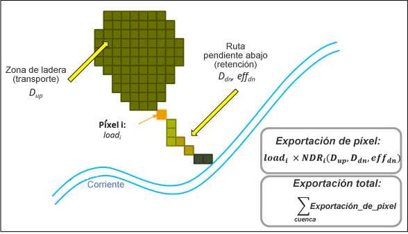
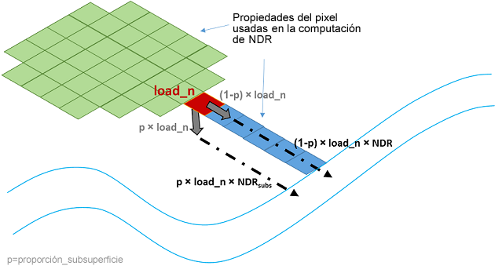
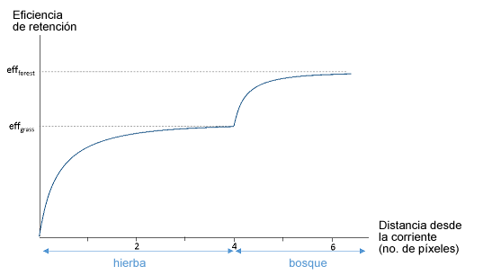
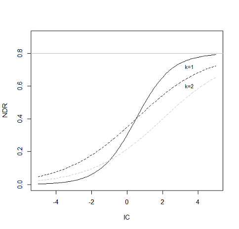

.. _ndr:

*****************************************
NDR: Relación de suministro de nutrientes
*****************************************

Resumen
=======

El objetivo del modelo de suministro de nutrientes de InVEST es mapear las fuentes de nutrientes de las cuencas hidrográficas y su transporte a la corriente. Esta información espacial puede utilizarse para evaluar el servicio de retención de nutrientes por parte de la vegetación natural. El servicio de retención es de especial interés para los problemas de calidad de las aguas superficiales y puede valorarse en términos económicos o sociales, como los costos de tratamiento evitados o la mejora de la seguridad hídrica mediante el acceso al agua potable.

Introducción
============

El cambio de uso del suelo, y en particular la conversión a tierras agrícolas, modifica drásticamente el ciclo natural de los nutrientes. Las fuentes antropogénicas de nutrientes incluyen fuentes puntuales, como los vertidos de efluentes industriales o de plantas de tratamiento de aguas, y fuentes no puntuales, como los fertilizantes utilizados en la agricultura y las zonas residenciales. Cuando llueve o nieva, el agua fluye por el paisaje arrastrando los contaminantes de estas superficies hacia los arroyos, ríos, lagos y el océano. Esto tiene consecuencias para las personas, afectando directamente a su salud o bienestar (Keeler et al., 2012), y para los ecosistemas acuáticos que tienen una capacidad limitada para adaptarse a estas cargas de nutrientes.

Una forma de reducir la contaminación de fuentes no puntuales es reducir la cantidad de aportes antropogénicos (es decir, la gestión de los fertilizantes). Cuando esta opción falla, los ecosistemas pueden prestar un servicio de depuración reteniendo o degradando los contaminantes antes de que entren en el cauce. Por ejemplo, la vegetación puede eliminar los contaminantes almacenándolos en los tejidos o devolviéndolos al medio ambiente en otra forma. Los suelos también pueden almacenar y atrapar algunos contaminantes solubles. Los humedales pueden ralentizar el flujo el tiempo suficiente para que los contaminantes sean absorbidos por la vegetación. La vegetación ribereña es especialmente importante en este sentido, ya que a menudo sirve de última barrera antes de que los contaminantes entren en un cauce.

Quienes planifican el uso del suelo, desde las agencias gubernamentales hasta los grupos ecologistas, necesitan información sobre la contribución de los ecosistemas a la mitigación de la contaminación del agua. En concreto, necesitan información espacial sobre la exportación de nutrientes y las zonas de mayor filtración. El modelo de suministro y retención de nutrientes proporciona esta información para los contaminantes no puntuales. El modelo se diseñó para los nutrientes (nitrógeno y fósforo), pero su estructura puede utilizarse para otros contaminantes (sustancias orgánicas persistentes, patógenos, etc.) si se dispone de datos sobre las tasas de carga y de filtración del contaminante de interés.

El modelo
=========

Resumen
-------

El modelo utiliza un enfoque simple de equilibrio de masas, describiendo el movimiento de una masa de nutrientes a través del espacio. A diferencia de los modelos de nutrientes más sofisticados, el modelo no representa los detalles del ciclo de los nutrientes, sino que representa el flujo de nutrientes a largo plazo y en estado estacionario mediante relaciones empíricas. Las fuentes de nutrientes en el paisaje, también llamadas cargas de nutrientes, se determinan a partir de un mapa de uso y cobertura del suelo (LULC) y de las tasas de carga asociadas. Las cargas de nutrientes pueden entonces dividirse en partes ligadas a los sedimentos y disueltas, que serán transportadas a través del flujo superficial y subsuperficial, respectivamente, deteniéndose cuando lleguen a una corriente. Obsérvese que la modelización del flujo subsuperficial es opcional; usted puede optar por modelizar solo el flujo superficial. En un segundo paso, se calculan los factores de entrega para cada píxel basándose en las propiedades de los píxeles que pertenecen a la misma ruta de flujo (en particular su pendiente y la eficiencia de retención del uso del suelo). En la salida de la cuenca/subcuenca, la exportación de nutrientes se calcula como la suma de las contribuciones a nivel de píxel.

|

 Representación conceptual del modelo NDR. Cada píxel i se caracteriza por su carga de nutrientes, load\ :sub:`i`, y su tasa de entrega de nutrientes (NDR), que es una función del área pendiente arriba, y de la trayectoria del flujo descendente (en particular las eficiencias de retención de los tipos de LULC en la trayectoria del flujo descendente). La exportación a nivel de píxel se calcula basándose en estos dos factores, y la exportación de sedimentos a nivel de cuenca es la suma de las exportaciones de nutrientes a nivel de píxel.

Cargas de nutrientes
--------------------

donde :math:`RPI_i` es el índice de potencial de escorrentía en el píxel :math:`i`, definido así:

.. math:: RPI_i = RP_i/RP_{av}
   :label: ndr_rpi

donde :math:`RP_i` es el proxy de escorrentía de nutrientes para la escorrentía en el píxel :math:`i` y :math:`RP_{av}` es el promedio de :math:`RP` sobre el ráster. Este enfoque es similar al desarrollado por Endreny y Wood (2003). En la práctica, el ráster RP se define como un índice de flujo rápido (por ejemplo, del modelo de rendimiento hídrico estacional InVEST) o como precipitación.

Para cada píxel, las cargas modificadas pueden dividirse en porciones de nutrientes ligados a los sedimentos y disueltos. Conceptualmente, la primera representa los nutrientes que son transportados por la escorrentía superficial o subsuperficial, mientras que la segunda representa los nutrientes transportados por las aguas subterráneas.

.. note::
   Este modelo calcula el componente subsuperficial solo para el nitrógeno. El fósforo subsuperficial no se modeliza porque las partículas de fósforo suelen estar ligadas a los sedimentos y es menos probable que se transporten a través del flujo subsuperficial.

La proporción entre estos dos tipos de fuentes de nutrientes viene dada por el parámetro :math:`proportion\_subsurface\_n` que cuantifica la proporción de nutrientes disueltos sobre la cantidad total de nutrientes. Para un píxel i:

.. math:: load_{surf,i} = (1-proportion\_subsurface_i) \cdot modified.load\_n_i
   :label: ndr_surface_load
.. math:: load_{subsurf,i} = proportion\_subsurface_i \cdot modified.load\_n_i
   :label: ndr_subsurface_load

Si no se dispone de información sobre la partición entre los dos tipos, el valor recomendado por defecto de :math:`proportion\_subsurface\_n` es 0, lo que significa que todos los nutrientes llegan a la corriente a través del flujo superficial. (Tenga en cuenta que el flujo superficial puede, conceptualmente, incluir el flujo subsuperficial poco profundo). Sin embargo, usted debe explorar la sensibilidad del modelo a este valor para caracterizar la incertidumbre introducida por esta suposición.

Suministro de nutrientes
------------------------

La entrega de nutrientes se basa en el concepto de tasa de entrega de nutrientes (NDR), un enfoque inspirado en el concepto de tasa de suministro de sedimentos revisado por pares (véase el capítulo de la guía de uso de InVEST SDR y Vigiak et al., 2012). El concepto es similar a los enfoques de índices basados en el riesgo que son populares para la modelización de nutrientes (Drewry et al., 2011), aunque proporciona valores cuantitativos de la exportación de nutrientes (por ejemplo, la proporción de la carga de nutrientes que llegará a la corriente). Se calculan dos tasas de suministro, una para los nutrientes transportados por el flujo superficial y otra para el flujo subsuperficial.

|
|

 Representación conceptual de la entrega de nutrientes en el modelo. Si se elige representar el flujo subsuperficial, la carga en cada píxel, load_n, se divide en dos partes, y la exportación total de nutrientes es la suma de las contribuciones superficiales y subsuperficiales.

NDR superficial
^^^^^^^^^^^^^^^

La NDR superficial es el producto de un factor de suministro, que representa la capacidad de los píxeles corriente abajo para transportar nutrientes sin retención, y un índice topográfico, que representa la posición en el paisaje. Para un píxel i:

.. math:: NDR_i = NDR_{0,i}\left(1 + \exp\left(\frac{IC_0-IC_i}{k}\right)\right)^{-1}
   :label: ndr_surface

donde :math:`IC_0` and :math:`k` son parámetros de calibración, :math:`IC_i` es un índice topográfico, y :math:`NDR_{0,i}` es la proporción de nutrientes que no son retenidos por los píxeles  pendiente abajo (independientemente de la posición del píxel en el paisaje). A continuación, ofrecemos detalles sobre el cálculo de cada factor.

:math:`NDR_{0,i}` se basa en la máxima eficacia de retención del terreno entre un píxel y el cauce (trayectoria descendente, en la Figura 5):

.. math:: NDR_{0,i} = 1 - eff'_i
   :label: ndr_0

Al desplazarse a lo largo de una ruta de flujo, el algoritmo calcula la retención adicional proporcionada por cada píxel, teniendo en cuenta la distancia total recorrida a través de cada tipo de LULC. Cada píxel adicional del mismo tipo de LULC contribuirá con un valor menor a la retención total, hasta que se alcance la máxima eficiencia de retención para el LULC dado (Figura 2). La retención total está limitada por el valor máximo de retención que pueden proporcionar los tipos de LULC a lo largo del recorrido del flujo, :math:`eff_{LULC_i}`.

En términos matemáticos:

.. math:: eff'_i =
    \begin{cases}
        eff_{LULC_i}\cdot(1-s_i) & \mathrm{if\ } down_i \mathrm{\ is\ a\ stream\ pixel}\\
        eff'_{down_i}\cdot s_i + eff_{LULC_i}\cdot (1 - s_i) & \mathrm{if\ } eff_{LULC_i} > eff'_{down_i}\\
        eff'_{down_i} & otherwise
    \end{cases}
  :label: ndr_eff

donde:

 * :math:`eff'_{down_i}` es la retención efectiva pendiente abajo en el píxel directamente descendente desde :math:`i`,
 * :math:`eff_{LULC_i}` es la máxima eficiencia de retención que puede alcanzar el tipo de LULC :math:`i`, y
 * :math:`s_i` es el factor de paso definido como:

.. math:: s_i=\exp\left(\frac{-5 \ell_{i_{down}}}{\ell_{LULC_i}}\right)
   :label: ndr_s

Con:

 * :math:`\ell_{i_{down}}` es la longitud de la trayectoria del flujo desde el píxel :math:`i` hasta su vecino pendiente abajo. Es la distancia euclidiana entre los centroides de los dos píxeles.
 * :math:`\ell_{LULC_i}` es la longitud de retención de LULC ("longitud crítica") del tipo de cobertura del suelo en el píxel :math:`i`

Notas:

Dado que :math:`eff'_i` depende de los píxeles situados en la pendiente inferior, el cálculo se realiza de forma recursiva empezando por los píxeles que desembocan directamente en los cauces antes de poder calcular los píxeles situados pendiente arriba.

En la ecuación [6], el factor 5 se basa en la suposición de que la eficiencia máxima se alcanza cuando se llega al 99% de su valor (suposición debida a la forma exponencial de la función de eficiencia, que implica que el valor máximo no puede alcanzarse con una longitud de recorrido de flujo finita).

|

 Ilustración del cálculo de la eficiencia de retención a lo largo de una trayectoria de flujo simple compuesta por 4 píxeles de pasto y 3 píxeles de bosque. Cada píxel adicional del LULC de pasto contribuye a un porcentaje menor hacia la eficiencia máxima proporcionada por el pasto. La forma de las curvas exponenciales viene determinada por la eficiencia máxima y la longitud de retención.

|

El IC, el índice de conectividad, representa la conectividad hidrológica, es decir, la probabilidad de que los nutrientes de un píxel lleguen al cauce. En este modelo, el IC es solo una función de la topografía:

.. math:: IC=\log_{10}\left(\frac{D_{up}}{D_{dn}}\right)
   :label: ndr_ic

donde

.. math:: D_{up} = \overline{S}\sqrt{A}
   :label: ndr_d_up

y

.. math:: D_{dn} = \sum_i \frac{d_i}{S_i}
   :label: ndr_d_dn

donde :math:`D_{up} = \overline{S}` es el gradiente medio de la pendiente del área de contribución pendiente arriba (m/m), :math:`A` es el área de contribución pendiente arriba (m\ :sup:`2``); :math: `d_i` es la longitud de la trayectoria del flujo a lo largo de la i-ésima celda según la dirección de bajada más pronunciada (m) (ver detalles en el modelo de sedimentos), y :math:`S_i` es el gradiente de la pendiente de la i-ésima celda, respectivamente.

Nota: El área de contribución pendiente arriba y la trayectoria del flujo pendiente abajo se delinean con un algoritmo de dirección de flujo múltiple. Para evitar valores infinitos para el IC, los valores de la pendiente :math:`S` se fuerzan a un mínimo de 0,005 m/m si resultan ser menos que este umbral, basado en el MDE (Cavalli et al., 2013).

El valor de :math:`IC_0` se establece en :math:`IC_0 = \frac{IC_{max}+IC_{min}{2}`.
Esto impone que la función sigmoidea que relaciona la NDR con el IC esté centrada en la mediana de la distribución del IC, por lo que el valor máximo del IC da :math:`NDR=NDR_{max}`. :math:`k` se establece en un valor por defecto de 2 (cf. teoría del modelo SDR); es un factor empírico que representa la topografía local.

 Relación entre la NDR y el índice de conectividad IC. El valor máximo de la NDR se fija en :math:`NDR_{0}=0,8`. El efecto de la calibración se ilustra estableciendo :math:`k=1` y :math:`k=2` (línea sólida y discontinua, respectivamente), y :math:`IC_0=0,5` y :math:`IC_0=2` (líneas discontinuas negras y grises, respectivamente).

NDR subsuperficial
^^^^^^^^^^^^^^^^^^

La expresión para la NDR subsuperficial es un simple decaimiento exponencial con la distancia a la corriente, estabilizándose en el valor correspondiente a la máxima retención de nutrientes subsuperficial definida por usted:

.. math:: NDR_{subs,i} = 1 - eff_{subs}\left(1-e^\frac{-5\cdot\ell}{\ell_{subs}}\right)
   :label: ndr_subsurface

donde

 * :math:`eff_{subs}` es la máxima eficiencia de retención de nutrientes que puede alcanzarse mediante el flujo subsuperficial (es decir, la retención debida a la degradación bioquímica en los suelos),

 * :math:`{ell_{subs}` es la longitud de retención del flujo subsuperficial, es decir, la distancia a partir de la cual se puede suponer que el suelo retiene el nutriente a su máxima capacidad,

 * :math:`\ell_i` es la distancia del píxel a la corriente.

Exportación de nutrientes
^^^^^^^^^^^^^^^^^^^^^^^^^

La exportación de nutrientes de cada píxel i se calcula como el producto de la carga y la NDR:

.. math:: x_{exp_i} = load_{surf,i} \cdot NDR_{surf,i} + load_{subs,i} \cdot NDR_{subs,i}
   :label: nutrient_export

El total de nutrientes en la salida de cada cuenca definida por usted es la suma de las contribuciones de todos los píxeles de esa cuenca:

.. math:: x_{exp_{tot}} = \sum_i x_{exp_i}
   :label: total_nutrient_export

Área definida de los resultados
^^^^^^^^^^^^^^^^^^^^^^^^^^^^^^^

NDR y otros resultados del modelo se definen en términos de distancia a la corriente (:math:`d_i`). Por lo tanto, estos resultados solo se definen para los píxeles que drenan a una corriente en el mapa (y por lo tanto están dentro de la cuenca de las corrientes). Los píxeles que no drenan a ninguna corriente tendrán nodata en estas salidas. Los archivos resultantes afectados son: **d_dn.tif**, **dist_to_channel.tif**, **ic_factor.tif**, **ndr_n.tif**, **ndr_p.tif**, **sub_ndr_n.tif**, **n_surface_export.tif**, **n_subsurface_export.tif**, **n_total_export.tif** y **p_surface_export.tif**.

Si ve áreas nodata en estos resultados que no pueden explicarse por los datos que faltan en los inputs, es probable que se deba a que no están conectadas hidrológicamente a una corriente en el mapa. Vea la sección :ref:`SDR defined area <sdr_defined_area>` con información sobre cómo identificar y arreglar este problema.

El mapa de corrientes del modelo (**stream.tif**) se calcula mediante el ráster de umbral de acumulación de flujo (**flow_accumulation.tif**) por el valor del umbral de acumulación de flujo (UAF):

  .. math::
     :label: ndr_stream

     stream_{TFA,i} = \left\{\begin{array}{lr}
          1, & \text{if } flow\_accum_{i} \geq TFA \\
          0,     & \text{otherwise} \\
          \end{array}\right\}

Evaluación de los servicios de retención de nutrientes
------------------------------------------------------

El modelo NDR no cuantifica directamente la cantidad de nutrientes retenidos en el paisaje. Sin embargo, si se tienen escenarios que se comparan con las condiciones actuales, el servicio de retención de nutrientes puede estimarse tomando la diferencia en la exportación de nutrientes entre el escenario y las condiciones actuales. Esto cuantifica la diferencia en los nutrientes que llegan a un cauce, basándose en los cambios en la cobertura del suelo/clima/etc. presentes en el escenario, lo que proporciona una forma de evaluar los impactos en los usos aguas abajo, como el agua potable.

Para calcular los servicios de retención de nitrógeno por píxel dentro de un único escenario, recomendamos restar *n_total_export.tif* del resultado *modified_load_n.tif* situado en la carpeta de resultados *intermediate*. Del mismo modo, los servicios de retención de fósforo por píxel pueden calcularse restando *p_surface_export.tif* de *modified_load_p.tif*. Utilice la salida .gpkg para cuantificar los servicios de retención de nutrientes a escala de cuenca restando el resultado *n_total_export* de (*n_surface_load* + *n_subsurface_load*) para el nitrógeno y *p_surface_export* de *p_surface_load* para el fósforo.

La valoración monetaria (o no monetaria) de los servicios de retención de nutrientes es muy específica del contexto. Una nota importante sobre la asignación de un valor monetario a cualquier servicio es que la valoración solo debe hacerse sobre los resultados del modelo que han sido calibrados y validados. De lo contrario, no se sabe lo bien que el modelo representa el área de interés, lo que puede llevar a una representación errónea del valor exacto. Si el modelo no ha sido calibrado, solo deben utilizarse resultados relativos (como un aumento del 10%) y no valores absolutos (como 1.523 kg o 42.900 dólares).

Limitaciones y simplificaciones
===============================

El modelo tiene un número reducido de parámetros y los resultados suelen ser muy sensibles a los inputs. Esto implica que los errores en los valores empíricos de los parámetros de carga tendrán un gran efecto en las predicciones. Del mismo modo, los valores de la eficacia de retención se basan en estudios empíricos, y los factores que afectan a estos valores (como la pendiente o la variabilidad intraanual) se promedian. Estos valores incorporan implícitamente información sobre la dinámica dominante de los nutrientes, influida por el clima y los suelos. El modelo también asume que, una vez que el nutriente llega a la corriente, afecta a la calidad del agua en la salida de la cuenca, sin que se capten los procesos dentro de la corriente. Por último, no se ha estudiado bien el efecto de la resolución de la cuadrícula en la formulación del NDR.

Se recomienda realizar análisis de sensibilidad para investigar cómo los intervalos de confianza en los parámetros de entrada afectan a las conclusiones del estudio (Hamel et al., 2015).

Véase también la sección "Interpretación del modelo biofísico" donde hay más detalles sobre las incertidumbres del modelo.

Nacesidades de datos
====================

.. note:: *Todos los inputs espaciales deben tener exactamente el mismo sistema de coordenadas proyectadas* (con unidades lineales de metros), *no* un sistema de coordenadas geográficas (con unidades de grados).

.. note:: Los resultados solo se pueden calcular en los píxeles en los que *todos* los rásteres de entrada tienen valores válidos. Si algún ráster de entrada tiene el valor NoData en un píxel, entonces el resultado también será NoData en ese píxel.

.. note:: Los inputs en ráster pueden tener diferentes tamaños de celda y serán remuestreadas para que coincidan con el tamaño de celda del MDE. Por lo tanto, todos los resultados del modelo tendrán el mismo tamaño de celda que el MDE.

El modelo tiene opciones para calcular el nitrógeno, el fósforo o ambos. Debe proporcionar todos los inputs correspondientes al nutriente o nutrientes elegidos.

- :investspec:`ndr.ndr workspace_dir`

- :investspec:`ndr.ndr results_suffix`

- :investspec:`ndr.ndr dem_path` Asegúrese de que el MDE está corregido rellenando los sumideros, y compare los mapas de corrientes resultantes con los mapas hidrográficos de la zona. Para garantizar un trazado adecuado de los flujos, el MDE debe extenderse más allá de las cuencas hidrográficas de interés en lugar de estar recortado al borde de la cuenca.

- :investspec:`ndr.ndr lulc_path`

- :investspec:`ndr.ndr runoff_proxy_path` Este ráster puede definirse como un índice de flujo rápido (por ejemplo, del modelo :ref:`Seasonal Water Yield <seasonal_water_yield>`) o simplemente como precipitación anual. Esto es :math:`RP`, que se normaliza (dividiendo por su valor medio) para obtener el índice de potencial de escorrentía :math:`RPI` en la ecuación :eq:`ndr_rpi`. No hay un requisito específico para las unidades de este input, ya que será normalizada por el modelo antes de su uso en los cálculos.

- :investspec:`ndr.ndr watersheds_path`

- :investspec:`ndr.ndr calc_n`
- :investspec:`ndr.ndr calc_p`

- :investspec:`ndr.ndr biophysical_table_path`

    Columnas:

    - :investspec:`ndr.ndr biophysical_table_path.columns.lucode`
    - :investspec:`ndr.ndr biophysical_table_path.columns.load_n`
    - :investspec:`ndr.ndr biophysical_table_path.columns.load_p`

    .. note::
	 Las cargas son las fuentes de nutrientes asociadas a cada píxel del paisaje. En consonancia con la bibliografía sobre coeficientes de exportación (California Regional Water Quality Control Board Central Coast Region, 2013; Reckhow et al., 1980), los valores de carga para cada clase de LULC se derivan de medidas empíricas de exportación de nutrientes (por ejemplo, exportación de nutrientes que escurren de zonas urbanas, cultivos, etc.). Alternativamente, si se dispone de información sobre la cantidad de nutrientes aplicados (por ejemplo, fertilizantes, residuos ganaderos, deposición atmosférica), es posible utilizarla estimando el uso de nutrientes en el píxel y aplicando este factor de corrección para obtener los parámetros de carga. Para más información, véase la sección Necesidades de datos.

    - :investspec:`ndr.ndr biophysical_table_path.columns.load_type_p`
    - :investspec:`ndr.ndr biophysical_table_path.columns.load_type_n`

    .. note::
       Las fuentes de datos pueden proporcionar valores de carga como la cantidad de nutrientes aplicados (por ejemplo, fertilizantes, residuos ganaderos, deposición atmosférica); o como medidas "extensivas" de contaminantes, que son valores empíricos que representan la contribución de una parcela al balance de nutrientes (por ejemplo, exportación de nutrientes que escurren de zonas urbanas, cultivos, etc.). En el caso de tener valores de nutrientes aplicados, estos deben corregirse en función de la retención de nutrientes proporcionada por el propio píxel, utilizando la tasa de aplicación y el valor de eficiencia de retención (*eff_n* o *eff_p*) para ese tipo de cubierta terrestre:

    - :investspec:`ndr.ndr biophysical_table_path.columns.eff_n`
    - :investspec:`ndr.ndr biophysical_table_path.columns.eff_p`

    .. note::
       La capacidad de retención de nutrientes de un determinado tipo de vegetación se expresa como una proporción de la cantidad de nutrientes procedentes de la ladera. Por ejemplo, se pueden asignar valores altos (de 0,6 a 0,8) a todos los tipos de vegetación natural (como bosques, pastos naturales, humedales o praderas), lo que indica que se retiene entre el 60 y el 80% de los nutrientes.

    - :investspec:`ndr.ndr biophysical_table_path.columns.crit_len_n`
    - :investspec:`ndr.ndr biophysical_table_path.columns.crit_len_p`

    .. note::
       Si los nutrientes recorren una distancia menor que la longitud de retención, la eficiencia de retención será menor que el valor máximo *eff_x*, siguiendo un decaimiento exponencial (véase la sección Suministro de nutrientes).

    - :investspec:`ndr.ndr biophysical_table_path.columns.proportion_subsurface_n` Por defecto, este valor debe fijarse en 0, lo que indica que todos los nutrientes se suministran a través del flujo superficial. No existe un equivalente para el fósforo.

    A continuación se presenta un ejemplo de tabla biofísica. En este ejemplo, solo se evalúa el fósforo, por lo que se incluyen las columnas **load_p**, **eff_p** y **crit_len_p**.

    .. csv-table::
       :file: ../../invest-sample-data/NDR/biophysical_table_gura.csv
       :header-rows: 1
       :name: NDR Biophysical Table Example
       :widths: auto

    .. note::
       Este y el resto de los datos de muestra son solo para ser utilizados como ejemplo. Las clases LULC y los datos correspondientes suyos serán diferentes.

- :investspec:`ndr.ndr threshold_flow_accumulation` Esto se utiliza para clasificar las corrientes a partir del MDE. Este umbral afecta directamente a la expresión de la conectividad hidrológica y al resultado de la exportación de nutrientes: cuando una vía de flujo llega al cauce, la retención de nutrientes se detiene y se supone que el nutriente exportado llega a la salida de la cuenca. Es importante elegir este valor con cuidado para que las corrientes modelizadas se acerquen lo más posible a la realidad. El Apéndice 1 contiene más información sobre la elección de este valor.

- :investspec:`ndr.ndr k_param` El valor por defecto  es 2.

- :investspec:`ndr.ndr subsurface_critical_length_n`

.. note::
   Si el nitrógeno disuelto recorre una distancia menor que su Longitud Crítica Subsuperficial, la eficiencia de retención será menor que el valor de Eficiencia Máxima de Retención Subsuperficial definido. Si se ajusta este valor a una distancia menor que el tamaño del píxel, la eficacia de retención máxima se alcanzará solo en un píxel.

- :investspec:`ndr.ndr subsurface_eff_n`

Interpretación de los resultados
================================

En los nombres de los archivos que aparecen a continuación, "x" significa n (nitrógeno) o p (fósforo), dependiendo de los nutrientes que se hayan modelizado. La resolución de los rásters resultantes será la misma que la del MDE proporcionado como input.

* **Registro de parámetros**: Cada vez que se ejecute el modelo, se creará un archivo de texto (.txt) en el Espacio de Trabajo. El archivo enumerará los valores de los parámetros y los mensajes resultantes para esa ejecución y se nombrará según el servicio, la fecha y la hora. Cuando se ponga en contacto con NatCap por errores en la ejecución de un modelo, incluya el registro de parámetros.

* **[Workspace]** folder:

   * **watershed_results_ndr.gpkg**: Vector con los resultados agregados del modelo de nutrientes por cuenca hidrográfica. La tabla .dbf contiene la siguiente información para cada cuenca:

      * *p_surface_load*: Cargas (fuentes) totales de fósforo  en la cuenca, es decir, la suma de la contribución de nutrientes de todas las LULC superficiales sin filtrar por el paisaje [unidades kg/año]
      * *n_surface_load*: Cargas (fuentes) totales de nitrógeno en la cuenca, es decir, la suma de la contribución de nutrientes de todas las LULC superficiales sin filtrar por el paisaje [unidades kg/año]
      * *n_subsurface_load*: Cargas totales de nitrógeno subsuperficial en la cuenca [unidades kg/año]
      * *p_surface_export*: Exportación total de fósforo de la cuenca por flujo superficial [unidades kg/año] (Eq. :eq:`total_nutrient_export`)
      * *n_surface_export*: Exportación total de nitrógeno de la cuenca por flujo superficial [unidades kg/año] (Eq. :eq:`total_nutrient_export`)
      * *n_subsurface_export*: Exportación total de nitrógeno de la cuenca por flujo subsuperficial [unidades kg/año](Eq. :eq:`total_nutrient_export`)
      * *n_total_export*: Exportación total de nitrógeno de la cuenca por flujo superficial y subsuperficial [unidades kg/año] (Eq. :eq:`total_nutrient_export`)

   * **p_surface_export.tif**: Un mapa a nivel de píxel que muestra cuánto fósforo de cada píxel llega finalmente a la corriente por flujo superficial [Unidades: kg/pixel/año] (Eq. :eq:`nutrient_export`)
   * **n_surface_export.tif**: Un mapa a nivel de píxel que muestra cuánto nitrógeno de cada píxel llega finalmente a la corriente por flujo superficial [Unidades: kg/pixel/año] (Eq. :eq:`nutrient_export`)
   * **n_subsurface_export.tif**: Un mapa a nivel de píxel que muestra cuánto nitrógeno de cada píxel llega finalmente a la corriente por flujo subsuperficial [Unidades: kg/pixel/año] (Eq. :eq:`nutrient_export`)
   * **n_total_export.tif**: Un mapa a nivel de píxel que muestra cuánto nitrógeno de cada píxel llega finalmente a la corriente (la suma de **n_surface_export.tif** y **n_subsurface_export.tif**) [Unidades: kg/píxel] (Eq. :eq:`nutrient_export`)

* **[Workspace]\\intermediate_outputs** folder:

   * **crit_len_x.tif**: Valores de longitud de retención, crit_len, encontrados en la tabla biofísica
   * **d_dn.tif**: Factor pendiente abajo del índice de conectividad (Eq. :eq:`ndr_d_dn`)
   * **d_up.tif**: Factor pendiente arriba del índice de conectividad (Eq. :eq:`ndr_d_up`)
   * **dist_to_channel.tif**: Distancia media pendiente abajo desde un píxel hasta el canal
   * **eff_x.tif**: Eficiencia de retención de la cubierta por paisaje para el nutriente `x`.
   * **effective_retention_x.tif**: Retención efectiva proporcionada por la vía de flujo descendente para cada píxel (Eq. :eq:`ndr_eff`)
* **flow_accumulation.tif**: Acumulación de flujo creada a partir del MDE
   * **flow_direction.tif**: Dirección del flujo creada a partir del MDE
   * **ic_factor.tif**: Índice de conectividad (Eq. :eq:`ndr_ic`)
   * **load_x.tif**: Cargas (para el transporte superficial) por píxel [unidades: kg/año]
* **modified_load_x.tif**: Carga bruta escalada por el índice proxy de escorrentía [unidades: kg/año]
   * **ndr_x.tif**: Valores NDR (Eq. :eq:`ndr_surface`)
   * **runoff_proxy_index.tif**: Valores normalizados para el input proxy de escorrentía en el modelo
* **s_accumulation.tif**: Parámetro de la pendiente para la ecuación del IC que se encuentra en la sección de entrega de nutrientes
   * **s_bar.tif**: Parámetro de la pendiente para la ecuación del IC que se encuentra en la sección de entrega de nutrientes
   * **s_factor_inverse.tif**: Parámetro de la pendiente para la ecuación del IC que se encuentra en la sección de suministro de nutrientes
   * **stream.tif**: Red de corrientes creada a partir del MDE, con un 0 que representa los píxeles de tierra y un 1 que representa los píxeles de corrientes (Eq. :eq:`ndr_stream`). Compare esta capa con un mapa de corrientes del mundo real, y ajuste el Umbral de Acumulación de Flujo para que calce lo más posible con las corrientes del mundo real.
   * **sub_load_n.tif**: Cargas de nitrógeno para el transporte subsuperficial [unidades: kg/año]
   * **sub_ndr_n.tif**: Valores NDR de nitrógeno en la subsuperficie
   * **surface_load_x.tif**: Cargas de nutrientes por encima del suelo [unidades: kg/año]
   * **Tresholded_slope.tif**: Ráster con los valores de la pendiente umbralizados para el cálculo correcto del IC.
   * **what_drains_to_stream.tif**: Mapa de los píxeles que drenan a una corriente. Un valor de 1 significa que al menos parte de la escorrentía de ese píxel drena a una corriente en **stream.tif**. Un valor de 0 significa que no drena en absoluto a ninguna corriente en **stream.tif**.

Interpretación del modelo biofísico para la valoración
------------------------------------------------------

Algunos enfoques de valoración, como los que se basan en los cambios en la calidad del agua de una planta de tratamiento, son muy sensibles a las predicciones absolutas del modelo. Por lo tanto, es importante tener en cuenta las incertidumbres asociadas al uso de InVEST como herramienta de predicción y minimizar su efecto en la etapa de valoración.

Incertidumbres de los parámetros del modelo
^^^^^^^^^^^^^^^^^^^^^^^^^^^^^^^^^^^^^^^^^^^

Las incertidumbres de los parámetros de input pueden caracterizarse mediante una revisión bibliográfica (por ejemplo, examinando la distribución de los valores de diferentes estudios). Una opción para evaluar el impacto de las incertidumbres de los parámetros es realizar análisis de sensibilidad locales o globales, con rangos de parámetros obtenidos de la literatura (Hamel et al., 2015). Véase también Hamel y Bryant (2017), que ofrecen una orientación más general para evaluar la incertidumbre en los análisis de los servicios ecosistémicos. 

Incertidumbres estructurales del modelo
^^^^^^^^^^^^^^^^^^^^^^^^^^^^^^^^^^^^^^^

El modelo InVEST calcula un balance de masas de nutrientes en una cuenca hidrográfica, restando las pérdidas de nutrientes (representadas conceptualmente por los coeficientes de retención), de las fuentes totales de nutrientes. En su caso, es posible distinguir entre las vías de flujo superficiales y subsuperficiales, añadiendo tres parámetros al modelo. A falta de conocimientos empíricos, quienes modelizan pueden suponer que los parámetros de carga superficial y de retención representan ambos procesos de transporte. Anímese a probar y calibrar el modelo, reconociendo dos retos principales:

 * Brechas de conocimiento en el transporte de nutrientes: aunque hay pruebas sólidas del impacto del cambio de uso del suelo en la exportación de nutrientes, la modelización de la dinámica a escala de la cuenca sigue siendo un reto (Breuer et al., 2008; Scanlon et al., 2007). Por lo tanto, la calibración es difícil y no se recomienda sin análisis en profundidad que proporcionen confianza en la representación del proceso del modelo (Hamel et al., 2015).

 * Contribución potencial de la contaminación de fuentes puntuales: los residuos domésticos e industriales suelen formar parte del presupuesto de nutrientes y deben tenerse en cuenta durante la calibración (por ejemplo, añadiendo las cargas de nutrientes de fuentes puntuales a la exportación de nutrientes modelizada y comparando después la suma con los datos observados).

Comparación con los datos observados
^^^^^^^^^^^^^^^^^^^^^^^^^^^^^^^^^^^^

A pesar de las incertidumbres mencionadas, el modelo InVEST proporciona una evaluación de primer orden de los procesos de retención de nutrientes y puede compararse con las observaciones. Las series temporales de concentración de nutrientes utilizadas para la validación del modelo deben abarcar un periodo razonablemente largo (preferiblemente al menos 10 años) para atenuar el efecto de la variabilidad interanual. Las series temporales también deben ser relativamente completas a lo largo de un año (sin lagunas de datos estacionales significativas) para garantizar la comparación con las cargas anuales totales. Si los datos observados se expresan como series temporales de concentración de nutrientes, deben convertirse a cargas anuales (LOADEST y FLUX32 son dos programas que facilitan esta conversión). Se pueden encontrar detalles adicionales sobre los métodos y el rendimiento del modelo para las predicciones relativas en el estudio de Redhead et al. (2018). 

Si hay represas o embalses en las corrientes de la zona de análisis, es posible que estén reteniendo nutrientes, de manera que no lleguen a la salida de la zona de estudio. En este caso, puede ser útil ajustar por esta retención al comparar los resultados del modelo con los datos observados. Para un ejemplo de cómo se hizo esto para un estudio en el noreste de Estados Unidos, véase Griffin et al. (2020). La metodología de retención de represas se describe en el Apéndice del documento, y requiere conocer la eficiencia de captura de nutrientes de la(s) represa(s).

Apéndice: Fuentes de datos
==========================

:ref:`Digital Elevation Model <dem>`
------------------------------------

:ref:`Land Use/Land Cover <lulc>`
---------------------------------

:ref:`Watersheds <watersheds>`
------------------------------

:ref:`Threshold Flow Accumulation <tfa>`
----------------------------------------

Proxy de escorrentía de nutrientes
----------------------------------
Se puede utilizar el índice de flujo rápido (por ejemplo, del modelo InVEST de rendimiento hídrico estacional u otro) o la precipitación media anual. La precipitación media anual puede interpolarse a partir de los pluviómetros existentes y de conjuntos de datos globales procedentes de modelos de teledetección para tener en cuenta las zonas remotas. Al considerar los datos de los pluviómetros, hay que asegurarse de que proporcionen una buena cobertura sobre la zona de interés, especialmente si hay grandes cambios de elevación que hacen que las cantidades de precipitación sean heterogéneas dentro del ADI. Lo ideal es que los medidores tengan al menos 10 años de datos continuos, sin grandes lagunas, en torno al mismo período de tiempo que el mapa de uso y cobertura del suelo utilizado.

Si no se dispone de datos de campo, se pueden utilizar datos gruesos de precipitación anual de conjuntos de datos globales disponibles gratuitamente, como WorldClim (https://www.worldclim.org/) o la Unidad de Investigación Climática (http://www.cru.uea.ac.uk).

Carga de nutrientes
-------------------
Para todos los parámetros de calidad del agua (carga de nutrientes, eficiencia de retención y duración de la retención), debe consultarse la bibliografía local para obtener los valores específicos del lugar. La base de datos de parámetros de nutrientes de NatCap ofrece una lista no exhaustiva de referencias locales para las cargas de nutrientes y las eficiencias de retención: https://naturalcapitalproject.stanford.edu/sites/g/files/sbiybj9321/f/nutrient_db_0212.xlsx. Parn et al. (2012) y Harmel et al. (2007) ofrecen una buena revisión para las tierras agrícolas de clima templado.

Las fuentes de datos pueden proporcionar valores de carga como la cantidad de nutrientes aplicados (por ejemplo, fertilizantes, residuos ganaderos, deposición atmosférica); o como medidas "extensivas" de contaminantes, que son valores empíricos que representan la contribución de una parcela al balance de nutrientes (por ejemplo, exportación de nutrientes que escurren de zonas urbanas, cultivos, etc.). En el caso de tener valores de nutrientes aplicados, deben corregirse en función de la retención de nutrientes proporcionada por el propio píxel, utilizando la tasa de aplicación y el valor de eficiencia de retención (*eff_n* o *eff_p*) para ese tipo de cubierta terrestre. 

application_load * (1 - retention_efficiency) 

Por ejemplo, si la tasa de aplicación de nitrógeno para una clase LULC agrícola es de 10 kg/ha/año y la eficiencia de retención es de 0,4, deberá introducir un valor de 6.0 en la columna *n_load* de la tabla biofísica. Si dispone de valores "extensivos"/de exportación, puede utilizarlos directamente en la tabla biofísica sin corrección.

Se pueden encontrar ejemplos de coeficientes de exportación (medidas "extensivas") para EE.UU. en el Manual del usuario de PLOAD de la EPA y en una revisión de Lin (2004). Nótese que los ejemplos de la guía de la EPA están en lbs/ac/año y deben convertirse a kg/ha/año.

Eficiencia de retención
-----------------------
Este valor representa, conceptualmente, la máxima retención de nutrientes que puede esperarse de un determinado tipo de LULC. A los tipos de LULC de vegetación natural (como los bosques, los pastos naturales, los humedales o las praderas) se les suelen asignar valores altos (>0,8). Se recomienda revisar la literatura local y consultar con personas expertas en hidrología para seleccionar los valores más relevantes para este parámetro. La base de datos de parámetros de nutrientes de NatCap ofrece una lista no exhaustiva de referencias locales para las cargas de nutrientes y las eficiencias de retención: https://naturalcapitalproject.stanford.edu/sites/g/files/sbiybj9321/f/nutrient_db_0212.xlsx. Parn et al. (2012) proporcionan una revisión útil para climas templados. Las revisiones de la eficiencia de las zonas de amortiguación ribereñas, aunque son un caso particular de retención de LULC, también pueden utilizarse como punto de partida (Mayer et al., 2007; Zhang et al., 2009).

Longitud de retención: crit_len_n and crit_len_p
------------------------------------------------
Este valor representa la distancia típica necesaria para alcanzar la máxima eficacia de retención. Se introdujo en el modelo para eliminar cualquier sensibilidad a la resolución del ráster LULC. La bibliografía sobre la eficacia de la eliminación de las zonas de amortiguación ribereñas sugiere que las longitudes de retención oscilan entre 10 y 300 m (Mayer et al., 2007; Zhang et al., 2009). En ausencia de datos locales para usos de la tierra que no sean bosques o pastos, se puede simplemente establecer la longitud de retención constante, igual al tamaño del píxel: esto hará que la máxima eficiencia de retención se alcance solo en una distancia de un píxel. Otra opción es tratar la longitud de retención como un parámetro de calibración. En ausencia de cualquier otra información, comience con un valor en el punto medio del rango dado anteriormente (es decir, 150m), luego varíe ese valor hacia arriba y hacia abajo durante la calibración para encontrar un buen calce.

Parámetros subsuperficiales: proportion_subsurface_n, eff_sub, crit_len_sub
---------------------------------------------------------------------------
Estos valores se utilizan para los análisis avanzados y deben seleccionarse en consulta con el personal de hidrología. Parn et al. (2012) proporcionan valores medios para la partición de las cargas de N entre la lixiviación y la escorrentía superficial. A partir de Mayer et al. (2007), se puede asumir una media global de 200 m para la longitud de retención y un 80% para la eficiencia de retención para las zonas de amortiguamiento con vegetación.

Referencias
===========

Breuer, L., Vaché, K.B., Julich, S., Frede, H.-G., 2008. Current concepts in nitrogen dynamics for mesoscale catchments. Hydrol. Sci. J. 53, 1059–1074.

California Regional Water Quality Control Board Central Coast Region, 2013. Total Maximum Daily Loads for Nitrogen Compounds and Orthophosphate for the Lower Salinas River and Reclamation Canal Basin , and the Moro Cojo Slough Subwatershed , Monterey County, CA. Appendix F. Available at: https://www.waterboards.ca.gov/centralcoast/water_issues/programs/tmdl/docs/salinas/nutrients/index.html

Endreny, T.A., Wood, E.F., 2003. Watershed weighting of export coefficients to map critical phosphorous loading areas. J. Am. Water Resour. Assoc. 08544, 165–181.

Robert Griffin, Adrian Vogl, Stacie Wolny, Stefanie Covino, Eivy Monroy, Heidi Ricci, Richard Sharp, Courtney Schmidt, Emi Uchida, 2020. "Including Additional Pollutants into an Integrated Assessment Model for Estimating Nonmarket Benefits from Water Quality," Land Economics, University of Wisconsin Press, vol. 96(4), pages 457-477. DOI: 10.3368/wple.96.4.457

Hamel, P. y Bryant, B. (2017). Uncertainty assessment in ecosystem services analyses: Seven challenges and practical responses. Ecosystem Services, Volume 24. https://doi.org/10.1016/j.ecoser.2016.12.008.

Hamel, P., Chaplin-Kramer, R., Sim, S., Mueller, C., 2015. A new approach to modeling the sediment retention service (InVEST 3.0): Case study of the Cape Fear catchment, North Carolina, USA. Sci. Total Environ. 166–177.

Hamel, P., Guswa A.J. 2015. Uncertainty Analysis of the InVEST 3.0 Nutrient Model: Case Study of the Cape Fear Catchment, NC. Hydrology and Earth System Sciences Discussion 11:11001-11036. http://dx.doi.org/10.5194/hessd-11-11001-2014

Harmel, D., Potter, S., Casebolt, P., Reckhow, K., 2007. Compilation of measured nutrient load data for agricultural land uses in the United States 76502, 1163–1178.

Heathwaite, A.L., Quinn, P.F., Hewett, C.J.M., 2005. Modelling and managing critical source areas of diffuse pollution from agricultural land using flow connectivity simulation. J. Hydrol. 304, 446–461.

Keeler, B.L., Polasky, S., Brauman, K.A., Johnson, K.A., Finlay, J.C., Neill, A.O., 2012. Linking water quality and well-being for improved assessment and valuation of ecosystem services 109, 18629–18624.

Lin, J.., 2004. Review of published export coefficient and event mean concentration (EMC) data, WRAP Technical Notes Collection (ERDC TN-WRAP-04-3). Vicksburg, MS.

Mayer, P.M., Reynolds, S.K., Mccutchen, M.D., Canfield, T.J., 2007. Meta-Analysis of Nitrogen Removal in Riparian Buffers 1172–1180.

Pärn, J., Pinay, G., Mander, Ü., 2012. Indicators of nutrients transport from agricultural catchments under temperate climate: A review. Ecol. Indic. 22, 4–15.

Reckhow, K.H., Beaulac, M.N., Simpson, J.T., 1980. Modeling Phosphorus loading and lake response under uncertainty: A manual and compilation of export coefficients. EPA 440/5-80-011. US-EPA, Washington, DC.

Redhead, John W.; May, Linda; Oliver, Tom H.; Hamel, Perrine; Sharp, Richard; Bullock, James M. 2018 National scale evaluation of the InVEST nutrient retention model in the United Kingdom. Science of the Total Environment, 610-611. 666-677. https://doi.org/10.1016/j.scitotenv.2017.08.092

Scanlon, B.R., Jolly, I., Sophocleous, M., Zhang, L., 2007. Global impacts of conversions from natural to agricultural ecosystems on water resources: Quantity versus quality. Water Resour. Res. 43.

Tarboton, D., 1997. A new method for the determination of flow directions and upslope areas in grid digital elevation models. Water Resour. Res. 33, 309–319.

Vigiak, O., Borselli, L., Newham, L.T.H., Mcinnes, J., Roberts, A.M., 2012. Comparison of conceptual landscape metrics to define hillslope-scale sediment delivery ratio. Geomorphology 138, 74–88.

Zhang, X., Liu, X., Zhang, M., Dahlgren, R. a, Eitzel, M., 2009. A review of vegetated buffers and a meta-analysis of their mitigation efficacy in reducing nonpoint source pollution. J. Environ. Qual. 39, 76–84.
