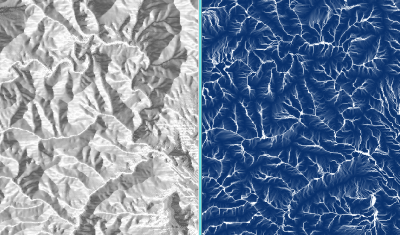

.. _routedem:

********
RouteDEM
********

Resumen
=======

Introducción
============

Los modelos de agua dulce de InVEST se dirigen por medio de un modelo digital de elevación (MDE). Durante el desarrollo de InVEST hemos comprobado que las implementaciones existentes de los algoritmos de dirección y acumulación de flujo son deficientes. Para satisfacer esta necesidad, hemos desarrollado nuestras propias implementaciones de alto rendimiento del algoritmo de dirección de flujo D8 y de flujo fraccionario ("Dirección de Flujo Múltiple" - DFM), combinadas con un algoritmo de resolución de meseta para enrutar a través de áreas planas (Garbrecht y Martz) que supera las implementaciones de TauDEM y GRASS. Creemos que estas implementaciones son lo suficientemente útiles como para ofrecerlas como una herramienta independiente que puede:

* Rellenar sumideros hidrológicos.

* Resolver áreas planas en un MDE para que todas las regiones drenen hacia algún punto.

* Calcular la dirección del flujo en un MDE.

* Calcular la acumulación de flujos en un MDE.

* Crear corrientes cn base en la acumulación de flujo.

Esta herramienta puede ser útil cuando prepare su MDE para utilizarlo en los modelos de agua dulce. Para estos modelos, usted querrá crear arroyos que sean continuos (no cortados), y necesitará elegir un valor de Umbral de Acumulación de Flujo que cree una red de corrientes modelizada que sea lo más cercana posible a la red de corrientes del mundo real. Con RouteDEM puede probar su MDE, ver cómo lo maneja InVEST y crear rastreos de corrientes que le ayuden a elegir un valor de umbral apropiado, sin necesidad de ejecutar todo el modelo de agua dulce.

Después de instalar InVEST, esta herramienta se puede encontrar en el menú de inicio bajo la carpeta InVEST como una utilidad llamada *RouteDEM*.

RouteDEM siempre resolverá los sumideros y mesetas antes de enrutar el flujo.

Inputs de la herramienta
========================

- :investspec:`routedem workspace_dir`

- :investspec:`routedem results_suffix`

- :investspec:`routedem dem_path` Los sumideros hidrológicos y las regiones de meseta plana serán resueltos automáticamente por el modelo.

- :investspec:`routedem dem_band_index` Si no se proporciona, se utilizará el índice de banda 1.

- :investspec:`routedem algorithm`

- :investspec:`routedem calculate_slope`

- :investspec:`routedem calculate_flow_direction` Esto se escribirá en el archivo resultante *flow_direction.tif*.

- :investspec:`routedem calculate_flow_accumulation` Esto se escribirá en el archivo resultante *flow_accumulation.tif*.

- :investspec:`routedem calculate_stream_threshold` Esto se escribirá en el archivo resultante *stream_mask.tif*. Todos los píxeles del ráster de acumulación de flujo que tengan un valor mayor o igual al **Límite del Umbral de Acumulación de Flujo** serán considerados como una corriente.

- :investspec:`routedem threshold_flow_accumulation`

- :investspec:`routedem calculate_downslope_distance` Esto se escribirá en el archivo resultante *downslope_distance.tif* en el espacio de trabajo. La distancia se da en número de píxeles. Para traducir esta distancia de píxeles a unidades lineales, multiplique el ráster *downslope_distance.tif* por el tamaño de los píxeles.

Referencias
===========

Garbrecht, J., Martz, L. W., The assignment of drainage direction over flat surfaces in raster digital elevation models, Journal of Hydrology, Volume 193, Issues 1–4, 1 June 1997, páginas 204-213, ISSN 0022-1694, http://dx.doi.org/10.1016/S0022-1694(96)03138-1. (https://www.sciencedirect.com/science/article/abs/pii/S0022169496031381)
