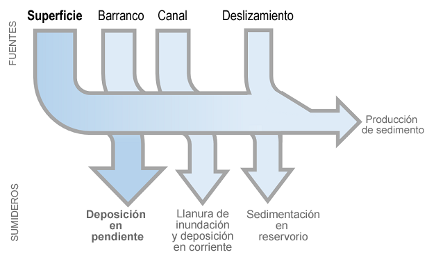
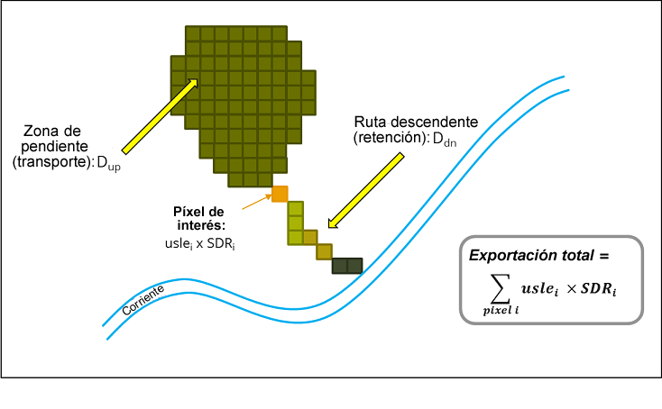
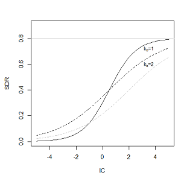
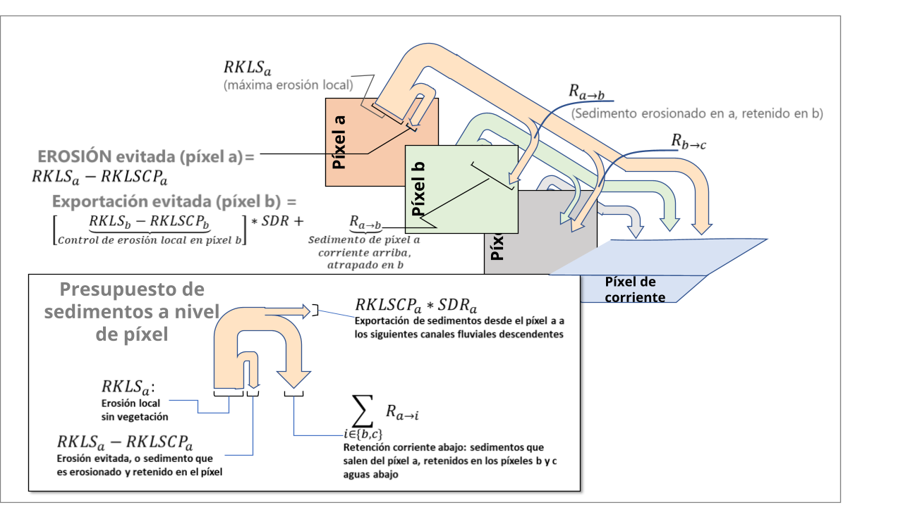
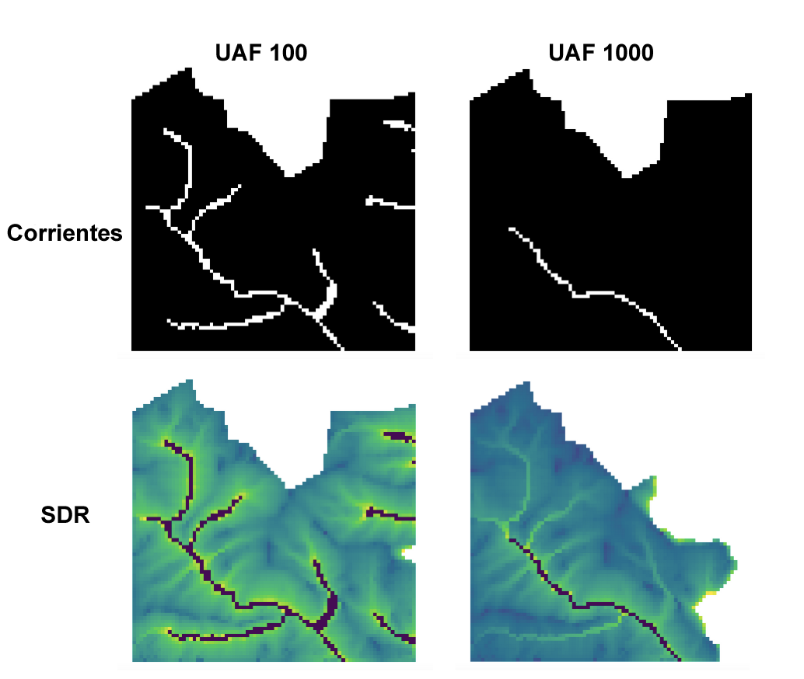

.. _sdr:

*************************************
SDR: Tasa de suministro de sedimentos
*************************************

Resumen
=======

El objetivo del modelo InVEST Tasa de suministro de sedimentos (SDR) es cuantificar y mapear la generación de sedimentos por tierra y su suministro a la corriente. En muchos lugares del mundo se observa un aumento de la carga de sedimentos en las masas de agua, lo que afecta drásticamente a la calidad del agua y al manejo de los embalses (UNESCO 2009). El servicio de retención de sedimentos que proporciona la vegetación es de gran interés para quienes manejan el agua y la tierra. Entender dónde se producen y suministran los sedimentos les permite diseñar mejores estrategias para reducir la carga de sedimentos mediante cambios en el uso del suelo y en las prácticas de manejo. Los cambios en la carga de sedimentos pueden tener impactos en el riego aguas abajo, el tratamiento del agua, las actividades recreativas y el rendimiento de los embalses, mientras que la pérdida de suelo de la tierra puede reducir la productividad agrícola. Estos impactos pueden valorarse económicamente combinando los resultados del modelo InVEST SDR con información sobre los costos de mitigación evitados, los costos de sustitución o la disposición a pagar.

Cambios recientes en el modelo SDR
==================================

A partir de la versión 3.12.0 de InVEST, se han realizado varias revisiones significativas en el modelo SDR para mejorar su usabilidad, transparencia y precisión. Estos cambios se resumen aquí y se describen con más detalle en las secciones y ecuaciones relacionadas a lo largo de este capítulo.

* El término "deposición" se ha cambiado por "atrapamiento", y el parámetro intermedio :math:`R` se ha cambiado por :math:`T`, para evitar la confusión con el factor R utilizado en la USLE.

* Se ha actualizado el cálculo de los parámetros intermedios :math:`R` (ahora actualizado a :math:`T`, atrapamiento) y :math:`F` (flujo). Anteriormente, :math:`R` y :math:`F` se calculaban de tal manera que el sedimento que se erosiona de un píxel (calculado por la Ecuación Universal Revisada de Pérdida de Suelo o RUSLE) puede ser atrapado por la vegetación en ese mismo píxel. Esto es conceptualmente incoherente: el papel de la vegetación para reducir la erosión y la escorrentía de sedimentos de un píxel ya se recoge en el factor C de RUSLE (Wischmeier y Smith, 1978). Al permitir el atrapamiento inmediato de sedimentos en el mismo píxel, esto equivale a contabilizar dos veces el papel de la vegetación. Con el cálculo actualizado, todos los sedimentos que se erosionan en un píxel van al siguiente píxel pendiente abajo, donde pueden quedar atrapados o seguir fluyendo pendiente abajo. *Este cambio no afectará a las estimaciones de la calidad del agua para un escenario determinado en relación con la formulación anterior del modelo. Sin embargo, dará lugar a cierto cambio en la atribución de los servicios de retención de sedimentos en el paisaje.* Por lo tanto, es probable que vea diferencias en los resultados en comparación con las versiones anteriores de InVEST.

* Se han añadido dos nuevos resultados ("erosión evitada" y "exportación evitada"), que cuantifican explícitamente el servicio de retención de sedimentos en el paisaje. Anteriormente, no estaba claro qué resultado del modelo, o combinación de resultados, debía utilizarse para valorar el servicio ecosistémico.

* Se han eliminado dos índices de retención de sedimentos heredados (*sed_retention.tif* y *sed_retention_index.tif*). Eran solo índices (no cantidades) y su utilidad no estaba clara, especialmente en el contexto de los nuevos resultados.

Introducción
============

La erosión y la retención de sedimentos por tierra son procesos naturales que rigen la concentración de sedimentos en las corrientes. La dinámica de los sedimentos a escala de la cuenca viene determinada principalmente por el clima (en particular la intensidad de las lluvias), las propiedades del suelo, la topografía y la vegetación, así como por factores antropogénicos como las actividades agrícolas o la construcción y explotación de presas. Las principales fuentes de sedimentos presentes en una cuenca incluyen la erosión terrestre (partículas del suelo desprendidas y transportadas por la lluvia y el flujo terrestre), la erosión en cárcavas (de los canales que concentran el flujo), la erosión de las orillas y la erosión en masa (o deslizamientos de tierra; véase Merritt et al. 2003 para una revisión). Los sumideros incluyen la deposición en la ladera, en la llanura de inundación o en la corriente, y la retención en embalses o reservorios artificiales, como se resume en la Figura 1. La conversión del uso del suelo y los cambios en las prácticas de maneo de la tierra pueden modificar drásticamente la cantidad de sedimento que escurre por una cuenca. La magnitud de este efecto depende principalmente de: i) las principales fuentes de sedimentos (el cambio de uso del suelo tendrá un efecto menor en las cuencas en las que los sedimentos no proceden principalmente del flujo terrestre, sino, por ejemplo, de la erosión glaciar); y ii) la distribución espacial de las fuentes y los sumideros de sedimentos (por ejemplo, el cambio de uso del suelo tendrá un efecto menor si las fuentes de sedimentos están amortiguadas por la vegetación).

El modelo InVEST SDR se centra solo en la erosión terrestre, no modeliza la erosión de cárcavas, riberas o masas. Los resultados del modelo incluyen la carga de sedimento suministrada a la corriente en una escala de tiempo anual, así como la cantidad de sedimento erosionado en la cuenca y retenido por la vegetación y las características topográficas. Hay que tener en cuenta que el SDR solo genera resultados biofísicos. Para la valoración del servicio de retención de sedimentos, los enfoques de valoración apropiados dependerán en gran medida de la aplicación, del contexto y de quiénes se beneficien, y deberán implementarse independientemente de InVEST. Consulte la sección de la guía de uso :ref: `quantitative-valuation` más abajo para obtener más orientación.

|
|

Figura 1. Presupuesto general de sedimentos de la cuenca. El tamaño relativo de las flechas cambia en función del entorno. El modelo InVEST se centra en las fuentes y sumideros terrestres, y no incluye los demás.

El modelo
=========

Suministro de sedimentos
------------------------

El módulo de suministro de sedimentos es un modelo espacialmente explícito que trabaja con la resolución espacial del ráster del modelo digital de elevación (MDE) de input. Para cada píxel, el modelo calcula primero la cantidad de pérdida anual de suelo de ese píxel, y luego calcula la tasa de suministro de sedimentos (SDR), que es la proporción de pérdida de suelo que realmente llega al cauce. Una vez que el sedimento llega a él, asumimos que será suministrado a la salida de la cuenca; por lo tanto, no se modelizan los procesos dentro del cauce que podrían aumentar o disminuir las cargas de sedimento. Este enfoque fue propuesto por Borselli et al. (2008) y ha recibido un interés creciente (por ejemplo, Cavalli et al., 2013; López-vicente et al., 2013; Sougnez et al., 2011). Véase la sección de la guía de uso :ref:`differences-SDR-Borselli` para obtener más información.

Pérdida anual de suelo
^^^^^^^^^^^^^^^^^^^^^^

La cantidad de pérdida anual de suelo en el píxel :math:`i`, :math:`usle_i` (unidades: :math:`tons\cdot ha^{-1} yr^{-1}`), viene dada por la Ecuación Universal Revisada de Pérdida de Suelo (RUSLE1 - Renard et al. 1997):

.. math:: usle_i=R_i\cdot K_i\cdot LS_i\cdot C_i\cdot P_i,
   :label: usle

donde

 * :math:`R_i` es la erosividad de la lluvia (unidades: :math:`MJ\cdot mm (ha\cdot hr\cdot yr)^{-1})`,

 * :math:`K_i` es la erosividad del suelo (unidades: :math:`ton\cdot ha\cdot hr (MJ\cdot ha\cdot mm)^{-1}`),

 * :math:`LS_i` es un factor de gradiente de longitud de la pendiente (sin unidades)

 * :math:`C_i` es un factor de gestión de la cubierta (sin unidades)

 * y :math:`P_i` es un factor de práctica de apoyo (Renard et al., 1997). (cf. también en (Bhattarai y Dutta, 2006)). (sin unidades)

El factor :math:`LS_i` procede del método desarrollado por Desmet y Govers (1996) para una superficie bidimensional:

.. math:: LS_i=S_i \frac{(A_{i-in}+D^2)^{m+1}-A_{i-in}^{m+1}}{D^{m+2}\cdot x_i^m\cdot (22.13)^m}
    :label: ls

donde

 * :math:`S_i` es el factor de pendiente de la celda de la cuadrícula :math:`i` calculado en función de los radianes de la pendiente :math:`\theta`

   .. math::

      S = \left\{\begin{array}{lr}
        10.8\cdot\sin(\theta)+0.03, & \text{where } \theta < 9\% \\
        16.8\cdot\sin(\theta)-0.50, & \text{where } \theta \geq 9\% \\
        \end{array}\right\}

 * :math:`A_{i-in}` es el área de contribución (:math:`m^2`) en el input de una celda de la red que se calcula a partir del método de dirección de flujo múltiple

 * :math:`D` es la dimensión lineal de la celda de la red (:math:`m`)

 * :math:`x_i` es la media del aspecto ponderado por el flujo de salida proporcional de la celda de rejilla :math:`i` determinada por el algoritmo de Dirección de Flujo Múltiple.  Se calcula mediante

   .. math:: x_i = \sum_{d\in{0,7\}} x_d\cdot P_i(d)

   donde :math:`x_d = |sin \alpha(d)| + |cos \alpha(d)|`, :math:`alpha(d)` es el ángulo del radián para la dirección :math:`d`, y :math:`P_i(d)` es la proporción del flujo total de salida en la celda :math:`i` en la dirección :math:`d`.

 * :math:`m` es el factor de exponente de longitud RUSLE.

Para evitar la sobreestimación del factor LS en paisajes heterogéneos, las longitudes largas de pendientes se limitan a un valor máximo de 122 m que es ajustable como parámetro de usuario (Desmet y Govers, 1996; Renard et al., 1997).

El valor de :math:`m`, el exponente de longitud del factor LS, se basa en la USLE clásica, como se discute en Oliveira et al. (2013):

.. math::

   \begin{align*}
   m &=  \left\{\begin{array}{lr}
      0.2, & \text{where } \theta \leq 1\% \\
      0.3, & \text{where } 1\% < \theta \leq 3.5\% \\
      0.4, & \text{where } 3.5\% < \theta \leq 5\% \\
      0.5, & \text{where } 5\% < \theta \leq 9\% \\
      \beta / (1 + \beta), & \text{where } \theta > 9\%
   \end{array}\right\} \\
   \\
   \beta &= \frac{\sin\theta / 0.0896}{3\sin\theta^{0.8} + 0.56}
   \end{align*}

Tasa de suministro de sedimentos
^^^^^^^^^^^^^^^^^^^^^^^^^^^^^^^^

**Paso 1.** Basándose en el trabajo de Borselli et al. (2008), el modelo calcula primero el índice de conectividad (:math:`IC`) para cada píxel. El índice de conectividad describe el vínculo hidrológico entre las fuentes de sedimentos (del paisaje) y los sumideros (como los  cauces). Los valores más altos de :math:`IC` indican que una mayor fracción de sedimento erosionado desde un píxel pendiente arriba se suministra a un sumidero cuesta abajo, como un cauce (es decir, está más conectado). La alta conectividad se produce normalmente cuando la ruta de flujo entre las fuentes de sedimentos y los sumideros es empinada, corta o con poca vegetación. Los valores más bajos de :math:`IC` (es decir, menor conectividad) se asocian a zonas con más vegetación y menores pendientes.

:math:`IC` es una función tanto del área pendiente arriba de cada píxel (:math:`D_{up}`) como de la ruta de flujo entre el píxel y la corriente más cercana (:math:`D_{dn}`). Si el área pendiente arriba es grande, tiene una pendiente menor y una buena cobertura vegetal (por lo tanto, un factor USLE C bajo), :math:`D_{up}` será bajo, lo que indica un menor potencial para que los sedimentos lleguen al cauce. Del mismo modo, si el camino descendente entre el píxel y el cauce es largo, tiene una pendiente menor y una buena cobertura vegetal, :math:`D_{dn}` será bajo.

:math:`IC` is calculated as follows:

.. math:: IC=\log_{10} \left(\frac{D_{up}}{D_{dn}}\right)
    :label: ic

Figura 2. Enfoque conceptual utilizado en el modelo. La Tasa de suministro de sedimentos (SDR) para cada píxel es una función del área pendiente arriba y de la trayectoria del flujo descendente.
|
Las pendientes umbralizadas :math:`S_{th}` y los factores de manejo de la cobertura :math:`C_{th}` se utilizan para calcular :math:`D_{up}` y :math:`D_{dn}`. Se establece un límite inferior para evitar valores infinitos para :math:`IC`. También se aplica un límite superior a la pendiente para limitar el sesgo debido a valores muy altos de :math:`IC` en pendientes pronunciadas. (Cavalli et al., 2013).

.. math::
   :label: threshold_slope

   S_{th} = \left\{\begin{array}{lr}
        0.005, &\text{for } S<0.005\\
        S,     &\text{for } 0.005\leq S\leq 1\\
        1,     &\text{for } S>1
        \end{array}\right\}

.. math::
   :label: threshold_c

   C_{th} = \left\{\begin{array}{lr}
        0.001, & \text{for } C<0.001\\
        C,     & \text{otherwise}\\
        \end{array}\right\}

:math:`D_{up}` is the upslope component defined as:

.. math:: D_{up}=\bar{C}_{th}\bar{S}_{th}\sqrt{A}
    :label: d_up

donde :math:`\bar{C}_{th}` es el factor :math:`C` promedio del área contribuyente de la ladera, :math:`\bar{S}_{th}` es el gradiente de pendiente promedio del área contribuyente de la ladera (:math:`m/m`) y :math:`A` es el área contribuyente de la ladera (:math:`m^2`). El área de contribución pendiente arriba se delinea a partir de un algoritmo de dirección de flujo múltiple.

El componente de bajada :math:`D_{dn}` viene dado por:

.. math:: D_{dn}=\sum_i\frac{d_i}{C_{th, i} S_{th,i}}
    :label: d_dn

donde :math:`d_i` es la longitud de la trayectoria del flujo a lo largo de la *i*\ ésima celda según la dirección de bajada más pronunciada (:math:`m`) (véase la Figura 2), :math:`C_{th, i}` y :math:`S_{th, i}` son el factor de gestión de la cobertura y el gradiente de la pendiente de la *i*\ ésima celda, respectivamente. De nuevo, la trayectoria del flujo descendente se determina a partir de un algoritmo de dirección de flujo múltiple.

**Paso 2.** La tasa SDR para un píxel :math:`i` se deriva entonces del índice de conductividad :math:`IC` siguiendo a Vigiak et al. (2012):

.. math:: SDR_i = \frac{SDR_{max}}{1+\exp\left(\frac{IC_0-IC_i}{k}\right)}
    :label: sdr

donde :math:`SDR_{max}` es la máxima SDR teórica, fijada en un valor medio de 0,8 (Vigiak et al., 2012), y :math:`IC_0` y :math:`k` son parámetros de calibración que definen la forma de la relación SDR-IC (que es una función creciente). A continuación se ilustra el efecto de :math:`IC_0` y :math:`k` en el SDR:

Figura 3. Relación entre el índice de conectividad IC y SDR. El valor máximo de SDR se fija en :math:`SDR_{max}=0,8`. El efecto de la calibración se ilustra estableciendo :math:`k_b=1` y :math:`k_b=2` (línea sólida y discontinua, respectivamente), y :math:`IC_0=0,5` y :math:`IC_0=2` (líneas discontinuas negras y grises, respectivamente).
|

Exportación de sedimentos
^^^^^^^^^^^^^^^^^^^^^^^^^

La exportación de sedimentos desde un píxel dado :math:`i` :math:`E_i` (unidades: :math:`tons\cdot ha^{-1} yr^{-1}`), es la cantidad de sedimento erosionado desde ese píxel que realmente llega a un cauce. La exportación de sedimentos viene dada por:

.. math:: E_i=usle_i\cdot SDR_i
    :label: e_i

La exportación total de sedimentos de la cuenca :math:`E` (unidades: :math:`ton\cdot ha^{-1} yr^{-1}`) viene dada por:

.. math:: E=\sum_i E_i
    :label: e

:math:`E` es el valor utilizado con fines de calibración/validación, en combinación con otras fuentes de sedimentos, si se dispone de datos.

Atrapamiento de sedimentos en la pendiente
^^^^^^^^^^^^^^^^^^^^^^^^^^^^^^^^^^^^^^^^^^

Este modelo también hace una estimación de la cantidad de sedimento que queda atrapado (depositado/retenido) a lo largo de la trayectoria del flujo cuesta abajo desde la fuente, por lo tanto, el sedimento que se erosiona y se exporta desde un píxel, pero que no llega a la corriente. El conocimiento de la distribución espacial de esta cantidad permitirá a los usuarios rastrear el cambio neto de sedimentos en un píxel (ganancia o pérdida), lo que puede informar sobre los índices de degradación de la tierra.

La exportación de sedimentos a la corriente desde el píxel :math:`i` se define en la ecuación :eq:`e_i`. El otro componente del balance de masas de la USLE es el sedimento que no llega a la corriente. Esta carga de sedimentos debe quedar atrapada en algún lugar del paisaje a lo largo del recorrido del flujo hacia la corriente y se define de la siguiente manera:

.. math:: E'_i=usle_i (1-SDR_i)
    :label: eprime

Debido a la naturaleza del cálculo de SDR, la cantidad :math:`E_i` ha considerado la trayectoria del flujo descendente y las propiedades biofísicas que filtran los sedimentos a la corriente. Así, podemos modelizar el flujo de :math:`E'_i` pendiente abajo independientemente del flujo de :math:`E_i`.

Para ello, asumimos las siguientes propiedades sobre cómo se comportan :math:`E_i` y SDR en un paisaje:

**Propiedad A**: La SDR aumenta monotónicamente a lo largo de un camino de flujo descendente: A medida que se traza un camino de flujo cuesta abajo, el valor de SDR aumentará monotónicamente ya que la distancia de flujo cuesta abajo disminuye. Hay que tener en cuenta que existe la posibilidad numérica de que un píxel descendente tenga el mismo valor de SDR que un píxel pendiente arriba. La implicación en este caso es que no se produce ningún atrapamiento de flujo de sedimentos en el píxel a lo largo de ese escalón.

**Propiedad B**: Todo el flujo de sedimentos no exportado en un píxel de la corriente límite es retenido por ese píxel: Si el píxel :math:`i` drena directamente a la corriente no hay oportunidad de filtrar más hacia abajo de :math:`E_i`. Dado que :math:`E_i` es la inversa de :math:`E'_i`, la implicación es que el flujo ascendente (definido como :math:`F_i` más abajo) debe haber quedado atrapado en el píxel.

Dadas estas dos propiedades, vemos que la cantidad de :math:`E_i` retenida en un píxel debe ser una función de:

 * la diferencia absoluta en los valores de SDR desde el píxel :math:`i` hasta el píxel o píxeles pendiente abajo a los que drena, y
 * la proximidad numérica del valor SDR pendiente abajo  a 1,0 (el píxel de la corriente).

Esta mecánica se puede capturar como una interpolación lineal de la diferencia del valor de SDR del píxel :math:`i` con su homólogo de SDR de pendiente descendente con respecto a la diferencia del píxel :math:`i` con un valor máximo teórico de SDR de pendiente descendente de 1,0. Formalmente,

.. math:: dT_i=\frac{\left(\sum_{k \in \{directly\ downslope\ from\ i\}}SDR_k\cdot p(i,k)\right) - SDR_i}{1.0-SDR_i}
    :label: dti

:math:`T` representa el atrapamiento de sedimentos. El :math:`d` en :math:`dT_i` indica una diferencia delta y :math:`p(i,k)` es la proporción de flujo desde el píxel :math:`i` al píxel :math:`k`. Esta notación pretende invocar la intuición de una derivada de :math:`Ti`. Obsérvese que se cumplen las condiciones de contorno:

 * En el caso de la propiedad A (donde la pendiente descendente math:`\left(\sum_{k \in \{directly\ downslope\ from\ i\}}SDR_k\cdot p(i,k)\right)=SDR_i`), el valor de :math:`dT_i=0` indicando que no se retendrá :math:`F_i` en el píxel.
 * En el caso de la propiedad B (pendiente abajo :math:`SDR_k=1` porque es una corriente) el valor de :math:`dT_i=1` indica que el resto de :math:`F_i` se retiene en el píxel.

Ahora definimos la cantidad de flujo de sedimentos que se retiene en cualquier píxel del recorrido del flujo utilizando :math:`dT_i` como un flujo ponderado del flujo ascendente:

.. math:: T_i=dT_i\cdot\left(\sum_{j\in\{pixels\ that\ drain\ to\ i\}}F_j \cdot p(i,j)\right)
    :label: ti

donde :math:`F_i` es la cantidad de exportación de sedimentos que no llega al "flujo" de la corriente, definido como:

.. math:: F_i=(1-dT_i)\cdot(\left(\sum_{j\in\{pixels\ that\ drain\ to\ i\}} F_j \cdot p(i,j)\right) + E'_i)
    :label: fi

|  
|  

Figura 4. Ilustración de los procesos relevantes de erosión y deposición de sedimentos, sus interconexiones espaciales y su representación en el modelo. La cantidad máxima de sedimento que podría erosionarse de un píxel se define como el valor USLE en ausencia de vegetación (RKLS). La diferencia entre éste y la erosión real con cobertura del suelo y manejo (RKLSCP) indica el papel de esos factores locales para evitar la erosión. Del sedimento que sale de un píxel (RKLSCP), solo una fracción (SDR) llega a un píxel de pendiente abajo. El resto (:math:`RKLSCP*(1-SDR)`) se retiene en los píxeles aguas abajo. Por lo tanto, el papel de la vegetación es doble: (1) evitar la erosión local y (2) atrapar el sedimento que se movilizó pendiente arriba. El recuadro de la parte inferior indica el destino potencial de los sedimentos erosionados. 

|  
|  

Indicadores de servicios ecosistémicos
^^^^^^^^^^^^^^^^^^^^^^^^^^^^^^^^^^^^^^

El servicio ecosistémico potencial de control de la erosión proporcionado por el paisaje se cuantifica de dos maneras:

* **Erosión evitada** - Contribución de la vegetación a la reducción de la erosión de un píxel. En otras palabras, valorar la vegetación por no permitir que se produzca la erosión en primer lugar. Puede utilizarse para cuantificar el servicio ecosistémico desde la perspectiva de la pérdida local de suelo. Se calcula como

.. math:: AER_i = RKLS_i - USLE_i
    :label: aer_i

donde :math:`AER_i` es la cantidad de erosión evitada en el píxel :math:`i`, y la diferencia entre :math:`RKLS_i` y :math:`USLE_i` representa el beneficio de la vegetación y las buenas prácticas de gestión, ya que RKLS es equivalente a USLE menos los factores C (cobertura) y P (práctica).

* Exportación evitada** - Contribución de la vegetación a la reducción de la erosión de un píxel, así como a la captura de los sedimentos que se originan en la ladera del píxel, de modo que ninguno de ellos desciende para entrar en un cauce. También puede considerarse como el total de sedimentos retenidos en el píxel. La *exportación evitada* indica el servicio ecosistémico desde la perspectiva de un usuario del agua aguas abajo, y se calcula como

.. math:: AEX_i = (RKLS_i - USLE_i) \cdot SDR_i + T_i
    :label: aex_i

donde :math:`AEX_i` es la retención total de sedimentos proporcionada por ese píxel, tanto de fuentes de erosión en el píxel como de fuentes de erosión pendiente arriba. Al retener este sedimento, está contribuyendo a reducir el sedimento exportado a los cauces. Al igual que con la *Erosión evitada*, la diferencia entre :math:`RKLS_i` y :math:`USLE_i` representa el beneficio de la vegetación y de las buenas prácticas de manejo, y multiplicando esto por la Tasa de suministro de sedimentos :math:`SDR_i` se cuantifica la cantidad de erosión originada en ese píxel que no entra en un cauce. Por último, :math:`T_i` es la cantidad de sedimento pendiente arriba que queda atrapado en ese píxel, impidiendo también que entre en un cauce.

Para más información sobre el uso de estos indicadores, consulte la siguiente sección :ref:`evaluating_sed_ret_services`.

Corrientes de agua y capa de drenaje opcional
^^^^^^^^^^^^^^^^^^^^^^^^^^^^^^^^^^^^^^^^^^^^^
El mapa de corrientes del modelo es la unión de la capa de corrientes calculada y la capa de drenaje de input (si se proporciona).
El modelo calcula una capa de corrientes (**stream.tif**) umbralizando el ráster de acumulación de flujo (**flow_accumulation.tif**) por el valor del umbral de acumulación de flujo (UAF):

  .. math::
     :label: sdr_stream

     stream_{TFA,i} = \left\{\begin{array}{lr}
          1, & \text{if } flow\_accum_{i} \geq TFA \\
          0,     & \text{otherwise} \\
          \end{array}\right\}

Si se proporciona el input je opcional, el modelo lo incluye (**stream_and_drainage.tif**):

  .. math:: stream_{drainage,i} = stream_{TFA,i} \text{  OR  } stream_{input,i}
     :label: stream_and_drainage

La capa final de la corriente (:math:`stream_{TFA}`, o :math:`stream_{drainage}` si se proporciona el input opcional de drenaje) se utiliza para determinar :math:`d_i` (distancia a la corriente) para los cálculos de SDR.

En algunas situaciones, el índice de conectividad definido por la topografía no representa las vías de flujo reales, que pueden estar influidas por la conectividad artificial. Por ejemplo, es probable que los sedimentos en las zonas urbanas o cerca de las carreteras sean transportados al cauce con poca retención. El ráster de drenaje (opcional) identifica los píxeles que están conectados artificialmente al cauce, independientemente de su posición geográfica (por ejemplo, su distancia a la red de corrientes). Los píxeles de la capa de drenaje se tratan de forma similar a los píxeles de la red de corrientes; en otras palabras, la trayectoria del flujo descendente se detendrá en los píxeles de la capa de drenaje, y la carga de sedimentos correspondiente se añadirá a la exportación total de sedimentos.

.. _sdr_defined_area:

Área definida de resultados
^^^^^^^^^^^^^^^^^^^^^^^^^^^

La SDR y otros resultados del modelo se definen en términos de distancia al cauce (:math:`d_i`). Por lo tanto, estos resultados solo se definen para los píxeles que drenan a una corriente en el mapa (y por lo tanto están dentro de la cuenca de las corrientes). Los píxeles que no drenan a ningún cauce tendrán valores NoData en estos resultados. Los archivos de resultados afectados son: **d_dn.tif**, **ic.tif**, **e_prime.tif**, **sdr_factor.tif**, **sediment_deposition.tif**, **avoided_erosion.tif**, y **sed_export.tif**.

Si usted ve áreas de NoData en estos resultados que no pueden ser explicadas por datos faltantes en los inputs, es probable que sea porque no están conectadas hidrológicamente a una corriente en el mapa. Esto puede ocurrir si su MDE tiene huecos o errores, si los límites del mapa no se extienden lo suficiente como para incluir corrientes en esa cuenca, o si su valor umbral de acumulación de flujo es demasiado alto para reconocer las corrientes. Puede confirmarlo comprobando el resultado intermedio **what_drains_to_stream.tif**, que indica qué píxeles drenan a una corriente. Compruebe el resultado de las corrientes (**stream.tif**) y asegúrese de que se ajusta lo más posible a las corrientes del mundo real. Consulte la sección :ref:`working-with-the-DEM` de esta guía de uso para obtener más información.

**Ejemplo:** A continuación se muestra un ejemplo del efecto de l umbral de acumulación de flujo en la extensión definida, en un área con múltiples cuencas hidrográficas que no están conectadas hidrológicamente. Dentro del área del mapa, se puede ver una red de corrientes conectadas que fluyen de noroeste a sureste, así como 3 trozos de corrientes que se cortan a lo largo del lado derecho del mapa. En los mapas de ejemplo que aparecen a continuación, la fila superior muestra las corrientes,(**stream.tif** resultado del SDR), mientras que la fila inferior muestra el SDR (**sdr_factor.tif**).

En la columna de la izquierda, con un valor UAF de 100, las corrientes existen tanto en la cuenca inferior izquierda como en la superior derecha. El ráster SDR se define en todos los lugares en los que se definen los inputs, excepto un pequeño parche en el borde derecho que no drena a ninguna corriente.

En la columna de la derecha, con un valor UAF de 1000, no hay ninguna corriente en la cuenca superior derecha. Como resultado, los píxeles de esa cuenca no drenan a ninguna corriente, y el ráster SDR correspondiente no está definido (como valores de NoData) en esa zona.

Figura 5. Ejemplo del efecto del parámetro Umbral de Acumulación de Flujo en la extensión del mapa resultante. 

Limitaciones
------------

 * Entre las principales limitaciones del modelo está su dependencia de la USLE (Renard et al., 1997). Esta ecuación se utiliza ampliamente, pero su alcance es limitado, ya que solo representa los procesos de erosión terrestre (de barranco/entre barrancos). Otras fuentes de sedimentos son la erosión de cárcavas, la erosión de riberas y la pérdida de masa por desprendimiento de tierras o rocas y la erosión glaciar. Wilkinson et al. (2014) ofrece una buena descripción de los procesos de erosión de los barrancos y las riberas, con posibles enfoques de modelización. Los movimientos de masas (desprendimientos) no están representados en el modelo, pero pueden ser una fuente importante en algunas zonas o bajo ciertos cambios de uso del suelo, como la construcción de carreteras.

* Un corolario es que las descripciones del impacto en los servicios ecosistémicos (y cualquier valoración posterior) deberían tener en cuenta la proporción relativa de la fuente de sedimentos del modelo en comparación con el presupuesto total de sedimentos (véase la sección sobre :ref:`evaluating_sed_ret_services`).

 * Además, como ecuación empírica desarrollada en Estados Unidos, la USLE ha mostrado un rendimiento limitado en otras zonas, incluso cuando se centra en la erosión terrestre. Basándose en el conocimiento local, los usuarios pueden modificar la ecuación de pérdida de suelo implementada en el modelo alterando los inputs R, K, C, P para reflejar los hallazgos de los estudios locales (Sougnez et al., 2011).

 * El modelo es muy sensible a los parámetros *k* y *IC0*, que no tienen una base física. La literatura emergente sobre el enfoque de modelizado en el modelo InVEST (Cavalli et al., 2013; López-vicente et al., 2013; Sougnez et al., 2011; Vigiak et al., 2012) proporciona orientación para establecer estos parámetros, pero los usuarios deben ser conscientes de esta limitación al interpretar los valores absolutos del modelo.

 * Dada la simplicidad del modelo y el bajo número de parámetros, los resultados son muy sensibles a la mayoría de los parámetros de input; por lo tanto, los errores en los parámetros empíricos de las ecuaciones USLE tendrán un gran efecto en las predicciones. Se recomienda realizar análisis de sensibilidad para investigar cómo afectan los intervalos de confianza de los parámetros de input a las conclusiones del estudio.

.. _differences-SDR-Borselli:

Diferencias entre el modelo InVEST SDR y el enfoque original desarrollado por Borselli et al. (2008)
----------------------------------------------------------------------------------------------------

El modelo InVEST SDR se basa en el concepto de conectividad hidrológica, parametrizado por Borselli et al. (2012). Se seleccionó este enfoque porque requiere un número mínimo de parámetros, utiliza datos disponibles a nivel mundial y es espacialmente explícito. En un estudio comparativo, Vigiak et al. (2012) sugirieron que el enfoque proporciona: "(i) una gran mejora en la predicción de los rendimientos específicos de sedimentos, (ii) facilidad de aplicación, (iii) independencia de la escala; y (iv) una formulación capaz de dar cuenta de las variables del paisaje y la topología en línea con los conceptos de conectividad sedimentológica". El enfoque también se ha utilizado para predecir el efecto del cambio de uso del suelo (Jamshidi et al., 2013).

Los siguientes puntos resumen las diferencias entre InVEST y el modelo de Borselli:

 * En InVEST, el factor de ponderación se implementa directamente como el factor C de la USLE y, por lo tanto, depende de la cobertura del suelo local (otras  investigaciones han utilizado una formulación diferente, por ejemplo, el índice de rugosidad basado en un MDE de alta resolución (Cavalli et al., 2013)).

 * El parámetro :math:`SDR_{max}` utilizado por Borselli et al. se establece por defecto en 0,8 para reducir el número de parámetros. Vigiak et al. (2012) proponen definir :math:`SDR_{max}` como la fracción de partículas de la capa superior del suelo más finas que la arena gruesa (<1 mm). Este valor puede ser modificado por usted.

.. _evaluating_sed_ret_services:

Evaluación de los servicios de retención de sedimentos
======================================================

Servicios de retención de sedimentos
------------------------------------

Para evaluar el servicio de retención de sedimentos en su área de interés, se proporcionan dos resultados:

**Erosión evitada** (avoided_erosion.tif) - La contribución de la vegetación a la reducción de la erosión de un píxel. En otras palabras, se valora la vegetación por no permitir que se produzca la erosión en primer lugar. Esto indica el servicio ecosistémico desde la perspectiva de la pérdida local de suelo, lo que sería interesante, por ejemplo, en las zonas agrícolas donde la retención de la capa superior del suelo es importante.

* Exportación evitada** (avoided_export.tif) - Contribución de la vegetación a evitar la erosión de un píxel, así como a atrapar los sedimentos que se originan en la pendiente del píxel, de modo que ninguno de ellos descienda para entrar en un cauce. También puede considerarse como el total de sedimentos retenidos en el píxel. La *exportación evitada* indica el servicio ecosistémico desde la perspectiva de un usuario de agua aguas abajo, que se beneficiaría de que los sedimentos se mantuvieran fuera del cauce que está utilizando para beber, para la energía hidroeléctrica o para otros usos.

Los indicadores *avoided_erosion.tif* y *avoided_export.tif* pueden utilizarse para identificar los lugares del paisaje que atrapan/retienen sedimentos, lo que favorece los recursos locales del suelo y la calidad del agua aguas abajo. Esta información puede servir para decidir dónde enfocar el trabajo de conservación, para que estos servicios se mantengan en el futuro. Sin embargo, es importante tener en cuenta que se retendrá más erosión en los lugares donde se produzca más erosión. Por lo tanto, centrarse simplemente en la conservación de las áreas de alta retención no necesariamente aborda los lugares que están produciendo erosión en primer lugar. El resultado *USLE.tif* puede complementar esto mostrando qué lugares de la cuenca están perdiendo más suelo; y el resultado *sed_export.tif* muestra qué áreas están contribuyendo con más sedimentos a los cauces. Estos son los lugares donde puede ser útil dirigir la restauración o la mejora del manejo del suelo.

Si tiene escenarios que se comparan con las condiciones actuales, también puede cuantificar el servicio de retención de sedimentos tomando la diferencia en la *exportación* de sedimentos entre el escenario y las condiciones actuales. Esto cuantifica la diferencia en la erosión que llega a una corriente, basándose en los cambios en la cobertura del suelo/clima/etc. presentes en los escenarios, lo que proporciona una forma de evaluar los impactos en los usos aguas abajo, como los reservorios o embalses y el agua potable.

La traducción de los impactos biofísicos de la alteración del suministro de sedimentos a la métrica del bienestar humano depende en gran medida del contexto de decisión. La erosión del suelo, los sedimentos en suspensión y los sedimentos depositados pueden tener impactos tanto negativos como positivos en varios usuarios de una cuenca (Keeler et al, 2012). Estos incluyen, pero no se limitan a:

 * Reducción de la fertilidad del suelo y de la capacidad de retención de agua y nutrientes, lo que afecta a los agricultores
 * Aumento de los costos de tratamiento para el suministro de agua potable
 * Reducción de la claridad del lago, disminuyendo el valor de las actividades recreativas
 * Aumento del total de sólidos en suspensión que afecta a la salud y la distribución de las especies acuáticas.
 * Aumento de la sedimentación en los embalses, que disminuye su rendimiento o aumenta los costos de control de sedimentos.
 * Aumento de la sedimentación en los puertos que requiere el dragado para preservar la navegación en ríos y estuarios.

La evaluación del servicio implica la localización de los beneficiarios pertinentes en el paisaje y su vinculación con los lugares que contribuyen a evitar la erosión o la exportación (o el cambio en la exportación de sedimentos). Por ejemplo, para los quienes se benefician puntualmente, como en la extracción de agua potable, un método consiste en crear la cuenca hidrográfica que drena a esa ubicación puntual (utilizando una herramienta como :ref:`delineateit`) y, a continuación, sumar el ráster resultante de la exportación evitada (o el cambio en la exportación de sedimentos, si se trabaja con escenarios) dentro de esa cuenca. Mandle et al. (2015) y Mandle et al. (2017) presentan dos ejemplos que emplean este enfoque.

.. _quantitative-valuation:

Valoración cuantitativa
-----------------------

Una nota importante sobre la asignación de un valor monetario a cualquier servicio es que la valoración solo debe hacerse sobre los resultados del modelo que han sido calibrados y validados. De lo contrario, no se sabe cuán bien el modelo representa el área de interés, lo que puede llevar a una representación errónea del valor exacto. Si el modelo no se ha calibrado, solo deben utilizarse los resultados relativos (como un aumento del 10%) y no los valores absolutos (como 1.523 toneladas o 42.900 dólares). Véase la sección :ref:`comparison_with_observations` más adelante para obtener más información sobre las pruebas de sensibilidad y la calibración.

Retención de sedimentos a nivel de subcuenca
^^^^^^^^^^^^^^^^^^^^^^^^^^^^^^^^^^^^^^^^^^^^

Desde el punto de vista de la valoración, una métrica importante es la diferencia de retención o exportación entre los distintos escenarios. Para la evaluación cuantitativa del servicio de retención, el modelo proporciona información espacial sobre dónde está atrapado el sedimento en el paisaje, indicando qué áreas están reteniendo el sedimento de las laderas y evitando que llegue a una corriente. Del mismo modo, la retención de sedimentos proporcionada por diferentes escenarios proporcionados por usted puede ser comparada con la condición de línea base (o entre sí) tomando la diferencia en la exportación de sedimentos entre el escenario y la línea base. Este cambio en la exportación puede representar el cambio en el servicio de retención de sedimentos debido al posible futuro reflejado en el escenario. Estos resultados de retención pueden valorarse de forma monetaria o no monetaria, dependiendo del contexto - Véase más adelante en esta sección para obtener más información sobre los enfoques de valoración.

Otras fuentes y sumideros de sedimentos
^^^^^^^^^^^^^^^^^^^^^^^^^^^^^^^^^^^^^^^^

Como se indica en las limitaciones del modelo, en los análisis de valoración debe tenerse en cuenta la omisión de algunas fuentes y sumideros de sedimentos (erosión en cárcavas, erosión en riberas y erosión en masa). En algunos sistemas, estas otras fuentes de sedimentos pueden dominar y los grandes cambios en la erosión terrestre pueden no suponer una diferencia en las concentraciones generales de sedimentos en los cauces. En otras palabras, si la exportación de sedimentos de dos escenarios difiere en un 50%, y la parte de la erosión terrestre en el balance de sedimentos es del 60%, entonces el cambio real en la erosión que debería valorarse para evitar la sedimentación en los embalses es del 30% (50% x 60%).

Una complicación al calcular el balance total de sedimentos es que los cambios en el clima o en el uso de la tierra dan lugar a cambios en los caudales máximos durante los eventos de lluvia, y por lo tanto es probable que afecten a la magnitud de la erosión de las cárcavas y las riberas. Aunque la magnitud del cambio en otras fuentes de sedimentos es muy contextual, es probable que vaya en la misma dirección que el cambio en la erosión terrestre: un mayor transporte terrestre de sedimentos suele ir asociado a mayores caudales, que probablemente aumenten la erosión de cárcavas y riberas. Por lo tanto, al comparar los distintos escenarios, el cambio absoluto puede servir como límite inferior del impacto total de un cambio climático o de uso del suelo concreto.

:ref:`sdr_appendix2` resume las opciones para representar las fuentes y sumideros adicionales de erosión en el modelo.

Marcos de sustitución y de costos evitados frente a los enfoques de la disposición a pagar
^^^^^^^^^^^^^^^^^^^^^^^^^^^^^^^^^^^^^^^^^^^^^^^^^^^^^^^^^^^^^^^^^^^^^^^^^^^^^^^^^^^^^^^^^^

En el caso de muchos impactos de los servicios ecosistémicos, y de los impactos de los sedimentos en particular, la valoración monetaria es relativamente sencilla si se considera apropiado un método de costo evitado de mitigación o de costo de sustitución. En esta situación, se supone que quienes se benefician incurren en un costo que está en función de la métrica biofísica (por ejemplo, el sedimento suspendido aumenta los costos de tratamiento). Sin embargo, es importante reconocer que los enfoques del costo evitado o del costo de reemplazo suponen que las acciones de mitigación valen la pena para el actor que emprende en ellas. Por ejemplo, si el operador de un reservorio considera que los costos asociados al dragado de los sedimentos depositados no compensan los beneficios de recuperar la capacidad de almacenamiento perdida, no es apropiado valorar todos los sedimentos depositados al costo unitario del dragado. Del mismo modo, un aumento de los sedimentos en suspensión para el abastecimiento de agua potable puede resolverse aumentando los insumos de tratamiento o cambiando a una tecnología de tratamiento alternativa. Evitar estos costos adicionales podría entonces contabilizarse como beneficio económico. Sin embargo, en algunos contextos, los usuarios privados del agua pueden decidir que el aumento del contenido de sedimentos es aceptable, en lugar de incurrir en gastos adicionales de tratamiento. Su situación económica es peor, pero al no pagar por el tratamiento adicional, el enfoque del costo de sustitución se convierte en un límite superior de su pérdida económica. Además, su pérdida económica ya no se ve reflejada en el cambio de los gastos financieros, lo que complica aún más el análisis.

Hay que tener en cuenta, sin embargo, que este enfoque de delimitación puede ser totalmente apropiado para la evaluación inicial de la importancia de los diferentes flujos de beneficios, es decir, si el enfoque más caro no tiene un impacto significativo, entonces no hay necesidad de refinar el análisis para utilizar enfoques más detallados como la disposición a pagar (para quienes consumen) o los impactos en los ingresos netos (para quienes producen). Sin embargo, si el impacto es grande y no hay ninguna razón para creer que los actores relevantes emprenderán actividades de mitigación, entonces un marco de disposición a pagar es el camino adecuado. Para una introducción a las técnicas disponibles, véase http://ecosystemvaluation.org/dollar_based.htm.

Consideraciones de tiempo
^^^^^^^^^^^^^^^^^^^^^^^^^

Por lo general, el análisis económico y financiero utilizará alguna forma de descuento que reconozca el valor temporal del dinero, los beneficios y el uso de los recursos. Los beneficios y costos que se acumulan en el futuro "cuentan menos" que los beneficios y costos que se experimentan cerca del presente. Es importante que cualquier análisis económico o financiero tenga en cuenta que el modelo SDR solo representa los impactos medios anuales en condiciones de estado estacionario. Esto tiene dos implicaciones para la valoración. En primer lugar, los usuarios deben reconocer que los impactos que se valoran pueden tardar en producirse: no es el caso de que los beneficios completos en estado estacionario comiencen a acumularse inmediatamente, aunque muchos de los costos podrían hacerlo. En segundo lugar, el promedio anual significa que las funciones de costo o beneficio que muestren no linealidades en escalas de tiempo más cortas deben (si es posible) ser transformadas, o el resultado de InVEST debe ser emparejado con otro análisis estadístico para representar la importante variabilidad intra o interanual.

Necesidades de datos
====================

.. note:: *Todos los inputs espaciales deben tener exactamente el mismo sistema de coordenadas proyectadas* (con unidades lineales de metros), *no* un sistema de coordenadas geográficas (con unidades de grados).

.. note:: Los inputs de ráster pueden tener diferentes tamaños de celda (píxel), y se remuestrearán para que coincidan con el tamaño de celda del MDE. Por lo tanto, todos los resultados del modelo tendrán el mismo tamaño de celda que el MDE.

- :investspec:`sdr.sdr workspace_dir`

- :investspec:`sdr.sdr results_suffix`

- :investspec:`sdr.sdr dem_path` Asegúrese de que el MDE está corregido con relleno de sumideros. Compare los mapas de corrientes resultantes con los mapas hidrográficos de la zona, y queme las características hidrográficas si es necesario (se recomienda cuando se observan corrientes inusuales). Para garantizar un trazado adecuado de los flujos, el MDE debe extenderse más allá de las cuencas hidrográficas de interés, en lugar de recortarse al borde de la cuenca. Consulte la sección :ref:`working-with-the-DEM` de esta guía de uso para obtener más información.

- :investspec:`sdr.sdr erosivity_path` Cuanto mayor sea la intensidad y la duración de la tormenta de lluvia, mayor será el potencial de erosión.

- :investspec:`sdr.sdr erodibility_path`

- :investspec:`sdr.sdr lulc_path`

- :investspec:`sdr.sdr watersheds_path`

- :investspec:`sdr.sdr biophysical_table_path`

  Columnas:

  - :investspec:`sdr.sdr biophysical_table_path.columns.lucode`
  - :investspec:`sdr.sdr biophysical_table_path.columns.usle_c`
  - :investspec:`sdr.sdr biophysical_table_path.columns.usle_p`

- :investspec:`sdr.sdr threshold_flow_accumulation` Este umbral afecta directamente a la expresión de la conectividad hidrológica y al resultado de la exportación de sedimentos: cuando una vía de flujo llega la corriente, el atrapamiento de sedimentos se detiene y se supone que el sedimento exportado llega a la salida de la cuenca. Es importante elegir este valor con cuidado, para que las corrientes modelizadas se acerquen lo más posible a la realidad. Véase :ref:`sdr_appendix1` y :ref:`working-with-the-DEM` para obtener más información.

- :investspec:`sdr.sdr k_param` Es :math:`k` en la ecuación :eq:`sdr`. Valor por defecto: 2.

- :investspec:`sdr.sdr ic_0_param` Es :math:`IC_0` en la ecuación :eq:`sdr`. Valor por defecto: 0,5.

- :investspec:`sdr.sdr sdr_max` Es :math:`SDR_{max}` en la ecuación :eq:`sdr`. Es una función de la textura del suelo. Más concretamente, se define como la fracción de partículas de la capa superior del suelo más finas que la arena gruesa (1000 μm; Vigiak et al. 2012). Este parámetro puede utilizarse para la calibración en estudios avanzados. Su valor por defecto es 0,8.

- :investspec:`sdr.sdr l_max` Los valores de :math:`L` que lo superan se umbralizan a este valor. Su valor por defecto es 122, pero los valores razonables en la literatura lo sitúan en cualquier lugar entre 122-333, véanse Desmet y Govers (1996) y Renard et al. (1997).

- :investspec:`sdr.sdr drainage_path` Se puede utilizar para incluir drenajes que están conectados artificialmente al cauce (por carreteras, tuberías de aguas pluviales, etc.). Al igual que con la red de cauces naturales, la ruta del flujo se detendrá en estos píxeles "conectados artificialmente", y se supone que el sedimento correspondiente exportado llega a la salida de la cuenca.

Interpretación de los resultados
--------------------------------
La resolución de los rásters de resultados será la misma que la del MDE proporcionado como input.

* **[Workspace]** folder:

    * **Registro de parámetros**: Cada vez que se ejecute el modelo, se creará un archivo de texto (.txt) en el Espacio de Trabajo. Este archivo enumerará los valores de los parámetros y los mensajes de resultados para esa ejecución y se nombrará según el servicio, la fecha y la hora, y el sufijo. Cuando se ponga en contacto con NatCap por errores en una ejecución del modelo, incluya el registro de parámetros.

    * **rkls.tif** (tipo: ráster; unidades: toneladas/píxel): Pérdida potencial total de suelo por píxel en la cubierta terrestre original a partir de la ecuación RKLS. Equivale a la pérdida de suelo para el suelo desnudo. (Ecuación :eq:`usle`, sin aplicar los factores :math:`C` o :math:`P`)

    * **sed_export.tif** (tipo: ráster; unidades: toneladas/píxel): La cantidad total de sedimento exportado desde cada píxel que llega a la corriente. (Eq. :eq:`e_i`)

    * **sediment_deposition.tif** (tipo: ráster; unidades: toneladas/píxel): La cantidad total de sedimentos depositados en el píxel desde fuentes pendiente arriba como resultado del atrapamiento. (Eq. :eq:`ti`)

    * **stream.tif** (tipo: ráster): Red de corrientes creada utilizando la dirección del flujo y la acumulación de flujo derivada del MDE y el Umbral de Acumulación de Flujo. Los valores de 1 representan corrientes, los valores de 0 son píxeles que no son corrientes. Compare esta capa con un mapa de corrientes del mundo real, y ajuste el Umbral de Acumulación de Flujo para que este mapa se ajuste lo más posible a las corrientes del mundo real. Consulte la sección de la guía de uso :ref:`working-with-the-DEM` para más información.

    * **stream_and_drainage.tif** (tipo: ráster): Si se proporciona una capa de drenaje, este ráster es la unión de esa capa con la capa de corrientes calculada (Eq. :eq:`stream_and_drainage`). Los valores de 1 representan corrientes, los valores de 0 son píxeles que no son corrientes. 

    * **usle.tif** (tipo: ráster; unidades: toneladas/píxel): Pérdida potencial total de suelo por píxel en la cubierta terrestre original calculada a partir de la ecuación USLE. (Eq. :eq:`usle`)

    * **avoided_erosion.tif** (tipo: ráster; unidades: toneladas/píxel): La contribución de la vegetación para evitar que el suelo se erosione en cada píxel. (Eq. :eq:`aer_i`)

    * **avoided_export.tif** (tipo: ráster; unidades: toneladas/píxel): La contribución de la vegetación para evitar que la erosión entre en una corriente. Esto combina la retención de sedimentos local/en el píxel con el atrapamiento de la erosión pendiente arriba del píxel.  (Ec. :eq:`aex_i`)

    * **watershed_results_sdr.shp**: Tabla que contiene los valores biofísicos de cada cuenca, con los campos siguientes:

        * **exportación_de_sed** (unidades: toneladas/cuenca hidrográfica): Cantidad total de sedimentos exportados a la corriente por cuenca hidrográfica. Debe compararse con cualquier carga de sedimentos observada en la salida de la cuenca. El conocimiento del régimen hidrológico de la cuenca y de la contribución de los sedimentos por encima de la superficie/de la red a la producción total de sedimentos ayuda a ajustar y calibrar este modelo. (Eq. :eq:`e` con la suma calculada sobre el área de la cuenca)

        **usle_tot** (unidades: toneladas/cuenca): Cantidad total de pérdida potencial de suelo en cada cuenca hidrográfica calculada por la ecuación USLE. (Suma de USLE de :eq:`usle` sobre el área de la cuenca)

        **avoided_exp** (unidades: toneladas/cuenca hidrográfica): La suma de la exportación evitada en la cuenca hidrográfica. (Suma de :math:`AEX_i` de :eq:`aex_i` sobre el área de la cuenca)

        **avoided_eros** (unidades: toneladas/cuenca hidrográfica): La suma de la erosión local evitada en la cuenca (suma de :math:`AER_i` de :eq:`aer_i` sobre el área de la cuenca)

        **sed_dep** (unidades: toneladas/cuenca): Cantidad total de sedimentos depositados en el paisaje en cada cuenca hidrográfica, que no entran en la corriente. (Suma de :math:`T_i` de :eq:`ti` sobre el área de la cuenca)

* **[Workspace]\\intermediate_outputs** folder:

    * **cp.tif**: :math:`C\cdot P` factor (Eq. :eq:`usle`), derivado de mapear *usle_c* y *usle_p* de la tabla biofísica al ráster LULC.

    * **d_dn.tif**: factor de pendiente abajo del índice de conectividad (Eq. :eq:`d_dn`)

    * **d_up.tif**: factor de pendiente arriba del índice de conectividad (Eq. :eq:`d_up`)

    * **e_prime.tif**: deposición de sedimentos pendiente abajo, la cantidad de sedimentos de un determinado píxel que no llega a una corriente (Eq. :eq:`eprime`)

    * **f.tif**: flujo de sedimentos que no llegan a la corriente (Eq. :eq:`fi`)

    * **flow_accumulation.tif**: acumulación de flujo, derivada de la dirección del flujo

    * **flow_direction.tif**: Dirección del flujo de MFD. Nota: los valores de los píxeles no deben interpretarse directamente. Cada número de 32 bits se compone de 8 números de 4 bits. Cada número de 4 bits representa la proporción de flujo en uno de los ocho píxeles vecinos.

    * **ic.tif**: índice de conectividad (Eq. :eq:`ic`)

    * **ls.tif**: Factor LS para USLE (Eq. :eq:`ls`)

    * **pit_filled_dem.tif**: MDE después de rellenar las fosas

    * **s_accumulation.tif**: Acumulación de flujo ponderada por la pendiente umbralizada. Se utiliza en el cálculo de *s_bar*.

    * **s_bar.tif**: gradiente medio de la pendiente umbralizado de la zona contribuyente pendiente arriba (:math:`\bar{S}_{th}` in eq. :eq:`d_up`)

    * **s_inverse.tif**: inversa de la pendiente umbralizada (:math:`1/S_{th}` in eq. :eq:`d_dn`)

    * **sdr_factor.tif**: tasa de suministro de sedimentos (Eq. :eq:`sdr`)

    * **slope.tif**: pendiente en radianes, calculada a partir del MDE con fosas rellenadas

    * **slope_threshold.tif**: pendiente en radianes, con un umbral no inferior a 0,005 y no superior a 1 (eq. :eq:`threshold_slope`)

    * **w_threshold.tif**: factor de manejo de la cubierta con un umbral no inferior a 0,001 (eq. :eq:`threshold_c`)

    * **w_accumulation.tif**: Acumulación de flujo ponderada por el factor de gestión de la cobertura umbralizado. Se utiliza en el cálculo de *w_bar*.

    * **w_bar.tif**: factor de gestión de la cobertura media umbralizada para la zona contribuyente pendiente arriba (:math:`\bar{C}_{th}` in eq. :eq:`d_up`)

    * **w.tif**: factor de manejo de la cubierta derivado de la asignación de *usle_c* de la tabla biofísica al ráster LULC

    * **what_drains_to_stream.tif**: Mapa de los píxeles que drenan a una corriente. Un valor de 1 significa que al menos parte de la escorrentía de ese píxel drena a una corriente en **stream.tif**. Un valor de 0 significa que no drena en absoluto a ninguna corriente en **stream.tif**.

    * **weighted_avg_aspect.tif**: aspecto medio ponderado por la dirección del flujo (:math:`x` in eq. :eq:`ls`)

    * **ws_inverse.tif**: Inversa del factor de gestión de la cobertura umbralizado por la pendiente umbralizada (:math:`1/(C_{th} \cdot S_{th})` in eq. :eq:`d_dn`)

.. _comparison_with_observations:

Comparación con las observaciones
---------------------------------

La producción de sedimentos (ráster *sed_export.tif* y columna de cuenca *sed_export*) predicha por el modelo puede compararse con las observaciones disponibles. Estas pueden adoptar la forma de acumulación de sedimentos en un embalse o de series temporales de Sólidos Suspendidos Totales (SST) o de turbidez. En el primer caso, las unidades son las mismas que en el modelo InVEST (toneladas por año). En el caso de las series temporales, los datos de concentración deben convertirse en cargas anuales (LOADEST y FLUX32 son dos aplicaciones informáticas que facilitan esta conversión). Las series temporales de carga de sedimentos utilizadas para la validación del modelo deben abarcar un periodo razonablemente largo (preferiblemente al menos 10 años) para atenuar el efecto de la variabilidad interanual. Las series temporales también deben ser relativamente completas a lo largo de un año (sin lagunas de datos estacionales significativas) para garantizar la comparación con las cargas anuales totales.

En el sitio web de la FAO se puede encontrar una base de datos mundial de rendimientos de sedimentos para grandes ríos: http://www.fao.org/nr/water/aquastat/sediment/index.stm
Como alternativa, en el caso de cuencas grandes e pueden utilizar modelos globales de sedimentos para estimar el rendimiento de sedimentos. De Vente et al. (2013) realizaron una revisión de dichos modelos.

Una cosa clave a recordar cuando se comparan los resultados del modelo con las observaciones es que el modelo representa solo la erosión terrestre. Como se indica en la introducción, hay otras tres fuentes de sedimentos que pueden contribuir al balance de sedimentos: la erosión en cárcavas, la erosión en las riberas y la erosión en masa. Es necesario determinar la importancia relativa de estos procesos en un paisaje determinado para garantizar una interpretación adecuada del modelo.

Si hay represas en las corrientes de la zona de análisis, es posible que retengan los sedimentos, de manera que no lleguen a la salida de la zona de estudio. En este caso, puede ser útil ajustar esta retención al comparar los resultados del modelo con los datos observados. Para un ejemplo de cómo se hizo esto para un estudio en el noreste de Estados Unidos, véase Griffin et al. (2020). La metodología de retención de presas se describe en el Apéndice del documento, y requiere conocer la eficiencia de retención de sedimentos de la(s) represa(s).

Para obtener información más detallada sobre la comparación con las observaciones y la calibración asociada, véase Hamel et al. (2015). Para una orientación general sobre la evaluación de la incertidumbre en el análisis de los servicios ecosistémicos, véase Hamel y Bryant (2017).

A continuación se presenta un resumen de los pasos generales que se realizan para comparar los resultados modelizados con los datos de carga de sedimentos observados:

1. Reúna los datos observados sobre la carga de sedimentos en la salida de su cuenca de interés, procéselos según sea necesario y conviértalos en unidades de toneladas por año.

2. 2. Haga un análisis de sensibilidad de los parámetros de input, para determinar qué parámetros tienen el mayor efecto en los resultados de la modelización. Esto se hace más a menudo con parámetros basados en LULC (como USLE C) y parámetros "globales" (como *IC0* y *k*). También puede incluir inputs espaciales, pero esto se hace con menos frecuencia.

Por ejemplo, para hacer un análisis de sensibilidad del parámetro *k* de Borselli, se harían múltiples ejecuciones del modelo, cambiando el valor de *k* en cada ejecución en incrementos de, digamos, el 10%, dentro del rango de +/-50% (véase la Tabla 1 en Hamel et al. (2015)). Tenga en cuenta que esto puede implicar muchas ejecuciones del modelo, por lo que puede ser útil hacer scripts para el proceso. Consulte la sección :ref:`invest_api` de esta guía de uso para obtener más información sobre el procesamiento por lotes de las ejecuciones del modelo InVEST. Si el cambio del valor del parámetro tiene un gran efecto en los resultados, entonces el modelo es sensible a ese parámetro y es un buen candidato para el ajuste de la calibración. Si el cambio del parámetro tiene poco o ningún efecto en los resultados, no hay necesidad de incluirlo en la calibración.

3. Una vez que haya determinado los parámetros más sensibles, puede optar por utilizar uno para la calibración, o puede optar por realizar otra serie de ejecuciones del modelo en las que se ajusten más de uno de los parámetros más sensibles dentro de un rango.

4. Compare los resultados de la exportación de sedimentos de cada ejecución del modelo con sus datos observados y vea qué valor(es) de los parámetros produce(n) valores de exportación de sedimentos que son los más cercanos a los valores observados.

Si quiere hacer un análisis de sensibilidad con algunos de los inputs espaciales, puede hacer ajustes en su capa de referencia o utilizar capas de otras fuentes para comparar. Por ejemplo, podría probar varios MDE de diferentes fuentes o utilizar diferentes fuentes de precipitación para crear el ráster de erosión pluvial.

¿Qué ocurre si, a pesar de realizar el proceso de sensibilidad/calibración, los valores calibrados siguen siendo inaceptablemente diferentes de los datos observados?

* Recuerde que el modelo SDR solo tiene en cuenta la erosión terrestre, y puede ser que otras fuentes de sedimentos sean dominantes en su paisaje. Consulte el :ref:`sdr_appendix2` de este capítulo para ver más información.

* Revise las unidades de los inputs de su modelo, y las unidades de los valores observados, y asegúrese de que son todas correctas.

* Puede ser que el modelo SDR simplemente no se ajuste a su paisaje. Por ejemplo, el USLE no capta bien las pendientes extremadamente pronunciadas, por lo que si su zona es muy montañosa, puede que tenga que utilizar un modelo diferente para obtener resultados más precisos.

.. _sdr_appendix1:

Apéndice 1: Fuentes de datos
============================

:ref:`Digital Elevation Model <dem>`
------------------------------------

:ref:`Land Use/Land Cover <lulc>`
---------------------------------

:ref:`Watersheds <watersheds>`
------------------------------

:ref:`Threshold Flow Accumulation <tfa>`
----------------------------------------

Índice de erosividad de la lluvia (R)
-------------------------------------

R debe obtenerse a partir de los valores publicados, ya que su cálculo es muy tedioso. Para el cálculo, R es igual a la media anual de los valores de EI, donde E es la energía cinética de la lluvia (en :math:`MJ\cdot ha^{-1}`) e I30 es la intensidad máxima de la lluvia en 30 minutos (en mm.hr-1). Renard y Freimund (1994) ofrecen una revisión de las relaciones entre la precipitación y el índice de erosividad en todo el mundo.

En el Boletín de Suelos 70 de la FAO (Roose, 1996) se pueden encontrar orientaciones generales para calcular el índice R: http://www.fao.org/3/t1765e/t1765e0e.htm. También es posible que se hayan derivado ecuaciones de R específicas para cada zona o país, por lo que merece la pena hacer una búsqueda bibliográfica al respecto.

La Comisión Europea dispone de un mapa global de la erosividad de las precipitaciones (30 segundos de arco, ~1 km en el ecuador): https://esdac.jrc.ec.europa.eu/content/global-rainfall-erosivity.

En Estados Unidos se pueden encontrar mapas nacionales del índice de erosividad a través de las páginas web del Departamento de Agricultura de Estados Unidos (USDA) y de la Agencia de Protección Ambiental (EPA). El USDA ha publicado un manual sobre la pérdida de suelo (https://www3.epa.gov/npdes/pubs/ruslech2.pdf ) que contiene un mapa impreso del índice de erosividad para cada región. La utilización de estos mapas requiere la creación de una nueva clase de característica lineal en el SIG y su conversión a ráster. Hay que tener en cuenta que también se requiere la conversión de unidades: es necesario multiplicar por 17,02 para convertir de unidades habituales de EE.UU. a MJ.mm.(ha.h.yr)-1, como se detalla en el Apéndice A del manual RUSLE del USDA (Renard et al., 1997).

La EPA ha creado un mapa digital que está disponible en https://archive.epa.gov/esd/archive-nerl-esd1/web/html/wemap_mm_sl_rusle_r_qt.html. El mapa está en un formato shapefile que necesita ser convertido a ráster, junto con un ajuste de unidades.

Erodabilidad del suelo (K)
--------------------------

La textura es el principal factor que afecta al K, pero el perfil del suelo, la materia orgánica y la permeabilidad también contribuyen. Varía de 70/100 para el suelo más frágil a 1/100 para el suelo más estable (en unidades habituales en EE.UU.). La erodabilidad se mide normalmente en parcelas de referencia desnudas, de 22,2 m de longitud en pendientes del 9%, labradas en la dirección de la pendiente y que no han recibido materia orgánica durante tres años.

Los datos globales de los suelos están disponibles en el Programa de la Base de Datos de Suelos y Terrenos (SOTER) (https://data.isric.org:443/geonetwork/srv/eng/catalog.search). Se proporcionan algunas bases de datos de suelos específicas para cada zona, así como SoilGrids a nivel mundial.

La FAO también proporciona datos globales sobre el suelo en su Base de Datos Mundial Armonizada sobre el Suelo: https://webarchive.iiasa.ac.at/Research/LUC/External-World-soil-database/HTML/, pero es bastante gruesa.

En los Estados Unidos hay datos gratuitos sobre el suelo en las bases de datos gSSURGO, SSURGO y gNATSGO del Departamento de Agricultura de los Estados Unidos: https://www.nrcs.usda.gov/wps/portal/nrcs/main/soils/survey/geo/. También se proporcionan herramientas de ArcGIS (Soil Data Viewer para SSURGO y Soil Data Development Toolbox para gNATSGO) que ayudan a procesar estas bases de datos en datos espaciales que pueden ser utilizados por el modelo. La caja de herramientas de desarrollo de datos de suelo es la más fácil de usar, y se recomienda encarecidamente si utiliza ArcGIS y necesita procesar los datos de suelo de los Estados Unidos.

Tenga en cuenta que puede ser necesaria la conversión de unidades: es necesario multiplicar por 0,1317 para convertir las unidades habituales en EE.UU. a :math:`ton ha\cdot hr\cdot (ha\cdot MJ\cdot mm)^{-1}`, como se detalla en el Apéndice A del manual RUSLE del USDA (Renard et al., 1997).

Alternativamente, se puede utilizar la siguiente ecuación para calcular K (Renard et al., 1997):

.. math:: K = \frac{2.1\cdot 10^{-4}(12-a)M^{1.14}+3.25(b-2)+2.5(c-3)}{759}
    :label: k

En el que K = factor de erodabilidad del suelo (:math:`t\cdot ha\cdot hr\cdot (MJ\cdot mm\cdot ha)^{-1}`; M = (limo (%) + arena muy fina (%))(100-arcilla (%)) a = materia orgánica (%) b = código de estructura: (1) muy estructurada o particulada, (2) bastante estructurada, (3) ligeramente estructurada y (4) sólida c = código de permeabilidad del perfil: (1) rápida, (2) de moderada a rápida, (3) moderada, (4) de moderada a lenta, (5) lenta y (6) muy lenta.

Cuando no se dispone de la permeabilidad y la estructura del perfil, la erodibalidad del suelo puede estimarse en función de la textura y el contenido de materia orgánica del suelo, basándose en los trabajos de Wischmeier, Johnson y Cross (recogidos en Roose, 1996). La hoja informativa de OMAFRA resume estos valores en la siguiente tabla (http://www.omafra.gov.on.ca/english/engineer/facts/12-051.htm):

.. csv-table::
  :file: sdr/soil_data.csv
  :header-rows: 1
  :name: OMAFRA Fact Sheet

**Los valores de erodabilidad del suelo (K) de esta tabla están en unidades habituales de EE.UU. y requieren la conversión de 0,1317 mencionada anteriormente.** Las clases de textura del suelo pueden derivarse de las directrices de la FAO para la descripción del suelo (FAO, 2006, Figura 4).

Un caso especial es el valor K para los cuerpos de agua, para las que los mapas de suelos pueden no indicar ningún tipo de suelo. Se puede utilizar un valor de 0, asumiendo que no se produce ninguna pérdida de suelo en los cuerpos de agua.

A veces, los mapas de suelos también pueden tener huecos en lugares que no son cuerpos de agua (como los glaciares). Si se trata de un lugar donde es poco probable que se produzca la erosión (como los afloramientos rocosos), se puede utilizar un valor de 0. Sin embargo, si el área parece que debería tener datos de suelo, puede utilizar una función SIG de vecino más cercano, o establecer manualmente esas áreas con el tipo de suelo dominante que rodea los datos que faltan.

Coeficientes P y C
------------------
El factor de manejo de la cobertura, C, tiene en cuenta el cultivo y el manejo especificados en relación con el barbecho continuo labrado. El factor de prácticas de apoyo, P, tiene en cuenta los efectos de la labranza en contorno, el cultivo en franjas o las terrazas en relación con el cultivo en hileras rectas a lo largo de la pendiente. Estos valores deberán obtenerse a partir de una búsqueda bibliográfica. Se pueden encontrar en Internet varias referencias sobre la estimación de estos factores:

 * USDA: RUSLE handbook (Renard et al., 1997)

 * OMAFRA: USLE Fact Sheet http://www.omafra.gov.on.ca/english/engineer/facts/12-051.htm

 * U.N. Food and Agriculture Organization http://www.fao.org/3/T1765E/t1765e0c.htm

Parámetros de calibración :math:`IC_0` y :math:`k_b`
----------------------------------------------------

:math:`IC_0` y :math:`k_b` son parámetros de calibración que definen la relación entre el índice de conectividad y la Tasa de suministro de sedimentos (SDR). Vigiak et al. (2012) sugieren que :math:`IC_0` es independiente del paisaje y que el modelo es más sensible a :math:`k_b` . Los avances en la ciencia de la modelización de los sedimentos deberían perfeccionar nuestra comprensión de la conectividad hidrológica y ayudar a mejorar esta orientación. Mientras tanto, siguiendo a otros autores (Jamshidi et al., 2013), recomendamos establecer estos parámetros en sus valores por defecto ( :math:`IC_0` =0,5 y :math:`k_b` =2), y utilizar :math:`k_b` solo para la calibración (Vigiak et al., 2012).

Para obtener información más detallada sobre el análisis de sensibilidad y la calibración, véase Hamel et al. (2015).

.. _sdr_appendix2:

Apéndice 2: Representación de fuentes y sumideros adicionales de sedimentos
===========================================================================

El modelo InVEST predice el suministro de sedimentos solo a partir de la erosión terrestre, por lo que no tiene en cuenta otras fuentes y sumideros de sedimentos (por ejemplo, la erosión de las cárcavas, las riberas de los ríos, los derrumbes, la deposición de las corrientes, etc.), que pueden afectar el enfoque de valoración. Añadir estos elementos al balance de sedimentos requiere un buen conocimiento de la dinámica de los sedimentos de la zona y suele estar fuera del alcance de las evaluaciones de los servicios ecosistémicos. Las formulaciones generales para la deposición en el cauce o la formación de cárcavas siguen siendo un área de investigación activa, y quienes modelizan reconocen sistemáticamente grandes incertidumbres en la representación del proceso (Hughes y Prosser, 2003; Wilkinson et al., 2014). La consulta de la literatura local para estimar la importancia relativa de fuentes y sumideros adicionales es un enfoque más práctico para evaluar su efecto en el enfoque de valoración.

.. csv-table::
  :file: sdr/sources_sinks.csv
  :header-rows: 1
  :name: Fuentes y sumideros de sedimentos

Si está interesado en modelizar los procesos de deposición de sedimentos o erosión en el cauce, dos posibilidades son CASCADE (Schmitt 2016) o Czuba (2018). Ambos marcos de modelización son de código abierto y son buenos si estamos interesados en redes fluviales enteras. Si estamos más interesados en la deposición/erosión para una sección de canal más pequeña, una opción es BASEMENT (https://basement.ethz.ch/).

Referencias
===========

Bhattarai, R., Dutta, D., 2006. Estimation of Soil Erosion and Sediment Yield Using GIS at Catchment Scale. Water Resour. Manag. 21, 1635–1647.

Borselli, L., Cassi, P., Torri, D., 2008. Prolegomena to sediment and flow connectivity in the landscape: A GIS and field numerical assessment. Catena 75, 268–277.

Cavalli, M., Trevisani, S., Comiti, F., Marchi, L., 2013. Geomorphometric assessment of spatial sediment connectivity in small Alpine catchments. Geomorphology 188, 31–41.

Czuba, J.A., 2018. A Lagrangian framework for exploring complexities of mixed-size sediment transport in gravel-bedded river networks. Geomorphology 321, 146–152. https://doi.org/10.1016/j.geomorph.2018.08.031

Desmet, P.J.J., Govers, G., 1996. A GIs procedure for automatically calculating the USLE LS factor on topographically complex landscape units. J. Soi 51, 427–433.

De Vente J, Poesen J, Verstraeten G, Govers G, Vanmaercke M, Van Rompaey, A., Boix-Fayos C., 2013. Predicting soil erosion and sediment yield at regional scales: Where do we stand? Earth-Science Rev. 127 16–29

FAO, 2006. Guidelines for soil description - Fourth edition. Roma, Italia.

Griffin, R., Vogl, A., Wolny, S., Covino, S., Monroy, E., Ricci, H., Sharp, R., Schmidt, C., Uchida, E., 2020. "Including Additional Pollutants into an Integrated Assessment Model for Estimating Nonmarket Benefits from Water Quality," Land Economics, University of Wisconsin Press, vol. 96(4), pages 457-477. DOI: 10.3368/wple.96.4.457

Hamel, P. y Bryant, B. (2017). Uncertainty assessment in ecosystem services analyses: Seven challenges and practical responses. Ecosystem Services, Volume 24. https://doi.org/10.1016/j.ecoser.2016.12.008.

Hamel, P., Chaplin-Kramer, R., Sim, S., Mueller, C., 2015. A new approach to modeling the sediment retention service (InVEST 3.0): Case study of the Cape Fear catchment, North Carolina, USA. Science of the Total Environment 524–525 (2015) 166–177.

Hughes, A.O., Prosser, I.P., 2003. Gully and Riverbank erosion mapping for the Murray-Darling Basin. Canberra, ACT.

Jamshidi, R., Dragovich, D., Webb, A.A., 2013. Distributed empirical algorithms to estimate catchment scale sediment connectivity and yield in a subtropical region. Hydrol. Process.

Lopez-Vicente, M., Poesen, J., Navas, A., Gaspar, L., 2013. Predicting runoff and sediment connectivity and soil erosion by water for different land use scenarios in the Spanish Pre-Pyrenees. Catena 102, 62–73.

Mandle, L., Tallis, H., Sotomayor, L., Vogl, A.L., 2015. Who loses? Tracking ecosystem service redistribution from road development and mitigation in the Peruvian Amazon. Frontiers in Ecology and the Environment, 13(6), pp.309-315. https://doi.org/10.1890/140337

Mandle, L., Wolny, S., Bhagabati, N., Helsingen, H., Hamel, P., Bartlett, R., Dixon, A., Horton, R., Lesk, C., Manley, D., De Mel, M., 2017. Assessing ecosystem service provision under climate change to support conservation and development planning in Myanmar, PloS one, 12(9), p.e0184951. https://doi.org/10.1371/journal.pone.0184951

Merritt, W.S., Letcher, R.A., Jakeman, A.J., 2003. A review of erosion and sediment transport models. Environmental Modelling & Software, 18(8-9), 761-799.

Oliveira, A.H., Silva, M.A. da, Silva, M.L.N., Curi, N., Neto, G.K., Freitas, D.A.F. de, 2013. Development of Topographic Factor Modeling for Application in Soil Erosion Models, in: Intechopen (Ed.), Soil Processes and Current Trends in Quality Assessment. p. 28.

Pelletier, J.D., 2012. A spatially distributed model for the long-term suspended sediment discharge and delivery ratio of drainage basins. Journal of Geophysical Research, 117, 1–15.

Renard, K., Foster, G., Weesies, G., McCool, D., Yoder, D., 1997. Predicting Soil Erosion by Water: A Guide to Conservation Planning with the revised soil loss equation.

Renard, K., Freimund, J., 1994. Using monthly precipitation data to estimate the R-factor in the revised USLE. J. Hydrol. 157, 287–306.
Roose, 1996. Land husbandry - Components and strategy. Soils Bulletin 70. Roma, Italia.

Schmitt, R.J.P., Bizzi, S., Castelletti, A., 2016. Tracking multiple sediment cascades at the river network scale identifies controls and emerging patterns of sediment connectivity. Water Resour. Res. 3941–3965. https://doi.org/10.1002/2015WR018097

Sougnez, N., Wesemael, B. Van, Vanacker, V., 2011. Low erosion rates measured for steep , sparsely vegetated catchments in southeast Spain. Catena 84, 1–11.

Vigiak, O., Borselli, L., Newham, L.T.H., Mcinnes, J., Roberts, A.M., 2012. Comparison of conceptual landscape metrics to define hillslope-scale sediment delivery ratio. Geomorphology 138, 74–88.

Wilkinson, S.N., Dougall, C., Kinsey-Henderson, A.E., Searle, R.D., Ellis, R.J., Bartley, R., 2014. Development of a time-stepping sediment budget model for assessing land use impacts in large river basins. Sci. Total Environ. 468-469, 1210–24.
