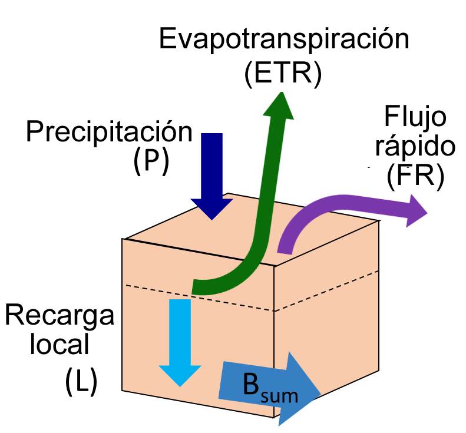
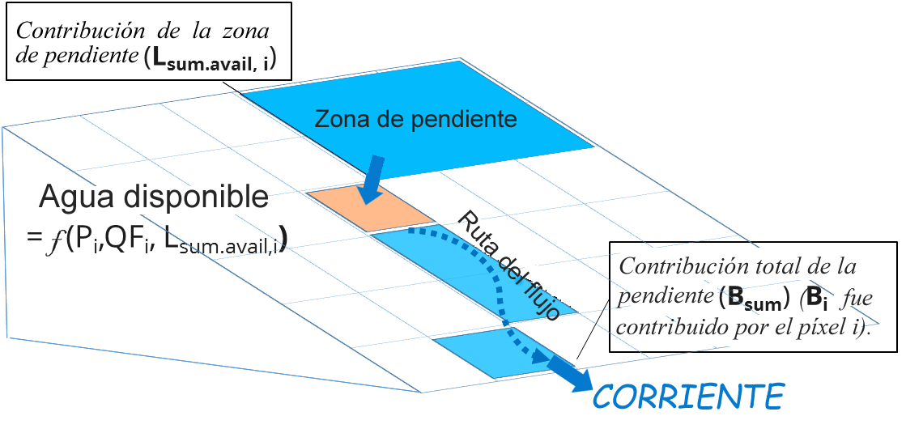

.. _seasonal_water_yield:

******************************
Rendimiento hídrico estacional
******************************

Resumen
=======

Existe una gran demanda de herramientas que estimen el efecto de la gestión del paisaje en el servicio de suministro de agua, para usos como el riego, el consumo doméstico y la producción de energía hidroeléctrica. Aunque el modelo de rendimiento hídrico anual de InVEST proporciona una estimación del rendimiento hídrico total de una cuenca, muchas aplicaciones requieren conocer los caudales estacionales, especialmente durante la estación seca. Esto requiere la comprensión de los procesos hidrológicos en una cuenca, en particular la partición entre el flujo rápido (que se produce durante o poco después de los eventos de lluvia) y el flujo de base (que se produce durante el tiempo seco). En climas muy estacionales, es probable que el flujo de base tenga más valor que el flujo rápido, a menos que se disponga de un almacenamiento significativo (por ejemplo, un gran embalse). El modelo de rendimiento hídrico estacional de InVEST pretende ofrecer una orientación sobre la contribución de las parcelas a la generación de flujos de base y flujos rápidos. El modelo calcula índices espaciales que cuantifican la contribución relativa de una parcela de tierra a la generación tanto del caudal base como del caudal rápido. En la actualidad, no existen estimaciones cuantitativas del flujo de base, solo las contribuciones relativas de los píxeles; se está desarrollando una herramienta independiente para abordar esta cuestión.

Introducción
============

Comprender el efecto de la gestión del paisaje en el flujo estacional es de vital importancia para la gestión de las cuencas hidrográficas. La contribución de una parcela determinada al flujo de la corriente depende de una serie de factores ambientales, como el clima, el suelo, la vegetación, la pendiente y la posición a lo largo de la trayectoria del flujo (lo que determina si el píxel puede recibir agua de la ladera superior o si el agua recargada puede ser evapotranspirada posteriormente).  

El agua que fluye por el paisaje se evapora, se transpira, se extrae de un pozo o sale de la cuenca en forma de flujo de aguas subterráneas profundas o de corrientes. Si consideramos un píxel individual, y su valor con respecto al rendimiento hídrico, podemos considerar dos enfoques: 

- El primero da crédito a la cantidad neta de agua generada en un píxel como igual a la precipitación entrante menos las pérdidas por evapotranspiración en ese píxel. En este esquema, es posible que la evapotranspiración real sea mayor que la precipitación si el agua se suministra al sitio desde la ladera. Así, la generación neta podría ser negativa. Este enfoque no tiene en cuenta la disposición final del agua generada en ese píxel; es decir, no considera si el agua aparece realmente como flujo de corriente o se evapora o se retira en algún punto de su recorrido.  

- El segundo enfoque da crédito al agua de una parcela que realmente aparece como flujo de corriente. Así, si una parcela genera agua que luego se evapora, la contribución se considera nula. 

El primer enfoque hace más hincapié en el uso y la cobertura del suelo de un lugar, ya que se centra en la generación neta de ese píxel. Tiene en cuenta la subvención del agua de los píxeles pendiente arriba, pero no considera los efectos pendiente abajo. Representa el *potencial* de generar flujo de corriente (no una generación real de flujo).  

El segundo enfoque pone más énfasis en la posición topográfica de un píxel, ya que eso determinará el potencial de que el agua generada en ese píxel se consuma antes de convertirse en caudal. Representa el caudal real generado por un píxel. Como el caudal real no puede ser inferior a cero, este enfoque, a diferencia del primero, dará lugar a índices mayores o iguales a cero.  

Utilizamos ambos conceptos para desarrollar un conjunto de tres índices, uno para el flujo rápido, otro para la recarga (que representa el "flujo de base potencial") y otro para el flujo de base real. Aquí, el flujo de base se define como la generación de flujo de corriente con tiempos de residencia de la cuenca de meses a años, mientras que el flujo rápido representa la generación de flujo de corriente con tiempos de residencia de la cuenca de horas a días.  

El modelo
=========

Flujo Rápido
------------

*El flujo rápido* (FR) se calcula con un enfoque basado en el número de curva (NC). Los eventos de lluvia mensuales hacen que la precipitación caiga sobre el paisaje. Las propiedades del suelo y de la cubierta del terreno determinan la cantidad de lluvia que se escurre rápidamente por la superficie del terreno (produciendo un flujo rápido) frente a la que se infiltra en el suelo (produciendo una recarga local). El número de curva es una forma sencilla de captar estas propiedades del suelo y de la cubierta del terreno: los valores más altos de NC tienen un mayor potencial de escorrentía (por ejemplo, los suelos arcillosos y la cubierta vegetal escasa), y los valores más bajos tienen más probabilidades de infiltrarse (por ejemplo, los suelos arenosos y la cubierta vegetal densa).

Para calcular el flujo rápido, utilizamos la profundidad media de los eventos, :math:`frac{P_{i,m}}{n_{i,m}}` y asumimos una distribución exponencial de las profundidades de las precipitaciones diarias en los días con lluvia,

.. math:: f\left( p \right) = \frac{1}{a_{i,m}}exp\left( - \frac{p}{a_{i,m}} \right)

Donde :math:`a_{i,m} = \frac{P_{i,m}}{n_{m}}/25.4` y

- :math:`a_{i,m}` es la profundidad media de la lluvia en un día lluvioso en el píxel
   *i* on month *m* [in],

- :math:`n_{i,m}` es el número de eventos en el píxel *i* en el mes *m*
   [-],

- :math:`P_{i,m}` es la precipitación mensual para el píxel *i* en el mes
   *m* [mm].

El flujo rápido para los píxeles situados en las corrientes se ajusta a la precipitación en ese píxel, lo que supone que no hay infiltración, solo escorrentía.

.. math:: \text{QF}_{stream,m} = \ P_{stream,m}

si no, se puede demostrar a partir de la distribución exponencial que la escorrentía mensual :math:`\text{QF}_{i,m}` es

.. math:: \text{QF}_{i,m} = n_{m} \times \left( \left( a_{i,m} - S_{i} \right)\exp\left( - \frac{0.2S_{i}}{a_{i,m}} \right) + \frac{S_{i}^{2}}{a_{i,m}}\exp\left( \frac{0.8S_{i}}{a_{i,m}} \right)E_{1}\left( \frac{S_{i}}{a_{i,m}} \right) \right) \times \left( 25.4\ \left\lbrack \frac{\text{mm}}{\text{in}} \right\rbrack \right)
	:label: (swy. 1)

donde

- :math:`S_{i} = \frac{1000}{\text{CN}_{i}} - 10` [in]

- :math:`\text{CN}_{i}` is the curve number for pixel *i*
   [in\ :sup:`-1`\], tabulados en función del LULC local, y del tipo de suelo
   *(el Apéndice I tiene una plantilla de esta tabla)*,

- :math:`E_{1}` es la función integral exponencial,
   :math:`E_{1}(x) = \int_{1}^{\infty}{\frac{e^{-xt}}{t}\text{dt}}`.

- y :math:`25.4` es un factor de conversión de pulgadas (utilizado por la ecuación) a milímetros (utilizado por el modelo)

Así, el flujo rápido anual :math:`\text{QF}_{i}`, puede calcularse a partir de la suma de los valores mensuales de :math:`\text{QF}_{i,m}`,

.. math:: \text{QF}_{i} = \sum_{m = 1}^{12}{QF_{i,m}}
	:label: (swy. 2)

Recarga local
-------------

La *recarga* *local*, o la contribución potencial al flujo de base, de un píxel se calcula a partir del balance hídrico local. La precipitación que no se escurre como flujo rápido, y que no es evapotranspirada por la vegetación de un píxel, puede infiltrarse en el suelo para convertirse en recarga local. La recarga local puede ser negativa si un píxel no recibe suficiente agua propia para satisfacer sus necesidades de vegetación (determinadas por su factor de cultivo *Kc*), por lo que utiliza también el agua generada en la ladera del píxel (lo que se denomina "subsidio pendiente arriba"). El índice de recarga local se calcula en una escala temporal anual, pero utiliza valores derivados de los presupuestos hídricos mensuales.

Para un píxel *i*, la recarga local derivada del balance hídrico anual es (Figura 1):

.. math:: L_{i} = P_{i} - \text{QF}_{i} - \text{AET}_{i}
	:label: (swy. 3)

Donde la evapotranspiración real anual ETR es la suma de la ETR mensual:

.. math:: \text{AET}_{i} = \sum_{\text{months}}^{}\text{AET}_{i,m}
	:label: (swy. 4)

Para cada mes, :math:`\text{AET}_{i,m}` está limitado por la demanda (evapotranspiración potencial - ETP) o por el agua disponible (de Allen et al. 1998):

.. math:: \text{AET}_{i,m} = min(\text{PET}_{i,m}\ ;\ P_{i,m} - \text{QF}_{i,m} + \alpha_{m}\beta_{i}L_{sum.avail,i})
	:label: (swy. 5)

Where :math:`\text{PET}_{i,m}` es la evapotranspiración potencial mensual,

.. math:: \text{PET}_{i,m} = K_{c,i,m} \times ET_{0,i,m}
	:label: (swy. 6)

:math:`L_{sum.avail,i}` se define recursivamente por (Figura 2),

.. math:: L_{sum.avail,i} = \sum_{j \in \{ neighbor\ pixels\ draining\ to\ pixel\ i\}}^{}{p_{\text{ij}} \cdot \left( L_{avail,j} + L_{sum.avail,j} \right)}
	:label: (swy. 7)

donde :math:`p_{text{ij}` en \lbrack 0,1\rbrack` es la proporción de flujo de la celda *i* a *j*, y :math:`L_{avail,i}` es la recarga disponible para un píxel, que es : math:`L_{i}` cuando :math:`L_{i}` es negativo, y una proporción :math:`\gamma` de :math:`L_{i}` cuando es positivo (véase más abajo la definición de :math:`\gamma`):

.. math:: L_{avail,i}\ = min(\gamma L_{i},L_{i})
	:label: (swy. 8)

En lo anterior:

- :math:`P_{i}` y :math:`P_{i,m}` son la precipitación 
   anual y mensual, respectivamente [mm].

- :math:`text{QF}_{i}` y :math:`text{QF}_{i,m}` son los índices de flujo rápido
   definidos anteriormente [mm]

- :math:`ET_{0,i,m}` es la evapotranspiración de referencia para el mes m
   [mm]

- :math:`K_{c,i,m}` es el factor de cultivo mensual para el LULC del píxel

- :math:`\alpha_{m}` es la fracción de la recarga anual pendiente arriba
   disponible en el mes m (por defecto es 1/12)

- :math:`\beta_{i}` es la fracción del subsidio pendiente arriba que está
   disponible para la evapotranspiración pendienre abajo (por defecto es 1; véase
   el Apéndice II con más información)

- γ es la fracción de la recarga del píxel que está disponible para los píxeles pendiente abajo
   (por defecto es 1)

Atribución de la recarga
------------------------

El flujo de base total, :math:`Q_b` (en mm), es la media de las recargas locales contribuyentes (negativas o positivas) en la cuenca,

.. math:: Q_{b} = \frac{\sum_{k \in \left\{ \text{pixels in catchment} \right\}}^{}L_{k}}{n_{\text{pixels in catchment}}}
	:label: (swy. 9)

El valor de atribución a un píxel es la contribución relativa de la recarga local :math:`L` en ese píxel al flujo de base :math:`Q_b`:

.. math:: V_{R,i} = \frac{L_{i}}{{Q_{b} \times n}_{\text{pixels in catchment}}}
	:label: (swy. 10)

|

*Figura 1. Balance hídrico a escala de píxel para calcular la recarga local (Ecuación 3), donde Bsum es el flujo que realmente llega a la corriente.*

|
|
|

*Figura 2. Recorrido a escala de ladera para calcular la evapotranspiración real (basada en las variables climáticas de cada píxel y en la contribución penduente arriba, véase la Ecuación 5) y el flujo de base (basado en Bsum, el flujo que realmente llega a la corriente, véanse las Ecuaciones 11-14)*.

|
|

Flujo base
----------

El índice de flujo base representa la contribución de un píxel al flujo base (es decir, el agua que llega a la corriente durante la estación seca). Si la recarga local es negativa, entonces el píxel no contribuyó al flujo de base, por lo que :math:`B` se establece en cero. Si el píxel contribuyó a la recarga de agua subterránea, entonces :math:`B` es una función de la cantidad de flujo que sale del píxel y de la contribución relativa a la recarga de este píxel.

Para un píxel que no es adyacente al canal de la corriente, el flujo de base acumulado, :math:`B_{sum,i}`, es proporcional al flujo de base acumulado que sale de los píxeles adyacentes pendiente abajo menos el flujo de base acumulado que se generó en ese mismo píxel pendiente abajo (Figura 2):

.. math::
   B_{sum,i} = L_{sum,i}\sum_{j \in \{\text{cells to which cell i pours}\}}^{}\begin{Bmatrix}
   p_{\text{ij}}\left( 1 - \frac{L_{avail,j}}{L_{sum,j}} \right)\frac{B_{sum,j}}{L_{sum,j} - L_{j}}\ \text{   if }j\text{ is a nonstream pixel} \\
   p_{\text{ij}}\ \text{   if }j\text{ is a stream pixel} \\
   \end{Bmatrix}
 :label: (swy. 11)

En la salida de la cuenca (o en cualquier píxel adyacente a la corriente), la suma de la generación de flujo de base :math:`B_{sum,i}` sobre todos los píxeles  pendiente arriba es igual a la suma de la generación local sobre los mismos píxeles (porque no hay más oportunidad para que el flujo lento se consuma antes de llegar a la corriente):

.. math:: B_{sum,outlet} = L_{sum,outlet}
	:label: (swy. 12)

donde :math:`L_{sum,i}` es la recarga acumulada aguas arriba definida por

.. math:: L_{sum,i} = L_{i} + \sum_{j,\ all\ pixels\ draining\ to\ pixel\ i}^{}{L_{sum,j} \cdot p_{\text{ji}}}
	:label: (swy. 13)

y el flujo de base, :math:`B_{i}` puede derivarse directamente de la proporción del flujo de base acumulado que sale de la celda *i*, con respecto a la recarga disponible a la recarga acumulada aguas arriba:

.. math:: B_{i} = max\left(B_{sum,i} \cdot \frac{L_{i}}{L_{sum,i}}, 0\right)
	:label: (swy. 14)

Limitaciones
------------

Como todos los modelos de InVEST, el Rendimiento Hídrico Estacional utiliza un enfoque simplificado para estimar el caudal rápido y el caudal base, y no incluye muchas de las complejidades que se producen cuando el agua se mueve a través de un paisaje. El caudal rápido se basa principalmente en el número de curva, que no tiene en cuenta la topografía. Para el flujo de base, aunque el modelo utiliza un enfoque basado en la física, las ecuaciones están extremadamente simplificadas tanto a escala espacial como temporal, lo que aumenta significativamente la incertidumbre sobre los números absolutos producidos. Por lo tanto, no sugerimos utilizar los valores absolutos, sino los valores relativos a través de los paisajes (donde suponemos que las simplificaciones importan menos, porque se aplican a todo el paisaje).

Calibración
-----------

Se recomienda siempre validar con datos observados si es posible. Sin embargo, si bien el resultado del flujo rápido del modelo puede utilizarse como una medida cuantitativa, el flujo de base está pensado para ser utilizado como un índice, no como un valor absoluto. Por lo tanto, es difícil combinar el flujo rápido y el flujo de base y esperar obtener resultados realistas del modelo para validar contra el flujo observado. Una posibilidad es validar los valores relativos (es decir, la distribución de los valores en el paisaje). Esto requiere varios (al menos >3, más realista >5) medidores de corrientes, que pueden ser comparados con los resultados de flujo rápido y flujo base del modelo, agregados a los mismos puntos de medidores de corrientes. Alternativamente, los resultados pueden ser comparados con un modelo espacialmente explícito diferente, si está disponible.

Si intenta validar cuantitativamente el flujo rápido o una combinación de flujo rápido y flujo de base (de nuevo, no se recomienda, pero la gente lo intenta), tenga en cuenta que, dado que los resultados están en milímetros, si simplemente los sumamos en toda el área, es probable que el resultado sea de órdenes de magnitud demasiado grandes y no represente adecuadamente el volumen total de agua. En lugar de ello, utilice el valor *medio* de B o Qf en toda la cuenca, convierta los milímetros en metros, y luego multiplique por el área de la cuenca para obtener un valor en metros cúbicos, que puede ser comparado con los datos de flujo observados. Alternativamente, se puede calcular el volumen por píxel y sumarlos.

El documento de Hamel et al. (2020) posee un ejemplo de calibración del modelo de Rendimiento Hídrico Estacional contra los datos observados y otros modelos hidrológicos. Para una orientación más general sobre la evaluación de la incertidumbre en los análisis de los servicios ecosistémicoss, véase Hamel y Bryant (2017). 

Necesidades de datos
====================

.. note:: *Todos los inputs espaciales deben tener exactamente el mismo sistema de coordenadas proyectadas* (con unidades lineales de metros), *no* un sistema de coordenadas geográficas (con unidades de grados).

.. note:: Los inputs raterizados pueden tener diferentes tamaños de celda, y serán remuestreadas para que coincidan con el tamaño de celda del MDE. Por lo tanto, todos los resultados del modelo tendrán el mismo tamaño de celda que el MDE.

- :investspec:`seasonal_water_yield.seasonal_water_yield workspace_dir`

- :investspec:`seasonal_water_yield.seasonal_water_yield results_suffix`

- :investspec:`seasonal_water_yield.seasonal_water_yield precip_dir`

  Contents:

  - :investspec:`seasonal_water_yield.seasonal_water_yield precip_dir.contents.[MONTH]`

- :investspec:`seasonal_water_yield.seasonal_water_yield et0_dir`

  Contenido:

  - :investspec:`seasonal_water_yield.seasonal_water_yield et0_dir.contents.[MONTH]`

- :investspec:`seasonal_water_yield.seasonal_water_yield dem_raster_path`

- :investspec:`seasonal_water_yield.seasonal_water_yield lulc_raster_path`

- :investspec:`seasonal_water_yield.seasonal_water_yield soil_group_path`

- :investspec:`seasonal_water_yield.seasonal_water_yield aoi_path`

- :investspec:`seasonal_water_yield.seasonal_water_yield biophysical_table_path` Una tabla .csv (valores separados por coimas que contenga la información del modelo correspondiente a cada una de las clases de uso del suelo en el ráster LULC. *Todas las clases de LULC en el ráster LULC DEBEN tener los valores correspondientes en esta tabla.* Cada fila es una clase de uso del suelo/cobertura del suelo y las columnas deben nombrarse y definirse como sigue:

  Columnas:

  - :investspec:`seasonal_water_yield.seasonal_water_yield biophysical_table_path.columns.lucode`
  - :investspec:`seasonal_water_yield.seasonal_water_yield biophysical_table_path.columns.cn_[SOIL_GROUP]`
  - :investspec:`seasonal_water_yield.seasonal_water_yield biophysical_table_path.columns.kc_[MONTH]`

- :investspec:`seasonal_water_yield.seasonal_water_yield rain_events_table_path` Un evento de lluvia se define como una precipitación >0,1mm.

  Columnas:

  - :investspec:`seasonal_water_yield.seasonal_water_yield rain_events_table_path.columns.month`
  - :investspec:`seasonal_water_yield.seasonal_water_yield rain_events_table_path.columns.events`

- :investspec:`seasonal_water_yield.seasonal_water_yield threshold_flow_accumulation`
- :investspec:`seasonal_water_yield.seasonal_water_yield alpha_m` Default value: 1/12.
- :investspec:`seasonal_water_yield.seasonal_water_yield beta_i` Default value: 1.
- :investspec:`seasonal_water_yield.seasonal_water_yield gamma` Default value: 1.

Opciones avanzadas del modelo
-----------------------------

La tabla de eventos de lluvia mensuales es una forma sencilla de proporcionar datos de eventos de lluvia. Esto supone que hay un número de este tipo para toda la cuenca, lo que puede no ser cierto para grandes áreas o áreas con precipitaciones muy variables espacialmente.

Para representar la variabilidad en el número de eventos de lluvia, es posible introducir un mapa de zonas climáticas, y el número asociado de eventos de lluvia para cada zona.

**Inputs**

- :investspec:`seasonal_water_yield.seasonal_water_yield user_defined_climate_zones`

- :investspec:`seasonal_water_yield.seasonal_water_yield climate_zone_table_path`

   Columnas:

   - :investspec:`seasonal_water_yield.seasonal_water_yield climate_zone_table_path.columns.cz_id`
   - :investspec:`seasonal_water_yield.seasonal_water_yield climate_zone_table_path.columns.[MONTH]`

- :investspec:`seasonal_water_yield.seasonal_water_yield climate_zone_raster_path`

|

El modelo calcula secuencialmente la capa de recarga local, y luego la capa de flujo base a partir de la recarga local. En lugar de que InVEST calcule la recarga local, esta capa podría obtenerse de un modelo diferente (por ejemplo, RHESSys.) Para calcular la contribución del flujo de base basada en su propia capa de recarga, es posible omitir la primera parte del modelo e introducir directamente un mapa de recarga local.

**Inputs**

- :investspec:`seasonal_water_yield.seasonal_water_yield user_defined_local_recharge`
- :investspec:`seasonal_water_yield.seasonal_water_yield l_path`

|

El parámetro *alpha* representa la variabilidad temporal de la contribución del agua disponible en la ladera a la evapotranspiración en un píxel. En la parametrización por defecto, su valor se establece en 1/12, asumiendo que el suelo amortigua la liberación de agua y que la contribución mensual es exactamente 1\12\ :sup:`th` de la contribución anual.

Para permitir que la subvención de la pendiente sea temporalmente variable, usted puede proporcionar una tabla de valores mensuales de *alpha*.

**Inputs**

- :investspec:`seasonal_water_yield.seasonal_water_yield monthly_alpha`
- :investspec:`seasonal_water_yield.seasonal_water_yield monthly_alpha_path`

Interpretación de los resultados
--------------------------------

La resolución de los rásteres de resultados será la misma que la del MDE que se proporciona como input.

* Carpeta **[Espacio de trabajo]**:

 * **Registro de parámetros**: Cada vez que se ejecute el modelo, se creará un archivo de texto (.txt) en el Espacio de Trabajo. El archivo enumerará los valores de los parámetros y los mensajes de salida para esa ejecución y se nombrará según el servicio, la fecha y la hora. Cuando se ponga en contacto con NatCap por errores en una ejecución del modelo, incluya el registro de parámetros.

 * **B_[Sufijo].tif** (tipo: ráster; unidades: mm, pero deben interpretarse como valores relativos, no absolutos): Mapa de valores de flujo base :math:`B`, la contribución de un píxel al flujo de liberación lenta (que no se evapotranspira antes de llegar a la corriente)

 * **B_sum_[Sufijo].tif** (tipo: ráster; unidades: mm, pero deben interpretarse como valores relativos, no absolutos): Mapa de valores :math:`B_{text{sum}`, el flujo que atraviesa un píxel, aportado por todos los píxeles de la ladera, que no es evapotranspirado antes de llegar a la corriente

 * **CN_[Sufijo].tif** (tipo: ráster): Mapa de los valores del número de la curva

 * **L_avail_[Sufijo].tif** (tipo: ráster; unidades: mm, pero deben interpretarse como valores relativos, no absolutos): Mapa de la recarga local disponible :math:`L_{\text{avail}}`

 * **L_[Sufijo].tif** (tipo: ráster; unidades: mm, pero deben interpretarse como valores relativos, no absolutos): Mapa de valores de recarga local :math:`L`.

 * **L_sum_avail_[Sufijo].tif** (tipo: ráster; unidades: mm, pero deben interpretarse como valores relativos, no absolutos): Mapa de los valores de :math:`L_{text{sum.avail}`, el agua disponible para un píxel, aportada por todos los píxeles de ladera, que está disponible para la evapotranspiración de este píxel

 * **L_sum_[Sufijo].tif** (tipo: ráster; unidades: mm, pero deben interpretarse como valores relativos, no absolutos): Mapa de los valores de :math:`L_{text{sum}`, el flujo a través de un píxel, aportado por todos los píxeles pendiente arriba, que está disponible para la evapotranspiración a los píxeles pendiente abajo

 * **QF_[Sufijo].tif** (tipo: ráster; unidades: mm): Mapa de valores de flujo rápido (FR)

 * **P_[Sufijo].tif** (tipo: ráster; unidades: mm/año): La precipitación total en todos los meses de este píxel

 * **Vri_[Sufijo].tif** (tipo: ráster; unidades: mm): Mapa de los valores de recarga (contribución, positiva o negativa), a la recarga total

 * **aggregated_results_swy_[Sufijo].shp**: Tabla con los valores biofísicos de cada cuenca hidrográfica, con los campos siguientes:

        * **qb** (unidades: mm, pero deben interpretarse como valores relativos, no absolutos): Valor medio de la recarga local en la cuenca
	
	* **vri_sum** (units: mm): contribución total de recarga, (positiva o negativa) dentro de la cuenca.  La suma de los valores de los píxeles de ``Vri_[Sufijo].tif`` dentro de la cuenca.

* **[Workspace]\\intermediate_outputs** folder:

 * **aet_[Sufijo].tif** (type: raster; units: mm): Mapa de evapotranspiración real (ETR)

 * **qf_1_[Sufijo].tif...qf_12_[Suffix].tif** (tipo: ráster; unidades: mm): Mapas de flujo rápido mensual (1 = enero... 12 = diciembre)

 * **stream_[Sufijo.tif** (tipo: ráster): Red de corrientes generada a partir del MDE de input y del Umbral de Acumulación de Flujo. Los valores de 1 representan corrientes, los valores de 0 son píxeles que no son corrientes.

Apéndice 1: Fuentes de datos y orientación para la selección de parámetros
==========================================================================

:ref:`Precipitation <precipitation>`
------------------------------------

:ref:`Evapotranspiration <et0>`
-------------------------------

:ref:`Digital Elevation Model <dem>`
------------------------------------

:ref:`Land Use/Land Cover <lulc>`
---------------------------------

:ref:`Soil Groups <soil_groups>`
---------------------------------

:ref:`Watersheds <watersheds>`
------------------------------

:ref:`Curve Number <cn>`
------------------------

:ref:`Kc <kc>`
--------------

:ref:`Rain Events <rain_events>`
--------------------------------

:ref:`Threshold Flow Accumulation <tfa>`
----------------------------------------

Zonas climáticas
----------------
Los datos de las zonas climáticas están disponibles en el sitio de clasificación climática de `Köppen-Geiger <http://koeppen-geiger.vu-wien.ac.at/present.htm>`_.

alpha_m
-------

Por defecto: 1/12. Ver Apéndice 2

beta_i
------

Por defecto: 1. Ver Apéndice 2

gamma
-----

Por defecto: 1. Ver Apéndice 2

|
|

Apéndice 2: Definición de los parámetros :math:`{mathbf{{alpha},\mathbf{beta}}_{mathbf{i}} y :math:`gamma` y valores alternativos
==================================================================================================================================

:math:`\alpha` y :math:`beta_{i}` representan la fracción de recarga de los píxeles de la ladera que está disponible para un píxel pendiente abajo para la evapotranspiración en un mes determinado. Se espera que el producto :math:`\alpha \times \beta_{i}` sea <1, ya que parte del agua pendiente arriba puede no estar disponible, ya sea cuando sigue trayectorias de flujo profundas o cuando el calendario de la oferta y la demanda (de evapotranspiración) no está sincronizado.

:math:`\alpha` es una función de la estacionalidad de las precipitaciones: la recarga de un mes determinado puede ser utilizada por las zonas de bajada durante los meses posteriores, dependiendo de los tiempos de recorrido del subsuelo. En la parametrización por defecto, su valor se establece en 1/12, asumiendo que el suelo amortigua la liberación de agua y que la contribución mensual es exactamente un 12\ :sup:`th` de la contribución anual. Un supuesto alternativo es fijar los valores a los valores de precipitación mensual antecedente, en relación con la precipitación total: P\ :sub:`m-1`/P\ :sub:`anual`

:math:`beta_{i}` es una función de la topografía local y de los suelos: para una cantidad dada de recarga de ladera, la cantidad de agua utilizada por un píxel es una función de la capacidad de almacenamiento. También depende de las características de la zona pendiente arriba: el uso del subsidio pendiente arriba está condicionado por la forma y la superficie de la zona de contribución (es decir, la recarga del píxel justo por encima del píxel de interés tiene menos probabilidades de perderse que los píxeles mucho más alejados).

En la parametrización por defecto, :math:`\beta` se establece en 1 para todos los píxeles. Una alternativa es establecer :math:`\beta_{i}` como TI, el índice de humedad topográfica para un píxel, definido como :math:`ln(\frac{A}{text{tan}\beta}`) (u otra formulación que incluya el tipo de suelo y la profundidad).

γ representa la fracción de la recarga del píxel que está disponible para los píxeles pendiente abajo. Es una función de las propiedades del suelo y posiblemente de la topografía. En la parametrización por defecto, γ es constante en todo el paisaje y juega un papel similar al de :math:`\alpha`.

En la práctica
--------------

Las opciones anteriores se ofrecen principalmente con fines de investigación. En la práctica, sugerimos que para los climas altamente estacionales, *alpha* debería ser establecida a los valores de precipitación mensual precedentes, en relación con la precipitación total: P\ :sub:`m-1`/P\ :sub:`anual` .

A continuación, ofrecemos dos opciones para abordar la incertidumbre en torno a los valores de los parámetros:

1. Verificación de la evapotranspiración real con las observaciones

El modelo da como resultado la evapotranspiración real en la escala temporal anual: ustedes pueden ajustar los parámetros para satisfacer la evapotranspiración real observada (por ejemplo, a partir de MODIS, https://www.ntsg.umt.edu/project/modis/mod16.php). En lo que sigue, "_mod" significa ETR (AET) modelizada, "_obs" significa ETR (AET) observada.

* Si AET\_mod > AET\_obs, el modelo predice en exceso la evapotranspiración, lo que puede corregirse reduciendo los valores *Kc*, o reduciendo los valores *gamma*, y/o los valores *beta* (para que haya menos agua disponible para cada píxel).

* Si AET\_mod < AET\_obs, el modelo no predice la evapotranspiración, lo que puede corregirse aumentando los valores de *Kc* (y aumentando los valores de *gamma* o *beta* si no están en su máximo de 1).

Si se dispone de valores mensuales de ETR, puede realizarse una calibración más fina cambiando el parámetro estacional alfa.

2. Modelización de conjuntos

El modelo puede ejecutarse bajo diferentes supuestos y los resultados pueden compararse para estimar el efecto del error de los parámetros. Los rangos de los parámetros pueden determinarse a partir de las hipótesis sobre la proporción de subvención pendiente arriba disponible para un píxel determinado; pueden establecerse en los límites máximos (0 y 1) para obtener resultados preliminares.

Referencias
===========

Allen, R.G., Pereira, L.S., Raes, D., Smith, M., 1998. Crop evapotranspiration - Guidelines for computing crop water requirements, FAO Irrigation and drainage paper 56. Roma, Italia.

Hamel, P. y Bryant, B. (2017). Uncertainty assessment in ecosystem services analyses: Seven challenges and practical responses. Ecosystem Services, Volume 24. https://doi.org/10.1016/j.ecoser.2016.12.008.

Hamel, P., Valencia, J., Schmitt, R., Shrestha, M., Piman, T., Sharp, R.P., Francesconi, W., Guswa, A.J., 2020. Modeling seasonal water yield for landscape management: Applications in Peru and Myanmar. Journal of Environmental Management 270, 110792.

NRCS-USDA, 2007. National Engineering Handbook. United States Department of Agriculture,
https://www.nrcs.usda.gov/wps/portal/nrcs/detailfull/national/water/?cid=stelprdb1043063.

