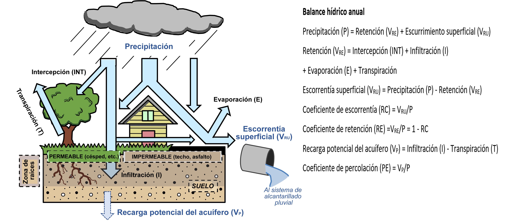
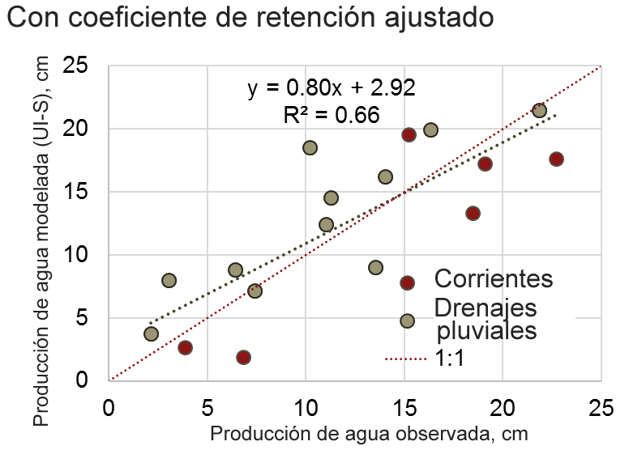
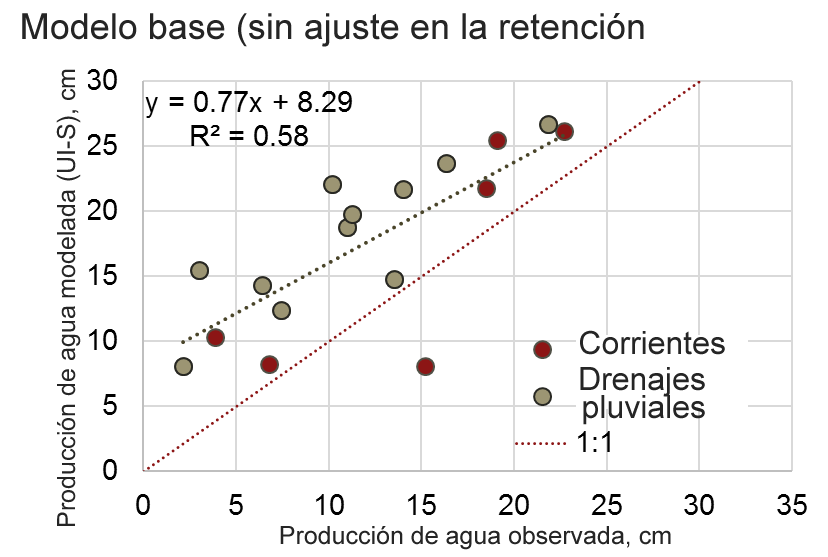

.. _stormwater:

***********************************************
Modelo de retención de aguas pluviales urbanas
***********************************************

Resumen
========

Los organismos de planificación tienen cada vez más en cuenta el manejo del agua urbana en sus estrategias para abordar cuestiones como el cambio climático, el riesgo de inundaciones o el crecimiento de la población, protegiendo al mismo tiempo el medio ambiente. El modelo de retención de escorrentía de aguas pluviales de InVEST puede apoyar este esfuerzo proporcionando información sobre dos servicios ecosistémicos relacionados con la gestión de las aguas pluviales: la retención de la escorrentía y la recarga de las aguas subterráneas (la reducción del riesgo de inundación se evalúa en un modelo separado de InVEST. La retención de la escorrentía tiene dos aspectos: la cantidad de escorrentía y su calidad. En concreto, corresponde a la retención de las aguas pluviales (escorrentía de la lluvia) por parte de los usos del suelo permeables, lo cual es beneficioso dados los efectos perjudiciales de la descarga de aguas pluviales contaminadas en los ríos o en el océano. La recarga de las aguas subterráneas es un servicio relacionado que corresponde a la percolación de las aguas pluviales más allá de la zona de las raíces, recargando potencialmente las aguas subterráneas para fines humanos y no humanos. Un resultado secundario del modelo es una estimación de la escorrentía superficial, o la parte de las aguas pluviales que no es retenida por el paisaje y que se exporta junto con los nutrientes o contaminantes asociados. Estos componentes principales del balance hídrico urbano se ilustran en :numref:`hydro-schematic`.

La retención, la recarga de las aguas subterráneas y la escorrentía superficial son estimadas por el modelo para una escala temporal anual, en lugar de la de un único evento de tormenta. Esta es la principal diferencia entre los modelos de retención de aguas pluviales y de mitigación del riesgo de inundación de InVEST: el primero está destinado a evaluar los servicios hidrológicos más generales proporcionados por el paisaje en respuesta a las precipitaciones de un año, en el que las principales preocupaciones de planificación están relacionadas con la calidad de las aguas superficiales y el suministro de agua, mientras que el segundo modelo está destinado a evaluar los servicios proporcionados por el paisaje en respuesta a un único evento de tormenta grande ("extremo"), en el que las inundaciones son la principal preocupación.

El modelo
=========

El modelo calcula el volumen anual de retención de aguas pluviales y los beneficios asociados a la calidad del agua (es decir, el transporte evitado de nutrientes o contaminantes a los lagos, arroyos o estuarios que reciben la escorrentía). El valor del servicio de retención puede calcularse utilizando un costo de reposición de la infraestructura de aguas pluviales. Opcionalmente, el modelo también puede proporcionar estimaciones de la recarga potencial de aguas subterráneas al acuífero, así como de las aguas pluviales exportadas en la escorrentía superficial (como volumen y masa de contaminantes o nutrientes). En :numref:`hydro-schematic` se muestra una visión general del balance hídrico de las aguas pluviales urbanas, que ilustra estos flujos principales de agua.

.. _hydro-schematic:

   **Principales flujos hidrológicos en el balance de las aguas pluviales urbanas**, que ilustran el destino potencial de las precipitaciones entrantes cuando caen sobre superficies permeables (suelo o vegetación, como el césped y los árboles) y superficies impermeables (tejados y superficies pavimentadas). La recarga potencial de los acuíferos se estima durante los períodos de tiempo seco como la diferencia entre el volumen de precipitación infiltrada y el volumen de agua transpirada por la vegetación en una profundidad del suelo en la que pueden encontrarse la mayoría de las raíces de las plantas.

Estimación de la retención de aguas pluviales, recarga y escorrentía
^^^^^^^^^^^^^^^^^^^^^^^^^^^^^^^^^^^^^^^^^^^^^^^^^^^^^^^^^^^^^^^^^^^^

El modelo requiere los valores de los coeficientes de escorrentía anual (:math:`RC`), y opcionalmente las tasas de percolación (:math:`PE`), para cada tipo de uso y cobertura del suelo (LULC) en la tabla biofísica. El coeficiente de escorrentía se define como la relación entre la escorrentía superficial anual y la precipitación anual, un valor entre 0 y 1, mientras que el coeficiente de percolación es la relación entre la percolación anual a las aguas subterráneas ("recarga potencial del acuífero") y la precipitación anual (:numref:`hydro-schematic`). Estos coeficientes suelen ser una función de la cobertura del suelo y de las propiedades del suelo en una cuenca hidrográfica; `Input Guidance`_ tirnr más detalles sobre la determinación de estos valores.

Para cada clase de LULC :math:`x`, el coeficiente de retención de aguas pluviales :math:`RE_x` se calcula como:

.. math:: RE_x=1-RC_x

Basándose en los rásteres del LULC y del grupo hidrológico del suelo, el modelo asigna los coeficientes de retención de aguas pluviales (:math:`RE_i`) a cada píxel :math:`i`. A continuación, el modelo calcula :math:`V_{RE,i}`, el volumen retenido (:math:`m3/a`) para cada píxel :math:`i` como:

.. math:: V_{RE_i}=0.001\cdot P_i\cdot RE_i\cdot pixel.area

donde :math:`P_i` es la precipitación anual (:math:`mm/yr`) y :math:`pixel.area` es el área del píxel en :math:`m^2`.

El volumen de escorrentía :math:`V_{RU}` (:math:`m^3/a`) se calcula a partir de los coeficientes de escorrentía (:math:`RU` o :math:`RC`): Si se selecciona la opción Ajuste de Coeficientes de Retención (véase más adelante), los coeficientes de escorrentía pueden diferir de los valores de input :math:`RC`, ya que se derivan de los coeficientes de retención (ajustados) utilizando la ecuación siguiente:

.. math:: RU_x=1-RE_x

.. math:: V_{RU,i}=0.001\cdot P_i\cdot RU_i\cdot pixel.area

Opcionalmente, si usted ha definido los coeficientes de percolación, el modelo asigna estos valores a cada píxel :math:`i` basándose en los rásteres del LULC y del grupo hidrológico del suelo, y calcula :math:`V_{P}`, el volumen de agua que se filtra a través del suelo para recargar el acuífero (:math:`m^3/a`) para cada píxel :math:`i`:

.. math:: V_{P,i}=0.001\cdot P_i\cdot PE_i\cdot pixel.area

Donde :math:`PE_i` es la tasa de percolación anual ("recarga potencial del acuífero"; :numref:`hydro-schematic`).

Ajuste del Coeficiente de Retención para los elementos impermeables conectados directamente (opcional)
^^^^^^^^^^^^^^^^^^^^^^^^^^^^^^^^^^^^^^^^^^^^^^^^^^^^^^^^^^^^^^^^^^^^^^^^^^^^^^^^^^^^^^^^^^^^^^^^^^^^^^
La retención en un píxel dado, al menos cuando se considera a escala de subcuenca agregada, debería verse afectada por la retención en los píxeles aguas arriba y aguas abajo. (Por ejemplo, el modelo actual de relación de suministro de nutrientes de InVEST tiene esto en cuenta a través de un marco de delineación de trayectorias de flujo y longitud de retención, que no es tan factible en una red de drenaje urbano debido al modo en que los desagües pluviales alteran las trayectorias de flujo superficiales y subsuperficiales). Para tener en cuenta esta retención de la escorrentía que fluye hacia los píxeles circundantes, el modelo de aguas pluviales utiliza opcionalmente una simple modificación de la retención. El coeficiente de retención, :math:`RE_{i}`, para el píxel :math:`i` se ajusta hacia arriba basándose en el valor de retención de sus píxeles vecinos dentro de un determinado radio de retención. El ajuste, :math:`C_{i}`, se aplica a la escorrentía no retenida de un determinado píxel, como sigue:

.. math:: RE^{adj}_{i} = RE_{i} + (1 - RE_{i})\cdot C_{i}
   :label: adjusted_retention_coefficient

donde :math:`RE^{adj}_{i}` es el coeficiente de retención ajustado, y el factor de ajuste :math:`C_{i}` tiene uno de los siguientes valores:

0, si el píxel :math:`i` está cerca de un área impermeable directamente conectada y/o cerca de una carretera.
Un píxel está "cerca" de un área impermeable directamente conectada si su punto central está dentro de un radio :math:`l` del punto central de un píxel cuya clase LULC está marcada como conectada (tiene un 1 en la columna ``is_connected`` de la tabla biofísica).
Un píxel está "cerca" de una carretera si su punto central está dentro de un radio :math:`l` del punto central de un píxel de carretera (determinado por la rasterización de un vector de líneas centrales de carretera)
:math:`R_{mean,i}`, de otro modo

donde :math:`R_{mean,i}` es el coeficiente de retención medio del píxel :math:`i` y sus píxeles vecinos válidos. Los píxeles "vecinos" son aquellos que no están más allá del radio de retención :math:`l` de :math:`i`, medido de centro a centro.

En otras palabras, el terreno circundante no proporciona ninguna retención adicional si el píxel se considera directamente conectado, es decir, si está cerca de un uso del suelo urbano denso o de las carreteras, que en la mayoría de las zonas urbanas están directamente conectadas a la red de drenaje mediante zanjas o tuberías subterráneas. En caso contrario, el coeficiente de retención del píxel se incrementa proporcionalmente a la retención proporcionada por sus píxeles vecinos.

**Nota 1 sobre la conectividad:** La consideración de la conectividad a la red de drenaje es algo subjetivo, pero debe ser dictada por la capa de cobertura del suelo que se utilice. Por lo tanto, la determinación de la "conectividad" se deja en sus manos, ya que las capas de uso y cobertura del suelo pueden tener más (o menos) detalles, dependiendo de la disponibilidad. La caracterización por defecto de la conectividad (véase la tabla de ejemplo en la "Orientación sonre los inputs" más abajo) se basa en la Base de Datos Nacional de la Cubierta del Suelo de los Estados Unidos (NLCD) y en suposiciones sobre la conectividad de sus categorías más "desarrolladas". Más concretamente, la NLCD cuenta con amplias categorías de intensidad de desarrollo (abierta, baja, media y alta) que son esencialmente franjas de impermeabilidad, y hemos asumido que las categorías de desarrollo "alta" y "media" estarían probablemente totalmente conectadas a los sistemas de alcantarillado de aguas pluviales (es decir, con un valor de 1 para la columna "está conectada" en la tabla biofísica), debido a que tienen más del 50% de impermeabilidad según la especificación de la NLCD. Las categorías Baja y Abierta tenían una impermeabilidad menor (<50%) y podían contener algunos tipos de cobertura, como los parques, que no estaban conectados y/o proporcionaban más retención, y se supuso que estaban efectivamente desconectados (valor de 0 para ``es_conectado``). Por último, el uso de una capa opcional de **líneas de carreteras**, un conjunto de datos comúnmente disponible para las ciudades, proporciona una clasificación adicional de los píxeles con conexión directa a la red de drenaje pluvial (un cálculo que el modelo maneja internamente).

**Nota 2 sobre el radio de retención:** El radio de retención :math:`l` es la distancia desde un píxel a partir de la cual se comprueba la conexión con la red de drenaje pluvial y/o se considera una retención adicional. Otra forma de considerar el parámetro es como la distancia máxima que puede recorrer la escorrentía por tierra en una cuenca urbana antes de encontrar un pavimento conectado o de infiltrarse completamente, y esto puede variar ligeramente dependiendo del uso del suelo. Por ejemplo, si la profundidad de un lote residencial típico es de 40 m, entonces la distancia máxima de drenaje en la parcela hasta la calle (frente) o el callejón (atrás) es de aproximadamente 20 m, y por lo tanto 20 m (o menos) podría ser un radio de retención apropiado para un uso del suelo que es principalmente residencial denso.

**Otras consideraciones:** Este enfoque produce una retención adicional en grandes áreas permeables como la agricultura, los parques, los campos de golf y los cementerios, y debería proporcionar una mayor precisión en las cuencas más desarrolladas, donde la suposición de la conexión directa de las carreteras es más probable debido a la prevalencia de las carreteras con bordillos y cunetas. Sin embargo, el enfoque puede "sobrecorregir" (subpredecir) la retención en las cuencas más rurales, especialmente en las que tienen principalmente calzadas con zanjas, en las que la suposición de conexión directa de las calzadas puede quedarse corta debido a la retención adicional que puede producirse en las zanjas debido a un mayor tiempo de residencia y/o infiltración. Además, se reconoce que este enfoque puede incurrir en algún error debido al uso de un radio de retención, en lugar de considerar la conectividad o la retención solo en la dirección descendente (la dirección en la que se movería el agua), pero la eficiencia de este enfoque probablemente compensa las posibles inexactitudes. En el Apéndice se muestra una prueba sencilla del ajuste para las cuencas hidrográficas aforadas del área metropolitana de Minneapolis-St. Paul, MN (EE.UU.) (en este estudio solo se consideraron las ocho celdas adyacentes en lugar de un radio; el modelo utiliza un radio para reducir la dependencia del tamaño de los píxeles).

Calculo de los beneficios para la calidad del agua de la retención de aguas pluviales (opcional)
^^^^^^^^^^^^^^^^^^^^^^^^^^^^^^^^^^^^^^^^^^^^^^^^^^^^^^^^^^^^^^^^^^^^^^^^^^^^^^^^^^^^^^^^^^^^^^^^^

El impacto potencial en la calidad del agua de la retención de aguas pluviales se determina como la masa contaminante asociada a las aguas pluviales retenidas, es decir, la cantidad de carga contaminante evitada. La carga contaminante anual evitada, en :math:`kg/a`, se calcula para cada píxel :math:`i` como el producto del volumen retenido (:math:`m^3/a`) y la concentración media de un contaminante (:math:`EMC`), en :math:`mg/L`:

.. math:: Avoided.load_i=0.001\cdot V_{RE,i}\cdot EMC

De modo similar, la carga anual de contaminantes (:math:`kg/a`) exportada por la escorrentía superficial se calcula a partir del volumen de escorrentía:

.. math:: Load_i=0.001\cdot V_{RU,i}\cdot EMC

Las CME de cada contaminante se asignan a las clases de uso del suelo utilizando la tabla biofísica. El nitrógeno y el fósforo son contaminantes de interés común, pero cualquier contaminante de las aguas pluviales (como los sedimentos, los metales o los compuestos orgánicos) puede utilizarse proporcionando valores de CEM para esos contaminantes en la tabla biofísica. Si no se incluye ningún contaminante, se omite este paso.

Valoración del servicio de retención de aguas pluviales (opcional)
^^^^^^^^^^^^^^^^^^^^^^^^^^^^^^^^^^^^^^^^^^^^^^^^^^^^^^^^^^^^^^^^^^

Se puede encontrar una revisión de los métodos de valoración más comunes para el servicio de retención de aguas pluviales en un informe para la administración local (Catchlove, 2020). Si existe una normativa sobre aguas pluviales, usted puede evaluar el valor de la retención de aguas pluviales con el volumen de retención objetivo como referencia. El valor económico puede evaluarse si se dispone del valor medio del dispositivo de retención (moneda/volumen).

.. math:: Retention.cost=PR\cdot V_{RE}
   :label: retention-value

Donde PR es el costo de reposición de la retención de aguas pluviales (moneda por volumen, por ejemplo, :math:`$/m^3`). Por ejemplo, Simpson y McPherson (2007) estiman que es :math:`$1,59/m^3` para las zonas urbanas de la bahía de San Francisco (California, EE.UU.).

El modelo puede generar un volumen potencial de recarga de aguas subterráneas (:math:`V_{P}`), que también puede servir como valoración de la retención. Sin embargo, el modelo no estima actualmente la carga de contaminantes asociada a este volumen de recarga, ya que el transporte subterráneo y la transformación de los contaminantes no están implementados en el modelo.

Agregación a escala de la cuenca hidrográfica (opcional)
^^^^^^^^^^^^^^^^^^^^^^^^^^^^^^^^^^^^^^^^^^^^^^^^^^^^^^^^

Usted puede proporcionar un archivo vectorial de polígonos en el que se indiquen las áreas sobre las que se van a agregar los datos (normalmente, cuencas hidrográficas o de alcantarillado). El modelo agregará los rásters de resultados para calcularlos:

- Coeficiente medio de retención de aguas pluviales (media de los valores :math:`RE`)
- Volumen total de retención, :math:`m^3` (suma de los valores de :math:`V_{RE}`)
- Carga contaminante total retenida para cada contaminante, :math:`kg/yr` (suma de los valores de :math:`Avoided.load`)
- Volumen total de escorrentía, :math:`m^3` (suma de los valores de :math:`V_{RU}`)
- Carga contaminante total de cada contaminante, :math:`kg/yr` (suma de los valores de :math:`Load`)
- Volumen total de recarga potencial, :math:`m^3` (suma de :math:`V_{P}`, si se facilitan los índices de percolación)
- Costo total de reposición, unidades monetarias (suma del costo de reposición de los servicios de retención, si se especifica el valor)

Necesidades de datos
====================

- :investspec:`stormwater workspace_dir`

- :investspec:`stormwater results_suffix`

- :investspec:`stormwater lulc_path`

- :investspec:`stormwater soil_group_path`

- :investspec:`stormwater precipitation_path`

- :investspec:`stormwater biophysical_table`

  Columnas:

    - :investspec:`stormwater biophysical_table.columns.lucode`
    - :investspec:`stormwater biophysical_table.columns.is_connected`
    - :investspec:`stormwater biophysical_table.columns.rc_a`
    - :investspec:`stormwater biophysical_table.columns.rc_b`
    - :investspec:`stormwater biophysical_table.columns.rc_c`
    - :investspec:`stormwater biophysical_table.columns.rc_d`
    - :investspec:`stormwater biophysical_table.columns.pe_a`
    - :investspec:`stormwater biophysical_table.columns.pe_b`
    - :investspec:`stormwater biophysical_table.columns.pe_c`
    - :investspec:`stormwater biophysical_table.columns.pe_d`
    - :investspec:`stormwater biophysical_table.columns.emc_[POLLUTANT]`

- :investspec:`stormwater adjust_retention_ratios`

- :investspec:`stormwater retention_radius`

- :investspec:`stormwater road_centerlines_path`

- :investspec:`stormwater replacement_cost` Disponible en estudios nacionales o regionales (por ejemplo, el informe de la Agencia de Protección del Medio Ambiente de EE.UU.: <https://www3.epa.gov/npdes/pubs/usw_d.pdf>`_). Valor representativo de 1,59 USD/m3 de Simpson y McPherson (2007).

- :investspec:`stormwater aggregate_areas_path` Las cuencas hidrográficas pueden obtenerse con el modelo DelineateIt.

Interpretación de los resultados
================================

Resultados finales
^^^^^^^^^^^^^^^^^^
Nota: a menos que se indique lo contrario, todas las tasas (por ejemplo, tasa de retención) o coeficientes (por ejemplo, coeficientes de escorrentía), ya sea a nivel de píxel o como promedios sobre una cuenca, se expresan como decimales con un valor entre 0 y 1.

- **retention_ratio.tif**: Un ráster derivado del ráster LULC y de las columnas de la tabla biofísica `RC_x`, donde el valor de cada píxel es el coeficiente de retención de aguas pluviales en esa zona

- adjusted_retention_ratio.tif** (solo si se selecciona "ajuste de tasas de retención"): Un ráster de tasas de retención ajustadas, calculadas según la ecuación :eq:`adjusted_retention_coefficient` a partir de los resultados intermedios 'adjusted_retention_ratio, ratio_average, near_road', y 'near_impervious_lulc'

- **volumen_de_retención.tif**: Mapa ráster de los volúmenes de retención en :math:`m^3/año`.

- **percolation_ratio.tif**: (si se facilitan datos de percolación) Mapa ráster de las relaciones de percolación derivadas de las referencias cruzadas de los rásteres de LULC y de los grupos de suelos con la tabla biofísica

- percolation_volume.tif**: (si se proporcionan datos de percolación) Mapa ráster de los volúmenes de percolación (recarga potencial de acuíferos) en :math:`m^3/año`.

- **runoff_ratio.tif**: Un ráster derivado del ráster de tasas de retención, donde el valor de cada píxel es la tasa de escorrentía de aguas pluviales en esa zona. Es la inversa de 'retention_ratio.tif' (:math:`runoff = 1 - retentción`).

- **runoff_volume.tif**: Mapa ráster de los volúmenes de escorrentía en :math:`m^3/año`.

- **retention_value.tif**: (si se facilitan los datos del valor) Mapa ráster del valor del agua retenida en cada píxel en :math:`currency/yr` según la ecuación :eq:`retention-value`.

- **aggregate.gpkg**: (si se proporciona el vector agregado) Mapa vectorial de los datos agregados. Es idéntico al vector de input de áreas agregadas, pero cada polígono recibe campos adicionales con los datos agregados:

    - **mean_retention_ratio**: tasa de retención media en este polígono

    - **total_retention_volume**: Volumen total de retención en este polígono en :math:`m^3/yr`.

    - **mean_runoff_ratio**: Coeficiente medio de escorrentía en este polígono

    - **total_runoff_volume**: Volumen total de escorrentía sobre este polígono en :math:`m^3/yr`

    - **mean_percolation_ratio** (si se facilitan los coeficientes de percolación): Tasa media de percolación (recarga) en este polígono

    - **total_percolation_volume** (si se facilitan las relaciones de percolación): Volumen total de la recarga potencial del acuífero en este polígono en :math:`m^3/yr`

    - **p_total_avoided_load** (para cada contaminante :math:`p`): Cantidad total evitada (retenida) de contaminante en este polígono en :math:`kg/yr`

    - **p_total_load** (para cada contaminante :math:`p`): Cantidad total de contaminante en la escorrentía de este polígono en :math:`kg/yr`

    - **total_retention_value** (si se proporcionan datos de valor): Valor total del volumen de agua retenida sobre este polígono en :math:`currency/yr`

Resultados intermedios
^^^^^^^^^^^^^^^^^^^^^^

- **lulc_aligned.tif**: Copia del ráster de input del grupo de suelos, recortado en la intersección de llos tres inputs rasterizados

- **soil_group_aligned.tif**: Copia del ráster de input del grupo de suelos, alineado con el ráster LULC y recortado en la intersección de los tres rásteres de input.

- **precipitation_aligned.tif**: Copia del ráster de input de precipitaciones, alineado con el ráster LULC y recortado en la intersección de los tres rásteres de input.

- **reprojected_centerlines.gpkg**: Copia del input del vector de líneas centrales de carreteras, reproyectada a la proyección del ráster LULC

- **rasterized_centerlines.tif**: Una versión rasterizada del vector de líneas centrales reproyectadas, donde 1 significa que el píxel es una carretera y 0 que no lo es

- **is_connected_lulc.tif**: Un ráster binario derivado del ráster LULC y de la columna "is_connected" de la tabla biofísica, donde 1 significa que el píxel tiene un tipo LULC impermeable directamente conectado, y 0 significa que no lo tiene

- **road_distance.tif**: Un ráster derivado del mapa de líneas centrales rasterizadas, donde el valor de cada píxel es su distancia mínima a un píxel de la carretera (medido de punto central a punto central)

- **connected_lulc_distance.tif**: Un ráster derivado del mapa `is_connected_lulc`, donde el valor de cada píxel es su distancia mínima a un píxel LULC impermeable conectado (medido de punto central a punto central)

- **near_road.tif**: Un ráster binario derivado del mapa `road_distance`, donde 1 significa que el píxel está dentro del radio de retención de un píxel de carretera, y 0 significa que no lo está

- **near_connected_lulc.tif**: Un ráster binario derivado del mapa `connected_lulc_distance`, donde 1 significa que el píxel está dentro del radio de retención de un píxel LULC impermeable conectado, y 0 significa que no lo está

- **search_kernel.tif**: Un ráster binario que representa el núcleo de búsqueda que se convoluciona con el ráster `retention_ratio` para calcular la proporción de retención promediada dentro del radio de retención de cada píxel

- **ratio_average.tif**: Un ráster en el que el valor de cada píxel es la media de su vecindad de píxeles en el mapa `retention_ratio`, calculado mediante la convolución del núcleo de búsqueda con el ráster de tasa de retención

.. _Input Guidance:

Orientación sobre los inputs
============================

Coeficientes de escorrentía y tasas de recarga
^^^^^^^^^^^^^^^^^^^^^^^^^^^^^^^^^^^^^^^^^^^^^^

**Uso de datos reportados:** Los coeficientes de escorrentía suelen aparecer en estudios de cuencas hidrográficas de distintos tamaños y usos del suelo (urbanos o rurales). En algunos casos, estos estudios pueden estar disponibles para los lugares en los que se va a aplicar el modelo de retención de aguas pluviales, y los coeficientes de escorrentía comunicados podrían utilizarse directamente en lugar de los valores por defecto. Sin embargo, si no se especifican por uso del suelo en los estudios disponibles, será difícil aplicarlos en el modelo y habrá que utilizar las estimaciones por defecto o las mejores estimaciones de los coeficientes de escorrentía. El resultado del modelo podría compararse con los valores indicados como paso de calibración. Si los coeficientes de escorrentía se conocen en función del tipo de LULC pero no por grupo hidrológico de suelo (GHS), como puede ser a menudo el caso, entonces especifique el mismo valor :math:`RC` para cada GHS dentro de un tipo de LULC dado (es decir, `RC_A`, `RC_B`, `RC_C`, y `RC_D` tendrán todos el mismo valor en una fila de la tabla biofísica). NO deje espacios en blanco en la tabla biofísica ni elimine las columnas necesarias (:math:`lucode`, :math:`RC_x`, :math:`PE_x`).

**Otros métodos de estimación de los coeficientes de escorrentía:** Si los coeficientes de escorrentía para cada tipo de LULC no se encuentran en estudios anteriores, pueden determinarse a partir de los siguientes enfoques:

- la calculadora de escorrentía de aguas pluviales de la EPA en los Estados Unidos (https://swcweb.epa.gov/stormwatercalculator/);

- cualquier modelo de escorrentía pluvial (a escala temporal mensual o diaria) que calcule la escorrentía pluvial y la evapotranspiración real (en mm/año) para las clases generales de LC (por ejemplo, el software SWMM; véase el ejemplo más abajo)

- el enfoque mensual utilizado en el modelo de rendimiento hídrico estacional InVEST. El modelo requiere valores mensuales de precipitación y evapotranspiración (ET) para un sitio representativo del paisaje, así como valores de Número de Curva (NC) para el método SCS-Curve Number (NRCS-USDA 2004).

Tenga en cuenta que los coeficientes de escorrentía para las cubiertas de tierra permeables y el suelo desnudo deben definirse para cada grupo hidrológico de suelo (incluso si todos tienen el mismo valor). El coeficiente de escorrentía para el agua se establece en 1.

**Estimación de los coeficientes de escorrentía (y de percolación) a partir de un modelo SWMM:** El SWMM puede utilizarse para estimar los coeficientes de escorrentía de un área de estudio utilizando una implementación sencilla del SWMM con una combinación de tipos básicos de cobertura del suelo y los cuatro grupos hidrológicos de suelos (A, B, C, D). El enfoque se describe en Hamel et al. (2021):
"El modelo [SWMM] consistía en varias cuencas sintéticas (100 m de largo, 10 m de ancho), cada una de las cuales tenía una cobertura del suelo uniforme compuesta por superficie desnuda (sin vegetación), permeable (con vegetación) o impermeable; las dos últimas categorías incluían casos con y sin dosel de árboles (por ejemplo, "permeable sin cobertura de árboles"), para un total de cinco cuencas sintéticas. Se incluyó un conjunto de estas cinco cuencas para cada uno de los cuatro grupos hidrológicos de suelos (GHS; es decir, A, B, C o D) para un total de 20 cuencas sintéticas. Ejecutamos el modelo SWMM en una simulación continua con 10 años (2008-2017) de datos climáticos locales (Aeropuerto Internacional de Minneapolis-St. Paul), utilizando los modelos de infiltración Horton y de enrutamiento de la superficie de la onda cinemática, con el deshielo y el transporte de acuíferos habilitados. Se definieron acuíferos separados para cada clase de suelo (que solo se diferenciaban en la capacidad de infiltración), y las condiciones iniciales de humedad del suelo eran medias, aunque el uso de una simulación continua de 10 años debería reducir los efectos de esta suposición. Los coeficientes de escorrentía resultantes para las clases básicas de cobertura del suelo ... se determinaron como la media de todo el período de 10 años (en lugar de una media de 10 coeficientes anuales)."

La tasa de percolación (:math:`PE`), una estimación de la recarga potencial de aguas subterráneas, también se estimó a partir de estos modelos SWMM calculando la diferencia entre la precipitación infiltrada y la evapotranspiración total por parte de la vegetación, y normalizando esta diferencia por la precipitación total.

El siguiente paso fue asignar o agregar los coeficientes de escorrentía de estos tipos básicos de cobertura del suelo del SWMM ("SW_Type" en la tabla de muestra que aparece a continuación) a los valores del coeficiente de escorrentía para todas las clases de cobertura en el ráster de inputs LULC (en este caso, los datos de cobertura del suelo NLCD). Para algunas clases, la asignación fue sencilla: por ejemplo, a las clases de la NLCD "matorrales/arbustos", "praderas" y "pastos/heno" se les asignaron los coeficientes de escorrentía para "permeable sin dosel de árboles" (`SW_Type`=3). Las clases de tipo de cobertura básica mixta (impermeable + permeable, dosel + abierta), como las clases "desarrolladas" en la NLCD, requirieron la agregación del SW_Type basándose en suposiciones de impermeabilidad y niveles de dosel. Asumimos una impermeabilidad a partir del punto medio del intervalo según la definición de la NLCD, y además asumimos un 50% de cobertura arbórea para los tipos de cobertura básicos. Como ejemplo, la clase NLCD "urbana de alta intensidad" representa zonas urbanas con un 80 - 100% de superficie impermeable total (valor nominal 90%): se le asignó un coeficiente de retención ponderado en un 90% de impermeabilidad, la mitad con cobertura arbórea (por tanto, 45% de "impermeabilidad sin dosel" (`Tipo_SW`=1) y 45% de "impermeabilidad sin dosel" (`Tipo_SW`=2)) y 10% de permeabilidad, la mitad con cobertura arbórea (por tanto, 5% de "permeabilidad sin dosel" (`Tipo_SW`=3) y 5% de "permeabilidad con dosel" (`Tipo_SW`=4)). Este enfoque produjo coeficientes de escorrentía que oscilaban entre 0,76 y 0,79 para los cuatro tipos de HSG. Los coeficientes de percolación (:math:`PE`) se asignaron a las clases de uso del suelo utilizando el mismo enfoque.

Ejemplo de tabla de Coeficiente de Escorrentía y Tasa de Percolación con valores especificados por el tipo de cobertura del suelo básico del SWMM (`SW_Type`) y el grupo hidrológico de suelo A/B/C/D (para suelo permeable y desnudo). Valores derivados de las simulaciones del SWMM utilizando 10 años de datos meteorológicos por hora (2008 - 2017) en el aeropuerto de Minneapolis-St.Paul, Estados Unidos.

.. csv-table:: **Ejemplo de coeficientes de escorrentía y percolación**
      :file: ./stormwater/example_coefficients.csv
      :header-rows: 1

Concentraciones medias de eventos contaminantes
^^^^^^^^^^^^^^^^^^^^^^^^^^^^^^^^^^^^^^^^^^^^^^^
Las concentraciones medias de eventos de contaminantes (CME) pueden ser especificadas por usted para cualquier contaminante de interés. Las CME son comúnmente reportadas en estudios y bases de datos de cuencas hidrográficas (por ejemplo, https://bmpdatabase.org), pero las concentraciones ponderadas por volumen de estudios previos serían más precisas para especificar aquí si están disponibles. Esto se debe a que los valores de CME utilizados por el modelo se aplican a los valores de escorrentía anual.

Los valores por defecto para el nitrógeno y el fósforo para las clases de uso del suelo NLCD específicas para zonas urbanas se proporcionan en la tabla biofísica de muestra anterior y se obtuvieron de la base de datos nacional de calidad de las aguas pluviales de los Estados Unidos (bmpdatabase.org/nsqd.html), que incluye datos de más de 7.000 muestras recogidas en más de 500 sitios durante los últimos 30 años en todo el país, así como de algunos resúmenes anteriores sobre usos del suelo menos desarrollados (Lin 2004; King y Balogh. 2011). Nota: Pitt et al. (2018) encontraron que los EMC en esta base de datos se vieron significativamente afectados por el uso de la tierra, la región y la temporada.

Estos datos se informan con clasificaciones genéricas de uso del suelo (por ejemplo, "residencial", "comercial", "industrial") y deben adaptarse a los tipos de LULC proporcionados por usted. A menudo, se puede utilizar un subconjunto de estos datos con información sobre la impermeabilidad total de las cuencas monitoreadas para agregar sitios por impermeabilidad, de manera similar al enfoque (descrito anteriormente) utilizado para agregar coeficientes de escorrentía para los tipos básicos de cobertura del suelo del SWMM a clases más complejas en los datos de cobertura del suelo del NLCD. Las concentraciones de nitrógeno y fósforo para las clases no urbanas pueden obtenerse de los resúmenes de la literatura, por ejemplo, Line et al. (2002), Maestre y Pitt (2005), Lin (2004), Tetra Tech (2010) y King et al. (2011).

Se le anima a que utilice los resultados de los estudios locales u otros valores bibliográficos pertinentes, según proceda, por ejemplo, http://dcstormwaterplan.org/wp-content/uploads/AppD_EMCs_FinalCBA_12222014.pdf). Por lo general, las concentraciones de contaminantes se informarán como concentraciones medias de eventos (CME). Los datos de CME son aceptables para el enfoque de estimación de carga gruesa utilizado por el modelo, pero el uso de concentraciones ponderadas por volumen, si están disponibles, proporcionaría una mayor precisión en los resultados debido al enfoque de estimar las cargas de contaminantes a partir de multiplicar el volumen de retención (o escurrimiento) por una concentración característica.

Representación de las técnicas de retención de aguas pluviales
~~~~~~~~~~~~~~~~~~~~~~~~~~~~~~~~~~~~~~~~~~~~~~~~~~~~~~~~~~~~~~

Las técnicas individuales de retención de aguas pluviales, como los biofiltros, las celdas de biorretención o las cunetas, pueden representarse mediante una única categoría LULC, con un coeficiente de escorrentía negativo, correspondiente a la profundidad de la escorrentía de la cuenca que capturan dividida por la profundidad de la precipitación en el píxel. Para ello es necesario conocer el área de captación de las técnicas.

Apéndice 1: Evaluación del ajuste del coeficiente de retención
==============================================================
**Justificación**: Una de las principales preocupaciones con el enfoque basado en la cuadrícula para la modelización del escurrimiento es que cuando se agregan los resultados a escala de la cuenca o del sitio de estudio, el escurrimiento y las cargas de retención se calculan como la suma de las cargas generadas en cada píxel - es decir, se supone que el escurrimiento generado en cada píxel entra en la red de drenaje de la cuenca, sin posibilidad de ser retenido a medida que se mueve a través de la red. Esta es una suposición justa en áreas altamente desarrolladas, donde la longitud de la trayectoria del flujo (es decir, la distancia que la escorrentía superficial viaja antes de entrar en un desagüe pluvial) probablemente no es mayor que el tamaño de los píxeles (30m en el NLCD/C-CAP de los Estados Unidos). Este era también el supuesto inherente al modelo SWMM tal como se implementó para estimar los coeficientes de escorrentía, en el que toda la escorrentía se dirigía directamente a la salida. Sin embargo, en las zonas con espacios verdes considerables, como parques, cementerios y campos de golf, y potencialmente fuera del núcleo urbano, donde el desarrollo residencial podría ser menos denso, la "conexión directa" de todas las celdas de la red constituyente conduciría a cargas y volúmenes excesivamente predecibles, ya que la retención adicional de la escorrentía podría ser proporcionada por la infiltración en las zonas permeables situadas entre los píxeles permeables y la red de drenaje pluvial. Además, la falta de enrutamiento también impide cualquier análisis de contexto en el modelo de aguas pluviales; la escorrentía que se genera en un píxel (o un conjunto de píxeles que conforman una parcela de interés, como un campo de golf) no se ve afectada por su terreno circundante, ni tiene ningún efecto sobre sus píxeles aguas abajo o vecinos. La configuración o la ubicación de los usos del suelo dentro de la cuenca de interés no influyen en el resultado, solo la cantidad total de cada uso del suelo.

Para probar el modelo de retención de aguas pluviales se utilizaron los datos de descarga de 18 cuencas hidrográficas situadas en el área metropolitana de Minneapolis-St. Paul en los EE.UU. Estos datos fueron recogidos por una serie de agencias estatales y estaban disponibles públicamente. Los lugares podían clasificarse a grandes rasgos por el régimen de flujo y el tipo de sistema que se supervisaba:
Grandes desagües pluviales supervisados por varias organizaciones de gestión de cuencas hidrográficas (Mississippi Watershed Management Organization, www.mwmo.org; Capitol Region Watershed District, www.capitolregionwd.org/monitoring-research/data/; South Washington Watershed District, wq.swwdmn.org), en los que la descarga se supervisaba anualmente, y para los que ya se habían determinado los volúmenes medios anuales de los caudales pluviales [n=10 sitios, más 1 sitio de corriente supervisada como parte del permiso de aguas pluviales];
sitios de medición de corrientes, monitoreadas por los Servicios Ambientales del Consejo Metropolitano (https://eims.metc.state.mn.us) y mantenidas por varios distritos de cuencas locales, en los cuales se determinó la descarga total anual (flujo base + flujo de tormenta) por períodos de más de 10 años [n = 6 sitios].

En el caso de los sitios de aforo de cauces (Grupo 2), en los que se ha realizado un monitoreo anual durante 6-30 años (dependiendo del sitio/jurisdicción), los datos son generalmente de alta calidad y se conocen las áreas de drenaje. Sin embargo, los volúmenes de flujo incluyen el flujo de base, lo que no permite una comparación directa con el modelo de retención de la escorrentía, aunque los sitios fueron probados como un caso de estudio. Solo se incluyeron los datos de los últimos 10 años para que la clasificación del uso del suelo utilizada para ejecutar el modelo de retención de aguas pluviales (U.S. NLCD, obtenida en 2013) fuera más o menos contemporánea con los datos de aforo; algunas de las cuencas han experimentado un desarrollo sustancial en los últimos 20-30 años.
**Los datos de input** incluían la clasificación de la cubierta del suelo NLCD de 30 m de EE.UU., información del NRCS-USDA Soil Survey, líneas de carreteras del estado de Minnesota (gisdata.mn.gov), delineaciones de drenaje y precipitaciones del Consejo Metropolitano y de los respectivos distritos de las cuencas hidrográficas, con datos adicionales de precipitaciones del aeropuerto de Minneapolis-St. Paul (recuperados del Midwest Regional Climate Center, mrcc.purdue.edu).

**Resultados:** Los resultados de la aplicación del modelo de retención de aguas pluviales a los 18 sitios de aforo de la ciudad, tanto con como sin el ajuste de retención, se muestran en las figuras siguientes. En general, la versión básica del modelo de retención de aguas pluviales tendió a sobrepredecir los volúmenes de escorrentía observados tanto para las corrientes como para los sitios de drenaje pluvial. La precisión en la simulación de los volúmenes de escorrentía mejoró mucho en general cuando se utilizó el ajuste de retención, aunque esto se debió principalmente a las mejoras en los sitios de drenaje pluvial. Como estos sitios eran generalmente más urbanos (desarrollados), la retención ajustada parece ser un método eficaz para mejorar la simulación de la conectividad relativamente compleja en las cuencas urbanas, un propósito principal del desarrollo del modelo de retención de aguas pluviales como alternativa al modelo NDR.

En las cuencas menos desarrolladas (es decir, en los sitios de las corrientes), se preveía que la supresión de la retención (la sobrepredicción de la escorrentía) podría haber sido el resultado de la suposición de la conexión directa de las carreteras; en cambio, el modelo parece haber sobrepredicho la retención (subpredicho la escorrentía) en las cuencas rurales. Dos factores pueden haber conducido a este problema: (1) los datos de las corrientes incluían el flujo de base, que no es previsto por el modelo de retención de aguas pluviales (que incluye solo la escorrentía superficial), por lo que se espera que los volúmenes simulados sean menores que los observados; y (2) la presencia de baldosas de drenaje en el uso de la tierra agrícola (o del campo de golf) podría hacer que alguna cubierta de tierra permeable estuviera más "directamente conectada" de lo que predeciría el ajuste de retención grueso.

   Comparación del rendimiento hídrico modelizado frente al observado (cm) para las coreientes y desagües pluviales del área metropolitana utilizando los coeficientes de retención ajustados.

   Comparación del rendimiento hídrico modelizado frente al observado (cm) para las corrientes y desagües pluviales del área metropolitana utilizando los coeficientes de retención por defecto.

.. csv-table:: **RMSE and MAE parameters for base and adjusted models**
   :file: ./stormwater/base_vs_adjusted.csv
   :header-rows: 1

Apéndice 2: Diferencias entre InVEST y otros modelos
====================================================

A diferencia de los modelos existentes de InVEST de rendimiento hídrico y tasa de suministro de nutrientes, el modelo de retención de aguas pluviales se ocupa principalmente de la escorrentía superficial, más que de la escorrentía total (superficial y subsuperficial), y está diseñado para ser aplicado en cuencas urbanas y en desarrollo. El modelo utiliza conjuntos de datos ráster derivados de satélites ampliamente disponibles, como la cubierta del suelo y la elevación, junto con sus inputs en forma de subcuencas objetivo o límites jurisdiccionales para la agregación de métricas (datos espaciales) y, opcionalmente, parámetros de escorrentía y calidad del agua específicos de la ubicación (datos tabulares). En este sentido, el modelo es muy similar a otras herramientas, como iTree y OpenNSPECT.

OpenNSPECT (Open-source Nonpoint Source Pollution and Erosion Comparison Tool; https://coast.noaa.gov/digitalcoast/tools/opennspect.html) es una herramienta de escenarios de calidad del agua desarrollada en 2014 por la Administración Nacional Oceánica y Atmosférica de Estados Unidos (NOAA).

Se diseñó para evaluar rápidamente los escenarios de uso del suelo y los impactos del cambio climático en la carga de agua, nutrientes y sedimentos en las cuencas hidrográficas en desarrollo. Los datos de inputs están principalmente en formato ráster, e incluyen la cobertura del suelo C-CAP o NLCD (con una resolución de 30 m), la elevación (con una resolución de hasta 1 m) y el grupo hidrológico del suelo (estudios de suelos del USDA), así como las precipitaciones a escala anual o de eventos (en cuadrícula o basadas en estaciones). La escorrentía se genera en cada píxel utilizando el método del número de curva SCS, teniendo en cuenta la cubierta del suelo y el tipo de suelo (grupo hidrológico) e incluyendo una modificación para la escorrentía anual. La masa de nutrientes (carga) exportada desde cada píxel se determina como el producto de este volumen de escorrentía y una concentración media de escorrentía de nutrientes (nitrógeno o fósforo) característica del tipo de cobertura del suelo del píxel. Se obtiene un ráster de dirección del flujo a partir de los datos de elevación, y se utiliza para producir trayectorias de flujo y delineaciones de cuencas de drenaje sobre las que se dirigen y agregan los volúmenes de escorrentía y las cargas de nutrientes.

El enfoque general para modelizar la escorrentía y la calidad del agua en el modelo propuesto es casi idéntico al de OpenNSPECT, con las siguientes diferencias:
La escorrentía se genera en cada píxel basándose en los coeficientes de escorrentía (profundidad de la escorrentía dividida por la profundidad de la precipitación) en lugar del número de curva. Los coeficientes de escorrentía son una función de la cubierta del suelo y del grupo hidrológico del suelo, y son prescritos por el modelo, pero pueden ser modificados por usted basándose en los resultados de otros modelos (por ejemplo, SWMM), datos hidrológicos locales, números de curva modificados, etc.

El modelo estima la recarga potencial de aguas subterráneas mediante el uso de un parámetro de tasa de percolación, que también está prescrito por el modelo basado en simulaciones de SWMM en cuencas de prueba, pero que puede ser modificado por usted.

Para obtener recursos adicionales para otros estudios hidrológicos, véase Beck et al. (2017).

Referencias
===========

Arkema, K. K., Griffin, R., Maldonado, S., Silver, J., Suckale, J. y Guerry, A. D. (2017). Linking social, ecological, and physical science to advance natural and nature-based protection for coastal communities. https://doi.org/10.1111/nyas.13322

Beck, N. G., Conley, G., Kanner, L. y Mathias, M. (2017). An urban runoff model designed to inform stormwater management decisions. Journal of Environmental Management, 193: 257-269. https://doi.org/10.1016/j.jenvman.2017.02.007.

Balbi, M., Lallemant, D. y Hamel, P. (2017). A flood risk framework for ecosystem services valuation: a proof-of-concept.

Hamel, P., Guerry, A.D., Polasky, S. et al. (2021). Mapping the benefits of nature in cities with the InVEST software. npj Urban Sustain 1, 25. https://doi.org/10.1038/s42949-021-00027-9

King, K.W. y Balogh, J. (2011). Stream water nutrient enrichment in a mixed-use watershed. J. Environ. Monit, 13: 721-731.

Lin, J.P. (2004). Review of published export coefficient and event mean concentration (emc) data. Wetlands Regulatory Assistance Program. ERDC TN-WRAP-04-3. Sep 2004.

Line, D.E., White, N.M., Osmond, D.L., Jennings, G.D. y Mojonnier, C.B. (2002). Water Environment Research, 74(1): 100-110.

Maestre, A. y Pitt, R. (2005). The National Stormwater Quality Database, Version 1.1: A Compilation and Analysis of NPDES Stormwater Monitoring Information. Center for Watershed Protection; Ellicott City, MD. Sep 4, 2005.

NRCS-USDA. (2004). Chapter 10. Estimation of Direct Runoff from Storm Rainfall. In United States Department of Agriculture (Ed.), Part 630 Hydrology. National Engineering Handbook. Obtenido de http://www.nrcs.usda.gov/wps/portal/nrcs/detailfull/national/water/?cid=stelprdb1043063

Pitt, R., Maestre, A. y Clary, J. (2018). The National Stormwater Quality Database (NSQD), Ver 4.02. Retrieved from http://www.bmpdatabase.org/Docs/NSQD_ver_4_brief_Feb_18_2018.pdf

Sahl, J. (2015). Economic Valuation Approaches for Ecosystem Services: a literature review to support the development of a modeling framework for valuing urban stormwater management services.

Simpson, J.R. y McPherson, E.G. (2007). San Francisco Bay Area State of the Urban Forest Final Report. Center for Urban Forest Research, USDA Forest Service Pacific Southwest Research Station. Davis, CA. Dec 2007: 92 pp.

Tetra Tech, Inc. (2010). Stormwater Best Management Practices (BMP) Performance Analysis. Prepared for U.S. E.P.A. Region 1. Fairfax, VA. 232 pp.
