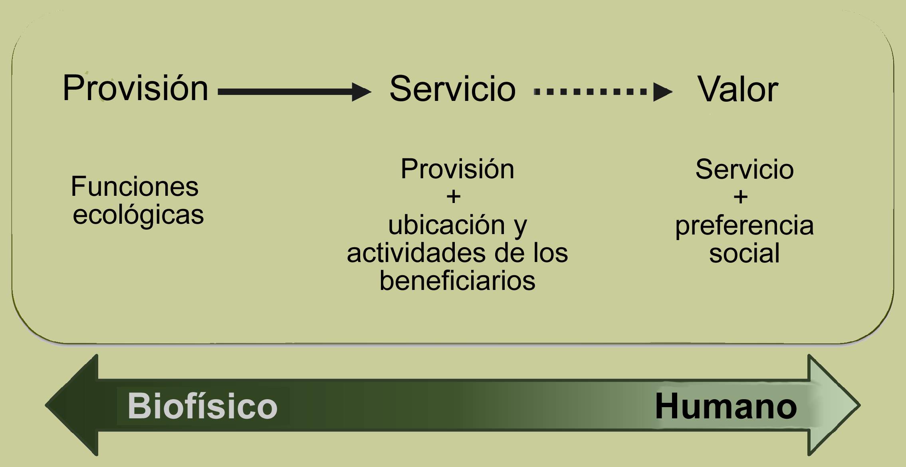
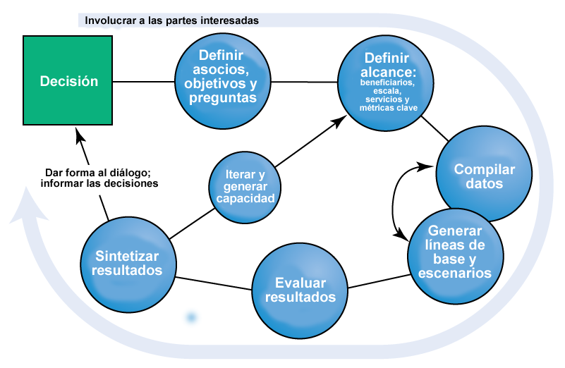

.. _the-need-for:

**********************************************************************************
Por qué necesitamos herramientas para mapear y valorar los servicios ecosistémicos
**********************************************************************************

Introducción
============

Los ecosistemas, si se gestionan adecuadamente, producen un flujo de servicios que son vitales para la humanidad, incluyendo la producción de bienes (por ejemplo, alimentos), procesos de apoyo a la vida (por ejemplo, la purificación del agua), y las condiciones de realización de la vida (por ejemplo, la belleza, las oportunidades de recreación), así como la conservación de las opciones (por ejemplo, la diversidad genética para su uso futuro). A pesar de su importancia, este capital natural no se conoce bien, apenas se controla y, en muchos casos, sufre rápida degradación y agotamiento. Para que se entiendan los valores de la naturaleza en las decisiones, el Natural Capital Alliance está desarrollando modelos que cuantifican y mapean los valores de los servicios ecosistémicos. El conjunto de modelos es el más adecuado para analizar múltiples servicios y objetivos. Los modelos actuales, que requieren pocos datos en comparación con otras herramientas más complejas, pueden identificar áreas en las que la inversión puede mejorar el bienestar humano y la naturaleza. Seguimos perfeccionando los modelos existentes y desarrollando otros nuevos.

Utilizamos la definición de la Evaluación de los Ecosistemas del Milenio (2005) del término servicios eosistémicos: "los beneficios que las personas obtienen de los ecosistemas". Los ecosistemas incorporan componentes bióticos y abióticos, por lo que consideramos que los "servicios ecosistémicos" y los "servicios medioambientales" son equivalentes. El capital natural está compuesto por los componentes vivos y no vivos de los ecosistemas que contribuyen a la prestación de sus servicios. Los activos de capital adoptan muchas formas, como el capital manufacturado (por ejemplo, edificios y máquinas), el capital humano (conocimientos, experiencia y salud), el capital social (relaciones e instituciones), así como el capital natural. 

¿Quién debe utilizar InVEST?
============================

InVEST está diseñado para informar sobre las decisiones de gestión de los recursos naturales. Básicamente, proporciona información sobre cómo los cambios en los ecosistemas pueden provocar cambios en los flujos de beneficios para las personas. Los responsables de la toma de decisiones, desde los gobiernos hasta las organizaciones sin ánimo de lucro y las empresas, suelen gestionar tierras y aguas para múltiples usos e inevitablemente deben evaluar las compensaciones entre estos usos. El diseño modular y multiservicios de InVEST constituye una herramienta eficaz para explorar los resultados probables de escenarios alternativos de gestión y clima, y para evaluar las compensaciones entre sectores y servicios. Por ejemplo, las agencias gubernamentales podrían utilizar InVEST para ayudar a determinar cómo gestionar las tierras, las costas y las áreas marinas para proporcionar una gama deseable de beneficios a las personas o para ayudar a diseñar programas de permisos y mitigación que mantengan los beneficios de la naturaleza para la sociedad. Las organizaciones conservacionistas podrían utilizar InVEST para alinear mejor sus misiones de protección de la biodiversidad con actividades que mejoren los medios de vida de las personas. Las empresas, como las de bienes de consumo, las de energías renovables y las de suministro de agua, también podrían utilizar InVEST para decidir cómo y dónde invertir en capital natural para garantizar que sus cadenas de suministro sean sostenibles y seguras.

InVEST puede ayudar a responder a preguntas como:

+ ¿Dónde se originan los servicios ecosistémicos y dónde se consumen?
+ ¿Cómo afecta un plan de gestión forestal propuesto a la biodiversidad, la calidad del agua y el ocio?
+ ¿Qué tipo de políticas de gestión costera y de pesca darán los mejores resultados para la pesca sostenible, la protección del litoral y las actividades recreativas?
+ ¿Qué partes de una cuenca hidrográfica proporcionan la mayor retención de carbono, biodiversidad y valores turísticos?
+ ¿Dónde se conseguiría con la reforestación los mayores beneficios para la calidad del agua aguas abajo, manteniendo o minimizando las pérdidas de caudales?
+ ¿Cómo afectarán el cambio climático y el crecimiento demográfico a los servicios ecosistémicos y a la biodiversidad?
+ Además de identificar ubicaciones seguras para las instalaciones de energía renovable y los alimentos procedentes de la pesca y la acuicultura, ¿qué beneficios aporta la ordenación del espacio marino a la sociedad?

Introducción a InVEST
=====================

InVEST es una herramienta para explorar el modo en que los cambios en los ecosistemas pueden conducir a cambios en los beneficios que fluyen hacia las personas. 

InVEST emplea a menudo un enfoque de función de producción para cuantificar y valorar los servicios ecosistémicos. Una función de producción especifica la producción de los servicios ecosistémicos que proporciona el medio ambiente en función de su estado y sus procesos. Una vez especificada la función de producción, podemos cuantificar el impacto de los cambios en la tierra o en el agua sobre los cambios en el nivel de producción de los servicios ecosistémicos. 

InVEST utiliza un marco sencillo que delimita "la oferta, el servicio y el valor" para vincular las funciones de producción con los beneficios proporcionados a las personas (Figura 1).

   La cadena de suministro de servicios ecosistémicos, que vincula la función ecológica con los servicios ecosistémicos y los beneficios proporcionados a las personas

La "oferta" representa lo que está potencialmente disponible en el ecosistema (es decir, lo que la estructura y la función del ecosistema pueden proporcionar). Por ejemplo, esto sería la atenuación de las olas y la consiguiente reducción de la erosión y las inundaciones en tierra que proporciona una ubicación y una densidad de manglares concretas. "Servicio" incorpora la demanda y, por tanto, utiliza información sobre quienes se benefician de ese servicio (por ejemplo, el lugar donde viven las personas, los lugares culturales importantes, las infraestructuras, etc.). "Valor" incluye la preferencia social y permite el cálculo de métricas económicas y sociales (por ejemplo, daños evitados por la erosión y las inundaciones, número de personas afectadas). 

El conjunto de herramientas de InVEST descrito en esta guía incluye modelos para cuantificar, mapear y valorar los beneficios que proporcionan los sistemas terrestres, de agua dulce y marinos. Agrupamos los modelos de InVEST en dos categorías principales: 1) modelos de servicios de apoyo y servicios finales, y 2) herramientas para facilitar el análisis de los servicios ecosistémicos. Los servicios de apoyo sustentan otros servicios ecosistémicos, pero no proporcionan directamente beneficios a las personas. Los servicios finales proporcionan beneficios directos a las personas. Para los servicios finales, dividimos los servicios en su suministro biofísico y el servicio a las personas siempre que sea posible. Para algunos servicios finales, modelizamos el servicio directamente, sin modelizar la oferta por separado. Las herramientas de apoyo incluyen la ayuda a la creación de cuencas hidrográficas, el procesamiento hidrológico en un modelo digital de elevación y la creación de escenarios que pueden utilizarse como inputs para InVEST.

Servicios ecosistémicos de apoyo:
^^^^^^^^^^^^^^^^^^^^^^^^^^^^^^^^^

+ Polinización de cultivos

+ Calidad del hábitat

+ Evaluación del riesgo para el hábitat

Servicios ecosistémicos finales:
^^^^^^^^^^^^^^^^^^^^^^^^^^^^^^^^

+ Rendimiento anual de agua

+ Almacenamiento y retención de carbono

+ Carbono azul costero

+ Vulnerabilidad costera

+ Producción de cultivos

+ Efecto de borde del carbono forestal

+ Producción de energía eólica marina

+ Proporción de suministro de sedimentos

+ Calidad escénica

+ Proporción de entrega de sedimentos

+ Rendimiento hídrico estacional

+ Enfriamiento urbano

+ Producción de cultivos

+ Acceso urbano a la naturaleza

Herramientas para facilitar el análisis de los servicios ecosistémicos:
^^^^^^^^^^^^^^^^^^^^^^^^^^^^^^^^^^^^^^^^^^^^^^^^^^^^^^^^^^^^^^^^^^^^^^^

+  Visitación: Recreación y turismo

+ Producción de energía de las olas

+ InVEST GLOBIO

Herramientas de apoyo:
^^^^^^^^^^^^^^^^^^^^^^

+  DelineateIT

+ Route DEM

+ Generador de Escenarios: Basado en la proximidad

Utilización de InVEST para la toma de decisiones
================================================

La información sobre los cambios en los servicios ecosistémicos tiene más probabilidades de marcar la diferencia cuando las preguntas son impulsadas por los responsables de la toma de decisiones y las partes interesadas, más que por los científicos y los analistas. Hemos comprobado que InVEST es más eficaz cuando se utiliza dentro de un proceso de toma de decisiones. El Natural Capital Alliance ha utilizado InVEST en más de 60 países de todo el mundo. Consulte la sección Dónde trabajamos del sitio web de NatCap (https://naturalcapitalalliance.stanford.edu/projects) para ver el mapa más reciente y la descripción de nuestros proyectos. A través de nuestra experiencia en la aplicación de InVEST y en la ayuda a la toma de decisiones, hemos visto cómo la herramienta InVEST encaja en el contexto más amplio de un enfoque de capital natural. 

Nuestro enfoque (Figura 2) comienza con una serie de consultas a las partes interesadas. Se discute y se identifican las cuestiones de interés para las personas responsables de las políticas, las comunidades y los grupos de conservación. Estas preguntas pueden referirse a la prestación de servicios en un paisaje en la actualidad y a cómo estos servicios pueden verse afectados por nuevos programas, políticas y condiciones en el futuro. Para las preguntas relativas al futuro, los interesados desarrollan *escenarios* para explorar las consecuencias de los cambios previstos en los recursos naturales. Estos escenarios suelen incluir un mapa del uso y la cobertura del suelo en el futuro o, en el caso de los modelos marinos, un mapa de los usos costeros y oceánicos y de los hábitats costeros/marinos en el futuro. Estos escenarios se evalúan en función del valor de los servicios ecosistémicos mediante modelos biofísicos y económicos que producen varios tipos de resultados. Tras las consultas con las partes interesadas y el desarrollo de escenarios, InVEST puede estimar la cantidad de servicios ecosistémicos que se prestan en el paisaje actual o en los escenarios futuros. Los modelos de InVEST son espacialmente explícitos, utilizando mapas como fuentes de información y produciendo mapas como resultados. InVEST entrega resultados en términos biofísicos, ya sean cantidades absolutas o magnitudes relativas (por ejemplo, las toneladas de sedimentos retenidos o el porcentaje de cambio en la retención de sedimentos) o en términos económicos (por ejemplo, el valor de la secuestración de carbono).

   Etapas de un enfoque del capital natural para informar la toma de decisiones.

El alcance espacial de los análisis también es flexible, lo que permite abordar cuestiones a escala local, regional o mundial. Los resultados de InVEST pueden compartirse con las partes interesadas y los responsables de la toma de decisiones que crearon los escenarios para informar sobre las próximas decisiones. El uso de InVEST es un proceso iterativo, y las partes interesadas pueden optar por crear nuevos escenarios basados en la información revelada por los modelos hasta que se identifiquen soluciones adecuadas para la acción de manejo.

En la Figura 3 se ofrecen algunos ejemplos concretos de cómo puede utilizarse el enfoque general para fundamentar distintos tipos de decisiones.

.. csv-table::
   :file: ./the_need_for/decision_context_table.csv
   :header-rows: 1

Ejemplos de cómo el Natural Capital Alliance ha utilizado el enfoque de los servicios ecosistémicos para fundamentar las decisiones en diversos contextos. Las columnas de esta tabla se corresponden con las etapas del enfoque del capital natural ilustradas en la Figura 2.

Un trabajo en curso
===================

InVEST es un producto de software gratuito con licencia Apache 2.0 de código abierto (https://www.apache.org/licenses/).

El desarrollo de InVEST es un esfuerzo continuo del Natural Capital Alliance. Publicamos versiones actualizadas del conjunto de herramientas aproximadamente cada tres meses, que pueden incluir datos científicos actualizados, mejoras en el rendimiento y las características, correcciones de errores y/o nuevos modelos. Como nota histórica, los modelos originales de InVEST se construyeron dentro de ArcGIS, pero ahora todos los modelos existen en una forma independiente que se puede lanzar directamente desde el sistema operativo Windows o Mac sin necesidad de depender de otros programas. 

Una nota sobre el versionado de InVEST: Los cambios enteros reflejarán los cambios más importantes. Por ejemplo, la transición de 2.6.0 a 3.0.0 indica una transición de los módulos Arc-GIS a la versión independiente. Un incremento en el dígito después del primer decimal indica nuevas características importantes (por ejemplo, la adición de un nuevo modelo) o revisiones importantes. El tercer decimal refleja revisiones de características menores o correcciones de errores sin nuevas funcionalidades.

Esta guía
=========

Esta guía le ayudará a comprender los fundamentos de los modelos InVEST y a empezar a utilizarlos. El siguiente capítulo le conduce a través del proceso de instalación y le proporciona información general sobre la herramienta y la interfaz.

Los capítulos restantes presentan los modelos de servicios ecosistémocos. Cada capítulo:

+ presenta brevemente un servicio y sugiere los posibles usos de los resultados de InVEST;

+ explica el funcionamiento del modelo, incluidas las simplificaciones, suposiciones y limitaciones importantes

+ describe los datos necesarios para ejecutar el modelo, lo cual es crucial porque el significado y el valor de los resultados de InVEST dependen de los datos de input;

+ proporciona instrucciones paso a paso sobre cómo introducir los datos e interactuar con la herramienta;

+ ofrece orientación sobre la interpretación de los resultados de InVEST;

+ incluye un apéndice con información sobre las fuentes de datos pertinentes y consejos para la preparación de los datos (esta sección es variable entre los capítulos, y se mejorará con el tiempo a partir de las aportaciones de los usuarios y usuarias).

Gran parte de la teoría relacionada con el fundamento científico de muchos de estos modelos puede encontrarse en el libro Natural Capital: The Theory & Practice of Mapping Ecosystem Services (Oxford University Press). Sin embargo, los modelos aplicados y discutidos en ese libro no son idénticos a los presentados en el conjunto de herramientas InVEST, y esta guía ofrece la descripción más actualizada de las versiones pesentes de los modelos.
