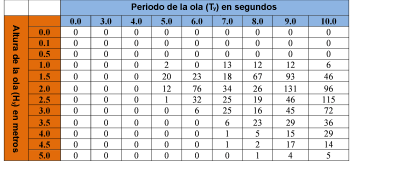
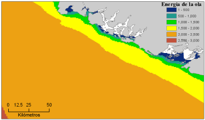
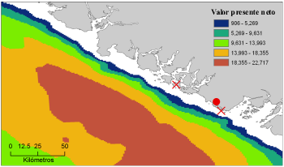
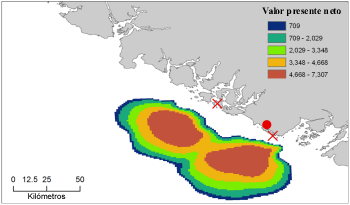

.. _wave-energy:

*********************************
Producción de energía de las olas
*********************************

Resumen
=======

Quienes toman decisiones y el público en general están cada vez más interesados en convertir la energía de las olas en electricidad, con la esperanza de que las olas del océano sean una fuente de energía limpia, segura, fiable y asequible. Los objetivos del modelo de energía de las olas (WEM) de InVEST son mapear y valorar el servicio de suministro de energía proporcionado por las olas del océano y permitir la evaluación de las compensaciones que podrían surgir al ubicar las instalaciones de conversión de energía de las olas (WEC). El WEM evalúa la potencia potencial de las olas y la energía de las olas cosechada, basándose en las condiciones de las olas (por ejemplo, la altura significativa de las olas y el período máximo de las olas) y la información específica de la tecnología de los dispositivos WEC (por ejemplo, la tabla de rendimiento y la capacidad máxima). A continuación, el modelo evalúa el valor actual neto (VAN) de la construcción y el funcionamiento de una instalación WEC durante su vida útil utilizando parámetros económicos (por ejemplo, el precio de la electricidad, la tasa de descuento, así como los costos de instalación y mantenimiento). La obtención de datos de input y parámetros precisos para la parte de valoración económica del modelo es un reto importante porque hasta la fecha no se han realizado instalaciones de energía de las olas a escala comercial. Recomendamos utilizar los valores VAN de una instalación de energía de las olas calculados con los valores por defecto solo para hacer comparaciones relativas entre sitios. Los resultados del WEM proporcionan información espacialmente explícita, mostrando las áreas potenciales para el emplazamiento de las instalaciones de energía de las olas con la mayor producción de energía y valor. Esta información específica del emplazamiento y de los dispositivos de las instalaciones de WEC puede utilizarse para identificar y cuantificar las posibles compensaciones que pueden surgir al ubicar las instalaciones de WEC. Los responsables de la toma de decisiones y las partes interesadas pueden utilizar el WEM para entender mejor dónde instalar una instalación WEC con la mayor energía de las olas cosechada y el menor efecto sobre los ecosistemas costeros y oceánicos y otros usos humanos.

Introducción
============

La energía de las olas tiene muchas características importantes para la generación eficiente de electricidad y se considera que puede contribuir de forma significativa al esfuerzo por satisfacer la creciente demanda de energía humana (Barstow et al. 2008). Entre los distintos recursos energéticos renovables, la energía de las olas es la que tiene mayor densidad de potencia y proporciona una energía relativamente continua y predecible, lo que supone ventajas importantes para el funcionamiento de la red eléctrica (Bedard et al. 2005). El costo de la electricidad generada por la energía de las olas ha disminuido desde la década de 1980 y es probable que siga disminuyendo a medida que la tecnología se desarrolle y la industria de la energía de las olas se expanda (Thorpe 1999). Teniendo en cuenta el creciente costo de la energía de los combustibles fósiles y el interés concomitante por las fuentes de energía renovables, la energía de las olas puede ser económicamente viable en un futuro próximo. En consecuencia, los responsables de la toma de decisiones y el público están cada vez más interesados en convertir la energía de las olas en electricidad con la esperanza de que las olas del océano sean una fuente de energía limpia, segura, fiable y asequible, sin emisiones significativas de gases de efecto invernadero. Con este creciente interés en la energía de las olas como recurso energético renovable, hay una creciente necesidad de un marco que ayude a los responsables de la toma de decisiones a ubicar las instalaciones de energía de las olas. El WEM que articulamos aquí proporcionará a los planificadores información que puede utilizarse para equilibrar la recolección de energía de las olas con los usos existentes de los ecosistemas marinos y costeros.

A nivel mundial, los recursos de energía de las olas explotables equivalen aproximadamente al 20% del consumo actual de electricidad en el mundo, pero su potencial varía considerablemente según la ubicación (Cornett 2008). Además, en las zonas cercanas a la costa, los "puntos calientes" (caracterizados por la condensación de la energía de las olas) ofrecen el mayor potencial de aprovechamiento de la energía de las olas (Cornett y Zhang 2008; Iglesias y Carballo 2010). Por lo tanto, la identificación de las zonas ricas en energía de las olas es el primer paso para ubicar una instalación de conversión de energía de las olas (WEC).

Se han propuesto diversas tecnologías de dispositivos WEC para capturar la energía de las olas y las características particulares de estos dispositivos desempeñan un papel fundamental a la hora de cuantificar la cantidad de energía que se puede capturar. Por lo tanto, la elección del dispositivo WEC es también un componente esencial para cosechar eficientemente la energía de las olas bajo diferentes condiciones de oleaje según la ubicación.

La valoración económica de una instalación de energía de las olas puede utilizarse para comparar los beneficios netos entre los distintos emplazamientos y las tecnologías específicas de los dispositivos. Como en la mayoría de los proyectos de energías renovables, en la valoración económica pueden incluirse muchos factores diferentes. Entre ellos se encuentran: el valor de la energía suministrada a la red eléctrica, la reducción de la contaminación asociada a los proyectos de energía de las olas en comparación con las fuentes tradicionales, los costos para los que pierden el acceso a los lugares costeros y marinos, y los costos medioambientales asociados a la construcción y el funcionamiento de estas instalaciones. En la práctica, incluir todos los beneficios y costos relevantes, especialmente los relacionados con los beneficios y costos medioambientales, puede ser difícil de medir e incluir en un análisis formal de costos y beneficios. En lugar de ignorar estos impactos potenciales, hemos adoptado un enfoque sencillo para incorporar parte de esta información en un marco que puede utilizarse en paralelo a un análisis formal de costos y beneficios.

Aunque la energía de las olas puede proporcionar energía limpia y renovable sin emisiones significativas de gases de efecto invernadero, los proyectos de energía de las olas pueden entrar en conflicto con los usos existentes del océano o con las estrategias de conservación para proteger las especies y los hábitats marinos. Las instalaciones de energía de las olas pueden afectar a las oportunidades de pesca, al hábitat pelágico y bentónico, a las actividades recreativas, a las vistas estéticas, a los entornos hidrodinámicos y de olas, a la navegación y a la bioacumulación de materiales tóxicos (Boehlert et al. 2007; Nelson et al. 2008; Thorpe 1999). Es probable que la gravedad de estos impactos potenciales sea específica del lugar. Además, dada la escasa experiencia con proyectos de energía de las olas hasta la fecha, hay pocas pruebas empíricas que describan los impactos. Por lo tanto, la identificación y evaluación de las posibles compensaciones asociadas al emplazamiento de las instalaciones de energía de las olas es un componente esencial de la planificación del espacio marino y de otras formas de toma de decisiones en entornos marinos y costeros.

El WEM que aquí se presenta evalúa: 1) la potencia potencial de las olas, 2) la energía de las olas cosechada, y 3) el valor neto actual de una instalación WEC. Los resultados del WEM proporcionan información espacialmente explícita, mostrando las áreas potenciales para el emplazamiento de las instalaciones WEC con la mayor producción de energía y beneficios. Esta información específica del lugar y de la instalación puede utilizarse para evaluar cómo el emplazamiento de una instalación CME podría influir y/o cambiar los usos costeros y marinos existentes. Por ejemplo, el WEM le permite explorar las posibles compensaciones mapeando y cuantificando la competencia espacial con los usos existentes del océano para actividades comerciales y recreativas (por ejemplo, pesca, navegación, observación de ballenas, kayak, etc.).

El modelo
=========

El objetivo del WEM es facilitar la planificación del espacio marino en el contexto de los proyectos de energía de las olas, explorando los posibles costos y beneficios de la ubicación de las instalaciones de energía de las olas. El modelo puede funcionar utilizando conjuntos de datos de input por defecto que están disponibles a nivel global y regional o con datos de input locales.

Cómo funciona
-------------

Evaluación de los recursos potenciales de potencia de las olas
^^^^^^^^^^^^^^^^^^^^^^^^^^^^^^^^^^^^^^^^^^^^^^^^^^^^^^^^^^^^^^

La potencia de las olas por unidad de anchura de la cresta de la onda transmitida por las ondas irregulares puede aproximarse así:

.. math:: P_n = {{\rho * g}\over 16} H^2_s C_g (T_e,h)
   :label: wave_power

donde, :math:`P_n` es la potencia de las olas (kW/m), :math:`\rho` es la densidad del agua del mar (1,028 kg m\ :sup:`-3`), :math:`g` es la aceleración gravitatoria (9,8 m s\ :sup:`-2`), :math:`H_s` es la altura significativa de las olas (m), y :math:`C_g` es la velocidad del grupo de olas (m s\ :sup:`-1`) en función del periodo de energía de las olas, :math:`T_e` (seg), y la profundidad del agua :math:`h` (m) (Cornett 2008). :math:`C_g` puede estimarse como

.. math:: C_g = { {\left(1 + {{2kh}\over \sinh(2kh)}\right) \sqrt{{g\over k} \tanh(kh)}}\over 2 }
   :label: wave_group_velocity

donde el número de onda :math:`k` se calcula utilizando una relación de dispersión expresada en función de la frecuencia de las olas (:math:`w = 2\pi / T_e`) y la profundidad del agua :math:`h`:

.. math:: w^2 = {gk * \tanh(kh)}
   :label: wave_freq

Puede aplicarse un esquema de solución numérica iterativa para resolver la ecuación :eq:`wave_freq` con estimaciones iniciales de :math:`k = {w^2 / {(g \cdot \sqrt{tanh(w^2 \cdot h/g)})}`. El periodo de las olas de los estados del mar medidos o modelizados rara vez se expresa como :math:`T_e`, sino que suele especificarse como periodo de pico de las olas, :math:`T_p`. Por lo tanto, el periodo de energía máxima se estima como :math:`T_e = \alpha \cdot T_p`. Donde :math:`alpha` es una constante que determina la forma del espectro de la onda. Utilizamos :math:`\alpha` = 0,90 como valor por defecto asumiendo el espectro estándar JONSWAP, que funciona bien cuando el estado del mar está dominado por las olas de una sola fuente y el espectro es unimodal (Cornett 2008). La misma suposición se aplicó también a la estimación global de los recursos de energía de las olas (Cornett 2008) y a los cálculos de la energía de las olas en la costa oeste de Canadá (Cornett y Zhang 2008; Dunnett y Wallace 2009).

Preparamos capas de datos de input disponibles a nivel mundial y regional para el cálculo de los recursos potenciales de energía de las olas. Utilizamos los resultados del reanálisis del modelo NOAA WAVEWATCH III (NWW3) (versión 2.22) para obtener las características del oleaje definidas por :math:`H_s` y :math:`T_p`. La resolución espacial del NWW3 oscila entre 4 y 60 minutos, dependiendo de los sistemas de cuadrícula global y regional. Utilizamos ETOPO1 para obtener la profundidad del agua (:math:`h`), que proporciona información batimétrica oceánica global de 1 minuto de arco (Amante y Eakins 2009). Cuando se utilizan las capas de datos de input por defecto, los resultados del modelo proporcionan la primera aproximación de los recursos potenciales de energía de las olas para cualquier zona del mundo. Sin embargo, la resolución espacial de los resultados del modelo puede no ser lo suficientemente fina como para evaluar los recursos de energía de las olas cerca de las zonas costeras. Por lo tanto, este módulo le permitirá añadir su propio input de olas basado en estudios locales (por ejemplo, resultados del modelo de olas cerca de la costa) en la próxima versión.

.. _captured-wave-energy-assessment:

Evaluación de la energía de las olas captadas
"""""""""""""""""""""""""""""""""""""""""""""
La energía de las olas capturada puede estimarse en función de los estados del mar y del rendimiento de absorción de energía de las olas de un dispositivo CME (Previsic 2004a, Previsic 2004b). Un estado del mar es el estado general de la superficie del océano y suele caracterizarse por dos parámetros, una altura de ola significativa :math:`H_s` y un periodo de pico :math:`T_p`. Los datos de series temporales de olas a largo plazo pueden utilizarse para calcular el número de horas en que se produce cada estado de mar en un periodo de tiempo determinado. Preparamos tablas de estados del mar disponibles a nivel global y regional utilizando los resultados del modelo NWW3 en intervalos de 3 horas durante un periodo de 5 años. La siguiente tabla es un ejemplo de la ocurrencia anual de horas en cada casilla del estado del maren la costa oeste de la isla de Vancouver. En este ejemplo, un estado del mar con :math:`H_s` = 2,5 m y :math:`T_p` = 10,0 seg es el más dominante, ocurriendo 115 horas por año.

   Ocurrencia de horas (hr/año) en cada casilla del estado del mar en la costa oeste de la isla de Vancouver.

La capacidad de un dispositivo CME para recoger la energía de las olas puede expresarse mediante el rendimiento de absorción de energía de las olas que está disponible en los fabricantes de dispositivos CME. Hemos realizado una revisión bibliográfica de los dispositivos CME para los que existe información pública y hemos preparado tablas de rendimiento de absorción de energía de las olas. Aunque estos dispositivos son tecnológicamente anticuados en la cambiante industria de la energía de las olas en alta mar, han sido sometidos a pruebas y verificaciones a gran escala en el océano. Actualmente, el WEM de InVEST incluye como parámetros de input por defecto tablas de rendimiento para:

+ PWP-Pelamis (Pelamis Wave Power Ltd 2010; Previsic 2004b)
+ Energetech-OWC (Previsic 2004a)
+ AquaBuOY (Dunnett y Wallace 2009)
+ WaveDragon (Dunnett y Wallace 2009)
 
.. figure:: ./wave_energy/table_energyabsorption.png
   :align: center
   :figwidth: 500px

   Rendimiento de la absorción de energía de las olas (kW) en cada casilla de esrado del mar para Pelamis.

Multiplicando cada celda de la tabla de ocurrencia anual de horas por cada celda correspondiente de la tabla de rendimiento de absorción de energía de las olas, se calcula la energía de las olas capturada para cada casilla de estado del mar. La energía de las olas capturada anualmente (kWh/año) por cada dispositivo CME se calcula sumando toda la energía de las olas capturada en cada casilla del estado del mar. Algunos dispositivos WEC tienen la capacidad de optimizar su rendimiento en respuesta a las condiciones específicas del sitio (Previsic 2004b) y puede ser necesario ajustar los parámetros por defecto de un dispositivo WEC o aplicar sus propios valores dependientes de la máquina para obtener evaluaciones más precisas de la energía de las olas capturada.

Evaluación del valor actual neto
""""""""""""""""""""""""""""""""
Utilizamos un marco de análisis costo-beneficio para evaluar la construcción y el funcionamiento de una instalación de energía de las olas. Combinamos las medidas más relevantes de los beneficios (:math:`B_t`) y los costos (:math:`C_t`) para calcular el VAN de una instalación de energía de las olas situada en un lugar concreto del espacio marino. El VAN de una instalación de energía de las olas concreta es:

.. math:: \sum^T_{t=1}{(B_t - C_t)}{(1 + i)}^{-t}
   :label: eq4

y se evalúa a lo largo de la vida útil, :math:`T`, de una instalación CME. Para descontar el valor de los beneficios y costos futuros, se requiere una tasa de descuento, :math:`i`. Los beneficios anuales se calculan como el producto del precio de la electricidad por kWh y la energía de las olas capturada anualmente en kWh [#f1]_. Suponemos que no hay ingresos en el año inicial del proyecto. Consulte la sección de valoración del modelo de energía eólica marina de InVEST para conocer la elección adecuada de una tasa de descuento y los precios de la energía. 

Los costos anuales pueden desglosarse en iniciales de instalación y anuales de explotación y mantenimiento. Los iniciales de instalación de los dispositivos de energía de las olas incluyen los siguientes costos 1) de capital por kW instalado, que depende del dispositivo, 2) de las líneas de amarre, 3) de los cables de transmisión submarina, 4) de los cables de transmisión terrestre [#f2]_. Dado que los costos totales de los cables de transmisión submarinos y terrestres dependen de la distancia de la instalación al punto de conexión a la red más cercano, el cálculo del VAN le permite evaluar la compensación entre la ubicación de una instalación en un lugar determinado por sus recursos de energía de las olas y los costos dependientes de la distancia de la instalación de los dispositivos en ese lugar. Proporcionamos tablas de parámetros económicos por defecto para la valoración económica de la energía de las olas utilizando tres de las cuatro máquinas descritas en la sección :ref:`anterior <captured-wave-energy-assessment>`: PWP-Pelamis, AquaBuOY y WaveDragon. Todos los costos se expresan en dólares estadounidenses de 2006 y deben inflarse al año base de análisis de su estudio. Véase `Kim et al. (2012) <http://dx.doi.org/10.1371/journal.pone.0047598>`_ y `Plummer y Feist (2016) <http://dx.doi.org/10.1080/08920753.2016.1208877>`_ para obtener más orientación sobre la parametrización de la parte económica del modelo.

Limitaciones y simplificaciones
-------------------------------

Algunas palabras de advertencia sobre las limitaciones y simplificaciones del modelo y orientaciones sobre su interpretación:

1. La calidad de los datos de input del oleaje determina la precisión de los resultados del modelo. Por lo tanto, usted debe comprender la calidad de los datos de input del oleaje para interpretar correctamente los resultados del WEM. Por ejemplo, los datos de input del oleaje por defecto son más apropiados para aplicaciones a escala global y regional con una resolución espacial de 4 o 60 minutos. Para un análisis más detallado de la potencia del oleaje en una región de interés, usted podría querer proporcionar los resultados del modelo de oleaje obtenidos a una resolución espacial más fina.

2. La energía de las olas capturada indica la energía media anual absorbida por cada dispositivo WEC. Para estimar la producción real de energía de un dispositivo WEC, usted tal vez necesite considerar información adicional específica de la tecnología, como la disponibilidad del dispositivo, la eficiencia de la conversión de energía y los factores direccionales. En el caso de algunos dispositivos WEC, es posible aumentar el rendimiento sin cambios significativos en la estructura del dispositivo y se pueden aplicar factores de ajuste a la tabla de rendimiento. Consulte Previsic (2004a, 2004b) para obtener más información sobre la estimación de la producción real de energía de las olas de una instalación WEC.

3. Dado que hasta la fecha no se han realizado instalaciones de energía de las olas a escala comercial, la obtención de datos de costos precisos es un reto. Proporcionamos valores por defecto para varios dispositivos de energía de las olas que están disponibles públicamente. Debido a que estos costos pueden ser inexactos y/o no estar actualizados, recomendamos que los valores VAN de una instalación de energía de las olas calculados con los valores por defecto se utilicen únicamente para hacer comparaciones relativas entre sitios. Estas comparaciones relativas pondrán de manifiesto que los recursos potenciales de energía de las olas y la distancia a la red tendrán una influencia significativa en el costo estimado del proyecto. La magnitud de los cálculos del VAN debe interpretarse con precaución.

4. Las estimaciones de costos que se facilitan están calculadas para un parque de olas de tamaño pequeño a moderado [#f3]_. Los parques más grandes probablemente experimentarían algún ahorro de costos al tener que producir más máquinas, pero también podrían requerir una mayor capacidad y/o cables de transmisión adicionales. Si se quiere simular la cantidad de energía cosechada o los costos asociados a un parqueamás grande, se deben evaluar cuidadosamente estos factores.

5. La medida de la distancia desde una instalación WEC hasta un punto de aterrizaje del cable submarino se basa en la métrica euclidiana y no reconoce ninguna masa de tierra dentro de dos puntos objetivo. Se debe tener cuidado con la estimación de la distancia en regiones con batimetría compleja.

.. _wem-data-needs:

Necesidades de datos
====================

- :investspec:`wave_energy workspace_dir`

- :investspec:`wave_energy results_suffix`

- :investspec:`wave_energy wave_base_data_path`

- :investspec:`wave_energy analysis_area` También existe la opción de seleccionar un área de interés (ADI, ver inputs opcionales más abajo). El input ADI sirve para recortar estas áreas más grandes con el fin de realizar un análisis local más detallado. Si no se especifica un ADI, el modelo realizará los cálculos de energía de las olas para toda el área de análisis. Los conjuntos de datos base para todas estas áreas se incluyen en los datos de muestra proporcionados.

- :investspec:`wave_energy machine_perf_path`

  Ejemplo:

  .. csv-table::
     :file: ../../invest-sample-data/WaveEnergy/input/Machine_Pelamis_Performance_modified.csv
     :header-rows: 1
     :widths: auto

- :investspec:`wave_energy machine_param_path`

  Columnas:

  - :investspec:`wave_energy machine_param_path.columns.name`
  - :investspec:`wave_energy machine_param_path.columns.value`

  Ejemplo:

  .. csv-table::
     :file: ../../invest-sample-data/WaveEnergy/input/Machine_Pelamis_Parameter.csv
     :header-rows: 1
     :widths: auto

- :investspec:`wave_energy dem_path` Esta información se incorpora al cálculo de la potencia de las olas potencial y a la valoración del análisis económico para determinar el costo de enviar los cables de amarre al fondo del océano antes de llevarlos a los puntos de aterrizaje. Si usted especifica un input rasterizado que no cubre la totalidad del ADI, los resultados fuera de esta área de cobertura no incluirán los cálculos de la energía de las olas. Para asegurar que el modelo se ejecuta correctamente, asegúrese de que este input cubre el área de análisis. Los datos batimétricos globales por defecto con una resolución de 1 minuto de arco se proporcionan con los datos de muestra. Si utiliza datos de input de oleaje con una resolución superior a 1 minuto de arco, le recomendamos que utilice los datos batimétricos proporcionados.

- :investspec:`wave_energy aoi_path` Proporcione este input si desea limitar aún más su área de análisis. Indica al modelo dónde recortar los datos de input y define la extensión exacta del análisis.

- :investspec:`wave_energy valuation_container`

- :investspec:`wave_energy land_gridPts_path`

  Columnas:

  - :investspec:`wave_energy land_gridPts_path.columns.id`
  - :investspec:`wave_energy land_gridPts_path.columns.type`
  - :investspec:`wave_energy land_gridPts_path.columns.lat`
  - :investspec:`wave_energy land_gridPts_path.columns.long`
  - :investspec:`wave_energy land_gridPts_path.columns.location`

- :investspec:`wave_energy machine_econ_path` Se proporcionan datos de muestra para tres máquinas diferentes. Se puede utilizar cualquier moneda, siempre que sea consistente con los diferentes insumos. Los costos de muestra se indican en dólares estadounidenses de 2006.

  Columnas:

  - :investspec:`wave_energy machine_econ_path.columns.name`
  - :investspec:`wave_energy machine_econ_path.columns.value`

  Ejemplo:

  .. csv-table::
     :file: ../../invest-sample-data/WaveEnergy/input/Machine_Pelamis_Economic.csv
     :header-rows: 1
     :widths: auto

- :investspec:`wave_energy number_of_machines` Para determinar un número razonable de máquinas a introducir, recomendamos que divida la capacidad máxima de la máquina (ver entrada #5) por la cantidad de energía capturada deseada. Por ejemplo, si desea 21.000 kW de energía de las olas capturada, entonces el parque  de energía de las olas tendría 28 Pelamis (la capacidad máxima es de 750kW), u 84 AquaBuoy (la capacidad máxima es de 250kW), o 3 WaveDragon (la capacidad máxima es de 7000kW).

.. _wave-energy-interpreting-results:

Interpretación de los resultados
================================

Resultados del modelo
---------------------

Carpeta de resultados
^^^^^^^^^^^^^^^^^^^^^

+ Output\\wp_kw & Output\\wp_rc

  + Estas capas rasterizadas representan la potencia potencial de las olas en kW/m para la extensión especificada por usted. La última ("_rc") es la primera reclasificada por cuantiles (1 = < 25%, 2 = 25-50%, 3 = 50-75%, 4 = 75-90%, 5 = > 90%). El ráster ("_rc") también va acompañado de un archivo csv que muestra los rangos de valores de cada grupo de cuantiles, así como el número de píxeles de cada grupo.
  + El mapa de potencia de las olas indica los recursos de potencia de las olas basados en las condiciones de las olas. A menudo, estos mapas constituyen el primer paso en el proceso de localización de un proyecto de energía de las olas.

+ Output\\capwe_mwh & Output\\capwe_rc

  + Estas capas rasterizadas representan la energía de las olas capturada en MWh/año por dispositivo WEC para la extensión especificada por usted. La última ("_rc") es la primera reclasificada por cuantiles (1 = < 25%, 2 = 25-50%, 3 = 50-75%, 4 = 75-90%, 5 = > 90%). El ráster ("_rc") también va acompañado de un archivo csv que muestra los rangos de valores de cada grupo de cuantiles, así como el número de píxeles de cada grupo.
  + El mapa de energía de las olas capturado proporciona información útil para comparar el rendimiento de diferentes dispositivos WEC en función de las condiciones de las olas específicas del lugar.

+ Output\\npv_usd & Output\\npv_rc

  + Estas capas rasterizadas representan el valor actual neto en miles de unidades monetarias a lo largo de los 25 años de vida de una instalación CME para la extensión especificada por  usted. La última ("_rc") es un valor positivo de la anterior reclasificado por cuantiles (1 = < 25%, 2 = 25-50%, 3 = 50-75%, 4 = 75-90%, 5 = > 90%). El ráster ("_rc") también va acompañado de un archivo csv que muestra los rangos de valores de cada grupo de cuantiles, así como el número de píxeles de cada grupo.
  + El mapa de VAN indica el valor económico de una instalación de CME compuesta por múltiples dispositivos.  Un valor positivo indica un beneficio neto; un valor negativo indica una pérdida neta. Esta información puede utilizarse para localizar posibles zonas en las que una instalación de energía de las olas puede ser económicamente viable.
  + Estos datos solo son un resultado si se ha elegido ejecutar la valoración económica.

+ Output\\LandPts_prj.shp and GridPt_prj.shp

  + These feature layers contain information on underwater cable landing location and power grid connection points.
  + The landing and grid connection points provide useful information for interpreting the NPV map.
  + It is only an output if the user chooses to run the economic valuation.

+ Parameters_[yr-mon-day-min-sec].txt

  + Cada vez que se ejecute el modelo, aparecerá un archivo de texto en la carpeta del espacio de trabajo. El archivo enumerará los valores de los parámetros para esa ejecución y se nombrará según la fecha y la hora.
  + La información del registro de parámetros puede utilizarse para identificar configuraciones detalladas de cada uno de los escenarios de simulación.

Carpeta intermedia
^^^^^^^^^^^^^^^^^^

+ intermediate\\WEM_InputOutput_Pts.shp

  + Estas capas de puntos de la cuadrícula de datos de oleaje seleccionada se basan en las entradas #2-4.
  + Contienen una variedad de información de entrada y salida, incluyendo:

    + I y J - valores de índice para los puntos de la cuadrícula de input de oleaje
    + LONG y LAT - longitud y latitud de los puntos de la cuadrícula
    + HSAVG_M - promedio de la altura de las olas [m]
    + TPAVG_S - período medio de las olas [segundos]
    + DEPTH_M - profundidad [m]
    + WE_KWM - potencia potencial de las olas [kW/m]
    + CAPWE_MWHY - energía de las olas capturada [MWh/año/dispositivo WEC]
    + W2L_MDIST - distancia euclidiana al punto de conexión de aterrizaje más cercano [m]
    + LAND_ID - ID del punto de conexión de aterrizaje más cercano
    + L2G_MDIST - distancia euclidiana desde LAND_ID hasta el punto de conexión a la red eléctrica más cercano [m]
    + UNITS - número de dispositivos WEC que se supone que hay en esta instalación WEC
    + CAPWE_ALL - energía de las olas total capturada para todas las máquinas del emplazamiento [MWh/año/instalación WEC]
    + NPV_25Y - valor actual neto del periodo de 25 años [miles de unidades de moneda]

  + Los resultados del modelo en formato raster son resultados interpolados basados en estos datos puntuales. Por lo tanto, puede utilizar esta información puntual para explorar los valores exactos de los inputs y los resultados esenciales en las ubicaciones de los puntos de datos de entrada de las olas.

+ intermediate\\GridPt.txt and LandPts.txt
  + Estos archivos de texto registran las coordenadas de la cuadrícula y del punto de aterrizaje.
  + Esto es solo un resltado intermedio si usted decide ejecutar la valoración económica.

Ejemplo de un caso que ilustra los resultados
=============================================

El siguiente ejemplo ilustra la aplicación del modelo de energía de las olas a la costa occidental de la isla de Vancouver (WCVI). Las figuras y los mapas son solo un ejemplo y no son necesariamente una representación exacta de WCVI. En este ejemplo, utilizamos capas de datos de input que incluyen:

1. Datos base de oleaje = Costa Oeste de América del Norte con resolución de 4 minutos 2. Área de interés = AOI_WCVI.shp 3. Dispositivo WEC = Pelamis 4. Modelo digital de elevación = global_dem 5. Puntos de conexión a la red eléctrica y de aterrizaje = LandGridPts_WCVI.shp 6. Número de unidades de máquinas = 28 7. Proyección = WGS 1984 UTM Proyección = WGS 1984 UTM Zona 10N.prj

Para generar una instalación de producción de energía a escala de red, es necesario capturar un mínimo de 10 kW/m de energía de las olas (Spaulding y Grilli 2010). A lo largo de la WCVI, este umbral se cumple generalmente, con una potencia media anual de las olas superior a 10 kW/m en la mayoría de las zonas. La potencia de las olas aumenta gradualmente mar adentro. Se dispone de aproximadamente 20 kW/m de potencia de las olas en un radio de 10 km de la costa, pero la máxima potencia de las olas, 30-40 kW/m, está disponible a 20-60 km de la costa donde la profundidad es > 150 m.

figure:: ./wave_energy/examplepotential350.png
   :align: center
   :figwidth: 500px

   Potencial de energía de las olas (kW/m) en la costa oeste de la isla de Vancouver.

La energía de las olas capturada en este ejemplo se ha calculado sobre la base de dispositivos Pelamis con una potencia de 750 kW. Los patrones generales de la energía de las olas capturada son similares a los de la energía potencial de las olas. Un dispositivo Pelamis situado en el contorno de profundidad de 50-70 m produce aproximadamente 2.000-2.300 MWh/año de energía. Suponiendo un uso de energía de 15 MWh/año por hogar en la WCVI (Germain 2003), cada unidad Pelamis produce suficiente energía para mantener 133-153 hogares.

   Energía de las olas capturada (MWh/año) utilizando un dispositivo Pelamis con una potencia de 750 kW.

Para la valoración económica de la energía de las olas capturada, calculamos y mapeamos el VAN a lo largo de la vida útil de 25 años de una instalación WEC. Para este modelo de ejemplo, cada una de las instalaciones WEC está compuesta por 28 dispositivos Pelamis. Utilizamos una estimación de 100.000 dólares para el costo del cable submarino y 20 centavos/kW para el precio de la electricidad. El VAN positivo se produce a partir de 5-10 km de la costa. Aumenta mar adentro y el VAN más alto (el 20% más alto de todos los valores de VAN calculados (4.668.000 dólares - 7.307.000 dólares)) se produce entre los 25 y los 90 km de la costa.

   Valor actual neto (en miles de dólares) a lo largo de una vida útil de 25 años, utilizando 100.000 dólares por kilómetro para el costo de los cables de transmisión submarinos. Los dos puntos de aterrizaje de los cables submarinos están situados en Tofino y Ucluelet (×) y el punto de conexión a la red eléctrica está situado en Ucluelet (o). Cada una de las instalaciones WEC está compuesta por 28 dispositivos Pelamis y el precio de la electricidad se fija en 20 centavos por kW.  

Dado que hasta la fecha no se han realizado instalaciones de energía de las olas a escala comercial, existen grandes incertidumbres en los parámetros económicos. En particular, el costo de los cables de transmisión submarinos es muy incierto, ya que oscila entre 100.000 y 1.000.000 de dólares por kilómetro. El VAN utiliza un límite inferior de 100.000 dólares por kilómetro para el costo del cable. Si utilizamos un costo medio de los cables de transmisión submarina (500.000 dólares por km), el área con un VAN positivo se reduce considerablemente.

En este ejemplo, el VAN positivo solo se da en un radio de 50 km alrededor de los dos puntos de desembarco de los cables submarinos en Tofino y Ucluelet. El 20% superior del VAN existe entre las distancias de 10-40 km de los dos puntos de aterrizaje. Cuando se utiliza el límite superior (1.000.000 de dólares por km) de los costos del cable de transmisión, no existe ningún VAN positivo en el WCVI. Teniendo en cuenta las incertidumbres de los parámetros económicos, hay que ser cautos a la hora de interpretar la magnitud del VAN. Recomendamos que el VAN de una instalación de energía de las olas calculado con los valores por defecto se utilice únicamente para realizar comparaciones relativas entre emplazamientos.

   Valor actual neto (en miles de dólares) a lo largo de una vida útil de 25 años, utilizando 500.000 dólares por km para el costo de los cables de transmisión submarinos. Hay dos puntos de aterrizaje de cables submarinos en Tofino y Ucluelet (×) y un punto de conexión a la red eléctrica en Ucluelet (o). Cada una de las instalaciones WEC está compuesta por 28 dispositivos Pelamis. El precio de la electricidad se fija en 20 centavos por kW.

Apéndice: Fuentes de datos
==========================

Datos del oleaje: Altura significativa de las olas (:math:`H_s`) y periodo de pico de las olas (:math:`T_p`)
------------------------------------------------------------------------------------------------------------
Los datos globales de las boyas de oleaje están disponibles en el Centro Nacional de Boyas de Datos de la NOAA (https://www.ndbc.noaa.gov/). Aunque las boyas de oleaje oceánico proporcionan los datos de series temporales de oleaje más precisos, su resolución espacial es muy gruesa y puede no ser apropiada para el análisis a escala local.

El Servicio Meteorológico Nacional de la NOAA proporciona los resultados del reanálisis del modelo WAVEWATCH III (https://polar.ncep.noaa.gov/). La resolución espacial de los resultados del modelo oscila entre 4 y 60 minutos, dependiendo de los sistemas de malla global y regional. Los resultados del modelo se han guardado en un intervalo de 3 horas desde 1999 hasta el presente. Los resultados del modelo se han validado con datos de boyas oceánicas en muchos lugares y proporcionan información de buena calidad sobre las olas.

Rendimiento de absorción de energía de las olas
-----------------------------------------------
El proyecto de conversión de energía de las olas de EPRI proporciona una revisión de varios dispositivos WEC: http://oceanenergy.epri.com/waveenergy.html. Las actualizaciones recientes sobre tecnología pueden estar disponibles de los fabricantes de dispositivos WEC:

   + PWP-Pelamis
   + AquaBuOY
   + WaveDragon: http://www.wavedragon.net/
   + DEXAWAVE: http://www.dexawave.com/

:ref:`Bathymetric DEM <bathymetry>`
-----------------------------------

Referencias
===========
Amante, C. y B. W. Eakins. 2009. ETOPO1 1 Arc-minute global relief model: procedures, data sources and analysis, p. 19. NOAA Technical Memorandum NESDIS NGDC-24.

Barstow, S., G. Mørk, D. Mollison y J. Cruz. 2008. The wave energy resource, p. 94-131. In J. Cruz [ed.], Ocean Wave Energy: current status and future perspectives. Springer.

Bedard, R., G. Hagerman, M. Previsic, O. Siddiqui, R. Thresher y B. Ram. 2005. Offshore wave power feasibility demonstration project: final summary report, p. 34. Electric Power Research Institute Inc.

Boehlert, G. W., G. R. Mcmurray y C. E. Tortorici. 2007. Ecological effects of wave energy development in the Pacific Nothwest, p. 174. U.S. Dept. Commerce, NOAA Tech. Memo.

Cornett, A. y J. Zhang. 2008. Nearshore wave energy resources, Western Vancouver Island, B.C., p. 68. Canadian Hydraulics Centre.

Cornett, A. M. 2008. A global wave energy resource assessment. Proc. ISOPE 2008.

Dunnett, D. y J. S. Wallace. 2009. Electricity generation from wave power in Canada. Renewable Energy 34: 179-195.

Germain, L. A. S. 2003. A case study of wave power integration into the Ucluelet area electrical grid. Master Thesis. University of Victoria.

Iglesias, G. y R. Carballo. 2010. Wave energy and nearshore hot spots: the case of the SE Bay of Biscay. Renewable Energy 35: 2490-2500.

Kim, C.K., J. Toft, M. Papenfus, G. Verutes, A. Guerry, M. Ruckelshaus, K. Arkema et al. 2012. Catching the right wave: evaluating wave energy resources and potential compatibility with existing marine and coastal uses. PloS one 7, no. 11: e47598.

Nelson, P. A. et al. 2008. Developing wave energy in coastal California: potential socio-economic and environmental effects, p. 182. California Energy Commission, PIER Energy-Related Environmental Research Program, and California Ocean Protection Council.

Pelamis Wave Power Ltd. 2010. Pelamis Wave Power.

Plummer, M. y B. Feist. 2016. Capturing energy from the motion of the ocean in a crowded sea. Coastal Management 44, no. 5: 1-22.

Previsic, M. 2004a. System level design, performance and costs - San Francisco California Energetech offshore wave power plant. EPRI.

---. 2004b. System level design, performance and costs for San Francisco California Pelamis offshore wave power plant, p. 73. EPRI.

Spaulding, M. L. y A. Grilli. 2010. Application of technology development index and principal component analysis and cluster methods to ocean renewable energy facility siting. Marine Technology Society Journal 44: 8-23.

Thorpe, T. W. 1999. A brief review of wave energy, p. 186. The UK department of trade and industry.

Wilson, J. H. y A. Beyene. 2007. California wave energy resource evaluation. Journal of coastal research 23: 679-690.

.. rubric:: Notas a pie de página

.. [#f1] Tanto la tasa de descuento como el precio mayorista de la electricidad son datos definidos por usted para los que proporcionamos valores de ejemplo. En muchos casos, se habla de tarifas fijas o tarifas de arranque para ayudar a promover el desarrollo de proyectos de energías renovables. 

.. [#f2] No tenemos en cuenta los costos de la infraestructura terrestre adicional que puede ser necesaria para conectar una instalación en alta mar a la red, ni los costos de autorización de un proyecto de energía de las olas. Las estimaciones de los costos de los distintos dispositivos de conversión de la energía de las olas proceden de Dunnett y Wallace (2009) y se indican en dólares estadounidenses de 2006.

.. [#f3] Wallace y Dunnett (2009) modelizan 24 dispositivos en su aplicación.
