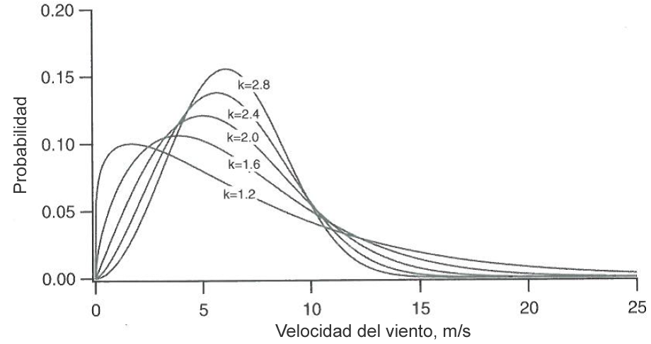
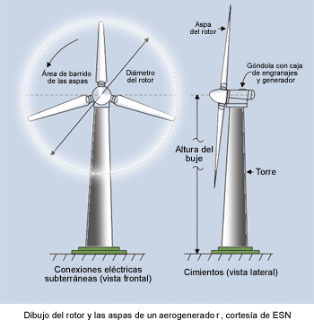
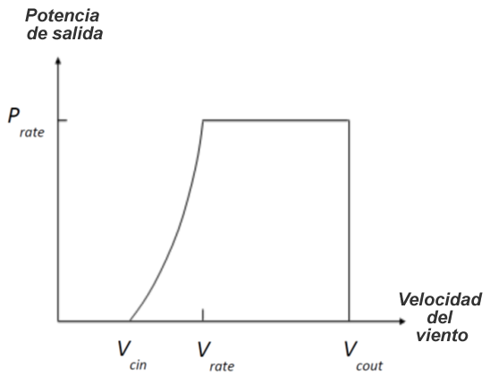
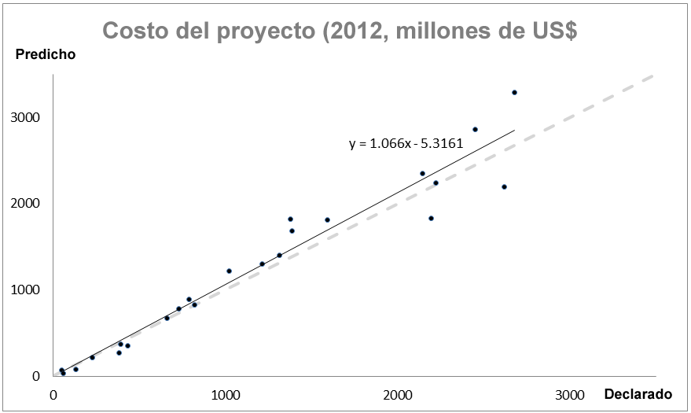

.. _wind-energy:

****************************************
Producción de energía eólica en alta mar
****************************************

.. figure:: ./wind_energy/intro_image.png
   :align: right
   :figwidth: 200pt

Resumen
=======
La energía eólica marina está ganando interés en todo el mundo, con 5.400 megavatios (MW) instalados en enero de 2013 y una tasa de crecimiento de alrededor del 25% anual (GWEC, 2013). Los vientos marinos, consistentemente más altos, y la proximidad a los centros de carga costeros son dos de las principales razones por las que los promotores de energía eólica miran hacia el mar. El objetivo del modelo de energía eólica marina InVEST es proporcionar mapas espaciales de la disponibilidad de recursos energéticos, el potencial de generación de energía y (opcionalmente) el valor de la generación de energía para permitir que se evalúen las decisiones de ubicación, las compensaciones de uso y una serie de otras cuestiones de planificación del espacio marino. El modelo se ha desarrollado para ofrecer la máxima flexibilidad a quien lo usa, ya que puede ejecutarse con datos y parámetros por defecto, pero también puede actualizarse fácilmente con nueva información sobre turbinas y cimientos, información sobre la conexión a la red y valores de los parámetros que se ajusten al contexto de quien usa el modelo. Los resultados del modelo incluyen el potencial de energía eólica, la generación de energía, las emisiones de carbono compensadas, el valor actual neto y el costo nivelado de la energía, todo ello a nivel de parque.

Las referencias revisadas por personal experto para este modelo son http://dx.doi.org/10.1016/j.aquaculture.2014.10.035 para la parte financiera del modelo y http://dx.doi.org/10.1016/j.marpol.2015.09.024 para la parte física.

Introducción
============
Este modelo de energía eólica proporciona una interfaz fácilmente manejable para evaluar la viabilidad de la energía eólica en su región bajo diferentes escenarios de diseño de parques. Los resultados son mapas rasterizados, cuyos valores puntuales representan el valor agregado de un parque centrado en ese punto. Esto permite un análisis detallado de las opciones de emplazamiento a escala fina, aunque tiene el costo de suponer que las condiciones son suficientemente simétricas alrededor del punto central para que éste represente las condiciones medias de todas las turbinas del parque. Dado que quien lo usa puede seleccionar el número de turbinas del parque, y que los mapas rasterizados no dan una indicación del tamaño del parque, el modelo también genera un polígono representativo en un punto de datos eólicos seleccionado al azar que indica el tamaño del parque.

Para ejecutar el modelo, se le pide que suministre información en la interfaz gráfica. Esto incluye información sobre las condiciones de energía eólica, el tipo de turbina, el número de turbinas, la zona de interés, etc. Para facilitar la ejecución del modelo, este incluye datos por defecto en tablas `.csv` sobre dos aerogeneradores habituales en alta mar: 3,6 MW y 5,0 MW. También se incluyen dos conjuntos de datos sobre la velocidad del viento: uno global y otro que cubre el Atlántico Noroeste. Por último, se incluye una tabla de valores por defecto que se modifican con menos frecuencia y que se utilizan para parametrizar varias partes del modelo, denominada archivo "Global Wind Energy Parameters" (Parámetros globales de la energía eólica). Estos archivos `.csv` son inputs obligatorios y pueden modificarse si se desean valores alternativos editando directamente los archivos con un editor de texto o con Microsoft Excel. Al modificar estos archivos, se recomienda hacer una copia del archivo `.csv` por defecto para no perder los valores originales.

El modelo
=========

Potencial de energía eólica
---------------------------

El modelo de energía eólica estima la densidad de potencia del viento (potencial de energía eólica) para identificar las zonas de alta mar con alto potencial energético. La densidad de potencia eólica :math:`PD (Wm^{-2}`) en un lugar determinado puede aproximarse como una función de las estadísticas del viento (Elliott et al., 1986)

.. math:: \frac{1}{2}\rho\sum^c_{j=1}f(V_j)V_j^3
   :label: wind_power_density

donde, :math:`\rho` is mean air density (:math:`kg\,m^{-3}`), :math:`j` es el índice de la clase de velocidad del viento, :math:`c` es el número de clases de velocidad del viento, :math:`V_j` es la velocidad del viento de la jª clase (:math:`ms^{-1}`), y :math:`f(V_j)` es la función de densidad de probabilidad de :math:`V_j`. En el análisis de los datos del viento se suelen utilizar dos distribuciones de probabilidad: 1) la de Rayleigh y 2) la de Weibull (Manwell et al. 2009). La distribución de Weibull puede representar mejor una mayor variedad de regímenes de viento (Celik 2003; Manwell et al. 2009), y viene dada como

.. math:: f(V_j) = \frac{k}{\lambda}\left(\frac{V_j}{\lambda}\right)^{k-1}e^{-\left(\frac{V_j}{\lambda}\right)^k}
   :label: weibull_dist

donde, :math:`k` and :math:`\lambda` son los factores de forma y escala, respectivamente. El factor de forma, :math:`k`, determina la forma de la función de densidad de probabilidad de Weibull (:numref:`weibull-fig`). La función de densidad de probabilidad muestra un pico más agudo a medida que :math:`k` aumenta, indicando que hay velocidades de viento consistentes alrededor de la velocidad media del viento. Por otro lado, la función se suaviza a medida que k disminuye, lo que indica una mayor variación de la velocidad del viento y una mayor frecuencia de velocidades bajas y altas. El modelo requiere que los inputs de la velocidad del viento se den en términos de los parámetros estimados de Weibull, en lugar de tomar los datos brutos de la velocidad del viento. Para nuestros datos de muestra utilizamos una función de MATLAB, `wblfit`, para estimar :math:`k` y :math:`lambda` a la altura de referencia de la velocidad del viento (altura a la que se observaron o estimaron las velocidades del viento), que devuelve las estimaciones de máxima verosimilitud de los parámetros de la distribución de Weibull dados los valores de los datos de la serie temporal del viento. Esto se hizo para cada punto de observación de la velocidad del viento. Para más detalles de la función `wblfit`, consulte https://kr.mathworks.com/help/stats/wblfit.html. Esto también se puede realizar en R (ver aquí el tutorial: https://stats.stackexchange.com/questions/60511/weibull-distribution-parameters-k-and-c-for-wind-speed-data).

.. _weibull-fig:

   :align: center

   Ejemplo de función de densidad de probabilidad de Weibull con varios factores de forma (:math:`k`), donde la velocidad media del viento = :math:`6 ms^{-1}` (Manwell et al., 2009).

La densidad de potencia del viento se calcula a la altura del buje :math:`Z` (m) de un aerogenerador (:numref:`weibull-fig`), lo que significa que todas las variables de :eq:`wind_power_density` y :eq:`weibull_dist` deben convertirse al valor apropiado a la altura del buje. La densidad media del aire :math:`\rho` se estimó como :math:`\rho=1,225-(1,194\cdot 10^{-4})Z`, que se aproxima al perfil de la Atmósfera Estándar de Estados Unidos para la densidad del aire (National Oceanic and Atmospheric Administration, 1976). Aplicamos la ley de potencia del perfil del viento para estimar la velocidad del viento (:math:`V`) a la altura del buje :math:`Z` (Elliott et al., 1986).

.. math:: \frac{V}{V_r} = \left(\frac{Z}{Z_r}\right)^\alpha

donde :math:`V` es la velocidad del viento (:math:`ms^{-1}`) a la altura del buje :math:`Z` (m) de un aerogenerador, y :math:`V_{r}` es la velocidad del viento (:math:`ms^{-1}`) a la altura de referencia :math:`Z_r` (m) donde se obtienen los datos del viento. :math:`\alpha` es el exponente de la ley de potencia, que es un coeficiente derivado empíricamente y varía con la estabilidad de la atmósfera. Para la condición de estabilidad neutra, ? es aproximadamente 1/7 (0,143) para las superficies terrestres, que es ampliamente aplicable para ajustar la velocidad del viento en tierra (Elliott et al., 1986). El exponente de la ley de potencia tiene un valor diferente en las superficies oceánicas. Hsu et al. (1994) encontraron que :math:`\alpha = 0,11\pm0,03` para la superficie del océano en condiciones de estabilidad atmosférica casi neutras. El modelo de energía eólica utiliza :math:`\alpha = 0,11` como valor por defecto para ajustar la velocidad del viento en la superficie del océano. El perfil del viento de la capa límite atmosférica puede aproximarse con mayor precisión utilizando la ecuación del perfil del viento logarítmico que tiene en cuenta la rugosidad de la superficie y la estabilidad atmosférica (Manwell et al. 2009).

.. _wind-turbine-fig:

   :align: center

   Diagrama esquemático de un aerogenerador (https://www.daviddarling.info/encyclopedia/H/AE_hub_height.html)

Los resultados de la densidad de potencia del viento (DP) proporcionan información sobre la idoneidad de un proyecto de desarrollo de energía eólica en términos de recurso eólico. Pacific Northwest Laboratories clasificó la densidad de potencia eólica y la velocidad del viento en siete clases basadas en el atlas eólico de Estados Unidos (:numref:`wind-power-density-fig`) (Manwell et al. 2009). Las zonas designadas como de clase 4 o superior se consideran adecuadas para la mayor parte del desarrollo de la energía eólica. Las zonas de clase 3 son adecuadas para el desarrollo de la energía eólica si se utilizan turbinas grandes. Las clases 1 y 2 rara vez se consideran zonas adecuadas para el desarrollo de la energía eólica en términos de potencial energético. Los recursos eólicos varían considerablemente en el espacio y en Europa se ha desarrollado una categorización más detallada de la densidad de potencia del viento para cinco condiciones topográficas, que incluye el terreno protegido, la llanura abierta, la costa del mar, el mar abierto, las colinas y las crestas (:numref:`wind-power-density-fig`) (Manwell et al. 2009). La clasificación del recurso eólico para la costa marítima y el mar abierto puede proporcionar una mejor información sobre la idoneidad de los proyectos de energía eólica en alta mar.

.. _wind-power-density-fig:

.. figure:: ./wind_energy/wind_power_density.png

   :align: center

   Densidad de potencia del viento (DP) y clases de velocidad del viento basadas en el atlas europeo del viento (Modificado de la Tabla 2.6 en Manwell et al. 2009).
Generación de energía
---------------------

La cantidad de energía cosechable de un aerogenerador en un lugar concreto depende de las características del aerogenerador y de las condiciones del viento (Pallabazzer 2003; Jafarian y Ranjbar 2010). El modelo de energía eólica cuantifica la energía cosechable basándose en la curva de potencia de salida de un aerogenerador y en las estadísticas de la velocidad del viento. :numref:`power-output-curve-fig` muestra una curva de potencia de salida de un aerogenerador (tipo de control de paso). El aerogenerador comienza a generar potencia a la velocidad de corte del viento (:math:`V_cin`). La potencia de salida aumenta hasta la potencia nominal (Prate) a medida que la velocidad del viento aumenta hasta la velocidad nominal (:math:`V_rate`). El aerogenerador sigue produciendo la máxima potencia (es decir, Prate) hasta que la velocidad del viento alcanza la velocidad de corte (:math:`V_cout`). Si la velocidad del viento aumenta por encima de la velocidad de corte, el aerogenerador deja de generar energía por motivos de seguridad. En la actualidad, hay más de 74 parques eólicos marinos en funcionamiento en todo el mundo y la información tecnológica específica de los aerogeneradores de cada parque eólico está disponible en LORC Knowledge (2012).

.. _power-output-curve-fig:

   :align: center

Curva de potencia de salida (P) de un aerogenerador (tipo de control de paso) en función de la velocidad del viento (V) (Modificada de la Fig.1 de Pallabazzer 2003)
Para proporcionar flexibilidad para una variedad de tipos de turbinas diferentes sin requerir que usted introduzca manualmente una curva de potencia, estimamos la potencia de salida :math:`P` (kW) de un aerogenerador utilizando un enfoque de modelizado polinómico (Jafarian y Ranjbar 2010):

.. math:: P(V) = \left\{\begin{array}{ll} 0 & V < V_{cin} \mathrm{\ or\ } V>V_{cout}\\
              P_{rate} & V_{rate} < V < V_{cout}\\
	      (V^m - V^m_{in})/(V^m_{rate} - V^m_{in}) & V_{cin} \leq V \leq V_{rate}\\
	      \end{array}\right.

donde, :math:`m` es un exponente de la curva de potencia de salida (normalmente 1 o 2). Utilizando este enfoque, la producción de energía, O (MWh), generada por un aerogenerador puede calcularse utilizando

.. math:: O = nday\cdot \frac{\rho}{\rho_0} P_{rate}\left(\int^{V_rate}_{V_{cin}} \frac{V^m - V^m_{cin}}{V^m_r-V^m_{cin}} f(V)dV
     + \int^{V_{cout}}_{V_{rate}} f(V) dV\right)(1- lossrate)

donde, :math:`nday` es el número de días para la producción de energía (por ejemplo :math:`nday = 365` días para la producción anual de energía), :math:`\rho_0` es la densidad del aire de la atmósfera estándar (por ejemplo :math:`1.225 kg m^{-3}` para la densidad del aire de la atmósfera estándar de Estados Unidos a nivel del mar), y :math:`lossrate` es un valor decimal que representa las pérdidas de energía debidas a una combinación de tiempo de inactividad, eficiencia de conversión de energía y pérdidas en la red eléctrica (el valor por defecto es 0,05). Todos estos parámetros están incluidos en el archivo de parámetros globales `.csv` y pueden ser modificados por usted a partir de sus valores predeterminados. La producción total de energía del parque es igual a la producción individual de las turbinas multiplicada por el número de turbinas, :math:`n`,

.. math:: E = nO

El software InVEST viene con información técnica y financiera por defecto sobre dos tamaños de turbina comunes, las turbinas de 3,6 MW y 5,0 MW. La información de cada turbina se presenta en archivos `.csv` en el directorio `Input` y es un dato necesario para el modelo. Se pueden utilizar los datos por defecto, editar un archivo o crear uno nuevo para evaluar diferentes tamaños de turbina o actualizar características específicas. Los archivos deben mantener el mismo formato: solo se pueden modificar los valores de los parámetros de forma segura. Se recomienda guardar las ediciones como nuevos archivos `.csv` en lugar de sobrescribir los datos por defecto.

Compensación de carbono
-----------------------

Dado que los aerogeneradores no crean gases de efecto invernadero al generar energía, usted podría estar interesado en evaluar la cantidad de emisiones de dióxido de carbono que se evitan al construir un parque eólico frente a una planta de generación de energía convencional. Para traducir la energía eólica libre de carbono en una cantidad representativa de emisiones anuales evitadas 
:math:`\mathrm{CO}_2` utilizamos el siguiente factor de conversión por defecto :math:`6.8956\cdot 10 ^{-4} \mathrm{metric\ tons\ CO}_2/kWh`
Se obtiene de la EPA (https://www.epa.gov/energy/greenhouse-gases-equivalencies-calculator-calculations-and-references) y se basa en datos de 2007. Consulte su sitio web para conocer las limitaciones de este enfoque. El parámetro es representativo del carbono emitido por la cartera energética de Estados Unidos y puede no ser apropiado para su contexto. Este valor es modificable en el archivo de parámetros globales `.csv`.

Valor de la energía
-------------------

El valor de la energía eólica se mide como los ingresos netos descontados antes de impuestos procedentes de la generación de energía que obtendría un promotor/operador de energía eólica a lo largo de la vida útil prevista de un parque eólico. El valor actual neto (https://en.wikipedia.org/wiki/Net_present_value) de la energía para un parque eólico determinado es:

.. math:: NPV = \sum^T_{t=1}(R_t-C_t)(1+i)^{-t}

Donde :math:`R_t` son los ingresos brutos recaudados en el año :math:`t`, y :math:`C_t` son los costos agregados en el año :math:`t`. :math:`T` representa la vida útil prevista de la instalación, y :math:`i` representa el tipo de descuento (https://en.wikipedia.org/wiki/Discount_rate) o costo medio ponderado del capital(WACC, https://en.wikipedia.org/wiki/Weighted_average_cost_of_capital). Tanto :math:`T` cuanto :math:`i` puede ser modificado por usted; :math:`T` pueden encontrarse en el archivo de parámetros globales `.csv` y :math:`i` se introduce en la sección de valoración de la interfaz. En el caso de los proyectos financiados tanto con deuda como con capital y en los que existe un riesgo importante asociado al establecimiento y mantenimiento del flujo de ingresos previsto, el WACC es un método más apropiado para establecer el valor temporal del dinero. Como este parámetro entra en el cálculo de la misma manera que lo haría un tipo de descuento, si lo prefiere puede introducir un tipo de descuento adecuado e interpretar los resultados en consecuencia. No proporcionamos un valor por defecto, pero Levitt et al. (2011) sugieren un valor de WACC de 0,116 basado en un análisis exhaustivo de las tasas de descuento específicas del sector y de las diferentes estructuras de deuda/capital en Europa y Estados Unidos.

Los ingresos brutos anuales se calculan multiplicando el precio por kWh, :math:`s`, por la cantidad anual de kWh suministrada a la red por un parque eólico, :math:`E_t`, por lo que :math:`R_t=sE_t`. Se supone que la energía no se recoge en el primer año durante la fase de construcción.

Los costos pueden dividirse en costos de capital únicos y costos de explotación y gestión permanentes. Durante la fase de construcción, los gastos se destinan a las turbinas, los cimientos, el equipo de transmisión eléctrica y otros costos diversos asociados al desarrollo, la adquisición y la ingeniería. Al final de la vida útil de los parques, la empresa debe retirar sus equipos. La información suministrada por defecto se basa en una amplia revisión de publicaciones revisadas por personas expertas, informes del sector y comunicados de prensa. Esta información se resume a continuación.

Turbinas
^^^^^^^^

Las turbinas y los cimientos se modelizan con costos unitarios. Hemos suministrado datos de costos de turbinas de 3,6 MW y 5,0 MW, así como de cimientos monopilote y encamisados, aunque usted puede introducir su propia información específica sobre la turbina o la cimentación. Tenga en cuenta que todos los costos por defecto se indican en dólares estadounidenses de 2012. Suponiendo un cimiento por turbina, el costo total de las turbinas y los cimientos es simplemente el número de aerogeneradores multiplicado por el costo unitario. La Tabla 1 ofrece un resumen de los costos de las turbinas existentes.

.. csv-table::

  :file: ./wind_energy/turbine_costs.csv

  :header-rows: 1

* Cuadro 1: Costos de las turbinas.*

Cimientos
^^^^^^^^^
Este modelo puede incluir de forma flexible la valoración tanto de diseños de turbinas basadas en cimientos como de turbinas flotantes. Para ello, se puede introducir la información sobre los costos unitarios correspondientes al diseño de su parque. Los resultados están limitados por los parámetros de profundidad y distancia que usted puede introducir, por lo que es importante ajustarlos para que reflejen las limitaciones tecnológicas apropiadas de su elección de diseño. Las turbinas con cimientos se limitan a una profundidad de unos 60 metros.

La información sobre el costo de los cimientos es relativamente difícil de conseguir. Los de monopilotes son el tipo más común y suelen acoplarse a turbinas de 3,6 MW. Ramboll, uno de los principales fabricantes de cimientos, calcula que los de monopilotes con una turbina de 3,6 MW cuestan 2 millones de dólares por cimiento. Los costos de los monopilotes en Burbo y Rhyl Flats, en el Reino Unido, se cifran en 1,9 millones de dólares y 2,2 millones de dólares respectivamente. Los encamisados son más robustos que las de los monopilotes y suelen utilizarse con turbinas de 5,0 MW y/o en aguas profundas. Dos comunicados de prensa de Nordsee Ost (Alemania) y Ormonde (Reino Unido) sitúan los costos unitarios de este tipo en 2,74 y 2,43 millones de dólares respectivamente. Un comunicado de 2012 del Programa Europeo de Energía para la Recuperación cifraba el costo de los cimientos por gravedad en aguas profundas (40 metros) de Global Tech 1 (Alemania) en 6,65 millones de dólares por cimiento.

Todos los cimientos deberían presentar un costo creciente con la profundidad, ya que los costos de los materiales serán necesariamente más elevados; sin embargo, esto no se recoge actualmente en este modelo debido a la escasez de datos de costos de proyectos para estimar dicha relación. Jacquemin et al. (2011) utilizaron datos de campo para estimar el peso del cimiento en función de la profundidad del agua; sin embargo, no se facilitan los datos ni las funciones, por lo que es imposible reproducir su trabajo. No obstante, esta fuente proporciona un medio para aproximar los costos de diferentes tecnologías de cimentación, incluida la tecnología flotante. Samoteskul et al. (2014) demuestran cómo se pueden utilizar los datos de Jacquemin et al. (2011) de esta manera.

Transmisión de electricidad
^^^^^^^^^^^^^^^^^^^^^^^^^^^

Los equipos de transmisión de electricidad son mucho más difíciles de modelizar a nivel de componentes porque el diseño óptimo del sistema de transmisión varía considerablemente según las condiciones locales y el diseño del parque eólico. Dependiendo del tamaño del parque y de su distancia a la costa, pueden ser necesarias plataformas en alta mar con transformadores de tensión, convertidores y equipos de conmutación. Además, hay un punto crítico en el que la distancia de un parque eólico a la red requiere un cambio de energía de corriente alterna (CA) a corriente continua (CC) para superar las pérdidas de la línea que reducen la cantidad de energía suministrada. Dada la variación del diseño en los distintos contextos, utilizamos un enfoque de modelización descendente para los costos de transmisión, a fin de que el modelo pueda utilizarse ampliamente sin necesidad de una modelización exhaustiva del sistema ni de información sobre los costos unitarios. Recogimos información sobre los costos de transmisión de electricidad (incluida la instalación) de 20 parques eólicos y la utilizamos para estimar una relación entre los costos totales y las características de los parques. Estos datos se recogieron del proceso de licitación de Ofgem en el Reino Unido (https://www.ofgem.gov.uk/electricity/transmission-networks/offshore-transmission) y se muestran en la Tabla 2.

.. csv-table::

  :file: ./wind_energy/transmission_table.csv

  :header-rows: 1

* Cuadro 2: Infraestructura de transmisión de energía en alta mar.*

Mediante una regresión de mínimos cuadrados ordinarios, estimamos la siguiente ecuación que relaciona los costos totales de transmisión con la capacidad de las explotaciones y la distancia total de los cables de transmisión:

.. math:: TransCost = \beta_0 MW + \beta_1 TotCable + \epsilon

Para captar el efecto de las pérdidas de transmisión debidas a la resistencia, lo estimamos por separado para cada tipo de corriente (CA y CC). Como nuestros datos sugieren un umbral crítico de más de 54,8 km para la transmisión de CC, adoptamos 60 km como punto de transición. Esto también es coherente con las cifras publicadas sobre la rentabilidad de la transición de la transmisión de CA a CC (Carbon Trust, 2008; Umaine, 2011); véase el cuadro 3.

.. csv-table::

  :file: ./wind_energy/ac_dc_transmission_cost.csv

  :header-rows: 1

* Cuadro 3, costos de transmisión de CA a CC. \*p<.10, \*\*p<.05, \*\*\*p<.01*

Estos resultados proporcionan un modelo predictivo de los costos de transmisión en función del tipo de corriente, la capacidad total de la explotación en MW y la longitud total del cable de transmisión en km. Para calcular la longitud total del cable de transmisión desde cualquier ubicación en alta mar, el modelo requiere cierta información sobre la red en tierra. Las opciones proporcionadas están pensadas para ofrecerle flexibilidad en función de la disponibilidad de datos y de las preguntas habituales de análisis. Tiene dos opciones:

 * Crear una tabla `.csv` que incluya los detalles de latitud y longitud de todos los puntos de conexión a la red en el área de interés
 * Utilizar un parámetro fijo para modelizar la ubicación de la red

La opción de la tabla lw ofrece la posibilidad de indicar tanto los puntos de aterrizaje en la línea de costa como los puntos de conexión a la red. Para cada emplazamiento potencial de un parque eólico (cada píxel del océano que se ajuste a las demás restricciones del modelo y se encuentre en el ADI), el modelo identifica el punto terrestre especificado más cercano y calcula la distancia en línea recta hasta ese punto. A continuación, encuentra el punto de conexión a la red más cercano y calcula la distancia en línea recta hasta ese punto. La suma de estas dos distancias da como resultado la longitud total de los cables de transmisión utilizados en el cálculo de los costos de transmisión de la Tabla 3. Puede omitir los puntos de aterrizaje de la tabla e incluir solo los puntos de la red: en este caso, el modelo simplemente calcula la longitud total del cable de transmisión como la distancia en línea recta desde cada ubicación potencial del parque eólico hasta el punto de la red más cercano.

La opción de parámetro fijo especifica una distancia media hacia el interior a lo largo de toda la costa que representa la distancia prevista que los cables terrestres pueden tener que recorrer para llegar a una conexión a la red. Dado que los puntos de conexión a la red para las grandes explotaciones son muy oportunos y representan una parte relativamente pequeña de los costos de capital, no es poco realista modelizar la conexión a la red de esta manera en ausencia de un esquema detallado de conexión a la red. El parámetro incluido por defecto, 5,5 km, es la distancia media del cable terrestre del Reino Unido de la tabla de infraestructuras de transmisión anterior.

Además del costo de enviar la energía a la costa, los parques eólicos también necesitan cables que conecten las turbinas entre sí, denominados cables del conjunto. Hemos calculado una relación lineal simple entre los cables del conjunto y el número de turbinas basándonos en los datos que figuran a continuación:

.. csv-table::

  :file: ./wind_energy/example_farms.csv

  :header-rows: 1

* Tabla 4. Cableado de la matriz.*

Los datos anteriores sugieren que se necesitan 0,91 km de cable por aerogenerador a un costo de 260.000 dólares por km. Esto establece una relación entre el cable de la instalación y los aerogeneradores que permite calcular el  total del cable de la instalación basándose únicamente en el número de aerogeneradores del parque.

Otros costos
^^^^^^^^^^^^

Hay una serie de costos adicionales asociados a la fase de construcción, como los de desarrollo, ingeniería, adquisición y regalías. AWS Truewind (2010) estima que estos costos ascienden al 2% del total de los gastos de capital; Blanco (2009) indica que podrían llegar al 8%. Adoptamos su método de utilizar un coeficiente de costos de capital para calcular estos costos y utilizamos el valor medio del 5% como valor por defecto.

La instalación de los cimientos, las turbinas y los equipos de transmisión (cables y subestaciones) constituye su propia categoría de costos. Kaiser y Snyder (2012) adoptan una visión global de los costos de instalación y constatan que estos representan aproximadamente el 20% de los gastos de capital en los parques eólicos marinos europeos. En consecuencia, este modelo trata los costos de instalación como un porcentaje fijo de los costos totales de capital y utiliza el valor por defecto sugerido por Kaiser y Snyder (2012).

El desmantelamiento de la instalación al final de su vida útil (:math:`t=T`) entra en el modelo de forma similar a los costos de instalación, en el sentido de que es una fracción fija de los gastos de capital. Kaiser y Snyder (2012) sitúan este costo único entre el 2,6% y el 3,7% de los gastos iniciales (neto del valor de la chatarra) para el parque eólico de Cape Wind utilizando un sofisticado modelo de desmantelamiento. El valor por defecto utilizado en este modelo es del 3,7%.

La mayor parte de los costos de un parque eólico marino están relacionados con los costos de capital iniciales; sin embargo, también hay costos continuos relacionados con el mantenimiento y las operaciones (O&M). Boccard (2010) utiliza una metodología coherente con el resto de nuestra modelización, calculando el costo anual de O&M como un porcentaje de los costos de capital originales, y sitúa los costos entre el 3 y el 3,5. El valor por defecto utilizado en este modelo es el 3,5%, y puede cambiarse junto con todos los demás costos de esta sección editando el archivo de parámetros globales `.csv`.

Precios de le energía
^^^^^^^^^^^^^^^^^^^^^

Este modelo está diseñado para aceptar un precio unitario fijo por un kilovatio hora (kWh) de energía durante la vida útil del parque eólico O una tabla .csv en la que se puede especificar el precio/kWh para cada año durante la vida útil del parque eólico. En algunos lugares, los operadores de parques eólicos reciben una tarifa subvencionada, conocida como tarifa de introducción, que les garantiza un precio fijo por su energía durante un cierto tiempo. En otros lugares, los operadores de parques eólicos deben negociar con los proveedores de energía y las comisiones de servicios públicos para conseguir un acuerdo de compra de energía. Se trata de contratos que especifican un precio unitario por la energía entregada y pueden presentar tarifas variables a lo largo del tiempo, lo que hace que la flexibilidad del cuadro de precios sea esencial.

Costo nivelado de la energía
----------------------------

El costo nivelado de la energía (https://en.wikipedia.org/wiki/Cost_of_electricity_by_source) (LCOE) es el precio unitario que habría que recibir por la energía para que el valor actual del proyecto fuera igual a cero. Como tal, da el precio/kWh más bajo que un promotor de parques eólicos podría recibir antes de considerar que el proyecto no merece la pena. El resultado que ofrece el modelo se expresa en términos de moneda/kWh y se calcula como:

.. math:: LCOE = \frac{\sum^T_{t=1}\frac{O\&M\cdot CAPEX}{(1+i)^t}+\frac{D\cdot CAPEX}{(1+i)^T}+CAPEX}{\sum^T_{t=1}\frac{E_t}{(1+i)^t}}

Donde :math:`CAPEX` es el gasto de capital inicial, :math:`O\&M` es el parámetro de operaciones y gestión, :math:`D` es el parámetro de desmantelamiento, :math:`E_t` es la energía anual producida en kWh, :math:`i` es la tasa de descuento o WACC, y :math:`t` es el paso de tiempo anual, donde :math:`t={1\ldots T\}`.

Validación
----------

Modelo de costos de capital
^^^^^^^^^^^^^^^^^^^^^^^

Dado que los gastos de capital representan la mayor proporción de los costos, y que gran parte de los costos auxiliares son fracciones fijas de los costos de capital, es de vital importancia validar nuestro modelo con los costos declarados de los parques eólicos marinos en todo el mundo. Para ello, recopilamos datos de https://www.4coffshore.com/ y https://www.lorc.dk/offshore-wind-farms-map/statistics sobre los costos de capital declarados y los diseños de los parques eólicos que están en construcción o actualmente en funcionamiento. Limitamos la recopilación de datos a los que emplean turbinas de 3,6 MW y 5,0 MW, para los que hemos proporcionado datos por defecto con el modelo InVEST. Los costos de capital declarados por 4Coffshore se inflaron a dólares estadounidenses de 2012, utilizando la información de cierre financiero suministrada como base para el momento en que se recopiló la estimación de costos. Para generar predicciones, el diseño de cada finca se introdujo en el modelo InVEST utilizando los parámetros de costo por defecto adecuados para todos los componentes. La mayoría de los parques tienen su propio equipo de transmisión eléctrica, aunque algunos parques de aguas profundas están empezando a utilizar subestaciones marinas centralizadas que agregan la energía para su transporte desde varios parques. Para predecir los costos de transmisión eléctrica de estas fincas, primero fue necesario estimar el costo de toda la subestación en alta mar y luego atribuir un costo de capital prorrateado a cada finca en función de su contribución relativa a la capacidad de energía exportada. Por ejemplo, una subestación en alta mar con una capacidad de exportación de 800 MW que está conectada a la finca A (200 MW) y a la finca B (600 MW) contribuiría con el 25% de los costos de capital a la finca A y con el 75% a la finca B. Los resultados de nuestra validación muestran una correlación muy fuerte entre las predicciones y los costos de capital declarados para las turbinas de 3,6 MW y 5,0 MW utilizando los datos por defecto (véase la figura 5.6).

.. _project-costs-fig:

   :align: center

   Costos de capital previsto versus costos de capital declarado.

Desde que este modelo se publicó a principios de 2013, se ha contrastado con otros enfoques de modelización. A continuación se señalan como referencia:

1. El modelo InVEST se comparó con las estimaciones del Laboratorio Nacional de Energías Renovables (NREL) y de una empresa consultora en un informe de la Universidad de California, Santa Bárbara, que medía el costo nivelado de la energía eólica en las Bermudas. InVEST se situó dentro de 3% de la estimación del NREL y 12% de la estimación realizada por la empresa consultora. http://trapdoor.bren.ucsb.edu/research/2014Group_Projects/documents/BermudaWind_Final_Report_2014-05-07.pdf

Limitaciones y simplificaciones
-------------------------------

Producción de energía
^^^^^^^^^^^^^^^^^^^^^

La calidad de los datos de input del viento determina la precisión de los resultados del modelo. Por lo tanto, quienes usan el modelo deben conocer la calidad de los datos de input del viento para interpretar correctamente los resultados del modelo. Los datos de input del viento por defecto son más apropiados para aplicaciones a escala global y regional con una resolución espacial de 4 o 60 minutos.

La energía eólica cosechada indica el promedio de la producción de energía para un período determinado, basado en la curva de potencia de salida de un aerogenerador. Se puede tener en cuenta información adicional específica de la tecnología, como la disponibilidad del dispositivo, la eficiencia de la conversión de potencia y los factores direccionales, aplicando factores de ajuste a la producción de energía cosechada.

Valoración de la energía
^^^^^^^^^^^^^^^^^^^^^^^^

Como demuestra la sección de validación, el modelo y los datos por defecto predicen de forma fiable los costos de capital utilizando los insumos suministrados. Los ingresos están vinculados a la producción de energía y a un precio introducido por usted. Es probable que se puedan obtener proyecciones de costos más fiables a lo largo del espacio, considerando:

 * Crear una función de costos de cimentación que tenga en cuenta los mayores costos en aguas más profundas
 * Que los costos de instalación varían en función de la geología del fondo

Se trata de características que se están estudiando para posteriores actualizaciones del modelo en función de la disponibilidad de datos.

El modelo es idóneo para producir resultados de valoración de turbinas flotantes, pero no fue diseñado específicamente para esta tarea. Para obtener resultados, debe introducir valores razonables para las restricciones de profundidad y distancia, así como costos de "cimentación" equivalentes al costo unitario del equipo agregado necesario para hacer flotar una turbina. El modelo de costos de transmisión eléctrica se elaboró utilizando tecnologías adecuadas para una profundidad de aproximadamente 60 metros y una distancia de 200 kilómetros de la costa, y probablemente producirá proyecciones de costos menos precisas fuera de esos límites.

Necesidades de datos
====================

- :investspec:`wind_energy workspace_dir`

- :investspec:`wind_energy results_suffix`

- :investspec:`wind_energy wind_data_path`

  Columnas:

  - :investspec:`wind_energy wind_data_path.columns.long`
  - :investspec:`wind_energy wind_data_path.columns.lati`
  - :investspec:`wind_energy wind_data_path.columns.lam`
  - :investspec:`wind_energy wind_data_path.columns.k`
  - :investspec:`wind_energy wind_data_path.columns.ref`

- :investspec:`wind_energy aoi_vector_path` Si se proporciona el ADI (área de interés), recortará y proyectará los resultados a la del ADI. Los resultados de distancia dependen del ADI y solo se calcularán si se proporciona el ADI. Si se proporciona el ADI y se seleccionan los parámetros de distancia, entonces el ADI debe cubrir también una parte del polígono del terreno para calcular las distancias correctamente.

- :investspec:`wind_energy bathymetry_path` Debe cubrir al menos toda la extensión de la zona de interés y, si no se proporciona ningún ADI, debe utilizarse el MDE global por defecto.

- :investspec:`wind_energy land_polygon_vector_path` Para que este input sea seleccionable, el ADI debe ser seleccionado. El ADI también debe cubrir una parte de este polígono terrestre para calcular correctamente las distancias. Este polígono costero, y el área cubierta por el ADI, forman la base para los cálculos de distancia para la transmisión eléctrica del parque eólico.

- :investspec:`wind_energy global_wind_parameters_path` Los valores por defecto proporcionados en los datos de muestra se revisan en la sección **El modelo** de esta guía. Recomendamos que se considere cuidadosamente antes de cambiar estos valores. **Nota:** Los valores monetarios por defecto para estos parámetros (ver Tabla 3) están especificados en dólares americanos. Si utiliza una moneda diferente para los demás parámetros de valoración de este modelo ( costo del tipo de fundación, etc.), deberá modificar también los parámetros globales de energía eólica utilizando un tipo de conversión adecuado. 

  Columnas:

  - :investspec:`wind_energy global_wind_parameters_path.rows.air_density`
  - :investspec:`wind_energy global_wind_parameters_path.rows.exponent_power_curve`
  - :investspec:`wind_energy global_wind_parameters_path.rows.decommission_cost`
  - :investspec:`wind_energy global_wind_parameters_path.rows.operation_maintenance_cost`
  - :investspec:`wind_energy global_wind_parameters_path.rows.miscellaneous_capex_cost`
  - :investspec:`wind_energy global_wind_parameters_path.rows.installation_cost`
  - :investspec:`wind_energy global_wind_parameters_path.rows.infield_cable_length`
  - :investspec:`wind_energy global_wind_parameters_path.rows.infield_cable_cost`
  - :investspec:`wind_energy global_wind_parameters_path.rows.mw_coef_ac`
  - :investspec:`wind_energy global_wind_parameters_path.rows.mw_coef_dc`
  - :investspec:`wind_energy global_wind_parameters_path.rows.cable_coef_ac`
  - :investspec:`wind_energy global_wind_parameters_path.rows.cable_coef_dc`
  - :investspec:`wind_energy global_wind_parameters_path.rows.ac_dc_distance_break`
  - :investspec:`wind_energy global_wind_parameters_path.rows.time_period`
  - :investspec:`wind_energy global_wind_parameters_path.rows.carbon_coefficient`
  - :investspec:`wind_energy global_wind_parameters_path.rows.air_density_coefficient`
  - :investspec:`wind_energy global_wind_parameters_path.rows.loss_parameter`

Propiedades de la turbina
-------------------------

- :investspec:`wind_energy turbine_parameters_path` Los datos de muestra incluyen estos parámetros para dos opciones de modelo de turbina, 3,6 MW y 5,0 MW. Puede crear una nueva clase de turbina (o modificar las clases existentes) utilizando las convenciones de formato de archivo existentes y rellenando sus propios parámetros. Se recomienda no sobrescribir los archivos .csv existentes por defecto. Estos archivos se encuentran en el directorio `WindEnergy\input` de los datos de muestra de InVEST y se denominan

  * 3.6 MW: `3_6_turbine.csv`
  * 5.0 MW: `5_0_turbine.csv`

  Columnas:

  - :investspec:`wind_energy turbine_parameters_path.rows.hub_height`
  - :investspec:`wind_energy turbine_parameters_path.rows.cut_in_wspd`
  - :investspec:`wind_energy turbine_parameters_path.rows.rated_wspd`
  - :investspec:`wind_energy turbine_parameters_path.rows.cut_out_wspd`
  - :investspec:`wind_energy turbine_parameters_path.rows.turbine_rated_pwr`
  - :investspec:`wind_energy turbine_parameters_path.rows.turbine_cost`

- :investspec:`wind_energy number_of_turbines`
- :investspec:`wind_energy min_depth`
- :investspec:`wind_energy max_depth`
- :investspec:`wind_energy min_distance`
- :investspec:`wind_energy max_distance`

Valoración
----------

- :investspec:`wind_energy valuation_container`

- :investspec:`wind_energy foundation_cost` El costo de una cimentación dependerá del tipo de cimiento seleccionado, que a su vez depende de diversos factores, como la profundidad y la elección de la turbina. Se puede utilizar cualquier moneda, siempre que sea coherente con los diferentes datos de valoración.

- :investspec:`wind_energy discount_rate` El tipo de descuento refleja las preferencias por los beneficios inmediatos frente a los futuros (por ejemplo, ¿preferiría un individuo recibir 10 dólares hoy o 10 dólares dentro de cinco años?)

- :investspec:`wind_energy grid_points_path` Para los cálculos se utiliza la distancia más corta entre los puntos respectivos.

  Columnas:

  - :investspec:`wind_energy grid_points_path.columns.id`
  - :investspec:`wind_energy grid_points_path.columns.type`
  - :investspec:`wind_energy grid_points_path.columns.lati`
  - :investspec:`wind_energy grid_points_path.columns.long`

  Ejemplo:

  .. csv-table::
    :file: ../invest-sample-data/WindEnergy/input/NE_sub_pts_modified.csv
    :header-rows: 1
    :widths: auto

- :investspec:`wind_energy avg_grid_distance`

- :investspec:`wind_energy price_table`

- :investspec:`wind_energy wind_schedule`

  Columnas:

  - :investspec:`wind_energy wind_schedule.columns.year`
  - :investspec:`wind_energy wind_schedule.columns.price` Se puede utilizar cualquier moneda, siempre que sea coherente con los diferentes datos de valoración.

- :investspec:`wind_energy wind_price` Se puede utilizar cualquier moneda, siempre que sea coherente con los diferentes datos de valoración.

- :investspec:`wind_energy rate_change`

Interpretación de los resultados
================================
Todas las resoluciones resultantes se basan en la resolución del ráster. Cuando la resolución del MDE supera la resolución de las capas de datos eólicos, los valores de los píxeles se determinan mediante interpolación bilineal.

 * `carbon_emissions_tons.tif`: un archivo ráster GeoTIFF que representa toneladas de emisiones de carbono compensadas para una finca construida centrada en un píxel por año.

 * `density_W_per_m2.tif`: un archivo ráster GeoTIFF que representa la densidad de potencia (W/m^2) centrada en un píxel.

 * `example_size_and_orientation_of_a_possible_wind_farm.shp`: un shapefile de ESRI que representa el límite exterior de un parque eólico de muestra. La posición de este polígono es aleatoria y pretende darle una idea de la escala del posible parque eólico.

 * `harvested_energy_MWhr_per_yr.tif`: un archivo ráster GeoTIFF que representa la energía anual cosechada de una finca centrada en ese píxel.

 * `levelized_cost_price_per_kWh.tif`: un archivo ráster GeoTIFF que representa el precio unitario de la energía que sería necesario para que el valor actual de la explotación centrada en ese píxel fuera igual a cero. Los valores se dan en la unidad de moneda utilizada como input del modelo.

 * `npv.tif`: un archivo ráster GeoTIFF que representa el valor actual neto de una finca centrada en ese píxel.

 * `wind_energy_points.shp`: un shapefile ESRI que resume los resultados anteriores para cada punto...

Fuentes de datos
================

Datos de la serie temporal del viento
-------------------------------------
El Servicio Meteorológico Nacional de la NOAA proporciona resultados de reanálisis hindcast para series temporales de viento; https://polar.ncep.noaa.gov/. La resolución espacial de los resultados del modelo oscila entre 4 y 60 minutos, dependiendo de los sistemas de cuadrículas globales y regionales. Los resultados del modelo se han guardado en intervalos de 3 horas desde 1999 hasta el presente. Los resultados del modelo se han validado con datos de boyas oceánicas en muchos lugares y proporcionan información de buena calidad sobre el viento.

Parámetros de las turbinas
--------------------------
LORC proporciona la información de los parámetros de los aerogeneradores marinos que funcionan actualmente en el mundo. https://www.lorc.dk/offshore-wind-farms-map/list?sortby=InstalledCapacity&sortby2=&sortorder=desc

Validación
----------
Las fuentes de datos se citan en su mayor parte más arriba, excepto las cifras que se derivan de los comunicados de prensa. Los comunicados de prensa se encontraron mediante una búsqueda exhaustiva de palabras clave en Google sobre "energía eólica marina" y diversas variantes de ese tema. Todos los costos se registraron e inflaron en su moneda original y se cambiaron a dólares estadounidenses al tipo de cambio al contado del 30 de marzo de 2012.

Este fichero (https://www.dropbox.com/s/p4l36pbanl334c2/Wind_Sources.zip?dl=0) contiene un archivo de las fuentes citadas para los costos y una hoja de cálculo que enlaza cada cifra de costo con el correspondiente comunicado de prensa, acta de conferencia, etc.

Referencias
===========

AWS Truewind. 2010. New York’s Offshore Wind Energy Development Potential in the Great Lakes. Feasibility Study for New York State Energy Research and Development Authority.

Blanco, M. 2009. The Economics of Wind Energy. Renewable and Sustainable Energy Reviews, 13, 1372-82. http://dx.doi.org/10.1016/j.rser.2008.09.004

Boccard, N. 2010. Economic Properties of Wind Power: A European Assessment. Energy Policy, 38, 3232-3244. http://dx.doi.org/10.1016/j.enpol.2009.07.033

Carbon Trust. 2008. Offshore Wind Power: Big Challenge, Big Opportunity. Report on behalf of the Government of the United Kingdom.

Celik, A. N. 2003. A statistical analysis of wind power density based on the Weibull and Rayleigh models at the southern of Turkey. Renewable Energy 29:509-604. http://dx.doi.org/10.1016/j.renene.2003.07.002

Elliott, D. L., C. G. Holladay, W. R. Barchet, H. P. Foote y W. F. Sandusky. 1986. Wind energy resource atlas of the United States. DOE/CH 10093-4. Solar Technical Information Program, Richland, Washington.

Global Wind Energy Council (GWEC). 2013. Global Wind Statistics, 2012. Accessed at: http://www.gwec.net/wp-content/uploads/2013/02/GWEC-PRstats-2012_english.pdf

Griffin, R., Buck, B. y Krause, G. 2015a. Private incentives for the emergence of co-production of offshore wind energy and mussel aquaculture. Aquaculture, 346, 80-89. http://dx.doi.org/10.1016/j.aquaculture.2014.10.035

Griffin, R., Chaumont, N., Denu, D., Guerry, A., Kim, C. y Ruckelshaus, M. 2015b. Incorporating the visibility of coastal energy infrastructure into multi-criteria siting decisions. Marine Policy, 62, 218-223. http://dx.doi.org/10.1016/j.marpol.2015.09.024

Hsu, S. A., E. A. Meindl y D. B. Gilhousen. 1994. Determining the power-law wind-profile exponent under near-neutral stability conditions at sea. Journal of applied meteorology 33:757-765. http://dx.doi.org/10.1175/1520-0450(1994)033%3C0757:DTPLWP%3E2.0.CO;2

Jacquemin, J., Butterworth, D., Garret, C., Baldock, N. y A. Henderson. 2011. Inventory of location specific wind energy cost. WP2
Report D2.2. Spatial deployment of offshore wind energy in Europe (Wind-Speed). Garrad Hassan & Partners Ltd. Supported by Intelligent Energy Europe.

Jafarian, M. y A. M. Ranjbar. 2010. Fuzzy modeling techniques and artificial neural networks to estimate annual energy output of a wind turbine. Renewable Energy 35:2008-2014. http://dx.doi.org/10.1016/j.renene.2010.02.001

Kaiser, M. y B. Snyder. 2012. Offshore wind capital cost estimation in the U.S. Outer Continental Shelf: A reference class approach. Marine Policy, 36, 1112-1122. http://dx.doi.org/10.1016/j.marpol.2012.02.001

Levitt, A., Kempton, W., Smith, A., Musial, W. y J. Firestone. 2011. Pricing offshore wind energy. Energy Policy, 39, 6408-6421. http://dx.doi.org/10.1016/j.enpol.2011.07.044

Lorc Knowledge. 2012. List of offshore wind farms. https://www.lorc.dk/offshore-wind-farms-map/list Accessed at December 31, 2012.

Manwell, J. F., J. G. Mcgowan y A. L. Rogers. 2009. Wind energy explained: Theory, design and application. John Wiley & Sons Ltd., West Sussex, Reino Unido.

National Oceanic and Atmospheric Administration. 1976. U. S. Standard Atmosphere. NOAA- S/T76-1562, Washington, DC.

Pallabazzer, R. 2003. Provisional estimation of the energy output of wind generators. Renewable Energy, 29, 413-420. http://dx.doi.org/10.1016/S0960-1481(03)00197-6

Samoteskul, K., Firestone, J., Corbett, J. y J. Callahan. 2014. Changing vessel routes could significantly reduce the cost of future offshore wind projects. Journal of Environmental Management, 141, 146-154. http://dx.doi.org/10.1016/j.jenvman.2014.03.026

UMaine. 2011. Maine deepwater offshore wind report. https://composites.umaine.edu/research/offshore-wind-report/
