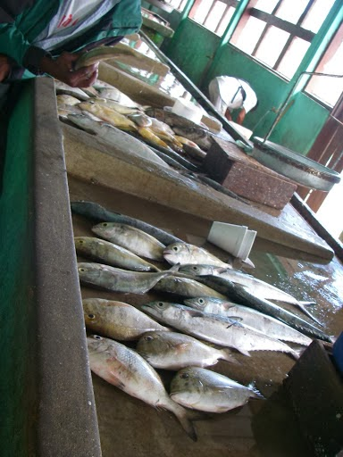

.. _fisheries:

*********
Fisheries
*********

Summary
=======

Wild capture fisheries provide a significant source of protein for human consumption and directly employ nearly 40 million fishers worldwide (FAO 2014). However, poor harvesting practices and habitat loss and degradation can reduce the ability of ecosystems to support healthy, productive fisheries. The InVEST Fisheries Production model produces estimates of harvest volume and economic value of single-species fisheries. The model is an age- or stage-structured population model, and is presented as a generic model that can be adapted to most species and geographies. Inputs to the model include parameters for life history characteristics (e.g., age at maturity, recruitment, migration and natural mortality rates), behavior of the fishery (e.g., fishing pressure), habitat dependencies (e.g., importance and availability of nursery habitat), and, optionally, economic valuation (e.g., price per unit biomass). The model outputs the volume and economic value of harvest within the area(s) designated by the user. It is best to compare outputs from multiple runs of the model, where each run represents different scenarios of habitat extent, environmental conditions and/or fishing pressure. A library of four sample models is provided, which the user can adapt to their own species or region, or the user can choose to build a model from scratch.

Introduction
============

Marine and aquatic ecosystems provide habitat for fish and shellfish, which in turn provide food and livelihoods for millions of people worldwide (FAO 2014). The ability of ecosystems to support fisheries depends on having intact habitat for fish, and on maintaining harvests at sustainable levels. A consideration of how changes in habitat or harvesting practices will impact the production of wild fish is thus important when weighing decisions which impact marine or aquatic ecosystems.

The status and ecology of fish stocks are often assessed by compiling multiple types of data into a single model that gives estimates of production under different scenarios. Unfortunately, such complex stock assessments are often not possible due to a lack of data and/or resources. In addition, traditional stock assessments generally do not take into account habitat dependencies or spatial dynamics, both of which are essential for understanding how local or regional fisheries production might respond under different scenarios. Therefore, a tool is needed that is flexible enough so that it can be adapted to different species, localities, and qualities of data, and which can be used to assess the potential consequences of decisions on the production of wild capture fisheries.

The Model
=========

The InVEST model of ecosystem services from fisheries is an age- or stage-structured, deterministic, population dynamics model for an individual species. The model uses life-history information and survival parameters provided by the user to estimate the volume of harvest. The model can then be used to explore how the amount of harvest (and, optionally, value) responds to changes in the amount of habitat (e.g., seagrass, mangrove, coral reef), environmental conditions (e.g., temperature, salinity), and/or fishing pressure. It is best to compare outputs from multiple runs of the model, where each run represents different scenarios of habitat extent, environmental conditions, and/or fishing pressure. Fish population dynamics are notoriously variable and difficult to predict. This model is not intended to give a precise prediction of harvest amounts, but rather to be used as a tool to explore the consequences of different decisions which could impact fisheries production.

Parameter sets for four sample models are provided, representing the following species and geographies: (1) Caribbean spiny lobster (*Panulirus argus*) in Belize; (2) Dungeness crab (*Metacarcinus magister*) in Hood Canal, Washington; (3) blue crab (*Callinectes sapidus*) in Galveston Bay, Texas; and (4) white shrimp (*Litopenaeus setiferus*) in Galveston Bay, Texas. We chose these combinations of species and geographies because they were of interest to our partners in different NatCap application sites. The existing models, and others that will be added as they are developed, capture a range of life history types and exploitation patterns such that users can choose an existing model and modify it for their own region and species (e.g., modify the Galveston Bay white shrimp model for brown shrimp in the South Atlantic). Alternatively, the model is formulated such that a user with more advanced knowledge of fisheries science and modeling techniques can start from scratch and parameterize the generic model to suit any species (or guild) of interest.

How it Works
------------

The underlying mechanics of the model are an age-structured or stage-structure population dynamics model. The model interface guides users through a series of decisions about the model’s structure:

+ Are populations structured by :ref:`age <label1>` or by :ref:`stage <label2>`?
+ Should males and females be modeled :ref:`separately (sex-specific) or together <label3>`?
+ Are there multiple :ref:`subregions <label4>`?
+ Is there :ref:`migration <migration-guidance-label>` between subregions?
+ How is :ref:`recruitment <recruitment-label>` (i.e. the production of offspring) determined?
+ For :ref:`how many time steps <label5>` should the model run?

The user supplies the necessary parameters, which describe the survival rates, maturation schedule, recruitment function, migration patterns, and vulnerability to harvest. The model then runs for a user-specified number of time steps with the intention of the population reaching a state of equilibrium. Primary model outputs are estimates of harvest and value (optional) for the population at the final time step of the run. `Valuation`_ is optional and reflects revenue earned from the sale of processed catch.

After generating a baseline model run, the user can then alter aspects of the model to compare fisheries production under different scenarios. Scenarios feed into the model by altering survival rates at certain life stages or in certain locations, for instance in response to changes in habitat extent, environmental variables, and/or fishing. An optional `Habitat Scenario Tool`_ is provided to assist the user in generating new survival parameters based on changes in habitat area, such as a decrease in the amount of eelgrass habitat or an increase in coral habitat.

Users have many options that can be chosen to customize the model to their particular species or question. We provide guidance for how to customize the model, as well as pointers to examples of model calibration and validation, both of which are done outside of the modeling framework.

.. _label1:

Age-Structured Populations
^^^^^^^^^^^^^^^^^^^^^^^^^^

Age-structured populations are modeled as:

.. math:: { N }_{ a,s,x,t }=\left\{ \begin{matrix} { Rec }_{ s,x,t } & if & a=0 \\ \left( { N }_{ a-1,s,x,t-1 }{ Mig }_{ a-1,s,x }^{ x }+\sum _{ x'\neq x }^{  }{ { N }_{ a-1,s,x',t-1 }{ Mig }_{ a-1,s,x' }^{ x } }  \right) { S }_{ a-1,s,x } & if & 1\le a<A \\ \left( { N }_{ A-1,s,x,t-1 }{ Mig }_{ A-1,s,x }^{ x }+\sum _{ x'\neq x }^{  }{ { N }_{ A-1,s,x',t-1 }{ Mig }_{ A-1,s,x' }^{ x } }  \right) { S }_{ A-1,s,x } & if & a=A \\ + \left( { N }_{ A,s,x,t-1 }{ Mig }_{ A,s,x }^{ x }+\sum _{ x'\neq x }^{  }{ { N }_{ A,s,x',t-1 }{ Mig }_{ A,s,x' }^{ x } }  \right) { S }_{ A,s,x } &  &  \end{matrix} \right\}

Where :math:`{N}_{a,s,x,t}` is the number of individuals of age *a* (*A* = maximum age) of sex *s* in area *x* at the start of time step *t*; and :math:`{S}_{a-1,s,x}` is survival from natural and fishing mortality from age *a*-1 to *a* for each sex and area; :math:`{Rec}_{s,x,t}` is recruitment of new individuals/number of offspring; :math:`{Mig}_{a,s,x'}^{x}` is the proportion of individuals of age *a* sex *s* that migrate from area *x'* to area *x* (or the proportion that remain in the area if *x'* = *x*).

Survival from natural and fishing mortality is defined as:

.. math:: { S }_{ a,s,x }={ surv }_{ a,s,x }\left( 1-{ Ex }_{ x }\ast { V }_{ a,s } \right)

Where :math:`{ surv }_{ a,s,x }` is survival from natural fishing mortality from age *a* to *a* + 1. for each sex and area; :math:`{Ex}_{x}` is exploitation, which is the proportion of the population vulnerable to harvest that is actually harvested; and :math:`{V}_{a,s}` is vulnerability to harvest by age and sex.  `Harvest`_ is assumed to occur at the beginning of the year, prior to mortality from natural causes.

.. _label2:

Stage-Structured Populations
^^^^^^^^^^^^^^^^^^^^^^^^^^^^

The stage-structured population model is a slightly more complicated version of the age-structured model, because we must account for variable length of the stages (e.g., stage 1 may last longer than 1 year, while stage 2 lasts less than one year). The model is as follows:

.. math:: { N }_{ a,s,x,t }=\left\{ \begin{matrix} \left( { N }_{ a,s,x,t-1 }{ Mig }_{ a,s,x }^{ x }+\sum _{ x'\neq x }^{  }{ { N }_{ a,s,x',t-1 }{ Mig }_{ a,s,x' }^{ x } }  \right) P_{ a,s,x }\quad +\quad { Rec }_{ s,x,t } & if & a=0 \\ \left( { N }_{ a-1,s,x,t-1 }{ Mig }_{ a-1,s,x }^{ x }+\sum _{ x'\neq x }^{  }{ { N }_{ a-1,s,x',t-1 }{ Mig }_{ a-1,s,x' }^{ x } }  \right) G_{ a-1,s,x } & if & 1\le a \\ +\left( { N }_{ a,s,x,t-1 }{ Mig }_{ a,s,x }^{ x }+\sum _{ x'\neq x }^{  }{ { N }_{ a,s,x',t-1 }{ Mig }_{ a,s,x' }^{ x } }  \right) P_{ a,s,x } &  &  \end{matrix} \right\}

Where :math:`{N}_{a,s,x,t}`, :math:`{Rec}_{s,x,t}`, :math:`{Mig}_{a,s,x}^{x}` are the same as in the formulation for the age-structured model.  Note that there is no *A* (maximum age) for stage-structured models because the models are designed to capture all of the life stages. :math:`{G}_{a,s,x}` is the probability of surviving from natural and fishing mortality and growing into the next stage for each sex and area; and :math:`{P}_{a,s,x}` is the probability of surviving from natural and fishing mortality and staying in the same stage for each sex and area.

:math:`{G}_{a,s,x}` is a function of survival  from natural and fishing mortality (:math:`{S}_{a,s,x}` as defined above, except now expressed as per unit time (e.g. day) rather than per year) and stage duration, :math:`{D}_{a}`:

.. math:: { G }_{ a,s,x }=\frac { {{ S }_{ a,s,x }}^{ { D }_{ a } }\left( 1-{ S }_{ a,s,x } \right)  }{ 1-{{ S }_{ a,s,x }}^{ { D }_{ a } } }

:math:`{P}_{a,s,x}` is also a function of survival from natural and fishing mortality and stage duration; it is defined as:

.. math:: { P }_{ a,s,x }={ S }_{ a,s,x }\frac { 1-{ { S }_{ a,s,x } }^{ { D }_{ a }-1 } }{ 1-{{ S }_{ a,s,x }}^{ { D }_{ a } } }

.. _recruitment-label:

Recruitment
^^^^^^^^^^^
Recruitment (i.e. the production of offspring) can be modeled in one of four different ways. The `Beverton-Holt`_ and `Ricker`_ functions assume different forms of density-dependence in the recruitment function (i.e. the number of offspring per adult decreases as adult abundance or biomass increases). The `Fecundity`_ function assumes a constant reproductive rate for adults (i.e. no density dependence). The `Fixed Recruitment`_ function assumes that recruitment is constant and not dependent on the number of adults. The parameterization of each function is shown below. See the `Guidance`_ section for advice on choosing and parameterizing the recruitment function.

Beverton-Holt
"""""""""""""

    .. math:: { Rec }_{ s,x,t }=\frac { { LarvalDispersal }_{ x } }{ SexSpecific } \cdot \frac { \left( \alpha \cdot { Sp }_{ t } \right)  }{ \left( \beta +{ Sp }_{ t } \right) }

Ricker
""""""

    .. math:: { Rec }_{ s,x,t }=\frac { { LarvalDispersal }_{ x } }{ SexSpecific } \cdot \left( \alpha \cdot { Sp }_{ t }\cdot { e }^{ -\beta \cdot { Sp }_{ t } } \right)

Fecundity
"""""""""

    .. math:: { Rec }_{ s,x,t }=\frac { { LarvalDispersal }_{ x } }{ SexSpecific } \cdot \left( \sum _{ a,s,x }^{  }{ { N }_{ a,s,x,t-1 }{ Maturity }_{ a,s }{ Fecundity }_{ a,s } }  \right)

Fixed Recruitment
"""""""""""""""""

    .. math:: { Rec }_{ s,x }=\frac { { LarvalDispersal }_{ x } }{ SexSpecific } \cdot Recruitment

.. figure:: ./fisheries/RecruitmentFunctions.jpeg
   :align: right
   :scale: 100%
   :alt: Illustration of the four recruitment functions available within the InVEST Fisheries model.

   Illustration of the four recruitment functions available within the InVEST Fisheries model.

If the model is sex-specific, :math:`SexSpecific=2`, or if the sexes are aggregated, :math:`SexSpecific=1`. In sex-specific models, recruits are split evenly between males and females. :math:`{LarvalDispersal}_{x}` gives the proportion of larvae that settle in area x for models with subregions. Spawners (:math:`{Sp}_{t}`) can be expressed as either number or biomass.  The number of spawners is the product of the number of individuals in each age (or stage) class for the entire study region and the proportion that are mature by age (or stage):

.. math:: { Sp }_{ t }=\sum _{ a,s,x }^{  }{ { N }_{ a,s,x,t-1 }{ Maturity }_{ a,s } }

The biomass of spawners is the product of number of individuals in each age (or stage) class for the entire study region, the proportion that are mature at each age (or stage) AND their weight at a given age (or stage):

.. math:: { Sp }_{ t }=\sum _{ a,s,x }^{  }{ { N }_{ a,s,x,t-1 }{ Maturity }_{ a,s }{ W }_{ a,s } }

Where :math:`{W}_{a,s}` is weight or biomass by age and sex.

Migration
^^^^^^^^^

If multiple subregions are specified, the user can choose to include migration from one subregion to another. Migration may occur at one or multiple ages/stages, and for each age/stage at which migration occurs the user specifies which proportion of fish from each subregion move to each other subregion. These proportions may depend on habitat quality, habitat quantity, known oceanographic dispersal patterns, etc. Within subregion migrations (for instance, shifts from one habitat type to another) should not be specified in this way. See :ref:`Migration <migration-guidance-label>` section in the Guidance section for more information.

Harvest
^^^^^^^

Harvest (:math:`{H}_{x,t}`) from each subregion in the final (equilibrated) time step is calculated based on the user-defined exploitation rate(s) and vulnerability. Harvest can be output by numbers or by weight. Choosing the appropriate output metric depends on how catch is normally processed and sold.

	Numbers (e.g. Dungeness crab:  :math:`{ H }_{ t,x }=\sum _{ a,s,x }^{  }{ { N }_{ a,s,x,t }{ Ex }_{ x }{ V }_{ a,s } }`

	By Weight (e.g. Spiny lobster, White shrimp): :math:`{ H }_{ t,x }=\sum _{ a,s,x }^{  }{ { N }_{ a,s,x,t }{ Ex }_{ x }{ V }_{ a,s }{ W }_{ a,s } }`

Where :math:`{Ex}_{x}` is exploitation, which is the proportion of the population vulnerable to harvest that is actually harvested, :math:`{V}_{a,s}` is vulnerability to harvest for age *a* and sex *s*, and :math:`{w}_{a,s}` is weight for age and sex.

Valuation
^^^^^^^^^

Valuation, :math:`{V}_{x,t}`  is optional and reflects the earnings from the sale of harvest. It is intended to give a rough idea of the current market value for an equilibrated population based on user-defined price parameters. It is simply:

.. math:: { V }_{ t,x }={ H }_{ t,x }\ast FractionProcessed\ast Price

Where :math:`Price` is the value in price per units (where units match those given by :math:`{H}_{x,t}`), and :math:`FractionProcessed` is the proportion of each harvest unit that remains to be sold after processing.

Initial Conditions
^^^^^^^^^^^^^^^^^^

The user supplies the initial number of recruits for both age- and stage-structured models. To initialize the **age-structured** models the following is done (i.e., at :math:`t = 0`):

.. math:: { N }_{ a,s,x,t=0 }=\left\{ \begin{matrix} { Re }c_{ s,x,t=0 } & if & a=0 \\ { N }_{ a-1,s,x,t=0 }{ S }_{ a,s,x } & if & 1\le a<A \\ \frac { { N }_{ A-1,s,x,t=0 }{ S }_{ A-1,s,x } }{ (1-{ S }_{ A,s,x }) }  & if & a=A \end{matrix} \right\}

For **stage-structured** models, we set the youngest stage as the initial recruitment, and then all other stages to 1 (as below). This is appropriate for the stage-structured models because each stage has a different duration, so we allow the model to redistribute the initial recruits (i.e., members of the youngest stage) over time instead of specifying them at the outset as in the age-structured model.

.. math:: { N }_{ a,s,x,t=0 }=\left\{ \begin{matrix} { Rec }_{ s,x,t=0 } & if & a=0 \\ 1 & if & 1\le a \end{matrix} \right\}

Because the population model is run to equilibrium, the initial number of recruits will not affect the model results, but may affect the number of time steps required before the population reaches equilibrium.

Scenarios
=========

The InVEST Fisheries model is best suited for comparing fisheries production under different scenarios. A scenario could be a change in the amount of juvenile habitat, a change in the harvest rate in a particular subregion, or a change in survival due to other causes such as climate change. Results from running scenarios can then be compared to baseline model runs to evaluate the consequences of such changes for fisheries production. To facilitate the analysis of scenarios, we provide a preprocessor tool for calculating how changes in habitat extent translate into changes in age/stage-specific survival.

Habitat Dependency
------------------

For ages/stages that depend on certain habitats (for instance, mangroves), a change in habitat coverage within a region can result in a change in the survival rate of ages/stages which depend on that habitat. The option to model this dependency is included as a `Habitat Scenario Tool`_ with InVEST, whereby new survival parameters are generated based on the baseline survival parameters and the amount of change in habitat. Users may choose to use the functional form provided in the tool, or use their own methods to calculate changes in survival. Currently, the tool is only suited for use with age-structured (not stage-structured) models.

Using the Habitat Scenario Tool, changes in the area of critical habitats are linked to changes in survival as follows:

.. math:: { S }_{ a,x }={ surv }_{ a,x }{ \left( \frac { \sum _{ { d }_{ a,h }>0 }^{  }{ { \left( 1+\frac { { H }_{ h,x,SCEN }-{ H }_{ h,x,BL } }{ { H }_{ h,x,BL } }  \right)  }^{ { d }_{ a,h }\gamma  } }  }{ { n }_{ a } }  \right)  }^{ { T }_{ a } }

Where :math:`{surv}_{a,x}` is baseline survival from natural mortality from age *a*-1 to *a* in subregion *x*: :math:`{surv}_{0}=1`, :math:`{surv}_{a}={e}^{-M}` if *a* > 0, and :math:`{M}_{a}` is the natural mortality rate from *a* - 1 to *a*. :math:`{T}_{a}` indicates if a transition to a new habitat happens from *a* - 1 to *a*, which is used so that changes in habitat coverage only affect survival during the transition to that habitat, but not once settled in the habitat. :math:`{H}_{h,x}` is the amount of habitat *h* (e.g. coral, mangrove, seagrass) in the region in the baseline (BL; i.e. status quo) system or under the scenario being evaluated (SCEN). :math:`{d}_{a,h}` is the degree to which survival during the transistion from *a*-1 to *a* depends upon availability of :math:`h`, :math:`y` is a shape parameter which describes the relationship between a change in habitat and a change in survival, and :math:`{n}_{a}` is the number of non-zero habitat-dependency values for age *a*.  If :math:`{n}_{a}=0`, :math:`{S}_{a,x}={surv}_{a,x}`. :math:`{S}_{a,x}` is restricted to a maximum of 1.

Limitations and Simplifications
===============================

The InVEST Fisheries model is best suited for exploring how different scenarios of habitat change, harvesting, or changing environmental conditions may result in changes to fisheries production. It is not intended to be a stock assessment tool, nor should the output be interpreted as predictions of future catches. Fish populations are notoriously variable, both from year to year as well as over long time scales. In the InVEST Fisheries model, as with any model, the quality of the output will be determined by the quality of the parameters supplied.
Key assumption of the model include:

+ Fishing is assumed to take place at the start of the year, before natural mortality.
+ After recruitment, survival is not density-dependent (i.e. does not depend on population size).
+ Harvest rates and selectivity are fixed through time, such that technological improvements to gear or changes in fishing practices are not modeled.
+ Market operations are fixed, such that they do not vary in response to the amount of harvest, shifts in market or consumer preference.

Key assumptions of the Habitat Scenario Tool include:

+ Habitat dependencies are obligatory (i.e., habitat substitutability is not explicitly represented).
+ The population responds to change in habitat quantity (e.g., areal extent of mangrove, seagrass, or coral reef), not quality of those habitats.
+ A change in habitat area affects survival only during the first life stage which depends on that habitat.
+ Habitat availability is a limiting factor for survival. This means that an increase or decrease in the amount of habitat will always result in an increase or decrease in survival for the first life stage dependent on that habitat.
+ The effect of a change in habitat on survival does not depend on the population density. In other words, a 50% reduction in juvenile habitat will have the same effect on survival rates regardless of the number of juveniles.

Model Details and Guidance
==========================

Customizing the Model
---------------------

Four sample models are included with the InVEST Fisheries model as parameter sets the user can input to InVEST. However, it is expected that users will customize the model to suit their own species or region as needed. The following sections provide guidance on how to customize the model and give examples from the four sample models. For more information on the parameterization of the Dungeness crab model, as well as an application of the model, see Toft et al. 2013. For the Spiny lobster model used in the Belize case study, see Arkema et al. *in review* and Toft et al. *in prep* (available upon request).

Most of the parameters required for customizing the model may be found in scientific literature or reports, or based on local knowledge (e.g., maturation age or migration patterns). However, some parameters will likely need to be estimated from data (e.g., recruitment parameters). For instance, the Spiny lobster model was parameterized by fitting to time-series of catch and catch-per-unit-effort (CPUE) from Belize (see Arkema et al. *in review*). This must be done outside InVEST and requires a user to be familiar with fitting models to data to estimate parameters. Some fisheries science expertise is also necessary.

As additional models are developed for particular applications, parameter sets, and relevant files will be made publicly available and highlighted on the NatCap forum. User-developed models may be shared in the same way, with the vision of a growing library of InVEST Fisheries models from around the globe.

Guidance
--------

Age or Stage-Structured
^^^^^^^^^^^^^^^^^^^^^^^

An age-structured model is simply a stage-structured model where all stages are the same length (typically one year). If multiple important life-history transitions happen within a year which should be captured in the model (e.g., multiple transitions from one habitat to another, or multiple migration events between regions), then a stage-structured model may be most appropriate.

All of the sample models are age-structured models, aside from shrimp, which is stage-structured. The stage-structured model accounts for variable lengths of the stages (e.g., stage 1 may last longer than a year, while stage 2 may last less than a year). Stage duration, :math:`{D}_{a}`, must be specified for each stage, but is assumed to be constant (and typically 1 year) for age-structured models.

Time Step Units
^^^^^^^^^^^^^^^

For age-structured models, the time step is assumed to be one year, and parameters are therefore based on annual rates and the model progresses in one-year increments. For stage-structured models, the user determines the time step. For instance, in the white shrimp model time steps are interpreted as days because 'Duration' values in the population_params.csv are number of days. The time step unit (days, months, years) will be the same as used for the "number of time steps for model run," which is specified by the user.

.. _label5:

Number of Time Steps for Model Run
^^^^^^^^^^^^^^^^^^^^^^^^^^^^^^^^^^

The number of time steps should be sufficiently large for the population to reach equilibrium. For age-structured models, a reasonable starting place is between 100-300 time steps, but will depend on the population parameters. For stage-structured models, more time steps may be needed. It is recommended that the user starts with an intermediate number of time steps and check the model output to determine whether more time steps are needed to reach equilibrium.

Number of Age or Stage Classes
^^^^^^^^^^^^^^^^^^^^^^^^^^^^^^

The model should capture the major points through adulthood– larval, juvenile/rearing, spawning, harvest. This is fairly straightforward for stage-structured models, as stages will span larval to adult stages, with some in between. For white shrimp, for instance, the intermediate stages are post-larval, marsh and bay. For age-structured models, the maximum age should be set to be old enough for the species to have reached full maturity and to be subjected to maximum harvest. The oldest age class will be a ‘plus’ class meaning that it includes that age and all older ages. There is no maximum age for stage-structured models because the models are designed to capture all of the life stages.

**Spiny Lobster** (8 age classes): 0 (larval), 1, 2, 3, 4, 5, 6, 7+

**Dungeness Crab** (5 age classes): 0 (larval), 1, 2, 3, 4+

**Blue Crab** (4 age classes): 0 (larval), 1, 2, 3+

**White Shrimp** (5 stage classes): eggs/larvae, post-larval, marsh, bay, adult (based on Baker et al. 2008)

.. _label3:

Sex-Specific or Not
^^^^^^^^^^^^^^^^^^^

A sex-specific model can be used if the biology (e.g., migration, size at age) or harvest practices differ substantially by sex. Different parameters can be given to each sex. Of the sample models, Dungeness crab is the only example of a sex-specific model. Males and females are separate in the Dungeness crab model because regulations prohibit harvest of female crabs. The population model could have been combined for both sexes, but we deemed it easier to keep them separate to reflect the harvest practices.

.. _label4:

Areas(s) of Interest
^^^^^^^^^^^^^^^^^^^^

The model can encompass one area—that is, be completely spatially aggregated (i.e. the population is considered homogenous throughout the study area)—or the area can be divided into subregions. In the sample models, we have made our decisions about how to include space in each model based on the policy questions and data availability for parameterizing the model.

**Spiny Lobster**: Project partners separated Belizean coastal and marine waters into 9 planning regions of different sizes, which we use for the lobster model (Clarke et al. 2013).

**Dungeness Crab**: Six boxes of irregular shape/size to match output from an ecosystem model (Toft et al. 2013).

**Blue Crab and White Shrimp**: A single bay-wide region (Guannel et al. 2014).

Larval Dispersal
^^^^^^^^^^^^^^^^

For models with subregions (e.g., Spiny Lobster, Dungeness Crab), we assume that adults from each subregion contribute to a common larval pool. Larvae are then distributed across subregions. The proportion of larvae that go to each subregion is user-defined, in the main parameters CSV file. In the spiny lobster default model, larvae are dispersed to the subregions according to the distribution of suitable habitat (e.g. mangroves and seagrasses) among the subregions  (Arkema et al. *in review*). In the Dungeness crab default model, larvae are dispersed proportional to the surface area of each subregion (Toft et al. 2013). The models represent closed populations, meaning we do not allow for any larval recruitment from outside of the study area. However, if recruitment is modeled using the `Fixed Recruitment`_ function, this could implicitly represent an external source of larvae.

.. _migration-guidance-label:

Migration
^^^^^^^^^

If there are multiple subregions in the model, the user defines the degree of migration between subregions and at what ages/stages this migration occurs. In deciding how to include migration in a model, the user should answer questions such as: Does a portion of each age-class emigrate each year? Or does emigration only occur for specific classes as they migrate between habitats? What portion of each class emigrates (e.g., 10% or 50%)? Where do they go (e.g., distribute equally to all other subregions regardless of distance from subregion of origin, or distribute based on a distance decay from subregion of origin)?

To specify migration, the user includes a separate matrix for each age (or stage) when migration occurs (e.g., in the lobster model, lobster migrate between ages 2 and 3 only, so only 1 migration matrix is included). These matrices, stored within a single folder, are selected under “migration matrix CSV folder” in the model interface. Note that movements within subregions (for instance, ontogenetic shifts between different habitat types) may be implicitly included in the model by altering age-specific survival rates to reflect availability of recipient habitat (see habitat dependency section). Within subregion movements do not require a migration matrix.

Spiny lobster is the only sample model that includes migration, which occurs as lobster move from mangroves and seagrasses to corals between ages 2 and 3. The proportion of age 2s that migrates from one subregion to another is determined by a distance decay function weighted by the amount of coral habitat in each subregion. For example, if there are 2 subregions and one is replete with coral, more of the age 2 lobster will migrate to that subregion than the other (for details see Arkema et al. *in review*).

Survival from Natural Mortality
^^^^^^^^^^^^^^^^^^^^^^^^^^^^^^^

Each year, a proportion of each age-class or stage succumbs to natural mortality due to a variety of causes, including predation, disease, or competition. Survival from natural mortality is the proportion of individuals that continues on to the next age/stage. Often, survival from natural mortality is calculated from instantaneous natural mortality rates (:math:`{M}_{a}`), which are frequently available from peer-reviewed literature and/or stock assessments: :math:`{S}_{a}={e}^{-{M}_{a}t}`, where t is the length of the time step over which survival is calculated (typically 1 year for `Age-Structured Populations`_).

Within the model, natural mortality may vary by age/stage, sex, and subregion, but it may not vary by time step.

**Spiny Lobster**: survival from natural mortality is the same across all ages (0.698), as calculated from a natural mortality rate of :math:`M = 0.36 {y}^{-1}` (Puga et al. 2005).

**Dungeness Crab**: we use 4 survival parameters, which were the same for males and females (see Higgins et al. 1997, Toft et al. 2013, and references therein). The survival of eggs to age 1 crab involves survival through two phases of Dungeness crab development—egg, and megalopae—for which we each had estimates of survival (5.41x10-6 and 0.29, respectively). We multiplied these together to generate the survival term from eggs through megalopae to age 1. Survival was the same for ages 2 and 3 of both sexes, and age 4+ females (0.725); age 4+ males are harvested and the surviving males have been shown to have a lower survival than other adult Dungeness crab (0.526).

Survival from Fishing Mortality
^^^^^^^^^^^^^^^^^^^^^^^^^^^^^^^

Mortality from fishing depends on the exploitation fraction and the age- or stage-specific vulnerability to harvest (see below).

Exploitation Fraction
^^^^^^^^^^^^^^^^^^^^^

This is the proportion of the population vulnerable to harvest that is actually harvested. This may vary by subregion.

Vulnerability to Harvest
^^^^^^^^^^^^^^^^^^^^^^^^

Not all ages or stages are equally likely to be harvested. Vulnerability to harvest (also called selectivity) may depend on size, life-stage specific behavior (for instance spawning aggregations), habitat use, or regulations, and may change depending on the gear and fishing strategies employed. A value of 1.0 indicates that the age or stage is fully vulnerable to harvest, whereas values less than one indicate the vulnerability relative to the fully-vulnerable age or stage. For instance, if all individuals age 4+ are fully vulnerable, whereas age 3 individuals are only half as likely to be caught given the same fishing pressure, age-3 would have a vulnerability of 0.5. The most vulnerable age/stage should have a value of 1.0. Vulnerability is assumed to be the same across subregions.

Different functional forms may be used to describe vulnerability. These are examples intended to help the user construct the population parameters CSV file, but other functional forms are possible (for instance, a dome-shaped function would imply the highest vulnerability for medium-aged individuals).

Binary: each age or stage is either not vulnerable or fully vulnerable (0 or 1).

Logistic function: assumes that vulnerability increases with age/stage, where :math:`{a}_{50}` is the age at which individuals have a 50% vulnerability to harvest, and :math:`\delta` determines the slope of the logistic function.

**Spiny Lobster**: We model vulnerability-at-age by using the logistic function above, with :math:`{a}_{50}` set to 2.5 years and :math:`\delta` set to 10.  A :math:`\delta` of 10 gives the shape of the logistic function a near knife-edge selectivity, meaning that very few lobster younger than 2.5 years are vulnerable to fishing, whereas almost all lobster older than 2.5 years are vulnerable to fishing. This cutoff was chosen as this is the age when a lobster reaches the minimum legal size for harvest of 75mm. A smaller delta would soften the knife-edge selectivity, resulting in higher vulnerability (and harvest) of younger lobster. Exploitation (:math:`{Ex}_{x}`) for this model is set to 31% based on historical harvest rates.

**Dungeness Crab**: Vulnerability and exploitation are set more simply in this model. Only age 4 males are assumed to be vulnerable to harvest (V = 1 for age 4 males, and V = 0 for all other ages and females). :math:`{Ex}_{x}` is set to 0.47, meaning 47% of age-4 males are harvested in each region. This was estimated by adjusting an average harvest rate for California, Oregon, and Washington to include only tribal and recreational catch since commercial harvesting does not occur in Hood Canal, WA (details in Toft et al. 2013)

Recruitment
^^^^^^^^^^^

**Beverton-Holt**: The Beverton-Holt model represents a situation where the total number of recruits increases with spawners abundance up to an asymptote. This recruitment function also has two parameters: alpha and beta. For Beverton-Holt, alpha represents the maximum number of recruits produced (i.e. the asymptote), whereas beta represents the number of spawners needed to produce recruitment equal to half the maximum (alpha/2). In this form, alpha/beta represents the recruits per spawner at low spawner levels.

**Ricker**: The Ricker model represents a situation where the total number of recruits increases up to intermediate spawner levels and then decreases at very high spawner levels. This function has two parameters: alpha and beta. In the Ricker model, alpha gives the maximum recruits per spawner at low spawner levels (i.e., the initial slope of the stock-recruit curve), while beta is the rate of decline in recruits as there are more spawners or the degree to which the curve bends downwards as spawner abundance increases.

For both Ricker and Beverton-Holt, spawners may be measured in numbers of individuals or in biomass, and the parameters should be specified appropriately.

**Fecundity**: For the fecundity-based recruitment function, only age- or stage-specific fecundity values are needed, representing the number of offspring per mature individual. Caution is urged when selecting this option as age-based models must be carefully parameterized in order to reach equilibrium. Most parameter sets will result in a continuously increasing or decreasing population. We do not recommend this option for stage-based models.

**Fixed**: In the fixed recruitment function, recruitment is time-invariant. A value for the fixed number of recruits must be given. Recruitment, therefore, does not depend on the abundance of mature individuals.

.. note:: Choosing which recruitment function to use will depend on data availability as well as ecological knowledge about the species and region. Density-dependent recruitment functions such as the Ricker and Beverton-Holt are most common in fisheries models, as they recognize that a population depends on finite resources and cannot grow infinitely large. A model with the Fecundity function must be parameterized carefully or it is not guaranteed to reach an equilibrium. The Fixed recruitment may be appropriate in cases where the region of interest is small relative to the range or distribution of the fished population, for instance, when recruits may drift into the region of interest from nearby spawning areas.

The Ricker function is used for the blue crab and Dungeness crab models. The lobster model uses the Beverton-Holt function. The white shrimp model assumes fixed recruitment. In all cases, stock-recruitment parameters were estimated by fitting the model to available data. For instance, the spiny lobster model was fit to three time-series of catch-per-unit-effort (CPUE) data, which allowed the estimation of alpha and beta. In the white shrimp model, recruitment was estimated by fitting the model to catch data.

If the user would like to create their own recruitment function for the Fisheries Model, an optional parameter has been created in the InVEST Fisheries python module (but not in the User Interface) to allow for this.  See the Fisheries Model page of the InVEST API Reference for more information.

Initial Recruitment
^^^^^^^^^^^^^^^^^^^

Because the model is an equilibrium model, the value chosen for Initial Recruitment is not critical. It should be in a reasonable range in order to ensure the model reaches equilibrium without too many time steps.

Maturity at Age/Stage
^^^^^^^^^^^^^^^^^^^^^

Maturity at age or stage is used to determine the abundance of spawners if you choose Beverton-Holt or Ricker for the recruitment function. These parameters may be taken from other studies, or estimated from data using, for instance, the equation below. If local data are not available, www.fishbase.org provides basic life history information for many species of fish.

Maturity-at-age, :math:`{m}_{a}`, may be calculated using a maturity ogive governed by a logistic function:

.. math:: { m }_{ a }={ \left( 1+exp\left( -\phi \left( { L }_{ a }-{ L }_{ 50 } \right)  \right)  \right)  }^{ -1 }

where:

+ :math:`\phi` determines the slope of the logistic function
+ :math:`{L}_{50}` is the length-at-50% maturity
+ :math:`{L}_{a}` is the length-at-age, defined according to a von Bertalanffy growth equation.

See the length/weight section below.

Weight at Age (Optional)
^^^^^^^^^^^^^^^^^^^^^^^^

It is optional to include a length-weight relationship in the model. We have done so for the lobster model because harvest and sale of lobster is recorded by volume of meat, not number of lobsters, which means any model validation needed to be a comparison of weight, not just numbers of lobster. For Dungeness crab, however, we validated the model against numbers of crab landed and had no need to transform numbers of crab to volume of crab. It may also be useful to include weight when recruitment depends strongly on total biomass of spawners, rather than total numbers of spawners.

For Lobster, we use a von Bertalanffy growth equation and a length-weight relationship to transform numbers-at-age to weight-at-age, :math:`{w}_{a}`:

.. math:: {w}_{a}=e{{L}_{a}}^{f}

where:

+ :math:`e`, :math:`f` are parameters of the von Bertalanffy growth equation
+ :math:`{L}_{a}` is length-at-age

:math:`{L}_{a}` is defined as:

.. math:: { L }_{ a }={ l }_{ \infty  }\left( 1-exp\left( -\kappa \left( a-{ t }_{ 0 } \right)  \right)  \right)

where:

+ :math:`{I}_{\infty}` is the asymptotic maximum length
+ :math:`\kappa` is curvature parameter, which is proportional to rate at which :math:`{I}_{\infty}` is reached
+ :math:`{t}_{0}` is the age at which the fish has 0 length, therefore, is non-negative, or zero.

Parameters for these equations may be estimated from data prior to running InVEST, or taken from www.fishbase.org for many fish species. Alternatively, estimates of weight-at-age may be taken directly from fish measurements without using a model.

Valuation (Optional)
^^^^^^^^^^^^^^^^^^^^

Valuation is intended to reflect the earnings from the sale of harvest. *Unit Price* gives the price per unit of harvest (either weight or numbers) that fishers receive from buyers. This information should be obtainable in reports, from national statistics, or by surveying fishers and buyers. *Fraction Kept After Processing* gives the proportion of each unit of harvest that remains to be sold after processing, or if harvest is specified in numbers, gives the proportion of individuals which are sold.

Currently, the spiny lobster model is the only sample model with valuation. See Arkema et al. *in review* and Toft et al. *in prep (available upon request)* for a description of how valuation parameters were estimated.

Habitat Dependency and the Habitat Scenario Tool (Optional)
^^^^^^^^^^^^^^^^^^^^^^^^^^^^^^^^^^^^^^^^^^^^^^^^^^^^^^^^^^^

Habitat dependencies are not explicitly included within the InVEST Fisheries Production model. However, a `Habitat Scenario Tool`_ is included which can be used to generate updated survival parameters based on changes in habitat. In order to use the tool, the user must already have a baseline set of population parameters, particularly survival rates. The tool takes information on changes in habitat area (expressed as a percent change from the baseline habitat area), age/stage specific habitat dependencies (i.e. age-0 lobster depend on mangroves and seagrass), and a user-specified shape parameter describing the relative response rate, or how a change in habitat corresponds to a change in survival. The tool outputs a new population parameters file with updated survival rates. Note that this tool cannot be used to generate an initial set of survival parameters, but is only used to update baseline survival parameters based on habitat change scenarios.

In using this tool, the user should have information on which life stages depend on which habitat types.

The user needs to specify:

1. Habitat changes, represented as a percent change in the area of each habitat type by subregion (if applicable). Changes in habitat area can represent different scenarios of conservation, restoration, or development, for instance as output from the :doc:`Habitat Risk Assessment </habitat_risk_assessment>` model.
2. Age- or stage-specific habitat dependencies, ranging from 0 (no dependency) to 1 (fully dependency). If an age or stage depends on multiple habitats, each habitat-stage dependency value can range from 0 to 1. However, if habitats are interchangable with regards to species dependency (in other words, if a species can use either habitat type, or if an increase in one habitat can compensate for a decrease in the other), we recommend modeling them as a single habitat type in the `Habitat Scenario Tool`_. Information on habitat dependencies can often be found in the scientific literature.
3. A gamma value. A gamma value of 1 means that a 50% increase in habitat area will correspond to a 50% increase in survival. A gamma value of 0.2 means that a 50% increase in habitat area will correspond to only a 10% increase in survival.

Data Needs
==========

Many types of data may and should be used to estimate inputs for the model parameters. For instance, data about a species' length, weight, maturity, or fecundity at a given age/stage are important for specifying how the population reproduces. Historical data on prices can be used to estimate the value of harvests. Survival rates may be estimated from data or taken from literature values. Because the types of data available for each fishery may vary drastically, the model is designed to allow the user full flexibility in how these inputs are estimated. In cases where parameters are highly uncertain, we recommend the user to run the model multiple times with a range of parameter values to determine how sensitive the model's results are to uncertainty in parameters. For more details on the definitions of the input data, please see the `How it Works`_ and `Guidance`_ sections.

General Parameters
------------------

1. **Workspace (required)**. The selected folder is used as the workspace where all intermediate and output files will be written. If the selected folder does not exist, it will be created. If datasets already exist in the selected folder, they will be overwritten.

    *Naming Conventions:* Any alphanumeric string of characters. Best to avoid whitespace characters.

    *Example Filepath:* \\InVEST\\Fisheries\\

2. **Area(s) of Interest (optional)**. The provided shapefile is used to display outputs within the subregion(s) of interest. The layer should contain one feature for every subregion of interest, each feature of which should have a ‘Name’ attribute (case-sensitive) matching a corresponding subregion in the Population Parameters CSV File. The 'Name' attribute value can be numeric or alphabetic, but must be unique within the given file.

    *Filetype:* Polygon Shapefile (SHP)

    *Example Filepath:* \\InVEST\\Fisheries\\Input\\lobster_subregions.shp

    *Requirement:* must have a 'Name' attribute in the shapefile’s attribute table.

3. **Number of Time Steps for Model Run (required)**. The number of time steps the simulation shall execute before completion. Must be a positive integer. The time step can use any unit of time relevant to the population. Consult `Time Step Units`_ for advice on selecting time step duration.

Population Parameters
---------------------

4. **Population Model Type (required)**. Specifies whether the classes provided in the Population Parameters CSV file represent ages or stages. Age-based models (e.g. Spiny Lobster, Dungeness Crab) are separated by uniform, fixed-length time steps (usually representing a year). Stage-based models (e.g. White Shrimp) allow stages to have non-uniform durations based on the assumed resolution of the provided time step. If the stage-based model is selected, the Population Parameters   CSV File must include a ‘Duration’ vector alongside the survival matrix that contains the number of time steps that each stage lasts.

5. **Population Classes are Sex-Specific (required)**. Specifies whether or not the population classes provided in the Population Parameters File are distinguished by sex.

6. **Harvest by Individuals or Weight (required)**. Specifies whether the harvest output values are calculated in terms of number of individuals or in terms of biomass (weight). If ‘Weight’ is selected, the Population Parameters CSV File must include a 'Weight' vector alongside the survival matrix that contains the weight of each age/stage, as well as sex if the model is sex-specific.

7. **Batch Processing**. Specifies whether the program will perform a single model run or a batch (set) of model runs.  For single model runs, users submit a filepath pointing to a single Population Parameters CSV file.  For batch model runs, users submit a folder path pointing to a set of Population Parameters CSV files. The name of each CSV file will serve as the prefix of the outputs created by the model run.

8. **Population Parameters CSV File**. The provided CSV file should contain all necessary parameters for population groups based on age/stage, sex, and subregion - excluding possible migration parameters.

    *Naming Conventions:* Any alphanumeric string of characters. Best to avoid whitespace characters.

    *Filetype:* Comma Separated Values (CSV)

    *Example Filepath:* \\InVEST\\Fisheries\\Inputs_Lobster\\population_params.csv

  + **Classes (required)**- The leftmost column should contain the age/stage names of the given species listed in chronological order. Each name can be an alphanumeric string. If the population classes are sex-specific, all age/stage names of one sex must be listed first, followed below by the age/stage names of the other sex.

  + **Subregions (required)**- The top-most row should contain the subregion names considered by the model. Each name can be an alphanumeric string. If the AOI shapefile is to be provided, the subregion entries must each match a corresponding 'Name' attribute value in a feature of the AOI shapefile. An entry must be provided even if the model is considering only one subregion.

  + **Survival Rates from Natural Mortality Matrix (required)**- Each unique pair of age/stage and subregion should contain a survival rate from natural mortality, expressed as a decimal fraction.

  **Subregion-specific Attributes**: Rows placed directly below the survival matrix with at least one empty row placed in-between as a buffer.

  + **ExploitationFraction (required)**- A row starting in the first column with the label 'ExploitationFraction'. The exploitation fraction is the proportion of the vulnerable population in each subregion that is harvested (0=0% harvested, 1=100% harvested). Each subregion is treated independently (i.e. up to 100% of the vulnerable population in each subregion may be harvested).

  + **LarvalDispersal**- A row starting in the first column labeled 'LarvalDispersal'. The larval dispersal is the proportion of the cumulative larvae pool that disperses into each subregion. Each subregion column should have a decimal to represent this. Dispersal across all subregions should add up to 1. If larval dispersal isn’t provided, larvae will be dispersed equally across all subregions.

  **Class-specific Attributes**: Columns placed directly to the right of the survival matrix with at least one empty column placed in-between as a buffer.

  + **VulnFishing (required)**- A column labeled 'VulnFishing', which is the relative vulnerability to harvest for each class. A decimal value for each class listed in this column is required. The most vulnerable age(s)/stage(s) should have a value of 1.0, indicating full vulnerability.

  + **Maturity**- A column labeled 'Maturity'. This column is only required if the recruitment function being used is Ricker, Beverton-Holt, or Fecundity. It represents the fraction of that age or stage which is mature and contributes to the spawning stock. A decimal value for each age/stage is required if maturity is included. For classes which do not reproduce, this should be 0.

  + **Duration**. A column labeled ‘Duration’. This column is required for stage-based models. It represents the number of time steps for which an average individual will be in that stage before moving to the next one.

  + **Weight**- A column which is required if ‘Spawners by Weight’ or ‘Harvest by Weight’ is selected. This is the average biomass of an individual of the population at each age/stage expressed in model-agnostic units and is required for each of the ages/stages listed in the classes column.

  + **Fecundity**- A column in the headers row which is required if the recruitment function being used is Fecundity. It represents the number of recruits per mature individual.

  **Example Sex-Aggregated Population Parameters CSV File**

    +--------------------------+-------------+-------------+-----+-------------+-----+-----------------+--------------+--------------+-------------+---------------+
    | **Class**                | Subregion_1 | Subregion_2 | ... | Subregion_N |     | **VulnFishing** | **Maturity** | **Duration** | **Weight**  | **Fecundity** |
    +--------------------------+-------------+-------------+-----+-------------+-----+-----------------+--------------+--------------+-------------+---------------+
    | Class_1                  | <float>     | <float>     | ... | <float>     |     | <float>         | <float>      | <int>        | <float>     | <float>       |
    +--------------------------+-------------+-------------+-----+-------------+-----+-----------------+--------------+--------------+-------------+---------------+
    | Class_2                  | <float>     | <float>     | ... | <float>     |     | <float>         | <float>      | <int>        | <float>     | <float>       |
    +--------------------------+-------------+-------------+-----+-------------+-----+-----------------+--------------+--------------+-------------+---------------+
    | ...                      | ...         | ...         | ... | ...         |     | ...             | ...          | ...          | ...         | ...           |
    +--------------------------+-------------+-------------+-----+-------------+-----+-----------------+--------------+--------------+-------------+---------------+
    | Class_N                  | <float>     | <float>     | ... | <float>     |     | <float>         | <float>      | <int>        | <float>     | <float>       |
    +--------------------------+-------------+-------------+-----+-------------+-----+-----------------+--------------+--------------+-------------+---------------+
    |                          |             |             |     |             |     |                 |              |              |             |               |
    +--------------------------+-------------+-------------+-----+-------------+-----+-----------------+--------------+--------------+-------------+---------------+
    | **ExploitationFraction** | <flaot>     | <float>     | ... | <float>     |     |                 |              |              |             |               |
    +--------------------------+-------------+-------------+-----+-------------+-----+-----------------+--------------+--------------+-------------+---------------+
    | **LarvalDispersal**      | <float>     | <float>     | ... | <float>     |     |                 |              |              |             |               |
    +--------------------------+-------------+-------------+-----+-------------+-----+-----------------+--------------+--------------+-------------+---------------+

  **Example Sex-Specific Population Parameters CSV File**

    +--------------------------+-------------+-------------+-----+-------------+-----+-----------------+--------------+--------------+-------------+---------------+
    | **Class**                | Subregion_1 | Subregion_2 | ... | Subregion_N |     | **VulnFishing** | **Maturity** | **Duration** | **Weight**  | **Fecundity** |
    +--------------------------+-------------+-------------+-----+-------------+-----+-----------------+--------------+--------------+-------------+---------------+
    | Class_1 (Female)         | <float>     | <float>     | ... | <float>     |     | <float>         | <float>      | <int>        | <float>     | <float>       |
    +--------------------------+-------------+-------------+-----+-------------+-----+-----------------+--------------+--------------+-------------+---------------+
    | Class_2                  | <float>     | <float>     | ... | <float>     |     | <float>         | <float>      | <int>        | <float>     | <float>       |
    +--------------------------+-------------+-------------+-----+-------------+-----+-----------------+--------------+--------------+-------------+---------------+
    | ...                      | ...         | ...         | ... | ...         |     | ...             | ...          | ...          | ...         | ...           |
    +--------------------------+-------------+-------------+-----+-------------+-----+-----------------+--------------+--------------+-------------+---------------+
    | Class_N                  | <float>     | <float>     | ... | <float>     |     | <float>         | <float>      | <int>        | <float>     | <float>       |
    +--------------------------+-------------+-------------+-----+-------------+-----+-----------------+--------------+--------------+-------------+---------------+
    | Class_1 (Male)           | <float>     | <float>     | ... | <float>     |     | <float>         | <float>      | <int>        | <float>     | <float>       |
    +--------------------------+-------------+-------------+-----+-------------+-----+-----------------+--------------+--------------+-------------+---------------+
    | Class_2                  | <float>     | <float>     | ... | <float>     |     | <float>         | <float>      | <int>        | <float>     | <float>       |
    +--------------------------+-------------+-------------+-----+-------------+-----+-----------------+--------------+--------------+-------------+---------------+
    | ...                      | ...         | ...         | ... | ...         |     | ...             | ...          | ...          | ...         | ...           |
    +--------------------------+-------------+-------------+-----+-------------+-----+-----------------+--------------+--------------+-------------+---------------+
    | Class_N                  | <float>     | <float>     | ... | <float>     |     | <float>         | <float>      | <int>        | <float>     | <float>       |
    +--------------------------+-------------+-------------+-----+-------------+-----+-----------------+--------------+--------------+-------------+---------------+
    |                          |             |             |     |             |     |                 |              |              |             |               |
    +--------------------------+-------------+-------------+-----+-------------+-----+-----------------+--------------+--------------+-------------+---------------+
    | **ExploitationFraction** | <float>     | <float>     | ... | <float>     |     |                 |              |              |             |               |
    +--------------------------+-------------+-------------+-----+-------------+-----+-----------------+--------------+--------------+-------------+---------------+
    | **LarvalDispersal**      | <float>     | <float>     | ... | <float>     |     |                 |              |              |             |               |
    +--------------------------+-------------+-------------+-----+-------------+-----+-----------------+--------------+--------------+-------------+---------------+

9. **Population Parameters CSV Folder**.  The provided CSV folder should contain a set of Population Parameters CSV files with all necessary attributes for population classes based on age/stage, sex, and subregion – excluding possible migration information.  The name of each file will serve as the prefix of the outputs created by the model run.

Recruitment Parameters
----------------------

10. **Initial Number of Recruits (required)**. The initial number of recruits in the population model at time equal to zero. If the model contains multiple subregions of interest or is distinguished by sex, this value will be first divided into subregions using the LarvalDispersal vector and then further divided evenly by sex of each subregion.

11. **Recruitment Function Type (required)**. This equation will be used to calculate recruitment into each subregion in the area of interest. For a detailed explanation of each equation, please refer to the :ref:`Recruitment <recruitment-label>` section. Each equation requires a different set of recruitment parameters. Be sure that the required parameters for the desired equation are included.

12. **Spawners by Individuals or Weight**. Specifies whether the spawner abundance used in the recruitment function should be calculated in terms of number of individuals or in terms of biomass (weight). If 'Weight' is selected, the user must provide a 'Weight' vector alongside the survival matrix in the Population Parameters CSV File. The 'Alpha' and 'Beta' parameters provided by the user should correspond to the selected choice.

13. **Alpha**. Specifies the shape of the stock-recruit curve. Used only for the `Beverton-Holt`_ and `Ricker`_ recruitment functions.

14. **Beta**. Specifies the shape of the stock-recruit curve. Used only for the `Beverton-Holt`_ and `Ricker`_ recruitment functions.

15. **Recurring Number of Recruits**. Specifies the total number of recruits that come into the population at each time step (a fixed number). Used only for the `Fixed Recruitment`_ function.

Migration Parameters
--------------------

For a species which migrates, this option will include source/sink population dynamics in the model. The migration is done on a class basis, so there is an opportunity for each age/stage to have separate migratory patterns.

16. **Migration Matrix CSV Folder (optional)**. If migration is checked, the selected folder should contain CSV migration matrices to be used in the simulation. Each CSV file contains a single migration matrix corresponding to the age/stage that migrates. Not all ages/stages require migration matrices, only those ages/stages that migrate.

      *Naming Conventions:* Any alphanumeric string of characters. Best to avoid whitespace characters.

      *Example Filepath:* \\InVEST\\Fisheries\\Inputs_Lobster\\Migrations\\

  **Migration Matrix CSV Files**.  For each age/stage where migration occurs, there should be a single CSV within the migration directory. The name of the CSV can be anything, but **MUST** end with an underscore followed by the name of the age or stage. This **MUST** correspond to an age or stage within the Population Parameters CSV File. For migration from the 'adult' class for example, a migration file might be named ‘migration_adult.csv’.  The CSV should contain nothing besides subregion names and migration values. The first row and first column should be the names of the subregions in the Population Parameters CSV File, listed in the same order. The columns represent the sources — the subregions **FROM** which the migration occurs; each column should therefore sum to 1. The rows represent the sinks — the subregions **TO** which the migration occurs. The cells within the matrix should be a DECIMAL REPRESENTATION of percentage of the source's population which will migrate to the sink.

    *Naming Conventions:* Any alphanumeric string of characters. Best to avoid whitespace characters. Must end with the age/stage name, such as '_ageName.csv'

    *Filetype:* Comma Separated Values (CSV)

    *Example Filepath:* \\InVEST\\Fisheries\\Inputs_Lobster\\Migrations\\migration_adult.csv

  **Example Migration CSV File**

    +--------------------+-------------------+-------------+-----+-------------+
    | **Migration**      | Subregion_1 (Src) | Subregion_2 | ... | Subregion_N |
    +--------------------+-------------------+-------------+-----+-------------+
    | Subregion_1 (Sink) | <float>           | <float>     | ... | <float>     |
    +--------------------+-------------------+-------------+-----+-------------+
    | Subregion_2        | <float>           | <float>     | ... | <float>     |
    +--------------------+-------------------+-------------+-----+-------------+
    | ...                | ...               | ...         | ... | ...         |
    +--------------------+-------------------+-------------+-----+-------------+
    | Subregion_N        | <float>           | <float>     | ... | <float>     |
    +--------------------+-------------------+-------------+-----+-------------+

Valuation Parameters
--------------------

17. **Fraction of Harvest Kept After Processing (required)**. This is the decimal representation of the percentage of harvested catch remaining after post-harvest processing is complete. (Either by weight or by number of individuals, as set in the Recruitment Parameters)

18. **Unit Price (required)**. Specifies the price per harvest unit. Valuation is intended to give a rough idea of the current market value for an equilibrated population based on user-defined price parameters. If ‘Harvest by Individuals or Weight’ was set to ‘Individuals’, this should be the price per individual. If set to ‘Weight’, this should be the price per unit weight. Weight units should agree with the units implied by the Weight column of the Population Parameters CSV file.

Habitat Scenario Tool
=====================

The goal of the Habitat Scenario Tool is to calculate new survival rates from the natural mortality rates of a baseline population given the dependencies of certain classes on certain habitats and the change in the area of those habitats over certain subregions.

Upon opening the Habitat Scenario Tool, the user is presented with an interface containing a set of parameters through which to submit inputs. Information about each parameter is provided below. Once the user has entered all necessary inputs, the user can start the model run by pressing ‘Run’.  If any errors occur, InVEST will stop the model run and provide feedback to the user about what caused the error through a message screen.

General Parameters
------------------

1. **Workspace (required)**. The selected folder is used as the workspace where all intermediate and output files will be written. If the selected folder does not exist, it will be created. If datasets already exist in the selected folder, they will be overwritten.

    *Naming Conventions:* Any alphanumeric string of characters. Best to avoid whitespace characters.

    *Example Filepath:* \\InVEST\\Fisheries\\

Population Parameters
---------------------

2. **Population Parameters File (CSV) (required)**. The provided CSV file should contain all necessary parameters for population classes based on age/stage, sex, and subregion - excluding possible migration parameters. See the Population Parameters CSV File description in the `Data Needs`_ section for information about the file format.

    *Naming Conventions:* Any alphanumeric string of characters. Best to avoid whitespace characters.

    *Filetype:* Comma Separated Values (CSV)

    *Example Filepath:* \\InVEST\\Fisheries\\Input\\Habitat_Scenario_Tool\\pop_params.csv

3. **Population Classes are Sex-Specific (required)**. Specifies whether or not the population classes provided in the Population Parameters CSV File are distinguished by sex.

Habitat Parameters
------------------

4. **Habitat Dependency Parameters File (CSV)**.  The provided CSV file should contain the habitat dependencies (0-1) for each age/stage for each habitat type that is also provided in the Habitat Change CSV File.

    *Naming Conventions:* Any alphanumeric string of characters. Best to avoid whitespace characters.

    *Filetype:* Comma Separated Values (CSV)

    *Example Filepath:* \\InVEST\\Fisheries\\Input\\Habitat_Scenario_Tool\\habitat_dep_params.csv

  **Example Habitat Dependency Parameters CSV File**

    +--------------+---------+---------+-----+---------+
    | **Habitats** | Class_1 | Class_2 | ... | Class_N |
    +--------------+---------+---------+-----+---------+
    | Habitat_1    | <float> | <float> | ... | <float> |
    +--------------+---------+---------+-----+---------+
    | Habitat_2    | <float> | <float> | ... | <float> |
    +--------------+---------+---------+-----+---------+
    | ...          | ...     | ...     | ... | ...     |
    +--------------+---------+---------+-----+---------+
    | Habitat_N    | <float> | <float> | ... | <float> |
    +--------------+---------+---------+-----+---------+

5. **Habitat Area Change File (CSV)**.  The provided CSV file should contain the percent changes in habitat area by subregion (if applicable). The habitats included should be those that the population depends on at any age/stage.

    *Name:* Any alphanumeric string, avoid spaces.

    *Filetype:* Comma Separated Values (CSV)

    *Example Filepath:* \\InVEST\\Fisheries\\Input\\Habitat_Scenario_Tool\\habitat_chg_params.csv

  **Example Habitat Area Change File (CSV)**

    +--------------+-------------+-------------+-----+-------------+
    | **Habitats** | Subregion_1 | Subregion_2 | ... | Subregion_N |
    +--------------+-------------+-------------+-----+-------------+
    | Habitat_1    | <float>     | <float>     | ... | <float>     |
    +--------------+-------------+-------------+-----+-------------+
    | Habitat_2    | <float>     | <float>     | ... | <float>     |
    +--------------+-------------+-------------+-----+-------------+
    | ...          | ...         | ...         | ... | ...         |
    +--------------+-------------+-------------+-----+-------------+
    | Habitat_N    | <float>     | <float>     | ... | <float>     |
    +--------------+-------------+-------------+-----+-------------+

6. **Gamma**. Describes the relationship between the change in habitat area and a change in survival of age/stage dependent on that habitat. Specify a value between 0 and 1.

Interpreting Results
====================

Intermediate Outputs
--------------------

1. **Population Breakdown**.  The output CSV file details the number of individuals within each class in each subregion, for every time step.

    *Example Filepath:* \\intermediate\\<pop_params_name>_population_by_time_step.csv

Final Outputs
-------------

1. **HTML Summary of Results**.  A page which displays the final harvest after equilibration, and the cumulative harvest across the entire area of interest per time step up to the equilibrated time step. The second table, ‘Final Harvest by Subregion After XX Time Steps’, shows the final harvest (by individuals or weight, depending on inputs) for each subregion. If valuation of the harvest was selected in the inputs, this will also include a column for the valuation of each subregion harvest (in the input currency). The bottom table, ‘Time Step Breakdown’, shows the cumulative harvest across all subregions for each time step before the model equilibrates. If valuation of the harvest was selected in the inputs, this will also include a column for valuation of the subregion harvest using the input currency. The ‘Equilibrated?’ column indicates whether the model reached equilibrium for each given time step (N=No, Y=Yes).

    *Example Filepath:* \\output\\<pop_params_name>_results_page.html

2. **CSV Summary of Results**.  A summary of results formatted as a CSV file.

    *Example Filepath:* \\output\\<pop_param_name>_results_table.csv

3. **Modified AOI**.  A copy of the AOI layer, but with either one or two additional attributes. The layer will always contain 'Hrv_Total', which is the final harvest (in either number of individuals or weight, depending on inputs) within that subregion at the final time step. Additionally, if the valuation parameter was checked, the layer will also contain 'Val_Total', the total value of the harvest within that subregion using the currency from the inputs.

    *Example Filepath:* \\output\\<aoi_name>_results_aoi.shp

Habitat Scenario Tool Results
-----------------------------

1. **Modified Population Parameters CSV File** A new population parameters file with an adjusted survival matrix based on the Habitat Scenario equation.

    *Example Filepath:* \\output\\<pop_params>_modified.csv

References
==========
Arkema, K.K., G. Verutes, S.A. Wood, C. Clarke, S. Rosado, M. Canto, A. Rosenthal, M. Ruckelshaus, G. Guannel, J. Toft, J. Fariesa, J.M. Silver, R. Griffin, A.D. Guerry. Improving the margins: Modeling ecosystem services leads to better coastal plans. *In review*

Baker, R., P. Levin, and T. Minello. 2008. The link between coastal wetlands and white shrimp fishery production in the northern Gulf of Mexico. ICES CM 2008/M:11

Clarke, C., M. Canto, and S. Rosado. 2013. Belize Integrated Coastal Zone Management Plan. Coastal Zone Management Authority and Institute, Belize City. 423 p.

Food and Agriculture Organization of the United Nations.  2014a. The State of World Fisheries and Aquaculture 2014: Opportunities and Challenges. Food and Agriculture Organization of the United Nations. Rome

Guannel, G., A. Guerry, J. Brenner, J. Faries, M. Thompson, J. Silver, R. Griffin, J. Proft, M. Carey, J. Toft, G. Verutes. 2014. Changes in the delivery of ecosystem services in Galveston Bay, TX, under a sea-level rise scenario. Report available upon request.

Higgins, K., A. Hastings, J.N. Sarvela, and L.W. Botsford. 1997. Stochastic dynamics and deterministic skeletons: population behavior of Dungeness crab. Science 276: 1431-1435

Puga, R., S. Hernández, J. López and M.E. de León. 2005. Bioeconomic modeling and risk assessment of the Cuban fishery for spiny lobster *Panulirus argus*. Fisheries Research 75: 149–163

Toft, J.E., J.L. Burke, M.P. Carey, C.K. Kim, M. Marsik, D.A. Sutherland, K.K. Arkema, A.D. Guerry, P.S. Levin, T.J. Minello, M. Plummer, M.H. Ruckelshaus and H.M. Townsend. 2013. From mountains to sound: modelling the sensitivity of Dungeness crab and Pacific oyster to land-sea interactions in Hood Canal, WA. ICES J. Mar. Sci. 71(3): 725-738
