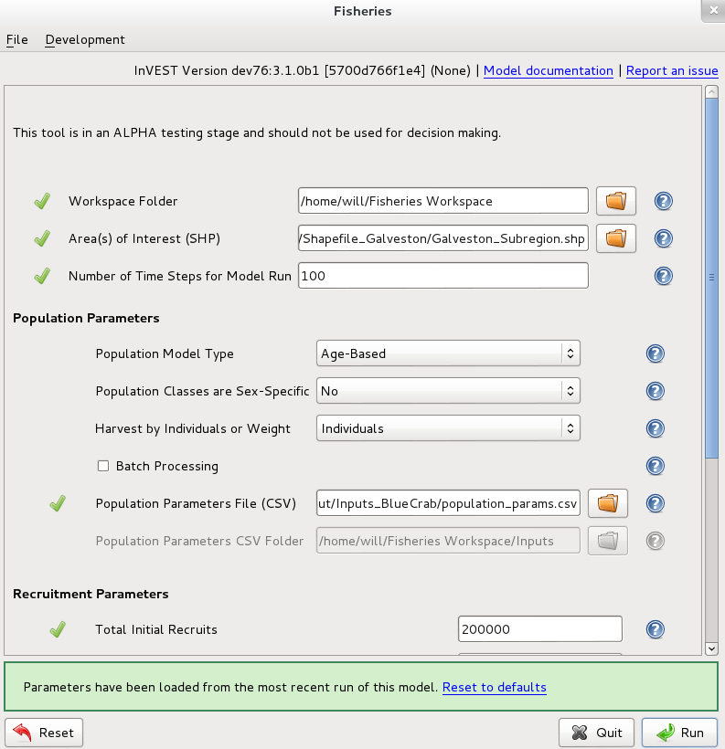

.. _fisheries:

***********
Fisheries
***********

Table of Contents
=================

+ `Summary`_
+ `Introduction`_
+ `The Model`_
+ `Limitations and Simplifications`_
+ `Data Needs`_
+ `Running the Model`_
+ `Interpreting Results`_
+ `Appendix A: Model Calibration and Validation`_
+ `References`_

Summary
=======

Introduction
============

The Model
=========

Modeling considerations
-----------------------

How it works
------------

(1) Age-Structured Population Model

.. math:: { N }_{ a,s,x,t }=\left\{ \begin{matrix} { Rec }_{ s,x,t } & if & a=0 \\ \left( { N }_{ a-1,s,x,t-1 }{ Mig }_{ a-1,s,x }^{ x }+\sum _{ x'\neq x }^{  }{ { N }_{ a-1,s,x',t-1 }{ Mig }_{ a-1,s,x' }^{ x } }  \right) { S }_{ a-1,s,x } & if & 1\le a<A \\ \left( { N }_{ A-1,s,x,t-1 }{ Mig }_{ A-1,s,x }^{ x }+\sum _{ x'\neq x }^{  }{ { N }_{ A-1,s,x',t-1 }{ Mig }_{ A-1,s,x' }^{ x } }  \right) { S }_{ A-1,s,x } & if & a=A \\ \left( { N }_{ A,s,x,t-1 }{ Mig }_{ A,s,x }^{ x }+\sum _{ x'\neq x }^{  }{ { N }_{ A,s,x',t-1 }{ Mig }_{ A,s,x' }^{ x } }  \right) { S }_{ A,s,x } &  &  \end{matrix} \right\}

(2) Survival from natural and fishing mortality

.. math:: { S }_{ a,s,x }={ surv }_{ a,s,x }\left( 1-{ Ex }_{ x }\ast { V }_{ a,s } \right)

(3) Recruitment Equations

Beverton-Holt

.. math:: { Rec }_{ s,x,t }=\frac { { LarvalDispersal }_{ x } }{ SexSpecific } \cdot \frac { \left( \alpha \cdot { Sp }_{ t } \right)  }{ \left( \beta +{ Sp }_{ t } \right) }

Ricker

.. math:: { Rec }_{ s,x,t }=\frac { { LarvalDispersal }_{ x } }{ SexSpecific } \cdot \left( \alpha \cdot { Sp }_{ t }\cdot { e }^{ -\beta \cdot { Sp }_{ t } } \right) 

Fecundity

.. math:: { Rec }_{ s,x,t }=\frac { { LarvalDispersal }_{ x } }{ SexSpecific } \cdot \left( \sum _{ a,s,x }^{  }{ { N }_{ a,s,x,t-1 }{ Maturity }_{ a,s }{ Fecundity }_{ a,s } }  \right) 

Fixed

.. math:: { Rec }_{ s,x }=\frac { { LarvalDispersal }_{ x } }{ SexSpecific } \cdot Recruitment

(4) Spawning Equations

By Number of Individuals

.. math:: { Sp }_{ t }=\sum _{ a,s,x }^{  }{ { N }_{ a,s,x,t-1 }{ Maturity }_{ a,s } }

By Weight

.. math:: { Sp }_{ t }=\sum _{ a,s,x }^{  }{ { N }_{ a,s,x,t-1 }{ Maturity }_{ a,s }{ W }_{ a,s } } 

(5) Stage-Structured Population Model

.. math:: { N }_{ a,s,x,t }=\left\{ \begin{matrix} \left( { N }_{ a,s,x,t-1 }{ Mig }_{ a,s,x }^{ x }+\sum _{ x'\neq x }^{  }{ { N }_{ a,s,x',t-1 }{ Mig }_{ a,s,x' }^{ x } }  \right) P_{ a,s,x }\quad +\quad { Rec }_{ s,x,t } & if & a=0 \\ \left( { N }_{ a-1,s,x,t-1 }{ Mig }_{ a-1,s,x }^{ x }+\sum _{ x'\neq x }^{  }{ { N }_{ a-1,s,x',t-1 }{ Mig }_{ a-1,s,x' }^{ x } }  \right) G_{ a-1,s,x } & if & 1\le a \\ \left( { N }_{ a,s,x,t-1 }{ Mig }_{ a,s,x }^{ x }+\sum _{ x'\neq x }^{  }{ { N }_{ a,s,x',t-1 }{ Mig }_{ a,s,x' }^{ x } }  \right) P_{ a,s,x } &  &  \end{matrix} \right\}

(6) Survival for Stage-Structured Model

G

.. math:: { G }_{ a,s,x }=\frac { { S }_{ a,s,x }^{ { D }_{ a } }\left( 1-{ S }_{ a,s,x } \right)  }{ 1-{ S }_{ a,s,x }^{ { D }_{ a } } }

P

.. math:: { P }_{ a,s,x }={ S }_{ a,s,x }\frac { 1-{ { S }_{ a,s,x } }^{ { D }_{ a }-1 } }{ 1-{ S }_{ a,s,x }^{ { D }_{ a } } }

(7) Harvest Equations

By Number of Individuals

.. math:: { H }_{ t,x }=\sum _{ a,s,x }^{  }{ { N }_{ a,s,x,t }{ Ex }_{ x }{ V }_{ a,s } } 

By Weight

.. math:: { H }_{ t,x }=\sum _{ a,s,x }^{  }{ { N }_{ a,s,x,t }{ Ex }_{ x }{ V }_{ a,s }{ W }_{ a,s } } 

(8) Valuation Equations

.. math:: { V }_{ t,x }={ H }_{ t,x }\ast Processed\ast Price

(9) Initial Conditions 

Age-Structured

.. math:: { N }_{ a,s,x,t=0 }=\left\{ \begin{matrix} { Re }c_{ s,x,t=0 } & if & a=0 \\ { N }_{ a-1,s,x,t=0 }{ S }_{ a,s,x } & if & 1\le a<A \\ \frac { { N }_{ A-1,s,x,t=0 }{ S }_{ A-1,s,x } }{ (1-{ S }_{ A,s,x }) }  & if & a=A \end{matrix} \right\}

Stage-Structured

.. math:: { N }_{ a,s,x,t=0 }=\left\{ \begin{matrix} { Rec }_{ s,x,t=0 } & if & a=0 \\ 1 & if & 1\le a \end{matrix} \right\}

(10) Maturity Equation

.. math:: { m }_{ a }={ \left( 1+exp\left( -\phi \left( { L }_{ a }-{ L }_{ 50 } \right)  \right)  \right)  }^{ -1 }

(11) Weight-at-Age and Length-at-Age Equations

Weight-at-Age

.. math:: w_{ a }=e{ { L }_{ a } }^{ f }

Length-at-Age

.. math:: { L }_{ a }={ l }_{ \infty  }\left( 1-exp\left( -\kappa \left( a-{ t }_{ 0 } \right)  \right)  \right)

Limitations and Simplifications
===============================

Data Needs
==========

Many types of data may and should be used to estimate inputs for the model parameters. For instance, data about a species' length, weight, maturity, or fecundity at a given age are important for specifying how the population reproduces. Historical data on prices can be used to estimate the value of harvests. {{Survival rates may be estimated from data or taken from literature values}}. Because the types of data available for each fishery may vary drastically, the model is designed to allow the user full flexibility in how these inputs are estimated. In cases where parameters are highly uncertain, we recommend the user to run the model multiple times with a range of parameter values to determine how sensitive the model's results are to uncertainty in parameters. For more details on the definitions of the input data, please see the [[ How it Works ]] and [[ Guidance ]] sections.

Running the Model
=================

Core Model
----------

Upon opening the InVEST Fisheries Model, a user will be greeted with an interface, as shown below.

The interface contains a set of parameters for the user to pass inputs. Information about each parameter is provided below. Once the user has entered all necessary inputs, the user can start the model run by pressing ‘Run’.  If any errors occur, InVEST will stop the model run and provide feedback to the user about what caused the error.

General Parameters
^^^^^^^^^^^^^^^^^^

1. **Workspace (required)**. The selected folder is used as the workspace where all intermediate and output files will be written. If the selected folder does not exist, it will be created. If datasets already exist in the selected folder, they will be overwritten. ::

	Name: Path to a workspace folder. Avoid spaces.
	Sample path: \InVEST\Fisheries\

2. **Area(s) of Interest (optional)**. The provided shapefile is used to display outputs within the region(s) of interest. The layer should contain one feature for every region of interest, each feature of which should have a ‘NAME’ attribute matching a corresponding subregion in the Population Attributes File. The 'NAME' attribute can be numeric or alphabetic, but must be unique within the given file. ::

	File type: Polygon shapefile (.shp)
	Sample path: \InVEST\Fisheries\Input\lobster_subregions.shp
	Requirement: must have a 'NAME' attribute in the shapefile’s attribute table.

3. **Number of Time Steps for Model Run (required)**. The number of time steps the simulation shall execute before completion. Must be a positive integer. The time step can use any unit of time relevant to the population. Consult [[[[INSERT TIME STEP LINK HERE]]]] for advice on selecting time step duration.

Population Parameters
^^^^^^^^^^^^^^^^^^^^^

4. **Population Model Type (required)**. Specifies whether the classes provided in the Population Attributes CSV file represent ages or stages. Age-based models (e.g. Lobster, Dungeness Crab) are separated by uniform, fixed-length time steps (usually representing a year). Stage-based models (e.g. White Shrimp) allow lifecycle-classes to have non-uniform durations based on the assumed resolution of the provided time step. If the stage-based model is selected, the Population Parameters   CSV File must include a ‘Duration’ vector alongside the survival matrix that contains the number of time steps that each stage lasts.

5. **Population Classes are Sex-Specific (required)**. Specifies whether or not the population classes provided in the Population Attributes File are distinguished by sex.

6. **Harvest by Individuals or Weight (required)**. Specifies whether the harvest output values are calculated in terms of number of individuals or in terms of biomass (weight). If ‘Weight’ is selected, the Population Attributes CSV File must include a 'Weight' vector alongside the survival matrix that contains the weight of each age/stage, as well as sex if the model is sex-specific.

7. **Batch Processing (required)**. Specifies whether the program will perform a single model run or a batch (set) of model runs.  For single model runs, users submit a filepath pointing to a single Population Parameters CSV file.  For batch model runs, users submit a folder path pointing to a set of Population Parameters CSV files.

8. **Population Parameters CSV File (required)**. The provided CSV file should contain all necessary attributes for population groups based on age/stage, sex, and subregion - excluding possible migration parameters. ::

	Name: Any alphanumeric string, avoid spaces.
	File type: Comma Separated Values (CSV) table.
	Sample path: \InVEST\Fisheries\Inputs_Lobster\population_params.csv

.. figure:: ./fisheries_images/
   :align: center
   :scale: 50%
   :alt: Sample Population Parameters CSV File

+ **Classes (required)**- The leftmost column should contain the class names of the given species listed in chronological order. Each name can be an alphanumeric string. If the population classes are sex-specific, all class names of one sex must be listed first, followed by the class names of the other sex.

+ **Subregions (required)**- The top-most row should contain the subregion names considered by the model. Each name can be an alphanumeric string. If the AOI shapefile is to be provided, the subregion entries must each match a corresponding 'NAME' attribute value in a feature of the AOI shapefile. An entry must be provided even if the model is considering only one subregion.

+ **Survival Rates from Natural Mortality Matrix (required)**- Adjacent to the Classes column and Subregions row is space to enter values for the survival rates of each class in each subregion from natural mortality, expressed as a decimal fraction.

**Subregion-specific Attributes**: Row-vectors placed directly below the survival matrix with at least one empty row placed in-between as a buffer. 

+ **ExploitationFraction (required)**- A row in the first column with the label 'ExploitationFraction'. The exploitation fraction is the proportion of the vulnerable population in each subregion that is harvested (0=0% harvested, 1=100% harvested). Each subregion is treated independently (i.e. up to 100% of the vulnerable population in each subregion may be harvested).

+ **LarvalDispersal **- A row in the first column labeled 'LarvalDispersal'. The larval dispersal is the proportion of the cumulative larvae pool that disperses into each subregion. Each subregion column should have a decimal to represent this. Dispersal across all subregions should add up to 1. If larval dispersal isn’t provided, larvae will be dispersed equally across all subregions.

**Class-specific Attributes**: Column-vectors placed directly to the right of the survival matrix with at least one empty column placed in-between as a buffer.

+ **VulnFishing (required)**- A column in the headers row labeled 'VulnFishing', which is the relative vulnerability to harvest for each class. A decimal value for each class listed in the attribute’s column is required. The most vulnerable age(s)/stage(s) should have a value of 1.0, indicating full vulnerability.

+ **Maturity**- A column in the headers row labeled 'Maturity'. This column is only required if the recruitment function being used is Ricker, Beverton-Holt, or Fecundity. It represents the fraction of that age or stage which is mature and contributes to the spawning stock. A decimal for each age/stage in the stages column is required if maturity is included. For classes which do not reproduce, this should be 0.

+ **Duration**. A column in the headers row labeled ‘Duration’. This column is required for stage-based models. It represents the number of time steps for which an average individual will be in that stage before moving to the next one.

+ **Weight**- A column in the headers row which is required if ‘Spawners by Weight’ or ‘Harvest by Weight’ is selected. This is the average biomass of an individual of the population at each age/stage expressed in model-agnostic units, and is required for each of the ages/stages listed in the classes column.

+ **Fecundity**- A column in the headers row which is required if the recruitment function being used is Fecundity. It represents the number of recruits per mature individual.

9. **Population Parameters CSV Folder**.  The provided CSV folder should contain a set of Population Parameters CSV files with all necessary attributes for population classes based on age/stage, sex, and area – excluding possible migration information.  The name of each file will serve as the prefix of the outputs created by the model run. 

Recruitment Parameters
^^^^^^^^^^^^^^^^^^^^^^

10. **Initial Number of Recruits (required)**. The initial number of recruits in the population model at time equal to zero. If the model contains multiple regions of interest or is distinguished by sex, this value will be evenly divided by sex and distributed into each subregion.   [[[ Comment from Lauren about using LarvalDisperal vector for distribution during initial conditions ]]]

11. **Recruitment Function Type (required)**. This equation will be used to calculate recruitment into each subregion in the area of interest. For a detailed explanation of each equation, please refer to the [[[[INSERT SECTION NAME HERE.]]]]. Each equation requires a different set of recruitment parameters. Be sure that the required parameters for the desired equation are included.

12. **Spawners by Individuals or Weight**. Specifies whether the spawner abundance used in the recruitment function should be calculated in terms of number of individuals or in terms of biomass (weight). If 'Weight' is selected, the user must provide a 'Weight' vector alongside the survival matrix in the Population Attributes CSV File. The 'Alpha' and 'Beta' parameters provided by the user should correspond to the selected choice.

13. **Alpha**. Specifies the maximum recruits per spawner at low spawner levels (i.e. the initial slope of the stock-recruit curve). Used only for the Beverton-Holt and Ricker recruitment functions.

14. **Beta**. Specifies the rate of decline in recruits as there are more spawners (i.e. the degree to which the curve bends downwards as spawner abundance increases). Used only for the Beverton-Holt and Ricker recruitment functions.

15. **Recurring Number of Recruits**. Specifies the total number of recruits that come into the population at each time step (a fixed number). Used only for the Fixed recruitment function.

Migration Parameters
^^^^^^^^^^^^^^^^^^^^
This check box allows for a species which migrates to include source/sink population dynamics in the model. The migration is done on a class basis, so there is opportunity for each age/stage to have separate migratory patterns.

16. **Migration Matrix CSV Folder (optional)**. If migration is checked, the selected folder should contain CSV migration matrices to be used in the simulation. Each CSV file contains a single migration matrix corresponding to class that migrates. Not all ages/stages require migration matrices, only those ages/stages that migrate. ::

	Name: Can be anything. Avoid spaces.
	File type: Folder
	Sample path: \InVEST\Fisheries\Inputs_Lobster\Migrations\

+ **Name of Migration CSV File**- For each age/stage where migration occurs, there should be a single CSV within the migration directory. The name of the CSV can be anything, but **MUST** end with an underscore followed by the name of the age or stage. This **MUST** correspond to an age or stage within the Population Attributes CSV File. For migration from the adult stage for example, a migration file might be named ‘migration_adult.csv’.::

	Name: Can be anything, but must end with the stage name as _stageName.csv
	File type: CSV
	Sample path: \InVEST\Fisheries\Inputs_Lobster\Migrations\migration_2.csv

+ **Format of Each CSV**- The CSV should contain nothing besides subregion names and migration values. The first row and column should be the names of the subregions in the Population Attributes CSV File, listed in the same order. The columns represent the sources — the subregions **FROM** which the migration occurs; each column should therefore sum to 1. The rows represent the sinks — the subregions **TO** which the migration occurs. The cells within the matrix should be a DECIMAL REPRESENTATION of percentage of the source's population which will migrate to the sink.

.. figure:: ./fisheries_images/
   :align: center
   :scale: 50%
   :alt: Sample Migration CSV File

Harvest Parameters
^^^^^^^^^^^^^^^^^^

17. **Fraction of Harvest Kept After Processing (required)**. This is the decimal representation of the percentage of harvested catch remaining after post-harvest processing is complete. 

18. **Unit Price (required)**. Specifies the price per harvest unit. Valuation is intended to give a rough idea of the current market value for an equilibrated population based on user-defined price parameters. If ‘Harvest by Individuals or Weight’ was set to ‘Individuals’, this should be the price per individual. If set to ‘Weight’, this should be the price per unit weight.

Habitat Scenario Tool
---------------------

General Parameters
^^^^^^^^^^^^^^^^^^

1. **Workspace (required)**. The selected folder is used as the workspace where all intermediate and output files will be written. If the selected folder does not exist, it will be created. If datasets already exist in the selected folder, they will be overwritten. ::

	Name: Path to a workspace folder. Avoid spaces.
	Sample path: \InVEST\Fisheries\

Population Parameters
^^^^^^^^^^^^^^^^^^^^^

2. **Population Parameters File (CSV) (required)**. The provided CSV file should contain all necessary parameters for population classes based on age/stage, sex, and sub-region - excluding possible migration parameters. ::

	Name: Any alphanumeric string, avoid spaces.
	File type: Comma Separated Values (CSV) table.
	Sample path: \InVEST\Fisheries\Input\Habitat_Scenario_Tool\pop_params.csv

3. **Population Classes are Sex-Specific (required)**. Specifies whether or not the population classes provided in the Population Parameters CSV File are distinguished by sex.

Habitat Parameters
^^^^^^^^^^^^^^^^^^

4. **Habitat Dependency Parameters File (CSV)**.  The provided CSV file should contain the habitat dependencies (0-1) for each life stage or age for each habitat type that is also provided in the Habitat Change CSV File. ::

	Name: Any alphanumeric string, avoid spaces.
	File type: Comma Separated Values (CSV) table.
	Sample path: \InVEST\Fisheries\Input\Habitat_Scenario_Tool\habitat_dep_params.csv

5. **Habitat Change Parameters File (CSV)**.  The provided CSV file should contain the percent changes in habitat area by sub-region (if applicable). The habitats included should be those which the population depends on at any life stage or age::

	Name: Any alphanumeric string, avoid spaces.
	File type: Comma Separated Values (CSV) table.
	Sample path: \InVEST\Fisheries\Input\Habitat_Scenario_Tool\habitat_chg_params.csv

6. **Gamma**. Describes the relationship between the change in habitat area and a change in survival of life stages dependent on that habitat. Specify a value between 0 and 1.

Interpreting Results
====================

Core Model
----------

Model Outputs
^^^^^^^^^^^^^
Upon successful completion of the model, the workspace folder will contain 'intermediate' and 'output' sub-folders. These two folders hold the data generated by the model. Most users will primarily be interested in data contained within the 'output' folder.

Intermediate Folder
^^^^^^^^^^^^^^^^^^^

The intermediate folder contains information used for final calculations. Intermediate outputs provide a more comprehensive look at how the final outputs were generated.

+ \\intermediate\\Populations_by_Time_Step.csv
 + The output CSV file details the number of individuals within each class in each subregion, for every time step.

Output Folder 	
^^^^^^^^^^^^^

+ \\output\\<AOI_Name>_Results.shp
 + A copy of the AOI layer, but with either one or two additional attributes. The layer will always contain 'Hrv_Total', which is the final harvest (in either number of individuals or weight, depending on inputs) within that subregion once the population equilibrates. Additionally, if valuation was checked, the layer will also contain 'Val_Total', the total value of the harvest within that subregion using the currency from the inputs.

+ \\output\\Results_Page.html
 + A page which displays the final harvest after equilibration, and the cumulative harvest across the entire area of interest per time step up to the equilibrated time step. The top table, ‘Final Harvest by Subregion After XX Time Steps’, shows the final harvest (by individuals or weight, depending on inputs) once the population equilibrates for each subregion. If valuation of the harvest was selected in the inputs, this will also include a column for the valuation of each subregion harvest (in the input currency). The bottom table, ‘Time Step Breakdown’, shows the cumulative harvest across all subregions for each time step before the model equilibrates. If valuation of the harvest was selected in the inputs, this will also include a column for valuation of the subregion harvest using the input currency. The ‘Equilibrated?’ column indicates whether the model reached equilibrium for each given time step (N=No, Y=Yes). 

+ \\output\\Results_Table.csv
 + A copy of 'Results_Page.html', but formatted as a CSV.

Habitat Scenario Tool
---------------------

Upon completion of a successful model run, the workspace folder will contain an 'output' folder.

Output Folder
^^^^^^^^^^^^^

+ \\output\\<pop_params>_modified.csv
 + A new population parameters file with an adjusted survival matrix based on the Habitat Scenario equation.

Appendix A: Model Calibration and Validation
============================================

References
==========

