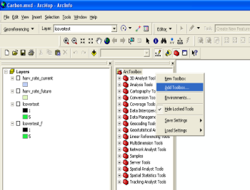
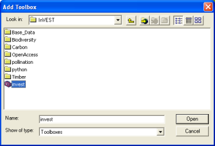
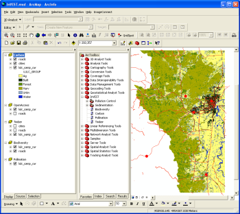
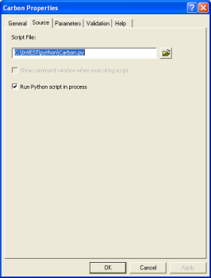
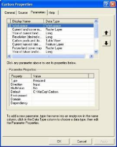

.. _getting-started:

***************
Getting Started
***************

Getting started with InVEST
===========================
 
InVEST tools run as script tools in the ARCGIS ARCTOOLBOX environment. To run InVEST, you must have:

+ ArcGIS 9.3 (service pack 1 or 2) or ArcGIS 10 (service pack 1).
+ ArcINFO level license to run some of the models
+ Spatial Analyst extension installed & activated
+ Python 2.5 or higher, which is typically installed automatically as part of ARCGIS.  The pollination model and all marine models require additional Python libraries. 

Running InVEST does not require Python programming, but it does require basic to intermediate skills in ArcGIS.

A set of sample data is supplied with the models so you can become familiar with the models and how they work. To use InVEST for your context, however, you must compile the data described in the chapter(s) for the model(s) you wish to run and format them as indicated.

Installing the InVEST tool and data on your computer
====================================================

The program InVEST-Setup.exe contains the InVEST toolbox, scripts, and training data, and is available at `ecoinformatics.org <http://invest.ecoinformatics.org>`_.

+ Double-click on InVEST-Setup.exe to install the contents on your computer. The Setup wizard will prompt you to download the contents at the default path: C:\\InVEST\\. You can change the location, but make sure the pathname does not have spaces or special characters, as this will prevent the model from working properly.  Do not move the folder contents to your desktop as this path contains spaces.  While InVEST is not supported for Macs, users who are running a virtualization product (such as Parallels or VMware) should make sure the installation is placed on the C: drive of their virtual machine.

+ Using Windows Explorer, take note of the folder structure and files extracted from InVEST-Setup.exe. Within the InVEST folder, you will see the toolbox InVEST.tbx. The python scripts are in the folder \\InVEST\\python\\. There is one script per model, and each ends with a ``*``.py suffix. In addition, you will see folders for Base Data, Biodiversity, Hydropower, Carbon, Pollination, Sedimentation, Water Purification, and Timber. These folders contain sample data. You will also see an ArcMap file called InVEST.mxd with the InVEST toolbox pre-loaded.

Downloading and installing Python library extensions
====================================================

InVEST users running the pollination model in ArcGIS 9.3 or any of the marine models in either ArcGIS 9.3 and 10 are required to download the Python extensions file found on the InVEST installer download page.  For the marine models, users can also run the “Marine Python Extension Check” tool to determine which extensions they need and if these extensions have been properly installed on their machine.

Most Marine InVEST models require the following extensions to be installed:

1. Numeric Python (**NumPy**) is a powerful and flexible N-dimensional array container that provides the fundamentals needed for scientific computing in Python.

2. Scientific Library for Python (**SciPy**) is an Open Source library of scientific tools for Python.  It calls on the NumPy library and gathers a variety of high-level science and engineering modules together as a single package.

3. Python for Windows (**PythonWin**) allows users to access data from Windows applications like Microsoft Excel. 

4.  **Matplotlib** is a Python 2D plotting library which produces publication quality figures.

The Terrestrial InVEST Pollination model for ArcGIS 9.3 requires the installation of one extension:

1. Geospatial Data Abstraction Library (**GDAL**) is a translator library for raster geospatial data formats.

.. note:: An older version of NumPy comes standard with the ArcGIS 9.3 and 10 installations of Python.  While the "Marine Python Extension Check" tool will confirm that NumPy is already installed on your machine, make certain to install the latest version of NumPy from the InVEST installer download page.

See the Marine InVEST :ref:`FAQ` for help with installing these extensions.

Adding the InVEST toolbox to ArcMap 
===================================

If you are working with sample data, you may wish to open InVEST.mxd, which has the toolbox already loaded. Follow these steps if you will be working with your data.

+ START ArcMap. Save as a new mxd file. Ensure that ArcToolbox is open. If not, select the toolbox icon from the standard toolbar.  
+ Right-click on an empty part of the ArcToolbox window and select ADD TOOLBOX. Or, right click on the top-most ArcToolbox text (see graphic below).

   Adding the InVEST toolbox

+ Navigate to the location of InVEST.tbx, in the InVEST folder.  Select the toolbox and click OPEN.  Do not double click on the toolbox icon.

   Select InVEST Toolbox

+ The INVEST toolbox should appear in ArcToolbox.  Click on the plus sign to the left of InVEST to expand it. You will see scripts for each InVEST model.

   InVEST Toolbox and tools displayed

Using sample data
=================

The InVEST toolbox comes with sample data, which may be helpful for becoming familiar with the models and as a guide for formatting your data. For instance, in preparation for analysis of your data, you may wish to test the models by changing input values in the sample data to see how the outputs respond.

Sample data are found in separate thematic folders in the InVEST folder. For example, the sample datasets for the Pollination model are found in \\InVEST21\\pollination\\input, and those for the Carbon model in \\InVEST21\\carbon\\input.  When opening the models, you’ll notice that default paths point to these sample datasets.  You will also notice that the default workspace for each tool is the thematic folder with a name that matches the tool.  Once you are working with your own data, you will need to create a workspace and input data folders that are structured like the sample data folders.  You will also need to redirect the tool to access your data.

Formatting your data
====================

Before running InVEST, it is necessary to format your data. Although subsequent chapters of this guide describe how to prepare input data for each model, there are several formatting guidelines common to all models:

+ Data file names should not have spaces (e.g., a raster file should be named 'landuse' rather than 'land use'). 

+ Raster dataset names cannot be longer than 13 characters and the first character cannot be a number. 

+ Spatial data should be projected in meters, and all input data for a given tool should be in the same projection. If your data is not projected or it is in a projection that is not in meters, InVEST will warn you and in some cases stop running.

+ Depending on the resolution (cell size) of your raster data, the model could take a long time to run. To make the tool run faster, enter a desired resolution that is larger than the original resolution. This will speed up the execution, but will reduce the accuracy of your result. It is recommended to initially run models with large cell sizes to increase speed and reduce memory needs. Final results can be produced with finer resolution.

+ Results will be calculated on selections in tables and feature classes. If you are setting the model to read layers and tables from your ArcMap document rather than from the c-drive, make sure to clear any selections unless you wish to run your model on the selection.   

+ Running the models with the input data files open in another program can cause errors. Ensure that the data files are not in use by another program to prevent data locking.

+ As the models are run, it may be necessary to change values in the input tables. This can happen within ArcMap or in an external program.  Depending on the format of tables used (dbf or mdb is recommended) you will need an appropriate software program to edit tables. To edit tables within ArcMap, you need to start an edit session (from the editor toolbar) and select the workspace (folder or database) that contains your data. After editing you must save your changes and stop the edit session.

+ Some models require specific naming guidelines for data files (e.g., Biodiversity model) and field (column) names. Follow these carefully to ensure your dataset is valid.

+ Remember to use the sample datasets as a guide to format your data.

Running the models
==================

You are ready to run an InVEST model when you have prepared your data according to the instructions in the relevant chapter and loaded the InVEST toolbox to your ARCMAP document.  

To begin:

+ Although not necessary, it’s often useful to add your input layers to your ARCMAP document to examine them. Use the ADD DATA button to add input data for a given module. 

+ View the attribute table by right-clicking on the layer and selecting OPEN ATTRIBUTE TABLE. You can change the symbology of an input layer by right-clicking on the layer name in the TABLE OF CONTENTS and selecting PROPERTIES, then clicking on the SYMBOLOGY tab. 

.. note:: Some of the models make changes to the data tables as they run. Such models will not run correctly if the tables are added to the map as the data will be locked.

+ Double-click the model you wish to run (e.g., Carbon) and complete the required parameters in the dialogue box that appears.

.. figure:: ./getting_started_images/carbontool.png
   :align: center
   :figwidth: 500px

+ The Carbon dialog is shown below as an example. Fields for which the entered path leads to a non-existent file will be marked with a red "x" next to the space for that variable. You can run the model with sample data as shown by the default paths, or navigate the paths to your data. Instructions specific for each model are in subsequent chapters. 

.. figure:: ./getting_started_images/carboninputs350.png
   :align: center
   :figwidth: 500px

+ Note that each tool has a place to enter a suffix to the output filenames. Adding a unique suffix prevents overwriting files produced in previous iterations. When all required fields are filled in, click the OK button on the interface.  

+ Processing time will vary depending on the script and the resolution and the extent of the datasets in the analysis.  Every model will open a window showing the progress of the script. Be sure to scan the output window for useful messages. Normal progress notes will be printed in black font. Informative messages that may or may not require changes to the data will be indicated in green font. Messages in red font indicate problems that have caused the model not to run. Read the green and red messages carefully to be aware of potential data problems or to determine why the model did not produce an output. 

.. figure:: ./getting_started_images/progressdialog300.png
   :align: center
   :figwidth: 500px

   Progress dialog

+ The model creates two folders in the workspace you selected: ‘intermediate’ and ‘output.’ After your script completes successfully, you can view the results by adding them from the folders to your ArcMap document using the ADD DATA button. View the attribute table and change SYMBOLOGY, by right-clicking on the layer name in the TABLE OF CONTENTS and selecting PROPERTIES, then clicking on the SYMBOLOGY tab. 

Changing default paths in scripts
=================================

If you extracted the files from InVEST-Setup.exe to the default location \\InVEST\\, the INVEST toolbox will work after you load it to ArcMap. If you extracted the contents of the folder to a different location, it will work as long as you maintain the internal structure of the InVEST folder. If you moved the python scripts out of the InVEST folder, however, the python scripts associated with the InVEST toolbox still need to be correctly referenced. To do this:

+ Add the InVEST toolbox to your ARCMAP document as described above.

+ Right-click on the model name in the InVEST toolbox and click on PROPERTIES. For example, click on the plus [+] sign to the left of the InVEST toolbox, and then right-click on the Carbon model. The PROPERTIES dialog appears. Select the SOURCE tab from the top. The path to the python script associated with this tool is shown.

 
   Setting source for the script

+ Edit this path to point to the location of the python script. It is easiest to click on the folder button at the right of the box to browse to the script and select it. 

+ Click OK.

Changing default variables
==========================

When you double click on an InVEST model such as Carbon or Timber, an interface will appear.  These interfaces show default values and path names to sample data (described more fully in the chapters describing each model). You can edit these pathnames to point to data. Another way to change the default path and file names is to: 

+ Right-click on the model name and click on PROPERTIES in the InVEST toolbox. The dialog below appears. 

+ Select the PARAMETERS tab at the top to see a list of input parameters for the model. Select an input parameter from the top window, which will set its properties on the lower window, including your desired default values and pathnames. 

+ Click OK after setting the desired defaults for workspace path, and any other defaults.  

.. note:: Do not change the order or data type of parameters in the top window, since the program calls these in order.  Changes to the order or data type will cause the script to fail.  

 
   Setting parameter properties

+ Click OK when you have set your desired defaults for workspace path, and any other defaults.  

Support information 
===================

Authorized users of InVEST (i.e., those who have obtained the software by registering and receiving a password to download it) have access to limited online support at http://invest.ecoinformatics.org. Users can submit questions, formal error reports, bug fixes, or modified versions of the code to contribute to the next version of the open source product.  You must register to receive support and access to the user community.  

Several regular training workshops on InVEST may be offered annually, subject to funding and demand.  Information on these trainings will be announced on the support page and can be found at the `Natural Capital Project website <http://www.naturalcapitalproject.org>`_. This site is also a good source of general information on InVEST and other activities of the Natural Capital Project. 

Model run checklist
===================

Use this checklist to ensure that the models run successfully.

+ ArcGIS Version: As stated above not all ArcGIS versions are supported. Most models are tested in ArcGIS 9.3 SP2 or ArcGIS 10 (for the selected models currently supported).  It is advisable to upgrade to one of these versions.

+ Python Extensions: For all marine models, ensure that the latest Python library extensions have been installed: 1) NumPy, 2) SciPy, 3) PythonWin, and 4) Matplotlib.  Additionally, Microsoft Excel is required to run the marine models. For ArcGIS 9.3 users, the pollination model requires installation of the GDAL library.

+ Spatial Analyst extension: Most of the models require ArcGIS spatial analyst extension.  Ensure that this is installed.

+ Regional and Language options: Some language settings cause errors while running the models.  For example settings which use coma (,) for decimals instead of period (.) cause errors in the models.  To solve this change the regional settings to English.

+ Folder naming: ArcGIS is strict about folder naming.  Avoid spaces and special characters in file and folder names.  

Reporting errors
================

If you experience errors running the models you can get assistance from the discussion list mentioned above.  Provide the following details in order to get quick help:

1. The model in which you encountered the error.

2. Your ArcGIS version and service pack.

3. The error text (copy and paste this from the tool dialog, including all the progress report in the tool dialog.  Note that the right click does not work in the dialog so use Ctrl+C to copy the error). 

4. Indicate whether you were running with sample data or your own data.  Ensure you can successfully run with sample data before you try with your own data.  This confirms that your system is well setup and ready to run the models.  

5. It is preferable to include the parameter file.  The models output a parameters file that indicates your input parameters.  This can be helpful in troubleshooting.

6. Make a distinction between errors and features missing from the model.  If the issue you are facing is related to the model design, please give a clear explanation of this so that the model-development lead will be able to review the issue and provide support.

Working with the DEM
====================

For the hydrology tools Water Purification: Nutrient Retention and Avoided Reservoir Sedimentation, having a well-prepared digital elevation model (DEM) is critical. It must have no missing data or circular flow paths and should correctly represent the surface water flow patterns over the area of interest in order to get accurate results.

Here are some tips for working with the DEM and creating a hydrologically-correct DEM.  Included is information on using built-in ArcMap Spatial Analyst functions as well as ArcHydro (see resources below), an ArcMap data model that has a more complex and comprehensive set of tools for modeling surface water features.  ArcSWAT, which is not covered here, could be a good  option for delineating sub-watersheds.  This is only intended to be a brief overview of the issues and methods involved in DEM preparation.  For more detail, see the Resources section below.

+ Use the highest quality, finest resolution DEM that is appropriate for your application. This will reduce the chances of there being sinks and missing data, and will more accurately represent the terrain's surface water flow, providing the amount of detail that is required for making informed decisions at your scale of interest. 

+ The Hydro_layers directory

  When tools are run that use DEM-derived layers like slope and flow direction, the tool looks for a folder called 'Hydro_layers', located in the same folder as the DEM.  If this folder does not exist, or any of the required derived layers within the folder don't exist, the tool will generate them from the input DEM, otherwise it uses the layers that already exist.  In general, this is convenient and efficient.  However, if you decide to use a different DEM than the one that was used to generate the files in Hydro_layers, and the new DEM is located in the same folder as the old DEM, the tool will not realize that it is different, and will continue to use the old derived layers.  So in this case it is necessary to delete the Hydro_layers folder before re-running the tool using the new DEM, so that the derived layers are regenerated.

+ Mosaic tiled DEM data

  If you have downloaded DEM data for your area that is in multiple, adjacent tiles, they will need to first be mosaicked together to create a single DEM file.  In ArcToolbox, use Data Management -> Raster -> Mosaic to New Raster, entering all of the tiles into the Input Rasters list.  Look closely at the output raster to make sure that the values are correct along the edges where the tiles were joined.  If they are not, try different values for the Mosaic Method parameter to the Mosaic to New Raster tool.

+ Check for missing data

  After getting (and possibly mosaicking) the DEM, make sure that there is no missing data (or 'holes'), represented by NoData cells within the area of interest.  If there are NoData cells, they must be assigned values.

  For small holes, one way to do this is to use the  ArcGIS Focal Mean function within Raster Calculator (or Conditional -> CON).  For example::

    con(isnull([theDEM]), focalmean([theDEM], rectangle, 4, 4), [theDEM]) 

  Interpolation can also be used, and can work better for larger holes.  Convert the DEM to points using Conversion Tools -> From Raster -> Raster to Point, interpolate using Spatial Analyst's Interpolation tools, then use CON to assign interpolated values to the original DEM::

    con(isnull([theDEM]), [interpolated_grid], [theDEM])

  Another possibility is assigning data from a different DEM, if surrounding values are a good match, again using CON::

    con(isnull([theDEM]), [different_DEM], [theDEM])

+ Verify the stream network

  If the stream network generated from the DEM does not correctly match reality, 'burning' a correct stream network into the DEM might be necessary.  Here are the basic steps for ArcMap:

  1. Create the stream network from the DEM using the Hydrology -> Flow Accumulation tool and compare it to a known correct stream layer.  If the generated stream network does not look correct, continue with the following steps.

  2. If starting with a vector stream layer, convert it to a grid that has the same cell size and extent as the DEM.

  3. Assign the stream grid a cell value of 1 where there are streams and 0 elsewhere.

  4. Subtract a multiple of this stream grid from the DEM.

  If using ArcHydro, create the stream network from the DEM using Terrain Preprocessing -> Stream Definition and compare it to a known correct stream layer.  If the generated stream network does not look correct, 'burn' the correct stream layer in using the Terrain Preprocessing -> DEM Manipulation -> DEM Reconditioning function.

+ Identify sinks in the DEM and fill them

  From the ESRI help on "How Sink works": "A sink is a cell or set of spatially connected cells whose flow direction cannot be assigned one of the eight valid values in a flow direction raster. This can occur when all neighboring cells are higher than the processing cell or when two cells flow into each other, creating a two-cell loop."

  Sinks are usually caused by errors in the DEM, and they can produce an incorrect flow direction raster.  Possible by-products of this are areas with circular flow direction (or a 'loop') or a discontinuous flow network. Filling the sinks assigns new values to the anomalous processing cells, such that they are better aligned with their neighbors.  But this process may create new sinks, so an iterative process may be required.

  In ArcMap, first identify sinks using ArcMap's Hydrology -> Sink tool.  Fill the resulting sinks with Hydrology -> Fill.  Do further iterations if there are still sinks that need to be filled.

  In ArcHydro, the corresponding tools are Terrain Preprocessing -> DEM Manipulation -> Sink Evaluation and Fill Sinks.

+ Flow direction loops

  If there's a problem in the flow direction raster, such as a loop, the Water Purification and Sedimentation tools may go into an infinite loop and eventually time out, producing this error:  "Error: Sub-watershed 1 is taking too long (45 minutes).  This probably indicates that there's a flow direction loop."

  Diagnosing and repairing loops is difficult and is beyond the scope of our tools and built-in ArcMap functions.  However, a very rough method of determining whether a loop is being encountered is provided in both of the scripts WP_2_Nutrient_Removal.py and Sediment_1_Soil_Loss.py.  In each of these files, look for 3 separate commented-out sections of code beginning with 'Flow direction loop debugging'.  Uncomment the subsequent lines (containing references to 'outfile') as directed.  The next time the tool is run, it will write information to the file::

    <Workspace>\Output\wp(or sed)_loop_debug_<current time>_<suffix>.txt

  This can become a very large file, as information is recorded on every cell in the watershed raster, as they are processed by moving along flow paths.  

  Each line of the debug file has three values: the nutrient or sediment load originating on that cell, the flow direction and the fraction of nutrient or sediment retained by that land use class (as given in the input Biophysical table).  With the debugging lines of code uncommented, run the tool.  Then look at the end of the debug file - if a loop was encountered, multiple lines with a particular set of values will be repeated.  These values can be used to help identify where the loops occur, by retaining the <Workspace>\\Intermediate folder (comment out the lines at the bottom of the code under 'Clean up temporary files' before doing the debug run), adding the Intermediate files 'frac_removed_ext', 'flowdir_ext' and 'loads_ext' to the map, and picking out the cells that have the particular set of values that repeated in the debug file (the CON tool can be used for this purpose).  This might produce many different matching areas, which would then have to be further investigated to single out the problem area.  

  Once a loop is found, it might help to go back to the DEM and do  more sink filling, or use the CON tool similarly to how it is used in the "Check for missing data" section above to assign new values.

+ Creating watersheds

  To create watersheds in ArcMap, use the Hydrology -> Watershed tool, which requires an input flow direction grid (created from the DEM using the Flow Direction tool) and point data for the locations of your points of interest (which represent watershed outlets, reservoirs, hydropower stations etc), snapped to the nearest stream using the Snap Pour Point tool.  If the modeled watersheds are too large or too small, go back to the Snap Pour Point step and choose a different snapping distance or try an alternate method of delineation.

  In ArcHydro, there is a more lengthy process, which tends to produce more reliable results than the Watershed tool.  Use the Watershed Processing -> Batch Watershed Delineation tool, which requires the creation of a flow direction grid, streams, catchments and point data for the locations of your points of interest, all done within the ArcHydro environment.  See the ArcHydro  documentation for more information.

  After watersheds are generated, verify that they represent the catchments correctly and that each watershed is assigned a unique integer ID.

+ Creating sub-watersheds

  Sub-watersheds are now required for all of the InVEST hydrology models.  For the Water Purification and Sediment models, each sub-watershed must be smaller than the equivalent of approximately 4000 x 4000 pixels, due to limitations with Python and the ArcMap memory model. 

  To create sub-watersheds in ArcMap, use the Hydrology -> Watershed tool.  In this case, the input point data will represent multiple points along the stream network within the main watershed, such that a sub-watershed will be generated for each.

  In ArcHydro, use the Watershed Processing -> Batch Subwatershed Delineation tool, with input point data representing multiple points along the stream network within the main watershed.  A sub-watershed will be generated for each point.

  Again, after the sub-watersheds are generated, verify that they represent the catchments correctly. Ensure each sub-watershed is assigned a unique integer ID and that no duplicates are present.

Resources
=========

ArcHydro: http://www.crwr.utexas.edu/giswr/hydro/ArcHOSS/Downloads/index.cfm

ArcSWAT: http://swatmodel.tamu.edu/software/arcswat

For more information on and an alternate method for creating hydrologically correct surfaces, see the ESRI help on "Hydrologically Correct Surfaces (Topo to Raster)".

For more information on sinks, see the ESRI help on "Creating a depressionless DEM".

Much more information and tips for all of these processes can be found by searching the `ESRI support website <http://support.esri.com>`_.

 

