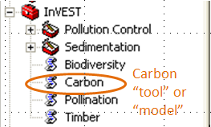
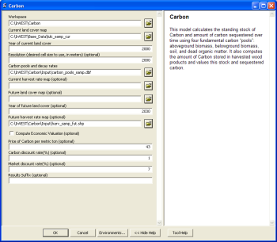
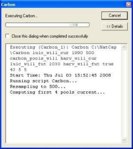

.. _getting-started:
.. primer

***************
Getting Started
***************

For assistance with installing InVEST on a mac, see :ref:`installing-on-mac`.

Installing InVEST and sample data on your Windows computer
==========================================================

Download the InVEST installer from `www.naturalcapitalproject.org`_. The executable will be called "InVEST_<version>_Setup.exe". Double-click on this .exe to run the installer. 

After clicking through the first screen and agreeing to the Licence Agreement, the Choose Components screen will appear. The installer will always install the InVEST Tools, ArcGIS toolbox and HTML and PDF versions of the InVEST User's Guide. Optionally, sample datasets may also be installed, and by default they are all selected. Note that these datasets are downloaded over the internet, and some are very large (particularly the Marine Datasets), so they make take a long time to install. If you do not wish to install all or some of the sample datasets, uncheck the corresponding box(es).

Next, choose the folder where the InVEST toolsets and sample data will be installed. The installer shows how much space is available on the selected drive. Click Install to begin the installation.

Once installed, the InVEST install folder will contain the following:

+ A **documentation** folder, containing the InVEST User Guide in HTML format.
+ An **invest-3-x86** folder, containing the compiled Python code that makes up the InVEST toolset.
+ **InVEST_<version>_Documentation.pdf**, the InVEST User Guide in PDF format.
+ **Uninstall_<version>.exe**, which will uninstall InVEST.
+ **Updates_InVEST_<version>.txt**, lists of all of the updates included in each new version.

Additionally, shortcuts for all InVEST standalone applications will be added to your Windows start menu under *All Programs -> InVEST |version|*

Advanced Installation
---------------------

The InVEST windows installer has a number of installation options for several use cases, including silent installation and the use of local sample data.  To view the available options, download the installer, open a CMD prompt to the directory that contains the downloaded installer and type:

.. code-block:: text

    .\InVEST_<version>_x86_Setup.exe /?

Standalone InVEST Tools
-----------------------

All of the InVEST models run on an entirely open-source platform, where historically the toolset was a collection of ArcGIS scripts. The new interface does not require ArcGIS and the results can be explored with any GIS tool including `ArcGIS <https://www.arcgis.com/>`_, `QGIS <http://qgis.org>`_, and others. As of InVEST 2.3.0, the toolset has had standalone versions of the models available from the Windows start menu after installation, under *All Programs -> InVEST |version|*.  Standalone versions are currently available for all models. The ArcGIS versions of InVEST models are no longer supported.

Older InVEST Versions
---------------------
Older versions of InVEST can be found at http://data.naturalcapitalproject.org/invest-releases/deprecated_models.html.  Note that many models were deprecated due to critical unsolved science issues, and we strongly encourage you to use the latest version of InVEST if at all possible.

Using sample data
=================

InVEST comes with sample data as a guide for formatting your data. For instance, in preparation for analysis of your data, you may wish to test the models by changing input values in the sample data to see how the output responds.

Sample data are found in separate thematic folders in the InVEST folder. For example, the sample datasets for the Pollination model are found in \\{InVEST install directory}\\pollination\\input, and those for the Carbon model in \\{InVEST install directory}\\carbon\\input.  When opening the models, you’ll notice that default paths point to these sample datasets.  You will also notice that the default workspace for each tool is the thematic folder with a name that matches the tool.  Once you are working with your own data, you will need to create a workspace and input data folders to hold your own input and results.  You will also need to redirect the tool to access your data.

Formatting your data
====================

Before running InVEST, it is necessary to format your data. Although subsequent chapters of this guide describe how to prepare input data for each model, there are several formatting guidelines common to all models:

+ Data file names should not have spaces (e.g., a raster file should be named 'landuse' rather than 'land use').

+ If using ESRI GRID format rasters, their dataset names cannot be longer than 13 characters and the first character cannot be a number. TIFF and IMG rasters do not have the length limitation.

+ Spatial data should be projected, and all input data for a given tool should be in the same projection. If your data is not projected InVEST will often give incorrect results.

+ While the InVEST 3.0 models are now very memory-efficient, the amount of time that it takes to run the models is still affected by the size of the input datasets. If the area of interest is large and/or uses rasters with small cell size, this will increase both the memory usage and time that it takes to run the model. If they are too large, a memory error will occur. If this happens, try reducing the size of your area of interest, or using coarser-resolution input data.

+ For some models, results will be calculated on selections in tables and feature classes. If you are setting the model to read layers and tables from your ArcGIS document rather than from the c-drive, make sure to clear any selections unless you wish to run your model on the selection.

+ Running the models with the input data files open in another program can cause errors. Ensure that the data files are not in use by another program to prevent data locking.

+ Regional and Language options: Some language settings cause errors while running the models.  For example settings which use coma (,) for decimals instead of period (.) cause errors in the models.  To solve this change the regional settings to English.

+ As the models are run, it may be necessary to change values in the input tables. This can happen within ArcGIS or in an external program.  Depending on the format of tables used (dbf or mdb is recommended) you will need an appropriate software program to edit tables. To edit tables within ArcGIS, you need to start an edit session (from the editor toolbar) and select the workspace (folder or database) that contains your data. After editing you must save your changes and stop the edit session.

+ Some models require specific naming guidelines for data files (e.g., Biodiversity model) and field (column) names, which are defined in the User Guide chapter for each model. Follow these carefully to ensure your dataset is valid.

+ Remember to use the sample datasets as a guide to format your data.

Running the models
==================

You are ready to run an InVEST model when you have prepared your data according to the instructions in the relevant chapter and have installed InVEST.

To begin:

+ Although not necessary, it’s often useful to add your input layers to your GIS document to examine them. Use the ADD DATA button to add input data for a given module.

+ View the attribute table by right-clicking on the layer and selecting OPEN ATTRIBUTE TABLE. You can change the symbology of an input layer by right-clicking on the layer name in the TABLE OF CONTENTS and selecting PROPERTIES, then clicking on the SYMBOLOGY tab.

.. note:: Some of the models make changes to the data tables as they run. Such models will not run correctly if the tables are added to the map as the data will be locked.

+ Double-click the model you wish to run (e.g., Carbon) and complete the required parameters in the dialogue box that appears.

+ The Carbon dialog is shown below as an example. Fields for which the entered path leads to a non-existent file will be marked with a red "x" next to the space for that variable. You can run the model with sample data as shown by the default paths, or navigate the paths to your data. Instructions specific for each model are in subsequent chapters.

+ Note that each tool has a place to enter a suffix to the output filenames. Adding a unique suffix prevents overwriting files produced in previous iterations. When all required fields are filled in, click the OK button on the interface.

+ Processing time will vary depending on the script and the resolution and the extent of the datasets in the analysis.  Every model will open a window showing the progress of the script. Be sure to scan the output window for useful messages. Normal progress notes will be printed in black font. Informative messages that may or may not require changes to the data will be indicated in green font. Messages in red font indicate problems that have caused the model not to run. Read the green and red messages carefully to be aware of potential data problems or to determine why the model did not produce an output.

   Progress dialog

+ The model creates two folders in the workspace you selected: ‘intermediate’ and ‘output.’ After your script completes successfully, you can view the results by adding them from the folders to your ArcGIS document using the ADD DATA button. View the attribute table and change SYMBOLOGY, by right-clicking on the layer name in the TABLE OF CONTENTS and selecting PROPERTIES, then clicking on the SYMBOLOGY tab.

Support information
===================

Several regular training workshops on InVEST may be offered annually, subject to funding and demand.  Information on these trainings will be announced on the support page and can be found at the `Natural Capital Project website <http://www.naturalcapitalproject.org>`_. This site is also a good source of general information on InVEST and other activities of the Natural Capital Project.

Reporting errors
================

If you encounter any issues please post to the user's support forum at http://forums.naturalcapitalproject.org with the following information:

+ InVEST model you're having difficulty with

+ Explicit error message or behavior

+ If possible, a screenshot of the state of your InVEST toolset when you get the error.

+ The log file produced by the standalone models, located in the output Workspace folder.

Working with the DEM
====================

For the hydrology tools Nutrient Retention and Sediment, having a well-prepared digital elevation model (DEM) is critical. It must have no missing data and should correctly represent the surface water flow patterns over the area of interest in order to get accurate results.

Here are some tips for working with the DEM and creating a hydrologically-correct DEM.  Included is information on using built-in ArcGIS Spatial Analyst functions as well as ArcHydro (see resources below), an ArcGIS data model that has a more complex and comprehensive set of tools for modeling surface water features.  ArcSWAT, AGWA, and BASINS, which are not covered here, are other options for delineating watersheds and doing watershed processing.  This is only intended to be a brief overview of the issues and methods involved in DEM preparation.  For more detail, see the Resources section below.

+ Use the highest quality, finest resolution DEM that is appropriate for your application. This will reduce the chances of there being sinks and missing data, and will more accurately represent the terrain's surface water flow, providing the amount of detail that is required for making informed decisions at your scale of interest.

+ Mosaic tiled DEM data

  If you have downloaded DEM data for your area that is in multiple, adjacent tiles, they will need to first be mosaicked together to create a single DEM file.  In ArcToolbox, use Data Management -> Raster -> Mosaic to New Raster, entering all of the tiles into the Input Rasters list.  Look closely at the output raster to make sure that the values are correct along the edges where the tiles were joined.  If they are not, try different values for the Mosaic Method parameter to the Mosaic to New Raster tool.

+ Check for missing data

  After getting (and possibly mosaicking) the DEM, make sure that there is no missing data (or 'holes'), represented by NoData cells within the area of interest.  If there are NoData cells, they must be assigned values.

  For small holes, one way to do this is to use the  ArcGIS Focal Mean function within Raster Calculator (or Conditional -> CON).  For example, in ArcGIS 9.3.x::

    con(isnull([theDEM]), focalmean([theDEM], rectangle, 3, 3), [theDEM]) 
	
  In ArcGIS 10.x::
  
	Con(IsNull("theDEM"),FocalStatistics("theDEM",NbrRectangle(3,3),"MEAN"),"theDEM")

  Interpolation can also be used, and can work better for larger holes. Convert the DEM to points using Conversion Tools -> From Raster -> Raster to Point, interpolate using Spatial Analyst's Interpolation tools, then use CON to assign interpolated values to the original DEM::

    con(isnull([theDEM]), [interpolated_grid], [theDEM])

  Another possibility is assigning data from a different DEM, if surrounding values are a good match, again using CON::

    con(isnull([theDEM]), [different_DEM], [theDEM])

+ Verify the stream network

  The stream network generated by the model from the DEM should closely match the streams on a known correct stream map. Several of the InVEST hydrology models, as well as the pre-processing tool for RIOS output the stream network generated by the tool, corresponding to the 'threshold flow accumulation' value input to the model. Use these outputs to evaluate how well the modelled streams match reality, and adjust the threshold flow accumulation accordingly. Larger values of the threshold will produce coarser stream networks with fewer tributaries, smaller values will produce more tributaries. 
  
  Or, create these stream layers manually using the following steps in ArcGIS:

  1. Generate a flow accumulation map from the DEM using Hydrology -> Flow Direction then Hydrology -> Flow Accumulation. 
  
  2. Create the stream network with the tool Math -> Logical -> Greater Than Equal, with the flow accumulation raster as Input raster 1 and the threshold flow accumulation value as Input raster 2. Compare the resulting stream layer to a known correct stream map. Repeat, adjusting the threshold value, until the resulting streams most closely match.
  
  If the generated stream network does not look correct, continue with the following steps in ArcGIS to 'burn' the correct stream network into the DEM. Note that this is a very simplistic way of burning in streams, and there are other, more complex methods that may produce better results.

  1. If starting with a vector stream layer that is known to be correct, convert it to a grid that has the same cell size and extent as the DEM.

  2. Assign the stream grid a cell value of 1 where there are streams and 0 elsewhere.

  3. Subtract a multiple of this stream grid from the DEM.

  If using ArcHydro, create the stream network from the DEM using Terrain Preprocessing -> Stream Definition and compare it to a known correct stream layer.  If the generated stream network does not look correct, 'burn' the correct stream layer in using the Terrain Preprocessing -> DEM Manipulation -> DEM Reconditioning function.

+ Identify sinks in the DEM and fill them

  From the ESRI help on "How Sink works": "A sink is a cell or set of spatially connected cells whose flow direction cannot be assigned one of the eight valid values in a flow direction raster. This can occur when all neighboring cells are higher than the processing cell or when two cells flow into each other, creating a two-cell loop."

  Sinks are usually caused by errors in the DEM, and they can produce an incorrect flow direction raster.  Possible by-products of this are areas with circular flow direction (or a 'loop') or a discontinuous flow network. Filling the sinks assigns new values to the anomalous processing cells, such that they are better aligned with their neighbors.  But this process may create new sinks, so an iterative process may be required.

  In ArcGIS, first identify sinks using the Hydrology -> Sink tool.  Fill the resulting sinks with Hydrology -> Fill.  Do further iterations if there are still sinks that need to be filled.

  In ArcHydro, the corresponding tools are Terrain Preprocessing -> DEM Manipulation -> Sink Evaluation and Fill Sinks.
  
+ A note about reprojecting DEMs

  When reprojecting a DEM in ArcGIS, it is important to select BILINEAR or CUBIC for the "Resampling Technique." Selecting NEAREST will generally produce a DEM with an incorrect grid pattern across the area of interest, which might only be obvious when zoomed-in or after Flow Direction has been run.

+ Creating watersheds

  To create watersheds in ArcGIS, it may be possible to use the Hydrology -> Watershed tool, which requires an input flow direction grid (created from the DEM using the Flow Direction tool) and point data for the locations of your points of interest (which represent watershed outlets, reservoirs, hydropower stations etc), snapped to the nearest stream using the Snap Pour Point tool.  If the modeled watersheds are too large or too small, go back to the Snap Pour Point step and choose a different snapping distance or try an alternate method of delineation.

  In ArcHydro, there is a more lengthy process, which tends to produce more reliable results than the Watershed tool.  Use the Watershed Processing -> Batch Watershed Delineation tool, which requires the creation of a flow direction grid, streams, catchments and point data for the locations of your points of interest, all done within the ArcHydro environment.  See the ArcHydro documentation for more information.

  After watersheds are generated, verify that they represent the catchments correctly and that each watershed is assigned a unique integer ID in the field "ws_id"

+ Creating sub-watersheds

  Sub-watersheds are now required for all of the InVEST hydrology models.  For the Water Purification and Sediment models in ArcGIS, each sub-watershed must be smaller than the equivalent of approximately 4000 x 4000 pixels, due to limitations with Python and the ArcGIS memory model. (This limit does not apply to the standalone versions of these models.)

  To create sub-watersheds in ArcGIS, use the Hydrology -> Watershed tool.  In this case, the input point data will represent multiple points along the stream network within the main watershed, such that a sub-watershed will be generated for each.

  In ArcHydro, use the Watershed Processing -> Batch Subwatershed Delineation tool, with input point data representing multiple points along the stream network within the main watershed.  A sub-watershed will be generated for each point.

  Again, after the sub-watersheds are generated, verify that they represent the catchments correctly. Ensure each sub-watershed is assigned a unique integer ID in the field "subws_id" and that no duplicates are present.

.. _installing-on-mac:

Installing InVEST and sample data on your Mac
=============================================

.. note::
    Numerical results of the Mac binaries may differ slightly (usually within 1e-4) from the results of the Windows binaries.  For this reason, we consider InVEST binaries "unstable", but they should still provide reasonable results.  As always, if something does not seem to be working, please let us know on the forums: http://forums.naturalcapitalproject.org

Download the InVEST disk image from `www.naturalcapitalproject.org/invest`_.  The disk image will be called "InVEST <version>.dmg".  This image contains a compressed copy of the InVEST executables.

To install:

  1. Double-click the disk image to mount it.
  2. Drag the folder labeled "InVEST_<version>_unstable" to your Applications folder.
  3. Open the InVEST folder you just copied to your Applications folder in a new finder window.
  4. Locate the model executable you would like to run, right-click it and select "Open".  In the dialog that pops up, click "Open" again.  You will need to do this the first time you launch a new InVEST model.

The mac distribution includes the executable models, but unlike the Windows installer does not include documentation or sample data.  If these are desired, both of these resources can be found online:

  * Documentation: http://data.naturalcapitalproject.org/nightly-build/invest-users-guide/html/
  * Sample data: http://data.naturalcapitalproject.org/invest-data/

Resources
=========

ArcHydro: http://resources.arcgis.com/en/communities/hydro/01vn00000010000000.htm

ArcSWAT: http://swatmodel.tamu.edu/software/arcswat

AGWA: http://www.epa.gov/esd/land-sci/agwa/

BASINS: http://water.epa.gov/scitech/datait/models/basins/index.cfm

For more information on and an alternate method for creating hydrologically correct surfaces, see the ESRI help on "Hydrologically Correct Surfaces (Topo to Raster)".

For more information on sinks, see the ESRI help on "Creating a depressionless DEM".

Much more information and tips for all of these processes can be found by searching the `ESRI support website <http://support.esri.com>`_.

For recommendations for and examples of incorporating climate change scenarios into ecosystem service assessments using InVEST models, see `this guidance document <http://www.naturalcapitalproject.org/wp-content/uploads/2016/02/Incorporating-climate-change-scenarios-into-InVEST-and-RIOS-2016-01-11.pdf>`_.

.. primerend

