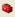

.. primer

.. _habitat_quality:

.. |addbutt| image:: ./shared_images/addbutt.png
             :alt: add
	     :align: middle
	     :height: 15px

.. |lulc_will_cur| image:: ./habitat_quality_images/lulc_will_cur.png
             :alt: lulc_will_cur

.. |inputs| image:: ./habitat_quality_images/inputs.png
             :alt: inputs

.. |graph| image:: ./habitat_quality_images/graph.png
             :alt: graph

.. |frog| image:: ./habitat_quality_images/frog.png
             :alt: frog

***************
Habitat Quality
***************

Summary
=======

.. figure:: ./habitat_quality_images/frog.png
   :align: right
   :figwidth: 200pt

Biodiversity is intimately linked to the production of ecosystem services. Patterns in biodiversity are inherently spatial, and as such, can be estimated by analyzing maps of land use and land cover (LULC) in conjunction with threats. InVEST models habitat quality and rarity as proxies for biodiversity, ultimately estimating the extent of habitat and vegetation types across a landscape, and their state of degradation. Habitat quality and rarity are a function of four factors: each threat's relative impact, the relative sensitivity of each habitat type to each threat, the distance between habitats and sources of threats, and the degree to which the land is legally protected. Required inputs include a LULC map, the sensitivity of LULC types to each threat, spatial data on the distribution and intensity of each threat and the location of protected areas. The model assumes that the legal protection of land is effective and that all threats to a landscape are additive.

Introduction
============

A primary goal of conservation is the protection of biodiversity, including the range of  genes, species, populations, habitats, and ecosystems in an area of interest. While some consider biodiversity to be an ecosystem service, here we treat it as an independent attribute of natural systems, with its own intrinsic value (we do NOT monetize biodiversity in this model). Natural resource managers, corporations and conservation organizations are becoming increasingly interested in understanding how and where biodiversity and ecosystem services align in space and how management actions affect both.

Evidence from many sources builds an overwhelming picture of pervasive biodiversity decline worldwide (e.g., Vitousek et al. 1997; Wilcove et al 1998; Czech et. al 2000). This evidence has prompted a wide-ranging response from both governments and civil society. Through the Rio Convention on Biodiversity, 189 nations have committed themselves to preserving the biodiversity within their borders. Yet, there is scant research on the overlap between opportunities to protect biodiversity and to sustain the ecosystem services so critical to these countries' economic well-being. This is precisely the type of challenge that InVEST has been designed to address.

For managers to understand the patterns of distribution and richness across a landscape, individually and in aggregate, it is necessary to map the range or occurrences of elements (e.g. species, communities, habitats). The degree to which current land use and management affects the persistence of these elements must also be assessed in order to design appropriate conservation strategies and encourage resource management that maximizes biodiversity in those areas.

There are a variety of approaches to identifying priorities for conservation with various trade-offs among them.  Each of these approaches focuses on different facets of biodiversity attributes and dynamics, including habitat or vegetation-based representation (i.e., a coarse filter), maximizing the number of species "covered" by a network of conserved sites for a given conservation budget (Ando et al. 1998), identifying patterns of richness and endemism (CI hotspots), and conserving ecological processes. There is also a hybrid coarse-fine filter approach which selectively includes "fine-filter" elements such as species with unique habitat requirements who may not be adequately protected using a coarse-filter approach only (TNC and WWF ecoregional planning). The InVEST Habitat Quality model is most relevant to "coarse filter", or habitat-based approaches.

The reasons for modeling biodiversity alongside ecosystem services are simple and powerful.  Doing so allows us to compare spatial patterns of biodiversity and ecosystem services, and to identify win-win areas (i.e., areas where conservation can benefit both natural systems and human economies) as well as areas where these goals are not aligned. Further, it allows us to analyze trade-offs between biodiversity and ecosystem services across differing scenarios of future land use change. Land use/land cover (LULC) patterns that generate greater ecosystem service production may not always lead to greater biodiversity conservation (Nelson et al. 2008), and modeling future options today can help identify and avoid tradeoffs.

.. primerend

The Model
=========

The InVEST habitat quality model combines information on LULC and threats to biodiversity to produce habitat quality maps. This approach generates two key sets of information that are useful in making an initial assessment of conservation needs: the relative extent and degradation of different types of habitat types in a region and changes across time. This approach further allows rapid assessment of the status of and change in a proxy for more detailed measures of biodiversity status.  If habitat changes are taken as representative of genetic, species, or ecosystem changes, the user is assuming that areas with high quality habitat will better support all levels of biodiversity and that decreases in habitat extent and quality over time means a decline in biodiversity persistence, resilience, breadth and depth in the area of decline.

The habitat rarity model indicates the extent and pattern of natural land cover types on the current or a potential future landscape vis-a-vis the extent of the same natural land cover types in some baseline period.  Rarity maps allow users to create a map of the rarest habitats on the landscape relative to the baseline chosen by the user to represent the mix of habitats on the landscape that is most appropriate for the study area's native biodiversity.

The model requires basic data that are available virtually everywhere in the world, making it useful in areas for which species distribution data are poor or lacking altogether. Extensive occurrence (presence/absence) data may be available in many places for current conditions. However, modeling the change in occurrence, persistence, or vulnerability of multiple species under future conditions is often impossible or infeasible. While a habitat approach leaves out the detailed species occurrence data available for current conditions, several of its components represent advances in functionality over many existing biodiversity conservation planning tools. The most significant is the ability to characterize the sensitivity of habitats types to various threats. Not all habitats are affected by all threats in the same way, and the InVEST model accounts for this variability. Further, the model allows users to estimate the relative impact of one threat over another so that threats that are more damaging to biodiversity persistence on the landscape can be represented as such. For example, grassland could be particularly sensitive to threats generated by urban areas yet moderately sensitive to threats generated by roads. In addition, the distance over which a threat will degrade natural systems can be incorporated into the model.

Model assessment of the current landscape can be used as an input to a coarse-filter assessment of current conservation needs and opportunities. Model assessment of potential LULC futures can be used to measure potential changes in habitat extent, quality, and rarity on a landscape and conservation needs and opportunities in the future.

How it Works
------------

Habitat Quality
^^^^^^^^^^^^^^^

We define habitat as "the resources and conditions present in an area that produce occupancy -- including survival and reproduction -- by a given organism (Hall et al. 1997:175)."  Habitat quality refers to the ability of the ecosystem to provide conditions appropriate for individual and population persistence, and is considered a continuous variable in the model, ranging from low to medium to high, based on resources available for survival, reproduction, and population persistence, respectively (Hall et al 1997). Habitat with high quality is relatively intact and has the structure and function within the range of historic variability.  Habitat quality depends on a habitat's proximity to human land uses and the intensity of these land uses. Generally, habitat quality is degraded as the intensity of nearby land-use increases (Nelleman 2001, McKinney 2002, Forman et al. 2003).

The model runs using raster data, or a gridded map of square cells. Each cell in the raster is assigned a LULC type, which can be a natural (unmanaged) cover or a managed cover. LULC types can be given at any level of classification detail. For example, grassland is a broad LULC definition that can be subdivided into pasture, restored prairie, and residential lawn types to provide much more LULC classification detail. While the user can submit up to 3 raster maps of LULC, one each for a baseline, current, and future period, at a minimum the current LULC raster map has to be submitted.

The user defines which LULC types can provide habitat for the conservation objective (e.g., if forest breeding birds are the conservation objective then forests are habitat and non-forest covers are not habitat).  Let :math:`H_j` indicate the habitat suitability of LULC type j.

Which LULC types should be considered habitat? If considering biodiversity generally or if data on specific biodiversity-habitat relationships are lacking, you can take a simple binary approach to assigning habitat to LULC types. A classic example would be to follow an island-ocean model and assume that the managed land matrix surrounding remnant patches of unmanaged land is unusable from the standpoint of species (e.g., MacArthur and Wilson 1967).  In this case a 0 would be assigned to managed LULC types in the matrix (i.e., non-habitat) and a 1 to unmanaged types (i.e., habitat). Under this modeling scheme habitat quality scores are not a function of habitat importance, rarity, or suitability; all habitat types are treated equally. Model inputs are assumed to not be specific to any particular species or species guild, but rather apply to biodiversity generally.

More recent research suggests that the matrix of managed land that surrounds patches of unmanaged land can significantly influence the "effective isolation" of habitat patches, rendering them more or less isolated than simple distance or classic models would indicate (Ricketts 2001, Prugh et al. 2008). Modification of the matrix may provide opportunities for reducing patch isolation and thus the extinction risk of populations in fragmented landscapes (Franklin and Lindenmayer 2009).  To model this, a relative habitat suitability score can be assigned to a LULC type ranging from 0 to 1 where 1 indicates the highest habitat suitability.  A ranking of less than 1 indicates habitat where a species or functional group may have lower survivability.  Applying this second approach greatly expands the definition of habitat from the simple and often artificial binary approach (e.g., "natural" versus "unnatural") to include a broad spectrum of both managed and unmanaged LULC types. By using a continuum of habitat suitability across LULC types, the user can assess the importance of land use management on habitat quality holistically or consider the potential importance of "working" (or managed) landscapes.

If a continuum of habitat suitability is relevant, weights with a roster of LULC on a landscape must be applied in reference to a particular species guild of group.  For example, grassland songbirds may prefer a native prairie habitat above all other habitat types (the habitat score for the LULC prairie (Hprarie) equals 1), but will also make use of a managed hayfield or pasture in a pinch (the habitat score for the LULC hayfield (Hhayfield) and pasture (Hpasture) equals 0.5).  However, mammals such as porcupines will find prairie unsuitable for breeding and feeding.  Therefore, if specific data on species group-habitat relationships are used, the model output refers to habitat extent and quality for the species or group in the modeled set only.

Besides a map of LULC and data that relates LULC to habitat suitability, the model also requires data on habitat threat density and its affects on habitat quality. In general, we consider human modified LULC types that cause habitat fragmentation, edge, and degradation in neighboring habitat threats.  For example, the conversion of a habitat LULC to non-habitat LULC reduces the size and continuity of neighboring habitat patches.  Edge effects refer to changes in the biological and physical conditions that occur at a patch boundary and within adjacent patches.  For example, adjacent degraded non-habitat LULC parcels impose "edge effects" on habitat parcels and can have negative impacts within habitat parcels by, for example, facilitating entry of predators, competitors, invasive species, or toxic chemicals and other pollutants. Another example: in many developing countries roads are a threat to forest habitat quality on the landscape because of the access they provide to timber and non-timber forest harvesters.

Each threat source needs to be mapped on a raster grid.  A grid cell value on a threat's map can either indicate intensity of the threat within the cell (e.g., road length in a grid cell or cultivated area in a gird cell) or simply a 1 if the grid cell contains the threat in a road or crop field cover and 0 otherwise.  Let :math:`o_{ry}` indicate threat r's "score" in grid cell y where r = 1, 2, ..., R indexes all modeled degradation sources.

All mapped threats should be measured in the same scale and metric.  For example, if one threat is measured in density per grid cell then all degradation sources should be measured in density per grid cell where density is measured with the same metric unit (e.g., km and km2).  Or if one threat is measured with presence/absence (1/0) on its map then all threats should be mapped with the presence/absence scale.

The impact of threats on habitat in a grid cell is mediated by four factors.

1. The first factor is the relative impact of each threat. Some threats may be more damaging to habitat, all else equal, and a relative impact score accounts for this (see Table 1 for a list of possible threats).  For instance, urban areas may be considered to be twice as degrading to any nearby habitats as agricultural areas. A degradation source's weight, :math:`w_r`, indicates the relative destructiveness of a degradation source to all habitats.  The weight :math:`w_r` can take on any value from 0 to 1.  For example, if urban area has a threat weight of 1 and the threat weight of roads is set equal to 0.5 then the urban area causes twice the disturbance, all else equal, to all habitat types. To reiterate, if we have assigned species group-specific habitat suitability scores to each LULC then the threats and their weights should be specific to the modeled species group.

2. The second mitigating factor is the distance between habitat and the threat source and the impact of the threat across space.  In general, the impact of a threat on habitat decreases as distance from the degradation source increases, so that grid cells that are more proximate to threats will experience higher impacts. For example, assume a grid cell is 2 km from the edge of an urban area and 0.5 km from a highway.  The impact of these two threat sources on habitat in the grid cell will partly depend on how quickly they decrease, or decay, over space. The user can choose either a linear or exponential distance-decay function to describe how a threat decays over space. The impact of threat r that originates in grid cell y, :math:`r_y`, on habitat in grid cell :math:`x` is given by :math:`i_{rxy}` and is represented by the following equations,

.. math:: i_{rxy}=1-\left( \frac{d_{xy}}{d_{r\ \mathrm{max}}}\right)\ \mathrm{if\ linear}
   :label: eq1

.. math:: i_{rxy}=exp\left(-\left(\frac{2.99}{d_{r\ \mathrm{max}}}\right)d_{xy}\right)\mathrm{if\ exponential}
   :label: eq2

where :math:`d_{xy}` is the linear distance between grid cells :math:`x` and :math:`y` and :math:`d_{r\ \mathrm{max}}` is the maximum effective distance of threat :math:`r\mathrm{'s}` reach across space.  Figure 1 illustrates the relationship between the distance-decay rate for a threat based on the maximum effective distance of the threat (linear and exponential).  For example, if the user selects an exponential decline and the maximum impact distance of a threat is set at 1 km, the impact of the threat on a grid cell's habitat will decline by ~ 50% when the grid cell is 200 m from r's source.  If :math:`i_{rxy} > 0` then grid cell x is in degradation source ry's disturbance zone. (If the exponential function is used to describe the impact of degradation source r on the landscape then the model ignores values of :math:`i_{rxy}` that are very close to 0 in order to expedite the modeling process.) To reiterate, if we have assigned species group-specific habitat suitability scores to each LULC then threat impact over space should be specific to the modeled species group.

.. figure:: ./habitat_quality_images/graph.png
   :align: center
   :figwidth: 500px

   Figure 1. An example of the relationship between the distance-decay rate of a threat and the maximum effective distance of a threat.

3. The third landscape factor that may mitigate the impact of threats on habitat is the level of legal / institutional / social / physical protection from disturbance in each cell. Is the grid cell in a formal protected area?  Or is it inaccessible to people due to high elevations?  Or is the grid cell open to harvest and other forms of disturbance? The model assumes that the more legal / institutional / social / physical protection from degradation a cell has, the less it will be affected by nearby threats, no matter the type of threat. Let :math:`\beta_x \in [0,1]` indicate the level of accessibility in grid cell :math:`x` where 1 indicates complete accessibility.  As   decreases the impact that all threats will have in grid cell :math:`x` decreases linearly.  It is important to note that while legal / institutional / social / physical protections often do diminish the impact of extractive activities in habitat such as hunting or fishing, it is unlikely to protect against other sources of degradation such as air or water pollution, habitat fragmentation, or edge effects.  If the threats considered are not mitigated by legal / institutional / social / physical properties then you should ignore this input or set :math:`\beta_x = 1` for all grid cells :math:`x`.  To reiterate, if we have assigned species group-specific habitat suitability scores to each LULC then the threats mitigation weights should be specific to the modeled species group.

.. figure:: ./habitat_quality_images/table1.png
   :align: center
   :figwidth: 500px

   Table 1. Possible degradation sources based on the causes of endangerment for American species classified as threatened or endangered by the US Fish and Wildlife Service. Adapted from Czech et al. 2000.

4. The relative sensitivity of each habitat type to each threat on the landscape is the final factor used when generating the total degradation in a cell with habitat (in Kareiva et al. 2010 habitat sensitivity is referred to by its inverse, "resistance").  Let :math:`S_{jr} \in [0,1]` indicate the sensitivity of LULC (habitat type) :math:`j` to threat :math:`r` where values closer to 1 indicate greater sensitivity.  The model assumes that the more sensitive a habitat type is to a threat, the more degraded the habitat type will be by that threat.  A habitat's sensitivity to threats should be based on general principles from landscape ecology for conserving biodiversity (e.g., Forman 1995; Noss 1997; Lindenmayer et al 2008). To reiterate, if we have assigned species group-specific habitat suitability scores to each LULC then habitat sensitivity to threats should be specific to the modeled species group.

Therefore, the total threat level in grid cell :math:`x` with LULC or habitat type :math:`j` is given by :math:`D_{xj}`,

.. math:: D_{xj}=\sum^R_{r=1}\sum^{Y_r}_{y=1}\left(\frac{w_r}{\sum^R_{r=1}w_r}\right)r_y i_{rxy} \beta_x S_{jr}
   :label: eq3

where :math:`y` indexes all grid cells on :math:`r\mathrm{'s}` raster map and :math:`Y_r` indicates the set of grid cells on :math:`r\mathrm{'s}` raster map.  Note that each threat map can have a unique number of grid cells due to variation in raster resolution   If :math:`S_{jr} = 0` then :math:`D_{xj}` is not a function of threat :math:`r`.  Also note that threat weights are normalized so that the sum across all threats weights equals 1.

By normalizing weights such that they sum to 1 we can think of :math:`D_{xj}` as the weighted average of all threat levels in grid cell :math:`x`.  The map of :math:`D_{xj}` will change as the set of weights we use change.  Please note that two sets of weights will only differ if the relative differences between the weights in each set differ.  For example, set of weights of 0.1, 0.1, and 0.4 are the same as the set of weights 0.2, 0.2, and 0.8.

A grid cell's degradation score is translated into a habitat quality value using a half saturation function where the user must determine the half-saturation value.  As a grid cell's degradation score increases its habitat quality decreases.  Let the quality of habitat in parcel :math:`x` that is in LULC j be given by :math:`Q_{xj}` where,

.. math:: Q_{xj} = H_j\left(1-\left(\frac{D^z_{xj}}{D^z_{xj}+k^z}\right)\right)
   :label: eq4

and :math:`z` (we hard code :math:`z = 2.5`) and :math:`k` are scaling parameters (or constants). :math:`Q_{xj}` is equal to 0 if Hj = 0. :math:`Q_{xj}` increases in Hj and decreases in :math:`D_{xj}`.  :math:`Q_{xj}` can never be greater than 1. The k constant is the half-saturation constant and is set by the user.  The parameter :math:`k` is equal to the :math:`D` value where :math:`1-\left(\frac{D^z_{xj}}{D^z_{xj}+k^z} = 0.5\right)`.  For example, if :math:`k = 5` then :math:`1-\left(\frac{D^z_{xj}}{D^z_{xj}+k^z}\right) = 0.5` when :math:`D_{xj} = 5`. In the biodiversity model interface we set :math:`k = 0.5` but the user can change it (see note in Data Needs section, #8).  If you are doing scenario analyses, whatever value you chose for :math:`k` the first landscape you run the model on, that same k must be used for all alternative scenarios on the same landscape.  Similarly, whatever spatial resolution you chose the first time you run the model on a landscape use the same value for all additional model runs on the same landscape. If you want to change your choice of :math:`k` or the spatial resolution for any model run then you have to change the parameters for all model runs, if you are comparing multiple scenarios on the same landscape.

Habitat Rarity
^^^^^^^^^^^^^^

While mapping habitat quality can help to identify areas where biodiversity is likely to be most intact or imperiled, it is also critical to evaluate the relative rarity of habitats on the landscape regardless of quality.  In many conservation plans, habitats that are rarer are given higher priority, simply because options and opportunities for conserving them are limited and if all such habitats are lost, so too are the species and processes associated with them.

The relative rarity of a LULC type on a current or projected landscape is evaluated vis-a-vis a baseline LULC pattern.  A rare LULC type on a current or projected map that is also rare on some ideal or reference state on the landscape (the baseline) is not likely to be in critical danger of disappearance, whereas a rare LULC type on a current or projected map that was abundant in the past (baseline) is at risk.

In the first step of the rarity calculation we take the ratio between the current or projected and past (baseline) extents of each LULC type :math:`j`. Subtracting this ratio from one, the model derives an index that represents the rarity of that LULC class on the landscape of interest.

.. math:: R_j=1-\frac{N_j}{N_{j_\mathrm{baseline}}}
   :label: eqn5

where :math:`N_j` is the number of grid cells of LULC :math:`j` on the current or projected map and :math:`N_{j_\mathrm{baseline}}` gives the number of grid cells of LULC :math:`j` on the baseline landscape.  The calculation of :math:`R_j` requires that the baseline, current, and/or projected LULC maps are all in the same resolution.  In this scoring system, the closer to 1 a LULC's :math:`R` score is, the greater the likelihood that the preservation of that LULC type on the current or future landscape is important to biodiversity conservation. If LULC j did not appear on the baseline landscape then we set :math:`R_j = 0`.

Once we have a :math:`R_j` measure for each LULC type, we can quantify the overall rarity of habitat type in grid cell :math:`x` with:

.. math::  R_x=\sum^X_{x=1}\sigma_{xj}R_j
   :label: eqn6

where :math:`\sigma_{xj}= 1` if grid cell x is in LULC :math:`j` on a current or projected landscape and equals 0 otherwise.

Limitations and Simplifications
-------------------------------

In this model all threats on the landscape are additive, although there is evidence that, in some cases, the collective impact of multiple threats is much greater than the sum of individual threat levels would suggest.

Because the chosen landscape of interest is typically nested within a larger landscape, it is important to recognize that a landscape has an artificial boundary where the habitat threats immediately outside of the study boundary have been clipped and ignored.  Consequently, threat intensity will always be less on the edges of a given landscape. There are two ways to avoid this problem. One, you can choose a landscape for modeling purposes whose spatial extent is significantly beyond the boundaries of your landscape of interest. Then, after results have been generated, you can extract the results just for the interior landscape of interest.  Or the user can limit themselves to landscapes where degradation sources are concentrated in the middle of the landscape.

Data Needs
==========

The model uses seven types of input data (five are required).

1. **Current LULC map (required).** A GIS raster dataset, with a numeric LULC code for each cell. The LULC raster should include the area of interest, as well as a buffer of the width of the greatest maximum threat distance. Otherwise, locations near the edge of the area of interest may have inflated habitat quality scores, because threats outside the area of interested are not properly accounted for. The dataset should be in a projection where the units are in meters and the projection used should be defined.

 *Name:* it can be named anything.

 *Format:* standard GIS raster file (e.g., ESRI GRID or IMG), with LULC class code for each cell (e.g., 1 for forest, 2 for agriculture, 3 for grassland, etc.). The LULC class codes should be in the grid's 'value' column. The raster should not contain any other data. The LULC codes must match the codes in the "Sensitivity of land cover types to each threat" table below (input # 7).

 *Sample Data Set*:  \\InVEST\\HabitatQuality\\Input\\lc_samp_cur_b

2. **Future LULC map (optional):**  A GIS raster dataset that represents a future projection of LULC in the landscape. This file should be formatted exactly like the "current LULC map" (input #1). LULC that appears on the current and future maps should have the same LULC code.  LULC types unique to the future map should have codes not used in the current LULC map. Again, the LULC raster should include the area of interest, as well as a buffer of the width of the greatest maximum threat distance. Otherwise, locations near the edge of the area of interest may have inflated habitat quality scores, because threats outside the area of interested are not properly accounted for.

 *Name:* it can be named anything.

 *Format:* standard GIS raster file (e.g., ESRI GRID or IMG), with LULC class code for each cell (e.g., 1 for forest, 3 for grassland, etc.). The LULC class codes should be in the raster's 'value' column.

 *Sample data set:* \\InVEST\\HabitatQuality\\Input\\lc_samp_fut_b

3. **Baseline LULC map (optional):** A GIS raster dataset of LULC types on some baseline landscape with a numeric LULC code for each cell. This file should be formatted exactly like the "current LULC map" (input #1). The LULCs that are common to the current or future and baseline landscapes should have the same LULC code across all maps.  LULC types unique to the baseline map should have codes not used in the current or future LULC map. Again, the LULC raster should include the area of interest, as well as a buffer of the width of the greatest maximum threat distance. Otherwise, locations near the edge of the area of interest may have inflated habitat quality scores, because threats outside the area of interested are not properly accounted for.

 If possible the baseline map should refer to a time when intensive mamagement of the land was relatively rare.  For example, a map of LULC in 1851 in the Willamette Valley of Oregon, USA, captures the LULC pattern on the landscape before it was severely modified to for massive agricultural production. Granted this landscape had been modified by American Indian land clearing practices such as controlled fires.

 *Name*: it can be named anything.

 *Format*: standard GIS raster file (e.g., ESRI GRID or IMG), with LULC class code for each cell (e.g., 1 for forest, 3 for grassland, etc.). The LULC class codes should be in the grid 'value' column.

 *Sample data set*:  \\InVEST\\HabitatQuality\\Input\\lc_samp_bse_b

4. **Threat data (required):** A CSV table of all threats you want the model to consider.  The table contains information on the each threat's relative importance or weight and its impact across space.

 *Name:* file can be named anything

 *File Type:*  ``*``.csv

 *Rows:* each row is a degradation source

 *Columns:* each column contains a different attribute of each degradation source, and must be named as follows:

	a. THREAT: the name of the specific threat. **Threat names must not exceed 8 characters.**

	b. MAX_DIST: the maximum distance over which each threat affects habitat quality (measured in km).  The impact of each degradation source will decline to zero at this maximum distance.

	c. WEIGHT: the impact of each threat on habitat quality, relative to other threats. Weights can range from 1 at the highest, to 0 at the lowest.

        d. DECAY: the type of decay over space for the threat.  Can have the value of either "linear" or "exponential".

 *Sample Data Set:*  \\Invest\\HabitatQuality\\Input\\threats_samp.csv

 Example: Hypothetical study with three threats. Agriculture degrades habitat over a larger distance than roads do, and has a greater overall magnitude of impact. Further, paved roads attract more traffic than dirt roads and thus are more destructive to nearby habitat than dirt roads.

 ========   ======== ====== ===========
 THREAT     MAX_DIST WEIGHT DECAY
 ========   ======== ====== ===========
 dirt_rd    2        0.1    linear
 Paved_rd   4        0.4    exponential
 Agric      8        1      linear
 ========   ======== ====== ===========

5. **Sources of threats(s) (required):** GIS raster file of the distribution and intensity of each individual threat. You will have as many of these maps as you have threats. These threat maps should cover the area of interest, as well as a buffer of the width of the greatest maximum threat distance. Otherwise, locations near the edge of the area of interest may have inflated habitat quality scores, because threats outside the area of interested are not properly accounted for. Each cell in the raster contains a value that indicates the density or presence of a threat within it (e.g., area of agriculture, length of roads, or simply a 1 if the grid cell is a road or crop field and 0 otherwise). All threats should be measured in the same scale and units (i.e., all measured in density terms or all measured in presence/absence terms and not some combination of metrics). The extent and resolution of these raster datasets does not need to be identical to that of the scenario maps (the LULCs map from inputs #1, #2, or #3). In cases where the threats and LULC map resolutions vary, the model will use the resolution and extent of the LULC cover map. InVEST will not prompt you for these rasters in the tool interface. It will instead automatically find and use each one, based on names in the "Threats data" table (input # 4).  Therefore, these threat maps need to be in a file named "input" that is one level below the workspace identified in the model interface (see below).

 Please do not leave any area on the threat maps as 'No Data'.  If an area has not threat set the area's threat level equal to 0.

 If you are analyzing habitat quality for more than one LULC scenario (e.g., a current and future map or a baseline, current, and future map) then you need a set of threat layers for each modeled scenario.  Add a "c" at the end of the raster for all "current" threat layers, a "f" for all future threat layers, and a "b" for all "baseline" threat layers.  If you do not use such endings then the model assumes the degradation source layers correspond to the current map. If a threat noted in the Threats data table (input # 4) is inappropriate for the LULC scenario that you are analyzing (e.g., industrial development on a Willamette Valley pre-settlement map from 1851) then enter a threat map for that time period that has all 0 values.  If you do not include threat maps for a submitted LULC scenario then the model will not calculate habitat quality on the scenario LULC map.

 Finally, note that we assume that the relative weights of threats and sensitivity of habitat to threats do not change over time (we only submit one Threat data table and one Habitat sensitivity data table (inputs # 4 and # 7)). If you want to change these over time then you will have to run the model multiple times.

 *Name:* the name of each raster file should exactly match the name of a degradation source in the rows of the Threats data table (input #2) above with the added "_b" (baseline), "_c" (current), or "_f" (future) to indicate the threat map's period. File name cannot be longer than 7 characters if using a GRID format.

 *Format:* standard GIS raster file (e.g., ESRI GRID or IMG), with a relative degradation source value for each cell from that particular degradation source. The "Value" column indicates the relative degradation source that cell shows. File location:  files must be saved in a folder titled "input" within the model's workspace (see below).

 *Sample data sets:*  \\Invest\\HabitatQuality\\Input\\crp_c; crp_f; rr_c; rr_f; urb_c; urb_f; rot_c; rot_f; prds_c; prds_f; srds_c; srds_f; lrds_c; lrds_f.  By using these sets of inputs we are running a habitat quality analysis for the current and future LULC scenario maps.  A habitat quality map will not be generated for the baseline map because we have not submitted any threat layers for the baseline map.  The name 'crp' refers to cropland, 'rr' to rural residential, 'urb' to urban, 'rot' to rotation forestry, 'prds' to primary roads, 'srds' to secondary roads, and 'lrds' to light roads.

6. **Accessibility to sources of degradation (optional):** A GIS polygon shapefile containing data on the relative protection that legal / institutional / social / physical barriers provide against threats.  Polygons with minimum accessibility (e.g., strict nature reserves, well protected private lands) are assigned some number less than 1, while polygons with maximum accessibility (e.g., extractive reserves) are assigned a value 1.  These polygons can be land management units or a regular array or hexagons or grid squares.  Any cells not covered by a polygon will be assumed to be fully accessible and assigned values of 1.

 *File type:* GIS polygon shapefile.

 *Name:* file can be named anything.

 *Rows:* each row is a specific polygon on the landscape

 *Columns:*

	a. *ID*: unique identifying code for each polygon. FID also works.

	b. *ACCESS*: values between 0 and 1 for each parcel, as described above.

 *Sample data set:*  \\InVEST\\HabitatQuality\\Input\\access_samp.shp

7. **Habitat types and sensitivity of habitat types to each threat (required):** A CSV table of LULC types, whether or not they are considered habitat, and, for LULC types that are habitat, their specific sensitivity to each threat.

 *Name:* file can be named anything

 *File type:*  ``*``.csv

 *Rows:* each row is a LULC type.

 *Columns:* columns contain data on land use types and their sensitivities to threatss. Columns must be named according to the naming conventions below.

	a. *LULC*: numeric code for each LULC type. Values must match the codes used in the LULC maps submitted in inputs # 1 through 3.  All LULC types that appear in the current, future, or baseline maps (inputs # 1 through 3) need to appear as a row in this table.

	b. *NAME*: the name of each LULC

	c. *HABITAT*: Each LULC is assigned a habitat score, Hj, from 0 to 1. If you want to simply classify each LULC as habitat or not without reference to any particular species group then use 0s and 1s where a 1 indicates habitat. Otherwise, if sufficient information is available on a species group's habitat preferences, assign LULC a relative habitat suitability score from 0 to 1 where 1 indicates the highest habitat suitability.  For example a grassland songbird may prefer a native prairie habitat above all other habitat types (prairie is given a "Habitat" score of 1 for grassland birds), but will also use a managed hayfield or pasture in a pinch (managed hayfield and pasture is given a "Habitat" score of 0.5 for grassland birds).

	d. *L_THREAT1, L_THREAT2*, etc.: The relative sensitivity of each habitat type to each threat. You will have as many columns named like this as you have threat, and the italicized portions of names must match row names in the "Threat data" table noted above (input # 4). Values range from 0 to 1, where 1 represents high sensitivity to a threat and 0 represents no sensitivity. Note: Even if the LULC is not considered habitat, do not leave its sensitivity to each threat as Null or blank, instead enter a 0 and the model will convert it to NoData.

 *Sample data set:*  \\Invest\\HabitatQuality\\Input\\sensitivity_samp.csv

 *Example:* A hypothetical study with four LULC and three threats.  In this example we treat woodlands and forests as (absolute) habitat and bare soil and cultivated areas as (absolute) non-habitat.  Forest mosaic is the most sensitive (least resistant) habitat type, and is more sensitive to dirt roads than paved roads or agriculture (0.9 versus 0.5 and 0.8). We enter 0's across all threats for the two developed land covers, base soil and cultivation.

  ====    =============== ======= ======= ======  =========
  LULC    NAME            HABITAT L_AG    L_ROAD  L_DIRT_RD
  ====    =============== ======= ======= ======  =========
  1       Bare Soil       0       0       0       0
  2       Closed Woodland 1       0.5     0.2     0.4
  3       Cultivation     0       0       0       0
  4       Forest Mosaic   1       0.8     0.8     0.5
  ====    =============== ======= ======= ======  =========

8. **Half-saturation constant (required):** This is the value of the parameter k in equation (4).  By default it is set to 0.5 but can be set equal to any positive number.  In general, you want to set :math:`k` to half of the highest grid cell degradation value on the landscape.  To perform this model calibration you will have to the run the model once to find the highest degradation value and set :math:`k` for your landscape.  For example, if a preliminary run of the model generates a degradation map where the highest grid-cell degradation level is 1 then setting :math:`k` at 0.5 will produce habitat quality maps with the greatest variation on the 0 to 1 scale (this helps with visual representation of heterogeneity in quality across the landscape).  It is important to note that the rank order of grid cells on the habitat quality metric is invariant to your choice of k.  The choice of :math:`k` only determines the spread and central tendency of habitat quality scores. Please make sure to use the same value of :math:`k` for all runs that involve the same landscape.  If you want to change your choice of :math:`k` for any model run then you have to change the parameters for all model runs.

Running the Model
=================

The model is available as a standalone application accessible from the Windows start menu.  For Windows 7 or earlier, this can be found under *All Programs -> InVEST |version| -> Habitat Quality*.  Windows 8 users can find the application by pressing the windows start key and typing "habitat quality" to refine the list of applications.  The standalone can also be found directly in the InVEST install directory under the subdirectory *invest-3_x86/invest_habitat_quality.exe*.

Viewing Output from the Model
-----------------------------

Upon successful completion of the model, a file explorer window will open to the output workspace specified in the model run.  This directory contains an *output* folder holding files generated by this model.  Those files can be viewed in any GIS tool such as ArcGIS, or QGIS.  These files are described below in Section :ref:`interpreting-results`.

.. primer

.. _interpreting-results:

Interpreting Results
--------------------

Final results are found in the *Output* folder within the *Workspace* specified for this module.

* **Parameter log**: Each time the model is run, a text (.txt) file will appear in the *Output* folder. The file will list the parameter values for that run and will be named according to the service, the date and time, and the suffix.

* **degrad_cur** -- Relative level of habitat degradation on the current landscape. A high score in a grid cell means habitat degradation in the cell is high relative to other cells.  Grid cells with non-habitat land cover (LULC with Hj = 0) get a degradation score of 0.  This is a mapping of degradation scores calculated with equation (3).

* **qual_cur** -- Habitat quality on the current landscape.  Higher numbers indicate better habitat quality vis-a-vis the distribution of habitat quality across the rest of the landscape.  Areas on the landscape that are not habitat get a quality score of 0.  This quality score is unitless and does not refer to any particular biodiversity measure. This is a mapping of habitat qulaity scores calculated with equation (4).

* **rarity_cur**  -- Relative habitat rarity on the current landscape vis-a-vis the baseline map. This output is only created if a baseline LULC map is submitted (input # 3). This map gives each grid cell's value of Rx (see equation (6)).  The rarer the habitat type in a grid cell is vis-a-vis its abundance on the baseline landscape, the higher the grid cell's rarity_cur value.

Optional Output Files
^^^^^^^^^^^^^^^^^^^^^

If you are running a future scenario (i.e., you have provided input # 2 and future LULC scenario threat layers), you will also see *degrad_fut* and *qual_fut* in the output folder as well.  Further, if you have submitted a baseline LULC map (input # 3) as well, you will also see the raster *rarity_fut* in the output folder.

If you have entered a baseline map (input # 3) and threat layers for the baseline (input # 4)), then you will find the rasters *degrad_bse* AND *qual_bse* in the output folder.

Recall, if you are setting Hj for all LULC j on a continuum between 0 and 1 based on the habitat suitability for a particular species group then these results are only applicable to that species group.

Modifying Output and Creating a Landscape Biodiversity Score
^^^^^^^^^^^^^^^^^^^^^^^^^^^^^^^^^^^^^^^^^^^^^^^^^^^^^^^^^^^^

The model output doesn't provide landscape-level quality and rarity scores for comparing the baseline, current, and future LULC scenarios. Instead the user must summarize habitat extent and quality and rarity scores for each landscape. At the simplest level, a habitat quality landscape score for a LULC scenario is simply the aggregate of all grid cell-level scores under the scenario.  In other words, we can sum all grid-level quality scores on the *qual_bse* (if available), *qual_cur*, and *qual_fut* (if available) maps and then compare scores.  A map may have a higher aggregate quality score for several reasons.  For one, it may just have more habitat area.  However, if the amount of habitat across any two scenarios is approximately the same then a higher landscape quality score is indicative of better overall quality habitat.

Scores for certain areas on a landscape could also be compared.  For example, we could compare aggregate habitat quality scores in areas of the landscape that are known to be in the geographic ranges of species of interest.  For example, suppose we have geographic range maps of 9 species and have submitted current and future LULC scenario maps to the habitat quality model.  In this case we would determine 18 aggregate habitat quality scores, once for each modeled species under each scenario.  Let :math:`G_{s_{\mathrm{cur}}}` indicate the set of grid cells on the current landscape that are in :math:`s`' range.   Then the average habitat quality score in species :math:`s`' range on the current landscape is given by,

.. math:: Q_{s_{\mathrm{cur}}}=\frac{\sum^{G^{s_{\mathrm{cur}}}}_{x=1}Q_{xj_{\mathrm{cur}}}}{G^{s_{\mathrm{cur}}}}
  :label: eqn9

where :math:`Q_{xj_{cur}}` indicates the habitat quality score on parcel x in LULC j on the current landscape and :math:`Q_{xj_{cur} = 0}` if qual_cur for x is "No Data".  The average range-normalized habitat quality score for all 9 species on the current landscape would be given by,

.. math:: R_x = \sum^X_{x=1}\sigma_{xj}R_j
  :label: eqn10

Then we would repeat for the future landscape with the grid cells in set Gs_fut for each species s and the set of :math:`Q_{xj_{fut}}`.

.. primerend

References
==========

Ando, A, J. Camm, S. Polasky, and A. Solow. 1998. Species distributions, land values, and efficient conservation. Science 279:2126-2128.

Czech, B., P. R. Krausman, and P. K. Devers. 2000. Economic Associations among Causes of Species Endangerment in the United States. Bioscience 50:593-601.

Forman, R. 1995. Land Mosaics: The Ecology of landscapes and regions. Cambridge Univ Press. New York.

Forman, R. 2003. Road ecology: science and solutions. Island Press. New York, New York.

Franklin, J.F. and D. B. Lindenmayer. 2009. Importance of matrix habitats in maintaining biological diversity. Proceedings of the National Academy of Sciences 106:349-350.

Hall, L.S., Krausman, P.R. and Morrison, M.L. 1997. The habitat concept and a plea for standard terminology. Wildlife Society Bulletin 25(1):173-182.

Lindenmayer, D., Hobbs, R., Montague-Drake, R., Alexandra, J., Bennett, A., Burgman, M., Cae, P., Calhoun, A., Cramer, V., Cullen, P. 2008. A checklist for ecological management of landscapes for conservation. Ecology Letters 11:78-91.

MacArthur, R., E. 0. Wilson. 1967. The theory of island biogeography. Princeton University Press, Princeton, NJ.

Mckinney, M.L. 2002. Urbanization, biodiversity, and conservation. BioScience 52:883-890.

Nelleman C, Kullered L, Vistnes I, Forbes B, Foresman T, Husby E, Kofinas G, Kaltenborn B, Rouaud J, Magomedova M, Bobiwash R, Lambrechts C, Schei P, Tveitdal S, Gron O, Larsen T. 2001. GLOBIO. Global methodology for mapping human impacts on the biosphere. UNEP/DEWA/TR.01-3.

Nelson, E., S. Polasky, D. J. Lewis, A. J. Plantinga, E. Lonsdorf, D. White, D. Bael & J. J. Lawler. 2008. Efficiency of incentives to jointly increase carbon sequestration and species conservation on a landscape. Proc. Nat. Acad. Sci. 105: 9471-9476.

Noss, R. F., M. A. Connell, and D. D. Murphy. 1997. The science of conservation planning: habitat conservation under the endangered species act. Island Press. Prugh, L., K. Hodges, A. Sinclair, and J. Brashares. 2008. Effect of habitat area and isolation on fragmented animal populations. Proceedings of the National Academy of Sciences 105:20770.

Ricketts, T. H. 2001. The Matrix Matters: Effective Isolation in Fragmented Landscapes. American Naturalist 158:87-99.

Vitousek, P. M., H. A. Mooney, J. Lubchenco, and J. M. Melillo. 1997. Human Domination of Earth's Ecosystems. Science 277:494.

Wilcove, D. S., D. Rothstein, J. Dubow, A. Phillips, and E. Losos. 1998. Quantifying Threats to Imperiled Species in the United States. Bioscience 48:607-615.
