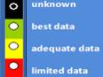
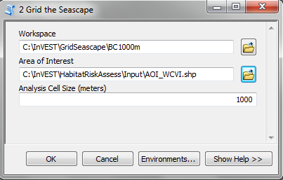
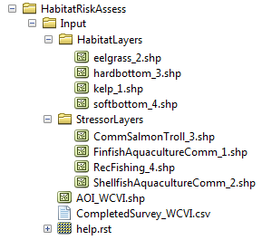
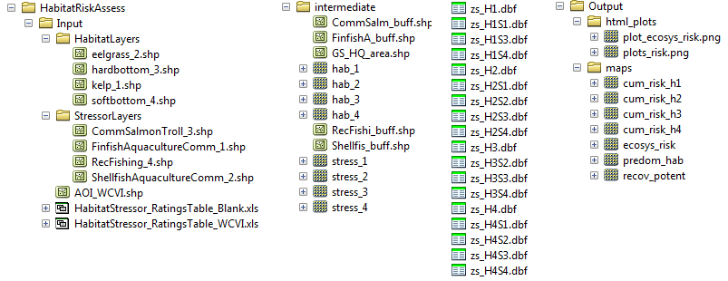

.. _habitat_risk_assessment:

.. |toolbox| image:: ./shared_images/toolbox.jpg
             :alt: toolbox
	     :align: middle 
	     :height: 15px

.. |folder| image:: ./shared_images/openfolder.png
             :alt: folder
	     :align: middle 
	     :height: 15px

.. |ok| image:: /shared_images/okbutt.png
             :alt: folder
	     :align: middle 
	     :height: 15px

.. |addbutt| image:: /shared_images/addbutt.png
             :alt: addbutt
	     :align: middle 
	     :height: 15px

.. |adddata| image:: /shared_images/adddata.png
             :alt: addbutt
	     :align: middle 
	     :height: 15px

.. |hra| image:: habitat_risk_assessment_images/image028.png
             :alt: habitatriskassessment
	     :align: middle 
	     :height: 15px

***********************
Habitat Risk Assessment
***********************

Summary
=======

The condition of a habitat is a key determinant of the ecosystem services it can provide.  Multiple stressors including fishing, climate change, pollution and coastal development threaten the ability of coastal ecosystems to provide the valuable goods and services that people want and need. As human activities continue to intensify in coastal areas, so does the need for quick, clear and repeatable ways of assessing the risks posed by human activities under various management plans. The InVEST habitat risk assessment (HRA) model allows users to assess the risk posed to coastal and marine habitats by human activities and the potential consequences of exposure for the delivery of ecosystem services and biodiversity. The InVEST HRA model is similar to the InVEST biodiversity model in that both models allow users to identify regions on a landscape or seascape where human impacts are highest. While the biodiversity model is intended to be used to assess how human activities impact biodiversity, the HRA model is better suited to screening the risk of current and future human activities to prioritize management strategies that best mitigate risk.

Risk of human activities (e.g. salmon aquaculture, coastal development etc.) to habitats (e.g. seagrasses, kelp forests, mangroves, reefs) is a function of the exposure of each habitat to each activity and the consequences for each habitat. A habitat is exposed to a stressor that occurs in the same location as the habitat at the same time.  Consequence depends on the effects of activities on habitat area and density, and the ability of habitats to recover from these effects (i.e., through processes such as recruitment and regeneration). Outputs from the model are useful for understanding the relative risk of human activities and climate change to habitats within a study region and among alternative future scenarios, and for identifying which habitats are of high enough quality to provide the services people care about. The model will help to prioritize areas for conservation and inform the design and configuration of marine spatial plans. This is a Tier 1 model.

Introduction
============

Nearshore habitats such as kelp forests and eelgrass meadows provide valuable ecosystem services including the protection of shorelines from storms, nursery habitat for fisheries, and carbon storage. As these habitats become degraded by human activities, the ecosystem services they provide are threatened. The impacts of human activities in coastal areas, both on land and in the sea, are pervasive in coastal ecosystems. Recent global analyses have revealed that almost no area of the world's oceans is untouched by human impacts (Halpern et al. 2008). Thus, an understanding of the location and intensity of human impacts on nearshore ecosystems is an essential component of informed and successful coastal and ocean management. The InVEST HRA model allows users to assess the threat of human activities to the health of these ecosystems. 

InVEST biodiversity model vs. InVEST habitat risk assessment model
------------------------------------------------------------------

A primary goal of conservation is the protection of biodiversity -- and biodiversity is intricately linked to the production of ecosystem services.  While some consider biodiversity to be an ecosystem service, the InVEST biodiversity model (found in the terrestrial toolbox) treats it as an independent attribute of natural systems, with its own intrinsic value (InVEST does not monetize biodiversity). InVEST includes a biodiversity model because natural resource managers, corporations and conservation organizations are becoming increasingly interested in understanding how and where biodiversity and ecosystem services align in space and how management actions affect both.  The biodiversity model uses habitat quality and rarity as a proxy for diversity.

When developing a similar model with marine systems in mind, differences in data availability (e.g. the rarity of an analog to land-use/land-cover maps in marine systems) and differences in thinking (e.g. the prevalence of a risk-assessment framework in fisheries science) led us to the development of the habitat risk assessment model described in this chapter.

Both the biodiversity model and the HRA model can be used to identify areas on a landscape or seascape where the risk posed by human activities is highest. Indeed, while the two models are segregated into the marine and terrestrial toolboxes, they can be used across systems.  However, the modeling approaches differ in several ways. First, the exposure-consequence framework of the HRA model allows model results to be interpreted in a manner that helps users explore which types of management strategies are likely to most effectively reduce risk (Figure 1). For example, ecosystems with high exposure and high consequence may be targeted for intense active management, while effective strategies for ecosystems with low exposure to human stressors but high consequence may include close monitoring but little active intervention unless exposure increases. Second, the transparent flexible structure and explicit visualization of data uncertainty in the HRA model facilitate its use in both data-rich and data-poor situations. Finally, the biodiversity model is better suited for terrestrial applications than marine applications because it requires a land use land cover map as an input. The HRA model can be used in both marine and terrestrial systems. 

.. figure:: habitat_risk_assessment_images/image002.jpg

   Habitats with high exposure to human activities and high consequence are at high risk. Plotting exposure and consequence data in this plot allows users to visualize risk, and to assess which types of risk are more effectively mitigated by human intervention (risks driven by exogenous human factors, top right region of the risk space) and which types of risk are better addressed through monitoring and preparedness (risks driven by endogenous habitat-specific factors).  (Adapted from Dawson et al. 2011).

Risk assessment has a long history in the field of ecotoxicology, and is now emerging as a valuable method in ecosystem-based fisheries management (Astles et al. 2006, Hobday et al. 2011). Risk assessment is used to determine the likelihood that a hazard will cause undesired consequences (Burgman 2005). In the context of marine ecosystem-based management, risk assessment evaluates the probability that human activities will impede the achievement of desired marine management objectives. In the HRA model, we define risk as the likelihood that human activities will reduce the quality of nearshore habitats to the point where their ability to deliver ecosystem services is impeded. Researchers have made significant progress in evaluating human impacts on marine ecosystems in recent years. However many of these approaches lack generality because they are focused on the effects of a single sector (i.e. fisheries e.g. Astles et al. 2006, Hobday et al. 2011), or have limited transparency and flexibility because they are based on expert opinion (Halpern et al. 2008, Teck et al. 2010). The HRA model in Marine InVEST builds on these approaches and allows users to evaluate the risk posed by a variety of human activities to key coastal habitats in a transparent, repeatable and flexible way.  

The model
=========

The risk of human activities to coastal and nearshore habitats is a function of the habitat's exposure to the activity and the consequence of exposure. To determine exposure, users provide model inputs such as base maps of habitat distribution and human activities, the timing and intensity of the activity, and the effectiveness of current management practices in safeguarding habitats.  To determine consequence, users provide model inputs such as observed loss of habitat and the ability of habitats to recover. The model is flexible and can accommodate data-poor and data-rich situations. Data may come from a combination of peer-reviewed sources at the global scale and locally available fine-scale data sources. Model inputs and results can be updated as better information becomes available.  

The HRA model produces maps that display the relative risk from a variety of human activities on habitats within a study region and among alternative future scenarios. When run as part of a complete Marine InVEST analysis, the HRA model can be used to identify which human activities are likely to cause trade-offs in other ecosystem services. As a result, the model will help managers prioritize and evaluate management strategies with regards to their effectiveness of reducing risks to nearshore habitats and maintaining the delivery of desired ecosystem services. 

How it works
------------

The HRA model combines information about the exposure of habitats to each stressor with information about the consequence of that exposure for each habitat to produce maps of risk to habitats and habitat quality.  Exposure depends on the extent of geographic overlap between habitats and human activities, the duration of time that the activity and habitat overlap, the intensity of the stressor, and the degree to which management strategies mitigate impact.  The consequence depends on the degree of habitat loss, change in habitat structure, and the ability of habitats to recover from these effects (i.e., through life history traits such as recruitment and regeneration rates). The modelling approach is flexible so if any of the factors that influence exposure and consequence are irrelevant in your system, you don't have to include them (see No Score option in the following section).

Risk of human activities to habitats
^^^^^^^^^^^^^^^^^^^^^^^^^^^^^^^^^^^^

The risk of human activities to habitats is modeled in three steps.  

**Step 1.** The first step involves determining the likelihood of exposure of the habitat to the stressor and the consequence of this exposure. Exposure and consequence are both determined by assigning a score HIGH, MEDIUM or LOW to a standardized set of criteria for each attribute. Guidelines for scoring each criterion are provided in the GUI help windows and summarized below. To ensure transparency, we recommend that scores be determined using readily available data from peer-reviewed literature or published reports. However, you are free to use any data you believe to be the most accurate. For each score assigned, you have the option of indicating the quality of the data used to determine the score. This allows you to assign greater weight to criteria for which the confidence in the scoring was higher. Thus, the overall exposure :math:`E` and consequence :math:`C` scores are calculated as weighted averages of the exposure values :math:`e_i` and consequence values :math:`c_i`  for each criterion *i* as 

.. math:: E = \frac{\sum^N_{i=1}\frac{e_i}{d_i}}{\sum^N_{i=1}\frac{1}{d_i}}
   :label: eq1

.. math:: C = \frac{\sum^N_{i=1}\frac{c_i}{d_i}}{\sum^N_{i=1}\frac{1}{d_i}}
   :label: eq2

where :math:`d_i` represents the data quality rating for criterion *i* and *N* is the number of criteria evaluated for each habitat. 

**Step 2.** The second step combines the exposure and response values to produce a risk value for each stressor-habitat combination. Risk to habitat *i* caused by stressor *j* is calculated as the Euclidean distance from the origin in the exposure-consequence space,

.. math:: R_{ij} = \sqrt{(E-1)^2+(C-1)^2}
   :label: eq3

.. figure:: habitat_risk_assessment_images/image010.jpg

**Step 3.** In the final step the model quantifies the cumulative risk of all stressors on the habitats. Cumulative risk for habitat *i* is the sum of all risk scores for each habitat,

.. math:: R_i = \sum^J_{j=1} R_{ij}
   :label: eq4

Exposure and consequence criteria in more detail
^^^^^^^^^^^^^^^^^^^^^^^^^^^^^^^^^^^^^^^^^^^^^^^^

Exposure of habitats to stressors
"""""""""""""""""""""""""""""""""

The risk of a habitat being affected by a stressor depends in part on the exposure of the habitat to that stressor. Stressors may impact habitats directly and indirectly. Because indirect impacts are poorly understood and difficult to trace, we only model the risk of stressors that directly impact habitat by overlapping in space. Other important considerations include the duration of spatial overlap, intensity of the stressor, and whether management strategies reduce or enhance exposure.

1. **Spatial overlap rating.**  To assess spatial overlap in the study area, the model uses maps of the distribution of habitats and stressors.  Habitat types can be biotic, such as eelgrass or kelp, or abiotic, such as hard or soft bottom. The user defines the detail of habitat classification. For example, habitats can be defined as biotic or abiotic, by taxa (e.g., coral, seagrass, mangrove), by species (e.g., red, black mangroves), or in whatever scheme the user desires.  However, the user should keep in mind that in order for such detail to be useful and change the outcome of the model, these habitat classifications should correspond with differences between habitats in their response to the stressors.  

Also, the model requires the user to input maps of the distribution and zone of influence of each stressor. The zone of influence of each stressor is the distance over which the stressor spreads beyond the footprint the stressor indicated in the stressor map. For some stressors, such as over-water structures that shade eelgrass beds, this distance will be small.  For other stressors, such as finfish aquaculture pens where nutrients spread 300-500m this distance may be large. The model uses the maps of habitat and stressor distributions to calculate the percentage of each habitat type that overlaps with each stressor and its footprint.

We use the following categories to classify HIGH, MEDIUM and LOW spatial overlap:

=============== =========================================== ============================================== ============================================ ========
..              High (3)                                    Medium (2)                                     Low (1)                                      No score
=============== =========================================== ============================================== ============================================ ========
Spatial Overlap >30% of habitat type overlaps with stressor 10%-30% of habitat type overlaps with stressor 0-10% of habitat type overlaps with stressor N/A
=============== =========================================== ============================================== ============================================ ========
Choose No score to exclude this criteria from your assessment.

2. **Overlap time rating.**  Temporal overlap is the duration of time that the habitat and the stressor experience spatial overlap. Some stressors, such as permanent overwater structures, are present year-round; others are seasonal, such as certain fishing practices. Similarly, some habitats (e.g. mangroves) are present year round, while others are more ephemeral (e.g. some seagrasses). 

We use the following categories to classify HIGH, MEDIUM and LOW temporal overlap:

================ ========================================================= ======================================================== ======================================================== ========
..               High (3)                                                  Medium (2)                                               Low (1)                                                  No score
================ ========================================================= ======================================================== ======================================================== ========
Temporal overlap Habitat and stressor co-occur for 8-12 months of the year Habitat and stressor co-occur for 4-8 months of the year Habitat and stressor co-occur for 0-4 months of the year N/A
================ ========================================================= ======================================================== ======================================================== ========
Choose No score to exclude this criteria from your assessment.

3. **Intensity rating.** The intensity criterion is stressor-specific and the rank is relative to the other stressors within the study region. For example, the intensity of nutrient-loading stress associated with netpen salmon aquaculture is related to the number of salmon in the farm, and how much waste is released into the surrounding environment. Similarly, the intensity of destructive shellfish harvesting is related to the number of harvesters and the harvest practices. 

We use the following categories to classify HIGH, MEDIUM and LOW intensity:

========= ============== ================ ============= ========
..        High (3)       Medium (2)       Low (1)       No score
========= ============== ================ ============= ========
Intensity High intensity Medium intensity Low intensity N/A
========= ============== ================ ============= ========
Choose No score to exclude this criteria from your assessment.

4. **Management strategy effectiveness rating.** Management can limit the negative impacts of human activities on habitats. For example, policies that require salmon aquaculturists to let their farms lie fallow may reduce the amount of waste released and allow nearby seagrasses to recover. Similarly, regulations that require a minimum height for overwater structures reduce the shading impacts of overwater structures on submerged aquatic vegetation. Thus, effective management strategies will reduce the exposure of habitats to stressors. The effectiveness of management of each stressor is scored relative to other stressors in the region on a scale of 1-3. 

We use the following categories to classify HIGH, MEDIUM and LOW management effectiveness:

======================== ============================= ================== ============== ========
..                       High (3)                      Medium (2)         Low (1)        No score
======================== ============================= ================== ============== ========
Management effectiveness Not effective, poorly managed Somewhat effective Very effective N/A
======================== ============================= ================== ============== ========
Choose No score to exclude this criteria from your assessment.

Consequence of exposure
^^^^^^^^^^^^^^^^^^^^^^^

The risk of a habitat being degraded by a stressor depends on the consequence of exposure. The consequence of exposure depends on the ability of a habitat to resist the stressor and to recover following exposure and can be assessed using four key attributes: change in area, change in structure, frequency of natural disturbance, and recovery attributes.  We describe each in turn below.

1. **Change in area rating.** Change in area is measured as the percent change in areal extent of a habitat when exposed to a given stressor and thus reflects the sensitivity of the habitat to the stressor. Habitats that lose a high percentage of their areal extent when exposed to a given stressor are highly sensitive, while those habitats that lose little area are less sensitive and more resistant. 

We use the following categories to classify HIGH, MEDIUM and LOW change in area:

============== =========================== ============================ ======================== ========
..             High (3)                    Medium (2)                   Low (1)                  No score
============== =========================== ============================ ======================== ========
Change in area High loss in area (50-100%) Medium loss in area (20-50%) Low loss in area (0-20%) N/A
============== =========================== ============================ ======================== ========
Choose No score to exclude this criteria from your assessment.

2. **Change in structure rating.** For biotic habitats, the change in structure is the percentage change in structural density of the habitat when exposed to a given stressor. For example, change in structure would be the change in shoot density for seagrass systems, change in polyp density for corals, or change in stipe density for kelp systems. Habitats that lose a high percentage of their structure when exposed to a given stressor are highly sensitive, while habitats that lose little structure are less sensitive and more resistant. For abiotic habitats, the change in structure is the amount of structural damage sustained by the habitat. Sensitive abiotic habitats will sustain complete or partial damage, while those that sustain little to no damage are more resistant. For example, gravel or muddy bottoms will sustain partial or complete damage from bottom trawling while hard bedrock bottoms will sustain little to no damage.

We use the following categories to classify HIGH, MEDIUM and LOW change in structure:

=================== ==================================================================================================================== ======================================================================================================================= ======================================================================================================================== ========
..                  High (3)                                                                                                             Medium (2)                                                                                                              Low (1)                                                                                                                  No score
=================== ==================================================================================================================== ======================================================================================================================= ======================================================================================================================== ========
Change in structure High loss in structure (for biotic habitats, 50-100% loss in density, for abiotic habitats, total structural damage) Medium loss in structure (for biotic habitats, 20-50% loss in density, for abiotic habitats, partial structural damage) Low loss in structure (for biotic habitats, 0-20% loss in density, for abiotic habitats, little to no structural damage) N/A
=================== ==================================================================================================================== ======================================================================================================================= ======================================================================================================================== ========
Choose No score to exclude this criteria from your assessment.

3. **Frequency of natural disturbance rating.** If a habitat is naturally frequently perturbed in a way similar to the anthropogenic stressor, it may be more resistant to additional anthropogenic stress. For example, habitats in areas that experience periodical delivery of nutrient subsidies (i.e. from upwelling or allocthonous inputs such as delivery of intertidal plant material to subtidal communities) are adapted to variable nutrient conditions and may be more resistant to nutrient loading from netpen salmon aquaculture. This criterion is scored separately for each habitat-stressor combination, such that being adapted to variable nutrient conditions increases resistance to nutrient loading from salmon aquaculture but not destructive fishing. However, high storm frequency may increase resistance to destructive fishing, because both stressors impact habitats in similar ways. 

We use the following categories to classify HIGH, MEDIUM and LOW natural disturbance frequencies:

================================ ====================== ====================== =============== ========
..                               High (3)               Medium (2)             Low (1)         No score
================================ ====================== ====================== =============== ========
Frequency of natural disturbance Annually or less often Several times per year Daily to weekly N/A
================================ ====================== ====================== =============== ========
Choose No score to exclude this criteria from your assessment.

4. **Recovery attributes.** Life history traits such as regeneration rates and recruitment patterns influence the ability of habitats to recover from disturbance.  For biotic habitats, we treat recovery as a function of natural mortality, recruitment, age of maturity, and connectivity

  i. Natural mortality rate rating (biotic habitats only): Habitats with high natural mortality rates are generally more productive and more capable of recovery.

  We use the following categories to classify HIGH, MEDIUM and LOW natural mortality rates:

  ====================== ========================== ================================ ================================== ========
  ..                     High (3)                   Medium (2)                       Low (1)                            No score
  ====================== ========================== ================================ ================================== ========
  Natural mortality rate Low mortality (e.g. 0-20%) Moderate mortality (e.g. 20-50%) High mortality (e.g.80% or higher) N/A
  ====================== ========================== ================================ ================================== ========
  Choose No score to exclude this criteria from your assessment.

  ii. Recruitment rating (biotic habitats only): Frequent recruitment increases recovery potential by increasing the chance that incoming propagules can re-establish a population in a disturbed area.

  We use the following categories to classify HIGH, MEDIUM and LOW natural recruitment rate:

  ======================== ============ ============= ==================== ========
  ..                       High (3)     Medium (2)    Low (1)              No score
  ======================== ============ ============= ==================== ========
  Natural recruitment rate Every 2+ yrs Every 1-2 yrs Annual or more often N/A
  ======================== ============ ============= ==================== ========
  Choose No score to exclude this criteria from your assessment.

  iii. Age at maturity/recovery time: Biotic habitats that reach maturity earlier are likely to be able to recover more quickly from disturbance than those that take longer to reach maturity.  Here we refer to maturity of the habitat as a whole (i.e., a mature kelp forest) rather than reproductive maturity of individuals.  For abiotic habitats, shorter recovery times for habitats such as mudflats decrease the consequences of exposure to human activities. In contrast, habitats made of bedrock will only recover on geological time scales, greatly increasing the consequences of exposure. 

  We use the following categories to classify HIGH, MEDIUM and LOW age at maturity/recovery time:

  ============================= ================ ========== ============== ========
  ..                            High (3)         Medium (2) Low (1)        No score
  ============================= ================ ========== ============== ========
  Age at maturity/recovery time More than 10 yrs 1-10yrs    Less than 1 yr N/A
  ============================= ================ ========== ============== ========
  Choose No score to exclude this criteria from your assessment.

  iv. Connectivity rating (biotic habitats only): Larval dispersal and close spacing of habitat patches increases the recovery potential of a habitat by increasing the chance that incoming propagules can re-establish a population in a disturbed area. 

  We use the following categories to classify HIGH, MEDIUM and LOW connectivity:

  ============ ============================== =========================== ======================= ========
  ..           High (3)                       Medium (2)                  Low (1)                 No score
  ============ ============================== =========================== ======================= ========
  Connectivity Low dispersal (less than 10km) Medium dispersal (10-100km) High dispersal (>100km) N/A
  ============ ============================== =========================== ======================= ========
  Choose No score to exclude this criteria from your assessment.

Guidelines for scoring data quality
^^^^^^^^^^^^^^^^^^^^^^^^^^^^^^^^^^^

Risk assessment is an integrative process, which requires a substantial amount of data on many attributes of human and ecological systems. It is likely that some aspects of the risk assessment will be supported high quality data and others aspects will be subject to limited data availability and high uncertainty. The user has the option of scoring data quality to put greater weight on the criteria for which confidence is higher in the calculation of risk (eq. 8.1). To increase the transparency of the model results, we color-code the results in the output figures according to the average quality of the data that was used to generate each score. We hope that by including the option to rate data quality in the model, users will be aware of some sources of uncertainty in the risk assessment, and will therefore be cautious when using results derived from low quality data. In addition, the information generated from this rating process can be used to guide research and monitoring effects to improve data quality and availability. 

Gregg, cut this fig from excel file and change to screen shot of data quality choices in GUI - can just from any window that gives option to rank data quality.

For each exposure and consequence score, users can indicate the quality of the data that was used to determine the score as best, adequate or limited. 

===================================================================================================================================================== ==================================================================================================================================================================== ===================================================================================================================== =======
Best data (1)                                                                                                                                         Adequate data                                                                                                                                                        Limited data                                                                                                          Unknown
===================================================================================================================================================== ==================================================================================================================================================================== ===================================================================================================================== =======
Substantial information is available to support the score and is based on data collected in the study region (or nearby) for the species in question. Information is based on data collected outside the study region, may be based on related species, may represent moderate or insignificant statistical relationships. No empirical literature exists to justify scoring for the species but a reasonable inference can be made by the user. N/A
===================================================================================================================================================== ==================================================================================================================================================================== ===================================================================================================================== =======

Limitations and Simplifications
-------------------------------

Limitations
^^^^^^^^^^^

1. **Results are limited by data quality**: The accuracy of the model results is limited by the availability and quality of input data. Using high quality data such as those from local assessments replicated at several sites within the study region for the species in question within the last ten years will yield more accurate results than using lower quality data that are collected at a distant location with limited spatial or temporal coverage. In most cases, users will need to use data from other geographic locations for some of the stressor-habitat combinations because most of the data on the effects of some stressors have only been collected in a limited number of locations worldwide. To overcome these data limitations, we include a data quality score in the analysis.  This score allows users to down-weight criteria for which data quality is low. In addition, the uncertainty associated with data quality is displayed visually in the model outputs (e.g. results derived from high quality data are displayed in green vs. low quality data in red).

2. **Results should be interpreted on a relative scale**: Due to the nature of the scoring process, results can be used to compare the risk of several human activities among several habitats within the study region (which can range in size from small local scales to a global scale), but should not be used to compare risk calculations from separate analyses.

3. **Results do not reflect the effects of past human activities**. The HRA model does not explicitly account for the effects of historical human activities on the current risk. Exposure to human activities in the past may affect the consequence of human activities in the present and future. If users have historical data on the exposure of habitats to human activities (e.g. spatial and temporal extent), and information on how this affects current consequence scores, they may include this information in the analysis for more accurate results. 

4. **Results are based on equal weighting of criteria**. The model calculates the exposure and consequence scores assuming that the effect of each criterion (i.e. spatial overlap and recruitment pattern) is of equal importance in determining risk. The relative importance of each of the criteria is poorly understood, so we assume equal importance. However, in future releases for the model will allow users to weight the importance of each criterion in determining overall risk.

Assumptions
^^^^^^^^^^^

1. Often information in the literature about the effect stressors on habitats comes from only a few locations.  If using globally available data or data from other locations, users make the assumption that *ecosystems around the world respond in similar ways to any given stressor* (i.e. eelgrass in the Mediterranean responds to netpen aquaculture in the same way as eelgrass in British Columbia). To avoid making this assumption across the board, users should use local data whenever possible.

2. **Cumulative risk is additive (vs. synergistic or antagonistic)**. The interaction of multiple stressors on marine ecosystems is poorly understood (see Crain et al. 2008 for more information). Interactions may be additive, synergistic or antagonistic. However, our ability to predict the type of interaction that will occur is limited. Due to the absence of reliable information on the conditions that determine additivity, synergism or antagonism, the model assumes additivity because it is the simplest approach. As a result, the model may over- or under-estimate the cumulative risk depending on the set of stressors occurring in the study region.

.. _hra-data-needs:

Data needs
==========

The model uses an interface to input all required and optional model data.  Here we outline the options presented to the user via the interface and the maps and data tables used by the model.  First we describe required inputs, followed by a description of optional inputs.

Grid the seascape tool
----------------------

Before running the HRA model, users must provide an area of interest (AOI) and cell size to Grid the Seascape (GS).  To run the GS tool, the user must create a polygon AOI that is projected meters. You can create an AOI shapefile by following the Creating an AOI instructions in the :ref:`FAQ`.  After providing a workspace location and AOI, select a cell size to define width and height of each unique grid cell.  By specifying "500" in the interface, an analysis grid within the AOI at a cell size of 500m x 500m will be created.
 

Required inputs
---------------

First we describe required inputs.  The required inputs are the minimum data needed to run this model.

1. **Workspace Location (required)**. Users are required to specify a workspace folder path.  It is recommended that the user create a new folder for each run of the model.  For example, by creating a folder called "runBC" within the "HabitatRiskAssess" folder, the model will create "intermediate" and "output" folders within this "runBC" workspace.  The "intermediate" folder will compartmentalize data from intermediate processes.  The model's final outputs will be stored in the "output" folder. ::

     Name: Path to a workspace folder.  Avoid spaces 
     Sample path:  \\InVEST\\ HabitatRiskAssess\\runBC

2. **Gridded Seascape (GS) Output Layer (required)**. After running the "Grid the Seascape" (GS) tool, a polygon shapefile will be created that contains cells of a user-specified size to instruct the HRA model as to the extent and resolution of analysis.  For this input, select the shapefile found in the "Output" folder from a successful GS tool run. ::

     Name: File can be named anything, but no spaces in the name
     File type:  polygon shapefile (.shp)
     Sample data set: \InVEST\GridSeascape\BC500m\Output\gs_[cellsize].shp

3. **Habitat Data Directory (required)**. Users are required to specify the path on their system to the folder with habitat input data.  All data in this folder must be shapefiles, projected in meters, and contain the following naming convention:

   "[habitat file name]_[unique Integer ID].shp" (e.g. "kelpWCVI_1.shp")

   The use of a unique identifier after the underscore ("_") at the end of the file name allows the model to link the ratings from the Habitat-Stressor Ratings table to the correct input layer.  It is recommended that users adjust file names/IDs to shapefiles using ArcCatalog.

   .. figure:: habitat_risk_assessment_images/image016.png

   The model allows a maximum of eight habitat layers for this input.  Do not store any additional files that are not part of the analysis in this folder directory.

   When determining the predominate habitat in a cell, the model establishes a hierarchy where it prioritizes habitats listed in the input #5 table in ascending order (i.e. kelp_1 comes before eelgrass_2, which comes before softbottom_3, etc). If users are more interested in biotic habitats (i.e. eelgrass, kelp, mangroves) than abiotic habitats (i.e. rocky bottom), they should list biotic habitats before abiotic habitats. To avoid larger abiotic layers being selected as the predominant habitat, preprocess the habitat data by erasing areas of abiotic habitat that overlap the biotic ones. ::

     Name: Path to a habitat data folder.  Avoid spaces.
     Sample: \InVEST\HabitatRiskAssess\Input\HabitatLayers

4. **Stressor Data Directory (required)**. Users are required to specify the path on their system to the folder with stressor input data.  All data in this folder must be shapefiles, projected in meters, and contain the following naming convention:

   "[stressor file name]_[unique Integer ID].shp" (e.g. "netpensWCVI_1.shp")

   The use of a unique identifier after the underscore ("_") at the end of the file name allows the model to link the ratings from the Habitat-Stressor Ratings table to the correct input layer.

   .. figure:: habitat_risk_assessment_images/image017.png
 
   It is recommended that users adjust file names/IDs to shapefiles using ArcCatalog.  The model allows a maximum of ten habitat layers for this input.  Do not store any additional files that are not part of the analysis in this folder directory. ::

     Name: Path to a stressor data folder.  Avoid spaces.
     Sample path: \InVEST\HabitatRiskAssess\Input\StressorLayers

5. **Habitat-Stressor Scores (required)**. The user must use the GUI to instruct the model on various habitat, stressor and habitat-stressor specific scores for the consequence and exposure criteria.  

   To run the GUI go to XXXXX and do XXX (Gregg, Martin?)
 
   screen shot of where to find GUI to run it
   
   There are 5 main steps to running the GUI.
   
   1. Choose to create new habitat-stressor scores, import existing scores, or use the sample scores.  When beginning a new project, we recommend first running the model with the sample data and scores and then creating new scores for the user's site.  When creating new scores, the GUI will prompt the user to create a name for the output. Importing existing scores is useful when running alternative management scenarios.  We recommend using a previous version of the scores and making changes where necessary to reflect a new scenario.
   
   Gregg, screen shot of this window
   
   2. Decide whether to edit categories for scoring criteria.  The default categories are derived from peer-reviewed literature, and we recommend using these pre-established categories.  However, you have the option to edit categories for scoring criteria.  Only choose this option if the default categories for one or more criteria do not apply to your system or the questions you are trying to address with the risk assessment.  

  Gregg, screen shot of this window
  
  For example, the user could change the areal extent categories to reflect a different set of cut off points for the low, mediium and high changes in area of habitat due to a stressor.
  
  Gregg, screen shot of 'specify the change in habitat area window'
  
  3. Decide whether to edit the number and names of stressors and habitats and the scores for any of the exposure and consequence criteria.  These data are required to run the model. Choose 'no' if you are satisified with the data you imported or the sample data. Rating the quality of each dataset and score is optional.   
 
  Gregg, screen shot of the window asking whether you want to edit data.
  
  For example, the GUI prompts to user to enter the number and names of all stressors.
  
  Gregg, screen shot of stressor names window.
  
  4. Decide to change the weighting of any of the criteria.  The default setting indicates that the model should weight all the exposure and consequence criteria equally in the risk calculation.  However, the user can choose to weigh some criteria higher or lower than other criteria, depending on input from the literature, expert opinion or his/her understanding of the system.  For example, spatial overlap could be weighted higher if the user intends for this criteria is the most fundamental aspect of exposure and risk.
  
  Gregg, screen shot of weighting windo for exposure criteria
  
  5. Export the assessment.  The user must export the results of the GUI to load into the ArcGIS interface.  The user to export a separate .csv files for each run of the model (e.g., for different locations or different scenarios in the same location).  The installer provides a sample .csv file for possible input.  This file contains the rankings to run the sample data from the west coast of Vancouver Island, Canada. ::
   

     Table Name: File can be named anything, but no spaces in the name 
     File type: ``*``.cvs (if user has MS Excel 2007 or newer)
     Sample: \InVEST\HabitatRiskAssess\Input\Scores_WCVI_ScenarioA.csv

Optional inputs
---------------

The last input is optional, and requires additional Python extensions to generate the 2D plots.

7. **Create HTML output with risk plots (optional)**. By checking this box, the model will generate a series of figures, which clearly display the exposure-consequence ratings and the resulting risk results for each habitat-stressor combination. It will also create a figure showing cumulative risk for all habitats in the study region. This option requires the Matplotlib python extension. If this option is selected, the model will check that Matplotlib is installed successfully and generate an HTML document that displays the aforementioned plots.  For more information on how to install this Python extension, please consult the Getting Started section or the :ref:`FAQ`.

Running the model
=================

.. note:: The word 'path' means to navigate or drill down into a folder structure using the Open Folder dialog window that is used to select GIS layers or Excel worksheets for model input data or parameters. 

Exploring the workspace and input folders
-----------------------------------------

These folders will hold all input, intermediate and output data for the model. As with all folders for ArcGIS, these folder names must not contain any spaces or symbols. See the sample data for an example.

Exploring a project workspace and Input data folder
^^^^^^^^^^^^^^^^^^^^^^^^^^^^^^^^^^^^^^^^^^^^^^^^^^^
The \\InVEST\\HabitatRiskAssess\\ folder holds the main working directory for the model. Within this folder there will be a subfolder named 'Input'. It holds most of the GIS and tabular data needed to setup and run the model. 

The following image shows the sample folder structure and accompanying GIS data. We recommend using this folder structure as a guide to organize your workspaces and data. Refer to the following screenshots below for examples of folder structure and data organization.

Creating a run of the model
---------------------------

The following example of setting up the HRA model uses the sample data and folder structure supplied with the InVEST installation package (see the :ref:`hra-data-needs` section for a more complete description of the data).  These instructions only provide a guideline on how to specify to ArcGIS the various types of data needed and does not represent any site-specific model parameters. Users might choose different input parameters and/or have location-specific data to use in place of the sample data.

1. Click the plus symbol |toolbox| next to the InVEST toolbox.

2. Expand the Marine toolset and click on the HRA script |hra| to open the model. 

   .. figure:: habitat_risk_assessment_images/image029_350.png
 
3. Specify the Workspace. Open |folder| the InVEST workspace. If you created your own workspace folder (Step 1), then select it here.

   Select the *HabitatRiskAssess* folder and click |addbutt| to set the main model workspace. This is the folder in which you will find the intermediate and final outputs when model is run.

   .. figure:: habitat_risk_assessment_images/image034.png

4. Specify the Analysis Zones Layer. This input is the actual layer to be used for the overlap analysis.  Depending on your choice for the previous input, click |folder| and path to \\InVEST\\GridSeascape directory and select the polygon shapefile in the "Output" folder from a successful GS tool run.
 
   .. figure:: habitat_risk_assessment_images/image036.png

5. Specify the Habitat Data Directory. The model requires the folder location of spatial habitat data. Click |folder| and path to the \\InVEST\\HabitatRiskAssess\\Input\\ folder. Select the HabitatLayers folder and click |addbutt| to set this data folder.
 
   .. figure:: habitat_risk_assessment_images/image039.png

6. Specify the Stressor Data Directory. The model requires the folder location of spatial stressor data. Click |folder| and path to the \\InVEST\\HabitatRiskAssess\\Input\\ folder. Select the StressorLayers folder and click |addbutt|   to set this data folder.

   .. figure:: habitat_risk_assessment_images/image040.png

7. Specify the Habitat-Stressor Ratings Table. The model requires a table of parameters for how to recognize and optionally buffer or weight each input layer.  This information must be stored in a Worksheet in an Excel workbook file (.xls). See the :ref:`hra-data-needs` section for more information on creating and formatting these data.  This worksheet will be supplied for you.

   Click |folder| and path to the \\InVEST\\HabitatRiskAssess\\Input data folder. Double left-click on the Excel file HabitatStressor_RatingsTable_WCVI.xls

   Click |addbutt| to make the selection.

   .. figure:: habitat_risk_assessment_images/image042.png

8. Specify the Plotting Functionality (Optional). To plot risk scoring, click the checkbox. This option is only available if the Matplotlib Python extension is successfully installed. 

   .. figure:: habitat_risk_assessment_images/image043.png

9. At this point the model dialog box is completed for a complete run of the Habitat Risk Assessment model. 
 
   .. figure:: habitat_risk_assessment_images/image045.jpg

   Click |ok| to start the model run. The model will begin to run and will show a progress window with progress information about each step in the analysis. Once the model finishes, the progress window will show all the completed steps and the amount of time necessary for the model run.

   .. figure:: habitat_risk_assessment_images/image049.jpg

Multiple runs of the model
--------------------------

The tool setup is the same as for a single run, but the user needs to specify a new workspace for each new run. Make sure each workspace exists under the main directory (i.e. HabitatRiskAssess folder in the example above). As long as all data are contained within the main Input data folder you can use the same Input folder for multiple runs. For example, using the sample data, if you wanted to create two runs of the HRA model based on two different data quality ratings for a fishing stressors, you could use the Input data folder under main HRA folder and create two new workspace folders, "runHRA500m" and "runHRA500m2" ("500" stands for the resolution of gridded seascape in meters).  See below for an example of the folder setup. 

Viewing output from the model
-----------------------------

Upon successful completion of the model, you will see new folders in your Workspace called "intermediate" and "Output". The Output folder, in particular, may contain several types of spatial data, which are described in the :ref:`hra-interpreting-results` section.

 
You can view the output spatial data in ArcMap using the Add Data button. |adddata| 

You can change the symbology of a layer by right-clicking on the layer name in the table of contents, selecting "Properties", and then "Symbology".  There are many options here to change the way the data appear in the map.

You can also view the attribute data of output files by right clicking on a layer and selecting "Open Attribute Table". 

.. _hra-interpreting-results:

Interpreting results
====================

Model outputs
-------------

The following is a short description of each of the outputs from the HRA model.  Each of these output files is saved in the "Output" folder that is saved within the user-specified workspace directory:

Output folder
^^^^^^^^^^^^^

GIS
"""

+ Output\\maps\\predom_hab

  + This raster layer depicts the predominant habitat (e.g. the habitat that covers the most area) in each grid cell.  If two layers tie for most overlap area, the spatial layer with the lower ID number will be chosen.

+ Output\\maps\\recov_potent

  + This raster layer depicts the recovery potential of the predominant habitat in each cell. Recovery potential is based on natural mortality rate, recruitment rate, age at maturity/recovery time and connectivity. Recovery potential is useful to those who are interested in identifying areas where habitats are more resilient to human stressors, and therefore may be able to withstand increasing stress. Habitats with low recovery potential are particularly vulnerable to intensifying human activities. 

+ Output\\maps\\ecosys_risk

  + This raster layer depicts the sum of all cumulative risk scores for all habitats in each grid cell. It is best interpreted as an integrative index of risk across all habitats in a grid cell. For example, in a nearshore grid cell that contains some coral reef, mangrove and soft bottom habitat, the ecosys_risk value reflects the risk to all three habitats in the cell. The ecosys_risk value increases as the number of habitats in a cell exposed to stressors increases.

+ Output\\maps\\cum_risk_H[habitat number] (e.g. cum_risk_H2)

  + This raster layer depicts the cumulative risk for all the stressors in a grid cell on a habitat-by-habitat basis. For example, "cum_risk_H2" depicts the risk from all stressors on habitat "H2". Cumulative risk is derived by summing the risk scores from each stressor (i.e. more stressors leads to higher cumulative risk). This layer is informative for users who want to know how cumulative risk for a given habitat varies across a study region (e.g. identify hotspots where eelgrass or kelp is at high risk from multiple stressors). Hotspots of high cumulative risk may be targeted for restoration or monitoring. 

HTML and plots
""""""""""""""

+ Output\\html_plots\\output.html

  + This custom html file for each model run contains figures that display cumulative ecosystem risk (i.e. risk to all the habitats in the study region) and risk of each stressor to each habitat individually. The figures in this output will help users visualize the uncertainty associated with various aspects of the risk assessment, as the model results are color-coded according to the quality of data involved in the scoring process. Please see the explanations in the html file for more information.

+ Output\\html_plots\\plot_ecosys_risk.png

  + This figure shows the cumulative risk for each habitat in the study region. This figure can be used to determine which habitats are at highest risk from human activities, and if this risk is mostly due to high cumulative exposure (exogenous factors that can be mitigated by management) or high cumulative consequence (endogenous factors that are less responsive to human intervention).  

+ Output\\html_plots\\plots_risk.png

  + These figures show the exposure and consequence scores for each stressor and habitat combination in the study region. Stressors that have high exposure scores and high consequence scores pose the greatest risk to habitats. Reducing risk through management is likely to be more effective in situations where high risk is driven by high exposure, not high consequence. 

Log file
""""""""

+ Parameters_[yr-mon-day-min-sec].txt

  + Each time the model is run a text file will appear in the workspace folder.  The file will list the parameter values for that run and be named according to the date and time.
  + Parameter log information can be used to identify detailed configurations of each of scenario simulation.

  .. figure:: habitat_risk_assessment_images/image055.png

  .. figure:: habitat_risk_assessment_images/image057.png

Intermediate folder
^^^^^^^^^^^^^^^^^^^

+ intermediate\\[first 8 characters of input layer name]_buff.shp

  + For all layers where a buffer distance is specified in the "Habitat-Stressor Ratings Table" (input #5), there will be a vector layer with the buffer applied.

+ intermediate\\hab_[ID]

  + These files are the rasterized copies of habitat inputs at 50m resolution.

+ intermediate\\stress_[ID]

  + After all the specified stressor layers have been buffered, these files are the rasterized copies at 50m resolution.

+ intermediate\\zs_H[ID].dbf

  + These .dbf tables provide zonal statistics for grid cell values where a particular habitat overlaps the gridded seascape.

+ intermediate\\zs_H[ID]S[ID].dbf

  + These .dbf tables provide zonal statistics for grid cell values where a particular habitat and stressor overlap the gridded seascape.  Some combinations may be missing indicating relationships where no habitat-stressor overlap occurs.

+ intermediate\\GS_HQ_area.shp

  + This shapefile contains all the overlap analysis and risk scoring calculations with each row in the table corresponding to a particular gridded seascape cell.  Outputs are generated from the statistics in this polygon feature class.

References
==========

Astles, K. L., Holloway, M. G., Steffe, A., Green, M., Ganassin, C., & Gibbs, P. J. 2006. An ecological method for qualitative risk assessment and its use in the management of fisheries in New South Wales, Australia. Fisheries Research, 82: 290-303.

Burgman, M. 2005. Risks and decisions for conservation and environmental management. Cambridge University Press, Cambridge, UK.

Crain, C. M., Kroeker, K., & Halpern, B. S. 2008. Interactive and cumulative effects of multiple human stressors in marine systems. Ecology Letters, 11: 1304-1315.

Dawson, T. P., Jackson, S. T., House, J. I., Prentice, I. C., & Mace, G. M. 2011. Beyond Predictions: Biodiversity Conservation in a Changing Climate. Science, 332: 53-58.

Halpern, B. S., Walbridge, S., Selkoe, K. A., Kappel, C. V., Micheli, F., D'Agrosa, C., Bruno, J. F., et al. 2008. A Global Map of Human Impact on Marine Ecosystems. Science, 319: 948-952.

Hobday, A. J., Smith, A. D. M., Stobutzki, I. C., Bulman, C., Daley, R., Dambacher, J. M., Deng, R. A., et al. 2011. Ecological risk assessment for the effects of fishing. Fisheries Research, 108: 372-384.

Teck, S. J., Halpern, B. S., Kappel, C. V., Micheli, F., Selkoe, K. A., Crain, C. M., Martone, R., et al. 2010. Using expert judgment to estimate marine ecosystem vulnerability in the California Current. Ecological Applications 20: 1402-1416.

Williams, A., Dowdney, J., Smith, A. D. M., Hobday, A. J., & Fuller, M. 2011. Evaluating impacts of fishing on benthic habitats: A risk assessment framework applied to Australian fisheries. Fisheries Research, In Press.

