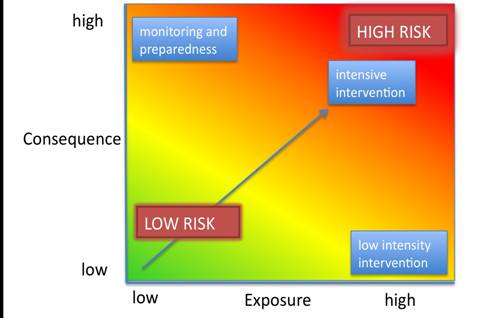
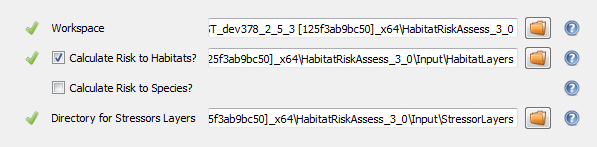
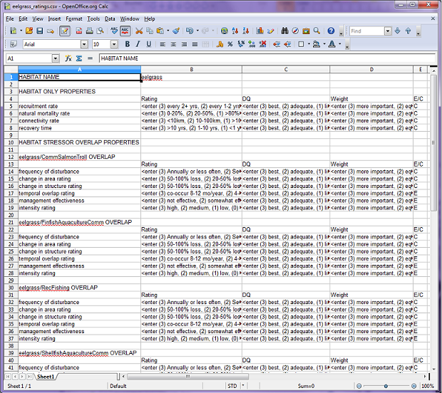
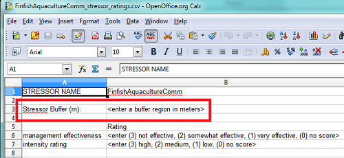
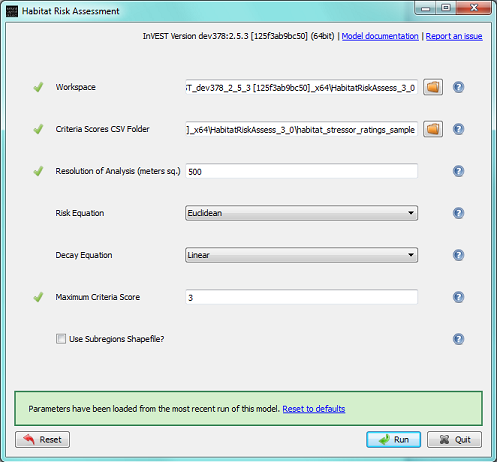

.. _habitat_risk_assessment:

.. |toolbox| image:: ./shared_images/toolbox.jpg
             :alt: toolbox
	     :align: middle 
	     :height: 15px

.. |folder| image:: ./shared_images/openfolder.png
             :alt: folder
	     :align: middle 
	     :height: 15px

.. |ok| image:: /shared_images/okbutt.png
             :alt: folder
	     :align: middle 
	     :height: 15px

.. |addbutt| image:: /shared_images/addbutt.png
             :alt: addbutt
	     :align: middle 
	     :height: 15px

.. |adddata| image:: /shared_images/adddata.png
             :alt: addbutt
	     :align: middle 
	     :height: 15px

***********************
Habitat Risk Assessment
***********************

Summary
=======

The condition of a habitat is a key determinant of the environmental services it can provide.  For example, multiple stressors including fishing, climate change, pollution and coastal development threaten the ability of coastal ecosystems to provide the valuable goods and services that people want and need. As human activities continue to intensify, so too does the need for quick, clear and repeatable ways of assessing the risks posed by human activities under various management plans. The InVEST habitat risk assessment (HRA) model allows users to assess the risk posed to coastal and marine habitats by human activities and the potential consequences of exposure for the delivery of environmental services and biodiversity. The InVEST HRA model is similar to the InVEST biodiversity model in that both models allow users to identify regions on a landscape or seascape where human impacts are highest. While the biodiversity model is intended to be used to assess how human activities impact biodiversity, the HRA model is better suited to screening the risk of current and future human activities to prioritize management strategies that best mitigate risk.  We built and tested the HRA model in marine and coastal systems, and discuss it accordingly, but it easily can be applied to terrestrial systems.

Risk of human activities (e.g., salmon aquaculture, coastal development, etc.) to habitats (e.g., seagrasses, kelp forests, mangroves, reefs) is a function of the exposure of each habitat to each activity and the consequences for each habitat. Exposure to stressors can arise through direct overlap in space and time or through indirect effects (i.e. finfish farms in an enclosed bay may degrade water quality and thus impede eelgrass growth throughout the bay, even if the netpens are not situated directly over eelgrass beds). Consequence depends on the effects of activities on habitat area and density, and the ability of habitats to recover from these effects (i.e. through processes such as recruitment and regeneration). Outputs from the model are useful for understanding the relative risk of human activities and climate change to habitats within a study region and among alternative future scenarios.  Model outputs can help identify areas on the seascape where human activities may create trade-offs among environmental services by posing risk high enough to compromise habitat structure and function. The model can help to prioritize areas for conservation and inform the design and configuration of spatial plans for both marine and terrestrial systems. This is a Tier 0 model.

Introduction
============

Nearshore habitats such as kelp forests and eelgrass meadows provide valuable environmental services including the protection of shorelines from storms, nursery habitat for fisheries and carbon storage and sequestration. As these habitats become degraded by human activities, the environmental services they provide are threatened. The impacts of human activities in coastal areas, both on land and in the sea, are pervasive in coastal ecosystems. Recent global analyses have revealed that almost no area of the world's oceans is untouched by human impacts (Halpern et al. 2008). Thus, an understanding of the location and intensity of human impacts on nearshore ecosystems is an essential component of informed and successful coastal and ocean management. The InVEST HRA model allows users to assess the threat of human activities to the health of these ecosystems.

InVEST biodiversity model vs. InVEST habitat risk assessment model
------------------------------------------------------------------

A primary goal of conservation is the protection of biodiversity; biodiversity is intricately linked to the production of environmental services. While some consider biodiversity itself to be an environmental service, the InVEST biodiversity model (found in the terrestrial toolbox) treats it as an independent attribute of natural systems, with its own intrinsic value (InVEST does not monetize biodiversity). InVEST includes a biodiversity model because natural resource managers, corporations and conservation organizations are becoming increasingly interested in understanding how and where biodiversity and environmental services align in space and how management actions affect both.  The biodiversity model uses habitat quality and rarity as a proxy for diversity.

When developing a similar model with marine systems in mind, differences in data availability (e.g. the rarity of an analog to land-use/land-cover maps in marine systems) and differences in thinking (e.g. the prevalence of a risk-assessment framework in fisheries science) led us to the development of the habitat risk assessment model described in this chapter.

Both the biodiversity model and the HRA model can be used to identify areas on a landscape or seascape where the risk posed by human activities is highest. Indeed, while the two models are segregated into the marine and terrestrial toolboxes, they can be used across systems.  However, the modeling approaches differ in several ways. First, the exposure-consequence framework of the HRA model allows model results to be interpreted in a manner that helps users explore which types of management strategies are likely to most effectively reduce risk (Figure 1). For example, ecosystems with high exposure and high consequence may be targeted for intense active management, while effective strategies for ecosystems with low exposure to human stressors but high consequence may include close monitoring but little active intervention unless exposure increases. Second, the transparent flexible structure and explicit visualization of data uncertainty in the HRA model facilitate its use in both data-rich and data-poor situations. Finally, the biodiversity model is better suited for terrestrial applications than marine applications because it requires a land use land cover map as an input. The HRA model can be used in both marine and terrestrial systems.

   Habitats with high exposure to human activities and high consequence are at high risk. Plotting exposure and consequence data in this plot allows users to visualize risk, and to assess which types of risk are more effectively mitigated by human intervention (risks driven by exogenous human factors, top right region of the risk space) and which types of risk are better addressed through monitoring and preparedness (risks driven by endogenous habitat-specific factors).  (Adapted from Dawson et al. 2011).

Risk assessment has a long history in the field of ecotoxicology, and is now emerging as a valuable method in ecosystem-based fisheries management (Astles et al. 2006, Hobday et al. 2011). Risk assessment is used to determine the likelihood that a hazard will cause undesired consequences (Burgman 2005). In the context of marine ecosystem-based management, risk assessment evaluates the probability that human activities will impede the achievement of desired marine management objectives. In the HRA model, we define risk as the likelihood that human activities will reduce the quality of nearshore habitats to the point where their ability to deliver environmental services is impaired. Researchers have made significant progress in evaluating human impacts on marine ecosystems in recent years. However many of these approaches lack generality because they are focused on the effects of a single sector (i.e. fisheries e.g. Astles et al. 2006, Hobday et al. 2011), or have limited transparency and flexibility because they are based on expert opinion (Halpern et al. 2008, Teck et al. 2010). The HRA model in Marine InVEST builds on these approaches and allows users to evaluate the risk posed by a variety of human activities to key coastal habitats in a transparent, repeatable and flexible way.

The model
=========

The risk of human activities to coastal and nearshore habitats is a function of the habitat's exposure to the activity and the consequence of exposure. To determine exposure, users provide model inputs such as base maps of habitat distribution and human activities, the timing and intensity of the activity and the effectiveness of current management practices in safeguarding habitats. To determine consequence, users provide model inputs such as observed loss of habitat and the ability of habitats to recover. The model is flexible and can accommodate data-poor and data-rich situations. Data may come from a combination of peer-reviewed sources at the global scale and locally available fine-scale data sources. Model inputs and results can be updated as better information becomes available.

The HRA model produces maps that display the relative risk from a variety of human activities on habitats within a study region and among alternative future scenarios. When run as part of a complete Marine InVEST analysis, the HRA model can be used to identify which human activities are likely to cause trade-offs in other environmental services. As a result, the model will help managers prioritize and evaluate management strategies with regards to their effectiveness of reducing risks to nearshore habitats and maintaining the delivery of desired environmental services.

How it works
------------

The HRA model combines information about the exposure of habitats to each stressor with information about the consequence of that exposure for each habitat to produce maps of risk to habitats and habitat quality.  Exposure depends on the extent of geographic overlap between habitats and human activities, the duration of time that the activity and habitat overlap, the intensity of the stressor and the degree to which management strategies mitigate impact.  The consequence depends on the degree of habitat loss, change in habitat structure and the ability of habitats to recover from these effects (i.e., through life history traits such as recruitment and regeneration rates). The modelling approach is flexible so if any of the factors that influence exposure and consequence are irrelevant in a particular case, they need not be included (see Scoring of Criteria).

.. _hra-equations:

Risk of human activities to habitats
^^^^^^^^^^^^^^^^^^^^^^^^^^^^^^^^^^^^

The risk of human activities to habitats is modeled in four steps.

**Step 1.** The first step involves determining the likelihood of exposure of the habitat to the stressor and the consequence of this exposure. Exposure and consequence are both determined by assigning a rating (typically 0-3) to a set of criteria for each attribute. We have provided for you a set of standard used criteria, but any criteria may be added or removed. Guidelines for scoring of the default criterion are summarized below, and abbreviated descriptions of scoring on a 0-3 basis are provided in the tables produced from HRA Preprocessor. To ensure transparency, we recommend that scores be determined using readily available data from peer-reviewed literature or published reports. However, you are free to use any data you believe to be the most accurate. For each score assigned, you should also indicate the quality of the data used to determine the score and the weighted importance of the criteria relative to other criteria. This allows you to assign greater weight to criteria for which the confidence in the scoring was higher or to criteria that you think are more important contributors to risk in your system. Thus, the overall exposure :math:`E` and consequence :math:`C` scores are calculated as weighted averages of the exposure values :math:`e_i` and consequence values :math:`c_i`  for each criterion *i* as

.. math:: E = \frac{\sum^N_{i=1}\frac{e_i}{d_i \cdot w_i}}{\sum^N_{i=1}\frac{1}{d_i \cdot w_i}}
   :label: eq1

.. math:: C = \frac{\sum^N_{i=1}\frac{c_i}{d_i \cdot w_i}}{\sum^N_{i=1}\frac{1}{d_i \cdot w_i}}
   :label: eq2

where :math:`d_i` represents the data quality rating for criterion *i*, :math:`w_i` represents the importance weigting for criterion *i* and *N* is the number of criteria evaluated for each habitat.

**Step 2.** The second step combines the exposure and response values to produce a risk value for each stressor-habitat combination. There are two options for risk calculation.

For Euclidean Risk calculation, risk to habitat *i* caused by stressor *j* is calculated as the Euclidean distance from the origin in the exposure-consequence space,

.. math:: R_{ij} = \sqrt{(E-1)^2+(C-1)^2}
   :label: eq3

.. figure:: habitat_risk_assessment_images/image010.jpg

For Multiplicative Risk calculation, risk to habitat *i* caused by stressor *j* is calculated as the product of the summed exposure-consequence scores.

.. math:: R_{ij} = E \cdot C
    :label: eq4

**Step 3.** In the final step, the model quantifies the cumulative risk of all stressors on the habitats. Cumulative risk for habitat *i* is the sum of all risk scores for each habitat,

.. math:: R_i = \sum^J_{j=1} R_{ij}
   :label: eq5

**Step 4.** In this step, the model identifies areas of habitats that are risk 'hotspots'. These are areas where the influence of human-derived stressors is so great that ecosystem structure and function may be severly compromised. In these areas, there may be trade-offs between human activities and a range of ecosystem services. Thus, users may choose to consider these habitats to be functionally absent in inputs to other InVEST ecosystem service models (see the Interpreting Results section for guidance on how to use risk hotspots to identify trade-offs among human activities under alternative scenarios). Habitat area is classfied as HIGH, MED or LOW risk based on risk posed by any individual stressor and the risk posed by the cumulative effects of multiple stressors. A classification of HIGH is assigned to area that has a risk of >66% of the maximum risk score for any individual stressor, or >66% of total possible cumulative risk. Cells are classified as MED if they have individual stressor or cumulative risk scores between 33%-66% of the maximum score. Cells are classified as LOW risk if they have individual or cumulative risk scores of 0-33% of the maximum score.

Exposure and consequence criteria in more detail
^^^^^^^^^^^^^^^^^^^^^^^^^^^^^^^^^^^^^^^^^^^^^^^^

The model allows for any number of criteria to be used when evaluating the risk to habitat areas. 
Below, are provided a number of typical considerations when evaluating the role that stressors will have on a habitat. The criteria below are rated on a scale of 0-3, but the model is not constrained to these numbers. If there is significant literature using a different scale, this can also be used for rating criteria, as long as there is consistency across the rating scores. 

Exposure of habitats to stressors
"""""""""""""""""""""""""""""""""

The risk of a habitat being affected by a stressor depends in part on the exposure of the habitat to that stressor. Stressors may impact habitats directly and indirectly. Because indirect impacts are poorly understood and difficult to trace, we only model the risk of stressors that directly impact habitat by overlapping in space. Other important considerations include the duration of spatial overlap, intensity of the stressor, and whether management strategies reduce or enhance exposure.

1. **Spatial overlap .**  To assess spatial overlap in the study area, the model uses maps of the distribution of habitats and stressors.  Habitat types can be biotic, such as eelgrass or kelp, or abiotic, such as hard or soft bottom. The user defines the detail of habitat classification. For example, habitats can be defined as biotic or abiotic, by taxa (e.g., coral, seagrass, mangrove), by species (e.g., red, black mangroves) or in whatever scheme the user desires.  However, the user should keep in mind that in order for such detail to be useful and change the outcome of the model, these habitat classifications should correspond with differences between habitats in their response to the stressors.

   Also, the model requires the user to input maps of the distribution and zone of influence of each stressor. The zone of influence of each stressor is the distance over which the stressor spreads beyond the footprint of the stressor indicated in the stressor map. For some stressors, such as over-water structures that shade eelgrass beds, this distance will be small.  For other stressors, such as finfish aquaculture pens where nutrients spread 300-500m this distance may be large. The model uses the maps of habitat and stressor distributions to calculate the amount of each habitat type that overlaps with each stressor and its zone of influence.

2. **Overlap time rating.**  Temporal overlap is the duration of time that the habitat and the stressor experience spatial overlap. Some stressors, such as permanent overwater structures, are present year-round; others are seasonal, such as certain fishing practices. Similarly, some habitats (e.g. mangroves) are present year round, while others are more ephemeral (e.g. some seagrasses). 

   We use the following categories to classify HIGH, MEDIUM and LOW temporal overlap:

   ================ ========================================================= ======================================================== ======================================================== ========
   ..               High (3)                                                  Medium (2)                                               Low (1)                                                  No score
   ================ ========================================================= ======================================================== ======================================================== ========
   Temporal overlap Habitat and stressor co-occur for 8-12 months of the year Habitat and stressor co-occur for 4-8 months of the year Habitat and stressor co-occur for 0-4 months of the year N/A
   ================ ========================================================= ======================================================== ======================================================== ========

   Choose "No score" to exclude this criteria from your assessment.

3. **Intensity rating.** The exposure of a habitat to a stressor depends not only on whether the habitat and stressor overlap in space and time, but also on the intensity of the stressor.  The intensity criterion is stressor-specific.  For example, the intensity of nutrient-loading stress associated with netpen salmon aquaculture is related to the number of salmon in the farm and how much waste is released into the surrounding environment. Alternatively, the intensity of destructive shellfish harvesting is related to the number of harvesters and the harvest practices. You can use this intensity criteria to explore how changes in the intensity of one stressor might affect risk to habitats.  For example, one could change the intensity score to represent changes in the stocking density of a salmon farm in a future scenario.  One can also use this ranking to incorporate relative differences in the intensity of different stressors within the study region.  For example, different types of marine transportation may have different levels of intensity.  For example, cruise ships may be a more intense stressor than water taxis because they release more pollutants than the taxis do. 

   We use the following categories to classify HIGH, MEDIUM and LOW intensity:

   ========= ============== ================ ============= ========
   ..        High (3)       Medium (2)       Low (1)       No score
   ========= ============== ================ ============= ========
   Intensity High intensity Medium intensity Low intensity N/A
   ========= ============== ================ ============= ========

   Choose "No score" to exclude this criteria from your assessment.

4. **Management strategy effectiveness rating.** Management can limit the negative impacts of human activities on habitats. For example, policies that require salmon aquaculturists to let their farms lie fallow may reduce the amount of waste released and allow nearby seagrasses to recover. Similarly, regulations that require a minimum height for overwater structures reduce the shading impacts of overwater structures on submerged aquatic vegetation. Thus, effective management strategies will reduce the exposure of habitats to stressors. The effectiveness of management of each stressor is scored relative to other stressors in the region.  So if there is a stressor that is very well managed such that it imparts much less stress on the system than other stressors, classify management effectiveness as "very effective."  In general, however, the management of most stressors is likely to be "not effective."  After all, you are including them as stressors because they are having some impact on habitats. You can then use this criterion to explore changes in management between scenarios, such as the effect of changing coastal development from high impact (which might receive a score of "not effective") to low impact (which might receive a score of "somewhat effective)." 

   We use the following categories to classify HIGH, MEDIUM and LOW management effectiveness:

   ======================== ============================= ================== ============== ========
   ..                       High (3)                      Medium (2)         Low (1)        No score
   ======================== ============================= ================== ============== ========
   Management effectiveness Not effective, poorly managed Somewhat effective Very effective N/A
   ======================== ============================= ================== ============== ========

   Choose "No score" to exclude this criteria from your assessment.

Consequence of exposure
"""""""""""""""""""""""

The risk of a habitat being degraded by a stressor depends on the consequence of exposure. The consequence of exposure depends on the ability of a habitat to resist the stressor and to recover following exposure and can be assessed using four key attributes: change in area, change in structure, frequency of natural disturbance, and recovery attributes.  We describe each in turn below.

1. **Change in area rating.** Change in area is measured as the percent change in areal extent of a habitat when exposed to a given stressor and thus reflects the sensitivity of the habitat to the stressor. Habitats that lose a high percentage of their areal extent when exposed to a given stressor are highly sensitive, while those habitats that lose little area are less sensitive and more resistant. 

   We use the following categories to classify HIGH, MEDIUM and LOW change in area:

   ============== =========================== ============================ ======================== ========
   ..             High (3)                    Medium (2)                   Low (1)                  No score
   ============== =========================== ============================ ======================== ========
   Change in area High loss in area (50-100%) Medium loss in area (20-50%) Low loss in area (0-20%) N/A
   ============== =========================== ============================ ======================== ========

   Choose "No score" to exclude this criteria from your assessment.

2. **Change in structure rating.** For biotic habitats, the change in structure is the percentage change in structural density of the habitat when exposed to a given stressor. For example, change in structure would be the change in shoot density for seagrass systems, change in polyp density for corals, or change in stipe density for kelp systems. Habitats that lose a high percentage of their structure when exposed to a given stressor are highly sensitive, while habitats that lose little structure are less sensitive and more resistant. For abiotic habitats, the change in structure is the amount of structural damage sustained by the habitat. Sensitive abiotic habitats will sustain complete or partial damage, while those that sustain little to no damage are more resistant. For example, gravel or muddy bottoms will sustain partial or complete damage from bottom trawling while hard bedrock bottoms will sustain little to no damage.

   We use the following categories to classify HIGH, MEDIUM and LOW change in structure:

   =================== ==================================================================================================================== ======================================================================================================================= ======================================================================================================================== ========
   ..                  High (3)                                                                                                             Medium (2)                                                                                                              Low (1)                                                                                                                  No score
   =================== ==================================================================================================================== ======================================================================================================================= ======================================================================================================================== ========
   Change in structure High loss in structure (for biotic habitats, 50-100% loss in density, for abiotic habitats, total structural damage) Medium loss in structure (for biotic habitats, 20-50% loss in density, for abiotic habitats, partial structural damage) Low loss in structure (for biotic habitats, 0-20% loss in density, for abiotic habitats, little to no structural damage) N/A
   =================== ==================================================================================================================== ======================================================================================================================= ======================================================================================================================== ========

   Choose "No score" to exclude this criteria from your assessment.

3. **Frequency of natural disturbance rating.** If a habitat is naturally frequently perturbed in a way similar to the anthropogenic stressor, it may be more resistant to additional anthropogenic stress. For example, habitats in areas that experience periodical delivery of nutrient subsidies (i.e. from upwelling or allocthonous inputs such as delivery of intertidal plant material to subtidal communities) are adapted to variable nutrient conditions and may be more resistant to nutrient loading from netpen salmon aquaculture. This criterion is scored separately for each habitat-stressor combination, such that being adapted to variable nutrient conditions increases resistance to nutrient loading from salmon aquaculture but not destructive fishing. However, high storm frequency may increase resistance to destructive fishing, because both stressors impact habitats in similar ways. 

   We use the following categories to classify HIGH, MEDIUM and LOW natural disturbance frequencies:

   ================================ ====================== ====================== =============== ========
   ..                               High (3)               Medium (2)             Low (1)         No score
   ================================ ====================== ====================== =============== ========
   Frequency of natural disturbance Annually or less often Several times per year Daily to weekly N/A
   ================================ ====================== ====================== =============== ========

   Choose "No score" to exclude this criteria from your assessment.

.. note:: The following consequence criteria are Recovery Attributes.  These include life history traits such as regeneration rates and recruitment patterns influence the ability of habitats to recover from disturbance.  For biotic habitats, we treat recovery as a function of natural mortality, recruitment, age of maturity, and connectivity.

4. **Natural mortality rate rating (biotic habitats only).** Habitats with high natural mortality rates are generally more productive and more capable of recovery.

   We use the following categories to classify HIGH, MEDIUM and LOW natural mortality rates:

   ====================== ========================== ================================ ================================== ========
   ..                     High (3)                   Medium (2)                       Low (1)                            No score
   ====================== ========================== ================================ ================================== ========
   Natural mortality rate Low mortality (e.g. 0-20%) Moderate mortality (e.g. 20-50%) High mortality (e.g.80% or higher) N/A
   ====================== ========================== ================================ ================================== ========

   Choose "No score" to exclude this criteria from your assessment.

5. **Recruitment rating (biotic habitats only).** Frequent recruitment increases recovery potential by increasing the chance that incoming propagules can re-establish a population in a disturbed area.

   We use the following categories to classify HIGH, MEDIUM and LOW natural recruitment rate:

   ======================== ============ ============= ==================== ========
   ..                       High (3)     Medium (2)    Low (1)              No score
   ======================== ============ ============= ==================== ========
   Natural recruitment rate Every 2+ yrs Every 1-2 yrs Annual or more often N/A
   ======================== ============ ============= ==================== ========

   Choose "No score" to exclude this criteria from your assessment.

6. **Age at maturity/recovery time.** Biotic habitats that reach maturity earlier are likely to be able to recover more quickly from disturbance than those that take longer to reach maturity.  Here we refer to maturity of the habitat as a whole (i.e., a mature kelp forest) rather than reproductive maturity of individuals.  For abiotic habitats, shorter recovery times for habitats such as mudflats decrease the consequences of exposure to human activities. In contrast, habitats made of bedrock will only recover on geological time scales, greatly increasing the consequences of exposure. 

   We use the following categories to classify HIGH, MEDIUM and LOW age at maturity/recovery time:

   ============================= ================ ========== ============== ========
   ..                            High (3)         Medium (2) Low (1)        No score
   ============================= ================ ========== ============== ========
   Age at maturity/recovery time More than 10 yrs 1-10yrs    Less than 1 yr N/A
   ============================= ================ ========== ============== ========

   Choose "No score" to exclude this criteria from your assessment.

7. **Connectivity rating (biotic habitats only).** Larval dispersal and close spacing of habitat patches increases the recovery potential of a habitat by increasing the chance that incoming propagules can re-establish a population in a disturbed area. 

   We use the following categories to classify HIGH, MEDIUM and LOW connectivity:

   ============ ============================== =========================== ======================= ========
   ..           High (3)                       Medium (2)                  Low (1)                 No score
   ============ ============================== =========================== ======================= ========
   Connectivity Low dispersal (less than 10km) Medium dispersal (10-100km) High dispersal (>100km) N/A
   ============ ============================== =========================== ======================= ========

   Choose "No score" to exclude this criteria from your assessment.

Using Spatially Explicit Criteria
^^^^^^^^^^^^^^^^^^^^^^^^^^^^^^^^^

In addition to directly rating a criteria for the given influence on a habitat and stressor, the model allows allows for spatially explicit criteria to be used as an input. These are vector layers, with each feature containing a separate rating for that particular area. (See the :ref:`hra-preprocessor` section for more information how how to prepare and use spatially explicit criteria within a complete model run.)

Guidelines for scoring data quality
^^^^^^^^^^^^^^^^^^^^^^^^^^^^^^^^^^^

Risk assessment is an integrative process, which requires a substantial amount of data on many attributes of human and ecological systems. It is likely that some aspects of the risk assessment will be supported by high quality data and others aspects will be subject to limited data availability and high uncertainty. The user has the option of scoring data quality to put greater weight on the criteria for which confidence is higher in the calculation of risk (eq. 2 and 3). We hope that by including the option to rate data quality in the model, users will be aware of some sources of uncertainty in the risk assessment, and will therefore be cautious when using results derived from low quality data. In addition, the information generated from this rating process can be used to guide research and monitoring effects to improve data quality and availability. If users do not have information on the data quality of a given criteria, they should use a 1 to indicate the lowest possible data quality score.

For each exposure and consequence score, users can indicate the quality of the data that were used to determine the score on a sliding scale where 1 indicates a limited knowledge of the data quality, and anything above that would be seen as increasingly trustworthy data. 

===================================================================================================================================================== ==================================================================================================================================================================== =====================================================================================================================
Best data                                                                                                                                             Adequate data                                                                                                                                                        Limited data
===================================================================================================================================================== ==================================================================================================================================================================== =====================================================================================================================
Substantial information is available to support the score and is based on data collected in the study region (or nearby) for the species in question. Information is based on data collected outside the study region, may be based on related species, may represent moderate or insignificant statistical relationships. No empirical literature exists to justify scoring for the species but a reasonable inference can be made by the user.
===================================================================================================================================================== ==================================================================================================================================================================== =====================================================================================================================

Limitations and Assumptions
---------------------------

Limitations
^^^^^^^^^^^

1. **Results are limited by data quality**: The accuracy of the model results is limited by the availability and quality of input data. Using high quality data such as those from local assessments replicated at several sites within the study region for the species in question within the last ten years will yield more accurate results than using lower quality data that are collected at a distant location with limited spatial or temporal coverage. In most cases, users will need to use data from other geographic locations for some of the stressor-habitat combinations because most of the data on the effects of some stressors have only been collected in a limited number of locations worldwide. To overcome these data limitations, we include a data quality score in the analysis.  This score allows users to down-weight criteria for which data quality is low.

2. **Results should be interpreted on a relative scale**: Due to the nature of the scoring process, results can be used to compare the risk of several human activities among several habitats within the study region (which can range in size from small local scales to a global scale), but should not be used to compare risk calculations from separate analyses.

3. **Results do not reflect the effects of past human activities**. The HRA model does not explicitly account for the effects of historical human activities on the current risk. Exposure to human activities in the past may affect the consequence of human activities in the present and future. If users have historical data on the exposure of habitats to human activities (e.g. spatial and temporal extent), and information on how this affects current consequence scores, they may include this information in the analysis for more accurate results.

4. **Results are based on equal weighting of criteria unless the user weights the criteria by importance or data quality**. The model calculates the exposure and consequence scores assuming that the effect of each criterion (i.e. spatial overlap and recruitment pattern) is of equal importance in determining risk. The relative importance of each of the criteria is poorly understood, so we assume equal importance. However, the user has the option to weight the importance of each criterion in determining overall risk.

Assumptions
^^^^^^^^^^^

1. **Often information in the literature about the effect stressors on habitats comes from only a few locations**.  If using globally available data or data from other locations, users make the assumption that *ecosystems around the world respond in similar ways to any given stressor* (i.e. eelgrass in the Mediterranean responds to netpen aquaculture in the same way as eelgrass in British Columbia). To avoid making this assumption across the board, users should use local data whenever possible.

2. **Cumulative risk is additive (vs. synergistic or antagonistic)**. The interaction of multiple stressors on marine ecosystems is poorly understood (see Crain et al. 2008 for more information). Interactions may be additive, synergistic or antagonistic. However, our ability to predict the type of interaction that will occur is limited. Due to the absence of reliable information on the conditions that determine additivity, synergism or antagonism, the model assumes additivity because it is the simplest approach. As a result, the model may over- or under-estimate the cumulative risk depending on the set of stressors occurring in the study region.

.. _hra-data-needs:

Data needs
==========

The model uses an interface to input all required and optional data and a survey tool to score criteria and their data quality.  Here we outline the options presented to the user via the interface and the maps and data tables used by the model.  First we describe required inputs, followed by a description of optional inputs.

To run the model, three steps are required:

1.  Run the HRA Preprocessor Tool
2.  Fill out the Ratings CSVs
3.  Run the Habitat Risk Assessment model

.. _hra-preprocessor:

HRA Preprocessor
----------------

Before running the HRA model, it is necessary to concatonate and rate all criteria information available. This can be accomplished by running the Preprocessor tool, then editing the resulting Comma Separated Value files (CSVs) produced. If you have already run the model, or have the output directory from a previous HRA Preprocessor run, you may skip this step and proceed to running the Habitat Risk Assessment tool. 

To run the tool, run the HRA Preprocessor executable. This will launch a graphical user interface (GUI).

    .. figure:: habitat_risk_assessment_images/preproc.png

|
There are several pieces that should be used as inputs to this tool. At any time, you can click the blue question marks to the right of an input for additional guidance.

1. Here you will select the habitats or species, and stressors that will be inputs for this run of the model. Each of these inputs (workspace not included) should point to a directory containing all of the named habitat and stressor shapefile layers that you wish to include in this model run. The files should be named only with a descriptor, and are not required to contain an identifying number. Each directory should be independent of the others, so as to avoid incorrect repetition in the outputs.

2. Decide whether to edit individual scoring criteria. The default categories are derived from peer-reviewed literature and we recommend using these pre-established categories.  However, you have the option to iadd to or subtract from the given scoring criteria.  Only choose this option if the default criteria do not apply to your system or to the questions you are trying to address with the risk assessment.

.. figure:: habitat_risk_assessment_images/preproc_crits.png

3. **Optional** Decide whether spatial criteria are desired. These are vector layer files which would provide more explicit detail for a specific criteria in the assessment. If spatially explicit criteria is desired, this should point to an outer directory for all spatial criteria.

|

If spatial criteria are desired, a rigid structure must be followed in order for the model to run. Within the outer spatial crtieria folder, there **MUST** be the following 3 folders: Sensitivity, Exposure, and Resilience. Each feature in the shapefiles used **MUST** include a 'Rating' attribute which maps to a float or int value desired for use as the rating of that spatial criteria area. 
* Any criteria placed within the Resilience folder will apply only to a given habitat. They should be named with the form: habitatname_criteria_name.shp. Criteria may contain more than one word if separated by an underscore.
* Any criteria placed within the Exposure folder will apply only to a given stressor. They should be named with the form: stressorname_criteria_name.shp. Criteria may contain more than one word if separated by an underscore.
* Any criteria placed within the Sensitivity folder will apply to the overlap between a given havitat and a given stressor. They should be named with the form: habitatname_stressorname_criteria_name.shp. Criteria may contain more than one word if separated by an underscore.

4. Run the tool. This will create a directory in your sected workspace called habitat_stressor_ratings. Keep in mind that if a folder of the name habitat_stressor_ratings already exists within the workspace, it will be deleted to make way for the new model run. This directory can be renamed as necesary after completion, and will contain a series of files with the form: habitatname_overlap_rating.csv, or stressorname_ratings.csv. There will be one file for every habitat and every stressor. The installer provides a sample folder for possible input called habitat_stressor_ratings_sample. This file contains the rankings to run the sample data from the west coast of Vancouver Island, Canada.

Ratings CSVs
------------

The CSVs contained within the habitat_stressor_ratings folder will provide all criteria information for the run of the Habitat Risk Assessment. There are two types of CSVs- habitat overlap CSVs and stressor-specific CSVs. Habitat overlap CSVs will contain not only habitat-specific criteria information, but also all criteria that impact the overlap between habitat and stressor.

|
When preprocessor is run, the CSVs will contain no formal ratings, only guidance on how each rating might be filled out. The user should use the best available data sources in order to obtain rating information. The column information to be filled out includes the following:

1. "Rating"- This is a measure of a criterion's impact on a particular habitat or stressor, with regards to the overall ecosystem. Data may come from a combination of peer-reviewed sources at the global scale and locally available fine-scale data sources. Model inputs and results can be updated as better information becomes available. We provide guidance for well-known criteria on a scale of 0-3, but it should be noted that if information is available on a different scale, this can also be used. It is important to note, however, that all rating information across all CSVs should be on one consistent scale, regardless of what the upper bound is.
2. "DQ"- This column represents the data quality of the rating provided in the \'Rating\' column. Here the model gives the user a chance to downweight less-reliable data sources, or upweight particularly well-studied criteria. While we provide guidance for a system from 1-3, the user should feel free to use any upper bound they feel practical, as long as the scale is consistent. The lower bound, however, should ALWAYS be 1.
3. "Weight"- Here the user is given the opportunity to upweight critiera which they feel are particularly important to the system, independent of the source data quality. While we provide guidance for a system from 1-3, the user should feel free to use any upper bound they feel practical, as long as the scale is consistent. The lower bound, however, should ALWAYS be 1.

Habitat CSVs should be filled out with both habitat-specific criteria information as well as any criteria which apply to the overlap of the given habitat and stressors. Stressor CSVs should be filled out with stressor specific criteria information. Additionally, the stressor CSVs contain a "Stressor Buffer" field, which can be used to expand the stressor's influence within the model run. This can be 0 if no buffering is desired for a given stressor, but may not be left blank.

Any criteria which are using spatially explicit criteria (specified by the user using the HRA Preprocessor) will be noted in the CSV by the word 'SHAPE' in the rating column for that habitat, stressor, or combined criteria. The user should still fill in a Data Quality and Weight for these criteria, but should **NOT** remove the 'SHAPE' string unless they no longer desire to use a spatial criteria for that attribute.

.. _hra-main-executable:

Habitat Risk Assessment
-----------------------

The main computation portion of the HRA model will be done by the Habitat Risk Assessment executable. First we describe required inputs.  The required inputs are the minimum data needed to run this model.

1. **Workspace Location (required)**. Users are required to specify a workspace folder path.  It is recommended that the user create a new folder for each run of the model.  For example, by creating a folder called "runBC" within the "HabitatRiskAssess" folder, the model will create "Intermediate" and "Output" folders within this "runBC" workspace.  The "Intermediate" folder will compartmentalize data from intermediate processes.  The model's final outputs will be stored in the "output" folder. ::

     Name: Path to a workspace folder.  Avoid spaces.
     Sample path: \InVEST\HabitatRiskAssess_3_0\runBC

2. **Criteria Scores Folder (required)**. After running the HRA Preprocessor tool, a folder will be created which contains the collective criteria scores for all habitats and stressors. For this input, point to the outer folder containing all CSVs. ::

     Name: Folder can be named anything, but avoid spaces.
     Sample path: \InVEST\HabitatRiskAssess_3_0\runBC\habitat_stressor_ratings

3. **Resolution of Analysis (required)**. The size in meters that is desired for the analysis of the shapefile laters. This will define the width and height of each unique risk grid cell. This must be a whole number.

4. **Risk Equation (required)**. This selection chooses the equation that will be used when calculating risk to a given habitat. (See the :ref:`hra-equations` section.) The user may choose either either a Euclidean risk model, or a Multiplicative risk model. 

5. **Decay Equation (required)** This selection picks how any desired stressor buffering will be applied. The stressor buffer amount, which should have been provide by the user in the stressor-specific CSVs, can be degraded in order to provide a more accurate depiction of influence decay within an ecosystem. The options are as follows. "None" will provide the full range of the stressor buffer, without any decay whatsoever. "Linear" and "Exponential" will use the stated equation as a model for decay from the edges of the stressor shape to the full extent of the buffer distance. 

6. **Maximum Criteria Score (required)** The maximum criteria score is the user-reported highest value assigned to any criteria rating within the assessment. This will be used as the uper bounded value against which all rating scores will be compared. Typically, in a model run where the ratings scores vary from 0-3, this would be a 3. If the user chooses to use a different scale for ratings, however, this should be the highest value that could be potentially assigned to a criteria. If the model run is using spatially explicit criteria, this value should be the maximum value assigned to either a criteria feature or to a CSV criteria rating.

7. **Use Subregions Shapefile? (optional)**. By checking this box, the model will use a subregions shapefile to generate an HTML table of averaged exposure, consequence, and risk values within each subregion by habitat and stressor. In addition, if the Risk Equation chosen is Euclidean, the model will also generate a series of figures which clearly display the exposure-consequence ratings and the resulting risk results for each habitat-stressor combination by subregion. It will also create a figure showing cumulative ecosystem risk for all subregions habitats in the study. Each of the file features **MUST** contain a 'Name' attribute in order to be properly included in the subregion averaging. ::

     Name: File can be named anything, but avoid spaces.
     File Type: Polygon shapefile (.shp)
     Sample path: \InVEST\HabitatRiskAssess_3_0\runBC\subregions.shp

.. _hra-interpreting-results:

Interpreting results
====================

Model outputs
-------------

Upon successful completion of the model, you will see new folders in your Workspace called "Intermediate" and "Output". These two folders will hold all outputs, both temporary and final that are used in a complete run of the model. While most users will be interested only in the Output fodler data, we will describe all outputs below.

Intermediate folder
^^^^^^^^^^^^^^^^^^^

The Intermediate folder contains files that were used for final output calculations. All rasters within this file use the pixel size that the user specifies in "Resolution of Analysis" of the of the :ref:`hra-main-executable`. 

+ \\Intermediate\\Criteria_Rasters\\spatial_criteria_name.tif

  + If the user has included any spatially explicit criteria in the assessment, this folder will contain a rasterized version of that vector layer, with the 'Rating' attribute burned as the pixel value. 

+ \\Intermediate\\Habitat_Rasters\\habitat_name.tif
  
  + A rasterized version of all habitat or species vector files included in the assessment.

+ \\Intermediate\\[first 8 characters of input layer name]_buff_s[stressor ID].shp

  + For all layers where a buffer distance is specified in the Habitat-Stressor Ratings CSV Table (input 5), there will be a vector layer with the buffer applied.

+ \\Intermediate\\zs_H[ID].dbf

  + These .dbf tables provide zonal statistics for grid cell values where a particular habitat overlaps the gridded seascape.

+ \\Intermediate\\zs_H[ID]S[ID].dbf

  + These .dbf tables provide zonal statistics for grid cell values where a particular habitat and stressor overlap the gridded seascape.  Some combinations may be missing indicating relationships where no habitat-stressor overlap occurs.

+ \\Intermediate\\GS_HQ_area.shp

  + This shapefile contains all the overlap analysis and risk scoring calculations for each gridded seascape cell, with each row in the attribute table corresponding to a particular cell.  Outputs are generated from the statistics in this polygon feature class.  This output is particularly useful for understanding exactly what the model is doing.  Attribute columns include, the size (m) at which the seascape was gridded (e.g., CELL_SIZE), area of habitat (m) (e.g., H1_A), percent overlap of habitat and stressor (e.g., H1S1_PCT), and the ranking (1, 2, 3) for spatial overlap (e.g., OLP_RNK_S1) (see Spatial Overlap section above).  This spatial overlap ranking gets combined with the scores for all the other criteria (which the user entered using the Ratings Survey Tool) to calculate the risk of each habitat to each stressor (e.g., Risk_H1S1, Risk_H1S2), the cumulative risk of all stressors on each habitat (e.g., CUMRISK_H1, CUMRISK_H2 ) and ecosystem risk (e.g., ECOS_RISK) which is the total risk of all stressors on all habitats in each cell.  The final output is the recovery potential for each habitat (e.g., RECOV_HAB) which is calculated for cells where habitats do not overlap with stressors. This output reflects the recovery criteria within the consequence score.  

+ \\Intermediate\\GS_HQ_intersect.shp

  + This shapefile contains the risk scoring classifications (low, medium and high) for each habitat.  Risk hotspot maps are generated from the statistics in this polygon feature class.

Output folder
^^^^^^^^^^^^^

The following is a short description of each of the final outputs from the HRA model. Each of these output files is saved in the "Output" folder that is saved within the user-specified workspace directory:

GIS
"""

+ \\Output\\maps\\recov_potent

  + This raster layer depicts the recovery potential of the predominant habitat in each cell. Recovery potential is based on natural mortality rate, recruitment rate, age at maturity/recovery time and connectivity. Recovery potential is useful to those who are interested in identifying areas where habitats are more resilient to human stressors, and therefore may be able to withstand increasing stress. Habitats with low recovery potential are particularly vulnerable to intensifying human activities.

+ \\Output\\maps\\ecosys_risk

  + This raster layer depicts the sum of all cumulative risk scores for all habitats in each grid cell. It is best interpreted as an integrative index of risk across all habitats in a grid cell. For example, in a nearshore grid cell that contains some coral reef, mangrove and soft bottom habitat, the ecosys_risk value reflects the risk to all three habitats in the cell. The "ecosys_risk" value increases as the number of habitats in a cell exposed to stressors increases.

+ \\Output\\maps\\cum_risk_H[habitat number] (e.g. cum_risk_H2)

  + This raster layer depicts the cumulative risk for all the stressors in a grid cell on a habitat-by-habitat basis. For example, "cum_risk_H2" depicts the risk from all stressors on habitat "H2". Cumulative risk is derived by summing the risk scores from each stressor (i.e. more stressors leads to higher cumulative risk). This layer is informative for users who want to know how cumulative risk for a given habitat varies across a study region (e.g. identify hotspots where eelgrass or kelp is at high risk from multiple stressors). Hotspots of high cumulative risk may be targeted for restoration or monitoring.

+ \\Output\\maps\\s[stressor ID]_[stressor name]_buff.shp (e.g. s4_RecFishing_buff.shp)

  + These shapefiles are copies of the stressor input layers, but if the user chose to buffer a particular layer (i.e. make the 'zone of influence' greater than 0), it is reflected in the layer here.

+ \\Output\\maps\\h[habitat ID]_[habitat name]_Risk.shp (e.g. h1_kelp_Risk.shp)

  + These shapefiles are copies of the habitat input layers with risk classifications assigned to each habitat. The condition of habitats classified as HIGH or MED risk may be functionally compromised such that they will no longer reliably produce environmental services. Thus, users may conclude that habitats in these areas are at such high risk that they should not be considered as habitats for inputs to other environmental service models.  Users can identify trade-offs among multiple human activities under alternative scenarios by choosing to selectively remove HIGH or MED risk habitats in inputs to other environmental service models. For example, in a simple scenario where users are considering expanding the salmon aquaculture industry, and they are concerned with both the production of salmon and shoreline protection, they may run the Habitat Risk Assessment model to identify habitat areas of HIGH or MED risk under alternative aquaculture scenarios and then choose to exclude these habitat areas when they run the InVEST Coastal Protection model.
  
  The following screenshot depicts how to symbolize these risk classes in ArcGIS.  First, add one of the maps to the Layers window.  In this example, we selected "h4_softbottom_Risk.shp".  Right click on the layer and select "Properties".  Click on the "Symbology" tab and in the "Show:" window, select "Categories >> Unique values".  In the "Value Field" window, select the "RISK_QUAL" attribute.  Finally, click "Add All Values".  The three classes of risk should appear in the window.  Double click on each of the symbol squares and select an intuitive color for each risk class.

   .. figure:: habitat_risk_assessment_images/image051.png

HTML and plots
""""""""""""""

+ \\Output\\html_plots\\output.html

  + This custom html file for each model run contains figures that display cumulative ecosystem risk (i.e. risk to all the habitats in the study region) and risk of each stressor to each habitat individually. The figures in this output will help users visualize the uncertainty associated with various aspects of the risk assessment, as the model results are color-coded according to the quality of data involved in the scoring process. Please see the explanations in the html file for more information.

+ \\Output\\html_plots\\plot_ecosys_risk.png

  + This figure shows the cumulative risk for each habitat in the study region. This figure can be used to determine which habitats are at highest risk from human activities, and if this risk is mostly due to high cumulative exposure (exogenous factors that can be mitigated by management) or high cumulative consequence (endogenous factors that are less responsive to human intervention).

+ \\Output\\html_plots\\plots_risk.png

  + These figures show the exposure and consequence scores for each stressor and habitat combination in the study region. Stressors that have high exposure scores and high consequence scores pose the greatest risk to habitats. Reducing risk through management is likely to be more effective in situations where high risk is driven by high exposure, not high consequence.

Log file
""""""""

+ Parameters_[yr-mon-day-min-sec].txt

  + Each time the model is run a text file will appear in the workspace folder.  The file will list the parameter values for that run and be named according to the date and time.
  + Parameter log information can be used to identify detailed configurations of each of scenario simulation.

  .. figure:: habitat_risk_assessment_images/image055.png

  .. figure:: habitat_risk_assessment_images/image057.png

Habitat Risk Assessment 3.0 Beta
================================

A next generation version of habitat risk assessment is available directly in the Windows Start Menu under Program Files -> InVEST (version).  There are a handful of changes in the 3.0 version of the tool documented below:

 * 

References
==========

Astles, K. L., Holloway, M. G., Steffe, A., Green, M., Ganassin, C., & Gibbs, P. J. 2006. An ecological method for qualitative risk assessment and its use in the management of fisheries in New South Wales, Australia. Fisheries Research, 82: 290-303.

Burgman, M. 2005. Risks and decisions for conservation and environmental management. Cambridge University Press, Cambridge, UK.

Crain, C. M., Kroeker, K., & Halpern, B. S. 2008. Interactive and cumulative effects of multiple human stressors in marine systems. Ecology Letters, 11: 1304-1315.

Dawson, T. P., Jackson, S. T., House, J. I., Prentice, I. C., & Mace, G. M. 2011. Beyond Predictions: Biodiversity Conservation in a Changing Climate. Science, 332: 53-58.

Halpern, B. S., Walbridge, S., Selkoe, K. A., Kappel, C. V., Micheli, F., D'Agrosa, C., Bruno, J. F., et al. 2008. A Global Map of Human Impact on Marine Ecosystems. Science, 319: 948-952.

Hobday, A. J., Smith, A. D. M., Stobutzki, I. C., Bulman, C., Daley, R., Dambacher, J. M., Deng, R. A., et al. 2011. Ecological risk assessment for the effects of fishing. Fisheries Research, 108: 372-384.

Teck, S. J., Halpern, B. S., Kappel, C. V., Micheli, F., Selkoe, K. A., Crain, C. M., Martone, R., et al. 2010. Using expert judgment to estimate marine ecosystem vulnerability in the California Current. Ecological Applications 20: 1402-1416.

Williams, A., Dowdney, J., Smith, A. D. M., Hobday, A. J., & Fuller, M. 2011. Evaluating impacts of fishing on benthic habitats: A risk assessment framework applied to Australian fisheries. Fisheries Research, In Press.

