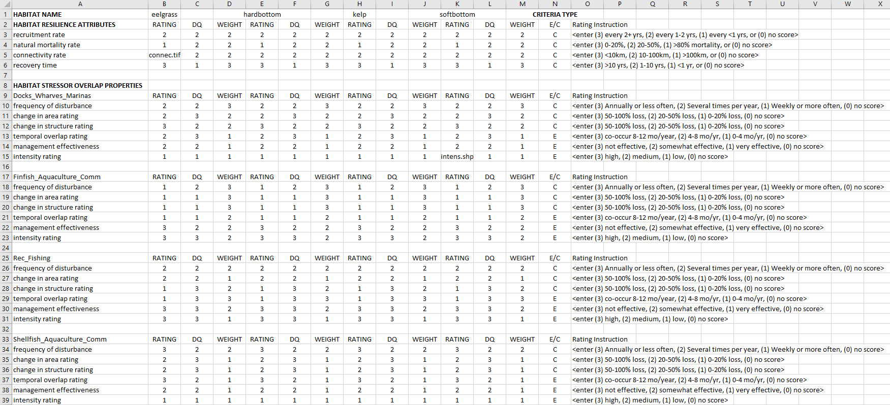

.. _habitat_risk_assessment:

***********************
Habitat Risk Assessment
***********************

Summary
=======

The InVEST Habitat and Species Risk Assessment (HRA/SRA) model allows users to assess the cumulative risk posed to habitats and species by human activities and to explore consequences for the delivery of ecosystem services and biodiversity. The condition of a habitat is a key determinant of the ecosystem services it can provide; for example, degraded coastal mangroves are less able to attenuate waves and reduce coastal exposure. Risk to species may indicate reduced sustainability through time. As anthropogenic stressors continue to diversify and intensify, so too does the need for quick, clear and repeatable ways of assessing risks to habitats and species, now and under future management scenarios. HRA/SRA utilizes a well-supported exposure-consequence framework to assess spatial variation in cumulative risk from multiple human activities across a land- or seascapes.

Outputs from the model include an ecosystem risk map, risk maps for each individual habitat or species, risk plots that display the contribution of exposure and consequence to overall risk, and summary tables of risk by subregion and habitat or species. These outputs can be used to identify areas at the greatest relative risk of degradation as well as the primary causes of risk within a study region and among alternative future scenarios. Model outputs can help identify areas where human activities may create trade-offs among ecosystem services by posing risk high enough to compromise habitat structure and function or species persistence or recovery. The model can help to prioritize areas for conservation, evaluate management strategies, and inform the design and configuration of spatial plans for both marine and terrestrial systems.

Introduction
============

Habitats and species provide essential benefits for people, including regulating, material, and non-material services (Pascual et al. 2017, Díaz et al. 2018). For example, nearshore habitats such as kelp forests and eelgrass meadows protect shorelines from storms, provide nursery habitat for fisheries, and store and sequester carbon. Terrestrial habitats like riparian forests absorb excess nutrients and sediment, provide habitat for riverine fish species, and mitigate inland flooding after rain events. As these habitats (or species) become degraded by human activities, the ecosystem services they provide are threatened. Recent global analyses have revealed that almost no area of the world's oceans is untouched by human impacts (Halpern et al. 2008). Thus, an understanding of the location and intensity of human impacts on nearshore ecosystems is an essential component of informed and successful terrestrial, coastal, and ocean management. The InVEST HRA model allows users to assess the threat of human activities to the health of these ecosystems and species. The model has been successfully applied in numerous locations across the world (e.g. Arkema et al. 2014, Cabral et al. 2015, Chung et al. 2015, Duggan et al. 2015, Ma et al. 2016, Elliff et al. 2017, Wyatt et al. 2017).

The HRA model is a quantitative approach to evaluating the cumulative influence of stressors associated with human activities on habitats and species (Arkema et al. 2014, Arkema et al. 2015). HRA uses a well-established approach from the risk literature that originates from fisheries vulnerability assessments (Astles et al. 2006, Patrick et al. 2010, Hobday et al. 2011, Samhouri and Levin 2012).

The model incorporates two dimensions of information to calculate risk or impact to ecosystem components (figure 1; Halpern et al. 2008, Patrick et al. 2010, Samhouri and Levin 2012, Arkema et al. 2014). These dimensions are *exposure* and *consequence*.

**Exposure** is the degree to which a habitat or species experiences a stressor, given the effectiveness of management practices.

**Consequence** is the habitat (or species)-specific response to that exposure. Consequence incorporates the *sensitivity* of each habitat or species to the effects of a stressor, and the habitat's *resilience*, or the ability of the habitat or species to resist or recover from a stressor to which it is exposed.

.. figure:: habitat_risk_assessment/risk_plot.jpg

   Habitats with high exposure to human activities and high consequence of that exposure are at high risk. Plotting exposure and consequence like this allows assessments of which components of risk are most significant and reveals risk-reduction strategies. Risks driven by exogenous human factors (top right region of the risk space) might be mitigated by management interventions, while risk driven by endogenous habitat-specific factors (top-left region of risk space) may be better addressed through monitoring and preparedness. (Adapted from Dawson et al. 2011).

Informing decision-making processes
-----------------------------------
The outputs of the HRA model allow users to identify areas of high ecosystem risk, investigate which habitats or species are at the greatest risk and where, determine the primary causes of that risk, and understand how risk may change under future scenarios. HRA results can be used in an array of decision contexts:

* Areas of high risk can be used to prioritize management or restoration efforts, as NOAA’s Office for Coastal Management has done in New Hampshire’s Great Bay (NOAA OCM 2016).
* Areas of high risk can be used to constrain the decision space when siting additional uses (e.g. where to site wind energy as shown in Wyatt et al. 2017)
* Risk plots can provide insight into which activities are the most impactful and what types of management strategies will be most effective (E.g. Duggan et al. 2015).
* When used in conjunction with models that estimate habitat-induced changes in ecosystem services, such as storm protection or tourism revenue, HRA can help to evaluate trade-offs among human activities and benefits that ecosystems provide to people (see :ref:` Connecting Habitat Risk Assessment Results to InVEST Ecosystem Service Models`; Guerry et al. 2012, Clarke et al. 2016, Arkema et al. 2015).
* Repeated applications of HRA can be used together to assess and compare alternative scenarios (Arkema et al. 2014).

The Model
=========

How it Works
------------

To assess the exposure of ecosystems and habitats or species to human activities, and the consequence of that exposure, HRA synthesizes information about interactions between multiple human activities (or “stressors”), and multiple habitats or species using both spatial and non-spatial data from the peer-reviewed literature, grey literature, and expert opinion.

The model is spatially-explicit, calculating exposure, consequence, and risk scores on a continuous raster surface across the study area, at a spatial resolution chosen by the user. All geospatial data inputs are rasterized at this resolution, and operations described below occur at the pixel-scale.

Users provide geospatial data including habitat or species distributions, the spatial extent of human activities or stressors, and tabular data about the nature of the interaction between habitats or species and these stressors. Information about these interactions are included in the form of multiple exposure and consequence criteria scores (typically 1-3, with 0 = no score). The specific criteria can be defined by the user, or suggested by the model. Scores are specific to each habitat (or species)-stressor interaction. For example, scores from 1-3 would be assigned to each of these italicized criteria, for each habitat-stressor pair:

**Exposure** criteria might include, the extent of *geographic overlap* between a habitat-stressor pair, the *duration of time* that the stressor and habitat overlap, the *intensity* of the stressor, and the degree to which *management strategies* mitigate impact.

**Consequence** criteria might include the *degree of habitat loss* as a result of exposure to a stressor, *change in habitat structure*, and the *ability of habitats to recover* from these effects (i.e., through life history traits such as recruitment and regeneration rates).

For each criterion, the user scores the interaction from low to high. The model is flexible and can accommodate data-poor and data-rich situations. Data may come from a combination of sources, from peer-reviewed data at the global scale and locally available fine-scale data. Model inputs and results can be updated as better information becomes available.

.. _hra-equations:

Cumulative Risk to Habitats or Species from Multiple Stressors
^^^^^^^^^^^^^^^^^^^^^^^^^^^^^^^^^^^^^^^^^^^^^^^^^^^^^^^^^^^^^^

The risk of human activities to habitats or species is modeled in five steps.

1. Calculate the exposure and consequence scores for each habitat-stressor pair.
2. Combine the exposure and consequence values into a risk score, for each habitat-stressor pair.
3. Accumulate the risk from all stressors to each habitat/species, at each pixel location.
4. Categorize risk to each habitat or species as low, medium, or high.
5. Summarize pixel-scale results to larger subregions of interest.

**Step 1.** The first step involves determining the degree of exposure of the habitat or species to the stressor, and the consequence of this exposure. Exposure (E) and consequence (C) are both determined by assigning a rating (typically 1-3, with 0 = no score) to a set of criteria, such as those described above, which are used frequently in the scientific literature. However, any criteria may be added or removed. Guidelines for scoring the default criterion are summarized below (:ref:`exposure-criteria-details` and :ref:`consequence-criteria-details`). Note that "spatial overlap" is a special exposure criteria that is always included, and does not need to be defined or scored by the user like other criteria. For each grid cell in the study area, if a stressor and a habitat or species are both present, then spatial overlap = 1 and the model calculates E and C using the information about the other criteria and the equations below. If a stressor and a habitat or species do not overlap in a particular grid cell, Exposure, Consequence, and Risk are 0 in that cell. The scores for all the other criteria are inputs to the model provided by the user. For each score assigned, you may also indicate the quality of the data used to determine the score, and the weighted importance of the criteria relative to other criteria. This allows you to assign greater weight to criteria where scoring confidence was higher, or to criteria which contribute more to risk in the system. Thus, the overall exposure :math:`E` and consequence :math:`C` scores are calculated as weighted averages of the exposure values :math:`e_i` and consequence values :math:`c_i` for each criterion *i*, from habitat *j* and stressor *k*

.. math:: E_{jkl} = \frac{\sum^N_{i=1}\frac{e_{ijkl}}{d_{ijkl}\cdot w_{ijkl}}} {\sum^N_{i=1}\frac{1}{d_{ijkl} \cdot w_{ijkl}}}
   :label: exposure

.. math:: C_{jkl} = \frac{\sum^N_{i=1}\frac{c_{ijkl}}{d_{ijkl}\cdot w_{ijkl}}}{\sum^N_{i=1}\frac{1}{d_{ijkl} \cdot w_{ijkl}}}
   :label: consequence

where :math:`E_{jkl}` is the exposure score specific to habitat *j*, from stressor *k* in location *l*; :math:`C_{jkl}` is the consequence score, :math:`e_{ijkl}` is the exposure rating criterion *i*, specific to habitat *j* and stressor *k* and location *l*; :math:`c_{ijkl}` is the consequence rating. :math:`d_{ijkl}` represents the data quality rating, :math:`w_{ijkl}` represents the importance weighing for criterion. *N* is the number of criteria evaluated for each habitat.

**Step 2.** The second step combines the exposure and response values to produce a distance-weighted risk value for each stressor-habitat combination in each grid cell. There are two options for risk calculation and 3 options for distance-based weighting.

For Euclidean Risk calculation, risk to habitat *j* caused by stressor *k* in each location (i.e. cell) *l* is calculated as the Euclidean distance from the origin in the exposure-consequence space, where average exposure (:eq:`exposure`) is on one axis and the average consequence score (:eq:`consequence`) is on the other.

.. math:: R_{jkl} = \sqrt{(E_{jkl}-1)^2+(C_{jkl}-1)^2} \cdot D_{jkl}
   :label: euclidean_risk

The model maps this habitat-stressor specific risk score where the habitat and stressor overlap in space

.. figure:: habitat_risk_assessment/risk_plot2.jpg

For Multiplicative Risk calculation, risk to habitat *j* caused by stressor *k* in cell *l* is calculated as the product of the exposure (:eq:`exposure`) and consequence scores (:eq:`consequence`).

.. math:: R_{jkl} = E_{jkl} \cdot C_{jkl} \cdot D_{jkl}
   :label: multiplicative_risk

In both Euclidean and Multiplicative risk calculations, the distance-weighted decay :math:`D_{jkl}` represents the user's selection of decay function from the following:

No decay ("None" in the UI):

.. math:: D_{jkl} = \begin{Bmatrix}
        1 & if &distance_{jkl} > bufferdist_k \\
        0 & & otherwise
        \end{Bmatrix}
   :label: hra-decay-none

Linear decay ("Linear" in the UI):

.. math:: D_{jkl} = \begin{Bmatrix}
        1 - \frac{distance_{jkl}}{bufferdist} & if & distance_{jkl} > bufferdist_k \\
        0 & & otherwise
        \end{Bmatrix}
   :label: hra-decay-linear

Exponential decay ("Exponential" in the UI):

.. math:: D_{jkl} = \begin{Bmatrix}
        1-e^{\frac{log_{10}(1e-6)}{distance_{jkl}}} & if & distance_{jkl} > bufferdist_k \\
        0 & & otherwise
        \end{Bmatrix}
   :label: hra-decay-exponential

where:

* :math:`D_{jkl}` represents the distance-weighted influence of stressor
  :math:`k` on habitat :math:`j` at location :math:`l`.  This is a value
  between 0 and 1, where 0 indicates no influence (when :math:`l` is outside of
  the buffer distance) and 1 (where :math:`l` is on a stressor pixel).
* :math:`distance_{jkl}` is the distance in meters between habitat :math:`j`
  and stressor :math:`k`.
* :math:`bufferdist_k` is the user-defined buffer distance in meters of
  stressor :math:`k`.

.. note::
  The user has the option of choosing which risk function to use. Different studies have combined exposure and consequence in different ways: Cumulative impact mapping studies tend to use a multiplicative approach to estimate risk (Halpern et al 2008, Selkoe et al 2009, Ban et al 2010), whereas ecosystem risk assessment studies tend to estimate risk as the Euclidean distance for a specific habitat (or species)-activity combination in risk plots (Patrick et al 2010, Hobday et al 2011, Samhouri and Levin 2012, Arkema et al. 2014).

  Initial sensitivity testing suggests that, overall, the two approaches agree on the highest and lowest risk habitats or regions, although intermediate risk results may differ (Stock et al. 2015). Empirical testing of an extensive HRA analysis in Belize using a Euclidean approach found good agreement between calculated risk and measures of habitat fragmentation and health (Arkema et al. 2014 supplement). In general, the Euclidean approach may provide more conservative, higher overall estimates than the multiplicative approach. If E and C values are widely different, then the Euclidean approach will produce relatively higher risk results. In contrast, the multiplicative approach will tend to produce relatively lower, less conservative values for risk and associate similarity in E and C with higher risk. If your system contains habitats for which there is a very high consequence of risk but low exposure (e.g., coral and shrimp trawling zones that currently avoid coral reefs) and you want to adopt the precautionary principle, then choosing the Euclidean approach is advised.

**Step 3.** In this step, the model quantifies the cumulative risk to each habitat or species from all stressors, at each grid cell. Cumulative risk for habitat or species *j* in cell *l* is the sum of all risk scores for each habitat or species,

.. math:: R_{jl} = \sum^K_{k=1} R_{jkl}

**Step 4.** Each grid cell for each habitat or species is classified as LOW, MED, or HIGH risk based on risk posed by the cumulative effects of multiple stressors. A classification of HIGH is assigned to grid cells meeting one of two criteria:

   1)	Cumulative risk in the grid cell is >66% of the maximum risk score for any individual habitat (or species)-stressor combination. For example, if exposure and consequence are ranked on a scale of 1-3, then the maximum risk score for an individual habitat (or species)-stressor combination is 2.83 (using the Euclidean approach); all cells with a risk score greater than 1.87 (66% of 2.83) would be classified as HIGH risk. This criterion addresses the issue that in instances where a stressor is particularly destructive (e.g. clear cutting that removes all trees or dredging that removes all coral), additional stressors (e.g. hiking trails or recreation fishing) will not further increase the risk of habitat degradation.

   2)	Cumulative risk in the grid cell is >66% of the total possible cumulative risk. Total possible cumulative risk is based on both the maximum risk score for an individual habitat (or species)-stressor combination and the maximum number of stressors that can occupy a particular grid cell in the study area (see next paragraph). Maximum number of overlapping stressors = 3 if, in the entire study region, no more than 3 stressors (e.g., agriculture run-off, marine aquaculture and marine transportation) are likely to occur in a single grid cell. Total possible cumulative risk in this case would be 8.49 (based on the Euclidean approach; the maximum risk score for a single habitat (or species)-stressor combination X the maximum number of overlapping stressors = 2.83 x 3 = 8.49). This criterion addresses the issue that even when a single stressor is not particularly detrimental the cumulative effect of multiple stressors causes is high.

Cells are classified as MED if they have individual stressor or cumulative risk scores between 33%-66% of the total possible cumulative risk score. Cells are classified as LOW risk if they have individual or cumulative risk scores of 0-33% of the total possible risk score for a single stressor or multiple stressors, respectively.

More formally, this is classified for each habitat/stressor pair as:

.. math:: L_{jkl} = \begin{Bmatrix}
        0 & if & R_{jkl} = 0 \\
        1 & if & 0 < R_{jkl} < (\frac{1}{3}m_{jkl}) \\
        2 & if & (\frac{1}{3}m_{jkl}) <= R_{jkl} < (\frac{2}{3}m_{jkl}) \\
        3 & if & R_{jkl} >= (\frac{2}{3}m_{jkl})
        \end{Bmatrix}
   :label: hra-pairwise-risk-classification

Where:

* :math:`L_{jkl}` is the high/medium/low risk calculation for habitat :math:`j`
  due to stressor :math:`k` at location :math:`l`.
* :math:`R_{jkl}` is the computed risk of stressor :math:`k` to habitat
  :math:`j` at location :math:`l`.
* :math:`m_{jkl}` is the maximum score to each habitat/stressor pair, which is
  consistent across all habitat/stressor pairs. This is defined as

   * :math:`m_{jkl} = (r_{max})^2` if multiplicative risk is used.
   * :math:`m_{jkl} = \sqrt{2(r_{max}-1)^2}` if euclidean risk is used.

* :math:`r_{max}` is the user-defined maximum score.

**Step 4.** Each grid cell for each habitat or species is classified as LOW
(1), MED (2) or HIGH (3) risk based on risk posed by the cumulative effects of
multiple stressors.

.. math:: L_{jl} = max(L_{jkl}, L_{jl})
   :label: hra-classified-risk-max

Where :math:`L_{jl}` in the above is calculated as

.. math:: L_{jl} = \begin{Bmatrix}
        0 & if & R_{jl} = 0 \\
        1 & if & 0 < R_{jl} < (\frac{1}{3}m_{jl}) \\
        2 & if & (\frac{1}{3}m_{jl}) <= R_{jl} < (\frac{2}{3}m_{jl}) \\
        3 & if & R_{jl} >= (\frac{2}{3}m_{jl})
        \end{Bmatrix}
   :label: hra-cumulative-risk-classification

where:

* :math:`L_{jl}` is the high/medium/low risk calculation for habitat :math:`j`
  at location :math:`l`.
* :math:`R_{jl}` is the cumulative risk to a single habitat or species
  :math:`j` at location :math:`l`.
* :math:`m_{jl}` is the maximum risk score to the sum of all habitat/stressor
  pairs, calculated as :math:`m_{jl} = m_{jkl} \cdot n_{overlap}`, where
  :math:`n_{overlap}` is the user-defined number of overlapping stressors.

**Step 5.** In the final step, risk is summarized in any number of subregions within the study area. In a spatial planning process, subregions are often units of governance (i.e., coastal planning regions, states or provinces) within the boundaries of the planning area. At the subregional scale, score for spatial overlap (a default exposure criteria) is based on the fraction of habitat area in a subregion that overlaps with a human activity (see below for more detail). The subregional score for all other E and C criteria are the average E and C score across all grid cells in the subregion. Risk is estimated either using the Euclidean distance or multiplicative approach (see above).

Cumulative Risk to the Ecosystem from Multiple Stressors
^^^^^^^^^^^^^^^^^^^^^^^^^^^^^^^^^^^^^^^^^^^^^^^^^^^^^^^^
To provide an integrative index of risk across all habitats or species in a grid cell, the model also calculates ecosystem risk. Ecosystem risk for each grid cell *l* is the sum of habitat or species risk scores in that cell.

.. math:: R_{l}= \sum^J_{j=1} R_{jl}

Ecosystem risk will increase with an increasing number of co-occurring habitats or species.

Exposure and Consequence Criteria in More Detail
^^^^^^^^^^^^^^^^^^^^^^^^^^^^^^^^^^^^^^^^^^^^^^^^

The model allows for any number of criteria to be used when evaluating the risk to habitat areas. As a default, the model provides a set of typical considerations for evaluating risk of stressors to habitats. With the exception of spatial overlap at a grid cell scale, these criteria are rated on a scale of 1-3, with 0 = no score. However, the user is not constrained to the 1-3 scale. As long as there is consistency across the rating scores within a single model run, other scales (e.g. 1-5, 1-10) may be used. In all cases higher numbers represent greater exposure or consequence and result in higher risk scores. **Using a score of 0 will always indicate that the given criteria should be excluded from Exposure & Consequence equations.**

For technical guidance on how to prepare this input data, see :ref:`hra-criteria-csv`. For

.. _exposure-criteria-details:

Default Exposure Criteria
"""""""""""""""""""""""""

1. **Spatial overlap .** To assess spatial overlap in the study area, the model uses maps of the distribution of habitats or species and stressors.

   **Habitat maps** can represent biotic (e.g. eelgrass or kelp) or abiotic (e.g. hard or soft bottom) habitat types, or species. The user defines the detail of habitat classification. For example, habitats can be defined as biotic or abiotic, by taxa (e.g., coral, seagrass, mangrove), by species (e.g., red, black mangroves) or in whatever scheme the user desires. In a species risk assessment, we recommend specifying a single species, but the user could also indicate a taxa. In order for additional detail or specificity to be useful and change the outcome of the model, these habitat classifications should correspond with differences between how habitats or species respond to the stressors.

   **Stressor maps** represent the footprint, or spatial extent, of the stressor activity. In addition, a "zone of influence" or "buffer" can be assigned to each stressor, representing the distance over which the effects of the stressor spread beyond its actual footprint in the input map. For some stressors, such as foot trails through a forest, this distance will be small. For other stressors, such as finfish aquaculture pens where nutrients spread 300-500m or forest clearcutting where edge effects can extend up to 1km, this distance may be large. The user can specify whether the impacts of the stressor decay linearly or exponentially from the footprint of the stressor to the outer extent of the zone of influence. The model uses the distance of the zone of influence of a stressor to create an intermediate output that is a map of the stressor footprint buffered by the zone of influence (rounding down to the nearest pixel unit; e.g., a buffer distance of 600m will round down to 500m if the resolution of analysis is 250m).

   **For each grid cell**, if the habitat or species overlaps with a stressor, then spatial overlap = 1 and the model calculates exposure, consequence and risk using scores for the other criteria (below). If a habitat or species does not overlap with a stressor in a particular grid cell, then the model sets exposure, consequence and risk = 0 in that particular grid cell.

   **At the subregional scale**, the model calculates spatial overlap scores as follows. For each subregion, the fraction of area of each habitat that overlaps with each stressor is the *percentage_overlap*. Then, the spatial overlap score follows this equation:

    maximum_criteria_score * percentage_overlap + minimum_criteria_score * (1 - percentage_overlap)

   For example, if 50% of a habitat's area is overlapped by a stressor, and our criteria scale is 1-3, then:
   3 * 0.5 + 1 * (1 - 0.5) = 2. Lastly, the model averages the spatial overlap score with the average exposure score for the subregion. If there is no spatial overlap between the habitat and stressor at the subregional scale, then exposure = 0, consequence = 0 and risk = 0. If there are no exposure scores for that habitat-stressor combination, but spatial overlap does exist, the score will be entirely the spatial overlap.

2. **Overlap time rating.** Temporal overlap is the duration of time that the habitat or species and the stressor experience spatial overlap. Some stressors, such as permanent structures, are present year-round. Other stresors are seasonal, such as certain fishing practices or recreational activities. Similarly, some habitats (e.g. mangroves) or species are present year round, while others are more ephemeral (e.g. some seagrasses or perennial understory vegetation).

   *If criteria are scored on a 1-3 scale, the following is a suggestion for scoring temporal overlap:*

   ================ ========================================================= ======================================================== ========================================================= ============
   Score:               1 (low)                                                   2 (medium)                                               3 (high)                                                  0 (no score)
   ================ ========================================================= ======================================================== ========================================================= ============
   Temporal overlap Habitat and stressor co-occur for 0-4 months of the year  Habitat and stressor co-occur for 4-8 months of the year Habitat and stressor co-occur for 8-12 months of the year N/A
   ================ ========================================================= ======================================================== ========================================================= ============

   *Choose "0" to exclude this criterion from your assessment.*

3. **Intensity rating.** Exposure depends not only on whether the habitat and stressor overlap in space and time, but also on the intensity of the stressor. Some examples: The intensity of nutrient-loading stress associated with netpen salmon aquaculture is related to the number of salmon in the farm and how much waste is released into the surrounding environment. The intensity of destructive shellfish harvesting is related to the number of harvesters and the harvest practices. You can use this intensity criteria to explore how changes in the intensity of one stressor might affect risk to habitats. For example, one could change the intensity score to represent changes in the stocking density of a salmon farm in a future scenario. One can also use this ranking to incorporate relative differences in the intensity of different stressors within the study region. For example, different types of marine transportation may have different levels of intensity. For example, cruise ships may be a more intense stressor than water taxis because they release more pollutants than the taxis do.

   *If criteria are scored on a 1-3 scale, the following is a suggestion for scoring intensity:*

   ========= ============= ================ ============== ============
   Score           1               2               3             0
   ========= ============= ================ ============== ============
   Intensity Low intensity Medium intensity High intensity N/A
   ========= ============= ================ ============== ============

   *Choose "0" to exclude this criterion from your assessment.*

4. **Management strategy effectiveness rating.** Management can limit the negative impacts of human activities on habitats. For example, regulations that require a minimum height for overwater structures reduce the shading impacts of overwater structures on submerged aquatic vegetation. Thus, effective management strategies will reduce the exposure from stressors to habitats or species. The effectiveness of management of each stressor is scored relative to other stressors in the region. So if there is a stressor that is very well managed such that it imparts much less stress on the system than other stressors, classify management effectiveness as "very effective." In general, however, the management of most stressors is likely to be "not effective." After all, you are including them as stressors because they are having some impact on habitats. You can then use this criterion to explore changes in management between scenarios, such as the effect of changing development from high impact (which might receive a score of "not effective") to low impact (which might receive a score of "very effective)." As with all criteria, higher numbers represent greater exposure and result in higher risk scores.

   *If criteria are scored on a 1-3 scale, the following is a suggestion for scoring management effectiveness:*

   ======================== ============== ================== ============================= ============
   Score                         1                 2                3                             0
   ======================== ============== ================== ============================= ============
   Management effectiveness Very effective Somewhat effective Not effective, poorly managed N/A
   ======================== ============== ================== ============================= ============

   *Choose "0" to exclude this criterion from your assessment.*

5. **Other** exposure criteria may be used in addition to, or instead of, the criteria listed above.

.. _consequence-criteria-details:

Default Consequence Criteria
""""""""""""""""""""""""""""

The risk of a habitat or species being degraded by a stressor depends on the consequence of exposure. Consequence is determined by both the *sensitivity* of a habitat to a specific stressor and the *resilience* of a habitat to resist and recover from disturbance in general. As a default, the model includes three specific measures of sensitivity (change in area, change in structure, and frequency of similar natural disturbance) and four measures of resilience (natural mortality rate, recruitment rate, age at maturity, and connectivity). Each is described below.

1. **Change in area rating.** Change in area is measured as the percent change in extent of a habitat or species when exposed to a given stressor and is a measure of sensitivity of the habitat or species to the stressor. Habitats or species that lose a high percentage of their areal extent when exposed to a given stressor are highly sensitive, while those habitats that lose little area are less sensitive.

   *If criteria are scored on a 1-3 scale, the following is a suggestion for scoring change in area:*

   ============== ======================== ============================ =========================== ============
   Score               1                           2                          3                               0
   ============== ======================== ============================ =========================== ============
   Change in area Low loss in area (0-20%) Medium loss in area (20-50%) High loss in area (50-100%) N/A
   ============== ======================== ============================ =========================== ============

   *Choose "0" to exclude this criterion from your assessment.*

2. **Change in structure rating.** For biotic habitats, the change in structure is the percentage change in structural density of the habitat when exposed to a given stressor. For example, change in structure would be the change in tree density (or vertical or horizontal complexity) for forest systems or change in polyp density for corals. Habitats that lose a high percentage of their structure when exposed to a given stressor are highly sensitive, while habitats that lose little structure are less sensitive. For abiotic habitats, the change in structure is the amount of structural damage sustained by the habitat. Sensitive abiotic habitats will sustain complete or partial damage, while those that sustain little to no damage are more resistant. For example, gravel or muddy bottoms will sustain partial or complete damage from bottom trawling while hard bedrock bottoms will sustain little to no damage. For species, change in structure can be used to capture changes to population structure, for example in age or gender distribution

   *If criteria are scored on a 1-3 scale, the following is a suggestion for scoring change in structure:*

   =================== ======================================================================================================================== ======================================================================================================================= ==================================================================================================================== ============
   Score                    1                                                                                                                           2                                                                                                                     3                                                                                                                        0
   =================== ======================================================================================================================== ======================================================================================================================= ==================================================================================================================== ============
   Change in structure Low loss in structure (for biotic habitats, 0-20% loss in density, for abiotic habitats, little to no structural damage) Medium loss in structure (for biotic habitats, 20-50% loss in density, for abiotic habitats, partial structural damage) High loss in structure (for biotic habitats, 50-100% loss in density, for abiotic habitats, total structural damage) N/A
   =================== ======================================================================================================================== ======================================================================================================================= ==================================================================================================================== ============

   *Choose "0" to exclude this criterion from your assessment.*

3. **Frequency of natural disturbance rating.** If a habitat or species is naturally frequently perturbed in a way similar to the anthropogenic stressor, it may be more resistant to comparable anthropogenic stress. For example, habitats in areas that experience periodical delivery of nutrient subsidies (i.e. from upwelling or allocthonous inputs such as delivery of intertidal plant material to subtidal communities) are adapted to variable nutrient conditions and may be more resistant to nutrient loading from netpen salmon aquaculture. Similarly, forests with historical wind-throw events may be better adapted to selective logging. This criterion is scored separately for each habitat or species-stressor combination, such that being adapted to variable nutrient conditions increases resistance to nutrient loading from salmon aquaculture but not destructive fishing. However, an alternative naturally occurring stress like high storm frequency may increase resistance to destructive fishing, because both stressors impact habitats in similar ways. High rates of comparable natural disturbance imply greater resilience and are therefore scored lower.

   *If criteria are scored on a 1-3 scale, the following is a suggestion for scoring natural disturbance frequencies:*

   ======================================== ========================== =============================================== ============================= ============
   Score                                         1                             2                                             3                                 0
   ======================================== ========================== =============================================== ============================= ============
   Frequency of similar natural disturbance Frequent (daily to weekly) Intermediate frequency (several times per year) Rare (annually or less often) N/A
   ======================================== ========================== =============================================== ============================= ============

   *Choose "0" to exclude this criterion from your assessment.*

.. note:: The following consequence criteria are Resilience Attributes. These include life history traits such as regeneration rates and recruitment patterns that influence the ability of habitats or species to recover from disturbance. We treat recovery potential as a function of natural mortality, recruitment, age of maturity, and connectivity.

4. **Natural mortality rate rating (biotic habitats only).** Habitats or species with high natural mortality rates are generally more productive and more capable of recovery and therefore scored as less impacted by a disturbance (i.e. higher mortality rates are given lower scores). As with all criteria, higher numbers represent greater exposure or consequence and result in higher risk scores.

   *If criteria are scored on a 1-3 scale, the following is a suggestion for scoring natural mortality rates:*

   ====================== ================================== ================================ ========================== ============
   Score                       1                                     2                              3                              0
   ====================== ================================== ================================ ========================== ============
   Natural mortality rate High mortality (e.g.80% or higher) Moderate mortality (e.g. 20-50%) Low mortality (e.g. 0-20%) N/A
   ====================== ================================== ================================ ========================== ============

   *Choose "0" to exclude this criterion from your assessment.*

5. **Recruitment rating (biotic habitats only).** Frequent recruitment increases recovery potential by increasing the chance that incoming recruits can re-establish a population in a disturbed area. I.e. Higher recruitment confers greater resilience and is therefore scored lower. As with all criteria, higher numbers represent greater exposure or consequence and result in higher risk scores.

   *If criteria are scored on a 1-3 scale, the following is a suggestion for scoring natural recruitment rate:*

   ======================== ==================== ============= ============ ============
   Score                         1                       2           3                0
   ======================== ==================== ============= ============ ============
   Natural recruitment rate Annual or more often Every 1-2 yrs Every 2+ yrs N/A
   ======================== ==================== ============= ============ ============

   *Choose "0" to exclude this criterion from your assessment.*

6. **Age at maturity/recovery time.** Biotic habitats or species that reach maturity earlier are likely to be able to recover more quickly from disturbance than those that take longer to reach maturity. For habitats, we refer to maturity of the habitat as a whole (i.e., a mature kelp or temperate forest) rather than reproductive maturity of individuals. For abiotic habitats, shorter recovery times for habitats such as mudflats decrease the consequences of exposure to human activities. In contrast, habitats made of bedrock will only recover on geological time scales, greatly increasing the consequences of exposure.

   *If criteria are scored on a 1-3 scale, the following is a suggestion for scoring maturity/recovery time:*

   ============================= ============== ========== ================ ============
   Score                         1              2          3                0
   ============================= ============== ========== ================ ============
   Age at maturity/recovery time Less than 1 yr 1-10yrs    More than 10 yrs N/A
   ============================= ============== ========== ================ ============

   *Choose "0" to exclude this criterion from your assessment.*

7. **Connectivity rating (biotic habitats only).** Close spacing of habitat patches or population subgroups increases the recovery potential of a habitat or species by increasing the chance that incoming recruits can re-establish a population in a disturbed area. Connectivity is relative to the distance a recruit can travel. For example, patches that are 10km apart may be considered poorly connected for a species whose larvae or seeds can only travel hundreds of meters and well connected for a species whose larvae or seeds can travel hundreds of kilometers. As with all criteria, higher numbers represent greater exposure or consequence and result in higher risk scores.

   *If criteria are scored on a 1-3 scale, the following is a suggestion for scoring connectivity:*

   ============ ================================================ =================== ================================================ ============
   Score                                1                                 2          3                                                      0
   ============ ================================================ =================== ================================================ ============
   Connectivity Highly connected relative to dispersal distances Medium connectivity Low connectively relative to dispersal distances N/A
   ============ ================================================ =================== ================================================ ============

   *Choose "0" to exclude this criterion from your assessment.*

Using Spatially Explicit Criteria
^^^^^^^^^^^^^^^^^^^^^^^^^^^^^^^^^

As an alternative to assigning a single rating to a criterion that is then applied to the whole study region, the model allows for spatially explicit criteria to be used as an input. Spatially explicit criteria ratings can be used for any of the exposure or consequence criteria. For example, the user could differentiate between areas of high and low recruitment for a particular habitat or species within the study area. As another example, the user may have information on spatial variation in a human activity, such as alternative tinning and logging plans, which could influence the intensity rating of this stressor. The spatially explicit criteria are vector or raster layers, where each feature or raster value may contain a separate rating for that particular area. (See the :ref:`spatially-explicit-data` section for technical details on how to prepare and use spatially explicit criteria.)

.. _data-quality-details:

Guidelines for Scoring Data Quality and Weights
^^^^^^^^^^^^^^^^^^^^^^^^^^^^^^^^^^^^^^^^^^^^^^^

Risk assessment is an integrative process, which requires a substantial amount of data on many attributes of human and ecological systems. It is likely that some aspects of the risk assessment will be supported by high quality data and other aspects will be subject to limited data availability and high uncertainty. The user has the option of scoring data quality to put greater weight on the criteria for which confidence is higher in the calculation of risk (eq. 2 and 3). We hope that by including the option to rate data quality in the model, users will be aware of some sources of uncertainty in the risk assessment, and will therefore be cautious when using results derived from low quality data. In addition, the information generated from this rating process can be used to guide research and monitoring effects to improve data quality and availability. We suggest the users first run the model with the same data quality score (e.g., 2) for all the criteria to determine if the overall patterns make sense based just on relationships between the stressors and habitats. Next, if users have excellent data quality for a given criteria, they should then re-run the model using a 1 to indicate high data quality, and if they do not have verified information on the data quality of specify a 3 to indicate lower and data quality.

For each exposure and consequence score, users can indicate the quality of the data that were used to determine the score on a sliding scale where 1 indicates the highest quality data and anything above that is increasingly untrustworthy.

===================================================================================================================================================== ==================================================================================================================================================================== =====================================================================================================================
Best data (1)                                                                                                                                            Adequate data (2)                                                                                                                                                        Limited data (3)
===================================================================================================================================================== ==================================================================================================================================================================== =====================================================================================================================
Substantial information is available to support the score and is based on data collected in the study region (or nearby) for the species in question. Information is based on data collected outside the study region, may be based on related species, may represent moderate or insignificant statistical relationships. No empirical literature exists to justify scoring for the species but a reasonable inference can be made by the user.
===================================================================================================================================================== ==================================================================================================================================================================== =====================================================================================================================

Similarly, the user can adjust the importance or “weight” of each criterion. Each ecological system is unique and different criteria may be more important for some habitats or species than others. For example, the recovery potential of a habitat or species may be more strongly dictated by recruitment rate than connectivity to other habitat patches. We suggest the users first run the model with the same weight score (e.g., 2) for all the criteria to determine if the overall patterns make sense based on known relationships between the stressors and habitats or species. Next, if users have verified information on the importance of a given criteria, they should then re-run the model using a 1 or 3 to indicate higher or lower importance, respectively.

   ================================ =========================================================================== ========================================================================= ===================================================================================================
   ..                               Most important (1)                                                          Moderately important (2)                                                  Least important (3)
   ================================ =========================================================================== ========================================================================= ===================================================================================================
   Relative importance of criterion Criterion is especially important in determining the impact of the stressor Criterion is somewhat important in determining the impact of the stressor Criterion is less important, relative to other criterion, in determining the impact of the stressor
   ================================ =========================================================================== ========================================================================= ===================================================================================================

Limitations and Assumptions
---------------------------

Limitations
^^^^^^^^^^^

1. **Results are limited by data quality**: The accuracy of the model results is limited by the availability and quality of input data. Especially in the case of crtieria scores, using high quality data such as those from recent local assessments replicated at several sites within the study region for the species in question will yield more accurate results than using lower quality data that are collected at a distant location with limited spatial or temporal coverage. In most cases, users will need to use information from other geographic locations for some of the stressor-habitat or species combinations because most of the data on the effects of some stressors have only been collected in a limited number of locations worldwide. To overcome these data limitations, we include a data quality score in the analysis. This score allows users to down-weight criteria for which data quality is low.

2. **Results should be interpreted on a relative scale**: Due to the nature of the scoring process, results can be used to compare the risk of several human activities among several habitats or species within the study region (which can range in size from small local scales to a global scale), but should not be used to compare risk calculations from separate analyses. Uncertainty analysis has shown broad qualitative trends in this type of impact mapping to be robust (Stock 2016). Empirical testing of HRA elsewhere has shown strong relationships between modeled risk and habitat fragmentation and health (Arkema et al. 2014). As empirical data become available locally, a great avenue of future work would be to validate and relate regional risk scores to conditions of habitat quality (e.g., density, fragmentation, etc.).

3. **Results do not reflect the effects of past human activities**. The HRA model does not explicitly account for the effects of historical human activities on the current risk. Exposure to human activities in the past may affect the consequence of human activities in the present and future. For example, habitats or species may still be recovering from more destructive past fishing or land-use practices. If users have historical data on the exposure of habitats to human activities (e.g. spatial and temporal extent), and information on how this affects current consequence scores, they may include this information in the analysis for more accurate results.

4. **Results are based on equal weighting of criteria unless the user weights the criteria by importance or data quality**. The model calculates the exposure and consequence scores assuming that the effect of each criterion (i.e. spatial overlap and recruitment pattern) is of equal importance in the relative components of exposure and consequence. The relative importance of each of the criteria is poorly understood, so we assume equal importance. However, the user has the option to weight the importance of each criterion in determining overall risk.

5. **The model only assesses the risk of stressors that directly impact habitat by overlapping in space.** Stressors may impact habitats in other more indirect ways, but this model is not designed to incorporate those indirect effects.

Assumptions
^^^^^^^^^^^

1. **Ecosystems around the world respond in similar ways to any given stressor**. Often information in the literature about the effect stressors have on habitats or species comes from only a few locations. If using globally available data or data from other locations, users make the assumption that *ecosystems around the world respond in similar ways to any given stressor* (i.e. eelgrass in the Mediterranean responds to netpen aquaculture in the same way as eelgrass in British Columbia). To avoid making this assumption, users should use local data whenever possible.

2. **Cumulative risk is additive (vs. synergistic or antagonistic)**. The interaction of multiple stressors on marine ecosystems and species is poorly understood (see Crain et al. 2008, Teichert eta l. 2016) for more information). Interactions may be additive, synergistic or antagonistic. However, our ability to predict the type of interaction that will occur is limited. Due to the absence of reliable information on the conditions that determine additivity, synergism or antagonism, the model assumes additivity because it is the simplest approach. In some cases, the additive approach to assessing risk will underrepresent risk by missing interactions between stressors that might be synergistic or over-represent those that might cancel one another out.

.. _hra-data-needs:

Data Needs
==========

.. note:: *All spatial inputs must have exactly the same projected coordinate system* (with linear units of meters), *not* a geographic coordinate system (with units of degrees).

- :investspec:`hra workspace_dir`

- :investspec:`hra results_suffix`

- :investspec:`hra info_table_path`

  Columns:

  - :investspec:`hra info_table_path.columns.name`
  - :investspec:`hra info_table_path.columns.path`
  - :investspec:`hra info_table_path.columns.type`
  - :investspec:`hra info_table_path.columns.stressor buffer (meters)`

- :investspec:`hra criteria_table_path` the rating column on the table can also store the filepath to the optional spatially explicit criteria files. The Rating Instruction column is optional, used as a reference for filling out scores on the Rating column. See more in the :ref:`hra-criteria-csv` section.

  .. note:: The provided sample Habitat & Stressor Information CSV and Criteria Scores CSV use Windows-style backward slashes in the filepaths. To account for this, if you are on MacOS and the file isn't found, backward slashes will automatically be converted to forward slashes. This could potentially cause problems if your path contains spaces; it's best to avoid spaces in file names.

- :investspec:`hra resolution` The model will convert any vector-based habitat and stressor inputs into rasters with this resolution. All cells that overlap, partially or completely, with a habitat/stressor geometry are considered to contain that habitat/stressor.

.. note:: The resolution of analysis should reflect the resolution of the habitat and stressor data that is available. For example, if input data includes small patches of seagrasses and kelp resolved at 100-200 meters, then choose a similar value for the model's reslution. If the input habitat data are coarse, then choose a larger value. We recommend running the model for the first time at a low resolution (1000m or 5000m) to verify that the model is running properly and then use a higher resolution in subsequent runs as needed.

- :investspec:`hra max_rating` This is the upper bound against which all scores will be compared. For example, in a model run where the ratings scores range from 0-3, this would be a 3. If you choose to use a different scale for ratings, this should be the highest value on that scale.

- :investspec:`hra risk_eq` This selection chooses the equation that will be used when calculating risk to a given habitat. See eq. :eq:`euclidean_risk` for the Euclidean risk model, and eq. :eq:`multiplicative_risk` for the multiplicative risk model.

- :investspec:`hra decay_eq` This selection influences how the "zone of influence" (i.e., buffer distance) of a stressor will be applied to risk in order to more accurately model the influence of a stressor beyond its footprint. The overall exposure rating decays according to this equation with distance from the stressor footprint, down to 0 at the **stressor buffer distance**.

- :investspec:`hra n_overlapping_stressors` See :ref:`number-overlapping-stressors` for more information about defining this number.

- :investspec:`hra aoi_vector_path` The model will produce summary statistics of exposure, consequence, and risk values averaged within each geometry, for each habitat and stressor.

   Field:

   - :investspec:`hra aoi_vector_path`

- :investspec:`hra visualize_outputs` These outputs can be visualized on the `HRA web application <http://marineapps.naturalcapitalproject.org/>`_.

.. _hra-info-csv:

Habitat & Stressor Information (CSV or Excel Table and GIS Data)
----------------------------------------------------------------
This table instructs the model where to find the GIS data inputs for habitat and stressor layers. GIS data may be either raster or vector format. See the image below for an example. The following columns are required:

* NAME: choose a unique name for each input. These names must exactly match those appearing in the **Criteria Scores CSV**.
* PATH: the file path of the input dataset. These can be absolute filepaths (e.g. C:/InVEST_3.7.0/HabitatRiskAssess/Input/habitat_layers/eelgrass.shp) or a path that is relative to the location of this CSV file.
* TYPE: either "habitat" or "stressor"
* STRESSOR_BUFFER: The desired buffer distance (**meters**) to be used to expand a given stressor's influence, or footprint. This should be left blank for habitats, but must not be blank for stressors. Enter 0 if no buffering is desired for a given stressor. The model will round down this buffer distance to the nearest cell unit. e.g., a buffer distance of 600m will buffer a stressor's footprint by two grid cells if the resolution of analysis is 250m.

**Raster inputs:** If a raster file is used, it should contain only values of **0** and **1**, where **1** represents the presence of a habitat or a stressor, and **0** represents absence of a habitat or a stressor. Any values other than 0 or 1 will be treated as 0. The raster input must be projected.

**Vector inputs:** If a vector file is used, all the features in that vector are considered to represent the presence of the habitat or a stressor. The vector input must be projected. The table should have columns NAME, PATH, TYPE, and STRESSOR BUFFER (meters). The column names are case insensitive, but the path names are case sensitive.

.. csv-table::
   :file: ../invest-sample-data/HabitatRiskAssess/Input/habitat_stressor_info.csv
   :header-rows: 1
   :widths: auto

.. _hra-criteria-csv:

Criteria Scores CSV
-------------------

The Criteria Scores CSV (or Excel) file will provide all the criteria information for the run of the Habitat and Species Risk Assessment model. This file contains information about the effect of each stressor on each habitat (i.e. the exposure and consequence scores) for the habitats and stressors in your analysis. A template for the criteria CSV file can be found in the sample data folder. Users should feel free to add or remove specific criteria, and fill in ratings on a scale of 1 to 3, or 1 to any other value, so long as the scale is the same for all criteria

.. This image is of the same table provided in sample data.
   It was too large and complex to format well as a csv-table so I'm leaving it as a figure.

The template CSVs will contain no numerical ratings, only guidance on how each rating might be filled out. The user should use the best available data sources in order to obtain rating information. The columns of information include the following:

* **Rating**- This is a measure of a criterion's impact on a particular habitat or species, with regards to the overall ecosystem. The rating can be an integer or a path to a spatially explicit file (see :ref:`spatially-explicit-data`). Ratings may come from a combination of peer-reviewed sources at the global scale and locally available fine-scale data sources. Model inputs and results can be updated as better information becomes available. We provide guidance for well-known criteria on a scale of 1-3, but it should be noted that if information is available on a different scale, this can also be used. It is important to note, however, that all rating information across all CSVs should be on one consistent scale, regardless of what the upper bound is. A rating score of **0** will tell the model to ignore that particular criteria.
* **DQ**- This column represents the data quality of the score provided in the **Rating** column. Here the model gives the user a chance to down-weight less-reliable data sources, or up-weight particularly well-studied criteria. A low DQ (e.g. 1) indicates best data quality, while a high DQ (e.g. 3) indicates limited data quality. While we provide guidance for a scoring system of 1-3, the user should feel free to use any upper bound they feel practical, as long as the scale is consistent. The lower bound should always be 1.
* **Weight**- Here the user is given the opportunity to up-weight criteria which they feel are particularly important to the system, independent of the data quality. A low Weight (e.g. 1) indicates more important criteria, while a high Weight (e.g. 3) indicates less important criteria. While we provide guidance for a scoring system from 1-3, the user should feel free to use any upper bound they feel practical, as long as the scale is consistent. The lower bound should always be 1.
* **E/C**- This column indicates whether the given criteria are being applied to the exposure or the consequence portion of the chosen risk equation. We do not recommend changing these values for the default criteria, but if a new criterion is added, a value of **E** or **C** should be entered. By default, any criteria in the Sensitivity or Resilience categories will be assigned to Consequence (C) within the risk equations, and any criteria within the Exposure category will be assigned to Exposure (E) within the risk equation.

.. note:: **Which criteria are required?** - An accurate risk assessment should include information about all of the key components of risk (i.e., spatial overlap along with other relevant exposure and consequence criteria). Nevertheless, the model will produce estimates for risk so long as there is at least one Exposure and one Consequence criteria. Spatial overlap counts as an Exposure criteria, and it does not require a row in this table, it is always calculated.

.. note:: **Specifying No Interaction Between Habitat and Stressor** - As of InVEST 3.7.0 the HRA model will allow users to indicate that a habitat-stressor pair should have no interaction. This essentially means that the model will consider the habitat and stressor have no spatial overlap. To set a habitat - stressor pair to no overlap, simply fill in each criterion's "Rating" column with a 0 value for the given pair. ALL "Rating" values for that pair must be set to 0 for the model to consider the pair to have no interaction / overlap.

.. _spatially-explicit-data:

Preparing Spatially Explicit Criteria Layers
^^^^^^^^^^^^^^^^^^^^^^^^^^^^^^^^^^^^^^^^^^^^
For any of the criteria listed in the **Criteria Scores CSV**, instead of entering a single number for the **Rating**, a path to a GIS file may be entered instead, allowing the Rating for that criterion to vary across space. The Rating will be extracted from the spatial data as follows. If a raster file is used, its pixel values will be used as the Rating and therefore pixel values must be between 0 and the **Maximum Criteria Score**. If a vector file is used, the Rating value will be extracted from the attributes of the features. An attribute field "rating" must be present with values between 0 and the Maximum Criteria Score.

.. _number-overlapping-stressors:

Defining the Number of Overlapping Stressors
^^^^^^^^^^^^^^^^^^^^^^^^^^^^^^^^^^^^^^^^^^^^

The number of overlapping stressors is used in determining breaks between high, medium and low risk classifications.

There are a few possibilities that users may adopt in defining the number to use:

1. Use the actual maximum number of overlapping stressors.  For example, if you
   have 8 stressors but the most that overlap in any one pixel is 5, then you
   could input 5.

2. You could do an overlay analysis to see what is the most common number of
   overlapping stressors within your study areas.  For example, if you have 8
   stressors but in general only 2 of them overlap, you could input 2.

3. You could do a sensitivity analysis and run the model several times with a
   series of possible numbers.  Ideally you would pick one and validate the HRA
   model outputs against empirical data of the health of those habitats using
   statistical tests and then adjust the number accordingly.  Note that the
   InVEST Python API is well-suited for this sort of sensitivity analysis.

.. _hra-interpreting-results:

Interpreting Results
====================

Risk assessment results can be used to explore strategies that would reduce the exposure of a particular habitat to a particular activity, such as reducing the extent or changing the location of an activity. The model produces risk summaries for each habitat that compare the consequence and exposure scores for all activities at a subregional scale (**SUMMARY_STATISTICS.CSV**). These help the user to understand if reducing exposure of particular activities through management actions is likely to reduce risk or if risk is driven by consequence, which is harder to perturb through management actions (see Figure 1 above).

Model Outputs
-------------

Output Folder
^^^^^^^^^^^^^
Each of these output files is saved in the "outputs" folder that is saved within the user-specified workspace directory:

+ **TOTAL_RISK_<habitat>.tif**
  This raster layer depicts the habitat-specific cumulative risk from all the
  stressors in a grid cell. For example, "TOTAL_RISK_eelgrass" depicts the
  cumulative risk from all stressors on habitat "eelgrass". It is calculated on
  a cell-by-cell basis, where risk is calculated only where the habitat or
  species occurs and varies spatially based on the distribution (and scores) of
  stressors that affect that habitat or species (see :ref:`hra-equations`).
  This layer is informative for users who want to know how cumulative risk for
  a given habitat varies across a study region (e.g. identify hotspots where
  eelgrass or kelp is at high risk from multiple stressors). Hotspots of high
  cumulative risk may be targeted for restoration or monitoring.

+ **TOTAL_RISK_Ecosystem.tif**
  This raster layer depicts the sum of habitat cumulative risk scores divided
  by the number of habitats occurring in each cell. It is best interpreted as
  an average risk across all habitats in a grid cell. For example, in a
  nearshore grid cell that contains some coral reef, mangrove and soft bottom
  habitat, the ecosystem risk value reflects the sum of risk to all three
  habitats in the cell.

+ **RECLASS_RISK_<habitat>.tif**
  This raster layer depicts the reclassified habitat-specific risk from all the
  stressors in a grid cell into four categories, where 0 = No Risk, 1 = Low
  Risk, 2 = Medium Risk, and 3 = High Risk. Cells are classified as high risk
  if they have cumulative risk scores of 66%-100% of the total possible
  cumulative risk score. Cells are classified as medium risk if they have
  cumulative risk scores between 33%-66% of the total possible cumulative risk
  score. Cells are classified as low risk if they have cumulative risk scores
  of 0-33% of the total possible risk score for a single stressor or multiple
  stressors, respectively. If there's no stressor on a habitat cell, it is
  classified as no risk.

+ **RECLASS_RISK_Ecosystem.tif**
  This raster layer depicts the reclassified ecosystem risk in each cell. It is
  best interpreted as a reclassified average index of risk across all habitats
  in a grid cell. The reclassification technique is similar to the one
  described above.

+ **SUMMARY_STATISTICS.csv**
  This CSV file contains mean, minimum, and maximum exposure, consequence, and
  risk scores for each habitat-stressor pair, as well as habitat-specific
  scores in each subregion. If the "name" field is not given in the AOI vector,
  a "Total Region" value will be used to represent the entire AOI extent in the
  "SUBREGION" column on the table. Additionally, there are three columns
  "R_%HIGH", "R_%MEDIUM", "R_%LOW", indicating the percentage of high, medium,
  and low risk areas, respectively.

+ **InVEST-Habitat-Risk-Assessment-log-YYYY-MM-DD--HH_MM_SS.txt**
  Each time the model is run a text file will appear in the workspace folder.
  The file will list the parameter values for that run and be named according
  to the date and time. Parameter log information can be used to identify
  detailed configurations of each of scenario simulation.

Visualization Outputs Folder (optional)
^^^^^^^^^^^^^^^^^^^^^^^^^^^^^^^^^^^^^^^

Each of these output files is saved in the "visualization_outputs" folder that
is saved within the user-specified workspace directory. You may upload this
folder to a web application that will visualize your results. See "Habitat Risk
Assessment" at http://marineapps.naturalcapitalproject.org/.

+ **RECLASS_RISK_<habitat>.geojson**
  This vector layer allows users to visualize reclassified habitat-specific
  risk from all the stressors into four categories, where 0 = No Risk, 1 = Low
  Risk, 2 = Medium Risk, and 3 = High Risk, in gradient color from white to red
  on a map.

+ **RECLASS_RISK_Ecosystem.tif**
  This vector layer allows users to visualize reclassified ecosystem risk in
  each cell into four categories, where 0 = No Risk, 1 = Low Risk, 2 = Medium
  Risk, and 3 = High Risk, in gradient color from white to red on a map.

+ **STRESSOR_<stressor>.geojson**
  This vector layer allows users to visualize stressor extent with orange color
  on a map.

+ **SUMMARY_STATISTICS.csv**
  This is the same file from one in the Output Folder. It is copied here so
  users can just upload the visualization outputs folder to the HRA web
  application, with all the files in one place.

Intermediate Folder
^^^^^^^^^^^^^^^^^^^

The Intermediate folder contains files that were generated to support the final output calculations. All rasters within this file use the pixel size that the user specifies in the "Resolution of Analysis" text field of the :ref:`hra-data-needs` section.

+ **C_<habitat>_<stressor>.tif**
  A raster file aligned with all other input layers of the calculated
  consequence score for a particular habitat/stressor combination.

+ **E_<habitat>_<stressor>.tif**
  A raster file aligned with all other input layers of the calculated
  exposure score for a particular habitat/stressor combination.

+ **RECOVERY_<habitat>.tif**
  A raster file depicting the resilience or recovery potential for the given
  habitat or species for each cell. Recovery potential is based on natural
  mortality rate, recruitment rate, age at maturity/recovery time and
  connectivity, though these can be altered by the user on the criteria table.
  Recovery potential is useful to those who are interested in identifying areas
  where habitats or species are more resilient to human stressors, and
  therefore may be able to withstand increasing stress. Habitats or species
  with low recovery potential are particularly vulnerable to intensifying human
  activities.

+ **RISK_<habitat>_<stressor>.tif**
  A raster file indicating the risk score for a habitat-stressor pair.

+ **aligned_<habitat.tif**
  A raster file aligned with all the other input layers, so they share the same
  projection, pixel size, dimensions, and bounding box.

+ **composite_criteria.csv**
  A processed CSV derived from the user's criteria table tracking each
  combination of habitat, stressor, criterion, rating, data quality, weight and
  whether the score applies to exposure or consequence.

+ **decayed_edt_<stressor>.tif**
  A raster indicating the distance-weighted influence of a stressor.

+ **habitat_mask.tif**
  A raster indicating which pixels contain one or more habitats.

+ **reclass_<habitat>_<stressor>.tif**
  The reclassified (high/medium/low) risk of the given stressor to the given
  habitat.

+ **reprojected_<habitat/stressor/criteria>.shp**
  If any habitat, stressor or spatial criteria layers were provided in a
  spatial vector format, it will be reprojected to the projection of the user's
  Area of Interest and written as an ESRI Shapefile at this filepath.

+ **rewritten_<habitat/stressor/criteria>.tif**
  If any habitat, stressor or spatial criteria layers were provided in a
  spatial raster format, it will be reprojected to the projection of the user's
  Area of Interest and written as GeoTiff at this filepath.

+ **simplified_<habitat/stressor/criteria>.gpkg**
  Any habitat, stressor or spatial criteria layers provided are simplified to
  1/2 the user-defined raster resolution in order to speed up rasterization.

Appendix
========

Connecting Habitat Risk Assessment Results to Ecosystem Service Models
----------------------------------------------------------------------

In addition to providing management tools and insight, HRA/SRA is an integral step in connecting the multitude of stressors to changes in ecosystem services. InVEST ecosystem service models include the location and/or quality of habitat as a factor in determining the delivery of services and this input to service models can be modified based on risk results. For example, coastal vulnerability depends on the presence of coastal habitats and the ability of those habitats to attenuate waves. If these coastal habitats are at high risk, they may be less capable of attenuating waves. Demonstrating the possibility of linking HRA and ecosystem service models, the Belize Coastal Zone Management Authority and Institute (CZMAI) and Natural Capital Project scientists used HRA and three InVEST ecosystem service models to design an Integrated Coastal Zone Management Plan for the country. To estimate spatial variation and change in ecosystem services, they first quantified change in the distribution, abundance, and other characteristics of three habitats: coral reefs, mangrove forests, and seagrass beds. They began with an HRA analysis to determine which habitats and where were most at risk for degradation from the cumulative impacts of human activities currently and three future scenarios (Arkema et al. 2014). This analysis produced maps of high, medium, and low risk of habitat degradation in the coastal zone and marine waters. Arkema et al. 2015 used these maps to estimate the area of functional habitat capable of providing ecosystem services in each scenario. In high and medium areas, they assumed that 0% and 50%, respectively, of the existing habitat was capable of providing services; in low-risk areas, they considered all habitat to be functional (Arkema et al. 2015).

In another example that did not use InVEST ecosystem service models, in New Hampshire’s Great Bay, NOAA’s Office for Coastal Management and others (Pinsky et al. 2013), related current and estimated future risk to eelgrass, saltmarsh, and oyster beds as determined in an HRA analysis to losses in recreational fishing, recreational oyster harvesting, and commercial aquaculture using a benefits-transfer approach with implications for restoration planning and aquaculture siting. When used in conjunction with models that estimate habitat-induced changes in ecosystem services, HRA can help to evaluate trade-offs among human activities and benefits that ecosystems provide to people.

Comparison to InVEST Habitat Quality Model
------------------------------------------

The InVEST HRA/SRA model is similar to the InVEST Habitat Quality model in that both models allow users to identify regions on a landscape or seascape where human impacts are highest. While the Habitat Quality model is intended to be used to assess how human activities impact biodiversity, the HRA model is better suited to screening the risk of current and future human activities to prioritize management strategies that best mitigate risk.

A primary goal of conservation is the protection of biodiversity; biodiversity is intricately linked to the production of ecosystem services. While some people and institutions consider biodiversity itself to be an ecosystem service, the InVEST Habitat Quality model treats it as an independent attribute of natural systems, with its own intrinsic value (InVEST does not monetize biodiversity). InVEST includes a habitat quality model because natural resource managers, corporations and conservation organizations are becoming increasingly interested in understanding how and where biodiversity and ecosystem services align in space and how management actions affect both. The biodiversity model uses habitat quality and rarity as a proxy for diversity.

When developing a similar model with marine systems in mind (as was the case for HRA/SRA), differences in data availability (e.g., the lack of an analog to land-use/land-cover maps in marine systems) and differences in thinking (e.g., the prevalence of a risk-assessment framework in fisheries science) led us to the development of the habitat (and species) risk assessment model described in this chapter. Both the Habitat Quality and the Habitat Risk Assessment models can be used across systems to identify areas on a landscape or seascape where the risk posed by human activities is highest. However, the modeling approaches differ in several ways. First, the exposure-consequence framework of the HRA/SRA model allows model results to be interpreted in a manner that helps users explore which types of management strategies are likely to most effectively reduce risk (Figure 1). For example, ecosystems with high exposure and high consequence may be targeted for intense active management, while effective strategies for ecosystems with low exposure to human stressors but high consequence may include close monitoring but little active intervention unless exposure increases. Second, the transparent flexible structure, in addition to the ability to rank data quality and importance, facilitate HRA/SRA’s use in both data-rich and data-poor situations. Finally, the Habitat Quality model is better suited for terrestrial applications than marine applications because it requires a land use land cover map as an input. The HRA/SRA model can be used in both marine and terrestrial systems.

References
==========

Arkema, K. K., Verutes, G., Bernhardt, J. R., Clarke, C., Rosado, S., Maritza Canto, … Zegher, J. de. (2014). Assessing habitat risk from human activities to inform coastal and marine spatial planning: a demonstration in Belize. Environmental Research Letters, 9(11), 114016. https://doi.org/10.1088/1748-9326/9/11/114016

Arkema, K. K., Verutes, G. M., Wood, S. A., Clarke-Samuels, C., Rosado, S., Canto, M., … Guerry, A. D. (2015). Embedding ecosystem services in coastal planning leads to better outcomes for people and nature. Proceedings of the National Academy of Sciences, 112(24), 7390–7395. https://doi.org/10.1073/pnas.1406483112

Astles, K. L., Holloway, M. G., Steffe, A., Green, M., Ganassin, C., & Gibbs, P. J. 2006. An ecological method for qualitative risk assessment and its use in the management of fisheries in New South Wales, Australia. Fisheries Research, 82: 290-303.

Burgman, M. 2005. Risks and decisions for conservation and environmental management. Cambridge University Press, Cambridge, UK.

Cabral, P., Levrel, H., Schoenn, J., Thiébaut, E., Le Mao, P., Mongruel, R., … Daures, F. (2015). Marine habitats ecosystem service potential: A vulnerability approach in the Normand-Breton (Saint Malo) Gulf, France. Ecosystem Services, 16(Supplement C), 306–318. https://doi.org/10.1016/j.ecoser.2014.09.007

Chung, M. G., Kang, H., & Choi, S.-U. (2015). Assessment of Coastal Ecosystem Services for Conservation Strategies in South Korea. PLOS ONE, 10(7), e0133856. https://doi.org/10.1371/journal.pone.0133856

Clarke C, Canto M, Rosado S. Belize Integrated Coastal Zone Management Plan. Coastal Zone Management Authority and Institute (CZMAI); 2013.

Coastal Zone Management Authority and Institute. Belize Integrated Coastal Zone Management Plan (2016). Retrieved from https://www.openchannels.org/sites/default/files/literature/Belize%20Integrated%20Coastal%20Zone%20Management%20Plan%202016.pdf

Crain, C. M., Kroeker, K., & Halpern, B. S. 2008. Interactive and cumulative effects of multiple human stressors in marine systems. Ecology Letters, 11: 1304-1315.

Dawson, T. P., Jackson, S. T., House, J. I., Prentice, I. C., & Mace, G. M. 2011. Beyond Predictions: Biodiversity Conservation in a Changing Climate. Science, 332: 53-58.

Díaz, S., Pascual, U., Stenseke, M., Martín-López, B., Watson, R. T., Molnár, Z., … Shirayama, Y. (2018). Assessing nature’s contributions to people. Science, 359(6373), 270–272. https://doi.org/10.1126/science.aap8826

Duggan, J. M., Eichelberger, B. A., Ma, S., Lawler, J. J., & Ziv, G. (2015). Informing management of rare species with an approach combining scenario modeling and spatially explicit risk assessment. Ecosystem Health and Sustainability, 1(6), 1–18. https://doi.org/10.1890/EHS14-0009.1

Elliff, C. I., & Kikuchi, R. K. P. (2017). Ecosystem services provided by coral reefs in a Southwestern Atlantic Archipelago. Ocean & Coastal Management, 136(Supplement C), 49–55. https://doi.org/10.1016/j.ocecoaman.2016.11.021

Halpern, B. S., Walbridge, S., Selkoe, K. A., Kappel, C. V., Micheli, F., D'Agrosa, C., Bruno, J. F., et al. 2008. A Global Map of Human Impact on Marine Ecosystems. Science, 319: 948-952.

Halpern BS, Frazier M, Potapenko J, Casey KS, Koenig K, Longo C, et al. Spatial and temporal changes in cumulative human impacts on the world’s ocean. Nat Commun. 2015;6: 7615. doi:10.1038/ncomms8615

Hobday, A. J., Smith, A. D. M., Stobutzki, I. C., Bulman, C., Daley, R., Dambacher, J. M., Deng, R. A., et al. 2011. Ecological risk assessment for the effects of fishing. Fisheries Research, 108: 372-384.

Ma, S., Duggan, J. M., Eichelberger, B. A., McNally, B. W., Foster, J. R., Pepi, E., … Ziv, G. (2016). Valuation of ecosystem services to inform management of multiple-use landscapes. Ecosystem Services, 19, 6–18. https://doi.org/10.1016/j.ecoser.2016.03.005

NOAA OCM 2016. How people benefit from New Hampshire’s Great Bay estuary. A collaborative assessment of the value of ecosystem services and how our decision might affect those values in the future. [Internet]. NOAA Office for Coastal Management, New Hampshire Department of Environmental Services Coastal Program, and Eastern Research Group, Inc.; 2016. Available: https://www3.epa.gov/region1/npdes/schillerstation/pdfs/AR-390.pdf

Pascual, U., Balvanera, P., Díaz, S., Pataki, G., Roth, E., Stenseke, M., … Yagi, N. (2017). Valuing nature’s contributions to people: the IPBES approach. Current Opinion in Environmental Sustainability, 26–27, 7–16. https://doi.org/10.1016/j.cosust.2016.12.006

Pinsky ML, Worm B, Fogarty MJ, Sarmiento J, Levin SA. Marine taxa track local climate velocities. Science. 2013;341: 1239–1242.

Samhouri, J. F., and P. S. Levin. Linking Land- and Sea-Based Activities to Risk in Coastal Ecosystems. 2012. Biological Conservation 145(1): 118–129. doi:10.1016/j.biocon.2011.10.021.

Stock A, Micheli F. Effects of model assumptions and data quality on spatial cumulative human impact assessments. Glob Ecol Biogeogr. 2016;25: 1321–1332. doi:10.1111/geb.12493

Verutes, G. M., Arkema, K. K., Clarke-Samuels, C., Wood, S. A., Rosenthal, A., Rosado, S., … Ruckelshaus, M. (2017). Integrated planning that safeguards ecosystems and balances multiple objectives in coastal Belize. International Journal of Biodiversity Science, Ecosystem Services & Management, 13(3), 1–17. https://doi.org/10.1080/21513732.2017.1345979

Teck, S. J., Halpern, B. S., Kappel, C. V., Micheli, F., Selkoe, K. A., Crain, C. M., Martone, R., et al. 2010. Using expert judgement to estimate marine ecosystem vulnerability in the California Current. Ecological Applications 20: 1402-1416.

Teichert N, Borja A, Chust G, Uriarte A, Lepage M. Restoring fish ecological quality in estuaries: Implication of interactive and cumulative effects among anthropogenic stressors. Sci Total Environ. 2016;542, Part A: 383–393. doi:10.1016/j.scitotenv.2015.10.068

Williams, A., Dowdney, J., Smith, A. D. M., Hobday, A. J., & Fuller, M. 2011. Evaluating impacts of fishing on benthic habitats: A risk assessment framework applied to Australian fisheries. Fisheries Research, In Press.

Wyatt, K. H., Griffin, R., Guerry, A. D., Ruckelshaus, M., Fogarty, M., & Arkema, K. K. (2017). Habitat risk assessment for regional ocean planning in the U.S. Northeast and Mid-Atlantic. PLOS ONE, 12(12), e0188776. https://doi.org/10.1371/journal.pone.0188776
