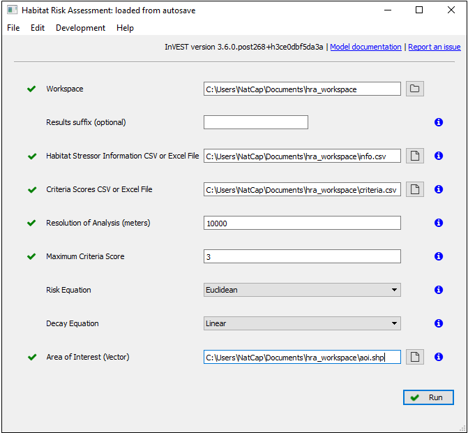

.. primer
.. _habitat_risk_assessment:

.. |toolbox| image:: ./shared_images/toolbox.jpg
             :alt: toolbox
	     :align: middle
	     :height: 15px

.. |folder| image:: ./shared_images/openfolder.png
             :alt: folder
	     :align: middle
	     :height: 15px

.. |ok| image:: /shared_images/okbutt.png
             :alt: folder
	     :align: middle
	     :height: 15px

.. |addbutt| image:: /shared_images/addbutt.png
             :alt: addbutt
	     :align: middle
	     :height: 15px

.. |adddata| image:: /shared_images/adddata.png
             :alt: addbutt
	     :align: middle
	     :height: 15px

.. |hra| image:: habitat_risk_assessment_images/image028.png
             :alt: habitatriskassessment
	     :align: middle
	     :height: 15px

***********************
Habitat Risk Assessment
***********************

Summary
=======

The InVEST habitat and species risk assessment (HRA/SRA) model allows users to assess the cumulative risk posed to habitats and species by human activities and to explore consequences for the delivery of ecosystem services and biodiversity.  The condition of a habitat is a key determinant of the ecosystem services it can provide; for example, degraded coastal mangroves are less able to attenuate waves and reduce coastal exposure.  Risk to species may indicate reduced sustainability through time.  As anthropogenic stressors continue to diversify and intensify, so too does the need for quick, clear and repeatable ways of assessing risks to habitats and species, now and under future management scenarios.  HRA/SRA utilizes a well-supported exposure-consequence framework to assess spatial variation in cumulative risk from multiple human activities across a land- or seascapes.

Outputs from the model include an ecosystem risk map, risk maps for each individual habitat or species, risk plots that display the contribution of exposure and consequence to overall risk, and summary tables of risk by subregion and habitat or species. These outputs can be used to identify areas at the greatest relative risk of degradation as well as the primary causes of risk within a study region and among alternative future scenarios. Model outputs can help identify areas where human activities may create trade-offs among ecosystem services by posing risk high enough to compromise habitat structure and function or species persistence or recovery. The model can help to prioritize areas for conservation, evaluate management strategies, and inform the design and configuration of spatial plans for both marine and terrestrial systems.

Introduction
============

Habitats and species provide essential benefits for people, including regulating, material, and non-material services (Pascual et al. 2017, Díaz et al. 2018). For example, nearshore habitats such as kelp forests and eelgrass meadows provide valuable ecosystem services including the protection of shorelines from storms, nursery habitat for fisheries, and carbon storage and sequestration. Terrestrial habitats like riparian forests absorb excess nutrients and sediment, provide habitat for riverine fish species, and mitigate inland flooding after rain events. Species not only have intrinsic value, but also underpin food-webs and ecosystem function that provide benefits to people. As these habitats (or species) become degraded by human activities, the ecosystem services they provide are threatened. Recent global analyses have revealed that almost no area of the world's oceans is untouched by human impacts (Halpern et al. 2008). Thus, an understanding of the location and intensity of human impacts on nearshore ecosystems is an essential component of informed and successful terrestrial, coastal, and ocean management. The InVEST HRA/SRA model allows users to assess the threat of human activities to the health of these ecosystems and species.  The model has been successfully applied in numerous locations across the world (e.g. Arkema et al. 2014, Cabral et al. 2015, Chung et al. 2015, Duggan et al. 2015, Ma et al. 2016, Elliff et al. 2017, Wyatt et al. 2017).

The HRA/SRA model is a quantitative approach to evaluating the cumulative influence of stressors associated with human activities on habitats and species, many of which provide important ecosystem services (Arkema et al. 2014, Arkema et al. 2015). HRA/SRA uses a well-established approach (Arkema et al. 2014, Duggan et al. 2015) from the risk literature that originates from fisheries vulnerability assessments (Astles et al. 2006, Patrick et al. 2010, Hobday et al. 2011, Samhouri and Levin 2012).  The model incorporates two dimensions of information to calculate risk or impact to ecosystem components (figure 1; Halpern et al. 2008, Patrick et al. 2010, Samhouri and Levin 2012, Arkema et al. 2014). These dimensions are ‘exposure’ and ‘consequence’, where exposure is the degree to which a habitat or species experiences a stressor, given the effectiveness of management practices, and consequence is the habitat (or species)-specific response to that exposure. Consequence includes both sensitivity of each habitat or species to the effects of each human activity, and habitat or species-specific measures of resilience, the ability of a habitat or species to resist disturbance or recover from it.

.. figure:: habitat_risk_assessment_images/risk_plot.jpg

   Habitats with high exposure to human activities and high consequence are at high risk. Plotting exposure and consequence data in this plot allows users to visualize risk, and to assess which types of risk are more effectively mitigated by human intervention (risks driven by exogenous human factors, top right region of the risk space) and which types of risk are better addressed through monitoring and preparedness (risks driven by endogenous habitat-specific factors).  (Adapted from Dawson et al. 2011).

Habitats or species with high exposure to human activities and high consequence are at high risk. Plotting exposure and consequence data allows users to visualize risk, and to assess which types of risk are more effectively mitigated by human intervention (risks driven by exogenous human factors, top right region of the risk space) and which types of risk are better addressed through monitoring and preparedness (risks driven by endogenous habitat-specific factors).  (Adapted from Dawson et al. 2011).

The outputs of the HRA/SRA model allow users to identify areas of high ecosystem risk across subregions, investigate which habitats or species are at the greatest risk and where, determine the primary causes of risk across habitats/species and locations, and understand how risk of habitat or species degradation would change under future scenarios and influence the delivery of ecosystem services.   HRA/SRA results can be used in an array of decision contexts:
•	Areas of high risk can be used to prioritize management or restoration efforts, as NOAA’s Office for Coastal Management has done in New Hampshire’s Great Bay (NOAA OCM 2016).
•	Areas of high risk can be used to constrain the decision space when siting additional uses (e.g. where to site wind energy as shown in Wyatt et al. 2017)
•	Risk plots can provide insight into which activities are the most impactful and what types of management strategies will be most effective (E.g. Duggan et al. 2015).
•	When used in conjunction with models that estimate habitat-induced changes in ecosystem services, such as storm protection or tourism revenue, HRA can help to evaluate trade-offs among human activities and benefits that ecosystems provide to people (see :ref:` Connecting Habitat Risk Assessment Results to InVEST Ecosystem Service Models`; Guerry et al. 2012, Clarke et al. 2016, Arkema et al. 2015).
•	Repeated applications of HRA can be used together to assess and compare alternative scenarios (Arkema et al. 2014).

.. primerend

Comparisons with other InVEST Models: Habitat Quality and Overlap Analysis
--------------------------------------------------------------------------

Comparison to InVEST Habitat Quality Model
^^^^^^^^^^^^^^^^^^^^^^^^^^^^^^^^^^^^^^^^^^
The InVEST HRA/SRA model is similar to the InVEST Habitat Quality model in that both models allow users to identify regions on a landscape or seascape where human impacts are highest. While the Habitat Quality model is intended to be used to assess how human activities impact biodiversity, the HRA model is better suited to screening the risk of current and future human activities to prioritize management strategies that best mitigate risk.

A primary goal of conservation is the protection of biodiversity; biodiversity is intricately linked to the production of ecosystem services. While some people and institutions consider biodiversity itself to be an ecosystem service, the InVEST Habitat Quality model treats it as an independent attribute of natural systems, with its own intrinsic value (InVEST does not monetize biodiversity). InVEST includes a habitat quality model because natural resource managers, corporations and conservation organizations are becoming increasingly interested in understanding how and where biodiversity and ecosystem services align in space and how management actions affect both.  The biodiversity model uses habitat quality and rarity as a proxy for diversity.

When developing a similar model with marine systems in mind (as was the case for HRA/SRA), differences in data availability (e.g., the lack of an analog to land-use/land-cover maps in marine systems) and differences in thinking (e.g., the prevalence of a risk-assessment framework in fisheries science) led us to the development of the habitat (and species) risk assessment model described in this chapter. Both the Habitat Quality and the Habitat Risk Assessment models can be used across systems to identify areas on a landscape or seascape where the risk posed by human activities is highest. However, the modeling approaches differ in several ways. First, the exposure-consequence framework of the HRA/SRA model allows model results to be interpreted in a manner that helps users explore which types of management strategies are likely to most effectively reduce risk (Figure 1). For example, ecosystems with high exposure and high consequence may be targeted for intense active management, while effective strategies for ecosystems with low exposure to human stressors but high consequence may include close monitoring but little active intervention unless exposure increases. Second, the transparent flexible structure, in addition to the ability to rank data quality and importance, facilitate HRA/SRA’s use in both data-rich and data-poor situations. Finally, the Habitat Quality model is better suited for terrestrial applications than marine applications because it requires a land use land cover map as an input. The HRA/SRA model can be used in both marine and terrestrial systems.

The Model
=========

How it Works
------------

A central feature and strength of the HRA/SRA model is that it explicitly breaks down exposure and consequence in a risk framework (Arkema et al. 2014). To assess the exposure of ecosystems and habitats or species to activities and the consequence of that exposure, HRA/SRA synthesizes information about interactions between multiple human activities (or “stressors”), and multiple habitats or species using both spatial and non-spatial data from the peer-reviewed literature, grey literature, and expert opinion.

Users provide model inputs including base maps of habitat or species distribution, the spatial extent of human activities or stressors, and information about the nature of the interaction between habitats or species and these stressors.  Information about these interactions are included in the form of multiple exposure and consequence criteria suggested by the model (or which can be defined by the user) and are specific to each habitat (or species)-stressor interaction.  For example, exposure depends on the extent of geographic overlap between habitats and human activities, the duration of time that the activity and habitat overlap, the intensity of the stressor, and the degree to which management strategies mitigate impact. Consequence depends on the degree of habitat loss as a result of exposure to a stressor, change in habitat structure, and the ability of habitats to recover from these effects (i.e., through life history traits such as recruitment and regeneration rates). For each criterion, the user then scores the interaction from low to high. The model is flexible and can accommodate data-poor and data-rich situations. Data may come from a combination of sources, from peer-reviewed data at the global scale and locally available fine-scale data. Model inputs and results can be updated as better information becomes available.

The HRA model combines this spatial and non-spatial data to produce information about risk at two scales and with several types of outputs. Maps display variation at a grid cell scale in the relative risk of human activities within the study area to both individual habitats or species and to the ecosystem as a whole. In addition, the model categorizes these continuous grid-based risk maps into vector-based maps of low, medium, and high risk. Tables and risk plots (i.e., Figure 1) show the contribution of different activities to the risk posed to each habitat or species at a subregional scale within the study area.  The model calculates risk at the grid-cell scale and then summarizes results at the subregional scale.

.. _hra-equations:

Cumulative Risk to Habitats or Species from Multiple Stressorss
^^^^^^^^^^^^^^^^^^^^^^^^^^^^^^^^^^^^^^^^^^^^^^^^^^^^^^^^^^^^^^^

The risk of human activities to habitats or species is modeled in five steps.

**Step 1.** The first step involves determining the degree of exposure of the habitat or species to the stressor and the consequence of this exposure. Exposure (E) and consequence (C) are both determined by assigning a rating (typically 1-3, with 0 = no score) to a set of criteria for each attribute. The model provides the user with a set of standard criteria used frequently in the scientific literature, but any criteria may be added or removed. Guidelines for scoring of the default criterion are summarized below, and abbreviated descriptions of scoring on a 1-3 basis are provided in the tables produced from HRA Preprocessor. Note that "spatial overlap," which is one of the exposure criteria, is treated differently from the other default criteria.  For each grid cell in the study area, if a stressor and a habitat or species overlap in space, then spatial overlap = 1 and the model calculates E and C using the information about the other criteria and the equations below.  If a stressor and a habitat or species do not overlap in a particular grid cell, the assumes that spatial overlap = 0, E = 0, C = 0 and Risk = 0.  Spatial overlap is determined by the model using the spatial layers for stressor and habitat provided by the user.  The scores for all the other criteria are inputs to the model provided by the user.  To ensure accuracy, we recommend that scores be determined using readily available data from peer-reviewed literature or published reports, however, you are free to use any data you believe to be the most accurate. For each score assigned, you may also indicate the quality of the data used to determine the score and the weighted importance of the criteria relative to other criteria. This allows you to assign greater weight to criteria where scoring confidence was higher, or to criteria which contribute more to risk in the system. Thus, the overall exposure :math:`E` and consequence :math:`C` scores are calculated as weighted averages of the exposure values :math:`e_i` and consequence values :math:`c_i`  for each criterion *i*, from habitat *j* and stressor *k*

.. math:: E_{jkl} = \frac{\sum^N_{i=1}\frac{e_{ijkl}}{d_{ijkl}\cdot w_{ijkl}}} {\sum^N_{i=1}\frac{1}{d_{ijkl} \cdot w_{ijkl}}}
   :label: eq1

.. math:: C_{jkl} = \frac{\sum^N_{i=1}\frac{c_{ijkl}}{d_{ijkl}\cdot w_{ijkl}}}{\sum^N_{i=1}\frac{1}{d_{ijkl} \cdot w_{ijkl}}}
   :label: eq2

where :math:`E_{jkl}` is the exposure score specific to habitat *j*, from stressor *k* in location *l*; :math:`C_{jkl}` is the consequence score, :math:`e_{ijkl}` is the exposure rating criterion *i*, specific to habitat *j* and stressor *k* and location *l*; :math:`c_{ijkl}` is the consequence rating. :math:`d_{ijkl}` represents the data quality rating, :math:`w_{ijkl}` represents the importance weighing for criterion. *N* is the number of criteria evaluated for each habitat.

**Step 2.** The second step combines the exposure and response values to produce a risk value for each stressor-habitat combination in each grid cell. There are two options for risk calculation.

For Euclidean Risk calculation, risk to habitat *j* caused by stressor *k* in each location (i.e. cell) *l* is calculated as the Euclidean distance from the origin in the exposure-consequence space, where average exposure (:ref:`eq1`) is on one axis and the average consequence score (:ref:`eq2`) is on the other.

.. math:: R_{jkl} = \sqrt{(E_{jkl}-1)^2+(C_{jkl}-1)^2}
   :label: eq3

The model maps this habitat-stressor specific risk score where the habitat and stressor overlap in space

.. figure:: habitat_risk_assessment_images/risk_plot2.jpg

For Multiplicative Risk calculation, risk to habitat *j* caused by stressor *k* in cell *l* is calculated as the product of the exposure (:ref:`eq1`) and consequence scores (:ref:`eq2`).

.. math:: R_{ijkl} = E_{jkl} \cdot C_{jkl}
    :label: eq4

The user has the option of choosing which risk function to use.  Different studies have combined this information in different ways: Cumulative impact mapping studies tend to use a multiplicative approach to estimate risk (Halpern et al 2008, Selkoe et al 2009, Ban et al 2010), whereas ecosystem risk assessment studies tend to estimate risk as the Euclidean distance for a specific habitat (or species)-activity combination in risk plots (Patrick et al 2010, Hobday et al 2011, Samhouri and Levin 2012, Arkema et al. 2014).

Initial sensitivity testing suggests that, overall, the two approaches agree on the highest and lowest risk habitats or regions, although intermediate risk results may differ (Stock et al. 2015).  Empirical testing of an extensive HRA analysis in Belize using a Euclidean approach found good agreement between calculated risk and measures of habitat fragmentation and health (Arkema et al. 2014 supplement). Testing of SRA in the prairies of Washington, USA found mean risk was higher in unoccupied potential species’ territory and lower in occupied species territory (Duggan et al. 2015). In general, the Euclidean approach may provide more conservative, higher overall estimates than the multiplicative approach.  If E and C values are widely different, then the Euclidean approach will produce relatively higher risk results. In contrast, the multiplicative approach will tend to produce relatively lower, less conservative values for risk and associate similarity in E and C with higher risk. If your system contains habitats for which there is a very high consequence of risk but low exposure (e.g., coral and shrimp trawling zones that currently avoid coral reefs) and you want to adopt the precautionary principle, then choosing the Euclidean approach is advised. Either approach will produce useful results. We have included this explanation to provide you with insight into the assumptions of the different functions.

**Step 3.** In this step, the model quantifies in each location the cumulative risk to each habitat or species from all stressors. Cumulative risk for habitat or species *j* in cell *l* is the sum of all risk scores for each habitat or species,

.. math:: R_{jl} = \sum^K_{k=1} R_{jkl}
   :label: eq5

**Step 4.** The model identifies areas of habitats or species that are risk 'hotspots'. These are areas where the influence of human-derived stressors is so great that ecosystem structure and function may be severely compromised. In these areas (i.e. risk 'hotspots', there may be trade-offs between human activities and a range of ecosystem services. Thus, users may choose to consider these habitats or species to be functionally absent in inputs to other InVEST ecosystem service models (see :ref:`Interpreting Results` section for guidance on how to use risk hotspots to identify trade-offs among human activities under alternative scenarios). Each grid cell for each habitat or species is classified as LOW< MED, or HIGH risk based on risk posed by any individual stressor or the risk posed by the cumulative effects of multiple stressors. A classification of HIGH is assigned to grid cells meeting one of two criteria:

   1)	Cumulative risk in the grid cell is >66% of the maximum risk score for any individual habitat (or species)-stressor combination.  For example, if exposure and consequence are ranked on a scale of 1-3, then the maximum risk score for an individual habitat (or species)-stressor combination is 2.83 (using the Euclidean approach); all cells with a risk score greater than 1.87 (66% of 2.83) would be classified as HIGH risk.  This criterion addresses the issue that in instances where a stressor is particularly destructive (e.g. clear cutting that removes all trees or dredging that removes all coral), additional stressors (e.g. hiking trails or recreation fishing) will not further increase the risk of habitat degradation.

   2)	Cumulative risk in the grid cell is >66% of total possible cumulative risk.  Total possible cumulative risk is based on both the maximum risk score for an individual habitat (or species)-stressor combination and the maximum number of stressors that can occupy a particular grid cell in the study area (see next paragraph).  Maximum number of overlapping stressors = 3 if, in the entire study region, no more than 3 stressors (e.g., agriculture run-off, marine aquaculture and marine transportation) are likely to occur in a single grid cell.  Total possible cumulative risk in this case would be 8.49 (based on the Euclidean approach; the maximum risk score for a single habitat (or species)-stressor combination X the maximum number of overlapping stressors = 2.83 x 3 = 8.49).  This criterion addresses the issue that even when a single stressor is not particularly detrimental the cumulative effect of multiple stressors causes is high.

Cells are classified as MED if they have individual stressor or cumulative risk scores between 33%-66% of the total possible cumulative risk score. Cells are classified as LOW risk if they have individual or cumulative risk scores of 0-33% of the total possible risk score for a single stressor or multiple stressors, respectively.

The maximum number of overlapping stressor is an input provided by the user. The highest value for this input is the total number of stressors in the study area; however, it is unlikely that all stressors will ever realistically overlap in a single grid cell.  This is because stressors are distributed differently in space (i.e., stressors like coastal development exist along the shore while shipping lanes exist offshore) and because some stressors can never exist in the exact same location (i.e., naval weapons testing areas and tourism). From applying this model in several locations, we have found that 3 or 4 is a common value for maximum number of overlapping stressors, but the user should either manually examine his/her maps for overlaps in stressors or use the Overlap Analysis model to calculate the highest number of overlapping stressors.

**Step 5.** In the final step, risk is calculated at a subregional scale, which is larger than the resolution of the grid cells and smaller than the size of the study area.  In a spatial planning process, subregions are often units of governance (i.e., coastal planning regions, states or provinces) within the boundaries of the planning area.  At the subregional scale, score for spatial overlap (a default exposure criteria) is based on the fraction of habitat area in a subregion that overlaps with a human activity (see below for more detail).  The subregional score for all other E and C criteria are the average E and C score across all grid cells in the study area. Risk is estimated either using the Euclidean distance or multiplicative approach (see above).

Risk outputs at a subregional scale can be used to determine which activities are contributing the most to habitat risk in a particular region.  This information can in turn be used to explore strategies that would reduce the exposure of a particular habitat to a particular activity, such as reducing the extent or changing the location of an activity.  The model produces risk plots for each habitat that compare the consequence and exposure scores for all activities at a subregional scale.  These plots help the user to understand if reducing exposure of particular activities through management actions is likely to reduce risk or if risk is driven by consequence, which is harder to perturb through management actions (see Figure 1 above).  The model also produces tables listing E, C and Risk for each habitat-stressor combination at a subregional scale and calculates the percentage of cumulative risk by habitat that is due to a particular stressor in that region.

Cumulative Risk to the Ecosystem from Multiple Stressors
^^^^^^^^^^^^^^^^^^^^^^^^^^^^^^^^^^^^^^^^^^^^^^^^^^^^^^^^
To provide an integrative index of risk across all habitats or species in a grid cell, the model also calculates ecosystem risk. Ecosystem risk for each grid cell *l* is the sum of habitat or species risk scores in that cell.

.. math:: R_{l}= \sum^J_{j=1} R_{jl}
    :label: eq6

Ecosystem risk will increase with an increasing number of co-occurring habitats or species.

Exposure and Consequence Criteria in More Detail
^^^^^^^^^^^^^^^^^^^^^^^^^^^^^^^^^^^^^^^^^^^^^^^^

The model allows for any number of criteria to be used when evaluating the risk to habitat areas. As a default, the model provides a set of typical considerations for evaluating risk of stressors to habitats. With the exception of spatial overlap at a grid cell scale, these criteria are rated on a scale of 1-3, with 0 = no score.  However, the user is not constrained to the rating these criteria to a 0-3 scale. If there is significant literature using an alternative scale, the model can accommodate any scale (i.e., 1-5, 1-10) as long as there is consistency across the rating scores within a single model run. It should be noted that using a score of 0 on ANY scale will indicate that the given criteria is not desired within that model run.  In all cases higher numbers represent greater exposure or consequence and result in higher risk scores.

Exposure of Habitats to Stressors
"""""""""""""""""""""""""""""""""

The risk of a habitat being affected by a stressor depends in part on the exposure of the habitat to that stressor. Stressors may impact habitats directly and indirectly. Because indirect impacts are poorly understood and difficult to trace, the model only assesses the risk of stressors that directly impact habitat by overlapping in space. Other important considerations include the duration of spatial overlap, intensity of the stressor, and whether management strategies reduce or enhance exposure.

1. **Spatial overlap .**  To assess spatial overlap in the study area, the model uses maps of the distribution of habitats or species and stressors.  Habitat types can be biotic, such as eelgrass or kelp, or abiotic, such as hard or soft bottom. The user defines the detail of habitat classification. For example, habitats can be defined as biotic or abiotic, by taxa (e.g., coral, seagrass, mangrove), by species (e.g., red, black mangroves) or in whatever scheme the user desires.  In a species risk assessment, we recommend specifying a single species, but the user could also indicate a taxa.  The user should keep in mind that in order for additional detail or specificity to be useful and change the outcome of the model, these habitat classifications should correspond with differences between habitats or stressors in their response to the stressors.

   The model also requires the user to input maps of the distribution of each stressor and information about its "zone of influence." The zone of influence of each stressor is the distance over which the effects of the stressor spread beyond its actual footprint in the input stressor map. For some stressors, such as foot trails through a forest, this distance will be small.  For other stressors, such as finfish aquaculture pens where nutrients spread 300-500m or forest clearcutting where edge effects can extend up to 1km, this distance may be large.  The user can specify whether the impacts of the stressor decay linearly or exponentially from the footprint of the stressor to the outer extent of the zone of influence.  The model uses the distance of the zone of influence of a stressor to create an intermediate output that is a map of the stressor footprint buffered by the zone of influence (rounding down to the nearest cell unit; e.g., a buffer distance of 600m will round down to 500m if the resolution of analysis is 250m). The model uses the maps of habitat and buffered stressors to estimate spatial overlap between each habitat and each stressor at the grid cell and subregional scale.

   For each grid cell, if the habitat or species overlaps with a stressor, then spatial overlap = 1 and the model calculates exposure, consequence and risk using scores for the other criteria (below).  If a habitat or species does not overlap with a stressor in a particular grid cell, then the model sets exposure, consequence and risk = 0 in that particular grid cell.

   To report at the subregional scale, the model calculates the fraction of area of each habitat that overlaps with each stressor.  Next, the model puts that fraction between 1 and the maximum risk score (e.g.., 1-3) to match the scale for scoring the other criteria.  This transformation follows the equation maximum score * percentage overlap + minimum score * (1-percentage overlap).  For example, if spatial overlap = 50% of the habitat overlapped by a stressor, and our scale is 1-3, then 3*overlap + 1*(1-overlap) = 2.  Lastly, the model averages the spatial overlap score with the average exposure score for the subregion.  If there is no spatial overlap between the habitat and stressor at the subregional scale, then exposure = 0, consequence = 0 and risk = 0. If there are no exposure scores for that habitat-stressor combination, but spatial overlap does exist, the score will be entirely the spatial overlap.

2. **Overlap time rating.**  Temporal overlap is the duration of time that the habitat or species and the stressor experience spatial overlap. Some stressors, such as permanent structures, are present year-round; others are seasonal, such as certain fishing practices or recreational activities. Similarly, some habitats (e.g. mangroves) or species are present year round, while others are more ephemeral (e.g. some seagrasses or perennial understory vegetation).

   The model uses the following categories to classify LOW, MEDIUM, and HIGH temporal overlap:

   ================ ========================================================= ======================================================== ========================================================= ============
   ..               Low (1)                                                   Medium (2)                                               High (3)                                                  No score (0)
   ================ ========================================================= ======================================================== ========================================================= ============
   Temporal overlap Habitat and stressor co-occur for 0-4 months of the year  Habitat and stressor co-occur for 4-8 months of the year Habitat and stressor co-occur for 8-12 months of the year N/A
   ================ ========================================================= ======================================================== ========================================================= ============

   Choose "No score" to exclude this criterion from your assessment.

3. **Intensity rating.** The exposure of a habitat to a stressor depends not only on whether the habitat and stressor overlap in space and time, but also on the intensity of the stressor.  The intensity criterion is stressor-specific.  For example, the intensity of nutrient-loading stress associated with netpen salmon aquaculture is related to the number of salmon in the farm and how much waste is released into the surrounding environment. Alternatively, the intensity of destructive shellfish harvesting is related to the number of harvesters and the harvest practices. You can use this intensity criteria to explore how changes in the intensity of one stressor might affect risk to habitats.  For example, one could change the intensity score to represent changes in the stocking density of a salmon farm in a future scenario.  One can also use this ranking to incorporate relative differences in the intensity of different stressors within the study region.  For example, different types of marine transportation may have different levels of intensity.  For example, cruise ships may be a more intense stressor than water taxis because they release more pollutants than the taxis do.

   The model uses the following categories to classify LOW, MEDIUM, and HIGH intensity:

   ========= ============= ================ ============== ============
   ..        Low (1)       Medium (2)       High (1)       No score (0)
   ========= ============= ================ ============== ============
   Intensity Low intensity Medium intensity High intensity N/A
   ========= ============= ================ ============== ============

   Choose "No score" to exclude this criterion from your assessment.

4. **Management strategy effectiveness rating.** Management can limit the negative impacts of human activities on habitats. For example, regulations that require a minimum height for overwater structures reduce the shading impacts of overwater structures on submerged aquatic vegetation. Thus, effective management strategies will reduce the exposure from stressors to habitats or species. The effectiveness of management of each stressor is scored relative to other stressors in the region.  So if there is a stressor that is very well managed such that it imparts much less stress on the system than other stressors, classify management effectiveness as "very effective."  In general, however, the management of most stressors is likely to be "not effective."  After all, you are including them as stressors because they are having some impact on habitats. You can then use this criterion to explore changes in management between scenarios, such as the effect of changing development from high impact (which might receive a score of "not effective") to low impact (which might receive a score of "very effective)."  As with all criteria, higher numbers represent greater exposure and result in higher risk scores.

   The model uses the following categories to classify LOW, MEDIUM, and HIGH exposure given management effectiveness:

   ======================== ============== ================== ============================= ============
   ..                       Low (1)        Medium (2)         High (3)                      No score (0)
   ======================== ============== ================== ============================= ============
   Management effectiveness Very effective Somewhat effective Not effective, poorly managed N/A
   ======================== ============== ================== ============================= ============

   Choose "No score" to exclude this criterion from your assessment.

Consequence of Exposure
"""""""""""""""""""""""

The risk of a habitat or species being degraded by a stressor depends on the consequence of exposure.  Consequence is determined by both the sensitivity of a habitat to a specific stressor and the resilience of a habitat to resist and recover from disturbance in general.   As a default, the model includes three habitat or species-stressor specific measures of sensitivity—change in area, change in structure, and frequency of similar natural disturbance—and four habitat-specific measures of resilience—natural mortality rate, recruitment rate, age at maturity, and connectivity. Each is described in turn below.

1. **Change in area rating.** Change in area is measured as the percent change in extent of a habitat or species when exposed to a given stressor and is a measure of sensitivity of the habitat or species to the stressor. Habitats or species that lose a high percentage of their areal extent when exposed to a given stressor are highly sensitive, while those habitats that lose little area are less sensitive.

   The model uses the following categories to classify LOW, MEDIUM, and HIGH change in area:

   ============== ======================== ============================ =========================== ============
   ..             Low (1)                  Medium (2)                   High (3)                    No score (0)
   ============== ======================== ============================ =========================== ============
   Change in area Low loss in area (0-20%) Medium loss in area (20-50%) High loss in area (50-100%) N/A
   ============== ======================== ============================ =========================== ============

   Choose "No score" to exclude this criterion from your assessment.

2. **Change in structure rating.** For biotic habitats, the change in structure is the percentage change in structural density of the habitat when exposed to a given stressor. For example, change in structure would be the change in tree density (or vertical or horizontal complexity) for forest systems or change in polyp density for corals. Habitats that lose a high percentage of their structure when exposed to a given stressor are highly sensitive, while habitats that lose little structure are less sensitive. For abiotic habitats, the change in structure is the amount of structural damage sustained by the habitat. Sensitive abiotic habitats will sustain complete or partial damage, while those that sustain little to no damage are more resistant. For example, gravel or muddy bottoms will sustain partial or complete damage from bottom trawling while hard bedrock bottoms will sustain little to no damage.  For species, change in structure can be used to capture changes to population structure, for example in age or gender distribution

   The model uses the following categories to classify LOW, MEDIUM, and HIGH change in structure:

   =================== ======================================================================================================================== ======================================================================================================================= ==================================================================================================================== ============
   ..                  Low (1)                                                                                                                  Medium (2)                                                                                                              High (3)                                                                                                             No score (0)
   =================== ======================================================================================================================== ======================================================================================================================= ==================================================================================================================== ============
   Change in structure Low loss in structure (for biotic habitats, 0-20% loss in density, for abiotic habitats, little to no structural damage) Medium loss in structure (for biotic habitats, 20-50% loss in density, for abiotic habitats, partial structural damage) High loss in structure (for biotic habitats, 50-100% loss in density, for abiotic habitats, total structural damage) N/A
   =================== ======================================================================================================================== ======================================================================================================================= ==================================================================================================================== ============

   Choose "No score" to exclude this criterion from your assessment.

3. **Frequency of natural disturbance rating.** If a habitat or species is naturally frequently perturbed in a way similar to the anthropogenic stressor, it may be more resistant to comparable anthropogenic stress. For example, habitats in areas that experience periodical delivery of nutrient subsidies (i.e. from upwelling or allocthonous inputs such as delivery of intertidal plant material to subtidal communities) are adapted to variable nutrient conditions and may be more resistant to nutrient loading from netpen salmon aquaculture.  Similarly, forests with historical wind-throw events may be better adapted to selective logging.  This criterion is scored separately for each habitat or species-stressor combination, such that being adapted to variable nutrient conditions increases resistance to nutrient loading from salmon aquaculture but not destructive fishing. However, an alternative naturally occurring stress like high storm frequency may increase resistance to destructive fishing, because both stressors impact habitats in similar ways.  As with all criteria, higher numbers represent greater exposure or consequence and result in higher risk scores. Specifically, higher rates of comparable natural disturbance imply greater resilience (and are therefore scored lower).

   The model uses the following categories to classify LOW, MEDIUM, and HIGH sensitivity relative to natural disturbance frequencies:

   ======================================== ========================== =============================================== ============================= ============
   ..                                       Low (1)                    Medium (2)                                      High (3)                      No score (0)
   ======================================== ========================== =============================================== ============================= ============
   Frequency of similar natural disturbance Frequent (daily to weekly) Intermediate frequency (several times per year) Rare (annually or less often) N/A
   ======================================== ========================== =============================================== ============================= ============

   Choose "No score" to exclude this criterion from your assessment.

.. note:: The following consequence criteria are Resilience Attributes.  These include life history traits such as regeneration rates and recruitment patterns that influence the ability of habitats or species to recover from disturbance.  We treat recovery potential as a function of natural mortality, recruitment, age of maturity, and connectivity.

4. **Natural mortality rate rating (biotic habitats only).** Habitats or species with high natural mortality rates are generally more productive and more capable of recovery and therefore scored as less impacted by a disturbance (i.e. higher mortality rates are given lower scores). As with all criteria, higher numbers represent greater exposure or consequence and result in higher risk scores.

   The model uses the following categories to classify LOW, MEDIUM, and HIGH impact relative to natural mortality rates:

   ====================== ================================== ================================ ========================== ============
   ..                     Low (1)                            Medium (2)                       High (3)                   No score (0)
   ====================== ================================== ================================ ========================== ============
   Natural mortality rate High mortality (e.g.80% or higher) Moderate mortality (e.g. 20-50%) Low mortality (e.g. 0-20%) N/A
   ====================== ================================== ================================ ========================== ============

   Choose "No score" to exclude this criterion from your assessment.

5. **Recruitment rating (biotic habitats only).** Frequent recruitment increases recovery potential by increasing the chance that incoming recruits can re-establish a population in a disturbed area.  I.e. Higher recruitment confers greater resilience and is therefore scored lower. As with all criteria, higher numbers represent greater exposure or consequence and result in higher risk scores.

   The model uses the following categories to classify LOW, MEDIUM, and HIGH impact relative to natural recruitment rate:

   ======================== ==================== ============= ============ ============
   ..                       Low (1)              Medium (2)    High (3)     No score (0)
   ======================== ==================== ============= ============ ============
   Natural recruitment rate Annual or more often Every 1-2 yrs Every 2+ yrs N/A
   ======================== ==================== ============= ============ ============

   Choose "No score" to exclude this criterion from your assessment.

6. **Age at maturity/recovery time.** Biotic habitats or species that reach maturity earlier are likely to be able to recover more quickly from disturbance than those that take longer to reach maturity.  For habitats, we refer to maturity of the habitat as a whole (i.e., a mature kelp or temperate forest) rather than reproductive maturity of individuals.  For abiotic habitats, shorter recovery times for habitats such as mudflats decrease the consequences of exposure to human activities. In contrast, habitats made of bedrock will only recover on geological time scales, greatly increasing the consequences of exposure.

   The model uses the following categories to classify LOW, MEDIUM, and HIGH age at maturity/recovery time:

   ============================= ============== ========== ================ ============
   ..                            Low (1)        Medium (2) High (3)         No score (0)
   ============================= ============== ========== ================ ============
   Age at maturity/recovery time Less than 1 yr 1-10yrs    More than 10 yrs N/A
   ============================= ============== ========== ================ ============

   Choose "No score" to exclude this criterion from your assessment.

7. **Connectivity rating (biotic habitats only).** Close spacing of habitat patches or population subgroups increases the recovery potential of a habitat or species by increasing the chance that incoming recruits can re-establish a population in a disturbed area.  Connectivity is relative to the distance a recruit can travel.  For example, patches that are 10km apart may be considered poorly connected for a species whose larvae or seeds can only travel hundreds of meters and well connected for a species whose larvae or seeds can travel hundreds of kilometers.  As with all criteria, higher numbers represent greater exposure or consequence and result in higher risk scores.

   The model uses the following categories to classify LOW, MEDIUM, and HIGH impact relative to connectivity:

   ============ ================================================ =================== ================================================ ============
   ..           Low (1)                                          Medium (2)          High (3)                                         No score (0)
   ============ ================================================ =================== ================================================ ============
   Connectivity Highly connected relative to dispersal distances Medium connectivity Low connectively relative to dispersal distances N/A
   ============ ================================================ =================== ================================================ ============

   Choose "No score" to exclude this criterion from your assessment.

Using Spatially Explicit Criteria
^^^^^^^^^^^^^^^^^^^^^^^^^^^^^^^^^

As an alternative to assigning a single rating to a criterion that is then applied to the whole study region, the model allows for spatially explicit criteria to be used as an input. Spatially explicit criteria ratings can be used for any of the exposure or consequence criteria. For example, the user could differentiate between areas of high and low recruitment for a particular habitat or species within the study area.  As another example, the user may have information on spatial variation in a human activity, such as alternative tinning and logging plans, which could influence the intensity rating of this stressor. The spatially explicit criteria are vector or raster layers, where each feature or raster value may contain a separate rating for that particular area. (See the :ref:`Criteria Scores CSV` section for more information on how to prepare and use spatially explicit criteria within a complete model run.)

Guidelines for Scoring Data Quality and Weights
^^^^^^^^^^^^^^^^^^^^^^^^^^^^^^^^^^^^^^^^^^^^^^^

Risk assessment is an integrative process, which requires a substantial amount of data on many attributes of human and ecological systems. It is likely that some aspects of the risk assessment will be supported by high quality data and other aspects will be subject to limited data availability and high uncertainty. The user has the option of scoring data quality to put greater weight on the criteria for which confidence is higher in the calculation of risk (eq. 2 and 3). We hope that by including the option to rate data quality in the model, users will be aware of some sources of uncertainty in the risk assessment, and will therefore be cautious when using results derived from low quality data. In addition, the information generated from this rating process can be used to guide research and monitoring effects to improve data quality and availability. We suggest the users first run the model with the same data quality score (e.g., 2) for all the criteria to determine if the overall patterns make sense based just on relationships between the stressors and habitats. Next, if users have excellent data quality for a given criteria, they should then re-run the model using a 1 to indicate high data quality, and if they do not have verified information on the data quality of specify a 3 to indicate lower and data quality.

For each exposure and consequence score, users can indicate the quality of the data that were used to determine the score on a sliding scale where 1 indicates the highest quality data and anything above that is increasingly untrustworthy.

===================================================================================================================================================== ==================================================================================================================================================================== =====================================================================================================================
Best data (1)                                                                                                                                            Adequate data (2)                                                                                                                                                        Limited data (3)
===================================================================================================================================================== ==================================================================================================================================================================== =====================================================================================================================
Substantial information is available to support the score and is based on data collected in the study region (or nearby) for the species in question. Information is based on data collected outside the study region, may be based on related species, may represent moderate or insignificant statistical relationships. No empirical literature exists to justify scoring for the species but a reasonable inference can be made by the user.
===================================================================================================================================================== ==================================================================================================================================================================== =====================================================================================================================

Similarly, the user can adjust the importance or “weight” of each criterion.  Each ecological system is unique and different criteria may be more important for some habitats or species than others.  For example, the recovery potential of a habitat or species may be more strongly dictated by recruitment rate than connectivity to other habitat patches.  We suggest the users first run the model with the same weight score (e.g., 2) for all the criteria to determine if the overall patterns make sense based on known relationships between the stressors and habitats or species. Next, if users have verified information on the importance of a given criteria, they should then re-run the model using a 1 or 3 to indicate higher or lower importance, respectively.

   ================================ =========================================================================== ========================================================================= ===================================================================================================
   ..                               Most important (1)                                                          Moderately important (2)                                                  Least important (3)
   ================================ =========================================================================== ========================================================================= ===================================================================================================
   Relative importance of criterion Criterion is especially important in determining the impact of the stressor Criterion is somewhat important in determining the impact of the stressor Criterion is less important, relative to other criterion, in determining the impact of the stressor
   ================================ =========================================================================== ========================================================================= ===================================================================================================

Limitations and Assumptions
---------------------------

Limitations
^^^^^^^^^^^

1. **Results are limited by data quality**: The accuracy of the model results is limited by the availability and quality of input data. Especially in the case of crtieria scores, using high quality data such as those from recent local assessments replicated at several sites within the study region for the species in question will yield more accurate results than using lower quality data that are collected at a distant location with limited spatial or temporal coverage. In most cases, users will need to use information from other geographic locations for some of the stressor-habitat or species combinations because most of the data on the effects of some stressors have only been collected in a limited number of locations worldwide. To overcome these data limitations, we include a data quality score in the analysis.  This score allows users to down-weight criteria for which data quality is low.

2. **Results should be interpreted on a relative scale**: Due to the nature of the scoring process, results can be used to compare the risk of several human activities among several habitats or species within the study region (which can range in size from small local scales to a global scale), but should not be used to compare risk calculations from separate analyses.  Uncertainty analysis has shown broad qualitative trends in this type of impact mapping to be robust (Stock 2016).  Empirical testing of HRA elsewhere has shown strong relationships between modeled risk and habitat fragmentation and health (Arkema et al. 2014).  As empirical data become available locally, a great avenue of future work would be to validate and relate regional risk scores to conditions of habitat quality (e.g., density, fragmentation, etc.).

3. **Results do not reflect the effects of past human activities**. The HRA model does not explicitly account for the effects of historical human activities on the current risk. Exposure to human activities in the past may affect the consequence of human activities in the present and future. For example, habitats or species may still be recovering from more destructive past fishing or land-use practices. If users have historical data on the exposure of habitats to human activities (e.g. spatial and temporal extent), and information on how this affects current consequence scores, they may include this information in the analysis for more accurate results.

4. **Results are based on equal weighting of criteria unless the user weights the criteria by importance or data quality**. The model calculates the exposure and consequence scores assuming that the effect of each criterion (i.e. spatial overlap and recruitment pattern) is of equal importance in the relative components of exposure and consequence. The relative importance of each of the criteria is poorly understood, so we assume equal importance. However, the user has the option to weight the importance of each criterion in determining overall risk.

Assumptions
^^^^^^^^^^^

1. **Ecosystems around the world respond in similar ways to any given stressor**. Often information in the literature about the effect stressors have on habitats or species comes from only a few locations.  If using globally available data or data from other locations, users make the assumption that *ecosystems around the world respond in similar ways to any given stressor* (i.e. eelgrass in the Mediterranean responds to netpen aquaculture in the same way as eelgrass in British Columbia). To avoid making this assumption across the board, users should use local data whenever possible.

2. **Cumulative risk is additive (vs. synergistic or antagonistic)**. The interaction of multiple stressors on marine ecosystems and species is poorly understood (see Crain et al. 2008, Teichert eta l. 2016) for more information). Interactions may be additive, synergistic or antagonistic. However, our ability to predict the type of interaction that will occur is limited. Due to the absence of reliable information on the conditions that determine additivity, synergism or antagonism, the model assumes additivity because it is the simplest approach. In some cases, the additive approach to assessing risk will underrepresent risk by missing interactions between stressors that might be synergistic or over-represent those that might cancel one another out.

.. _hra-data-needs:

Data Needs
==========

The model uses an interface to input all required and optional data and a series of Comma Separated Value (CSV) files with which to score all criteria and their data quality and weight.  Here we outline the options presented to the user via the interface and the maps and data tables that will be used by the model.  First we describe required inputs, followed by a description of optional inputs.

To run the model, two steps are required:

1.  Fill out the information and criteria CSV files.
2.  Run the Habitat Risk Assessment model

.. _hra-main-executable:

Habitat Risk Assessment
-----------------------

The main computation portion of the HRA model will be done by the Habitat Risk Assessment model (i.e. the executable). First we describe required inputs. The required inputs are the minimum data needed to run this model.

    The HRA 3.7 main executable.

1. **Workspace Location (required)**. Users are required to specify a workspace folder path. It is recommended that the user create a new folder for each run of the model. For example, by creating a folder called "hra_workspace" within the "C:\Users\NatCap\Documents" folder, the model will create "intermediate_outputs" and "outputs" folders within this "hra_workspace" workspace. The "intermediate_outputs" folder will compartmentalize data from intermediate processes. The model's final outputs will be stored in the "outputs" folder. ::

     Name: Path to a workspace folder. Avoid spaces.
     Sample path: C:\Users\NatCap\Documents\hra_workspace

2. **Results suffix (optional)**. Text string that will be appended to the end of output file names, as “scenario_a”. Use a Suffix to differentiate model runs, for example by providing a short name for each scenario. If a Suffix is not provided, or changed between model runs, the tool will overwrite previous results.

3. **Habitat & Stressor Information CSV or Excel File**. A table that contains the information such as path, type, name and buffer distance for the input layers. All the columns are required to be filled, except that buffer distance is required only for stressor layers. (See more in the :ref:`hra-info-csv` section)::

     Name: File can be named anything, but avoid spaces.
     File Type: A CSV (.csv) or an Excel (.xlsx, .xls) file.
     Sample path: C:\Users\NatCap\Documents\hra_workspace\info.csv

4. **Criteria Scores CSV or Excel File (required)**. A table that contains the collective criteria scores for all habitats and stressors. The rating column on the table can also store path to the spatially explicit criteria files. The Rating Instruction column is optional, used as a reference for filling out scores on the Rating column. (See more in the :ref:`hra-criteria-csv` section)::

     Name: File can be named anything, but avoid spaces.
     File Type: A CSV (.csv) or an Excel (.xlsx, .xls) file.
     Sample path: C:\Users\NatCap\Documents\hra_workspace\criteria.csv

5. **Resolution of Analysis (required)**. The size in meters that is desired for the analysis of the layers at a grid cell scale. This will define the width and height of each unique risk grid cell. This must be a whole number. The model will convert any vector-based habitat and stressor inputs into rasters such that any occurrence of a habitat or stressor within a cell will result in the cell registering as containing that habitat or stressor.

The user should base the model resolution on the resolution of the habitat data and scale at which habitats are distributed in space. For example, small patches of seagrasses and kelp are often about 100-200 square meters, which is about the smallest resolution we recommend running the model. If the input habitat data are coarse, then a minimum of 500 meters is better. We recommend running the model for the first time at a low resolution (1000m or 5000m) to verify that the model is running properly and then use a higher resolution in subsequent runs to save runtime.

6. **Maximum Criteria Score (required)** The maximum criteria score is the user-reported highest integer value assigned to any criteria rating within the assessment. This will be used as the upper bounded value against which all rating scores will be compared. For example, in a model run where the ratings scores vary from 0-3, this would be a 3. If the user chooses to use a different scale for ratings, however, this should be the highest value that could be potentially assigned to a criterion.

7. **Risk Equation (required)**. This selection chooses the equation that will be used when calculating risk to a given habitat. (See the :ref:`hra-equations` section.) The user may choose either a Euclidean risk model, or a Multiplicative risk model.

8. **Decay Equation (required)** This selection influences how the "zone of influence" (i.e., buffer distance) of a stressor will be applied to risk. The stressor buffer distance in the information CSV or excel file can be degraded to provide a more accurate depiction of the influence of a stressor beyond its footprint. The decay equation decays the overall exposure rating (i.e. risk is multiplied by the risk equation). The options for decay are as follows. "None" will apply the full exposure to the full range of the stressor footprint plus buffer, without any decay. "Linear" and "Exponential" will use the stated equation as a model for decay from the edges of the footprint to the extent of the buffer distance.

8. **Area of Interest (Vector) (required)**. The model will use a vector file to generate a summary statistics table of averaged exposure, consequence, and risk values within each subregion by habitat and stressor. Each of the vector features on the attribute table **MUST contain a 'Name' attribute** in order to be properly included in the subregion averaging. If subregion data is not available for the given study region, an AOI for the area could also be used in order to obtain averaged data per habitat-stressor pair, and the AOI vector doesn't need a 'Name' attribute.::

     Name: File can be named anything, but avoid spaces.
     File Type: A valid vector file such as shapefile, GeoJSON, or Geopackage.
     Sample path: C:\Users\NatCap\Documents\hra_workspace\aoi.shp

.. _hra-info-csv:

Habitat & Stressor Information CSV
------------
The Habitat & Stressor Information CSV (or Excel) file will contain information about each stressor and habitat, including their name, type, and file location. For stressors, an additional buffer distance (in meters) need to be provided, representing the zone of influence to be applied to the spatial extent of each stressor. It has to be at least 0. The names of habitats and stressors must exactly match those in the Criteria Scores CSV. The file location can be absolute, e.g. C:\InVEST_3.7.0\HabitatRiskAssess\Input\habitat_layers\eelgrass.shp, or relative to where the Habitat & Stressor Information CSV file is, e.g. habitat_layers\eelgrass.shp, assuming the CSV file is located at C:\InVEST_3.7.0\HabitatRiskAssess\Input. The "Stressor Buffer (meters)" should be filled out for ONLY stressors with the desired numerical buffer which can be used to expand a given stressor's influence within the model run. This can be 0 if no buffering is desired for a given stressor, but may NOT be left blank. The model will round down the specified buffer to the nearest cell unit; e.g., a buffer distance of 600m will round down to 500m if the resolution of analysis is 250m.

.. figure:: habitat_risk_assessment_images/info_csv.png

    The table should have columns NAME, PATH, TYPE, and STRESSOR BUFFER (meters). The column names are case insensitive, but the path names are.

.. _hra-criteria-csv:

Criteria Scores CSV
------------

The Criteria Scores CSV (or Excel) file will provide all the criteria information for the run of the Habitat and Species Risk Assessment model. This file contains information about the effect of each stressor on each habitat (i.e. the exposure and consequence scores) for the habitats and stressors in your analysis.

.. figure:: habitat_risk_assessment_images/criteria_csv.png

    A template for the criteria CSV file can be found at the sample data folder. Users should feel free to fill in ratings on a scale of 0 to 3 or 0 to other values if there is significant reviewed data, but should be sure to be consistent on scale across all rows.

The Template CSVs will contain no numerical ratings, only guidance on how each rating might be filled out. The user should use the best available data sources in order to obtain rating information. The columns of information to be filled out includes the following:

1. "Rating"- This is a measure of a criterion's impact on a particular habitat or species, with regards to the overall ecosystem. Data may come from a combination of peer-reviewed sources at the global scale and locally available fine-scale data sources. Model inputs and results can be updated as better information becomes available. We provide guidance for well-known criteria on a scale of 1-3, but it should be noted that if information is available on a different scale, this can also be used. It is important to note, however, that all rating information across all CSVs should be on one consistent scale, regardless of what the upper bound is. The model would remove that particular criteria row if a rating score of 0 is specified.
2. "DQ"- This column represents the data quality of the score provided in the \'Rating\' column. Here the model gives the user a chance to down-weight less-reliable data sources, or up-weight particularly well-studied criteria. A low DQ (e.g. 1) indicates best data quality, while a high DQ (e.g. 3) indicates limited data quality. While we provide guidance for a scoring system of 1-3, the user should feel free to use any upper bound they feel practical, as long as the scale is consistent. The lower bound, however, should ALWAYS be 1, unless the user wishes to remove the entire criteria score by entering 0.
3. "Weight"- Here the user is given the opportunity to up-weight criteria which they feel are particularly important to the system, independent of the source data quality. A low Weight (e.g. 1) indicates more important criteria, while a high Weight (e.g. 3) indicates less important criteria. While we provide guidance for a scoring system from 1-3, the user should feel free to use any upper bound they feel practical, as long as the scale is consistent. The lower bound, however, should ALWAYS be 1 unless the user wishes to remove the entire criteria score by entering 0.
4. "E/C"- This column indicates whether the given criteria are being applied to the exposure or the consequence portion of the chosen risk equation. These can be manually changed by the user on a single criterion basis, however, we would strongly recommend against it, unless there's a different risk framework that the user wants to define. By default, any criteria in the Sensitivity or Resilience categories will be assigned to Consequence (C) within the risk equations, and any criteria within the Exposure category will be assigned to Exposure (E) within the risk equation.
5. (Optional) Any habitat resilience or habitat-stressor overlap criteria that uses spatially explicit criteria will be noted in the CSV by a path to the raster or vector file in the rating column. If the file is a raster, the values on the raster will be interpreted as ratings for the criteria, where 0s or nodata will be ignored. If the file is a vector, a shapefile for example, the attribute table should have a field named "rating", and corresponding features identifying the extent for that rating score.

.. note:: **Required ratings data** - We recommend users include information about all of the key components of risk (i.e., spatial overlap along with other exposure and consequence criteria).  Nevertheless, the model will produce estimates for risk with only the habitat and stressor spatial layers and no other exposure values (i.e., E = 0 = no score for all other exposure criteria). To produce these estimates, the model does require values for at least one consequence criterion, either sensitivity or resilience.  Without this information, the model will return an error message.  If the user inputs scores for only sensitivity or resilience, then the consequence score will be based on those data alone.

.. note:: **Specifying No Interaction Between Habitat and Stressor** - As of InVEST 3.7.0 the HRA model will allow users to indicate that a habitat-stressor pair should have no interaction. This essentially means that the model will consider the habitat and stressor have no spatial overlap. This enhancement is to deal with the issue of having fine resolution vector data where the values may share the same pixel space when converted to a raster grid format. To set a habitat - stressor pair to no overlap, simply fill in each criterion's "Rating" column with a 0 value for the given pair. ALL "Rating" values for that pair must be set to 0 for the model to consider the pair to have no interaction / overlap.

.. primer
.. _hra-interpreting-results:

Interpreting Results
====================

Model Outputs
-------------

Upon successful completion of the model, you will see new folders in your Workspace called "intermediate_outputs" and "outputs". These two folders will hold all outputs, both temporary and final that are used in a complete run of the model. While most users will be interested only in the Output folder data, we will describe all outputs below.

Intermediate Folder
^^^^^^^^^^^^^^^^^^^

The Intermediate folder contains files that were used for final output calculations. All rasters within this file use the pixel size that the user specifies in the "Resolution of Analysis" text field of the :ref:`hra-main-executable` main executable.

+ \\aligned_raster.tif

  + A raster file aligned with all the other input layers, so they share the same projection, pixel size, dimensions, and bounding box.

+ \\base_raster.tif

  + If an input layer is a vector file, it will be converted to a raster file. If it's a habitat or stressor raster, a value of 1 on a pixel indicates the existence of the habitat or stressor, where 0s indicate non-existence. If it's a spatially explicit criteria file, a "Rating" column must exist on the attribute table, in order for the values to be converted to the raster grid.

+ \\C_habitat_stressor.tif

  + A raster file representing the calculated consequence scores on each pixel for the particular habitat-stressor combination.

+ \\C_num_habitat_stressor.tif

  + A raster file representing the calculated consequence numerator scores on each pixel for the particular habitat-stressor combination. The numerator scores are calculated by summing up all the valid rating/(dq*weight) for the habitat-stressor pair of type C.

+ \\dist_stressor.tif

  + A raster file where each pixel value indicates the nearest Euclidean distance from that pixel to a stressor.

+ \\E_habitat_stressor.tif

  + A raster file representing the calculated exposure scores on each pixel for the particular habitat-stressor combination.

+ \\E_habitat_stressor.tif

  + A raster file representing the calculated exposure numerator scores on each pixel for the particular habitat-stressor combination. The numerator scores are calculated by summing up all the valid rating/(dq*weight) for the habitat-stressor pair of type E.

+ \\RECOV_num_habitat.tif

  + A raster file indicating the recovery numerator scores for a habitat, calculated from summing all the valid rating/(dq*weight) of the habitat's recovery attribute on the criteria table.

+ \\RECOV_habitat.tif

  + A raster file depicting the resilience or recovery potential for the given habitat or species for each cell. Recovery potential is based on natural mortality rate, recruitment rate, age at maturity/recovery time and connectivity, though these can be altered by the user on the criteria table. Recovery potential is useful to those who are interested in identifying areas where habitats or species are more resilient to human stressors, and therefore may be able to withstand increasing stress. Habitats or species with low recovery potential are particularly vulnerable to intensifying human activities.

+ \\RISK_habitat_stressor.tif

  + A raster file indicating the risk score for a habitat-stressor pair.

+ \\simplified_vector.gpkg

  + A GeoPackage file generated from an input vector layer, with simplified geometries and a tolerance based on the desired resolution. This will make rasterization process less time consuming.

+ \\TOTAL_C_habitat.tif

  + A raster file representing the overall consequence scores for a habitat from all the stressors.

+ \\TOTAL_E_habitat.tif

  + A raster file representing the overall exposure scores for a habitat from all the stressors.

Output Folder
^^^^^^^^^^^^^

The following is a short description of each of the final outputs from the HRA model. Each of these output files is saved in the "outputs" folder that is saved within the user-specified workspace directory:

+ \\TOTAL_RISK_habitat.tif

  + This raster layer depicts the habitat-specific cumulative risk from all the stressors in a grid cell. For example, "TOTAL_RISK_eelgrass" depicts the cumulative risk from all stressors on habitat "eelgrass". It is calculated on a cell-by-cell basis, where risk is calculated only where the habitat or species occurs and varies spatially based on the distribution (and scores) of stressors that affect that habitat or species (see :ref:`hra-equations`). This layer is informative for users who want to know how cumulative risk for a given habitat varies across a study region (e.g. identify hotspots where eelgrass or kelp is at high risk from multiple stressors). Hotspots of high cumulative risk may be targeted for restoration or monitoring.

+ \\TOTAL_RISK_Ecosystem.tif

  + This raster layer depicts the sum of habitat cumulative risk scores divided by the number of habitats occurring in each cell. It is best interpreted as an average risk across all habitats in a grid cell. For example, in a nearshore grid cell that contains some coral reef, mangrove and soft bottom habitat, the ecosystem risk value reflects the sum of risk to all three habitats in the cell.

+ \\RECLASS_RISK_habitat.tif

  + This raster layer depicts the reclassified habitat-specific risk from all the stressors in a grid cell into four categories, where 0 = No Risk, 1 = Low Risk, 2 = Medium Risk, and 3 = High Risk. Cells are classified as high risk if they have cumulative risk scores of 66%-100% of the total possible cumulative risk score. Cells are classified as medium risk if they have cumulative risk scores between 33%-66% of the total possible cumulative risk score. Cells are classified as low risk if they have cumulative risk scores of 0-33% of the total possible risk score for a single stressor or multiple stressors, respectively. If there's no stressor on a habitat cell, it is classified as no risk.

+ \\RECLASS_RISK_Ecosystem.tif

  + This raster layer depicts the reclassified ecosystem risk in each cell. It is best interpreted as a reclassified average index of risk across all habitats in a grid cell. The reclassification technique is similar to the one described above.

+ \\SUMMARY_STATISTICS.csv

  + This CSV file contains mean, minimum, and maximum exposure, consequence, and risk scores for each habitat-stressor pair, as well as habitat-specific scores in each subregion. If the "name" field is not given in the AOI vector, a "Total Region" value will be used to represent the entire AOI extent in the "SUBREGION" column on the table. Additionally, there are three columns "R_%HIGH", "R_%MEDIUM", "R_%LOW", indicating the percentage of high, medium, and low risk areas, respectively.

Output Visualization
""""""""""""""

We provide an online visualization tool that allows users to upload their workspace and share results with other users. The tool along with its documentation is located here http://vulpes.sefs.uw.edu/ttapp/hra-dash.php

Log File
""""""""

+ InVEST-Habitat-Risk-Assessment-log-YYYY-MM-DD--HH_MM_SS.txt

  + Each time the model is run a text file will appear in the workspace folder.  The file will list the parameter values for that run and be named according to the date and time.
  + Parameter log information can be used to identify detailed configurations of each of scenario simulation.

  .. figure:: habitat_risk_assessment_images/ecosystem_risk.png

  .. figure:: habitat_risk_assessment_images/hardbottom_risk.png

.. primerend

Connecting Habitat Risk Assessment Results to Ecosystem Service Models
======================================================================

In addition to providing management tools and insight, HRA/SRA is an integral step in connecting the multitude of stressors to changes in ecosystem services.  InVEST ecosystem service models include the location and/or quality of habitat as a factor in determining the delivery of services and this input to service models can be modified based on risk results.  For example, coastal vulnerability depends on the presence of coastal habitats and the ability of those habitats to attenuate waves.  If these coastal habitats are at high risk, they may be less capable of attenuating waves. Demonstrating the possibility of linking HRA and ecosystem service models, the Belize Coastal Zone Management Authority and Institute (CZMAI) and Natural Capital Project scientists used HRA and three InVEST ecosystem service models to design an Integrated Coastal Zone Management Plan for the country.  To estimate spatial variation and change in ecosystem services, they first quantified change in the distribution, abundance, and other characteristics of three habitats: coral reefs, mangrove forests, and seagrass beds. They began with an HRA analysis to determine which habitats and where were most at risk for degradation from the cumulative impacts of human activities currently and three future scenarios (Arkema et al. 2014).  This analysis produced maps of high, medium, and low risk of habitat degradation in the coastal zone and marine waters.  Arkema et al. 2015 used these maps to estimate the area of functional habitat capable of providing ecosystem services in each scenario. In high and medium areas, they assumed that 0% and 50%, respectively, of the existing habitat was capable of providing services; in low-risk areas, they considered all habitat to be functional (Arkema et al. 2015).

In another example that did not use InVEST ecosystem service models, in New Hampshire’s Great Bay, NOAA’s Office for Coastal Management and others (Pinsky et al. 2013), related current and estimated future risk to eelgrass, saltmarsh, and oyster beds as determined in an HRA analysis to losses in recreational fishing, recreational oyster harvesting, and commercial aquaculture using a benefits-transfer approach with implications for restoration planning and aquaculture siting.  When used in conjunction with models that estimate habitat-induced changes in ecosystem services, HRA can help to evaluate trade-offs among human activities and benefits that ecosystems provide to people.

References
==========

Arkema, K. K., Verutes, G., Bernhardt, J. R., Clarke, C., Rosado, S., Maritza Canto, … Zegher, J. de. (2014). Assessing habitat risk from human activities to inform coastal and marine spatial planning: a demonstration in Belize. Environmental Research Letters, 9(11), 114016. https://doi.org/10.1088/1748-9326/9/11/114016

Arkema, K. K., Verutes, G. M., Wood, S. A., Clarke-Samuels, C., Rosado, S., Canto, M., … Guerry, A. D. (2015). Embedding ecosystem services in coastal planning leads to better outcomes for people and nature. Proceedings of the National Academy of Sciences, 112(24), 7390–7395. https://doi.org/10.1073/pnas.1406483112

Astles, K. L., Holloway, M. G., Steffe, A., Green, M., Ganassin, C., & Gibbs, P. J. 2006. An ecological method for qualitative risk assessment and its use in the management of fisheries in New South Wales, Australia. Fisheries Research, 82: 290-303.

Burgman, M. 2005. Risks and decisions for conservation and environmental management. Cambridge University Press, Cambridge, UK.

Cabral, P., Levrel, H., Schoenn, J., Thiébaut, E., Le Mao, P., Mongruel, R., … Daures, F. (2015). Marine habitats ecosystem service potential: A vulnerability approach in the Normand-Breton (Saint Malo) Gulf, France. Ecosystem Services, 16(Supplement C), 306–318. https://doi.org/10.1016/j.ecoser.2014.09.007

Chung, M. G., Kang, H., & Choi, S.-U. (2015). Assessment of Coastal Ecosystem Services for Conservation Strategies in South Korea. PLOS ONE, 10(7), e0133856. https://doi.org/10.1371/journal.pone.0133856

Clarke C, Canto M, Rosado S. Belize Integrated Coastal Zone Management Plan. Coastal Zone Management Authority and Institute (CZMAI); 2013.

Coastal Zone Management Authority and Institute. Belize Integrated Coastal Zone Management Plan (2016). Retrieved from https://www.coastalzonebelize.org/wp-content/uploads/2015/08/BELIZE-Integrated-Coastal-Zone-Management-Plan.pdf

Crain, C. M., Kroeker, K., & Halpern, B. S. 2008. Interactive and cumulative effects of multiple human stressors in marine systems. Ecology Letters, 11: 1304-1315.

Dawson, T. P., Jackson, S. T., House, J. I., Prentice, I. C., & Mace, G. M. 2011. Beyond Predictions: Biodiversity Conservation in a Changing Climate. Science, 332: 53-58.

Díaz, S., Pascual, U., Stenseke, M., Martín-López, B., Watson, R. T., Molnár, Z., … Shirayama, Y. (2018). Assessing nature’s contributions to people. Science, 359(6373), 270–272. https://doi.org/10.1126/science.aap8826

Duggan, J. M., Eichelberger, B. A., Ma, S., Lawler, J. J., & Ziv, G. (2015). Informing management of rare species with an approach combining scenario modeling and spatially explicit risk assessment. Ecosystem Health and Sustainability, 1(6), 1–18. https://doi.org/10.1890/EHS14-0009.1

Elliff, C. I., & Kikuchi, R. K. P. (2017). Ecosystem services provided by coral reefs in a Southwestern Atlantic Archipelago. Ocean & Coastal Management, 136(Supplement C), 49–55. https://doi.org/10.1016/j.ocecoaman.2016.11.021

Halpern, B. S., Walbridge, S., Selkoe, K. A., Kappel, C. V., Micheli, F., D'Agrosa, C., Bruno, J. F., et al. 2008. A Global Map of Human Impact on Marine Ecosystems. Science, 319: 948-952.

Halpern BS, Frazier M, Potapenko J, Casey KS, Koenig K, Longo C, et al. Spatial and temporal changes in cumulative human impacts on the world’s ocean. Nat Commun. 2015;6: 7615. doi:10.1038/ncomms8615

Hobday, A. J., Smith, A. D. M., Stobutzki, I. C., Bulman, C., Daley, R., Dambacher, J. M., Deng, R. A., et al. 2011. Ecological risk assessment for the effects of fishing. Fisheries Research, 108: 372-384.

Ma, S., Duggan, J. M., Eichelberger, B. A., McNally, B. W., Foster, J. R., Pepi, E., … Ziv, G. (2016). Valuation of ecosystem services to inform management of multiple-use landscapes. Ecosystem Services, 19, 6–18. https://doi.org/10.1016/j.ecoser.2016.03.005

NOAA OCM 2016. How people benefit from New Hampshire’s Great Bay estuary. A collaborative assessment of the value of ecosystem services and how our decision might affect those values in the future. [Internet]. NOAA Office for Coastal Management, New Hampshire Department of Environmental Services Coastal Program, and Eastern Research Group, Inc.; 2016. Available: https://www.des.nh.gov/organization/divisions/water/wmb/coastal/documents/greatbayesa-final-report-201611.pdf

Pascual, U., Balvanera, P., Díaz, S., Pataki, G., Roth, E., Stenseke, M., … Yagi, N. (2017). Valuing nature’s contributions to people: the IPBES approach. Current Opinion in Environmental Sustainability, 26–27, 7–16. https://doi.org/10.1016/j.cosust.2016.12.006

Pinsky ML, Worm B, Fogarty MJ, Sarmiento J, Levin SA. Marine taxa track local climate velocities. Science. 2013;341: 1239–1242.

Samhouri, J. F., and P. S. Levin. Linking Land- and Sea-Based Activities to Risk in Coastal Ecosystems. 2012. Biological Conservation 145(1): 118–129. doi:10.1016/j.biocon.2011.10.021.

Stock A, Micheli F. Effects of model assumptions and data quality on spatial cumulative human impact assessments. Glob Ecol Biogeogr. 2016;25: 1321–1332. doi:10.1111/geb.12493

Verutes, G. M., Arkema, K. K., Clarke-Samuels, C., Wood, S. A., Rosenthal, A., Rosado, S., … Ruckelshaus, M. (2017). Integrated planning that safeguards ecosystems and balances multiple objectives in coastal Belize. International Journal of Biodiversity Science, Ecosystem Services & Management, 13(3), 1–17. https://doi.org/10.1080/21513732.2017.1345979

Teck, S. J., Halpern, B. S., Kappel, C. V., Micheli, F., Selkoe, K. A., Crain, C. M., Martone, R., et al. 2010. Using expert judgement to estimate marine ecosystem vulnerability in the California Current. Ecological Applications 20: 1402-1416.

Teichert N, Borja A, Chust G, Uriarte A, Lepage M. Restoring fish ecological quality in estuaries: Implication of interactive and cumulative effects among anthropogenic stressors. Sci Total Environ. 2016;542, Part A: 383–393. doi:10.1016/j.scitotenv.2015.10.068

Williams, A., Dowdney, J., Smith, A. D. M., Hobday, A. J., & Fuller, M. 2011. Evaluating impacts of fishing on benthic habitats: A risk assessment framework applied to Australian fisheries. Fisheries Research, In Press.

Wyatt, K. H., Griffin, R., Guerry, A. D., Ruckelshaus, M., Fogarty, M., & Arkema, K. K. (2017). Habitat risk assessment for regional ocean planning in the U.S. Northeast and Mid-Atlantic. PLOS ONE, 12(12), e0188776. https://doi.org/10.1371/journal.pone.0188776
