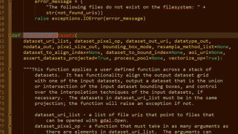

.. _invest_api:

******************************
InVEST Scripting Guide and API
******************************

Summary
=======

   

Introduction
============

While there is a user interface for all the InVEST models, we also provide a python application programming interface (API) for more advanced usage of the models.  Full documentation for the ``natcap.invest`` python package is available here: http://invest.readthedocs.io/en/latest/

Additionally, our core geoprocessing routines have been open sourced as a separate python package, ``pygeoprocessing``.  Documentation for ``pygeoprocessing`` is available here: http://pythonhosted.org/pygeoprocessing/

This documentation will be updated in more detail in the future.  Programming support is also available on our user forums: http://forums.naturalcapitalproject.org/.
