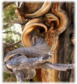
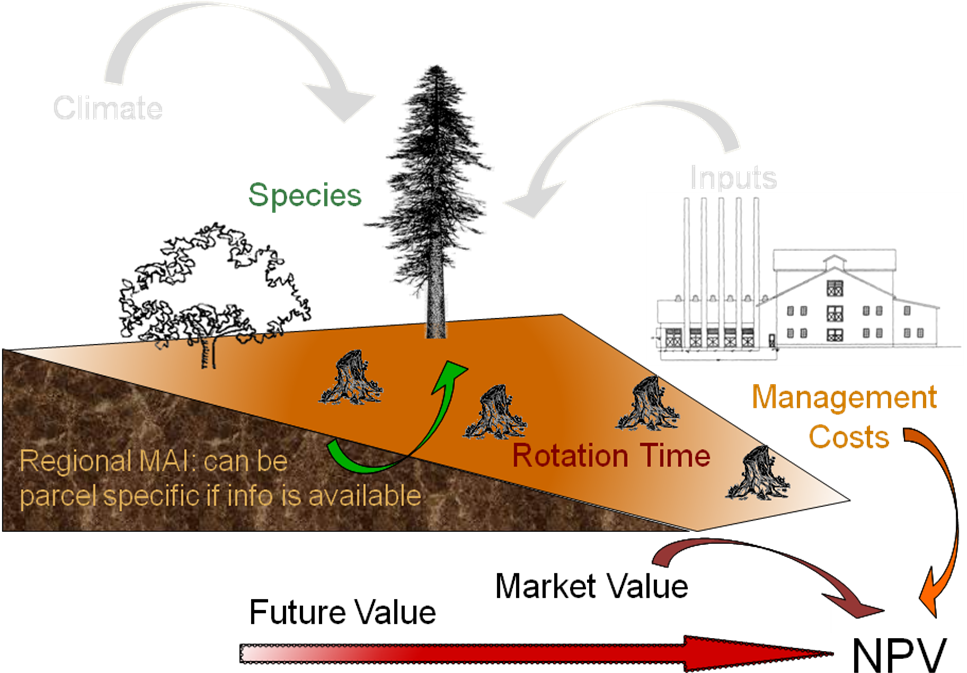
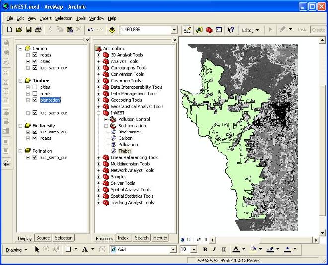
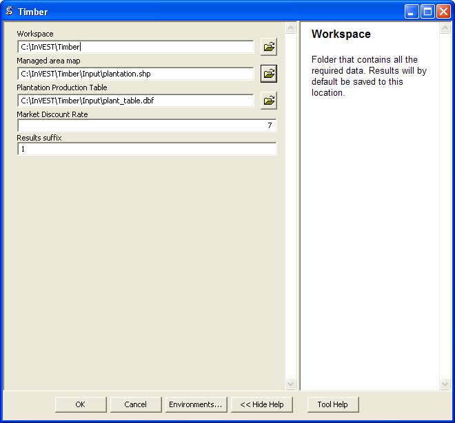

.. _managed_timber_production_model:

.. |addbutt| image:: ./shared_images/adddata.png
             :alt: add
	     :align: middle 
	     :height: 15px

.. |toolbox| image:: ./shared_images/toolbox.jpg
             :alt: toolbox
	     :align: middle 
	     :height: 15px

*******************************
Managed Timber Production Model
*******************************

Summary
=======

An important environmental service provided by forests is the production of timber. This model analyzes the amount and volume of legally harvested timber from natural forests and managed plantations based on harvest level and cycle. The valuption model estimates the economic value of timber based on the market price, harvest and management costs and a discount rate.  and calculates its economic value. Limitations of the model include assumptions that timber harvest production, frequency, prices, and costs are constant over time.

Introduction
============

Commercial timber production is a valuable commodity provided by forests, with the potential to generate significant revenue for those with legal rights to harvest. The scale and nature of timber production varies from large privately-operated single-species plantations to small community-managed harvests from natural forest that retains its ecological structure and function. Whether timber production occurs on a managed plantation or a natural forest, managing the intensity and rate of timber harvest is critical to sustaining this service, as well as the supply and value of other services provided by forests, such as water purification, carbon sequestration, and bush meat habitat. Maximizing profits requires information about the volume and species of wood removed in each harvest period, timber prices, and management costs.

The Model
=========

The model is designed for cases where an entity (e.g., a government, a tribe, a community, a private timber company) has a formally recognized right to harvest *roundwood* from a forest.  According to FAOSTAT (http://faostat.fao.org/), roundwood is wood in its natural state as felled, or otherwise harvested, with or without bark, round, split, roughly squared or in other forms. It comprises all wood obtained from removals. This model's output maps the net present values of forests' legally recognized harvests over some user-defined time interval. This model is very simple and designed for cases where little data on harvest practices and tree stand management exists. If you have access to detailed harvest and forest management data, you may want to use an alternative model.

Timber harvest by entities that do not have a formally recognized harvesting right is not accounted for in this model. This type of wood harvest, whether it is illegal or occurs in forest areas where property rights are either not defined or not well enforced, is dealt with in the Open Access Timber and Non-Timber Products Model (to be released soon).

How it works
------------

This model can be used in one of two ways. First, it can be used to model the expected value of a stream of harvests from a forest plantation over a user-defined time interval. A forest plantation is typically managed in such a way that merchantable or usable wood can be harvested at regular periods over an indefinite period. Three characteristics of a plantation forest are: 1) species mix has been reduced to a single or a few of the fastest growing species; 2) the oldest wood in the plantation is harvested and the rest of the wood is left to mature; 3) the areas of a plantation that have been clear-cut are replanted with the managed species soon after the clear-cut; and 4) a more or less even distribution of tree ages (e.g., if the oldest trees in the stand are 20 years old, a quarter of the stand is 1-5 year old, a quarter of the stand is 6-10 years old, a quarter of the stand is 11-15 years old, and a quarter of the stand is 16-20 years old).

Second, the InVEST Managed Timber Production Model can be used to calculate the expected value of timber harvests from primary, natural forests. By primary, natural forests we mean areas that, at least at the beginning of a harvest cycle, retain much of their natural structure and function. These could include forests that, at least at the beginning of a harvest cycle, are being used by local communities and tribes for small-scale timber and non-timber forest product harvest. In some cases these forests may become subject to large scale timber harvest because they are to transition to more managed forests (i.e., forest plantations as described above) or some other non-forest development that requires a clear-cut, such as agricultural or residential expansion. (This does not include forests that are slashed and burned, given that the felled and burned wood is not used to create a product). In other cases, concessions to clear-cut certain areas of a natural forest or selectively log a natural forest may be held by entities. In these cases an altered version of the natural forest would remain on the landscape into the future. Examples of this type of harvest include logging of rainforests in the Amazon or Malaysia for land conversion or in Indonesia to establish palm plantations, and selective clear-cutting of rainforests in Malaysia.

The model runs on a vector GIS dataset that maps parcels on the landscape that are, or are expected to be, used for legal timber harvest over a user-defined time period. These timber parcels can include a whole forest or just part of a forest. In any case a parcel should only include the portion of a forest that is formally designated, zoned, or managed for harvest. Each timber harvest parcel is described by its harvest levels (*Harv_mass* and *Perc_Harv* in the production table; see Data Needs section below), frequency of harvest (*Freq_harv*), and harvest and management (or maintenance) costs (*Harv_cost* and *Maint_cost*, respectively) (Fig. 1).

 
 *Figure 1. Conceptual diagram of the Managed Timber Production model. Parameters represented in color are included in the model, while those in gray are not.*

The timber parcel map can either be associated with a current (sometimes referred to as "base") L map is given by *yr_cur*) or with some future LULC scenario map (where the year associated with the future LULC map is given by *yr_fut*). If the timber parcel map is associated with the current LULC map the model calculates, for each timber parcel, the net present value (NPV) of harvests that occurred between the current year and some user-defined date, assuming that harvest practices and prices are static over the time interval modeled. If the timber parcel map is associated with a future scenario LULC map the model calculates, for each timber parcel, the NPV of harvests that occurred between the future date and some user-defined date, again assuming that harvest practices and prices do not change over the user-defined time interval. The model produces the NPV of harvests in the currency of either the current year or future year, depending on whether the user inputs a current or future LULC map. For example, if the selected year for the future scenario is 2050 and the dollar is the currency used to value timber harvests, then the NPV of harvests from 2050 to some user-defined later than 2050 is given in year 2050 dollars.

Limitations and simplifications
^^^^^^^^^^^^^^^^^^^^^^^^^^^^^^^

This model assumes that the percent of the forest harvested each harvest period, the mass of timber harvested each harvest period, the frequency of each harvest period, and harvested related prices and costs remain constant in each timber parcel over the user-defined time period. In reality, each of these variables can change from year to year. For example, the mix of species harvested from a forest could change from one harvest period to the next and this could affect everything from the amount of wood harvested to the composite price received for the timber. In addition, un-modeled disturbances, such as forest fires or disease, or occasional managed thinning can have a major impact on harvest levels from a forest parcels.

Some of these limitations can be addressed by constraining the length of the time period used to assess harvests in parcels.  For example, if the current year is 2000 and only the expected harvests until 2010 are valued, any unaccounted changes in timber harvest management or price changes may be minor. At this point a future 2010 LULC and timber parcel map could be evaluated with the timber model looking 10 years ahead again, from 2010 to 2020. The future timber parcel map could include any changes in timber management and prices that occurred between 2000 and 2010. This process could be repeated for successive decades until, for example, 2050.  Successive model runs with decadal time intervals until 2050, and the ability to change harvesting behavior and prices, will better approximate harvesting practices on the landscape than just running the model once from 2000 to 2050.

Further, given the expected variation in harvest management practices and prices over the modeled time interval, it is suggested that the user use mean values for each model input. The mean is typically the best summary of the distribution of expected values for a variable. For example, if it is known that harvests from a timber parcel over time will involve various species it is possible to set the timber price for that parcel equal to the average expected price for all harvested species.

Data needs
==========

The model requires a GIS polygon file (a vector database) demarcating timber parcels. Unique timber parcels can be distinguished by differences in the percent of the parcel harvested each harvest period, the mass of wood removed each harvest period, the species of trees removed, or the costs of managing and harvesting wood from the parcel. These attributes, along with timber prices and the time interval for analysis, can be included as a table in the shapefile or as a separate table.

1.	**Timber parcels (required)**. A GIS dataset (vector) that indicates the different timber parcels on the landscape. Each parcel should be given a unique identifier. The dataset should be projected in meters and the projection used should be defined.

 *Name:* file can be named anything

 *File type:* standard GIS polygon file (e.g., shapefile), with a unique identifier code for each polygon.

 *Rows:* each row is a timber parcel.

 *Columns:* Each parcel should be identified with a unique ID.

 *Sample data set:*  \\Invest\\Timber\\Input\\plantation.shp

2.	**Production table (required)**. A data table of information about the timber parcels on the landscape.

 *Name:* file can be named anything

 *File type:* ``*``.dbf, or an attribute table as part of the timber parcel map.

 *Rows:* each row is a different parcel.

 *Columns:* contain an attribute for each parcel and must be named as follows:

  a.	*Parcel_ID*:  Same as timber parcel ID in #1. IDs must match the parcel IDs used in the polygon map. User must select this field as a model input.

  b.	*Parcl_area*: The area of the timber parcel in hectares.

  c.	*Perc_harv*: The proportion of the timber parcel area that is harvested each harvest period; units are integer percent.

  d.	*Harv_mass*: The mass of wood harvested per hectare (in metric tons (Mg) ha\ :sup:`-1`\ ) in each harvest period.

  e.	*Freq_harv*: The frequency of harvest periods, in years, for each parcel.

  f.	*Price*: The marketplace value of the wood harvested from the parcel (\ :sup:`-1`\ ).  This price should reflect what is paid to the harvesters at mills or at other timber processing and collection sites. If a harvest includes multiple species, each with its own price, a weighted price should be used, where weights are given by the expected relative mix of the species in the harvest. Any value derived from pre-commercial thins should be included in Maint_cost (see below).

  g.	*Maint_cost*: The annualized cost ha\ :sup:`-1`\  of maintaining the timber parcel, if any.  Costs may include the periodic costs to replant, treat and thin the stand, plus the cost to harvest, treat slash, and deliver wood to a processing facility. Other costs may include taxes, pest treatments, etc. If commercial thins before the main harvest produce product that has market value, the annual ha\ :sup:`-1`\  value of these harvests should be subtracted from Maint_cost. If the harvest comes from a natural forest that is not managed for timber production Maint_cost may be 0. (Actual stand maintenance costs may vary from year to year in a forest (e.g., in some years portions of a managed stand may have to be thinned prior to harvest and in other years anti-pest measures may have to be employed), an annualized value "smoothes" this temporal variation in maintenance costs.)

  h.	*Harv_cost*: The cost (ha\ :sup:`-1`\ ) incurred when harvesting Harv_mass.

  i.	*T*: The number of years from yr_cur or *yr_fut* that parcel harvests will be valued. If the parcel is in an even age rotation managed plantation, *T* can be any number, although as we explain below, we recommend against large *T*. If the harvest is expected to be an immediate one time clear cut *T* = 1. If a series of clear cuts in a natural forest are occurring or are expected, *T* can be no greater than the number of years that harvest of the natural stand can continue given Perc_harv and *Freq_harv*. For example, if a natural stand is going to be replanted as a single species plantation or allowed to regenerate naturally before being harvested again in the future, *T* for the harvest of the natural stand can be no larger than 7 if Perc_harv = 33.3 and *Freq_harv* = 3 (assuming a harvest takes place in years 1 (*yr_cur* or *yr_fut* depending on the associated LULC map), 4, and 7).

  j.	*Immed_harv*: This attribute answers whether a harvest occurs immediately -- whether a harvest occurs in *yr_cur*, or whether the user is evaluating a forest parcel associated with a future LULC scenario occurring in *yr_fut*. Answer yes (entered as YES or Y) or no (entered as No or N) to whether a harvest should be calculated for *yr_cur* or *yr_fut*. If yes, then the NPV of harvest in the parcel includes a harvest in *yr_cur*, otherwise the first harvest accounted for in the parcel's NPV occurs *Freq_harv* years into the into time interval T.

  k.	*BCEF*: An expansion factor that translates the mass of harvested wood into volume of harvested wood. The expansion factor is measured in Mg of dry wood per m3 of wood. The expansion factor is a function of stand type and stand age (this factor is know as the biomass expansion factor in the literature). If you do not have data on this expansion factor you can use the :math:`BCEF_R` row in table 4.5 of IPCC (2006). Otherwise, set this expansion factor equal to 1 for each parcel.

 *Sample data set:*  \\Invest\\Timber\\Input\\plant_table.dbf

3.	**Market Discount Rate (optional -- required for valuation)**. This number is not supplied in a table, but instead is input directly through a tool interface (Labeled "Market discount rate (%)" in the tool interface.) The market discount rate reflects society's preference for immediate benefits over future benefits (e.g., would you rather receive $10 today or $10 five years from now?). The tool's default value is 7% per year, which is one of the rates recommended by the U.S. government for evaluation of environmental projects (the other is 3%). However, this rate will differ depending on the country and landscape being evaluated. It can also be set to 0% if so desired.

To calculate NPV for a forest parcel a series of equation are used. First, we calculate the net value of a harvest during a harvest period in timber parcel *x*,

.. math:: VH_x=\frac{Perc\_harv_x}{100}(Price_x\times Harv\_mass_x - Harv\_cost_x)
  :label: eq1

where :math:`VH_x` is the monetary value (ha\ :sup:`-1`\ ) generated during a period of harvest in x, :math:`Perc\_harv_x` is the percentage of x that is harvested in each harvest period (converted to a fraction), Pricex is the market price of a Mg of timber extracted from x, :math:`Harv\_mass_x` is the Mg ha\ :sup:`-1`\  of wood removed from parcel x during a harvest period, and Harv_costx is the cost (ha\ :sup:`-1`\ ) of removing and delivering :math:`Harv\_mass_x` to a processing facility or transaction point. In general, :math:`Harv\_mass_x` will be given by the aboveground biomass (Mg ha\ :sup:`-1`\ ) content of the forest stand less any portion of the stand that is left as waste (e.g., stems, small braches, bark, etc.). For example, assume a company plans to clear-cut 10% of a native forest block in each harvest period, Pricex is expected to be $10 \ :sup:`-1`\ , :math:`Harv\_mass_x` is 800 Mg ha\ :sup:`-1`\ , and Harv_costx = $5,000 ha\ :sup:`-1`\ . The net value created during a harvest period is given by,

.. math:: VH_x = 0.1\times (10\times 800-5000)=300
  :label: eq2

A harvest period is a sustained period of harvest followed by a break in extraction. Plantation forests tend to have a harvest period every year. More natural forests may have more intermittent periods of harvest (e.g., a pulse of harvest activity every 3 years). The periodicity of harvest periods in parcel x is given by the variable :math:`Freq\_harv_x`.

The variable :math:`Freq\_harv_x` is used to convert the per hectare value of the parcel (math:`VH_x`) into a stream of net harvest revenues, which is then aggregated and discounted appropriately. Specifically, the NPV (ha\ :sup:`-1`\ ) of a stream of harvests that engender math:`VH_x` intermittingly from *yr_cur* or *yr_fut* to :math:`T_x` years after *yr_cur* or *yr_fut* is given by:

.. math:: NPV_x=\sum^{ru\left(\frac{T_x}{Freq\_harv_x}\right)-1}_{s=0} \frac{VH_x}{\left(1+\frac{r}{100}\right)^{Freq\_harv_x\times s}}-sum^{T_x-1}_{t=0}\left(\frac{Mait\_cost_x}{\left(1+\frac{r}{100}\right)^t}\right)
  :label: eq3

where "ru" means any fraction produced by :math:`T_x` / :math:`Freq\_harv_x` is rounded up to the next integer, :math:`Freq\_harv_x` is the frequency (in years) of harvest periods, *r* is the market discount rate, and Maint_costx is the annualized cost (ha\ :sup:`-1`\ ) of managing parcel *x*. Continuing our earlier example, where math:`VH_x` = 300, if we set :math:`Freq\_harv_x` = 1 (a harvest period occurs every year), :math:`T_x` equal to 10 (:math:`T_x` can be no larger than 10 because the native forest will be completely gone in 10 years given :math:`Perc\_harv_x` = 10%), r equal to 7%, and Maint_costx equal to $50 ha\ :sup:`-1`\ , then the NPV of the stream of math:`VH_x` is,

.. math:: NPV_x = \sum^9_{s=0}\frac{300}{1.07^s}-\sum^9_{t=0}\frac{50}{1.07^t}
  :label: eq4

On the other hand, assume :math:`Freq\_harv_x` = 3 (a 10% harvest of the timber parcel occurs every 3 years) and all other variables are as before, then,

.. math:: NPV_x = \sum^{ru\left(\frac{10}{3}\right)-1}_{s=0}\frac{300}{1.07^{3\times s}}-\sum^9_{t=0}\frac{50}{1.07^t}
  :label: eq5

In other words, a harvest period occurs in years 1 (*yr_cur* or *yr_fut*), 4, 7, and 10 with annualized management costs incurred every year (where s = 0 refers to year 1, s = 1 refers to year 4, s = 2 refers to year 7 and s = 3 refers to year 10). Note that when using equation (3) we always assume a harvest period in *yr_cur* or *yr_fut*, the next occurs :math:`Freq_x` years later, the next 2 :math:`Freq_x` years later, etc.

Alternatively, if a harvest does not take place in *yr_cur* or *yr_fut*, and instead the first one is accounted for :math:`Freq_x` years into the time interval T, then we use the following equation,

.. math:: NPV_x=\sum^{rd\left(\frac{T_x}{Freq\_harv_x}\right)}_{s=1} \frac{VH_x}{\left(1+\frac{r}{100}\right)^{(Freq\_harv_x\times s)-1}}-\sum^{T_x-1}_{t=0}\left(\frac{Mait\_cost_x}{\left(1+\frac{r}{100}\right)^t}\right)
  :label: eq6

where "rd" means any fraction produced by :math:`T_x` / :math:`Freq\_harv_x` is rounded down to the next integer In this case, if :math:`Freq\_harv_x` = 3 and :math:`T_x` = 10, then x experiences a harvest period in years 3, 6, and 9 of the time interval.

The selection of :math:`T_x` and :math:`Freq_x` require some thought. First, if timber parcel x is expected to only experience one immediate harvest period (either in the base year with equation (3) or :math:`Freq_x`-years into the time interval with equation (6)), then set :math:`T_x` = :math:`Freq_x` = 1. On the other hand, if parcel x is in an even-aged managed rotation, then the value of :math:`T_x` can be set very high (we assume that harvests can be sustained indefinitely in such systems). However, we recommend against using large :math:`T_x` values for any x for several reasons. First, in this model, timber price, harvest cost, and management cost are static over time. This may only be a reasonable assumption for short periods of time (e.g., 20 years). Second, in this model, timber management is static over time; again this may only be a reasonable assumption over short periods of time. Third, if natural forests are being transformed into plantations, a large T would require that we begin accounting for the eventual plantation harvests. This complication would make the model less tractable. Note that :math:`Freq_x`  :math:`T_x` for all x.

Finally, the net present value of timber harvest for the entire area of parcel x from the base year to :math:`T_x` years later is given by TNPVx, where Parcl_areax is the area (ha\ :sup:`-1`\ ) of parcel x:

.. math:: TNPV_x = Parcl\_area_x\times NPV_x
  :label: eq7

The last table entry, :math:`BCEF_x`, is used to transform the total volume of wood removed from a parcel from *yr_cur* or *yr_fut* to T years later (TBiomassx).  If :math:`Immed\_harv_x` = 1 then,

.. math:: Tbiomass_x = Parcl\_area_x\times\frac{Perc\_harv_x}{100}\times Harv\_mass_x\times ru\left(\frac{T_x}{Freq\_harv_x}\right)
  :label: eq8

Otherwise, if :math:`Immed\_harv_x` = 0 then

.. math:: Tbiomass_x = Parcl\_area_x\times\frac{Perc\_harv_x}{100}\times Harv\_mass_x\times rd\left(\frac{T_x}{Freq\_harv_x}\right)
  :label: eq9

and

.. math:: TVolume_x = TBiomass_x \times \frac{1}{BCEF_x}
   :label: eq10
  
*Example:* Landscape with timber production in five parcels. In this example, the first two timber parcels are managed for timber production on a 45-year even-age rotation (1/45 of the stand is harvested and then replanted each year) in perpetuity, but have different mixes of species and different management costs. Each managed timber parcel is 1000 hectares. The third timber parcel has the same species mix as the second, but 1/4 of the parcel is harvested every 20 years and it will only be managed for at least another 50 years. The fourth polygon is a clear-cut of a 500 ha natural forest that is slated to become a shopping mall. The fifth parcel represents a portion of a mature, primary forest. The parcel in the larger forest that will be used for timber production is 500 ha. It will be systematically clear-cut over the next ten years and then managed as a single species plantation indefinitely (we do not account for the plantation's expected revenues in this model).

========= ========== ========= ========= ========= ===== ========== ========= == ========== ====
Parcel_ID Parcl_area Perc_harv Freq_harv Harv_mass Price Maint_cost Harv_cost T  Immed_harv BCEF
========= ========== ========= ========= ========= ===== ========== ========= == ========== ====
1         1000       2.22      1         80        300   190        50        50 Y          1
2         1000       2.22      1         70        200   260        124       50 Y          1
3         1000       25        20        70        200   310        225       50 N          1
4         500        100       1         95        350   180        45        1  Y          1
5         500        20        2         95        400   190        105       10 Y          1
========= ========== ========= ========= ========= ===== ========== ========= == ========== ====

Running the Model
=================

Before running the Timber Model, first make sure that the INVEST toolbox has been added to your ARCMAP document, as described in the **Getting Started** chapter of this manual. Second, make sure that you have prepared the required input data files according to the specifications in Data Needs. Specifically, you will need (1) a shapefile or raster file showing the locations of different timber management zones in the landscape; (2) a table with data on harvest frequency and amount, and the price of timber and cost of harvest; and (3) the discount rate for timber, if other than the 7% US government estimate.

*	Identify workspace

 If you are using your own data, you need to first create a workspace, or folder for the analysis data, on your computer hard-drive. The entire pathname to the workspace should not have any spaces. All your output files will be dumped here. For simplicity, you may wish to call the folder for your workspace "timber" and create a folder in your workspace called "input" and place all your input files here. It's not necessary to place input files in the workspace, but advisable so you can easily see the data you use to run your model.

 Or, if this is your first time using the tool and you wish to use sample data, you can use the data provided in InVEST-Setup.exe. If you unzipped the InVEST files to your C-drive (as described in the **Getting Started** chapter), you should see a folder called /Invest/timber. This folder will be your workspace. The input files are in a folder called /Invest/timber/input and in /Invest/base_data.

*	Open an ARCMAP document to run your model.

*	Find the INVEST toolbox in ARCTOOLBOX. ARCTOOLBOX is normally open in ARCMAP, but if it is not, click on the ARCTOOLBOX symbol. See the **Getting Started** chapter if you don't see the InVEST toolbox and need instructions on how to add it. |toolbox|

*	You can run this analysis without adding data to your map view, but usually it is recommended to view your data first and get to know them. Add the data for this analysis to your map using the ADD DATA button and look at each file to make sure it is formatted correctly. Save your ARCMAP file as needed.  |addbutt|

*	Click once on the plus sign on the left side of the INVEST toolbox to see the list of tools expand. Double-click on TIMBER.

*	An interface will pop up like the one below. The tool indicates default file names, but you can use the file buttons to browse instead to your own data. When you place your cursor in each space, you can read a description of the data requirements in the right side of the interface. In addition, refer to the Data Needs section above for information on data formats.

*	Fill in data file names and values for all required prompts. Unless the space is indicated as optional, it requires you to enter some data.

*	After you've entered all values as required, click on OK. The script will run, and its progress will be indicated by a "Progress dialogue."

*	Upon successful completion of the model, you will see new folders in your workspace called "intermediate" and "output." These folders contain several raster grids. These grids are described in the next section.

*	Load the output grids into ARCMAP using the ADD DATA button. |addbutt|

*	You can change the symbology of a layer by right-clicking on the layer name in the table of contents, selecting PROPERTIES, and then SYMBOLOGY. There are many options here to change the way the file appears in the map.

*	You can also view the attribute data of output files by right clicking on a layer and selecting OPEN ATTRIBUTE TABLE.

Interpreting results
====================

Final Results
-------------

Final results are found in the *Output* folder within the *Workspace* specified for this module.

* **Timber.shp** -- The attribute table has three columns. The first column gives each timber parcel's TNPV. TNPV is the net present economic value of timber production in terms of the user-defined currency. TNPV includes the revenue that will be generated from selling all timber harvested from *yr_cur* or *yr_fut* to T years after *yr_cur* or *yr_fut* less harvest and management costs incurred during this period.  Finally, all monetary values are discounted back to *yr_cur* or *yr_fut*'s present value. Negative values indicate that costs (management and harvest) are greater than income (price times harvest levels). The TBiomass column gives the total biomass (in Mg) of harvested wood removed from each timber parcel from *yr_cur* or *yr_fut* to T years after *yr_cur* or *yr_fut* (TBiomass from equation (8) or equation (9), depending on the value of Immed_harv).  The TVolume column gives the total volume (m3) of harvested wood removed from each timber parcel from *yr_cur* or *yr_fut* to T years after *yr_cur* or *yr_fut* (TVolume from equation (10)).

Timber 3.0 Beta
===============

Currently we are working on the next generation platform of InVEST and deploying parts of it as prototype InVEST models. Managed timber has a 3.0 prototype which can be found in the InVEST 3.0 Beta toolbox inside the InVEST +VERSION+ toolbox. Currently it is only supported in ArcGIS 10.  New features to the 3.0 version include:

+ Paramters from previous runs are automatically loaded into the user interface.
+ Runtime of the model has been improved.

Please send feedback or bug reports to richsharp@stanford.edu.

References
==========

Maass, J., P. Balvanera, A. Castillo, GC Daily, HA Mooney, P. Ehrlich, M. Quesada, A. Miranda,	VJ Jaramillo, F. Garcia-Oliva, A. Martinez-Yrizar, H. Cotler, J. Lopez Blanco, A. Perez	Jimenez, A. Burquez, C. Tinoco, G. Ceballos, L. Barraza, R. Ayala, and J. Sarukhan. 2005.	Ecosystem services of tropical dry forests: insights from long-term ecological and social	research on the Pacific Coast of Mexico. Ecology and Society 10:17.

Nunez, D., L. Nahuelhual, and C. Oyarzun. 2006. Forests and water: The value of native	temperate forests in supplying water for human consumption. Ecological Economics	58:606-616.

Ricketts, TH. 2004. Tropical Forest Fragments Enhance Pollinator Activity in Nearby Coffee	Crops. Conservation Biology 18:1262-1271.

Sohngen, B., and S. Brown. 2006. The influence of conversion of forest types on carbon	sequestration and other ecosystem services in the South Central United States. Ecological	Economics 57:698-708.

