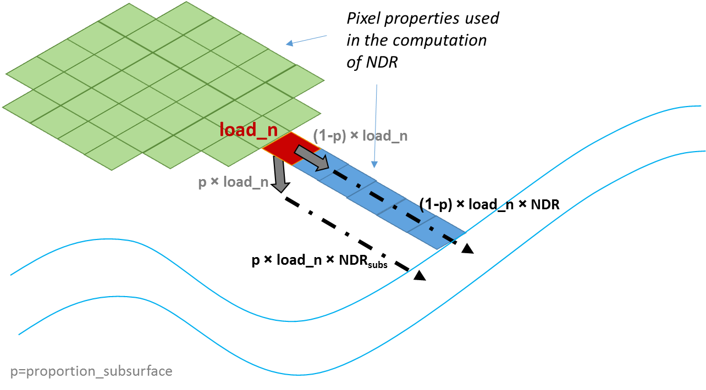
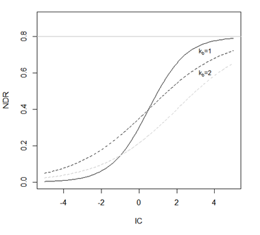
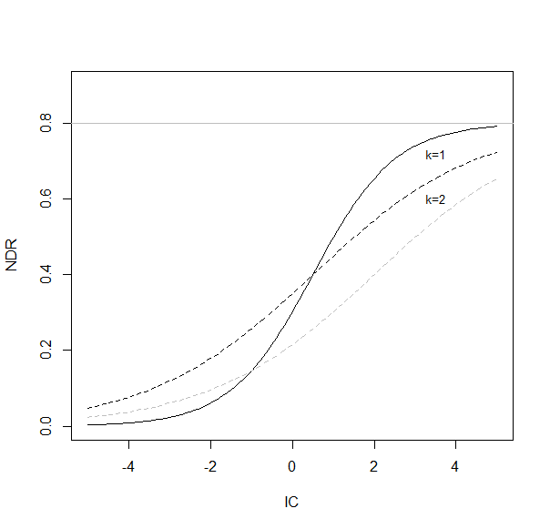

.. primer
.. _ndr:

*************************************************
(under development) Nutrient Delivery Ratio model
*************************************************

Summary
=======

The objective of the InVEST nutrient delivery model is to map nutrient sources from watersheds and their transport to the stream. This spatial information can be used to assess the service of nutrient retention by natural vegetation. The retention service is of particular interest for surface water quality issues and can be valued in economic or social terms (e.g. avoided treatment costs, improved water security through access to clean drinking water).

The main differences between the NDR model and the InVEST v3.1 Nutrient retention model are:
-   The routing of nutrient from a pixel to the stream was modified to reduce the sensitivity to grid resolution and facilitate the selection of LULC-specific retention coefficient;
-   It is now possible to calibrate the model based on one (non-physical) parameter;  note that calibration preserves the spatial distribution of nutrient sinks and sources, increasing confidence in spatially explicit outputs;
-   The flexible model structure allows advanced users to represent more complex processes such as direct nutrient discharges (for example, tile drainage), or instream retention (work in progress)

Introduction
============

Land use change, and in particular the conversion to agricultural lands, dramatically modifies the natural nutrient cycle. Anthropogenic nutrient sources include point sources, e.g. industrial effluent or water treatment plant discharges, and non-point sources, e.g. fertilizer used in agriculture and residential areas. When it rains or snows, water flows over the landscape carrying pollutants from these surfaces into streams, rivers, lakes, and the ocean. This has consequences for people, directly affecting their health or well-being (Keeler et al., 2012), and for aquatic ecosystems that have a limited capacity to adapt to these nutrient loads.

One way to reduce non-point source pollution is to reduce the amount of anthropogenic inputs (i.e. fertilizer management). When this option fails, ecosystems can provide a purification service by retaining or degrading pollutants before they enter the stream. For instance, vegetation can remove pollutants by storing them in tissue or releasing them back to the environment in another form. Soils can also store and trap some soluble pollutants. Wetlands can slow flow long enough for pollutants to be taken up by vegetation. Riparian vegetation is particularly important in this regard, often serving as a last barrier before pollutants enter a stream.

Land-use planners from government agencies to environmental groups need information regarding the contribution of ecosystems to mitigating water pollution. Specifically, they require spatial information on nutrient export and areas with highest filtration. The nutrient delivery and retention model provides this information for non-point source pollutants. The model was designed for nutrients (nitrogen and phosphorous), but its structure can be used for other contaminants (persistent organics, pathogens etc.) if data are available on the loading rates and filtration rates of the pollutant of interest.

.. primerend

The Model
=========

Overview
--------

The model uses a mass balance approach, describing the movement of mass of nutrient through space. Unlike more sophisticated nutrient models, the model does not represent the details of the nutrient cycle but rather represents the long-term, steady-state flow of nutrients through empirical relationships. Sources of nutrient across the landscape, also called nutrient loads, are determined based on the LULC map and associated loading rates. Nutrient loads can then be divided into sediment-bound and dissolved parts, which will be transported through surface and subsurface flow, respectively. Note that this step is optional; the user can choose to model surface flow only. In a second step, delivery factors are computed for each pixel based on the properties of pixels belonging to the same flow path (in particular their slope and retention efficiency of the land use). At the watershed/subwatershed outlet, the nutrient export is computed as the sum of the pixel-level contributions.

.. figure:: ./ndr_images/figure1.png

 Conceptual representation of the NDR model. Each pixel i is characterized by its nutrient load, loadi, and its nutrient delivery ratio (NDR), which is a function of the upslope area, and downslope flow path (in particular the retention efficiencies of LULC types on the downslope flow path). Pixel-level export is computed based on these two factors, and the sediment export at the watershed level is the sum of pixel-level nutrient exports.

Nutrient Loads
--------------

Loads are the sources of nutrients associated to each pixel of the landscape. Consistent with the export coefficient literature (California Regional Water Quality Control Board Central Coast Region, 2013; Reckhow et al., 1980), load values for each LULC are derived from empirical measures of nutrient export (e.g. nutrient export running off urban areas, crops, etc.). If information is available on the amount of nutrient applied (e.g. fertilizer, livestock waste, atmospheric deposition), it is possible to use it by estimating the on-pixel nutrient use (and apply this correction factor to obtain the load parameters). 

Next, each pixel’s load is modified to account for the local runoff potential. The LULC-based loads defined above are averages for the region, but each pixel’s contribution will depend on the amount of runoff transporting nutrients (Endreny and Wood, 2003; Heathwaite et al., 2005). As a simple approximation, the loads can be modified as follows:

.. math:: modified.load_(x,i)=load_(x,i)×RPI_i
	:label: (Eq.)
	
where :math:`RPI_i` is the runoff potential index on pixel i. It is defined as:
:math:`RPI_i = RP_i/RP_av`  , where :math:`RP_i` is the runoff proxy for runoff on pixel i, and :math:`RP_av` is the average :math:`RP` over the raster. This approach is similar to that developed by Endreny and Wood (2003). In practice, the raster RP is defined either as a quickflow index (e.g. from the InVEST seasonal water yield model) or as precipitation. 

For each pixel, modified loads can be divided into sediment-bound and dissolved nutrient portions. Conceptually, the former represents nutrients that are transported by surface or shallow subsurface runoff, while the latter represent nutrients transported by groundwater. The ratio between these two types of nutrient sources is given by the parameter proportion_subsurface_x (where x=n or x=p, for nitrogen or phosphorus, respectively), which quantifies the ratio of dissolved nutrients over the total amount of nutrients. For a pixel i:

.. math:: load_{surf,i} = (1-proportion\_subsurface_i) \cdot modified.load\_x_i
	:label: (Eq.)
.. math:: load_{subsurf,i} = proportion\_subsurface_i \cdot modified.load\_x_i
	:label: (Eq.)
	
In case no information is available on the partitioning between the two types, the recommended default value of *load\_subsurface\_x* is 0, meaning that all nutrients are reaching the stream via surface flow. (Note that surface flow can, conceptually, include or shallow subsurface flow). However, users should explore the model’s sensitivity to this value to characterize the uncertainty introduced by this assumption.

 Conceptual representation of nutrient delivery in the model. If the user chooses to represent subsurface flow, the load on each pixel, load_n, is divided into two parts, and the total nutrient export is the sum of the surface and subsurface contributions. 

Nutrient Delivery
------------------

Nutrient delivery is based on the concept of nutrient delivery ratio (NDR), an approach inspired by the peer-reviewed concept of sediment delivery ratio (see InVEST sediment model user's guide and Vigiak et al., 2012). The concept is similar to the risk-based index approaches that are popular for nutrient modeling (Drewry et al., 2011), although it provides quantitative values of sediment export (e.g. the proportion of the nutrient load that will reach the stream). Two delivery ratios are computed, one for nutrient transported by surface flow, the other for subsurface flow.

Surface NDR
^^^^^^^^^^^

The surface NDR is the product of a delivery factor, representing the ability of downstream pixels to transport nutrient without retention, and a topographic index, representing the position on the landscape. For a pixel i:

.. math:: NDR_i = NDR_{0,i}\left(1 + \exp\left(\frac{IC_i-IC_0}{k}\right)\right)^{-1}
	:label: (Eq.)
	
where :math:`IC_0` and :math:`k` are calibration parameters, IC_i is a topographic index, and :math:`NDR_{0,i}` is the proportion of nutrient that is not retained by downstream pixels (irrespective of the position of the pixel on the landscape). Below we provide details on the computation of each factor.

:math:`NDR_{0,i}` is based on the maximum retention efficiency of the land between a pixel and the stream (downslope path, in Figure 1):

.. math:: NDR_{0,i} = 1 - eff'_i
	:label: (Eq.)
	
Moving along a flow path, the algorithm computes the additional retention provided by each pixel, taking into account the total distance traveled across each LULC type. Each additional pixel from the same LULC type will contribute a smaller value to the total retention, until the maximum retention efficiency for the given LULC is reached (Figure 2). The total retention is capped by the maximum retention value that LULC types along the flow path can provide, :math:`eff_{LULC_i}`.

In mathematical terms:

.. math:: eff'_i =
    \begin{cases}
        eff_{LULC_i}\cdot(1-s_i) & \mathrm{if\ } down_i \mathrm{\ is\ a\ stream\ pixel}\\
        eff'_{down_i}\cdot s_i + eff_{LULC_i}\cdot (1 - s_i) & \mathrm{if\ } eff_{LULC_i} > eff'_{down_i}\\
        eff'_{down_i} & otherwise
    \end{cases} 

.. math::
	:label: (Eq.)

Where:

 * :math:`eff'_{down_i}` is the effective downstream retention on the pixel directly downstream from :math:`i`,
 * :math:`eff_{LULC_i}` is the maximum retention efficiency that LULC type :math:`i` can reach, and
 * :math:`s_i` is the step factor defined as:
.. math:: s_i=\exp\left(\frac{-5 \ell_{i_{down}}}{\ell_{LULC_i}}\right)	
	:label: (Eq.)

With:

 * :math:`\ell_{i_{down}}` is the length of the flow path from pixel :math:`i` to its downstream neighbor
 * :math:`\ell_{LULC_i}` is the LULC retention length of the landcover type on pixel :math:`i`

Notes:

Since :math:`eff'_i` is dependent on the pixels downstream, calculation proceeds recursively starting at pixels that flow directly into streams before upstream pixels can be calculated.

In equation [6], the factor 5 is based on the assumption that maximum efficiency is reached when 99% of its value is reached (assumption due to the exponential form of the efficiency function, which implies that the maximum value cannot be reached with a finite flow path length).

 Illustration of the calculation of the retention efficiency along a simple flow path composed of 4 pixels of grass and 3 pixels of forest. Each additional pixel of the grass LULC contributes to a smaller percentage toward the maximum efficiency provided by grass. The shape of the exponential curves is determined by the maximum efficiency and the retention length.

IC, the index of connectivity, represents the hydrological connectivity, i.e. how likely nutrient on a pixel is likely to reach the stream. In this model, IC is a function of topography only (Figure 3):

.. math:: IC=\log_{10}\left(\frac{D_{up}}{D_{dn}}\right)
	:label: (Eq. 6)
where

 * :math:`D_{up} = \overline{S}\sqrt{A}` and,
 * :math:`D_{dn} = \sum_i \frac{d_i}{S_i}`
	
where :math:`D_{up} = \overline{S} is the average slope gradient of the upslope contributing area (m/m), A is the upslope contributing area (m2); di is the length of the flow path along the ith cell according to the steepest downslope direction (m) (see details in sediment model), and Si is the slope gradient of the ith cell, respectively. 

Note: The upslope contributing area and downslope flow path are delineated with the D-infinity flow algorithm (Tarboton, 1997). To avoid infinite values for IC, slope values S are forced to a minimum of 0.005 m/m if they occur to be less than this threshold, based on the DEM (Cavalli et al., 2013).

 
The value of :math:`IC_0` is set to :math:`IC_0 = \frac{IC_{max}+IC_{min}}{2}`.
This imposes that the sigmoid function relating NDR to IC is centered on the median of the IC distribution, hence that the maximum IC value gives :math:`NDR=NDR_{max}`. :math:`k` is set to a default value of 2 (cf. SDR model theory); it is an empirical factor that represents local topography.

 Relationship between NDR and the connectivity index IC. The maximum value of NDR is set to :math:`NDR_{0}=0.8`. The effect of the calibration is illustrated by setting :math:`k=1` and :math:`k=2` (solid and dashed line, respectively), and :math:`IC_0=0.5` and :math:`IC_0=2` (black and gray dashed lines, respectively).

Subsurface NDR
^^^^^^^^^^^^^^

The expression for the subsurface NDR is a simple exponential decay with distance to stream, plateauing at the value corresponding to the user-defined maximum subsurface nutrient retention:

.. math:: NDR_{subs,i} = 1 - eff_{subs}\left(1-e^\frac{-5\cdot\ell}{\ell_{subs}}\right)
	:label: (Eq. 7)
	
where

 * :math:`eff_{subs}` is the maximum nutrient retention efficiency that can be reached through subsurface flow (i.e. retention due to biochemical degradation in soils),

 * :math:`\ell_{subs}` is the subsurface flow retention length, i.e. the distance after which it can be assumed that soil retains nutrient at its maximum capacity,

 * :math:`\ell_i` is the distance from the pixel to the stream.

Nutrient export
------------------

Nutrient export from each pixel i is calculated as the product of the load and the NDR:

.. math:: x_{exp_i} = load_{surf,i} \cdot NDR_{surf,i} + load_{subs,i} \cdot NDR_{subs,i}
	:label: (Eq.)
	
Total nutrient at the outlet of each user-defined watershed is the sum of the contributions from all pixels within that watershed:

.. math:: x_{exp_{tot}} = \sum_i x_{exp_i}
	:label: (Eq.)

	
Limitations
-----------

The model has a small number of parameters and outputs generally show a high sensitivity to inputs. This implies that errors in the empirical load parameter values will have a large effect on predictions. Similarly, the retention efficiency values are based on empirical studies, and factors affecting these values (like slope or intra-annual variability) are averaged. These values implicitly incorporate information about the dominant nutrient dynamics, influenced by climate and soils. Finally, the effect of grid resolution on the NDR formulation has not been well studied.

Sensitivity analyses are recommended to investigate how the confidence intervals in input parameters affect the study conclusions (Hamel et al., 2015).

Also see the "Biophysical model interpretation" section for further details on model uncertainties.

Options for Valuation
---------------------

Nutrient export predictions can be used for quantitative valuation of the nutrient retention service. For example, scenario comparison can serve to evaluate the change in purification service between landscapes. The total nutrient load can be used as a reference point, assuming that the landscape has 0 retention. Comparing the current scenario export to the total nutrient load provides a quantitative measure of the retention service of the current landscape.

Data Needs
----------

This section outlines the data used by the model. Refer to the appendix for detailed information on data sources and pre-processing. For all raster inputs, the projection should be defined and the projection's linear units should be in meters.

1.  **Digital elevation model** (DEM) (required). A GIS raster dataset, with an elevation value for each cell. Make sure the DEM is corrected by filling in sinks. To ensure proper flow routing, the DEM should extend beyond the watersheds of interest, rather than being clipped to the watershed boundaries. See the Working with the DEM section of this manual for more information.

2.  **Land use/land cover** (required). A GIS raster dataset, with an integer LULC code for each pixel. The LULC code should be an integer.

3.  **Watersheds** (required). A shapefile of polygons. This is a layer of watersheds such that each watershed contributes to a point of interest where water quality will be analyzed. See the Working with the DEM section for information on creating watersheds.

4.  **Biophysical Table** (required). A .csv table of land use/land cover (LULC) classes, containing data on water quality coefficients used in this tool. These data are attributes of each LULC class rather than attributes of individual cells in the raster map. Each row in the table is an LULC class while each column contains a different attribute of each land use/land cover class. The columns must be named as:

  * *lucode* (Land use code): Unique integer for each LULC class (e.g., 1 for forest, 3 for grassland, etc.), must match the LULC raster above.
  * *LULC_desc*: Descriptive name of land use/land cover class (optional)
  * *load_n* (and/or load_p): The nutrient loading for each land use, given as decimal values with units of kg. ha-1 yr -1. Suffix _n stands for nitrogen, and _p for phosphorus, and the two compounds can be modeled at the same time or separately.
  Note 1: Loads are the sources of nutrients associated with each LULC. If the user wants to represent different level of fertilizer application, he/she needs to create different LULC.
  
  Note 2: Load values may be expressed either as the amount of nutrient applied (e.g. fertilizer, livestock waste, atmospheric deposition); or as “extensive” measures of contaminants, which are empirical values representing the contribution of a parcel to the nutrient budget (e.g. nutrient export running off urban areas, crops, etc.) In the latter case, the load should be corrected for the nutrient retention from downstream pixels of the same LULC. For example, if the measured (or empirically derived) export value for forest is 3 kg.ha-1.yr-1 and the retention efficiency is 0.8, users should enter 15(kg.ha-1.yr-1) in the n_load column of the biophysical table; the model will calculate the nutrient running off the forest pixel (n_export) as 15*0.8 = 3 kg.ha-1.yr-1.
  
  * *eff_n* (and/or eff_p): The maximum retention efficiency for each LULC class, varying between zero and 1. The nutrient retention capacity for a given vegetation is expressed as a proportion of the amount of nutrient from upstream. For example, high values (0.6 to 0.8) may be assigned to all natural vegetation types (such as forests, natural pastures, wetlands, or prairie), indicating that 60-80% of nutrient is retained. Like above, suffix _n stands for nitrogen, and _p for phosphorus, and the two compounds can be modeled at the same time or separately.
  * *ret_len_n* (and/or ret_len_p) (in meter): the distance after which it is assumed that a patch of LULC retains nutrient at its maximum capacity. If nutrients travel a distance smaller than the retention length, the retention efficiency will be less than the maximum value eff_x, following an exponential decay (see Nutrient transport section)
  * *proportion_subsurface_n* (optional): the proportion of dissolved nutrients over the total amount of nutrients, expressed as ratio between 0 and 1. By default, this value should be set to 0, indicating that all nutrients are delivered via surface flow.

  Example:

  .. csv-table::
    :file: ndr_images/ndr_biophysical_table_example.csv
    :header-rows: 1
    :name: NDR Biophysical Table Example

5. **Subsurface_retention_efficiency (Nitrogen or phosphorus)**: the maximum nutrient retention efficiency that can be reached through subsurface flow, a value between 0 and 1. This field characterizes the retention due to biochemical degradation in soils.

6. **Subsurface_ret_len (Nitrogen or phosphorus)** (in meter): the distance (traveled subsurface and downslope) after which it is assumed that soil retains nutrient at its maximum capacity. If dissolved nutrients travel a distance smaller than subsubsurface_ret_len, the retention efficiency is lower than the maximum value defined above. Setting this value to a distance smaller than the pixel size will result in the maximum retention efficiency being reached within one pixel only.

7. **Threshold flow accumulation value**: Integer value defining the number of upstream pixels that must flow into a pixel before it's considered part of a stream. This is used to generate a stream layer from the DEM (see RouteDEM documentation of the InVEST manual). This threshold expresses where hydrologic routing is discontinued, i.e. where retention stops and the remaining pollutant will be exported to the stream. The default is 1 over the pixel area (in km2), i.e. ~1000 for 30m resolution. If the user has a map of stream lines in the watershed of interest, he/she should “calibrate” the threshold value by comparing the map with the *stream.tif* map output by the model. 

8.  **Borselli k parameter**: calibration parameter that determine the shape of the relationship between hydrologic connectivity (the degree of connection from patches of land to the stream) and the sediment delivery ratio (percentage of soil loss that actually reaches the stream; cf. Figure 2). The default value is 2.

Running the Model
=================

To launch the nutrient model navigate to the Windows Start Menu -> All Programs -> InVEST +VERSION+ -> Nutrient delivery and retention. The interface does not require a GIS desktop, although the results will need to be explored with any GIS tool including ArcGIS, QGIS, and others.

.. primer

Interpreting results
--------------------

Model outputs
^^^^^^^^^^^^^

The following is a short description of each of the outputs from the standalone Nutrient Delivery and retention model. These results are found within the model's workspace specified in the user interface.

 * **Parameter log**: Each time the model is run, a text (.txt) file will appear in the *Output* folder. The file will list the parameter values for that run and will be named according to the service, the date and time, and the suffix.

 * **Output folder**:

   * **output\x_export_suffix.shp**: This is a shapefile which aggregates the nutrient model results per watershed, with x being n for nitrogen, and p for phosphorus. The .dbf table contains the following information for each watershed:

      * *x_load_tot*: :math:`\mathrm{kg.yr^{-1}}`: total nutrient loads (sources) in the watershed, i.e. the sum of the nutrient contribution from all LULC without filtering from the landscape.
      * *x_exp_tot*: :math:`\mathrm{kg.yr^{-1}}`: total nutrient export from the watershed

   * **output\x_export.tif** : (kg/pixel) A pixel level map showing how much load from each pixel eventually reaches the stream.

 * **Intermediate folder**:

    * *ret_len_x*: map of retention length values, ret_len, found in the biophysical table
    * d_dn: downslope factor of the index of connectivity (Eq. 5)
    * *d_up*: distance from a pixel to the stream (following the D-infinity algorithm, see RouteDEM documentation for details)
    * *d_up*: map of the retention efficiencies, eff_x, found in the biophysical table
    * *effective_retention_x*: map of the effective retention provided by the downslope flow path for each pixel (Eq. 3)
    * *ic_factor*: map of the index of connectivity (Eq. 5)
    * *load_n*: map of loads (for surface transport) per pixel (kg,yr-1)
    * *ndr_x*: map of NDR values
    * *s_accumulation.s_bar*: slope parameters for IC equation found in the Nutrient transport section
    * *stream*: stream network computed by the RouteDEM algorithm (with 0s representing land pixels, and 1s representing stream pixels)
    * *sub_crit_len_x*: map of the critical distance value for subsurface transport, subsurface_crit_len_x (constant over the landscape)
    * *sub_eff_x*: map of the subsurface retention efficiency, subsurface_retention_eff (constant over the landscape)
	* *sub_effective_retention_x: map of the subsurface effective retention (Eq. 7)
    * *sub_load_x*: map of nutrient loads for subsurface transport, per pixel (kg,yr-1)
    * *sub_ndr_x*: map of subsurface NDR values

 * Prepared_data folder: Contains low-level hydrological routing outputs from the RouteDEM module including flow direction, flow accumulation, and slope.

Biophysical Model Interpretation for Valuation
----------------------------------------------

Some valuation approaches, e.g. those relying on the changes in water quality for a treatment plant, are very sensitive to the model absolute predictions. Therefore, it is important to consider the uncertainties associated with the use of InVEST as a predictive tool and minimize their effect on the valuation step.

Model parameter uncertainties
^^^^^^^^^^^^^^^^^^^^^^^^^^^^^

Uncertainties in input parameters can be characterized during the literature review (e.g. examining the distribution of values from different studies). One option to assess the impact of parameter uncertainties is to conduct local or global sensitivity analyses, with the ranges obtained from the literature (Hamel et al., 2015).

Model structural uncertainties
^^^^^^^^^^^^^^^^^^^^^^^^^^^^^^

The InVEST model computes a nutrient mass balance over a watershed, subtracting nutrient losses (conceptually represented by the retention coefficients), from the total nutrient sources. Where relevant, it is possible to distinguish between surface and subsurface flow paths, adding three parameters to the model. In the absence of empirical knowledge, modelers can assume that the surface load and retention parameters represent both transport process. Testing and calibration of the model is encouraged, acknowledging the main two challenges:

 * knowledge gaps in nutrient transport: although there is strong evidence of the impact of land use change on nutrient export, modeling of the watershed scale dynamics remains challenging (Breuer et al., 2008; Scanlon et al., 2007). Calibration is therefore difficult and not recommended without in-depth analyses that would provide confidence in model process representation (Hamel et al., 2015)

 * Potential contribution from point source pollution: domestic and industrial waste are often part of the nutrient budget and should be accounted for during calibration (for example, by adding point-source nutrient loads to modeled nutrient export, then comparing the sum to observed data).

Comparison to observed data
^^^^^^^^^^^^^^^^^^^^^^^^^^^

Despite the above uncertainties, the InVEST model provides a first-order assessment of the processes of nutrient retention and may be compared with observations. Time series of nutrient concentration used for model validation should span over a reasonably long period to attenuate the effect of interannual variability. Time series should also be relatively complete throughout a year (without significant seasonal data gaps) to ensure comparison with total annual loads. If the observed data is expressed as a time series of nutrient concentration, they need to be converted to annual loads (LOADEST and FLUX32 are two software facilitating this conversion). Additional details on methods and model performance for relative predictions can be found in the study of Hamel et al. (in prep).

.. primerend

Appendix: Data sources
======================

This is a non-exhaustive list of data sources and suggestions about finding, compiling, and formatting data. It is updated as new data sources and methods become available.

In general, the FAO Geonetwork can be a valuable data source for different GIS layers for users outside the United States: http://www.fao.org/geonetwork/srv/en/main.home.

1.  **Digital elevation model** (DEM)
  DEM data is available for any area of the world, although at varying resolutions. A list of free global DEMs are available at http://vterrain.org/Elevation/global.html.

  Free raw global DEM data is available from:
   - the World Wildlife Fund - http://worldwildlife.org/pages/hydrosheds
   - NASA: http://asterweb.jpl.nasa.gov/gdem-wist.asp (30m resolution)
   - USGS: http://eros.usgs.gov/elevation-products and http://hydrosheds.cr.usgs.gov/.

  Alternatively, it may be purchased relatively inexpensively at sites such as MapMart (www.mapmart.com).

  The DEM resolution may be a very important parameter depending on the project's goals. For example, if decision makers need information about impacts of roads on ecosystem services then fine resolution is needed. The hydrological aspects of the DEM used in the model must be correct. Because the model requires that all pixels have a flow direction (according to the D-infinity flow algorithm (Tarboton, 1997)), the DEM may need to be filled to remove sinks. Multiple passes of the ArcGis Fill tool, or Qgis Wang&Liu Fill algorithm (SAGA library) have shown good results.

2.   Land use and land cover
 A key component for all water models is a spatially continuous landuse / land cover raster grid. That is, within a watershed, all landuse / land cover categories should be defined. Gaps in data will create errors. Unknown data gaps should be approximated. Global land use data is available from:

  - the University of Maryland’s Global Land Cover Facility: http://glcf.umd.edu/data/landcover/ (data available in 1 degree, 8km and 1km resolutions).
  - NASA: https://lpdaac.usgs.gov/products/modis_products_table/mcd12q1 (MODIS multi-year global landcover data provided in several classifications)
  - the European Space Agency: http://due.esrin.esa.int/globcover/ (landcover maps for 2005 and 2009)

  Data for the U.S. for 1992, 2001 and 2011 is available as the National Land Cover Data product, produced by the Multi-Resolution Land Characteristics (MRLC) Consortium (a partnership of federal agencies): http://www.mrlc.gov

  The simplest categorization of LULCs on the landscape involves delineation by land cover only (e.g., cropland, temperate conifer forest, prairie). Several global and regional land cover classifications are available (e.g., Anderson et al. 1976), and often detailed land cover classification has been done for the landscape of interest.

  A slightly more sophisticated LULC classification involves breaking relevant LULC types into more model-relevant types. For example, agricultural land classes could be broken up into different crop types or forest could be broken up into specific species. The categorization of land use types depends on the model and how much data is available for each of the land types. Users should only break up a land use type if it will provide more accuracy in modeling. For instance, for the sediment model the user should only break up "crops" into different crop types if they have information on the difference in soil characteristics between crop management values.

  The categorization of land use types depends on the model and how much data is available for each of the land types. The user should only break up a land use type if it will provide more accuracy in modeling. For instance, for the Nutrient delivery and Retention model the user should only break up ‘crops’ into different crop types if they have information on the difference in nutrient loading between crops. Along the same lines, the user should only break the forest land type into specific species for the water supply model if information is available on the root depth and evapotranspiration coefficients for the different species.

3.  Watersheds / subwatersheds

  Watersheds outlets should correspond to reservoirs or other points of interest. This ensures that the sediment loads predicted by the model can be compared to observed data at these points. If known watershed maps exist, they should be used. Otherwise, watersheds and subwatersheds can be generated in ArcMap or QGIS based on the digital elevation model (see section on DEM for use of Fill tools to correct flow paths).

  Exact locations of specific structures, such as reservoirs, should be obtained from the managing entity or may be obtained on the web at sites such as the National Inventory of Dams (http://geo.usace.army.mil/pgis/f?p=397:1:0). Global collections of dam locations and information include the Global Reservoir and Dam (GRanD) Database (http://www.gwsp.org/products/grand-database.html) and the World Water Development Report II dam database (http://wwdrii.sr.unh.edu/download.html.)

4.  Nutrient load parameter

  For all water quality parameter (nutrient load, retention efficiency, and retention length), local literature should be consulted to derive site-specific values. The NatCap database provides a non-exhaustive list of local references for nutrient loads and retention efficiencies. Parn et al. (2012) and Harmel et al. (2007) provide a good review for agricultural land in temperate climate.

  Examples of export coefficients (“extensive” measures, see Data needs) for the US can be found in the EPA PLOAD User’s Manual and in a review by Lin (2004)[http://el.erdc.usace.army.mil/elpubs/pdf/tnwrap04-3.pdf]. Note that the examples in the EPA guide are in lbs/ac/yr and would need to be converted to kg/ha/yr.

5.  Retention efficiency

  This value represents, conceptually, the maximum nutrient retention that can be expected from a given LULC. Natural vegetation LULC types (such as forests, natural pastures, wetlands, or prairie) are assigned high values (>0.8). A review of the local literature and consultation with hydrologists is recommended to select the most relevant values for this parameter. Parn et al. provide a useful review for temperate climates. Reviews of riparian buffers efficiency, although a particular case of LULC retention, can also be used as a starting point (Mayer et al., 2007; Zhang et al., 2009).

6.  Retention length

  This value represents the typical distance necessary to reach the maximum retention efficiency. It was introduced in the model to remove any sensitivity to the resolution of the LULC raster. The literature on riparian buffer removal efficiency suggests that retention lengths range from 10 to 300 m (Mayer et al., 2007; Zhang et al., 2009). In the absence of local data for land uses that are not forest or grass, one can simply set the retention length constant, equal to the pixel size: this will result in the maximum retention efficiency being reached within a distance of one pixel only.

7.  Subsurface parameters: proportion_subsurface_n, eff_sub, crit_len_sub

  These values are used for advanced analyses and should be selected in consultation with hydrologists. Parn et al. (2012) provide average values for the partitioning of N loads between leaching and surface runoff. From Mayer et al. (2007), a global average of 200m for the retention length, and 80% for retention efficiency can be assumed for vegetated buffers.

References
==========

Breuer, L., Vaché, K.B., Julich, S., Frede, H.-G., 2008. Current concepts in nitrogen dynamics for mesoscale catchments. Hydrol. Sci. J. 53, 1059–1074.

California Regional Water Quality Control Board Central Coast Region, 2013. Total Maximum Daily Loads for Nitrogen Compounds and Orthophosphate for the Lower Salinas River and Reclamation Canal Basin , and the Moro Cojo Slough Subwatershed , Monterey County, CA. Appendix F. Available at: http://www.waterboards.ca.gov/centralcoast/water_issues/programs/tmdl/docs/salinas/nutrients/index.shtml

Endreny, T.A., Wood, E.F., 2003. Watershed weighting of export coefficients to map critical phosphorous loading areas. J. Am. Water Resour. Assoc. 08544, 165–181.

Hamel, P., Chaplin-Kramer, R., Sim, S., Mueller, C., 2015. A new approach to modeling the sediment retention service (InVEST 3.0): Case study of the Cape Fear catchment, North Carolina, USA. Sci. Total Environ. 166–177.

Harmel, D., Potter, S., Casebolt, P., Reckhow, K., 2007. Compilation of measured nutrient load data for agricultural land uses in the United States 76502, 1163–1178.

Heathwaite, A.L., Quinn, P.F., Hewett, C.J.M., 2005. Modelling and managing critical source areas of diffuse pollution from agricultural land using flow connectivity simulation. J. Hydrol. 304, 446–461.

Keeler, B.L., Polasky, S., Brauman, K.A., Johnson, K.A., Finlay, J.C., Neill, A.O., 2012. Linking water quality and well-being for improved assessment and valuation of ecosystem services 109, 18629–18624.

Lin, J.., 2004. Review of published export coefficient and event mean concentration (EMC) data, WRAP Technical Notes Collection (ERDC TN-WRAP-04-3). Vicksburg, MS.

Mayer, P.M., Reynolds, S.K., Mccutchen, M.D., Canfield, T.J., 2007. Meta-Analysis of Nitrogen Removal in Riparian Buffers 1172–1180.

Pärn, J., Pinay, G., Mander, Ü., 2012. Indicators of nutrients transport from agricultural catchments under temperate climate: A review. Ecol. Indic. 22, 4–15.

Reckhow, K.H., Beaulac, M.N., Simpson, J.T., 1980. Modeling Phosphorus loading and lake response under uncertainty: A manual and compilation of export coefficients. EPA 440/5-80-011. US-EPA, Washington, DC.

Scanlon, B.R., Jolly, I., Sophocleous, M., Zhang, L., 2007. Global impacts of conversions from natural to agricultural ecosystems on water resources: Quantity versus quality. Water Resour. Res. 43.

Tarboton, D., 1997. A new method for the determination of flow directions and upslope areas in grid digital elevation models. Water Resour. Res. 33, 309–319.

Vigiak, O., Borselli, L., Newham, L.T.H., Mcinnes, J., Roberts, A.M., 2012. Comparison of conceptual landscape metrics to define hillslope-scale sediment delivery ratio. Geomorphology 138, 74–88.

Zhang, X., Liu, X., Zhang, M., Dahlgren, R. a, Eitzel, M., 2009. A review of vegetated buffers and a meta-analysis of their mitigation efficacy in reducing nonpoint source pollution. J. Environ. Qual. 39, 76–84.
