.. _overlap_analysis:

.. |addbutt| image:: ./shared_images/adddata.png
             :alt: add
	     :align: middle 
	     :height: 15px

.. |toolbox| image:: ./shared_images/toolbox.jpg
             :alt: toolbox
	     :align: middle 
	     :height: 15px

.. |folder| image:: ./shared_images/openfolder.png
             :alt: folder
	     :align: middle 
	     :height: 15px

.. |ok| image:: ./shared_images/okbutt.png
             :alt: ok
	     :align: middle 
	     :height: 15px

.. |adddata| image:: ./shared_images/adddata.png
             :alt: adddata
	     :align: middle 
	     :height: 15px

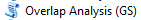

*********************************************************
Overlap Analysis Model: Fisheries and Recreation (Tier 0)
*********************************************************

Summary
=======

Mapping current uses and summarizing the relative importance of various regions for particular activities is an important first step in marine spatial planning.  The InVEST Overlap Analysis Model was designed to produce maps that can be used to identify marine and coastal areas that are most important for human use.  Initial development of this model was as two separate "Tier 0" models for recreation and fisheries.  However, since the underlying approach was fundamentally similar, we combined them into one model that can be used to map not only recreation and fisheries, but also other activities.  Inputs include information about where human use activities occur (required), weights that reflect the relative importance of different human uses (optional) and information on spatial variability within uses (optional).  Because it simply maps current uses and does not model behavior, this model is not well-suited to the evaluation of how human uses may change in response to changes in the coastal and marine environment. However, it can be used to model scenarios that reflect changes in the areas used by different activities or changes in attributes such as total landings or number of trips that are used to weight activities.  This is a "Tier 0" model.

Introduction
============

Understanding where and how humans use coastal and marine environments is an essential component of marine resource planning and management. Marine and coastal ecosystems are essential places for a variety of activities including fishing (commercial, recreational, subsistence and ceremonial) and recreation (e.g. boating, kayaking, diving, whale-watching).  When siting new activities and infrastructure or zoning areas for particular uses, a key step is the identification and visualization of the variety of human uses that occur in the region and the places in which they overlap (e.g., GBRMPA 2003, CDFG 2008, Beck et al. 2009, CRMC 2010). This allows for the identification of hotspots of human use and highlights regions where the compatibility of various activities should be investigated.

The InVEST Overlap Analysis model provides users with a simple framework for mapping and identifying important areas for human use in the marine environment.  The model also allows users to include information about a variety of uses of the coastal and marine environment (e.g., commercial fishery logbooks or landings reports data, participation numbers for recreational activities) that can be used to weigh the relative importance of different uses and locations.   The model is simple to use, quick to run, and can be applied in any region of the world where there is spatially-explicit information on human uses.  The model does not value ecosystem services or estimate the economic value of human uses, but the outputs can be used to identify areas and different user groups that may be affected by policy change.   The model produces a map of hotspots for human activities (e.g., fishing activity/fishing grounds) across as many human uses as the users chooses to include.  Our "tier 0" models for mapping recreation and fisheries converged on this approach.  Throughout this chapter we will give examples for both recreation and fisheries.  Using the tool across various categories of human uses may make sense in some instances, but devising schemes for weights will likely be difficult. Outputs can be used to help decision-makers weigh potential conflicts between sectors of spatially-explicit management options that may involve new activities or infrastructure.

The Overlap Analysis Model complements more complicated InVEST fisheries and recreation models that are in development.  The fisheries Tier 1 model is appropriate for use with single species or groups of species and is used to estimate the quantity and value of fish harvested by commercial fisheries.  Additionally, a recreational submodel can be used to predict the amount of recreational fishing effort required to catch the quantity of fish output from the Tier 1 fisheries model.  Fisheries Tier 2 and 3 models will include functionality to incorporate impacts of biogenic habitat on the survival and fecundity of different life-stages of target species, and the ability to wrap around outputs use from more complex food-web models (e.g., Ecopath with Ecosim and Atlantis).  

.. _oa-the-model:

The model
=========

The InVEST Overlap Analysis model was designed to identify marine and coastal areas most important for human use. The model uses a user-defined gridded seascape (see :ref:`oa-grid-the-seascape-tool` for guidance), existing management areas or hypothetical future zones. The model combines the different input layers of human use and computes an "Importance Score" for each grid cell or management area.  If users only know where activities occur but do not have additional information to weight the relative importance of different activities, the default model computes an "Importance Score" by summing the number of activities that occur in any particular cell or zone.  Although not required to run the model, users can input qualitative (e.g., indices, scores) or quantitative (e.g., catches, effort levels, revenues, profits) information to weight the importance of different locations for an individual activity and to weight activities compared to one another.  The model also allows users to down-weight areas or zones used for different activities as a function of their distance from important land-based hubs such as ports, marinas, or public access points. Model outputs are mapped in the coastal region of interest over the specified gridded seascape or management zones.  The default model map output is a shapefile showing the frequency of occurrence of activities across the area of interest.  If additional weighting information is included, the model also produces a shapefile showing the gradation of importance across cells or zones.  The resulting maps can then be used to evaluate the relative importance of different areas in the seascape for the set of human activities included in the analysis.  See :ref:`oa-appendix-a` for suggestions for data sources.

How it works
------------

Calculating frequencies (model default)
^^^^^^^^^^^^^^^^^^^^^^^^^^^^^^^^^^^^^^^

Users input maps of the locations of multiple human activities. Data is input in a vector format as polygons or points; vector data are rasterized after they are input. In the simplest (default) model, all activities and locations are weighted equally and the model calculates an Importance Score (IS), which is a count of how many activities take place in each grid cell or management zone :math:`i`:   

.. math:: IS_i=\sum_{i,j} U_{ij} I_j
   :label: eq1

where :math:`U_{ij}` = usage of activity :math:`j` in grid cell or management zone :math:`i`.  :math:`U_{ij}` is scored by the presence (:math:`U_{ij}` = 1) or absence (:math:`U_{ij}` = 0) of the activity in the cell or zone.  

Including weights (optional)
^^^^^^^^^^^^^^^^^^^^^^^^^^^^

Users are also given the option to apply different weights to each activity.  The two ways in which users can provide these weights are as inter- or intra-activity weights:  

1) Inter-activity weight:  this allows users to weight the importance of activities relative to one another. Users may choose to give more weight in the analysis to certain activities (e.g., those that generate the highest profits of all fleets in the analysis, or are key employers in the region) and less to other activities. For example, if the user is examining 3 activities (1. commercial salmon fishing, 2. commercial crab fishing, and 3. commercial kelp harvest) and commercial salmon fishing is deemed to be twice as important as either commercial crab fishing or commercial kelp harvest, then the user would provide weights of (commercial salmon fishing, commercial crab fishing, commercial kelp harvest)= (2,1,1).  Inter-activity weights are included in the input table (see "Running the Model" section below); and/or

2) Intra-activity weight:  Spatially explicit information about the relative importance of various locations (points or polygons on the map) for a particular activity can be used to weight the scores used in the model calculations.  Importance can be measured several ways.  For fisheries, weights might be informed by the amount of fish caught or landed, profits earned, safety or accessibility of the fishing ground, or the cultural value of the area.  For recreation, they might be determined by the number of visitors or trips to different areas. For example, if the user is examining three commercial harvesting activities and has catch data for each polygon representing those activities, these intra-activity weights can be included by adding a column "Intra-activity_weight" to the shapefile attribute table of each input activity layer.  For this example, the attribute table might look something like this:

    =============================== =====================
    Activity                        Intra-activity_weight 
    =============================== =====================
    Commercial_SalmonFishing_1
    \             Polygon1          20000
    \             Polygon2          5000
    \             ...               ...
    Commercial_Crabbbing_2
    \             Polygon1          2000
    \             Polygon2          200
    \             ...               ...
    Commercial_KelpHarvest_3
    \             Polygon1          300
    \             Polygon2          800
    =============================== =====================

   If intra- or inter-activity weights are included, *IS* is weighted by the importance of the cell (or zone) relative to other cells (or zones) with that activity occurring, and/or the importance of the activity relative to other activities included in the analysis.  Please see Appendix A for guidance on preparing and including information on intra- and inter-activity weights using qualitative (i.e., scores of 'more' or 'less' fishing in a cell, visitation or trip numbers for recreational activities) or quantitative (i.e., commercial fishing catch, effort level, revenues, profits) data.  

   Functionally, :math:`IS` of grid cell or management zone :math:`i` is:

   .. math:: IS_i = \frac{1}{n}\sum_{i,j}U_{ij}I_j
      :label: eq2

   where:

    :math:`n` = number of human use activities included in the analysis.

    :math:`U_{ij}` = usage or intra-activity weight (optional) of activity :math:`j` in grid cell or management zone :math:`i`.  If the user does not include intra-activity weights (i.e., model default), :math:`U_{ij}` represents usage and is scored by presence (:math:`U_{ij}` = 1) or absence (:math:`U_{ij}` = 0) of the activity in the cell or zone.  When intra-activity weights are included, :math:`U_{ij}` reflects the weights as :math:`U_{ij}` = :math:`X_{ij}` / :math:`Xmax_j`, where :math:`X_{ij}` is the intra-activity weight of activity :math:`j` in grid cell or management zone :math:`i` and :math:`Xmax_j` is the maximum intra-activity weight for all cells or zones where the activity occurs.

    :math:`I_j` = inter-activity weight (optional) of activity :math:`j` relative to other activities included in the analysis.  If the user treats all activities as equally important (model default), :math:`I_j` is ignored (i.e., :math:`I_j` = 1).  When inter-activity weights are included, :math:`I_j` reflects the weights as :math:`I_j` = :math:`Y_j` / *Ymax*, where :math:`Y_j` is the inter-activity weight of activity :math:`j` and :math:`Ymax` is the maximum inter-activity weight for all activities.

Limitations and simplifications
===============================

This "Tier 0" model is a very simple framework that provides little insight into how human activities might change under different scenarios of change in the coastal and marine environment.  Such insights are best gleaned from models that include descriptors of human behavior.  However, scenarios that add or remove activities or change weights of various activities and/or locations can be used to explore change.  

.. warning:: the model is very sensitive to inter- and intra-activity weights.  Therefore, the assumptions you make when including these optional inter- and/or intra-activity weights will strongly affect model outputs.  If you are unsure of how to appropriately include inter- or intra-activity weights, we encourage you to conduct several model runs to see how different weighting schemes affect model outputs.

.. _oa-data-needs:

Data needs
==========

The model uses an interface to input all required and optional model data.  Here we outline the options presented to the user via the interface, and the maps and data tables used by the model.  First we describe required inputs, followed by a description of optional inputs.

.. _oa-grid-the-seascape-tool:

Grid the seascape tool
----------------------

While not required for the Overlap Analysis model, users have the option to provide an area of interest (AOI) and cell size to "Grid the Seascape" (GS).  To run the tool, the user must create a polygon AOI that is projected in meters.  After providing a workspace location and AOI, select a cell size to define the width and height of each unique grid cell.  By specifying "500" in the interface, an analysis grid within the AOI at a cell size of 500m x 500m will be created.  Please see the :ref:`FAQ` document for instructions on how to create an AOI.

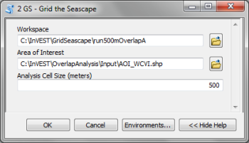

Required inputs
---------------

The required inputs are the minimum data needed to run this model.  The minimum input data allows the model to run without importance weights or distance decay, both of which are optional parameters.

1) **Workspace Location (required)**. Users are required to specify a workspace folder path.  We recommend that you create a new folder for each run of the model.  For example, by creating a folder called "runBC" within the "OverlapAnalysis\\Recreation" folder, the model will create "intermediate" and "output" folders within this "runBC" workspace.  The "intermediate" folder will compartmentalize data from intermediate processes.  The model's final outputs will be stored in the "output" folder. ::

     Name: Path to a workspace folder.  Avoid spaces.
     Sample path: \InVEST\OverlapAnalysis\Recreation\runBC

2) **Type of Analysis Zones (required)**.  This drop down box allows you to summarize model results over a Gridded Seascape (GS) or by Management Zones.  The "Gridded Seascape" is generated from the Grid the Seascape tool and is a constant grid size (e.g., 1000m x 1000m), while "Management Zones" should be selected when choosing a predefined polygon input layer for input #3.  It may reflect management areas or hypothetical future zoning areas in your study area. ::

     Names: 1) Gridded Seascape (GS)  --or-- 2) Management Zones
     File type: drop down options
     Sample (default):  Gridded Seascape (GS)

3) **Analysis Zones Layer (required).**  After running the "Grid the Seascape" (GS) tool, a polygon shapefile will be created that contains cells of a user-specified size to instruct the Overlap Analysis model as to the extent and resolution of analysis.  If the "GS" option was selected for input #2, select the shapefile found in the "Output" folder from a successful GS tool run.  Alternatively, if the "Management Zones" option was selected for input #2, you should provide a polygon shapefile that is projected in meters. ::

     Name: File can be named anything, but no spaces in the name
     File type: Polygon shapefile (.shp)
     Sample path: \InVEST\GridSeascape\run500mOverlapA\Output\gs_[cellsize].shp

4) **Overlap Analysis Data Directory (required).**  Users are required to specify the path on their system to a folder containing only the input data for the Overlap Analysis model.  Input data can be point, line or polygon data layers indicating where in the coastal and marine environment the human use activity takes place (e.g., whale watching, diving, kayaking).  For instructions on how to create a polygon or raster shapefile, see the :ref:`FAQ`. Please note that optional intra-activity importance information, described below for input #6, can be associated with each layer.

   The use of a unique identifier after the underscore ("_") at the end of the file name allows the model to link the ratings from the recreation or fisheries layers table to the correct input layer.  It is recommended that users modify file names and IDs of shapefiles using ArcCatalog.  The model allows for a maximum of eighteen layers in this directory.  Do not store any additional files that are not part of the analysis in this folder directory. ::

      Name: Path to a recreation data folder.  Avoid spaces.
      Sample path: \InVEST\OverlapAnalysis\Input\RecreationLayers_RIS\

.. note:: All data in this folder must be shapefiles, projected in meters, and contain the following naming convention: "[file name]_[unique Integer ID].shp" (e.g. "Beaches_Rec_1.shp")

5) **Overlap Analysis Layers Table (required)**.  This table contains each layer's ID, and the optional information (see below) for inter-activity importance/weighting and buffers.

   For column "A", users will enter the names of each layer contained in the data directory specified by input #4.  The IDs found in column "B" must correspond to the naming convention for GIS layers (e.g. "Beaches_Rec_1.shp" for ID #1).  Users also have the option of buffering the layers by entering a number in column "D" in meters.  If the input layer is a polygon, negative buffer values are also permitted.  This will shrink the area of the layer before overlay analysis.

   Optionally, the user can provide information on the importance of recreation activities or fishing fleets relative to one another.  This information can be qualitative or quantitative (see Appendix for further description of data inputs).  The model uses this information to weight each activity/fleet's usage of the grounds by the importance of that activity/fleet relative to others.  The distribution of weights is normalized so if layer #1 is weighted with a "4.00" and layer #2 with a "2.00" score then the relative importance of layer #1 is twice that of layer #2. ::
  
     Table Name: File can be named anything, but no spaces in the name 
     File type:  ``*``.xls or .xlsx (if user has MS Excel 2007 or newer)
     Sample: \InVEST\OverlapAnalysis\Input\Recreation_Inputs.xls

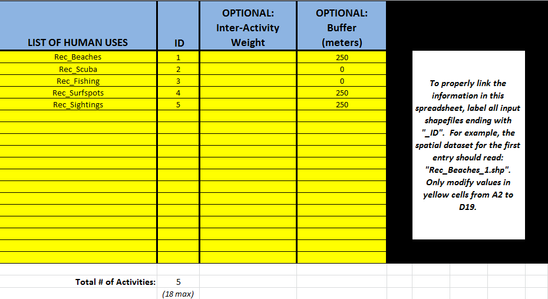

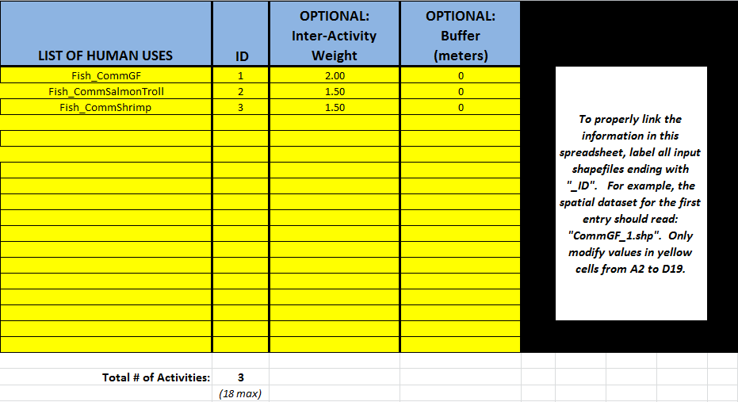

Optional inputs
---------------

The next series of inputs are optional, but may become required depending on other choices made.

1) **Importance Score Field Name (optional).**  The user has the option of providing information on the importance of locations (i.e., polygons or points) within a layer of human use data (e.g., one fishing ground may be much more valuable than another; certain kayaking routes may be more popular than others).  These intra-activity importance scores can be qualitative or quantitative (see Appendix for further description of data inputs) and must be listed in a new column of the attribute tables for each layer included in the Overlap Analysis (see intra-activity weighting in :ref:`oa-the-model` section).  The name given to the column that contains the intra-activity importance scores must be the same for all layers contained within the directory specified by input #4.  The model uses this information to weight the importance of areas found within each input layer. ::

     Names: Text string containing letters and/or numbers (must start with a letter).
     Field name must correspond to an existing column name in each layer's attribute table
     Sample: RIS

2) **Points Layer Indicating Location of Human Use Hubs (optional).**  The model also allows users to down-weight areas or zones used for different activities as a function of the distance from important land-based hubs such as ports, marinas, or public access points.  This input GIS layer must be a point shapefile and projected in meters. ::

     Names: File can be named anything, but no spaces in the name
     File type: Point shapefile (.shp)
     Sample path: \InVEST\Recreation\Input\PopulatedPlaces_WCVI.shp

3) **Distance Decay Rate (optional).**  If a GIS layer is specified for optional input #2, the model will use a decay rate of :math:`\beta` =0.025 by default.  If this input is not specified, no distance decay occurs and this rate is ignored. See Figure 1 for how changing this parameter changes the decay rate.  With a decay rate of  0.025, an importance score of 1 would decrease to ~0.8 at a distance of approximately 10 km from the nearest hub.  User judgment should be exercised when using this option.  The following scenario illustrates one example of how users might use the distance decay function.  Suppose you know that the intensity of human activities is greatest in areas relatively close to the ports, marinas, and other public access points, but you do not have the data necessary to construct spatially-explicit weighting factors to reflect this knowledge.  In the absence of these data, the distance decay function could be used to reflect this intensity / distance tradeoff.   You can choose a decay rate that reflects your best judgment on how the importance (e.g., intensity) of activities declines with distance from important population centers, marinas, or access points.  For example, if most recreational fishing grounds are located within 10 km from the central marina, you could choose a decay parameter of  :math:`\beta` =0.01 to reflect a gradual threshold in the decline of importance of more distant sites, or :math:`\beta` =0.5 to reflect a sharper threshold. ::

     Names: A string of numeric text with a value between 0 and 1 
     File type: Text string (direct input to the ArcGIS interface)
     Sample (default): 0.025

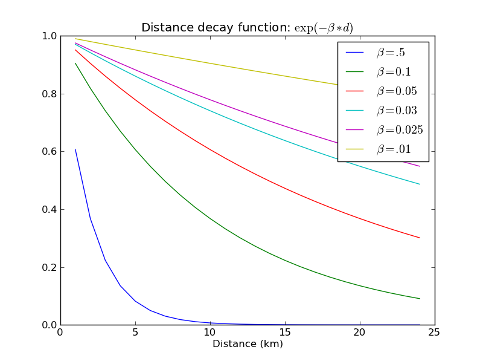

Exponential decay functions used to downweight importance of activities based on distance from land-based access point  

Running the model
=================

.. note:: The word 'path' means to navigate or drill down into a folder structure using the Open Folder dialog window that is used to select GIS layers or Excel worksheets for model input data or parameters. 

Exploring the workspace and input folders
-----------------------------------------

These folders will hold all input, intermediate and output data for the model. As with all folders for ArcGIS, these folder names must not contain any spaces or symbols. See the sample data for an example.

Exploring a project workspace and Input data folder
^^^^^^^^^^^^^^^^^^^^^^^^^^^^^^^^^^^^^^^^^^^^^^^^^^^

The *\\InVEST\\OverlapAnalysis* folder holds the main working folder for the model and all other associated folders. Within the OverlapAnalysis folder there will be a subfolder named 'Input'. This folder holds most of the GIS and tabular data needed to setup and run the model. 

The following image shows the sample folder structure and accompanying GIS data. We recommend using this folder structure as a guide to organize your workspaces and data. Refer to the following screenshots below for examples of folder structure and data organization.

 .. figure:: overlap_analysis_images/image007.png
	 

Creating a run of the model
---------------------------

The following example of setting up the Overlap Analysis model uses the sample data and folder structure supplied with the InVEST installation package (see the :ref:`oa-data-needs` section for a more complete description of the data).  These instructions only provide a guideline on how to specify to ArcGIS the various types of data needed and does not represent any site-specific model parameters. Users might choose different input parameters and/or have location-specific data to use in place of the sample data.

1. Click the plus symbol next to the InVEST toolbox. |toolbox|

2. Expand the Marine toolset and click on the Overlap Analysis script |overlapanalysis| to open the model. 

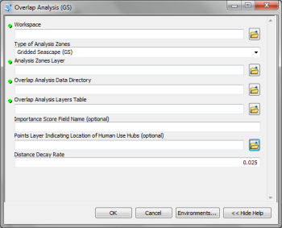

3. Specify the Workspace. Open |folder| the InVEST workspace. If you created your own workspace folder (Step 1), then select it here.

   Select the *OverlapAnalysis* folder and click |addbutt| to set the main model workspace. This is the folder in which you will find the intermediate and final outputs when model is run.

   .. image:: overlap_analysis_images/image013.png
      :align: left

4. Specify the Type of Analysis Zones. You can run the model with either: 1. Gridded Seascape (GS), or 2. Management Zones.  Option #1 should be utilized after running the "Grid the Seascape" tool and option #2 is for overlap analysis with a polygon shapefile, projected in meters.

   .. figure:: overlap_analysis_images/image014.png

5. Specify the Analysis Zones Layer. This input is the actual layer to be used for the overlap analysis.  Depending on your choice for the previous input, click |folder| and path to either \\InVEST\\GridSeascape directory and select the polygon shapefile in the "Output" folder from a particular GS tool run or select a polygon shapefile that delineates zones such as *\\InVEST\\OverlapAnalysis\\Input\\ManagementZones.shp*

6. Specify the Overlap Analysis Data Directory. The model requires the folder location of the data for overlap analysis. Click |folder| and path to the \\InVEST\\OverlapAnalysis\\Input\\ folder. Select the RecreationLayers_RIS folder and click |addbutt| to set this data folder.

   .. figure: overlap_analysis_images/image016.png

7. Specify the Overlap Analysis Layers Table. The model requires a table of parameters for how to recognize and optionally buffer or weight each input layer.  This information must be stored in a Worksheet in an Excel workbook file (.xls). See the **Data Needs** section for more information on creating and formatting these data.  This worksheet will be supplied for you.

   Click |folder| and path to the \\InVEST\\OverlapAnalysis\\Input data folder. Double left-click on the Excel file Recreation_Inputs.xls and select the worksheet WCVI$.

   Click |addbutt| to make the selection. 

8. Specify the Importance Score Field Name (Optional). As an option, the model allows for intra-activity weights through the specification of the name of an attribute column from the input shapefile layers.  In order to utilize this option, this unique field name must be found in each input layer. For this example, type 'RIS' directly into the text box space. 

   .. figure:: overlap_analysis_images/image017.png

.. note:: Make sure you enter the Importance Score Field Name text string here exactly as it appears in each shapefile's attribute table heading.

9. Specify Points Layer Indicating Location of Human Use Hubs (Optional). This vector dataset represents locations as points to be considered for the distance decay function. Open the *\\InVEST\\OverlapAnalysis\\Input* data folder and add the *PopulatedPlaces_WCVI.shp* shapefile. 

   .. figure:: overlap_analysis_images/image018.png

10. Specify the Distance Decay Rate (Optional). If a point layer is specified above, the model requires a value between 0 and 1 for the distance decay function.  The default value is value 0.025 and you type directly in the text box to specify a different value. 
 
    .. figure:: overlap_analysis_images/image019.png

11. At this point the model dialog box is completed for a complete run (with all optional inputs for distance decay and intra-activity weights) of the Overlap Analysis model. 

    Click |ok| to start the model run. The model will begin to run and a show a progress window with progress information about each step in the analysis. Once the model finishes, the progress window will show all the completed steps and the amount of time that has elapsed during the model run.

    .. figure:: overlap_analysis_images/image020_350.png

    .. figure:: overlap_analysis_images/image022_500.png
 

Multiple runs of the model
--------------------------

The tool setup is the same as for a single run, but you must specify a new workspace for each new run. Make sure each new workspace exists under the main workspace folder (i.e. *OverlapAnalysis* folder in the example above). As long as all data are contained within the main Input data folder you can use the same Input folder for multiple runs. For example, using the sample data, if you wanted to create two runs of the Overlap Analysis model based on two different weighting systems for fishing fleets, you could use the Input data folder under main Overlap Analysis folder and create two new workspace folders, runFisheries1 and runFisheries2.  See below for an example of the folder setup. 

Viewing output from the model
-----------------------------

Upon successful completion of the model, you will see new folders in your Workspace called "intermediate" and "Output". The Output folder, in particular, may contain several types of spatial data, which are described in the **Interpreting Results** section.

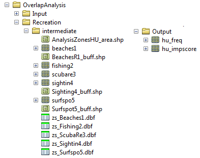

You can view the output spatial data in ArcMap using the Add Data button.  |adddata|

You can change the symbology of a layer by right-clicking on the layer name in the table of contents, selecting "Properties", and then "Symbology".  There are many options here to change the way the data appear in the map.

You can also view the attribute data of output files by right clicking on a layer and selecting "Open Attribute Table". 

.. _oa-interpreting-results:

Interpreting results
====================

Model outputs
-------------

The following is a short description of each of the outputs from the Overlap Analysis model.  Each of these output files is saved in the "Output" folder that is saved within the user-specified workspace directory:

Output folder
^^^^^^^^^^^^^

+ Output\\hu_freq

  + This raster layer depicts the frequency of activities for each cell or management zone for the study area.  Each layer input is only counted once regardless of the number of features within that layer overlapping a cell.  Therefore, if three layers are specified in the input directory, then the max value of this output is 3.  
  + This is the default model output that will be generated for each run of the model.

+ Output\\hu_impscore

  + This raster layer depicts Importance Scores for each cell or management zone for the study area.
  + This output is only generated if the user includes intra-activity weights defined by optional input #1: "Importance Score Field Name".

+ Parameters_[yr-mon-day-min-sec].txt

  + Each time the model is run a text file will appear in the workspace folder.  The file will list the parameter values for that run and be named according to the date and time.
  + Parameter log information can be used to identify detailed configurations of each of scenario simulation.

Intermediate folder
^^^^^^^^^^^^^^^^^^^

+ intermediate\\[first 8 characters of input layer name]_buff.shp

  + For all layers where a buffer distance is specified in the "Overlap Analysis Layers Table" (input #5), there will be a vector layer with the buffer applied.

+ intermediate\\[first 7 characters of input layer name][ID]

  + After all the specified input layers have been buffered, these files are the rasterized copies at 50m resolution.

+ intermediate\\zs_[first 7 characters of input layer name]_[ID].dbf

  + These .dbf tables provide zonal statistics for grid cell values where a particular input layer overlaps analysis cells or zones.

+ intermediate\\AnalysisZonesHU_area.shp

  + This shapefile contains all the overlap analysis calculations.  Outputs are generated from the statistics in this polygon feature class.

Case examples illustrating results
==================================

We present examples of use of the Overlap Analysis model for the West Coast of Vancouver Island, British Columbia, Canada for two types of human uses:  1) recreational activities (diving, kayaking, recreational fishing, wildlife viewing, beach going and surfing), and 2) commercial fisheries (3 fleets: groundfish trawl/longline, salmon troll and shrimp trawl). 

Example illustrating results with recreational data
---------------------------------------------------

The following example illustrates the overlay model using example recreational data from the west coast of Vancouver Island.  In this example, we look at how different recreational activities are combined in space to identify recreation 'hotspots'. 

1) Data inputs, all of which are found in the sample data included with the InVEST installation, are as follows:  

+ Activity layers:  we include five data layers that contain point and polygons data for five different recreational activities (Figure 2):  

+ Surfing 

+ Wildlife Viewing (The wildlife viewing data not represent actual sightings.  They are used here for illustrative purposes.)

+ Beach Going 

+ Recreational Fishing 

+ Diving

2) Type of Analysis zones:  Gridded Seascape (GS):  the Analysis Zone Layer for the GS was generated using the "Grid the Seascape" tool (see "Grid the Seascape Tool" at the beginning of the Data Needs in this chapter), by defining an Area of Interest (AOI_WCVI.shp) and an Analysis Cell Size of 1000 meters. 

3) Fisheries/Recreation Layers table:  the WCVI worksheet within Recreation_Inputs.xls was used to index the five recreation layers and to include 250m buffers around the two point layers (surfing spots wildlife viewing; optional inputs).   The tool requires all point shapefiles to be buffered with a minimum distance of 50m.  Optional inter- and intra-activity weights are not used in this example.

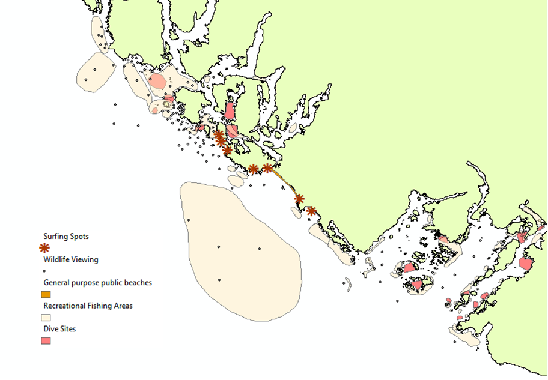

   Locations of recreational activities

Outputs: The resulting map highlights the cells within the area of interest that are 'hotspots' for recreation.  One can easily identify the areas that are used by people participating in one or more of the five recreational activities included in the analysis.  It is important to remember that in this example each grid cell counts only the presence or absence of each activity and does not consider the density of points in a cell.  

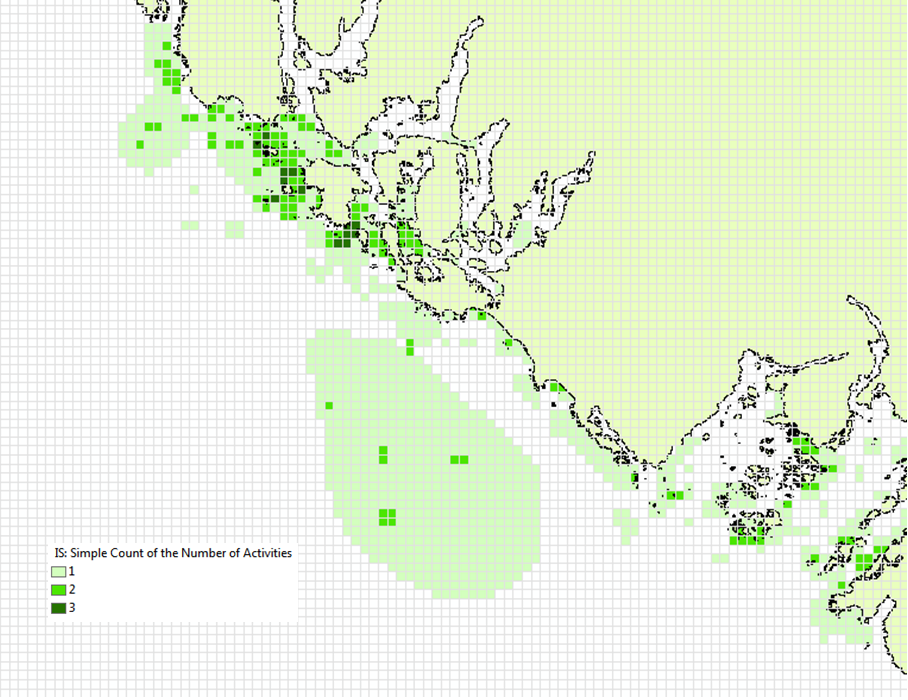

   Map of recreation 'hotspots' identifying the number of activities occurring in each 1000m x 1000m grid cell.

The results from the analysis provide important visual insights that will allows users to identify which marine and coastal areas are most important in supporting a set of activities and can also be used to identify potential conflicts with competing uses of the same space.  In addition to the map layer, the output folder also includes the HU_calcs .csv file that includes the ID of each grid cell, the count of the number of activities occurring in the grid cell.

Example illustrating results with commercial fisheries data
-----------------------------------------------------------

The following example illustrates the application of the Overlap Analysis model to some west coast of Vancouver Island (WCVI) commercial fisheries. In this example, we show which areas of the coastal and marine environment off the west coast of Vancouver Island, British Columbia, Canada are 1) most heavily used (default model run), and 2) of the most importance (intra- and inter-activity weights included) for 3 commercial fishing fleets (groundfish trawl/longline, salmon troll, and shrimp trawl).  

Data inputs, all of which are found in the sample data included with the InVEST installation, are as follows:  

1) Activity layers:  we include 3 data layers that contain polygons of areas fished by the commercial groundfish trawl/longline (CommGF_1.shp), salmon troll (CommSalmon_Troll_2.shp), and shrimp trawl (CommShrimp_3.shp) fleets.  Data are from GeoBC, which manages the provincial geographic information clearinghouse for British Columbia.  Data were collected from 1993-95 through interviews with fisheries officers for the WCVI. 

2) Type of Analysis zones:  Gridded Seascape (GS):  the Analysis Zone Layer for the GS was generated using the "Grid the Seascape" tool (see "Grid the Seascape Tool" at the beginning of the Data Needs in this chapter), by defining an Area of Interest (AOI_WCVI_med.shp) and an Analysis Cell Size of 1000 meters. 

3) Fisheries/Recreation Layers table:  the WCVI worksheet within Fisheries_Inputs.xls was used to index the 3 commercial fishing fleets and to include inter-fleet weights (an optional input).  Inter-activity weights of $62,000,000, $60,000,000, and $37,000,000 were selected for commercial groundfish trawl and longline, salmon troll, and shrimp trawl, respectively, which were the values of landed catch from these 3 fleets in 2006 (DFO 2008).  We did not include buffers (an optional input) around any of the fleet's layers.

4) Intra-activity weights (optional input):  Each fishing fleet layer contains unique areas used for fishing, which are coded by how the fisheries officers who were interviewed to generate the layers ranked the Relative Importance (RI) of the area as compared to other catch areas for that fishery in the WCVI.  RI scores range from 1 (very low importance) to 4 (high importance); RIs for the groundfish fishery layer are shown in Figure 4, with fishing grounds with the lowest RIs shown in the lightest green and highest RIs in the darkest green.

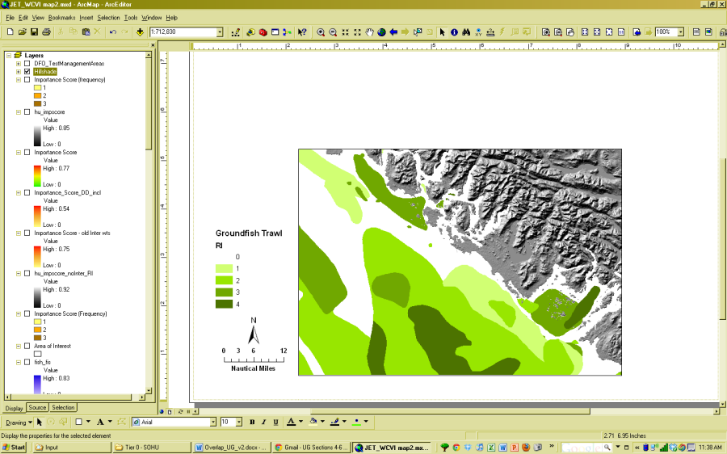

   Commercial groundfish trawl and longline fleet fishing grounds off the WCVI.  RI = intra-activity weights showing relative importance of different fishing grounds.  High values (darker shades of green) indicate more important areas.  

Outputs:

In the resulting map from the default model run (Figure 5), it is easy to identify areas utilized by all three fleets (darkest cells) and areas devoid of use (white cells).  There are three areas of the study area that are used by all fleets: the central offshore portion, and two areas in the southern portion.   

.. figure:: overlap_analysis_images/image028_900.png

   Output of Overlap Analysis Model: frequency of use of grid cells by the 3 fishing fleets.

Since optional intra- and inter-fleet weights were included, the model also outputs a map of Importance Scores (Figure 6).  By including the weights, we see that several areas shown in red only have 2 fleets operating (Figure 5), but are actually as 'important' as areas used by all 3 fleets.  This is due to the importance of the individual polygons within the fleet's layer and also the importance of the fleet relative to the others.  With the additional weighting information, decision-makers can begin to visualize 'hotspots' of activity beyond simple presence or absence of the activity.  

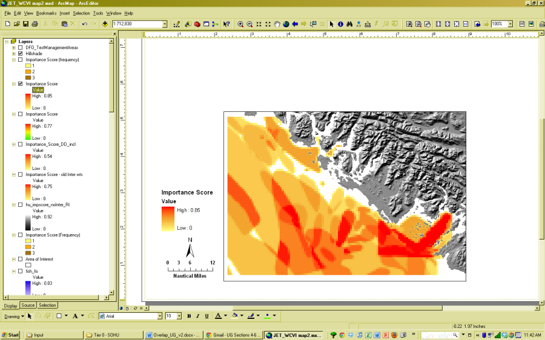

   Output of Overlap Analysis Model: Importance Scores of grid cells based on activity, inter- and intra-activity weights for the three fishing fleets.

.. _oa-appendix-a:

Appendix A
==========

Preparing input data
--------------------

Maps of fishing grounds
^^^^^^^^^^^^^^^^^^^^^^^

Users should create a layer of polygons or points to define where individual fishing fleets operate.  Fleets can be defined however you deem appropriate.  Often, fleets are defined by their sector (e.g., commercial, recreational, subsistence), the species or species complexes they target (e.g., prawn, salmon, groundfish), and the gear that they use (e.g., trawl, seine, longline).  For example, fleets might be commercial groundfish trawl, subsistence salmon seine, or recreational tuna hook and line.

For each fleet you decide to include, you must have information on where that fleet fishes.  Locations can be points or polygons.  You can generate these layers if existing maps of spatial distribution of fishing catch or effort are available to you.  These maps are not often readily available, in which case, you can summarize catch, effort, or revenue data by management zone or statistical area. Availability of these data varies regionally -- most regional management councils in the U.S. collect these data and make them publicly available through data clearinghouses associated with regional management councils (e.g., Pacific Fisheries Information Network associated with Pacific Fisheries Management Council).  When summary by management zone or statistical area is unavailable, information can be solicited from stakeholders through exercises where they draw polygons or points on maps. You can collect these data with the InVEST drawing tool (forthcoming).  If none of these are options for you, but you have habitat information available, it is possible to draw habitat-species-gear associations and coarsely estimate where fleet activity may occur.

Recreational activity layers
^^^^^^^^^^^^^^^^^^^^^^^^^^^^

Spatially explicit data on recreation activities can be collected from a variety of sources including local tourism operators, government agencies, and guide books. In most areas, there is no clearinghouse for this type and users will likely need to combine data from a variety of sources.

Importance data (optional)
^^^^^^^^^^^^^^^^^^^^^^^^^^

Intra-fleet weights
"""""""""""""""""""

Quantitative or qualitative or data on which locations in the coastal and marine environment are most or least important for a human use (i.e., intra-activity weights) can be easily prepared and included in the Overlap Analysis model.  Whichever type of data is used does not need to be consistent across human use activities.  For example, when spatially-explicit catch data exist for one fishing fleet, and another fishing fleet only has qualitative rankings of importance of different fishing grounds, both data sets can be used.  Intra-fleet weights are entered for each polygon or point in each data layer's attribute table.  If intra-fleet weights are missing for one or more data layers in the analysis, users must include a placeholder column (i.e., values for all polygons in the layer = 1) for the model to run correctly.

Quantitative data are likely to be catch, effort, profit, or revenue information for fisheries.  For recreation, the number of trips or number of visitors to each site is the suggested metric to be used to weight activities.  Alternatively, users may use the number of days that an area is open to particular activities or other metrics that proxy for importance or usage. Higher values should indicate polygons or points of higher importance than those with lower values.  

Qualitative scoring is a good option for users without quantitative input data. Low scores should indicate least important locations for the activity, high scores most important areas, and multiple areas should be allowed to have the same score (i.e., areas are given scores, not ranks).  We encourage users to take care in assignment of values to locations as these values strongly influence outcomes.  For example, if one fishing area polygon is given a score of 1, and another a score of 2, is the 2nd polygon twice as "important" as the first?  If not, and the two polygons are more similar in their importance, the user could considering scoring more closely to one another (e.g., score of 1.75 and 2, instead of 1 and 2) or score on a larger scale (e.g., scores of 4 and 5, instead of 1 and 2).  The onus is on the user to decide which range of weights to use.  If you are unsure of how to appropriately include these weights, we encourage you to conduct several model runs to see how different weighting schemes affect model outputs.  A common method for obtaining qualitative information on the importance of an activity is by querying stakeholders or decision-makers in the region.  InVEST will soon include a mapping tool to help collect data from stakeholders.  The tool will include functionality for entering intra-activity weights.  If using the InVEST drawing tool (forthcoming) while querying stakeholders, importance scores can be input when generating layers.  

Once intra-activity weights are input into the model, they are scaled by the maximum value for all locations where the activity occurs.  For example, if the user has identified 3 fishing grounds for a fleet, with values of 2, 4, and 5, they will be scaled by 5, to be 0.4, 0.8 and 1.0.  

Inter-activity weights
""""""""""""""""""""""

The user has the option to include information on the importance of activities relative to one another so that all activities are not treated equally.  This information is not spatially explicit, rather is in the form of one value for each activity.  If the user chooses to include inter-activity weights, they must be included for all activities.  Inter-activity weights can be qualitative (e.g., stakeholder designated) or quantitative (e.g., total catch, effort, profit, or revenue; socio-economic assessment of contributions of each fishing fleet to community stability or tax base), but the same metric should be used to weight all activities.  For recreation, if the user does not have spatially explicit data on numbers of recreation trips, but does have the aggregate number of trips or participants for each activity, these numbers can be used to construct an importance ranking of each activity by using the percentage of trips / participants in each activity as inter-activity weights.  For fisheries, for example, if running the model for three fishing fleets, inter-activity weights could be calculated using total revenue earned by each fleet as is done in the example presented earlier in this chapter.  It would be inappropriate to determine weights by comparing one fleet's catches to the others' revenues.  Given this caution, when determining inter-activity weights, users should choose a common quantitative (e.g., catch, revenue for fishing fleets) or qualitative (e.g., scores from stakeholder input) metric that is applicable across all activities.  Similar to the intra-activity weights, inter-activity weights are not ranks (i.e., activities can have the same weights), and must be included for all data layers.  Once input into the model, quantitative or qualitative values are scaled by the maximum value for all activities. 

The caution in the preceding, intra-activity, section about the numeric scales used for qualitatively weighting activities applies here, as weights strongly affect model outputs.  To reiterate, using a hypothetical model run for recreational data, if the inter-activity weight for whale-watching is 1, and kayaking 2, is the kayaking twice as "important" as whale-watching?  If the activities are actually more similar, the weights should be closer to one another (e.g., score of 1.75 and 2, instead of 1 and 2) or score on a larger scale (e.g., scores of 4 and 5, instead of 1 and 2).  Users are responsible for choosing the range of weights to use, and we encourage you to conduct several model runs to see how different weighting schemes affect model outputs.  

References
==========

Beck, M.W, Z. Ferdana, J. Kachmar, K. K. Morrison, P. Taylor and others. 2009. Best Practices for Marine Spatial Planning. The Nature Conservancy, Arlington, VA. 32 pp.

CDFG (California Department of Fish and Game). 2008.  California Marine Life Protection Act.  Master Plan for Marine Protected Areas. 110 pp.

CRMC (Coastal Resources Management Council).  2010. Rhode Island Ocean Special Area Management Plan:  Adopted by the Rhode Island Coastal Resources Management Council October 2010.  993 pp.

DFO (Department of Fisheries and Oceans). 2008. Canadian Fisheries Statistics 2006. Ottawa: Fisheries and Oceans Canada.

GBRMPA (Great Barrier Reef Marine Park Authority). 2003.  Great Barrier Reef Marine Park Zoning Plan 2003.  Australian Government.  220 pp.
