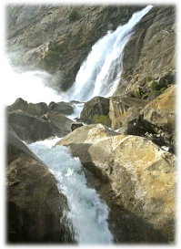
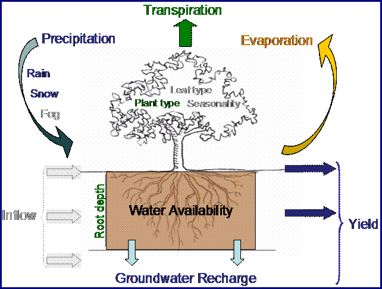

.. _reservoirhydropowerproduction:

.. |addbutt| image:: ./shared_images/addbutt.png
             :alt: add
	     :align: middle 
	     :height: 15px

.. |toolbox| image:: ./shared_images/toolbox.jpg
             :alt: toolboxenv
	     :align: middle 
	     :height: 15px

********************************************
Water Yield: Reservoir Hydropower Production
********************************************

Summary
=======

Hydropower accounts for twenty percent of worldwide energy production, most of which is generated by reservoir systems. InVEST estimates the annual average quantity and value of hydropower produced by reservoirs, and identifies how much water yield or value each part of the landscape contributes annually to hydropower production. The model has three components: water yield, water consumption, and hydropower valuation. The first two components use data on average annual precipitation, annual reference evapotranspiration and a correction factor for vegetation type, root restricting layer depth, plant available water content, land use and land cover, root depth, elevation, saturated hydraulic conductivity, and consumptive water use. The valuation model uses data on hydropower market value and production costs, the remaining lifetime of the reservoir, and a discount rate. The biophysical models do not consider surface -- ground water interactions or the temporal dimension of water supply. The valuation model assumes that energy pricing is static over time.

Introduction
============

The provision of fresh water is an ecosystem service that contributes to the welfare of society in many ways, including through the production of hydropower, the most widely used form of renewable energy in the world. Most hydropower production comes from watershed-fed reservoir systems that generally deliver energy consistently and predictably. The systems are designed to account for annual variability in water volume, given the likely levels for a given watershed, but are vulnerable to extreme variation caused by land use and land cover (LULC) changes. LULC changes can alter hydrologic cycles, affecting patterns of evapotranspiration, infiltration and water retention, and changing the timing and volume of water that is available for hydropower production (World Commission on Dams 2000; Ennaanay 2006).

Changes in the landscape that affect annual average water yield upstream of hydropower facilities can increase or decrease hydropower production capacity. Maps of where water yield used for hydropower is produced can help avoid unintended impacts on hydropower production or help direct land use decisions that wish to maintain power production, while balancing other uses such as conservation or agriculture. Such maps can also be used to inform investments in restoration or management that downstream stakeholders, such as hydropower companies, make in hopes of improving or maintaining water yield for this important ecosystem service. In large watersheds with multiple reservoirs for hydropower production, areas upstream of power plants that sell to a higher value market will have a higher value for this service. Maps of how much value each parcel contributes to hydropower production can help managers avoid developments in the highest hydropower value areas, understand how much value will be lost or gained as a consequence of different management options, or identify which hydropower producers have the largest stake in maintaining water yield across a landscape.

Water Yield: Reservoir Hydropower Production 3.0 Beta
-----------------------------------------------------

We are working on the next generation platform of InVEST and deploying parts of it as prototype InVEST models. Reservoir Hydropower Production has a 3.0 prototype which can be found in the Windows Start menu after the InVEST installation is complete.  New features to the 3.0 version include:

+ Performance improvements to the runtime of the model.
+ Outputs are simplified into shapefile polygons rather than rasterized polygons.  Generally the raster outputs of the ArcGIS versions of the models have a field in a shapefile that corresponds to that output.
+ The ArcGIS model is run in 3 separate steps.  The standalone model has a streamlined interface to run in a single step.

The Model
=========

The InVEST Reservoir Hydropower model estimates the relative contributions of water from different parts of a landscape, offering insight into how changes in land use patterns affect annual surface water yield and hydropower production.

Modeling the connections between landscape changes and hydrologic processes is not simple. Sophisticated models of these connections and associated processes (such as the WEAP model) are resource and data intensive and require substantial expertise. To accommodate more contexts, for which data are readily available, InVEST maps and models the annual average water yield from a landscape used for hydropower production, rather than directly addressing the affect of LULC changes on hydropower failure as this process is closely linked to variation in water inflow on a daily to monthly timescale. Instead, InVEST calculates the relative contribution of each land parcel to annual average hydropower production and the value of this contribution in terms of energy production. The net present value of hydropower production over the life of the reservoir also can be calculated by summing discounted annual revenues.

How it works
------------

The model runs on a gridded map. It estimates the quantity and value of water used for hydropower production from each subwatershed in the area of interest. It has three components, which run sequentially. First, it determines the amount of water running off each pixel as the precipitation less the fraction of the water that undergoes evapotranspiration. The model does not differentiate between surface, subsurface and baseflow, but assumes that all water yield from a pixel reaches the point of interest via one of these pathways. This model then sums and averages water yield to the subwatershed level. The pixel-scale calculations allow us to represent the heterogeneity of key driving factors in water yield such as soil type, precipitation, vegetation type, etc. However, the theory we are using as the foundation of this set of models was developed at the subwatershed to watershed scale. We are only confident in the interpretation of these models at the subwatershed scale, so all outputs are summed and/or averaged to the subwatershed scale. We do continue to provide pixel-scale representations of some outputs for calibration and model-checking purposes only. **These pixel-scale maps are not to be interpreted for understanding of hydrological processes or to inform decision making of any kind.**

Second, beyond annual average runoff, it calculates the proportion of surface water that is used for hydropower production by subtracting the surface water that is consumed for other uses. Third, it estimates the energy produced by the water reaching the hydropower reservoir and the value of this energy over the reservoir's lifetime.

Water Yield Model
^^^^^^^^^^^^^^^^^

The water yield model is based on the Budyko curve and annual average precipitation. First, we determine annual water yield :math:`Y(x)` for each pixel on the landscape :math:`x` as follows:

.. math:: Y(x) = \left(1-\frac{AET(x)}{P(x)}\right)\cdot P(x)

where :math:`AET(x)` is the annual actual evapotranspiration for pixel :math:`x` and :math:`P(x)` is the annual precipitation on pixel :math:`x`.

Figure 1. Conceptual diagram of the water balance model used in the hydropower production model. The water cycle is simplified, including only the parameters shown in color, and ignoring the parameters shown in gray. Yield, as calculated by this step of the model, is then adjusted for other consumptive uses and applied to hydropower energy and value estimates.

For vegetated LULC, the evapotranspiration portion of the water balance, :math:`\frac{AET(x)}{P(x)}` , is based on an expression of the Budyko curve proposed by Fu (1981) and Zhang et al. (2004):

.. math:: \frac{AET(x)}{P(x)} = 1+\frac{PET(x)}{P(x)} - \left[1+\left(\frac{PET(x)}{P(x)}\right)^\omega\right]^{1/\omega}
	:label: (Eq. A)

where :math:`PET(x)` is the potential evapotranspiration and :math:`\omega(x)` is a non-physical parameter that characterizes the natural climatic-soil properties, both detailed below.

Potential evapotranspiration :math:`PET(x)` is defined as:

.. math:: PET(x) = K_c(\ell_x)\cdot ET_0(x)

where, :math:`ET_0(x)` is the reference evapotranspiration from pixel :math:`x` and :math:`K_c(\ell_x)` is the plant (vegetation) evapotranspiration coefficient associated with the LULC :math:`\ell_x` on pixel :math:`x`. :math:`ET_0(x)` reflects local climatic conditions, based on the evapotranspiration of a reference vegetation such as grass of alfalfa grown at that location. :math:`K_c(\ell_x)` is largely determined by the vegetative characteristics of the land use/land cover found on that pixel (Allen et al. 1998). :math:`K_c` adjusts the :math:`ET_0` values to the crop or vegetation type in each pixel of the land use/land cover map. 

:math:`\omega(x)` is an empirical parameter that can be expressed as linear function of :math:`\frac{AWC*N}{P}`, where N is the number of events per year, and AWC is the volumetric plant available water content (see below for additional details). While further research is being conducted to determine the function that best describe global data, we use the expression proposed by Donohue et al. (2012) in the InVEST model, and thus define:

.. math:: \omega(x) = Z\frac{AWC(x)}{P(x)} + 1.25

where:

+ :math:`AWC(x)` is the volumetric (mm) plant available water content. The soil texture and effective rooting depth define :math:`AWC(x)`, which establishes the amount of water that can be held and released in the soil for use by a plant. It is estimated as the product of the plant available water capacity (PAWC) and the minimum of root restricting layer depth and vegetation rooting depth: 

	.. math:: AWC(x)= Min(Rest.layer.depth, root.depth)\cdot PAWC

	Root restricting layer depth is the soil depth at which root penetration is inhibited because of physical or chemical characteristics. Vegetation rooting depth is often given as the depth at which 95% of a vegetation type's root biomass occurs. PAWC is the plant available water capacity, i.e. the difference between field capacity and wilting point.

+ :math:`Z` is an empirical constant, sometimes referred to as "seasonality factor", which captures the local precipitation pattern and additional hydrogeological characteristics. It is positively correlated with N, the number of rain events per year. The 1.25 term is the minimum value of  :math:`\omega(x)`, which can be seen as a value for bare soil (when root depth is 0), as explained by Donohue et al. (2012). Following the literature (Yang et al., 2008; Donohue et al. 2012), values of :math:`\omega(x)` are  capped to a value of 5.

For other LULC (open water, urban, wetland), actual evapotranspiration is directly computed from the reference evapotranspiration :math:`ET_0(x)` and has an upper limit defined by the precipitation:

.. math:: AET(x) = Min(K_c(\ell_x)\cdot ET_0(x),P(x))
	:label: (Eq. B)

where :math:`ET_0(x)` is the reference evapotranspiration, and :math:`K_c(\ell_x)` is the evaporation factor for each LULC. Guidance for estimating the :math:`K_c` factor is provided in the “Data sources” section.

The water yield model script generates and outputs the total and average water yield at the subwatershed level.

Realized Supply Model
^^^^^^^^^^^^^^^^^^^^

The Realized Supply Model calculates the water inflow to a reservoir based on water yield and water consumptive use in the watershed(s) of interest. The user inputs how much water is consumed by each land use land cover type in a table format. Examples of consumptive use include municipal or industrial withdrawals that are not returned to the stream upstream of the outlet. This model may also be used to represent inter-basin transfers out of the study watershed.

For example, in an urban area, consumptive use can be calculated as the product of population density and per capita consumptive use.  These land use-based values only relate to the consumptive portion of demand; some water use is non-consumptive such as water used for industrial processes or waste water that is returned to the stream after use, upstream of the outlet. Consumptive use estimates should therefore take into account any return flows to the stream above the watershed outlet:

.. math:: C = \frac{W-R}{n}

where, :math:`C` = the consumptive use (:math:`m^3/yr/pixel`), :math:`W` = withdrawals (:math:`m^3/yr`), :math:`R` = return flows (:math:`m^3/yr`), and :math:`n` = number of pixels in a given land cover.

For simplicity, each pixel in the watershed is either a "contributing" pixel, which contributes to hydropower production, or a "use" pixel, which uses water for other consumptive uses. This assumption implies that land use associated with consumptive uses will not contribute any yield for downstream use. The amount of water that actually reaches the reservoir for dam :math:`d` (realized supply) is defined as the difference between total water yield from the watershed and total consumptive use in the watershed:

.. math:: V_{in} = Y-u_d

where :math:`V_{in}` is the realized supply (volume inflow to a reservoir), :math:`u_d` is the total volume of water consumed in the watershed upstream of dam :math:`d` and :math:`Y` is the total water yield from the watershed upstream of dam :math:`d`.

Note that only anthropogenic uses are considered here, since evapotranspiration (including consumptive use of water by croplands) are accounted for by the :math:`K_c` parameter in the water yield model.  Users should be aware that the model assumes that all water available for evapotranspiration comes from within the watershed (as rainfall).  This assumption holds true in cases where agriculture is either rain-fed, or the source of irrigation water is within the study watershed (not sourced from inter-basin transfer or a disconnected deeper aquifer).  See the Limitations section for more information on applying the model in watersheds with irrigated agriculture. 

If the user has observed data available on actual annual inflow rates to the reservoir for dam :math:`d`, they can be compared to :math:`V_{in}`.

Hydropower Production and Valuation Model
^^^^^^^^^^^^^^^^^^^^^^^^^^^^^^^^^^^^^^^^^

The reservoir hydropower model estimates both the amount of energy produced given the estimated realized supply of water for hydropower production and the value of that energy. A present value dollar (or other currency) estimate is given for the entire remaining lifetime of the reservoir. Net present value can be calculated if hydropower production cost data are available. The energy produced and the revenue is then redistributed over the landscape based on the proportional contribution of each subwatershed to energy production. Final output maps show how much energy production and hydropower value can be attributed to each subwatershed's water yield over the lifetime of the reservoir.

At dam :math:`d`, power is calculated using the following equation:

.. math:: p_d = \rho\cdot q_d \cdot g \cdot h_d
 		

where :math:`p_d` is power in watts, :math:`\rho` is the water density (1000 Kg/m\ :sup:`3`\ ), :math:`q_d` is the flow rate (m\ :sup:`3`\ /s), :math:`g` is the gravity constant (9.81 m/s\ :sup:`2`\ ), and :math:`h_d` is the water height behind the dam at the turbine (m).  In this model, we assume that the total annual inflow water volume is released equally and continuously over the course of each year.

The power production equation is connected to the water yield model by converting the annual inflow volume adjusted for consumption (:math:`V_{in}`) to a per second rate. Since electric energy is normally measured in kilowatt-hours, the power :math:`p_d` is multiplied by the number of hours in a year.  All hydropower reservoirs are built to produce a maximum amount of electricity. This is called the energy production rating, and represents how much energy could be produced if the turbines are 100% efficient and all water that enters the reservoir is used for power production. In the real world, turbines have inefficiencies and water in the reservoir may be extracted for other uses like irrigation, retained in the reservoir for other uses like recreation, or released from the reservoir for non-power production uses like maintaining environmental flows downstream. To account for these inefficiencies and the flow rate and power unit adjustments, annual average energy production :math:`\varepsilon_d`  at dam :math:`d` is calculated as follows:

.. math:: \varepsilon_d= 0.00272\cdot \beta \cdot \gamma_d \cdot h_d \cdot V_{in}
 
where :math:`\varepsilon_d` is hydropower energy production (KWH), :math:`\beta` is the turbine efficiency coefficient (%), :math:`\gamma_d`  is the percent of inflow water volume to the reservoir at dam :math:`d` that will be used to generate energy.

To convert :math:`\varepsilon_d`, the annual energy generated by dam :math:`d`, into a net present value (NPV) of energy produced (point of use value) we use the following,

.. math:: NPVH_d=(p_e\varepsilon_d-TC_d)\times \sum^{T-1}_{t=0}\frac{1}{(1+r)^t}

where :math:`TC_d` is the total annual operating costs for dam :math:`d`, :math:`p_e` is the market value of electricity (per unit of energy consumed) provided by hydropower plant at dam :math:`d`, :math:`T_d` indicates the number of years present landscape conditions are expected to persist or the expected remaining lifetime of the station at dam :math:`d` (set :math:`T` to the smallest value if the two time values differ), and :math:`r` is the market discount rate. The form of the equation above assumes that :math:`TC_d`, :math:`p_e`, and :math:`\varepsilon_d`, are constant over time.

Energy production over the lifetime of dam :math:`d` is attributed to each subwatershed as follows:

.. math:: \varepsilon_x = (T_d\varepsilon_d)\times(c_x / c_{tot})

where the first term in parentheses represents the electricity production over the lifetime of dam :math:`d`. The second term represents the proportion of water volume used for hydropower production that comes from subwatershed :math:`x` relative to the total water volume for the whole watershed. The value of each subwatershed for hydropower production over the lifetime of dam :math:`d` is calculated similarly:

.. math:: NPVH_x=NPVH_d\times (c_x/c_{tot})

Limitations and simplifications
^^^^^^^^^^^^^^^^^^^^^^^^^^^^^^^

The model has a number of limitations. First, it is not intended for devising detailed water plans, but rather for evaluating how and where changes in a watershed may affect hydropower production for reservoir systems.  It is based on annual averages, which neglect extremes and do not consider the temporal dimensions of water supply and hydropower production.

Second, the model does not consider the spatial distribution of land use land cover. The empirical model used for the water balance (based on the Budyko theory) has been tested at larger scales than the pixel dimensions used in InVEST (Hamel & Guswa, in review). Complex land use patterns or underlying geology, which may induce complex water balances, may not be well captured by the model.

Third, the model does not consider sub-annual patterns of water delivery timing. Water yield is a provisioning function, but hydropower benefits are also affected by flow regulation. The timing of peak flows and delivery of minimum operational flows throughout the year determines the rate of hydropower production and annual revenue. Changes in landscape scenarios are likely to affect the timing of flows as much as the annual water yield, and are of particular concern when considering drivers such as climate change. Modeling the temporal patterns of overland flow requires detailed data that are not appropriate for our approach. Still, this model provides a useful initial assessment of how landscape scenarios may affect the annual delivery of water to hydropower production.

Fourth, the model greatly simplifies consumptive demand. For each LULC, a single variable (:math:`\gamma_d`) is used to represent multiple aspects of water resource allocation, which may misrepresent the complex distribution of water among uses and over time. In reality, water demand may differ greatly between parcels of the same LULC class. Much of the water demand may also come from large point source intakes, which are not represented by LULC class. The model simplifies water demand by distributing it over the landscape. For example, the water demand may be large for an urban area, and the model represents this demand by distributing it over the urban LULC class. The actual water supply intake, however, is likely further upstream in a rural location. Spatial disparity in actual and modeled demand points may cause an incorrect representation in the realized supply output grid. The distribution of consumption is also simplified in the reallocation of energy production and hydropower value since it is assumed that water consumed along flow paths is drawn equally from every pixel upstream. As a result, water scarcity, energy production patterns, and hydropower values may be incorrectly estimated.

Fifth, water transfers for irrigation, either between subbasins or between seasons, are not well captured by the model. When applying the empirical approach to cropland, one should consider the irrigation patterns, which typically fall into one of the following cases:

1) If there is no irrigation other than direct rain, one can assume that croplands respond to climate forcing in a similar way to natural vegetation (i.e. the theory behind the eco-hydrological model used in the InVEST model, linking plant available water and climate forcing, applies, cf. Donohue et al. 2012)

2) If small reservoirs store water during the wet season to irrigate crops during the dry season, the AET should equal PET during the irrigation season. However, the model predicts AET<PET due to limited water retention in undisturbed catchments (where there is no other reservoir that soil storage). This likely results in the underestimation of evapotranspiration, and therefore the overestimation of yields. To avoid this issue, one can use the alternative equation for AET (equation 2), which sets AET directly as a function of ETo. (In that case, one should remember that AET is capped by P to avoid predicting negative water yields, which may result in an overestimation of yields).

3) If the study area contains croplands that are irrigated with water from outside the catchment (either through inter-basin transfer or pumping from a disconnected groundwater source), then AET also equals to PET during the irrigation season. Because the model assumes that evapotranspiration is sourced from rainfall, the water yield output is likely overestimated.  This situation can also be represented by using the alternative equation for AET (equation 2). If one assumes that crops are being irrigated efficiently (i.e. the total volume of imported water is equal to the water deficit, or PET – P, for crop cells), then the known volume of water irrigated may be added to the modeled water yield to give a better picture of actual yield.  

4) Because seasonality can play a significant role in irrigation water use, users should use caution when using the annual model in catchments with large irrigated fields.  For options that are not covered above or where complex water transfers may substantially affect the water balance, users are encouraged to use alternative models that will better represent the spatial and temporal water transfers. In particular, great caution should be used when calibrating the model without good data on the different water balance components within their study area (i.e. rainfall, streamflow, irrigation rates and timing).

Finally, the model assumes that hydropower production and pricing remain constant over time. It does not account for seasonal variation in energy production or fluctuations in energy pricing, which may affect the value of hydropower. Even if sub-annual production or energy prices change, however, the relative value between parcels of land in the same drainage area should be accurate.

Data needs
==========

Here we outline the specific data used by the model. See the appendix for detailed information on data sources and pre-processing.  For all raster inputs, the projection used should be defined, and the projection's linear units should be in meters.  

1. **Root restricting layer depth (required).** A GIS raster dataset with an average root restricting layer depth value for each cell. Root restricting layer depth is the soil depth at which root penetration is strongly inhibited because of physical or chemical characteristics. The root restricting layer depth values should be in millimeters.

 *Name*: File can be named anything, but no spaces in the name and less than 13 characters if an ESRI GRID. If a TIF or IMG, the name may be longer.

 *Format*: Standard GIS raster file (e.g., ESRI GRID, TIF or IMG), with an average root restricting layer depth in millimeters for each cell.

 *Sample data set*: \\InVEST\\Base_Data\\Freshwater\\depth_to_root_rest_layer

2. **Precipitation (required)**. A GIS raster dataset with a non-zero value for average annual precipitation for each cell.  The precipitation values should be in millimeters.

 *Name*: File can be named anything, but no spaces in the name and less than 13 characters if an ESRI GRID. If a TIF or IMG, the name may be longer.

 *Format*: Standard GIS raster file (e.g., ESRI GRID, TIF or IMG), with precipitation values for each cell.

 *Sample data set*: \\InVEST\\Base_Data\\Freshwater\\precip

3. **Plant Available Water Content (required)**. A GIS raster dataset with a plant available water content value for each cell.  Plant Available Water Content fraction (PAWC) is the fraction of water that can be stored in the soil profile that is available for plants' use. PAWC is a fraction from 0 to 1.

 *Name:* File can be named anything, but no spaces in the name and less than 13 characters  if an ESRI GRID. If a TIF or IMG, the name may be longer.

 *Format:* Standard GIS raster file (e.g., ESRI GRID, TIF or IMG), with available water content values for each cell.

 *Sample data set:* \\InVEST\\Base_Data\\Freshwater\\pawc

4. **Average Annual Reference Evapotranspiration (required).** A GIS raster dataset, with an annual average evapotranspiration value for each cell. Reference evapotranspiration is the potential loss of water from soil by both evaporation from the soil and transpiration by healthy alfalfa (or grass) if sufficient water is available.  The reference evapotranspiration values should be in millimeters.

 *Name:* File can be named anything, but no spaces in the name and less than 13 characters if an ESRI GRID. If a TIF or IMG, the name may be longer.

 *Format:* Standard GIS raster file (e.g., ESRI GRID, TIF or IMG), with reference evapotranspiration values for each cell.

 *Sample data set:* \\InVEST\\Base_Data\\Freshwater\\eto

5. **Land use/land cover (required)**. A GIS raster dataset, with an LULC code for each cell.  The LULC code should be an integer.

 *Name:* File can be named anything, but no spaces in the name and less than 13 characters if an ESRI GRID. If a TIF or IMG, the name may be longer.

 *Format:* Standard GIS raster file (e.g., ESRI GRID, TIF or IMG), with an integer LULC class code for each cell (e.g., 1 for forest, 3 for grassland, etc.). These codes must match LULC codes in the Biophysical  table.

 *Sample data set:* \\InVEST\\Base_Data\\Freshwater\\landuse_90

6. **Watersheds (required)**. A shapefile, with one polygon per watershed. This is a layer of watersheds such that each watershed contributes to a point of interest where hydropower production will be analyzed.  See the Working with the DEM section for information about generating watersheds.

 *Name:* File can be named anything, but no spaces in the name

 *Format:* Shapefile (.shp)

 *Rows:* Each row is one watershed

 *Columns:* An integer field named *ws_id* is required, with a unique integer value for each watershed

 *Sample data set:* \\InVEST\\Base_Data\\Freshwater\\watersheds.shp

7. **subwatersheds (required)**. A  shapefile, with one polygon per subwatershed within the main watersheds specified in the Watersheds shapefile. See the Working with the DEM section for information about generating subwatersheds.

 *Format:* Shapefile (.shp)

 *Rows:* Each row is one subwatershed

 *Columns:* An integer field named *subws_id* is required, with a unique integer value for each subwatershed

 *Sample data set:* \\InVEST\\ Base_Data\\Freshwater\\subwatersheds.shp

8. **Biophysical Table (required)**. A table of land use/land cover (LULC) classes, containing data on biophysical coefficients used in this tool. NOTE: these data are attributes of each LULC class rather than attributes of individual cells in the raster map.

 *Sample data set:* \\InVEST\\Base_Data\\Freshwater\\Water_Tables.mdb\\Biophysical_Models and \\InVEST\\Hydropower\\input\biophysical_table.csv

 *Name:* Table names should only have letters, numbers and underscores, no spaces

 *Format:*  ``*``.dbf or ``*``.mdb for ArcGIS models, the standalone model requires a .csv file

 *Rows:* Each row is an LULC class.

 *Columns:* Each column contains a different attribute of each land use/land cover class, and must be named as follows:

 a. *lucode (Land use code)*: Unique integer for each LULC class (e.g., 1 for forest, 3 for grassland, etc.), must match the LULC raster above.

 b. *LULC_desc*: Descriptive name of land use/land cover class (optional)
 
 c. *LULC_veg*: Contains the information on which AET equation to use (Eq. 1 or 2). Values should be 1 for vegetated land use except wetlands, and 0 for all other land uses, including  wetlands, urban, water bodies, etc. 

 d. *root_depth*: The maximum root depth for vegetated land use classes, given in integer millimeters. This is often given as the depth at which 95% of a vegetation type's root biomass occurs. For land uses where the generic Budyko curve is not used (i.e. where evapotranspiration is calculated from Eq. 2), rooting depth is not needed. In these cases, the rooting depth should be set to NA. 

 e. :math:`K_c`: The plant evapotranspiration coefficient for each LULC class, used to obtain potential evapotranspiration by using plant physiological characteristics to modify the reference evapotranspiration, which is based on alfalfa. The evapotranspiration coefficient is thus a decimal in the range of 0 to 1.5 (some crops evapotranspire more than alfalfa in some very wet tropical regions and where water is always available).

9. **seasonality factor (Z) (required).** Floating point value on the order of 1 to 20 corresponding to the seasonal distribution of precipitation (see Appendix A for more information).

10. **Demand Table (required)**.  A table of LULC classes, showing consumptive water use for each landuse / landcover type.  Consumptive water use is that part of water used that is incorporated into products or crops, consumed by humans or livestock, or otherwise removed from the watershed water balance.

 *Sample data set:* \\InVEST\\Base_Data\\Freshwater\\Water_Tables.mdb\\Water_Demand and \\InVEST\\Hydropower\input\water_demand_table.csv

 *Name:*  Table names should only have letters, numbers and underscores, no spaces

 *Format:*  ``*``.dbf or ``*``.mdb for the ArcGIS version, the standalone model requires a .csv file

 *Rows:*  Each row is a landuse / landcover class

 *Columns:* Contain water demand values per LULC class and must be named as follows:

 a.	*lucode*: Integer value of land use/land cover class (e.g., 1 for forest, 3 for grassland, etc.), must match LULC raster, described above.

 b.	*demand*: The estimated average consumptive water use for each landuse / landcover type.  Water use should be given in cubic meters per year for a pixel in the land use/land cover map.  Note that accounting for pixel area is important since larger areas will consume more water for the same land cover type.

11. **Hydropower valuation table**.  A table of hydropower stations with associated model values.

 *Sample data set:* \\InVEST\\Base_Data\\Freshwater\\Water_Tables.mdb\\Hydropower_Valuation and \\InVEST\Hydropower\input\hydropower_valuation_table.csv

 *Name:*  Table names should only have letters, numbers and underscores, no spaces

 *Format:*  ``*``.dbf or ``*``.mdb for the ArcGIS version, the standalone model requires a .csv file

 *Rows:*  Each row is a hydropower station

 *Columns:*  Each column contains an attribute of each hydropower station, and must be named as follows:

 a. *ws_id*: Unique integer value for each watershed, which must correspond to values in the Watersheds layer.

 b. *station_desc*: Name of hydropower station (optional)

 c. *efficiency*: The turbine efficiency. A number to be obtained from the hydropower plant manager (floating point values generally 0.7 to 0.9)

 d. *fraction*: The fraction of inflow water volume that is used to generate energy, to be obtained from the hydropower plant manager. Managers can release water without generating electricity to satisfy irrigation, drinking water or environmental demands.   Floating point value.

 e. *height*: The head, measured as the average annual effective height of water behind each dam at the turbine intake in meters.  Floating point value.

 f. *kw_price*: The price of one kilowatt-hour of power produced by the station, in dollars or other currency.  Floating point value.

 g. *cost*: Annual cost of running the hydropower station (maintenance and operations costs).  Floating point value.

 h. *time_span*: An integer value of either the expected lifespan of the hydropower station or the period of time of the land use scenario of interest. Used in net present value calculations.

 i. *discount*: The discount rate over the time span, used in net present value calculations.  Floating point value.

12. **Hydropower calibration table**.  A table of hydropower stations with associated calibration values.

 *Sample data set:* \\InVEST\\Base_Data\\Freshwater\\Water_Tables.mdb\\Hydropower_Calibration and \\InVEST\Hydropower\input\hydropower_calibration_table.csv

 *Name:*  Table names should only have letters, numbers and underscores, no spaces

 *Format:*  ``*``.dbf or ``*``.mdb, the standalone model requires a .csv file

 *Rows:*  Each row is a hydropower station

 *Columns:*  Each column contains an attribute of each hydropower station, and must be named as follows:

 a. *ws_id*: Unique integer value for each watershed, which must correspond to values in the Watersheds layer.

 b. *calib*: Annual water yield calibration constant.  Multiplying this value by the total water supply for a watershed should give the actual total annual water supply observed/measured at the point of interest, corresponding to the cyield column of the Scarcity tool's water_scarcity.dbf output. Floating point value.

Running The Model
=================

The model is available as a standalone application accessible from the Windows start menu.  For Windows 7 or earlier, this can be found under *All Programs -> InVEST +VERSION+ -> Water Yield*.  Windows 8 users can find the application by pressing the windows start key and typing "water" to refine the list of applications.  The standalone can also be found directly in the InVEST install directory under the subdirectory *invest-3_x86/invest_hydropower_water_yield.exe*.

Viewing output from the model
-----------------------------

Upon successful completion of the model, a file explorer window will open to the output workspace specified in the model run.  This directory contains an *output* folder holding files generated by this model.  Those files can be viewed in any GIS tool such as ArcGIS, or QGIS.  These files are described below in Section :ref:`interpreting-results`.

.. _interpreting-results:

Interpreting Results
====================

The following is a short description of each of the outputs from the Hydropower Production model. Final results are found in the *output* folder within the *workspace* specified for this model.

* **Parameter log**: Each time the model is run, a text (.txt) file will appear in the *Output* folder. The file will list the parameter values for that run and will be named according to the service, the date and time, and the suffix. 

* Outputs in the *per_pixel* folder within the *output* folder can be useful for intermediate calculations but should **NOT** be interpreted at the pixel level, as model assumptions are based on processes understood at the subwatershed scale.

	* **output\\per_pixel\\fractp** (fraction):  Estimated actual evapotranspiration fraction of precipitation per pixel (Actual Evapotranspiration / Precipitation). It is the mean fraction of precipitation that actually evapotranspires at the pixel level. 

	* **output\\per_pixel\\aet** (mm): Estimated actual evapotranspiration per pixel.

	* **output\\per_pixel\\wyield** (mm): Estimated water yield per pixel.

* **output\\subwatershed_results.shp** and **output\\subwatershed_results.csv**: Shapefile and table containing biophysical output values per subwatershed, with the following attributes:

	* *precip_mn* (mm): Mean precipitation per pixel on the subwatershed.
	
	* *PET_mn* (mm): Mean potential evapotranspiration per pixel on the subwatershed.
	
	* *AET_mn* (mm): Mean actual evapotranspiration per pixel on the subwatershed.
	
	* *wyield_mn* (mm): Mean water yield per pixel on the subwatershed.
	
	* *num_pixels*: Number of pixels per subwatershed.

	* *wyield_vol* (m\ :sup:`3`\): Volume of water yield in the subwatershed.
	
	* *wyield_ha* (m\ :sup:`3`\): Volume of water yield in the subwatershed per hectare.	

* **output\\watershed_results.shp** and **output\\watershed_results.csv**: Shapefile and table containing output values per watershed:

	When the water yield model is run, the following biophysical outputs result:

	* *precip_mn* (mm): Mean precipitation per pixel on the watershed.
	
	* *PET_mn* (mm): Mean potential evapotranspiration per pixel on the watershed.
	
	* *AET_mn* (mm): Mean actual evapotranspiration per pixel on the watershed.
	
	* *wyield_mn* (mm): Mean water yield per pixel on the watershed.
	
	* *num_pixels*: Number of pixels per watershed.

	* *wyield_vol* (m\ :sup:`3`\): Volume of water yield in the watershed.
	
	* *wyield_ha* (m\ :sup:`3`\): Volume of water yield in the watershed per hectare.
	
	If the water scarcity model is run, the following attributes will also be included:
	
	* **cyield_vol** (m\ :sup:`3`\): Calibrated water yield volume per watershed (water yield * calibration constant). 

	* **consum_vol** (m\ :sup:`3`\): Total water consumption for each watershed.

	* **consum_mn** (m\ :sup:`3`\ /ha): Mean water consumptive volume per hectare per watershed.

	* **rsupply_vl** (m\ :sup:`3`\):  Total realized water supply (water yield -- consumption) volume for each watershed. 

	* **rsupply_mn** (m\ :sup:`3`\ /ha):  Mean realized water supply (water yield -- consumption) volume per hectare per watershed. 
	
	If the hydropower production and valuation model is run, the following attributes will also be included:
	
	* **hp_energy** (kw/timespan): THIS IS THE AMOUNT OF THIS ECOSYSTEM SERVICE IN ENERGY PRODUCTION TERMS. This grid shows the amount of energy produced by the hydropower station over the specified timespan that can be attributed to each watershed based on its water yield contribution.

	* **hp_val** (currency/timespan):  THIS IS THE VALUE OF THIS ECOSYSTEM SERVICE IN ECONOMIC TERMS. This grid shows the value of the landscape per watershed according to its ability to yield water for hydropower production over the specified timespan.

The application of these results depends entirely on the objective of the modeling effort.  Users may be interested in all of these results or a select one or two.  If costing information is not available or of interest, the user may choose to simply run the water yield model and compare biophysical results.

The first several model results provide insight into how water is distributed through the landscape.  *aet_mn* describes the actual evapotranspiration depth of the hydrologic cycle, showing how much water (precipitation) is lost annually per pixel to evapotranspiration across the subwatershed or subwatershed.

The *wyield_vol* field contains the estimated annual average water volume that is 'yielded' from each subwatershed of the watershed of interest.  This value can be used to determine which subwatersheds are most important to total annual water yield -- although at this step the user still will not know how much of that water is benefiting downstream users of any type.  The consumptive use (*consum_vol*) field then shows how much water is used for consumptive activities (such as drinking, bottling, etc.) each year across the landscape per watershed. The realized supply (*rsupply_vl*) field contains the difference between cumulative water yield and cumulative consumptive use.  This value demonstrates where the water supply for hydropower production is abundant and where it is most scarce.  The user needs to remember that the consumptive use value may not truly represent where water is taken, only where it is demanded.  This may cause some misrepresentation of the scarcity in certain locations, but this value offers a general sense of the water balance and whether there is a lack of or abundance of water in the watershed of interest.

The *hp_energy* and *hp_val* values are the most relevant model outputs for prioritizing the landscape for investments that wish to maintain water yield for hydropower production.  The *hp_val* field contains the most information for this purpose as it represents the revenue attributable to each watershed over the expected lifetime of the hydropower station, or the number of years that the user has chosen to model.  This value accounts for the fact that different hydropower stations within a large river basin may have different customers who pay different rates for energy production. If this is the case, this grid will show which watersheds contribute the highest value water for energy production. If energy values do not vary much across the landscape, the *hp_energy* outputs can be just as useful in planning and prioritization. Comparing any of these values between landuse scenarios allows the user to understand how the role of the landscape may change under different management plans.

The *cyield_vol* field provides the total volume of water that arrives at each hydropower plant every year, considering water yield and consumption.  The *consum_vol* field provides the total volume of water that is consumed in each watershed upstream of the station.

Appendix A: Data Sources
========================

This is a rough compilation of data sources and suggestions about finding, compiling, and formatting data. This section should be used for ideas and suggestions only.  We will continue to update this section as we learn about new data sources and methods.

a. **Average annual precipitation**

 Average Annual Precipitation may be interpolated from existing rain gages, and global data sets from remote sensing models to account for remote areas. Precipitation as snow is included.  If field data are not available, you can use coarse data from the freely available global data set developed by the Climatic Research Unit (http://www.cru.uea.ac.uk).

 Within the United States, the PRISM group at Oregon State University provides free precipitation data at a 30-arcsecond resolution.  See their website at http://www.prism.oregonstate.edu/ and navigate to '800 m Normals' to download data.

b. **Average annual reference evapotranspiration** (:math:`ET_0`)

 Reference evapotranspiration, :math:`ET_0`, is the energy (expressed as a depth of water, e.g. mm) supplied by the sun (and occasionally wind) to vaporize water. Some global products are available on the internet, such as FAO Penman-Monteith method with limited climatic data, as described in FAO Irrigation and Drainage Paper 56 using data from the `Climatic Research Unit <http://www.cru.uea.ac.uk/data>`_. Reference evapotranspiration varies with elevation, latitude, humidity, and slope aspect.  There are countless methodologies, which range in data requirements and precision.

 If the use of this grid is not possible, develop monthly average grids of precipitation, and maximum and minimum temperatures (http://www.cru.uea.ac.uk), which need to incorporate the effects of elevation when interpolating from observation stations.  Data to develop these monthly precipitation and temperatures grids follow the same process in the development of the 'Average Annual Precipitation' grid, with the added monthly disaggregated grids.

 A simple way to determine reference Evapotranspiration is the 'modified Hargreaves' equation (Droogers and Allen, 2002), which generates superior results than the Pennman-Montieth when information is uncertain.

 .. math:: :math:`ET_0`=0.0013\times 0.408\times RA\times (T_{av}+17)\times (TD-0.0123 P)^{0.76}

 The 'modified Hargreaves' uses the average of the mean daily maximum and mean daily minimum temperatures (Tavg in oC), the difference between mean daily maximum and mean daily minimums (TD), RA is extraterrestrial radiation (RA in :math:`\mathrm{MJm^{-2}d^{-1}}` and precipitation (P in mm per month), all of which can be relatively easily obtained.  Temperature and precipitation data are often available from regional charts or direct measurement. Radiation data, on the other hand, is far more expensive to measure directly but can be reliably estimated from online tools, tables  or equations.

 The reference evapotranspiration could be also calculated monthly and annually using the Hamon equation (Hamon 1961, Wolock and McCabe 1999):

 .. math:: PED_{Hamon} = 13.97 d D^2W_t

 where *d* is the number of days in a month, *D* is the mean monthly hours of daylight calculated for each year (in units of 12 hours), and Wt is a saturated water vapor density term calculated by:

 .. math:: W_t = \frac{4.95e^{0.062 T}}{100}

 where T is the monthly mean temperature in degrees Celsius. Reference evapotranspiration is set to zero when mean monthly temperature is below zero. Then for each year during the time periods analyzed, the monthly calculated PET values at each grid cell are summed to calculate a map of the annual PET for each year.
 
 A final method to assess ETo, when pan evaporation data are available, is to use the following equation (). 
 ETo = pan ET *0.7 (Allen et al., 1998)

c. **Root restricting layer depth**

 Root restricting layer depth is the soil depth at which root penetration is strongly inhibited because of physical or chemical characteristics. Root restricting layer depth may be obtained from some soil maps. If root restricting layer depth or rootable depth by soil type is not available, soil depth can be used as a proxy. The FAO provides global soil data in their Harmonized World Soil Database: http://www.iiasa.ac.at/Research/LUC/External-World-soil-database/HTML/ Soil data for many parts of the world are also available from the Soil and Terrain Database (SOTER) Programme: http://www.isric.org/projects/soil-and-terrain-database-soter-programme.

 In the United States free soil data is available from the U.S. Department of Agriculture's NRCS in the form of two datasets:  SSURGO http://www.nrcs.usda.gov/wps/portal/nrcs/detail/soils/survey/?cid=nrcs142p2_053627 and STATSGO http://water.usgs.gov/GIS/metadata/usgswrd/XML/ussoils.xml .  Where available SSURGO data should be used, as it is much more detailed than STATSGO.  Where gaps occur in the SSURGO data, STATSGO can be used to fill in the blanks.
 If several soil horizons are detailed, the root restricting layer depth is the sum of the depths of non-restrictive soil horizons. The Soil Data Viewer (http://www.nrcs.usda.gov/wps/portal/nrcs/detailfull/soils/home/?cid=nrcs142p2_053620 ) can be used for soil data processing and should be used whenever possible.

 Ultimately, a grid layer must be produced.  

d. **Plant available water content (PAWC)**

 Plant available water content is a fraction obtained from some standard soil maps.  It is defined as the difference between the fraction of volumetric field capacity and permanent wilting point.  Often plant available water content is available as a volumetric value (mm).  To obtain the fraction divide by soil depth.  Soil characteristic layers are estimated by performing a weighted average from all horizons within a soil component.  If PAWC is not available, raster grids obtained from polygon shape files of weight average soil texture (%clay, %sand, %silt) and soil porosity will be needed.  See 'Root Restricting Layer Depth' above for a description of where to find and how to process soil data. http://hydrolab.arsusda.gov/SPAW/Index.htm has software to help you estimate your PAWC when you have soil texture data.

e. **Land use/land cover**

 A key component for all Tier 1 water models is a spatially continuous landuse / land class raster grid.  That is, within a watershed, all landuse / land class categories should be defined.  Gaps in data that break up the drainage continuity of the watershed will create errors.  Unknown data gaps should be approximated.  Global land use data is available from the University of Maryland's Global Land Cover Facility: http://glcf.umd.edu/data/landcover/.  This data is available in 1 degree, 8km and 1km resolutions.  Multi-year global landcover data is provided in several different classifications in the MODIS Land Cover from NASA: https://lpdaac.usgs.gov/products/modis_products_table/mcd12q1. The European Space Agency provides landcover maps for 2005 and 2009 at http://due.esrin.esa.int/globcover/.  Data for the U.S. for 1992 and 2001 is provided by the EPA in their National Land Cover Data product: http://www.epa.gov/mrlc/.

 The simplest categorization of LULCs on the landscape involves delineation by land cover only (e.g., cropland, temperate conifer forest, and prairie). Several global and regional land cover classifications are available (e.g., Anderson et al. 1976), and often detailed land cover classification has been done for the landscape of interest.

 A slightly more sophisticated LULC classification could involve breaking relevant LULC types into more meaningful categories.  For example, agricultural land classes could be broken up into different crop types or forest could be broken up into specific species.

 The categorization of land use types depends on the model and how much data is available for each of the land types.  The user should only break up a land use type if it will provide more accuracy in modeling.  For instance, for the water quality model the user should only break up 'crops' into different crop types if they have information on the difference in nutrient loading between crops.  Along the same lines, the user should only break the forest land type into specific species for the water supply model if information is available on the root depth and evapotranspiration coefficients for the different species.

  *Sample Land Use/Land Cover Table*

  ====== ===========================
  ID     Land Use/Land Cover
  ====== ===========================
  1      Evergreen Needleleaf Forest
  2      Evergreen Broadleaf Forest
  3      Deciduous Needleleaf Forest
  4      Deciduous Broadleaf Forest
  5      Mixed Cover 
  6      Woodland
  7      Wooded Grassland
  8      Closed Shrubland
  9      Open Shrubland
  10     Grassland
  11     Cropland (row Crops)
  12     Bare Ground
  13     Urban and Built-Up
  14     Wetland
  15     Mixed evergreen
  16     Mixed Forest
  17     Orchards/Vineyards
  18     Pasture
  ====== ===========================

f. **Maximum root depth table**

 A valuable review of maximum plant rooting depths is available in Canadell, J., R. B. Jackson, and H. Mooney. 1996, Maximum rooting depth of vegetation types at the global scale. Oecologia 108: 583-595 where 290 observations in the literature are summarized, and it is concluded that rooting depths are more consistent than that previously believed among similar biomes and plant species.

 The model determines the minimum of root restricting layer depth and rooting depth for an accessible soil profile for water storage.  Determinations on how to deal with soil-less systems, such as fractured rock substrates, should be based on expert advice.  Effective maximum root depth must be defined for impermeable landuse/land classes, such as urban areas, or water bodies.  A rule of thumb is to denote water and urban areas with minimal maximum rooting depths, but a zero value should not be used.  The literature values must be converted to mm, and depicted as integer values.

  *Maximum root depths by species and biomes*

  ======================= =======================================
  Root Depth by Species   Root Depth by Biome
  ======================= =======================================
  Trees 7.0 m             Cropland 2.1 m
  Shrubs 5.1 m            Desert 9.5 m
  Herbaceous Plants 2.6 m	Sclerophyllous Shrubland & Forest 5.2 m
  \                       Tropical Deciduous Forest 3.7 m
  \                       Tropical Evergreen Forest 7.3 m
  \                       Grassland 2.6 m
  \                       Tropical Grassland/Savanna 15 m
  \                       Tundra 0.5 m                        
  ======================= =======================================

g. **Evapotranspiration coefficient table Kc**

 Evapotranspiration coefficient ( :math:`K_c`) values for crops are readily available from irrigation and horticulture handbooks.  FAO has an online resource for this: http://www.fao.org/docrep/X0490E/x0490e0b.htm. The FAO tables list coefficients by crop growth stage (:math:`K_c` ini, :math:`K_c` mid, :math:`K_c` end), which need to be converted to an annual average :math:`K_c` because this is an annual water yield model.  This requires knowledge about the phenology of the vegetation in the study region (average green-up, die-down dates) and crop growth stages (when annual crops are planted and harvested). Annual average :math:`K_c` can be estimated as a function of vegetation characteristics and average monthly reference evapotranspiration using the following equation:
 
 .. math:: K_c = \frac{\sum^{12}_{m=1}K_{cm}\times ET_{o_m}}{\sum^{12}_{m=1}ET_{o_m}}
 
 where :math:`K_{cm}` is an average crop coefficient of month :math:`m` (1-12) and :math:`ET_{o_m}` is the corresponding reference evapotranspiration. These values can also be calculated using the following spreadsheet: http://ncp-dev.stanford.edu/~dataportal/invest-data/Kc_calculator.xlsx. Values for :math:`K_c` should be decimals between 0-1.5.  
 
 Values for other vegetation can be estimated using Leaf Area Index (LAI) relationships. LAI characterizes the area of green leaf per unit area of ground surface and can be obtained by satellite imagery products derived from NDVI analysis.  A typical LAI - :math:`K_c` relationship  is as follows (Allen et al., 1998, Chapter 6: http://www.fao.org/docrep/x0490e/x0490e0b.htm):

 .. math:: K_c = \left\{\begin{array}{l}\frac{LAI}{3}\mathrm{\ when\ } LAI \leq 3\\ 1\end{array}\right.

 :math:`K_c` estimates for non-vegetated LULC are based on (Allen et al., 1998). Note that these values are only approximate, but unless the LULC represents a significant portion of the watershed, the impact of the approximation on model results should be minimal.

* Kc for <2m open water can be approximated by Kc=1;
* Kc for >5m open water is in the range of 0.7 to 1.1;
* Kc for wetlands can be assumed in the range of 1 to 1.2;
* Kc for bare soil ranges from 0.3 to 0.7 depending on climate (in particular rainfall frequency). It can be estimated at Kc=0.5 (see Allen 1998, Chapter 11). Additional information for determining Kc for bare soil can be found in (Allen et al., 2005).
* Kc for built areas can be set to f*0.1 +(1-f)*0.6 where f is the fraction of impervious cover in the area. Here, evapotranspiration from pervious areas in built environments is assumed to be approximately 60% of reference evapotranspiration (i.e. the average between lawn grass and bare soil). In addition, evaporation from impervious surface is assumed at 10% of PET. Should local data be available, the user may compute an annual average estimate of Kc, using the method described for crop factors.

No zero values are allowed.

  *Sample Evapotranspiration coefficient Kc Table.*

  ====== =========================== ====
  ID     Vegetation Type             Kc
  ====== =========================== ====
  1      Evergreen Needleleaf Forest 1
  2      Evergreen Broadleaf Forest  1
  3      Deciduous Needleleaf Forest 1
  4      Deciduous Broadleaf Forest  1
  5      Mixed Cover                 1
  6      Woodland                    1
  7      Wooded Grassland            1
  8      Closed Shrubland            0.398
  9      Open Shrubland              0.398
  10     Grassland                   0.65
  11     Cropland (Row Crops)        0.65
  12     Bare Ground                 0.5
  13     Urban and Built-Up          0.3
  14     Wetland                     1.2
  15     Mixed Evergreen             1
  16     Mixed Forest                1
  17     Orchards/Vineyards          0.7
  18     Pasture                     0.85
  19     Sclerophyllous Forests      1
  ====== =========================== ====

  
h. **Digital elevation model (DEM)**

 DEM data is available for any area of the world, although at varying resolutions.  Free raw global DEM data is available on the internet from NASA - http://asterweb.jpl.nasa.gov/gdem.asp, and USGS - http://eros.usgs.gov/elevation-products and http://hydrosheds.cr.usgs.gov/.   Or a final product may be purchased relatively inexpensively at sites such as MapMart (www.mapmart.com).  The DEM used in the model must be hydrologically correct meaning that sinks are filled and there are no holes. See the Working with the DEM section of this manual for more information.

i. **Consumptive water use**

 The consumptive water use for each land use / land class type is the water that is removed from the water balance. It should be estimated based on knowledge of local water transfers (e.g. extraction from groundwater or surface water for urban water supply) in consultation with local professionals in these fields.  The value used in the table is an average for each land use type. For agricultural areas, water used by cattle or agricultural processing that is not returned to the watershed must be considered. In urban areas, water use may be calculated based on an estimated water use per person and multiplied by the approximate population area per raster cell. Industrial water use or water exports to other watersheds must also be considered where applicable. For all of these calculations, it is assumed that the agricultural water demand, people, etc. are spread evenly across each land use class.

j. **Hydropower Watersheds and subwatersheds**

 See the Working with the DEM section of this manual for information on generating watersheds and subwatersheds.

 The resulting  delineation should be checked to ensure that the watersheds accurately represent reality. This reality check may involve talking to a local hydrologist, checking the drainage area for a nearby USGS gage, or doing a back of the envelope calculation for the annual rainfall multiplied by the watershed area and comparing it to the average annual volume of flow into the hydropower station.

 If you do not have a starting point for subwatersheds,  the global dataset from Hydro1k may be applicable:  http://lta.cr.usgs.gov/HYDRO1K.

k. **Hydropower Station Information**

 Detailed information about each hydropower station may only be available from the owner or managing entity of the stations.  Some information may be available through public sources, and may be accessible online.  In particular, if the hydropower plant is located in the United States information may be found on the internet.  The first place to check is the National Inventory of Dams (http://geo.usace.army.mil/pgis/f?p=397:1:0).  If a hydropower dam is owned by the Bureau of Reclamation, they should have information on the reservoir on their Dataweb (http://www.usbr.gov/projects/).  Similar information may be found online at other websites for reservoirs owned or operated by other government agencies or energy companies.
 
 Global collections of dam locations and information include the Global Reservoir and Dam (GRanD) Database (http://www.gwsp.org/products/grand-database.html) and the World Water Development Report II dam database (http://wwdrii.sr.unh.edu/download.html.)

 * *Calibration*: For calibration, data are needed on how much water actually reaches each hydropower station on an average annual basis. Data should be available from the managing entity of the hydropower plant.  In absence of information available directly from the hydropower operators, data may be available for a stream gage just upstream of the hydropower station.  Gages in the U.S. may be managed by the USGS, the state fish and wildlife agency, the state department of ecology or by a local university.  The model user should consider whether the gage measures natural or managed streamflow and adjust measurements as necessary.  The drainage area downstream of the gage and upstream of the hydropower station must also be considered when comparing gaged flow with modeled flow.

 * *Time_period*: The design life span of each hydropower station can be obtained from the station owner or operator.  Alternative sources may be available online as described above.

 This value may instead represent the time period of a scenario of interest, which should be equal to or smaller than the life span of the station.

 * *Discount_rate*:  this rate is defined as how much value the currency loses per year.

l. **Seasonality factor (Z)**

Z is an empirical constant that captures the local precipitation pattern and hydrogeological characteristics, with typical values ranging from 1 to 20. Several studies have determined :math:`\omega` empirically (e.g. Xu et al. 2013, Fig. 3; Liang and Liu 2014; Donohue et al. 2012) and can be used to estimate Z. The relationship between :math:`\omega` and Z is:

.. math:: Z = \frac{(\omega-1.25) P}{AWC}

where P and AWC should be average values of Precipitation and Available Water Capacity, respectively, in the study area. :math:`AWC` is the volumetric (mm) plant available water content. The soil texture and effective rooting depth define :math:`AWC`, which establishes the amount of water that can be held and released in the soil for use by a plant. It is estimated as the product of the plant available water capacity (PAWC) and the minimum of root restricting layer depth and vegetation rooting depth: 

.. math:: AWC = Min(Rest.layer.depth, root.depth)\cdot PAWC

Root restricting layer depth is the soil depth at which root penetration is inhibited because of physical or chemical characteristics. Vegetation rooting depth is often given as the depth at which 95% of a vegetation type's root biomass occurs. PAWC is the plant available water capacity, i.e. the difference between field capacity and wilting point.

Alternatively, following a study by Donohue et al. (2012) encompassing a range of climatic conditions in Australia, Z could be estimated as 0.2*N, where N is the number of rain events per year. The definition of a rain event is the one used by the authors of the study, characterized by a minimum period of 6 hours between two storms.
Calibration of the Z coefficient may also be used by comparing modeled and observed data. Note that the Budyko curve theory suggests that the sensitivity of the model to Z is lower when Z values are high, or in areas with a very low or very high aridity index (:math:`\frac{ET_0}{P}`; see Fig. 5 in Zhang et al. 2004).

Appendix B: Calibration of Water Yield Model
============================================

The water yield model is based on a simple water balance where it is assumed that all water in excess of evaporative loss arrives at the outlet of the watershed.  The model is an annual average time step simulation tool applied at the pixel level but reported at the subwatershed level. A first run model calibration should be performed using 10 year average input data.  For example, if water yield model simulations are being performed under a 1990 land use scenario, climate data (total precipitation and potential evapotranspiration) from 1985 to 1995 should be averaged and used with the 1990 land use map.  The other inputs, root restricting layer depth and plant available water content are less susceptible to temporal variability so any available data for these parameters may be used. Observed flow data should be collected from a station furthest downstream in the watershed. As with the climate data, a 10 year average should be used for model calibration. Gauge data is often provided in flow units (i.e m\ :sup:`3`\ /s). Since the model calculates water volume, the observed flow data should be converted into units of m\ :sup:`3`\ /year.  

As with all models, model uncertainty is inherent and must be considered when analyzing results for decision making. Before the user starts the calibration process, we highly recommend conducting sensitivity analyses. The sensitivity analyses will define the parameters that influence model outputs the most (see for example Sanchez-Canales et al. , 2012). The calibration can then focus on highly sensitive parameters followed by less sensitive ones.

Since the parameter values are often obtained from literature or experimental studies under varied conditions, a range of values are usually available (see data sources). InVEST Water Yield model uncertainty is best addressed by performing model simulations under maximum, minimum and mean parameter values.  Doing so will provide a range of outputs corresponding to plausible actual conditions.

References
==========

Allen, R.G., Pereira, L.S., Raes, D. and Smith, M., 1998. "Crop evapotranspiration. Guidelines for computing crop water requirements." FAO Irrigation and Drainage Paper 56. Food and Agriculture Organization of the United Nations, Rome, Italy.

Allen, R., Pruitt, W., Raes, D., Smith, M. and Pereira, L., 2005. "Estimating Evaporation from Bare Soil and the Crop Coefficient for the Initial Period Using Common Soils Information." Journal of Irrigation and Drainage Engineering, 131(1): 14-23.

Donohue, R. J., M. L. Roderick, and T. R. McVicar (2012), Roots, storms and soil pores: Incorporating key ecohydrological processes into Budyko’s hydrological model, Journal of Hydrology, 436-437, 35-50

Droogers, P. & Allen, R.G. 2002. "Estimating reference evapotranspiration under inaccurate data conditions." Irrigation and Drainage Systems, vol. 16, Issue 1, February 2002, pp. 33–45 

Ennaanay, Driss. 2006. Impacts of Land Use Changes on the Hydrologic Regime in the Minnesota 	River Basin. Ph.D. thesis, graduate School, University of Minnesota.

Fu, B. P. (1981), On the calculation of the evaporation from land surface (in Chinese), Sci. Atmos. Sin., 5, 23– 31.

Hamel, P., & Guswa, A. (in review). Uncertainty analysis of a spatially-explicit annual water-balance model: case study of the Cape Fear catchment, NC. Hydrology and Earth System Sciences.

Liang, L., & Liu, Q. (2014). Streamflow sensitivity analysis to climate change for a large water-limited basin. Hydrological Processes, 28(4), 1767–1774. doi:10.1002/hyp.9720

Sánchez-Canales, M., López Benito, A., Passuello, A., Terrado, M., Ziv, G., Acuña, V., Elorza, F. J. (2012). Sensitivity analysis of ecosystem service valuation in a Mediterranean watershed. Science of the Total Environment, 440, 140–53. doi:10.1016/j.scitotenv.2012.07.071

World Commission on Dams (2000). Dams and development: A new framework for decision-	making. The Report of the World Commission on Dams. Earthscan Publications LTD, 	London.

Xu, X., Liu, W., Scanlon, B. R., Zhang, L., & Pan, M. (2013). Local and global factors controlling water-energy balances within the Budyko framework. Geophysical Research Letters, 40(23), 6123–6129. doi:10.1002/2013GL058324

Yang, H., Yang, D., Lei, Z., & Sun, F. (2008). New analytical derivation of the mean annual water-energy balance equation. Water Resources Research, 44(3), n/a–n/a. doi:10.1029/2007WR006135

Zhang, L., Hickel, K., Dawes, W. R., Chiew, F. H. S., Western, A. W., Briggs, P. R. (2004) A rational function approach for estimating mean annual evapotranspiration. Water Resources Research. Vol. 40 (2)