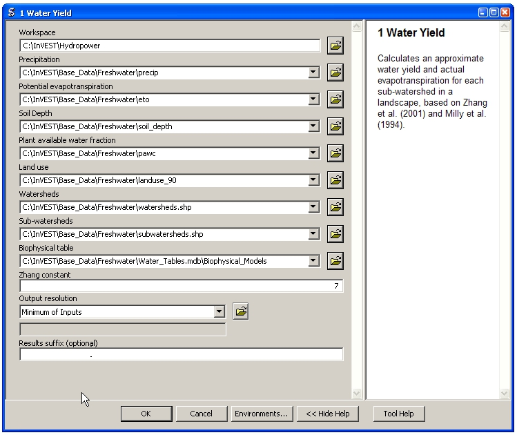
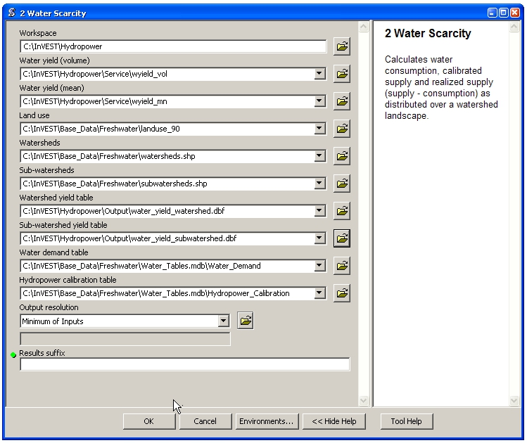
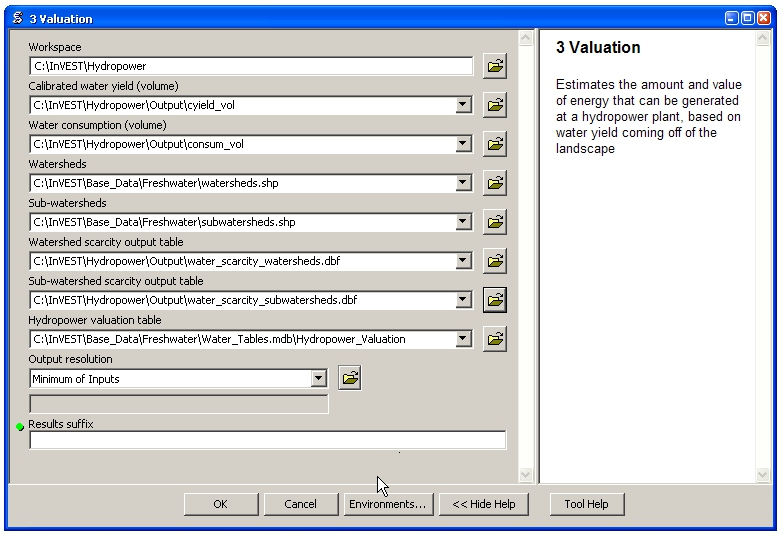

.. _reservoirhydropowerproduction:

.. |addbutt| image:: ./shared_images/addbutt.png
             :alt: add
	     :align: middle 
	     :height: 15px

.. |toolbox| image:: ./shared_images/toolbox.jpg
             :alt: toolbox
	     :align: middle 
	     :height: 15px

*******************************
Reservoir Hydropower Production
*******************************

Summary
=======

.. figure:: ./reservoirhydropowerproduction_images/waterfall.png
   :align: right
   :figwidth: 200pt

Hydropower accounts for twenty percent of worldwide energy production, most of which is generated by reservoir systems. InVEST estimates the annual average quantity and value of hydropower produced by reservoirs, and identifies how much water yield or value each part of the landscape contributes annually to hydropower production. The model has three components: water yield, water consumption, and hydropower valuation. The first two components use data on average annual precipitation, annual reference evapotranspiration and a correction factor for vegetation type, root restricting layer depth, plant available water content, land use and land cover, root depth, elevation, saturated hydraulic conductivity, and consumptive water use. The valuation model uses data on hydropower market value and production costs, the remaining lifetime of the reservoir, and a discount rate. The biophysical models do not consider surface -- ground water interactions or the temporal dimension of water supply. The valuation model assumes that energy pricing is static over time.

Introduction
============

The provision of fresh water is an environmental service that contributes to the welfare of society in many ways, including through the production of hydropower, the most widely used form of renewable energy in the world. Most hydropower production comes from watershed-fed reservoir systems that generally deliver energy consistently and predictably. The systems are designed to account for annual variability in water volume, given the likely levels for a given watershed, but are vulnerable to extreme variation caused by land use and land cover (LULC) changes. LULC changes can alter hydrologic cycles, affecting patterns of evapotranspiration, infiltration and water retention, and changing the timing and volume of water that is available for hydropower production (World Commission on Dams 2000; Ennaanay 2006).

Changes in the landscape that affect annual average water yield upstream of hydropower facilities can increase or decrease hydropower production capacity. Maps of where water yield used for hydropower is produced can help avoid unintended impacts on hydropower production or help direct land use decisions that wish to maintain power production, while balancing other uses such as conservation or agriculture. Such maps can also be used to inform investments in restoration or management that downstream stakeholders, such as hydropower companies, make in hopes of improving or maintaining water yield for this important environmental service. In large watersheds with multiple reservoirs for hydropower production, areas upstream of power plants that sell to a higher value market will have a higher value for this service. Maps of how much value each parcel contributes to hydropower production can help managers avoid developments in the highest hydropower value areas, understand how much value will be lost or gained as a consequence of different management options, or identify which hydropower producers have the largest stake in maintaining water yield across a landscape.

Reservoir Hydropower Production 3.0 Beta
----------------------------------------

We are working on the next generation platform of InVEST and deploying parts of it as prototype InVEST models. Reservoid Hydropower Production has a 3.0 prototype which can be found in the Windows Start menu after the InVEST installation is complete.  New features to the 3.0 version include:

+ Large performance improvements to the runtime of the model.
+ Outputs are simplified into shapefile polygons rather than rasterized polygons.  Generally the raster outputs of the ArcGIS versions of the models have a field in a shapefile that corresponds to that output.
+ The ArcGIS model is run in 3 separate steps.  The standalone model has a streamlined interface to run in a single step.

The Model
=========

The InVEST Reservoir Hydropower model estimates the relative contributions of water from different parts of a landscape, offering insight into how changes in land use patterns affect annual surface water yield and hydropower production.

Modeling the connections between landscape changes and hydrologic processes is not simple. Sophisticated models of these connections and associated processes (such as the WEAP model) are resource and data intensive and require substantial expertise. To accommodate more contexts, for which data is readily available, InVEST maps and models the annual average water yield from a landscape used for hydropower production, rather than directly addressing the affect of LULC changes on hydropower failure as this process is closely linked to variation in water inflow on a daily to monthly timescale. Instead, InVEST calculates the relative contribution of each land parcel to annual average hydropower production and the value of this contribution in terms of energy production. The net present value of hydropower production over the life of the reservoir also can be calculated by summing discounted annual revenues.

How it works
------------

The model runs on a gridded map. It estimates the quantity and value of water used for hydropower production from each sub-basin in the area of interest. It has three components, which run sequentially. First, it determines the amount of water running off each pixel as the precipitation less the fraction of the water that undergoes evapotranspiration. The model does not differentiate between surface, subsurface and baseflow, but assumes that all water yield from a pixel reaches the point of interest via one of these pathways. This model then sums and averages water yield to the sub-basin level. The pixel-scale calculations allow us to represent the heterogeneity of key driving factors in water yield such as soil type, precipitation, vegetation type, etc. However, the theory we are using as the foundation of this set of models was developed at the sub-watershed to watershed scale. We are only confident in the interpretation of these models at the sub-watershed scale, so all outputs are summed and/or averaged to the sub-basin scale. We do continue to provide pixel-scale representations of some outputs for calibration and model-checking purposes only. **These pixel-scale maps are not to be interpreted for understanding of hydrological processes or to inform decision making of any kind.**

Second, beyond annual average runoff, it calculates the proportion of surface water that is used for hydropower production by subtracting the surface water that is consumed for other uses. Third, it estimates the energy produced by the water reaching the hydropower reservoir and the value of this energy over the reservoir's lifetime.

Water Yield Model
^^^^^^^^^^^^^^^^^

The water yield model is based on the Budyko curve and annual average precipitation. First, we determine annual water yield :math:`Y_xj` for each pixel on the landscape (indexed by x = 1,2,...,X) as follows:

.. math:: Y_{xj} = \left(1-\frac{AET_{xj}}{P_x}\right)\cdot P_x

where, :math:`AET_xj` is the annual actual evapotranspiration on pixel :math:`x` with LULC :math:`j` and :math:`P_x` is the annual precipitation on pixel :math:`x`. 

.. figure:: ./reservoirhydropowerproduction_images/watercycle.png
   :align: center

Figure 1. Conceptual diagram of the water balance model used in the hydropower production model. The water cycle is simplified, including only the parameters shown in color, and ignoring the parameters shown in gray. Yield, as calculated by this step of the model, is then adjusted for other consumptive uses and applied to hydropower energy and value estimates.

The evapotranspiration partition of the water balance, :math:`\frac{AET_{xj}}{P_x}`\ , is an approximation of the Budyko curve developed by Zhang et al. (2001):

.. math:: \frac{AET_{xj}}{P_x} = \frac{1+\omega_xR_{xj}}{1+\omega_xR_{xj}+\frac{1}{R_{xj}}}

where, :math:`R_{xj}` is the dimensionless Budyko Dryness index on pixel :math:`x` with LULC :math:`j`, defined as the ratio of potential evapotranspiration to precipitation (Budyko 1974) and :math:`\omega_x`  is a modified dimensionless ratio of plant accessible water storage to expected precipitation during the year. As defined by Zhang et al. (2001), :math:`\omega_x` is a non-physical parameter to characterize the natural climatic-soil properties.

.. math:: \omega_x = Z\frac{AWC_x}{P_x}

where :math:`AWC_x` is the volumetric (mm) plant available water content. The soil texture and effective rooting depth define :math:`AWC_x`, which establishes the amount of water that can be held and released in the soil for use by a plant, estimated as the product of the difference between field capacity and wilting point and the minimum of root restricting layer depth and vegetation rooting depth. Root restricting layer depth is the soil depth at which root penetration is strongly inhibited because of physical or chemical characteristics. Vegetation rooting depth is often given as the depth at which 95% of a vegetation type's root biomass occurs. :math:`Z` is a seasonality factor that presents the seasonal rainfall distribution and rainfall depths. In areas of winter rains, we expect to have :math:`Z` on the order of 10, in humid areas with rain events distributed throughout the year or regions with summer rains the :math:`Z` is on the order of 1. While we calculate :math:`\omega_x`, in some cases specific biome values already exist based on water availability and soil-water storage (Milly 1994, Potter et al. 2005, Donohue et al.  2007).

Finally, we define the Budyko dryness index, where :math:`R_{xj}` values that are greater than one denote pixels that are potentially arid (Budyko 1974), as follows:

.. math:: R_{xj} = \frac{Kc_{xj}\cdot ETo_x}{P_x}
			 					
where, :math:`ETo_x` is the reference evapotranspiration from pixel :math:`x` and :math:`Kc_{xj}` is the plant (vegetation) evapotranspiration coefficient associated with the LULC :math:`j` on pixel :math:`x`. :math:`ETo_x` reflects local climatic conditions, based on the evapotranspiration of a reference vegetation such as grass of alfalfa grown at that location. :math:`Kc_{xj}` is largely determined by the vegetative characteristics of the land use/land cover found on that pixel (Allen et al. 1998). Kc adjusts the ETo values to the crop or vegetation type in each pixel of the land use/land cover map. Kc adjusts the ETo values to the crop or vegetation type in each pixel of the land use/land cover map, and is then used to estimate actual ET (AET) for the watershed, one of the model outputs.

The water yield model script generates and outputs the total and average water yield at the sub-basin level.

Water Scarcity Model
^^^^^^^^^^^^^^^^^^^^

The Water Scarcity Model calculates the water scarcity value based on water yield and water consumptive use in the watershed(s) of interest. The user inputs how much water is consumed by each land use land cover type in a table format. For example, in an urban area, consumptive use can be calculated as the product of population density and per capita consumptive use.  These land use-based values only relate to the consumptive portion of demand; some water use is non-consumptive such water used for cooling or other industrial processes that return water to the stream after use. For simplicity, each pixel in the watershed is either a "contributing" pixel, which contributes to hydropower production, or a "use" pixel, which uses water for other consumptive uses. This assumption implies that land use associated with consumptive uses will not contribute any yield for downstream use. The amount of water that actually reaches the reservoir for dam :math:`d` (realized supply) is defined as the difference between total water yield from the watershed and total consumptive use in the watershed.

.. math:: V_{in} = Y-u_d

where :math:`u_d` is the total volume of water consumed in the watershed upstream of dam :math:`d` and :math:`Y` is the total water yield from the watershed upstream of dam :math:`d`.

If the user has observed data available on actual annual inflow rates to the reservoir for dam :math:`d`, they can be compared to :math:`V_{in}`. Divide the observed value by the estimated value to derive a calibration constant. This can then be entered in to the hydropower calibration table and used to make power and value estimates actual rather than relative.

Hydropower Production and Valuation Model
^^^^^^^^^^^^^^^^^^^^^^^^^^^^^^^^^^^^^^^^^

The reservoir hydropower model estimates both the amount of energy produced given the estimated realized supply of water for hydropower production and the value of that energy. A present value dollar (or other currency) estimate is given for the entire remaining lifetime of the reservoir. Net present value can be calculated if hydropower production cost data are available. The energy produced and the revenue is then redistributed over the landscape based on the proportional contribution of each sub-watershed to energy production. Final output maps show how much energy production and hydropower value can be attributed to each sub-watershed's water yield over the lifetime of the reservoir.

At dam :math:`d`, power is calculated using the following equation:

.. math:: p_d = \rho\cdot q_d \cdot g \cdot h_d
 		

where :math:`p_d` is power in watts, :math:`\rho` is the water density (1000 Kg/m\ :sup:`3`\ ), :math:`q_d` is the flow rate (m\ :sup:`3`\ /s), :math:`g` is the gravity constant (9.81 m/s\ :sup:`2`\ ), and :math:`h_d` is the water height behind the dam at the turbine (m).  In this model, we assume that the total annual inflow water volume is released equally and continuously over the course of each year.

The power production equation is connected to the water yield model by converting the annual inflow volume adjusted for consumption (:math:`V_{in}`) to a per second rate. Since electric energy is normally measured in kilowatt-hours, the power :math:`p_d` is multiplied by the number of hours in a year.  All hydropower reservoirs are built to produce a maximum amount of electricity. This is called the energy production rating, and represents how much energy could be produced if the turbines are 100% efficient and all water that enters the reservoir is used for power production. In the real world, turbines have inefficiencies and water in the reservoir may be extracted for other uses like irrigation, retained in the reservoir for other uses like recreation, or released from the reservoir for non-power production uses like maintaining environmental flows downstream. To account for these inefficiencies and the flow rate and power unit adjustments, annual average energy production :math:`\varepsilon_d`  at dam :math:`d` is calculated as follows:

.. math:: \varepsilon_d= 0.00272\cdot \beta \cdot \gamma_d \cdot h_d \cdot V_{in}
 
where :math:`\varepsilon_d` is hydropower energy production (KWH), :math:`\beta` is the turbine efficiency coefficient (%), :math:`\gamma_d`  is the percent of inflow water volume to the reservoir at dam :math:`d` that will be used to generate energy.

To convert :math:`\varepsilon_d`, the annual energy generated by dam :math:`d`, into a net present value (NPV) of energy produced (point of use value) we use the following,

.. math:: NPVH_d=(p_e\varepsilon_d-TC_d)\times \sum^{T-1}_{t=0}\frac{1}{(1+r)^t}

where :math:`TC_d` is the total annual operating costs for dam :math:`d`, :math:`p_e` is the market value of electricity (per unit of energy consumed) provided by hydropower plant at dam :math:`d`, :math:`T_d` indicates the number of years present landscape conditions are expected to persist or the expected remaining lifetime of the station at dam :math:`d` (set :math:`T` to the smallest value if the two time values differ), and :math:`r` is the market discount rate. The form of the equation above assumes that :math:`TC_d`, :math:`p_e`, and :math:`\varepsilon_d`, are constant over time.

Energy production over the lifetime of dam :math:`d` is attributed to each sub-watershed as follows:

.. math:: \varepsilon_x = (T_d\varepsilon_d)\times(c_x / c_{tot})

where the first term in parentheses represents the electricity production over the lifetime of dam :math:`d`. The second term represents the proportion of water volume used for hydropower production that comes from sub-watershed :math:`x` relative to the total water volume for the whole watershed. The value of each sub-watershed for hydropower production over the lifetime of dam :math:`d` is calculated similarly:

.. math:: NPVH_x=NPVH_d\times (c_x/c_{tot})

Limitations and simplifications
^^^^^^^^^^^^^^^^^^^^^^^^^^^^^^^

The model has a number of limitations. First, it is not intended for devising detailed water plans, but rather for evaluating how and where changes in a watershed may affect hydropower production for reservoir systems.  It is based on annual averages, which neglect extremes and do not consider the temporal dimensions of water supply and hydropower production.

Second, the model assumes that all water produced in a watershed in excess of evapotranspiration arrives at the watershed outlet, without considering water capture by means other than primary human consumptive uses. Surface water -- ground water interactions are entirely neglected, which may be a cause for error especially in areas of karst geology. The relative contribution of yield from various parts of the watershed should still be valid.

Third, the model does not consider sub-annual patterns of water delivery timing. Water yield is a provisioning function, but hydropower benefits are also affected by flow regulation. The timing of peak flows and delivery of minimum operational flows throughout the year determines the rate of hydropower production and annual revenue. Changes in landscape scenarios are more likely to affect the timing of flows than the annual water yield, and are more of a concern when considering drivers such as climate change. Modeling the temporal patterns of overland flow requires detailed data that are not appropriate for our approach. Still, this model provides a useful initial assessment of how landscape scenarios may affect the annual delivery of water to hydropower production.

Fourth, the model describes consumptive demand by LULC type. In reality, water demand may differ greatly between parcels of the same LULC class. Much of the water demand may also come from large point source intakes, which are not represented by LULC class.  The model simplifies water demand by distributing it over the landscape. For example, the water demand may be large for an urban area, and the model represents this demand by distributing it over the urban LULC class. The actual water supply intake, however, is likely much further upstream in a rural location. Spatial disparity in actual and modeled demand points may cause an incorrect representation in the scarcity output grid. The distribution of consumption is also simplified in the reallocation of energy production and hydropower value since it is assumed that water consumed along flow paths is drawn equally from every pixel upstream. As a result, water scarcity, energy production patterns, and hydropower values may be incorrectly estimated.

Fifth, a single variable (:math:`\gamma_d`) is used to represent multiple aspects of water resource allocation, which may misrepresent the complex distribution of water among uses and over time.

Finally, the model assumes that hydropower production and pricing remain constant over time. It does not account for seasonal variation in energy production or fluctuations in energy pricing, which may affect the value of hydropower. Even if sub-annual production or energy prices change, however, the relative value between parcels of land in the same drainage area should be accurate.

Data needs
==========

Here we outline the specific data used by the model. See the appendix for detailed information on data sources and pre-processing.  For all raster inputs, the projection used should be defined, and the projection's linear units should be in meters.

1. **Root restricting layer depth (required).** A GIS raster dataset with an average root restricting layer depth value for each cell. Root restricting layer depth is the soil depth at which root penetration is strongly inhibited because of physical or chemical characteristics. The root restricting layer depth values should be in millimeters.

 *Name*: File can be named anything, but no spaces in the name and less than 13 characters

 *Format*: Standard GIS raster file (e.g., ESRI GRID or IMG), with an average root restricting layer depth in millimeters for each cell.

 *Sample data set*: \\InVEST\\Base_Data\\Freshwater\\soil_depth

2. **Precipitation (required)**. A GIS raster dataset with a non-zero value for average annual precipitation for each cell.  The precipitation values should be in millimeters.

 *Name*: File can be named anything, but no spaces in the name and less than 13 characters

 *Format*: Standard GIS raster file (e.g., ESRI GRID or IMG), with precipitation values for each cell.

 *Sample data set*: \\InVEST\\Base_Data\\Freshwater\\precip

3. **Plant Available Water Content (required)**. A GIS raster dataset with a plant available water content value for each cell.  Plant Available Water Content fraction (PAWC) is the fraction of water that can be stored in the soil profile that is available for plants' use. PAWC is a fraction from 0 to 1.

 *Name:* File can be named anything, but no spaces in the name and less than 13 characters

 *Format:* Standard GIS raster file (e.g., ESRI GRID or IMG), with available water content values for each cell.

 *Sample data set:* \\InVEST\\Base_Data\\Freshwater\\pawc

4. **Average Annual Reference Evapotranspiration (required).** A GIS raster dataset, with an annual average evapotranspiration value for each cell. Reference evapotranspiration is the potential loss of water from soil by both evaporation from the soil and transpiration by healthy alfalfa (or grass) if sufficient water is available.  The reference evapotranspiration values should be in millimeters.

 *Name:* File can be named anything, but no spaces in the name and less than 13 characters

 *Format:* Standard GIS raster file (e.g., ESRI GRID or IMG), with reference evapotranspiration values for each cell.

 *Sample data set:* \\InVEST\\Base_Data\\Freshwater\\eto

5. **Land use/land cover (required)**. A GIS raster dataset, with an LULC code for each cell.  The LULC code should be an integer.

 *Name:* File can be named anything, but no spaces in the name and less than 13 characters

 *Format:* Standard GIS raster file (e.g., ESRI GRID or IMG), with an integer LULC class code for each cell (e.g., 1 for forest, 3 for grassland, etc.). These codes must match LULC codes in the Biophysical  table.

 *Sample data set:* \\InVEST\\Base_Data\\Freshwater\\landuse_90

6. **Watersheds (required)**. A shapefile, with one polygon per watershed. This is a layer of watersheds such that each watershed contributes to a point of interest where hydropower production will be analyzed.  See the Working with the DEM section for information about generating watersheds.

 *Name:* File can be named anything, but no spaces in the name

 *Format:* Shapefile (.shp)

 *Rows:* Each row is one watershed

 *Columns:* An integer field named *ws_id* is required, with a unique integer value for each watershed

 *Sample data set:* \\InVEST\\Base_Data\\Freshwater\\watersheds.shp

7. **Sub-watersheds (required)**. A  shapefile, with one polygon per sub-watershed within the main watersheds specified in the Watersheds shapefile. See the Working with the DEM section for information about generating sub-watersheds.

 *Format:* Shapefile (.shp)

 *Rows:* Each row is one sub-watershed

 *Columns:* An integer field named *subws_id* is required, with a unique integer value for each sub-watershed

 *Sample data set:* \\InVEST\\ Base_Data\\Freshwater\\subwatersheds.shp

8. **Biophysical Table (required)**. A table of land use/land cover (LULC) classes, containing data on biophysical coefficients used in this tool. NOTE: these data are attributes of each LULC class rather than attributes of individual cells in the raster map.

 *Sample data set:* \\InVEST\\Base_Data\\Freshwater\\Water_Tables.mdb\\Biophysical_Models

 *Name:* Table names should only have letters, numbers and underscores, no spaces

 *Format:*  ``*``.dbf or ``*``.mdb for ArcGIS models, the standalone model requires a .csv file

 *Rows:* Each row is an LULC class.

 *Columns:* Each column contains a different attribute of each land use/land cover class, and must be named as follows:

 a. *lucode (Land use code)*: Unique integer for each LULC class (e.g., 1 for forest, 3 for grassland, etc.), must match the LULC raster above.

 b. *LULC_desc*: Descriptive name of land use/land cover class (optional)
 
 c. *LULC_cat*: Contains one of the following four categories: "water", "wetlands", "built", and "veg". Both standing and flowing water bodies should be assigned to the "water" category. Urban and paved areas should be assigned to built. All areas that are not water, wetland or built should be assigned to "veg". This is used to determine which function is used to calculate AET.

 d. *root_depth*: The maximum root depth for vegetated land use classes, given in integer millimeters. This is often given as the depth at which 95% of a vegetation type's root biomass occurs. We apply different equations for a few special cases where the generic Budyko curve approach is not appropriate. In these cases, the rooting depth should be set to NA. 

 e. *Kc*: The plant evapotranspiration coefficient for each LULC class, used to obtain potential evapotranspiration by using plant energy/transpiration characteristics to modify the reference evapotranspiration, which is based on alfalfa.  Coefficients should be multiplied by 1000, so that the final Kc values given in the table are integers ranging between 1 and 1500. (Some crops evapotranspire more than alfalfa in some very wet tropical regions and where water is always available).

9. **seasonality factor (Z) (required).** Floating point value on the order of 1 to 10 corresponding to the seasonal distribution of precipitation (see Appendix A for more information).

10. **Demand Table (required)**.  A table of LULC classes, showing consumptive water use for each landuse / landcover type.  Consumptive water use is that part of water used that is incorporated into products or crops, consumed by humans or livestock, or otherwise removed from the watershed water balance.

 *Sample data set:* \\InVEST\\Base_Data\\Freshwater\\Water_Tables.mdb\\Water_Demand

 *Name:*  Table names should only have letters, numbers and underscores, no spaces

 *Format:*  ``*``.dbf or ``*``.mdb

 *Rows:*  Each row is a landuse / landcover class

 *Columns:* Contain water demand values per LULC class and must be named as follows:

 a.	*lucode*: Integer value of land use/land cover class (e.g., 1 for forest, 3 for grassland, etc.), must match LULC raster, described above.

 b.	*demand*: The estimated average consumptive water use for each landuse / landcover type.  Water use should be given in cubic meters per year for a pixel in the land use/land cover map.  Note that accounting for pixel area is important since larger areas will consume more water for the same land cover type.

11. **Hydropower valuation table**.  A table of hydropower stations with associated model values.

 *Sample data set:* \\InVEST\\Base_Data\\Freshwater\\Water_Tables.mdb\\Hydropower_Valuation

 *Name:*  Table names should only have letters, numbers and underscores, no spaces

 *Format:*  ``*``.dbf or ``*``.mdb

 *Rows:*  Each row is a hydropower station

 *Columns:*  Each column contains an attribute of each hydropower station, and must be named as follows:

 a. *ws_id*: Unique integer value for each watershed, which must correspond to values in the Watersheds layer.

 b. *station_desc*: Name of hydropower station (optional)

 c. *efficiency*: The turbine efficiency. A number to be obtained from the hydropower plant manager (floating point values generally 0.7 to 0.9)

 d. *fraction*: The fraction of inflow water volume that is used to generate energy, to be obtained from the hydropower plant manager. Managers can release water without generating electricity to satisfy irrigation, drinking water or environmental demands.   Floating point value.

 e. *height*: The head, measured as the average annual effective height of water behind each dam at the turbine intake in meters.  Floating point value.

 f. *kw_price*: The price of one kilowatt-hour of power produced by the station, in dollars or other currency.  Floating point value.

 g. *cost*: Annual cost of running the hydropower station (maintenance and operations costs).  Floating point value.

 h. *time_span*: An integer value of either the expected lifespan of the hydropower station or the period of time of the land use scenario of interest. Used in net present value calculations.

 i. *discount*: The discount rate over the time span, used in net present value calculations.  Floating point value.

12. **Hydropower calibration table**.  A table of hydropower stations with associated calibration values.

 *Sample data set:* \\InVEST\\Base_Data\\Freshwater\\Water_Tables.mdb\\Hydropower_Calibration

 *Name:*  Table names should only have letters, numbers and underscores, no spaces

 *Format:*  ``*``.dbf or ``*``.mdb

 *Rows:*  Each row is a hydropower station

 *Columns:*  Each column contains an attribute of each hydropower station, and must be named as follows:

 a. *ws_id*: Unique integer value for each watershed, which must correspond to values in the Watersheds layer.

 b. *calib*: Annual water yield calibration constant.  Multiplying this value by the total water supply for a watershed should give the actual total annual water supply observed/measured at the point of interest, corresponding to the cyield column of the Scarcity tool's water_scarcity.dbf output. Floating point value.

Running the Model
=================

The Hydropower model maps the water yield, water consumption, energy produced by water yield and corresponding energy value over the landscape. This model is structured as a toolkit which has three tools. The first tool, Water Yield, calculates the surface water yield and actual evapotranspiration across the landscape.  This output feeds into the next portion of the model, the Water Scarcity tool, which calculates water consumption, supply and realized supply, which is yield minus consumption.  The third tool, Valuation, calculates energy production and the value of that energy, as it can be attributed to sub-basins on the watershed of interest.

By running the tool, three folders will automatically be created in your workspace (you will have the opportunity to define this file path), "Intermediate", where temporary files are written, and which is deleted after each tool run; "Service", where results that show environmental services are saved; and "Output", where non-service biophysical results are saved. Before running the Hydropower Model, make sure that the InVEST toolbox has been added to your ArcMap document, as described in the **Getting Started** chapter of this manual. Second, make sure that you have prepared the required input data files according to the specifications in Data Needs.

*	 Identify workspace

If you are using your own data, you need to first create a workspace, or folder for the analysis data, on your computer hard-drive. The entire pathname to the workspace should not have any spaces. All your output files will be saved here. For simplicity, you may wish to call the folder for your workspace 'Hydropower' and create a folder in your workspace called "Input" and place all your input files here. It's not necessary to place input files in the workspace, but advisable so you can easily see the data you use to run your model.

Or, if this is your first time using the tool and you wish to use sample data, you can use the data provided in InVEST-Setup.exe. If you installed the InVEST files on your C drive (as described in the **Getting Started** chapter), you should see a folder called /InVEST/Hydropower. This folder will be your workspace. The input files are in a folder called /InVEST/Base_Data/Freshwater.

*	Open an ArcMap document to run your model.

*	Find the InVEST toolbox in ArcToolbox. ArcToolbox is normally open in ArcMap, but if it is not, click on the ArcToolbox symbol. See the **Getting Started** chapter if you don't see the InVEST toolbox and need instructions on how to add it.

*	You can run this analysis without adding data to your map view, but usually it is recommended to view your data first and get to know them. Add the data for this analysis to your map using the ADD DATA button and look at each file to make sure it is formatted correctly.  Save your ArcMap file as needed.

*	Click once on the plus sign on the left side of the InVEST toolbox to see the list of tools expand. Next, click on the plus sign next to the **Hydropower** toolset. Within the toolset are three tools, **Water Yield**, **Water Scarcity** and **Valuation**. You will need to run **Water Yield** first, **Water Scarcity** second and **Valuation** last, as each tool generates outputs that feed into the next.

*	Double click on **Water Yield**. An interface will pop up like the one below. The tool shows default file names, but you can use the file buttons to browse instead to your own data. When you place your cursor in each space, you can read a description of the data requirements in the right side of the interface. Click *Show Help* if the description is not displayed. In addition, refer to the *Data Needs* section above for information on data formats.

*	Fill in data file names and values for all required prompts. Unless the space is indicated as optional, it requires you to enter some data.

*	After you've entered all values as required, click on OK. The script will run, and its progress will be indicated by a "Progress dialogue".

*	Load the output grids into ArcMap using the ADD DATA button from either "Output" or "Service" folders.

*	You can change the symbology of a layer by right-clicking on the layer name in the table of contents, selecting PROPERTIES, and then SYMBOLOGY. There are many options here to change the way the file appears in the map. You may change the coloring scheme for better visualization.

*	You can also view the attribute data of many output files by right clicking on a layer and selecting OPEN ATTRIBUTE TABLE.

*	Now, run the tool **Water Scarcity**.  Several outputs from the Water Yield model, **wyield_vol**, **wyield_mn** (in the Service folder), **water_yield_watershed.dbf** and **water_yield_subwatershed.dbf** (in the Output folder) serve as  inputs to this model (see results interpretation section).  The interface is below:

*	When the script completes running, its results will be saved in the Output folder. A description of these results is in the next section. Load them into your ArcMap project, look at them, and check out the attribute table.

*	Finally, run the tool **Valuation**. These outputs from  the Water Scarcity tool are required: **cyield_vol**, **consum_vol**, **water_scarcity_watershed.dbf** and **water_scarcity_subwatershed.dbf**.  The interface is below:

*	When the script completes running, its results will be saved in the Service folder. A description of these results is in the next section. Load them into your ArcMap project, look at them, and check out the attribute table.

This model is open source, so you can edit the scripts to modify, update, and/or change equations by right clicking on the script's name and selecting "Edit..." The script will open in a text editor. After making changes, click File/Save to save your new script.

Interpreting Results
====================

The following is a short description of each of the outputs from the Hydropower Production model. Final results are found in the *Output* and *Service* folders within the *Workspace* specified for this model.

* **Parameter log**: Each time the model is run, a text (.txt) file will appear in the *Output* folder. The file will list the parameter values for that run and will be named according to the service, the date and time, and the suffix. 

* **Output\\fractp_mn** (fraction):  Mean actual evapotranspiration  fraction of precipitation per sub-watershed (Actual Evapotranspiration / Precipitation). It is the mean fraction of precipitation that actually evapotranspires at the sub-basin level.  (*this output is removed in the standalone model in favor of a shapefile output*)

* **Output\\aet_mn** (mm): Mean actual evapotranspiration per sub-watershed. (*this output is removed in the standalone model in favor of a shapefile output*)

* **Service\\wyield_vol** (m\ :sup:`3`\):  Total water yield per sub-watershed.  The approximate absolute annual water yield across the landscape, calculated as the difference between precipitation and actual evapotranspiration on each land parcel. (*this output is removed in the standalone model in favor of a shapefile output*)

* **Service\\wyield_mn** (mm): Mean water yield per sub-watershed. (*this output is removed in the standalone model in favor of a shapefile output*)

* **Service\\wyield_ha** (m\ :sup:`3`\ /ha): Water yield volume per hectare per sub-watershed. (*this output is removed in the standalone model in favor of a shapefile output*)

* **Output\\water_yield_watershed.dbf**: Table containing biophysical output values per watershed.  (*in the 3.0 version of this model, the output is a CSV file*) With fields as follows:

	* *precip_mn* (mm): Mean precipitation per pixel on the watershed.
	
	* *PET_mn* (mm): Mean potential evapotranspiration per pixel on the watershed.
	
	* *AET_mn* (mm): Mean actual evapotranspiration per pixel on the watershed.
	
	* *wyield_mn* (mm): Mean water yield per pixel on the watershed.

	* *wyield_vol* (m\ :sup:`3`\): Volume of water yield in the watershed.
	
* **Output\\water_yield_subwatershed.dbf**: Table containing biophysical output values per sub-watershed if a sub-watershed shapefile is provided.  (*in the 3.0 version of this model, the output is a CSV file*)  With fields as follows:

	* *precip_mn* (mm): Mean precipitation per pixel on the sub-watershed.
	
	* *PET_mn* (mm): Mean potential evapotranspiration per pixel on the sub-watershed.
	
	* *AET_mn* (mm): Mean actual evapotranspiration per pixel on the sub-watershed.
	
	* *wyield_mn* (mm): Mean water yield per pixel on the sub-watershed.

	* *wyield_vol* (m\ :sup:`3`\): Volume of water yield in the sub-watershed.
	
* **Output\\consum_vol** (m\ :sup:`3`\): Total water consumption for each sub-watershed.  (*this output is removed in the standalone model in favor of a shapefile output*)

* **Output\\consum_mn** (m\ :sup:`3`\ /ha): Mean water consumptive volume per hectare per sub-watershed. (*this output is removed in the standalone model in favor of a shapefile output*)

* **Output\\rsup_vol** (m\ :sup:`3`\):  Total realized water supply (water yield -- consumption) volume for each sub-watershed. (*this output is removed in the standalone model in favor of a shapefile output*)

* **Output\\rsup_mn** (m\ :sup:`3`\ /ha):  Mean realized water supply (water yield -- consumption) volume per hectare per sub-watershed. (*this output is removed in the standalone model in favor of a shapefile output*)

* **Output\\cyield_vol** (m\ :sup:`3`\): Calibrated water yield volume per sub-watershed (water yield * calibration constant).  (*this output is removed in the standalone model in favor of a shapefile output*)

* **Output\\water_scarcity_watershed.dbf**:  Table containing values from *water_yield_watershed.dbf*, plus additional fields as follows (*in the 3.0 version of this model, the output is a CSV file*):

	* *cyield_vl* (m\ :sup:`3`\ ): Total calibrated water yield (water yield * calibration constant) per watershed.
	
	* *consump_vl* (m\ :sup:`3`\ ): Total water consumption per watershed.
	
	* *consump_mn* (m\ :sup:`3`\ ): Mean water consumption per watershed.
	
	* *rsupply_vl* (m\ :sup:`3`\ ): Total realized water supply (water yield -- consumption) per watershed.
	
	* *rsupply_mn* (m\ :sup:`3`\ ): Mean realized water supply (water yield -- consumption) per watershed.

* **Output\\water_scarcity_subwatershed.dbf**:  Table containing values from *water_yield_subwatershed.dbf*, plus additional fields as follows (*in the 3.0 version of this model, the output is a CSV file*):

	* *cyield_vl* (m\ :sup:`3`\ ): Total calibrated water yield (water yield * calibration constant) per sub-watershed.
	
	* *consump_vl* (m\ :sup:`3`\ ): Total water consumption per sub-watershed.
	
	* *consump_mn* (m\ :sup:`3`\ ): Mean water consumption per sub-watershed.
	
	* *rsupply_vl* (m\ :sup:`3`\ ): Total realized water supply (water yield -- consumption) per sub-watershed.
	
	* *rsupply_mn* (m\ :sup:`3`\ ): Mean realized water supply (water yield -- consumption) per sub-watershed.

* **Service\\hp_energy** (kw/timespan): THIS IS THE SUB-WATERSHED MAP OF THIS ENVIRONMENTAL SERVICE IN ENERGY PRODUCTION TERMS. This grid shows the amount of energy produced by the hydropower station over the specified timespan that can be attributed to each sub-watershed based on its water yield contribution.  (*this output is removed in the standalone model in favor of a shapefile output*)

* **Service\\hp_val** (currency/timespan):  THIS IS THE SUB-WATERSHED MAP OF THIS ENVIRONMENTAL SERVICE IN ECONOMIC TERMS. This grid shows the value of the landscape per sub-watershed according to its ability to yield water for hydropower production over the specified timespan.  (*this output is removed in the standalone model in favor of a shapefile output*)

* **Service\\hydropower_value_watershed.dbf**:  Table containing values from *water_scarcity_watershed.dbf*, plus additional fields as follows (*in the 3.0 version of this model, the output is a CSV file*):

	* *hp_energy* (kw/timespan): Amount of energy produced over the specified timespan per watershed.
	
	* *hp_value* (currency/timespan): Value of the watershed landscape for producing energy over the specified timespan.

* **Service\\hydropower_value_subwatershed.dbf**:  Table containing values from *water_scarcity_subwatershed.dbf*, plus additional fields as follows (*in the 3.0 version of this model, the output is a CSV file*):

	* *hp_energy* (kw/timespan): Amount of energy produced over the specified timespan per sub-watershed.
	
	* *hp_value* (currency/timespan): Value of the sub-watershed landscape for producing energy over the specified timespan.

* *(3.0 only)* **Output\\wyield_sub_sheds.shp**, **Output\\wyield_sheds.shp**, **Output\\scarcity_sub_sheds.shp**, **Output\\scarcity_sheds.shp**, **Output\\valuation_sub_sheds.shp**, **Output\\valuation_sheds.shp**: These files are shapefile equivalents of the pixel outputs from the ArcGIS models above, but rather than rasterizing the results, users can symbolize the polygons directly thus simplifying data management and storage space.

The application of these results depends entirely on the objective of the modeling effort.  Users may be interested in all of these results or a select one or two.  If costing information is not available or of interest, the user may choose to simply run the water yield model and compare biophysical results.

The first several model results provide insight into how water is distributed through the landscape.  *aet_mn* describes the actual evapotranspiration depth of the hydrologic cycle, showing how much water (precipitation) is lost annually to evapotranspiration across the watershed.

The *wyield_vol* raster shows the annual average water volume that is 'yielded' from each sub-watershed of the watershed of interest.  This raster can be used to determine which sub-watersheds are most important to total annual water yield -- although at this step the user still will not know how much of that water is benefiting downstream users of any type.  The consumptive use (*consum_vol*) grid then shows how much water is used for consumptive activities (such as drinking, bottling, etc.) each year across the landscape. The realized supply (*rsupply_vol*) grid calculates the difference between cumulative water yield and cumulative consumptive use.  This grid demonstrates where the water supply for hydropower production is abundant and where it is most scarce.  The user needs to remember that the consumptive use grid may not truly represent where water is taken, only where it is demanded.  This may cause some misrepresentation of the scarcity in certain locations, but this grid offers a general sense of the water balance and whether there is a lack of or abundance of water in the area of interest.

The *hp_energy* and *hp_val* grids are the most relevant model outputs for prioritizing the landscape for investments that wish to maintain water yield for hydropower production.  The *hp_val* grid contains the most information for this purpose as it represents the revenue attributable to each sub-watershed over the expected lifetime of the hydropower station, or the number of years that the user has chosen to model.  This grid accounts for the fact that different hydropower stations within a large river basin may have different customers who pay different rates for energy production. If this is the case, this grid will show which sub-watersheds contribute the highest value water for energy production. If energy values do not vary much across the landscape, the *hp_energy* outputs can be just as useful in planning and prioritization. Comparing any of these grids between landuse scenarios allows the user to understand how the role of the landscape may change under different management plans.

The hydropower output summary tables present the model results in terms of hydropower operation.  The *cyield_vl* field provides the total volume of water that arrives at each hydropower plant every year, considering water yield and consumption.  The *consump_vl* field provides the total volume of water that is consumed in each watershed upstream of the station. Total energy produced at each hydropower station is given in the *hp_energy* field, and the corresponding value of that energy is given in the *hp_value* field.  This table provides a quick comparison between land use scenarios in a way that complements the spatial representation across the landscape.  Ideally the output grids and summary table will be used together for comparison of land use and management scenarios.

Appendix A: Data Sources
========================

This is a rough compilation of data sources and suggestions about finding, compiling, and formatting data. This section should be used for ideas and suggestions only.  We will continue to update this section as we learn about new data sources and methods.

a. **Average annual precipitation**

 Average Annual Precipitation may be interpolated from existing rain gages, and global data sets from remote sensing models to account for remote areas. Precipitation as snow is included.  If field data are not available, you can use coarse data from the freely available global data set developed by the Climatic Research Unit (http://www.cru.uea.ac.uk).

 Within the United States, the PRISM group at Oregon State University provides free precipitation data at a 30-arcsecond resolution.  See their website at http://www.prism.oregonstate.edu/ and navigate to '800 m Normals' to download data.

b. **Average annual reference evapotranspiration (ETo)**

 Reference evapotranspiration, ETo, is the energy (expressed as a depth of water, e.g. mm) supplied by the sun (and occasionally wind) to vaporize water. Some global products are available on the internet, such as FAO Penman - Monteith method with limited climatic data as described in FAO Irrigation and Drainage Paper 56 using data from the `Climatic Research Unit <http://mercury.ornl.gov/metadata/mastdc/html/nacp/daac.ornl.gov_data_bluangel_harvest_RGED_curtis_metadata_climate_monthly_evapotranspiration.html>`_. Reference evapotranspiration depends on elevation, latitude, humidity, and slope aspect.  There are countless methodologies, which range in data requirements and precision.

 If the use of this grid is not possible, develop monthly average grids of precipitation, and maximum and minimum temperatures (http://www.cru.uea.ac.uk), which need to incorporate the effects of elevation when interpolating from observation stations.  Data to develop these monthly precipitation and temperatures grids follow the same process in the development of the 'Average Annual Precipitation' grid, with the added monthly disaggregated grids.

 A simple way to determine reference Evapotranspiration is the 'modified Hargreaves' equation, which generates superior results than the Pennman-Montieth when information is uncertain.

 .. math:: ETo=0.0013\times 0.408\times RA\times (T_{av}+17)\times (TD-0.0123 P)^{0.76}

 The 'modified Hargreaves' uses the average of the mean daily maximum and mean daily minimum temperatures (Tavg in oC), the difference between mean daily maximum and mean daily minimums (TD), RA is extraterrestrial radiation (RA in :math:`\mathrm{MJm^{-2}d^{-1}}` and precipitation (P in mm per month), all of which can be relatively easily obtained.  Temperature and precipitation data are often available from regional charts or direct measurement. Radiation data, on the other hand, is far more expensive to measure directly but can be reliably estimated from online tools, tables  or equations.

 The reference evapotranspiration could be also calculated monthly and annually using the Hamon equation (Hamon 1961, Wolock and McCabe 1999):

 .. math:: PED_{Hamon} = 13.97 d D^2W_t

 where *d* is the number of days in a month, *D* is the mean monthly hours of daylight calculated for each year (in units of 12 hours), and Wt is a saturated water vapor density term calculated by:

 .. math:: W_t = \frac{4.95e^{0.062 T}}{100}

 where T is the monthly mean temperature in degrees Celsius. Reference evapotranspiration is set to zero when mean monthly temperature is below zero. Then for each year during the time periods analyzed, the monthly calculated PET values at each grid cell are summed to calculate a map of the annual PET for each year.

c. **Root restricting layer depth**

 Root restricting layer depth is the soil depth at which root penetration is strongly inhibited because of physical or chemical characteristics. Root restricting layer depth may be obtained from some soil maps. If root restricting layer depth or rootable depth by soil type is not available, soil depth can be used as a proxy. The FAO provides global soil data in their Harmonized World Soil Database: http://www.iiasa.ac.at/Research/LUC/External-World-soil-database/HTML/ Soil data for many parts of the world are also available from the Soil and Terrain Database (SOTER) Programme: http://www.isric.org/projects/soil-and-terrain-database-soter-programme.

 In the United States free soil data is available from the U.S. Department of Agriculture's NRCS in the form of two datasets:  SSURGO http://soils.usda.gov/survey/geography/ssurgo/   and STATSGO http://soils.usda.gov/survey/geography/statsgo/ .  Where available SSURGO data should be used, as it is much more detailed than STATSGO.  Where gaps occur in the SSURGO data, STATSGO can be used to fill in the blanks.

 The root restricting layer depth should be calculated as the maximum depth of all horizons within a soil class component, and then a weighted average of the components should be estimated.  This can be a tricky GIS analysis:  In the US soil categories, each soil property polygon can contain a number of soil type components with unique properties, and each component may have different soil horizon layers, also with unique properties.  Processing requires careful weighting across components and horizons.  The Soil Data Viewer (http://soildataviewer.nrcs.usda.gov/), a free ArcMap extension from the NRCS, does this soil data processing for the user and should be used whenever possible.

 Ultimately, a grid layer must be produced.  

d. **Plant available water content (PAWC)**

 Plant available water content is a fraction obtained from some standard soil maps.  It is defined as the difference between the fraction of volumetric field capacity and permanent wilting point.  Often plant available water content is available as a volumetric value (mm).  To obtain the fraction divide by soil depth.  Soil characteristic layers are estimated by performing a weighted average from all horizons within a soil component.  If PAWC is not available, raster grids obtained from polygon shape files of weight average soil texture (%clay, %sand, %silt) and soil porosity will be needed.  See 'Root Restricting Layer Depth' above for a description of where to find and how to process soil data. http://hydrolab.arsusda.gov/SPAW/Index.htm has software to help you estimate your PAWC when you have soil texture data.

e. **Land use/land cover**

 A key component for all Tier 1 water models is a spatially continuous landuse / land class raster grid.  That is, within a watershed, all landuse / land class categories should be defined.  Gaps in data that break up the drainage continuity of the watershed will create errors.  Unknown data gaps should be approximated.  Global land use data is available from the University of Maryland's Global Land Cover Facility: http://glcf.umiacs.umd.edu/data/landcover/.  This data is available in 1 degree, 8km and 1km resolutions.  Data for the U.S. for 1992 and 2001 is provided by the EPA in their National Land Cover Data product: http://www.epa.gov/mrlc/.

 The simplest categorization of LULCs on the landscape involves delineation by land cover only (e.g., cropland, temperate conifer forest, and prairie). Several global and regional land cover classifications are available (e.g., Anderson et al. 1976), and often detailed land cover classification has been done for the landscape of interest.

 A slightly more sophisticated LULC classification could involve breaking relevant LULC types into more meaningful categories.  For example, agricultural land classes could be broken up into different crop types or forest could be broken up into specific species.

 The categorization of land use types depends on the model and how much data is available for each of the land types.  The user should only break up a land use type if it will provide more accuracy in modeling.  For instance, for the water quality model the user should only break up 'crops' into different crop types if they have information on the difference in nutrient loading between crops.  Along the same lines, the user should only break the forest land type into specific species for the water supply model if information is available on the root depth and evapotranspiration coefficients for the different species.

  *Sample Landuse Land class Table*

  ====== ===========================
  ID     Land Use /Land Class
  ====== ===========================
  1      Evergreen Needleleaf Forest
  2      Evergreen Broadleaf Forest
  3      Deciduous Needleleaf Forest
  4      Deciduous Broadleaf Forest
  5      Mixed Cover 
  6      Woodland
  7      Wooded Grassland
  8      Closed Shrubland
  9      Open Shrubland
  10     Grassland
  11     Cropland (row Crops)
  12     Bare Ground
  13     Urban and Built-Up
  14     Wetland
  15     Mixed evergreen
  16     Mixed Forest
  17     Orchards/Vineyards
  18     Pasture
  ====== ===========================

f. **Maximum root depth table**

 A valuable review of maximum plant rooting depths is available in Canadell, J., R. B. Jackson, and H. Mooney. 1996, Maximum rooting depth of vegetation types at the global scale. Oecologia 108: 583-595 where 290 observations in the literature are summarized, and it is concluded that rooting depths are more consistent than that previously believed among similar biomes and plant species.

 The model determines the minimum of root restricting layer depth and rooting depth for an accessible soil profile for water storage.  Determinations on how to deal with soil-less systems, such as fractured rock substrates, should be based on expert advice.  Effective maximum root depth must be defined for impermeable landuse/land classes, such as urban areas, or water bodies.  A rule of thumb is to denote water and urban areas with minimal maximum rooting depths, but a zero value should not be used.  The literature values must be converted to mm, and depicted as integer values.

*Maximum root depths by species and biomes*

======================= =======================================
Root Depth by Species   Root Depth by Biome
======================= =======================================
Trees 7.0 m             Cropland 2.1 m
Shrubs 5.1 m            Desert 9.5 m
Herbaceous Plants 2.6 m	Sclerophyllous Shrubland & Forest 5.2 m
\                       Tropical Deciduous Forest 3.7 m
\                       Tropical Evergreen Forest 7.3 m
\                       Grassland 2.6 m
\                       Tropical Grassland/Savanna 15 m
\                       Tundra 0.5 m                        
======================= =======================================

g. **Evapotranspiration coefficient table (Kc)**

 Evapotranspiration coefficient (Kc) values for crops are readily available from irrigation and horticulture handbooks.  FAO has an online resource for this: http://www.fao.org/docrep/X0490E/x0490e0b.htm. The FAO tables list coefficients by crop growth stage (Kc ini, Kc mid, Kc end), which need to be converted to an annual average Kc because this is an annual water yield model.  This requires knowledge about the phenology of the vegetation in the study region (average green-up, die-down dates) and crop growth stages (when annual crops are planted and harvested). Annual average Kc can be estimated as a function of vegetation characteristics and average monthly reference evapotranspiration using the following equation:
 
 .. math:: Kc = \frac{\sum^{12}{Kc_m}times ETo_m}_{m=1}}{\sum^{12}{ETo_m}_{m=1}}
 
 where Kc_m is an average crop coefficient of month m (1-12) and ETo_m is the corresponding reference evapotranspiration. These values can also be calculated using the following spreadsheet: http://ncp-dev.stanford.edu/~dataportal/invest-data/Kc_calculator.xlsx. Values for Kc should be integers between 0-1500.  
 
 Values for other vegetation can be estimated using Leaf Area Index (LAI) relationships, which is a satellite imagery product derived from NDVI analysis.  A typical LAI - Kc relationship  might look as follows:

 .. math:: Kc = \left\{\begin{array}{l}\frac{LAI}{3}\mathrm{\ when\ } LAI \leq 3\\ 1\end{array}\right.

 Evapotranspiration coefficients need to be applied to non-vegetated class, such as pavement or water bodies.  As a rule of thumb, impermeable surfaces and moving water bodies might be given a low Kc value (no zeros should be defined), such as 0.001, to highlight removal of water by drainage.  Slow or stagnant water bodies might be given an Kc value of 1.

 Once evapotranspiration coefficients have been established for all landuse / land classes they must be multiplied by 1000 to obtain the integer value, i.e. Int(Kc x 1000).  No zero values are allowed.

*Sample Evapotranspiration coefficient(Kc) Table.*

====== =========================== ====
ID     Vegetation Type             Kc
====== =========================== ====
1      Evergreen Needleleaf Forest 1000
2      Evergreen Broadleaf Forest  1000
3      Deciduous Needleleaf Forest 1000
4      Deciduous Broadleaf Forest  1000
5      Mixed Cover                 1000
6      Woodland                    1000
7      Wooded Grassland            1000
8      Closed Shrubland            398
9      Open Shrubland              398
10     Grassland                   650
11     Cropland (Row Crops)        650
12     Bare Ground                 1
13     Urban and Built-Up          1
14     Wetland                     1200
15     Mixed Evergreen             1000
16     Mixed Forest                1000
17     Orchards/Vineyards          700
18     Pasture                     850
19     Sclerophyllous Forests      1000
====== =========================== ====

h. **Digital elevation model (DEM)**

 DEM data is available for any area of the world, although at varying resolutions.  Free raw global DEM data is available on the internet from NASA - http://asterweb.jpl.nasa.gov/gdem-wist.asp, and USGS - http://eros.usgs.gov/#/Find_Data/Products_and_Data_Available/Elevation_Products and http://hydrosheds.cr.usgs.gov/.   Or a final product may be purchased relatively inexpensively at sites such as MapMart (www.mapmart.com).  The DEM used in the model must be hydrologically correct meaning that sinks are filled and there are no holes.   See the Working with the DEM section of this manual for more information.

i. **Consumptive water use**

 The consumptive water use for each land use / land class type should be estimated based on agricultural, forestry, and hydrology literature and/or consultation with local professionals in these fields.  The value used in the table is an average for each land use type.  For crops, water use can be calculated using information on crop water requirements and scaling up based on area covered by crops.  In more general agricultural areas, water use by cattle, agricultural processing, etc. must be considered.  For forestry, a similar calculation can be made based on estimates of water use by different forest types.  In urban areas, water use may be calculated based on an estimated water use per person and multiplied by the approximate population area per raster cell.  Industrial water use must also be considered where applicable.  For all of these calculations, it is assumed that the crops, trees, people, etc. are spread evenly across each land use class.

j.  **Hydropower Watersheds and Sub-watersheds**

 See the Working with the DEM section of this manual for information on generating watersheds and sub-watersheds.

 The resulting  delineation should be checked to ensure that the watersheds accurately represent reality. This reality check may involve talking to a local hydrologist, checking the drainage area for a nearby USGS gage, or doing a back of the envelope calculation for the annual rainfall multiplied by the watershed area and comparing it to the average annual volume of flow into the hydropower station.

 If you do not have a starting point for sub-watersheds,  the global dataset from Hydro1k may be applicable: http://eros.usgs.gov/#/Find_Data/Products_and_Data_Available/gtopo30/hydro.

k. **Hydropower Station Information**

 Detailed information about each hydropower station may only be available from the owner or managing entity of the stations.  Some information may be available through public sources, and may be accessible online.  In particular, if the hydropower plant is located in the United States information may be found on the internet.  The first place to check is the National Inventory of Dams (http://crunch.tec.army.mil/nidpublic/webpages/nid.cfm).  If a hydropower dam is owned by the Bureau of Reclamation, they should have information on the reservoir on their Dataweb (http://www.usbr.gov/dataweb/).  Similar information may be found online at other websites for reservoirs owned or operated by other government agencies or energy companies.

 * *Calibration*: For calibration, data are needed on how much water actually reaches each hydropower station on an average annual basis. Data should be available from the managing entity of the hydropower plant.  In absence of information available directly from the hydropower operators, data may be available for a stream gage just upstream of the hydropower station.  Gages in the U.S. may be managed by the USGS, the state fish and wildlife agency, the state department of ecology or by a local university.  The model user should consider whether the gage measures natural or managed streamflow and adjust measurements as necessary.  The drainage area downstream of the gage and upstream of the hydropower station must also be considered when comparing gaged flow with modeled flow.

 * *Time_period*: The design life span of each hydropower station can be obtained from the station owner or operator.  Alternative sources may be available online as described above.

 This value may instead represent the time period of a scenario of interest, which should be equal to or smaller than the life span of the station.

 * *Discount_rate*:  this rate is defined as how much value the currency loses per year.

l. **Seasonality factor (Z)**

The seasonality factor is used to characterize the seasonality of precipitation in the study area, with possible values ranging from 1 to 10.  The values are assigned according to the timing of the majority of rainfall in a year.  If rainfall primarily occurs during the winter months, Zhang values should be closer to 10; if most rainfall occurs during the summer months or is more evenly spread out during the year, Zhang values should be closer to 1. Our initial testing efforts of this model in different watersheds in different eco-regions worldwide show that this factor is around 4 in tropical watersheds, 9 in temperate watersheds and 1 in monsoon watersheds.

Appendix B: Calibration of Water Yield Model
============================================

The water yield model is based on a simple water balance where it is assumed that all water in excess of evaporative loss arrives at the outlet of the watershed.  The model is an annual average time step simulation tool applied at the pixel level but reported at the sub-basin level. A first run model calibration should be performed using 10 year average input data.  For example, if water yield model simulations are being performed under a 1990 land use scenario, climate data (total precipitation and potential evapotranspiration) from 1985 to 1995 should be averaged and used with the 1990 land use map.  The other inputs, root restricting layer depth and plant available water content are less susceptible to temporal variability so any available data for these parameters may be used. Observed flow data should be collected from a station furthest downstream in the watershed. As with the climate data, a 10 year average should be used for model calibration. Gauge data is often provided in flow units (i.e m\ :sup:`3`\ /s). Since the model calculates water volume, the observed flow data should be converted into units of m\ :sup:`3`\ /year.  Note, to ensure accuracy, the watershed input being used in the water yield model should have the same approximate area as the contributing watershed area provided with the observed flow data.  When assessing the overall accuracy of the model, the mean water yield for the watershed should be compared with the observed depth at the outlet.  In nested watersheds or adjacent watersheds, calibration could be carried out on one or two stations (watersheds) and validation of these calibrated watersheds could be carried on the other watershed(s).

Before the user starts the calibration process, we highly recommended sensitivity analysis using the observed runoff data. The sensitivity analysis will define the parameters that influence model outputs the most. The calibration can then focus on highly sensitive parameters followed by less sensitive ones.

As with all models, model uncertainty is inherent and must be considered when analyzing results for decision making.  The model is therefore essentially driven more by parameter values (Z, Kc, root depth) then by the individual physical hydrologic processes taking place in the watershed.  Since these parameter values are often obtained from literature or experimental studies under varied conditions, a range of values are usually available (see data sources). InVEST Water Yield model uncertainty is best addressed by performing model simulations under maximum, minimum and mean parameter values.  Doing so will provide a range of outputs corresponding to plausible actual conditions.

References
==========

Budyko, M.I. 1974, Climate and Life, Academic, San Diego, California.

Donohue, R.J., Roderick, M.L. & McVicar, T.R. 2007, "On the importance of including vegetation 	dynamics in Budyko's hydrological model.", Hydrology and Earth System Sciences, vol. 	11, pp. 983-995.

Ennaanay, Driss. 2006. Impacts of Land Use Changes on the Hydrologic Regime in the Minnesota 	River Basin. Ph.D. thesis, graduate School, University of Minnesota.

Milly, P.C.D. 1994, "Climate, soil water storage, and the average annual water balance.", Water 	Resources Research, vol. 3, no. 7, pp. 2143-2156.

Potter, N.J., Zhang, L., Milly, P.C.D., McMahon, T.A. & Jakeman, A.J. 2005, "Effects of rainfall 	seasonality and soil moisture capacity on mean annual water balance for Australian 	catchments.", Water Resources Research, vol. 41.

World Commission on Dams (2000). Dams and development: A new framework for decision-	making. The Report of the World Commission on Dams. Earthscan Publications LTD, 	London.

Zhang, L., Dawes, W.R. & Walker, G.R. 2001, "Response of mean annual evapotranspiration to 	vegetation changes at catchment scale. ", Water Resources Research, vol. 37, pp. 701-708.
