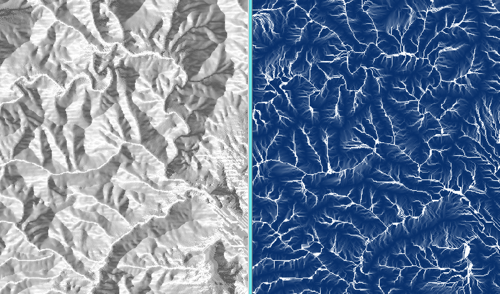

.. _routedem:

********
RouteDEM
********

Summary
=======

Introduction
============

The freshwater models in InVEST are routed across a digital elevation model (DEM). In the course of developing InVEST we've found existing implementations of flow direction and flow accumulation algorithms to be lacking. To address this need, we have developed our own high performance implementations of the D8 flow direction algorithm and fractional flow ("Multiple Flow Direction" - MFD), combined with a plateau resolution algorithm to route across flat areas (Garbrecht and Martz) that outperforms TauDEM and GRASS implementations. We feel these implementations are useful enough that we offer them as a standalone tool that can:

* Fill hydrological sinks.

* Resolve flat areas in a DEM so that all regions drain to some point.

* Compute flow direction across a DEM.

* Compute flow accumulation across a DEM.

* Create streams based on flow accumulation.

This tool may be useful when you are preparing your DEM for use in the freshwater models. For these models, you will want to create streams that are continuous (not all chopped up), and you will need to choose a Threshold Flow Accumulation value that creates a modeled stream network that is as close as possible to the real-world stream network. Using RouteDEM you can test your DEM, see how InVEST handles it, and create stream rasters to help you choose an appropriate Threshold value, without needing to run the whole freshwater model.

After installing InVEST, this tool can be found in the start menu under the InVEST folder as a utility called *RouteDEM*.

RouteDEM will always resolve sinks and plateaus before routing flow.

Tool Inputs
===========

- :investspec:`routedem workspace_dir`

- :investspec:`routedem results_suffix`

- :investspec:`routedem dem_path` Hydrological sinks and flat plateau regions will be automatically resolved by the model.

- :investspec:`routedem dem_band_index` If not provided, band index 1 will be used.

- :investspec:`routedem algorithm`

- :investspec:`routedem calculate_slope`

- :investspec:`routedem calculate_flow_direction` This will be written to the output file *flow_direction.tif*.

- :investspec:`routedem calculate_flow_accumulation` This will be written to the output file *flow_accumulation.tif*.

- :investspec:`routedem calculate_stream_threshold` This will be written to the output file *stream_mask.tif*. All pixels in the flow accumulation raster that have a value greater than or equal to the **Threshold Flow Accumulation Limit** will be considered a stream.

- :investspec:`routedem threshold_flow_accumulation`

- :investspec:`routedem calculate_downstream_distance`
11. **Calculate Distance to Stream**: This will be written to the output file *downstream_distance.tif* in the workspace. Distance is given in number of pixels. To translate this pixel distance to linear units, multiply the *downstream_distance.tif* raster by the pixel size.

References
==========

Garbrecht, J., Martz, L. W.,The assignment of drainage direction over flat surfaces in raster digital elevation models, Journal of Hydrology, Volume 193, Issues 1–4, 1 June 1997, Pages 204-213, ISSN 0022-1694, http://dx.doi.org/10.1016/S0022-1694(96)03138-1.
(https://www.sciencedirect.com/science/article/abs/pii/S0022169496031381)
