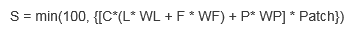

.. primer

.. _scenariogenerator:

.. |addbutt| image:: ./shared_images/addbutt.png
  :alt: add
	 :align: middle 
	 :height: 15px

.. |toolbox| image:: ./shared_images/toolbox.jpg
  :alt: toolbox
	 :align: middle 
	 :height: 15px

******************
Scenario Generator
******************

Summary
=======

Introduction
============

Scenarios are storylines that depict future events and states. They provide insight into the future and help shape imagination about uncertain future events. For scenarios to have the desired effects and applicability, they must be plausible to let the audience relate to the possibility of such an event occurring; otherwise, they run the risk of being dismissed.  As described in the InVEST scenario guidelines, scenarios describe a possible future, reflect important and uncertain future developments or choices, are plausible, internally consistent, and relevant to the questions being addressed. Scenarios are used in many fields and take different forms, but in this document, we consider scenarios that can be expressed in a spatially explicit manner and that relates to land cover.

Land use and changes in it is an issue of global importance. Land use/Land cover change is driven by the need to provide food and shelter and the rise in economic development among many other factors that change quickly and grow complex day by day. Today’s action can drive land cover change in the future, and scenarios are important for raising awareness on possible consequences. In the context of ecosystem services, it is important to compare potential change in the provision of ecosystem services under various scenarios, hence to evaluate the impact of these alternatives and alert decision makers on the consequences of loss.

While land use change modeling is very important, it is complex and requires incorporation of social, political and economic factors that drive the change in land use/land cover. However, incorporating such factors is hampered by methodological difficulties and lack of spatially explicit data (Veldkamp and Lambin 2001). Due to this complexity, proxy variables, which are easier to measure (e.g. distance to roads), are used in place of the actual drivers. This approach runs the risk of obscuring causality, but provides simple direct pathways into understanding such a complex issue.

This scenario generation tool provides a relatively simple method of generating scenarios based on land suitability. It works on the principle that changes on land occur on areas that are relatively more suitable. By combining stakeholder input of transition likelihood with physical factors that determine suitability, The InVEST Scenario Generator generates simple maps that depict future land cover. At the heart of it is land suitability analysis.

Land suitability analysis has developed over the years starting from the early hand drawn maps advancing to computer assisted overlay mapping, multi criteria evaluation and currently artificial intelligence methods (Collins et. al. 2001). With modern developments in Geographic Information Systems (GIS), overlay analysis is commonplace and possible with almost every GIS software. One of the main limitations of classical overlay mapping and modeling approaches is the difficulty in incorporating value judgments such as decision maker preferences and underlying policy driver influence (Malczewski 2004). Combining GIS with multi-criteria evaluation – a method of evaluating various criteria in decision-making makes it easier to incorporate expert knowledge into such analysis. Others have favored artificial intelligence (AI) methods which mimic human intelligence without claiming an understanding of the underlying processes (Malczewski 2004). Such techniques include fuzzy logic, neural networks, genetic algorithms and cellular automata. These methods have been criticized for their black box nature of analysis, making them less easily accepted by decision makers. The Scenario Generator uses a combination of overlay analysis, multi-criteria evaluation methods and direct application of expert knowledge to map alternative futures.

.. primerend

The Model
=========

How it Works
------------

Allocating land parcels to various uses is a multi-objective multi-criteria problem. Landcover change is influenced by a large number of drivers. Some of them are very clear and easy to observe (e.g. mineral exploration and extraction) while others are subtle and difficult to identify (e.g. change in societal values). As a participatory process, the Scenario Generator relies on drivers that stakeholders can easily identify and estimate impacts of. At the same time, there are many factors that influence suitability of land parcels for conversion. This may include factors or constraints such as slope, soil type, distance to roads, distance to markets, rainfall distribution, and access. Dealing with multiple objectives and multiple criteria presents a challenge that The InVEST Scenario Generator attempts to solve.

The InVEST Scenario Generator is designed to work with data from experts/stakeholders typically in a workshop setting. The major components of the input are i) the transition likelihood, ii) the physical and environmental factors that influence change and iii) the quantity of anticipated change under a given scenario. The tool works off of a single land cover map making it useful in data-poor situations.

The following are the details of the elements needed to run the tool.

Quantity of Change
^^^^^^^^^^^^^^^^^^

The quantity of change is determined indirectly by the demand for land and is estimated by stakeholders. The change value provided here is used as the goal, and the tool converts all suitable pixels in order of suitability until this goal is met for the cover or until all the available pixels are converted.  For cover types that do not already exist in the initial landcover, the change quantity should be entered in absolute area units (Hectares). While this guide does not give explicit directions on how to estimate this quantity, users can use a variety of methods based on the level of sophistication they desire. As an example, the workshop facilitator or modeler can run an analysis of past land cover change to provide a basis of the magnitudes of change that are plausible in the landscape. However, the final values used in the tool should be determined by stakeholders and could differ from such empirical data. If taking a purely empirical modeling approach then there are other tools that may be better suited.

Transition Likelihood
^^^^^^^^^^^^^^^^^^^^^

The likelihood that a given parcel is converted from one land cover type to another (transition likelihood) is defined by the stakeholders. This exercise is preferably done in a group setting. The stakeholders should select a few well-understood transitions and determine how likely they are in the period under consideration. For example, they may consider the likelihood of grassland being converted to agriculture and on a scale of 0 to 10, and assign a value of 8. When deciding the transition likelihood, the stakeholders should consider only the drivers which influence such a change. Constraints such as protection should not be considered here, as they are estimated separately.

Following is an example of the transition likelihood matrix:

.. csv-table::
 :file: scenario_transition.csv
 :name: Scenario Transition Table

The absolute value of the numbers in the matrix above is not critical because they are used relatively. It is important though to have these in the range of 0~10 that is used when creating the suitability maps (using factors as discussed later). Reading the columns, cover A will grow and all of its growth will be from cover C; Cover B will grow due to a contribution from Cover A and a smaller contribution from Cover B. As currently written, in this case cover B will only grow into cover C after all the available parcels in cover A are exhausted. 

Priority
^^^^^^^^

The  Scenario Generator requires that the stakeholders rank the land cover types to assign weight. When multiple objectives compete for a single land parcel (or pixels as unit used in this tool), the one with the higher weight or priority wins. Priority ranking the cover types is difficult, and an optional feature is provided which utilizes a pair-wise comparison matrix in an analytic hierarchy process (AHP), such that the stakeholders only compare two cover types at a time. Using AHP is optional.

As an example, in the table below, using the 9 point continuous scale (see at end of document), Cover C is *"extremely less important"* compared to Cover A (0.11 versus 1). However, cover C is *"strongly more important"* compared to Cover B. Once the table has been filled the tool uses eigenvectors to assign weights to each of the cover types. It is recommended to use the 9-point continuous scale (Saaty 1977). Alternatively, one can derive the weights using any other tools and enter them directly. The cover type that has the highest weight will have its goal achieved before moving to the next. It is important to note that when the priorities are calculated, the input table is not updated but the calculated values are used by the tools when doing conversion.

.. csv-table::
 :file: scenario_priority.csv
 :name: Scenario Priority Table

The matrix above is used to compute the suitability. There will be as many suitability layers as the number of cover types (objectives) being considered, with values closer to 10 showing pixels that would be converted first.

Factors
^^^^^^^

The transition likelihood values given in table 1 are based on expert opinion and policy drivers. However, certain physical and environmental factors also affect the pixel suitability for conversion, hence determining where on the landscape the land cover changes are likely to happen. Examples of such factors include distance from roads, soil types, distance from cities, elevation, slope, and aspect. The tool allows the user to provide these factors and their relationship with land suitability. The impact of these factors differ between objectives (cover types), therefore the user can enter more than one factor for each of the cover types, and apply one factor to multiple cover types. The tool uses relative weights to combine these factors and determine the areas most suitable for certain land cover. The current version accepts vector layers as factor input. Point and line factors are used to calculate suitability based on proximity. Polygon input should have a field indicating suitability level ranging from 0 (unsuitable) to 10 (extremely suitable). The effects or all factors are then combined based on the weights defined by user. Selection of factors is very critical to producing plausible scenario maps. Using factors in the tool is optional and it is advised to use a good dataset, otherwise the results can be inconsistent. Given the iterative nature of scenario development, users should run the tool multiple times with and without the factors to see the effects and adjust as necessary.

Proximity Suitability
^^^^^^^^^^^^^^^^^^^^^

Pixels close to a land cover type may be more likely to be converted to that cover type. For example, parcels close to agriculture, if suitable for agriculture may be most likely to be converted first. However, this may not be the case for all cover types, therefore the user has the option to mark a cover type as having proximity suitability. While this proximity may play an important role in improving suitability of parcels, the effect is capped in this tool, so that it does not drive the suitability significantly. To apply the effect of proximity, the distance of each cell to the cover being analyzed is computed and made to diminish up to the maximum distance entered by the user. The cells closest to the cover are given the highest value while those farther than the maximum distance given a value of 1. When combining with the rest of the suitability layers, the effect of the proximity distance is made to slightly improve suitability.

Constraints
^^^^^^^^^^^

Constraints are unique factors that prevent human-induced land cover change. An example of a constraint is a protected area. However, protected areas have different designations which determine their ability to prevent land cover change. Even where they are gazetted as “strictly protected”, implementation on the ground may vary. Therefore the tool allows the user to enter an access value that determines the extent to which the protected area would effectively prevent habitat conversion under the scenario in consideration. An access value of 0 implies that the constraint has full effect and no conversion can take place within the boundary of the constraint while a value of 1 implies that the constraint has no effect. When applied to a suitability layer, a constraint of 0 makes all the parcels with which it overlaps to have a suitability of 0 thereby not having any chance of attracting any changes. An example of another type of constraint, albeit more complex is a requirement that only parcels beyond a specific area can be converted to large-scale agriculture. If such a constraint is applied, any suitable regions (group of pixels) that do not meet the minimum requirement are ignored.

Overview of the suitability components 
^^^^^^^^^^^^^^^^^^^^^^^^^^^^^^^^^^^^^^

For each target LULC type, the suitability of potential land parcels is calculated by:

Below lists details about the components in the equation:

.. figure:: ./scenario_generator_images/component.png
   :align: left
   :width: 400pt

Change Override
^^^^^^^^^^^^^^^

While the methods described above use computational methods to change pixels and present a probable scenario land cover, there are times when the user prefers to have an exception and to override these methods to change pixels. The tool allows the user to enter an override GIS layer, which converts pixels as stated. At the simplest, supplying a land cover dataset and an override layer can be used to change specific defined polygons, in this case the scenario tool acts as a simple GIS operation tool. Currently, only one vector override layer is accepted therefore if using multiple layers they need to be combined.

Computing Transition
^^^^^^^^^^^^^^^^^^^^

The final step in the procedure is to convert the pixels (land allocation). The InVEST Scenario Generator performs land cover transition by converting the suitability rasters into an array and processing each pixel converting them based on their suitability values. Starting from the cover type with the highest priority, the goal (%change) is read and pixels converted starting from the highest suitability. After each cover is processed, the converted pixels are masked so that they are not available for conversion again. Where more pixels of the same suitability are available, the tool randomly selects the available pixels from the first group (region) that it encounters.

Example
~~~~~~~

As an illustration of the procedure, consider a 5 by 5 pixel landscape undergoing agricultural expansion pressure. There are a few important transitions here: 

#. Forest -> Agriculture (very likely, 8)
#. Forest -> Urban (extremely likely, 10)
#. Grassland -> Agriculture (likely, 5)
#. Grassland -> Urban (very likely, 8)
#. Agriculture -> Urban (a little likely, 3)
#. Urban -> Agriculture (very seldom likely, 1)

At a stakeholder workshop (or other expert forum), the transitions above are discussed and the drivers that determine them are considered. The stakeholders likelihood values above are entered in a matrix as below.

.. csv-table::
 :file: scenario_likelihood.csv
 :name: Scenario Transition Likelihood Table

After considering the driving forces (drivers) and the demand, stakeholders place a goal of 40% growth of agriculture and 100% growth of urban areas. Further, they determine that agriculture has higher priority than urban development so they are assigned values of 10 and 5 respectively. Since these values are relative, the absolute values do not matter. Where a cell (parcel) is more suitable for both agriculture and urban development, the agriculture wins due to higher priority.

This simple example considers only the likelihood matrix, but the tool has a provision for incorporating physical and environmental characteristics, which also determine the likelihood of land cover conversion. Even when both the likelihood matrix and the factors are applied, the tool allows adjustment of the contribution of each to the final suitability grid that is used for conversion.

.. figure:: ./scenario_generator_images/change.png
   :align: center
   :figwidth: 400pt

Process explanation:

#. The objective is growth of agriculture with a goal of 40% increase (4 pixels) and growth of urban by 100% (1 pixel)
#. Cells A1, A2, B1, B2 are protected so no changes occur. The tool allows entering intermediate values of protection to control suitability for conversion
#. Agriculture and urban cells are masked because they are not converting
#. Cells with highest suitability scores (8) are converted first followed by lower suitability until goal is met or until possible cells run out
#. Proximity suitability is applied that is cell E3 is taken before C1 even though they have the same suitability 
#. Cells D2 and E3 have the same suitability and proximity so one is picked at random
#. This procedure is repeated for each cover type (objective) starting from the highest priority to the lowest

Tool Process
~~~~~~~~~~~~

.. figure:: ./scenario_generator_images/process.png
   :align: center
   :width: 400pt

Tool Flow
~~~~~~~~~

.. figure:: ./scenario_generator_images/transition.png
   :align: center
   :width: 400pt

Limitations and Simplifications
^^^^^^^^^^^^^^^^^^^^^^^^^^^^^^^

Land cover change analysis is complex and most methods only try to approximate possible futures. This model captures expert knowledge and makes an attempt at representing plausible land cover change as realistically as possible but does not predict the future land cover. One of the aims of the tool is to make it easy for stakeholders to understand how the decisions they make in building the scenarios are reflected in the map produced.

Following are some limitations/assumptions:

#. This model assumes that a cover type is either growing or shrinking but not both. In reality, conversion takes place in both directions but for simplicity, only one direction is assumed.
#. This tool assumes a single step transition from the beginning landcover to the scenario landcover. In reality, these changes could be stepwise with different patterns at each step.
#. Stakeholder values are likely to be more reliable for near future scenarios but not for longer term ones. Therefore, it is advisable to stay with near future.
#. Currently, this tool only processes covers that are growing and disregards the shrinking covers. For example, even though a percentage change may be entered as -5%, the pressure of the growing covers always override. In a future revision this will be addressed.
#. The sequence of land transition is solely based on priority, which means even if a land parcel is highly suitable for agriculture but barely suitable for urban, it may still be assigned to future urban land as long as urban has a higher priority. 

Current Issues, and Ways to Avoid Errors
^^^^^^^^^^^^^^^^^^^^^^^^^^^^^^^^^^^^^^^^

We are constantly improving and developing new functions for Scenario Generator. However, below are some issues reported by users, which we will correct in future releases. For now, we provide some possible tricks to avoid them before the updated new version is ready.
    	
    **Issue --** Error if you run the model without “Specify Transitions” when the scenario has new LULC types. 
        **Error Message:**

        *Traceback (most recent call last):*

        *File "invest_natcap\iui\executor.pyc", line 555, in runModel*

        *File "invest_natcap\scenario_generator\scenario_generator.pyc", line 1148, in execute*

        *KeyError: 2*    (2 is the LULC ID that does not exist in the baseline LULC map)

        *None*

        **Suggestion:** Check the “Specify Transition” option and run the model with a transition matrix when new land covers are expected.

    **Issue --** Error If the user checked proximity but put nothing into the proximity column:
        **Error Message:**

        *Traceback (most recent call last):*

        *File "invest_natcap\iui\executor.pyc", line 555, in runModel*

        *File "invest_natcap\scenario_generator\scenario_generator.pyc", line 946, in execute*

        *ValueError: invalid literal for int() with base 10: ''*

        **Suggestion:** If proximity is not applied to a certain layer, put in 0 instead of leave it blank. Also, if you are not using the proximity element, don’t check the box.

    **Issue --** Performance issues with large landscapes. Users have reported memory errors.
        **Suggestion:** Downsample your map and re-run with coarse resolution, or breakdown your study area and build separate scenarios for them.

    **Issue --** The randomization algorithm seems to have a problem. It has been noted in some cases that pixel conversion in not balanced but rather happens in one part of the map apparently because conversion starts at top left and goes sequentially.
        **Suggestion:** Sorry for that… Before we correct the code, probably you can set a lower goal to avoid the random allocation process in the tool. (And maybe use random points tool in GIS software to generate your extra new land cover)

    **Issue --** When introducing a new landcover type, the raster attribute table is not built automatically.
        **Suggestion:** Build a raster attribute table for your scenario map, then the raster can symbolize correctly. 

    **Issue --** The override function should be able to work independently of everything else. Currently, if you do not do transitions but enter an override, the tool fails. 
        **Suggestion:** For now, if the override function is the only process you need to generate scenarios, try using GIS tools instead of using Scenario Generator

    **Issue --** Error when table names include non-ASCII characters
        **Error Message:**

        *UnicodeEncodeError: 'ascii' codec can't encode character u'\xeb' in position 726: ordinal not in range(128)*

        **Suggestion:** Use the 26 English letters only for your variable/land cover names.

Data Needs
==========

#. **Base Land cover:** Land cover data in raster format.  While the number of land cover classes can be unlimited, for this analysis it gets confusing for stakeholders and becomes problematic to process a large number of land cover classes.  Its preferable to keep them under 20. Stakeholders should be able to describe each of the covers especially those that are transitioning.

#. **Landcover transition table:** A csv table that contains the transition likelihoods on a scale of 0 to 10 where 0 indicates no likelihood of change and 10 indicates full likelihood of change.  The rows indicate the land cover types.  For each land cover type in the row, there is a matching field named <cover id> where the cover id matches the id in the row as shown in the example below.   Additional fields include:

  #. Priority: If the user has priority for the cover types, they should be entered here. Otherwise, the Compute Priority option should be used to populate this field. The tool will allocate pixels for the cover types with a higher priority before those with lower priority.

  #. Percent Change: This shows the quantity of change and should be a positive integer. We currently only model cover growth, negative values will be ignored. This is a limitation.

  #. Proximity: If proximity suitability is to be applied to this cover type, enter the proximity distance; else leave it as 0. The proximity distance is a value in meters that indicates how far the effect of self proximity goes.  For example, fields that are within 10km of small scale agriculture may be likely to be converted to agriculture if they are suitable, but after this distance the effect of proximity disappears. In this case, a value of 10000 should be entered.

  #. Area Change (optional): For cover types that do not already exist, percentage change cannot be used. To introduce a new cover, enter the new quantity in hectares.

  #. Patch ha (optional): This is an optional value that indicates the minimum size of a patch that is suitable for the cover to be allocated the parcel.  If not entered, a default value of 1 pixel is used.

.. csv-table::
 :file: scenario_transition_example.csv
 :name: Scenario Transition Table Example

In the table above, there is growth in agriculture and bare land at the expense of grassland and tropical forest.  The likelihood of tropical forest transitioning to agriculture is rated 8 while grassland to agriculture is rated 4 therefore when converting pixels to agriculture, the forest pixels are converted before grassland pixels (see assumptions). Similarly, when converting pixels, the goal of agriculture is satisfied before bare land because it has higher priority.

#. **Land suitability factors (optional):** This table lists the factors that determine suitability of the land cover for change.  Each factor lists a layer, which defines the suitability.  Given that the same factor can have different implications for different objectives, users can enter more than one layer for each cover (objective).  If this table is not provided, these factors will not be used and only the transition likelihood table above will be used. It is strongly advised to include factors. The following are the required fields:

    #. Cover ID: The ID of the land cover affected by the factor
	
    #. Short Name: Short name of the land cover type
	
    #. Factorname: The name of the factor.  This should be a single short name for identifying the factor and unique for the factor.  No spaces allowed
 
    #. Layer: The name of the GIS feature class with the features of the factor.  For example roads.shp.  Area (as opposed to lines and points) datasets can be given an features (eg shapefile) or raster.  If given as feature (vector) then the suitfield (with values in the range 0-100) must be specified.  If given as raster then the value of the raster should indicate the suitability (0 -100 where 100 means very suitable for the particular cover and 0 means unsuitable)
 
    #. Wt: This is the weight of the factor.  When factors are combined, this weighting is applied.
 
    #. Suitfield: This identifies the field in the polygon layer that contains the suitability value.  The field values should be integers number between 0 and 100 with 0 being unsuitable and 100 being very suitable. This does not apply for non polygon datasets.  

    #. Dist: The distance of influence of the factor e.g. the distance from the roads.  This tool uses just one distance for all the features.  The polygon features do not use this field.  Distance should be in the units of the landcover dataset (assumed meters).

.. csv-table::
 :file: scenario_suitability_factors.csv
 :name: Suitability Factors

#. **Priority matrix(optional):** To rank the cover types for conversion, the priority of land covers are calculated using the multi-criteria evaluation approach, applying pairwise comparison with the analytic hierarchy process.

    If the user does not want to use this approach they can manually enter the priority into the respective table. The matrix should follow the format below, where matrix values are entered from column 3. The first two columns are reserved for descriptive values (Record number and the item) and the last column is reserved for the PRIORITY. The tool computes the priority and populates this column.  Only the lower half of the diagonal should be filled and the diagonal cells should contain 1s.  The names of the items are not crucial, but they must be in the same order as they are in the rows.  

.. csv-table::
 :file: scenario_priority.csv
 :name: Pairwise Comparison Matrix

#. **Change override layer (optional):** This is a vector (polygon) layer with land cover types in the same scale and projection as the input land cover.  This layer is used to override all the changes and is applied after the rule conversion is complete. 
#. **Constraints Layer (optional):** This is a vector layer which indicates the parts of the landscape that are protected of having constraints to land cover change.  The layer should have one field named ‘protlevel’ with a value between 0 and 1 where 0 means its fully protected and 1 means its fully open to change.
#. **Factor weight:** The factor weight is a value between 0 and 1 which determines the weight given to the factors vs. the expert opinion likelihood rasters.  For example, if a weight of 0.3 is entered then 30% of the final suitability is contributed by the factors and the likelihood matrix contributes 70%.  This value is entered on the tool interface.
#. **Specify transitions:** This is an option that determines whether the likelihood probability matrix should be used.  If this is not checked the probability matrix is ignored. This value is entered on the interface.
#. **Use factors:** This is an option that determines whether the factors should be used.  If this is not checked the factors are ignored. This value is entered on the interface.
#. **Result suffix (optional):** The value entered here will be used as a suffix for your results. Only one character is allowed. Adding a unique suffix will avoid overwriting previous results files.
#. **Downsampling (optional, will be implemented in future releases):** The resolution at which you would like the model to run. The landcover map will have a "native" resolution (i.e., the size of each cell in the raster, such as 30m x 30m). If you want to make this resolution coarser (i.e., bigger cells) to speed up run time or keep file sizes low, input a different (bigger) cell size and the model will automatically resample to the new resolution. You cannot define a new resolution which is finer than the native resolution of the raster dataset.

.. primer

Interpreting Results
====================

Final Results
-------------

Final results are generated in the "output" folder of the workspace for this module. Typically the tool is run several times changing the values until and acceptable scenario map is produced.

scenario.tif - This is the new landcover data created. Load this data and compare with the original landcover.

scenario-output-summary.html - a html file which shows the land cover transitions and a graphical representation of the changes.

Intermediate results
--------------------

The intermediate folder contains the intermediate files used in the model run.

.. primerend

References
==========

#. Carver, S. J. (1991) Integrating multi-criteria evaluation with geographical information systems International Journal of Information Systems 5 (3) 321-339
#. Collins, M.G., Steiner, F.R. and Rushman, M. J. (2001) Environmental Management 28 (5) 611-621
#. Malczewski, J. (2004) GIS-based land-use suitability analysis: a critical overview Progress in Planning 62 3-65
#. Saaty, T.L (1977) A Scaling Method for Priorities in Hierarchical Structures Journal of Mathematical Psychology 15, 234-281
#. Saaty, T. L. (2008) Decision Making with the analytic hierarchy process International Journal of Services Sciences 1(1) 83-98
#. Veldkamp, A. and Lambin, E.F. (2001) Predicting Land-Use change Agriculture Ecosystems and Environment.

Appendix
========

The Saaty 9 Point Continous Scale
---------------------------------

.. csv-table::
 :file: scenario_saaty.csv
 :name: Saaty 9 Point Continous Scale