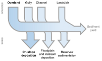
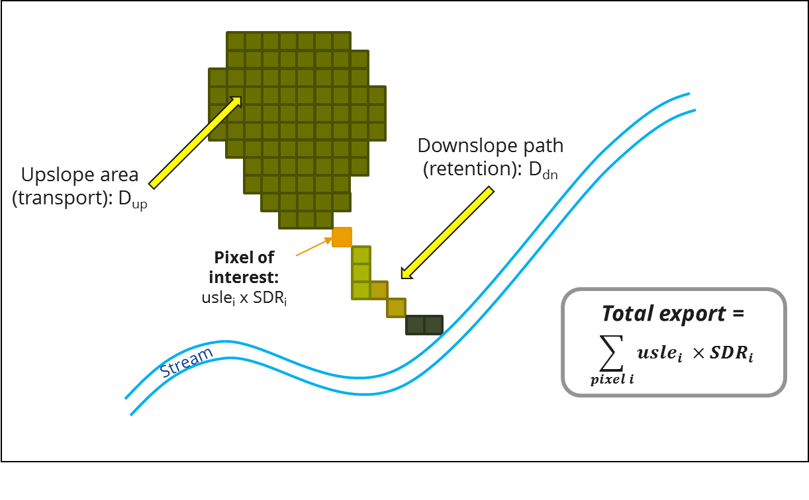
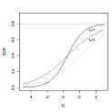

.. primer
.. _sdr:

*****************************
Sediment Delivery Ratio model
*****************************

Summary
=======

The objective of the InVEST sediment delivery model is to map overland sediment generation and delivery to the stream. In a context of global change, such information can be used to study the service of sediment retention in a catchment. This is of particular interest for reservoir management and instream water quality, both of which may be economically valued.

The main differences between the InVEST SDR model and the InVEST Sediment retention model found in InVEST v3.0.1 and earlier are:

 * The routing of sediment from a cell to the stream was modified to remove the sensitivity to grid resolution and facilitate the selection of LULC-specific retention coefficient;

 * (Optional) calibration is based on one non-physical parameter that preserves the spatial distribution of sediment sinks and sources, facilitating the interpretation of spatially explicit outputs;

 * The increased flexibility in model structure allows advanced users to represent more complex processes such as gully erosion or instream retention (work is in progress to facilitate the representation of these processes for InVEST users)

Introduction
============

Erosion and overland sediment retention are natural processes that govern the sediment concentration in streams. Sediment dynamics at the catchment scale are mainly determined by climate (in particular the rain intensity), soil properties, topography, and vegetation; and anthropogenic factors such as agricultural activities or dam construction and operation. Main sediment sources include overland erosion (soil particles detached and transported by rain and overland flow), gullies (channels that concentrate flow), bank erosion, and mass erosion (or landslides; see Merrit 2003 for a review). Sinks include on-slope, floodplain or instream deposition, and reservoir retention, as summarized in Figure 1. Conversion of land use and changes in land management practices may dramatically modify the amount of sediment running off a catchment. The magnitude of this effect is primarily governed by: i) the main sediment sources (land use change will have a smaller effect in catchments where sediments are not primarily coming from overland flow); and ii) the spatial distribution of sediment sources and sinks (for example, land use change will have a smaller effect if the sediment sources are buffered by vegetation).

Increases in sediment yield are observed in many places of the world, dramatically affecting water quality and reservoir management (UNESCO 2009). The sediment retention service provided by natural landscapes is of great interest to water managers. Understanding where the sediments are produced and delivered allow them to design improved strategies for reducing sediment loads. Changes in sediment load can have impacts on downstream irrigation, water treatment, recreation and reservoir performance.

The outputs from the sediment model include the sediment load delivered to the stream at an annual time scale, as well as the amount of sediment eroded in the catchment and retained by vegetation and topographic features. The model provides two options for valuation of the sediment retention service, though appropriate valuation approaches will be highly dependent on the particular application and context, and may need to be implemented independently of InVEST.

    General catchment sediment budget. The relative size of the arrows changes depending on the environment. The InVEST model focuses on the overland processes.

.. primerend

The Model
=========

Biophysical Model
-----------------

Sediment Delivery
^^^^^^^^^^^^^^^^^

The sediment delivery module is a spatially-explicit model working at the spatial resolution of the input DEM raster. For each cell, the model first computes the amount of eroded sediment, then the sediment delivery ratio (SDR), which is the proportion of soil loss actually reaching the catchment outlet. This approach was proposed by Borselli et al. (2008) and has received increasing interest in recent years (Cavalli et al., 2013; López-vicente et al., 2013; Sougnez et al., 2011). See Advantages and limitations for further discussion.

Annual Soil Loss
""""""""""""""""

The amount of annual soil loss on pixel :math:`i`, :math:`usle_i` :math:`(ton. ha^{-1} yr^{-1})`, is given by the revised universal soil loss equation (RUSLE1):

.. math:: usle_i=R_i\cdot K_i\cdot LS_i\cdot C_i\cdot P_i,

where

 * :math:`R_i` is the rainfall erosivity (:math:`MJ\cdot mm (ha\cdot hr)^{-1})`,

 * :math:`K_i` is the soil erodibility (:math:`ton\cdot ha\cdot hr (MJ\cdot ha\cdot mm)^{-1}`),

 * :math:`LS_i` is the slope length-gradient factor

 * :math:`C_i` is the crop-management factor

 * and :math:`P_i` is the support practice factor (Renard et al., 1997). (cf. also in (Bhattarai and Dutta, 2006)).

and :math:`LS_i` factor is given from the method developed by Desmet and Govers (1996) for two-dimension surface:

.. math:: LS_i=S_i \frac{(A_{i-in}+D^2)^{m+1}-A_{i-in}^{m+1}}{D^{m+2}\cdot x_i^m\cdot (22.13)^m}

where

 * :math:`S_i` the slope factor for grid cell calculated as function of slope radians :math:`\theta`

  - :math:`S=10.8\cdot\sin(\theta)+0.03` where :math:`\theta < 9\%`
  - :math:`S=16.8\cdot\sin(\theta)-0.50`, where :math:`\theta \geq 9\%`

 * :math:`A_{i-in}` the contributing area (:math:`m^2`) at the inlet of a grid cell which is computed from the d-infinity flow direction method

 * :math:`D` the grid cell linear dimension (:math:`m`)

 * :math:`x_i=|sin \alpha_i| + |\cos \alpha_i|` where :math:`\alpha_i` is the aspect direction for grid cell :math:`i`

 * :math:`m` is the RUSLE length exponent factor.

To avoid overestimation of the LS factor in heterogeneous landscapes, long slope lengths are capped to a value of 333m (Desmet and Govers, 1996; Renard et al., 1997)

The value of :math:`m`, the length exponent of LS factor, is based on the classical USLE, as discussed in (Oliveira et al., 2013):

 * :math:`m = 0.2` for slope <= 1%:
 * :math:`m = 0.3` for 1% < slope <= 3.5%
 * :math:`m = 0.4` for 3.5% < slope <= 5%
 * :math:`m = 0.5` for 5% < slope <= 9%
 * :math:`m = \beta / (1 + \beta)` where :math:`\beta=\sin\theta / 0.0986 / (3\sin\theta^{0.8} + 0.56)` for slope >= 9%

Sediment Delivery Ratio
"""""""""""""""""""""""

**Step 1** Based on the work by Borselli et al. (2008), the model first computes the connectivity index:

.. math:: IC=\log_{10} \left(\frac{D_{up}}{D_{dn}}\right)

Figure 2. Conceptual approach used in the model. The sediment delivery ratio (SDR) for each pixel is a function of the upslope area and downslope flow path (Equations 3, 4, 5).

:math:`D_{up}` is the upslope component defined as:

.. math:: D_{up}=\bar{C}\bar{S}\sqrt{A}

where :math:`\bar{C}` is the average :math:`C` factor of the upslope contributing area, :math:`S` is the average slope gradient of the upslope contributing area (:math:`m/m`) and :math:`A` is the upslope contributing area (:math:`m^2`). The upslope contributing area is delineated from the D-infinity flow algorithm (Tarboton, 1997).

The downslope component :math:`D_{dn}` is given by:

.. math:: D_{dn}=\sum_i\frac{d_i}{C_i S_i}

where :math:`d_i` is the length of the flow path along the ith cell according to the steepest downslope direction (m) (see Figure 2), :math:`C_i` and :math:`S_i` are the :math:`C` factor and the slope gradient of the ith cell, respectively. Again, the downslope flow path is determined from the D-infinity flow algorithm (Tarboton, 1997).

To avoid infinite values for :math:`IC`, slope values :math:`S` are forced to a minimum of 0.005 :math:`m/m` if they occur to be less than this threshold, and an upper limit of 1 m/m to limit bias due to very high values of IC on steep slopes. (Cavalli et al., 2013).

**Step 2** The SDR ratio for a pixel i is then derived from the conductivity index IC following (Vigiak et al., 2012):

.. math:: SDR_i = \frac{SDR_{max}}{1+\exp\left(\frac{IC_0-IC_i}{k}\right)}

where :math:`SDR_{max}` is the maximum theoretical SDR, set to an average value of 0.8 (Vigiak et al., 2012), and :math:`IC_0` and :math:`k` are calibration parameters that define the shape of the SDR-IC relationship (increasing function). The effect of :math:`IC_0` and :math:`k` on the SDR is illustrated below:

Figure 3. Relationship between the connectivity index IC and the SDR. The maximum value of SDR is set to :math:`SDR_{max}=0.8`. The effect of the calibration are illustrated by setting :math:`k_b=1` and :math:`k_b=2` (solid and dashed line, respectively), and :math:`IC_0=0.5` and :math:`IC_0=2` (black and grey dashed lines, respectively).

Sediment Load
"""""""""""""

The sediment load from a given pixel i, :math:`E_i` (:math:`ton. ha^{-1} yr^{-1}`) is given by:

.. math:: E_i=usle_i\cdot SDR_i

The total catchment sediment load :math:`E` (:math:`ton. ha^{-1} yr^{-1}`) is given by:

.. math:: E=\sum_i E_i

E is the value used for calibration/validation purposes, in combination with other sediment sources, if data are available.

Optional Drainage Layer
^^^^^^^^^^^^^^^^^^^^^^^

In some situations, the index of connectivity defined by topography does not represent actual flow paths, which may be influenced by artificial connectivity instead. For example, sediments in urban areas or near roads are likely to be conveyed to the stream with little retention. The (optional) drainage raster identifies the pixels that are artificially connected to the stream, irrespective of their geographic position (e.g. their distance to the stream network). Pixels from the drainage layer are treated similarly to pixels of the stream network; in other words, the downstream flow path will stop at pixels of the drainage layer (and the corresponding sediment load will be added to the total sediment export).

Limitations to the Biophysical Model
^^^^^^^^^^^^^^^^^^^^^^^^^^^^^^^^^^^^

 * Among the main limitations of the model is its reliance on the USLE (Renard et al., 1997). This equation is widely used but is limited in scope, only representing rill/inter-rill erosion processes. Other sources of sediment include gully erosion, streambank erosion, and mass erosion. A good description of the gully and streambank erosion processes is provided by Wilkinson et al. 2014, with possible modeling approaches. Mass erosion is not represented in the model but can be a significant source in some areas (REF. India) or under certain land use change: http://water.epa.gov/scitech/datait/tools/warsss/box08.cfm

 * A corollary is that the descriptions of the impact on ecosystem services (and any subsequent valuation) should account for the relative proportion of the sediment source from the model compared to the total sediment budget (see section on Evaluting sediment retention services)

 * In addition, as an empirical equation developed in the United States, the USLE has shown limited performance in other areas – even when focusing on sheet and rill erosion (REF.) Based on local knowledge, users may modify the soil loss equation implemented in the model by altering the R, K, C, P inputs to reflect findings from local studies (Sougnez et al., 2011).

 * The model is very sensitive to the k and IC0 parameters, which are not physically based. The emerging literature on the modeling approach used in the InVEST model (Cavalli et al., 2013; López-vicente et al., 2013; Sougnez et al., 2011; Vigiak et al., 2012) provides guidance to set this parameters, but users should be aware of this limitation when interpreting model absolute values.

 * Given the simplicity of the model and low number of parameters, outputs are very sensitive to most input parameters. Errors in the empirical parameters of the USLE equations will therefore have a large effect on predictions. Sensitivity analyses are recommended to investigate how the confidence intervals in input parameters affect the study conclusions.

Differences between the InVEST v3.1 SDR model and the original approach developed by Borselli et al. (2008)
^^^^^^^^^^^^^^^^^^^^^^^^^^^^^^^^^^^^^^^^^^^^^^^^^^^^^^^^^^^^^^^^^^^^^^^^^^^^^^^^^^^^^^^^^^^^^^^^^^^^^^^^^^^

The InVEST SDR model is based on the concept of hydrological connectivity, as parameterized by Borselli et al. (2012). This approach was selected since it requires a minimal number of parameters, uses globally available data, and is spatially explicit.  In a comparative study, Vigiak et al. (2012) suggested that the approach provides: “large improvement in predicting specific sediment yields, (ii) ease of implementation, (iii) scale-independency; and (iv) a formulation capable of accounting for landscape variables and topology in line with sedimentological connectivity concepts”. The approach has also been used to predict the effect of land use change (Jamshidi et al., 2013).
The following points summarize the differences between InVEST and the Borselli’s model:

 * The weighting factor is directly implemented as the USLE C factor (other researchers have used a different formulation, e.g. roughness index based on high-resolution DEM (Cavalli et al., 2013))

 * The :math:`SDR_{max}` parameter used by Borselli et al. is set to 0.8 by default to reduce the number of parameters. Vigiak et al. (2012) propose to define SDR max as the fraction of topsoil particles finer than coarse sand (<1 mm).

Evaluating Sediment Retention Services
--------------------------------------

Sediment Retention Services
^^^^^^^^^^^^^^^^^^^^^^^^^^^

Translating the biophysical impacts of altered sediment delivery to human well-being metrics depends very much on the decision context. Soil erosion, suspended sediment and deposited sediment can have both negative and positive impacts on various users in a watershed (Keeler et al, 2012). These include, but are not limited to:

 * Reduced soil fertility to reduced water and nutrient holding capacity
 * Increase in treatment costs for drinking water supply
 * Reduced lake clarity diminishing the value of recreation
 * Increase in total suspended solids impacting health and distribution of aquatic populations
 * Increase in reservoir sedimentation diminishing reservoir performance or increasing sediment control costs
 * Increase in harbor sedimentation requiring dredging to preserve harbor function

Sediment Retention Index
^^^^^^^^^^^^^^^^^^^^^^^^

An index of sediment retention is computed by the model as follows:

.. math:: R_i\cdot K_i \cdot LS_i (1-C_i P_i) × SDR_i

which represents the avoided soil loss by the current land use compared to bare soil, weighted by the SDR factor. This index underestimates retention since it does not account for the retention from upstream sediment flowing through the given pixel.  Therefore, this index should not be interpreted quantitatively. We also note that in some situations, index values may be counter-intuitive: for example, urban pixels may have a higher index than forest pixels if they are highly connected to the stream. In other terms, the SDR (second factor) can be high for these pixels, compensating for a lower service of avoided soil loss (the first factor): this suggests that the urban environment is already providing a service of reduced soil loss compared to an area of bare soil.

Quantitative Valuation
^^^^^^^^^^^^^^^^^^^^^^

**Sediment retention at the subwatershed level** From a valuation standpoint, an important metric is the difference in retention or yield across scenarios. For quantitative assessment of the retention service, the model uses as a benchmark a hypothetical scenario where all land is cleared to bare soil: the value of the retention service is then based on the difference between the sediment export from this bare soil catchment and that of the scenario of interest. This output is termed "sed_retention" in the watershed summary table.

**Additional sources and sinks of sediment** As noted in the model limitations, the omission of some sources and sinks of sediment (gully erosion, stream bank erosion, and mass erosion) should be considered in the valuation analyses. In some systems, these other sources of sediment may dominate and large changes in overland erosion may not make a difference to overall sediment concentrations in streams.  In other words, if the sediment yields from two scenarios differ by 50%, and the part of rill/inter-rill erosion in the sediment budget in 60%, then the actual change valued for avoided reservoir sedimentation is 30%.

One complication when calculating the total sediment budget is that changes in climate or land use result in changes in peak flow during rain events, and are thus likely to affect the magnitude of gully and streambank erosion. While the magnitude of the change in other sediment sources is highly contextual it is likely to be in the same direction as the change in overland erosion: a higher sediment overland transport is indeed often associated with higher flows, which likely increase gully and bank erosion. Therefore, when comparing across scenarios, the absolute change may serve as a lower bound on the total impact of a particular climate or land use change.

Appendix 2 summarizes options to represent the additional sources and sinks in the model.

**Replacement and avoided cost frameworks, versus willingness to pay approaches** With many ecosystem service impacts, and sediment impacts in particular, the valuation is relatively simple if an avoided mitigation cost or replacement cost method is deemed appropriate. In this situation, beneficiaries are assumed to incur a cost that is a function of the biophysical metric (eg, suspended sediment increases treatment costs). However, it is important to recognize that the avoided cost or replacement cost approaches assume the mitigating actions are worthwhile for the actor undertaking them. For example, if a reservoir operator deems that the costs associated with dredging deposited sediment are not worth the benefits of regaining lost storage capacity, it is not appropriate to value all deposited sediment at the unit cost of dredging. Similarly, an increase in suspended sediment for drinking water supplies may be met by increasing treatment inputs or switching to an alternate treatment technology. Avoiding these extra costs could then be counted as economic benefits. However, in some contexts, private water users may decide that the increase in sediment content is acceptable, rather than incur additional treatment expenses. They are economically worse off, but by not paying for additional treatment, the replacement cost approach becomes an upper bound on their economic loss. Their economic loss is also no longer captured by their change in financial expenditures, which further complicates the analysis.

Note, however, this bounding approach may be entirely appropriate for initial assessment of the significance of different benefit streams i.e. if the most expensive approach does not have a significant impact, then there is no need to refine the analysis to utilize more detailed approaches such as willingness-to-pay (for consumers) or impacts on net revenues (for producers). However, if the impact is large and there is no good reason to believe that the relevant actors will undertake the mitigating activities, then a willingness-to-pay framework is the appropriate path to take. For an introduction to the techniques available, see http://ecosystemvaluation.org/dollar_based.htm.

**Time considerations** Generally, economic and financial analysis will utilize some form of discounting that recognizes the time value of money, benefits, and use of resources. Benefits and costs that accrue in the future “count for less” than benefits and costs that are born close to the present. It is important that any economic or financial analysis be cognizant of the fact that the SDR model represents only average annual impacts under steady state conditions. This has two implications for valuation. First, users must recognize that the impacts being valued may take some time to come about: It is not the case that the full steady state benefits would begin accruing immediately, even though many of the costs might be. Second, the annual averaging means that cost or benefit functions displaying nonlinearities on shorter timescales should (if possible) be transformed, or the InVEST output should be paired with other statistical analysis to represent important intra or interannual variability.

Data Needs
==========

This section outlines the specific data used by the model. See the Appendix for detailed information on data sources and pre-processing. Note that all GIS inputs must be in the same projection and in linear meter units for accurate results.

 1. **Digital elevation model (DEM)** (required). A GIS raster dataset with an elevation value for each cell. Make sure the DEM is corrected by filling in sinks, and if possible compare the output stream maps with hydrographic maps of the area. To ensure proper flow routing, the DEM should extend beyond the watersheds of interest, rather than being clipped to the watershed edge.

 2. **Rainfall erosivity index (R)** (required). R is a GIS raster dataset, with an erosivity index value for each cell. This variable depends on the intensity and duration of rainfall in the area of interest. The greater the intensity and duration of the rain storm, the higher the erosion potential. The erosivity index is widely used, but in case of its absence, there are methods and equations to help generate a grid using climatic data. The units on the index values are :math:`MJ\cdot mm\cdot (ha\cdot h\cdot yr)^{-1}`.

 3. **Soil erodibility (K)** (required). K is a GIS raster dataset, with a soil erodibility value for each cell. Soil erodibility, K, is a measure of the susceptibility of soil particles to detachment and transport by rainfall and runoff. The units on the index values are :math:`ton\cdot ha\cdot h\cdot (ha\cdot MJ\cdot mm)^{-1}`

 4. **Land use/land cover (LULC)** (required). LULC is a GIS raster dataset, with an integer LULC code for each cell.

 5. **Watersheds** (required). A shapefile of polygons. This is a layer of watersheds such that each watershed contributes to a point of interest where water quality will be analyzed. Format: An integer field named 'ws_id' is required, with a unique integer value for each watershed 

 6. **Biophysical table** (required). A .csv table containing model information corresponding to each of the land use classes. Each row is a land use/land cover class and columns should be named and defined as follows:

    1. **lucode** (Land use code): Unique integer for each LULC class (e.g., 1 for forest, 3 for grassland, etc.), must match the LULC raster input.

    2. **usle_c**: Cover-management factor for the USLE, a floating point value between 0 and 1.

    3. **usle_p**: Support practice factor for the USLE, a floating point value between 0 and 1.

 7. **Threshold flow accumulation** (required). The number of upstream cells that must flow into a cell before it is considered part of a stream, which is used to classify streams in the DEM. This threshold directly affects the expression of hydrologic connectivity and sediment export: when a flow path reaches the stream, sediment deposition stops and the sediment exported is assumed to reach the catchment outlet.

 8. :math:`k_b` and :math:`IC_0`: two calibration parameters that determine the shape of the relationship between hydrologic connectivity (the degree of connection from patches of land to the stream) and the sediment delivery ratio (percentage of soil loss that actually reaches the stream; cf. Figure 3). The default values are :math:`k_b=2` and :math:`IC_0=0.5`.

 9. :math:`\mathbf{SDR_{max}}`: the maximum SDR that a pixel can reach, which is a function of the soil texture. More specifically, it is defined as the fraction of topsoil particles finer than coarse sand (1000 μm; Vigiak et al. 2012). This parameter can be used for calibration in advanced studies. Its default value is 0.8.

 10. **Drainage layer (optional)** A raster with 0s and 1s, where 1s correspond to pixels artificially connected to the stream (by roads, stormwater pipes, etc.). The flow routing will stop at these "artificially connected" pixels, before reaching the stream network.

Running the Model
=================

To launch the Sediment model navigate to the Windows Start Menu -> All Programs -> InVEST |version| -> Sediment delivery and retention. The interface does not require a GIS desktop, although the results will need to be explored with any GIS tool including ArcGIS, QGIS, and others.

.. primer

Interpreting Results
--------------------

The following is a short description of each of the outputs from the Sediment Retention model. Final results are found in the output folders within the user defined Workspace specified for this model.

* **[workspace]** folder:

    * **Parameter log**: Each time the model is run, a text (.txt) file will appear in the Output folder. The file will list the parameter values for that run and will be named according to the service, the date and time, and the suffix.

    * **rkls.tif** (tons/pixel): Total potential soil loss per pixel in the original land cover without the C or P factors applied from the RKLS equation, equivalent to the soil loss for bare soil.

    * **sed_export.tif** (tons/pixel): The total amount of sediment exported from each pixel that reaches the stream.

    * **stream.tif** (pixel mask): The pixel level mask of the calculated stream network, useful for interpreting pixel level output and checking the stream network computed by the model.

    * **stream_and_drainage.tif** (pixel mask): If a drainage layer is provided, this raster is the union of that layer with the calculated stream layer.

    * **usle.tif** (tons/pixel): Total potential soil loss per pixel in the original land cover calculated from the USLE equation.

    * **sed_retention.tif** (tons/pixel): Map of sediment retention with reference to a bare watershed.

    * **sed_retention_index.tif** (tons/pixel): Index of sediment retention, used to identified areas contributing more to retention with reference to a bare watershed. This is NOT the sediment retained on each pixel (see Section on the index in "Evaluating Sediment Retention Services" above).

    * **watershed_results_sdr.shp**: Table containing biophysical values for each watershed, with fields as follows:

    * **sed_export** (tons/watershed): Total amount of sediment exported to the stream per watershed. This should be compared to any observed sediment loading at the outlet of the watershed. Knowledge of the hydrologic regime in the watershed and the contribution of the sheetwash yield into total sediment yield help adjust and calibrate this model.

        * **usle_tot** (tons/watershed): Total amount of potential soil loss in each watershed calculated by the USLE equation.

        * **sed_retention** (tons/watershed): Difference in the amount of sediment delivered by the current watershed and a hypothetical watershed where all land use types have been cleared to bare soil.

* **[workspace]\\intermediate_outputs** folder:

    * dem_offset, slope, thresholded_slope, flow_direction, flow_accumulation, stream: hydrologic rasters based on the DEM used for flow routing (outputs from RouteDEM, see corresponding chapter in User’s Guide)

    * ls (and bare_soil)-> LS factor for USLE (Eq. 1 and 2)

    * w_bar (and bare_soil) -> mean weighting factor (C factor) for upslope contributing area (Eq. 4)

    * s_bar (and bare_soil) -> mean slope factor for upslope contributing area

    * d_up (and bare_soil) -> upslope factor of the index of connectivity (Eq. 4)

    * ws_factor (and bare_soil) -> denominator of the downslope factor (Eq. 5)

    * d_dn (and bare_soil) -> downslope factor of the index of connectivity (Eq. 5)

    * ic_factor (and bare_soil) -> index of connectivity (Eq. 3)

    * sdr_factor (and bare_soil) -> sediment delivery ratio (SDR; Eq. 6)

Comparison with Observations
----------------------------

The sediment yield (sed_export) predicted by the model can be compared with available observations. These can take the form of sediment accumulation in a reservoir or time series of Total Suspended Solids (TSS) or turbidity. In the former case, the units are the same as in the InVEST model (tons per year). For time series, concentration data need to be converted to annual loads (LOADEST and FLUX32 are two software facilitating this conversion).
A global database of sediment yields for large rivers can be found on the FAO website: http://www.fao.org/nr/water/aquastat/sediment/index.stm
Alternatively, for large catchments, global sediment models can be used to estimate the sediment yield. A review of such models was performed by de Vente et al. (2013).

Note when comparing with measured results that the SDR model A key thing to remember when comparing predictions to observations is that the model represents rill-inter-rill erosion only. As indicated in the Introduction three other sources of sediment may contribute to the sediment budget: gully erosion, stream bank erosion, and mass erosion. The relative importance of these processes in a given landscape needs to be determined to ensure adequate model interpretation.

.. primerend

Appendix 1: Data Sources
========================

This section is a compilation of potential data sources and suggestions about finding, compiling, and formatting data. It is not an exhaustive list. Although we strive to update this section regularly with new data sources and methods, users are encouraged to seek local good quality data to improve the quality of model inputs.

Digital Elevation Model (DEM)
-----------------------------

DEM data is available for any area of the world, although at varying resolutions.

Free raw global DEM data is available from:

 * the World Wildlife Fund - http://worldwildlife.org/pages/hydrosheds
 * NASA: http://asterweb.jpl.nasa.gov/gdem-wist.asp (30m resolution); and easy access to SRTM data: http://dwtkns.com/srtm/
 * USGS: http://eros.usgs.gov/elevation-products and http://hydrosheds.cr.usgs.gov/

Alternatively, it may be purchased relatively inexpensively at sites such as MapMart (www.mapmart.com).

The DEM resolution may be a very important parameter depending on the project’s goals. For example, if decision makers need information about impacts of roads on ecosystem services then fine resolution is needed. The hydrological aspects of the DEM used in the model must be correct. Because the model requires that all pixels have a flow direction (according to the D-infinity flow algorithm (Tarboton, 1997)), the DEM may need to be filled to remove sinks. Multiple passes of the ArcGis Fill tool, or Qgis Wang&Liu Fill algorithm (SAGA library) have shown good results.

Rainfall Erosivity Index (R)
----------------------------

R should be obtained from published values, as calculation is very tedious. For calculation, R equals the annual average of EI values, where E is the kinetic energy of rainfall (in :math:`MJ\cdot ha^{-1}`) and I30 is the maximum intensity of rain in 30 minutes (in mm.hr-1).  A review of relationships between precipitation and erosivity index around the world is provided by Renard and Freimund (1994).

General guidance to calculate the R index can be found in the FAO Soils bulletin 70 (Roose, 1996): http://www.fao.org/docrep/t1765e/t1765e0e.htm

In the United States, national maps of the erosivity index can be found through the United States Department of Agriculture (USDA) and Environmental Protection Agency (EPA) websites. The USDA published a loss handbook (http://www.epa.gov/npdes/pubs/ruslech2.pdf ) that contains a hard copy map of the erosivity index for each region. Using these maps requires creating a new line feature class in GIS and converting to raster. Please note that conversion of units is also required: multiplication by 17.02 is needed to convert from US customary units to MJ.mm.(ha.h.yr)-1, as detailed in Appendix A of the USDA RUSLE handbook (Renard et al., 1997).

The EPA has created a digital map that is available at https://archive.epa.gov/esd/archive-nerl-esd1/web/html/wemap_mm_sl_rusle_r_qt.html. The map is in a shapefile format that needs to be converted to raster, along with an adjustment in units.

Soil Erodibility (K)
--------------------

Texture is the principal factor affecting K, but soil profile, organic matter and permeability also contribute. It varies from 70/100 for the most fragile soil and 1/100 for the most stable soil (in US customary units). Erodibility is typically measured on bare reference plots, 22.2 m-long on 9% slopes, tilled in the direction of the slope and having received no organic matter for three years.

The FAO provides global soil data in their Harmonized World Soil Database: http://www.iiasa.ac.at/Research/LUC/External-World-soil-database/HTML/.

Soil data for many parts of the world are also available from the Soil and Terrain Database (SOTER) Programme (http://www.isric.org/projects/soil-and-terrain-database-soter-programme).
Or in te

In the United States free soil data is available from the U.S. Department of Agriculture’s NRCS in the form of two datasets:

SSURGO http://www.nrcs.usda.gov/wps/portal/nrcs/detail/soils/survey/?cid=nrcs142p2_053627 and

STATSGO http://water.usgs.gov/GIS/metadata/usgswrd/XML/ussoils.xml.Where available SSURGO data should be used, as it is much more detailed than STATSGO. Where gaps occur in the SSURGO data, STATSGO can be used to fill in the blanks. The Soil Data Viewer (http://www.nrcs.usda.gov/wps/portal/nrcs/detailfull/soils/home/?cid=nrcs142p2_053620) helps with pre-processing and downloading of the data.

Please note that conversion of units may be required: multiplication by 0.1317 is needed to convert from US customary units to :math:`ton\cdot ha\cdot hr\cdot (ha\cdot MJ\cdot mm)^{-1}`, as detailed in Appendix A of the USDA RUSLE handbook (Renard et al., 1997).

Alternatively, the following equation can be used to calculate K (Renard et al., 1997):

.. math:: K = \frac{2.1\cdot 10^{-4}(12-a)M^{1.14}+3.25(b-2)+2.5(c-3)}{759}

In which K = soil erodibility factor (:math:`t\cdot ha\cdot hr\cdot (MJ\cdot mm\cdot ha)^{-1}`; M = (silt (%) + very fine sand (%))(100-clay (%)) a = organic matter (%) b = structure code: (1) very structured or particulate, (2) fairly structured, (3) slightly structured and (4) solid c = profile permeability code: (1) rapid, (2) moderate to rapid, (3) moderate, (4) moderate to slow, (5) slow and (6) very slow.

When profile permeability and structure are not available, soil erodibility can be estimated based on soil texture and organic matter content, based on the work of Wischmeier, Johnson and Cross (reported in Roose, 1996). The OMAFRA fact sheet summarize these values in the following table (http://www.omafra.gov.on.ca/english/engineer/facts/12-051.htm):

.. csv-table::
  :file: sdr_images/soil_data.csv
  :header-rows: 1
  :name: OMAFRA Fact Sheet

Soil erodibility values (K) in US customary units based on the OMAFRA Fact sheet. Soil textural classes can be derived from the FAO guidelines for soil description (FAO, 2006, Figure 4).

A particular case is the K value for water bodies, for which soil maps may not indicate any soil type. A value of 0 can be substituted, assuming that no soil loss occurs in water bodies.

Land Use/Land Cover
-------------------

A key component for all water models is a spatially continuous landuse / land cover raster grid. That is, within a watershed, all landuse / land cover categories should be defined. Gaps in data will create errors. Unknown data gaps should be approximated. Global land use data is available from:

 * the University of Maryland’s Global Land Cover Facility: http://glcf.umd.edu/data/landcover/ (data available in 1 degree, 8km and 1km resolutions).

 * NASA: https://lpdaac.usgs.gov/products/modis_products_table/mcd12q1 (MODIS multi-year global landcover data provided in several classifications)

 * the European Space Agency: http://due.esrin.esa.int/globcover/ (landcover maps for 2005 and 2009)

Data for the U.S. for 1992 and 2001 is provided by the EPA in their National Land Cover Data product: http://www.epa.gov/mrlc/.

The simplest categorization of LULCs on the landscape involves delineation by land cover only (e.g., cropland, temperate conifer forest, prairie). Several global and regional land cover classifications are available (e.g., Anderson et al. 1976), and often detailed land cover classification has been done for the landscape of interest.

A slightly more sophisticated LULC classification involves breaking relevant LULC types into more meaningful types. For example, agricultural land classes could be broken up into different crop types or forest could be broken up into specific species. The categorization of land use types depends on the model and how much data is available for each of the land types. Users should only break up a land use type if it will provide more accuracy in modeling. For instance, for the sediment model the user should only break up ‘crops’ into different crop types if they have information on the difference in soil characteristics between crop management values.

P and C Coefficients
--------------------

The support practice factor, P, accounts for the effects of contour plowing, strip-cropping or terracing relative to straight-row farming up and down the slope. The cover-management factor, C, accounts for the specified crop and management relative to tilled continuous fallow. Several references on estimating these factors can be found online:

 * USDA: RUSLE handbook (Renard et al., 1997)

 * OMAFRA: USLE Fact Sheet http://www.omafra.gov.on.ca/english/engineer/facts/12-051.pdf

 * U.N. Food and Agriculture Organization http://www.fao.org/docrep/T1765E/t1765e0c.htm

Watersheds / Subwatersheds
--------------------------

Watersheds outlets should correspond to reservoirs or other points of interest. This ensures that the sediment loads predicted by the model can be compared to observed data at these points. If known watershed maps exist, they should be used. Otherwise, watersheds and subwatersheds can be generated in ArcMap or QGIS based on the digital elevation model (see section on DEM for use of Fill tools to correct flow paths).

Exact locations of specific structures, such as reservoirs, should be obtained from the managing entity or may be obtained on the web at sites such as the National Inventory of Dams (http://geo.usace.army.mil/pgis/f?p=397:1:0). Global collections of dam locations and information include the Global Reservoir and Dam (GRanD) Database (http://www.gwsp.org/products/grand-database.html) and the World Water Development Report II dam database (http://wwdrii.sr.unh.edu/download.html.)

Calibration Parameters :math:`IC_0` and :math:`k_b`
---------------------------------------------------

:math:`IC_0` and :math:`k_b` are calibration parameters that define the relationship between the index of connectivity and the sediment delivery ratio (SDR). Vigiak et al. (2012) suggest that :math:`IC_0` is landscape independent and that the model is more sensitive to :math:`k_b` . Advances in sediment modeling science should refine our understanding of the hydrologic connectivity and help improve this guidance. In the meantime, following other authors (Jamshidi et al., 2013), we recommend setting these parameters to their default values ( :math:`IC_0` =0.5 and :math:`k_b` =2), and using :math:`k_b` only for calibration (Vigiak et al., 2012).

Appendix 2: Representation of Additional Sources and Sinks of Sediment
======================================================================

The InVEST model predicts the sediment deliver from sheetflow erosion, thus neglecting other sources and sinks of sediment (e.g. gully erosion, streambank, landslides, stream deposition, etc.), which can affect the valuation approach. Adding these elements to the sediment budget requires good knowledge of the sediment dynamics of the area and is typically beyond the scope of ecosystem services assessments. General formulations for instream deposition or gully formation are still an area of active research, with modelers systematically recognizing large uncertainties in process representation (Hughes and Prosser, 2003; Wilkinson et al., 2014). Consultation of the local literature to estimate the relative importance of additional sources and sinks is a more practical approach to assess their effect on the valuation approach.

.. csv-table::
  :file: sdr_images/sources_sinks.csv
  :header-rows: 1
  :name: Sources and Sinks of Sediment

References
==========

Bhattarai, R., Dutta, D., 2006. Estimation of Soil Erosion and Sediment Yield Using GIS at Catchment Scale. Water Resour. Manag. 21, 1635–1647.

Borselli, L., Cassi, P., Torri, D., 2008. Prolegomena to sediment and flow connectivity in the landscape: A GIS and field numerical assessment. Catena 75, 268–277.

Cavalli, M., Trevisani, S., Comiti, F., Marchi, L., 2013. Geomorphometric assessment of spatial sediment connectivity in small Alpine catchments. Geomorphology 188, 31–41.

Desmet, P.J.J., Govers, G., 1996. A GIs procedure for automatically calculating the USLE LS factor on topographically complex landscape units. J. Soi 51, 427–433.

De Vente J, Poesen J, Verstraeten G, Govers G, Vanmaercke M, Van Rompaey, A., Boix-Fayos C., 2013. Predicting soil erosion and sediment yield at regional scales: Where do we stand? Earth-Science Rev. 127 16–29

FAO, 2006. Guidelines for soil description - Fourth edition. Rome, Italy.

Hughes, A.O., Prosser, I.P., 2003. Gully and Riverbank erosion mapping for the Murray-Darling Basin. Canberra, ACT.

Jamshidi, R., Dragovich, D., Webb, A.A., 2013. Distributed empirical algorithms to estimate catchment scale sediment connectivity and yield in a subtropical region. Hydrol. Process.

Lopez-vicente, M., Poesen, J., Navas, A., Gaspar, L., 2013. Predicting runoff and sediment connectivity and soil erosion by water for different land use scenarios in the Spanish Pre-Pyrenees. Catena 102, 62–73.

Oliveira, A.H., Silva, M.A. da, Silva, M.L.N., Curi, N., Neto, G.K., Freitas, D.A.F. de, 2013. Development of Topographic Factor Modeling for Application in Soil Erosion Models, in: Intechopen (Ed.), Soil Processes and Current Trends in Quality Assessment. p. 28.

Pelletier, J.D., 2012. A spatially distributed model for the long-term suspended sediment discharge and delivery ratio of drainage basins 117, 1–15.

Renard, K., Foster, G., Weesies, G., McCool, D., Yoder, D., 1997. Predicting Soil Erosion by Water: A Guide to Conservation Planning with the revised soil loss equation.

Renard, K., Freimund, J., 1994. Using monthly precipitation data to estimate the R-factor in the revised USLE. J. Hydrol. 157, 287–306.
Roose, 1996. Land husbandry - Components and strategy. Soils bulletin 70. Rome, Italy.

Sougnez, N., Wesemael, B. Van, Vanacker, V., 2011. Low erosion rates measured for steep , sparsely vegetated catchments in southeast Spain. Catena 84, 1–11.

Tarboton, D., 1997. A new method for the determination of flow directions and upslop areas in grid digital elevation models. Water Resour. Res. 33, 309–319.

Vigiak, O., Borselli, L., Newham, L.T.H., Mcinnes, J., Roberts, A.M., 2012. Comparison of conceptual landscape metrics to define hillslope-scale sediment delivery ratio. Geomorphology 138, 74–88.

Wilkinson, S.N., Dougall, C., Kinsey-Henderson, A.E., Searle, R.D., Ellis, R.J., Bartley, R., 2014. Development of a time-stepping sediment budget model for assessing land use impacts in large river basins. Sci. Total Environ. 468-469, 1210–24.

