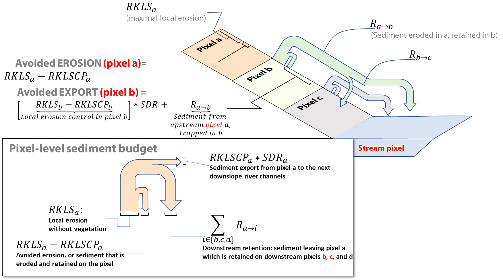

.. _sdr:

****************************
SDR: Sediment Delivery Ratio
****************************

Summary
=======

The objective of the InVEST Sediment Delivery Ratio (SDR) model is to quantify and map overland sediment generation and delivery to the stream. Increased sediment loads to water bodies are observed in many places in the world, dramatically affecting water quality and reservoir management (UNESCO 2009). The sediment retention service provided by vegetation is of great interest to water managers and land managers. Understanding where sediments are produced and delivered allows managers to design improved strategies for reducing sediment loads through changes in land use and management practices. Changes in sediment load can have impacts on downstream irrigation, water treatment, recreation and reservoir performance, while soil loss from the land can reduce agricultural productivity. These impacts may be economically valued by combining InVEST SDR model outputs with information on avoided mitigation costs, replacement costs, or willingess to pay.

Recent changes to the SDR model
===============================

As of InVEST version 3.12.0, several significant revisions have been made to the SDR model, to improve its usability, transparency, and accuracy. These changes are summarized here, and described further in the related sections and equations throughout this chapter.

* The term "deposition" has been changed to "trapping", and intermediate parameter :math:`R` has been changed to :math:`T`, to avoid confusion with the R factor used in the USLE.

* Calculation of intermediate parameters :math:`R` (now updated to :math:`T`, trapping) and :math:`F` (flux) have been updated. Previously, :math:`R` and :math:`F` were calculated such that sediment that erodes from a pixel (as calculated by the Revised Universal Soil Loss Equation or RUSLE) can then be trapped by vegetation on that same pixel. This is conceptually inconsistent: the role of vegetation for reducing erosion and sediment runoff from a pixel is already captured in RUSLE’s C factor (Wischmeier and Smith, 1978). By allowing for immediate sediment trapping on the same pixel, this amounted to double-counting the role of vegetation. With the updated calculation, all sediment that erodes from a pixel goes to the next downslope pixel, where it can either be trapped or continue flowing downslope. *This change will not affect estimates of water quality for any given scenario relative to the previous formulation of the model. However, it will lead to some change in the attribution of where sediment retention services are being provided on the landscape.* So you are likely to see differences in results, compared with previous versions of InVEST.

* Two new outputs have been added ("avoided erosion" and "avoided export"), which explicitly quantify the service of sediment retention on the landscape. Previously, it was unclear which model output, or combination of outputs, should be used to value the ecosystem service.

* Two legacy sediment retention indices (*sed_retention.tif* and *sed_retention_index.tif*) have been removed. These were indices only (not quantities), and their utility was unclear, epsecially in the context of the new outputs.

Introduction
============

Erosion and overland sediment retention are natural processes that govern the sediment concentration in streams. Sediment dynamics at the catchment scale are mainly determined by climate (in particular rain intensity), soil properties, topography, and vegetation, as well as anthropogenic factors such as agricultural activities or dam construction and operation. The main sediment sources present in a watershed include overland erosion (soil particles detached and transported by rain and overland flow), gully erosion (from channels that concentrate flow), bank erosion, and mass erosion (or landslides; see Merritt et al. 2003 for a review). Sinks include on-slope, floodplain or instream deposition, and retention in artificial reservoirs, as summarized in Figure 1. Conversion of land use and changes in land management practices may dramatically modify the amount of sediment running off a catchment. The magnitude of this effect is primarily governed by: i) the main sediment sources (land use change will have a smaller effect in catchments where sediments are not primarily coming from overland flow, but, e.g., from glacial erosion); and ii) the spatial distribution of sediment sources and sinks (for example, land use change will have a smaller effect if the sediment sources are buffered by vegetation).

The InVEST SDR model focuses only on overland erosion, it does not model gully, bank or mass erosion. Outputs from the model include the sediment load delivered to the stream at an annual time scale, as well as the amount of sediment eroded in the catchment and retained by vegetation and topographic features. Note that SDR only creates biophysical results. For valuation of the sediment retention service, appropriate valuation approaches will be highly dependent on the particular application, context, and beneficiaries, and need to be implemented independently of InVEST. See the User Guie section :ref: `quantitative-valuation` below for additional guidance.

|
|

.. figure:: ./sdr/sediment_budget.png

    General catchment sediment budget. The relative size of the arrows changes depending on the environment. The InVEST model focuses on the overland sources and sinks, and does not include the others.

The Model
=========

Sediment Delivery
-----------------

The sediment delivery module is a spatially-explicit model working at the spatial resolution of the input digital elevation model (DEM) raster. For each pixel, the model first computes the amount of annual soil loss from that pixel, then computes the sediment delivery ratio (SDR), which is the proportion of soil loss actually reaching the stream. Once sediment reaches the stream, we assume that it will be delivered to the catchment outlet; thus no in-stream processes which could increase or decrease sediment loads are modeled. This approach was proposed by Borselli et al. (2008) and has received increasing interest (e.g., Cavalli et al., 2013; López-vicente et al., 2013; Sougnez et al., 2011). See the User Guide section :ref:`differences-SDR-Borselli` for further discussion.

Annual Soil Loss
^^^^^^^^^^^^^^^^

The amount of annual soil loss on pixel :math:`i`, :math:`usle_i` (units: :math:`tons\cdot ha^{-1} yr^{-1}`), is given by the Revised Universal Soil Loss Equation (RUSLE1 - Renard et al. 1997):

.. math:: usle_i=R_i\cdot K_i\cdot LS_i\cdot C_i\cdot P_i,
   :label: usle

where

 * :math:`R_i` is rainfall erosivity (units: :math:`MJ\cdot mm (ha\cdot hr\cdot yr)^{-1})`,

 * :math:`K_i` is soil erodibility (units: :math:`ton\cdot ha\cdot hr (MJ\cdot ha\cdot mm)^{-1}`),

 * :math:`LS_i` is a slope length-gradient factor (unitless)

 * :math:`C_i` is a cover-management factor (unitless)

 * and :math:`P_i` is a support practice factor (Renard et al., 1997). (cf. also in (Bhattarai and Dutta, 2006)). (unitless)

The :math:`LS_i` factor is given from the method developed by Desmet and Govers (1996) for a two-dimensional surface:

.. math:: LS_i=S_i \frac{(A_{i-in}+D^2)^{m+1}-A_{i-in}^{m+1}}{D^{m+2}\cdot x_i^m\cdot (22.13)^m}
    :label: ls

where

 * :math:`S_i` is the slope factor for grid cell :math:`i` calculated as a function of slope radians :math:`\theta`

   .. math::

      S = \left\{\begin{array}{lr}
        10.8\cdot\sin(\theta)+0.03, & \text{where } \theta < 9\% \\
        16.8\cdot\sin(\theta)-0.50, & \text{where } \theta \geq 9\% \\
        \end{array}\right\}

 * :math:`A_{i-in}` is the contributing area (:math:`m^2`) at the inlet of a grid cell which is computed from the Multiple-Flow Direction method

 * :math:`D` is the grid cell linear dimension (:math:`m`)

 * :math:`x_i` is the mean of aspect weighted by proportional outflow from grid cell :math:`i` determined by a Multiple-Flow Direction algorithm.  It is calculated by

   .. math:: x_i = \sum_{d\in{\{0,7\}}} x_d\cdot P_i(d)

   where :math:`x_d = |\sin \alpha(d)| + |\cos \alpha(d)|`, :math:`\alpha(d)` is the radian angle for direction :math:`d`, and :math:`P_i(d)` is the proportion of total outflow at cell :math:`i` in direction :math:`d`.

 * :math:`m` is the RUSLE length exponent factor.

To avoid overestimation of the LS factor in heterogeneous landscapes, long slope lengths are capped to a maximum value of 122m that is adjustable as a user parameter (Desmet and Govers, 1996; Renard et al., 1997).

The value of :math:`m`, the length exponent of the LS factor, is based on the classical USLE, as discussed in (Oliveira et al., 2013):

.. math::

   \begin{align*}
   m &=  \left\{\begin{array}{lr}
      0.2, & \text{where } \theta \leq 1\% \\
      0.3, & \text{where } 1\% < \theta \leq 3.5\% \\
      0.4, & \text{where } 3.5\% < \theta \leq 5\% \\
      0.5, & \text{where } 5\% < \theta \leq 9\% \\
      \beta / (1 + \beta), & \text{where } \theta > 9\%
   \end{array}\right\} \\
   \\
   \beta &= \frac{\sin\theta / 0.0896}{3\sin\theta^{0.8} + 0.56}
   \end{align*}

Sediment Delivery Ratio
^^^^^^^^^^^^^^^^^^^^^^^

**Step 1.** Based on the work by Borselli et al. (2008), the model first computes the connectivity index (:math:`IC`) for each pixel. The connectivity index describes the hydrological linkage between sources of sediment (from the landscape) and sinks (like streams). Higher values of :math:`IC` indicate that a greater fraction of sediment eroded from an uphill pixel is delivered to a downslope sink such as a stream (i.e. is more connected). High connectivity typically occurs when the flowpath between sediment sources and sinks is steep, short, or sparsely vegetated. Lower values of :math:`IC` (i.e., lower connectivity) are associated with more vegetated areas and lower slopes.

:math:`IC` is a function of both the area upslope of each pixel (:math:`D_{up}`) and the flow path between the pixel and the nearest stream (:math:`D_{dn}`). If the upslope area is large, has lower slope, and good vegetative cover (so a low USLE C factor), :math:`D_{up}` will be low, indicating a lower potential for sediment to make it to the stream. Similarly, if the downslope path between the pixel and the stream is long, has lower slope and good vegetative cover, :math:`D_{dn}` will be low.

:math:`IC` is calculated as follows:

.. math:: IC=\log_{10} \left(\frac{D_{up}}{D_{dn}}\right)
    :label: ic

.. figure:: ./sdr/connectivity_diagram.png

Figure 2. Conceptual approach used in the model. The sediment delivery ratio (SDR) for each pixel is a function of the upslope area and downslope flow path.
|

Thresholded slopes :math:`S_{th}` and cover-management factors :math:`C_{th}` are used in calculating :math:`D_{up}` and :math:`D_{dn}`. A lower bound is set to avoid infinite values for :math:`IC`. An upper bound is also applied to the slope to limit bias due to very high values of :math:`IC` on steep slopes. (Cavalli et al., 2013).

.. math::
   :label: threshold_slope

   S_{th} = \left\{\begin{array}{lr}
        0.005, &\text{for } S<0.005\\
        S,     &\text{for } 0.005\leq S\leq 1\\
        1,     &\text{for } S>1
        \end{array}\right\}

.. math::
   :label: threshold_c

   C_{th} = \left\{\begin{array}{lr}
        0.001, & \text{for } C<0.001\\
        C,     & \text{otherwise}\\
        \end{array}\right\}

:math:`D_{up}` is the upslope component defined as:

.. math:: D_{up}=\bar{C}_{th}\bar{S}_{th}\sqrt{A}
    :label: d_up

where :math:`\bar{C}_{th}` is the average thresholded :math:`C` factor of the upslope contributing area, :math:`\bar{S}_{th}` is the average thresholded slope gradient of the upslope contributing area (:math:`m/m`) and :math:`A` is the upslope contributing area (:math:`m^2`). The upslope contributing area is delineated from a Multiple-Flow Direction algorithm.

The downslope component :math:`D_{dn}` is given by:

.. math:: D_{dn}=\sum_i\frac{d_i}{C_{th, i} S_{th,i}}
    :label: d_dn

where :math:`d_i` is the length of the flow path along the *i*\ th cell according to the steepest downslope direction (:math:`m`) (see Figure 2), :math:`C_{th, i}` and :math:`S_{th, i}` are the thresholded cover-management factor and the thresholded slope gradient of the *i*\ th cell, respectively. Again, the downslope flow path is determined from a Multiple-Flow Direction algorithm.

**Step 2.** The SDR ratio for a pixel :math:`i` is then derived from the conductivity index :math:`IC` following (Vigiak et al., 2012):

.. math:: SDR_i = \frac{SDR_{max}}{1+\exp\left(\frac{IC_0-IC_i}{k}\right)}
    :label: sdr

where :math:`SDR_{max}` is the maximum theoretical SDR, set to an average value of 0.8 (Vigiak et al., 2012), and :math:`IC_0` and :math:`k` are calibration parameters that define the shape of the SDR-IC relationship (which is an increasing function). The effect of :math:`IC_0` and :math:`k` on the SDR is illustrated below:

.. figure:: ./sdr/ic0_k_effect.png

Figure 3. Relationship between the connectivity index IC and the SDR. The maximum value of SDR is set to :math:`SDR_{max}=0.8`. The effect of the calibration are illustrated by setting :math:`k_b=1` and :math:`k_b=2` (solid and dashed line, respectively), and :math:`IC_0=0.5` and :math:`IC_0=2` (black and grey dashed lines, respectively).
|

Sediment Export
^^^^^^^^^^^^^^^

The sediment export from a given pixel :math:`i` :math:`E_i` (units: :math:`tons\cdot ha^{-1} yr^{-1}`), is the amount of sediment eroded from that pixel that actually reaches a stream. Sediment export is given by:

.. math:: E_i=usle_i\cdot SDR_i
    :label: e_i

The total catchment sediment export :math:`E` (units: :math:`ton\cdot ha^{-1} yr^{-1}`) is given by:

.. math:: E=\sum_i E_i
    :label: e

:math:`E` is the value used for calibration/validation purposes, in combination with other sediment sources, if data are available.

Sediment Downslope Trapping
^^^^^^^^^^^^^^^^^^^^^^^^^^^

This model also makes an estimate of the amount of sediment that is trapped (deposited/retained) along the flowpath downslope from the source, thus sediment that is eroded and exported from a pixel, but that does not reach the stream. Knowing the spatial distribution of this quantity will allow users to track net change of sediment on a pixel (gain or loss) which can inform land degradation indices.

Sediment export to stream from pixel :math:`i` is defined in equation :eq:`e_i`. The other component of the mass balance from the USLE is that sediment which does not reach the stream. This sediment load must be trapped somewhere on the landscape along the flowpath to the stream and is defined as follows

.. math:: E'_i=usle_i (1-SDR_i)
    :label: eprime

Due to the nature of the calculation of SDR, the quantity :math:`E_i` has accounted for the downslope flow path and biophysical properties that filter sediment to stream. Thus, we can model the flow of :math:`E'_i` downslope independently of the flow of :math:`E_i`.

To do this, we assume the following properties about how :math:`E_i` and SDR behave across a landscape:

**Property A**: SDR monotonically increases along a downhill flowpath: As a flowpath is traced downhill, the value of SDR will monotonically increase since the downslope flow distance decreases. Note there is the numerical possibility that a downslope pixel has the same SDR value as an upslope pixel. The implication in this case is that no on-pixel sediment flux trapping occurs along that step.

**Property B**: All non-exporting sediment flux on a boundary stream pixel is retained by that pixel: If pixel :math:`i` drains directly to the stream there is no opportunity for further downslope filtering of :math:`E_i`. Since :math:`E_i` is the inverse of :math:`E'_i`, the implication is that the upslope flux (defined as :math:`F_i` below) must have been trapped on the pixel.

Given these two properties, we see that the amount of :math:`E_i` retained on a pixel must be a function of:

 * the absolute difference in SDR values from pixel :math:`i` to the downslope pixel(s) it drains to, and
 * how numerically close the downslope SDR value is to 1.0 (the stream pixel).

These mechanics can be captured as a linear interpolation of the difference of pixel :math:`i`'s SDR value with its downslope SDR counterpart with respect to the difference of pixel :math:`i`'s difference with a theoretical maximum downslope SDR value of 1.0. Formally,

.. math:: dT_i=\frac{\left(\sum_{k \in \{directly\ downslope\ from\ i\}}SDR_k\cdot p(i,k)\right) - SDR_i}{1.0-SDR_i}
    :label: dti

:math:`T` stands for sediment trapping. The :math:`d` in :math:`dT_i` indicates a delta difference and :math:`p(i,k)` is the proportion of flow from pixel :math:`i` to pixel :math:`k`. This notation is meant to invoke the intuition of a derivative of :math:`Ti`. Note the boundary conditions are satisfied:

 * In the case of Property A (where downslope :math:`\left(\sum_{k \in \{directly\ downslope\ from\ i\}}SDR_k\cdot p(i,k)\right)=SDR_i`), the value of :math:`dT_i=0` indicating no :math:`F_i` will be retained on the pixel.
 * In the case of Property B (downslope :math:`SDR_k=1` because it is a stream) the value of :math:`dT_i=1` indicating the remaining :math:`F_i` is retained on the pixel.

Now we define the amount of sediment flux that is retained on any pixel in the flowpath using :math:`dT_i` as a weighted flow of upslope flux:

.. math:: T_i=dT_i\cdot\left(\sum_{j\in\{pixels\ that\ drain\ to\ i\}}F_j \cdot p(i,j)\right)
    :label: ti

where :math:`F_i` is the amount of sediment export that does not reach the stream "flux", defined as:

.. math:: F_i=(1-dT_i)\cdot(\left(\sum_{j\in\{pixels\ that\ drain\ to\ i\}} F_j \cdot p(i,j)\right) + E'_i)
    :label: fi

|  
|  
|  

Figure 4. Illustration of relevant sediment erosion and deposition processes, their spatial interconnections, and their representation in the model. The maximum amount of sediment that could be eroded from a pixel is defined as the USLE value in the absence of vegetation (RKLS). The difference between that and actual erosion with landcover and management (RKLSCP) indicates the role of those local factors to avoid erosion. Of the sediment leaving a pixel (RKLSCP), only a fraction (SDR) reaches a downslope stream pixel. The remainder (:math:`RKLSCP*(1-SDR)`) is retained on downstream pixels. Thus, the role of vegetation is two-fold: (1) avoiding local erosion and (2) trapping sediment that was mobilized upslope. The box at the bottom indicates the potential fate of eroded sediment. 

|  
|  

Ecosystem service indicators
^^^^^^^^^^^^^^^^^^^^^^^^^^^^

The ecosystem service of erosion control provided by the landscape is quantified in two ways:

* **Avoided erosion** - Vegetation's contribution to reducing erosion from a pixel. In other words, valuing the vegetation for not allowing erosion to happen in the first place. This indicates the ecosystem service from the perspective of local soil loss. It is calculated as

.. math:: AER_i = RKLS_i - USLE_i
    :label: aer_i

where :math:`AER_i` is the amount of erosion avoided on pixel :math:`i`, and the difference between :math:`RKLS_i` and :math:`USLE_i` represents the benefit of vegetation and good management practices, since RKLS is equivalent to USLE minus the C (cover) and P (practice) factors.

* **Avoided export** - Vegetation's contribution to reducing erosion from a pixel, as well as trapping of sediment originating upslope of the pixel, so that neither of these proceed downslope to enter a stream. This may also be thought of as the total sediment retained on the pixel. *Avoided export* indicates the ecosystem service from the perspective of a downstream water user, and is calculated as

.. math:: AEX_i = (RKLS_i - USLE_i) \cdot SDR_i + T_i
    :label: aex_i

where :math:`AEX_i` is the total sediment retention provided by that pixel, from both on-pixel and upslope erosion sources. By retaining this sediment, it is contributing to a reduction in sediment exported to streams. As with *avoided erosion*, the difference between :math:`RKLS_i` and :math:`USLE_i` represents the benefit of vegetation and good management practices, and multiplying this by the sediment delivery ratio :math:`SDR_i` quantifies the amount of erosion originating on that pixel which does not enter a stream. Finally, :math:`T_i` is the amount of upslope sediment that is trapped on that pixel, also keeping it from entering a stream.

For more information about using these indicators, see the following section :ref:`evaluating_sed_ret_services`.

Streams and Optional Drainage Layer
^^^^^^^^^^^^^^^^^^^^^^^^^^^^^^^^^^^
The model's stream map is the union of the calculated stream layer and the input drainage layer (if provided).
The model calculates a stream layer (**stream.tif**) by thresholding the flow accumulation raster (**flow_accumulation.tif**) by the threshold flow accumulation (TFA) value:

  .. math::
     :label: sdr_stream

     stream_{TFA,i} = \left\{\begin{array}{lr}
          1, & \text{if } flow\_accum_{i} \geq TFA \\
          0,     & \text{otherwise} \\
          \end{array}\right\}

If the optional drainage input is provided, the model includes it (**stream_and_drainage.tif**):

  .. math:: stream_{drainage,i} = stream_{TFA,i} \text{  OR  } stream_{input,i}
     :label: stream_and_drainage

The final stream layer (:math:`stream_{TFA}`, or :math:`stream_{drainage}` if the optional drainage input is provided) is used to determine :math:`d_i` (distance to stream) for the SDR calculations.

In some situations, the index of connectivity defined by topography does not represent actual flow paths, which may be influenced by artificial connectivity instead. For example, sediments in urban areas or near roads are likely to be conveyed to the stream with little retention. The (optional) drainage raster identifies the pixels that are artificially connected to the stream, irrespective of their geographic position (e.g. their distance to the stream network). Pixels from the drainage layer are treated similarly to pixels of the stream network; in other words, the downslope flow path will stop at pixels of the drainage layer, and the corresponding sediment load will be added to the total sediment export.

.. _sdr_defined_area:

Defined Area of Outputs
^^^^^^^^^^^^^^^^^^^^^^^

SDR and several other model outputs are defined in terms of distance to stream (:math:`d_i`). Therefore, these outputs are only defined for pixels that drain to a stream on the map (and so are within the streams' watershed). Pixels that do not drain to any stream will have NoData values in these outputs. The affected output files are: **d_dn.tif**, **ic.tif**, **e_prime.tif**, **sdr_factor.tif**, **sediment_deposition.tif**, **avoided_erosion.tif**, and **sed_export.tif**.

If you see areas of NoData in these outputs that can't be explained by missing data in the inputs, it is likely because they are not hydrologically connected to a stream on the map. This may happen if your DEM has pits or errors, if the map boundaries do not extend far enough to include streams in that watershed, or if your threshold flow accumulation value is too high to recognize the streams. You can confirm this by checking the intermediate output **what_drains_to_stream.tif**, which indicates which pixels drain to a stream. Check the stream output (**stream.tif**) and make sure that it aligns as closely as possible with the streams in the real world. See the :ref:`working-with-the-DEM` section of this User Guide for more information.

**Example:** Below is an example of the effect of threshold flow accumulation on the defined extent, in an area with multiple watersheds that are not hydrologically connected. Within the map area, you can see a connected stream network flowing from northwest to southeast, as well as 3 pieces of streams that are cut off along the right side of the map. In the example maps below, he top row shows streams (**stream.tif** output from SDR), while the bottom row shows SDR (**sdr_factor.tif**).

In the left column, with a TFA value of 100, streams exist in both the bottom-left and top-right watersheds. The SDR raster is defined everywhere that the inputs are defined except for a small patch on the right edge that does not drain to any stream.

In the right column, with a TFA value of 1000, there are no streams at all in the upper-right watershed. As a result, pixels in that watershed do not drain to any stream, and the corresponding SDR raster is undefined (nas values of NoData) in that area.

.. figure:: ./sdr/example_different_tfa_effects.png
   :scale: 50 %

Limitations
-----------

 * Among the main limitations of the model is its reliance on the USLE (Renard et al., 1997). This equation is widely used but is limited in scope, only representing overland (rill/inter-rill) erosion processes. Other sources of sediment include gully erosion, streambank erosion, and mass wasting from landslides or rockfalls, and glacial erosion. A good description of the gully and streambank erosion processes is provided by Wilkinson et al. 2014, with possible modeling approaches. Mass movements (landslide) is not represented in the model but can be a significant source in some areas or under certain land use change, such as road construction.

 * A corollary is that the descriptions of the impact on ecosystem services (and any subsequent valuation) should account for the relative proportion of the sediment source from the model compared to the total sediment budget (see the section on :ref:`evaluating_sed_ret_services`).

 * In addition, as an empirical equation developed in the United States, the USLE has shown limited performance in other areas – even when focusing on overland erosion. Based on local knowledge, users may modify the soil loss equation implemented in the model by altering the R, K, C, P inputs to reflect findings from local studies (Sougnez et al., 2011).

 * The model is very sensitive to the *k* and *IC0* parameters, which are not physically based. The emerging literature on the modeling approach used in the InVEST model (Cavalli et al., 2013; López-vicente et al., 2013; Sougnez et al., 2011; Vigiak et al., 2012) provides guidance to set these parameters, but users should be aware of this limitation when interpreting the model's absolute values.

 * Given the simplicity of the model and low number of parameters, outputs are very sensitive to most input parameters. Errors in the empirical parameters of the USLE equations will therefore have a large effect on predictions. Sensitivity analyses are recommended to investigate how the confidence intervals in input parameters affect the study conclusions.

.. _differences-SDR-Borselli:

Differences between the InVEST SDR model and the original approach developed by Borselli et al. (2008)
------------------------------------------------------------------------------------------------------

The InVEST SDR model is based on the concept of hydrological connectivity, as parameterized by Borselli et al. (2012). This approach was selected since it requires a minimal number of parameters, uses globally available data, and is spatially explicit. In a comparative study, Vigiak et al. (2012) suggested that the approach provides: "(i) large improvement in predicting specific sediment yields, (ii) ease of implementation, (iii) scale-independency; and (iv) a formulation capable of accounting for landscape variables and topology in line with sedimentological connectivity concepts". The approach has also been used to predict the effect of land use change (Jamshidi et al., 2013).

The following points summarize the differences between InVEST and the Borselli model:

 * In InVEST, the weighting factor is directly implemented as the USLE C factor and thus depending on local landcover (other researchers have used a different formulation, e.g. roughness index based on a high-resolution DEM (Cavalli et al., 2013))

 * The :math:`SDR_{max}` parameter used by Borselli et al. is set to 0.8 by default to reduce the number of parameters. Vigiak et al. (2012) propose to define :math:`SDR_{max}` as the fraction of topsoil particles finer than coarse sand (<1 mm). This value may be changed by the user.

.. _evaluating_sed_ret_services:

Evaluating Sediment Retention Services
======================================

Sediment Retention Services
---------------------------

For evaluating the service of sediment retention in your area of interest, two outputs are provided:

* **Avoided erosion** (avoided_erosion.tif) - Vegetation's contribution to reducing erosion from a pixel. In other words, valuing the vegetation for not allowing erosion to happen in the first place. This indicates the ecosystem service from the perspective of local soil loss, which would be of interest, for example, in farming areas where topsoil retention is important.

* **Avoided export** (avoided_export.tif) - Vegetation's contribution to avoided erosion from a pixel, as well as trapping of sediment originating upslope of the pixel, so that neither of these proceed downslope to enter a stream. This may also be thought of as the total sediment retained on the pixel. *Avoided export* indicates the ecosystem service from the perspective of a downstream water user, who would benefit from having sediment kept out of the stream they are using for drinking, hydropower, or other uses.

The *avoided_erosion.tif* and *avoided_export.tif* indicators can be used to identify places in the landscape that trap/retain sediment, which supports local soil resources and downstream water quality. This information can inform where to focus conservation work, so that these services are retained into the future. However, it's important to note that more erosion will be retained in places where more erosion is produced. So simply focusing on conserving high-retention areas does not necessarily address the places that are producing erosion in the first place. The *USLE.tif* output can complement this by showing which places in the watershed are losing the most soil; and the *sed_export.tif* output shows which areas are contributing the most sediment to streams. These are locations where it may be useful to target restoration or improved land management.

If you have scenarios that are being compared with current conditions, you may also quantify the sediment retention service by taking the difference in sediment *export* between the scenario and current conditions. This quantifies the difference in erosion reaching a stream, based on the changes in land cover/climate/etc. present in the scenarios, which provides a way of evaluating impacts to downstream uses such as reservoirs and drinking water.

Translating the biophysical impacts of altered sediment delivery to human well-being metrics depends very much on the decision context. Soil erosion, suspended sediment, and deposited sediment can all have both negative and positive impacts on various users in a watershed (Keeler et al, 2012). These include, but are not limited to:

 * Reduced soil fertility and reduced water and nutrient holding capacity, impacting farmers
 * Increase in treatment costs for drinking water supply
 * Reduced lake clarity diminishing the value of recreation
 * Increase in total suspended solids impacting health and distribution of aquatic species
 * Increase in reservoir sedimentation diminishing reservoir performance or increasing sediment control costs
 * Increase in harbor sedimentation requiring dredging to preserve navigation in rivers and estuaries

Evaluating service entails locating the relevant beneficiaries on the landscape and linking them to places that contribute to avoided erosion or avoided export (or change in sediment export). As an example for point beneficiaries such as a drinking water withdrawal, one method is to create the watershed that drains to that point location (using a tool like :ref:`delineateit`) and then sum the avoided export output raster (or the change in sediment export, if working with scenarios) within that watershed.

.. _quantitative-valuation:
Quantitative Valuation
----------------------

An important note about assigning a monetary value to any service is that valuation should only be done on model outputs that have been calibrated and validated. Otherwise, it is unknown how well the model is representing the area of interest, which may lead to misrepresentation of the exact value. If the model has not been calibrated, only relative results should be used (such as an increase of 10%) not absolute values (such as 1,523 tons, or 42,900 dollars.) See the section :ref:`comparison_with_observations` below for more information on sensitivity testing and calibration.

Sediment retention at the subwatershed level
^^^^^^^^^^^^^^^^^^^^^^^^^^^^^^^^^^^^^^^^^^^^

From a valuation standpoint, an important metric is the difference in retention or export across scenarios. For quantitative assessment of the retention service, the model provides spatial information about where sediment is trapped on the landscape, indicating which areas are retaining sediment from upslope, and keeping it from reaching a stream. Similarly, the sediment retention provided by different user-provided scenarios may be compared with the baseline condition (or each other) by taking the difference in sediment export between scenario and baseline. This change in export can represent the change in sediment retention service due to the possible future reflected in the scenario. These retention results may be valued monatarily or non-monatarily, depending on the context - See below in this section for more information on valuation approaches.

Additional sources and sinks of sediment
^^^^^^^^^^^^^^^^^^^^^^^^^^^^^^^^^^^^^^^^

As noted in the model limitations, the omission of some sources and sinks of sediment (gully erosion, stream bank erosion, and mass erosion) should be considered in the valuation analyses. In some systems, these other sources of sediment may dominate and large changes in overland erosion may not make a difference to overall sediment concentrations in streams. In other words, if the sediment export from two scenarios differs by 50%, and the part of overland erosion in the sediment budget is 60%, then the actual change in erosion that should be valued for avoided reservoir sedimentation is 30% (50% x 60%).

One complication when calculating the total sediment budget is that changes in climate or land use result in changes in peak flow during rain events, and are thus likely to affect the magnitude of gully and streambank erosion. While the magnitude of the change in other sediment sources is highly contextual, it is likely to be in the same direction as the change in overland erosion: a higher sediment overland transport is indeed often associated with higher flows, which likely increase gully and bank erosion. Therefore, when comparing across scenarios, the absolute change may serve as a lower bound on the total impact of a particular climate or land use change.

:ref:`sdr_appendix2` summarizes options to represent the additional sources and sinks of erosion in the model.

Replacement and avoided cost frameworks, versus willingness to pay approaches
^^^^^^^^^^^^^^^^^^^^^^^^^^^^^^^^^^^^^^^^^^^^^^^^^^^^^^^^^^^^^^^^^^^^^^^^^^^^^

With many ecosystem service impacts, and sediment impacts in particular, monetary valuation is relatively simple if an avoided mitigation cost or replacement cost method is deemed appropriate. In this situation, beneficiaries are assumed to incur a cost that is a function of the biophysical metric (e.g., suspended sediment increases treatment costs). However, it is important to recognize that the avoided cost or replacement cost approaches assume the mitigating actions are worthwhile for the actor undertaking them. For example, if a reservoir operator deems that the costs associated with dredging deposited sediment are not worth the benefits of regaining lost storage capacity, it is not appropriate to value all deposited sediment at the unit cost of dredging. Similarly, an increase in suspended sediment for drinking water supplies may be met by increasing treatment inputs or switching to an alternate treatment technology. Avoiding these extra costs could then be counted as economic benefits. However, in some contexts, private water users may decide that the increase in sediment content is acceptable, rather than incur additional treatment expenses. They are economically worse off, but by not paying for additional treatment, the replacement cost approach becomes an upper bound on their economic loss. Their economic loss is also no longer captured by their change in financial expenditures, which further complicates the analysis.

Note, however, that this bounding approach may be entirely appropriate for initial assessment of the significance of different benefit streams, i.e. if the most expensive approach does not have a significant impact, then there is no need to refine the analysis to utilize more detailed approaches such as willingness-to-pay (for consumers) or impacts on net revenues (for producers). However, if the impact is large and there is no good reason to believe that the relevant actors will undertake the mitigating activities, then a willingness-to-pay framework is the appropriate path to take. For an introduction to the techniques available, see http://ecosystemvaluation.org/dollar_based.htm.

Time considerations
^^^^^^^^^^^^^^^^^^^

Generally, economic and financial analysis will utilize some form of discounting that recognizes the time value of money, benefits, and use of resources. Benefits and costs that accrue in the future "count for less" than benefits and costs that are borne close to the present. It is important that any economic or financial analysis be cognizant of the fact that the SDR model represents only average annual impacts under steady state conditions. This has two implications for valuation. First, users must recognize that the impacts being valued may take some time to come about: It is not the case that the full steady state benefits would begin accruing immediately, even though many of the costs might. Second, the annual averaging means that cost or benefit functions displaying nonlinearities on shorter timescales should (if possible) be transformed, or the InVEST output should be paired with other statistical analysis to represent important intra- or inter-annual variability.

Data Needs
==========

.. note:: *All spatial inputs must have exactly the same projected coordinate system* (with linear units of meters), *not* a geographic coordinate system (with units of degrees).

.. note:: Raster inputs may have different cell (pixel) sizes, and they will be resampled to match the cell size of the DEM. Therefore, all model results will have the same cell size as the DEM.

- :investspec:`sdr.sdr workspace_dir`

- :investspec:`sdr.sdr results_suffix`

- :investspec:`sdr.sdr dem_path` Make sure the DEM is corrected by filling in sinks. Compare the output stream maps with hydrographic maps of the area, and burn in hydrographic features if necessary (recommended when unusual streams are observed). To ensure proper flow routing, the DEM should extend beyond the watersheds of interest, rather than being clipped to the watershed edge. See the :ref:`working-with-the-DEM` section of this User Guide for more information.

- :investspec:`sdr.sdr erosivity_path` The greater the intensity and duration of the rain storm, the higher the erosion potential.

- :investspec:`sdr.sdr erodibility_path`

- :investspec:`sdr.sdr lulc_path`

- :investspec:`sdr.sdr watersheds_path`

  Field:

  - :investspec:`sdr.sdr watersheds_path.fields.ws_id`

- :investspec:`sdr.sdr biophysical_table_path`

  Columns:

  - :investspec:`sdr.sdr biophysical_table_path.columns.lucode`
  - :investspec:`sdr.sdr biophysical_table_path.columns.usle_c`
  - :investspec:`sdr.sdr biophysical_table_path.columns.usle_p`

- :investspec:`sdr.sdr threshold_flow_accumulation` This threshold directly affects the expression of hydrologic connectivity and the sediment export result: when a flow path reaches the stream, sediment trapping stops and the sediment exported is assumed to reach the catchment outlet. It is important to choose this value carefully, so modeled streams come as close to reality as possible. See :ref:`sdr_appendix1` and :ref:`working-with-the-DEM` for more information.

- :investspec:`sdr.sdr k_param` This is :math:`k` in equation :eq:`sdr`. Default value: 2.
- :investspec:`sdr.sdr ic_0_param` This is :math:`IC_0` in equation :eq:`sdr`. Default value: 0.5.

- :investspec:`sdr.sdr sdr_max` This is :math:`SDR_{max}` in equation :eq:`sdr`. This is a function of the soil texture. More specifically, it is defined as the fraction of topsoil particles finer than coarse sand (1000 μm; Vigiak et al. 2012). This parameter can be used for calibration in advanced studies. Its default value is 0.8.

- :investspec:`sdr.sdr l_max` Values of :math:`L` that exceed this are thresholded to this value. Its default value is 122 but reasonable values in literature place it anywhere between 122-333 see Desmet and Govers, 1996 and Renard et al., 1997.

- :investspec:`sdr.sdr drainage_path` This can be used to include drainages that are artificially connected to the stream (by roads, stormwater pipes, etc.). As with the natural stream network, flow routing will stop at these "artificially connected" pixels, and the corresponding sediment exported is assumed to reach the catchment outlet.

Interpreting Results
--------------------
The resolution of the output rasters will be the same as the resolution of the DEM provided as input.

* **[Workspace]** folder:

    * **Parameter log**: Each time the model is run, a text (.txt) file will be created in the Workspace. This file will list the parameter values and output messages for that run and will be named according to the service, the date and time, and the suffix. When contacting NatCap about errors in a model run, please include the parameter log.

    * **rkls.tif** (type: raster; units: tons/pixel): Total potential soil loss per pixel in the original land cover from the RKLS equation. Equivalent to the soil loss for bare soil. (Eq. :eq:`usle`, without applying the :math:`C` or :math:`P` factors)

    * **sed_export.tif** (type: raster; units: tons/pixel): The total amount of sediment exported from each pixel that reaches the stream. (Eq. :eq:`e_i`)

    * **sediment_deposition.tif** (type: raster; units: tons/pixel): The total amount of sediment deposited on the pixel from upslope sources as a result of trapping. (Eq. :eq:`ti`)

    * **stream.tif** (type:raster): Stream network, created using flow direction and flow accumulation derived from the DEM and Threshold Flow Accumulation. Values of 1 represent streams, values of 0 are non-stream pixels. Compare this layer with a real-world stream map, and adjust the Threshold Flow Accumulation so that this map matches real-world streams as closely as possible. See the User Guide section :ref:`working-with-the-DEM` for more information.

    * **stream_and_drainage.tif** (type: raster): If a drainage layer is provided, this raster is the union of that layer with the calculated stream layer(Eq. :eq:`stream_and_drainage`). Values of 1 represent streams, values of 0 are non-stream pixels. 

    * **usle.tif** (type: raster; units: tons/pixel): Total potential soil loss per pixel in the original land cover calculated from the USLE equation. (Eq. :eq:`usle`)

    * **avoided_erosion.tif** (type: raster; units: tons/pixel): The contribution of vegetation to keeping soil from eroding from each pixel. (Eq. :eq:`aer_i`)

    * **avoided_export.tif** (type: raster; units: tons/pixel): The contribution of vegetation to keeping erosion from entering a stream. This combines local/on-pixel sediment retention with trapping of erosion from upslope of the pixel.  (Eq. :eq:`aex_i`)

    * **watershed_results_sdr.shp**: Table containing biophysical values for each watershed, with fields as follows:

        * **sed_export** (units: tons/watershed): Total amount of sediment exported to the stream per watershed. This should be compared to any observed sediment loading at the outlet of the watershed. Knowledge of the hydrologic regime in the watershed and the contribution of overland/sheetwash sediment to total sediment yield help adjust and calibrate this model. (Eq. :eq:`e` with sum calculated over the watershed area)

        * **usle_tot** (units: tons/watershed): Total amount of potential soil loss in each watershed calculated by the USLE equation. (Sum of USLE from :eq:`usle` over the watershed area)

        * **avoid_exp** (units: tons/watershed): The sum of avoided export in the watershed. (Sum of :math:`AEX_i` from :eq:`aex_i` over the watershed area)

        * **avoid_eros** (units: tons/watershed): The sum of avoided local erosion in the watershed (Sum of :math:`AER_i` from :eq:`aer_i` over the watershed area)

        * **sed_dep** (units: tons/watershed): Total amount of sediment deposited on the landscape in each watershed, which does not enter the stream. (Sum of :math:`T_i` from :eq:`ti` over the watershed area)

* **[Workspace]\\intermediate_outputs** folder:

    * **cp.tif**: :math:`C\cdot P` factor (Eq. :eq:`usle`), derived by mapping *usle_c* and *usle_p* from the biophysical table to the LULC raster.

    * **d_dn.tif**: downslope factor of the index of connectivity (Eq. :eq:`d_dn`)

    * **d_up.tif**: upslope factor of the index of connectivity (Eq. :eq:`d_up`)

    * **e_prime.tif**: sediment downslope deposition, the amount of sediment from a given pixel that does not reach a stream (Eq. :eq:`eprime`)

    * **f.tif**: sediment flux for sediment that does not reach the stream (Eq. :eq:`fi`)

    * **flow_accumulation.tif**: flow accumulation, derived from flow direction

    * **flow_direction.tif**: MFD flow direction. Note: the pixel values should not be interpreted directly. Each 32-bit number consists of 8 4-bit numbers. Each 4-bit number represents the proportion of flow into one of the eight neighboring pixels.

    * **ic.tif**: index of connectivity (Eq. :eq:`ic`)

    * **ls.tif**: LS factor for USLE (Eq. :eq:`ls`)

    * **pit_filled_dem.tif**: DEM after any pits are filled

    * **s_accumulation.tif**: flow accumulation weighted by the thresholded slope. Used in calculating *s_bar*.

    * **s_bar.tif**: mean thresholded slope gradient of the upslope contributing area (:math:`\bar{S}_{th}` in eq. :eq:`d_up`)

    * **s_inverse.tif**: inverse of the thresholded slope (:math:`1/S_{th}` in eq. :eq:`d_dn`)

    * **sdr_factor.tif**: sediment delivery ratio (Eq. :eq:`sdr`)

    * **slope.tif**: slope in radians, calculated from the pit-filled DEM

    * **slope_threshold.tif**: slope in radians, thresholded to be no less than 0.005 and no greather than 1 (eq. :eq:`threshold_slope`)

    * **w_threshold.tif**: cover-management factor thresholded to be no less than 0.001 (eq. :eq:`threshold_c`)

    * **w_accumulation.tif**: flow accumulation weighted by the thresholded cover-management factor. Used in calculating *w_bar*.

    * **w_bar.tif**: mean thresholded cover-management factor for upslope contributing area (:math:`\bar{C}_{th}` in eq. :eq:`d_up`)

    * **w.tif**: cover-management factor derived by mapping *usle_c* from the biophysical table to the LULC raster

    * **what_drains_to_stream.tif**: Map of which pixels drain to a stream. A value of 1 means that at least some of the runoff from that pixel drains to a stream in **stream.tif**. A value of 0 means that it does not drain at all to any stream in **stream.tif**.

    * **weighted_avg_aspect.tif**: average aspect weighted by flow direction (:math:`x` in eq. :eq:`ls`)

    * **ws_inverse.tif**: Inverse of the thresholded cover-management factor times the thresholded slope (:math:`1/(C_{th} \cdot S_{th})` in eq. :eq:`d_dn`)

.. _comparison_with_observations:

Comparison with Observations
----------------------------

The sediment yield (*sed_export.tif* raster and *sed_export* watershed column) predicted by the model can be compared with available observations. These can take the form of sediment accumulation in a reservoir or time series of Total Suspended Solids (TSS) or turbidity. In the former case, the units are the same as in the InVEST model (tons per year). For time series, concentration data need to be converted to annual loads (LOADEST and FLUX32 are two software applications facilitating this conversion). Time series of sediment loading used for model validation should span over a reasonably long period (preferably at least 10 years) to attenuate the effect of inter-annual variability. Time series should also be relatively complete throughout a year (without significant seasonal data gaps) to ensure comparison with total annual loads.

A global database of sediment yields for large rivers can be found on the FAO website: http://www.fao.org/nr/water/aquastat/sediment/index.stm
Alternatively, for large catchments, global sediment models can be used to estimate the sediment yield. A review of such models was performed by de Vente et al. (2013).

A key thing to remember when comparing modeled results to observations is that the model represents overland erosion only. As indicated in the Introduction three other sources of sediment may contribute to the sediment budget: gully erosion, stream bank erosion, and mass erosion. The relative importance of these processes in a given landscape needs to be determined to ensure appropriate model interpretation.

If there are dams on streams in the analysis area, it is possible that they are retaining sediment, such that it will not arrive at the outlet of the study area. In this case, it may be useful to adjust for this retention when comparing model results with observed data. For an example of how this was done for a study in the northeast U.S., see Griffin et al 2020. The dam retention methodology is described in the paper's Appendix, and requires knowing the sediment trapping efficiency of the dam(s).

For more detailed information on comparing with observations, and associated calibration, see Hamel et al (2015). For general guidance about assessing uncertainty in ecosystem services analysis, see Hamel & Bryant (2017).

Following is an outline of the general steps that are done to compare modeled results against observed sediment loading data:

1. Gather observed data for sediment loading at your watershed outlet of interest, process it however needed and convert to units of tons per year.

2. Do a sensitivity analysis of the input parameters, to determine which parameters have the greatest effect on modeling results. This is most often done with LULC-based parameters (like USLE C) and "global" parameters (like *IC0* and *k*). It can also involve spatial inputs, but this is less frequently done.

For example, to do a sensitivity analysis of the Borselli *k* parameter, you would do multiple model runs, changing the value of *k* in each run in increments of, say, 10%, within the range of +/-50%. (See Table 1 in Hamel et al (2015)). Note that this can involve many model runs, so it may be useful to script the process. See the section :ref:`invest_api` in this User Guide for more information on batch processing InVEST model runs. If changing the parameter value has a large effect on results, then the model is sensitive to that parameter, and is a good candidate for adjustment for calibration. If changing the parameter has little to no effect on results, there's no need to include it in the calibration.

3. Once you've determined the most sensitive parameters, you may choose to use one for calibration, or you may choose to do another set of model runs where more than one of the most sensitive parameters are adjusted within a range.

4. Compare the sediment export results from each model run to your observed data and see which parameter value(s) produces sediment export values that are the closest to observed values.

If you want to do a sensitivity analysis with some of the spatial inputs, you may either make adjustments to your baseline layer, or use layers from other sources for comparison. For example, you might try several DEMs from different sources, or use different sources of precipitation to create the rainfall erosivity raster.

What if, despite doing the sensitivity/calibration process, the calibrated values are still unacceptably different from observed data?

* Remember that the SDR model only accounts for overland erosion, and it may be that other sources of sediment are dominant in your landscape. See :ref:`sdr_appendix2` of this chapter for more information.

* Review the units of your model inputs, and units of observed values, and make sure they're all correct.

* It may be that the SDR model simply is not a good match for your landscape. For example, extremely steep slopes are not captured well by the USLE, so if your area is very mountainous, you may need to use a different model to get more accurate results.

.. _sdr_appendix1:

Appendix 1: Data Sources
========================

:ref:`Digital Elevation Model <dem>`
------------------------------------

:ref:`Land Use/Land Cover <lulc>`
---------------------------------

:ref:`Watersheds <watersheds>`
------------------------------

:ref:`Threshold Flow Accumulation <tfa>`
----------------------------------------

Rainfall Erosivity Index (R)
----------------------------

R should be obtained from published values, as calculation is very tedious. For calculation, R equals the annual average of EI values, where E is the kinetic energy of rainfall (in :math:`MJ\cdot ha^{-1}`) and I30 is the maximum intensity of rain in 30 minutes (in mm.hr-1). A review of relationships between precipitation and erosivity index around the world is provided by Renard and Freimund (1994).

General guidance to calculate the R index can be found in the FAO Soils Bulletin 70 (Roose, 1996): http://www.fao.org/3/t1765e/t1765e0e.htm. It is also possible that area- or country-specific equations for R have been derived, so it is worth doing a literature search for these.

A global map of rainfall erosivity (30 arc-seconds, ~1km at the equator) is available from the European Commission: https://esdac.jrc.ec.europa.eu/content/global-rainfall-erosivity.

In the United States, national maps of the erosivity index can be found through the United States Department of Agriculture (USDA) and Environmental Protection Agency (EPA) websites. The USDA published a soil loss handbook (https://www3.epa.gov/npdes/pubs/ruslech2.pdf ) that contains a hard copy map of the erosivity index for each region. Using these maps requires creating a new line feature class in GIS and converting to raster. Please note that conversion of units is also required: multiplication by 17.02 is needed to convert from US customary units to MJ.mm.(ha.h.yr)-1, as detailed in Appendix A of the USDA RUSLE handbook (Renard et al., 1997).

The EPA has created a digital map that is available at https://archive.epa.gov/esd/archive-nerl-esd1/web/html/wemap_mm_sl_rusle_r_qt.html. The map is in a shapefile format that needs to be converted to raster, along with an adjustment in units.

Soil Erodibility (K)
--------------------

Texture is the principal factor affecting K, but soil profile, organic matter and permeability also contribute. It varies from 70/100 for the most fragile soil to 1/100 for the most stable soil (in US customary units). Erodibility is typically measured on bare reference plots, 22.2 m-long on 9% slopes, tilled in the direction of the slope and having received no organic matter for three years.

Global soil data are available from the Soil and Terrain Database (SOTER) Programme (https://data.isric.org:443/geonetwork/srv/eng/catalog.search). They provide some area-specific soil databases, as well as SoilGrids globally.

The FAO also provides global soil data in their Harmonized World Soil Database: https://webarchive.iiasa.ac.at/Research/LUC/External-World-soil-database/HTML/, but it is rather coarse.

In the United States free soil data is available from the U.S. Department of Agriculture's NRCS gSSURGO, SSURGO and gNATSGO databases: https://www.nrcs.usda.gov/wps/portal/nrcs/main/soils/survey/geo/. They also provide ArcGIS tools (Soil Data Viewer for SSURGO and Soil Data Development Toolbox for gNATSGO) that help with processing these databases into spatial data that can be used by the model. The Soil Data Development Toolbox is easiest to use, and highly recommended if you use ArcGIS and need to process U.S. soil data.

Please note that conversion of units may be required: multiplication by 0.1317 is needed to convert from US customary units to :math:`ton\cdot ha\cdot hr\cdot (ha\cdot MJ\cdot mm)^{-1}`, as detailed in Appendix A of the USDA RUSLE handbook (Renard et al., 1997).

Alternatively, the following equation can be used to calculate K (Renard et al., 1997):

.. math:: K = \frac{2.1\cdot 10^{-4}(12-a)M^{1.14}+3.25(b-2)+2.5(c-3)}{759}
    :label: k

In which K = soil erodibility factor (:math:`t\cdot ha\cdot hr\cdot (MJ\cdot mm\cdot ha)^{-1}`; M = (silt (%) + very fine sand (%))(100-clay (%)) a = organic matter (%) b = structure code: (1) very structured or particulate, (2) fairly structured, (3) slightly structured and (4) solid c = profile permeability code: (1) rapid, (2) moderate to rapid, (3) moderate, (4) moderate to slow, (5) slow and (6) very slow.

When profile permeability and structure are not available, soil erodibility can be estimated based on soil texture and organic matter content, based on the work of Wischmeier, Johnson and Cross (reported in Roose, 1996). The OMAFRA fact sheet summarize these values in the following table (http://www.omafra.gov.on.ca/english/engineer/facts/12-051.htm):

.. csv-table::
  :file: sdr/soil_data.csv
  :header-rows: 1
  :name: OMAFRA Fact Sheet

**The soil erodibility values (K) in this table are in US customary units, and require the 0.1317 conversion mentioned above.** Values are based on the OMAFRA Fact sheet. Soil textural classes can be derived from the FAO guidelines for soil description (FAO, 2006, Figure 4).

A special case is the K value for water bodies, for which soil maps may not indicate any soil type. A value of 0 can be used, assuming that no soil loss occurs in water bodies.

Sometimes, soil maps may also have holes in places that are not water bodies (such as glaciers.) Here, look at a land cover map to see what is happening on the landscape. If it is a place where erosion is unlikely to happen (such as rock outcrops), a value of 0 may be used. However, if the area seems like it should have soil data, you can use a nearest neighbor GIS function, or manually set those areas to the dominant soil type that surrounds the missing data.

P and C Coefficients
--------------------
The cover-management factor, C, accounts for the specified crop and management relative to tilled continuous fallow. The support practice factor, P, accounts for the effects of contour plowing, strip-cropping or terracing relative to straight-row farming up and down the slope. These values will need to be obtained from a literature search. Several references on estimating these factors can be found online:

 * USDA: RUSLE handbook (Renard et al., 1997)

 * OMAFRA: USLE Fact Sheet http://www.omafra.gov.on.ca/english/engineer/facts/12-051.htm

 * U.N. Food and Agriculture Organization http://www.fao.org/3/T1765E/t1765e0c.htm

Calibration Parameters :math:`IC_0` and :math:`k_b`
---------------------------------------------------

:math:`IC_0` and :math:`k_b` are calibration parameters that define the relationship between the index of connectivity and the sediment delivery ratio (SDR). Vigiak et al. (2012) suggest that :math:`IC_0` is landscape independent and that the model is more sensitive to :math:`k_b` . Advances in sediment modeling science should refine our understanding of the hydrologic connectivity and help improve this guidance. In the meantime, following other authors (Jamshidi et al., 2013), we recommend setting these parameters to their default values ( :math:`IC_0` =0.5 and :math:`k_b` =2), and using :math:`k_b` only for calibration (Vigiak et al., 2012).

For more detailed information on sensitivity analysis and calibration, see Hamel et al (2015).

.. _sdr_appendix2:

Appendix 2: Representation of Additional Sources and Sinks of Sediment
======================================================================

The InVEST model predicts the sediment delivery only from overland erosion, thus neglecting other sources and sinks of sediment (e.g. gully erosion, streambank, landslides, stream deposition, etc.), which can affect the valuation approach. Adding these elements to the sediment budget requires good knowledge of the sediment dynamics of the area and is typically beyond the scope of ecosystem services assessments. General formulations for instream deposition or gully formation are still an area of active research, with modelers systematically recognizing large uncertainties in process representation (Hughes and Prosser, 2003; Wilkinson et al., 2014). Consultation of the local literature to estimate the relative importance of additional sources and sinks is a more practical approach to assess their effect on the valuation approach.

.. csv-table::
  :file: sdr/sources_sinks.csv
  :header-rows: 1
  :name: Sources and Sinks of Sediment

If you are interested in modeling in-stream processes of sediment deposition or erosion, two possibilities are CASCADE (Schmitt 2016) or Czuba 2018. Both modeling frameworks are open source, and are good if you are interested in entire river networks. If you are more interested in deposition/erosion for a smaller channel section, one option is BASEMENT (https://basement.ethz.ch/).

References
==========

Bhattarai, R., Dutta, D., 2006. Estimation of Soil Erosion and Sediment Yield Using GIS at Catchment Scale. Water Resour. Manag. 21, 1635–1647.

Borselli, L., Cassi, P., Torri, D., 2008. Prolegomena to sediment and flow connectivity in the landscape: A GIS and field numerical assessment. Catena 75, 268–277.

Cavalli, M., Trevisani, S., Comiti, F., Marchi, L., 2013. Geomorphometric assessment of spatial sediment connectivity in small Alpine catchments. Geomorphology 188, 31–41.

Czuba, J.A., 2018. A Lagrangian framework for exploring complexities of mixed-size sediment transport in gravel-bedded river networks. Geomorphology 321, 146–152. https://doi.org/10.1016/j.geomorph.2018.08.031

Desmet, P.J.J., Govers, G., 1996. A GIs procedure for automatically calculating the USLE LS factor on topographically complex landscape units. J. Soi 51, 427–433.

De Vente J, Poesen J, Verstraeten G, Govers G, Vanmaercke M, Van Rompaey, A., Boix-Fayos C., 2013. Predicting soil erosion and sediment yield at regional scales: Where do we stand? Earth-Science Rev. 127 16–29

FAO, 2006. Guidelines for soil description - Fourth edition. Rome, Italy.

Griffin, R., Vogl, A., Wolny, S., Covino, S., Monroy, E., Ricci, H., Sharp, R., Schmidt, C., Uchida, E., 2020. "Including Additional Pollutants into an Integrated Assessment Model for Estimating Nonmarket Benefits from Water Quality," Land Economics, University of Wisconsin Press, vol. 96(4), pages 457-477. DOI: 10.3368/wple.96.4.457

Hamel, P. & Bryant, B. (2017). Uncertainty assessment in ecosystem services analyses: Seven challenges and practical responses. Ecosystem Services, Volume 24. https://doi.org/10.1016/j.ecoser.2016.12.008.

Hamel, P., Chaplin-Kramer, R., Sim, S., Mueller, C., 2015. A new approach to modeling the sediment retention service (InVEST 3.0): Case study of the Cape Fear catchment, North Carolina, USA. Science of the Total Environment 524–525 (2015) 166–177.

Hughes, A.O., Prosser, I.P., 2003. Gully and Riverbank erosion mapping for the Murray-Darling Basin. Canberra, ACT.

Jamshidi, R., Dragovich, D., Webb, A.A., 2013. Distributed empirical algorithms to estimate catchment scale sediment connectivity and yield in a subtropical region. Hydrol. Process.

Lopez-vicente, M., Poesen, J., Navas, A., Gaspar, L., 2013. Predicting runoff and sediment connectivity and soil erosion by water for different land use scenarios in the Spanish Pre-Pyrenees. Catena 102, 62–73.

Merritt, W.S., Letcher, R.A., Jakeman, A.J., 2003. A review of erosion and sediment transport models. Environemtnal Modelling & Software, 18(8-9), 761-799.

Oliveira, A.H., Silva, M.A. da, Silva, M.L.N., Curi, N., Neto, G.K., Freitas, D.A.F. de, 2013. Development of Topographic Factor Modeling for Application in Soil Erosion Models, in: Intechopen (Ed.), Soil Processes and Current Trends in Quality Assessment. p. 28.

Pelletier, J.D., 2012. A spatially distributed model for the long-term suspended sediment discharge and delivery ratio of drainage basins. Journal of Geophysical Research, 117, 1–15.

Renard, K., Foster, G., Weesies, G., McCool, D., Yoder, D., 1997. Predicting Soil Erosion by Water: A Guide to Conservation Planning with the revised soil loss equation.

Renard, K., Freimund, J., 1994. Using monthly precipitation data to estimate the R-factor in the revised USLE. J. Hydrol. 157, 287–306.
Roose, 1996. Land husbandry - Components and strategy. Soils Bulletin 70. Rome, Italy.

Schmitt, R.J.P., Bizzi, S., Castelletti, A., 2016. Tracking multiple sediment cascades at the river network scale identifies controls and emerging patterns of sediment connectivity. Water Resour. Res. 3941–3965. https://doi.org/10.1002/2015WR018097

Sougnez, N., Wesemael, B. Van, Vanacker, V., 2011. Low erosion rates measured for steep , sparsely vegetated catchments in southeast Spain. Catena 84, 1–11.

Vigiak, O., Borselli, L., Newham, L.T.H., Mcinnes, J., Roberts, A.M., 2012. Comparison of conceptual landscape metrics to define hillslope-scale sediment delivery ratio. Geomorphology 138, 74–88.

Wilkinson, S.N., Dougall, C., Kinsey-Henderson, A.E., Searle, R.D., Ellis, R.J., Bartley, R., 2014. Development of a time-stepping sediment budget model for assessing land use impacts in large river basins. Sci. Total Environ. 468-469, 1210–24.
